# ERD tổng hợp database BMT từ TDD

Tài liệu tổng hợp **29 bảng được định nghĩa hoặc tham chiếu trong 13 TDD**: 20 bảng của thiết kế gói dịch vụ/thanh toán, 6 bảng của thiết kế phân quyền, bảng `ConstructionSite` của thiết kế công trình, 1 bảng lịch sử thuộc thiết kế giám sát cũ và bảng nền tảng `User`. Mỗi bảng chỉ xuất hiện một lần trong danh mục bên dưới.

Đây là mô hình dữ liệu **theo tài liệu thiết kế**, chưa phải kết quả kiểm tra database đang chạy. Riêng `ConstructionSite`, `SupervisionGrant`, `Assignment`, `PlanOffer` và danh mục quyền đã được đối chiếu với migration `20260925074152_ConstructionSiteAndPackageAssignment` ngày 25/09/2026. Sơ đồ thể hiện các khóa và cột chính để đọc quan hệ; schema đầy đủ, độ dài cột và các quy tắc xử lý xem TDD nguồn. Không suy ra các bảng chưa được TDD định nghĩa từ tên API, DTO hoặc tên dịch vụ.

**Thiết kế ngày 25/09/2026 (lần 3), đã có trong code ở nhánh `feature/supervision-unassign` của `bmt-be`, chưa merge vào `develop`.** Người dùng chốt thêm: nhân viên được gỡ gói giám sát khỏi công trình khi khách gán nhầm ([TDD-SUB-007](../tdd/TDD-SUB-007.md)); bỏ thao tác khôi phục gói; hủy hoặc gỡ gói kết thúc phân công; khách không sửa, không xóa được công trình đang có gói giữ chỗ. Các thay đổi schema đi kèm, ghi rõ ở từng mục bên dưới: cột `SupervisionGrant.AssignedAtUtc`; hành động `Unassign` và ba cột bản lưu công trình của `PackageLifecycleEvent`; hai giá trị `EndReason` mới của `Assignment`; danh mục quyền bỏ `package.restore`, thêm `supervision.unassign`. Không có bảng mới. Code hiện tại ở `bmt-be` nhánh `develop`, commit `1ffdfbf`, chưa có các thay đổi này; migration gộp dự kiến `SupervisionUnassignWithoutRestore`, thứ tự ở TDD-SUB-007.

## 1. Nguồn và cách hợp nhất

| Nguồn | Nội dung dùng để tổng hợp |
| --- | --- |
| [TDD-SUB-001](../tdd/TDD-SUB-001.md#data-model) | Danh mục gói, phiên bản, giá và cấu hình quyền lợi. |
| [TDD-SUB-002](../tdd/TDD-SUB-002.md#data-model) | Kỳ thiết kế, hạn mức được cấp và từng lần sử dụng. |
| [TDD-SUB-003](../tdd/TDD-SUB-003.md#data-model) | Thiết kế giám sát cũ, đã bị TDD-SUB-004 thay hoàn toàn; giữ dấu vết `SupervisionTransition` để tra cứu. |
| [TDD-SUB-004](../tdd/TDD-SUB-004.md#data-model) | Điều chỉnh `SupervisionGrant` thành mua trước, gán công trình sau; gói đã gắn không đổi thẳng sang công trình khác; bỏ bảng `SupervisionAssignmentEvent`. |
| [TDD-SUB-005](../tdd/TDD-SUB-005.md#data-model) | Quyền nhân viên, hủy gói, lịch sử và kết quả chống xử lý trùng. Khôi phục gói đã bỏ theo thiết kế lần 3. |
| [TDD-SUB-006](../tdd/TDD-SUB-006.md#data-model) | Trạng thái `Completed` của `SupervisionGrant`, hoàn thành và mở lại gói giám sát; không tạo bảng mới. |
| [TDD-SUB-007](../tdd/TDD-SUB-007.md#data-model) | Gỡ gói giám sát khỏi công trình (thiết kế lần 3, migration `20260925123300_SupervisionUnassignWithoutRestore`): cột `AssignedAtUtc` của `SupervisionGrant`, hành động `Unassign` và bản lưu công trình trong `PackageLifecycleEvent`, thứ tự migration gộp; không tạo bảng mới. |
| [TDD-SITE-001](../tdd/TDD-SITE-001.md#data-model) | Bảng `ConstructionSite` và khóa ngoại ghép từ `SupervisionGrant` tới công trình của chính chủ gói. |
| [TDD-PAY-001](../tdd/TDD-PAY-001.md#data-model) | Đơn mua, giao dịch ngân hàng, cấp quyền; mở rộng giá giám sát và `OfferKey`. |
| [TDD-PAY-002](../tdd/TDD-PAY-002.md#data-model) | Tra cứu quản trị từ các bảng nguồn; không tạo thêm bảng. |
| [TDD-RBAC-001](../tdd/TDD-RBAC-001.md#data-model) | Vai trò, quyền, ai giữ vai trò nào và nhật ký thay đổi quyền; sửa bảng `User`. |
| [TDD-RBAC-002](../tdd/TDD-RBAC-002.md#data-model) | Vòng đời tài khoản nhân viên; thêm cột `MustChangePassword` vào `User`, không tạo bảng mới. |
| [TDD-RBAC-003](../tdd/TDD-RBAC-003.md#data-model) | Phân công gói giám sát cho nhân viên, mỗi gói một người phụ trách. |

Các thay đổi được hợp nhất theo chỉ dẫn trong chính TDD:

- `PlanOffer.Cycle` đổi thành `OfferKey` theo PAY-001: `Month`/`Year` cho thiết kế, `ConstructionSite` cho giám sát. Mã này thay `Project` từ ngày 25/09/2026, và cột được nới lên `varchar(24)`. `ConstructionSite` ở đây là mã lựa chọn giá, không phải ID công trình. Trong sơ đồ, `OfferQuota.Cycle` và `DesignPeriod.Cycle` giữ tên của SUB-001/002; chúng tham chiếu khóa mới `PlanOffer(RevisionId,OfferKey)`. Tên cột phụ thuộc đã được chốt trong SUB-001/002: `PlanOffer` dùng `OfferKey`, các bảng chỉ áp dụng cho gói thiết kế giữ tên `Cycle` và chỉ nhận Month/Year. SUB-001 còn lặp cột `Kind` xuống `PlanRevision` và `PlanOffer` cùng khóa ngoại ghép, để database tự chặn việc gắn sai lựa chọn mua cho loại gói.
- `SupervisionGrant` dùng cấu trúc SUB-004/005/006: `ConstructionSiteId` có thể NULL, trạng thái `Unassigned`/`Assigned`/`CanceledByStaff`/`Completed`. `Completed` ở đây là trạng thái do SUB-006 định nghĩa, không phải `Completed` của SUB-003. Bảng `SupervisionTransition` vẫn được liệt kê để không bỏ sót thiết kế cũ, nhưng không được tạo mới: lịch sử của luồng mới nằm ở `PackageLifecycleEvent`, còn lần gán đầu đọc từ `FirstAssignedAtUtc` và `PackageMutationReceipt`. Bảng `SupervisionAssignmentEvent` đã bỏ ngày 25/09/2026 vì gói gắn cố định một công trình, không còn lịch sử đổi để lưu. Thiết kế lần 3 (TDD-SUB-004, TDD-SUB-007) cho nhân viên gỡ gói đã gán về `Unassigned`: thêm cột `AssignedAtUtc` là mốc gán hiện tại, còn `FirstAssignedAtUtc` giữ mốc gán đầu kể cả sau khi gỡ; mỗi lần gỡ ghi một dòng `PackageLifecycleEvent` `Action = Unassign` kèm bản lưu công trình cũ, nên không cần dựng lại bảng lịch sử đổi. Gói đã hủy có thể mất `ConstructionSiteId` khi khách xóa công trình.
- `DesignPeriod` bổ sung `LifecycleState`, `Version`, `CancelEventId` từ SUB-005. `ClosedAtUtc` dùng cho việc bị lần mua mới thay thế, không dùng cho hủy. Thiết kế lần 3 bỏ khôi phục, nên `CanceledByStaff` là trạng thái cuối của kỳ bị hủy.
- `User` là bảng sẵn có được TDD tham chiếu, nay được TDD-RBAC-001 sửa: thêm `AccountKind`, `Status`, `SecurityStamp` và **bỏ cột `Role` kiểu chuỗi**. Sơ đồ hiển thị các cột này vì nhiều bảng khác phụ thuộc vào chúng để xác định tư cách nhân viên và quyền. `ConstructionSite` nay có schema đầy đủ ở TDD-SITE-001 và thay cho phụ thuộc `Project` của bản trước. Bảng `User` trong sơ đồ không đại diện cho toàn bộ cột của module tài khoản.
- Mô hình quyền nhân viên đã đổi: `StaffAccessProfile` và `StaffPermission` của TDD-SUB-005 bản trước **không còn được tạo**, thay bằng `Permission`, `Role`, `RolePermission` và `UserRole` của TDD-RBAC-001. Ba mã quyền `commerce.read`, `package.cancel`, `package.restore` giữ nguyên tên, chỉ đổi chỗ gắn quyền từ người sang vai trò. Mã `supervision.reassign` đã bỏ ngày 25/09/2026 cùng thao tác đổi công trình. Theo thiết kế lần 3 cùng ngày, `package.restore` bỏ cùng thao tác khôi phục và mã `supervision.unassign` được thêm cho việc gỡ gói ([TDD-RBAC-001](../tdd/TDD-RBAC-001.md#data-model)).

## 2. Cách đọc sơ đồ

- `PK`: khóa chính; nhiều cột cùng đánh dấu PK tạo thành khóa chính ghép. `FK`: cột thuộc khóa ngoại; khóa ghép được giải thích ở mục 4. `UK`: khóa duy nhất đơn cột; các khóa duy nhất ghép ghi riêng.
- `||`: đúng một; `o|`: không có hoặc một; `o{`: không có hoặc nhiều. Ví dụ `PaymentOrder ||..o{ PaymentEvent` nghĩa mỗi sự kiện thuộc đúng một đơn, một đơn có thể có nhiều sự kiện.
- Nét liền `--` chỉ quan hệ mà khóa cha tham gia khóa chính của bảng con; nét đứt `..` chỉ quan hệ không định danh. Nét đứt không mang nghĩa “chưa triển khai”. Nhãn `legacy_*` chỉ thiết kế cũ.
- `NULL` là chưa có giá trị/liên kết, không đồng nghĩa số 0. Các cột tùy chọn quan trọng có ghi chú `NULL` trong sơ đồ. Không suy ra NOT NULL cho mọi cột còn lại; xem schema nguồn.
- Sơ đồ tổng hợp các quan hệ chính. Con trỏ ngược, quan hệ người tạo/người cấp quyền và liên kết chưa đủ schema được giải thích ở mục 4 để sơ đồ dễ đọc.

## 3. ERD tổng hợp

```mermaid
erDiagram
    User {
        uuid Id PK
        varchar Email UK
        varchar AccountKind "Customer hoac Staff"
        varchar Status "Active hoac Locked"
        boolean MustChangePassword "true khi chua doi mat khau lan dau"
        uuid SecurityStamp "dau phien"
    }
    ConstructionSite {
        uuid Id PK
        uuid OwnerUserId FK "AK ghep voi Id"
        varchar Name
        varchar Code UK "ma ho so BUILDX-HS, khong doi"
        varchar NormalizedName "UK theo chu cong trinh"
        varchar Address
        timestamptz CreatedAtUtc
        timestamptz UpdatedAtUtc
        bigint Version
    }
    BenefitDefinition {
        uuid Id PK
        varchar Code UK
        varchar Label
        varchar Kind
        varchar UsageKind
        varchar Scope
    }
    Plan {
        uuid Id PK
        varchar Code UK
        varchar Kind
        varchar SaleState
        uuid PublishedRevisionId FK "NULL"
        uuid CreatedBy FK
        bigint Version
    }
    PlanRevision {
        uuid Id PK
        uuid PlanId FK
        varchar Kind FK
        int Number
        varchar State
        varchar Name
        text Description
        text ConsultationText
        timestamptz PublishedAtUtc "NULL"
    }
    PlanOffer {
        uuid RevisionId PK, FK
        varchar OfferKey PK "Month Year ConstructionSite"
        varchar Kind FK
        numeric Price "nguyen dong VND"
        char Currency
    }
    RevisionBenefit {
        uuid RevisionId PK, FK
        uuid BenefitId PK, FK
        varchar Kind FK
        boolean Enabled "NULL neu Quota"
        text DisplayText
        int SortOrder
    }
    OfferQuota {
        uuid RevisionId PK, FK
        varchar Cycle PK, FK "Tham chieu OfferKey"
        uuid BenefitId PK, FK
        varchar Kind FK
        boolean IsUnlimited
        bigint Limit "NULL neu unlimited"
    }
    DesignSubscription {
        uuid AccountId PK, FK
        uuid CurrentPeriodId FK "NULL"
        bigint Version
    }
    DesignPeriod {
        uuid Id PK
        uuid AccountId FK
        uuid RevisionId FK
        varchar Cycle FK "Month Year"
        numeric Price "nguyen dong VND"
        char Currency
        timestamptz StartsAtUtc
        timestamptz ScheduledEndsAtUtc
        timestamptz ClosedAtUtc "NULL"
        uuid PreviousPeriodId FK "NULL"
        varchar ActivationKey "UK theo tai khoan"
        char ActivationHash
        varchar LifecycleState
        bigint Version
        uuid CancelEventId "NULL - con tro kiem theo target"
    }
    PeriodQuota {
        uuid PeriodId PK, FK
        uuid RevisionId FK
        uuid BenefitId PK, FK
        varchar Kind FK
        boolean IsUnlimited
        bigint Limit "NULL neu unlimited"
        bigint Used
        bigint Reserved
    }
    UsageOperation {
        uuid Id PK
        uuid AccountId FK
        uuid PeriodId FK
        uuid BenefitId FK
        varchar OperationKey
        char RequestHash
        varchar UsageKind FK
        uuid ResourceId "Chua co FK cong trinh hoac mau"
        varchar State
        timestamptz AcceptedAtUtc
        timestamptz DeadlineUtc "NULL cho TemplateDetail"
        timestamptz SettledAtUtc "NULL khi chua quyet toan"
        text ResultRef "NULL"
        bytea ResponseBody "NULL cho DesignGeneration"
        varchar DispatchState "NULL"
        varchar ProviderAttemptId "NULL"
    }
    SupervisionGrant {
        uuid Id PK
        uuid AccountId FK
        uuid RevisionId FK
        uuid ConstructionSiteId FK "NULL khi chua gan"
        varchar State
        timestamptz GrantedAtUtc
        timestamptz AssignmentDeadlineUtc
        timestamptz FirstAssignedAtUtc "NULL, moc gan dau"
        timestamptz AssignedAtUtc "NULL, moc gan hien tai, thiet ke moi"
        bigint Version
        uuid CancelEventId "NULL - con tro kiem theo target"
    }
    SupervisionTransition {
        uuid Id PK "Thiet ke cu SUB-003"
        uuid GrantId FK
        varchar FromState
        varchar ToState
        uuid ActorId FK
        timestamptz OccurredAtUtc
        text Reason "NULL neu khong mo lai"
        bigint GrantVersion
    }
    PaymentConnection {
        uuid Id PK
        varchar Provider
        varchar Environment
        varchar Gateway
        varchar AccountNumber
        varchar SubAccount "NULL"
        varchar QrBankCode
        text SecretReference
        boolean Enabled
    }
    AccountCommerceState {
        uuid AccountId PK, FK
        bigint NextOrderSequence
        uuid LatestPurchaseOrderId FK "NULL"
        bigint Version
    }
    PaymentOrder {
        uuid Id PK
        uuid AccountId FK
        bigint AccountOrderSequence
        uuid PlanId FK
        uuid RevisionId FK
        varchar OfferKey FK
        varchar Kind
        numeric PriceVnd
        char Currency
        uuid ConnectionId FK
        varchar PaymentCode UK "BUILDX tu 07/10/2026, don cu giu BMT"
        timestamptz CreatedAtUtc
        timestamptz ExpiresAtUtc
        timestamptz PaidAtUtc "NULL"
        varchar State
        numeric ReceivedAmountVnd
        numeric EligibleAmountVnd
        bigint Version
        boolean OrderingDiscrepancy
        varchar CreateKey
        char CreateHash
    }
    BankTransaction {
        uuid Id PK
        uuid ConnectionId FK
        bigint ProviderTransactionId
        uuid OrderId FK "NULL khi chua khop"
        timestamptz OccurredAtUtc
        timestamptz ReceivedAtUtc
        varchar Direction
        numeric AmountVnd
        text Content
        char CanonicalHash
        varchar MatchState
        varchar ProcessingState
        int Attempts
        timestamptz NextAttemptAtUtc "NULL"
        timestamptz LeaseUntilUtc "NULL"
        uuid LeaseToken "NULL"
    }
    PaymentFulfillment {
        uuid OrderId PK, FK
        uuid AccountId FK
        varchar Kind
        varchar Disposition
        uuid DesignPeriodId FK, UK "NULL"
        uuid SupervisionGrantId FK, UK "NULL"
        timestamptz CompletedAtUtc
        timestamptz AppliedPaidAtUtc
        bigint AppliedOrderSequence
    }
    PaymentOperation {
        uuid AccountId PK
        varchar OperationKind PK
        varchar RequestKey PK
        char RequestHash
        uuid OrderId FK
        bigint ResultVersion
    }
    PaymentEvent {
        uuid Id PK
        uuid OrderId FK
        varchar EventKind
        timestamptz AtUtc
        uuid ActorId FK "NULL"
        uuid TransactionId FK "NULL"
        jsonb Detail
    }
    Permission {
        varchar Code PK
        varchar Label
        boolean RequiresAssignment
    }
    Role {
        uuid Id PK
        varchar Code UK "NULL voi vai tro tu tao"
        varchar Name UK
        varchar Kind "System hoac Custom"
        uuid CreatedBy FK "NULL voi vai tro he thong"
    }
    RolePermission {
        uuid RoleId PK, FK
        varchar PermissionCode PK, FK
    }
    UserRole {
        uuid UserId PK, FK
        uuid RoleId PK, FK
        timestamptz GrantedAtUtc
        uuid GrantedBy FK "NULL khi migration seed"
    }
    Assignment {
        uuid Id PK
        uuid StaffUserId FK
        varchar ResourceType "SupervisionGrant"
        uuid ResourceId "ma goi, khong co khoa ngoai"
        timestamptz EffectiveFromUtc
        timestamptz EffectiveToUtc "NULL khi dang phu trach"
        varchar EndReason "Transferred Removed PackageCanceled PackageUnassigned"
    }
    AccessAuditLog {
        uuid Id PK
        uuid ActorUserId FK
        varchar Action
        varchar TargetType
        uuid TargetId "NULL khi chua tao duoc doi tuong"
        varchar TargetLabel "anh chup ten"
        varchar Outcome
        varchar RejectReasonCode "NULL khi thanh cong"
    }
    PackageMutationReceipt {
        uuid Id PK
        uuid ActorId FK
        varchar Operation
        uuid TargetId "Khong phai FK da hinh"
        varchar RequestKey
        char RequestHash
        bigint ResultVersion
        jsonb ResultBody
        timestamptz AtUtc
    }
    PackageLifecycleEvent {
        uuid Id PK
        uuid AccountId FK
        varchar PackageKind
        uuid DesignPeriodId FK "NULL neu Supervision"
        uuid SupervisionGrantId FK "NULL neu Design"
        varchar Action
        varchar FromState
        varchar ToState
        uuid ActorId FK
        timestamptz AtUtc
        text Reason
        bigint PackageVersion
        uuid ReceiptId FK, UK
        uuid ConstructionSiteId "ban luu, khong co khoa ngoai, thiet ke moi"
        varchar ConstructionSiteName "ban luu, thiet ke moi"
        varchar ConstructionSiteAddress "ban luu, thiet ke moi"
    }

    Plan ||..o{ PlanRevision : revisions
    PlanRevision ||--o{ PlanOffer : offers
    PlanRevision ||--o{ RevisionBenefit : benefits
    BenefitDefinition ||--o{ RevisionBenefit : defines
    PlanOffer ||--o{ OfferQuota : limits
    RevisionBenefit ||--o{ OfferQuota : quotas
    User ||--o| DesignSubscription : subscription
    DesignSubscription ||..o{ DesignPeriod : periods
    PlanOffer ||..o{ DesignPeriod : purchased_offer
    DesignPeriod ||--o{ PeriodQuota : allocated
    BenefitDefinition ||--o{ PeriodQuota : usage_benefit
    DesignPeriod ||..o{ UsageOperation : accepted_period
    PeriodQuota ||..o{ UsageOperation : usage
    User ||..o{ SupervisionGrant : owns
    PlanRevision ||..o{ SupervisionGrant : fixed_revision
    User ||..o{ ConstructionSite : owns_site
    ConstructionSite o|..o{ SupervisionGrant : current_site
    SupervisionGrant ||..o{ SupervisionTransition : legacy_transitions
    User ||--o| AccountCommerceState : commerce_state
    User ||..o{ PaymentOrder : buys
    PlanRevision ||..o{ PaymentOrder : fixed_revision
    PlanOffer ||..o{ PaymentOrder : purchased_offer
    PaymentConnection ||..o{ PaymentOrder : receives
    PaymentConnection ||..o{ BankTransaction : records
    PaymentOrder o|..o{ BankTransaction : matched_order
    PaymentOrder ||--o| PaymentFulfillment : fulfillment
    DesignPeriod o|..o| PaymentFulfillment : design_target
    SupervisionGrant o|..o| PaymentFulfillment : supervision_target
    PaymentOrder ||..o{ PaymentOperation : cancel_results
    PaymentOrder ||..o{ PaymentEvent : payment_history
    BankTransaction o|..o{ PaymentEvent : transaction_source
    User ||--o{ UserRole : holds_role
    Role ||--o{ UserRole : granted_to
    Role ||--o{ RolePermission : contains
    Permission ||--o{ RolePermission : assigned_to
    User ||--o{ Role : created_role
    User ||--o{ Assignment : assigned_staff
    User ||--o{ AccessAuditLog : audit_actor
    User ||..o{ PackageMutationReceipt : actor
    PackageMutationReceipt ||..o| PackageLifecycleEvent : lifecycle_result
    DesignPeriod o|..o{ PackageLifecycleEvent : design_history
    SupervisionGrant o|..o{ PackageLifecycleEvent : supervision_history
```

## 4. Khóa ngoại, số lượng liên kết và cách xóa

Mặc định theo các TDD: **khóa ngoại lịch sử dùng `ON DELETE RESTRICT`**, chặn xóa bản ghi đang được tham chiếu. Hủy đơn/gói là đổi trạng thái và ghi lịch sử, không xóa cứng. Migration `PackageHistoryRestrict` (commit `72e7327` của `bmt-be`) đã bỏ CASCADE ở bảy khóa ngoại của danh mục gói và kỳ thiết kế; bốn khóa của danh mục gói dùng `NO ACTION` như ghi ở từng dòng dưới. Các nguồn chưa chỉ rõ `ON UPDATE`; tài liệu này không tự thêm CASCADE hoặc quy tắc đổi khóa.

Trong bảng dưới, “1 → 0..N” nghĩa mỗi dòng con bắt buộc có một cha, còn cha có thể chưa có dòng con. “0..1 → 0..N” nghĩa liên kết tới cha được phép NULL. Những quan hệ phụ thuộc module còn thiếu chưa được coi là FK đã tồn tại.

| Cha → con hoặc con trỏ | Cột giữ liên kết | Số lượng / điều kiện | Xóa và ghi chú |
| --- | --- | --- | --- |
| Plan → PlanRevision | `PlanRevision.PlanId` | 1 → 0..N | RESTRICT; UNIQUE(PlanId,Number). |
| PlanRevision → Plan (bản đang công bố) | `Plan(Id,PublishedRevisionId)` → `PlanRevision(PlanId,Id)` | Mỗi Plan chọn 0..1 revision thuộc chính nó. | RESTRICT; kiểm trạng thái Published trong transaction. |
| User → Plan | `Plan.CreatedBy` | Người tạo; nguồn chưa ghi rõ nullability. | Không tự suy quan hệ bắt buộc. |
| PlanRevision → PlanOffer / RevisionBenefit | `RevisionId` | 1 → 0..N ở mỗi bảng | NO ACTION (EF `ClientCascade`): database vẫn từ chối xóa phiên bản còn dòng con như RESTRICT; EF đánh dấu xóa dòng con đang theo dõi để lớp bảo vệ bản đã công bố thấy đủ thay đổi. |
| BenefitDefinition → RevisionBenefit | `(BenefitId,Kind)` → `(Id,Kind)` | 1 → 0..N | RESTRICT; kiểu quyền phải khớp. |
| PlanOffer → OfferQuota | `(RevisionId,Cycle)` → `(RevisionId,OfferKey)` | 1 → 0..N | NO ACTION, cùng lý do dòng trên; chỉ Month/Year cho Design. |
| RevisionBenefit → OfferQuota | `(RevisionId,BenefitId,Kind)` | 1 → 0..N | NO ACTION, cùng lý do dòng trên; chỉ Kind=Quota. |
| User → DesignSubscription | `AccountId` là PK/FK | 1 → 0..1 | RESTRICT; mỗi tài khoản tối đa một đầu mối. |
| DesignSubscription → DesignPeriod | `DesignPeriod.AccountId` | 1 → 0..N | RESTRICT. |
| DesignPeriod → DesignSubscription (kỳ hiện tại) | `(AccountId,CurrentPeriodId)` → `(AccountId,Id)` | Mỗi subscription chọn 0..1 kỳ cùng tài khoản. | RESTRICT; xử lý vòng FK bằng DEFERRABLE hoặc tạo kỳ trước khi đặt con trỏ. |
| DesignPeriod → DesignPeriod (kỳ trước) | `(AccountId,PreviousPeriodId)` → `(AccountId,Id)` | 0..1 → 0..N theo FK; chưa có UNIQUE trên cột này. | RESTRICT; kỳ trước phải cùng tài khoản; không tự vẽ thành 1–1. |
| PlanOffer → DesignPeriod | `(RevisionId,Cycle)` → `(RevisionId,OfferKey)` | 1 → 0..N | RESTRICT; phiên bản quyền lợi đi theo offer đã chốt. |
| DesignPeriod / RevisionBenefit → PeriodQuota | `(PeriodId,RevisionId)` → `(Id,RevisionId)` / `(RevisionId,BenefitId,Kind)` | Mỗi quota thuộc một kỳ và một quyền có thật trong phiên bản kỳ đã mua. | RESTRICT; PK(PeriodId,BenefitId); chỉ Kind=Quota. |
| DesignPeriod / PeriodQuota / BenefitDefinition → UsageOperation | `(AccountId,PeriodId)` / `(PeriodId,BenefitId)` / `(BenefitId,UsageKind)` → `(Id,UsageKind)` | Mỗi operation thuộc một kỳ đúng khách, một quota và đúng loại thao tác của quyền. | RESTRICT; không chuyển operation sang kỳ mới. |
| User / PlanRevision → SupervisionGrant | `AccountId` / `(RevisionId,Kind)` → `(Id,Kind)` | Mỗi grant thuộc một khách và một revision của gói giám sát. | RESTRICT; Kind trên grant luôn bằng Supervision. |
| User → ConstructionSite | `OwnerUserId` | 1 → 0..N | RESTRICT; công trình không đổi chủ. |
| ConstructionSite → SupervisionGrant | `FK_SupervisionGrant_ConstructionSite`: `(ConstructionSiteId,AccountId)` → `(Id,OwnerUserId)`, đích là `AK_ConstructionSite_Id_OwnerUserId` | 0..1 → 0..N theo thời gian; tối đa một gói `Assigned` hoặc `Completed` mỗi công trình. | RESTRICT, MATCH SIMPLE: gói chưa gán (cột NULL) không bị kiểm; gói phải trỏ vào công trình của chính chủ gói. Hiện trạng code: công trình từng có gói, kể cả gói đã hủy, không xóa được. Thiết kế lần 3: gói đã gỡ có cột NULL; công trình còn gói giữ chỗ thì không xóa được; khi xóa công trình chỉ còn gói đã hủy, handler đặt `ConstructionSiteId` của các gói đó về NULL trước câu `DELETE` ([TDD-SITE-001](../tdd/TDD-SITE-001.md#data-model)); RESTRICT vẫn là lớp chặn cuối. |
| SupervisionGrant → SupervisionTransition | `GrantId` | 1 → 0..N, thiết kế cũ | RESTRICT; không tự xóa lịch sử khi đổi sang luồng mới. |
| User → AccountCommerceState | `AccountId` là PK/FK | 1 → 0..1; tạo khi cần xử lý lần đầu. | RESTRICT; không mặc định mọi User đã có dòng. |
| PaymentOrder → AccountCommerceState (lần mua đã áp dụng) | `(AccountId,LatestPurchaseOrderId)` → `(AccountId,Id)` | Mỗi state chọn 0..1 đơn cùng khách. | RESTRICT; giữ lần mua thiết kế đã áp dụng. |
| User / PaymentConnection → PaymentOrder | `AccountId` / `ConnectionId` | Mỗi đơn có một khách và một connection. | RESTRICT; không đổi tài khoản nhận của connection đã có đơn. |
| PlanRevision / PlanOffer → PaymentOrder | `(PlanId,RevisionId)` / `(RevisionId,OfferKey)` | Mỗi đơn chọn một revision đúng plan và một offer. | RESTRICT; giữ giá và cấu hình lúc mua. |
| PaymentConnection → BankTransaction | `ConnectionId` | 1 → 0..N | RESTRICT. |
| PaymentOrder → BankTransaction | `OrderId` NULL được | 0..1 → 0..N | RESTRICT; chưa khớp thì giữ NULL. |
| PaymentOrder → PaymentFulfillment | `OrderId` PK; FK ghép với `AccountId` | 1 → 0..1 | RESTRICT; tối đa một kết quả cấp/đánh dấu thay thế mỗi đơn. |
| DesignPeriod / SupervisionGrant → PaymentFulfillment | Target ID cùng `AccountId` | Mỗi target có 0..1 fulfillment nhờ UNIQUE. Mỗi fulfillment có target theo Disposition. | RESTRICT; Activated có đúng một target đúng Kind; SupersededBeforeActivation chỉ Design, cả hai target NULL. |
| PaymentOrder → PaymentOperation / PaymentEvent | `OrderId` | 1 → 0..N ở mỗi bảng | RESTRICT; `PaymentOperation.AccountId` là phần PK, TDD chưa khai báo FK riêng cho cột đó. |
| BankTransaction → PaymentEvent | `TransactionId` NULL được | 0..1 → 0..N | RESTRICT. |
| User → UserRole ← Role | `UserId` và `RoleId` là PK ghép của UserRole | Một User giữ 0..N vai trò; một vai trò được 0..N người giữ. | CASCADE phía User, RESTRICT phía Role. RESTRICT là cách database chặn xóa vai trò đang có người giữ. |
| Role → RolePermission ← Permission | `RoleId` và `PermissionCode` là PK ghép | Một vai trò gồm 0..N quyền; một mã quyền thuộc 0..N vai trò. | CASCADE phía Role để xóa vai trò không phải dọn tay; RESTRICT phía Permission để không gỡ mất mã quyền đang được dùng. |
| User → UserRole | `GrantedBy` NULL được | Người đã gán vai trò. NULL với các dòng do migration seed. | FK User; không tự thêm quy tắc SET NULL khi xóa. |
| User → Role | `CreatedBy` NULL được | Người tạo vai trò. NULL với hai vai trò hệ thống do migration tạo. | FK User. |
| User → Assignment | `StaffUserId` bắt buộc | Một nhân viên có 0..N khoảng thời gian phụ trách. | RESTRICT để không mất lịch sử phụ trách khi xóa tài khoản. `ResourceId` là mã gói giám sát nhưng **không** là khóa ngoại, để giữ khả năng thêm loại tài nguyên khác; handler giao và chuyển giao tự kiểm gói có thật (404) và đang giữ chỗ (409). Gói không bao giờ bị xóa nên không có dòng mồ côi. Thiết kế lần 3: hủy hoặc gỡ gói kết thúc phân công đang hiệu lực của gói trong cùng transaction ([TDD-RBAC-003](../tdd/TDD-RBAC-003.md#architecture)). |
| User → AccessAuditLog | `ActorUserId` bắt buộc | Một người có 0..N dòng nhật ký. | FK User. `TargetId` NULL được và không là khóa ngoại; `TargetLabel` chép lại tên nên nhật ký vẫn đọc được sau khi đối tượng bị xóa. |
| User → các bảng lịch sử/kết quả thao tác | `ActorId` trong Transition, LifecycleEvent, MutationReceipt, PaymentEvent | Bắt buộc, trừ PaymentEvent cho NULL. | FK User; giữ người thao tác trong lịch sử. |
| PackageMutationReceipt → PackageLifecycleEvent | `ReceiptId` UNIQUE FK | Mỗi sự kiện có một receipt; mỗi receipt có 0..1 sự kiện. Receipt của lần gán (gán đầu hoặc gán lại sau khi gỡ) không có dòng sự kiện. | RESTRICT. Kiểm operation trong transaction. |
| DesignPeriod / SupervisionGrant → PackageLifecycleEvent | Target ID cùng `AccountId` | Đúng một target đúng PackageKind; mỗi target có 0..N sự kiện. | RESTRICT; UNIQUE(target,PackageVersion) bằng hai partial index. |
| PackageLifecycleEvent → DesignPeriod / SupervisionGrant (lần hủy) | `CancelEventId` | Con trỏ tùy chọn tới sự kiện Cancel đúng target. | SUB-005 yêu cầu kiểm target trong transaction; nếu tạo FK vòng phải xử lý thứ tự ghi/DEFERRABLE. |
| PackageLifecycleEvent → ConstructionSite (bản lưu, thiết kế lần 3) | `ConstructionSiteId` của sự kiện, **không** là khóa ngoại | Sự kiện `Unassign` luôn có; sự kiện `Cancel` của gói giám sát có khi gói đang gắn công trình. | Không FK vì công trình có thể bị xóa sau sự kiện; tên và địa chỉ được chép lại để lịch sử vẫn đọc được. |

`PackageMutationReceipt.TargetId` có thể chỉ kỳ thiết kế hoặc gói giám sát tùy `Operation`, nên **không phải một FK đa hình**. Tương tự, `UsageOperation.ResourceId` chỉ công trình hoặc mẫu theo `Kind`; chưa đủ schema để vẽ FK tới bảng mẫu hay coi mọi ResourceId là ProjectId.

## 5. Ý nghĩa của từng bảng

### 5.1. Danh mục gói và cấu hình quyền lợi — SUB-001, bổ sung PAY-001

| Bảng | Một dòng đại diện cho gì? | Khi tạo/cập nhật và cách dùng |
| --- | --- | --- |
| `BenefitDefinition` | Một loại quyền hệ thống hỗ trợ, như tạo thiết kế, tra cứu mẫu hoặc quyền bật/tắt. | Khởi tạo định nghĩa dùng chung. Code, Kind, UsageKind không đổi ý nghĩa sau khởi tạo. Không chứa số lượt của từng khách. |
| `Plan` | Danh tính một gói bán xuyên suốt các lần thay đổi cấu hình. | Quản lý bán/ngừng bán và con trỏ PublishedRevisionId. Version dùng phát hiện cập nhật đồng thời; không phải số phiên bản quyền lợi. |
| `PlanRevision` | Một bản cấu hình của một Plan: tên, mô tả và nội dung tư vấn. | Sửa khi Draft; sau Published phải giữ bất biến cả cấu hình con. Khách đã mua tiếp tục dùng bản đã chốt dù có bản mới. |
| `PlanOffer` | Một lựa chọn mua và giá của một revision. | Month/Year cho Design, ConstructionSite cho Supervision. PK(RevisionId,OfferKey); đây là giá danh mục, không phải đơn của khách. |
| `RevisionBenefit` | Một quyền được đưa vào một revision. | Bảng nối revision và định nghĩa quyền, kèm nội dung hiển thị/thứ tự. Boolean dùng Enabled; Quota để Enabled=NULL và lấy hạn mức từ OfferQuota. |
| `OfferQuota` | Hạn mức cấu hình của một quyền tính lượt trong một lựa chọn mua. | Là nguồn cấp PeriodQuota khi tạo kỳ. Có thể hữu hạn hoặc không giới hạn; chưa chứa Used/Reserved. Không có dòng nghĩa là không cấp quyền đó. |

### 5.2. Gói thiết kế đã cấp và việc sử dụng — SUB-002, bổ sung SUB-005

| Bảng | Một dòng đại diện cho gì? | Khi tạo/cập nhật và cách dùng |
| --- | --- | --- |
| `DesignSubscription` | Đầu mối quản lý gói thiết kế của một tài khoản. | Giữ CurrentPeriodId và Version, tồn tại qua nhiều lần mua. Con trỏ không tự chứng minh kỳ còn hạn hoặc chưa bị hủy. |
| `DesignPeriod` | Một kỳ thiết kế thực sự đã cấp. | Tạo khi cấp kỳ hợp lệ; lưu revision, lựa chọn mua, giá chốt, hạn và kỳ trước. Mua mới có thể đóng kỳ cũ; hủy sửa LifecycleState trên chính kỳ đó (thiết kế lần 3 bỏ khôi phục). |
| `PeriodQuota` | Hạn mức một quyền được cấp cho một kỳ, cùng số đã dùng và đang giữ. | Khởi tạo từ OfferQuota. Used tăng khi dùng thành công; Reserved giữ lượt cho tác vụ chưa kết thúc. Các dự án cùng khách dùng chung quota của kỳ. |
| `UsageOperation` | Một lần tạo thiết kế hoặc mở chi tiết mẫu đã được tiếp nhận. | Lưu key/hash, kỳ/quota, trạng thái và kết quả để chống tính lượt trùng. AI có Pending và deadline; tra cứu ghi Succeeded cùng ResponseBody. Hoàn tất sau đổi/hủy gói vẫn quyết toán vào kỳ tiếp nhận ban đầu. |

### 5.3. Gói giám sát, công trình và lịch sử — SUB-003/004/005/006, SITE-001

| Bảng | Một dòng đại diện cho gì? | Khi tạo/cập nhật và cách dùng |
| --- | --- | --- |
| `SupervisionGrant` | Một quyền sử dụng gói giám sát đã cấp cho khách. | Mới cấp chưa có công trình. Lần gán đầu ghi `ConstructionSiteId`, `FirstAssignedAtUtc` và (thiết kế lần 3) `AssignedAtUtc`. Không ai đổi thẳng công trình của gói đã gán. Thiết kế lần 3: nhân viên có `supervision.unassign` gỡ gói đang gán về `Unassigned` (cột công trình và `AssignedAtUtc` về NULL, `FirstAssignedAtUtc` giữ nguyên), khách gán lại trước hạn gán ban đầu. Hủy, hoàn thành, mở lại cập nhật cùng grant, giữ revision, mốc cấp và công trình; không còn khôi phục. Hạn một năm là hạn gán; đã gán đúng hạn không tự hết hiệu lực chỉ vì qua mốc đó. |
| `ConstructionSite` | Một công trình thật của khách, do khách tự tạo. | Từ 07/10/2026 mỗi công trình có mã hồ sơ `Code` dạng `BUILDX-HS-YYYYMMDD-XXXXXX`, cấp lúc tạo và không đổi ([TDD-SITE-003](../tdd/TDD-SITE-003.md#data-model)). Hiện trạng code: khách sửa tên và địa chỉ bất cứ lúc nào; chỉ xóa được khi chưa từng có gói nào gắn vào. Thiết kế lần 3: khách không sửa, không xóa được khi công trình có gói giữ chỗ (`Assigned` hoặc `Completed`); gói đã gỡ hoặc đã hủy không khóa. Tên không trùng trong cùng một khách, so theo `NormalizedName` (chữ hoa, giữ dấu). `Version` chặn hai lần sửa cùng lúc ghi đè nhau. |
| `SupervisionTransition` | Một lần hoàn tất/mở lại giám sát theo thiết kế cũ SUB-003. | Lưu FromState/ToState, actor, thời điểm, lý do và GrantVersion. Được giữ trong tổng hợp để truy lịch sử thiết kế. Không dùng cho luồng mới và không tạo dòng mới; cách chuyển dữ liệu cũ xem mục 8. |

### 5.4. Thanh toán và cấp gói — PAY-001

| Bảng | Một dòng đại diện cho gì? | Khi tạo/cập nhật và cách dùng |
| --- | --- | --- |
| `PaymentConnection` | Một cấu hình nhận tiền SePay của môi trường/tài khoản ngân hàng. | Cấu hình trước bán. Đổi tài khoản nhận phải tạo connection mới nếu connection cũ đã có đơn. SecretReference chỉ là địa chỉ tham chiếu bí mật. |
| `AccountCommerceState` | Dòng điều phối thao tác mua gói của một khách. | Tạo khi cần; khóa dòng để cấp số thứ tự đơn và áp dụng lần mua tuần tự. NextOrderSequence không phải số tiền; LatestPurchaseOrderId giữ lần mua thiết kế đã áp dụng. |
| `PaymentOrder` | Một yêu cầu mua đúng một gói theo revision/offer đã chọn. | Tạo trước khi hiển thị QR; giữ giá chốt và hạn trả tiền, cập nhật tổng nhận/tổng hợp lệ/trạng thái. Một đơn có thể được trả bằng nhiều giao dịch. |
| `BankTransaction` | Một giao dịch ngân hàng đã được xác thực và lưu. | Tạo khi tiếp nhận lần đầu; giữ dữ kiện gốc và trạng thái khớp/xử lý. Đồng thời là công việc chờ worker xử lý, có retry/lease. OrderId=NULL khi chưa khớp, không tự đoán người mua. |
| `PaymentFulfillment` | Một kết quả quyết định cấp quyền của một đơn. | Tạo một lần cùng transaction cấp gói. Activated trỏ kỳ/grant; SupersededBeforeActivation ghi nhận lần mua thiết kế đến muộn mà không tạo kỳ giả. AppliedPaidAtUtc giữ mốc đã dùng ra quyết định. |
| `PaymentOperation` | Kết quả nhận diện một yêu cầu hủy đơn đã xử lý. | Gắn với AccountId, OperationKind, RequestKey để gửi lại không hủy lần nữa. Tạo đơn dùng CreateKey/CreateHash trên PaymentOrder, không dùng bảng này. |
| `PaymentEvent` | Một mốc giải thích diễn biến của đơn. | Ghi thêm khi tạo/hủy/hết hạn/đủ tiền/cấp gói hoặc phát hiện lệch thứ tự. Có thể gắn actor và giao dịch; không phải bản sao mỗi webhook, không chứng minh đã hoàn tiền. |

### 5.5. Hủy, gỡ gói và lịch sử vòng đời — SUB-005/007, dùng lại trong SUB-004/006/PAY-002

| Bảng | Một dòng đại diện cho gì? | Khi tạo/cập nhật và cách dùng |
| --- | --- | --- |
| `PackageMutationReceipt` | Kết quả một thao tác gán/gỡ/hủy/hoàn thành/mở lại đã hoàn tất (dòng khôi phục cũ, nếu có, giữ nguyên). | Lưu key/hash, ResultVersion và ResultBody để trả lại kết quả khi client gửi lại. Khóa duy nhất theo actor, operation, target và key. Không phải biên lai thanh toán. |
| `PackageLifecycleEvent` | Một lần nhân viên hủy một kỳ thiết kế/grant giám sát, hoặc hoàn thành, mở lại, gỡ (thiết kế lần 3) một grant giám sát. Dòng `Restore` cũ vẫn đọc được nhưng không còn đường ghi mới. | Ghi thêm người làm, lý do, trước/sau và version cùng transaction đổi gói; có đúng một target cùng khách. Thiết kế lần 3: sự kiện `Unassign`, và `Cancel` của gói đang gắn công trình, chép Id, tên, địa chỉ công trình tại lúc đó vào ba cột bản lưu. |

### 5.6. Vai trò, quyền, tài khoản nhân viên và phân công — RBAC-001/002/003

| Bảng | Một dòng đại diện cho gì? | Khi tạo/cập nhật và cách dùng |
| --- | --- | --- |
| `Permission` | Một mã quyền mà hệ thống biết kiểm tra. | Chỉ migration ghi, không có API nào ghi. Nguồn sự thật là hằng số trong code; bảng là bản sao để `RolePermission` có khóa ngoại và để giao diện đọc nhãn. `RequiresAssignment` cho biết mã đó còn cần điều kiện phân công. |
| `Role` | Một vai trò có thể gán cho người dùng. | `Kind=System` với Admin và Khách hàng, hai vai trò này không sửa, không đổi tên và không xóa được. `Kind=Custom` do người có quyền `role.manage` tạo. `Name` duy nhất. |
| `RolePermission` | Một mã quyền được gắn vào một vai trò. | Bỏ quyền khỏi vai trò là xóa dòng; lịch sử nằm ở `AccessAuditLog`. |
| `UserRole` | Một lần một người đang giữ một vai trò. | Thu hồi vai trò là xóa dòng. Quyền thực tế của một người là hợp quyền các vai trò ở đây; đây là **giá trị tính khi đọc**, không có cột nào lưu sẵn. |
| `Assignment` | Một khoảng thời gian một nhân viên phụ trách một gói giám sát. | Gỡ và chuyển giao đặt `EffectiveToUtc` chứ không xóa dòng, để tra được ai từng phụ trách gì. Mỗi gói tại một thời điểm chỉ có một người phụ trách. Chỉ giao hoặc chuyển giao được gói đang `Assigned` hoặc `Completed`. Khóa tài khoản **không** làm dòng đổi trạng thái; gói đang gán của người bị khóa vào danh sách cần chia lại. Thiết kế lần 3: hủy hoặc gỡ gói kết thúc dòng đang hiệu lực với `EndReason` `PackageCanceled` hoặc `PackageUnassigned`. |
| `AccessAuditLog` | Một lần thao tác liên quan tới vai trò, quyền hoặc phân công, kể cả lần bị từ chối. | Chỉ ghi thêm, không sửa và không xóa. Thao tác thành công ghi cùng transaction với thay đổi; yêu cầu bị từ chối ghi trên kết nối riêng để rollback không xóa mất. |

### 5.7. Bảng nền tảng được tham chiếu

| Bảng | Ý nghĩa | Giới hạn thông tin trong TDD |
| --- | --- | --- |
| `User` | Một tài khoản khách hoặc người thao tác; là nguồn xác định sở hữu và actor. | Là bảng đã có, được TDD-RBAC-001 sửa. `AccountKind` tách hẳn tài khoản khách hàng với tài khoản nhân viên; `Status` là vòng đời `Active`/`Locked`; `MustChangePassword` bằng `true` khi tài khoản còn dùng mật khẩu do người quản trị sinh ra, chặn mọi chức năng ngoài đổi mật khẩu; `SecurityStamp` là dấu phiên, đổi khi khóa tài khoản, buộc đăng xuất và đổi mật khẩu. Cột `Role` kiểu chuỗi đã bị bỏ, quyền nay đọc qua `UserRole`. ERD chỉ trích các cột liên quan, không liệt kê toàn bộ hồ sơ tài khoản. |

## 6. Ràng buộc cần giữ khi triển khai

| Nhóm | Ràng buộc hoặc chỉ mục quan trọng | Ý nghĩa |
| --- | --- | --- |
| Phiên bản gói | UNIQUE(PlanId,Number); tối đa một Draft/Plan bằng partial unique index. | Không trùng số phiên bản, không có hai bản nháp cùng gói. |
| Loại gói và lựa chọn mua | Kind lặp xuống PlanRevision, PlanOffer và SupervisionGrant, nối bằng FK ghép tới UNIQUE(Id,Kind) của bảng cha; CHECK Design chỉ nhận OfferKey Month/Year, Supervision chỉ nhận ConstructionSite. | Không gắn giá giám sát cho gói thiết kế, không cấp grant giám sát từ revision của gói thiết kế. |
| Quyền lợi | RevisionBenefit có PK(RevisionId,BenefitId) và UNIQUE(RevisionId,BenefitId,Kind); Boolean bắt buộc Enabled, Quota bắt buộc Enabled=NULL. | Không trùng quyền hoặc dùng sai dạng giá trị. |
| Hạn mức cấu hình | OfferQuota có PK(RevisionId,Cycle,BenefitId); finite Limit>=1, unlimited Limit=NULL. | Không dùng Limit=0 để thay cho quyền không được cấp. Hạn mức năm cấu hình riêng, không tự nhân 12. |
| Kỳ và quota | UNIQUE(AccountId,ActivationKey) và UNIQUE(AccountId,Id) trên DesignPeriod; PeriodQuota Used/Reserved>=0, finite Used+Reserved<=Limit. | Không cấp kỳ trùng trong một tài khoản, không sử dụng quá hạn mức. Khóa chống trùng có phạm vi tài khoản nên hai khách trùng chuỗi key không chặn nhầm nhau. |
| Thời hạn kỳ | ScheduledEndsAtUtc>StartsAtUtc; ClosedAtUtc NULL hoặc nằm trong khoảng kỳ. Superseded cần ClosedAtUtc. | Giữ hạn đã cấp; hủy thủ công không đóng vĩnh viễn như mua mới. |
| Hiệu lực thiết kế | Đúng CurrentPeriodId, LifecycleState=Active và còn trong khoảng thời gian cho phép. | Không suy quyền sử dụng chỉ từ con trỏ; không tạo partial index chứa NOW(). |
| Sử dụng | UNIQUE(AccountId,UsageKind,OperationKey); FK tới kỳ đúng khách, đúng quota và đúng loại thao tác của quyền. | Retry cùng key/hash không tính lại. Không tự xóa key khi chưa có chính sách lưu giữ. |
| Kiểu thao tác | UsageKind TemplateDetail: Succeeded, DeadlineUtc=NULL, có ResponseBody/ResponseContentType/SettledAtUtc. DesignGeneration: có deadline, ResponseBody=NULL. | Phân biệt kết quả tra cứu lưu để trả lại với tác vụ AI có thời gian chờ. |
| Giám sát | AssignmentDeadlineUtc>GrantedAtUtc; nếu có first thì GrantedAtUtc<=first<deadline. Hiện trạng code: Unassigned cần ConstructionSiteId/FirstAssignedAtUtc NULL; Assigned hoặc Completed cần cả hai. Thiết kế lần 3 (`CK_SupervisionGrant_AssignedColumns` mới): Unassigned cần ConstructionSiteId và AssignedAtUtc NULL (FirstAssignedAtUtc có thể có sau khi gỡ); Assigned hoặc Completed cần ConstructionSiteId, FirstAssignedAtUtc và AssignedAtUtc; thêm `CK_SupervisionGrant_AssignedWindow`: nếu có AssignedAtUtc thì first<=AssignedAtUtc<deadline. | Không làm mới hạn, kể cả khi gỡ rồi gán lại; CanceledByStaff giữ liên kết và mốc gán nếu có, trừ khi khách xóa công trình. |
| Bản lưu công trình trong lịch sử (thiết kế lần 3) | `CK_PackageLifecycleEvent_SiteSnapshot`: ba cột bản lưu cùng NULL hoặc cùng có; nếu có thì PackageKind=Supervision và Action IN ('Cancel','Unassign'); Action=Unassign bắt buộc có. `CK_PackageLifecycleEvent_Action` thêm `Unassign`, giữ `Restore` cho dòng cũ. | Lịch sử gỡ và hủy vẫn đọc được tên, địa chỉ công trình sau khi công trình bị sửa hoặc xóa. |
| Một gói giám sát giữ chỗ/công trình | `UX_SupervisionGrant_ConstructionSiteHolder`: UNIQUE(ConstructionSiteId) WHERE State IN ('Assigned','Completed'). | Có thể có nhiều grant lịch sử nhưng chỉ một grant giữ chỗ. Hủy gói nhả chỗ ngay sau commit. |
| Công trình | `UX_ConstructionSite_OwnerNormalizedName`: UNIQUE(OwnerUserId,NormalizedName); `UX_ConstructionSite_Code`: UNIQUE(Code); `AK_ConstructionSite_Id_OwnerUserId`; CHECK tên, tên chuẩn hóa và địa chỉ có ký tự khác khoảng trắng; Version>=1. | Một khách không có hai công trình trùng tên. Ràng buộc AK làm đích cho khóa ngoại ghép từ gói. |
| Phân công | `UX_Assignment_ActiveResource`: UNIQUE(ResourceType,ResourceId) WHERE EffectiveToUtc IS NULL; CHECK ResourceType IN ('SupervisionGrant'); `CK_Assignment_EndReason` nhận Transferred/Removed, thiết kế lần 3 thêm PackageCanceled/PackageUnassigned. | Mỗi gói tối đa một người phụ trách; khi hai yêu cầu giao chạy song song, yêu cầu sau nhận 409 `ResourceAlreadyAssigned`. |
| Đơn mua | UNIQUE(AccountId,AccountOrderSequence), UNIQUE(AccountId,CreateKey), UNIQUE PaymentCode. | Cấp số đơn và tạo đơn chống trùng theo khách. Từ 07/10/2026 PaymentCode dạng `BUILDXYYMMDDXXXXXXTK/GS` theo TDD-PAY-001; mã duy nhất giúp webhook khớp đúng một đơn. |
| Đơn thiết kế chờ | UNIQUE(AccountId) WHERE Kind='Design' AND State IN ('Pending','PartiallyPaid'). | Tối đa một đơn thiết kế chờ mỗi khách. |
| Tiền và hạn thanh toán | PriceVnd/AmountVnd numeric(20,0)>0; tổng tiền không âm; Eligible<=Received; ExpiresAtUtc=CreatedAtUtc+15 phút. | Lưu nguyên đồng VNĐ, không tự làm tròn hoặc vượt độ chính xác. |
| Giao dịch ngân hàng | UNIQUE(ConnectionId,ProviderTransactionId). | Webhook gửi lại không tạo giao dịch thứ hai. |
| Cấp quyền | OrderId là PK của PaymentFulfillment; UNIQUE riêng cho hai target. | Một đơn không cấp lặp, một target không được hai fulfillment nhận là kết quả của mình. |
| Hủy đơn | PaymentOperation có PK(AccountId,OperationKind,RequestKey). | Retry trả kết quả thao tác cũ; muốn biết trạng thái hiện tại phải đọc lại đơn. |
| Thao tác gói | UNIQUE(ActorId,Operation,TargetId,RequestKey) trên receipt; UNIQUE target+PackageVersion trên lifecycle. | Chống lặp thao tác và trùng lịch sử của cùng version. |
| Lý do | Lifecycle luôn cần Reason sau trim không rỗng. | Giữ căn cứ thay đổi và người chịu trách nhiệm. |

Các chỉ mục đọc đáng chú ý từ TDD: Plan(SaleState,Kind,Id), PlanRevision(PlanId,State), PaymentOrder(AccountId,CreatedAtUtc DESC,Id), PaymentOrder(State,ExpiresAtUtc), BankTransaction(OrderId,OccurredAtUtc,ProviderTransactionId), BankTransaction(ProcessingState,NextAttemptAtUtc), BankTransaction(MatchState,OccurredAtUtc DESC,Id), SupervisionGrant(AccountId,GrantedAtUtc DESC,Id), SupervisionGrant(ConstructionSiteId,AccountId), ConstructionSite(OwnerUserId,CreatedAtUtc,Id), ConstructionSite(CreatedAtUtc,Id), Assignment(StaffUserId,EffectiveToUtc) WHERE EffectiveToUtc IS NULL, PackageLifecycleEvent(AccountId,AtUtc DESC,Id).

## 7. Cách các bảng phối hợp

1. **Cấu hình để bán:** Plan chọn PlanRevision đang công bố. RevisionBenefit mô tả quyền; PlanOffer chốt giá theo lựa chọn mua; OfferQuota chốt hạn mức thiết kế.
2. **Khách mua:** PaymentOrder giữ revision/offer/giá đã chọn. Các khoản chuyển được lưu riêng ở BankTransaction rồi khớp về đơn. PaymentEvent giải thích diễn biến xử lý.
3. **Cấp quyền:** PaymentFulfillment ghi quyết định một lần. Nhánh Design tạo DesignPeriod và PeriodQuota rồi đổi CurrentPeriodId; nhánh Supervision tạo SupervisionGrant chưa gán công trình. Lần mua thiết kế đã bị thay thế trước kích hoạt chỉ ghi fulfillment tương ứng.
4. **Sử dụng:** Mỗi thao tác thiết kế/tra cứu được ghi UsageOperation và cập nhật PeriodQuota của kỳ đã tiếp nhận. Khách tạo ConstructionSite rồi gán gói giám sát vào đó: cập nhật SupervisionGrant và ghi PackageMutationReceipt trong cùng transaction. Thiết kế lần 3: nhân viên gỡ gói gán nhầm về `Unassigned`, ghi PackageLifecycleEvent `Unassign` kèm bản lưu công trình và kết thúc Assignment; khách gán lại trước hạn gán ban đầu.
5. **Hủy:** Kiểm mã quyền `package.cancel` trong claim `perm` của access token, đổi trạng thái gói và ghi PackageLifecycleEvent cùng receipt. Giữ kỳ, hạn, quota hiện tại và lịch sử; không tự tạo khoản hoàn tiền. Thiết kế lần 3: bỏ khôi phục và mã `package.restore`; hủy gói giám sát chép bản lưu công trình vào sự kiện và kết thúc Assignment đang hiệu lực, ghi AccessAuditLog `AssignmentEnded`.
6. **Phân quyền nền:** Người quản trị tạo Role và chọn RolePermission, gán cho nhân viên qua UserRole, phân công gói giám sát qua Assignment. Mọi thay đổi ghi AccessAuditLog. Quyền được nhúng vào access token lúc phát hành, nên các bước 1–5 ở trên không truy vấn lại bảng quyền khi xử lý.

## 8. Những điểm nguồn chưa chốt hoặc cần đối chiếu

- **Schema thật:** ngày 25/09/2026 đã đối chiếu `ConstructionSite`, `SupervisionGrant`, `Assignment`, `PlanOffer` và danh mục quyền với migration `20260925074152_ConstructionSiteAndPackageAssignment`; các bảng khác chưa đối chiếu với migration. Các thay đổi của thiết kế lần 3 (cột `AssignedAtUtc`, bản lưu công trình, `EndReason` mới, mã quyền) chưa có migration. Tài liệu này bao phủ các bảng của TDD, không khẳng định bao phủ mọi bảng đang tồn tại trong backend.
- **Giá và tên cột — đã chốt:** `PlanOffer.Price` và `DesignPeriod.Price` dùng numeric(20,0) nguyên đồng như tiền thanh toán của PAY-001. Tên cột vẫn là `Price`, không đổi thành `PriceVnd`. Yêu cầu Kind cùng dòng và FK ghép xuyên revision đã được mô tả trong SUB-001: `Plan(Id,Kind)`, `PlanRevision(Id,Kind)` và `PlanOffer.Kind`. Vẫn cần viết DDL hợp nhất khi làm migration.
- **Giám sát cũ:** SUB-003 đã bị SUB-004 thay hoàn toàn. Enum State gồm Unassigned/Assigned/CanceledByStaff/Completed, trong đó `Completed` do SUB-006 định nghĩa; không có trạng thái LegacyCompleted. Database hiện chỉ có dữ liệu dev/test, nên TDD-SUB-004 không còn kế hoạch ánh xạ dữ liệu `InProgress`/`Completed` cũ hay tính `AssignmentDeadlineUtc` cho dữ liệu cũ. Không tạo bảng `SupervisionTransition` cho luồng mới. Không tự suy GrantedAtUtc là FirstAssignedAtUtc.
- **Module ngoài phạm vi:** mẫu chưa đủ schema; chưa tự tạo bảng phân công kỹ sư, mẫu, lịch khảo sát, outbox hoặc kết quả AI chỉ vì TDD nhắc dịch vụ tương ứng.
- **Con trỏ hủy:** theo thiết kế lần 3 không còn khôi phục, nên `CancelEventId` của gói đã hủy luôn trỏ tới sự kiện hủy cuối cùng. Con trỏ này còn dùng để lấy tên công trình từ bản lưu khi công trình đã bị xóa (TDD-SUB-004, TDD-SITE-001).
- **Dữ liệu tính khi đọc:** EffectiveState, ExpiredUnassigned, các danh sách quản trị, DTO và Origin=Legacy ở adapter không phải bảng mới. TDD-PAY-002 chỉ đọc/ghép bảng nguồn.
- **Lưu giữ dữ liệu:** thời hạn lưu key chống trùng, phản hồi tra cứu và một số dữ liệu lịch sử chưa được chốt. Không bổ sung tác vụ tự xóa hoặc quy tắc cascade.
- **Phân quyền — còn mở:** thời gian giữ `AccessAuditLog` chưa được chốt. Nhân viên mất mật khẩu trước khi kịp đổi chỉ khôi phục được qua luồng quên mật khẩu, nên chưa có đường xử lý khi địa chỉ email đăng ký không phải hộp thư nhân viên truy cập được; xem [BR-RBAC-006](../businessrule/BR-RBAC-006.md). `Assignment.ResourceId` không có khóa ngoại, nhưng tài nguyên duy nhất là gói giám sát và gói không bao giờ bị xóa, nên không có dòng mồ côi. Gỡ gói khỏi công trình không xóa gói nhưng làm gói mất tư cách phân công; thiết kế lần 3 kết thúc phân công ngay khi gỡ. Nếu sau này thêm loại tài nguyên có thể bị xóa, phải thiết kế cách xử lý phân công của loại đó trước. Danh sách gói cần chia lại tính khi đọc từ `SupervisionGrant`, `Assignment` và `User`.
- **Migration bảng User — không còn bước backfill:** migration đầu tiên `20260923152830_InitialRbac` tạo bảng `User` đã có sẵn các cột mới và không có cột `Role`, nên bước backfill `UserRole` từ cột `Role` cũ không còn cần. Xem [TDD-RBAC-001](../tdd/TDD-RBAC-001.md#data-model).
