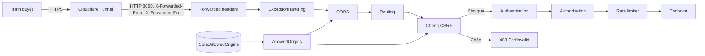
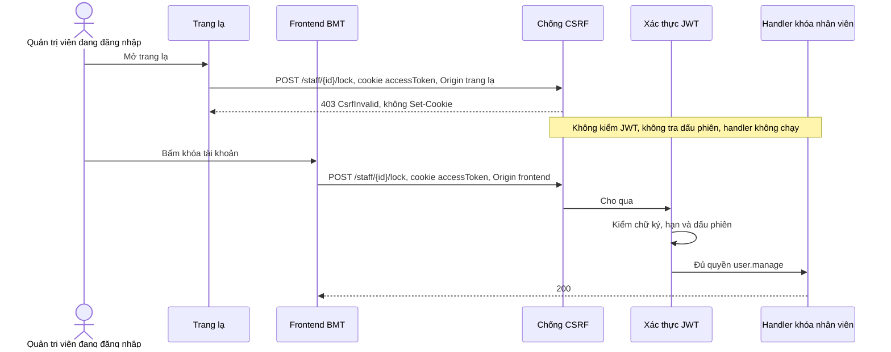
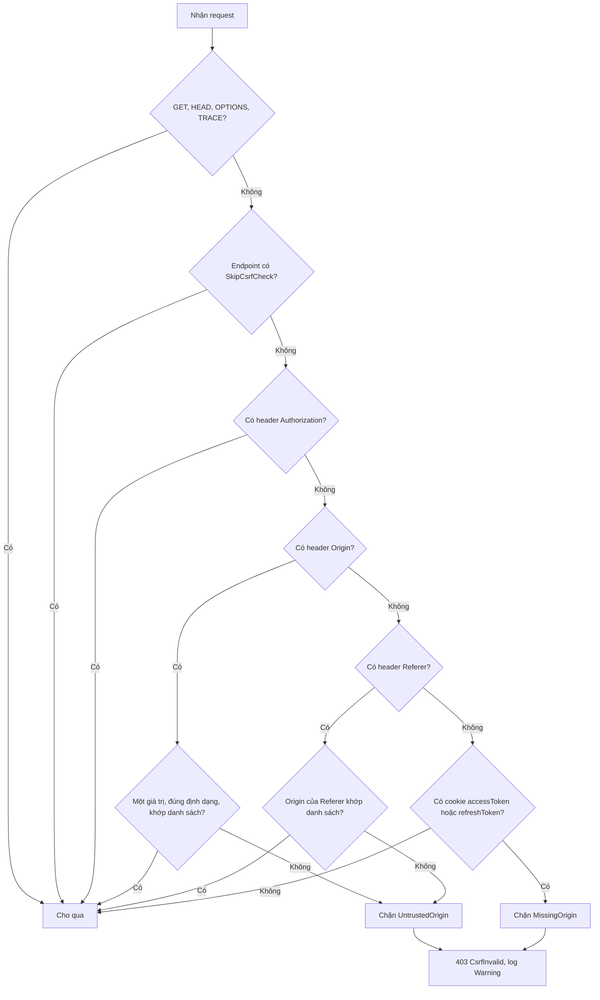
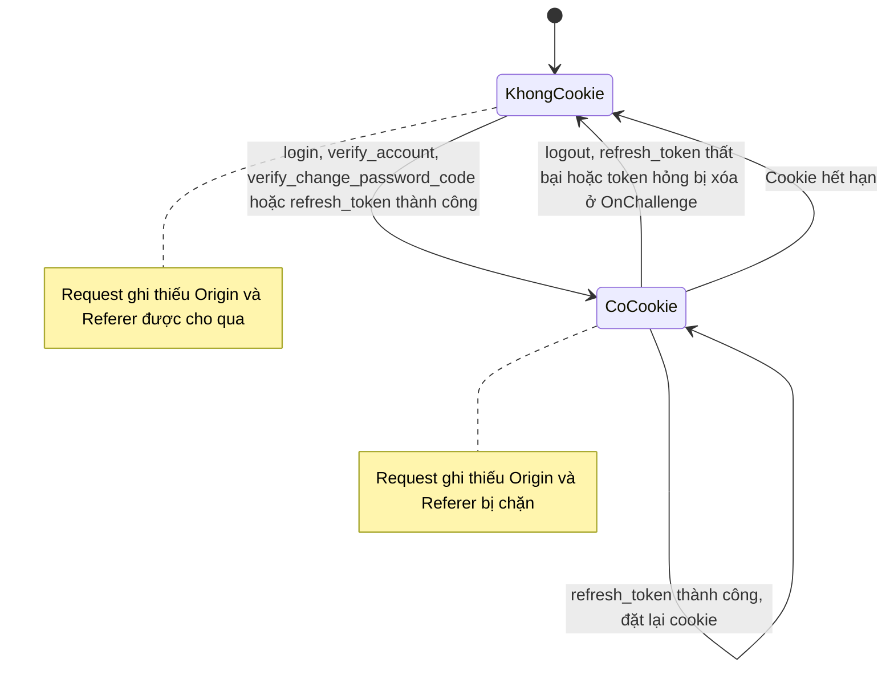

<!-- HƯỚNG DẪN CHO AI KHI ĐIỀN HOẶC CHỈNH SỬA MẪU
- Đọc toàn bộ mẫu, các comment hướng dẫn và tài liệu nguồn được cung cấp trước khi viết. Tuân thủ các quy tắc nghiệp vụ, điều kiện, ngoại lệ và giới hạn đã được xác nhận.
- Không bịa, tự chế hoặc suy đoán thành sự thật: yêu cầu, quy tắc, số liệu, API, schema, mã lỗi, nguồn tham khảo, người phụ trách và kết quả kiểm thử phải có căn cứ. Nội dung ví dụ trong mẫu không phải dữ kiện của dự án.
- Khi thiếu thông tin hoặc các nguồn mâu thuẫn, hỏi người dùng để làm rõ; giữ nguyên placeholder ở phần chưa xác định. Không tự chọn đáp án, lấp chỗ trống hay tuyên bố tài liệu đã hoàn tất.
- Chỉ thay nội dung cần điền hoặc được yêu cầu sửa. Không tự mở rộng phạm vi, sửa nghĩa quy tắc, bỏ điều kiện/ngoại lệ, xoá hay ghi đè nội dung hợp lệ đã có.
- Giữ nguyên tên, cấp và thứ tự heading, nhãn in đậm, tiền tố bullet, cấu trúc danh sách, tên/thứ tự/số cột bảng và cú pháp code fence. Không dịch, đổi tên, gộp hoặc thêm mục ngoài cấu trúc mẫu.
- Chỉ lặp khối luồng, AC hoặc API theo đúng khuôn khi có căn cứ; chỉ bỏ phần tuỳ chọn khi hướng dẫn riêng của mẫu cho phép và đã xác định không áp dụng.
- Mã tham chiếu và section phải trỏ tới tài liệu có thật đã được cung cấp hoặc kiểm chứng. Không giữ mã ví dụ như tham chiếu thật và không tự tạo tài liệu liên quan để hợp thức hoá liên kết.
- Giữ các comment hướng dẫn trong file. Xuất Markdown UTF-8, mỗi file một tài liệu; không bọc toàn bộ file trong code fence, không chèn lời dẫn hay giải thích ngoài mẫu.
- Trước khi bàn giao, đối chiếu nội dung với nguồn, kiểm tra cấu trúc, giá trị cho phép, giới hạn độ dài và tính nhất quán của mã/tham chiếu. Báo rõ phần chưa đủ thông tin; không tuyên bố đã chạy test hoặc import khi chưa thực hiện.
-->

<!-- Thay mã TDD-001 và nội dung ví dụ; giữ nguyên heading và nhãn in đậm.
Sơ đồ dùng mermaid, plantuml hoặc URL. Giữ heading Architecture, Sequence Diagram, Activity Diagram, State Diagram, Data Model.
Ví dụ API phải có heading trùng METHOD /path trong Endpoints. Xoá phần API/sơ đồ không dùng.
Version, Updated At và Change Log do lịch sử phiên bản quản lý, để trống khi nhập mới.
Author/Reviewer là tên hiển thị; gán tài khoản, phê duyệt, giả định và câu hỏi mở trên giao diện sau import.
Thiết kế phải truy vết về Story và Business Rule được cung cấp. Phân biệt thiết kế đề xuất với implementation đã kiểm chứng; không mô tả API/schema/sơ đồ ví dụ như hệ thống thật hoặc tự quyết định nghiệp vụ còn thiếu.
BẮT BUỘC KHI HOÀN THIỆN MẪU: phải có cả Reviewer và Approver, mỗi tên 1–200 ký tự sau khi bỏ khoảng trắng đầu/cuối. Không xoá hai dòng metadata, để trống, dùng tên bịa hoặc giữ placeholder rồi coi là hoàn tất.
Nếu chưa biết người review hoặc người phê duyệt, phải hỏi người dùng và báo tài liệu chưa đủ thông tin; không tự lấy Author/Owner làm người thay thế. Tên trong file không tự gán tài khoản hoặc xác nhận đã duyệt; gán thành viên trên giao diện sau import.
Đây là yêu cầu hoàn thiện mẫu; backend hiện vẫn nhận file cũ thiếu hai trường để tương thích.

VALIDATION CHO FILE NHẬP (đối chiếu ImportSnapshotValidator, MarkdownParser và ImportService):
- Mỗi file .md UTF-8 không rỗng chỉ có một heading cấp 1 chứa mã tài liệu dài 1–100 ký tự. Mã không được trùng trong cùng lần nhập hoặc thuộc loại tài liệu khác đã tồn tại.
- Không dùng tên README.md hoặc sitemap.md vì importer bỏ qua. Giao diện nhận .md/.zip, tối đa 2.000 file, tổng file tải lên 31 MiB; API giới hạn request 32 MiB và tổng nội dung đọc/giải nén 64 MiB.
- Chỉ nhập đè tài liệu cùng loại đang Draft, chưa có phiên bản và chưa lưu trữ. Import thay toàn bộ nội dung bản nháp, vì vậy phải giữ lại nội dung hợp lệ ngoài phần được yêu cầu sửa.
- Không dùng Status trong Markdown hoặc tên Approver để tự xác nhận phê duyệt; import không cấp quyền hay gán tài khoản từ tên. Chạy Kiểm tra file và xử lý lỗi/cảnh báo trước khi nhập.
- Giới hạn độ dài bên dưới tính theo string.Length của .NET (đơn vị UTF-16); không tự cắt ngắn dữ kiện quan trọng để vượt validation, hãy viết lại có căn cứ hoặc hỏi người dùng.
- Feature tối đa 300 ký tự và được dùng làm tiêu đề tài liệu. Status được parser nhận: Draft / In Review / Approved / Deprecated; tài liệu nhập mới vẫn có trạng thái phê duyệt Draft.
- Endpoint: đường dẫn tối đa 500 ký tự; tên/mô tả endpoint được lưu trong Name tối đa 300. HTTP method: GET / POST / PUT / PATCH / DELETE / HEAD / OPTIONS.
- Error Codes: mã tối đa 100 ký tự, không trùng trong tài liệu; giữ dạng - **CODE** (400): mô tả. HTTP status trong Error Codes và Response phải là số nguyên đọc được bằng Int32; không tự đặt status khác hợp đồng API.
- URL sơ đồ tối đa 1.000 ký tự. Mục sơ đồ được sử dụng phải có khối mermaid/plantuml hoặc URL theo mẫu; không để một mục sơ đồ rỗng. Nhãn mục được tách từ bullet như tên External API Fields tối đa 300 ký tự.
- Heading Examples phải khớp METHOD /path ở Endpoints. Giữ các nhãn Request:, Response 200: (thay mã theo contract) và Error Response: để parser tách đúng dữ liệu.
- Tham chiếu dạng DOC-KEY/section: ghi chú: mã đích tối đa 100 ký tự, section tối đa 100, ghi chú tối đa 1.000. Không trùng bộ mã đích + section + loại liên kết trong cùng tài liệu.
ĐỐI CHIẾU FORM TDD (src/features/tdds/validations.ts; form có thể chặt hơn import):
- Điền Feature, Author, Reviewer, Problem và ít nhất một Goal; các Goal/Non-goal/Notes đã thêm không được rỗng. API đã khai báo phải có endpoint và mô tả/mục đích; Fields phải có tên và ý nghĩa; Error Codes phải có mã, HTTP status và điều kiện.
- Form còn kiểm tra Version, Updated At và nội dung Change Log khi khai báo; với file nhập mới, giữ các trường lịch sử này trống theo hợp đồng import, không tự tạo dữ liệu lịch sử.
-->

# TDD-AUTH-001

## Document Info

- **Feature**: Chống CSRF cho request ghi dữ liệu bằng kiểm Origin, cờ cookie phiên và forwarded headers
- **Author**: Claude
- **Reviewer**: Tân Trần
- **Approver**: Tân Trần
- **Status**: Draft
- **Version**:
- **Updated At**:

## Context & Goals

### Problem

Backend lấy access token từ cookie `accessToken` khi request không có header `Authorization` (`src/bmt-be.api/dependencyInjection/extensions/JwtExtensions.cs`, `OnMessageReceived`). Vì vậy khi người dùng đang đăng nhập BMT mở một trang khác, trang đó có thể tự gửi request ghi dữ liệu tới API và trình duyệt gửi kèm cookie phiên. Backend coi request đó như do chính người dùng gửi. Kiểu tấn công này gọi là CSRF (giả mạo request từ trang khác). Trang lạ không đọc được phản hồi, nhưng thao tác ghi đã xảy ra.

CORS không ngăn được việc này. CORS chỉ quyết định trang lạ có được **đọc** phản hồi hay không. Với "request đơn giản" (POST từ form hoặc `fetch` không có header tùy chỉnh), trình duyệt gửi đi luôn mà không hỏi trước (preflight).

Trước thay đổi này, code chưa có lớp chống CSRF nào. Hầu hết endpoint ghi được che chắn tình cờ vì chỉ nhận body JSON, nhưng 5 endpoint không cần body vẫn gửi giả được: `POST /api/v1/staff/{userId}/lock`, `.../unlock`, `.../force-logout`, `POST /api/v1/users/logout` và `POST /api/v1/users/refresh_token`. Tài liệu các module lại mô tả ba cơ chế khác nhau (antiforgery token với header `X-CSRF-Token`, header tùy chỉnh `X-BMT-Request`, chỉ kiểm Origin) với ba mã lỗi (`CsrfInvalid`, `CsrfRejected`, `ConsultationOriginRejected`) cho cùng một việc nền tảng.

Cờ cookie cũng có vấn đề. API nghe `http://+:8080` sau Cloudflare Tunnel (`.docker/compose.yaml`) và chưa bật forwarded headers, nên `Request.IsHttps` luôn là `false` trên môi trường đã triển khai. Code cũ suy cờ từ `IsHttps`, nên cookie thực tế là `Secure=false`, `SameSite=Lax`. Frontend chạy khác site với API, nên với `Lax` trình duyệt không gửi cookie kèm request ghi từ frontend.

Người dùng xác nhận ngày 26/09/2026 (phân tích và so sánh phương án nằm ở [ghi chú nợ kỹ thuật](../debt/csrf-protection.md)):

1. Dùng một middleware kiểm `Origin` (không có thì dùng `Referer`) theo danh sách origin được phép, cho mọi request ghi. Request có header `Authorization` được cho qua. Chỉ miễn kiểm webhook SePay, bằng metadata `.SkipCsrfCheck()`, và có test liệt kê endpoint được miễn. Bị chặn trả 403 `CsrfInvalid` theo dạng thân lỗi hiện có, không xóa cookie, ghi log Warning không chứa cookie hay token.
2. Request ghi mang cookie phiên (`accessToken` hoặc `refreshToken`) mà không có cả `Origin` lẫn `Referer` thì chặn. Không có cookie thì cho qua. Có `Origin` nhưng không khớp, hoặc là chuỗi `null`, thì chặn.
3. Frontend chạy khác site với API. Cookie phiên là `SameSite=None; Secure` ở mọi môi trường ngoài Development; SameSite đọc từ cấu hình, mặc định `None`.
4. Bật forwarded headers, chỉ tin proxy hoặc mạng đã cấu hình qua biến môi trường. Cờ cookie và middleware nằm trong cùng một thay đổi.
5. Danh sách origin đọc và chuẩn hóa `Cors:AllowedOrigins` ở một chỗ, dùng chung cho CORS và middleware. `http://localhost:3000` chỉ tự thêm ở Development. Cấu hình sai (có `*`, có đường dẫn, sai định dạng) thì từ chối khởi động.
6. Bật chặn ngay ở mọi môi trường, không có chế độ chỉ ghi log.
7. Tài liệu thống nhất về kiểm Origin: bỏ `X-CSRF-Token`, endpoint `GET /api/v1/antiforgery/token` và header `X-BMT-Request`; dùng một mã lỗi chung `CsrfInvalid`. Thiết kế chính thức nằm ở tài liệu này; TDD tính năng chỉ dẫn tới đây.

**Hiện trạng code:** thiết kế này đã có trong code ở commit `50ed2f3` trên nhánh `feature/csrf-protection` của `bmt-be`, tách từ `develop` tại `388a426`, chưa merge. Chưa kiểm trên môi trường đã triển khai; các biến cấu hình cần đặt nằm ở Architecture/Notes.

### Goals

- Mọi request ghi dữ liệu (method khác `GET`, `HEAD`, `OPTIONS`, `TRACE`) từ origin ngoài danh sách bị chặn với 403 `CsrfInvalid` trước bước xác thực, kể cả 5 endpoint không có body.
- Request bị chặn không chạy handler, không tra dấu phiên và không xóa cookie của người dùng.
- CORS và lớp chống CSRF dùng đúng một danh sách origin; cấu hình sai làm ứng dụng từ chối khởi động.
- Cookie phiên dùng được với frontend khác site: `SameSite=None; Secure` ngoài Development.
- Frontend chạy trên trình duyệt, client dùng Bearer và webhook SePay không phải sửa gì.

### Non-goals

- Không dùng antiforgery token của ASP.NET Core, header `X-CSRF-Token`, endpoint cấp token hay header tùy chỉnh `X-BMT-Request`.
- Không có chế độ chỉ ghi log (ReportOnly).
- Không chống XSS. Mã độc chạy trên chính origin được phép vẫn gửi được request hợp lệ; đó là việc của lớp khác.
- Không tự thêm origin của chính API vào danh sách cho Swagger; môi trường có Swagger phải tự khai báo.
- Không đổi thiết kế bộ giới hạn tần suất; ảnh hưởng gián tiếp của forwarded headers lên bộ này ghi ở Architecture/Notes.

## Architecture

Lớp chống CSRF là một middleware dùng chung cho toàn API, không gắn vào từng endpoint. Ý tưởng: trình duyệt hiện đại luôn gửi header `Origin` với request ghi khác origin (và cả POST cùng origin), và trang lạ không giả được header này. Backend chỉ cần so `Origin` với danh sách frontend được phép. Hệ thống chỉ có API trả JSON, không có trang HTML do server render, nên kiểm Origin là đủ tin cậy cho mô hình này.

| Thành phần | Vị trí | Trách nhiệm |
|---|---|---|
| `AllowedOrigins` | `src/bmt-be.api/security/AllowedOrigins.cs` | Đọc `Cors:AllowedOrigins`, chuẩn hóa và kiểm cấu hình; cộng `http://localhost:3000` khi là Development. Đăng ký singleton để CORS và middleware dùng chung. |
| `CsrfOriginPolicy` | `src/bmt-be.api/security/CsrfOriginPolicy.cs` | Lớp thuần, không phụ thuộc `HttpContext`: nhận method, cờ miễn trừ, có `Authorization` hay không, `Origin`, `Referer`, có cookie phiên hay không; trả kết luận cho qua hoặc lý do chặn. |
| `CsrfOriginProtectionMiddleware` | `src/bmt-be.api/middlewares/CsrfOriginProtectionMiddleware.cs` | Lấy dữ liệu từ request, gọi `CsrfOriginPolicy`, tự ghi phản hồi 403 và log khi chặn. |
| `SkipCsrfCheckMetadata`, `.SkipCsrfCheck()` | `src/bmt-be.presentation/abstractions/SkipCsrfCheck.cs` | Đánh dấu endpoint được miễn kiểm. |
| `AuthCookieHelper.BuildCookieOptions`, `AuthCookieOption` | `src/bmt-be.presentation/abstractions/AuthCookieHelper.cs` | Cờ `Secure` và `SameSite` của cookie phiên theo môi trường và cấu hình. |
| `RequestProtectionExtensions` | `src/bmt-be.api/dependencyInjection/extensions/RequestProtectionExtensions.cs` | Đăng ký forwarded headers, `AuthCookieOption`, `CsrfOriginPolicy`; hàm `UseApiPipeline` giữ thứ tự middleware để `Program.cs` và test qua pipeline dùng chung. |
| `ServiceCollectionExtensions.ConfigureCors` | `src/bmt-be.api/dependencyInjection/extensions/ServiceCollectionExtensions.cs` | Dựng CORS policy từ `AllowedOrigins`. |



### Quy tắc quyết định

Middleware xét theo thứ tự dưới đây; gặp bước nào có kết luận thì dừng ở bước đó.

1. Method là `GET`, `HEAD`, `OPTIONS` hoặc `TRACE` → cho qua. Hệ quả: endpoint `GET` không được thay đổi dữ liệu. Code hiện tại đã theo quy ước này.
2. Endpoint có metadata `SkipCsrfCheckMetadata` → cho qua.
3. Header `Authorization` có giá trị → cho qua. Trang lạ không tự đặt được header này nếu không qua preflight, và khi có header thì backend không dùng cookie (`OnMessageReceived` chỉ đọc cookie khi thiếu `Authorization`).
4. Lấy origin của request: dùng `Origin` nếu có; không có thì lấy phần `scheme://host[:port]` của `Referer`.
5. Có origin:
   - Khớp danh sách → cho qua.
   - Không khớp, là chuỗi `null`, sai định dạng, hoặc có nhiều header `Origin` → **chặn**, lý do `UntrustedOrigin`. Quy tắc này áp cả khi không có cookie, để chặn đăng nhập giả mạo (login CSRF: trang lạ đăng nhập nạn nhân vào tài khoản của kẻ tấn công) và việc lợi dụng trình duyệt người khác gọi `resend_verify_account_code`.
6. Không có origin:
   - Request mang cookie `accessToken` hoặc `refreshToken` (chỉ xét tên cookie có mặt) → **chặn**, lý do `MissingOrigin`.
   - Không mang cookie → cho qua. Đây là client không phải trình duyệt và không có phiên để lợi dụng.

Ví dụ với danh sách `https://app.example.test`:

| Request | Kết luận |
|---|---|
| `POST /api/v1/staff/{id}/lock`, cookie `accessToken`, `Origin: https://app.example.test` | Cho qua, đi tiếp tới xác thực |
| Cùng request, `Origin: https://evil.example.org` | Chặn `UntrustedOrigin` |
| `POST /api/v1/users/logout`, cookie, không `Origin`, không `Referer` | Chặn `MissingOrigin` |
| `POST /api/v1/users/logout`, cookie, không `Origin`, `Referer: https://app.example.test/tai-khoan` | Cho qua |
| `POST /api/v1/users/login`, không cookie, `Origin: https://evil.example.org` | Chặn `UntrustedOrigin` |
| `POST /api/v1/users/login` từ script, không cookie, không `Origin` | Cho qua |
| `POST /api/v1/staff/{id}/lock`, `Authorization: Bearer ...`, `Origin` lạ | Cho qua; bước xác thực quyết định |
| `POST /api/v1/payment-webhooks/sepay/{connectionId}`, không `Origin` hoặc `Origin` lạ | Cho qua (miễn trừ); đi tới bước kiểm HMAC |

### So khớp origin

So chính xác scheme, host và port, không so theo tiền tố hay hậu tố: `https://app.example.test.evil.test` không khớp `https://app.example.test`. Trước khi so, cả mục cấu hình lẫn giá trị trong request được chuẩn hóa: chữ thường cho scheme và host, bỏ port mặc định (`:443` với https, `:80` với http), bỏ một dấu `/` cuối. Chỉ nhận scheme `http` và `https`; từ chối giá trị có đường dẫn khác `/`, có query, fragment hoặc thông tin đăng nhập (`user@host`).

### Danh sách origin được phép

- Đọc từ `Cors:AllowedOrigins` (biến môi trường `Cors__AllowedOrigins`, trong compose là `CORS_ALLOWED_ORIGINS`), các origin cách nhau bằng dấu phẩy.
- `http://localhost:3000` chỉ được cộng sẵn khi `ASPNETCORE_ENVIRONMENT=Development`. Trước thay đổi này, origin này được cho phép ở mọi môi trường.
- Mục có `*`, có đường dẫn, có query hoặc sai định dạng làm ứng dụng ném `InvalidOperationException` lúc đăng ký dịch vụ, tức là từ chối khởi động. Code cũ lặng lẽ bỏ `*`.
- CORS dùng `WithOrigins` với đúng danh sách đã chuẩn hóa, vẫn `AllowCredentials`, `AllowAnyHeader`, `AllowAnyMethod` như cũ.
- Môi trường có Swagger (Development, Staging) phải thêm origin công khai của chính API vào danh sách. Nếu không, lệnh ghi trên Swagger dùng cookie bị chặn; dùng nút Authorize (Bearer) thì không bị kiểm.

### Vị trí trong pipeline

Thứ tự nằm trong `UseApiPipeline` và `Program.cs` gọi hàm này:

```
UseForwardedHeaders → ExceptionHandling → Swagger (Development/Staging) → UseCors → RequestLocalization
  → UseRouting → CsrfOriginProtectionMiddleware → UseAuthentication → UseAuthorization → UseRateLimiter → MapCarter
```

- Forwarded headers đứng đầu để mọi bước sau thấy đúng scheme.
- Sau `UseRouting` để đọc được metadata miễn trừ của endpoint.
- Sau `UseCors`, nên preflight `OPTIONS` vẫn do CORS trả 204 như cũ; middleware không xét `OPTIONS`.
- Trước `UseAuthentication`, nên request giả bị chặn trước khi backend kiểm JWT và tra dấu phiên (`ISecurityStampValidator`). Việc này cũng tránh nhánh `OnChallenge` xóa cookie của người dùng khi request giả mang token hỏng.

### Phản hồi khi bị chặn

- HTTP 403, `Content-Type: application/json`, không có `Set-Cookie`, không gọi handler.
- Thân lỗi cùng dạng với `JwtExtensions` và `ExceptionHandlingMiddleware`: `{title, code, status, detail, messageCode, errors}`, với `code` và `messageCode` đều là `CsrfInvalid` (hằng `CommonErrorCodes.CsrfInvalid`). Frontend chỉ cần biết mã, không cần biết lý do chi tiết.
- Middleware tự ghi phản hồi, không ném ngoại lệ, để `ExceptionHandlingMiddleware` không ghi log mức Error cho mỗi request bị chặn. Không gửi cảnh báo Discord, vì hiện chỉ lỗi 500 được gửi.
- Log mức Warning gồm method, route pattern (không có endpoint thì dùng đường dẫn), lý do (`UntrustedOrigin` hoặc `MissingOrigin`), giá trị `Origin`/`Referer` cắt tối đa 200 ký tự, và request có cookie phiên hay không. **Không** ghi giá trị cookie hay token.

### Danh sách miễn trừ

| Endpoint | Lý do |
|---|---|
| `POST /api/v1/payment-webhooks/sepay/{connectionId}` | Máy chủ SePay gọi, không có cookie hay Origin; nguồn gọi được xác thực bằng HMAC ([TDD-PAY-001](TDD-PAY-001.md)). |

Chỉ miễn bằng metadata gắn trên từng endpoint, không miễn theo tiền tố đường dẫn. Test `CsrfPipelineTests.ExemptEndpoints_OnlySePayWebhook` liệt kê mọi endpoint có metadata miễn trừ và so với bảng trên; thêm miễn trừ mới phải sửa cả bảng này và test. Kể cả khi quên gắn metadata, webhook vẫn đi qua theo bước 6 (không cookie, không Origin); metadata giữ cho ý định được ghi rõ trong code.

### Cờ cookie phiên

`AuthCookieHelper.BuildCookieOptions` áp cho cả `accessToken` và `refreshToken`, khi đặt lẫn khi xóa:

| Môi trường | Request | `Secure` | `SameSite` |
|---|---|---|---|
| Khác Development | Bất kỳ | `true` | Theo `AuthCookieOption:SameSite`, mặc định `None` |
| Development | HTTPS, kể cả HTTPS do proxy tin cậy báo qua `X-Forwarded-Proto` | `true` | Theo cấu hình, mặc định `None` |
| Development | HTTP | `false` | `None` hạ xuống `Lax`, vì trình duyệt bỏ cookie `None` không có `Secure`; `Lax`/`Strict` giữ nguyên |

`HttpOnly`, `Path=/`, `IsEssential` giữ như cũ. `AuthCookieOption:SameSite` chỉ nhận `None`, `Lax`, `Strict`; giá trị khác làm ứng dụng từ chối khởi động. Vì cookie phiên là `SameSite=None`, trình duyệt gửi cookie kèm request từ mọi trang, nên lớp kiểm Origin là bắt buộc chứ không phải lớp phòng thủ thêm.

### Forwarded headers

API nghe HTTP sau Cloudflare Tunnel. Để `Request.IsHttps` phản ánh HTTPS phía trình duyệt, `UseForwardedHeaders` nhận `X-Forwarded-Proto` và `X-Forwarded-For`, nhưng chỉ khi kết nối đến từ proxy tin cậy:

- `ForwardedHeadersOption:KnownNetworks`: dải CIDR, cách nhau bằng dấu phẩy, ví dụ dải mạng Docker mà container `cloudflared` dùng để gọi API.
- `ForwardedHeadersOption:KnownProxies`: địa chỉ IP, cách nhau bằng dấu phẩy.
- Có cấu hình thì danh sách mặc định (loopback) bị thay hẳn. Không cấu hình gì thì giữ mặc định loopback của ASP.NET Core; khi đó header từ mạng Docker bị bỏ qua và API coi mọi request là HTTP.
- Mục sai định dạng làm ứng dụng từ chối khởi động.
- Không dùng biến `ASPNETCORE_FORWARDEDHEADERS_ENABLED`, vì biến này xóa trắng danh sách proxy tin cậy và tin header của bất kỳ ai.

**Notes**:
- **Phải bật cả `X-Forwarded-For`, khác với yêu cầu ban đầu chỉ cần scheme.** `ForwardedHeadersMiddleware` của ASP.NET Core 8 chỉ so địa chỉ kết nối với danh sách proxy tin cậy trong nhánh xử lý `X-Forwarded-For`. Nếu chỉ bật `X-Forwarded-Proto`, bất kỳ ai cũng tự báo được HTTPS; test `AuthCookieFlagsTests.Development_HttpsForwardedByUntrustedSource_Ignored` đã hỏng đúng theo cách này trước khi bật thêm `X-Forwarded-For`. Hệ quả: sau proxy tin cậy, `RemoteIpAddress` là IP của khách do Cloudflare ghi vào `X-Forwarded-For` (lấy giá trị cuối, `ForwardLimit = 1`) thay vì IP của tunnel. Bộ giới hạn tần suất (`ConfigureRateLimiter`), vốn chia ngăn theo `RemoteIpAddress` khi chưa đăng nhập, sẽ chia theo từng khách thay vì dồn mọi người vào một ngăn. Chỉ xảy ra khi đã cấu hình proxy tin cậy.
- **Cấu hình cần đặt trên mỗi môi trường** (tên biến trong `.docker/.env.sample` và secret của workflow `deploy-application.yaml`):
  - `CORS_ALLOWED_ORIGINS`: origin thật của frontend; môi trường có Swagger thêm origin công khai của API. Không để `*` hay đường dẫn, nếu không API không khởi động. Môi trường khác Development không còn tự có `http://localhost:3000`.
  - `FORWARDED_HEADERS_KNOWN_NETWORKS` hoặc `FORWARDED_HEADERS_KNOWN_PROXIES`: dải hoặc IP của `cloudflared` nhìn từ container API. Stack dev nhận tunnel qua mạng `document-first-network-dev`, stack prod qua `bmt-network-prod`; hai mạng không cố định dải IP trong compose, nên cần xem bằng `docker network inspect`. Bắt buộc với môi trường chạy `Development` sau tunnel; nếu thiếu, cookie ở môi trường đó là `Secure=false`, `SameSite=Lax` và frontend khác site không gửi được cookie. Môi trường khác Development vẫn có cookie đúng cờ khi thiếu biến này.
  - `AUTH_COOKIE_SAME_SITE`: bỏ trống để dùng `None`.
- Frontend web gọi thẳng từ trình duyệt không phải sửa, miễn origin nằm trong danh sách; nên xử lý mã `CsrfInvalid` (403) bằng một thông báo chung. Tầng server của frontend (SSR) chuyển tiếp cookie tới API mà không gửi `Origin` sẽ bị chặn; phải gửi `Authorization: Bearer` hoặc đặt `Origin` đúng. Postman hay curl dùng cookie phải tự thêm `Origin`, hoặc dùng Bearer. Mobile và script dùng Bearer không bị ảnh hưởng.
- Lớp JSON-only (minimal API trả 415 với body không phải JSON) và header `Idempotency-Key` hiện có vẫn còn tác dụng, trở thành lớp phòng thủ thứ hai.
- Chặn không phụ thuộc SameSite. Nếu sau này đổi cookie sang `Lax`, lớp này vẫn giữ nguyên.

## Sequence Diagram

Request khóa nhân viên từ trang lạ, so với cùng request từ frontend được phép.



## Activity Diagram

Quy tắc quyết định của `CsrfOriginPolicy`.



## State Diagram

Lớp này không lưu trạng thái. Nhánh ở bước 6 phụ thuộc trình duyệt đang giữ cookie phiên hay không; sơ đồ dưới đây cho thấy khi nào trình duyệt có cookie đó.



## Data Model

Không thêm hay đổi bảng, cột hay migration. Dữ liệu mà thiết kế này dùng là cấu hình, đọc một lần lúc khởi động:

| Khóa cấu hình | Biến môi trường trong compose | Ý nghĩa | Mặc định |
|---|---|---|---|
| `Cors:AllowedOrigins` | `CORS_ALLOWED_ORIGINS` | Origin được phép, dùng chung cho CORS và chống CSRF | Rỗng; Development tự có `http://localhost:3000` |
| `ForwardedHeadersOption:KnownNetworks` | `FORWARDED_HEADERS_KNOWN_NETWORKS` | Dải CIDR của proxy được tin forwarded headers | Rỗng, giữ loopback của ASP.NET Core |
| `ForwardedHeadersOption:KnownProxies` | `FORWARDED_HEADERS_KNOWN_PROXIES` | IP của proxy được tin forwarded headers | Rỗng, giữ loopback của ASP.NET Core |
| `AuthCookieOption:SameSite` | `AUTH_COOKIE_SAME_SITE` | SameSite của cookie phiên | `None` |

Ví dụ cấu hình giả định cho một môi trường Staging: `CORS_ALLOWED_ORIGINS=https://app.example.test,https://api-staging.example.test`, `FORWARDED_HEADERS_KNOWN_NETWORKS=172.20.0.0/16`, `AUTH_COOKIE_SAME_SITE` bỏ trống. Kết quả: danh sách có hai origin (frontend và Swagger của API); request từ `https://app.example.test` được cho qua; cookie phiên là `Secure; SameSite=None`; request đến từ `cloudflared` trong dải `172.20.0.0/16` có `X-Forwarded-Proto: https` được coi là HTTPS. Các tên miền và dải IP trên chỉ minh họa.

**Notes**:
- Không có dữ liệu lưu trữ nên không có chiến lược migration. Đổi cấu hình cần khởi động lại API.

## Internal API

Lớp này không thêm endpoint. Nó áp cho mọi endpoint ghi hiện có và sắp có; hai endpoint dưới đây minh họa một endpoint bị kiểm và endpoint duy nhất được miễn.

### Endpoints

- **POST** `/api/v1/staff/{userId}/lock` — Ví dụ endpoint ghi không có body, bị kiểm Origin như mọi request ghi. Hợp đồng nghiệp vụ theo [TDD-RBAC-002](TDD-RBAC-002.md).
- **POST** `/api/v1/payment-webhooks/sepay/{connectionId}` — Endpoint duy nhất được miễn bằng `.SkipCsrfCheck()`; xác thực bằng HMAC theo [TDD-PAY-001](TDD-PAY-001.md).

### Examples

#### POST /api/v1/staff/{userId}/lock

```
Request:
Cookie: accessToken=<token của quản trị viên>
Origin: https://app.example.test

Response 200:
{"userId": "user-son", "status": "Locked", "sessionsRevoked": true, "activeAssignmentCount": 2}

Error Response:
{"title":"Forbidden","code":"CsrfInvalid","status":403,"detail":"Yêu cầu bị từ chối vì không đến từ trang được phép.","messageCode":"CsrfInvalid","errors":null}
```

`Response 200` là khi `Origin` nằm trong danh sách: request đi tiếp tới xác thực, phân quyền và handler; thân phản hồi lấy theo ví dụ của [TDD-RBAC-002](TDD-RBAC-002.md). `Error Response` là khi cùng request có `Origin: https://evil.example.org`, hoặc không có cả `Origin` lẫn `Referer`: phản hồi không có `Set-Cookie`, handler không chạy. Phản hồi thật mã hóa ký tự tiếng Việt trong `detail` theo dạng `\uXXXX` của `System.Text.Json`, giống thân lỗi hiện có của `JwtExtensions`.

#### POST /api/v1/payment-webhooks/sepay/{connectionId}

```
Request:
X-SePay-Timestamp: 1790000000
X-SePay-Signature: sha256=<chữ ký HMAC>
{"id":1}

Response 200:
{"success":true}

Error Response:
{"success":false,"message":"Invalid signature"}
```

Không có `Origin` hay có `Origin` lạ đều không bị trả `CsrfInvalid`; request đi tới bước kiểm HMAC của webhook. Chữ ký sai thì trả 401 như `Error Response`; hợp đồng đầy đủ ở [TDD-PAY-001](TDD-PAY-001.md).

### Error Codes

- **CsrfInvalid** (403): Request ghi dữ liệu có `Origin` (hoặc `Referer`) không nằm trong danh sách được phép, là chuỗi `null` hay sai định dạng; hoặc mang cookie `accessToken`/`refreshToken` mà không có cả `Origin` lẫn `Referer`. Không áp cho request có header `Authorization` và endpoint được miễn.

## External API

### Endpoints

- **Cloudflare Tunnel (`cloudflared`)** — Nhận HTTPS từ trình duyệt và chuyển tới API qua HTTP cổng 8080 trong mạng Docker, kèm `X-Forwarded-Proto` và `X-Forwarded-For`.

### Fields

- **X-Forwarded-Proto** — Scheme phía trình duyệt. Chỉ được dùng khi kết nối đến từ proxy trong `ForwardedHeadersOption:KnownNetworks`/`KnownProxies`.
- **X-Forwarded-For** — IP phía khách. Bật cùng `X-Forwarded-Proto` để ASP.NET Core kiểm proxy tin cậy; lấy giá trị cuối cùng.

### Error Handling

Header từ nguồn không tin cậy bị bỏ qua, không làm request lỗi. Cấu hình danh sách proxy sai định dạng làm API từ chối khởi động.

### Quirks

- `ForwardedHeadersMiddleware` của ASP.NET Core 8 chỉ kiểm proxy tin cậy trong nhánh `X-Forwarded-For`; chỉ bật `X-Forwarded-Proto` là tin mọi nguồn.
- Để trống cả hai danh sách proxy tin cậy (như khi đặt `ASPNETCORE_FORWARDEDHEADERS_ENABLED=true`) nghĩa là tin mọi nguồn; code không bao giờ để hai danh sách cùng rỗng.
- Hai mạng Docker của compose không cố định dải IP, nên dải phải đọc từ máy chủ và cập nhật nếu mạng được tạo lại.

## References

### User Stories

### Business Rules

### Use Cases

### Others

- Không có User Story, Business Rule hay System Test nào về CSRF: đây là yêu cầu kỹ thuật nền tảng, người dùng xác nhận thiết kế ngày 26/09/2026.
- Tài liệu kỹ thuật: [debt/csrf-protection.md](../debt/csrf-protection.md), phân tích hiện trạng và so sánh phương án trước khi chốt.
- Tài liệu kỹ thuật dẫn tới thiết kế này cho các thao tác ghi dùng cookie: [TDD-PROJ-001](TDD-PROJ-001.md), [TDD-PROJ-002](TDD-PROJ-002.md), [TDD-PROJ-003](TDD-PROJ-003.md), [TDD-NEWS-001](TDD-NEWS-001.md), [TDD-NEWS-002](TDD-NEWS-002.md), [TDD-CONSULT-001](TDD-CONSULT-001.md), [TDD-LIB-001](TDD-LIB-001.md), [TDD-LIB-002](TDD-LIB-002.md), [TDD-SUB-002](TDD-SUB-002.md), [TDD-SUB-005](TDD-SUB-005.md). Webhook được miễn: [TDD-PAY-001](TDD-PAY-001.md). Xác thực JWT, dấu phiên và mã lỗi 401: [TDD-RBAC-001](TDD-RBAC-001.md).
- Mã test ở `test/bmt-be.api.tests/security/`: `CsrfOriginPolicyTests` và `AllowedOriginsTests` kiểm quy tắc quyết định và cấu hình; `CsrfPipelineTests` và `AuthCookieFlagsTests` chạy qua TestServer với đúng `UseApiPipeline` và các Carter module thật (MediatR, bộ kiểm dấu phiên và bộ đọc webhook là bản giả). Chưa có đặc tả Unit Test riêng cho tài liệu này.
- OWASP, [Cross-Site Request Forgery Prevention Cheat Sheet](https://cheatsheetseries.owasp.org/cheatsheets/Cross-Site_Request_Forgery_Prevention_Cheat_Sheet.html): kiểm Origin/Referer.
- Microsoft, [Configure ASP.NET Core to work with proxy servers and load balancers](https://learn.microsoft.com/en-us/aspnet/core/host-and-deploy/proxy-load-balancer?view=aspnetcore-8.0): forwarded headers và danh sách proxy tin cậy.
- MDN, [CORS: simple requests](https://developer.mozilla.org/en-US/docs/Web/HTTP/CORS#simple_requests): điều kiện trình duyệt gửi request mà không preflight.

## Change Log
