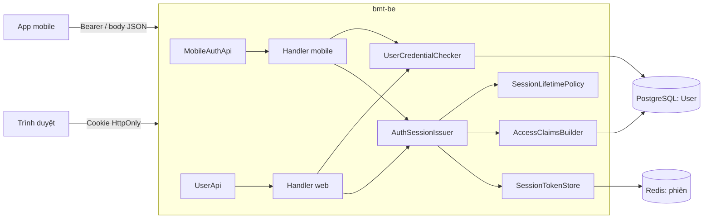
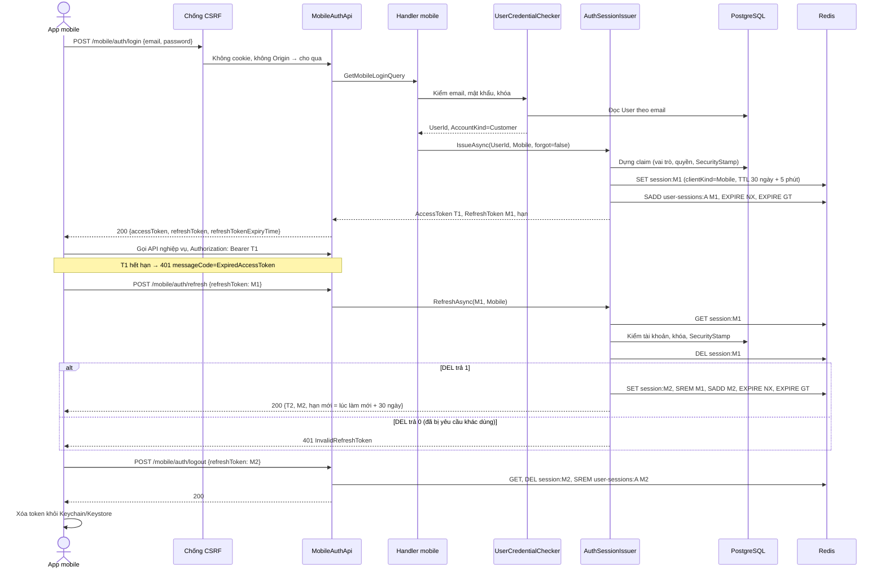
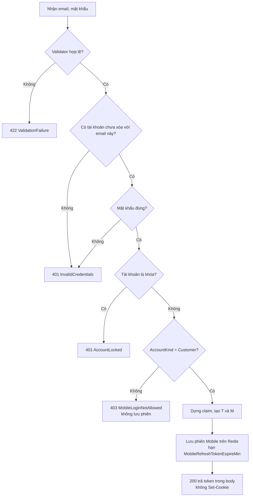
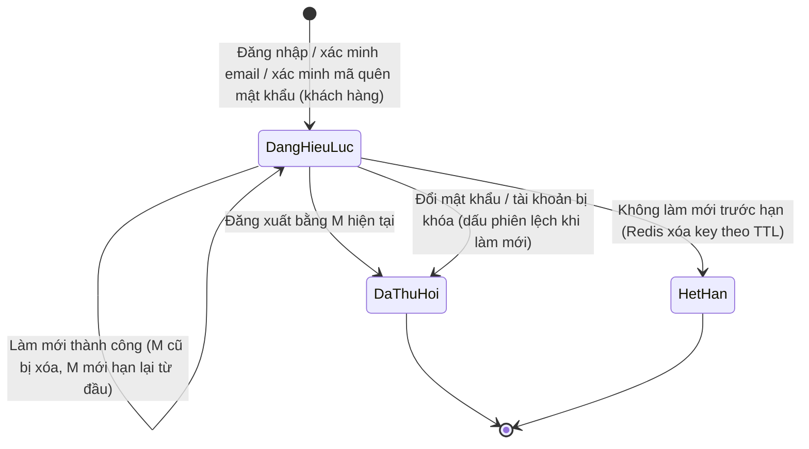
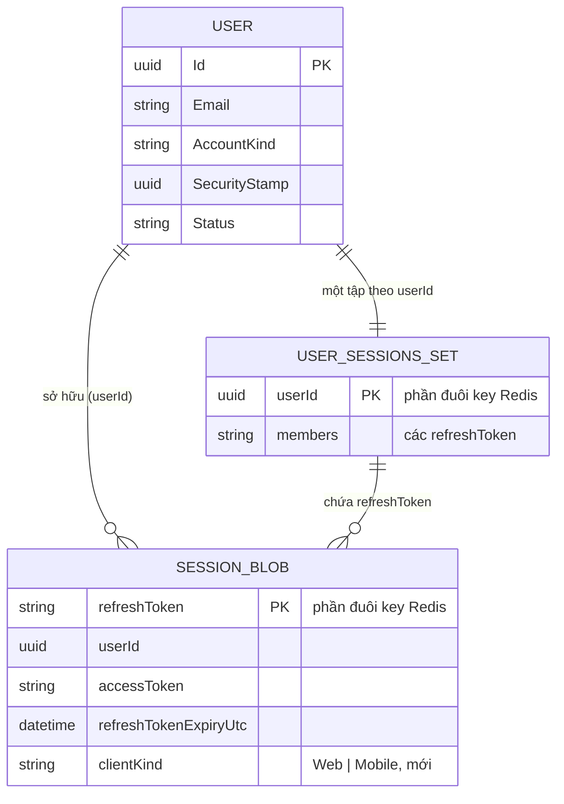

<!-- HƯỚNG DẪN CHO AI KHI ĐIỀN HOẶC CHỈNH SỬA MẪU
- Đọc toàn bộ mẫu, các comment hướng dẫn và tài liệu nguồn được cung cấp trước khi viết. Tuân thủ các quy tắc nghiệp vụ, điều kiện, ngoại lệ và giới hạn đã được xác nhận.
- Không bịa, tự chế hoặc suy đoán thành sự thật: yêu cầu, quy tắc, số liệu, API, schema, mã lỗi, nguồn tham khảo, người phụ trách và kết quả kiểm thử phải có căn cứ. Nội dung ví dụ trong mẫu không phải dữ kiện của dự án.
- Khi thiếu thông tin hoặc các nguồn mâu thuẫn, hỏi người dùng để làm rõ; giữ nguyên placeholder ở phần chưa xác định. Không tự chọn đáp án, lấp chỗ trống hay tuyên bố tài liệu đã hoàn tất.
- Chỉ thay nội dung cần điền hoặc được yêu cầu sửa. Không tự mở rộng phạm vi, sửa nghĩa quy tắc, bỏ điều kiện/ngoại lệ, xoá hay ghi đè nội dung hợp lệ đã có.
- Giữ nguyên tên, cấp và thứ tự heading, nhãn in đậm, tiền tố bullet, cấu trúc danh sách, tên/thứ tự/số cột bảng và cú pháp code fence. Không dịch, đổi tên, gộp hoặc thêm mục ngoài cấu trúc mẫu.
- Chỉ lặp khối luồng, AC hoặc API theo đúng khuôn khi có căn cứ; chỉ bỏ phần tuỳ chọn khi hướng dẫn riêng của mẫu cho phép và đã xác định không áp dụng.
- Mã tham chiếu và section phải trỏ tới tài liệu có thật đã được cung cấp hoặc kiểm chứng. Không giữ mã ví dụ như tham chiếu thật và không tự tạo tài liệu liên quan để hợp thức hoá liên kết.
- Giữ các comment hướng dẫn trong file. Xuất Markdown UTF-8, mỗi file một tài liệu; không bọc toàn bộ file trong code fence, không chèn lời dẫn hay giải thích ngoài mẫu.
- Trước khi bàn giao, đối chiếu nội dung với nguồn, kiểm tra cấu trúc, giá trị cho phép, giới hạn độ dài và tính nhất quán của mã/tham chiếu. Báo rõ phần chưa đủ thông tin; không tuyên bố đã chạy test hoặc import khi chưa thực hiện.
-->

<!-- Thay mã TDD-001 và nội dung ví dụ; giữ nguyên heading và nhãn in đậm.
Sơ đồ dùng mermaid, plantuml hoặc URL. Giữ heading Architecture, Sequence Diagram, Activity Diagram, State Diagram, Data Model.
Ví dụ API phải có heading trùng METHOD /path trong Endpoints. Xoá phần API/sơ đồ không dùng.
Version, Updated At và Change Log do lịch sử phiên bản quản lý, để trống khi nhập mới.
Author/Reviewer là tên hiển thị; gán tài khoản, phê duyệt, giả định và câu hỏi mở trên giao diện sau import.
Thiết kế phải truy vết về Story và Business Rule được cung cấp. Phân biệt thiết kế đề xuất với implementation đã kiểm chứng; không mô tả API/schema/sơ đồ ví dụ như hệ thống thật hoặc tự quyết định nghiệp vụ còn thiếu.
BẮT BUỘC KHI HOÀN THIỆN MẪU: phải có cả Reviewer và Approver, mỗi tên 1–200 ký tự sau khi bỏ khoảng trắng đầu/cuối. Không xoá hai dòng metadata, để trống, dùng tên bịa hoặc giữ placeholder rồi coi là hoàn tất.
Nếu chưa biết người review hoặc người phê duyệt, phải hỏi người dùng và báo tài liệu chưa đủ thông tin; không tự lấy Author/Owner làm người thay thế. Tên trong file không tự gán tài khoản hoặc xác nhận đã duyệt; gán thành viên trên giao diện sau import.
Đây là yêu cầu hoàn thiện mẫu; backend hiện vẫn nhận file cũ thiếu hai trường để tương thích.

VALIDATION CHO FILE NHẬP (đối chiếu ImportSnapshotValidator, MarkdownParser và ImportService):
- Mỗi file .md UTF-8 không rỗng chỉ có một heading cấp 1 chứa mã tài liệu dài 1–100 ký tự. Mã không được trùng trong cùng lần nhập hoặc thuộc loại tài liệu khác đã tồn tại.
- Không dùng tên README.md hoặc sitemap.md vì importer bỏ qua. Giao diện nhận .md/.zip, tối đa 2.000 file, tổng file tải lên 31 MiB; API giới hạn request 32 MiB và tổng nội dung đọc/giải nén 64 MiB.
- Chỉ nhập đè tài liệu cùng loại đang Draft, chưa có phiên bản và chưa lưu trữ. Import thay toàn bộ nội dung bản nháp, vì vậy phải giữ lại nội dung hợp lệ ngoài phần được yêu cầu sửa.
- Không dùng Status trong Markdown hoặc tên Approver để tự xác nhận phê duyệt; import không cấp quyền hay gán tài khoản từ tên. Chạy Kiểm tra file và xử lý lỗi/cảnh báo trước khi nhập.
- Giới hạn độ dài bên dưới tính theo string.Length của .NET (đơn vị UTF-16); không tự cắt ngắn dữ kiện quan trọng để vượt validation, hãy viết lại có căn cứ hoặc hỏi người dùng.
- Feature tối đa 300 ký tự và được dùng làm tiêu đề tài liệu. Status được parser nhận: Draft / In Review / Approved / Deprecated; tài liệu nhập mới vẫn có trạng thái phê duyệt Draft.
- Endpoint: đường dẫn tối đa 500 ký tự; tên/mô tả endpoint được lưu trong Name tối đa 300. HTTP method: GET / POST / PUT / PATCH / DELETE / HEAD / OPTIONS.
- Error Codes: mã tối đa 100 ký tự, không trùng trong tài liệu; giữ dạng - **CODE** (400): mô tả. HTTP status trong Error Codes và Response phải là số nguyên đọc được bằng Int32; không tự đặt status khác hợp đồng API.
- URL sơ đồ tối đa 1.000 ký tự. Mục sơ đồ được sử dụng phải có khối mermaid/plantuml hoặc URL theo mẫu; không để một mục sơ đồ rỗng. Nhãn mục được tách từ bullet như tên External API Fields tối đa 300 ký tự.
- Heading Examples phải khớp METHOD /path ở Endpoints. Giữ các nhãn Request:, Response 200: (thay mã theo contract) và Error Response: để parser tách đúng dữ liệu.
- Tham chiếu dạng DOC-KEY/section: ghi chú: mã đích tối đa 100 ký tự, section tối đa 100, ghi chú tối đa 1.000. Không trùng bộ mã đích + section + loại liên kết trong cùng tài liệu.
ĐỐI CHIẾU FORM TDD (src/features/tdds/validations.ts; form có thể chặt hơn import):
- Điền Feature, Author, Reviewer, Problem và ít nhất một Goal; các Goal/Non-goal/Notes đã thêm không được rỗng. API đã khai báo phải có endpoint và mô tả/mục đích; Fields phải có tên và ý nghĩa; Error Codes phải có mã, HTTP status và điều kiện.
- Form còn kiểm tra Version, Updated At và nội dung Change Log khi khai báo; với file nhập mới, giữ các trường lịch sử này trống theo hợp đồng import, không tự tạo dữ liệu lịch sử.
-->

# TDD-AUTH-002

## Document Info

- **Feature**: Phiên đăng nhập cho app mobile bằng Bearer token, không dùng cookie
- **Author**: Claude
- **Reviewer**: Tân Trần
- **Approver**: Tân Trần
- **Status**: Draft
- **Version**:
- **Updated At**:

## Context & Goals

### Problem

App BMT trên Android và iOS không dùng cookie, nên cần nhận access token và refresh token trực tiếp trong phản hồi (STORY-AUTH-001). Backend đã đọc access token từ header `Authorization: Bearer` trước cookie (`src/bmt-be.api/dependencyInjection/extensions/JwtExtensions.cs`, `OnMessageReceived`). Lớp chống CSRF cũng cho qua request có header này (TDD-AUTH-001/Architecture). Vì vậy các API nghiệp vụ không cần sửa gì.

Phần còn thiếu nằm ở các chức năng cấp và kết thúc phiên trong `src/bmt-be.presentation/apis/user/UserApi.cs`:

- `login`, `verify_account` và `verify_change_password_code` gọi `AuthCookieHelper.RemoveTokenPayload`, nên phản hồi JSON không còn token.
- `refresh_token` nhận token trong body khi thiếu cookie, nhưng lại trả token mới qua cookie.
- `logout` chỉ đọc refresh token từ cookie.

Khảo sát code còn cho thấy ba điểm phải xử lý cùng thay đổi này:

1. **Thời hạn phiên chỉ có một giá trị.** Cả bốn handler cấp phiên (`GetLoginQueryHandler`, `AccountVerifyFirstTimeCommandHandler`, `VerifyForgotPasswordCodeCommandHandler`, `GetTokenQueryHandler`) cùng tính hạn refresh token từ `JwtOption.RefreshTokenExpireMin`. Phiên mobile cần hạn 30 ngày riêng (BR-AUTH-002/Then khoản 4). Phần cấp phiên đang được chép lặp ở cả bốn handler.
2. **Refresh token cũ có thể được dùng hai lần.** `GetTokenQueryHandler` đọc phiên, kiểm tra, rồi mới gọi `SessionTokenStore.RotateAsync` để xóa token cũ. Hai yêu cầu làm mới gửi cùng lúc với cùng một token đều qua được bước đọc, và cả hai đều nhận cặp token mới. Điều này trái BR-AUTH-002/Then khoản 4: refresh token cũ không dùng lại được. App mobile dễ gặp trường hợp này, vì khi access token hết hạn, nhiều request có thể cùng nhận 401 và cùng đi làm mới.
3. **Log đang ghi cả mật khẩu và token.** `TracingPipelineBehavior` ghi toàn bộ request ở mức Information cho mọi request đi qua MediatR (`{@Request}`); `PerformancePipelineBehavior` cũng ghi như vậy khi request chạy quá 5 giây. Vì vậy `GetLoginQuery`, `RegisterCommand` và `ChangePasswordCommand` bị ghi kèm mật khẩu, `GetTokenQuery` bị ghi kèm token, còn các lệnh xác minh bị ghi kèm mã. File log trong `src/bmt-be.api/logs/` của các ngày 09/04, 19/05 và 25/05/2026 đã có dòng chứa mật khẩu ở dạng chữ thường. Story yêu cầu backend không ghi token và mã xác minh vào log (STORY-AUTH-001/Non-Functional).

Khảo sát còn cho thấy đăng nhập web sai mật khẩu hiện trả HTTP 500 thay vì 401. Người dùng đã chốt cách xử lý cho mobile ngày 26/09/2026, ghi ở Architecture/Notes.

**Hiện trạng code:** thiết kế này đã được triển khai ngày 26/09/2026 trên nhánh `feature/mobile-auth` của `bmt-be` (tách từ `develop` ở commit `624e212`), commit `532ee6d`, và đã merge vào `develop` (đối chiếu ngày 28/09/2026). Build và toàn bộ test đều qua: application 1.169, infrastructure 144, API 294, integration 400 (chạy với Docker, gồm 3 test trên Redis thật), persistence 17, domain 1. Chưa chạy System Test ST-AUTH-* và chưa kiểm trên môi trường đã triển khai.

### Goals

- App đăng nhập, xác minh email, xác minh mã quên mật khẩu, làm mới phiên và đăng xuất qua nhóm endpoint `/api/v1/mobile/auth/*`. Token được trả và nhận trong body; nhóm này không đọc và không đặt cookie phiên.
- Phiên đăng nhập mobile có refresh token hạn 30 ngày, tính lại mỗi lần làm mới, và đổi được bằng cấu hình `JwtOption__MobileRefreshTokenExpireMin`. Phiên quên mật khẩu mobile và mọi phiên web giữ hạn `JwtOption__RefreshTokenExpireMin`.
- Chỉ tài khoản khách hàng được cấp phiên mobile. Nhân viên nhận 403 `MobileLoginNotAllowed`, nhưng chỉ sau khi hệ thống đã kiểm mật khẩu hoặc mã (BR-AUTH-001).
- Mỗi refresh token chỉ đổi được một lần, kể cả khi nhiều yêu cầu gửi cùng lúc. Quy tắc này áp cho cả web và mobile.
- Phiên web không làm mới được qua endpoint mobile, và ngược lại.
- Log không chứa mật khẩu, access token, refresh token hay mã xác minh.
- Luồng web giữ nguyên hợp đồng: token chỉ đi qua cookie.

### Non-goals

- Không thêm bảng SQL hay migration. Phiên vẫn lưu trên Redis như hiện nay. Bảng `AuthSession` và mã phiên `sid` do TDD-PUSH-001 đề xuất sẽ được thêm khi làm push; thiết kế ở đây không chặn việc đó.
- Không đổi thiết kế chống CSRF. Endpoint mobile không cần `.SkipCsrfCheck()`.
- Không áp giới hạn tần suất riêng cho endpoint đăng nhập. Policy `login` (5 lần/phút/IP) đã khai báo trong `ServiceCollectionExtensions.ConfigureRateLimiter` nhưng chưa endpoint nào dùng, kể cả web. Nếu áp theo IP, nhiều khách dùng chung IP của nhà mạng di động sẽ chặn lẫn nhau. Việc này cần một thiết kế riêng.
- Không sửa các hành vi đang có của các endpoint web, như lỗi `UserNotExisted` khi email không tồn tại, hoặc việc bước xác minh email không kiểm tài khoản bị khóa.
- Không làm tính năng khách tự xóa tài khoản; đây là tính năng riêng (STORY-AUTH-001/Out of Scope).

## Architecture

Nhóm endpoint mobile là một Carter module mới đặt trong thư mục tính năng `user`. Module này gọi các query/command riêng của mobile, và các handler đó dùng chung phần kiểm tra và cấp phiên với handler web. Web và mobile chỉ khác nhau ở hai điểm: cách trả token (cookie hay body) và loại phiên được ghi vào Redis.

| Thành phần | Vị trí | Trách nhiệm | Trạng thái |
|---|---|---|---|
| `MobileAuthApi` | `src/bmt-be.presentation/apis/user/MobileAuthApi.cs` | Khai báo năm endpoint dưới `/api/v{version:apiVersion}/mobile/auth`, gửi query/command qua MediatR và trả `Result<Response.Authenticated>` giữ nguyên token. Không gọi `AuthCookieHelper`. | Mới |
| Query/command mobile | `src/bmt-be.contract/services/user/Query.cs`, `Command.cs` | `GetMobileLoginQuery(Email, Password)`, `GetMobileTokenQuery(RefreshToken)`, `MobileVerifyAccountCommand(Email, Code)`, `MobileVerifyForgotPasswordCodeCommand(Email, Code)`, `MobileLogoutCommand(RefreshToken)`. Các record này dùng kiểu riêng, không thêm trường loại client vào record web, vì record web được bind từ body và client có thể tự điền trường đó. | Mới |
| Validator | `src/bmt-be.contract/services/user/validators/` | Email và mật khẩu không rỗng; mã là số dương. Refresh token dài tối đa 100 ký tự (token thật là base64 của 32 byte, dài 44 ký tự). Riêng làm mới phiên: refresh token rỗng hoặc thiếu không bị validator chặn mà để handler trả 401 `InvalidRefreshToken`, giống endpoint web (STORY-AUTH-001/EXC-03, ST-AUTH-005, ST-AUTH-015). Đăng xuất với refresh token rỗng trả 422. | Mới |
| `SessionClient` | `src/bmt-be.application/abstractions/ISessionTokenStore.cs` | Enum `Web`, `Mobile`: phiên được cấp cho loại client nào. | Mới |
| `SessionTokenPayload` | `src/bmt-be.application/abstractions/ISessionTokenStore.cs` | Thêm trường `ClientKind` (kiểu `SessionClient`). Blob cũ không có trường này được đọc là `Web`. | Sửa |
| `IAuthSessionIssuer`, `AuthSessionIssuer` | `src/bmt-be.application/abstractions/IAuthSessionIssuer.cs`, `src/bmt-be.application/services/AuthSessionIssuer.cs` | Gom phần đang lặp ở bốn handler: dựng claim, tạo token, tính hạn theo `SessionLifetimePolicy`, lưu hoặc xoay phiên. Hai hàm: `IssueAsync(userId, client, forgotPasswordFlow)` và `RefreshAsync(refreshToken, expectedClient)`. | Mới |
| `SessionLifetimePolicy` | `src/bmt-be.application/services/SessionLifetimePolicy.cs` | Hàm thuần: phiên `Mobile` không phải quên mật khẩu dùng `MobileRefreshTokenExpireMin`; mọi trường hợp khác dùng `RefreshTokenExpireMin`. TTL của key Redis bằng hạn đó cộng 5 phút, như `GetLoginQueryHandler.SessionTtl` hiện nay. | Mới |
| `IUserCredentialChecker`, `UserCredentialChecker` | `src/bmt-be.application/abstractions/`, `src/bmt-be.application/services/` | Tìm tài khoản theo email, kiểm mật khẩu và trạng thái khóa. Trả một trong bốn kết quả: `NotFound`, `WrongPassword`, `Locked`, hoặc `Valid` kèm `UserId` và `AccountKind`; không ném lỗi. Mỗi handler tự đổi kết quả thành lỗi của mình, nhờ vậy web giữ nguyên lỗi hiện có. | Mới |
| Handler mobile | `src/bmt-be.application/usecases/queries/user/`, `.../commands/user/` | Mỗi handler một file: kiểm như bản web, thêm bước chặn nhân viên (BR-AUTH-001), rồi gọi `IAuthSessionIssuer` với `SessionClient.Mobile`. | Mới |
| Handler web | `GetLoginQueryHandler`, `AccountVerifyFirstTimeCommandHandler`, `VerifyForgotPasswordCodeCommandHandler`, `GetTokenQueryHandler` | Chuyển sang dùng `IUserCredentialChecker` và `IAuthSessionIssuer` với `SessionClient.Web`. Kết quả trả ra ngoài không đổi. | Sửa |
| `SessionTokenStore` | `src/bmt-be.infrastructure/authentication/SessionTokenStore.cs` | `RotateAsync` đổi thành `TryRotateAsync`, trả `false` khi token cũ đã bị yêu cầu khác dùng. TTL của tập phiên theo người dùng chỉ được kéo dài, không bị rút ngắn. | Sửa |
| `JwtOption` | `src/bmt-be.application/dependencyInjection/options/JwtOption.cs` | Thêm `[Required] int? MobileRefreshTokenExpireMin`. Khi khởi động, `AddJwtAuthenticationApi` gọi `SessionLifetimePolicy.EnsureConfigured`: `RefreshTokenExpireMin` hoặc `MobileRefreshTokenExpireMin` thiếu hay không dương thì ném `InvalidOperationException` và ứng dụng không chạy. | Sửa |
| `ISensitiveRequest` | `src/bmt-be.contract/abstractions/messages/ISensitiveRequest.cs` | Interface đánh dấu request chứa mật khẩu, token hoặc mã. `TracingPipelineBehavior` và `PerformancePipelineBehavior` chỉ ghi tên request và thời gian chạy cho các request này, không ghi `{@Request}`. | Mới |
| Thông báo | `src/bmt-be.contract/resources/SharedMessages.resx`, `SharedMessages.vi.resx` | Thêm `MobileLoginNotAllowed`. | Sửa |
| `MobileAccountGuard` | `src/bmt-be.application/services/MobileAccountGuard.cs` | Bước chặn nhân viên dùng chung cho ba handler cấp phiên mobile: tài khoản không phải `Customer` thì ném `NotPermissionException` mã `MobileLoginNotAllowed`. | Mới |
| `PerformancePipelineBehavior` | `src/bmt-be.application/behaviors/PerformancePipelineBehavior.cs` | Đo thời gian bằng `TimeProvider` thay cho `Stopwatch`, để test đi qua nhánh chạy quá 5 giây mà không phải chờ thật. Ngưỡng và nội dung log không đổi, trừ phần bỏ nội dung request nhạy cảm. | Sửa |
| Cấu hình triển khai | `.docker/compose.yaml`, `.docker/docker-compose.yml`, `.docker/.env.sample`, `.github/workflows/deploy-application.yaml`, `src/bmt-be.api/appsettings.Development.json` | Thêm `JwtOption__MobileRefreshTokenExpireMin: ${JWT_MOBILE_REFRESH_TOKEN_EXPIRES_IN:-43200}`: biến trống hoặc không đặt thì compose dùng 43200 (30 ngày). Workflow deploy truyền secret `JWT_MOBILE_REFRESH_TOKEN_EXPIRES_IN` nếu có; không có secret thì dùng mặc định. | Sửa |



**Cách một yêu cầu đi qua hệ thống.** App gọi `POST /api/v1/mobile/auth/login` mà không có cookie và không có `Origin`. Lớp chống CSRF cho qua, vì request không mang cookie phiên (TDD-AUTH-001/Architecture, quy tắc quyết định). Nếu một trang web lạ gọi endpoint mobile từ trình duyệt, request sẽ có `Origin` lạ và bị chặn như mọi request ghi khác. Nếu trang được phép gọi endpoint mobile kèm cookie, lớp CSRF cho qua nhưng endpoint không đọc cookie, nên không có token nào được trả ra (BR-AUTH-002/Then khoản 7, ST-AUTH-015).

**Loại phiên (`ClientKind`).** Mỗi phiên trên Redis ghi rõ được cấp cho web hay mobile.

- Vấn đề cần giải quyết: nếu refresh token mobile được đổi qua `POST /api/v1/users/refresh_token` của web, phiên mới sẽ mang hạn web và token bị trả qua cookie, khiến app mất phiên. Ngược lại, nếu dùng endpoint mobile để làm mới một phiên web, token của phiên web sẽ lộ ra trong body.
- Cách dùng: `AuthSessionIssuer.RefreshAsync` so `ClientKind` của phiên với loại client mà endpoint chờ đợi. Nếu khác, hệ thống trả 401 `InvalidRefreshToken` và **không** thu hồi phiên, để người gửi nhầm endpoint không làm mất phiên của chủ tài khoản.
- Loại phiên được giữ nguyên qua các lần làm mới.
- Blob đã lưu trước thay đổi này không có trường `clientKind`, nên được đọc là `Web`. Vì vậy phiên web đang mở không bị đăng xuất khi triển khai.

**Tiêu thụ refresh token một lần (atomic consume).**

- Nghĩa là gì: thao tác xóa key cũ và thao tác "giành quyền đổi token" là một bước duy nhất trên Redis, nên chỉ một yêu cầu thắng.
- Vì sao cần: `GetAsync` rồi mới xóa là hai bước tách rời. Hai yêu cầu đọc cùng lúc đều thấy phiên hợp lệ.
- Cách chạy trong `TryRotateAsync`:
  1. Gọi `DEL bmt:auth:session:{token cũ}`. Redis thực hiện từng lệnh một, nên với cùng một key, chỉ một lời gọi `DEL` nhận kết quả 1.
  2. Nhận 0 nghĩa là token đã bị yêu cầu khác dùng. Hàm trả `false`, handler trả 401 `InvalidRefreshToken`, và không ghi token mới.
  3. Nhận 1 thì mới ghi blob mới, cập nhật tập phiên của người dùng (`SREM` token cũ, `SADD` token mới) và gia hạn tập phiên.
- Ví dụ: app gửi hai yêu cầu làm mới cùng lúc với token M1. Yêu cầu thứ nhất xóa được M1 và nhận M2. Yêu cầu thứ hai nhận 401. App phải chỉ cho một yêu cầu làm mới chạy tại một thời điểm, và nếu đã có M2 thì không đăng xuất vì 401 của yêu cầu thứ hai.
- Giới hạn: nếu tiến trình dừng sau `DEL` nhưng trước khi ghi M2, phiên mất và khách hàng phải đăng nhập lại. Thiết kế chấp nhận rủi ro này vì trường hợp đó hiếm và không làm lộ dữ liệu. Muốn gộp hết vào một bước thì phải dùng Lua script; TDD-PUSH-001 đã dự kiến dùng khi thêm `sid`.

**TTL của tập phiên chỉ được kéo dài.**

- Vấn đề: key `bmt:auth:user-sessions:{userId}` là một tập hợp (Redis SET) chứa các refresh token còn sống của người dùng; `RevokeAllForUserAsync` dựa vào tập này để cắt mọi phiên. Code hiện tại đặt lại TTL của tập mỗi lần lưu phiên. Nếu khách đăng nhập mobile (hạn 30 ngày) rồi đăng nhập web (hạn 1 ngày), tập sẽ hết hạn sau 1 ngày trong khi phiên mobile vẫn còn.
- Cách sửa: sau `SADD`, gọi `EXPIRE key ttl NX` (chỉ đặt TTL khi key chưa có TTL) rồi `EXPIRE key ttl GT` (chỉ đặt khi TTL mới dài hơn TTL hiện tại). Hai tùy chọn `NX` và `GT` cần Redis 7.0 trở lên. Image `redis:alpine` hiện là bản mới nhất, nhưng cần kiểm lại phiên bản đang chạy trên máy chủ trước khi triển khai.
- Hệ quả nếu thiếu: việc cắt phiên khi đổi mật khẩu vẫn đúng, vì bước làm mới luôn so dấu phiên (SecurityStamp) với database (`GetTokenQueryHandler`). Tập phiên chỉ là lớp dọn dẹp thêm. Tuy vậy, vẫn cần sửa để `RevokeAllForUserAsync` không bỏ sót phiên mobile.

**Không ghi dữ liệu nhạy cảm vào log.** Các request có mật khẩu, token hoặc mã cài `ISensitiveRequest`, gồm: `GetLoginQuery`, `GetMobileLoginQuery`, `GetTokenQuery`, `GetMobileTokenQuery`, `RegisterCommand`, `ChangePasswordCommand`, `AccountVerifyFirstTimeCommand`, `MobileVerifyAccountCommand`, `VerifyForgotPasswordCodeCommand`, `MobileVerifyForgotPasswordCodeCommand`, `LogoutCommand`, `MobileLogoutCommand`. Khi request cài interface này, hai behavior chỉ ghi `Request Details: GetMobileLoginQuery (68 milliseconds)`, không ghi phần nội dung. Có test liệt kê các request này để thêm request auth mới mà quên đánh dấu thì test báo lỗi.

**Notes**:
- **Lỗi khi sai email hoặc mật khẩu (người dùng chốt ngày 26/09/2026).** Hiện nay đăng nhập web sai mật khẩu ném `System.UnauthorizedAccessException`, còn email không tồn tại ném `Exception`. Hai kiểu này không được `ExceptionHandlingMiddleware` ánh xạ, nên cả hai đều thành HTTP 500 và bắn cảnh báo lỗi máy chủ lên Discord (log ngày 09/04/2026 ghi `Status Code: 500` cho `POST /api/v1/users/login`). Quyết định: endpoint mobile trả 401 `InvalidCredentials` với cùng thông báo cho cả hai trường hợp, và không bắn cảnh báo. `UserCredentialChecker` không ném lỗi mà trả kết quả kiểm; handler mobile đổi kết quả thành `UnauthorizedException` với mã này, còn handler web giữ đúng exception cũ cho tới khi có việc riêng sửa cùng frontend, vì frontend có thể đang coi 500 là sai mật khẩu, và đổi sang 401 có thể kích hoạt luồng tự làm mới phiên của frontend. STORY-AUTH-001/EXC-01, ST-AUTH-007 và ST-AUTH-008 đã được sửa cho khớp.
- **Thứ tự kiểm khi đăng nhập mobile (BR-AUTH-001/Then):** email tồn tại và chưa xóa → mật khẩu đúng → không bị khóa (`AccountLocked`) → `AccountKind` là `Customer`. Chỉ sau bước cuối mới dựng claim và ghi Redis, nên nhân viên không có phiên nào được lưu.
- **Xác minh email và mã quên mật khẩu trên mobile:** giữ thứ tự như web (`UserNotExisted`, rồi `InvalidVerificationCode`), sau đó chặn nhân viên, rồi mới đánh dấu email đã xác minh và cấp phiên. Handler ném lỗi trước khi lưu, nên `TransactionPipelineBehavior` không commit gì.
- **Làm mới phiên mobile không kiểm lại `AccountKind`,** vì nhóm tài khoản không đổi được (BR-RBAC-005). Các bước kiểm hiện có vẫn giữ: tài khoản còn tồn tại, không bị khóa, dấu phiên khớp database. Phiên quên mật khẩu vẫn giữ claim `IsForgotPassword` sau khi làm mới, nên vẫn bị policy mặc định chặn (BR-AUTH-002/Then khoản 6).
- **Body rỗng khi làm mới phiên.** Endpoint `refresh` khai báo body cho phép rỗng (`[FromBody(EmptyBodyBehavior = EmptyBodyBehavior.Allow)]`), nên request không có body vẫn tới handler và nhận 401 `InvalidRefreshToken` thay vì 400 do lỗi đọc body.
- **Đăng xuất mobile không đòi access token.** App có thể gọi đăng xuất khi access token đã hết hạn; việc giữ refresh token đã đủ chứng minh quyền với phiên đó. Endpoint luôn trả 200, kể cả khi token không tồn tại, để app luôn xóa được token trên máy và để người ngoài không dò được token nào còn sống.
- **Sau khi đăng xuất, access token cũ vẫn dùng được tới khi hết hạn** (tối đa 15 phút theo cấu hình), đúng với BR-AUTH-002/Except. Đổi mật khẩu thì khác: dấu phiên đổi nên `SecurityStampValidator` từ chối token cũ ngay.
- **App nhận biết token hết hạn** qua 401 có `messageCode` là `ExpiredAccessToken` (`JwtExtensions.OnChallenge`). Chỉ trường hợp này mới làm mới phiên; 401 `InvalidAccessToken` nghĩa là phiên đã bị cắt, app về màn đăng nhập.
- **Tải file qua backend:** app phải gọi bằng HTTP client có gắn header `Authorization` (STORY-AUTH-001/Non-Functional). Backend không đổi gì cho việc này.
- **Triển khai:** không có migration SQL. Compose tự dùng 43200 phút khi `JWT_MOBILE_REFRESH_TOKEN_EXPIRES_IN` trống, nên không bắt buộc thêm secret; chỉ đặt khi muốn đổi thời hạn. Chạy API ngoài compose mà thiếu `JwtOption__MobileRefreshTokenExpireMin` thì ứng dụng từ chối khởi động. Redis trên máy chủ phải từ bản 7.0 (image `redis:alpine` hiện là bản mới nhất; cần kiểm lại trước khi triển khai). Phiên đang mở không bị ảnh hưởng.
- **Việc cần làm ngoài code:** các file log cũ trong `src/bmt-be.api/logs/` (09/04, 19/05, 25/05/2026) có mật khẩu dạng chữ thường. Cảnh báo Discord ngày 09/04/2026 cũng từng kèm nội dung request có mật khẩu (code gửi nội dung request lên Discord nay đã bỏ). Nên xóa các file và tin nhắn đó, và đổi mật khẩu của tài khoản bị lộ. Thư mục log đã nằm trong `.gitignore`.
- **Kiểm thử:**
  - Unit test trong `test/bmt-be.application.tests/usecases/user/`: `SessionLifetimePolicyTests`, `UserCredentialCheckerTests`, `MobileAuthHandlerTests` (handler mobile: thứ tự kiểm, chặn nhân viên, không lưu phiên khi bị chặn), `AuthSessionIssuerTests` (gồm các ca làm mới phiên web chuyển từ `GetTokenQueryHandlerTests` cũ), `GetLoginQueryHandlerTests`, `MobileAuthValidatorTests`. Log nằm ở `test/bmt-be.application.tests/behaviors/SensitiveRequestLoggingTests.cs`.
  - Đọc và ghi blob phiên: `test/bmt-be.infrastructure.tests/authentication/SessionTokenPayloadSerializationTests.cs`.
  - Test qua pipeline API: `test/bmt-be.api.tests/security/MobileAuthApiTests.cs` (không có `Set-Cookie`, endpoint mobile bỏ qua cookie, origin lạ vẫn bị `CsrfInvalid`, luồng web vẫn chỉ trả token qua cookie).
  - `TryRotateAsync` và TTL chỉ kéo dài chạy trên Redis thật: `test/bmt-be.integration.tests/SessionTokenStoreRedisTests.cs` dựng container `redis:7-alpine` bằng `ContainerBuilder` của gói Testcontainers có sẵn, không thêm gói mới. Mock không chứng minh được tính nguyên tử của `DEL`.
  - Luồng đầu cuối theo ST-AUTH-001 đến ST-AUTH-020.

## Sequence Diagram

Đăng nhập, gọi API, làm mới phiên và đăng xuất trên app. Cùng một khách hàng A; token rút gọn để dễ đọc.



## Activity Diagram

Xử lý của `GetMobileLoginQueryHandler`. Hai handler xác minh mobile đi cùng khuôn, chỉ thay bước kiểm mật khẩu bằng bước kiểm mã.



## State Diagram

Vòng đời một phiên mobile. Mỗi lần làm mới sinh refresh token mới cho cùng phiên; token cũ chết ngay.



- `DangHieuLuc`: key `bmt:auth:session:{M}` tồn tại và `refreshTokenExpiryUtc` chưa qua.
- `DaThuHoi`: key bị xóa do đăng xuất hoặc `RevokeAllForUserAsync`. Nếu key còn (xóa tập phiên thất bại) nhưng dấu phiên đã lệch, lần làm mới tiếp theo tự xóa key và trả 401.
- `HetHan`: Redis tự xóa key sau TTL (hạn + 5 phút). Dù key còn trong 5 phút dư đó, handler vẫn so `refreshTokenExpiryUtc`; yêu cầu tới sau hạn nhận 401.
- Phiên quên mật khẩu có cùng vòng đời nhưng hạn theo `RefreshTokenExpireMin`, và bị cắt sau khi đặt mật khẩu mới.

## Data Model

Không có bảng SQL mới hay bảng bị sửa. Thay đổi nằm ở dữ liệu phiên trên Redis (database `IUserStateInstance`), gồm hai loại key đang có. Bảng `User` chỉ được đọc (`Email`, `HashedPassword`, `Status`, `AccountKind`, `SecurityStamp`, `IsDeleted`). Riêng lệnh xác minh email ghi `IsEmailVerified` và `EmailVerifiedOnUtc` như bản web.

**Key `bmt:auth:session:{refreshToken}`, kiểu string chứa JSON.** Mỗi key đại diện cho **một refresh token còn dùng được của một phiên**. Key được tạo khi cấp phiên. Khi làm mới, key cũ bị xóa và key mới được tạo. Key bị xóa khi đăng xuất, khi thu hồi mọi phiên, hoặc khi hết TTL.

| Trường JSON | Kiểu | Ý nghĩa |
|---|---|---|
| `userId` | uuid | Chủ phiên, khớp `User.Id`. |
| `accessToken` | string | Access token cấp cùng lúc; dùng để đọc lại claim `IsForgotPassword` và dấu phiên khi làm mới. |
| `refreshToken` | string | Trùng phần đuôi của key. Là base64 của 32 byte ngẫu nhiên. |
| `refreshTokenExpiryUtc` | timestamptz (ISO 8601, UTC) | Hạn thật của refresh token, tính bằng `SessionLifetimePolicy`. |
| `clientKind` | string: `Web` hoặc `Mobile` | **Mới.** Loại client được cấp phiên. Thiếu thì hiểu là `Web`. |

TTL của key bằng hạn phiên cộng 5 phút: phiên đăng nhập mobile là 43.205 phút; phiên web và phiên quên mật khẩu là `RefreshTokenExpireMin + 5`.

**Key `bmt:auth:user-sessions:{userId dạng N}`, kiểu Redis SET.** Mỗi key đại diện cho **danh sách refresh token còn sống của một người dùng**, trên mọi thiết bị và cả web. Mỗi phần tử là một refresh token. Phần tử được thêm khi cấp phiên hoặc làm mới, và bị bỏ khi làm mới hoặc đăng xuất. Cả key bị xóa khi đổi mật khẩu. TTL của key được giữ bằng TTL dài nhất trong các phiên (xem Architecture).

**Mẫu dữ liệu (giả định, không phải dữ liệu thật; token rút gọn, cột `accessToken` lược bớt).** Khách hàng A có `userId = 1f0c7a52-3b9e-4d21-8c55-6a2e90b1d7f4`. Múi giờ lưu là UTC; giờ Việt Nam bằng UTC + 7.

Bước 1, ngày 26/09/2026 lúc 02:00Z: A đăng nhập web. Môi trường mẫu có `RefreshTokenExpireMin = 1440`.

| Key | Giá trị |
|---|---|
| `bmt:auth:session:W1` | `{"userId":"1f0c7a52-…","accessToken":"eyJ…","refreshToken":"W1","refreshTokenExpiryUtc":"2026-09-27T02:00:00+00:00","clientKind":"Web"}`, TTL 1.445 phút |
| `bmt:auth:user-sessions:1f0c7a52…` | `{W1}`, TTL 1.445 phút |

Bước 2, lúc 02:10Z: A đăng nhập app.

| Key | Giá trị |
|---|---|
| `bmt:auth:session:M1` | `{"userId":"1f0c7a52-…","accessToken":"eyJ…","refreshToken":"M1","refreshTokenExpiryUtc":"2026-10-26T02:10:00+00:00","clientKind":"Mobile"}`, TTL 43.205 phút |
| `bmt:auth:user-sessions:1f0c7a52…` | `{W1, M1}`. `EXPIRE GT` nâng TTL lên 43.205 phút. |

Bước 3, lúc 02:20Z: A đăng nhập web lần nữa trên máy khác (W2). `EXPIRE GT` thấy 1.445 phút ngắn hơn TTL hiện tại nên giữ nguyên. Với code cũ, TTL của tập sẽ bị rút về 1.445 phút.

Bước 4, ngày 20/10/2026 lúc 03:00Z: app làm mới bằng M1.

| Key | Trước | Sau |
|---|---|---|
| `bmt:auth:session:M1` | Có | Đã xóa (`DEL` trả 1) |
| `bmt:auth:session:M2` | Chưa có | `{"…","refreshToken":"M2","refreshTokenExpiryUtc":"2026-11-19T03:00:00+00:00","clientKind":"Mobile"}` |
| `bmt:auth:user-sessions:1f0c7a52…` | `{W1, M1, W2}` | `{W1, M2, W2}` |

Nếu cùng lúc đó có yêu cầu thứ hai cũng gửi M1, lệnh `DEL` của yêu cầu này trả 0, nên không có M3 và yêu cầu nhận 401.

Bước 5: A đổi mật khẩu. `User.SecurityStamp` đổi; `RevokeAllForUserAsync` xóa W1, M2, W2 và cả key tập phiên. Nếu lệnh xóa trên Redis thất bại, lần làm mới bằng M2 vẫn bị từ chối vì dấu phiên trong access token cũ khác database.

Nhánh nhân viên: N đăng nhập app đúng mật khẩu. Handler dừng ở bước kiểm `AccountKind`, nên Redis không có key nào mới cho N.



**Notes**:
- `USER` là bảng PostgreSQL có sẵn; `SESSION_BLOB` và `USER_SESSIONS_SET` là key Redis, không có khóa ngoại thật. Liên kết chỉ được giữ bằng code của `SessionTokenStore`.
- Không cần migration hay chuyển đổi dữ liệu: blob cũ thiếu `clientKind` được đọc là `Web`. Nếu phải quay về bản cũ, bản cũ bỏ qua trường lạ khi đọc JSON, nhưng sẽ làm mới phiên mobile với hạn web và trả token qua cookie. Vì vậy chỉ quay về bản cũ khi chấp nhận để app đăng nhập lại.
- `refreshTokenExpiryUtc` là nguồn đúng về hạn; TTL chỉ để Redis tự dọn key.

## Internal API

### Endpoints

- **POST** `/api/v1/mobile/auth/login` — Đăng nhập trên app bằng email và mật khẩu; trả token trong body. Không cần xác thực.
- **POST** `/api/v1/mobile/auth/refresh` — Đổi refresh token của phiên mobile lấy cặp token mới. Không cần xác thực.
- **POST** `/api/v1/mobile/auth/logout` — Thu hồi phiên mobile theo refresh token trong body. Không cần xác thực; luôn trả 200.
- **POST** `/api/v1/mobile/auth/verify_account` — Xác minh email bằng mã và cấp phiên đăng nhập mobile. Không cần xác thực.
- **POST** `/api/v1/mobile/auth/verify_change_password_code` — Xác minh mã quên mật khẩu và cấp phiên quên mật khẩu mobile. Không cần xác thực.

Các chức năng dùng chung với web giữ nguyên đường dẫn: `POST /api/v1/users/register`, `POST /api/v1/users/resend_verify_account_code`, `POST /api/v1/users/forgot_password`, `POST /api/v1/users/change_password` (gọi bằng Bearer), `GET` và `PUT /api/v1/users/me`.

### Examples

#### POST /api/v1/mobile/auth/login

```
Request:
{"email": "khach.a@example.test", "password": "MatKhau@123"}

Response 200:
{"isSuccess":true,"isFailure":false,"error":{"code":"","message":"","messageCode":""},"value":{"accessToken":"eyJhbGciOiJIUzI1NiIsInR5cCI6IkpXVCJ9.…","refreshToken":"q8ZrT0v3m6Yc1bN9pXw2kLd4Hs7Ja5Ue0Rf8Gt6Vy1E=","refreshTokenExpiryTime":"2026-10-26T09:10:00+07:00"}}

Error Response:
{"title":"Forbidden","code":"Forbidden","status":403,"detail":"Tài khoản nhân viên chỉ dùng BMT trên web","messageCode":"MobileLoginNotAllowed","errors":null}
```

#### POST /api/v1/mobile/auth/refresh

```
Request:
{"refreshToken": "q8ZrT0v3m6Yc1bN9pXw2kLd4Hs7Ja5Ue0Rf8Gt6Vy1E="}

Response 200:
{"isSuccess":true,"isFailure":false,"error":{"code":"","message":"","messageCode":""},"value":{"accessToken":"eyJhbGciOiJIUzI1NiIsInR5cCI6IkpXVCJ9.…","refreshToken":"Zp3Lw9Qe1Tn5Xa7Bc2Vd8Hf4Jk6Mg0Ry3Us1Oi9Pl2E=","refreshTokenExpiryTime":"2026-11-19T10:00:00+07:00"}}

Error Response:
{"title":"Unauthorized","code":"Unauthorized","status":401,"detail":"Token làm mới không hợp lệ","messageCode":"InvalidRefreshToken","errors":null}
```

#### POST /api/v1/mobile/auth/logout

```
Request:
{"refreshToken": "Zp3Lw9Qe1Tn5Xa7Bc2Vd8Hf4Jk6Mg0Ry3Us1Oi9Pl2E="}

Response 200:
{"isSuccess":true,"isFailure":false,"error":{"code":"","message":"","messageCode":""}}

Error Response:
{"title":"Validation Failure","code":"ValidationFailure","status":422,"detail":"One or more validation errors occurred","messageCode":null,"errors":[{"propertyName":"RefreshToken","errorMessage":"Refresh token không được để trống."}]}
```

#### POST /api/v1/mobile/auth/verify_account

```
Request:
{"email": "khach.moi@example.test", "code": 482915}

Response 200:
{"isSuccess":true,"isFailure":false,"error":{"code":"","message":"","messageCode":""},"value":{"accessToken":"eyJhbGciOiJIUzI1NiIsInR5cCI6IkpXVCJ9.…","refreshToken":"Hb6Ty2Nc8Wq0Ea4Rk7Ms1Ld5Pv3Xz9Gu2Jf6Oi8Yh0E=","refreshTokenExpiryTime":"2026-10-26T09:30:00+07:00"}}

Error Response:
{"title":"Bad Request","code":"BadRequest","status":400,"detail":"Mã xác thực không hợp lệ","messageCode":"InvalidVerificationCode","errors":null}
```

#### POST /api/v1/mobile/auth/verify_change_password_code

```
Request:
{"email": "khach.a@example.test", "code": 736120}

Response 200:
{"isSuccess":true,"isFailure":false,"error":{"code":"","message":"","messageCode":""},"value":{"accessToken":"eyJhbGciOiJIUzI1NiIsInR5cCI6IkpXVCJ9.…","refreshToken":"Cv5Nm8Qa2Ws4Ed6Rf1Tg3Yh7Uj9Ik0Ol5Pz2Xc8Vb4E=","refreshTokenExpiryTime":"2026-09-27T10:00:00+07:00"}}

Error Response:
{"title":"Forbidden","code":"Forbidden","status":403,"detail":"Tài khoản nhân viên chỉ dùng BMT trên web","messageCode":"MobileLoginNotAllowed","errors":null}
```

Hạn trong ví dụ quên mật khẩu là 1 ngày, vì môi trường mẫu có `RefreshTokenExpireMin = 1440`. Nội dung `detail` lấy từ `SharedMessages` theo ngôn ngữ của request; ví dụ dùng bản tiếng Việt hiện có. Câu của `MobileLoginNotAllowed` là câu đã chốt trong BR-AUTH-001; câu của lỗi validation do validator mới quy định.

### Error Codes

- **InvalidCredentials** (401): Email không thuộc tài khoản nào chưa xóa, hoặc mật khẩu sai, khi đăng nhập mobile. Hai trường hợp có cùng thông báo, đề xuất là "Email hoặc mật khẩu không đúng". Mã mới, người dùng chốt ngày 26/09/2026 (Architecture/Notes).
- **AccountLocked** (401): Mật khẩu đúng nhưng tài khoản bị khóa; giống đăng nhập web.
- **MobileLoginNotAllowed** (403): Mật khẩu hoặc mã đúng nhưng tài khoản thuộc nhóm nhân viên. Không tạo phiên.
- **InvalidRefreshToken** (401): Refresh token rỗng, không tồn tại, hết hạn, đã bị dùng, thuộc phiên web, hoặc phiên có dấu phiên lệch với database.
- **InvalidVerificationCode** (400): Mã xác minh email hoặc mã quên mật khẩu không đúng; giống web.
- **UserNotExisted** (404): Email trong yêu cầu xác minh không thuộc tài khoản nào; giữ như web (TDD này không sửa).
- **ValidationFailure** (422): Body thiếu trường hoặc sai định dạng theo validator.

## References

### User Stories

- STORY-AUTH-001

### Business Rules

- BR-AUTH-001
- BR-AUTH-002
- BR-RBAC-005/Then: phân biệt tài khoản khách hàng và nhân viên.
- BR-RBAC-009/Notes: hạn access token do cấu hình quyết định.

### Use Cases

### Others

- TDD-AUTH-001/Architecture: request có header Authorization hoặc không mang cookie không bị kiểm Origin.
- TDD-PUSH-001/Architecture: AuthSession và sid cho phiên mobile, dự kiến thêm khi làm push.
- ST-AUTH-001: đặc tả System Test đăng nhập mobile; bộ đầy đủ là ST-AUTH-001 đến ST-AUTH-020.
- Tài liệu kỹ thuật: Redis EXPIRE với tùy chọn NX và GT, https://redis.io/docs/latest/commands/expire/

## Change Log
