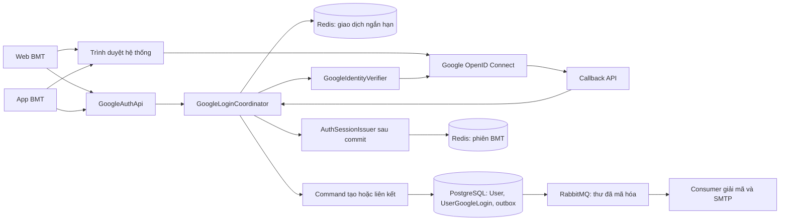
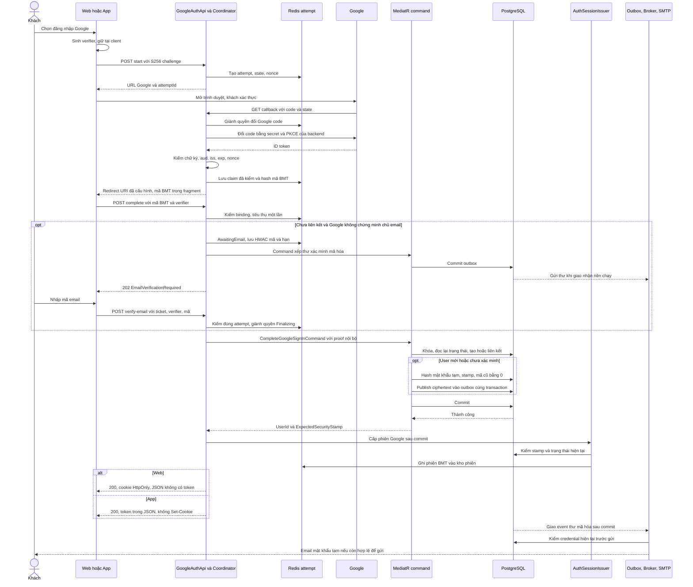
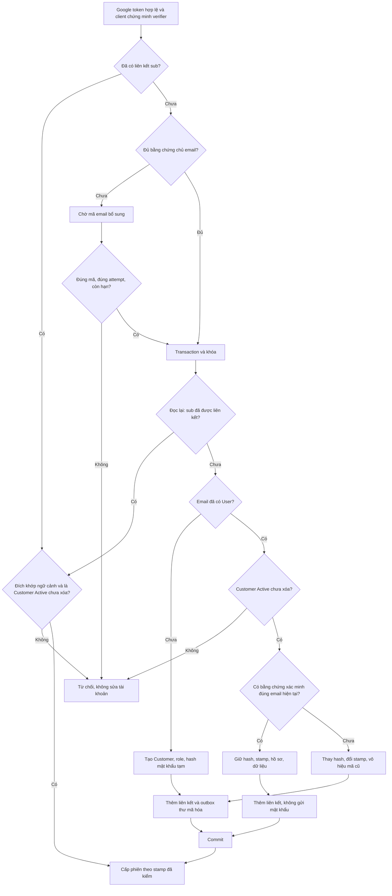
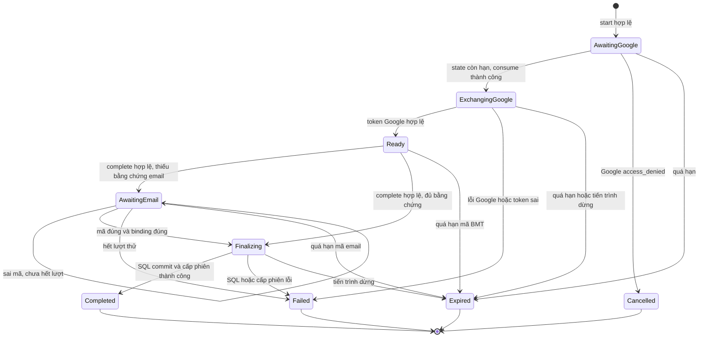
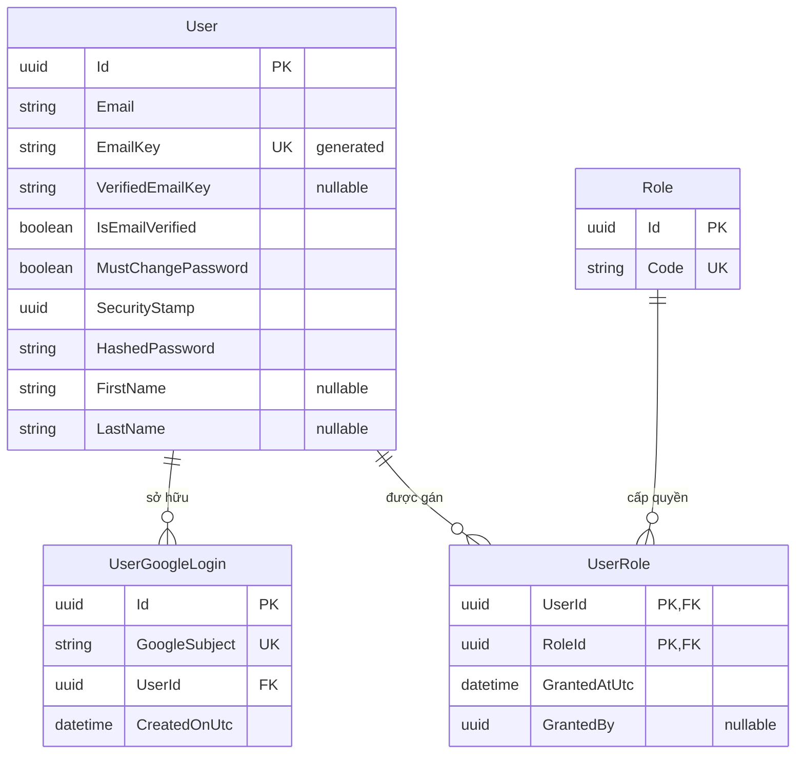

<!-- HƯỚNG DẪN CHO AI KHI ĐIỀN HOẶC CHỈNH SỬA MẪU
- Đọc toàn bộ mẫu, các comment hướng dẫn và tài liệu nguồn được cung cấp trước khi viết. Tuân thủ các quy tắc nghiệp vụ, điều kiện, ngoại lệ và giới hạn đã được xác nhận.
- Không bịa, tự chế hoặc suy đoán thành sự thật: yêu cầu, quy tắc, số liệu, API, schema, mã lỗi, nguồn tham khảo, người phụ trách và kết quả kiểm thử phải có căn cứ. Nội dung ví dụ trong mẫu không phải dữ kiện của dự án.
- Khi thiếu thông tin hoặc các nguồn mâu thuẫn, hỏi người dùng để làm rõ; giữ nguyên placeholder ở phần chưa xác định. Không tự chọn đáp án, lấp chỗ trống hay tuyên bố tài liệu đã hoàn tất.
- Chỉ thay nội dung cần điền hoặc được yêu cầu sửa. Không tự mở rộng phạm vi, sửa nghĩa quy tắc, bỏ điều kiện/ngoại lệ, xoá hay ghi đè nội dung hợp lệ đã có.
- Giữ nguyên tên, cấp và thứ tự heading, nhãn in đậm, tiền tố bullet, cấu trúc danh sách, tên/thứ tự/số cột bảng và cú pháp code fence. Không dịch, đổi tên, gộp hoặc thêm mục ngoài cấu trúc mẫu.
- Chỉ lặp khối luồng, AC hoặc API theo đúng khuôn khi có căn cứ; chỉ bỏ phần tuỳ chọn khi hướng dẫn riêng của mẫu cho phép và đã xác định không áp dụng.
- Mã tham chiếu và section phải trỏ tới tài liệu có thật đã được cung cấp hoặc kiểm chứng. Không giữ mã ví dụ như tham chiếu thật và không tự tạo tài liệu liên quan để hợp thức hoá liên kết.
- Giữ các comment hướng dẫn trong file. Xuất Markdown UTF-8, mỗi file một tài liệu; không bọc toàn bộ file trong code fence, không chèn lời dẫn hay giải thích ngoài mẫu.
- Trước khi bàn giao, đối chiếu nội dung với nguồn, kiểm tra cấu trúc, giá trị cho phép, giới hạn độ dài và tính nhất quán của mã/tham chiếu. Báo rõ phần chưa đủ thông tin; không tuyên bố đã chạy test hoặc import khi chưa thực hiện.
-->

<!-- Thay mã TDD-001 và nội dung ví dụ; giữ nguyên heading và nhãn in đậm.
Sơ đồ dùng mermaid, plantuml hoặc URL. Giữ heading Architecture, Sequence Diagram, Activity Diagram, State Diagram, Data Model.
Ví dụ API phải có heading trùng METHOD /path trong Endpoints. Xoá phần API/sơ đồ không dùng.
Version, Updated At và Change Log do lịch sử phiên bản quản lý, để trống khi nhập mới.
Author/Reviewer là tên hiển thị; gán tài khoản, phê duyệt, giả định và câu hỏi mở trên giao diện sau import.
Thiết kế phải truy vết về Story và Business Rule được cung cấp. Phân biệt thiết kế đề xuất với implementation đã kiểm chứng; không mô tả API/schema/sơ đồ ví dụ như hệ thống thật hoặc tự quyết định nghiệp vụ còn thiếu.
BẮT BUỘC KHI HOÀN THIỆN MẪU: phải có cả Reviewer và Approver, mỗi tên 1–200 ký tự sau khi bỏ khoảng trắng đầu/cuối. Không xoá hai dòng metadata, để trống, dùng tên bịa hoặc giữ placeholder rồi coi là hoàn tất.
Nếu chưa biết người review hoặc người phê duyệt, phải hỏi người dùng và báo tài liệu chưa đủ thông tin; không tự lấy Author/Owner làm người thay thế. Tên trong file không tự gán tài khoản hoặc xác nhận đã duyệt; gán thành viên trên giao diện sau import.
Đây là yêu cầu hoàn thiện mẫu; backend hiện vẫn nhận file cũ thiếu hai trường để tương thích.

VALIDATION CHO FILE NHẬP (đối chiếu ImportSnapshotValidator, MarkdownParser và ImportService):
- Mỗi file .md UTF-8 không rỗng chỉ có một heading cấp 1 chứa mã tài liệu dài 1–100 ký tự. Mã không được trùng trong cùng lần nhập hoặc thuộc loại tài liệu khác đã tồn tại.
- Không dùng tên README.md hoặc sitemap.md vì importer bỏ qua. Giao diện nhận .md/.zip, tối đa 2.000 file, tổng file tải lên 31 MiB; API giới hạn request 32 MiB và tổng nội dung đọc/giải nén 64 MiB.
- Chỉ nhập đè tài liệu cùng loại đang Draft, chưa có phiên bản và chưa lưu trữ. Import thay toàn bộ nội dung bản nháp, vì vậy phải giữ lại nội dung hợp lệ ngoài phần được yêu cầu sửa.
- Không dùng Status trong Markdown hoặc tên Approver để tự xác nhận phê duyệt; import không cấp quyền hay gán tài khoản từ tên. Chạy Kiểm tra file và xử lý lỗi/cảnh báo trước khi nhập.
- Giới hạn độ dài bên dưới tính theo string.Length của .NET (đơn vị UTF-16); không tự cắt ngắn dữ kiện quan trọng để vượt validation, hãy viết lại có căn cứ hoặc hỏi người dùng.
- Feature tối đa 300 ký tự và được dùng làm tiêu đề tài liệu. Status được parser nhận: Draft / In Review / Approved / Deprecated; tài liệu nhập mới vẫn có trạng thái phê duyệt Draft.
- Endpoint: đường dẫn tối đa 500 ký tự; tên/mô tả endpoint được lưu trong Name tối đa 300. HTTP method: GET / POST / PUT / PATCH / DELETE / HEAD / OPTIONS.
- Error Codes: mã tối đa 100 ký tự, không trùng trong tài liệu; giữ dạng - **CODE** (400): mô tả. HTTP status trong Error Codes và Response phải là số nguyên đọc được bằng Int32; không tự đặt status khác hợp đồng API.
- URL sơ đồ tối đa 1.000 ký tự. Mục sơ đồ được sử dụng phải có khối mermaid/plantuml hoặc URL theo mẫu; không để một mục sơ đồ rỗng. Nhãn mục được tách từ bullet như tên External API Fields tối đa 300 ký tự.
- Heading Examples phải khớp METHOD /path ở Endpoints. Giữ các nhãn Request:, Response 200: (thay mã theo contract) và Error Response: để parser tách đúng dữ liệu.
- Tham chiếu dạng DOC-KEY/section: ghi chú: mã đích tối đa 100 ký tự, section tối đa 100, ghi chú tối đa 1.000. Không trùng bộ mã đích + section + loại liên kết trong cùng tài liệu.
ĐỐI CHIẾU FORM TDD (src/features/tdds/validations.ts; form có thể chặt hơn import):
- Điền Feature, Author, Reviewer, Problem và ít nhất một Goal; các Goal/Non-goal/Notes đã thêm không được rỗng. API đã khai báo phải có endpoint và mô tả/mục đích; Fields phải có tên và ý nghĩa; Error Codes phải có mã, HTTP status và điều kiện.
- Form còn kiểm tra Version, Updated At và nội dung Change Log khi khai báo; với file nhập mới, giữ các trường lịch sử này trống theo hợp đồng import, không tự tạo dữ liệu lịch sử.
-->

# TDD-AUTH-003

## Document Info

- **Feature**: Đăng nhập Google cho khách hàng trên web và app; liên kết tài khoản, mật khẩu tạm và bảo vệ phiên
- **Author**: Codex
- **Reviewer**: Tân Trần
- **Approver**: Tân Trần
- **Status**: Draft
- **Version**:
- **Updated At**:

## Context & Goals

### Problem

STORY-AUTH-002 và BR-AUTH-003 đến BR-AUTH-007 đã được người dùng chốt. Khách hàng cần đăng nhập Google trên web, Android và iOS. Hệ thống tự tạo khách hàng mới hoặc liên kết tài khoản cùng email sau khi xác minh chủ email. Tài khoản mới và tài khoản chưa xác minh được tiếp nhận nhận mật khẩu tạm qua email. Mật khẩu không tự hết hạn, nhưng phiên dùng mật khẩu tạm chỉ cho đổi mật khẩu; phiên Google vẫn dùng bình thường. Đổi hoặc đặt lại mật khẩu thành công cắt mọi phiên BMT cũ. Email không được sửa qua hồ sơ.

Người dùng đã **chốt TDD này trong hội thoại ngày 30/09/2026**. Thiết kế chưa được triển khai; Status vẫn là Draft vì chưa nhập hoặc phê duyệt trên hệ thống tài liệu. Nền tảng đã kiểm tra là .NET 8, Carter, MediatR, EF Core/Npgsql 8, PostgreSQL 15 theo compose, Redis và MassTransit 8.4.1. Không nâng framework hoặc thay hệ thống xác thực bằng ASP.NET Core Identity. Có 40 đặc tả ST-AUTH-021 đến ST-AUTH-060; các đặc tả đó chưa phải kết quả đã chạy.

Các điểm hiện trạng làm căn cứ:

| Hiện trạng đã đọc trong code | Ảnh hưởng đến thiết kế |
| --- | --- |
| `AuthSessionIssuer` dùng chung cho web/mobile; `SessionTokenPayload` chỉ lưu `ClientKind`, chưa lưu cách xác thực | Cần giữ riêng cách xác thực qua cả lần làm mới phiên. |
| `AccessClaimsBuilder` đưa `User.MustChangePassword` vào mọi phiên; `GetMeQueryHandler` trả trực tiếp cờ tài khoản | Nếu dùng nguyên trạng, phiên Google cũng bị ép đổi mật khẩu. |
| `UpdateUserProfileCommandHandler` gán lại Email; nhánh đổi bằng mật khẩu hiện tại của `ChangePasswordCommandHandler` đặt `IsEmailVerified=true` | Cần khóa email và lưu bằng chứng cho đúng địa chỉ; biết mật khẩu không chứng minh quyền sở hữu email. |
| `SecurityStampService.GetCurrentAsync` có thể trả dấu phiên từ Redis; dọn sau commit chỉ ghi cảnh báo khi lỗi | Không đủ để bảo đảm access token cũ chết ngay sau khi đổi mật khẩu nếu cache vẫn chứa dấu cũ. |
| `User.Email` dài tối đa 50; tên và tên chuẩn hóa bắt buộc; mã email/reset nằm trong User | Cần nhận email Google dài hơn, hồ sơ thiếu tên và vô hiệu mã cũ trong cùng transaction. |
| `TransactionPipelineBehavior` commit trước khi trả về `sender.Send`; `IPostCommitActionQueue` nuốt lỗi tác vụ sau commit | Cấp phiên mới phải nằm sau `sender.Send`, và lỗi cấp phiên phải được phản ánh riêng. Không dùng hàng chờ sau commit để quyết định phản hồi đăng nhập thành công. |
| `SendEmailEvent.Body` được lưu trong outbox rồi lên RabbitMQ; Data Protection hiện dùng volume nhưng chưa cấu hình mã hóa keyring bằng certificate | Thư chứa mật khẩu cần hợp đồng mã hóa riêng trước khi publish và điều kiện bảo vệ khóa trước khi bật Google. |

### Goals

- Thực hiện đủ AC-001 đến AC-015, gồm liên kết đúng tài khoản, bảo vệ tài khoản chưa xác minh, không đổi email và không ghi đè hồ sơ.
- Chỉ chấp nhận danh tính Google sau xác thực tại backend và chứng minh request hoàn tất thuộc client đã bắt đầu luồng.
- Một danh tính Google không tạo nhiều User hoặc nhiều lần cấp mật khẩu do gửi lại hay tranh chấp.
- Thu hồi phiên và mã khôi phục cũ dựa trên trạng thái đã commit; lỗi Redis hoặc gửi thư không mở lại quyền truy cập cũ.
- Định nghĩa rõ API, dữ liệu, mẫu bản ghi, lỗi, cấu hình và thứ tự triển khai để backend, web, mobile và QA dùng chung.

### Non-goals

- Đăng nhập Google cho Staff, đăng nhập nhà cung cấp khác, quản lý/gỡ/chuyển liên kết hoặc đổi email.
- Xin quyền Gmail, Drive hay Calendar. Gửi thư dùng SMTP của BMT, không dùng hộp thư Google của khách để gửi.
- Tạo dịch vụ auth riêng, thay thuật toán mật khẩu hiện có, triển khai mô hình phiên SQL của TDD-PUSH-001 hoặc thiết kế lại toàn bộ RBAC.
- Viết code, tạo/chạy migration, cấu hình Google Cloud, triển khai hoặc viết đặc tả Unit Test trong lần soạn TDD này.

## Architecture

**Phương án chung cho web và app.** Dùng OpenID Connect Authorization Code Flow qua backend. Google trả authorization code tới callback HTTPS cố định của API. Backend đổi code và xác thực ID token. Web và app chỉ nhận một mã BMT dùng một lần để hoàn tất; mã này chưa phải phiên đăng nhập. Web đổi mã lấy cookie HttpOnly; app đổi mã lấy token qua JSON như TDD-AUTH-002.

App mở Google trong trình duyệt hệ thống, không dùng WebView nhúng. Cách này dùng một bộ xử lý danh tính tại backend, đổi lại cần App Links/Universal Links để quay lại app và có bước chuyển qua trình duyệt. Client ID của Google là loại Web application vì callback và bước đổi Google code thuộc backend. Không nhúng client secret vào web/app. Đây là lựa chọn triển khai của bản dự thảo; không giả định đã tích hợp SDK Google native. [Google OpenID Connect](https://developers.google.com/identity/openid-connect/openid-connect) mô tả server flow; [RFC 8252](https://www.rfc-editor.org/rfc/rfc8252.html) hướng dẫn dùng trình duyệt ngoài cho app.

**Ranh giới thành phần.** Các lớp có chữ “mới” dưới đây chưa tồn tại. Contract mới vẫn ở tính năng `user`; coordinator là service application, không phải handler có hậu tố `Command`, để không giữ transaction SQL trong lúc gọi Google hoặc Redis.

| Thành phần | Vị trí tính từ backend | Trách nhiệm |
| --- | --- | --- |
| `GoogleAuthApi` mới | `src/bmt-be.presentation/apis/user/GoogleAuthApi.cs` | Các endpoint start, callback, complete và verify-email; cố định loại client theo route, trả cookie hoặc JSON. |
| DTO và validator mới | `src/bmt-be.contract/services/user/Command.cs`, `Response.cs`, `validators/` | Chỉ nhận mã, proof của client và mã email; không nhận `UserId`, email đích, role hay hồ sơ Google do client khai. Request nhạy cảm cài `ISensitiveRequest`. |
| `IGoogleLoginCoordinator` mới | `src/bmt-be.application/abstractions/`, `services/` | Điều phối trước transaction; kiểm giao dịch Redis, email bổ sung, gửi command SQL rồi cấp phiên sau commit. |
| `IGoogleIdentityVerifier` mới | interface ở application; adapter `infrastructure/authentication/` | Gọi token endpoint bằng `IHttpClientFactory`; kiểm JWT bằng thư viện IdentityModel, discovery/JWKS của Google. Không tự viết bộ kiểm chữ ký. |
| `IGoogleLoginAttemptStore` mới | interface ở application; adapter Redis ở infrastructure | Lưu giao dịch ngắn hạn, tiêu thụ mã và đếm lần thử bằng Lua nguyên tử; không dùng `GET` rồi `SET` tách rời để giành quyền xử lý. |
| `CompleteGoogleSignInCommandHandler` mới | `src/bmt-be.application/usecases/commands/user/` | Chỉ nhận danh tính đã kiểm từ coordinator, khóa và đọc lại User, tạo/liên kết, thay credential khi cần và publish thư mã hóa trong transaction. Trả `UserId`, `ExpectedSecurityStamp`. |
| `UserGoogleLogin` và repository mới | `domain/entities/`, `domain/abstractions/repositories/`, persistence | Sở hữu liên kết ổn định giữa Google `sub` và User. Không có API tự gán lại UserId. |
| Dịch vụ phiên hiện có | `AuthSessionIssuer`, `AccessClaimsBuilder`, `SessionTokenStore`, `SessionCutter`, `SecurityStampValidator` | Bổ sung cách xác thực, dấu phiên đã kiểm và dọn theo thế hệ; giữ hợp đồng thời hạn phiên. |
| Handler User hiện có | login, register, verify, forgot/change password, update profile, get me | Đồng bộ cách tìm email, lưu bằng chứng xác minh, chống ghi đè credential và giới hạn phiên. |
| `SendProtectedAuthEmailV1`, consumer mới | `contract/services/user/Event.cs`, `infrastructure/messaging/consumers/` | Chỉ publish ciphertext; giải mã ngay trước SMTP, bỏ thư hết hạn hoặc thuộc credential cũ. |



**Gắn luồng với client đã khởi tạo.** Client sinh `codeVerifier` bằng 32 byte ngẫu nhiên mật mã, mã hóa base64url không padding; gửi `codeChallenge = BASE64URL(SHA256(ASCII(codeVerifier)))` khi start. Web giữ verifier trong `sessionStorage` của tab cho đến khi hoàn tất; app giữ tạm trong kho bảo mật hệ điều hành để phục hồi khi tiến trình bị đóng. Backend chỉ lưu challenge. Mã BMT bị lấy từ đường dẫn cũng không đổi được thành phiên nếu thiếu verifier. Không đưa verifier vào URL, log hoặc hệ thống analytics. Cơ chế S256 dựa trên [RFC 7636](https://www.rfc-editor.org/rfc/rfc7636).

Backend tạo riêng `state`, `nonce` và một verifier S256 cho đoạn API–Google. Hai verifier không dùng chung. `state` nhận diện giao dịch; `nonce` ràng buộc ID token với đúng yêu cầu Google. Callback chỉ đổi giao dịch Redis sang trạng thái đã kiểm Google và trả mã BMT; **chưa tạo User, liên kết, thư hoặc phiên**. Việc ghi tài khoản chỉ bắt đầu sau khi complete chứng minh verifier của client. Vì vậy đưa callback hoặc mã hoàn tất của kẻ tấn công vào trình duyệt nạn nhân không tự đăng nhập nạn nhân thành kẻ tấn công (ST-AUTH-060).

**Trình tự trước khi ghi dữ liệu.**

1. Start kiểm body, origin khi là web, loại app và cấu hình return target; tạo attempt, trả URL Google. Phạm vi yêu cầu chỉ `openid email profile`, `response_type=code`, `prompt=select_account`, không xin `offline`.
2. Callback tìm attempt bằng hash của state, kiểm hạn và chuyển `AwaitingGoogle → ExchangingGoogle` nguyên tử. State không hợp lệ thì trả lỗi ngay tại API, không chuyển tới URL do request khai. Google báo hủy thì kết thúc attempt và chuyển về return target đã lưu với mã lỗi chung.
3. Backend đổi code đúng một lần bằng redirect URI cấu hình, client secret và verifier của đoạn API–Google. Kiểm chữ ký, issuer Google cho phép, audience đúng Web Client ID, `azp` nếu có phải khớp Client ID, `exp`, `iat`, nonce, `sub` không rỗng và kiểu claim. Chỉ nhận thuật toán được cấu hình cho Google, ban đầu RS256; không nhận `none` hoặc thuật toán đối xứng. Email phải hợp lệ; `email_verified` nếu có phải đúng kiểu boolean, thiếu thì coi là chưa đủ bằng chứng sở hữu email. Token hết hạn, audience/nonce sai hoặc chứng thư không kiểm được đều dừng trước dữ liệu nghiệp vụ.
4. Dùng bộ đọc JWT không đổi tên claim (`MapInboundClaims=false`). Discovery URL cố định, không lấy issuer/JWKS URL từ request; chỉ truy cập HTTPS của Google đã cho phép. Cache JWKS theo header Google; gặp `kid` mới chỉ làm mới có giới hạn. Không dùng `tokeninfo` làm bộ kiểm production. Google token chỉ ở bộ nhớ trong lúc kiểm; không lưu access/refresh/ID token của Google.
5. Lưu tập claim tối thiểu đã kiểm trong attempt dưới dạng mã hóa, tạo mã BMT ngẫu nhiên 32 byte, chỉ lưu hash mã. Redirect về URI cấu hình của client với `#attemptId=...&completionCode=...`. Không đặt cookie BMT tại callback. Callback và trang nhận kết quả dùng `Cache-Control: no-store`, `Referrer-Policy: no-referrer`; trang nhận mã không tải analytics, xóa fragment bằng `history.replaceState` sau khi đọc. App chỉ nhận verified HTTPS App Link/Universal Link đúng host/path đã cấu hình, kiểm `attemptId` đang chờ; không dùng custom scheme làm đường dự phòng tự động.
6. Complete kiểm đúng route web/mobile, hash mã, hạn và S256 của verifier. Nếu đã có liên kết `sub`, dùng User đã liên kết, không dò email Google mới để chuyển sang User khác. Nếu chưa liên kết, chỉ tin email trực tiếp khi Gmail có `email_verified=true`, hoặc Workspace có `email_verified=true` và `hd` không rỗng; email bên ngoài cần bước bổ sung dù cờ verified là true. Chính sách quyền sở hữu theo [hướng dẫn xác thực Google ID token](https://developers.google.com/identity/gsi/web/guides/verify-google-id-token).
7. Khi cần xác minh bổ sung, chuyển attempt sang `AwaitingEmail`; lưu email, sub, loại client, challenge, UserId quan sát được và stamp nếu có dưới cùng attempt. Tạo mã 6 chữ số bằng CSPRNG, lưu HMAC-SHA256 gắn `attemptId + sub + emailKey + code`, không lưu mã rõ. Khóa HMAC là secret riêng theo môi trường, có key ID để xoay; không dùng JWT key. Publish thư mã hóa bằng một command chỉ ghi outbox, không sửa User. Nếu bước này lỗi, attempt không được coi là đã gửi; khách bắt đầu lại, không tiếp tục với mã chưa được xếp gửi.
8. Verify-email chỉ nhận ticket ngẫu nhiên, verifier và mã; email/sub lấy từ attempt. Sai mã tăng bộ đếm nguyên tử; đúng mã giành quyền `AwaitingEmail → Finalizing` một lần. Mã của attempt khác không dùng được. Hết hạn hoặc hết lượt thử thì đóng attempt. Không có API gửi lại mật khẩu tạm; muốn xin mã xác minh Google mới thì bắt đầu lượt Google mới, vẫn chịu hạn mức theo email.

Các tham số bảo vệ dưới đây là **mặc định kỹ thuật đề xuất**, không phải thời hạn mật khẩu hay SLA đã được người dùng đặt: attempt Google 10 phút; mã hoàn tất BMT 120 giây và không vượt hạn attempt; bước email tối đa 10 phút và không vượt `exp` của bằng chứng Google; tối đa 5 lần nhập mã cho mỗi attempt; tối đa 3 thư xác minh bổ sung/emailKey/giờ và 30 lần start/IP/10 phút. Bộ đếm đặt ở Redis để không mất khi API restart; fail closed khi kho bảo vệ lỗi. Hết hạn thì khách bắt đầu lại. Tên option tương ứng trong `GoogleSignInOption`: `AttemptLifetimeMinutes=10`, `CompletionCodeLifetimeSeconds=120`, `EmailVerificationLifetimeMinutes=10`, `MaxEmailAttempts=5`, `EmailSendLimitPerHour=3`, `StartLimitPerIp=30`, `StartWindowMinutes=10`. Các giá trị phải cấu hình được, kiểm dương khi khởi động và được kiểm chứng trước phát hành. `EmailCodeHmacActiveKeyId` và tập khóa theo ID đọc từ secret store/cấu hình bí mật của môi trường; chỉ bỏ khóa cũ sau khi mọi attempt dùng khóa đó đã hết hạn.

**Ghi tài khoản và liên kết trong một transaction.** Handler SQL chạy sau khi hoàn tất mọi kiểm Google/email. Nội bộ dùng `VerifiedGoogleIdentity`, không bind kiểu này từ HTTP. Không gọi Google, Redis hoặc SMTP trong transaction.

1. Lấy khóa transaction cho danh tính `google:sub`, dùng `pg_advisory_xact_lock` với khóa 64 bit dẫn xuất nhất quán từ chuỗi có namespace. Khóa chỉ nối đuôi thao tác cùng danh tính; ràng buộc unique vẫn là lớp bảo đảm cuối cùng, không coi advisory lock thay cho unique.
2. Đọc lại `UserGoogleLogin`. Nếu có, khóa dòng User đích `FOR NO KEY UPDATE`, kiểm Customer/Active/chưa xóa. Nếu attempt xác minh bổ sung đã ghi nhận một UserId đích khác, từ chối `GoogleLinkConflict`; không chuyển liên kết. Nếu không có ngữ cảnh đích trước đó, liên kết `sub` thắng email, đúng ST-AUTH-028. Nếu attempt chờ email đã ghi nhận stamp mà stamp dưới khóa nay khác, trả `GoogleLoginConcurrentChange` và yêu cầu bắt đầu lại; không dùng proof đang chờ để ghi đè kết quả reset vừa hoàn tất.
3. Nếu chưa có liên kết, command kiểm lại phải có proof sở hữu email (Google authoritative hoặc mã email đã xác minh) rồi lấy khóa theo `emailKey`, tra cả User đã xóa. Không tin kết luận phân nhánh ngoài transaction để bỏ qua điều kiện proof. Đăng ký thường và tạo Staff phải dùng cùng khóa email khi tạo User. Không có User thì thêm Customer/Active, mật khẩu tạm đã băm, cờ bắt đổi, email có bằng chứng xác minh; thêm đúng vai trò `customer`. Thiếu role seed là lỗi cấu hình, rollback tất cả.
4. Có User thì khóa dòng và đọc lại trạng thái. Staff/Locked/đã xóa bị từ chối trước mọi thay đổi. Customer có `IsEmailVerified=true`, `VerifiedEmailKey=EmailKey` và thời điểm xác minh thì giữ nguyên hash/stamp/hồ sơ/quyền. Nếu không đủ bằng chứng cho email hiện tại, xử lý nhánh chưa xác minh: giữ UserId/dữ liệu, thay hash bằng mật khẩu tạm mới, bật `MustChangePassword`, ghi bằng chứng email, đổi stamp, đặt cả hai mã cũ về 0 và đặt số lần gửi mã xác minh về 0.
5. Thêm `UserGoogleLogin` bằng `INSERT ... ON CONFLICT (GoogleSubject) DO NOTHING`, rồi đọc lại. Đích giống nhau là cùng kết quả; đích khác thì ném lỗi để rollback. Không bắt lỗi unique rồi tiếp tục transaction đã lỗi. Nếu có tranh chấp từ writer chưa dùng khóa chung, rollback toàn command và trả 409; client bắt đầu lượt mới. Không tự thử lại transaction đã sinh credential trong cùng DbContext.
6. Chỉ nhánh thực sự tạo User hoặc tiếp nhận User chưa xác minh được publish một thư mật khẩu, cùng transaction với User, UserRole và liên kết. Lần đăng nhập lại không publish thư và không tạo hash mới. Không tạo receipt SQL riêng: unique sub/email và việc đọc lại nhánh đã hoàn tất là căn cứ chống tạo trùng.
7. Sau khi `sender.Send` trả thành công, coordinator mới gọi issuer với UserId, `ExpectedSecurityStamp`, `AuthenticationMethod.Google`, client cố định theo attempt. Issuer chỉ cấp nếu stamp hiện tại vẫn bằng stamp đã kiểm. Không lấy stamp mới hơn để nâng một proof cũ thành phiên mới. Redis không lưu được phiên thì trả 503; User/link đã commit vẫn còn, lần đăng nhập Google mới dùng lại chúng và không cấp thêm mật khẩu.

Khóa được lấy theo thứ tự danh tính Google → email khi cần → User; mỗi luồng chỉ khóa một User. Các writer credential thường không lấy khóa Google; chúng khóa User trước khi kiểm và sửa credential. `lock_timeout` của command đề xuất 5 giây, hết hạn trả lỗi có thể thử lại bằng lượt mới. [PostgreSQL 15 INSERT](https://www.postgresql.org/docs/15/sql-insert.html) là căn cứ cho xử lý unique bằng `ON CONFLICT`.

**Trường hợp xung đột có thể kiểm được (ST-AUTH-047).** Attempt X đang chờ email cho sub G, đã quan sát tài khoản A. Trước lúc X hoàn tất, một giao dịch hợp lệ khác liên kết G với B. X phải trả 409, giữ A và B nguyên vẹn. Fixture có một liên kết G→B và một attempt đang chờ A, không cần tạo hai dòng trùng unique. Nếu chưa có A ở thời điểm chờ, User mới cùng email được tạo hợp lệ trong lúc chờ vẫn được giải quyết dưới khóa email theo quy tắc đã chốt. Schema không đặt giới hạn một Google/User vì nghiệp vụ chưa đặt giới hạn đó; mỗi sub vẫn chỉ thuộc một User. Điều này không bổ sung giao diện quản lý nhiều liên kết.

**Phiên và vòng đời mật khẩu.** Bổ sung `AuthenticationMethod` do server cấp: `Password`, `Google`, `EmailVerification`, `PasswordReset`. Client không được gửi giá trị này để chọn quyền. Bổ sung stamp đã kiểm vào kết quả `UserCredentialChecker`; mọi lời gọi issuer truyền `ExpectedSecurityStamp` từ proof vừa xác thực. Các handler verify-account/reset phải trả kết quả nội bộ sau commit rồi endpoint/coordinator mới cấp phiên; không còn lưu Redis trước commit.

| Cách xác thực | Quyền phiên |
| --- | --- |
| Password, User.MustChangePassword=false | Theo email đã xác minh và vai trò hiện tại. |
| Password hoặc EmailVerification, User.MustChangePassword=true | Có claim `MustChangePassword=true`; chỉ các thao tác phục vụ đổi mật khẩu, me tối thiểu, làm mới và đăng xuất. |
| Google, Customer hợp lệ | Không có claim bắt đổi mật khẩu; cờ User không bị xóa chỉ vì đăng nhập Google. |
| PasswordReset | Có `IsForgotPassword=true`; chỉ đặt lại mật khẩu và các thao tác hỗ trợ phiên. Không trở thành phiên đầy đủ do User có Google. |
| Staff | Giữ quy tắc cũ về mật khẩu ban đầu; không có đường cấp `AuthenticationMethod.Google`. |

`AccessClaimsBuilder` nhận auth context từ issuer; mọi named policy nghiệp vụ giữ các điều kiện nền như DefaultPolicy. `GET me` trả `mustChangePassword` theo **phiên hiện tại**, thêm `authenticationMethod` và `canChangeEmail=false`. Không đọc cờ tài khoản làm điều kiện chuyển màn hình cho phiên Google. Với phiên hạn chế, me chỉ phục vụ màn hình đổi mật khẩu và không tự ghi TimeZone. Quyền/role vẫn được dựng lại khi refresh, nhưng cách xác thực và stamp phải giữ từ phiên cũ, không lấy từ body.

Redis session bổ sung `authenticationMethod` và `securityStamp`. JWT thêm claim `amr` một giá trị, giữ claim stamp hiện có. Hai nơi phải khớp. Blob cũ chưa có trường securityStamp dùng stamp trong JWT đã kiểm chữ ký làm giá trị chuyển tiếp; blob mới thiếu hoặc mâu thuẫn với JWT bị từ chối. Blob cũ chưa có method được suy ra `PasswordReset` nếu token có `IsForgotPassword`, còn lại là `Password`; tuyệt đối không suy ra Google. Phiên reset cũ thiếu email đã được chứng minh phải đi lại bước nhận/nhập mã trước khi đặt mật khẩu. Loại client, hạn web, hạn mobile 30 ngày có cấu hình, xoay refresh và ngoại lệ logout giữ TDD-AUTH-002/BR-AUTH-002.

**Thu hồi không phụ thuộc cache.** Trong thiết kế này, `SecurityStampValidator` qua `ISecurityStampService.GetCurrentAsync` đọc `Id/Status/IsDeleted/SecurityStamp` từ PostgreSQL theo PK cho mỗi request đã xác thực; không dùng cache stamp làm nguồn cho phép. Có thể giữ signature trả Guid nullable: trả NULL khi User đã xóa/khóa hoặc không tồn tại; lỗi DB phải giữ riêng với NULL. DB không đọc được thì trả 503, không cho request nghiệp vụ đi tiếp bằng dấu cũ và không xóa cookie như lỗi credential. Trong `JwtExtensions`, `OnTokenValidated` đánh dấu lỗi dependency riêng trong HttpContext rồi fail authentication; `OnChallenge` nhận dấu này để trả 503 AuthStateUnavailable trước nhánh 401/xóa cookie. Không chỉ ném exception trong JWT event rồi để nó bị biến thành 401. Đây là thay đổi có chủ đích so với cửa sổ cache mô tả tại TDD-RBAC-002: tăng một truy vấn PK/request để đáp ứng BR-AUTH-002/Except và ST-AUTH-026/035. Không đổi cách cache quyền trong JWT. Request đã được xác thực trước thời điểm commit không bị hủy ngược; các lệnh sửa credential phải kiểm stamp lần nữa dưới khóa dòng.

Đổi mật khẩu, đặt lại hoặc tiếp nhận tài khoản phải khóa User và so stamp trong proof/phiên với stamp đang lưu **trước khi** sửa. Thành công: thay hash, bỏ cờ bắt đổi, đổi stamp, vô hiệu các mã xác minh/reset cũ; tất cả cùng commit. Thất bại: không sửa hoặc cắt phiên. Nhánh mật khẩu hiện tại không thay `IsEmailVerified`, `VerifiedEmailKey` hoặc thời điểm xác minh. Nhánh reset chỉ ghi bằng chứng email khi phiên reset chứa emailKey đã được chứng minh và vẫn khớp User dưới khóa. Mật khẩu mới phải không rỗng và khác credential hiện tại: kiểm bằng `VerifyPassword(newPassword, currentHash)` ở cả nhánh đổi lẫn reset, để không biến chính mật khẩu tạm thành mật khẩu thường chỉ bằng cách băm lại; chưa có căn cứ thêm quy tắc độ dài/độ phức tạp nghiệp vụ mới. `UserValidators.cs` hiện thiếu validator riêng cho ChangePassword, nên phải bổ sung kiểm đầu vào này, không coi việc hash được chuỗi rỗng là hợp lệ.

Các handler verify-account và verify-reset phải khóa User, kiểm mã khác 0, tiêu thụ mã bằng đặt 0 và gắn proof với stamp/emailKey đã kiểm. Khi Google tiếp nhận hoặc đổi mật khẩu commit trước, handler cũ đang chạy không được ghi lại mã hay cấp phiên bằng stamp mới. Ánh xạ `xmin` làm concurrency token của User hỗ trợ phát hiện writer dùng snapshot cũ; không tự retry ghi lại entity đó. [Npgsql concurrency tokens](https://www.npgsql.org/efcore/modeling/concurrency.html) mô tả cách dùng `xmin` với EF Core.

Dọn Redis sau commit chỉ là thu hồi vật lý. Bổ sung `RevokeOlderGenerationsAsync(userId, committedStamp)`: đọc tập token, xóa có điều kiện blob thuộc stamp cũ, không xóa cả tập nếu còn phiên cùng stamp mới. Lua so đúng blob/thế hệ trước khi xóa để không đụng token vừa rotate. Nếu lúc dọn DB đã có stamp khác, lấy stamp mới nhất làm mốc; không để tác vụ dọn muộn xóa phiên mới của thế hệ sau. Lỗi dọn được ghi cảnh báo, nhưng token cũ vẫn bị chặn bởi DB. Thay các lời gọi blanket revoke trong luồng đổi mật khẩu/tiếp nhận; rà cả các caller SessionCutter để không có hai kiểu dọn trái nhau.

**Mật khẩu tạm và thư chứa bí mật.** Sinh 32 byte bằng `RandomNumberGenerator`, chuyển base64url 43 ký tự, không có hạn mật khẩu. Dùng `IPasswordHasherService` hiện có để lưu `User.HashedPassword`; không lưu bản rõ vào User. Không đổi work factor của hasher trong TDD này. Bản rõ chỉ tồn tại lúc tạo thư, trong bộ nhớ consumer và trong email đến khách.

Thêm event `SendProtectedAuthEmailV1` có `DeliveryId`, `Purpose`, `ProtectedPayload`, `NotAfterUtc`; không có `Body`, `To`, mật khẩu hoặc mã rõ. Payload mã hóa chứa DeliveryId, Purpose, NotAfterUtc, người nhận, template/version, dữ liệu điền, UserId/stamp nếu là mật khẩu, hoặc attemptId nếu là mã bổ sung. Consumer so DeliveryId/Purpose/NotAfterUtc bên ngoài với phần đã xác thực trong ciphertext; không cho thay envelope để phát lại dưới ID khác. Dùng `IDataProtector` với purpose riêng `Bmt.AuthMail.v1`, không tự dựng thuật toán mã hóa. Bảo vệ toàn payload trước `IPublishEndpoint.Publish`, dùng cùng DeliveryId làm MessageId. Consumer giải mã, kiểm NotAfter cả trong/ngoài payload khớp, kiểm User còn đúng email/stamp/cờ mật khẩu tạm hoặc attempt còn chờ đúng mã, rồi dựng HTML đã escape và gọi SMTP. Không truyền nội dung nhạy cảm vào exception/log, kể cả raw exception SMTP; log loại lỗi đã chuẩn hóa và DeliveryId.

Consumer dùng timeout SMTP và retry MassTransit hiện có (mặc định 30 giây mỗi bước SMTP; retry 3 lần, khoảng đầu 5 giây, tăng 10 giây). Không bọc thêm retry ở mail service. Đề xuất `AuthMailProtectionOption.TemporaryPasswordDeliveryLifetimeHours=24` cho cửa sổ xử lý thư mật khẩu; hết cửa sổ bỏ việc gửi và hướng khách dùng Quên mật khẩu. **24 giờ là hạn của yêu cầu gửi thư, không làm mật khẩu tạm hết hiệu lực.** Thư mã email hết hạn cùng attempt. Tái giao cùng event không sinh mật khẩu mới. Inbox giảm giao lặp nhưng không bảo đảm SMTP đúng một lần: crash sau SMTP trước ghi nhận thành công có thể làm khách nhận cùng thư hai lần.

Không kiểm stamp rồi giữ khóa SQL trong lúc gửi SMTP. Nếu mật khẩu vừa đổi sau kiểm nhưng trước SMTP, thư cũ có thể đến muộn; mật khẩu trong thư đã vô hiệu, không được tái kích hoạt. Nội dung thư nói rõ dùng mật khẩu mới nếu đã đổi, hoặc Quên mật khẩu nếu không dùng được. Thành công của đăng nhập không phụ thuộc SMTP; UI không khẳng định thư đã đến hộp thư.

Giữ keyring trên volume dùng riêng theo môi trường như hiện có; bổ sung `ProtectKeysWithCertificate`, certificate/private key được mount từ secret bên ngoài repo, quyền chỉ cho API/consumer. Khi bật Google, không cho rơi về thư mục tạm nếu volume không ghi được hoặc không có khóa giải mã cần thiết. Không sửa application name/purpose của các link chia sẻ đang dùng. Xoay certificate phải giữ khả năng đọc khóa cũ bằng `UnprotectKeysWithAnyCertificate`, kiểm thư chờ và link chia sẻ trước khi bỏ certificate cũ. Sao lưu keyring và certificate theo quy trình riêng, không cùng gói xuất DB/hàng đợi. [Microsoft Data Protection](https://learn.microsoft.com/en-us/aspnet/core/security/data-protection/configuration/overview?view=aspnetcore-8.0) giải thích cấu hình lưu và bảo vệ keyring.

Message trong outbox/RabbitMQ/error queue chỉ có ciphertext. Sau gửi, dùng cleanup của outbox/inbox hiện có. Đề xuất `AuthMailProtectionOption.ErrorQueueRetentionDays=7` cho TTL queue lỗi riêng của event mới; vận hành chỉ replay cùng event còn hạn và còn đúng credential, không giải mã để chép mật khẩu. Bản sao lưu vẫn có thể giữ ciphertext theo chính sách backup; mã hóa không phải bằng chứng đã xóa vĩnh viễn bí mật. Không công bố RPO/RTO hoặc retention backup mới khi chưa có dữ liệu vận hành. Trước khi mở tính năng phải ghi rõ nơi lưu khóa, quyền đọc, chính sách backup và kiểm phục hồi.

**Log và cấu hình.** Request DTO, response token và nội dung mail đều bị loại khỏi tracing, performance log và thông báo lỗi. Callback query chứa Google code/state nên access log tại API, proxy và Cloudflare phải bỏ query cho đường này; không log `Location` hoặc body token endpoint. Dùng correlation ID riêng không phải attempt secret, chỉ log kết quả, platform, mã lỗi, thời gian từng bước và DeliveryId. Metric dùng nhãn hữu hạn: start/complete/rejected, lý do từ chối, xung đột, lỗi Google/Redis/SQL/mail, thư quá hạn; không dùng email/sub/token làm nhãn.

**Notes**:
- Đã xác nhận: toàn bộ nghiệp vụ trong STORY-AUTH-002 và BR-AUTH-003–007, Reviewer/Approver là Tân Trần, dữ liệu hiện có chỉ là tài khoản thử nghiệm. Điều này không cho phép xóa/reset database.
- Đã chốt TDD trong hội thoại ngày 30/09/2026: flow qua trình duyệt hệ thống, cấu trúc dữ liệu, API, các giới hạn kỹ thuật, bảo vệ khóa và việc đọc stamp từ DB mỗi request. Các giá trị kỹ thuật không phải SLA nghiệp vụ.
- Cần cấu hình trước triển khai: Google project/client ID/secret, callback API, URL trả về web và App Links/Universal Links, domain ownership của app, certificate bảo vệ khóa, rate limit và nơi lưu/backup khóa. Không cần bí mật thật để chốt cấu trúc TDD; không ghi giá trị secret vào tài liệu.
- Mã mới giữ trong slice `user`; hạ tầng SQL/Redis/SMTP dùng lại. Không bổ sung tenant, Organization, Calendar hay outbox tự viết từ các mô tả lịch sử trong AGENTS backend.
- Kiểm thử ở mức unit: logic phân loại email, trạng thái attempt, claim phiên, ánh xạ profile và validator. Đặc tả chi tiết được soạn sau khi chốt TDD, đối chiếu tại [bảng bao phủ Unit Test](../discovery/google-login-unit-test-coverage.md). Integration phải dùng PostgreSQL/Redis thật cho unique/lock/rollback/consume, broker cho outbox, lỗi SMTP và vòng đời khóa. E2E chạy web, Android và iOS theo bộ ST; mock thành công của Google không thay việc kiểm chữ ký và môi trường Google thử nghiệm.

## Sequence Diagram

Luồng dưới đây dùng chung cho web/mobile. `Sender` trả về sau commit; nhánh email chỉ tiếp tục khi cùng client đưa đúng verifier và mã email. Việc gửi SMTP chạy độc lập với phản hồi đăng nhập.



## Activity Diagram

Quyết định liên kết chỉ diễn ra sau khi proof đã gắn với client. Liên kết có sẵn luôn được tìm bằng sub trước khi xét email; dữ liệu khách được giữ theo nhánh đã chốt.



Trong nhánh đọc lại phát hiện liên kết ở trong transaction, handler kiểm C dưới khóa và commit transaction không có thay đổi trước khi cấp phiên. Mọi nhánh X trong transaction phải ném lỗi/rollback; không trả `Result.Failure` sau khi đã sửa entity rồi để pipeline commit.

## State Diagram

Sơ đồ thứ nhất là giao dịch đăng nhập ngắn hạn, không phải trạng thái User. Tiến trình dừng ở `ExchangingGoogle` hoặc `Finalizing` thì attempt hết hạn; khách bắt đầu lượt mới, không khôi phục bằng cách chấp nhận lại code đã dùng.



Đối với credential khách hàng, `Temporary` và `Regular` chỉ là cách diễn giải `MustChangePassword`, không thêm cột trạng thái: tạo qua Google/tiếp nhận thì true; đăng nhập Google, thời gian trôi qua hoặc đổi thất bại giữ nguyên; đổi/reset thành công thì false và đổi stamp. Liên kết vào tài khoản đã xác minh không đổi trạng thái credential.

## Data Model

**Quyền sở hữu và phạm vi.** User/auth sở hữu email đăng nhập, bằng chứng xác minh, credential và liên kết Google. Vai trò vẫn thuộc RBAC qua UserRole; gói/quyền lợi và dữ liệu nghiệp vụ vẫn dùng UserId cũ. PostgreSQL là nguồn đúng cho danh tính và stamp. Redis giữ giao dịch ngắn hạn/phiên có thể mất; mất Redis dẫn đến bắt đầu lại hoặc đăng nhập lại, không tái tạo credential. Không có tenant trong mô hình này.

**Bảng `User` được sửa.** Một dòng vẫn là một tài khoản BMT. Các cột đang dùng như Id, Slug, AccountKind, Status, IsDeleted, CreatedOnUtc và các thông tin hồ sơ khác giữ vai trò hiện có. Không tạo bảng khách hàng thứ hai. Những cột cần thay đổi hoặc cần dùng trong luồng được định nghĩa dưới đây; đây không phải toàn bộ schema User.

| Cột | Kiểu PostgreSQL / null | Cách dùng và ràng buộc |
| --- | --- | --- |
| Id | uuid, NOT NULL, PK | Giữ nguyên khi liên kết hoặc tiếp nhận tài khoản. |
| Email | varchar(320), NOT NULL | Mở từ varchar(50); giữ địa chỉ hiển thị ban đầu. Không tự sửa theo Google ở lần đăng nhập sau. |
| EmailKey | text, generated stored, NOT NULL | Mới: `lower(btrim("Email"))`; unique trên toàn bảng, gồm User đã xóa. Không bỏ dấu chấm hay phần `+tag` của Gmail. PostgreSQL tạo giá trị, application không tự gán. |
| VerifiedEmailKey | text, NULL | Mới: snapshot EmailKey đã được chứng minh. NULL là chưa có bằng chứng ràng buộc địa chỉ ở mô hình mới; không suy ra từ mật khẩu. |
| IsEmailVerified | boolean, NOT NULL | Cờ tương thích hiện có; với Customer chỉ đặt true sau proof email. Staff giữ cơ chế cấp tài khoản cũ, nhưng luôn bị chặn Google. |
| EmailVerifiedOnUtc | timestamptz, NULL | Thời điểm proof đúng email; nếu VerifiedEmailKey có giá trị thì phải có thời điểm. |
| FirstName, LastName | text, NULL | Đổi từ varchar(50) bắt buộc để lưu nguyên tên Google nếu có; NULL nghĩa Google không cung cấp, không dùng tên giả. |
| NormalizedFirstName, NormalizedLastName | text, NULL | Chuẩn hóa từ tên tương ứng; NULL khi tên gốc NULL. Đây là dữ liệu dẫn xuất phục vụ tìm kiếm, cập nhật cùng transaction với tên gốc. |
| Avatar | text, NULL | Dùng cột hiện có. Chỉ lưu URL ảnh hợp lệ từ claim Google ở lần tạo; không tải URL đó từ backend trong luồng đăng nhập. |
| HashedPassword | text, NOT NULL | Hash định dạng hiện có. Không lưu mật khẩu rõ hoặc dùng ciphertext thư làm credential. |
| MustChangePassword | boolean, NOT NULL, default false | Cờ credential tạm dùng lại. true cho khách mới/tiếp nhận; false sau đổi/reset thành công. |
| SecurityStamp | uuid, NOT NULL | Đổi cùng transaction khi thay credential/cắt mọi phiên. Không tăng cấp proof cũ bằng stamp mới. |
| VerifyEmailCode, VerifyForgotPasswordCode | integer, NOT NULL | Dùng lại; giá trị 0 nghĩa không có mã hợp lệ. Kiểm mã phải loại 0; tiếp nhận/đổi/reset tiêu thụ mã cũ. |
| VerifyEmailCodeSendCount | integer, NOT NULL | Dùng lại cho quy trình xác minh tài khoản; không dùng làm bộ đếm mã Google mới. |
| xmin | xid hệ thống | Map property `uint` bằng `.IsRowVersion()` trong EF/Npgsql; không tự tạo cột xmin bằng migration. |

`CK_User_VerifiedEmailBinding` yêu cầu `VerifiedEmailKey IS NULL OR (VerifiedEmailKey = EmailKey AND IsEmailVerified AND EmailVerifiedOnUtc IS NOT NULL)`. Bằng chứng snapshot và EmailKey có cùng giá trị khi hợp lệ nhưng khác ý nghĩa: EmailKey là định danh tra cứu hiện tại; VerifiedEmailKey ghi địa chỉ đã thật sự chứng minh. Không backfill bằng cách chép cờ cũ thiếu căn cứ.

Mọi truy vấn theo email của login/register/verify/forgot và kiểm trùng khi tạo Staff dùng `EmailKey = lower(btrim(@email))` với tham số SQL, cùng biểu thức PostgreSQL để tránh khác quy tắc hoa/thường giữa .NET và collation DB. Unique hiện tại `IX_User_Email` được thay bằng `UX_User_EmailKey` sau preflight; không duy trì hai index trùng mục đích. Quy tắc chuẩn hóa là lựa chọn kỹ thuật cần kiểm với dữ liệu cũ, không tự gộp email alias Google. [PostgreSQL generated columns](https://www.postgresql.org/docs/15/ddl-generated-columns.html) là căn cứ cho cột tính sẵn.

**Ánh xạ tên và giữ hợp đồng hồ sơ.** `given_name` vào FirstName, `family_name` vào LastName. Nếu cả hai thiếu nhưng `name` có, lưu toàn bộ name vào FirstName, LastName=NULL; không tự đoán cách tách tên. Nếu chỉ một thành phần có thì giữ thành phần đó. Chuỗi rỗng sau trim là NULL; chuẩn hóa bằng IProcessText chỉ khi có tên. Tên một từ được giữ nguyên. Khi cả hai thiếu, DTO tương thích trả `firstName=""`, `lastName=""`, UI hiển thị email làm nhãn dự phòng, không ghi email thành tên trong DB. Slug cho User mới dùng `customer-{Id:N}` để duy nhất và không cần tên giả; không đổi slug tài khoản cũ.

Ảnh chỉ nhận HTTPS URL tối đa 2.048 ký tự từ claim đã xác thực; URL sai hoặc thiếu cho Avatar=NULL, không chặn đăng nhập. Không tự tải ảnh, không theo redirect do khách khai, tránh thêm đường gọi HTTP tới địa chỉ tùy ý. Khi hiển thị, frontend phải cho phép nguồn ảnh Google thực tế trong chính sách ảnh/CSP và dùng referrer policy phù hợp. Tên được render như text, không như HTML.

Profile PUT vẫn là thay toàn bộ hồ sơ theo contract hiện có. Email bắt buộc trong body để tương thích, nhưng chỉ nhận khi EmailKey gửi lên bằng EmailKey đang lưu; không gán lại cột Email kể cả chỉ đổi hoa/thường/khoảng trắng. Nếu khác, lỗi trước khi sửa bất kỳ field nào. Các field tên NULL trong DB được trả thành chuỗi rỗng; PUT được giữ rỗng nếu chính field đó đang thiếu, để khách sửa ảnh/điện thoại mà không bị bắt nhập tên. Không cho xóa trắng tên đã có theo cách mở rộng ngoài quy tắc hiện tại. Các kiểm tra phụ thuộc dữ liệu cũ nằm trong handler dưới khóa; validator vẫn kiểm kiểu, giới hạn và TimeZone. Rà mọi chỗ dùng tên trong me, mail template, tìm kiếm và DTO; không truyền NULL vào hàm chuẩn hóa hiện chỉ nhận string.

**Bảng mới `UserGoogleLogin`.** Một dòng là một liên kết lâu dài của một danh tính Google tới đúng một User. Handler hoàn tất đăng nhập tạo dòng, các lần sau chỉ đọc; không lưu bản sao email/tên/ảnh Google để tự đồng bộ. Bảng chỉ dành cho Google nên không thêm cột Provider hằng số.

| Cột | Kiểu / null / default | Khóa và ý nghĩa |
| --- | --- | --- |
| Id | uuid, NOT NULL; Guid mới do application sinh | PK `PK_UserGoogleLogin`. |
| GoogleSubject | varchar(255), NOT NULL, so khớp nguyên chuỗi | Unique `UX_UserGoogleLogin_GoogleSubject`; không dùng email, không lower sub. Check không rỗng hoặc chỉ có khoảng trắng. |
| UserId | uuid, NOT NULL | FK `FK_UserGoogleLogin_User` → User.Id, ON DELETE RESTRICT. Index `IX_UserGoogleLogin_UserId`. |
| CreatedOnUtc | timestamptz, NOT NULL | Thời điểm liên kết do TimeProvider lấy UTC. Bất biến. |

Không kế thừa base entity có xóa mềm nếu làm phát sinh cột/luồng xóa chưa thiết kế. Liên kết không có IsDeleted, không tự xóa khi User bị khóa/xóa mềm, và không tái sử dụng sub cho User khác. Unique có hiệu lực với mọi liên kết. Sửa UserId hoặc xóa liên kết không có endpoint trong tính năng này. Quan hệ là User 1 → 0..n UserGoogleLogin; mỗi liên kết bắt buộc có một User. Không đặt unique UserId vì chưa có chính sách cấm các sub khác cùng chứng minh một email.

**Bảng dùng lại.** `UserRole(UserId, RoleId, GrantedAtUtc, GrantedBy)` giữ khóa ghép và FK hiện có; chỉ thêm vai trò customer khi tạo User mới, GrantedBy=NULL cho hệ thống tự cấp. Không cấp lại role cho tài khoản cũ để lách thay đổi quyền. Role được tra bằng Code=`customer`, không hard-code ID. Schema đầy đủ theo [UserRoleConfiguration](../../bmt-be/src/bmt-be.persistence/configurations/UserRoleConfiguration.cs) và TDD-RBAC-001/Data Model.

`OutboxMessage`, `OutboxState`, `InboxState` dùng nguyên schema MassTransit. Một OutboxMessage là một thông điệp chờ giao, không phải credential. Publish cùng DbContext/UoW với User/link bảo đảm commit cả dữ liệu lẫn yêu cầu thư; rollback không có thư để giao. Worker và SMTP không nằm trong transaction đó. Cấu hình và mapping có tại `ApplicationDbContext`, migration snapshot và `AddMessageBusInfrastructure`; không viết outbox song song. [MassTransit outbox](https://masstransit.io/documentation/patterns/transactional-outbox) là tài liệu tham khảo; phiên bản triển khai vẫn ghim 8.4.1 theo dự án.

**Redis attempt mới.** Key `bmt:auth:google:attempt:{attemptId}`, dạng hash, TTL theo deadline trạng thái. attemptId là UUID; các secret vẫn có entropy riêng. Đây không phải bảng PostgreSQL và không có FK SQL. Mỗi key là một lượt khởi tạo, được coordinator tạo, Lua cập nhật, TTL dọn.

| Trường | Giá trị và ý nghĩa |
| --- | --- |
| status, expiresAtUtc | Trạng thái trong State Diagram; UTC dùng làm điều kiện xử lý, TTL chỉ để dọn. |
| clientKind, platform, returnTarget | Web/Mobile; Web/Android/iOS; ID cấu hình trả về, không phải URL do client nhập. Bất biến. |
| clientChallenge | S256 challenge của client, bất biến. |
| stateHash, completionCodeHash, verificationTicketHash | SHA-256 của secret tương ứng; trường chưa tạo là NULL/không tồn tại. Không lưu mã rõ. |
| protectedContext | Data Protection purpose `Bmt.GoogleAttempt.v1`: nonce, verifier đoạn Google, sau callback là claim đã kiểm, exp, emailKey, observedUserId/stamp và HMAC mã email kèm key ID. Xóa verifier/nonce sau khi không còn cần; không lưu raw Google token. |
| emailAttemptsUsed, version | Số lượt nhập đã giữ chỗ và phiên bản CAS, đều khởi tạo 0. Tăng lượt nguyên tử trước khi kiểm mã; không quá 5 lượt kể cả gửi song song. Version tăng sau mỗi chuyển trạng thái. |
| leaseOwner | Mã worker/request đã giành quyền xử lý trạng thái. Chỉ owner được ghi kết quả; không tự lấy lại attempt đang Finalizing để chạy SQL lần nữa. |

Thêm index Redis `bmt:auth:google:state:{stateHash}` → attemptId để callback tìm giao dịch; cùng TTL attempt, chỉ tạo một lần. Secret state 32 byte. Khi callback consume thành công, xóa index này. Cập nhật trạng thái, hash mã và deadline phải cùng một Lua script; script không giải mã context. HMAC được so sánh constant-time ở application; việc tăng số lần và chuyển trạng thái sau kiểm dùng compare-and-swap theo version/lease để hai lần đúng không cùng thắng. Mỗi lần nhập phải giành một lượt trước khi so, tránh vượt mức bằng nhiều request song song. Lượt thứ năm đúng vẫn hoàn tất được; lượt thứ năm sai đóng attempt. Request mất kết nối sau khi giữ chỗ vẫn tính một lượt. Với mô hình Redis hiện tại một instance, Lua được dùng trên key cùng DB; chưa thiết kế Redis Cluster.

**Redis session dùng lại.** Blob `bmt:auth:session:{refreshToken}` và SET `bmt:auth:user-sessions:{userId:N}` theo TDD-AUTH-002/Data Model. Thêm vào blob `authenticationMethod` (enum string), `securityStamp` (UUID), `verifiedEmailKey` (chỉ có cho PasswordReset/EmailVerification). JWT tương ứng có `amr`, stamp và claim email proof nội bộ cho luồng xác minh; API không trả thêm thông tin credential. Không lưu mật khẩu hoặc OTP trong session. Access token trong blob hiện có vẫn là bí mật cần ACL/TLS/backup bảo vệ, không coi JSON Redis là dữ liệu công khai.

**Mẫu dữ liệu xuyên suốt.** Dữ liệu giả định, chỉ trích cột; các ký hiệu U1, S1, S2, L1, D1, R_CUSTOMER là bí danh UUID hợp lệ, G1 là sub Google đã kiểm. Đây không phải SQL seed hoặc bản ghi đầy đủ. Thời điểm đều UTC. `khach@example.test` minh họa email ngoài Google, không dùng để gửi thư thực.

| Thời điểm / bảng | Các cột được trích | Ý nghĩa |
| --- | --- | --- |
| 30/09/2026 03:00Z, Redis attempt A1 | status=AwaitingEmail; clientKind=Web; clientChallenge=C1; verificationTicketHash=H1; expiresAtUtc=03:10Z; protectedContext chứa G1 và khach@example.test; observedUserId=NULL | Google đã được kiểm nhưng email ngoài Google cần mã BMT. Chưa có User hoặc link. |
| 03:02Z, User | Id=U1; Email=khach@example.test; EmailKey=khach@example.test; VerifiedEmailKey=khach@example.test; IsEmailVerified=true; EmailVerifiedOnUtc=03:02Z; AccountKind=Customer; Status=Active; IsDeleted=false; SecurityStamp=S1; MustChangePassword=true; HashedPassword=H_TEMP; FirstName=NULL; LastName=NULL; hai NormalizedName=NULL; Slug=customer-{U1:N}; Avatar=NULL; VerifyEmailCode=0; VerifyForgotPasswordCode=0 | Mã email đúng, tạo khách chưa có tên. H_TEMP là bản băm, không phải mật khẩu. |
| 03:02Z, UserGoogleLogin | Id=L1; GoogleSubject=G1; UserId=U1; CreatedOnUtc=03:02Z | Danh tính G1 chỉ tới U1. |
| 03:02Z, UserRole | UserId=U1; RoleId=R_CUSTOMER; GrantedAtUtc=03:02Z; GrantedBy=NULL | R_CUSTOMER được tra từ Role.Code=customer có sẵn. |
| 03:02Z, OutboxMessage | SequenceNumber=101; MessageId=D1; Body là envelope MassTransit chứa SendProtectedAuthEmailV1 với DeliveryId=D1, Purpose=GoogleTemporaryPassword, ProtectedPayload=CIPHERTEXT, NotAfterUtc=01/10/2026 03:02Z | Cùng commit với User/link/role. Ciphertext khi giải mã còn chứa U1 và S1 để chặn thư cũ. |
| 03:02Z, Redis session W1 | userId=U1; clientKind=Web; authenticationMethod=Google; securityStamp=S1; verifiedEmailKey=NULL; accessToken=T1; refreshToken=W1; refreshTokenExpiryUtc=theo cấu hình web | Phiên Google không có claim MustChangePassword dù cột User là true. TTL/set theo TDD-AUTH-002. |
| 03:05Z, Redis session M1 | userId=U1; clientKind=Mobile; authenticationMethod=Password; securityStamp=S1; accessToken=T2; refreshToken=M1; hạn mobile theo cấu hình | Khách dùng mật khẩu tạm trên app, T2 có MustChangePassword=true. |
| 03:06Z, User sau đổi mật khẩu | Id=U1; SecurityStamp=S2; HashedPassword=H_NEW; MustChangePassword=false; VerifyEmailCode=0; VerifyForgotPasswordCode=0; các cột email/link không đổi | W1 và M1 mang S1 bị từ chối ngay ở request xác thực sau commit, dù Redis còn blob. |
| Sau 03:06Z, outbox D1 còn chờ | Body vẫn mã hóa với stamp S1 | Consumer bỏ thư này khi thấy User đang S2. Không gửi mật khẩu mới từ event cũ. |

Nhánh email đã được xác minh: U2 có EmailKey=VerifiedEmailKey, hash H2, stamp S3 và hồ sơ riêng. Liên kết tạo L2→U2; không có D2, hash/stamp/hồ sơ giữ nguyên. Nhánh chưa xác minh: U3 có VerifiedEmailKey=NULL, hai mã cũ dương và stamp S4; sau tiếp nhận giữ U3, đặt VerifiedEmailKey=EmailKey, cả hai mã=0, hash tạm mới, stamp S5 và một thư mã hóa. Nhánh proof cũ thất bại: không có dòng UserGoogleLogin/outbox mới; các giá trị cũ giữ nguyên. Các trường hợp này cùng khuôn bảng trên, không cần bảng credential riêng.



Redis/outbox không được vẽ như FK SQL của User. Quan hệ User→link bắt buộc ở phía link, RESTRICT khi xóa cứng User; xóa mềm User giữ link và unique để không tự đăng ký lại. User→UserRole dùng mapping hiện có, không thay cơ chế xóa RBAC.

**Notes**:
- Chuẩn hóa dữ liệu: `GoogleSubject → UserId, CreatedOnUtc` được unique bảo vệ; không lưu trùng email, tên và role vào bảng liên kết. UserId không phải candidate key của bảng link. EmailKey và NormalizedName là projection dẫn xuất, có một cách cập nhật; VerifiedEmailKey là bằng chứng lịch sử của địa chỉ, không phải cache email. Redis attempt là snapshot ngắn hạn phục vụ xác thực, không là nguồn hồ sơ. Không thấy nhu cầu tách thêm bảng hoặc thêm JSON SQL cho dữ liệu Google tùy ý.
- Truy vấn→index: tìm liên kết dùng `UX_UserGoogleLogin_GoogleSubject`; tìm User gồm đã xóa dùng `UX_User_EmailKey`; khóa/kiểm stamp dùng PK_User; tra link của User dùng `IX_UserGoogleLogin_UserId`. Không thêm index lên MustChangePassword hoặc IsEmailVerified khi chưa có truy vấn liệt kê cần dùng. Unique và FK phải được kiểm bằng PostgreSQL, không kết luận từ mock.
- EF: map generated EmailKey bằng `HasComputedColumnSql(..., stored:true)`, không cho API gán; map VerifiedEmailKey và tên NULL; GoogleSubject `.HasMaxLength(255).IsRequired()`, unique theo đúng tên trên; FK DeleteBehavior.Restrict; xmin `.IsRowVersion()`. Schema mới là đề xuất, chưa có migration file hoặc database đã đổi.
- Migration bước 1 — preflight: sao lưu có kiểm phục hồi; đếm User/link, kiểm email rỗng/không hợp lệ hoặc dài >320, nhóm trùng `lower(btrim(Email))` kể cả đã xóa, kiểm dữ liệu cờ verified không có bằng chứng. Có trùng thì dừng, bàn giao danh sách được che dữ liệu; không tự gộp/xóa tài khoản. Chưa đo kích thước bảng/thời gian khóa trên môi trường thật.
- Migration bước 2 — expand: thêm EmailKey generated, VerifiedEmailKey nullable, bảng liên kết và index/check; mở rộng Email/tên, cho phép NULL tên. Thêm generated stored có thể quét/ghi lại bảng, unique cần scan; với dữ liệu thử nhỏ dự kiến dùng maintenance window và transaction migration thông thường. Chỉ quyết định `CREATE INDEX CONCURRENTLY` nếu số liệu thực tế đòi hỏi; không đưa vào transaction migration rồi giả định không khóa.
- Migration bước 3 — bằng chứng cũ: không chép `IsEmailVerified` sang VerifiedEmailKey hàng loạt. Chỉ backfill tài khoản có bằng chứng truy được rằng đúng email hiện tại đã được kiểm qua luồng email; nếu không có, giữ NULL. Tại cutover, vô hiệu hai mã email/reset đang có bằng cách đặt 0 vì mã cũ chưa được gắn chắc với email hiện tại; không dùng một mã phát trước sửa lỗi đổi email để tạo VerifiedEmailKey mới. Thư mã cũ đến muộn không còn dùng được. Tài khoản thử nghiệm cần xin mã mới và đi lại xác minh email trước khi bật Google nếu muốn giữ mật khẩu theo nhánh đã xác minh. Đây là tác động migration đề xuất, chưa chạy; không đổi hash hoặc xóa hồ sơ chỉ để backfill. Không đủ bằng chứng thì lần Google đầu dùng nhánh tiếp nhận đã chốt, có thể thay mật khẩu và cắt phiên của tài khoản thử đó; phải nêu tác động trong checklist triển khai, không coi là dữ liệu đã mất.
- Migration bước 4 — triển khai đồng bộ: tắt feature flag Google, đưa toàn bộ writer User/credential về phiên bản mới trước khi bật. Code cũ có thể ghi email hoặc tên NULL sai và thiếu binding nên không cho chạy xen kẽ để xử lý auth sau khi bật. Web/app phải dùng me theo quyền phiên và khóa email trước khi phát hành Google. Chưa cần rewrite blob phiên cũ; fallback method như Architecture, phiên reset cũ thiếu proof phải xác minh lại.
- Migration bước 5 — kiểm chứng: count User trước/sau không tự giảm, không trùng EmailKey/sub, không link mồ côi, check VerifiedEmailKey hợp lệ, tài khoản cũ giữ UserId/dữ liệu. Thử rollback transaction ở mọi bước ghi, hai login đồng thời, reset đang chạy cùng Google, Redis lỗi sau commit, mail lỗi, app nhận link thật và phục hồi keyring. Chưa thực thi những phép kiểm này.
- Phục hồi: tắt entry point Google để chặn lượt mới, giữ code mới cho mật khẩu/profile/session đã đổi. Không chạy Down để thu Email về 50 hoặc tên về NOT NULL khi dữ liệu mới đã xuất hiện. Không khôi phục hash/mã/stamp cũ để làm rollback. Khi cần khôi phục backup, phải dừng auth, phục hồi SQL và khóa nhất quán, sau đó thu hồi phiên từ dữ liệu phục hồi trước khi mở lại; quy trình và quyền thực thi cần được kiểm ở môi trường riêng.

## Internal API

### Endpoints

- **POST** `/api/v1/users/google/start` — Bắt đầu trên web; body có codeChallenge và codeChallengeMethod=S256, không nhận URL trả về.
- **POST** `/api/v1/mobile/auth/google/start` — Bắt đầu trên app; thêm platform=Android hoặc iOS để chọn verified HTTPS return target đã cấu hình.
- **GET** `/api/v1/auth/google/callback` — Callback Google duy nhất; query code/state hoặc error/state, chưa tạo tài khoản hoặc cấp phiên BMT.
- **POST** `/api/v1/users/google/complete` — Đổi mã BMT và verifier; trả cookie web khi hoàn tất hoặc yêu cầu xác minh email bổ sung.
- **POST** `/api/v1/mobile/auth/google/complete` — Đổi mã BMT của attempt mobile; trả token trong JSON khi hoàn tất, không đặt cookie.
- **POST** `/api/v1/users/google/verify-email` — Kiểm mã email bổ sung và verifier; thành công trả phiên web.
- **POST** `/api/v1/mobile/auth/google/verify-email` — Kiểm mã email bổ sung; thành công trả phiên mobile.
- **GET** `/api/v1/users/me` — API hiện có; bổ sung cách xác thực và cờ email bất biến, trả mustChangePassword theo phiên.
- **PUT** `/api/v1/users/me` — API hiện có; từ chối đổi email, vẫn cập nhật thông tin hồ sơ khác theo quyền và kiểm tra đã mô tả.
- **POST** `/api/v1/users/change_password` — API hiện có; sửa tính đúng của proof email, cạnh tranh credential và thu hồi phiên.

Các endpoint Google là anonymous về phiên BMT nhưng phải kiểm proof theo từng giai đoạn; không dùng cookie/Bearer sẵn có làm tài khoản đích. Tuyệt đối không bind `CompleteGoogleSignInCommand` nội bộ từ body. Các DTO public được khai trong `Command.cs` theo khuôn static class: `StartGoogleLoginCommand` cho web, `StartMobileGoogleLoginCommand` cho app, `CompleteGoogleLoginCommand`, `VerifyGoogleEmailCommand`; chúng là DTO nhạy cảm, không gửi qua MediatR. Endpoint gọi FluentValidation trước coordinator. Chỉ `CompleteGoogleSignInCommand` và `QueueGoogleVerificationEmailCommand` nội bộ triển khai `ICommand` và đi qua TransactionPipelineBehavior; handler thứ nhất trả `Response.GoogleSignInCommit(UserId, ExpectedSecurityStamp)` khai trong Response.cs, handler thứ hai chỉ commit event mã hóa. Route truyền clientKind/platform được kiểm riêng, không lấy từ các trường ngoài allowlist của DTO.

Endpoint web start/complete/verify-email bắt buộc Origin hợp lệ theo AllowedOrigins dù có header Authorization, để không biến cơ chế bỏ qua CSRF cho Bearer thành đường cấp cookie từ origin lạ. Mobile không đọc cookie để chứng minh danh tính, dùng cơ chế CSRF hiện có cộng verifier/attempt của app; mọi route kiểm clientKind trong attempt để không đổi mã web lấy JSON token mobile.

Callback là GET theo giao thức OAuth, không cần thêm `.SkipCsrfCheck()` và không được sửa User hay cookie. Đây là trạng thái giao thức ngắn hạn trên Redis, không phải một API GET sửa nghiệp vụ. Các POST khác tiếp tục qua middleware TDD-AUTH-001. Giữ TDD-AUTH-002 cho refresh/logout/verify-account/reset: đường dẫn và cách trả token không đổi, nhưng các handler dùng issuer/proof mới như Architecture. Cập nhật OpenAPI của me/profile/change_password cho đúng hành vi, không bỏ cờ cookie hiện có.

Hợp đồng body mới dùng JSON, camelCase. codeChallenge là 43 ký tự base64url của SHA-256; codeVerifier đúng tập ký tự RFC 7636, 43–128 ký tự; attemptId UUID; completionCode/verificationTicket là base64url 43 ký tự; code email là string đúng 6 chữ số, không chuyển int làm mất số 0. Không nhận trường lạ trong DTO Google; email, profile, role, userId, clientKind do body thêm trả 422 `ValidationFailure`. Giới hạn body Google 4 KiB; query callback tối đa 8 KiB. Dữ liệu quá giới hạn bị chặn trước log nội dung/deserialize. Google response/token tối đa 64 KiB, ID token tối đa 16 KiB; giới hạn này là bảo vệ tài nguyên kỹ thuật, có cấu hình.

Response dùng `Result<T>` hiện có. Giá trị Google hoàn tất có `status="Authenticated"`, `authenticationMethod="Google"`, `mustChangePassword=false`, `refreshTokenExpiryTime`. Chỉ mobile có accessToken/refreshToken; web bỏ hẳn hai field thay vì điền chuỗi rỗng. Response 202 chỉ có `status="EmailVerificationRequired"`, attemptId, verificationTicket, maskedEmail, expiresAtUtc; không có UserId, loại tài khoản hay token. Các endpoint mới đều `Cache-Control: no-store`. Khi lỗi, giữ envelope lỗi hiện tại với title/code/status/detail/messageCode/errors; HTTP 409 không được gửi kèm session cookie mới.

Các ví dụ dưới đây là dữ liệu minh họa, không phải secret thật hay URI đã cấu hình. Các ký hiệu trong dấu `<...>` thay giá trị đúng định dạng khi chạy. Base `https://app.example.test`, `https://links.example.test` và callback API chỉ minh họa; không được dùng nguyên để cấu hình production.

### Examples

#### POST /api/v1/users/google/start

```text
Request:
Origin: https://app.example.test
{"codeChallenge":"<S256 challenge 43 ký tự>","codeChallengeMethod":"S256"}

Response 200:
{"isSuccess":true,"isFailure":false,"error":{"code":"","message":"","messageCode":""},"value":{"attemptId":"756ec67a-2d39-4e26-a1bb-bda3d8c136d5","authorizationUrl":"https://accounts.google.com/o/oauth2/v2/auth?<tham số do backend dựng>","expiresAtUtc":"2026-09-30T03:10:00Z"}}

Error Response:
{"title":"Forbidden","code":"Forbidden","status":403,"detail":"Nguồn yêu cầu không được phép.","messageCode":"CsrfInvalid","errors":null}
```

#### POST /api/v1/mobile/auth/google/start

```text
Request:
{"platform":"Android","codeChallenge":"<S256 challenge 43 ký tự>","codeChallengeMethod":"S256"}

Response 200:
{"isSuccess":true,"isFailure":false,"error":{"code":"","message":"","messageCode":""},"value":{"attemptId":"ac12c4ad-637c-4918-93f7-a2c30a5c9fd9","authorizationUrl":"https://accounts.google.com/o/oauth2/v2/auth?<tham số do backend dựng>","expiresAtUtc":"2026-09-30T03:10:00Z"}}

Error Response:
{"title":"Validation Failure","code":"ValidationFailure","status":422,"detail":"Dữ liệu không hợp lệ.","messageCode":null,"errors":[{"propertyName":"Platform","errorMessage":"Chỉ nhận Android hoặc iOS."}]}
```

#### GET /api/v1/auth/google/callback

```text
Request:
GET /api/v1/auth/google/callback?code=<Google code>&state=<state đã tạo>

Response 302:
Location: https://app.example.test/auth/google/callback#attemptId=756ec67a-2d39-4e26-a1bb-bda3d8c136d5&completionCode=<mã BMT 43 ký tự>
Cache-Control: no-store
Referrer-Policy: no-referrer
Không có Set-Cookie phiên BMT; không có JSON token.

Error Response:
{"title":"Bad Request","code":"BadRequest","status":400,"detail":"Lượt đăng nhập không hợp lệ hoặc đã hết hạn.","messageCode":"GoogleLoginAttemptInvalid","errors":null}
```

Nếu attempt hợp lệ nhưng khách hủy hoặc Google lỗi, callback chuyển 302 về đúng return target đã lưu với `#attemptId=...&error=GoogleSignInCancelled` hoặc mã lỗi chung. Frontend chỉ xử lý lỗi cho attempt của mình. State không hợp lệ không được dùng để redirect. Mobile nhận cùng dạng fragment tại verified link cấu hình; trang dự phòng chỉ hướng dẫn quay lại app hoặc bắt đầu lại, không tự đổi mã lấy cookie. Có thể đặt nút mở app trên trang link, nhưng phải kiểm cùng attempt phía app và không đưa BMT token vào URL.

#### POST /api/v1/users/google/complete

```text
Request:
Origin: https://app.example.test
{"attemptId":"756ec67a-2d39-4e26-a1bb-bda3d8c136d5","completionCode":"<mã BMT>","codeVerifier":"<verifier giữ trong tab>"}

Response 200:
Set-Cookie: accessToken=<token>; HttpOnly; Secure; SameSite=None
Set-Cookie: refreshToken=<token>; HttpOnly; Secure; SameSite=None
{"isSuccess":true,"isFailure":false,"error":{"code":"","message":"","messageCode":""},"value":{"status":"Authenticated","authenticationMethod":"Google","mustChangePassword":false,"refreshTokenExpiryTime":"2026-10-01T10:02:00+07:00"}}

Error Response:
{"title":"Bad Request","code":"BadRequest","status":400,"detail":"Lượt đăng nhập không hợp lệ hoặc đã hết hạn.","messageCode":"GoogleLoginAttemptInvalid","errors":null}
```

Trường hợp cần email bổ sung trả HTTP 202, không Set-Cookie mới:

```json
{"isSuccess":true,"isFailure":false,"error":{"code":"","message":"","messageCode":""},"value":{"status":"EmailVerificationRequired","attemptId":"756ec67a-2d39-4e26-a1bb-bda3d8c136d5","verificationTicket":"<ticket ngẫu nhiên>","maskedEmail":"k***@example.test","expiresAtUtc":"2026-09-30T03:10:00Z"}}
```

Cookie minh họa môi trường ngoài Development; dùng AuthCookieHelper hiện có cho các cờ/path/hạn thực tế. Hạn web trong ví dụ giả định cấu hình 1 ngày, không phải thay thời hạn web. UI khi nhận 202 mở màn nhập mã, không gọi me bằng cookie cũ để coi lần Google đã thành công.

#### POST /api/v1/mobile/auth/google/complete

```text
Request:
{"attemptId":"ac12c4ad-637c-4918-93f7-a2c30a5c9fd9","completionCode":"<mã BMT>","codeVerifier":"<verifier của app>"}

Response 200:
{"isSuccess":true,"isFailure":false,"error":{"code":"","message":"","messageCode":""},"value":{"status":"Authenticated","authenticationMethod":"Google","mustChangePassword":false,"accessToken":"<BMT access token>","refreshToken":"<BMT refresh token>","refreshTokenExpiryTime":"2026-10-30T10:02:00+07:00"}}

Error Response:
{"title":"Forbidden","code":"Forbidden","status":403,"detail":"Không thể đăng nhập Google bằng tài khoản này.","messageCode":"GoogleLoginNotAllowed","errors":null}
```

Không có Set-Cookie. Nhánh 202 giống schema của web nhưng ticket gắn clientKind=Mobile. App lưu refresh token trong Keychain/Keystore; access token chỉ trong bộ nhớ theo STORY-AUTH-001. Xóa verifier/ticket sau khi hoàn tất, hủy hoặc hết hạn. App khởi động lại không có verifier thì phải bắt đầu lượt mới, không cố hoàn tất link nhận từ bên ngoài.

#### POST /api/v1/users/google/verify-email

```text
Request:
Origin: https://app.example.test
{"attemptId":"756ec67a-2d39-4e26-a1bb-bda3d8c136d5","verificationTicket":"<ticket>","codeVerifier":"<verifier giữ trong tab>","code":"482915"}

Response 200:
Set-Cookie: accessToken=<token>; HttpOnly; Secure; SameSite=None
Set-Cookie: refreshToken=<token>; HttpOnly; Secure; SameSite=None
{"isSuccess":true,"isFailure":false,"error":{"code":"","message":"","messageCode":""},"value":{"status":"Authenticated","authenticationMethod":"Google","mustChangePassword":false,"refreshTokenExpiryTime":"2026-10-01T10:02:00+07:00"}}

Error Response:
{"title":"Bad Request","code":"BadRequest","status":400,"detail":"Mã xác minh không đúng hoặc đã hết hạn.","messageCode":"GoogleEmailVerificationInvalid","errors":null}
```

#### POST /api/v1/mobile/auth/google/verify-email

```text
Request:
{"attemptId":"ac12c4ad-637c-4918-93f7-a2c30a5c9fd9","verificationTicket":"<ticket mobile>","codeVerifier":"<verifier của app>","code":"482915"}

Response 200:
{"isSuccess":true,"isFailure":false,"error":{"code":"","message":"","messageCode":""},"value":{"status":"Authenticated","authenticationMethod":"Google","mustChangePassword":false,"accessToken":"<BMT access token>","refreshToken":"<BMT refresh token>","refreshTokenExpiryTime":"2026-10-30T10:02:00+07:00"}}

Error Response:
{"title":"Conflict","code":"Conflict","status":409,"detail":"Không thể hoàn tất liên kết. Vui lòng bắt đầu lại hoặc liên hệ hỗ trợ nếu lỗi tiếp diễn.","messageCode":"GoogleLinkConflict","errors":null}
```

Không trả tài khoản B đang giữ liên kết, không tiết lộ email của người khác. Hỗ trợ ở đây là kênh hỗ trợ hiện có, không thêm API chuyển liên kết hoặc thao tác quản trị mới.

#### GET /api/v1/users/me

```text
Request:
GET /api/v1/users/me
Cookie: accessToken=<phiên Google>

Response 200:
{"isSuccess":true,"isFailure":false,"error":{"code":"","message":"","messageCode":""},"value":{"id":"1f0c7a52-3b9e-4d21-8c55-6a2e90b1d7f4","slug":"customer-1f0c7a523b9e4d218c556a2e90b1d7f4","email":"khach@example.test","firstName":"","lastName":"","avatar":null,"phoneNumber":null,"roles":["User"],"isEmailVerified":true,"mustChangePassword":false,"authenticationMethod":"Google","canChangeEmail":false}}

Error Response:
{"title":"Unauthorized","code":"Unauthorized","status":401,"detail":"Phiên đăng nhập không còn hợp lệ.","messageCode":"InvalidAccessToken","errors":null}
```

`roles` tiếp tục dùng `RoleCodes.ToClaimValue` hiện có: role code `customer` được trả thành `User`, không đổi thành `Customer` hoặc `customer` trong JSON. Cùng User nếu request mang phiên Password và cờ credential tạm còn true thì `mustChangePassword=true`, `authenticationMethod="Password"`. Đây là sự khác nhau có chủ đích giữa trạng thái credential và quyền của phiên.

#### PUT /api/v1/users/me

```text
Request:
{"firstName":"An","lastName":"Trần","email":"khach@example.test","avatar":null,"coverImageUrl":null,"phoneNumber":"<số thử hợp lệ>","address":null,"city":null,"state":null,"timeZone":"Asia/Ho_Chi_Minh"}

Response 200:
{"isSuccess":true,"isFailure":false,"error":{"code":"","message":"","messageCode":""},"value":"Cập nhật người dùng thành công"}

Error Response:
{"title":"Bad Request","code":"BadRequest","status":400,"detail":"Không thể thay đổi email trong hồ sơ.","messageCode":"EmailChangeNotAllowed","errors":null}
```

Lỗi trên là trường hợp cùng request đổi email thành địa chỉ khác. FirstName/LastName và mọi field khác trong request đó không được lưu một phần. Thân success giữ `Result.Success(message)` của code; thông báo minh họa lấy từ `SharedMessages.vi.resx`, giá trị đổi theo ngôn ngữ request.

#### POST /api/v1/users/change_password

```text
Request:
Authorization: Bearer <phiên mật khẩu tạm hoặc phiên reset>
{"currentPassword":"<mật khẩu hiện tại>","newPassword":"<mật khẩu mới khác mật khẩu cũ>"}

Response 200:
{"isSuccess":true,"isFailure":false,"error":{"code":"","message":"","messageCode":""},"value":"Mật khẩu được thay đổi thành công"}

Error Response:
{"title":"Unauthorized","code":"Unauthorized","status":401,"detail":"Phiên đăng nhập không còn hợp lệ.","messageCode":"InvalidAccessToken","errors":null}
```

Đối với reset, request thực bỏ currentPassword hoặc gửi null, không gửi phần chú thích của ví dụ. Thành công không cấp session thay thế; web xóa cookie, app xóa token rồi về đăng nhập. Session vừa dùng và các session Google cũ đều mất hiệu lực. Mật khẩu sai, mới trùng cũ và thông báo thành công giữ mã/thân phản hồi đang có; thêm `ValidationFailure` cho mật khẩu mới trống. Các kiểm thử hợp đồng khi triển khai phải xác nhận envelope `Result<string>` và thông báo bản địa hóa vẫn tương thích.

### Error Codes

- **ValidationFailure** (422): Thiếu/sai định dạng DTO Google hoặc mật khẩu mới rỗng; trường lạ trong DTO Google bị từ chối. Dùng envelope validation hiện có.
- **RequestTooLarge** (413): Vượt giới hạn body/query đã công bố cho route mới; không đọc/log toàn bộ payload để báo lỗi.
- **CsrfInvalid** (403): Origin web không được phép hoặc thiếu theo chính sách của route; giữ middleware và mã lỗi nền tảng.
- **GoogleSignInCancelled** (400): Khách hủy tại Google; là mã xử lý nội bộ và lỗi fragment ở callback có state hợp lệ, không phải HTTP 400 khi callback trả redirect 302.
- **GoogleLoginAttemptInvalid** (400): Attempt/state/code/ticket/binding sai, quá hạn, đã dùng hoặc sai nền tảng; không tiết lộ phần bí mật nào sai.
- **GoogleIdentityInvalid** (401): Google proof không đạt chữ ký, issuer, audience, thời gian, nonce, sub hoặc claim bắt buộc. Ở callback có attempt hợp lệ, trả mã qua redirect an toàn; chưa cấp phiên BMT.
- **GoogleEmailVerificationInvalid** (400): Mã email sai/hết hạn hoặc attempt email đã kết thúc; không sửa User hoặc phiên cũ.
- **GoogleLoginRateLimited** (429): Hết hạn mức IP/email/lượt mã; có Retry-After khi xác định được, không dùng khóa User để giới hạn.
- **GoogleLoginNotAllowed** (403): Tài khoản đích là Staff, Locked hoặc đã xóa, sau khi proof đã đủ. Dùng thông báo chung, không tự mở khóa/tạo tài khoản khác.
- **GoogleLinkConflict** (409): Liên kết sub không khớp tài khoản đích đã được gắn với attempt. Không trả thông tin User kia.
- **GoogleLoginConcurrentChange** (409): User thay đổi giữa đọc/ghi, unique conflict ngoài đường khóa hoặc lock timeout; rollback toàn command. Bắt đầu lượt Google mới, không phát lại raw Google code.
- **GoogleSignInUnavailable** (503): Google/network/Redis không sẵn sàng, cấu hình feature tắt hoặc không tạo được phiên sau commit. Thông báo thử lại; không khẳng định User đã rollback nếu SQL đã commit.
- **AuthStateUnavailable** (503): Không đọc được trạng thái/stamp từ DB khi xác thực phiên. Không fallback về cached stamp để cho phép; không xóa cookie vì lỗi tạm thời này.
- **EmailChangeNotAllowed** (400): PUT me gửi email có khóa chuẩn hóa khác email đang lưu; toàn bộ cập nhật thất bại.
- **InvalidAccessToken** (401): Phiên bị thu hồi hoặc proof đổi/reset không còn khớp stamp hiện tại. Giữ envelope xác thực hiện có.
- **InvalidRefreshToken** (401): Làm mới sai hạn/client/stamp/method hoặc token đã dùng, theo TDD-AUTH-002 và phần mở rộng phiên ở đây.
- **MustChangePassword** (403): Phiên dùng mật khẩu tạm gọi chức năng nghiệp vụ, trước hoặc sau refresh. Phiên Google hợp lệ không bị lỗi này chỉ vì cờ User còn true.

Các mã Google là mã mới đề xuất. Tái sử dụng `DependencyUnavailableException` cho 503 và `ConflictException` cho 409; các lỗi quota/size mới cần handler trả 429/413 đúng envelope, không để `BadHttpRequestException` hiện có đổi tất cả thành 400. Giữ danh sách mã bản địa hóa cho hai ngôn ngữ hiện có; mã xác thực/profile đang có không bị đổi vô cớ. Thất bại cấu hình role, keyring hoặc schema là lỗi server, không trả nội dung SQL/exception cho khách. Feature chỉ bật khi startup validation và kiểm môi trường đạt; khi tắt, các endpoint Google trả 503 thống nhất, luồng mật khẩu vẫn dùng các bản sửa an toàn.

## External API

### Endpoints

- **Google Discovery** — `GET https://accounts.google.com/.well-known/openid-configuration`; xác định issuer, authorization endpoint, token endpoint, JWKS. Đã đối chiếu metadata công khai ngày 30/09/2026; nguồn hiện công bố RS256 và S256. Không dùng URL discovery từ người gọi.
- **Google Authorization** — `GET https://accounts.google.com/o/oauth2/v2/auth` bằng trình duyệt hệ thống; backend dựng URL gồm client_id, redirect_uri, scope, state, nonce, response_type=code, code_challenge/code_challenge_method=S256.
- **Google Token** — `POST https://oauth2.googleapis.com/token`, form-urlencoded gồm grant_type=authorization_code, code, redirect_uri, client_id, client_secret và code_verifier phía backend. Không ghi request/response vào log.
- **Google JWKS** — `GET https://www.googleapis.com/oauth2/v3/certs` theo metadata cố định đã kiểm; cache khóa có giới hạn để kiểm ID token bằng thư viện.
- **SMTP BMT** — Dùng IMailService/MailKit hiện có; nhận MailContent chỉ trong bộ nhớ consumer sau khi giải mã. Không yêu cầu quyền gửi mail từ Google.

### Fields

- **sub** — Mã Google ổn định, tối đa 255 ký tự, dùng làm unique GoogleSubject; email không thay thế sub.
- **iss, aud, azp, exp, iat, nonce** — Điều kiện xác thực phía backend; chỉ chấp nhận issuer Google cấu hình (`https://accounts.google.com` hoặc `accounts.google.com` theo hướng dẫn Google), audience/client và nonce đúng attempt. `azp` nếu có phải đúng client; với nhiều aud phải kiểm azp. Hạn kiểm bằng TimeProvider, ClockSkew đề xuất 60 giây cho Google; không đổi ClockSkew của JWT BMT.
- **email, email_verified, hd** — Email và mức bằng chứng; Workspace cần verified=true và hd từ token. Không suy Workspace chỉ từ đuôi email hoặc tham số hd trong URL request. `email_verified` thiếu/false cho email ngoài Google vẫn cần mã BMT, không tự chấp nhận; Gmail/Workspace không đủ điều kiện cũng đi nhánh bổ sung.
- **given_name, family_name, name, picture** — Dữ liệu hồ sơ tùy chọn, chỉ dùng khi tạo User. Không lấy dữ liệu cùng tên do client thêm vào complete.
- **SendProtectedAuthEmailV1** — Event nội bộ V1 với DeliveryId UUID, Purpose=`GoogleTemporaryPassword` hoặc `GoogleEmailVerification`, ProtectedPayload string, NotAfterUtc UTC. Consumer không nhận template tùy ý hoặc URL từ client.

### Error Handling

Google HTTP dùng `GoogleSignInOption.TokenTimeoutSeconds=10`, `CallbackBudgetSeconds=15` cho timeout đề xuất mỗi lần gọi và tổng callback; client secret/response không nằm trong telemetry. Không tự retry POST đổi code khi đã gửi vì có thể Google đã tiêu thụ code dù BMT mất phản hồi. Kết thúc attempt thất bại, khách bắt đầu lại. GET discovery/JWKS có tối đa một lần retry có jitter trong tổng budget; một tầng adapter sở hữu retry. Cấu hình hết hạn mà không có khóa tin cậy thì từ chối, không đọc token thiếu kiểm chứng để giữ đăng nhập chạy được.

| Điểm lỗi | Trạng thái dữ liệu và cách tiếp tục |
| --- | --- |
| Hủy Google, callback/state/token sai | Không User/link/credential/session mới. Giữ phiên BMT cũ nếu đang có, UI chỉ xử lý attempt của mình. |
| Mã Google đã đổi nhưng Redis không ghi được kết quả | Không ghi User. Không thử dùng lại Google code; bắt đầu lại. |
| Mất phản hồi 202 hoặc mã email không nhận được | Không đổi tài khoản; bắt đầu lại Google để xin mã mới trong hạn mức. Không có chức năng gửi lại mật khẩu tạm. |
| SQL lỗi trước commit | Rollback User/link/role/outbox. Attempt đã consume không dùng lại; lượt Google mới có thể thử. |
| SQL commit, tiến trình dừng trước cấp phiên hoặc Redis lỗi | User/link/credential và thư outbox vẫn đúng. Lượt mới nhận diện sub đã liên kết, không sinh mật khẩu hay thư cấp mật khẩu mới. |
| Mất phản hồi sau cấp phiên | Client bắt đầu lượt Google mới; có thể tồn tại một session mồ côi chờ hết hạn, không tạo User hoặc mật khẩu mới. Không trả lại token cũ từ kho kết quả idempotency. |
| Email lỗi, broker ngừng hoặc SMTP timeout | Outbox giữ yêu cầu; retry có giới hạn như Architecture, còn đăng nhập Google vẫn thành công. Quên mật khẩu chỉ phục hồi được khi khách nhận mã qua email. |
| Event giao lại / SMTP đã gửi nhưng chưa ghi nhận | Inbox chặn bản trùng đã ghi nhận; cửa sổ crash có thể gửi cùng thư lần nữa. Không có lần sinh credential mới. |
| Reset/đổi mật khẩu đồng thời với Google | Khóa User và xmin/stamp xác định thứ tự. Proof cũ không được lấy stamp mới; thư cũ không kích hoạt lại credential. |
| Redis dọn session lỗi sau đổi mật khẩu | DB đã đổi stamp nên request tiếp theo bị chặn; cleanup thử lại có kiểm thế hệ, không cắt nhầm phiên mới. |
| Keyring/certificate thiếu hoặc ciphertext hỏng | Không gửi plaintext, không fallback unencrypted. Dừng/báo lỗi có mã an toàn, giữ dữ liệu để đối soát theo chính sách lỗi. |

Lỗi ngoài SQL không có khái niệm rollback email hoặc rollback Redis cùng database. Việc phát lại vận hành chỉ xử lý cùng DeliveryId còn hạn; quyền replay không đồng nghĩa với quyền xem mật khẩu. Theo dõi backlog, thư hết hạn, lỗi khóa và tỷ lệ lỗi xác thực; chưa có ngưỡng cảnh báo tải/latency nghiệp vụ được chốt.

### Quirks

- Ghi nhận implementation backend ngày 01/10/2026: option thực tế gộp vào `GoogleAuthOptions`; `RedirectUri` → `CallbackUri`, `TokenTimeoutSeconds` → `TokenHttpTimeoutSeconds`, `CallbackBudgetSeconds` → `CallbackTimeoutSeconds`, `EmailCodeHmacActiveKeyId` → `EmailCodeKeyId`. Các mặc định và hành vi API đã chốt giữ nguyên. DTO/record Google được tách vào `GoogleLogin.cs` trong cùng namespace; command nội bộ trả `AuthenticationProof`, rồi endpoint cấp phiên sau commit. Xem [bàn giao backend](../discovery/google-login-backend-handoff.md) và [kết quả kiểm thử](../discovery/google-login-backend-validation.md) để đối chiếu tên lớp, cấu hình và giới hạn kiểm chứng.
- `GoogleSignInOption` mới: Enabled mặc định false; ClientId, ClientSecret, RedirectUri, WebReturnUri, AndroidReturnUri, IosReturnUri và các giới hạn ở Architecture/Internal API. Khi Enabled=true, thiếu tham số bắt buộc thì startup thất bại. URI phải tuyệt đối HTTPS ngoài Development, không userinfo/query/fragment, không wildcard; callback khớp chính xác Google Cloud. Return URI không được suy từ Host/X-Forwarded-Host. Origin web phải nằm trong AllowedOrigins hiện có.
- Redirect URI của Google là callback API; URI App Link/Universal Link là nơi BMT trả mã tiếp theo, không đăng ký chúng như callback native của Google trong phương án này. Cần cấu hình domain association của Android/iOS và kiểm trình duyệt thật, kể cả nút quay lại app. Chưa có mã mobile trong nguồn đã khảo sát nên không chốt Expo/Flutter/React Native hoặc tên thư viện giao diện.
- `prompt=select_account` cho khách chọn Google mỗi lượt; không xin refresh token Google và không lưu Google access token. Nếu Google trả thêm trường, chỉ đọc allowlist cần thiết và bỏ phần còn lại; không serialize cả response vào log/attempt.
- Tài khoản đã liên kết vẫn nhận diện bằng sub khi Google thay email. BMT Email/VerifiedEmailKey/hồ sơ giữ nguyên; tính năng này không giúp đổi email nhận thư khôi phục. Đây là giới hạn của phạm vi email bất biến đã chốt.
- Khi User mới thiếu tên, UI được dùng email làm nhãn, nhưng email không được ghi như tên thật. Gửi thư không cần ảnh; ảnh không hợp lệ chỉ bị bỏ qua, không làm giao dịch thất bại.
- Data Protection hiện còn bảo vệ link chia sẻ. Xoay khóa phải kiểm tương thích cả dữ liệu đó; thiết kế mới không cho xóa keyring đang dùng chỉ để làm sạch thư thử. Hiện mỗi môi trường được mô tả có một API; tăng số instance cần keyring dùng chung trước khi mở rộng.

## References

### User Stories

- STORY-AUTH-002/Acceptance Criteria: AC-001 đến AC-015 làm căn cứ chính.
- STORY-AUTH-002/Flow: Main, ALT-01 đến ALT-07, EXC-01 đến EXC-05.
- STORY-AUTH-002/Non-Functional: xác thực Google, bảo vệ bí mật, đồng thời và phiên.
- STORY-AUTH-001/Acceptance Criteria: giữ hợp đồng phiên web/mobile và luồng khôi phục.

### Business Rules

- BR-AUTH-003/Then: phạm vi khách hàng, xác thực Google và tạo User.
- BR-AUTH-004/Then: liên kết, giữ dữ liệu và tiếp nhận tài khoản chưa xác minh.
- BR-AUTH-005/Then: credential tạm, thư và giới hạn theo phiên.
- BR-AUTH-006/Then: tên/ảnh tùy chọn và không ghi đè hồ sơ.
- BR-AUTH-007/Then: email bất biến, từ chối toàn bộ yêu cầu thay email.
- BR-AUTH-001/Then: kiểm điều kiện Customer khi cấp phiên mobile.
- BR-AUTH-002/Then: cookie/body, thời hạn, refresh và thu hồi phiên.
- BR-AUTH-002/Except: logout khác đổi mật khẩu về thời điểm access token mất hiệu lực.
- BR-RBAC-005/Then: Customer và Staff tách biệt.
- BR-RBAC-006/Then: không làm mất giới hạn mật khẩu ban đầu của Staff.
- BR-RBAC-009/Then: lấy quyền hiện tại khi phát token mới.

### Use Cases

### Others

- TDD-AUTH-001/Architecture: CSRF, cookie, proxy và AllowedOrigins dùng lại; callback Google là bước giao thức GET, không thêm miễn trừ POST.
- TDD-AUTH-002/Architecture: issuer và clientKind dùng lại, được mở rộng method/stamp theo thiết kế đã chốt tại tài liệu này.
- TDD-AUTH-002/Data Model: schema và mẫu Redis session nền tảng.
- TDD-RBAC-001/Data Model: UserRole/Role dùng lại.
- TDD-RBAC-002/Architecture: thu hồi phiên hiện có; tài liệu này đề xuất loại bỏ cửa sổ cached stamp khi áp dụng Google.
- TDD-PUSH-001/Context & Goals: thiết kế AuthSession/sid tạm hoãn, không dùng như code đang tồn tại.
- [Danh mục và đối chiếu Unit Test](../discovery/google-login-unit-test-coverage.md): 73 đặc tả mới, 8 đặc tả cũ được cập nhật và kế hoạch kiểm tích hợp; chưa chạy.
- [Danh mục và đối chiếu 40 System Test](../discovery/google-login-system-test-coverage.md): toàn bộ ST-AUTH-021–060.
- [Mã User và credential](../../bmt-be/src/bmt-be.domain/entities/User.cs), [UserConfiguration](../../bmt-be/src/bmt-be.persistence/configurations/UserConfiguration.cs), [AuthSessionIssuer](../../bmt-be/src/bmt-be.application/services/AuthSessionIssuer.cs), [AccessClaimsBuilder](../../bmt-be/src/bmt-be.infrastructure/authentication/AccessClaimsBuilder.cs), [SecurityStampService](../../bmt-be/src/bmt-be.infrastructure/authentication/SecurityStampService.cs).
- [TransactionPipelineBehavior](../../bmt-be/src/bmt-be.application/behaviors/TransactionPipelineBehavior.cs), [SessionCutter](../../bmt-be/src/bmt-be.application/services/SessionCutter.cs), [ChangePasswordCommandHandler](../../bmt-be/src/bmt-be.application/usecases/commands/user/ChangePasswordCommandHandler.cs), [UpdateUserProfileCommandHandler](../../bmt-be/src/bmt-be.application/usecases/commands/user/UpdateUserProfileCommandHandler.cs), [GetMeQueryHandler](../../bmt-be/src/bmt-be.application/usecases/queries/user/GetMeQueryHandler.cs), [SendEmailConsumer](../../bmt-be/src/bmt-be.infrastructure/messaging/consumers/SendEmailConsumer.cs).
- Tài liệu kỹ thuật: [Google discovery](https://accounts.google.com/.well-known/openid-configuration), [Google OpenID Connect](https://developers.google.com/identity/openid-connect/openid-connect), [Google ID token verification](https://developers.google.com/identity/gsi/web/guides/verify-google-id-token), [RFC 7636](https://www.rfc-editor.org/rfc/rfc7636), [RFC 8252](https://www.rfc-editor.org/rfc/rfc8252.html).
- Tài liệu kỹ thuật: [PostgreSQL 15 locks](https://www.postgresql.org/docs/15/explicit-locking.html), [PostgreSQL 15 INSERT](https://www.postgresql.org/docs/15/sql-insert.html), [generated columns](https://www.postgresql.org/docs/15/ddl-generated-columns.html), [Npgsql concurrency](https://www.npgsql.org/efcore/modeling/concurrency.html), [Data Protection .NET 8](https://learn.microsoft.com/en-us/aspnet/core/security/data-protection/configuration/overview?view=aspnetcore-8.0), [MassTransit outbox](https://masstransit.io/documentation/patterns/transactional-outbox).

**Đối chiếu yêu cầu và thứ tự triển khai sau khi thiết kế được chốt.** Bảng này không thay các ca ST và chưa có kết quả Pass.

| AC / quy tắc | Nơi thực hiện trong TDD | System Test hiện có |
| --- | --- | --- |
| AC-001, AC-010; BR-AUTH-003/006 | Architecture: tạo User; Data Model: profile thiếu tên, role | ST-AUTH-021–024, 029, 039, 043 |
| AC-002, AC-003; BR-AUTH-004 | Architecture: sub trước email, unique/lock, giữ hash/hồ sơ | ST-AUTH-025, 027–028, 030, 040, 050–052 |
| AC-004; BR-AUTH-004 khoản 4–5 | Architecture: tiếp nhận, stamp, code=0, proof email | ST-AUTH-026, 058–059 |
| AC-005; BR-AUTH-003 | Attempt, HMAC mã, endpoint verify-email | ST-AUTH-029–031, 058 |
| AC-006, AC-007; BR-AUTH-005 | Session method, claim, me và refresh | ST-AUTH-032–034, 036, 054, 056 |
| AC-008, AC-009; BR-AUTH-005 | Đổi/reset dưới khóa, thu hồi theo DB, thư lỗi | ST-AUTH-035–038 |
| AC-011, AC-012; BR-AUTH-003/004 | Google verifier, trạng thái User, client binding | ST-AUTH-041–046, 060 |
| AC-013; BR-AUTH-002/005 | Cookie/body, clientKind, vòng đời phiên | ST-AUTH-021–023, 027, 033, 055–057 |
| AC-014; BR-AUTH-004 khoản 6 | Fixture xung đột và thứ tự đọc lại link | ST-AUTH-028, 047 |
| AC-015; BR-AUTH-006/007 | Data Model/profile PUT, me | ST-AUTH-040, 048–049 |
| Non-Functional | Protected mail, log, transaction, PKCE | ST-AUTH-042–043, 050–055, 058–060 |

1. Cập nhật schema/User writer, EmailKey/proof, tên tùy chọn và email bất biến; preflight trên dữ liệu thử, kiểm bảo toàn UserId.
2. Sửa issuer, claims, get me, verify/reset và stamp validation dùng chung; kiểm regression web/mobile/Staff trước khi bật Google.
3. Thêm adapter Google, attempt store và endpoint, command liên kết; kiểm chữ ký thật và các race bằng PostgreSQL/Redis.
4. Thêm event thư mã hóa, cấu hình keyring/certificate, retry/cleanup; kiểm outbox rollback, ciphertext trong DB/broker/error queue và phục hồi khóa.
5. Tích hợp web/app theo contract; chạy đủ ST liên quan trên trình duyệt/Android/iOS rồi mới mở feature flag. Thử prototype callback→App Link trên thiết bị thật trước khi hoàn tất UI vì đây là điểm tích hợp chưa có bằng chứng thực thi.

Cần bổ sung kiểm chứng kỹ thuật khi triển khai: event lỗi/backup không có plaintext, khóa cũ giải mã được thư chờ sau restart/rotation, stamp cache lỗi không cho access cũ vào, các lệnh credential cạnh tranh không ghi đè, body/redirect không rò bí mật. Những kiểm tra này đã được ghi trong kế hoạch integration của bộ Unit Test để triển khai theo contract đã chốt; không được ghi bộ ST hiện tại đã chứng minh phần mã hóa hàng đợi chỉ từ ST-AUTH-054.

TDD đã đối chiếu các tài liệu AUTH, quy tắc RBAC liên quan, phần phụ thuộc phiên trong TDD-PUSH-001 và mã nguồn nêu trên. Chuỗi tham chiếu ngược của AUTH còn đi tới nhiều module; bản này không phải cuộc rà soát toàn bộ nội dung tài liệu dự án. Trước triển khai phải đọc hết nhóm TDD-AUTH và các phần phụ thuộc bị tác động; không coi việc kiểm liên kết tồn tại là đã xác minh nội dung mọi tài liệu trong chuỗi.

## Change Log
