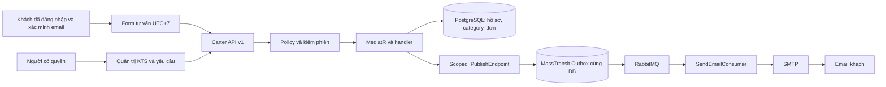
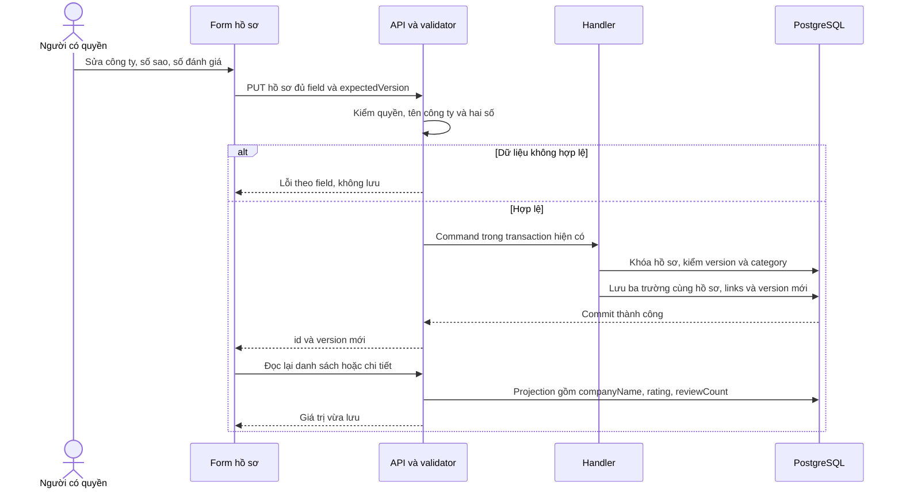
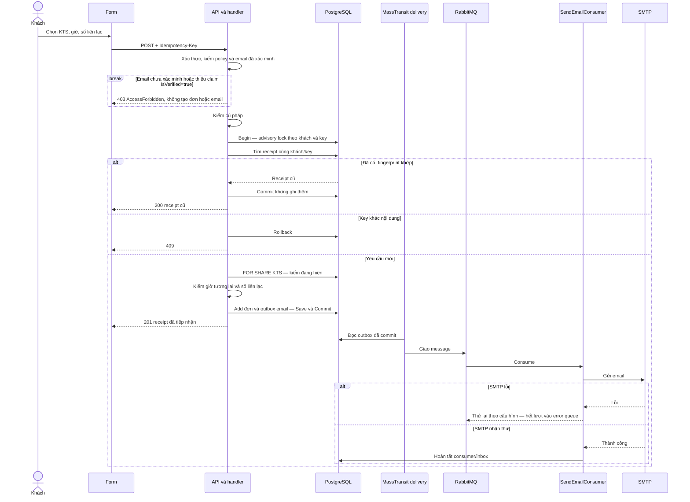
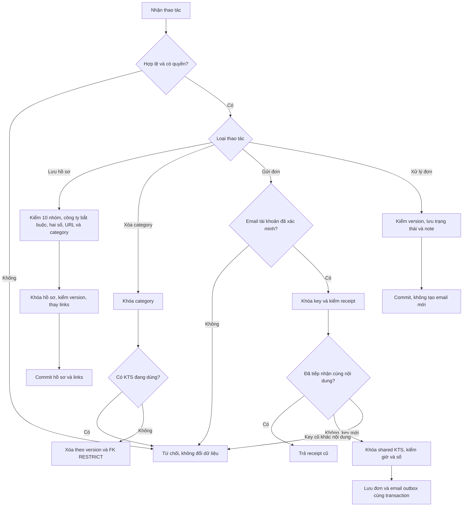
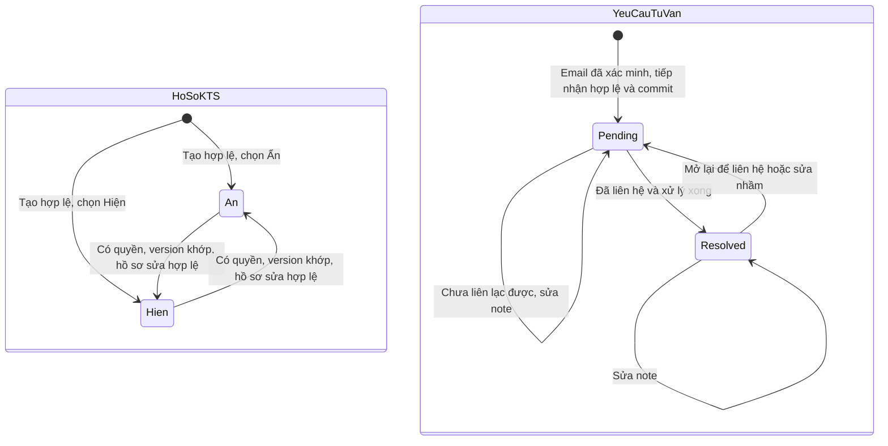
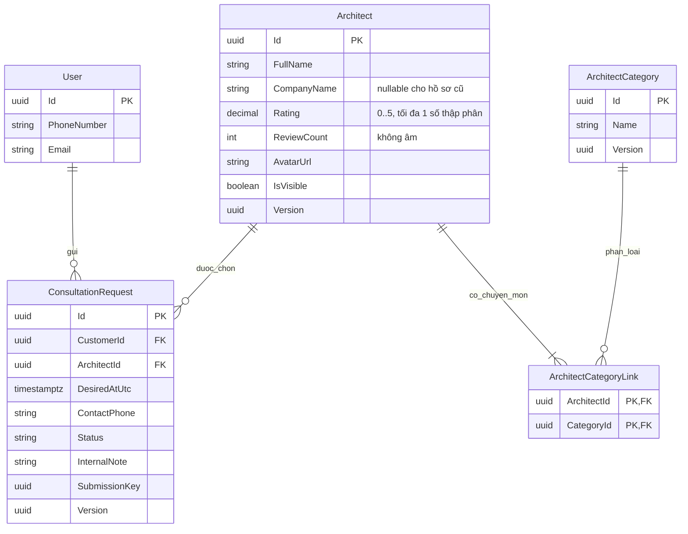

<!-- HƯỚNG DẪN CHO AI KHI ĐIỀN HOẶC CHỈNH SỬA MẪU
- Đọc toàn bộ mẫu, các comment hướng dẫn và tài liệu nguồn được cung cấp trước khi viết. Tuân thủ các quy tắc nghiệp vụ, điều kiện, ngoại lệ và giới hạn đã được xác nhận.
- Không bịa, tự chế hoặc suy đoán thành sự thật: yêu cầu, quy tắc, số liệu, API, schema, mã lỗi, nguồn tham khảo, người phụ trách và kết quả kiểm thử phải có căn cứ. Nội dung ví dụ trong mẫu không phải dữ kiện của dự án.
- Khi thiếu thông tin hoặc các nguồn mâu thuẫn, hỏi người dùng để làm rõ; giữ nguyên placeholder ở phần chưa xác định. Không tự chọn đáp án, lấp chỗ trống hay tuyên bố tài liệu đã hoàn tất.
- Chỉ thay nội dung cần điền hoặc được yêu cầu sửa. Không tự mở rộng phạm vi, sửa nghĩa quy tắc, bỏ điều kiện/ngoại lệ, xoá hay ghi đè nội dung hợp lệ đã có.
- Giữ nguyên tên, cấp và thứ tự heading, nhãn in đậm, tiền tố bullet, cấu trúc danh sách, tên/thứ tự/số cột bảng và cú pháp code fence. Không dịch, đổi tên, gộp hoặc thêm mục ngoài cấu trúc mẫu.
- Chỉ lặp khối luồng, AC hoặc API theo đúng khuôn khi có căn cứ; chỉ bỏ phần tuỳ chọn khi hướng dẫn riêng của mẫu cho phép và đã xác định không áp dụng.
- Mã tham chiếu và section phải trỏ tới tài liệu có thật đã được cung cấp hoặc kiểm chứng. Không giữ mã ví dụ như tham chiếu thật và không tự tạo tài liệu liên quan để hợp thức hoá liên kết.
- Giữ các comment hướng dẫn trong file. Xuất Markdown UTF-8, mỗi file một tài liệu; không bọc toàn bộ file trong code fence, không chèn lời dẫn hay giải thích ngoài mẫu.
- Trước khi bàn giao, đối chiếu nội dung với nguồn, kiểm tra cấu trúc, giá trị cho phép, giới hạn độ dài và tính nhất quán của mã/tham chiếu. Báo rõ phần chưa đủ thông tin; không tuyên bố đã chạy test hoặc import khi chưa thực hiện.
-->

<!-- Thay mã TDD-001 và nội dung ví dụ; giữ nguyên heading và nhãn in đậm.
Sơ đồ dùng mermaid, plantuml hoặc URL. Giữ heading Architecture, Sequence Diagram, Activity Diagram, State Diagram, Data Model.
Ví dụ API phải có heading trùng METHOD /path trong Endpoints. Xoá phần API/sơ đồ không dùng.
Version, Updated At và Change Log do lịch sử phiên bản quản lý, để trống khi nhập mới.
Author/Reviewer là tên hiển thị; gán tài khoản, phê duyệt, giả định và câu hỏi mở trên giao diện sau import.
Thiết kế phải truy vết về Story và Business Rule được cung cấp. Phân biệt thiết kế đề xuất với implementation đã kiểm chứng; không mô tả API/schema/sơ đồ ví dụ như hệ thống thật hoặc tự quyết định nghiệp vụ còn thiếu.
BẮT BUỘC KHI HOÀN THIỆN MẪU: phải có cả Reviewer và Approver, mỗi tên 1–200 ký tự sau khi bỏ khoảng trắng đầu/cuối. Không xoá hai dòng metadata, để trống, dùng tên bịa hoặc giữ placeholder rồi coi là hoàn tất.
Nếu chưa biết người review hoặc người phê duyệt, phải hỏi người dùng và báo tài liệu chưa đủ thông tin; không tự lấy Author/Owner làm người thay thế. Tên trong file không tự gán tài khoản hoặc xác nhận đã duyệt; gán thành viên trên giao diện sau import.
Đây là yêu cầu hoàn thiện mẫu; backend hiện vẫn nhận file cũ thiếu hai trường để tương thích.

VALIDATION CHO FILE NHẬP (đối chiếu ImportSnapshotValidator, MarkdownParser và ImportService):
- Mỗi file .md UTF-8 không rỗng chỉ có một heading cấp 1 chứa mã tài liệu dài 1–100 ký tự. Mã không được trùng trong cùng lần nhập hoặc thuộc loại tài liệu khác đã tồn tại.
- Không dùng tên README.md hoặc sitemap.md vì importer bỏ qua. Giao diện nhận .md/.zip, tối đa 2.000 file, tổng file tải lên 31 MiB; API giới hạn request 32 MiB và tổng nội dung đọc/giải nén 64 MiB.
- Chỉ nhập đè tài liệu cùng loại đang Draft, chưa có phiên bản và chưa lưu trữ. Import thay toàn bộ nội dung bản nháp, vì vậy phải giữ lại nội dung hợp lệ ngoài phần được yêu cầu sửa.
- Không dùng Status trong Markdown hoặc tên Approver để tự xác nhận phê duyệt; import không cấp quyền hay gán tài khoản từ tên. Chạy Kiểm tra file và xử lý lỗi/cảnh báo trước khi nhập.
- Giới hạn độ dài bên dưới tính theo string.Length của .NET (đơn vị UTF-16); không tự cắt ngắn dữ kiện quan trọng để vượt validation, hãy viết lại có căn cứ hoặc hỏi người dùng.
- Feature tối đa 300 ký tự và được dùng làm tiêu đề tài liệu. Status được parser nhận: Draft / In Review / Approved / Deprecated; tài liệu nhập mới vẫn có trạng thái phê duyệt Draft.
- Endpoint: đường dẫn tối đa 500 ký tự; tên/mô tả endpoint được lưu trong Name tối đa 300. HTTP method: GET / POST / PUT / PATCH / DELETE / HEAD / OPTIONS.
- Error Codes: mã tối đa 100 ký tự, không trùng trong tài liệu; giữ dạng - **CODE** (400): mô tả. HTTP status trong Error Codes và Response phải là số nguyên đọc được bằng Int32; không tự đặt status khác hợp đồng API.
- URL sơ đồ tối đa 1.000 ký tự. Mục sơ đồ được sử dụng phải có khối mermaid/plantuml hoặc URL theo mẫu; không để một mục sơ đồ rỗng. Nhãn mục được tách từ bullet như tên External API Fields tối đa 300 ký tự.
- Heading Examples phải khớp METHOD /path ở Endpoints. Giữ các nhãn Request:, Response 200: (thay mã theo contract) và Error Response: để parser tách đúng dữ liệu.
- Tham chiếu dạng DOC-KEY/section: ghi chú: mã đích tối đa 100 ký tự, section tối đa 100, ghi chú tối đa 1.000. Không trùng bộ mã đích + section + loại liên kết trong cùng tài liệu.
ĐỐI CHIẾU FORM TDD (src/features/tdds/validations.ts; form có thể chặt hơn import):
- Điền Feature, Author, Reviewer, Problem và ít nhất một Goal; các Goal/Non-goal/Notes đã thêm không được rỗng. API đã khai báo phải có endpoint và mô tả/mục đích; Fields phải có tên và ý nghĩa; Error Codes phải có mã, HTTP status và điều kiện.
- Form còn kiểm tra Version, Updated At và nội dung Change Log khi khai báo; với file nhập mới, giữ các trường lịch sử này trống theo hợp đồng import, không tự tạo dữ liệu lịch sử.
-->

# TDD-CONSULT-001

## Document Info

- **Feature**: Tư vấn KTS — hồ sơ, category chuyên môn, yêu cầu tư vấn và email tiếp nhận
- **Author**: Tân Trần
- **Reviewer**: Tân Trần
- **Approver**: Tân Trần
- **Status**: Draft
- **Version**:
- **Updated At**:

## Context & Goals

### Problem

Bộ STORY-CONSULT-001, STORY-CONSULT-002, STORY-CONSULT-003 và BR-CONSULT-001 đến BR-CONSULT-005 đã được người dùng chốt trong hội thoại; 41 System Test hiện có là đặc tả; chưa chạy trọn bộ từ giao diện đến database; phần bổ sung ba trường đã được chốt trong US/BR ngày 29/09/2026. Người dùng bổ sung ảnh đại diện bằng đường dẫn ảnh có sẵn, không tải file từ máy lên. Hồ sơ và category do người có quyền quản lý trực tiếp; không có bước phê duyệt trong sản phẩm.

Thiết kế phải tiếp nhận yêu cầu miễn phí từ khách đã đăng nhập và xác minh email tài khoản, lưu giờ mong muốn và số liên lạc trên đơn, rồi để admin liên hệ ngoài hệ thống. Hệ thống không giữ chỗ theo giờ, không thu phí, không kiểm quyền lợi gói và không tạo lịch hẹn chính thức.

Checkout khảo sát có .NET 8, Carter/MediatR/FluentValidation, EF Core/Npgsql 8.0.0; cấu hình Docker dùng PostgreSQL 15. MassTransit RabbitMQ và EF Core Outbox cùng phiên bản 8.4.1. Phiên bản PostgreSQL của môi trường triển khai chưa được kiểm tra. Chưa có entity/API tư vấn trong source. Các file source đang có thay đổi chưa commit; thiết kế lấy nội dung hiện tại làm mốc, không thay các thay đổi đó.

**Hiện trạng triển khai (26/09/2026):** thiết kế này đã có trong code ở hai commit `4d6c386` (module) và `9e4f220` (kiểm tên miền ảnh đại diện) trên nhánh `feature/consultation` của `bmt-be`, dựng trên `develop` tại `c1d757a`, chưa merge. Migration `20260926091223_ConsultationArchitect` tạo bốn bảng, các index và seed `consultation.manage` cho vai trò admin; migration chưa chạy trên môi trường đã triển khai. Unit test theo UT-CONSULT-001 đến UT-CONSULT-048 và integration test trên PostgreSQL 15 đã chạy qua; các System Test ST-CONSULT vẫn chưa thực thi. Những lựa chọn phát sinh khi triển khai ghi ở Architecture/Notes, mục "Khi triển khai".

**Bổ sung ngày 29/09/2026 — đã triển khai backend trong workspace sau khi người dùng chốt:** Công ty bắt buộc nhập tên khi tạo/sửa; Số sao và Số đánh giá nhập thủ công, hiển thị ở danh sách và chi tiết KTS. Hồ sơ cũ thiếu Công ty được giữ nguyên cùng trạng thái hiển thị, bổ sung ở lần sửa tiếp theo. Hai số mới mặc định 0, kể cả hồ sơ cũ. Đã bổ sung ba trường trong `Architect`, command, validator, response và cả bốn projection. Đã chạy qua 135 test nghiệp vụ, 34 test HTTP và 22 test tích hợp PostgreSQL, không bỏ qua test nào; chi tiết và giới hạn bằng chứng nằm trong [tài liệu độ phủ](../discovery/consult-system-test-coverage.md#bằng-chứng-backend-ngày-29092026). Migration `20260929122151_ArchitectProfileSummary` đã kiểm trên container PostgreSQL riêng, chưa áp dụng vào database phát triển đang chạy hoặc môi trường triển khai. Frontend chưa được cập nhật trong phần việc này. Các mô tả khảo sát trước đây bên dưới là bối cảnh lịch sử; thiết kế bổ sung trong bản này áp dụng trên module đã tồn tại.

### Goals

- Lưu hồ sơ có mười nhóm thông tin, gồm Công ty, Số sao và Số đánh giá; bảo toàn hồ sơ cũ thiếu Công ty theo BR-CONSULT-001/Except. Có nhiều category và trạng thái Ẩn/Hiện do người tạo chọn.
- Chặn xóa category đang được bất kỳ KTS nào sử dụng, kể cả khi có thao tác đồng thời.
- Ghi yêu cầu và công việc gửi email trong cùng transaction; lỗi SMTP không làm mất yêu cầu đã tiếp nhận.
- Cho nhiều khách chọn cùng KTS và cùng giờ; gửi lại cùng thao tác do lỗi mạng không tạo thêm đơn.
- Bảo vệ API quản trị bằng quyền có hiệu lực; không trả ghi chú nội bộ qua API khách hoặc email.
- Cung cấp hợp đồng API, schema, sơ đồ, mẫu dữ liệu và thứ tự triển khai để lập trình viên không phải tự đoán luồng chính.

### Non-goals

- Upload hoặc proxy ảnh, thư viện media, tài khoản riêng của KTS, phê duyệt hồ sơ.
- Danh mục công ty, chức năng khách gửi đánh giá, tự tổng hợp số sao/số đánh giá, lọc hoặc sắp xếp theo ba trường mới.
- Lịch rảnh, giữ chỗ, thanh toán, quyền lợi gói, tư vấn trực tuyến trong ứng dụng.
- Liên kết với cam kết tư vấn của gói. Yêu cầu tư vấn KTS miễn phí là kênh riêng, không thay cam kết tư vấn offline đã chốt cho gói theo BR-SUB-004 và BR-SUB-008 (BR-CONSULT-002/Notes, người dùng xác nhận ngày 25/09/2026). Module này không đọc, không trừ và không ghi dữ liệu gói.
- Trang khách theo dõi/sửa/hủy đơn, email khi admin đổi trạng thái hoặc email thông báo admin.
- Xóa hồ sơ KTS hoặc yêu cầu tư vấn; chính sách lưu trữ/xóa dữ liệu dài hạn chưa được giao.
- Tích hợp frontend và triển khai dịch vụ trong phần triển khai backend ngày 29/09/2026. Migration chỉ được kiểm trên database riêng của bộ test.

## Architecture

**Upload và dọn ảnh — áp dụng MEDIA:** [TDD-MEDIA-001](TDD-MEDIA-001.md) thay các mô tả trước đây trong tài liệu này về dịch vụ presign ngoài backend, chỉ frontend kiểm ảnh và backend không dọn file. Upload ảnh mới dùng ba route MEDIA của BMT, nhận JPG/PNG/WebP tối đa 5 MiB và chỉ có URL xem sau khi backend xác minh bytes. API nghiệp vụ tiếp tục nhận URL; khi bật MEDIA, SaveChangesAsync kiểm trạng thái ảnh và đồng bộ nơi sử dụng cùng transaction. Ảnh còn trong nháp, nội dung ẩn hoặc lịch sử được giữ. Sau khi mất nơi sử dụng cuối phải chờ ít nhất 24 giờ; ảnh cũ thiếu lịch sử chờ từ lần đối soát đầy đủ đầu tiên. Ảnh Deleting/Deleted không được gắn lại. Các đoạn mô tả giới hạn hoặc trách nhiệm upload cũ bên dưới chỉ ghi bối cảnh trước MEDIA, không là yêu cầu hiện hành cho ảnh mới. Tệp đính kèm không phải ảnh và luồng đọc nội dung riêng tư vẫn theo hợp đồng riêng của module.

**Phần bổ sung ba trường (29/09/2026):** tiếp tục dùng bảng `Architect`, các API hồ sơ và quyền `consultation.manage`. Công ty là tên nhập trên từng hồ sơ; số sao/số đánh giá là dữ liệu gốc do người có quyền nhập. Không thêm bảng Company, Review, dịch vụ hoặc tác vụ tổng hợp. Cập nhật cả ba trường cùng hồ sơ/category trong transaction hiện có; giữ khóa và `Version` để tránh ghi đè thay đổi của người khác.

| Thành phần đã kiểm tra | Thay đổi backend và phần frontend còn lại |
| --- | --- |
| `bmt-be.domain/entities/Architect.cs` | Thêm `CompanyName` nullable để đọc hồ sơ cũ, `Rating` kiểu decimal và `ReviewCount` kiểu int. |
| `bmt-be.contract/services/architect/Command.cs`, `ArchitectProfileInput.cs`, `Response.cs`; `bmt-be.contract/constants/ConsultationConstants.cs` | Thêm ba thuộc tính ở đầu vào/đầu ra và giới hạn tên công ty 200 ký tự sau trim. Đây là lựa chọn kỹ thuật, không phải danh mục công ty. |
| `bmt-be.contract/services/architect/validators/ArchitectValidators.cs` | Bắt buộc tên công ty khi tạo/sửa; kiểm khoảng, phần thập phân và quan hệ hai số. POST có mặc định 0; PUT yêu cầu gửi đủ hai số để tránh xóa số liệu do client cũ thiếu field. |
| `bmt-be.application/usecases/commands/architect/CreateArchitectCommandHandler.cs`, `UpdateArchitectCommandHandler.cs` | Lưu tên sau trim và đúng hai số đã kiểm; không tự làm tròn, không tự tính; lần sửa vẫn đổi Version. |
| Bốn handler trong `bmt-be.application/usecases/queries/architect/` | Thêm ba trường vào projection public/admin, danh sách/chi tiết; giữ phân trang, thứ tự và quy tắc hồ sơ ẩn. |
| `bmt-be.presentation/apis/architect/ArchitectApi.cs` | Thêm field ở ArchitectBody và mapping command; cập nhật mô tả API, giữ route/policy/envelope. |
| `bmt-be.persistence/configurations/ConsultationConfigurations.cs` | Bổ sung mapping/check vào ArchitectConfiguration thực tế nằm trong file này; migration mới, không sửa migration đã có. |
| Frontend quản trị và trang KTS | Thêm ô công ty bắt buộc, ô số có mặc định 0 khi tạo; khi sửa tải giá trị đã lưu và gửi đủ. Danh sách/chi tiết khách dùng cùng ba giá trị; công ty null của hồ sơ cũ không được thay bằng tên tự tạo. Chưa xác định file frontend trong lần khảo sát này. |

Các đường dẫn trong bảng tính từ `bmt-be/src/`. Phạm vi kiểm chứng: validation và mapping theo đặc tả Unit Test đã đồng bộ sau khi chốt TDD; constraint/migration/transaction bằng PostgreSQL thật; hành vi giao diện–API–database theo ST-CONSULT-033 đến ST-CONSULT-040. Không có thay đổi quyền, email hoặc dữ liệu yêu cầu tư vấn.

**Khảo sát ban đầu trước khi triển khai module (bối cảnh lịch sử)** — đường dẫn dưới đây tính từ `bmt-be/`:

| Thành phần | Hiện trạng và tác động |
| --- | --- |
| `src/bmt-be.persistence/ApplicationDbContext.cs` | Có User, các bảng quyền và ba bảng MassTransit `InboxState`, `OutboxMessage`, `OutboxState`; không có tenant filter hoặc bảng tư vấn. |
| `src/bmt-be.application/behaviors/TransactionPipelineBehavior.cs` và `src/bmt-be.persistence/repositories/EFUnitOfWork.cs` | Command được mở transaction, `CompleteAsync` lưu rồi commit. Handler trả Result thất bại mà không ném exception vẫn có thể commit; thiết kế không dựa vào Result thất bại để rollback. |
| `src/bmt-be.infrastructure/dependencyInjection/extensions/ServiceCollectionExtensions.cs` | Đã dùng `UseBusOutbox()` và consumer EF outbox; Quartz hiện không có job phát email riêng. |
| `src/bmt-be.application/usecases/commands/user/RegisterCommandHandler.cs` | Mẫu publish `SendEmailEvent` qua scoped `IPublishEndpoint` trong transaction. Dùng mẫu này thay domain-event/outbox tự viết từng có trong khảo sát trước. |
| `src/bmt-be.contract/services/messaging/EmailMessages.cs` | Message hiện có `To`, `Subject`, `Body`, `Purpose`; không còn `IdEvent`. MessageId nằm ở envelope của MassTransit. |
| `src/bmt-be.contract/services/user/Response.cs` và `src/bmt-be.application/usecases/queries/user/GetMeHandler.cs` | `GetMeBasic` chưa có `PhoneNumber`. Cần thêm thuộc tính nullable và mapping, không đổi ý nghĩa trường khác. |
| `src/bmt-be.api/dependencyInjection/extensions/JwtExtensions.cs` | Policy mặc định đòi email đã xác minh; `AuthenticatedOnly` chỉ đòi đăng nhập. Kiểm tra lại ngày 25/09/2026: policy theo mã quyền (claim `perm`) và bước so dấu phiên trong `OnTokenValidated` đã có theo [TDD-RBAC-001](TDD-RBAC-001.md). |
| `src/bmt-be.contract/constants/PermissionNames.cs` và `src/bmt-be.api/startup/PermissionCatalogGuard.cs` | Kiểm tra lại ngày 25/09/2026: có 9 mã, gồm tám mã khởi tạo còn lại sau khi bỏ `supervision.reassign` và `plan.manage`. Danh mục theo [TDD-RBAC-001](TDD-RBAC-001.md#data-model) gồm 13 mã sau khi bỏ `supervision.reassign` ngày 25/09/2026; `consultation.manage` là mã module này thêm. Startup từ chối nếu tập mã code khác DB, kể cả DB có mã mới hơn code. |
| `src/bmt-be.persistence/repositories/RepositoryBase.cs` | Generic repository đòi kế thừa `Entity<TKey>`, kéo theo `IsDeleted`. Module mới dùng repository chuyên biệt để không mang thêm xóa mềm ngoài vòng đời đã chốt. |
| `src/bmt-be.api/middlewares/ExceptionHandlingMiddleware.cs` | Có 400/401/403/404/422, 409 cho unique violation; chưa có ánh xạ xung đột phiên bản và lỗi tạm thời dành cho module này. |

**Phân chia trách nhiệm đề xuất**:

| Thành phần dự kiến | Trách nhiệm |
| --- | --- |
| `ArchitectApi`, `ArchitectCategoryApi`, `ConsultationRequestApi` trong presentation | Route version 1, kiểm policy, đọc header chống lặp, đưa DTO vào MediatR; không chứa SQL hoặc gọi SMTP. |
| `contract/services/architect`, `architectCategory`, `consultationRequest` | Command, query, response riêng cho public/admin; validator đồng bộ cho dữ liệu đầu vào. |
| Command/query handler trong application | Điều phối rule, thời gian, khóa, phiên bản, chọn số liên lạc, tạo email; không quản lý transaction thứ hai. |
| `IArchitectRepository`, `IArchitectCategoryRepository`, `IConsultationRequestRepository` trong domain | Hợp đồng đọc/ghi và khóa, triển khai trong persistence bằng cùng scoped `ApplicationDbContext` với UoW/outbox. Repository bảng gán nằm trong repository hồ sơ. |
| `Architect`, `ArchitectCategory`, `ArchitectCategoryLink`, `ConsultationRequest` | Các lớp dữ liệu riêng, không kế thừa `Entity<Guid>`; ba bảng chính có Guid Id, bảng liên kết có khóa ghép. Không có `IsDeleted`. |
| `TimeProvider` | Cấp thời gian UTC cho kiểm tra giờ mong muốn. Không gọi giờ máy ở nhiều điểm rồi so với các mốc khác nhau. |
| `ConsultationEmailTemplate` | Tạo HTML từ các trường cho phép; encode tên KTS, nội dung và số điện thoại, không nhận entity hoặc ghi chú nội bộ làm dữ liệu template. |
| MassTransit Bus Outbox và `SendEmailConsumer` hiện có | Giao email sau commit, tự thử lại SMTP; không thêm broker hoặc job phát email khác. |



**Quyền và phiên**:

Toàn bộ chức năng quản trị tư vấn KTS dùng một mã quyền `consultation.manage`, `RequiresAssignment=false`: quản lý hồ sơ KTS, quản lý category chuyên môn, xem yêu cầu và cập nhật trạng thái/ghi chú của yêu cầu. Đây là một trong năm mã quản trị người dùng xác nhận ngày 25/09/2026, mỗi chức năng quản trị một mã (STORY-RBAC-001/Preconditions, BR-RBAC-010 khoản 4). Seed mã vào Permission và RolePermission của vai trò hệ thống admin. Không tự cấp cho các vai trò khác; người quản trị gán cho vai trò khác qua quản lý vai trò. Người có quyền tạo hồ sơ không cần người khác duyệt. Không thêm OrganizationId, tenant hoặc phân công KTS theo nhân viên vì chưa có nghiệp vụ đó.

Policy quản trị kiểm theo mã quyền qua cơ chế RBAC chung, không kiểm tên hay mã vai trò và không tin nút ẩn trên frontend. Đường phát hành và làm mới claim quyền, policy theo mã quyền và kiểm dấu phiên đã có theo TDD-RBAC-001; module này chỉ thêm mã `consultation.manage` và gắn policy vào endpoint. Không tự xây một bộ phân quyền riêng chỉ cho tư vấn. Thiếu quyền trả 403 theo BR-RBAC-011; yêu cầu bị từ chối không ghi dữ liệu nào của module. Phiên reset mật khẩu không được dùng để gọi API nghiệp vụ; tài khoản khóa/xóa hoặc phiên đã bị thu hồi bị chặn bởi cơ chế xác thực chung. Khi triển khai vẫn phải kiểm chứng các điều kiện này trên endpoint mới.

Gửi yêu cầu dùng policy `ConsultationCustomer`, dùng chung `BaseAccessPolicy`: phiên đăng nhập thông thường hợp lệ, bắt buộc claim `IsVerified=true`; User tồn tại và thuộc Customer. Claim này được dựng từ `User.IsEmailVerified` khi cấp phiên. Không yêu cầu có gói dịch vụ. Email chưa xác minh hoặc thiếu claim xác minh trả 403 `AccessForbidden` trước khi gọi handler, không ghi đơn hoặc email vào outbox. Điều kiện áp dụng cho cả cookie web, Bearer mobile và yêu cầu gửi lại. Đọc số và email từ User theo UserId lấy từ phiên. Không nhận customerId, email nhận thư, trạng thái hoặc ghi chú từ body khách. `GET /users/me` tiếp tục policy hiện có; chỉ thêm phoneNumber nullable để điền form.

Đường đọc hồ sơ cùng category gắn trên hồ sơ cho trang tư vấn là dữ liệu công khai; hồ sơ ẩn trả 404 tại đường public. Đường quản trị không dùng bộ lọc `IsVisible` để đọc hồ sơ hoặc đơn cũ. Xem và cập nhật yêu cầu dùng chung `consultation.manage`; PATCH vẫn chỉ trả xác nhận tối thiểu (id, version), không trả lại dữ liệu cá nhân.

**Bảo vệ request và dữ liệu**:

API mới chỉ nhận JSON cho thao tác ghi. Chống CSRF dùng lớp chung ở [TDD-AUTH-001](TDD-AUTH-001.md), module không có filter riêng và không dùng header `X-BMT-Request`: request ghi dùng cookie phải có `Origin` (không có thì `Referer`) khớp chính xác danh sách frontend được cấu hình, mang cookie mà thiếu cả hai cũng bị từ chối; client dùng Bearer không bị kiểm. CORS phải giữ allowlist cụ thể, không wildcard với credentials. Không coi CORS là phân quyền. Frontend gọi từ trình duyệt không phải gửi header riêng.

Ảnh là URL HTTPS tuyệt đối do admin nhập, giới hạn độ dài và không có user-info trong URL; không nhận `javascript:`, `data:` hoặc đường dẫn file. URL còn phải thuộc tên miền của kho presign khai báo ở `UploadedFileOption__AllowedHosts`, kiểm bằng `IUploadedFileUrlPolicy` dùng chung với ảnh dự toán, không viết bộ kiểm thứ hai (BR-CONSULT-001 khoản 9, người dùng xác nhận ngày 26/09/2026). Tạo hồ sơ luôn kiểm; sửa hồ sơ chỉ kiểm khi URL mới khác URL đang lưu, giống ảnh dự toán. Tên miền ngoài danh sách trả 422 `ConsultationInputInvalid`; chưa cấu hình tên miền nào thì trả 503 `DependencyUnavailable`, không nhận URL bất kỳ. Backend không tải URL để kiểm tra hoặc làm proxy, tránh biến API thành công cụ truy cập mạng nội bộ. Frontend dùng img với `referrerPolicy=no-referrer`, hiển thị ảnh dự phòng khi host ngoài không truy cập được; không tuyên bố kiểm chứng bytes hoặc quyền sở hữu ảnh. Giới thiệu, category, message và internalNote là plain text; không render HTML do người nhập cung cấp. Không ghi số điện thoại, email đầy đủ, body hoặc URL có query vào log mới. Consumer hiện log email người nhận; khi tích hợp cần che địa chỉ trong log, không log nội dung thư.

**Transaction, gửi lại và thao tác đồng thời**:

1. Ghi hồ sơ và thay tập category trong một transaction. Khóa hàng Architect bằng `FOR UPDATE`, kiểm expectedVersion, kiểm tập category hợp lệ và không rỗng; giữ khóa category theo thứ tự Id trước khi ghi links. Category được giữ bằng `FOR KEY SHARE` trong lúc gán. Xóa category khóa category bằng `FOR UPDATE`, kiểm links bằng `EXISTS` rồi xóa; FK RESTRICT là lớp chặn cuối. Xóa không khóa ngược hồ sơ để tránh vòng chờ. Xung đột category vừa xóa trả lỗi rõ thay vì lưu hồ sơ mất chuyên môn.
2. Gửi yêu cầu giữ `FOR SHARE` trên Architect, kiểm `IsVisible` rồi ghi đơn. Thao tác ẩn/sửa lấy `FOR UPDATE` trên cùng hàng. Nếu ẩn commit trước thì từ chối đơn; nếu gửi đã giữ khóa trước thì đơn được tiếp nhận trước khi việc ẩn hoàn tất. Khóa chỉ sống trong transaction ngắn, không phải giữ chỗ theo khung giờ; hai khách cùng gửi dùng shared lock nên đều được nhận. Cơ chế khóa dựa trên PostgreSQL 15, không áp dụng suy luận từ EF InMemory. [Nguồn PostgreSQL](https://www.postgresql.org/docs/15/explicit-locking.html).
3. Các bảng chính có `Version` UUID, EF `IsConcurrencyToken()`. Client gửi expectedVersion khi sửa/xóa; khi tạo hồ sơ mới sinh Id/Version trước, chỉ khóa các category đã chọn vì chưa có hàng Architect để khóa; handler so khớp và sinh UUID mới mỗi lần thay đổi. Chỉ sửa category links cũng phải đổi Version của Architect. Hai admin sửa cùng bản: một thành công, người còn lại nhận 409 rồi tải lại; không ghi đè im lặng. Không dùng xmin trong hợp đồng để tránh lộ token nội bộ của DB.
4. POST đơn bắt buộc `Idempotency-Key` là UUID do FE tạo một lần cho lần bấm gửi. Cặp `(CustomerId, SubmissionKey)` là duy nhất. Handler lấy transaction advisory lock theo 64 bit đầu SHA-256 của chuỗi UTF-8 `consultation:v1:{customerId:D}:{key:D}` theo thứ tự byte big-endian; không dùng `GetHashCode()`. Sau khóa mới đọc receipt. Cùng khóa và fingerprint trả receipt cũ, không publish lại; cùng khóa khác nội dung trả 409. Va chạm khóa advisory chỉ làm hai request chờ nhau, không cho đọc nhầm receipt vì truy vấn vẫn dùng cả CustomerId và SubmissionKey. Unique index vẫn chặn khi có writer không theo protocol.
5. Fingerprint SHA-256 của JSON canonical UTF-8 không BOM, không khoảng trắng, dùng writer .NET cố định cấu hình và thứ tự thuộc tính, có schemaVersion=1; các trường lần lượt là architectId dạng D, desiredAt chuẩn UTC ticks dạng số nguyên, contactPhone đã trim nhưng vẫn phân biệt null với chuỗi trống, message trim và rỗng thành null. Không dùng số tài khoản thay cho null trước khi hash: nếu tài khoản đổi số sau timeout, gửi lại cùng input vẫn nhận receipt cũ. Kiểm replay sau xác thực và validation cú pháp nhưng trước điều kiện ngày giờ tương lai/KTS hiển thị hiện tại; một đơn đã tiếp nhận không thành lỗi chỉ vì replay sau đó hoặc KTS vừa bị ẩn. Khóa mới biểu thị lần gửi mới, vẫn cho cùng thời gian. Không đặt thời hạn tự xóa receipt; giữ cùng vòng đời đơn.
6. Với đơn mới, backend lấy số override nếu có; nếu contactPhone null thì lấy số tài khoản. Chuỗi trống do khách xóa ô nhập bị từ chối, không âm thầm dùng lại số tài khoản. Tất cả số được kiểm tra trước khi lưu; không sửa User. Tạo đơn, dựng nội dung email từ dữ liệu tiếp nhận và `Publish<SendEmailEvent>` trong cùng scope/transaction. Chỉ trả thành công sau CompleteAsync. Ném exception khi lỗi sau khi đã ghi; không trả Result.Failure để mong pipeline rollback.
7. SMTP chạy ngoài SQL transaction. Bus Outbox giữ message đến lúc commit rồi mới chuyển cho broker; đây là giải pháp cho tình huống API chết sau khi lưu đơn nhưng trước khi gửi message. Consumer Outbox/inbox không biến SMTP thành transaction: nếu SMTP đã nhận nhưng consumer chết trước khi lưu dấu hoàn tất thì thư có thể lặp. Không cam kết email “đúng một lần”. [Nguồn MassTransit](https://masstransit.massient.com/concepts/outbox).

**Ánh xạ nghiệp vụ và nơi kiểm chứng**:

| Căn cứ | Nơi thực hiện trong thiết kế | System Test đã có |
| --- | --- | --- |
| BR-CONSULT-001/Then: hồ sơ, chuyên môn, ẩn/hiện, xóa category | Validator hồ sơ/category; transaction hồ sơ-links; FK RESTRICT và protocol khóa; public projection | ST-CONSULT-001 đến ST-CONSULT-010; ST-CONSULT-018; ST-CONSULT-029 |
| BR-CONSULT-001 khoản 7, 10–13 và Except: ba trường nhập thủ công, hiển thị và hồ sơ cũ | Validator, mapping, CHECK số, projection và migration cộng thêm cột | ST-CONSULT-001, ST-CONSULT-008, ST-CONSULT-033 đến ST-CONSULT-040 |
| BR-CONSULT-002/Then: đăng nhập, xác minh email, số liên lạc, không phụ thuộc gói | ConsultationCustomer; GetMeBasic.PhoneNumber; handler lựa chọn số; không gọi dịch vụ gói | ST-CONSULT-011 đến ST-CONSULT-015; ST-CONSULT-021 |
| BR-CONSULT-003/Then: giờ mong muốn tương lai, trùng giờ, UTC+7 | Handler TimeProvider và DateTimeOffset; không unique theo KTS/giờ; FE/email format UTC+7 | ST-CONSULT-016, ST-CONSULT-017, ST-CONSULT-022 |
| BR-CONSULT-004/Then và Except: hai trạng thái, mở lại, note nội bộ | CHECK status; command quản trị có version; DTO public không note | ST-CONSULT-023 đến ST-CONSULT-029 |
| BR-CONSULT-005/Then và Except: email tiếp nhận và xử lý lỗi | Template allowlist; scoped Publish và Bus Outbox; consumer retry/error queue | ST-CONSULT-019, ST-CONSULT-020, ST-CONSULT-024, ST-CONSULT-030 |

Các hợp đồng kỹ thuật mới cần được kiểm chứng thêm khi triển khai: replay cùng key/cùng payload và khác payload, response bị mất sau commit, hai transaction cùng key, stale version, category vừa được gán/xóa đồng thời, rollback sau khi tạo message nhưng trước commit, cookie request sai Origin và template có ký tự HTML. Đây là phạm vi kiểm chứng; đặc tả Unit Test được liên kết ở References, không phải kết quả chạy.

**File dự kiến thêm/sửa** — đường dẫn tính từ backend:

| Phần | File hoặc thư mục |
| --- | --- |
| Model và cấu hình | `src/bmt-be.domain/entities/{Architect,ArchitectCategory,ArchitectCategoryLink,ConsultationRequest}.cs`; các configuration cùng tên trong `src/bmt-be.persistence/configurations/`; `ApplicationDbContext.cs`, `constants/TableNames.cs`; migration mới sau mốc đang có |
| Repository | Ba interface tương ứng trong `domain/abstractions/repositories/`, ba implementation trong `persistence/repositories/`; đăng ký scoped trong persistence DI. Inject trực tiếp repository chuyên biệt, không thêm vào generic GetRepository<TEntity> đòi Entity<Guid>. |
| API/use case | Các thư mục services, usecases/commands, usecases/queries và apis cho architect, architectCategory, consultationRequest; handler command kết thúc tên bằng Command để vào transaction pipeline |
| Quyền và bảo vệ request | Hằng `consultation.manage` trong `PermissionNames.cs`, migration seed Permission/RolePermission cho admin; policy/claim/kiểm phiên dùng hạ tầng RBAC chung đã có; chống CSRF dùng lớp chung ở [TDD-AUTH-001](TDD-AUTH-001.md), không thêm filter riêng |
| Tài khoản và email | `contract/services/user/Response.cs`, `GetMeHandler.cs`; `contract/templates/ConsultationEmailTemplate.cs`; log người nhận ở `SendEmailConsumer.cs`; timeout SMTP ở `MailOption`/`MailService` làm ở thay đổi riêng (commit `e451773`, xem Notes) |
| Lỗi | Kiểu conflict/service-unavailable và ánh xạ có kiểm soát trong `ExceptionHandlingMiddleware.cs`; không đổi envelope của endpoint cũ |

**Notes**:

- Dùng một module trong backend hiện có, cùng PostgreSQL và các dịch vụ có sẵn; chưa có số liệu cần tách dịch vụ, cache, partition hoặc search engine. Không cache danh sách KTS trong bản đầu để việc ẩn có hiệu lực ngay ở đường đọc backend.
- Các repository chuyên biệt không tự mở/commit transaction và không dispose DbContext; lifetime thống nhất với UoW và scoped publish endpoint. Đăng ký mới dùng scoped. Class mới không triển khai `IAuditableEntity`: handler lấy một `TimeProvider.GetUtcNow()` để đặt CreatedOnUtc cùng receipt, tránh interceptor hiện có ghi đè mốc thời gian bằng đồng hồ khác. Cột audit vẫn được ánh xạ tường minh.
- Khi xử lý admin, chỉ cập nhật Status/InternalNote/ModifiedOnUtc/Version; không sửa KTS, giờ khách chọn hoặc số liên lạc. Cả hai trạng thái cho phép sửa note; mở lại không gửi email.
- Lý do khách không còn nhu cầu được ghi trong note theo quy trình đã chốt. Backend không thể suy ra nội dung cuộc gọi, nên không tự yêu cầu note ở mọi lần đánh dấu Đã xử lý và không thêm enum lý do.
- API receipt gửi lại chỉ trả id, receivedAtUtc và message tiếp nhận cố định; không trả trạng thái xử lý hiện tại để tránh vô tình tạo API theo dõi cho khách.
- Chiến lược kiểm thử: Unit kiểm tra validation, ánh xạ và quyết định handler; PostgreSQL thật kiểm FK, lock, version, idempotency và rollback đơn/outbox; RabbitMQ/SMTP thử kiểm email. Phần bổ sung ba trường có đặc tả UT-CONSULT-049 đến UT-CONSULT-059 cùng các UT hiện có được cập nhật sau khi người dùng chốt TDD ngày 29/09/2026; CHECK và kiểu numeric kiểm riêng tại ST-CONSULT-041.
- Thứ tự triển khai dự kiến: thêm mã `consultation.manage` và policy → cấu hình schema/repository → quản trị hồ sơ/category → đọc public và bổ sung phoneNumber → gửi đơn/outbox → quản trị đơn → tích hợp FE và kiểm chứng. Xem Data Model/Notes về cửa sổ nâng cấp quyền.
- Khi triển khai (26/09/2026), ảnh đại diện được kiểm cú pháp rồi kiểm tên miền kho presign như mục Bảo vệ request và dữ liệu. Người dùng xác nhận quyết định này ngày 26/09/2026.
- Theo yêu cầu ngày 30/09/2026, policy `ConsultationCustomer` kiểm phiên: đã đăng nhập, email đã xác minh (`IsVerified=true`), không phải phiên quên mật khẩu, không bị bắt đổi mật khẩu. Token không mang loại tài khoản, nên handler đọc User để kiểm chưa xóa, `Status=Active` và `AccountKind=Customer`; sai một điều kiện thì trả 403 `AccessForbidden`. Tài khoản bị khóa hoặc phiên bị thu hồi đã bị chặn ở bước so dấu phiên.
- Khi triển khai, lỗi 503 `ConsultationTemporarilyUnavailable` chỉ dùng cho lệnh ghi của module khi PostgreSQL báo chờ vòng (40P01), không lấy được khóa (55P03), câu lệnh bị hủy (57014), lỗi tuần tự hóa (40001), hoặc Npgsql báo hết thời gian chờ. Transaction đã rollback nên client gửi lại với cùng Idempotency-Key.
- `internalNote` được bỏ khoảng trắng đầu/cuối; chuỗi chỉ có khoảng trắng được lưu thành NULL, giống cách chuẩn hóa `message`. Người dùng xác nhận ngày 26/09/2026.
- Người dùng đồng ý timeout SMTP 30 giây ngày 26/09/2026 và làm ở một thay đổi riêng vì ảnh hưởng mọi loại email (xác thực tài khoản, quên mật khẩu, tư vấn). Đã làm ở commit `e451773` trên nhánh `feature/smtp-timeout` của `bmt-be`, chưa merge vào `develop`. Tên `SmtpTimeoutSeconds` trong đề xuất trước được đổi thành `TimeoutSeconds` nằm trong `MailOption`: biến môi trường `MailOption__TimeoutSeconds`, trong compose và workflow deploy là `MAIL_TIMEOUT_SECONDS`, để trống thì dùng 30. Hạn này áp cho từng bước kết nối, xác thực, gửi thư và ngắt kết nối. Quá hạn thì adapter ném `TimeoutException`, `SendEmailConsumer` ném lại để MassTransit thử lại theo cấu hình retry hiện có. Giá trị 0 hoặc âm làm API từ chối khởi động. `SendEmailConsumer` ghi địa chỉ người nhận ở dạng che, ví dụ `c***@example.test`, cho mọi loại email.

## Sequence Diagram

Luồng sửa hồ sơ với ba trường mới dùng transaction và kiểm phiên bản hiện có. Hồ sơ cũ chưa có Công ty vẫn đọc được; mọi lần lưu sửa phải bổ sung tên hợp lệ.



Luồng gửi mới và gửi lại dùng chung receipt. Email được tạo từ nội dung lúc tiếp nhận, không đọc lại ghi chú của admin khi consumer chạy.



## Activity Diagram



## State Diagram

Hai vòng đời độc lập. Hiển thị hồ sơ không phải trạng thái phê duyệt, trạng thái đơn không mô tả buổi tư vấn.



## Data Model

Module dùng bốn bảng trong schema `public`; phần bổ sung ngày 29/09 chỉ thêm ba cột vào Architect, tên PascalCase theo bảng `User` hiện có. UUID do ứng dụng sinh, không dùng tên KTS/category làm khóa. Một bảng chỉ sở hữu một nhóm dữ kiện: hồ sơ sở hữu thông tin KTS; category sở hữu tên chuyên môn; link sở hữu quan hệ; request sở hữu lần gửi và nội dung liên hệ. Không lưu category dạng CSV/JSON trong hồ sơ và không sao chép danh sách chuyên môn vào đơn.

**Architect — một dòng là một hồ sơ KTS.** Người có quyền tạo/sửa; không liên kết với User của KTS. `IsVisible` chỉ điều khiển việc hiển thị/nhận yêu cầu mới. Số năm kinh nghiệm và số công trình do admin nhập, không tính từ các bảng dự án. `CompanyName`, `Rating` và `ReviewCount` cũng do người có quyền nhập; không có bảng đánh giá làm nguồn tổng hợp. Công ty là thuộc tính văn bản của hồ sơ, không phải khóa liên kết tới tổ chức.

| Cột | PostgreSQL / C# | NULL / mặc định | Ý nghĩa và ràng buộc |
| --- | --- | --- | --- |
| Id | uuid / Guid | Không; app sinh | PK |
| FullName | varchar(200) / string | Không | Họ tên, trim, không rỗng |
| Title | varchar(200) / string | Không | Chức danh, không rỗng |
| CompanyName | varchar(200) / string? | Có; NULL cho hồ sơ cũ | Tên công ty, trim, tối đa 200 ký tự; ứng dụng bắt buộc có nội dung khi tạo/sửa. NULL chỉ phục vụ hồ sơ cũ chưa bổ sung. |
| Rating | numeric / decimal | Không; mặc định 0 | Số sao nhập thủ công, 0–5; giá trị có tối đa một chữ số thập phân, không tự làm tròn đầu vào sai. |
| ReviewCount | integer / int | Không; mặc định 0 | Số đánh giá nhập thủ công, số nguyên không âm; bằng 0 thì Rating phải bằng 0. |
| AvatarUrl | varchar(2048) / string | Không | URL HTTPS tuyệt đối, không rỗng; app kiểm cú pháp và tên miền kho presign |
| YearsExperience | integer / int | Không; không mặc định | Số năm, số nguyên >= 0 |
| ProjectCount | integer / int | Không; không mặc định | Số công trình, số nguyên >= 0 |
| Introduction | varchar(5000) / string | Không | Giới thiệu plain text, không rỗng |
| IsVisible | boolean / bool | Không; không mặc định | Client phải chọn; dùng bool? ở DTO để phát hiện thiếu |
| Version | uuid / Guid | Không; app sinh | Concurrency token; đổi mỗi lần cập nhật kể cả links |
| CreatedOnUtc | timestamptz / DateTimeOffset | Không; app cấp UTC | Thời điểm tạo, không đổi |
| ModifiedOnUtc | timestamptz / DateTimeOffset? | Có; NULL ban đầu | Lần sửa gần nhất |

**ArchitectCategory — một dòng là một category chuyên môn.** Người có quyền tạo/sửa/xóa, dùng chung cho nhiều KTS. Bản đầu chỉ cần tên; không thêm cây danh mục, mô tả, slug hoặc trạng thái category. Chưa có quy tắc tên phải duy nhất nên không tự chặn hai category trùng tên; danh tính là Id.

| Cột | PostgreSQL / C# | NULL / mặc định | Ý nghĩa và ràng buộc |
| --- | --- | --- | --- |
| Id | uuid / Guid | Không; app sinh | PK |
| Name | varchar(200) / string | Không | Tên trim, không rỗng |
| Version | uuid / Guid | Không; app sinh | Kiểm sửa/xóa đồng thời |
| CreatedOnUtc | timestamptz / DateTimeOffset | Không | Thời điểm tạo |
| ModifiedOnUtc | timestamptz / DateTimeOffset? | Có | NULL khi chưa sửa |

**ArchitectCategoryLink — một dòng là việc gán một category cho một KTS.** Chỉ được tạo/xóa khi lưu toàn bộ tập chuyên môn của hồ sơ, trong cùng transaction; không có API bỏ từng link độc lập. Khóa ghép ngăn gán trùng cùng category. Không có tên category, thứ tự hoặc trường audit vì chúng không thuộc quan hệ đã chốt.

| Cột | PostgreSQL / C# | NULL / mặc định | Ý nghĩa và ràng buộc |
| --- | --- | --- | --- |
| ArchitectId | uuid / Guid | Không | PK thành phần; FK Architect, ON DELETE RESTRICT |
| CategoryId | uuid / Guid | Không | PK thành phần; FK ArchitectCategory, ON DELETE RESTRICT |

Bắt buộc có ít nhất một link là bất biến xuyên bảng; CHECK đơn giản không đếm được bảng khác. Handler kiểm tập category không rỗng rồi thay links trong transaction có khóa hồ sơ. Tất cả writer của module phải đi qua protocol này; không tuyên bố DB tự chặn hồ sơ 0 category khi ghi SQL trực tiếp. Không cấp quyền ghi trực tiếp các bảng cho công cụ vận hành thông thường. Khi kiểm chứng migration, chạy truy vấn phát hiện hồ sơ không có link.

**ConsultationRequest — một dòng là một yêu cầu tư vấn đã tiếp nhận.** Khách tạo qua API, admin chỉ sửa hai trường Status/InternalNote. `ContactPhone` là dữ kiện của đơn, có thể khác và không chạy theo User.PhoneNumber. `CustomerId` và `ArchitectId` là tham chiếu bền vững. Tên khách/KTS trong trang admin lấy từ bản hiện tại qua projection; email tiếp nhận đã dựng trong outbox giữ nguyên nội dung lúc gửi. Không thêm bảng lịch hẹn.

| Cột | PostgreSQL / C# | NULL / mặc định | Ý nghĩa và ràng buộc |
| --- | --- | --- | --- |
| Id | uuid / Guid | Không; app sinh | PK, mã tham chiếu kỹ thuật |
| CustomerId | uuid / Guid | Không | FK User, ON DELETE RESTRICT; lấy từ phiên |
| ArchitectId | uuid / Guid | Không | FK Architect, ON DELETE RESTRICT |
| DesiredAtUtc | timestamptz / DateTimeOffset | Không | Thời điểm mong muốn; app đổi về UTC trước ghi |
| ContactPhone | varchar(20) / string | Không | Số đã chọn cho đơn, không rỗng |
| Message | varchar(5000) / string? | Có | Nội dung tư vấn; rỗng/whitespace chuẩn hóa NULL |
| Status | varchar(16) / string | Không; Pending | Chỉ Pending hoặc Resolved |
| InternalNote | varchar(5000) / string? | Có; NULL ban đầu | Ghi chú nội bộ; không vào email |
| SubmissionKey | uuid / Guid | Không | Khóa gửi lại của client, phạm vi từng CustomerId |
| PayloadHash | char(64) / string | Không | SHA-256 hex chữ thường của input đã chuẩn hóa |
| Version | uuid / Guid | Không; app sinh | Token cập nhật admin |
| CreatedOnUtc | timestamptz / DateTimeOffset | Không | Mốc tiếp nhận dùng trong receipt |
| ModifiedOnUtc | timestamptz / DateTimeOffset? | Có | NULL trước lần cập nhật admin đầu tiên |

Giờ lưu UTC vì PostgreSQL timestamptz biểu diễn một thời điểm; không giữ offset gốc. API nhận ISO-8601 có offset bắt buộc, chuẩn hóa UTC; trả UTC, FE và email hiển thị UTC+7. Không so với User.TimeZone. `DesiredAtUtc > TimeProvider.GetUtcNow()` được kiểm sau khi giữ khóa KTS và ngay trước tạo đơn; không đặt CHECK dựa `now()` vì đơn hợp lệ hôm nay sẽ trở thành quá khứ về sau. [Nguồn Npgsql](https://www.npgsql.org/doc/types/datetime.html).

Các giới hạn độ dài 200/2048/5000 là lựa chọn validation kỹ thuật trong TDD. Riêng quy tắc Rating 0–5, tối đa một chữ số thập phân, ReviewCount không âm và ReviewCount=0 kéo theo Rating=0 đã được người dùng chốt ngày 29/09/2026. Phone dài tối đa 20 theo User hiện có: chấp nhận dấu + đầu, chữ số ASCII, dấu cách, dấu chấm, gạch ngang và ngoặc; bắt buộc có ít nhất một chữ số, không tự ép đầu số Việt Nam hoặc chuẩn hóa sang E.164. Không thêm OTP. FE và BE cùng thực hiện giới hạn này; số năm/số công trình bằng 0 hợp lệ, thiếu/null khác 0. CategoryIds không rỗng, UUID khác empty, không lặp, tất cả phải tồn tại. Không đặt trần số category ngoài giới hạn request hạ tầng đã cấu hình.



ERD thể hiện tối thiểu một chuyên môn theo nghiệp vụ; FK chỉ bảo đảm từng link có cha, minimum một link được handler/transaction bảo vệ. Các cột không vẽ hết phải theo từ điển dữ liệu ở trên.

| Cha → con | Quan hệ | Chủ FK | Hành vi xóa |
| --- | --- | --- | --- |
| User → ConsultationRequest | Một khách có 0..n đơn; đơn có đúng một khách | ConsultationRequest | RESTRICT xóa vật lý User; soft delete User không xóa đơn |
| Architect → ConsultationRequest | Một KTS có 0..n đơn; đơn có đúng một KTS | ConsultationRequest | RESTRICT; không có API xóa KTS |
| Architect → ArchitectCategoryLink | Một KTS có 1..n links theo ứng dụng | Link | RESTRICT; không tự cascade dữ liệu |
| ArchitectCategory → ArchitectCategoryLink | Một category có 0..n links | Link | RESTRICT, gồm links của KTS ẩn |

**Mẫu dữ liệu lưu trữ** — chỉ là dữ liệu giả định để giải thích, không phải seed đã chạy. `U1`, `A1`, `C1`, `C2`, `R1`, `K1`, `V1` là bí danh UUID, không phải chuỗi lưu vào cột uuid. Bảng mẫu lược một số cột đã mô tả; giả sử đang ở `2026-09-23T02:00:00Z`.

| Bảng | Bản ghi minh họa |
| --- | --- |
| User (dùng lại, không đổi schema) | Id=U1; Email=`customer@example.test`; PhoneNumber=`0900000001`. Schema thật: [UserConfiguration.cs](../../bmt-be/src/bmt-be.persistence/configurations/UserConfiguration.cs). |
| ArchitectCategory | Id=C1, Name=Nhà phố, Version=V1, CreatedOnUtc=2026-09-23T01:00:00Z, ModifiedOnUtc=NULL; C2 tương tự với Name=Nội thất và UUID version riêng. |
| Architect | Id=A1; FullName=Nguyễn An; Title=KTS; CompanyName=Công ty An; Rating=4.8; ReviewCount=120; AvatarUrl=`https://images.example.test/kts/an.jpg`; YearsExperience=5; ProjectCount=12; Introduction=Tư vấn thiết kế nhà phố; IsVisible=true; Version=V2; CreatedOnUtc=2026-09-23T01:10:00Z; ModifiedOnUtc=NULL. |
| ArchitectCategoryLink | Hai dòng (A1,C1) và (A1,C2); không có thêm bản sao tên chuyên môn. |
| ConsultationRequest | Id=R1; CustomerId=U1; ArchitectId=A1; DesiredAtUtc=2026-09-24T02:00:00Z; ContactPhone=0900000002; Message=NULL; Status=Pending; InternalNote=NULL; SubmissionKey=K1; PayloadHash=H1; Version=V3; CreatedOnUtc=2026-09-23T02:00:00Z; ModifiedOnUtc=NULL. H1 là bí danh chuỗi SHA-256 64 ký tự được tính từ input. |
| Permission (dùng lại, thêm seed) | Code=`consultation.manage`; Label=Quản lý tư vấn KTS; RequiresAssignment=false; Description=NULL. Chỉ thêm đúng một dòng. Schema: [PermissionConfiguration.cs](../../bmt-be/src/bmt-be.persistence/configurations/PermissionConfiguration.cs). |
| RolePermission (dùng lại, thêm seed) | RoleId là Id vai trò hệ thống có Code=admin (`00000000-0000-0000-0000-0000000000a1` trong migration hiện có); PermissionCode=`consultation.manage`. Một dòng duy nhất. Không tự sinh lại vai trò admin. |
| OutboxMessage/OutboxState (MassTransit dùng lại) | Sau commit có message M1 với envelope MessageId do MassTransit quản lý; Body chứa To=`customer@example.test`, Subject=Đã nhận yêu cầu tư vấn, Body=HTML đã encode giờ 09:00 ngày 24/09/2026 và số 0900000002, Purpose=`ConsultationRequestReceived`. OutboxState và số thứ tự do thư viện sinh, không tự insert thủ công. Schema dùng lại trong [migration hiện có](../../bmt-be/src/bmt-be.persistence/Migrations/20260923152830_InitialRbac.cs). |
| InboxState (MassTransit dùng lại) | Khi consumer chạy, cặp MessageId=M1 và ConsumerId của SendEmailConsumer theo dõi xử lý. Cấu hình/schema do `AddInboxStateEntity` và migration hiện tại quản lý; không tạo bảng inbox thứ hai cho tư vấn. |

Mẫu bổ sung: hồ sơ cũ B1 có `CompanyName=NULL`, `Rating=0`, `ReviewCount=0`; trạng thái và các trường cũ giữ nguyên. B1 vẫn được đọc theo trạng thái hiển thị. Lần sửa với `CompanyName=Công ty Bình`, `Rating=4.9`, `ReviewCount=121` hợp lệ thì lưu cả ba giá trị và đổi Version; thiếu tên công ty thì không ghi bất kỳ thay đổi nào. Đây là dữ liệu giả định, không phải dữ liệu đã chuyển đổi.

User vẫn giữ số 0900000001. Ngày 24/09 lúc 09:00 Việt Nam chính là 02:00Z trên đơn. Admin ghi “Đã gọi, khách đồng ý trao đổi”, chuyển R1 sang Resolved: chỉ Status, InternalNote, ModifiedOnUtc và Version đổi; dữ liệu khách gửi giữ nguyên. Mở lại chuyển Pending, giữ hoặc sửa note theo payload, đổi Version lần nữa; không tạo M2. KTS A1 bị ẩn vẫn giữ R1 và cả hai link; muốn xóa C1 thì đổi tập chuyên môn A1 còn C2 trước. Gửi lại K1 và cùng input trả R1; không thêm dòng request hay email.

**Notes**:

- **Ba trường mới và chuẩn hóa:** `Architect.Id` xác định tên công ty và hai số nhập. Không có danh tính công ty hoặc thuộc tính công ty khác cần dùng chung nên không tách bảng công ty chỉ vì tên có thể lặp. Rating/ReviewCount là dữ liệu nhập, không phải bản sao tổng hợp từ Review. Ràng buộc khi ReviewCount=0 là điều kiện hợp lệ, không tạo quan hệ mới. Ba trường chỉ được đọc/hiển thị, không có truy vấn lọc/sắp xếp mới nên không thêm index.
- **Chuẩn hóa:** Id xác định mọi thuộc tính của mỗi bảng chính; cặp (ArchitectId,CategoryId) xác định một quan hệ không có thuộc tính phụ. Không có phụ thuộc tên category trong hồ sơ hoặc request. ContactPhone thuộc lần gửi, không phải bản sao cần đồng bộ của User.PhoneNumber. Nội dung thư trong outbox là thông điệp lịch sử có chủ đích, không phải nguồn chỉnh sửa dữ liệu hồ sơ. Không có vấn đề chuẩn hóa cần thêm bảng ngoài bốn bảng này theo phạm vi hiện tại.
- **Index theo truy vấn:** PK Architect dùng chi tiết/lock; `IX_Architect_IsVisible_CreatedOnUtc_Id` trên (IsVisible,CreatedOnUtc DESC,Id DESC) phục vụ list public và admin có lọc. Thêm `IX_Architect_CreatedOnUtc_Id` cho admin không lọc. Category dùng (Name,Id) để sắp xếp; PK link (ArchitectId,CategoryId), reverse index (CategoryId,ArchitectId) phục vụ kiểm category đang dùng. Request dùng (Status,CreatedOnUtc DESC,Id DESC), (CreatedOnUtc DESC,Id DESC), index ArchitectId cho FK và unique (CustomerId,SubmissionKey) cho replay/FK khách. Không có unique (ArchitectId,DesiredAtUtc).
- **Đọc dữ liệu:** projection DTO trước materialize, không N+1 theo từng category/đơn. Hồ sơ trang hiện tại lấy theo page rồi gom category bằng một truy vấn theo tập Id; không lấy toàn bộ thư viện vào RAM. Admin request detail không lọc KTS ẩn hoặc soft-deleted User trong join lịch sử. List trả pageIndex/pageSize/totalCount, thứ tự CreatedOnUtc DESC, Id DESC; pageIndex <=0 về 1, pageSize <=0 về 10, tối đa 100 theo PagedResult. Count và page là hai truy vấn, có thể khác nhẹ khi dữ liệu được thêm đồng thời; không cam kết snapshot nhiều trang.
- **DDL đích:** bảng bên dưới mô tả SQL đề xuất, không phải migration đã sinh/chạy. Mọi CHECK text dùng `btrim` để chặn chuỗi trắng; giới hạn UTF-16 trong validator .NET có thể chặt hơn PostgreSQL với ký tự ngoài BMP, cần ghi cùng giới hạn UI/API thay vì cắt chuỗi. Không tự thêm unique tên category.

```sql
CREATE TABLE "Architect" (
  "Id" uuid PRIMARY KEY,
  "FullName" varchar(200) NOT NULL CHECK (length(btrim("FullName")) > 0),
  "Title" varchar(200) NOT NULL CHECK (length(btrim("Title")) > 0),
  "CompanyName" varchar(200) NULL CONSTRAINT "CK_Architect_CompanyName" CHECK ("CompanyName" IS NULL OR length(btrim("CompanyName")) > 0),
  "Rating" numeric NOT NULL DEFAULT 0 CONSTRAINT "CK_Architect_Rating" CHECK ("Rating" BETWEEN 0 AND 5 AND "Rating" = trunc("Rating", 1)),
  "ReviewCount" integer NOT NULL DEFAULT 0 CONSTRAINT "CK_Architect_ReviewCount" CHECK ("ReviewCount" >= 0),
  CONSTRAINT "CK_Architect_ReviewSummary" CHECK ("ReviewCount" > 0 OR "Rating" = 0),
  "AvatarUrl" varchar(2048) NOT NULL CHECK (length(btrim("AvatarUrl")) > 0),
  "YearsExperience" integer NOT NULL CHECK ("YearsExperience" >= 0),
  "ProjectCount" integer NOT NULL CHECK ("ProjectCount" >= 0),
  "Introduction" varchar(5000) NOT NULL CHECK (length(btrim("Introduction")) > 0),
  "IsVisible" boolean NOT NULL,
  "Version" uuid NOT NULL,
  "CreatedOnUtc" timestamptz NOT NULL,
  "ModifiedOnUtc" timestamptz NULL
);
CREATE TABLE "ArchitectCategory" (
  "Id" uuid PRIMARY KEY,
  "Name" varchar(200) NOT NULL CHECK (length(btrim("Name")) > 0),
  "Version" uuid NOT NULL,
  "CreatedOnUtc" timestamptz NOT NULL,
  "ModifiedOnUtc" timestamptz NULL
);
CREATE TABLE "ArchitectCategoryLink" (
  "ArchitectId" uuid NOT NULL,
  "CategoryId" uuid NOT NULL,
  PRIMARY KEY ("ArchitectId", "CategoryId"),
  CONSTRAINT "FK_ArchitectCategoryLink_Architect" FOREIGN KEY ("ArchitectId") REFERENCES "Architect"("Id") ON DELETE RESTRICT,
  CONSTRAINT "FK_ArchitectCategoryLink_Category" FOREIGN KEY ("CategoryId") REFERENCES "ArchitectCategory"("Id") ON DELETE RESTRICT
);
CREATE TABLE "ConsultationRequest" (
  "Id" uuid PRIMARY KEY,
  "CustomerId" uuid NOT NULL REFERENCES "User"("Id") ON DELETE RESTRICT,
  "ArchitectId" uuid NOT NULL REFERENCES "Architect"("Id") ON DELETE RESTRICT,
  "DesiredAtUtc" timestamptz NOT NULL,
  "ContactPhone" varchar(20) NOT NULL CHECK (length(btrim("ContactPhone")) > 0),
  "Message" varchar(5000) NULL,
  "Status" varchar(16) NOT NULL DEFAULT 'Pending' CHECK ("Status" IN ('Pending','Resolved')),
  "InternalNote" varchar(5000) NULL,
  "SubmissionKey" uuid NOT NULL,
  "PayloadHash" char(64) NOT NULL CHECK ("PayloadHash" ~ '^[0-9a-f]{64}$'),
  "Version" uuid NOT NULL,
  "CreatedOnUtc" timestamptz NOT NULL,
  "ModifiedOnUtc" timestamptz NULL,
  CONSTRAINT "UQ_ConsultationRequest_Customer_SubmissionKey" UNIQUE ("CustomerId", "SubmissionKey")
);
CREATE INDEX "IX_Architect_IsVisible_CreatedOnUtc_Id" ON "Architect" ("IsVisible", "CreatedOnUtc" DESC, "Id" DESC);
CREATE INDEX "IX_Architect_CreatedOnUtc_Id" ON "Architect" ("CreatedOnUtc" DESC, "Id" DESC);
CREATE INDEX "IX_ArchitectCategory_Name_Id" ON "ArchitectCategory" ("Name", "Id");
CREATE INDEX "IX_ArchitectCategoryLink_CategoryId_ArchitectId" ON "ArchitectCategoryLink" ("CategoryId", "ArchitectId");
CREATE INDEX "IX_ConsultationRequest_Status_CreatedOnUtc_Id" ON "ConsultationRequest" ("Status", "CreatedOnUtc" DESC, "Id" DESC);
CREATE INDEX "IX_ConsultationRequest_CreatedOnUtc_Id" ON "ConsultationRequest" ("CreatedOnUtc" DESC, "Id" DESC);
CREATE INDEX "IX_ConsultationRequest_ArchitectId" ON "ConsultationRequest" ("ArchitectId");
```

- **EF mapping:** ba entity chính ánh xạ `Version.IsConcurrencyToken()`, Guid ValueGeneratedNever, varchar/length/nullability/check/FK theo DDL; link có HasKey hai cột. Có DbSet riêng và configuration assembly scan hiện có. Repository lock dùng SQL có tham số, không ghép Id vào SQL. Khởi tạo Version/Id trong handler; khi cập nhật kiểm expectedVersion và đặt OriginalValue của token theo bản client đã đọc. Catch lỗi concurrency sau SaveChanges phải ở biên bao ngoài TransactionPipelineBehavior, vì CompleteAsync có thể là nơi ném. Chuyển thành 409 sau rollback; không chạy tiếp SELECT trong transaction PostgreSQL đã lỗi.
- **Migration của module ban đầu (không chạy lại cho phần bổ sung ba trường):** thêm bốn bảng và index, không backfill KTS/category từ dữ liệu minh họa website. User không đổi schema; chỉ đổi DTO me. Bảng Outbox/Inbox đã có trong migration hiện tại nên không tạo lại. Thêm một Permission `consultation.manage` và một RolePermission cho admin, cập nhật PermissionNames.All cùng phiên bản ứng dụng. Schema của RolePermission xem [RolePermissionConfiguration.cs](../../bmt-be/src/bmt-be.persistence/configurations/RolePermissionConfiguration.cs); seed dùng Id admin đã có, không tự gán quyền cho khách.
- **Triển khai module ban đầu có kiểm soát:** kiểm migration history và catalog quyền hiện tại; xác định đúng phiên bản source/schema. Tạm dừng nhận ghi và drain app/worker cũ trước khi thêm mã quyền, vì bản cũ khởi động lại sẽ bị PermissionCatalogGuard chặn bởi mã mới. Chạy migration bằng bước riêng; triển khai bản mới có đúng catalog, policy, claims và kiểm phiên; khởi động, kiểm guard rồi mở traffic. Không mô tả đây là rolling deployment không gián đoạn. Muốn rolling cần một thiết kế tương thích catalog riêng, ngoài TDD này.
- **Kiểm trước/sau của module ban đầu:** thử migration trên PostgreSQL 15 riêng; đối chiếu bốn bảng, FK/check/index, số Permission tăng đúng một (mã `consultation.manage`) và có đúng một grant admin cho mã này; kiểm không có hồ sơ thiếu link, category mồ côi hoặc hai receipt cùng khách/key. Thử race ẩn/gửi, gán/xóa category, sửa phiên bản và rollback request/outbox. Chưa thực hiện các kiểm tra runtime này.
- **Phục hồi của module ban đầu:** nếu chưa mở traffic thì có thể revert riêng seed mới và schema rỗng theo migration được review. Nếu đã có đơn/outbox thì không chạy Down xóa bảng; ưu tiên sửa tiến hoặc giữ dữ liệu và quay lại code tương thích. Quay về binary cũ vẫn phải xử lý catalog mới một cách có kiểm soát; không tắt guard để lách. Bản sao lưu phải gồm DB và hạ tầng lưu message; chưa có RPO/RTO hoặc thời hạn giữ PII được người dùng đặt ra, không tự tạo job xóa.

**Ràng buộc và ánh xạ bổ sung (29/09/2026):**

- `CompanyName` ánh xạ nullable và `HasMaxLength(200)`. Validator dùng quy tắc văn bản bắt buộc hiện có, kiểm sau trim. CHECK chỉ chặn tên rỗng/dấu cách khi khác NULL; ứng dụng chặn đầy đủ chuỗi whitespace. DB không tự phân biệt NULL của hồ sơ cũ với NULL do writer khác tạo mới; mọi writer hồ sơ phải dùng validation mới. Không thêm trigger hoặc cờ hồ sơ cũ chỉ để thay kiểm tra này.
- `Rating` dùng `HasColumnType("numeric")`, không dùng kiểu có scale cố định như numeric(2,1), vì PostgreSQL có thể làm tròn đầu vào trước khi kiểm constraint. CHECK so sánh với `trunc(Rating,1)` chặn 4.85; validator C# kiểm khoảng và `decimal.Truncate(rating * 10) == rating * 10` sau khi đã kiểm khoảng. 4.80 có cùng giá trị với 4.8; không đếm số chữ số 0 cuối chuỗi JSON. [PostgreSQL 15: numeric và quy tắc làm tròn](https://www.postgresql.org/docs/15/datatype-numeric.html).
- `Rating` và `ReviewCount` có default lần lượt `0m` và `0`, đều không NULL trong entity. ReviewCount dùng Int32 theo quy ước các bộ đếm hiện có; giá trị vượt 2.147.483.647 hoặc JSON sai kiểu bị từ chối trước khi lưu. Đây là giới hạn biểu diễn kỹ thuật. Ràng buộc một chiều cho phép Rating=0, ReviewCount=1.
- `CK_Architect_ReviewSummary` bảo vệ việc cập nhật hai số trên cùng một hàng. EF lưu toàn bộ thay đổi hồ sơ và category trong transaction hiện có; không ghi hai số bằng hai thao tác độc lập. Dữ liệu đầu vào sai trả validation error; không bắt mọi lỗi DB rồi đổi thành lỗi nhập liệu.

**Migration cho ba trường mới — đã tạo và kiểm trên PostgreSQL riêng; chưa áp dụng vào môi trường triển khai:**

File [20260929122151_ArchitectProfileSummary.cs](../../bmt-be/src/bmt-be.persistence/Migrations/20260929122151_ArchitectProfileSummary.cs) thêm đúng ba cột và bốn CHECK của Architect. Test migration tạo dữ liệu theo schema trước thay đổi, nâng cấp rồi đối chiếu hồ sơ hiện/ẩn, ID, version, mốc thời gian, links và yêu cầu cũ; chạy lại migration sau khi nhập số mới vẫn giữ số liệu. Quy trình dưới đây áp dụng khi đưa thay đổi vào môi trường dùng thật.

1. Kiểm tra schema và migration history thực tế, số hồ sơ, kích thước bảng, writer đang chạy và bản sao lưu có thể phục hồi. Chưa có số liệu dung lượng hoặc thời gian khóa của môi trường triển khai; không cam kết thời gian gián đoạn.
2. Tạm dừng ghi hồ sơ từ ứng dụng cũ. Áp dụng migration cộng thêm CompanyName nullable, Rating/ReviewCount NOT NULL DEFAULT 0 và bốn CHECK mới như DDL đích. Không tạo lại bảng Architect, không sửa migration ConsultationArchitect đã có; không đổi ID, category, yêu cầu, trạng thái, Version hoặc mốc thời gian cũ chỉ để bổ sung cột.
3. PostgreSQL 15 hỗ trợ thêm cột với default hằng mà không phải cập nhật vật lý từng hàng; DDL vẫn cần khóa và kiểm constraint có thể phải đọc bảng. Cấu hình thời gian chờ theo môi trường, dừng và thử lại nếu không lấy được khóa; không mở vòng chờ vô hạn. Không dùng script UPDATE đặt hai số bằng 0 khi chạy lại vì có thể xóa số đã nhập. [PostgreSQL 15: thêm cột và ràng buộc](https://www.postgresql.org/docs/15/ddl-alter.html).
4. Triển khai backend và frontend hiểu contract mới trước khi mở ghi. Response CompanyName nullable để đọc hồ sơ cũ; form bắt buộc bổ sung khi lưu. Không chạy đồng thời writer cũ vì nó có thể tạo thêm hồ sơ thiếu Công ty. GET cũ chịu được field thêm nếu client bỏ qua thuộc tính lạ; POST/PUT cũ thiếu companyName sẽ bị từ chối theo contract mới.
5. Đối chiếu số hồ sơ và ID trước/sau, trạng thái, links và đơn cũ; hồ sơ cũ có CompanyName NULL và hai số 0; thử tạo/sửa/đọc đủ ba trường. Trên môi trường riêng, kiểm CHECK với giá trị sai và chạy ST-CONSULT-040. Không đặt NOT NULL cho CompanyName hoặc tự backfill bằng tên giả; chỉ xem xét siết schema sau một quyết định riêng khi hồ sơ cũ đã được bổ sung hết.
6. Nếu migration lỗi trong transaction, rollback và giữ app cũ; nếu app mới lỗi sau khi có dữ liệu mới, giữ các cột và dữ liệu, tắt ghi hồ sơ và sửa tiến. Không chạy Down xóa ba cột hoặc mở writer cũ vì sẽ mất số liệu hoặc bỏ qua yêu cầu Công ty. Phục hồi backup chỉ là phương án vận hành được xét riêng, có đối chiếu các ghi phát sinh.

## Internal API

### Endpoints

Các đường dẫn dưới đây là hợp đồng v1 đã triển khai; Carter dùng `/api/v{version:apiVersion}`. Query list dùng pageIndex/pageSize; dữ liệu mới nhất đứng trước, category theo Name rồi Id. Không thêm filter category public trong bản này vì người dùng mới chốt phân loại, chưa yêu cầu rõ cách lọc nhiều category.

| Nhóm | Quyền/policy |
| --- | --- |
| Đọc hồ sơ public | AllowAnonymous; chỉ KTS đang hiện |
| Quản trị hồ sơ | consultation.manage |
| Đọc category để chọn | consultation.manage |
| Tạo/sửa/xóa category | consultation.manage |
| Gửi đơn | ConsultationCustomer, bắt buộc email đã xác minh; không đòi mua gói |
| Đọc đơn quản trị | consultation.manage |
| Cập nhật đơn | consultation.manage |

- **GET** `/api/v1/architects` — Trang hồ sơ đang hiển thị; trả id, fullName, title, companyName, rating, reviewCount, avatarUrl, yearsExperience, projectCount, introduction, categories[{id,name}].
- **GET** `/api/v1/architects/{id}` — Hồ sơ đang hiển thị; 404 nếu không tồn tại hoặc bị ẩn.
- **GET** `/api/v1/admin/architects` — Danh sách mọi hồ sơ; query isVisible tùy chọn, kèm version và isVisible.
- **GET** `/api/v1/admin/architects/{id}` — Chi tiết để sửa, gồm categoryIds và version.
- **POST** `/api/v1/admin/architects` — Tạo hồ sơ; bảy nhóm thông tin ban đầu, companyName và isVisible bắt buộc; rating/reviewCount mặc định 0 nếu thiếu hoặc null; 201, trả id/version.
- **PUT** `/api/v1/admin/architects/{id}` — Thay toàn bộ hồ sơ, tập category, isVisible; body companyName, rating, reviewCount và expectedVersion bắt buộc, kể cả hồ sơ cũ thiếu Công ty; 200, trả id/version.
- **GET** `/api/v1/admin/architect-categories` — Danh mục phân trang cho màn hình quản trị/chọn chuyên môn; không chỉ lấy trang đầu rồi coi là đầy đủ.
- **POST** `/api/v1/admin/architect-categories` — Body name; 201, trả id/name/version.
- **PUT** `/api/v1/admin/architect-categories/{id}` — Body name, expectedVersion; 200, trả id/name/version.
- **DELETE** `/api/v1/admin/architect-categories/{id}` — JSON body expectedVersion; 204 nếu không còn KTS sử dụng; 409 nếu đang dùng hoặc stale version.
- **GET** `/api/v1/users/me` — Endpoint đã có; thêm phoneNumber nullable, giữ các trường/policy khác; không trả ghi chú hoặc đơn tư vấn.
- **POST** `/api/v1/consultation-requests` — Bắt buộc đăng nhập và email đã xác minh; chưa xác minh trả 403 `AccessForbidden`. Idempotency-Key bắt buộc; body architectId, desiredAt, contactPhone nullable, message nullable; 201 cho mới hoặc 200 cho replay; receipt chỉ id, receivedAtUtc, message.
- **GET** `/api/v1/admin/consultation-requests` — Query status tùy chọn: Pending/Resolved, phân trang. Trả id, customerId/customerName, architectId/architectName, desiredAtUtc, contactPhone, status, createdOnUtc, version; không đưa note/message dài vào list.
- **GET** `/api/v1/admin/consultation-requests/{id}` — Chi tiết gồm các trường list và message, internalNote, modifiedOnUtc; đọc được khi KTS đã ẩn.
- **PATCH** `/api/v1/admin/consultation-requests/{id}` — Body status, internalNote nullable, expectedVersion đều có mặt; kiểm sự hiện diện của internalNote bằng required JSON member/DTO riêng, không coi trường bị bỏ là lệnh xóa note; đây là cập nhật phần xử lý nguyên khối, note null nghĩa xóa note. Không nhận các trường khách đã gửi. 200 trả id/version.

Không cung cấp GET receipt/đơn cho khách. desiredAt phải có offset, ví dụ `2026-09-24T09:00:00+07:00`; timestamp thiếu offset là 422, không phụ thuộc timezone server. Backend chỉ kiểm tương lai, không kiểm thuộc danh sách slot FE.

**Hợp đồng ba trường mới:** tên JSON là `companyName`, `rating`, `reviewCount`; C# tương ứng `CompanyName`, `Rating`, `ReviewCount`. Cả bốn API GET hồ sơ public/admin, danh sách/chi tiết đều trả ba trường. `companyName` có thể null với hồ sơ cũ; frontend giữ hồ sơ theo IsVisible, không dựng tên công ty giả. Hai số luôn có giá trị, hiển thị 0 khi bằng 0. JSON dùng dấu chấm cho phần thập phân; frontend có thể hiển thị 4,8 theo tiếng Việt.

DTO ghi dùng `string? CompanyName`, `decimal? Rating`, `int? ReviewCount`. POST coi thiếu/null của từng số mới là 0, rồi kiểm ràng buộc trên cặp giá trị hiệu lực; chỉ gửi rating=4.8 mà bỏ reviewCount thì bị từ chối vì cặp trở thành (4.8,0). PUT là thay toàn bộ nên yêu cầu cả hai số khác null và tên công ty hợp lệ; khi chỉ đổi giới thiệu hoặc Ẩn/Hiện, frontend gửi lại số đã đọc. Đây là lựa chọn contract để ngăn client cũ vô tình đặt số đã có về 0. Việc đổi Ẩn/Hiện hiện dùng cùng PUT, do đó hồ sơ cũ phải bổ sung Công ty khi lưu thao tác này.

`companyName` trim, 1–200 ký tự theo .NET string.Length; không nhận chuỗi chỉ whitespace. Rating kiểm trên decimal trước mapping, không tự làm tròn; ReviewCount kiểm số nguyên không âm. Lỗi validator trả 422 `ConsultationInputInvalid` với field `CompanyName`, `Rating` hoặc `ReviewCount`; lỗi JSON sai kiểu/ngoài phạm vi kiểu có thể trả 400 trước validator như hiện có. Constraint DB là lớp chặn cuối, không thay validation.

Các trường số/bool bắt buộc ban đầu vẫn dùng nullable ở DTO để phân biệt thiếu với 0/false; validator từ chối null trước mapping. Query/body sai enum, UUID rỗng hoặc format sai trả validation error. Nội dung template và API giữ chữ tiếng Việt, không tự bỏ dấu theo ngôn ngữ UI.

### Examples

Các UUID dưới đây chỉ minh họa. Khối response trình bày envelope Result<T> hiện có (`isSuccess`, `isFailure`, `error`, `value`); Error.None có code/message/messageCode là chuỗi rỗng. FE không phụ thuộc thứ tự thuộc tính. Thao tác ghi có cookie cần Origin hợp lệ theo [TDD-AUTH-001](TDD-AUTH-001.md).

#### POST /api/v1/admin/architects

```text
Request:
{"fullName":"Nguyễn An","title":"KTS","avatarUrl":"https://images.example.test/kts/an.jpg","yearsExperience":5,"projectCount":12,"introduction":"Tư vấn thiết kế nhà phố","categoryIds":["20000000-0000-4000-8000-000000000001"],"isVisible":true,"companyName":"Công ty An","rating":4.8,"reviewCount":120}

Response 201:
{"isSuccess":true,"isFailure":false,"error":{"code":"","message":"","messageCode":""},"value":{"id":"10000000-0000-4000-8000-000000000001","version":"60000000-0000-4000-8000-000000000001"}}

Error Response:
{"title":"Validation Error","type":"Validation Error","status":422,"detail":"A validation error occured","errors":[{"code":"CategoryIds","message":"Phải chọn ít nhất một chuyên môn.","messageCode":"ArchitectCategoriesRequired"}]}
```

#### PUT `/api/v1/admin/architects/{id}`

```text
Request:
{"fullName":"Nguyễn An","title":"KTS trưởng","avatarUrl":"https://images.example.test/kts/an.jpg","yearsExperience":5,"projectCount":13,"introduction":"Tư vấn thiết kế nhà phố","categoryIds":["20000000-0000-4000-8000-000000000001"],"isVisible":false,"expectedVersion":"60000000-0000-4000-8000-000000000001","companyName":"Công ty An","rating":4.8,"reviewCount":120}

Response 200:
{"isSuccess":true,"isFailure":false,"error":{"code":"","message":"","messageCode":""},"value":{"id":"10000000-0000-4000-8000-000000000001","version":"60000000-0000-4000-8000-000000000002"}}

Error Response:
{"title":"Conflict","code":"ConcurrencyConflict","status":409,"detail":"Dữ liệu đã được người khác thay đổi. Hãy tải lại.","messageCode":"ConcurrencyConflict","errors":null}
```

#### GET /api/v1/architects

```text
Request:
{"pageIndex":1,"pageSize":10}

Response 200:
{"isSuccess":true,"isFailure":false,"error":{"code":"","message":"","messageCode":""},"value":{"items":[{"id":"10000000-0000-4000-8000-000000000001","fullName":"Nguyễn An","title":"KTS","avatarUrl":"https://images.example.test/kts/an.jpg","yearsExperience":5,"projectCount":12,"introduction":"Tư vấn thiết kế nhà phố","categories":[{"id":"20000000-0000-4000-8000-000000000001","name":"Nhà phố"}],"companyName":"Công ty An","rating":4.8,"reviewCount":120}],"pageIndex":1,"pageSize":10,"totalCount":1,"hasNextPage":false,"hasPreviousPage":false}}

Error Response:
{"title":"Validation Error","type":"Validation Error","status":422,"detail":"A validation error occured","errors":[]}
```

Request ở ví dụ GET là query string, không phải JSON body.

#### POST /api/v1/admin/architect-categories

```text
Request:
{"name":"Nhà phố"}

Response 201:
{"isSuccess":true,"isFailure":false,"error":{"code":"","message":"","messageCode":""},"value":{"id":"20000000-0000-4000-8000-000000000001","name":"Nhà phố","version":"60000000-0000-4000-8000-000000000003"}}

Error Response:
{"title":"Validation Error","type":"Validation Error","status":422,"detail":"A validation error occured","errors":[{"code":"Name","message":"Tên chuyên môn không được trống.","messageCode":"ArchitectCategoryNameRequired"}]}
```

#### DELETE `/api/v1/admin/architect-categories/{id}`

```text
Request:
{"expectedVersion":"60000000-0000-4000-8000-000000000003"}

Response 204:

Error Response:
{"title":"Conflict","code":"ArchitectCategoryInUse","status":409,"detail":"Chuyên môn đang được KTS sử dụng.","messageCode":"ArchitectCategoryInUse","errors":null}
```

#### POST /api/v1/consultation-requests

Header `Idempotency-Key: 40000000-0000-4000-8000-000000000001`. Ví dụ thời gian chỉ hợp lệ nếu còn ở tương lai tại lúc thực hiện.

```text
Request:
{"architectId":"10000000-0000-4000-8000-000000000001","desiredAt":"2026-09-24T09:00:00+07:00","contactPhone":"0900000002","message":"Tư vấn cải tạo căn hộ."}

Response 201:
{"isSuccess":true,"isFailure":false,"error":{"code":"","message":"","messageCode":""},"value":{"id":"30000000-0000-4000-8000-000000000001","receivedAtUtc":"2026-09-23T02:00:00Z","message":"Đã nhận yêu cầu. Admin sẽ gọi lại để xác nhận lịch tư vấn."}}

Error Response:
{"title":"Bad Request","code":"BadRequest","status":400,"detail":"Thời gian mong muốn phải ở tương lai.","messageCode":"ConsultationTimeNotFuture","errors":null}
```

Replay hợp lệ trả HTTP 200 cùng value như 201 đầu tiên, không trả status hiện tại. FE giữ cùng key và payload khi timeout; chỉ tạo key mới khi người dùng chủ động bắt đầu lần gửi khác. Không tự retry POST với key mới.

#### GET `/api/v1/admin/consultation-requests/{id}`

```text
Request:
{}

Response 200:
{"isSuccess":true,"isFailure":false,"error":{"code":"","message":"","messageCode":""},"value":{"id":"30000000-0000-4000-8000-000000000001","customerId":"50000000-0000-4000-8000-000000000001","customerName":"Khách thử","architectId":"10000000-0000-4000-8000-000000000001","architectName":"Nguyễn An","desiredAtUtc":"2026-09-24T02:00:00Z","contactPhone":"0900000002","status":"Pending","createdOnUtc":"2026-09-23T02:00:00Z","version":"60000000-0000-4000-8000-000000000004","message":"Tư vấn cải tạo căn hộ.","internalNote":null,"modifiedOnUtc":null}}

Error Response:
{"title":"Not Found","code":"NotFound","status":404,"detail":"Không tìm thấy yêu cầu.","messageCode":"ConsultationRequestNotFound","errors":null}
```

#### PATCH `/api/v1/admin/consultation-requests/{id}`

```text
Request:
{"status":"Resolved","internalNote":"Đã liên hệ và thống nhất với khách.","expectedVersion":"60000000-0000-4000-8000-000000000004"}

Response 200:
{"isSuccess":true,"isFailure":false,"error":{"code":"","message":"","messageCode":""},"value":{"id":"30000000-0000-4000-8000-000000000001","version":"60000000-0000-4000-8000-000000000005"}}

Error Response:
{"title":"Conflict","code":"ConcurrencyConflict","status":409,"detail":"Yêu cầu đã được người khác sửa. Hãy tải lại.","messageCode":"ConcurrencyConflict","errors":null}
```

### Error Codes

Các mã nghiệp vụ dưới đây dùng messageCode khi đi qua DomainException; không đổi `code=BadRequest/NotFound` sẵn có thành một kiểu envelope mới. ValidationPipeline hiện trả Result validation và ApiEndpoint.HandlerFailure xuất ProblemDetails 422 với errors[].messageCode; FE đọc được cả hai nhánh. Lỗi malformed JSON/model binding có thể trả 400 trước validator theo ASP.NET Core.

- **InvalidAccessToken** (401): Không có phiên hợp lệ; giữ cách trả Unauthorized hiện có.
- **ExpiredAccessToken** (401): Phiên hết hạn.
- **AccessForbidden** (403): Thiếu quyền, sai loại phiên, email chưa xác minh khi gửi tư vấn hoặc vi phạm điều kiện policy.
- **CsrfInvalid** (403): Request ghi dùng cookie có `Origin`/`Referer` ngoài danh sách được phép, hoặc thiếu cả hai; theo [TDD-AUTH-001](TDD-AUTH-001.md).
- **ArchitectNotFound** (404): Không có hồ sơ; public coi hồ sơ ẩn là không tìm thấy.
- **ArchitectUnavailable** (409): KTS bị ẩn khi tiếp nhận yêu cầu mới.
- **ArchitectCategoryNotFound** (404): Category trong thao tác quản trị không tồn tại hoặc đã bị xóa trước khi gán.
- **ArchitectCategoryInUse** (409): Category vẫn có links, gồm cả KTS ẩn.
- **ConcurrencyConflict** (409): expectedVersion khác phiên bản hiện tại hoặc EF phát hiện xung đột khi commit.
- **ConsultationIdempotencyConflict** (409): Cùng khách/key nhưng fingerprint khác, hoặc unique race không theo protocol; không tự tạo đơn mới.
- **ConsultationTimeNotFuture** (400): desiredAt không lớn hơn thời điểm kiểm tra backend sau khi lấy khóa.
- **ConsultationContactRequired** (400): Không có số liên lạc hợp lệ sau khi chọn số trên body/tài khoản.
- **ConsultationRequestNotFound** (404): Không có đơn tại API quản trị.
- **ArchitectCategoriesRequired** (422): Chưa chọn category hoặc categoryIds trùng/rỗng không hợp lệ; chi tiết field trong errors.
- **ArchitectCategoryNameRequired** (422): Tên chuyên môn rỗng.
- **ConsultationInputInvalid** (422): Thiếu trường (gồm companyName khi tạo/sửa và hai số khi PUT), công ty rỗng/vượt 200 ký tự, rating ngoài 0–5 hoặc sai độ chính xác, reviewCount âm, reviewCount=0 nhưng rating khác 0, URL/phone sai cú pháp, URL ảnh đại diện ngoài kho presign, thiếu offset, vượt độ dài hoặc enum/version/key không hợp lệ; trả lỗi theo field.
- **DependencyUnavailable** (503): Chưa cấu hình tên miền kho presign nên chưa nhận URL ảnh đại diện mới; cùng mã với module dự toán.
- **ConsultationTemporarilyUnavailable** (503): Timeout khóa hoặc dependency DB tạm thời không cho hoàn tất; client giữ key khi thử lại.

Thêm kiểu ConflictException/ServiceUnavailableException hoặc kiểu riêng của module vào middleware để hỗ trợ 409/503 có code rõ. Catch DbUpdateConcurrencyException và các constraint được đặt tên của module sau rollback; không ánh xạ mọi FK violation thành CategoryInUse. Không đưa exception SQL thô vào response. Lỗi bất ngờ trả 500 với thông báo chung, requestId cho tra cứu. Validator chỉ kiểm đồng bộ/cú pháp; đọc DB và kiểm giờ nằm trong handler vì pipeline hiện gọi Validate đồng bộ.

## External API

### Endpoints

- **MassTransit scoped IPublishEndpoint** — Publish `SendEmailEvent` vào Bus Outbox hiện có trong cùng transaction; Purpose=`ConsultationRequestReceived`, CorrelationId dùng request Id. Chưa đổi namespace/tên message để không làm lệch các luồng email auth đang dùng.
- **RabbitMQ → SendEmailConsumer** — Endpoint do cấu hình kebab-case hiện tại tạo; không hardcode tên queue mới trong frontend hoặc request.
- **SMTP qua IMailService** — `SendMail(MailContent)` hiện có, StartTls theo adapter. Backend không gọi SMTP trong request transaction.
- **Host ảnh bên ngoài** — Trình duyệt tải URL ảnh; backend không fetch, không ký URL và không cam kết host ảnh sẵn sàng.

### Fields

- **To** — Email đọc từ User lúc tiếp nhận; không lấy từ request khách. Retry dùng giá trị này, không đổi người nhận theo tài khoản sửa sau đó.
- **Subject** — Tiêu đề cố định xác nhận đã nhận yêu cầu; không khẳng định lịch đã đặt thành công.
- **Body** — HTML dựng từ tên KTS lúc tiếp nhận, ngày giờ UTC+7, số liên lạc trên đơn, message nếu có và câu nhắc đã chốt. Encode từng dữ liệu nhập; không truyền InternalNote cho template.
- **Purpose** — Giá trị `ConsultationRequestReceived` để phân biệt log và theo dõi lỗi.
- **MessageId / CorrelationId** — Metadata envelope, không thêm trường `IdEvent` đã bị gỡ. Giữ MessageId gốc khi công cụ vận hành phát lại message lỗi nếu cơ chế replay hỗ trợ.

### Error Handling

| Điểm lỗi | Dữ liệu và phản hồi | Cách phục hồi |
| --- | --- | --- |
| Validation hoặc policy | Không ghi đơn/outbox; 4xx | Sửa dữ liệu hoặc đăng nhập/quyền phù hợp |
| DB/save/publish vào outbox trước commit | Rollback cả đơn và email; không báo tiếp nhận thành công | Lỗi tạm thời thử lại cùng key; không chạy SMTP bù |
| Commit xong nhưng mất response | Đơn/outbox đã tồn tại, client chưa biết | Replay cùng khách/key trả receipt cũ |
| RabbitMQ hoặc delivery tạm ngừng | Đơn thành công, outbox chưa giao | Dịch vụ giao nhận tiếp tục khi phục hồi; không yêu cầu khách đặt lại |
| SMTP lỗi | Đơn không đổi; consumer ném lại lỗi | Dùng RetryLimit/InitialInterval/IntervalIncrement hiện có |
| Hết lượt retry | Message ở queue lỗi, đơn vẫn Pending hoặc trạng thái admin đã chọn | Vận hành sửa nguyên nhân và replay có kiểm soát; không có nút khách gửi lại thư |
| SMTP nhận thư nhưng mất ACK/crash | Có thể đã gửi; inbox chưa hoàn tất | Có khả năng thư lặp khi retry, không nhân bản đơn; không tuyên bố exactly-once SMTP |
| Admin cập nhật trạng thái | Chỉ cập nhật đơn | Không publish email mới, kể cả mở lại |
| Host ảnh hỏng | Hồ sơ vẫn tồn tại | FE hiển thị ảnh dự phòng; admin sửa URL |

Mặc định source hiện là 3 lần retry, khoảng đầu 5 giây, mỗi lần tăng 10 giây; cấu hình môi trường có thể ghi đè, không coi đây là SLA. Không thêm retry vòng ngoài tại handler hoặc MailService. Adapter có timeout `MailOption:TimeoutSeconds`, mặc định 30 giây, cho mỗi bước kết nối, xác thực, gửi thư và ngắt kết nối (commit `e451773`). Quá hạn được xử lý như dòng SMTP lỗi ở bảng trên và đi theo retry hiện có. Đây là giới hạn kỹ thuật, không cam kết thời gian email tới hộp thư. Lock/command timeout dùng cấu hình Npgsql hiện có, không tự vô hạn chờ; chỉ trả 503 cho lỗi thực sự tạm thời đã phân loại.

### Quirks

- Consumer inbox theo dõi message của broker, không bảo đảm một tác động SMTP bên ngoài chỉ xảy ra đúng một lần. Giới hạn này phải thể hiện đúng trong tài liệu vận hành, dù comment code hiện có diễn đạt mạnh hơn.
- Các bảng outbox/inbox do thư viện và migration chung sở hữu; module tư vấn không thao tác trực tiếp để “đánh dấu email đã gửi”. Nội dung message có PII; quyền đọc DB/queue và log phải được giới hạn.
- Giữ chính sách rate-limit chung hiện có; không tự thêm hạn mức số đơn trên ngày. Frontend xử lý cả 429/Retry-After từ middleware chung và giữ Idempotency-Key khi thử lại.
- Chưa cấu hình hoặc kiểm tra SMTP/broker của môi trường thật. TDD không chứng minh email đã gửi hay migration đã chạy.
- URL ảnh có thể hết hạn hoặc bị host ngoài đổi nội dung. Nên dùng đường dẫn đọc ổn định; backend chỉ xác thực cú pháp và không lưu binary.

## References

### User Stories

- STORY-CONSULT-001
- STORY-CONSULT-002
- STORY-CONSULT-003
- STORY-RBAC-001

### Business Rules

- BR-CONSULT-001
- BR-CONSULT-002
- BR-CONSULT-003
- BR-CONSULT-004
- BR-CONSULT-005
- BR-RBAC-010
- BR-RBAC-011

### Use Cases

### Others

- [Độ phủ System Test](../discovery/consult-system-test-coverage.md): 41 đặc tả, 35 AC; có bằng chứng backend ngày 29/09, chưa chạy trọn bộ E2E.
- [ST-CONSULT-001](../systemtest/ST-CONSULT-001.md) đến [ST-CONSULT-010](../systemtest/ST-CONSULT-010.md): hồ sơ và category.
- [ST-CONSULT-011](../systemtest/ST-CONSULT-011.md) đến [ST-CONSULT-022](../systemtest/ST-CONSULT-022.md): gửi yêu cầu, giờ, liên lạc và email.
- [ST-CONSULT-023](../systemtest/ST-CONSULT-023.md) đến [ST-CONSULT-030](../systemtest/ST-CONSULT-030.md): quản trị và bảo vệ ghi chú.
- [ST-CONSULT-033](../systemtest/ST-CONSULT-033.md) đến [ST-CONSULT-040](../systemtest/ST-CONSULT-040.md): công ty bắt buộc, hai số nhập thủ công, hiển thị và bảo toàn hồ sơ cũ.
- [ST-CONSULT-041](../systemtest/ST-CONSULT-041.md): CHECK và ánh xạ kiểu numeric trên PostgreSQL thật.
- [UT-CONSULT-049](../unittest/UT-CONSULT-049.md) đến [UT-CONSULT-059](../unittest/UT-CONSULT-059.md): validation, mặc định POST, dữ liệu bắt buộc PUT, handler và projection của ba trường mới; xem ma trận chi tiết trong [tài liệu độ phủ](../discovery/consult-system-test-coverage.md).
- [PostgreSQL 15 — numeric](https://www.postgresql.org/docs/15/datatype-numeric.html): kiểu số chính xác và hành vi làm tròn.
- [PostgreSQL 15 — sửa bảng](https://www.postgresql.org/docs/15/ddl-alter.html): thêm cột/default và ràng buộc.
- [PostgreSQL 15 — row/advisory locking](https://www.postgresql.org/docs/15/explicit-locking.html).
- [Npgsql — timestamp mapping](https://www.npgsql.org/doc/types/datetime.html).
- [MassTransit — transactional outbox](https://masstransit.massient.com/concepts/outbox): tham khảo cơ chế, source dự án ghim 8.4.1; không nâng lên bản mới theo website.
- Bằng chứng source nằm ở Architecture; migration ba trường mới đã kiểm trên PostgreSQL riêng. DDL đích dùng để giải thích schema, không phải script đã chạy trên môi trường triển khai.

## Change Log

- 2026-09-30 (xác minh tài khoản): Theo yêu cầu của người dùng, bắt buộc xác minh email trước khi gửi yêu cầu tư vấn. Policy `ConsultationCustomer` dùng `BaseAccessPolicy`; chưa xác minh trả 403 `AccessForbidden` trước handler cho cả cookie và Bearer. Cập nhật STORY-CONSULT-002, BR-CONSULT-002, UT-CONSULT-016 và ST-CONSULT-021.

- 2026-09-30: Backend được ghi trong commit [ae1bc8b](https://github.com/TaskCoper/bmt-be/commit/ae1bc8b32dab77d1218efa20122545f35d9f9706) trên `develop`, dựa trên bản có thay đổi Tin tức `580bf16`. Đã kiểm lại toàn bộ solution Release: 2.335 test qua, không lỗi hoặc bỏ qua; model khớp migration snapshot. Push `develop` kích hoạt workflow triển khai Dev có bước áp dụng migration; kết quả local không thay bằng chứng triển khai CI. Chi tiết trong [bảng độ phủ](../discovery/consult-system-test-coverage.md#kiểm-chứng-trước-khi-push-ngày-30092026).

- 2026-09-29: Bổ sung CompanyName, Rating, ReviewCount theo US/BR đã chốt; mô tả giữ hồ sơ cũ, validation, CHECK, contract, projection, ví dụ và kế hoạch migration. Người dùng đã chốt bản cập nhật TDD trong hội thoại. Đã bổ sung UT-CONSULT-049 đến UT-CONSULT-059, cập nhật các UT chịu ảnh hưởng và thêm ST-CONSULT-041 cho CHECK/kiểu numeric. Đã triển khai backend, tạo migration `20260929122151_ArchitectProfileSummary` và chạy qua 191 test có phạm vi KTS/tư vấn (135 nghiệp vụ, 34 HTTP, 22 PostgreSQL). Migration chỉ chạy trên database của bộ test; chưa tích hợp frontend hoặc triển khai dịch vụ.

- 2026-09-26 (timeout SMTP): Ghi nhận timeout SMTP 30 giây đã làm ở commit `e451773` (nhánh `feature/smtp-timeout` của `bmt-be`, chưa merge): option `MailOption__TimeoutSeconds`, biến `MAIL_TIMEOUT_SECONDS`, áp cho mọi email qua adapter chung. Sửa Architecture/Notes và External API/Error Handling cho khớp.
- 2026-09-26 (quyết định): Người dùng xác nhận ảnh đại diện phải thuộc tên miền kho presign, dùng chung `UploadedFileOption__AllowedHosts` và `IUploadedFileUrlPolicy` với ảnh dự toán (BR-CONSULT-001 khoản 9, UT-CONSULT-048); thêm mã lỗi `DependencyUnavailable` (503). Xác nhận lưu `internalNote` chỉ có khoảng trắng thành NULL. Timeout SMTP 30 giây được đồng ý nhưng làm ở thay đổi riêng. Cập nhật hiện trạng code sau khi dựng lại nhánh trên `develop`: commit `4d6c386`, `9e4f220`, migration `20260926091223_ConsultationArchitect`.
- 2026-09-26 (triển khai): Ghi hiện trạng code trên nhánh `feature/consultation` của `bmt-be` và migration `ConsultationArchitect`. Thêm vào Architecture/Notes các lựa chọn khi triển khai: ảnh đại diện chỉ kiểm cú pháp HTTPS (khi đó chưa chốt giới hạn tên miền), cách chia việc giữa policy `ConsultationCustomer` và handler, các lỗi được trả 503, chuẩn hóa `internalNote`, chưa thêm timeout SMTP, che địa chỉ email trong log.
- 2026-09-26 (CSRF): Chống CSRF dùng lớp chung ở [TDD-AUTH-001](TDD-AUTH-001.md): bỏ filter riêng của module và header `X-BMT-Request`; mã lỗi đổi từ `ConsultationOriginRejected` thành mã chung `CsrfInvalid`. Sửa UT-CONSULT-017, UT-CONSULT-018 theo.
- 2026-09-25 (metadata): Điền Author, Reviewer và Approver là Tân Trần theo xác nhận của người dùng.
- 2026-09-25: Cập nhật theo US/BR đã chốt ngày 25/09/2026. Gộp bốn mã đề xuất `architect.manage`, `architect_category.manage`, `consultation.read`, `consultation.update` thành một mã `consultation.manage` (`RequiresAssignment=false`, seed cho admin) cho toàn bộ quản trị tư vấn KTS; sửa bảng quyền, mẫu dữ liệu Permission/RolePermission, migration và câu kiểm "số Permission tăng đúng bốn" thành tăng đúng một. Thêm Non-goal: tư vấn KTS miễn phí là kênh riêng, không thay cam kết tư vấn của gói (BR-CONSULT-002/Notes). Cập nhật hiện trạng code: 10 mã quyền, policy theo mã quyền và kiểm dấu phiên đã có; sửa liên kết migration `InitialRbac`. Bổ sung tham chiếu STORY-RBAC-001, BR-RBAC-010, BR-RBAC-011.
