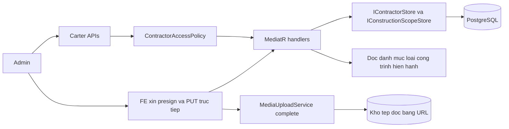
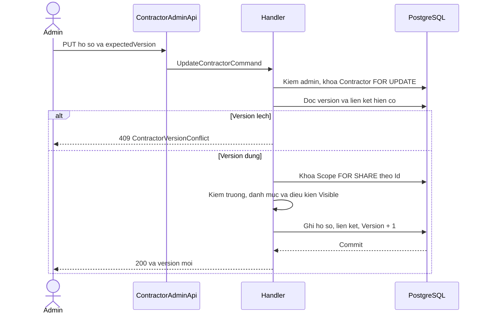
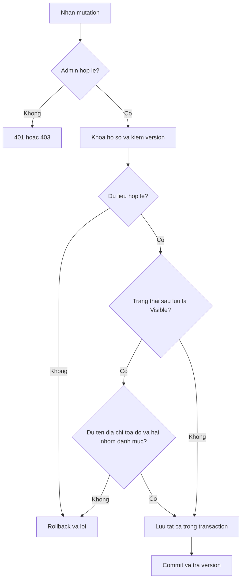
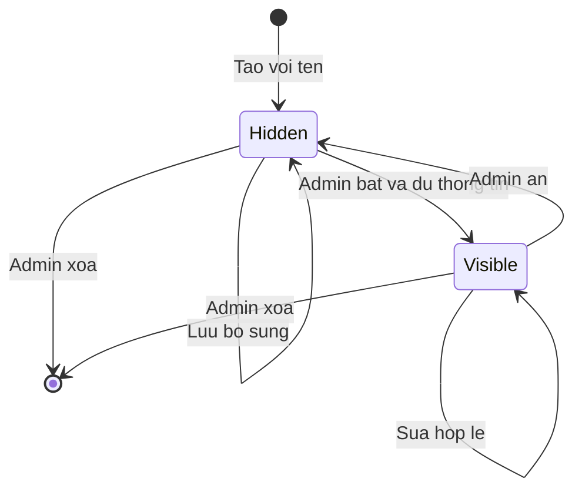
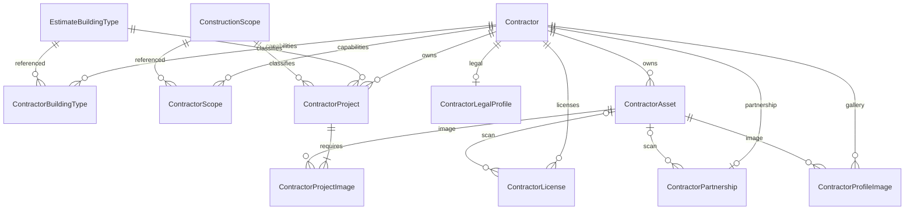

<!-- HƯỚNG DẪN CHO AI KHI ĐIỀN HOẶC CHỈNH SỬA MẪU
- Đọc toàn bộ mẫu, các comment hướng dẫn và tài liệu nguồn được cung cấp trước khi viết. Tuân thủ các quy tắc nghiệp vụ, điều kiện, ngoại lệ và giới hạn đã được xác nhận.
- Không bịa, tự chế hoặc suy đoán thành sự thật: yêu cầu, quy tắc, số liệu, API, schema, mã lỗi, nguồn tham khảo, người phụ trách và kết quả kiểm thử phải có căn cứ. Nội dung ví dụ trong mẫu không phải dữ kiện của dự án.
- Khi thiếu thông tin hoặc các nguồn mâu thuẫn, hỏi người dùng để làm rõ; giữ nguyên placeholder ở phần chưa xác định. Không tự chọn đáp án, lấp chỗ trống hay tuyên bố tài liệu đã hoàn tất.
- Chỉ thay nội dung cần điền hoặc được yêu cầu sửa. Không tự mở rộng phạm vi, sửa nghĩa quy tắc, bỏ điều kiện/ngoại lệ, xoá hay ghi đè nội dung hợp lệ đã có.
- Giữ nguyên tên, cấp và thứ tự heading, nhãn in đậm, tiền tố bullet, cấu trúc danh sách, tên/thứ tự/số cột bảng và cú pháp code fence. Không dịch, đổi tên, gộp hoặc thêm mục ngoài cấu trúc mẫu.
- Chỉ lặp khối luồng, AC hoặc API theo đúng khuôn khi có căn cứ; chỉ bỏ phần tuỳ chọn khi hướng dẫn riêng của mẫu cho phép và đã xác định không áp dụng.
- Mã tham chiếu và section phải trỏ tới tài liệu có thật đã được cung cấp hoặc kiểm chứng. Không giữ mã ví dụ như tham chiếu thật và không tự tạo tài liệu liên quan để hợp thức hoá liên kết.
- Giữ các comment hướng dẫn trong file. Xuất Markdown UTF-8, mỗi file một tài liệu; không bọc toàn bộ file trong code fence, không chèn lời dẫn hay giải thích ngoài mẫu.
- Trước khi bàn giao, đối chiếu nội dung với nguồn, kiểm tra cấu trúc, giá trị cho phép, giới hạn độ dài và tính nhất quán của mã/tham chiếu. Báo rõ phần chưa đủ thông tin; không tuyên bố đã chạy test hoặc import khi chưa thực hiện.
-->

<!-- Thay mã TDD-001 và nội dung ví dụ; giữ nguyên heading và nhãn in đậm.
Sơ đồ dùng mermaid, plantuml hoặc URL. Giữ heading Architecture, Sequence Diagram, Activity Diagram, State Diagram, Data Model.
Ví dụ API phải có heading trùng METHOD /path trong Endpoints. Xoá phần API/sơ đồ không dùng.
Version, Updated At và Change Log do lịch sử phiên bản quản lý, để trống khi nhập mới.
Author/Reviewer là tên hiển thị; gán tài khoản, phê duyệt, giả định và câu hỏi mở trên giao diện sau import.
Thiết kế phải truy vết về Story và Business Rule được cung cấp. Phân biệt thiết kế đề xuất với implementation đã kiểm chứng; không mô tả API/schema/sơ đồ ví dụ như hệ thống thật hoặc tự quyết định nghiệp vụ còn thiếu.
BẮT BUỘC KHI HOÀN THIỆN MẪU: phải có cả Reviewer và Approver, mỗi tên 1–200 ký tự sau khi bỏ khoảng trắng đầu/cuối. Không xoá hai dòng metadata, để trống, dùng tên bịa hoặc giữ placeholder rồi coi là hoàn tất.
Nếu chưa biết người review hoặc người phê duyệt, phải hỏi người dùng và báo tài liệu chưa đủ thông tin; không tự lấy Author/Owner làm người thay thế. Tên trong file không tự gán tài khoản hoặc xác nhận đã duyệt; gán thành viên trên giao diện sau import.
Đây là yêu cầu hoàn thiện mẫu; backend hiện vẫn nhận file cũ thiếu hai trường để tương thích.

VALIDATION CHO FILE NHẬP (đối chiếu ImportSnapshotValidator, MarkdownParser và ImportService):
- Mỗi file .md UTF-8 không rỗng chỉ có một heading cấp 1 chứa mã tài liệu dài 1–100 ký tự. Mã không được trùng trong cùng lần nhập hoặc thuộc loại tài liệu khác đã tồn tại.
- Không dùng tên README.md hoặc sitemap.md vì importer bỏ qua. Giao diện nhận .md/.zip, tối đa 2.000 file, tổng file tải lên 31 MiB; API giới hạn request 32 MiB và tổng nội dung đọc/giải nén 64 MiB.
- Chỉ nhập đè tài liệu cùng loại đang Draft, chưa có phiên bản và chưa lưu trữ. Import thay toàn bộ nội dung bản nháp, vì vậy phải giữ lại nội dung hợp lệ ngoài phần được yêu cầu sửa.
- Không dùng Status trong Markdown hoặc tên Approver để tự xác nhận phê duyệt; import không cấp quyền hay gán tài khoản từ tên. Chạy Kiểm tra file và xử lý lỗi/cảnh báo trước khi nhập.
- Giới hạn độ dài bên dưới tính theo string.Length của .NET (đơn vị UTF-16); không tự cắt ngắn dữ kiện quan trọng để vượt validation, hãy viết lại có căn cứ hoặc hỏi người dùng.
- Feature tối đa 300 ký tự và được dùng làm tiêu đề tài liệu. Status được parser nhận: Draft / In Review / Approved / Deprecated; tài liệu nhập mới vẫn có trạng thái phê duyệt Draft.
- Endpoint: đường dẫn tối đa 500 ký tự; tên/mô tả endpoint được lưu trong Name tối đa 300. HTTP method: GET / POST / PUT / PATCH / DELETE / HEAD / OPTIONS.
- Error Codes: mã tối đa 100 ký tự, không trùng trong tài liệu; giữ dạng - **CODE** (400): mô tả. HTTP status trong Error Codes và Response phải là số nguyên đọc được bằng Int32; không tự đặt status khác hợp đồng API.
- URL sơ đồ tối đa 1.000 ký tự. Mục sơ đồ được sử dụng phải có khối mermaid/plantuml hoặc URL theo mẫu; không để một mục sơ đồ rỗng. Nhãn mục được tách từ bullet như tên External API Fields tối đa 300 ký tự.
- Heading Examples phải khớp METHOD /path ở Endpoints. Giữ các nhãn Request:, Response 200: (thay mã theo contract) và Error Response: để parser tách đúng dữ liệu.
- Tham chiếu dạng DOC-KEY/section: ghi chú: mã đích tối đa 100 ký tự, section tối đa 100, ghi chú tối đa 1.000. Không trùng bộ mã đích + section + loại liên kết trong cùng tài liệu.
ĐỐI CHIẾU FORM TDD (src/features/tdds/validations.ts; form có thể chặt hơn import):
- Điền Feature, Author, Reviewer, Problem và ít nhất một Goal; các Goal/Non-goal/Notes đã thêm không được rỗng. API đã khai báo phải có endpoint và mô tả/mục đích; Fields phải có tên và ý nghĩa; Error Codes phải có mã, HTTP status và điều kiện.
- Form còn kiểm tra Version, Updated At và nội dung Change Log khi khai báo; với file nhập mới, giữ các trường lịch sử này trống theo hợp đồng import, không tự tạo dữ liệu lịch sử.
-->

# TDD-CTR-001

## Document Info

- **Feature**: Quản trị nhà thầu, dự án đã thực hiện và danh mục phạm vi thi công
- **Author**: Codex
- **Reviewer**: Tân Trần
- **Approver**: Tân Trần
- **Status**: Draft
- **Version**:
- **Updated At**:

## Context & Goals

### Problem

Bổ sung ngày 2026-10-04: [TDD-CTR-003](TDD-CTR-003.md) mô tả địa chỉ nhà thầu tách tỉnh/phường/số nhà–đường đã được người dùng chốt và triển khai trong workspace. Bản bổ sung quy định phần lưu tên tỉnh/phường và nguồn danh mục thay cho cách chỉ chọn tỉnh bên dưới. Kết quả kiểm chứng mới nằm ở TDD-CTR-003/References; kết quả ngày 03/10 là bằng chứng của đợt trước.

Bổ sung ngày 2026-10-03: người dùng đã chốt US/BR về tỉnh và ba miền; thiết kế bổ sung dưới đây đã được người dùng đồng ý bổ sung trong hội thoại. Xác nhận TDD lịch sử trong tài liệu này không áp dụng tự động cho phần mới. Phần mới đã được triển khai trong workspace; chưa phát hành lên môi trường chung.


Người dùng đã chốt bản TDD sau lượt rà soát bằng phản hồi “Ok chốt”. Đây là xác nhận thiết kế trong hội thoại; Status vẫn Draft vì chưa phê duyệt trên hệ thống quản lý tài liệu. Hợp đồng cụ thể với kho tệp và kiểm chứng trên môi trường thật vẫn là việc cần làm khi tích hợp.

Người dùng đã chốt STORY-CTR-001 đến STORY-CTR-004 và BR-CTR-001 đến BR-CTR-007 trong hội thoại. Giai đoạn này chỉ admin quản trị; hồ sơ mới Ẩn, có thể lưu chỉ với tên. Hiển thị là trạng thái công khai và đồng thời được coi là đã xác minh. Không có trạng thái kiểm duyệt riêng cho từng thành phần.

Backend đã được triển khai trong workspace theo thiết kế người dùng chốt; chưa phát hành lên môi trường chung. Khảo sát ban đầu xác nhận .NET 8, EF Core/Npgsql 8.0.0, PostgreSQL 15 theo compose; chưa kiểm phiên bản database môi trường triển khai. `EstimateBuildingType` có GUID ổn định, tên nằm trong `CatalogBuildingType` theo revision. `ConstructionSite` giữ Version và khóa dòng trước khi sửa; implementation mới bổ sung Latitude/Longitude bắt buộc. Các mô tả cũ trong AGENTS về tenant và kho S3 không được dùng làm hiện trạng: code hiện có các module nghiệp vụ, không có Organization tenant, trước đợt này chưa có adapter upload S3. Người dùng đã xác nhận dùng Bizfly; adapter riêng cho nhà thầu nằm ở `BizflyContractorFileStore`.

### Goals

- Mỗi quy tắc CTR có nơi kiểm rõ ràng trong API, handler hoặc database; dữ liệu con không bị lẫn giữa hai nhà thầu.
- Dự án năng lực nằm riêng với ConstructionSite; dùng lại GUID loại công trình, không sao chép danh mục.
- Xóa nhà thầu loại bỏ toàn bộ dữ liệu thuộc hồ sơ trong cùng transaction SQL; danh mục dùng chung giữ nguyên.
- Có contract đủ rõ để triển khai và kiểm các ST-CTR-001 đến ST-CTR-024; các API khách theo TDD-CTR-002.

### Non-goals

- Nhà thầu tự cập nhật, mời báo giá, so sánh, đánh giá do khách gửi, xác minh từng thành phần.
- Tạo mã ứng dụng, migration, đặc tả Unit Test hoặc chạy dịch vụ trong đợt thiết kế này.
- Tự chọn nhà cung cấp upload/geocoding, tự sửa dữ liệu công trình cũ hoặc phê duyệt tài liệu trên hệ thống ngoài.

## Architecture

Giữ nguyên Clean Architecture/CQRS. Module `contractor`, `contractorProject` và `constructionScope` dùng cùng PostgreSQL và UoW. File nhị phân nằm ngoài database; database chỉ giữ định danh và metadata. Mỗi handler là một file, tên kết thúc CommandHandler hoặc QueryHandler. Contract theo `Command.cs`, `Query.cs`, `Response.cs`, `validators/`.



| Thành phần dự kiến | Trách nhiệm và vị trí tính từ bmt-be/src |
|---|---|
| `ContractorAdminApi`, `ContractorProjectAdminApi`, `ConstructionScopeAdminApi` | `presentation/apis/<feature>/`; route version 1; chuyển DTO và Result theo quy ước hiện có |
| `ContractorAccessPolicy` | `application/services/`; xác minh phiên và vai trò hệ thống admin từ UserRole/Role, cùng mẫu truy vấn `AssignmentAuthorizer`; không kiểm tên hiển thị vai trò |
| Các Create/Update/Delete/SetVisibility CommandHandler | `application/usecases/commands/<feature>/`; quyền, khóa, version, validation liên bảng, cập nhật aggregate |
| `IContractorStore`, `IConstructionScopeStore` | `domain/abstractions/repositories/`; persistence hiện thực SQL khóa và projection. Không để persistence phụ thuộc application |
| `MediaUploadService` và `IContractorFileStore` | Upload mới dùng Media presign/complete theo TDD-MEDIA-001. Adapter Contractor chỉ giữ tương thích upload/read tệp cũ; FE mới dùng URL cố định. |
| Cấu hình và ràng buộc | `persistence/configurations/`, TableNames và các tên constraint; không dùng soft-delete interceptor cho dữ liệu thuộc hồ sơ |

**Notes**:

- **Quyền hiện tại và khả năng mở rộng:** dùng policy mặc định cho phiên xác minh, rồi handler kiểm User còn hoạt động và có Role.Kind=System, Role.Code=admin qua DB. Không cấp quyền ghi chỉ vì người gọi có một quyền quản trị khác; không gắn UserId vào Contractor bắt buộc. Khi mở self-service sau này, bổ sung quan hệ tài khoản–nhà thầu và policy kiểm sở hữu; không đổi chủ sở hữu dữ liệu nghiệp vụ thành người tạo. Đây là lựa chọn để giữ đúng yêu cầu chỉ admin; không thay RBAC toàn hệ thống.
- **Một version cho hồ sơ:** Contractor.Version tăng khi lưu hồ sơ hoặc dự án, pháp lý, hợp tác và liên kết ảnh. Luồng presign/PUT/complete không đọc hoặc tăng version nhà thầu; có thể upload độc lập. Khi lưu, gửi expectedVersion đã đọc; khóa Contractor FOR UPDATE rồi kiểm lại version. Xung đột trả 409, frontend tải lại để đối chiếu, không tự ghi đè.
- **Thứ tự khóa:** Contractor trước; nếu thay liên kết phạm vi thì khóa các Scope theo Id tăng dần bằng FOR SHARE trước khi kiểm trạng thái; sau đó ghi các dòng con. Sửa/ngừng dùng/xóa Scope dùng FOR UPDATE trên Scope, không khóa Contractor. Do đó không tạo vòng Scope → Contractor. FK RESTRICT chặn xóa mục có liên kết; FOR SHARE ngăn gắn mới đồng thời với chuyển Ngừng dùng. Cơ chế khóa dựa trên [PostgreSQL 15 — row locking](https://www.postgresql.org/docs/15/explicit-locking.html#LOCKING-ROWS).
- **Phạm vi ngừng dùng:** so GUID trước và sau trên đúng liên kết đang sửa. Hồ sơ giữ scope đã gắn; mỗi dự án giữ scope của chính dự án đó. Scope ngừng dùng đã có ở hồ sơ hoặc dự án khác không cho phép gắn mới vào một dự án. Sửa thông tin khác không buộc loại bỏ danh mục đã ngừng dùng.
- **Kiểm danh mục loại:** lưu FK tới EstimateBuildingType.Id; kiểm mục có trong revision hiện hành khi gắn mới. Tên đọc qua CurrentRevisionId và CatalogBuildingType. Không lưu tên bản sao, không áp luật tầng/tum/phong cách của bản dự toán cho dự án năng lực. Các revision hiện có được giữ, module nhà thầu không ghi catalog. Query đọc con trỏ và tên trong cùng một snapshot SQL; không đọc hai revision khác nhau giữa các phần response.
- **Transaction:** tận dụng TransactionPipelineBehavior, không mở transaction lồng. Kiểm dữ liệu trước khi ghi, ném exception cho nhánh từ chối để rollback; pipeline hiện commit cả Result.Failure nếu handler không ném. Lỗi constraint lúc commit được ánh xạ ngoài transaction qua ConstraintViolationPipelineBehavior và IDatabaseErrorReader.
- **Gửi lặp:** không thêm bảng receipt cho CRUD. Sửa lặp với version cũ trả 409; xóa lần hai trả 404. Tạo hồ sơ có thể trùng tên vì chưa có luật unique tên nhà thầu; frontend không tự retry POST sau lỗi mạng không rõ kết quả, phải tải danh sách trước. Không tự áp unique mã số thuế.
- **Public projection:** không trả entity hoặc DTO quản trị cho API khách. Những trường người liên hệ, điện thoại, email, StorageKey, CreatedBy, UpdatedBy không được chọn vào public DTO.
- **Tệp:** FE xin presign, PUT trực tiếp vào staging riêng tư rồi gọi complete. Media kiểm tệp và trả fileUrl cố định ở prefix media/images/. API nhà thầu nhận images[].url, licenses[].scanUrl, partnership.scanUrl và project.images[].url. Chỉ nhận URL HTTPS trong kho đã cấu hình và trỏ tới upload Completed, object Ready; không nhận URL staging, signed URL hoặc URL bên ngoài. Không giữ transaction SQL trong thời gian truyền tệp. Người có fileUrl đọc không cần đăng nhập, kể cả khi hồ sơ Ẩn. Ảnh đã gắn được giữ bởi MediaReference, không phụ thuộc trạng thái hồ sơ. PDF không thuộc job dọn ảnh.

Phương án kỹ thuật đã được người dùng chốt cùng TDD: tên chuẩn Unicode NFC + trim, phạm vi so trùng bằng NormalizedName=ToUpperInvariant, giữ dấu; tên tối đa 200, địa chỉ 500, mô tả ngắn 500, nội dung dài 20.000 ký tự. Các giới hạn này thuộc thiết kế kỹ thuật đã chốt, không lấy trực tiếp từ số liệu trang mẫu. Rating và RatingCount hoặc cùng NULL hoặc cùng có giá trị; điểm không làm tròn đầu vào vượt một chữ số thập phân. Ảnh JPG/PNG/WebP ≤10 MB, scan PDF/JPG/PNG ≤20 MB, tối đa 50 ảnh cho mỗi bộ ảnh; có cấu hình và chặn ở backend. Dữ liệu văn bản dài là plain text; không nhận HTML thực thi.

Nơi thực hiện và kiểm chứng các quy tắc đã chốt:

| Căn cứ | Nơi thực hiện | System Test hiện có |
|---|---|---|
| BR-CTR-001 | ContractorAccessPolicy và phân tách public/admin DTO; ownership ở TDD-CTR-002 | ST-CTR-008, ST-CTR-016, ST-CTR-023, ST-CTR-031, ST-CTR-032 |
| BR-CTR-002 | Validator profile/rating; trạng thái và Version trong Contractor; kiểm dữ liệu khi Visible | ST-CTR-001 đến ST-CTR-010 |
| BR-CTR-003 | ContractorProject và ProjectImage; FK, validator và handler dưới khóa parent | ST-CTR-011 đến ST-CTR-016 |
| BR-CTR-004 | LegalProfile/License/Partnership, URL cố định và public projection | ST-CTR-009, ST-CTR-028 |
| BR-CTR-005 | EXISTS theo hai bảng năng lực trong TDD-CTR-002 | ST-CTR-025, ST-CTR-026, ST-CTR-030 |
| BR-CTR-006 | TDD-SITE-002 cho ghi tọa độ; TDD-CTR-002 cho query radius | ST-CTR-027, ST-CTR-029, ST-SITE-033 đến ST-SITE-037 |
| BR-CTR-007 | Scope unique/FK/row lock; GUID loại hiện có; tên join hiện hành | ST-CTR-017 đến ST-CTR-024 |

Chiến lược kiểm thử: unit cho chuẩn hóa/validator/policy thuần; integration PostgreSQL thật cho khóa cạnh tranh, FK ghép deferred, unique tên scope, query danh mục và khoảng cách; system test cho HTTP/UI và private file. Không coi mock hoặc EF InMemory là bằng chứng khóa và CHECK hoạt động. Các ca đã có là đặc tả chưa chạy; dữ liệu biên theo contract kỹ thuật nằm trong bộ Unit Test được liên kết ở References.

**Bổ sung tỉnh/thành — thiết kế đề xuất theo BR-CTR-008:**

- Dùng danh mục tĩnh `ProvinceRegionCatalog` tại domain làm nguồn duy nhất của 34 mã tỉnh và miền theo BR-CTR-008/Notes. Mỗi mục gồm `Code`, `Name`, `RegionCode`; tên hiển thị dùng địa danh không kèm tiền tố loại đơn vị. Không tạo bảng quản trị danh mục hoặc thêm cột Region vào Contractor. Danh mục có mã phiên bản `vn-34-regions-v1`; thay đổi danh mục phải qua cập nhật code và kiểm chứng, không tự lấy giá trị miền từ API ngoài.
- `CreateContractorCommand` nhận thêm `provinceCode` tùy chọn; thiếu hoặc null vẫn tạo nhanh như hiện tại. `ProfileInput`/`PublicProfile` thêm `provinceCode`. Admin GET và public GET trả mã đã chuẩn hóa; `AdminDetail` và `PublicDetail` thêm `regionCode` ở cấp cùng với `contractorId`, tính từ tỉnh.
- Chuẩn hóa mã: JSON string, bỏ khoảng trắng ngoài; chỉ nhận một hoặc hai chữ số ASCII và mã phải nằm trong bảng 34 tỉnh. `"01"` và `"1"` đều lưu `"1"`; tương tự `04`→`4`, `08`→`8`. Từ chối chuỗi rỗng, dấu âm/dương, số thập phân, hơn hai chữ số hoặc mã cũ ngoài bảng. Không nhận JSON number thay cho string. Null có nghĩa chưa có tỉnh.
- Riêng trường mới trong PUT: không gửi `profile.provinceCode` thì giữ tỉnh đang lưu, gửi null thì xóa tỉnh, gửi mã hợp lệ thì thay tỉnh. DTO cần phân biệt trường bị bỏ qua và null bằng cờ hiện diện nội bộ `[JsonIgnore]` được đặt khi setter nhận dữ liệu; không nhận cờ này từ client. Đây là ngoại lệ tương thích cho trường mới, không đổi nghĩa các section khác của PUT. Tránh làm frontend cũ vô tình xóa tỉnh vừa được bổ sung.
- `ContractorRules` kiểm mã bằng danh mục trước khi áp dụng; `ContractorMapping` chỉ cập nhật tỉnh khi trường có mặt. Tạo/sửa tỉnh dùng cùng quyền, khóa dòng, expectedVersion và transaction của Contractor; không tạo transaction riêng hoặc gọi HTTP trong khóa. Tỉnh không phải điều kiện mới để bật Visible.
- Dùng cùng danh mục cho validation, API lựa chọn và suy ra miền. DB lưu mã tỉnh; response chỉ suy ra miền khi đọc. Không suy ra tỉnh từ `Address` hoặc `ServiceAreaText`.

## Sequence Diagram



## Activity Diagram



## State Diagram



Không có cột Verified, VerifiedAt hoặc trạng thái riêng cho project/license/partnership. `isVerified` nếu UI cần là giá trị tính từ trạng thái Visible, không lưu độc lập. Khi hồ sơ Visible bị sửa thiếu dữ liệu bắt buộc, từ chối lần sửa; admin có thể ẩn trước rồi sửa.

## Data Model

Tên bảng/cột dùng PascalCase như schema hiện có. UUID do ứng dụng sinh; thời điểm UTC dùng timestamptz. Không tự gắn tenant. Mọi bảng mới bỏ qua Entity.IsDeleted nếu kế thừa base; không khai ModifiedOnUtc để tránh interceptor chuyển xóa cứng sang xóa mềm ngoài ý muốn.

Một hồ sơ có các thông tin riêng dạng 0..1 và các bộ dữ liệu lặp. Tách license, ảnh, danh mục để không lưu các mảng GUID thành chuỗi hoặc JSON không có FK. Pháp lý và hợp tác không có version độc lập, dùng khóa và Version của Contractor.

| Bảng | Một dòng đại diện cho; ai ghi | Cột và nullability |
|---|---|---|
| Contractor | Một công ty nhà thầu do admin tạo | Id uuid PK; Name varchar(200) NOT NULL; Status varchar(16) NOT NULL DEFAULT Hidden; Address varchar(500) NULL; ProvinceCode varchar(2) NULL; Latitude, Longitude double precision NULL; ShortDescription varchar(500) NULL; Introduction text NULL; ContractorType varchar(100) NULL; FoundedYear int NULL; ArchitectCount, EngineerCount int NULL; ServiceAreaText text NULL; SurveyHours, WarrantyMonths int NULL; AcceptingProjects boolean NULL; Rating numeric NULL; RatingCount int NULL; ContactPerson varchar(200), ContactPhone varchar(50), ContactEmail varchar(254) NULL; CreatedAtUtc, UpdatedAtUtc timestamptz NOT NULL; CreatedBy, UpdatedBy uuid NOT NULL; Version bigint NOT NULL DEFAULT 1 |
| ConstructionScope | Một phạm vi dùng chung, admin cấu hình | Id uuid PK; Name varchar(200) NOT NULL; NormalizedName varchar(200) NOT NULL; Description text NULL; SortOrder int NOT NULL DEFAULT 0; IsActive boolean NOT NULL DEFAULT true; Version bigint NOT NULL DEFAULT 1; CreatedAtUtc, UpdatedAtUtc timestamptz NOT NULL |
| ContractorBuildingType | Một năng lực loại công trình của một nhà thầu | ContractorId uuid NOT NULL; BuildingTypeId uuid NOT NULL; PK cả hai |
| ContractorScope | Một năng lực phạm vi của một nhà thầu | ContractorId uuid NOT NULL; ScopeId uuid NOT NULL; PK cả hai |
| ContractorProject | Một dự án đã thực hiện thuộc đúng một nhà thầu | Id uuid PK; ContractorId uuid NOT NULL; Name varchar(200) NOT NULL; BuildingTypeId, ScopeId uuid NOT NULL; WidthM, LengthM, AreaM2 numeric(18,2) NULL; FloorCount int NULL; HasAttic boolean NULL; LocationText varchar(500) NULL; CompletedYear int NULL; RoleText varchar(200) NULL; MainWork text NULL; CreatedAtUtc, UpdatedAtUtc timestamptz NOT NULL |
| ContractorLegalProfile | Pháp nhân của một nhà thầu, chỉ tạo khi admin nhập phần này | ContractorId uuid PK/FK; LegalName varchar(200), TaxCode varchar(50), Representative varchar(200), RegisteredAddress varchar(500), Industry text NULL; EstablishedDate date NULL; WorkforceSize int NULL; WarrantyTerms text NULL; UsesBuildXContract boolean NULL; InsuranceDescription text NULL |
| ContractorLicense | Một giấy phép trong phần năng lực pháp lý | Id uuid PK; ContractorId uuid NOT NULL; LicenseType varchar(100), LicenseNumber varchar(100), Issuer varchar(200) NULL; IssuedOn, ExpiresOn date NULL; AssetId uuid NULL |
| ContractorPartnership | Thông tin hợp tác BuildX hiện tại của một nhà thầu | ContractorId uuid PK/FK; StartsOn, EndsOn, SignedOn date NULL; RecordCode varchar(100) NULL; PageCount int NULL; AssetId uuid NULL |
| ContractorAsset | Một tệp được gắn vào nhà thầu; byte nằm ở BizFly. Tệp mới lưu URL; StorageKey chỉ dành cho dữ liệu cũ | Id uuid PK; ContractorId uuid NOT NULL; Url varchar(2048) NULL; StorageKey varchar(1024) NULL UNIQUE; CHECK đúng một vị trí; UNIQUE (ContractorId,Url); OriginalName varchar(255), MediaType varchar(100), SizeBytes bigint, CreatedAtUtc timestamptz bắt buộc |
| ContractorProfileImage | Một vị trí ảnh của hồ sơ: Logo, Cover, Office hoặc Team | Id uuid PK; ContractorId, AssetId uuid NOT NULL; Kind varchar(16) NOT NULL; Position int NOT NULL |
| ContractorProjectImage | Một ảnh trong bộ ảnh của dự án | ContractorId, ProjectId, AssetId uuid NOT NULL; Position int NOT NULL; PK(ProjectId,AssetId) |

NULL nghĩa là chưa nhập, không tự thay bằng 0 hoặc chuỗi rỗng. Status chỉ Hidden/Visible. Khi có Latitude/Longitude phải đủ cặp; Hidden có thể NULL cả hai. Geo dùng WGS84 theo độ: latitude [-90,90], longitude [-180,180], finite; (0,0) là giá trị hợp lệ. Rating dùng numeric không ép scale ở DB để không âm thầm làm tròn 4.55 thành 4.6; CHECK 0..5 và Rating=round(Rating,1). RatingCount ≥0. Các số lượng, thời gian, thứ tự không âm khi có giá trị; kích thước/diện tích dương khi có giá trị. Điều kiện ngày kết thúc ≥ ngày bắt đầu kiểm khi đủ cả hai. Những giới hạn số lượng/độ dài mới là đề xuất kỹ thuật của TDD.



Số tối thiểu một ảnh của project được handler bảo đảm lúc kết thúc transaction, không phải do FK tự bảo đảm. Draft Hidden không có yêu cầu số lượng danh mục; Visible phải có ít nhất một dòng mỗi bảng liên kết.

| Quan hệ | Khóa và hành vi xóa |
|---|---|
| Contractor → mọi bảng con | FK ContractorId ON DELETE CASCADE; trừ FK User của CreatedBy/UpdatedBy dùng RESTRICT |
| EstimateBuildingType → ContractorBuildingType/ContractorProject | RESTRICT; không đổi schema revision hay làm mất lịch sử dự toán |
| ConstructionScope → ContractorScope/ContractorProject | RESTRICT; có index ở phía con, giữ cả liên kết tới scope ngừng dùng |
| ContractorProject → ContractorProjectImage | FK(ProjectId,ContractorId) tới UNIQUE(Id,ContractorId), CASCADE |
| ContractorAsset → ProfileImage/ProjectImage/License/Partnership | FK(AssetId,ContractorId) tới UNIQUE(Id,ContractorId), NO ACTION, DEFERRABLE INITIALLY DEFERRED; kiểm cùng nhà thầu và cho xóa cả aggregate trong một transaction |

Không cho client đổi ContractorId của asset hoặc project. Các licenseId đã có trong PUT cũng phải thuộc đúng ContractorId; không cho chuyển giấy phép từ hồ sơ khác. Khi xóa riêng project, xóa liên kết ảnh, giữ metadata asset cho tới khi admin xóa asset không còn được tham chiếu hoặc dọn file theo kế hoạch. Xóa asset đang được dùng trả 409, không tự làm project mất ảnh. Không gắn ảnh MIME khác image/jpeg, image/png, image/webp vào hai bảng ảnh; kiểm tại handler, không chỉ tin MediaType client khai.

Upload mới khai purpose: ContractorImage cho ảnh JPG/PNG/WebP ≤10 MiB; ContractorScan cho PDF/JPG/PNG ≤20 MiB. Backend kiểm lại loại và dung lượng khi gắn URL vào từng vị trí; scan dạng ảnh 15 MiB không thể được gắn làm ảnh dự án. Metadata do Media xác minh, không nhận MIME/dung lượng do FE gửi ở bước lưu hồ sơ.

| Ràng buộc / index | Mục đích |
|---|---|
| UX_ConstructionScope_NormalizedName | Không trùng tên, gồm mục ngừng dùng; unique ở DB chặn hai request cùng lúc |
| IX_ConstructionScope_Active_Order (IsActive,SortOrder,Id) | Danh mục lựa chọn và quản trị |
| IX_Contractor_Status_Created (Status,CreatedAtUtc,Id) | Danh sách công khai và quản trị ổn định |
| PK ContractorBuildingType, ContractorScope; index ngược (BuildingTypeId,ContractorId), (ScopeId,ContractorId) | EXISTS lọc danh mục và kiểm mục đang dùng |
| IX_ContractorProject_Contractor_Created (ContractorId,CreatedAtUtc,Id), IX_ContractorProject_Scope (ScopeId), IX_ContractorProject_Type (BuildingTypeId) | Bộ dự án và FK danh mục |
| UNIQUE ContractorProfileImage(ContractorId,Kind) WHERE Kind IN ('Logo','Cover') | Mỗi hồ sơ một logo và một ảnh bìa; Office/Team là bộ ảnh |
| UNIQUE ContractorProfileImage(ContractorId,Kind,Position), UNIQUE ContractorProjectImage(ProjectId,Position) | Thứ tự ảnh không trùng; ràng buộc vị trí deferrable để đổi thứ tự trong transaction |
| UNIQUE ContractorProject(Id,ContractorId), UNIQUE ContractorAsset(Id,ContractorId) | Đích FK ghép chặn dùng tệp/dự án thuộc công ty khác |
| Index các FK AssetId/ContractorId còn chưa được PK bao phủ | Kiểm tệp đang dùng và xóa aggregate không quét toàn bộ bảng |

**Notes**:

- Bổ sung `Contractor.ProvinceCode varchar(2) NULL`: một dòng Contractor vẫn đại diện một nhà thầu; admin chọn tỉnh của địa chỉ công ty. Không lưu ProvinceName hoặc RegionCode lặp trong bảng. Không có FK mới vì nguồn 34 mã là danh mục tĩnh trong code; application kiểm thuộc danh mục, DB CHECK kiểm hình thức chuẩn `ProvinceCode IS NULL OR ProvinceCode ~ '^[1-9][0-9]?$'`. CHECK không thay cho kiểm mã thuộc danh mục. Nếu dữ liệu được ghi ngoài ứng dụng chứa mã chưa hỗ trợ, trả regionCode=null và không khớp bộ lọc miền; không gán mặc định.
- Thêm index `IX_Contractor_Province_Status` trên `(ProvinceCode,Status)` cho truy vấn danh sách có miền; giữ index Status/CreatedAtUtc/Id hiện có cho danh sách chung. Index hỗ trợ thu hẹp theo các mã tỉnh, không bảo đảm hết chi phí sort hoặc tính khoảng cách; cần EXPLAIN trên dữ liệu đại diện trước khi kết luận hiệu năng.
- Mẫu dữ liệu giả định, chỉ trích cột: A có `(Id=A,ProvinceCode=NULL,Status=Visible,Version=4)` thì còn trong danh sách chung. Admin chọn Hà Nội thành `(Id=A,ProvinceCode="1",Status=Visible,Version=5)`; miền đọc ra là north. Lần sửa chọn Đắk Lắk thành `ProvinceCode="66",Version=6`, miền là central. RegionCode không được ghi vào DB. Những cột bắt buộc và quan hệ khác của A giữ như schema/mẫu gốc bên dưới.
- Migration đề xuất chỉ thêm cột nullable, CHECK hình thức và index, không backfill tỉnh từ địa chỉ và không sửa Status. Triển khai schema mở rộng trước backend mới, rồi frontend. Code cũ có thể tiếp tục chạy trên schema mới, nhưng chỉ code mới bảo đảm giữ tỉnh khi PUT thiếu trường. Tránh chạy đồng thời hai backend lâu dài sau khi admin bắt đầu nhập tỉnh.
- Kiểm migration trên PostgreSQL tạm từ schema trước thay đổi: bảo toàn số dòng, mọi tỉnh cũ NULL, trạng thái/địa chỉ/tọa độ không đổi; kiểm constraint và truy vấn miền thực. Chưa có số liệu kích thước bảng để cam kết thời gian khóa. Tạo index thường cần đánh giá cửa sổ triển khai; bảng lớn thì cân nhắc tạo concurrently qua migration tách riêng. Đã tạo migration `20261003162149_AddContractorProvinceCode` và kiểm trên PostgreSQL tạm; chưa áp dụng lên môi trường chung.
- Rollback ứng dụng giữ schema mới để không mất tỉnh đã nhập. Down xóa cột sẽ mất dữ liệu; chỉ cho phép khi chưa có tỉnh khác NULL hoặc đã có phương án bảo toàn dữ liệu được duyệt. Không tự chạy Down trên môi trường đang dùng.

- CHECK tại asset: SizeBytes > 0; key, tên và MIME không rỗng. CHECK tại ảnh: Position >= 0, Kind thuộc tập đã nêu. Các CHECK này không thay bước xác minh nội dung tệp ở backend.
- CHECK tại Contractor: Name có nội dung; Status hợp lệ; cặp tọa độ; khi Visible thì Address có nội dung và tọa độ không NULL; Rating/RatingCount cùng NULL hoặc cùng có giá trị hợp lệ; Version ≥1, UpdatedAtUtc ≥CreatedAtUtc. CHECK không truy vấn bảng khác: điều kiện ít nhất một loại, một phạm vi và project ít nhất một ảnh phải kiểm sau khi dựng trạng thái mới trong handler dưới khóa Contractor. Không dùng CHECK giả để diễn đạt đếm dòng con.
- Chuẩn hóa: khóa ghép ở bảng liên kết không có thuộc tính phụ thuộc một nửa khóa; tên scope/type không lặp ở hồ sơ; thông tin legal/partnership phụ thuộc ContractorId. NormalizedName là dữ liệu suy ra duy nhất được lưu thêm để unique ổn định; tính ở một helper dùng chung. `FoundedYear` là năm hoạt động công ty, `EstablishedDate` là ngày đăng ký pháp nhân, không ép suy ra từ nhau. Rating và số lượt là dữ liệu admin nhập, không tổng hợp từ một bảng review không tồn tại. Không lưu projectCount hoặc distanceKm vào Contractor.
- EF8 map cột, precision, FK và concurrency Version; cấu hình DEFERRABLE dùng SQL trong migration `20260930093638_AddContractorProfilesAndSiteCoordinates`. Đã kiểm FK ghép, xóa cascade, khóa dòng, xung đột version và migration trên PostgreSQL 15 trong container tạm; chưa áp migration lên database đang dùng.

Dữ liệu sau là giả định, chỉ trích cột; A, B1, S1, P1, F1..F4, L1 là bí danh UUID khác nhau, không phải SQL seed. U là tài khoản admin có thật trong fixture; R1 là revision catalog hiện hành.

| Bảng | Bản ghi minh họa |
|---|---|
| EstimateBuildingType / CatalogBuildingType dùng lại | B1 đã có; (R1,B1,Name=Nhà phố). Schema nguồn: TDD-PROJ-001/Data Model và EstimateCatalogConfigurations.cs |
| Contractor | (A,Name=Công ty mẫu,Status=Hidden,Address=NULL,Latitude=NULL,Longitude=NULL,Rating=NULL,RatingCount=NULL,CreatedBy=U,UpdatedBy=U,Version=1) |
| ConstructionScope | (S1,Name=Phần thô,NormalizedName=PHẦN THÔ,IsActive=true,SortOrder=1,Version=1) |
| ContractorBuildingType | (A,B1) |
| ContractorScope | (A,S1) |
| ContractorAsset | F1/F2 có Url=https://cdn.example.test/media/images/{UUID}.png, StorageKey=NULL, MIME=image/png; F3/F4 tương tự với đuôi pdf, MIME=application/pdf; mọi dòng thuộc A. Tệp cũ có Url=NULL, StorageKey=ctr/A/F0. URL dùng UUID thật, dấu {UUID} chỉ minh họa. |
| ContractorProfileImage | (I1,A,F1,Kind=Logo,Position=0) |
| ContractorProject | (P1,A,Name=Nhà mẫu,BuildingTypeId=B1,ScopeId=S1,AreaM2=40,CompletedYear=2023) |
| ContractorProjectImage | (A,P1,F2,Position=0) |
| ContractorLegalProfile | (A,LegalName=Công ty mẫu,TaxCode=0123456789,EstablishedDate=2013-01-01) |
| ContractorLicense | (L1,A,LicenseType=Đăng ký doanh nghiệp,LicenseNumber=TEST-01,AssetId=F3) |
| ContractorPartnership | (A,RecordCode=BX-TEST-01,SignedOn=2026-01-01,PageCount=3,AssetId=F4) |

Sau khi A có Address và tọa độ (Latitude=10.78,Longitude=106.70), admin bật Visible với đủ hai liên kết; Version tăng. Xóa A xóa mọi dòng mang ContractorId=A, không xóa B1/S1/U. Đổi tên S1 cập nhật hiển thị của A/P1 qua join; không sửa các FK.

Migration nền tạo các bảng CTR như thiết kế. Migration bổ sung UseContractorMediaUrls thêm ContractorAsset.Url nullable, cho StorageKey nullable và thêm MediaUpload.Purpose mặc định Image. Giữ nguyên StorageKey của tệp cũ; tệp mới chỉ lưu Url và metadata, không lưu key trong ContractorAsset. CHECK buộc có đúng một vị trí Url/StorageKey; unique (ContractorId,Url) tránh lặp cùng URL trong một hồ sơ. Không đổi bảng đăng nhập hoặc chạy migration trên môi trường chung trong tác vụ này. Downgrade bị chặn nếu đã có URL mới hoặc upload nhà thầu; rollback ứng dụng phải giữ schema để bảo toàn dữ liệu. SourceSetVersion tăng lên 2, cần chạy đối soát lại trước khi cleanup được phép hoạt động.

## Internal API

### Endpoints

Tất cả route dưới đây yêu cầu phiên xác minh và ContractorAccessPolicy. JSON thành công dùng `Result<T>` hiện có; DELETE thành công 204. Mọi UUID/expectedVersion phải hợp lệ. Sai hình thức binding 400; validator 422; lỗi nghiệp vụ dùng middleware hiện có, mã cụ thể trong messageCode. Body không chấp nhận trường quyền, owner hoặc trạng thái không được khai trong DTO.

Giữ cơ chế chống CSRF của `CsrfOriginProtectionMiddleware` cho mọi route ghi, gồm upload multipart; không thêm `SkipCsrfCheck`. Request cookie sai Origin bị 403 CsrfInvalid trước khi handler chạy. Với phiên không hợp lệ, dùng Challenge hiện có (401); đã xác thực nhưng thiếu điều kiện của default policy thì Forbid (403), không đổi tất cả thành 401.

Hai đường lỗi hiện có cần được mô tả đúng: FluentValidation qua `ValidationPipelineBehavior` trả ProblemDetails có `type="Validation Error"`, `errors[].code/message/messageCode`, không có messageCode cấp ngoài. Quy tắc mới đặt mã bằng `WithErrorCode`. Lỗi kiểm tra trong handler dùng `application.exceptions.ValidationException(errors, messageCode)`: middleware trả `title="Validation Failure"`, `code="ValidationFailure"`, messageCode cấp ngoài và `errors[].PropertyName/ErrorMessage` theo serializer hiện tại. Không trộn hai dạng trong cùng một ví dụ và không sửa hợp đồng lỗi toàn hệ thống chỉ cho CTR. Các mã validation ở Error Codes được tìm trong errors[].messageCode hoặc messageCode cấp ngoài tương ứng đường lỗi.

- **GET** `/api/v1/admin/contractors` — Query `status?`, `pageIndex=1`, `pageSize=20` (1..100); sort CreatedAtUtc DESC, Id DESC; trả PagedResult<AdminContractorItem> gồm id,name,status,address,version,updatedAtUtc. Phân trang quản trị là đề xuất kỹ thuật.
- **POST** `/api/v1/admin/contractors` — Body `{name,provinceCode?}`; tạo Hidden, Version=1; trả 201 `{contractorId,version,status}`.
- **GET** `/api/v1/admin/contractors/{contractorId}` — Trả profile, capability GUIDs, legal, licenses, partnership, ảnh, version và missingFields. Thông tin liên hệ chỉ ở DTO này.
- **PUT** `/api/v1/admin/contractors/{contractorId}` — Body `{expectedVersion,profile,buildingTypeIds,scopeIds,legal,licenses,partnership,images}`; thay các phần hồ sơ, không đổi projects/status. Kiểm đủ điều kiện nếu Visible; trả `{contractorId,version,status}`. Quy ước thay dữ liệu giải thích dưới danh sách route.
- **PATCH** `/api/v1/admin/contractors/{contractorId}/visibility` — `{expectedVersion,isVisible}`; Hidden→Visible kiểm đủ trường; Visible→Hidden chỉ kiểm version/quyền; không tăng version nếu trạng thái đã đúng và expectedVersion đúng.
- **DELETE** `/api/v1/admin/contractors/{contractorId}` — Query expectedVersion bắt buộc; xóa aggregate trong transaction.
- **GET** `/api/v1/admin/contractors/{contractorId}/projects` — Toàn bộ dự án của hồ sơ, kèm contractorVersion; sort CreatedAtUtc DESC, Id DESC.
- **POST** `/api/v1/admin/contractors/{contractorId}/projects` — `{expectedVersion,name,buildingTypeId,scopeId,images:[{url,position}],widthM?,lengthM?,areaM2?,floorCount?,hasAttic?,locationText?,completedYear?,roleText?,mainWork?}`; đúng một GUID mỗi danh mục và ≥1 ảnh; trả 201 `{projectId,contractorVersion}`.
- **PUT** `/api/v1/admin/contractors/{contractorId}/projects/{projectId}` — Cùng body tạo; các trường tùy chọn NULL là xóa giá trị; route xác định dự án thuộc contractor; trả `{projectId,contractorVersion}`.
- **DELETE** `/api/v1/admin/contractors/{contractorId}/projects/{projectId}` — Query expectedVersion; chỉ xóa dự án và liên kết ảnh, trả 204.
- **POST** `/api/v1/admin/contractors/{contractorId}/assets` — multipart `file`, `expectedVersion`; upload ngoài transaction, sau đó đăng ký metadata và tăng version; trả 201 `{assetId,originalName,mediaType,sizeBytes,contentUrl,contractorVersion}`. Tệp chưa gắn chỉ admin được đọc.
- **DELETE** `/api/v1/admin/contractors/{contractorId}/assets/{assetId}` — Query expectedVersion; kiểm đúng hồ sơ và không còn được gắn. Xóa metadata không thu hồi trực tiếp fileUrl của tệp mới; việc dọn ảnh theo BR-MEDIA-002.
- **GET** `/api/v1/admin/construction-scopes` — Toàn bộ scope, gồm ngừng dùng; order SortOrder ASC, Name ASC, Id ASC.
- **POST** `/api/v1/admin/construction-scopes` — `{name,description?,sortOrder=0,isActive=true}`; trả 201 ScopeDto gồm id,name,description,sortOrder,isActive,version.
- **PUT** `/api/v1/admin/construction-scopes/{scopeId}` — `{expectedVersion,name,description,sortOrder,isActive}`; khóa row và kiểm unique/version, trả ScopeDto.
- **DELETE** `/api/v1/admin/construction-scopes/{scopeId}` — Query expectedVersion; từ chối nếu được tham chiếu, kể cả liên kết trên hồ sơ Hidden.

Form dự án nhà thầu dùng hook catalog chung đọc `GET /api/v1/admin/estimate-catalog` của PROJ, theo quyền đọc catalog hiện có. Đọc `buildingTypes[].buildingTypeId/name`, `floorCounts`, `floorsEnabled`, `tumEnabled`; không sao chép danh mục hoặc đổi revision của hồ sơ công trình/dự toán cũ. `floorCount` là tổng số tầng gồm trệt, tum ghi riêng. Số tầng chọn từ `floorCounts` của loại đã chọn; loại không áp dụng tầng/tum thì khoá trường tương ứng. Đổi loại giữ số tầng hợp lệ và giá trị tum còn áp dụng, còn lại gửi null. Khi chỉ mở/sửa thông tin khác, giữ giá trị lịch sử; tầng ngoài cấu hình hiện tại hiển thị là giá trị đã lưu. `hasAttic` nhận true/false/null; phải giữ false khi tải form và tạo body. Các trường này vẫn tuỳ chọn theo BR-CTR-003, không thêm validator bắt buộc mới ở backend. Phạm vi lấy từ `GET /api/v1/admin/construction-scopes`: chỉ cho chọn mới phạm vi đang dùng, vẫn hiển thị phạm vi ngừng dùng đã được gắn theo BR-CTR-007. Lỗi tải danh mục phải hiện lỗi/thử lại và chặn lưu; giữ bản nhập khi thử lại. Khi cập nhật dự án, giữ cả kích thước đã lưu dù form không có trường sửa kích thước.

DTO dự án công khai đã trả `buildingType:{id,name}`, `scope:{id,name}`, `floorCount`, `hasAttic`. Frontend giữ GUID và tên cho thẻ/popup, lọc loại theo GUID; phạm vi động không ép sang các mã mock cố định. Tên danh mục API được ưu tiên, bản mock dùng nhãn CMS hiện có.

PUT hồ sơ thay toàn bộ section của DTO; riêng trường bổ sung `profile.provinceCode` giữ giá trị hiện có khi bị bỏ qua như Notes ở Architecture; legal/partnership=null xóa section, danh sách rỗng gỡ liên kết. ImageInput dùng url,kind,position; LicenseInput thêm scanUrl và licenseId nullable khi tạo mới. Dữ liệu cũ vẫn nhận assetId để tương thích, nhưng không gửi cả URL lẫn assetId cho cùng một tệp. Admin GET trả URL cho tệp mới, assetId cho tệp cũ. Không nhận licenseId của hồ sơ khác.

Upload mới dùng các API Media trong TDD-MEDIA-001; không tăng version nhà thầu. POST /admin/contractors/{id}/assets multipart là API cũ còn giữ tương thích, không dùng trong luồng FE mới. Lưu URL mới diễn ra trong cùng transaction với liên kết hồ sơ, version và MediaReference.

Các giá trị numeric diện tích/kích thước dùng JSON number và C# decimal; validator chặn hơn 16 chữ số phần nguyên hoặc hơn 2 chữ số phần lẻ trước ghi numeric(18,2), không làm tròn đầu vào. Tên trường DTO dùng camelCase; bảng dùng PascalCase. Riêng lỗi từ middleware giữ tên trường theo hợp đồng hiện có đã mô tả ở trên.

### Examples

Trình tự để tạo đầy đủ hồ sơ (GUID và URL trong ví dụ là dữ liệu minh họa):

1. Đăng nhập admin. Gọi `GET /api/v1/contractors/filter-options` để lấy `buildingTypes[].id` và `scopes[].id` đang dùng. Nếu cần thêm phạm vi, dùng API quản trị scope nêu ở Endpoints.
2. `POST /api/v1/admin/contractors` với `{"name":"Cát Trắng"}`; giữ contractorId và version=1.
3. Với mỗi tệp, gọi `POST /api/v1/media/uploads`, header `Idempotency-Key` riêng và body `{"fileName":"giay-phep.pdf","contentType":"application/pdf","sizeBytes":200000,"purpose":"ContractorScan"}`. Ảnh dùng ContractorImage. `sizeBytes` phải là số byte thực của tệp.
4. FE gửi `PUT uploadUrl` với raw bytes và đúng `requiredHeaders`; không gửi cookie/token BMT đến kho. Không dùng multipart.
5. Gọi `POST /api/v1/media/uploads/{uploadId}/complete`, không có body. Nếu 202, đọc `GET /api/v1/media/uploads/{uploadId}` theo Retry-After; chỉ lấy fileUrl khi Completed. Ở bước này version nhà thầu vẫn là 1.
6. Gọi PUT hồ sơ với toàn bộ section như dưới đây; giữ version mới từ response.
7. Tạo từng dự án bằng POST projects, mỗi lần dùng contractorVersion mới nhất từ response. Có thể lặp để bổ sung nhiều dự án.
8. `PATCH /api/v1/admin/contractors/{contractorId}/visibility` với `{"expectedVersion":<version mới nhất>,"isVisible":true}`. Dùng GET công khai để đọc hồ sơ; chuyển isVisible=false sẽ ẩn hồ sơ nhưng giữ URL đã chia sẻ.

#### PUT /api/v1/admin/contractors/{contractorId}

```
Request:
{
  "expectedVersion": 1,
  "profile": {
    "name": "Cát Trắng", "address": "Địa chỉ công ty mẫu, TP.HCM",
    "provinceCode": "79", "latitude": 10.78, "longitude": 106.70,
    "shortDescription": "Thiết kế và thi công nhà ở", "introduction": "Thông tin giới thiệu do admin nhập.",
    "contractorType": "Doanh nghiệp", "foundedYear": 2013, "architectCount": 5, "engineerCount": 10,
    "serviceAreaText": "TP.HCM", "surveyHours": 48, "warrantyMonths": 24, "acceptingProjects": true,
    "rating": 4.8, "ratingCount": 20,
    "contactPerson": "Người phụ trách mẫu", "contactPhone": "Số liên hệ nội bộ", "contactEmail": "admin@example.test"
  },
  "buildingTypeIds": ["22222222-2222-4222-8222-222222222222"],
  "scopeIds": ["33333333-3333-4333-8333-333333333333"],
  "legal": {
    "legalName": "Công ty mẫu Cát Trắng", "taxCode": "MÃ-SỐ-THUẾ-MẪU", "representative": "Người đại diện mẫu",
    "registeredAddress": "Địa chỉ đăng ký mẫu", "industry": "Xây dựng", "establishedDate": "2013-01-01",
    "workforceSize": 50, "warrantyTerms": "Điều kiện bảo hành mẫu", "usesBuildXContract": true, "insuranceDescription": "Thông tin bảo hiểm mẫu"
  },
  "licenses": [{"licenseType":"Đăng ký doanh nghiệp","licenseNumber":"MẪU-01","issuer":"Cơ quan cấp mẫu","issuedOn":"2013-01-01","expiresOn":null,"scanUrl":"https://cdn.example.test/media/images/44444444444444444444444444444444.pdf"}],
  "partnership": {"startsOn":"2026-01-01","endsOn":"2027-01-01","signedOn":"2026-01-01","recordCode":"MẪU-BX-01","pageCount":3,"scanUrl":"https://cdn.example.test/media/images/55555555555555555555555555555555.pdf"},
  "images": [
    {"url":"https://cdn.example.test/media/images/66666666666666666666666666666666.png","kind":"Logo","position":0},
    {"url":"https://cdn.example.test/media/images/77777777777777777777777777777777.png","kind":"Cover","position":0},
    {"url":"https://cdn.example.test/media/images/88888888888888888888888888888888.png","kind":"Office","position":0},
    {"url":"https://cdn.example.test/media/images/99999999999999999999999999999999.png","kind":"Team","position":0}
  ]
}

Response 200:
{"value":{"contractorId":"11111111-1111-4111-8111-111111111111","version":2,"status":"Hidden"},"isSuccess":true,"isFailure":false,"error":{"code":"","message":"","messageCode":""}}

Error Response:
{"title":"Conflict","status":409,"messageCode":"ContractorVersionConflict"}
```

Thay các GUID bằng ID danh mục thật và URL bằng fileUrl vừa nhận; response thành công là Result có value `{contractorId,version:2,status:"Hidden"}`. Giấy phép sửa lại gửi thêm licenseId đã đọc. Ví dụ không tạo dữ liệu mẫu trên môi trường thật.

#### POST /api/v1/admin/contractors/{contractorId}/projects

```
Request:
{
  "expectedVersion": 2, "name": "Nhà phố mẫu",
  "buildingTypeId": "22222222-2222-4222-8222-222222222222",
  "scopeId": "33333333-3333-4333-8333-333333333333",
  "widthM": 5, "lengthM": 20, "areaM2": 100, "floorCount": 3, "hasAttic": true,
  "locationText": "TP.HCM", "completedYear": 2025, "roleText": "Tổng thầu", "mainWork": "Thi công trọn gói",
  "images": [{"url":"https://cdn.example.test/media/images/aaaaaaaaaaaaaaaaaaaaaaaaaaaaaaaa.png","position":0}]
}

Response 201:
{"value":{"projectId":"bbbbbbbb-bbbb-4bbb-8bbb-bbbbbbbbbbbb","contractorVersion":3},"isSuccess":true,"isFailure":false,"error":{"code":"","message":"","messageCode":""}}

Error Response:
{"title":"Conflict","status":409,"messageCode":"ContractorVersionConflict"}
```

Response 201 dùng Result với value `{projectId,contractorVersion:3}`. Tiếp đó bật hiển thị với expectedVersion=3. Upload thêm không tự thay contractorVersion.


#### POST /api/v1/admin/contractors

```
Request:
{"name":"Công ty mẫu"}

Response 201:
{"value":{"contractorId":"11111111-1111-4111-8111-111111111111","version":1,"status":"Hidden"},"isSuccess":true,"isFailure":false,"error":{"code":"","message":"","messageCode":""}}

Error Response:
{"title":"Forbidden","code":"Forbidden","status":403,"detail":"Chỉ admin được quản lý nhà thầu.","messageCode":"AccessForbidden","errors":null}
```

#### PATCH /api/v1/admin/contractors/{contractorId}/visibility

```
Request:
{"expectedVersion":1,"isVisible":true}

Response 200:
{"value":{"contractorId":"11111111-1111-4111-8111-111111111111","version":2,"status":"Visible"},"isSuccess":true,"isFailure":false,"error":{"code":"","message":"","messageCode":""}}

Error Response:
{"title":"Validation Failure","code":"ValidationFailure","status":422,"detail":"One or more validation errors occurred","messageCode":"ContractorProfileIncomplete","errors":[{"PropertyName":"address","ErrorMessage":"Cần nhập địa chỉ để hiển thị."}]}
```

Ví dụ thành công giả định hồ sơ đã đủ dữ liệu tại Version=1 bằng fixture; ví dụ lỗi là hồ sơ khác chỉ có tên, không phải kết quả nối tiếp của cùng request.

### Error Codes

- **Unauthorized** (401): Chưa có phiên hợp lệ.
- **AccessForbidden** (403): Không có vai trò hệ thống admin hoặc không thỏa điều kiện phiên đã xác thực.
- **MustChangePassword** (403): Phiên đang bị yêu cầu đổi mật khẩu; giữ xử lý của policy hiện có.
- **CsrfInvalid** (403): Request ghi dùng cookie không đến từ origin được phép.
- **ContractorNotFound** (404): Không có hồ sơ.
- **ContractorProjectNotFound** (404): Không có dự án trong hồ sơ được chỉ định.
- **ContractorAssetNotFound** (404): Tệp không thuộc hồ sơ hoặc không còn metadata.
- **ConstructionScopeNotFound** (404): Không có scope được yêu cầu sửa/xóa.
- **ContractorVersionConflict** (409): Version hồ sơ không khớp hoặc concurrency conflict.
- **ConstructionScopeVersionConflict** (409): Version scope không khớp.
- **ConstructionScopeNameTaken** (409): Trùng NormalizedName, gồm lỗi 23505 từ UX_ConstructionScope_NormalizedName.
- **ConstructionScopeInUse** (409): Scope còn FK từ hồ sơ hoặc project; ánh xạ 23503 đúng tên FK.
- **ContractorAssetInUse** (409): Asset còn tham chiếu, kể cả lỗi FK deferred khi commit.
- **InvalidContractorInput** (422): Sai trường, rating, tọa độ, ngày, MIME, kích thước hoặc section; không tự cắt/làm tròn.
- **ContractorProfileIncomplete** (422): Bật hoặc giữ Visible khi thiếu thông tin bắt buộc.
- **InvalidContractorProject** (422): Thiếu tên/ảnh/đúng một loại và phạm vi, hoặc tệp khác parent.
- **ContractorCategoryUnavailable** (422): GUID danh mục không tồn tại hoặc gắn mới scope đã ngừng dùng.
- **ContractorFileUnavailable** (503): Kho tệp chưa cấu hình, lỗi upload/read hoặc metadata chưa thể kiểm chứng.

Ghi mutation bị lỗi sau khi sửa entity phải rollback. Chỉ ánh xạ đúng constraint theo command; không biến mọi lỗi FK thành ScopeInUse. Log actorId, contractorId/scopeId, command, kết quả, thời gian; không log nội dung tệp, contact hoặc signed URL.

## External API

### Endpoints

- **BizFly qua Media** — FE PUT trực tiếp vào uploadUrl với requiredHeaders; complete theo TDD-MEDIA-001 kiểm byte và tạo fileUrl. Kho không cho anonymous listing; người có fileUrl được GET ảnh và scan không cần đăng nhập.
- **Adapter tệp cũ** — IContractorFileStore đọc key ctr/* còn private. Route đọc tương thích không kiểm Visible; vẫn kiểm đúng nhà thầu và tệp đã gắn. Luồng multipart cũ còn tồn tại để tương thích, không dùng trong FE mới.

### Fields

- **BizflyStorageOption** — Kết nối dùng chung với MEDIA: endpoint, region, bucket và credential. Giữ secret trong cấu hình môi trường.
- **MediaStoreOption** — StoreId, thời hạn URL và lease theo TDD-MEDIA-001. URL công khai được suy ra từ Endpoint và BucketName của BizflyStorageOption dùng chung. Public prefix hiện có là media/images/*, gồm cả PDF của nhà thầu; staging vẫn private. Tên prefix là tên kỹ thuật lịch sử, không giới hạn nội dung chỉ là ảnh.
- **ContractorFileOption** — Giữ giới hạn gắn ảnh 10.485.760 byte, scan 20.971.520 byte, tối đa 50 ảnh mỗi bộ. Cấu hình có thể hạ giới hạn.
- **fileUrl** — URL HTTPS cố định từ complete; không có query chữ ký. Metadata loại/dung lượng/tên lấy từ upload đã xác minh, không tin dữ liệu client tự khai khi lưu hồ sơ.

### Error Handling

Upload lỗi thì frontend chưa lưu URL vào hồ sơ. Complete đang xử lý trả 202, FE đọc trạng thái theo Retry-After; chỉ dùng fileUrl khi Completed. Nếu lưu hồ sơ bị 409, giữ dữ liệu hiện tại và đối chiếu version; upload thành công trước đó không tự ghi đè hồ sơ. Không xóa object trong catch khi chưa biết transaction đã commit hay chưa.

### Quirks

- Ẩn hồ sơ không thu hồi fileUrl đã chia sẻ. API danh sách và chi tiết chỉ trả nhà thầu Visible; không có API công khai liệt kê tệp của hồ sơ Hidden.
- Ảnh mới được giải mã để kiểm định dạng bằng MediaImageValidator. PDF kiểm MIME khai báo, dung lượng thực và chữ ký %PDF-; không tuyên bố có parser PDF đầy đủ hoặc quét mã độc.
- Không đổi policy kho trong tác vụ này. Cần kiểm CORS PUT, private staging, GET final và chặn listing ở môi trường triển khai.

## References

### User Stories

- STORY-CTR-001
- STORY-CTR-002
- STORY-CTR-003

### Business Rules

- [BR-CTR-008](../businessrule/BR-CTR-008.md)

- BR-CTR-001
- BR-CTR-002
- BR-CTR-003
- BR-CTR-004
- BR-CTR-007

### Use Cases

- STORY-CTR-001/Main Flow
- STORY-CTR-001/ALT-03
- STORY-CTR-002/Main Flow
- STORY-CTR-003/ALT-01

### Others

- Unit Test tỉnh/miền: [UT-CTR-033](../unittest/UT-CTR-033.md), [UT-CTR-034](../unittest/UT-CTR-034.md), [UT-CTR-035](../unittest/UT-CTR-035.md), [UT-CTR-037](../unittest/UT-CTR-037.md).

- Bổ sung tỉnh: [ST-CTR-035](../systemtest/ST-CTR-035.md), [ST-CTR-036](../systemtest/ST-CTR-036.md). Chưa chạy. Chiến lược kiểm chứng thêm: validation/chuẩn hóa mã; serialization phân biệt thiếu và null; PostgreSQL cho lưu/đọc/cập nhật/version/migration. Đặc tả Unit Test đã bổ sung theo thiết kế được chốt.
- Phần code dự kiến sửa: `Contractor`, `ContractorConfiguration`, `Command`, `ContractorInputs`, `Response`, `ContractorRules`, `ContractorMapping`, `ContractorWriteService`, `ContractorAdminReadService`; thêm `domain/referenceData/ProvinceRegionCatalog.cs` và migration tương ứng sau khi thiết kế được chốt.

- Đợt đổi upload nhà thầu sang URL: 31/31 test PostgreSQL nhà thầu/Media, 54/54 test bộ kiểm tệp và adapter, 20/20 test HTTP nhà thầu/Media đã đạt, không có ca bỏ qua. Chạy trên bản sao tạm dùng phần đăng nhập ổn định vì module đăng nhập trong workspace đang được sửa đồng thời. TRX: `/private/tmp/bmt-ctr-presign-results/{integration,infra,api}.trx`. Chưa chạy FE hoặc kiểm PDF trên BizFly thật trong đợt này; chưa áp dụng migration lên môi trường chung. Kết quả các đợt trước ở bên dưới là bằng chứng lịch sử, không thay thế lượt kiểm này.

- Implementation: `bmt-be/src/bmt-be.application/services/Contractor*`, `ConstructionScopeService`, `persistence/repositories/ContractorStore`, các Carter API `contractor`, `contractorProject`, `constructionScope` và migration `20260930093638_AddContractorProfilesAndSiteCoordinates`.
- Kiểm thử thực thi: `ContractorFlowTests`, `ContractorMigrationTests`, `ContractorRulesTests`, `ContractorApiTests`, `BizflyContractorFileStoreTests`. Tệp TRX của phiên nằm trong `/private/tmp/bmt-ctr-results/`; kết quả tổng hợp được ghi bên dưới. ST mô tả giao diện và thao tác với Bizfly thật chưa chạy.
- Kết quả kiểm chứng trong phiên: application 1.483/1.483; PostgreSQL integration 480/480; infrastructure 192/192; nhóm HTTP nhà thầu và hồi quy cache 13/13. Bản chỉ chứa CTR/SITE đã được tách ra khỏi các thay đổi LIB đang làm song song và build toàn solution đạt 0 warning/0 error. Nhánh Git dùng để bàn giao là `feature/contractor-profiles`; không gồm thay đổi LIB/MEDIA. Chưa kiểm tích hợp với bucket Bizfly thật, frontend hoặc môi trường chung.
- Tài liệu provider đã đối chiếu: [Bizfly Simple Storage](https://support.bizflycloud.vn/api/simple-storage/) — endpoint, path-style, region và Signature V4. Cần kiểm bucket private thực tế trước khi phát hành.

- Đặc tả Unit Test sau khi chốt TDD: [UT-CTR-001](../unittest/UT-CTR-001.md), [UT-CTR-002](../unittest/UT-CTR-002.md), [UT-CTR-003](../unittest/UT-CTR-003.md), [UT-CTR-004](../unittest/UT-CTR-004.md), [UT-CTR-005](../unittest/UT-CTR-005.md), [UT-CTR-006](../unittest/UT-CTR-006.md), [UT-CTR-007](../unittest/UT-CTR-007.md), [UT-CTR-008](../unittest/UT-CTR-008.md), [UT-CTR-009](../unittest/UT-CTR-009.md), [UT-CTR-010](../unittest/UT-CTR-010.md), [UT-CTR-011](../unittest/UT-CTR-011.md), [UT-CTR-012](../unittest/UT-CTR-012.md), [UT-CTR-013](../unittest/UT-CTR-013.md), [UT-CTR-014](../unittest/UT-CTR-014.md), [UT-CTR-015](../unittest/UT-CTR-015.md), [UT-CTR-016](../unittest/UT-CTR-016.md), [UT-CTR-017](../unittest/UT-CTR-017.md), [UT-CTR-018](../unittest/UT-CTR-018.md), [UT-CTR-027](../unittest/UT-CTR-027.md), [UT-CTR-028](../unittest/UT-CTR-028.md), [UT-CTR-029](../unittest/UT-CTR-029.md), [UT-CTR-030](../unittest/UT-CTR-030.md), [UT-CTR-031](../unittest/UT-CTR-031.md), [UT-CTR-032](../unittest/UT-CTR-032.md). Các ca vẫn là đặc tả Draft; code test và phạm vi đã kiểm chứng được nêu tại Others. Các ST thao tác giao diện chưa được chạy.
- [TDD-CTR-002](TDD-CTR-002.md): projection công khai, query lọc và đọc tệp.
- [TDD-SITE-002](TDD-SITE-002.md): tọa độ công trình.
- [TDD-PROJ-001](TDD-PROJ-001.md#data-model): danh tính loại công trình và revision catalog; dữ liệu cũ không được sửa.
- ST-CTR-001 đến ST-CTR-024: đặc tả đã có, chưa chạy. Mỗi file có liên kết Story/AC/BR.
- Bằng chứng code: `bmt-be/src/bmt-be.domain/entities/EstimateCatalog.cs`, `persistence/configurations/EstimateCatalogConfigurations.cs`, `application/behaviors/TransactionPipelineBehavior.cs`, `application/behaviors/ConstraintViolationPipelineBehavior.cs`, `application/services/AssignmentAuthorizer.cs`, `infrastructure/files/HttpStoredFileReader.cs` (các đường dẫn sau cùng tính từ `bmt-be/src/`).
- Phạm vi rà soát: đã đối chiếu trực tiếp CTR US/BR/ST và các phần code được liệt kê. Chưa hoàn tất duyệt đệ quy toàn bộ graph tài liệu RBAC/SUB/PAY mà SITE/PROJ tham chiếu; không coi các mô tả lịch sử trong TDD cũ là hiện trạng đã kiểm chứng. Cần rà tiếp khi triển khai phần phụ thuộc, không mở rộng chức năng sang các module đó.

## Change Log

2026-10-05: bổ sung phân loại dự án nhà thầu trên form admin theo catalog dùng chung, lựa chọn Có/Không tum và danh mục phạm vi động; ánh xạ tên danh mục và GUID trên tab/popup công khai. Backend hiện đã có các trường và API tương ứng, không thêm endpoint hoặc migration. Kiểm trình duyệt bằng API fixture: đổi loại loại bỏ tầng không hợp lệ, khoá tầng/tum không áp dụng, lưu và mở lại số tầng với `hasAttic=false`, giữ kích thước cũ, lọc loại và hiển thị tên loại/phạm vi/tầng/tum công khai ở màn hình 390 px. Kiểm hàm ánh xạ bằng dữ liệu DTO lồng và dạng phẳng cũ. Đây là bằng chứng frontend với fixture, chưa chạy ST-CTR-013 đầy đủ qua API/database thật; lượt kiểm thêm lỗi catalog bị gián đoạn do module Cẩm nang đang được sửa đồng thời.

Kết quả kiểm chứng phần tỉnh/miền (2026-10-03): 47 test ứng dụng, 15 test HTTP và 13 test tích hợp PostgreSQL đều đạt, không bỏ qua test. Bao gồm chuẩn hóa mã tỉnh, lọc miền kết hợp loại/phạm vi/bán kính, dữ liệu cũ chưa có tỉnh, phân biệt bỏ trường với gửi null, migration giữ dữ liệu và chặn rollback khi còn mã tỉnh. Frontend đạt TypeScript, ESLint và Prettier. Chưa kiểm E2E trên trình duyệt: công cụ Chrome không mở được do profile đang được một phiên khác sử dụng. Chưa chạy migration hoặc triển khai lên môi trường chung.
