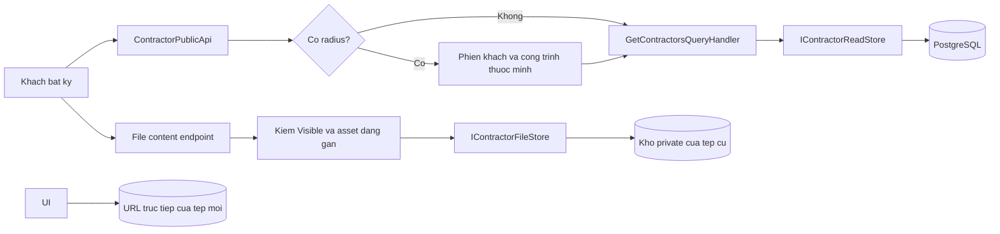
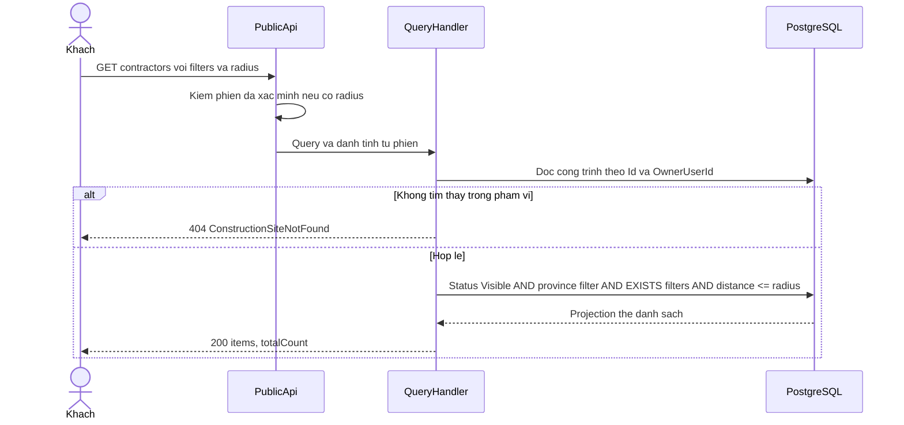
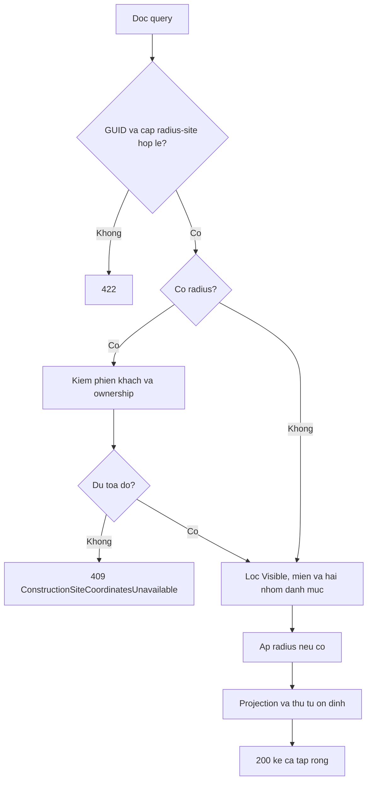
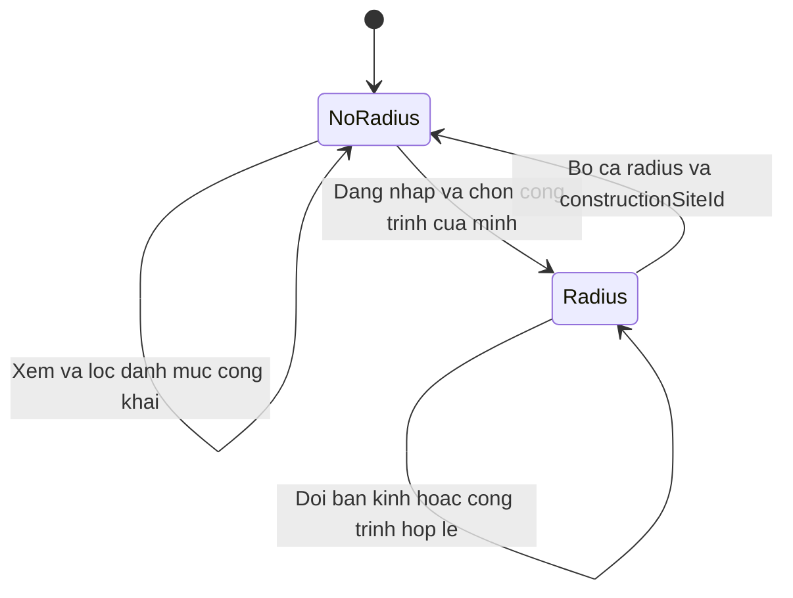
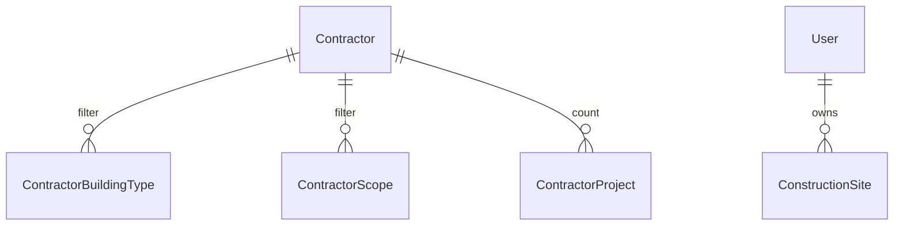

<!-- HƯỚNG DẪN CHO AI KHI ĐIỀN HOẶC CHỈNH SỬA MẪU
- Đọc toàn bộ mẫu, các comment hướng dẫn và tài liệu nguồn được cung cấp trước khi viết. Tuân thủ các quy tắc nghiệp vụ, điều kiện, ngoại lệ và giới hạn đã được xác nhận.
- Không bịa, tự chế hoặc suy đoán thành sự thật: yêu cầu, quy tắc, số liệu, API, schema, mã lỗi, nguồn tham khảo, người phụ trách và kết quả kiểm thử phải có căn cứ. Nội dung ví dụ trong mẫu không phải dữ kiện của dự án.
- Khi thiếu thông tin hoặc các nguồn mâu thuẫn, hỏi người dùng để làm rõ; giữ nguyên placeholder ở phần chưa xác định. Không tự chọn đáp án, lấp chỗ trống hay tuyên bố tài liệu đã hoàn tất.
- Chỉ thay nội dung cần điền hoặc được yêu cầu sửa. Không tự mở rộng phạm vi, sửa nghĩa quy tắc, bỏ điều kiện/ngoại lệ, xoá hay ghi đè nội dung hợp lệ đã có.
- Giữ nguyên tên, cấp và thứ tự heading, nhãn in đậm, tiền tố bullet, cấu trúc danh sách, tên/thứ tự/số cột bảng và cú pháp code fence. Không dịch, đổi tên, gộp hoặc thêm mục ngoài cấu trúc mẫu.
- Chỉ lặp khối luồng, AC hoặc API theo đúng khuôn khi có căn cứ; chỉ bỏ phần tuỳ chọn khi hướng dẫn riêng của mẫu cho phép và đã xác định không áp dụng.
- Mã tham chiếu và section phải trỏ tới tài liệu có thật đã được cung cấp hoặc kiểm chứng. Không giữ mã ví dụ như tham chiếu thật và không tự tạo tài liệu liên quan để hợp thức hoá liên kết.
- Giữ các comment hướng dẫn trong file. Xuất Markdown UTF-8, mỗi file một tài liệu; không bọc toàn bộ file trong code fence, không chèn lời dẫn hay giải thích ngoài mẫu.
- Trước khi bàn giao, đối chiếu nội dung với nguồn, kiểm tra cấu trúc, giá trị cho phép, giới hạn độ dài và tính nhất quán của mã/tham chiếu. Báo rõ phần chưa đủ thông tin; không tuyên bố đã chạy test hoặc import khi chưa thực hiện.
-->

<!-- Thay mã TDD-001 và nội dung ví dụ; giữ nguyên heading và nhãn in đậm.
Sơ đồ dùng mermaid, plantuml hoặc URL. Giữ heading Architecture, Sequence Diagram, Activity Diagram, State Diagram, Data Model.
Ví dụ API phải có heading trùng METHOD /path trong Endpoints. Xoá phần API/sơ đồ không dùng.
Version, Updated At và Change Log do lịch sử phiên bản quản lý, để trống khi nhập mới.
Author/Reviewer là tên hiển thị; gán tài khoản, phê duyệt, giả định và câu hỏi mở trên giao diện sau import.
Thiết kế phải truy vết về Story và Business Rule được cung cấp. Phân biệt thiết kế đề xuất với implementation đã kiểm chứng; không mô tả API/schema/sơ đồ ví dụ như hệ thống thật hoặc tự quyết định nghiệp vụ còn thiếu.
BẮT BUỘC KHI HOÀN THIỆN MẪU: phải có cả Reviewer và Approver, mỗi tên 1–200 ký tự sau khi bỏ khoảng trắng đầu/cuối. Không xoá hai dòng metadata, để trống, dùng tên bịa hoặc giữ placeholder rồi coi là hoàn tất.
Nếu chưa biết người review hoặc người phê duyệt, phải hỏi người dùng và báo tài liệu chưa đủ thông tin; không tự lấy Author/Owner làm người thay thế. Tên trong file không tự gán tài khoản hoặc xác nhận đã duyệt; gán thành viên trên giao diện sau import.
Đây là yêu cầu hoàn thiện mẫu; backend hiện vẫn nhận file cũ thiếu hai trường để tương thích.

VALIDATION CHO FILE NHẬP (đối chiếu ImportSnapshotValidator, MarkdownParser và ImportService):
- Mỗi file .md UTF-8 không rỗng chỉ có một heading cấp 1 chứa mã tài liệu dài 1–100 ký tự. Mã không được trùng trong cùng lần nhập hoặc thuộc loại tài liệu khác đã tồn tại.
- Không dùng tên README.md hoặc sitemap.md vì importer bỏ qua. Giao diện nhận .md/.zip, tối đa 2.000 file, tổng file tải lên 31 MiB; API giới hạn request 32 MiB và tổng nội dung đọc/giải nén 64 MiB.
- Chỉ nhập đè tài liệu cùng loại đang Draft, chưa có phiên bản và chưa lưu trữ. Import thay toàn bộ nội dung bản nháp, vì vậy phải giữ lại nội dung hợp lệ ngoài phần được yêu cầu sửa.
- Không dùng Status trong Markdown hoặc tên Approver để tự xác nhận phê duyệt; import không cấp quyền hay gán tài khoản từ tên. Chạy Kiểm tra file và xử lý lỗi/cảnh báo trước khi nhập.
- Giới hạn độ dài bên dưới tính theo string.Length của .NET (đơn vị UTF-16); không tự cắt ngắn dữ kiện quan trọng để vượt validation, hãy viết lại có căn cứ hoặc hỏi người dùng.
- Feature tối đa 300 ký tự và được dùng làm tiêu đề tài liệu. Status được parser nhận: Draft / In Review / Approved / Deprecated; tài liệu nhập mới vẫn có trạng thái phê duyệt Draft.
- Endpoint: đường dẫn tối đa 500 ký tự; tên/mô tả endpoint được lưu trong Name tối đa 300. HTTP method: GET / POST / PUT / PATCH / DELETE / HEAD / OPTIONS.
- Error Codes: mã tối đa 100 ký tự, không trùng trong tài liệu; giữ dạng - **CODE** (400): mô tả. HTTP status trong Error Codes và Response phải là số nguyên đọc được bằng Int32; không tự đặt status khác hợp đồng API.
- URL sơ đồ tối đa 1.000 ký tự. Mục sơ đồ được sử dụng phải có khối mermaid/plantuml hoặc URL theo mẫu; không để một mục sơ đồ rỗng. Nhãn mục được tách từ bullet như tên External API Fields tối đa 300 ký tự.
- Heading Examples phải khớp METHOD /path ở Endpoints. Giữ các nhãn Request:, Response 200: (thay mã theo contract) và Error Response: để parser tách đúng dữ liệu.
- Tham chiếu dạng DOC-KEY/section: ghi chú: mã đích tối đa 100 ký tự, section tối đa 100, ghi chú tối đa 1.000. Không trùng bộ mã đích + section + loại liên kết trong cùng tài liệu.
ĐỐI CHIẾU FORM TDD (src/features/tdds/validations.ts; form có thể chặt hơn import):
- Điền Feature, Author, Reviewer, Problem và ít nhất một Goal; các Goal/Non-goal/Notes đã thêm không được rỗng. API đã khai báo phải có endpoint và mô tả/mục đích; Fields phải có tên và ý nghĩa; Error Codes phải có mã, HTTP status và điều kiện.
- Form còn kiểm tra Version, Updated At và nội dung Change Log khi khai báo; với file nhập mới, giữ các trường lịch sử này trống theo hợp đồng import, không tự tạo dữ liệu lịch sử.
-->

# TDD-CTR-002

## Document Info

- **Feature**: Danh sách nhà thầu công khai, lọc danh mục, bán kính và đọc tệp theo trạng thái hồ sơ
- **Author**: Codex
- **Reviewer**: Tân Trần
- **Approver**: Tân Trần
- **Status**: Draft
- **Version**:
- **Updated At**:

## Context & Goals

### Problem

Bổ sung ngày 2026-10-04: [TDD-CTR-003](TDD-CTR-003.md) mô tả địa chỉ nhà thầu tách tỉnh/phường/số nhà–đường đã được người dùng chốt và triển khai trong workspace. Bản bổ sung quy định phần lưu tên tỉnh/phường và nguồn danh mục thay cho cách chỉ chọn tỉnh bên dưới. Kết quả kiểm chứng mới nằm ở TDD-CTR-003/References; kết quả ngày 03/10 là bằng chứng của đợt trước.

Bổ sung ngày 2026-10-03: người dùng đã chốt US/BR về bảng mã tỉnh và bộ lọc ba miền. Phần thiết kế mới ở đây đã được người dùng đồng ý bổ sung trong hội thoại và đã triển khai trong workspace; chưa phát hành lên môi trường chung. Xác nhận TDD lịch sử bên dưới chỉ áp dụng phần cũ.


Người dùng đã chốt bản TDD sau lượt rà soát bằng phản hồi “Ok chốt”. Đây là xác nhận thiết kế trong hội thoại; Status vẫn Draft vì chưa phê duyệt trên hệ thống quản lý tài liệu. Hợp đồng cụ thể với kho tệp và kiểm chứng trên môi trường thật vẫn là việc cần làm khi tích hợp.

STORY-CTR-004 cho phép khách xem hồ sơ không cần đăng nhập. Hai nhóm lọc là mảng GUID; OR trong từng nhóm và AND giữa các nhóm. Chỉ khi chọn công trình để tìm theo bán kính mới yêu cầu phiên khách. Nguồn lọc là năng lực admin chọn cho công ty, không phải lịch sử dự án.

Dữ liệu nền theo TDD-CTR-001. Upload mới dùng Media presign và URL cố định. Người dùng đã chốt quyền đọc bằng link: ẩn hồ sơ không thu hồi ảnh và bản scan đã chia sẻ; adapter private chỉ giữ cho tệp cũ.

### Goals

- Trả toàn bộ tập nhà thầu Visible khi không có filter, đúng yêu cầu get all; không tự lọc theo điểm, nhận dự án hoặc giấy phép.
- Lọc danh mục và bán kính trong PostgreSQL trước materialization; không tải toàn bộ hồ sơ rồi tính khoảng cách trên application.
- Tách public DTO, giữ thông tin liên hệ và StorageKey nội bộ; không cho dùng công trình người khác làm tâm tìm kiếm.
- Kiểm trạng thái hồ sơ và quan hệ của tệp cho từng request nội dung mới.

### Non-goals

- Tìm theo đường đi, GPS của thiết bị, xếp hạng mức phù hợp hoặc khoảng cách mặc định khi không có radius.
- Thêm PostGIS, search engine, cache danh sách hoặc nhà cung cấp bản đồ mới trong giai đoạn đầu.
- Công khai dữ liệu liên hệ hoặc tạo luồng mời báo giá để mở khóa tệp.

## Architecture



`ContractorPublicApi` ở `presentation/apis/contractor/`; contract/query dùng cùng thư mục `contractor`. Store SQL đặt domain/persistence như TDD-CTR-001, không để application phụ thuộc Npgsql. Store trả read model đã giới hạn trường. Không dùng cache query cho các endpoint này; đặt Cache-Control: no-store cho danh sách, filter-options, detail, project detail và nội dung tệp, kể cả phản hồi lỗi. Cấu hình proxy/CDN không lưu các route này và frontend tải lại khi mở trang; tránh trả danh sách cũ sau khi admin ẩn hồ sơ hoặc đổi danh mục. Các byte đã tải về không thể bị backend thu hồi.

**Notes**:

- **Get all:** dùng Result<ListResult<PublicContractorItem>>, không pageIndex/pageSize ở API công khai đợt đầu. Sắp xếp kỹ thuật CreatedAtUtc DESC, Id DESC, kể cả có radius; không mặc định gần nhất. Trả items và totalCount=items.Count để tránh count/read lệch do hai snapshot. Chỉ projection thẻ danh sách: contractorId,name,shortDescription,address,latitude,longitude,logoUrl,buildingTypes,scopes,rating,ratingCount,projectCount,distanceKm. Không kèm toàn bộ ảnh, dự án hoặc scan. Nếu dữ liệu lớn đến mức cần phân trang, phải đổi contract có kế hoạch, không âm thầm cắt tập kết quả.
- **Bộ lọc:** query lặp tham số `buildingTypeIds=B1&buildingTypeIds=B2`; tương tự scopeIds. Không truyền hoặc mảng không có phần tử là không lọc. Phần tử rỗng, GUID sai dạng hoặc Guid.Empty trả 422 từ binder tùy chỉnh; trùng GUID được loại trùng. GUID đúng dạng nhưng không tồn tại cho kết quả không khớp, không tự bỏ GUID đó. Tối đa đề xuất 100 GUID phân biệt mỗi nhóm để giới hạn kích thước request. Đây là contract kỹ thuật được đề xuất, không sửa cách AND/OR đã chốt.
- **Bán kính:** radiusKm và constructionSiteId phải cùng có hoặc cùng không; thiếu một trả 422. radiusKm là số hữu hạn >0; không tự gán bán kính mặc định. Khi có radius, endpoint đánh giá default authorization policy qua dịch vụ authorization đầy đủ (không chỉ User.Identity.IsAuthenticated), rồi handler kiểm AccountKind=Customer và ownership từ database. Route anonymous không tự chạy policy nên phải gọi kiểm tra này rõ ràng trước khi đọc công trình. Không có phiên hợp lệ thì Challenge (401); phiên đã xác thực nhưng chưa đạt điều kiện policy thì Forbid (403), giữ mã hiện có. Không đọc tọa độ từ query do khách tự truyền. Công trình không có/khác chủ cùng trả 404 ConstructionSiteNotFound. Tài khoản staff không dùng công trình khách để tìm theo phạm vi này.
- **Không có kết quả:** 200 với items=[] và totalCount=0; không nới bộ lọc. Scope ngừng dùng không xuất hiện trong danh mục chọn mới, nhưng khi gửi GUID đã gắn trước đây thì vẫn lọc được nhà thầu đang gắn scope đó.
- **Danh mục loại công trình:** public read trả GUID và tên trong revision hiện hành; GET filter-options không trả cấu hình dự toán không cần thiết. Đọc catalog hiện hành bằng join trong một statement; không thay catalog ngoài module chủ quản.
- **Ảnh và tệp:** Public projection trả fileUrl cố định cho tệp mới. API hồ sơ chỉ trả thông tin khi Visible; người đã giữ URL vẫn GET tệp khi Hidden. Không có API anonymous liệt kê tệp hồ sơ ẩn hoặc bucket. Tệp cũ trả route backend theo assetId để tiếp tục đọc được.
- **Trạng thái và đọc nhiều collection:** detail lấy snapshot nhất quán bằng một SQL projection/correlated aggregation hoặc transaction read-only repeatable read ngắn trong store. Không giữ transaction khi truyền stream. Tránh nhiều Include tạo tích Descartes; không N+1 theo từng contractor.
- **Luồng tệp:** Tệp mới được đọc trực tiếp tại fileUrl, không qua proxy BE và không kiểm trạng thái nhà thầu. Với route cũ, kiểm asset thuộc hồ sơ và đang gắn; không kiểm Visible. Việc chuyển sang Hidden trong lúc mở stream không chặn request. Route admin vẫn kiểm quyền. Link mới không tự bị vô hiệu khi gỡ khỏi hồ sơ; ảnh không còn được dùng sẽ được dọn theo BR-MEDIA-002.

Truy vấn bán kính dùng công thức Haversine trên hình cầu, đơn vị km. Đây là xấp xỉ khoảng cách trên mặt đất từ hai tọa độ, không phải độ dài đường di chuyển; chọn R=6371.0088 km và cùng hằng ở SQL/test. Với độ chính xác yêu cầu hiện tại chưa có ngưỡng sai số được chốt; nếu cần độ chính xác ellipsoid thì xem lại lựa chọn này. Không dùng `sqrt(deltaLat²+deltaLon²)` trực tiếp trên độ.

```sql
-- SQL minh họa phần khoảng cách; các tham số là double precision và đã kiểm miền.
-- @lat/@lon lấy từ ConstructionSite của người gọi; không từ query tùy ý.
2.0 * 6371.0088 * asin(sqrt(least(1.0, greatest(0.0,
    power(sin(radians(c."Latitude" - @lat) / 2.0), 2)
    + cos(radians(@lat)) * cos(radians(c."Latitude"))
      * power(sin(radians(c."Longitude" - @lon) / 2.0), 2)
))))
```

Dùng SQL tham số hóa trong `ContractorReadStore`, tính distanceKm một lần qua subquery, WHERE distanceKm <= @radiusKm. Clamp 0..1 tránh lỗi asin do sai số máy gần điểm đối diện. Trả distanceKm chưa làm tròn để lọc đúng, FE chỉ định dạng khi hiển thị. Điểm đúng đường biên được bao gồm là đề xuất kỹ thuật. PostgreSQL 15 có sẵn các [hàm lượng giác](https://www.postgresql.org/docs/15/functions-math.html); không phụ thuộc dịch toàn bộ biểu thức LINQ của provider. Có thể so với [Npgsql translations](https://www.npgsql.org/efcore/mapping/translations.html) khi triển khai, nhưng phải kiểm SQL thực trên phiên bản 8.0.0 của dự án.

Không thêm spatial index giả cho Haversine: BTREE latitude/longitude không tự tăng tốc hàm lượng giác. Giai đoạn đầu giảm tập bằng Status và EXISTS danh mục, sau đó tính trên các ứng viên. Đo EXPLAIN trên dữ liệu đại diện trước khi quyết định bounding box hoặc PostGIS; chưa có số liệu để cam kết SLA hay thêm hạ tầng.

**Bổ sung bộ lọc miền:**

- `GET /api/v1/contractors` thêm `region` tùy chọn, một giá trị trong `north`, `central`, `south`. Binder bỏ khoảng trắng ngoài và chuyển chữ thường invariant; có tham số nhưng rỗng, giá trị lạ hoặc lặp tham số (kể cả cùng giá trị) trả 422 `InvalidContractorFilter`, field `region`. Không truyền tham số là không lọc; không có giá trị `all` trên API. Query qua handler cũng được kiểm hợp lệ, không chỉ dựa vào binder.
- `ContractorReadService` đổi miền thành tập mã tỉnh từ `ProvinceRegionCatalog` theo BR-CTR-008. `IContractorStore.Search` nhận thêm mảng mã tỉnh đã chuẩn hóa; SQL có điều kiện tham số hóa `cardinality(@provinceCodes::text[]) = 0 OR c."ProvinceCode" = ANY(@provinceCodes::text[])`, đặt cùng Status và hai nhóm EXISTS trước bước trả kết quả khoảng cách. Không nối chuỗi input thành SQL, không materialize toàn bộ Contractor để lọc trong bộ nhớ. Region hợp lệ luôn ánh xạ ra tập khác rỗng; lỗi danh mục nội bộ không được coi là không lọc.
- Query có miền vẫn AND với loại/phạm vi/bán kính; miền riêng cho anonymous. Radius vẫn chạy policy và kiểm quyền sở hữu như cũ. Không thêm Matrix hoặc geocoding; khoảng cách vẫn là Haversine. Không tự chọn miền theo công trình hoặc phần lớn nhà thầu.
- `PublicItem` thêm `provinceCode` và `regionCode`, đều nullable. `PublicDetail`/`AdminDetail` thêm `regionCode` ở cấp ngoài; profile có `provinceCode` theo TDD-CTR-001. Giá trị regionCode dùng cùng ba mã chữ thường; nhà thầu thiếu tỉnh trả null. Response không thêm dữ liệu liên hệ nội bộ.
- `FilterOptions` giữ nguyên buildingTypes/scopes, thêm `regions:[{code,name}]`, `provinces:[{code,name,regionCode}]` và `provinceRegionVersion:"vn-34-regions-v1"`. Trả đủ ba miền theo thứ tự Bắc, Trung, Nam và 34 tỉnh theo thứ tự mã số. Các mã tỉnh trong response là string không có số 0 đầu. Bảng nguồn đầy đủ tại [BR-CTR-008/Notes](../businessrule/BR-CTR-008.md#notes); không duy trì một bảng copy khác trong frontend.
- Phía frontend dùng các lựa chọn này cho form admin; lưu mã tỉnh thay vì chỉ lưu tên địa chỉ. Có lựa chọn bỏ lọc miền để dữ liệu chưa có tỉnh vẫn xem được. Miền hiển thị suy ra từ response; bỏ gán mặc định `south`. Khi đổi miền, gửi query tới backend và đưa miền vào query key để cache không lẫn kết quả; bảo đảm phản hồi request cũ không ghi đè lựa chọn mới.
- Với luồng danh sách thật, API trả rỗng thì hiển thị rỗng; lỗi thì hiển thị lỗi/thử lại, không fallback sang mock. Không dùng distanceKm=null như khoảng cách 0 để tự lọc bán kính ở frontend. Khi dùng bán kính, gửi cặp radiusKm/constructionSiteId thật tới backend; giữ quyền của luồng hiện có. Không sửa các luồng mock ngoài danh sách chịu ảnh hưởng.

Các vị trí frontend đã phát hiện cần đối chiếu khi triển khai: `contractors.bmt.ts` đang gán region=south và fallback mock; `contractor-list.service.ts` lọc trên dữ liệu local; `contractor-matches.tsx` đang chọn miền mặc định. Cần lần theo hook/api adapter đang dùng để nối tham số mới, tránh sửa riêng DTO mà giao diện vẫn lọc dữ liệu cũ. Màn admin đang có cả form CMS và form API; sửa đúng form gọi API thật, không coi ô tỉnh trên CMS là bằng chứng backend đã lưu tỉnh.

## Sequence Diagram



## Activity Diagram



## State Diagram



Đây là chế độ truy vấn của request, không phải trạng thái được lưu. Hồ sơ Hidden/Visible có vòng đời tại TDD-CTR-001.

## Data Model

Không tạo bảng kết quả tìm kiếm. Dùng các bảng của TDD-CTR-001 và ConstructionSite của TDD-SITE-002. `distanceKm`, `projectCount`, `isVerified`, public contentUrl là dữ liệu tính khi đọc.



Không có FK giữa Contractor và ConstructionSite: tìm gần là phép tính của một request, không gán nhà thầu cho công trình. Điểm tâm được đọc đúng một lần cho request; đổi địa chỉ commit sau thời điểm đọc có hiệu lực ở request tiếp theo.

Ví dụ giả định, các ký hiệu là bí danh GUID. Tọa độ ghi theo (Latitude,Longitude):

| Nguồn lưu | Dữ liệu |
|---|---|
| ConstructionSite | C thuộc U, tọa độ (10,106), Version=2 |
| Contractor | A Visible tại (10.01,106); B Visible tại (10.2,106); H Hidden tại (10.02,106) |
| ContractorBuildingType / ContractorScope | A và B cùng có B1, S1 |
| ContractorProject | A chưa có dự án, B có P1 |

GET không filter trả A,B. GET B1+S1 vẫn trả A,B dù A chưa có dự án. U chọn C với bán kính 5 km chỉ trả A, distanceKm khoảng 1.112; H không bao giờ xuất hiện. Không ghi distanceKm hay kết quả đó vào database. Nếu request sau thấy C đã đổi sang (11,106), tính lại từ vị trí mới.

**Notes**:

- Mỗi nhóm lọc dùng EXISTS với array tham số typed uuid[], không nối chuỗi SQL từ input. Hai EXISTS độc lập nên không đòi một dự án hoặc một cặp liên kết thỏa đồng thời.
- Index theo bảng ở TDD-CTR-001; index ngược danh mục và Status hỗ trợ thu hẹp ứng viên. Get all không có trần số lượng ẩn; nếu tải chưa đạt cần thảo luận contract thay vì thêm LIMIT làm sai nghiệp vụ.
- Kho tệp chỉ nhận key từ ContractorAsset đã được kiểm quyền, không nhận URL hoặc path trực tiếp từ query. Khi file không còn đọc được, 503 không thay trạng thái hồ sơ và không làm giả nội dung rỗng.

Ví dụ bổ sung, dữ liệu giả định: A Visible có ProvinceCode="1", B Visible có ProvinceCode="66", C Visible có ProvinceCode=NULL; các cột khác hợp lệ. Không truyền region trả A,B,C; region=north trả A; region=central trả B; region=south trả tập rỗng. Nếu có thêm loại/phạm vi/bán kính, A hoặc B vẫn phải thỏa các điều kiện đó. Không lưu kết quả suy ra regionCode hoặc khoảng cách vào Contractor.

Không tạo quan hệ mới giữa Contractor và ConstructionSite để suy ra miền: chỉ tỉnh công ty quyết định miền nhà thầu. Schema ProvinceCode, CHECK, index và kế hoạch migration xem TDD-CTR-001/Data Model. Danh mục tĩnh có thể kiểm đủ 34 mã ở build/test; khi nguồn tỉnh ngoài thay đổi, phải rà lại và phát hành phiên bản danh mục, không âm thầm phân miền cho mã mới.

## Internal API

### Endpoints

- **GET** `/api/v1/contractors` — Query `buildingTypeIds[]?`, `scopeIds[]?`, `radiusKm?`, `constructionSiteId?`, `region?`. Binding thực dùng tên tham số lặp không dấu `[]`. Không có radius thì anonymous; có radius thì verified Customer. Trả Result<ListResult<PublicContractorItem>>.
- **GET** `/api/v1/contractors/filter-options` — Anonymous; `{buildingTypes:[{id,name}],scopes:[{id,name,description,sortOrder}],regions:[{code,name}],provinces:[{code,name,regionCode}],provinceRegionVersion}`. Scope chỉ Đang dùng; chưa có catalog loại thì buildingTypes=[]; không ngăn người dùng xem hồ sơ sẵn có.
- **GET** `/api/v1/contractors/{contractorId}` — Anonymous; chỉ Visible. Trả profile công khai, nhóm ảnh, tọa độ, năng lực khai báo, legal/licenses/partnership và toàn bộ dự án, tên danh mục join hiện hành. Không có contact, actor, storage key hay version quản trị. Không có hồ sơ hoặc Hidden cùng 404.
- **GET** `/api/v1/contractors/{contractorId}/projects/{projectId}` — Anonymous; cả parent phải Visible và project thuộc parent; trả PublicProjectDetail gồm tên, ảnh, đúng một loại/phạm vi và các thuộc tính đã nhập.
- **GET** `/api/v1/contractors/{contractorId}/assets/{assetId}/content` — Route tương thích tệp cũ; anonymous, kiểm đúng hồ sơ và đang gắn, không kiểm Visible. Stream 200/206, Range sai 416. Tệp mới dùng fileUrl trực tiếp.
- **GET** `/api/v1/admin/contractors/{contractorId}/assets/{assetId}/content` — Verified admin theo TDD-CTR-001; xem được file thuộc parent kể cả chưa gắn hoặc Hidden; stream như public route.

PublicContractorItem và PublicContractorDetail chỉ chứa trường theo allowlist. `rating/ratingCount` cùng NULL thì frontend không hiển thị đánh giá. Public detail trả latitude/longitude và URL backend cho ảnh; backend không gọi bản đồ hoặc geocoding cho luồng xem.

Binder tùy chỉnh ném `application.exceptions.ValidationException` với messageCode InvalidContractorFilter khi query sai. Ví dụ dưới dùng đúng định dạng middleware hiện có; các lỗi khác theo hai đường lỗi được giải thích tại [TDD-CTR-001/Internal API](TDD-CTR-001.md#internal-api).

### Examples

#### GET /api/v1/contractors

```
Request:
GET /api/v1/contractors?buildingTypeIds=22222222-2222-4222-8222-222222222222&scopeIds=33333333-3333-4333-8333-333333333333

Response 200:
{"value":{"items":[{"contractorId":"11111111-1111-4111-8111-111111111111","name":"Công ty mẫu","shortDescription":null,"address":"Địa chỉ thử","latitude":10.01,"longitude":106,"logoUrl":null,"buildingTypes":[{"id":"22222222-2222-4222-8222-222222222222","name":"Nhà phố"}],"scopes":[{"id":"33333333-3333-4333-8333-333333333333","name":"Phần thô"}],"rating":null,"ratingCount":null,"projectCount":0,"distanceKm":null}],"totalCount":1},"isSuccess":true,"isFailure":false,"error":{"code":"","message":"","messageCode":""}}

Error Response:
{"title":"Validation Failure","code":"ValidationFailure","status":422,"detail":"One or more validation errors occurred","messageCode":"InvalidContractorFilter","errors":[{"PropertyName":"scopeIds","ErrorMessage":"Giá trị phải là GUID hợp lệ."}]}
```

#### GET /api/v1/contractors/{contractorId}/assets/{assetId}/content

```
Request:
GET /api/v1/contractors/11111111-1111-4111-8111-111111111111/assets/44444444-4444-4444-8444-444444444444/content

Response 200:
Content-Type: application/pdf
Cache-Control: no-store
Content-Disposition: attachment; filename="license.pdf"
(binary content)

Error Response:
{"title":"NotFound","code":"NotFound","status":404,"detail":"Không tìm thấy tài liệu công khai.","messageCode":"ContractorAssetNotFound","errors":null}
```

Ví dụ query mới: `GET /api/v1/contractors?region=central`; kết hợp danh mục bằng `&buildingTypeIds=<GUID>&scopeIds=<GUID>`, kết hợp bán kính bằng `&radiusKm=5&constructionSiteId=<GUID>` với phiên khách hợp lệ. Các ký hiệu `<GUID>` cần thay bằng ID thật.

Phản hồi rỗng vẫn dùng envelope hiện có: `{"value":{"items":[],"totalCount":0},"isSuccess":true,"isFailure":false,"error":{"code":"","message":"","messageCode":""}}`. Lựa chọn miền trả từ filter-options là `[{"code":"north","name":"Miền Bắc"},{"code":"central","name":"Miền Trung"},{"code":"south","name":"Miền Nam"}]`. Ví dụ một mục tỉnh trong mảng đủ 34 mục: `{"code":"66","name":"Đắk Lắk","regionCode":"central"}`.

### Error Codes

- **Unauthorized** (401): Có radius nhưng không có phiên xác thực hợp lệ; đây là code chung, messageCode dùng InvalidAccessToken/MissingAccessToken/ExpiredAccessToken theo Challenge hiện có.
- **AccessForbidden** (403): Phiên đã xác thực nhưng không thỏa default policy; tài khoản không phải Customer dùng tìm theo công trình; hoặc người không phải admin dùng route tệp quản trị.
- **MustChangePassword** (403): Phiên đang bị yêu cầu đổi mật khẩu; giữ mã từ Forbid hiện có.
- **InvalidContractorFilter** (422): Miền sai/rỗng/lặp, sai dạng GUID, cap tham số, radius không hữu hạn/không dương hoặc thiếu một trong cặp radius/site.
- **ContractorNotFound** (404): Hồ sơ không tồn tại hoặc không Visible.
- **ContractorProjectNotFound** (404): Project không tồn tại/khác parent hoặc parent không Visible.
- **ContractorAssetNotFound** (404): Không được xem asset qua route hiện tại; phản hồi không lộ trạng thái nội bộ.
- **ConstructionSiteNotFound** (404): Site không tồn tại hoặc không thuộc khách hiện tại.
- **ConstructionSiteCoordinatesUnavailable** (409): Công trình chưa đủ tọa độ nếu request gặp thời điểm chuyển fixture thử; sau khi schema NOT NULL hoàn tất không có trường hợp này. Không thay bằng (0,0).
- **ContractorRangeNotSatisfiable** (416): Byte range không thỏa độ dài tệp; chuyển đúng Content-Range nếu nguồn hỗ trợ.
- **ContractorFileUnavailable** (503): Nguồn private file không sẵn sàng.

## External API

### Endpoints

- **BizFly** — Upload mới theo TDD-MEDIA-001 và fileUrl công khai. IContractorFileStore chỉ đọc tệp cũ có StorageKey; xem TDD-CTR-001/External API.
- **Bản đồ frontend** — chỉ nhận latitude/longitude hiển thị; không chọn vendor hoặc phát sinh API gọi ra từ backend.

### Fields

- **latitude/longitude** — WGS84 theo độ, dùng tên tách biệt để tránh đảo trục.
- **storageKey/range** — Cổng backend lấy từ DB sau kiểm quyền và range đã chuẩn hóa; client không chọn key kho.

### Error Handling

Lỗi bản đồ frontend không làm hồ sơ biến mất: vẫn hiển thị địa chỉ và các thông tin khác. Lỗi kho khi bắt đầu tải trả 503; lỗi giữa stream đóng stream và ghi log, không thể đổi status sau khi headers đã gửi. Client muốn tải lại phải gửi request mới và bị kiểm quyền lại. Không giữ SQL transaction trong quá trình tải.

### Quirks

- Bucket không cho anonymous listing; chỉ các fileUrl final được đọc công khai. Tệp cũ tại ctr/* tiếp tục qua adapter tương thích.
- Dùng URL đọc cố định; thời hạn presigned PUT chỉ giới hạn upload. Trạng thái Hidden không thu hồi URL đã chia sẻ.

## References

### User Stories

- STORY-CTR-004
- STORY-CTR-001/ALT-02

### Business Rules

- [BR-CTR-008](../businessrule/BR-CTR-008.md)

- BR-CTR-001
- BR-CTR-004
- BR-CTR-005
- BR-CTR-006
- BR-CTR-007

### Use Cases

- STORY-CTR-004/Main Flow
- STORY-CTR-004/ALT-01
- STORY-CTR-004/EXC-01
- STORY-CTR-004/EXC-02

### Others

- Unit Test tỉnh/miền: [UT-CTR-033](../unittest/UT-CTR-033.md), [UT-CTR-036](../unittest/UT-CTR-036.md), [UT-CTR-038](../unittest/UT-CTR-038.md).

- Phần bổ sung chưa triển khai: [ST-CTR-033](../systemtest/ST-CTR-033.md), [ST-CTR-034](../systemtest/ST-CTR-034.md), [ST-CTR-037](../systemtest/ST-CTR-037.md), [ST-CTR-038](../systemtest/ST-CTR-038.md), [ST-CTR-039](../systemtest/ST-CTR-039.md), [ST-CTR-040](../systemtest/ST-CTR-040.md); đều là đặc tả chưa chạy. Đặc tả Unit Test đã được bổ sung.
- Chiến lược kiểm chứng: bộ 34 mã không thiếu/trùng và đúng 15/11/8; HTTP binder/query/auth/envelope; PostgreSQL thật cho lọc kết hợp, NULL, migration và giữ thứ tự; frontend cho lựa chọn miền, bỏ lọc, tỉnh admin, phản hồi rỗng/lỗi và request thay đổi nhanh. Không coi test mock là chứng minh SQL hoặc luồng UI.
- Thứ tự triển khai dự kiến: danh mục và ProvinceCode → API admin/response/options → SQL/query miền → frontend → kiểm thử phạm vi thay đổi. Đọc đủ TDD-CTR-001 và TDD-CTR-002 trước viết code; phần dùng chung là catalog mã tỉnh, nullable provinceCode và regionCode suy ra, giữ nguyên quyền và version aggregate. Chưa đo tải hoặc áp migration lên môi trường chung.

- Đợt đổi upload nhà thầu sang URL: 31/31 test PostgreSQL nhà thầu/Media, 54/54 test bộ kiểm tệp và adapter, 20/20 test HTTP nhà thầu/Media đã đạt, không có ca bỏ qua. Chạy trên bản sao tạm dùng phần đăng nhập ổn định vì module đăng nhập trong workspace đang được sửa đồng thời. TRX: `/private/tmp/bmt-ctr-presign-results/{integration,infra,api}.trx`. Chưa chạy FE hoặc kiểm PDF trên BizFly thật trong đợt này; chưa áp dụng migration lên môi trường chung. Kết quả các đợt trước ở bên dưới là bằng chứng lịch sử, không thay thế lượt kiểm này.

- Implementation đã kiểm trên PostgreSQL: `ContractorReadService`, `ContractorFileService`, `ContractorStore`. Test gồm get all 137 hồ sơ, OR trong từng nhóm/AND giữa nhóm, bán kính Haversine tại biên, quyền sở hữu công trình, ẩn hồ sơ trong lúc mở stream và không lộ thông tin liên hệ nội bộ.
- `ContractorApiTests` kiểm route thật với TestServer, JWT/default policy, binder GUID và chống CSRF; ISender giả trong bộ HTTP. `ContractorFlowTests` chạy handler/pipeline thật trên PostgreSQL tạm. Chưa chạy giao diện khách hàng hoặc gọi bucket Bizfly thật.

- Đặc tả Unit Test sau khi chốt TDD: [UT-CTR-019](../unittest/UT-CTR-019.md), [UT-CTR-020](../unittest/UT-CTR-020.md), [UT-CTR-021](../unittest/UT-CTR-021.md), [UT-CTR-022](../unittest/UT-CTR-022.md), [UT-CTR-023](../unittest/UT-CTR-023.md), [UT-CTR-024](../unittest/UT-CTR-024.md), [UT-CTR-025](../unittest/UT-CTR-025.md), [UT-CTR-026](../unittest/UT-CTR-026.md). Các ca vẫn là đặc tả Draft; code test và phạm vi đã kiểm chứng được nêu tại Others. Các ST thao tác giao diện chưa được chạy.
- [TDD-CTR-001](TDD-CTR-001.md): schema, admin và private file adapter.
- [TDD-SITE-002](TDD-SITE-002.md): tọa độ công trình và quyền sửa.
- ST-CTR-025 đến ST-CTR-032; ST-CTR-009 cho ẩn hồ sơ; ST-SITE-033 đến ST-SITE-037 cho tọa độ. Đây là đặc tả, chưa chạy.
- Chiến lược kiểm chứng: integration PostgreSQL thật cho AND/OR, khoảng cách, biên, snapshot và FK; system test qua HTTP để kiểm public projection, ownership, tệp sau khi ẩn. Unit Test đã được đặc tả sau khi người dùng chốt TDD; xem liên kết ở References.
- Giới hạn đã biết: chưa đo dung lượng dữ liệu hoặc latency; chưa xác minh contract kho private; chưa rà hết tham chiếu đệ quy ngoài phạm vi CTR/SITE trực tiếp.

## Change Log

Kết quả kiểm chứng phần tỉnh/miền (2026-10-03): 47 test ứng dụng, 15 test HTTP và 13 test tích hợp PostgreSQL đều đạt, không bỏ qua test. Bao gồm chuẩn hóa mã tỉnh, lọc miền kết hợp loại/phạm vi/bán kính, dữ liệu cũ chưa có tỉnh, phân biệt bỏ trường với gửi null, migration giữ dữ liệu và chặn rollback khi còn mã tỉnh. Frontend đạt TypeScript, ESLint và Prettier. Chưa kiểm E2E trên trình duyệt: công cụ Chrome không mở được do profile đang được một phiên khác sử dụng. Chưa chạy migration hoặc triển khai lên môi trường chung.
