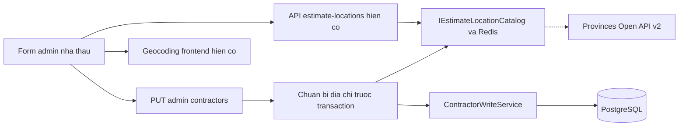
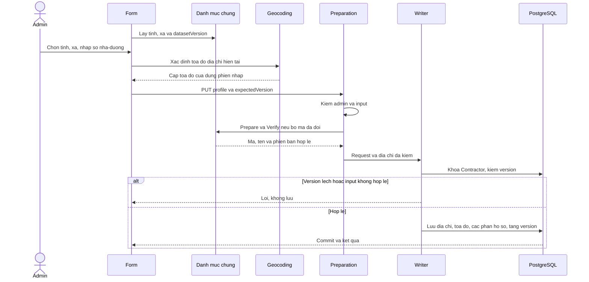
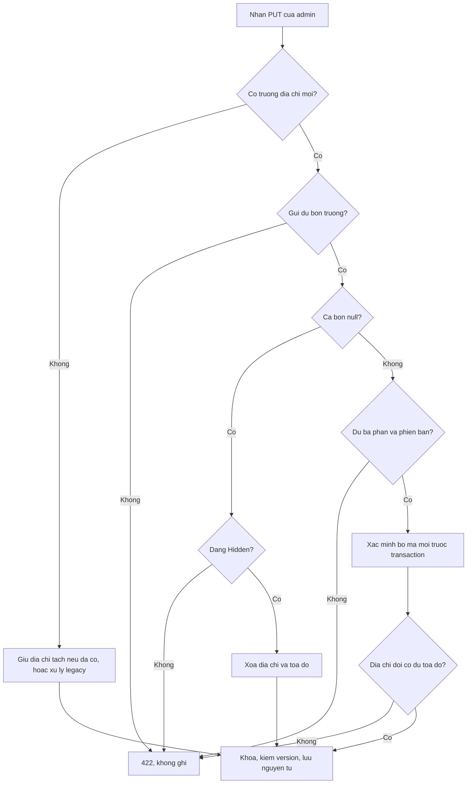
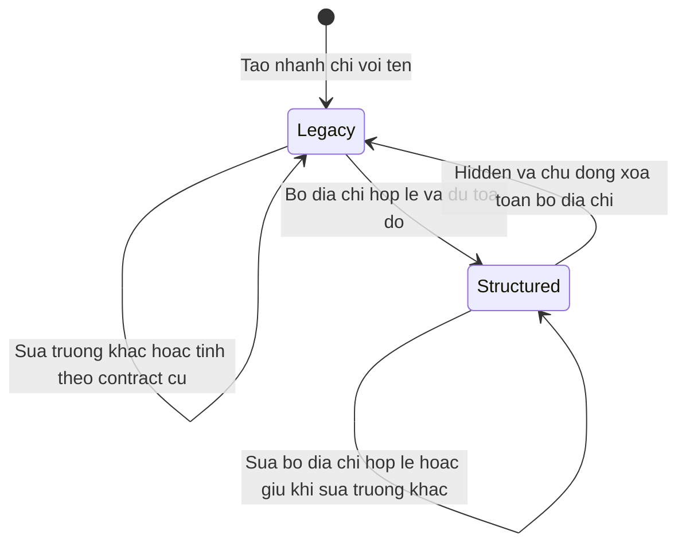
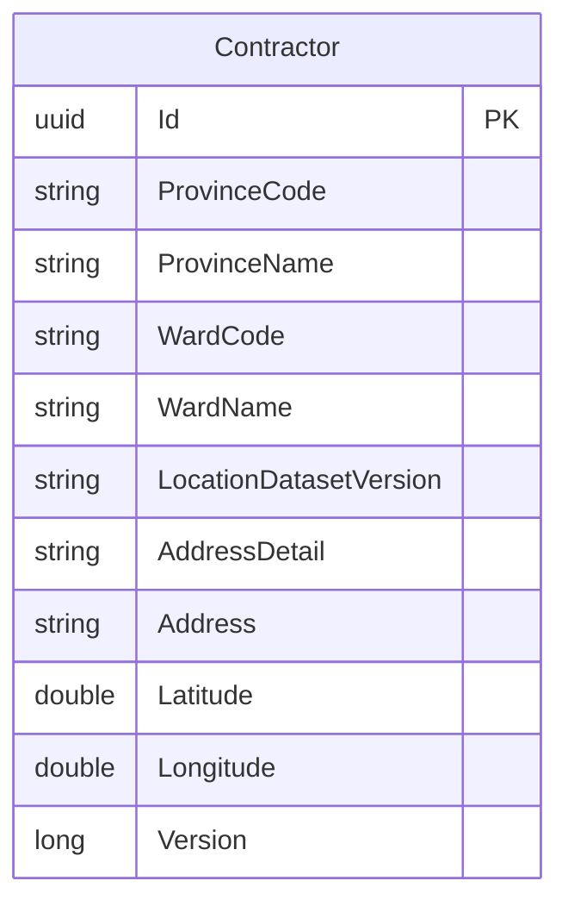

<!-- HƯỚNG DẪN CHO AI KHI ĐIỀN HOẶC CHỈNH SỬA MẪU
- Đọc toàn bộ mẫu, các comment hướng dẫn và tài liệu nguồn được cung cấp trước khi viết. Tuân thủ các quy tắc nghiệp vụ, điều kiện, ngoại lệ và giới hạn đã được xác nhận.
- Không bịa, tự chế hoặc suy đoán thành sự thật: yêu cầu, quy tắc, số liệu, API, schema, mã lỗi, nguồn tham khảo, người phụ trách và kết quả kiểm thử phải có căn cứ. Nội dung ví dụ trong mẫu không phải dữ kiện của dự án.
- Khi thiếu thông tin hoặc các nguồn mâu thuẫn, hỏi người dùng để làm rõ; giữ nguyên placeholder ở phần chưa xác định. Không tự chọn đáp án, lấp chỗ trống hay tuyên bố tài liệu đã hoàn tất.
- Chỉ thay nội dung cần điền hoặc được yêu cầu sửa. Không tự mở rộng phạm vi, sửa nghĩa quy tắc, bỏ điều kiện/ngoại lệ, xoá hay ghi đè nội dung hợp lệ đã có.
- Giữ nguyên tên, cấp và thứ tự heading, nhãn in đậm, tiền tố bullet, cấu trúc danh sách, tên/thứ tự/số cột bảng và cú pháp code fence. Không dịch, đổi tên, gộp hoặc thêm mục ngoài cấu trúc mẫu.
- Chỉ lặp khối luồng, AC hoặc API theo đúng khuôn khi có căn cứ; chỉ bỏ phần tuỳ chọn khi hướng dẫn riêng của mẫu cho phép và đã xác định không áp dụng.
- Mã tham chiếu và section phải trỏ tới tài liệu có thật đã được cung cấp hoặc kiểm chứng. Không giữ mã ví dụ như tham chiếu thật và không tự tạo tài liệu liên quan để hợp thức hoá liên kết.
- Giữ các comment hướng dẫn trong file. Xuất Markdown UTF-8, mỗi file một tài liệu; không bọc toàn bộ file trong code fence, không chèn lời dẫn hay giải thích ngoài mẫu.
- Trước khi bàn giao, đối chiếu nội dung với nguồn, kiểm tra cấu trúc, giá trị cho phép, giới hạn độ dài và tính nhất quán của mã/tham chiếu. Báo rõ phần chưa đủ thông tin; không tuyên bố đã chạy test hoặc import khi chưa thực hiện.
-->

<!-- Thay mã TDD-001 và nội dung ví dụ; giữ nguyên heading và nhãn in đậm.
Sơ đồ dùng mermaid, plantuml hoặc URL. Giữ heading Architecture, Sequence Diagram, Activity Diagram, State Diagram, Data Model.
Ví dụ API phải có heading trùng METHOD /path trong Endpoints. Xoá phần API/sơ đồ không dùng.
Version, Updated At và Change Log do lịch sử phiên bản quản lý, để trống khi nhập mới.
Author/Reviewer là tên hiển thị; gán tài khoản, phê duyệt, giả định và câu hỏi mở trên giao diện sau import.
Thiết kế phải truy vết về Story và Business Rule được cung cấp. Phân biệt thiết kế đề xuất với implementation đã kiểm chứng; không mô tả API/schema/sơ đồ ví dụ như hệ thống thật hoặc tự quyết định nghiệp vụ còn thiếu.
BẮT BUỘC KHI HOÀN THIỆN MẪU: phải có cả Reviewer và Approver, mỗi tên 1–200 ký tự sau khi bỏ khoảng trắng đầu/cuối. Không xoá hai dòng metadata, để trống, dùng tên bịa hoặc giữ placeholder rồi coi là hoàn tất.
Nếu chưa biết người review hoặc người phê duyệt, phải hỏi người dùng và báo tài liệu chưa đủ thông tin; không tự lấy Author/Owner làm người thay thế. Tên trong file không tự gán tài khoản hoặc xác nhận đã duyệt; gán thành viên trên giao diện sau import.
Đây là yêu cầu hoàn thiện mẫu; backend hiện vẫn nhận file cũ thiếu hai trường để tương thích.

VALIDATION CHO FILE NHẬP (đối chiếu ImportSnapshotValidator, MarkdownParser và ImportService):
- Mỗi file .md UTF-8 không rỗng chỉ có một heading cấp 1 chứa mã tài liệu dài 1–100 ký tự. Mã không được trùng trong cùng lần nhập hoặc thuộc loại tài liệu khác đã tồn tại.
- Không dùng tên README.md hoặc sitemap.md vì importer bỏ qua. Giao diện nhận .md/.zip, tối đa 2.000 file, tổng file tải lên 31 MiB; API giới hạn request 32 MiB và tổng nội dung đọc/giải nén 64 MiB.
- Chỉ nhập đè tài liệu cùng loại đang Draft, chưa có phiên bản và chưa lưu trữ. Import thay toàn bộ nội dung bản nháp, vì vậy phải giữ lại nội dung hợp lệ ngoài phần được yêu cầu sửa.
- Không dùng Status trong Markdown hoặc tên Approver để tự xác nhận phê duyệt; import không cấp quyền hay gán tài khoản từ tên. Chạy Kiểm tra file và xử lý lỗi/cảnh báo trước khi nhập.
- Giới hạn độ dài bên dưới tính theo string.Length của .NET (đơn vị UTF-16); không tự cắt ngắn dữ kiện quan trọng để vượt validation, hãy viết lại có căn cứ hoặc hỏi người dùng.
- Feature tối đa 300 ký tự và được dùng làm tiêu đề tài liệu. Status được parser nhận: Draft / In Review / Approved / Deprecated; tài liệu nhập mới vẫn có trạng thái phê duyệt Draft.
- Endpoint: đường dẫn tối đa 500 ký tự; tên/mô tả endpoint được lưu trong Name tối đa 300. HTTP method: GET / POST / PUT / PATCH / DELETE / HEAD / OPTIONS.
- Error Codes: mã tối đa 100 ký tự, không trùng trong tài liệu; giữ dạng - **CODE** (400): mô tả. HTTP status trong Error Codes và Response phải là số nguyên đọc được bằng Int32; không tự đặt status khác hợp đồng API.
- URL sơ đồ tối đa 1.000 ký tự. Mục sơ đồ được sử dụng phải có khối mermaid/plantuml hoặc URL theo mẫu; không để một mục sơ đồ rỗng. Nhãn mục được tách từ bullet như tên External API Fields tối đa 300 ký tự.
- Heading Examples phải khớp METHOD /path ở Endpoints. Giữ các nhãn Request:, Response 200: (thay mã theo contract) và Error Response: để parser tách đúng dữ liệu.
- Tham chiếu dạng DOC-KEY/section: ghi chú: mã đích tối đa 100 ký tự, section tối đa 100, ghi chú tối đa 1.000. Không trùng bộ mã đích + section + loại liên kết trong cùng tài liệu.
ĐỐI CHIẾU FORM TDD (src/features/tdds/validations.ts; form có thể chặt hơn import):
- Điền Feature, Author, Reviewer, Problem và ít nhất một Goal; các Goal/Non-goal/Notes đã thêm không được rỗng. API đã khai báo phải có endpoint và mô tả/mục đích; Fields phải có tên và ý nghĩa; Error Codes phải có mã, HTTP status và điều kiện.
- Form còn kiểm tra Version, Updated At và nội dung Change Log khi khai báo; với file nhập mới, giữ các trường lịch sử này trống theo hợp đồng import, không tự tạo dữ liệu lịch sử.
-->

# TDD-CTR-003

## Document Info

- **Feature**: Địa chỉ nhà thầu tách tỉnh/thành, phường/xã và số nhà–đường
- **Author**: Codex
- **Reviewer**: Tân Trần
- **Approver**: Tân Trần
- **Status**: Draft
- **Version**:
- **Updated At**:

## Context & Goals

### Problem

Người dùng yêu cầu ngày 2026-10-04 bổ sung địa chỉ nhà thầu tương tự dự toán/công trình. Hiện Contractor chỉ có Address, ProvinceCode và tọa độ. Estimate và ConstructionSite có thêm ProvinceName, WardCode, WardName, LocationDatasetVersion, AddressDetail. Form API tại `/admin/contractors` mới có tỉnh và một ô địa chỉ chung. Yêu cầu tách địa chỉ đã rõ; người dùng đã chốt bản thiết kế này trong hội thoại ngày 2026-10-04 và giao triển khai. Chưa coi xác nhận hội thoại là phê duyệt trên hệ thống tài liệu.

Thiết kế bổ sung TDD-CTR-001/002, dùng nguồn địa chỉ tại TDD-PROJ-001 và cách chuẩn bị danh mục trước transaction tại TDD-SITE-003. Không thay dữ liệu tỉnh/miền đã triển khai ngày 03/10/2026. Các xác nhận TDD trước đây không được coi là phê duyệt bản bổ sung này.

### Goals

- Lưu và trả riêng ba phần địa chỉ công ty; xác minh phường thuộc đúng tỉnh.
- Giữ dữ liệu nhà thầu cũ và cách tạo nhanh; không backfill bằng địa chỉ suy đoán.
- Lưu địa chỉ, tên đã xác minh và tọa độ cùng transaction/version hiện có.
- Dùng lại danh mục tỉnh/phường, bản lưu Redis và cơ chế lỗi hiện có của PROJ.

### Non-goals

- Tách địa chỉ đăng ký pháp nhân hoặc LocationText của dự án năng lực.
- Thay thuật toán bán kính bằng khoảng cách đường xe chạy, tự chọn provider bản đồ mới hoặc áp migration production.
- Viết lại snapshot lời mời báo giá đã gửi, thêm bảng địa chỉ nội bộ hoặc đổi quyền quản trị.

## Architecture

Giữ dữ liệu địa chỉ trong aggregate Contractor. Danh mục hành chính qua IEstimateLocationCatalog là nguồn mã/tên; ProvinceRegionCatalog chỉ còn quyết định miền theo mã tỉnh. Hai nguồn dùng chung mã chuẩn nhưng phiên bản khác nhau. Frontend gọi các route estimate-locations đã có, bằng HTTP client dùng chung; không import chéo feature admin → design/contractors. Client danh mục và schema dùng lại có thể đặt tại shared/locations, không sao bảng tỉnh/phường trong component.



**Notes**:

- Phân biệt chế độ bằng sự hiện diện các trường mới của input. Nếu không có wardCode, locationDatasetVersion hoặc addressDetail, xử lý tương thích legacy. Nếu bất kỳ trường mới nào xuất hiện, yêu cầu gửi đủ provinceCode, wardCode, locationDatasetVersion và addressDetail. Cờ hiện diện là nội bộ JsonIgnore, không nhận từ client; thiếu trường trả InvalidContractorInput thay vì âm thầm xóa.
- Bộ mới chấp nhận hai dạng: đủ bốn giá trị không rỗng để đặt địa chỉ; hoặc cả bốn null để xóa toàn bộ địa chỉ ở Hidden. Không chấp nhận bộ dở dang trong PUT. Đây là lựa chọn đã chốt để không tạo địa chỉ nửa cũ nửa mới; tạo nhanh POST vẫn chỉ cần tên. Sửa provinceCode riêng trên hồ sơ legacy vẫn theo TDD-CTR-001.
- Khi bộ mới đầy đủ, normalize tỉnh qua ProvinceRegionCatalog; phường là chuỗi 1–5 chữ số ASCII sau trim, bỏ số 0 đầu, không âm/dương/thập phân. Xác minh tỉnh và phường trong phiên bản danh mục được gửi; lưu mã chuẩn và tên do nguồn trả. ProvinceName/WardName trong response là thông tin đọc, không lấy từ client khi ghi. AddressDetail chuẩn NFC/trim, tối đa 500 ký tự, không cắt ngắn.
- Thêm preparation behavior/service cho UpdateContractorCommand trước TransactionPipelineBehavior. Kiểm quyền admin trước khi gọi danh mục; đọc địa chỉ/version đã lưu để quyết định có cần xác minh; version đã lệch thì từ chối trước khi gọi danh mục. Nếu bộ mã/phiên bản không đổi thì dùng tên đã lưu; đổi số nhà–đường chỉ ghép lại địa chỉ, không bắt chọn lại xã cũ. Nếu bộ mã/phiên bản đổi hoặc đang chuyển hồ sơ legacy thì PrepareAsync rồi VerifyAsync trước khi giữ khóa PostgreSQL. Không gọi HTTP trong LockAsync hoặc writer.
- Writer vẫn khóa Contractor FOR UPDATE và kiểm expectedVersion; chỉ dùng kết quả chuẩn bị khớp chính request. Nếu dữ liệu đã đổi trong lúc chuẩn bị thì trả version conflict, không dùng kết quả kiểm theo bản cũ. Áp địa chỉ cùng hồ sơ, liên kết ảnh và version trong transaction hiện có; lỗi hoàn tác toàn bộ. Không thêm transaction hoặc event bus cho địa chỉ.
- Address mới do backend ghép `AddressDetail + ", " + WardName + ", " + ProvinceName`. Khi bộ mới được gửi, Address client không phải nguồn ghi. Giữ tên tại thời điểm chọn để địa chỉ đang lưu không tự thay chữ khi nguồn ngoài đổi.
- Khi đặt địa chỉ mới hoặc ba phần thực sự đổi, phải gửi đủ cặp tọa độ hữu hạn theo miền hiện có. Tọa độ có thể trùng giá trị cũ; backend không chứng minh vị trí khớp địa chỉ bằng kiểm miền số. Lần sửa không đổi địa chỉ được gửi lại cặp hoặc bỏ cả hai để giữ cặp cũ; DTO theo dõi hiện diện hai trường tọa độ để phân biệt bỏ trường với chủ động xóa. Xóa toàn bộ địa chỉ ở Hidden xóa cả cặp tọa độ; Visible từ chối theo điều kiện đủ trường hiện có.
- Request legacy trên hồ sơ đã có cấu trúc chỉ được giữ nguyên Address và tỉnh; thiếu Address trong full profile được hiểu giữ Address đã ghép. Nếu gửi Address hoặc tỉnh khác thì từ chối và yêu cầu gửi bộ mới; không cho writer cũ làm lệch Address với các phần nguồn. PUT không chứa trường mới phải giữ các trường mới đã lưu. Các section khác vẫn theo semantics thay toàn bộ của TDD-CTR-001.
- Form admin có tỉnh/phường từ nguồn chung, ô số nhà–đường và địa chỉ đầy đủ chỉ đọc. Đổi tỉnh bỏ phường, giữ số nhà–đường, đánh dấu tọa độ cũ hết hiệu lực. Chỉ geocode khi ba phần đầy đủ; admin vẫn có thể nhập và xác nhận cặp tọa độ cho địa chỉ hiện tại bằng các ô tọa độ hiện có; hủy/bỏ kết quả đến muộn bằng signal và số thứ tự phiên nhập. Trong lúc chờ/lỗi, giữ dữ liệu nhập và khóa lưu cho đến khi có cặp tọa độ đã chọn hoặc xác nhận cho địa chỉ hiện tại; có thử lại. Hai locale vi/en có nhãn/lỗi tương ứng.
- Hồ sơ legacy hiển thị địa chỉ cũ riêng cùng hướng dẫn bổ sung. Nếu admin chỉ sửa phần khác, frontend không gửi bộ mới toàn null. Chỉ gửi bộ mới khi admin chuyển sang ba phần hoặc chủ động xóa. Tránh form cũ/mới vô tình làm mất địa chỉ. Không biến lỗi API thành danh mục giả hoặc dữ liệu mock.

## Sequence Diagram



## Activity Diagram



## State Diagram



Legacy/Structured là chế độ suy ra từ LocationDatasetVersion và bộ địa chỉ, không phải cột trạng thái mới. Hidden/Visible, quyền và điều kiện xóa nhà thầu vẫn theo CTR/RFQ.

## Data Model

Contractor vẫn có một dòng cho một công ty, admin là writer. Thêm các phần địa chỉ vào dòng hiện có, không tạo quan hệ FK tới danh mục ngoài. Khóa, các bảng con và hành vi xóa theo TDD-CTR-001; không thêm index phường vì chưa có query lọc phường.

| Cột | Kiểu, NULL và ý nghĩa |
|---|---|
| ProvinceCode | varchar(2) NULL hiện có; mã tỉnh chuẩn để lọc miền. Legacy có thể chỉ có mã này. |
| ProvinceName | text NULL mới; tên tỉnh đã xác minh tại lúc chọn, không phải tên hiện hành cập nhật tự động. |
| WardCode, WardName | text NULL mới; mã chuẩn và tên phường/xã đã xác minh, WardCode là chuỗi 1–5 chữ số không có số 0 đầu. |
| LocationDatasetVersion | text NULL mới; phiên bản danh mục địa chỉ đã xác minh. Khác provinceRegionVersion dùng cho bảng miền. |
| AddressDetail | varchar(500) NULL mới; số nhà–đường sau NFC/trim. |
| Address | Đổi varchar(500) NULL thành text NULL; bản ghép cho hồ sơ Structured, nguyên chuỗi cũ cho Legacy. Không dùng giới hạn 500 của số nhà–đường để cắt địa chỉ ghép. |
| Latitude, Longitude, Version | Giữ kiểu và constraint hiện có; địa chỉ và tọa độ ghi trong cùng transaction/version. |

**Mẫu dữ liệu giả định, trích cột:** A là bí danh UUID; các tên địa chỉ và mã xã chỉ thuộc fixture được chuẩn bị, không phải xác nhận nguồn thật.

| Tình huống | Dữ liệu lưu tại Contractor |
|---|---|
| Trước migration | A; Address="Địa chỉ công ty cũ"; ProvinceCode="1"; Latitude=21.04; Longitude=105.83; Version=4. |
| Sau migration, chưa bổ sung | Các cột trên giữ nguyên; ProvinceName, WardCode, WardName, LocationDatasetVersion, AddressDetail đều NULL. |
| Admin bổ sung địa chỉ | A; ProvinceCode="1"; ProvinceName="Thành phố Hà Nội"; WardCode="4"; WardName="Phường Ba Đình"; LocationDatasetVersion="pov2-fixture"; AddressDetail="12 Đường A"; Address="12 Đường A, Phường Ba Đình, Thành phố Hà Nội"; Latitude=21.04; Longitude=105.83; Version=5. |
| Sửa giới thiệu, bỏ trường địa chỉ mới | Bộ địa chỉ và tọa độ trên giữ nguyên; Version tăng 6. |
| Hidden, chủ động xóa bộ địa chỉ | ProvinceCode và toàn bộ trường địa chỉ mới, Address, Latitude, Longitude đều NULL; Version tăng theo lần sửa. |



**Notes**:

- Chỉ bộ Structured có ràng buộc đầy đủ: khi LocationDatasetVersion khác NULL thì ProvinceCode/ProvinceName/WardCode/WardName/AddressDetail phải có nội dung; khi LocationDatasetVersion NULL thì các trường mới đều NULL, nhưng ProvinceCode legacy được phép có giá trị. CHECK phải bao gồm rõ IS NOT NULL để không lọt vì SQL UNKNOWN. CHECK hình thức WardCode và mã tỉnh không thay xác minh quan hệ tỉnh–phường của application.
- ProvinceName/WardName là bản ghi tên tại lúc chọn của đúng phiên bản; source chung vẫn sở hữu danh mục. Address là dữ liệu ghép để tương thích, chỉ writer địa chỉ mới được cập nhật cùng transaction. Không lưu RegionCode, không tạo bảng copy danh mục chỉ để join tên hiện hành.
- Migration mở rộng: thêm năm cột nullable không default giả; đổi Address sang text; thêm CHECK cho bộ mới. Không UPDATE dữ liệu cũ, không sửa Status, tọa độ, actor hoặc Version. Giữ index ProvinceCode/Status cho bộ lọc miền.
- Trước và sau migration kiểm số dòng, các cột cũ và NULL của cột mới trên PostgreSQL tạm. Chưa có số liệu kích thước bảng/thời gian khóa thực tế; cần chọn cửa sổ triển khai phù hợp khi phát hành. Triển khai schema trước backend mới rồi frontend. Không duy trì writer cũ cùng backend mới khi đã bắt đầu lưu bộ Structured.
- Quay lại ứng dụng thì giữ schema và dữ liệu. Down phải chặn khi có bất kỳ trường địa chỉ mới khác NULL hoặc Address dài hơn 500; không drop cột hay cắt chuỗi để rollback dữ liệu. Đã tạo migration `20261003181715_AddContractorStructuredAddress` và kiểm trên PostgreSQL tạm; chưa áp lên database đang dùng.
- Snapshot lời mời báo giá cũ giữ nguyên. Lần mời mới tiếp tục lấy địa chỉ đầy đủ hiện hành theo mapping snapshot RFQ; không sửa payload cũ hoặc bắt backfill snapshot.
- Chiến lược kiểm chứng sau chốt: validation và hiện diện JSON; PostgreSQL cho migration/constraint/rollback/version, dữ liệu legacy và lọc miền; HTTP cho serialization và lỗi; frontend cho phụ thuộc tỉnh–phường, phản hồi đến muộn, dữ liệu cũ và vi/en. Đã bổ sung UT-CTR-039 đến UT-CTR-043 và code test tương ứng; bằng chứng thực thi nằm ở References/ Others.

## Internal API

### Endpoints

- **POST** `/api/v1/admin/contractors` — Giữ contract tạo nhanh `{name,provinceCode?}` và response/status hiện có. Địa chỉ đủ ba phần được lưu qua PUT hồ sơ như luồng admin hiện tại.
- **PUT** `/api/v1/admin/contractors/{contractorId}` — Giữ expectedVersion và các section; profile bổ sung `wardCode`, `locationDatasetVersion`, `addressDetail` cùng `provinceCode` hiện có. Không lấy tên tỉnh/phường client khai để ghi. Tương thích legacy và bộ mới theo Architecture/Notes.
- **GET** `/api/v1/admin/contractors/{contractorId}` — Profile trả thêm provinceName, wardCode, wardName, locationDatasetVersion, addressDetail; trường không có trả null. Giữ address đầy đủ và regionCode cấp ngoài.
- **GET** `/api/v1/contractors/{contractorId}` — Profile công khai có cùng phần địa chỉ mới; không thêm contact hoặc dữ liệu quản trị. GET danh sách giữ thẻ gọn/address/provinceCode/regionCode, không bắt buộc thêm toàn bộ phần địa chỉ vào từng thẻ.
- **GET** `/api/v1/estimate-locations/provinces` — Route hiện có, cần phiên xác thực hợp lệ; trả `{datasetVersion,provinces:[{code,name}]}` qua Result. Admin dùng cùng route, không phát sinh endpoint danh mục mới.
- **GET** `/api/v1/estimate-locations/provinces/{provinceCode}/wards` — Route hiện có, cần phiên xác thực; query datasetVersion; trả `{datasetVersion,provinceCode,wards:[{code,name}]}`. Tỉnh mới thì query/cache key phải chứa cả tỉnh và phiên bản.

### Examples

#### PUT /api/v1/admin/contractors/{contractorId}

```
Request:
{
  "expectedVersion": 4,
  "profile": {
    "name": "Công ty mẫu",
    "provinceCode": "1",
    "wardCode": "4",
    "locationDatasetVersion": "pov2-fixture",
    "addressDetail": "12 Đường A",
    "latitude": 21.04,
    "longitude": 105.83
  },
  "buildingTypeIds": [],
  "scopeIds": [],
  "legal": null,
  "licenses": [],
  "partnership": null,
  "images": []
}

Response 200:
{"value":{"contractorId":"11111111-1111-4111-8111-111111111111","version":5,"status":"Hidden"},"isSuccess":true,"isFailure":false,"error":{"code":"","message":"","messageCode":""}}

Error Response:
{"title":"Validation Failure","code":"ValidationFailure","status":422,"detail":"One or more validation errors occurred","messageCode":"InvalidContractorInput","errors":[{"PropertyName":"profile.wardCode","ErrorMessage":"Phường/xã không thuộc tỉnh đã chọn."}]}
```

Ví dụ giả định danh mục fixture chấp nhận tỉnh 1/phường 4; không gửi phiên bản fixture vào môi trường thật. Các section rỗng có nghĩa thay toàn bộ theo contract hiện có, không phải yêu cầu người vận hành xóa tệp khi bổ sung địa chỉ.

### Error Codes

- **InvalidContractorInput** (422): bộ địa chỉ mới thiếu trường, không đủ giá trị, mã sai/không thuộc danh mục, xã sai tỉnh hoặc thiếu tọa độ khi địa chỉ đổi.
- **ContractorProfileIncomplete** (422): Visible bị xóa địa chỉ hoặc thiếu điều kiện hiện có.
- **LocationDatasetChanged** (409): chọn địa chỉ mới từ phiên bản danh mục khác hiện hành; dùng mã của adapter chung.
- **DependencyUnavailable** (503): cần xác minh địa chỉ mới nhưng chưa có dữ liệu nguồn/bản lưu dùng được.
- **ContractorVersionConflict** (409): expectedVersion không khớp lúc writer giữ khóa.

Quyền, CSRF và lỗi không tìm thấy giữ TDD-CTR-001. Lỗi nguồn không thay bằng thành công hoặc nhận tên tỉnh/phường tự khai.

## External API

### Endpoints

- **Provinces Open API v2** — Dùng adapter/cấu hình/cache đã có của dự toán; không tạo HttpClient, cache hoặc nhà cung cấp mới riêng cho nhà thầu.
- **Geocoding frontend hiện có** — Nhận địa chỉ đầy đủ hiện tại và trả cặp WGS84. Backend không gọi dịch vụ bản đồ để kiểm địa chỉ khi ghi.

### Fields

- **provinceCode, wardCode, datasetVersion** — Mã chuẩn và phiên bản từ danh mục chung; tên nhận ở kết quả xác minh.
- **latitude, longitude** — Số hữu hạn theo miền hiện có, cùng lần nhập địa chỉ mà frontend đang xử lý.

### Error Handling

Giữ cơ chế PROJ: khi nguồn ngoài lỗi dùng bản lưu sẵn có; chưa có bản dùng được trả DependencyUnavailable. Khi danh mục thay đổi, form giữ số nhà–đường và yêu cầu tải/chọn lại tỉnh/phường. Giữ tên đã lưu cho địa chỉ không đổi. Lỗi geocoding giữ dữ liệu form, cho thử lại và không gửi địa chỉ mới với tọa độ cũ.

### Quirks

- LocationDatasetVersion là phiên bản tính từ nội dung nguồn địa chỉ, không phải mã phiên bản bảng ba miền.
- Tên/phường đã lưu có thể khác danh mục hiện hành; không viết lại địa chỉ cũ chỉ vì tải options.
- API bản đồ hiện có giới hạn chuỗi tìm kiếm 500 ký tự. Nếu địa chỉ ghép dài hơn giới hạn hoặc không tra được vị trí, admin có thể nhập và xác nhận tọa độ cho địa chỉ hiện tại. Không cắt địa chỉ để vượt giới hạn bản đồ.

## References

### User Stories

- STORY-CTR-001/AC-012
- STORY-CTR-001/AC-013
- STORY-CTR-001/AC-014

### Business Rules

- BR-CTR-009/Then
- BR-CTR-002/Then
- BR-CTR-008/Then

### Use Cases

- STORY-CTR-001/Main Flow

### Others

- Đặc tả sau chốt: [UT-CTR-039](../unittest/UT-CTR-039.md), [UT-CTR-040](../unittest/UT-CTR-040.md), [UT-CTR-041](../unittest/UT-CTR-041.md), [UT-CTR-042](../unittest/UT-CTR-042.md), [UT-CTR-043](../unittest/UT-CTR-043.md).

- [TDD-CTR-001](TDD-CTR-001.md): aggregate, quyền, transaction, full profile và API quản trị.
- [TDD-CTR-002](TDD-CTR-002.md): địa chỉ công khai và bộ lọc miền/bán kính.
- [TDD-PROJ-001](TDD-PROJ-001.md): danh mục địa chỉ dùng chung, phiên bản và bản lưu khi nguồn lỗi.
- [TDD-SITE-003](TDD-SITE-003.md): lưu địa chỉ ba phần và tên đã xác minh.
- [ST-CTR-041](../systemtest/ST-CTR-041.md), [ST-CTR-042](../systemtest/ST-CTR-042.md), [ST-CTR-043](../systemtest/ST-CTR-043.md), [ST-CTR-044](../systemtest/ST-CTR-044.md), [ST-CTR-045](../systemtest/ST-CTR-045.md), [ST-CTR-046](../systemtest/ST-CTR-046.md): đặc tả ca hệ thống theo thiết kế đã chốt; chưa chạy đầy đủ qua giao diện.
- Code nguồn đã khảo sát: ContractorWriteService, ContractorMapping, ContractorInputs, ContractorConfiguration; IEstimateLocationCatalog, ProvincesOpenApiLocationCatalog, ConstructionSiteLocationPreparation; form API contractor-admin-manager.tsx.

- Implementation: `ContractorAddressRules`, `ContractorLocationBehavior`, các mapping/admin/public projection, schema Contractor và `contractor-address-field.tsx`.
- Kiểm chứng ngày 2026-10-04: 67/67 test ứng dụng (địa chỉ, tỉnh/miền và quy tắc hồ sơ), 15/15 test PostgreSQL nhà thầu/migration, 16/16 test HTTP nhà thầu đều đạt, không bỏ qua. PostgreSQL chạy trong container tạm; nguồn địa chỉ dùng fixture nên không coi là xác nhận danh mục live. Log: `/private/tmp/bmt-address-{unit,db,api}.log`. EF xác nhận không có thay đổi model còn thiếu migration.
- Frontend: TypeScript, ESLint và Prettier trên các file của thay đổi đều đạt. Chưa kiểm E2E qua trình duyệt: Chrome MCP không mở được vì profile đang được phiên khác sử dụng. Frontend chưa push; phạm vi đưa lên Git của đợt này là backend ở develop và tài liệu ở main theo yêu cầu người dùng. Chưa triển khai hoặc áp migration lên môi trường chung.

## Change Log
