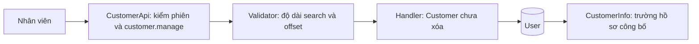
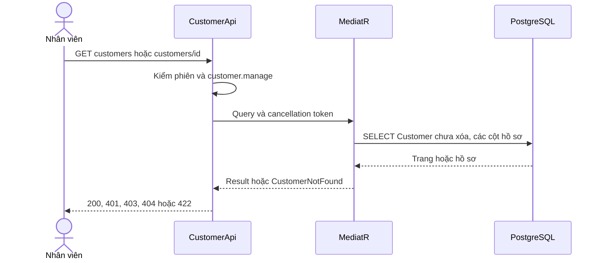
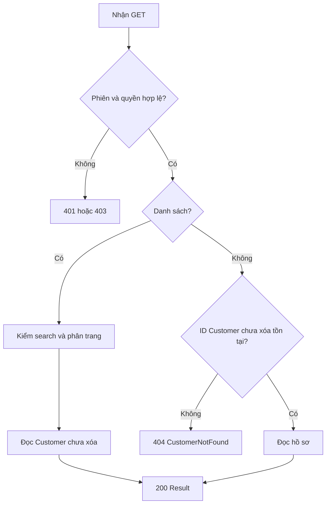
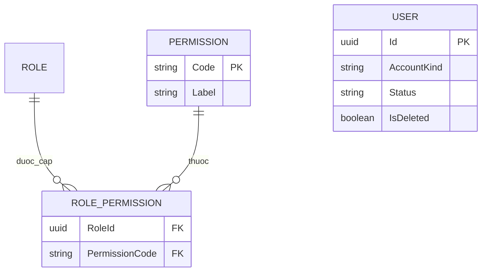

<!-- HƯỚNG DẪN CHO AI KHI ĐIỀN HOẶC CHỈNH SỬA MẪU
- Đọc toàn bộ mẫu, các comment hướng dẫn và tài liệu nguồn được cung cấp trước khi viết. Tuân thủ các quy tắc nghiệp vụ, điều kiện, ngoại lệ và giới hạn đã được xác nhận.
- Không bịa, tự chế hoặc suy đoán thành sự thật: yêu cầu, quy tắc, số liệu, API, schema, mã lỗi, nguồn tham khảo, người phụ trách và kết quả kiểm thử phải có căn cứ. Nội dung ví dụ trong mẫu không phải dữ kiện của dự án.
- Khi thiếu thông tin hoặc các nguồn mâu thuẫn, hỏi người dùng để làm rõ; giữ nguyên placeholder ở phần chưa xác định. Không tự chọn đáp án, lấp chỗ trống hay tuyên bố tài liệu đã hoàn tất.
- Chỉ thay nội dung cần điền hoặc được yêu cầu sửa. Không tự mở rộng phạm vi, sửa nghĩa quy tắc, bỏ điều kiện/ngoại lệ, xoá hay ghi đè nội dung hợp lệ đã có.
- Giữ nguyên tên, cấp và thứ tự heading, nhãn in đậm, tiền tố bullet, cấu trúc danh sách, tên/thứ tự/số cột bảng và cú pháp code fence. Không dịch, đổi tên, gộp hoặc thêm mục ngoài cấu trúc mẫu.
- Chỉ lặp khối luồng, AC hoặc API theo đúng khuôn khi có căn cứ; chỉ bỏ phần tuỳ chọn khi hướng dẫn riêng của mẫu cho phép và đã xác định không áp dụng.
- Mã tham chiếu và section phải trỏ tới tài liệu có thật đã được cung cấp hoặc kiểm chứng. Không giữ mã ví dụ như tham chiếu thật và không tự tạo tài liệu liên quan để hợp thức hoá liên kết.
- Giữ các comment hướng dẫn trong file. Xuất Markdown UTF-8, mỗi file một tài liệu; không bọc toàn bộ file trong code fence, không chèn lời dẫn hay giải thích ngoài mẫu.
- Trước khi bàn giao, đối chiếu nội dung với nguồn, kiểm tra cấu trúc, giá trị cho phép, giới hạn độ dài và tính nhất quán của mã/tham chiếu. Báo rõ phần chưa đủ thông tin; không tuyên bố đã chạy test hoặc import khi chưa thực hiện.
-->

<!-- Thay mã TDD-001 và nội dung ví dụ; giữ nguyên heading và nhãn in đậm.
Sơ đồ dùng mermaid, plantuml hoặc URL. Giữ heading Architecture, Sequence Diagram, Activity Diagram, State Diagram, Data Model.
Ví dụ API phải có heading trùng METHOD /path trong Endpoints. Xoá phần API/sơ đồ không dùng.
Version, Updated At và Change Log do lịch sử phiên bản quản lý, để trống khi nhập mới.
Author/Reviewer là tên hiển thị; gán tài khoản, phê duyệt, giả định và câu hỏi mở trên giao diện sau import.
Thiết kế phải truy vết về Story và Business Rule được cung cấp. Phân biệt thiết kế đề xuất với implementation đã kiểm chứng; không mô tả API/schema/sơ đồ ví dụ như hệ thống thật hoặc tự quyết định nghiệp vụ còn thiếu.
BẮT BUỘC KHI HOÀN THIỆN MẪU: phải có cả Reviewer và Approver, mỗi tên 1–200 ký tự sau khi bỏ khoảng trắng đầu/cuối. Không xoá hai dòng metadata, để trống, dùng tên bịa hoặc giữ placeholder rồi coi là hoàn tất.
Nếu chưa biết người review hoặc người phê duyệt, phải hỏi người dùng và báo tài liệu chưa đủ thông tin; không tự lấy Author/Owner làm người thay thế. Tên trong file không tự gán tài khoản hoặc xác nhận đã duyệt; gán thành viên trên giao diện sau import.
Đây là yêu cầu hoàn thiện mẫu; backend hiện vẫn nhận file cũ thiếu hai trường để tương thích.

VALIDATION CHO FILE NHẬP (đối chiếu ImportSnapshotValidator, MarkdownParser và ImportService):
- Mỗi file .md UTF-8 không rỗng chỉ có một heading cấp 1 chứa mã tài liệu dài 1–100 ký tự. Mã không được trùng trong cùng lần nhập hoặc thuộc loại tài liệu khác đã tồn tại.
- Không dùng tên README.md hoặc sitemap.md vì importer bỏ qua. Giao diện nhận .md/.zip, tối đa 2.000 file, tổng file tải lên 31 MiB; API giới hạn request 32 MiB và tổng nội dung đọc/giải nén 64 MiB.
- Chỉ nhập đè tài liệu cùng loại đang Draft, chưa có phiên bản và chưa lưu trữ. Import thay toàn bộ nội dung bản nháp, vì vậy phải giữ lại nội dung hợp lệ ngoài phần được yêu cầu sửa.
- Không dùng Status trong Markdown hoặc tên Approver để tự xác nhận phê duyệt; import không cấp quyền hay gán tài khoản từ tên. Chạy Kiểm tra file và xử lý lỗi/cảnh báo trước khi nhập.
- Giới hạn độ dài bên dưới tính theo string.Length của .NET (đơn vị UTF-16); không tự cắt ngắn dữ kiện quan trọng để vượt validation, hãy viết lại có căn cứ hoặc hỏi người dùng.
- Feature tối đa 300 ký tự và được dùng làm tiêu đề tài liệu. Status được parser nhận: Draft / In Review / Approved / Deprecated; tài liệu nhập mới vẫn có trạng thái phê duyệt Draft.
- Endpoint: đường dẫn tối đa 500 ký tự; tên/mô tả endpoint được lưu trong Name tối đa 300. HTTP method: GET / POST / PUT / PATCH / DELETE / HEAD / OPTIONS.
- Error Codes: mã tối đa 100 ký tự, không trùng trong tài liệu; giữ dạng - **CODE** (400): mô tả. HTTP status trong Error Codes và Response phải là số nguyên đọc được bằng Int32; không tự đặt status khác hợp đồng API.
- URL sơ đồ tối đa 1.000 ký tự. Mục sơ đồ được sử dụng phải có khối mermaid/plantuml hoặc URL theo mẫu; không để một mục sơ đồ rỗng. Nhãn mục được tách từ bullet như tên External API Fields tối đa 300 ký tự.
- Heading Examples phải khớp METHOD /path ở Endpoints. Giữ các nhãn Request:, Response 200: (thay mã theo contract) và Error Response: để parser tách đúng dữ liệu.
- Tham chiếu dạng DOC-KEY/section: ghi chú: mã đích tối đa 100 ký tự, section tối đa 100, ghi chú tối đa 1.000. Không trùng bộ mã đích + section + loại liên kết trong cùng tài liệu.
ĐỐI CHIẾU FORM TDD (src/features/tdds/validations.ts; form có thể chặt hơn import):
- Điền Feature, Author, Reviewer, Problem và ít nhất một Goal; các Goal/Non-goal/Notes đã thêm không được rỗng. API đã khai báo phải có endpoint và mô tả/mục đích; Fields phải có tên và ý nghĩa; Error Codes phải có mã, HTTP status và điều kiện.
- Form còn kiểm tra Version, Updated At và nội dung Change Log khi khai báo; với file nhập mới, giữ các trường lịch sử này trống theo hợp đồng import, không tự tạo dữ liệu lịch sử.
-->


# TDD-CUSTOMER-001

## Document Info

- **Feature**: GET danh sách và chi tiết tài khoản khách hàng
- **Author**: [Chưa xác định]
- **Reviewer**: Tân Trần
- **Approver**: Tân Trần
- **Status**: Draft
- **Version**:
- **Updated At**:

## Context & Goals

### Problem

Chưa có API tra cứu Customer cho nhân viên; màn quản trị đang dùng dữ liệu localStorage. Cần hai query chỉ đọc theo phương án người dùng đã đồng ý, không triển khai thao tác quản trị ghi.

### Goals

- Trả danh sách phân trang và chi tiết đúng phạm vi Customer, kiểm quyền riêng tại server.
- Chỉ SELECT các trường hồ sơ công bố, không tải bí mật vào DTO.

### Non-goals

- Thao tác ghi tài khoản, nhật ký, gói và tích hợp màn hình.

## Architecture

CustomerApi (Carter v1) yêu cầu policy `customer.manage` và gửi query qua MediatR. Validator kiểm search và vị trí trang; handler dùng IUnitOfWork.UserRepository, projection chung CustomerReadProjection và EF Core không tracking. Handler không mở transaction ghi, không gọi Redis, email hoặc API ngoài.



**Notes**:
- Phản hồi hồ sơ được gắn Cache-Control: no-store qua helper hiện có, tránh lưu dữ liệu khách hàng trong cache trình duyệt/proxy.
- Tái sử dụng policy quyền hiện có, gồm yêu cầu phiên thông thường, xác minh email và đã đổi mật khẩu bắt buộc. Không có Admin bypass.
- Projection là biểu thức LINQ để PostgreSQL SELECT đúng các cột cần; không serialize trực tiếp entity User.
- Mặc định 20 dòng, tối đa 100; trang không dương về 1, size không dương về 20, size vượt 100 về 100. Offset vượt int.MaxValue bị từ chối 422.
- search trim, tối đa 200 ký tự; tìm chuỗi con không phân biệt hoa thường ở tên/email và chuỗi con SĐT, hỗ trợ hai thứ tự họ/tên. Không cam kết tìm không dấu. Contains dùng tham số EF, ký tự phần trăm không trở thành wildcard do người gọi kiểm soát.
- Sắp CreatedOnUtc giảm dần rồi Id tăng dần để thứ tự ổn định khi ngày tạo trùng. Count và trang là hai truy vấn đọc; dữ liệu có thể đổi giữa chúng, không hứa snapshot đồng thời.

## Sequence Diagram



## Activity Diagram



## State Diagram

Không có chuyển trạng thái User trong tính năng này; hai query chỉ đọc. Không thêm thao tác khóa/mở khóa.

## Data Model

Không tạo bảng hoặc cột User mới. Một dòng User là một tài khoản. Dùng AccountKind=Customer và IsDeleted=false để chọn; ánh xạ CreatedOnUtc sang DTO createdAtUtc. FirstName, LastName, PhoneNumber và Avatar có thể NULL. Status và IsEmailVerified là hai thuộc tính riêng.

Ví dụ giả định: User có Id=a12caa20-7d21-4b44-80a0-0cfdd0f7bfcc, FirstName=An, LastName=Nguyễn, Email=an@example.test, PhoneNumber=NULL, Avatar=NULL, AccountKind=Customer, Status=Locked, IsEmailVerified=false, CreatedOnUtc=2026-10-06T03:00:00Z, IsDeleted=false. DTO giữ tên, NULL và hai trạng thái đó; không trả AccountKind, IsDeleted hoặc bí mật.

Migration 20261006120000_CustomerReadPermission thêm một dòng Permission(Code=customer.manage, Label=Tra cứu tài khoản khách hàng, RequiresAssignment=false) và một dòng RolePermission(RoleId=00000000-0000-0000-0000-0000000000a1, PermissionCode=customer.manage). Các bảng và khóa hiện có giữ nguyên. Một dòng Permission là một quyền; một dòng RolePermission là một lần cấp quyền cho vai trò. Tài khoản khách không nhận quyền này. Down gỡ quyền khỏi mọi vai trò rồi xóa Permission để không vi phạm FK RESTRICT.



**Notes**:
- Tái sử dụng index User(AccountKind, Status); tìm chuỗi con có thể phải quét nhóm Customer, chưa thêm index tìm kiếm hoặc dependency.
- Chạy migration trước khi khởi động code mới vì backend đối chiếu danh mục quyền. Admin cần đăng nhập hoặc refresh để nhận quyền mới trong token. Chưa áp dụng migration lên môi trường chung trong tác vụ này.
- Unit test kiểm phạm vi, null, phân trang và DTO; TestServer kiểm endpoint/policy thật với sender và dấu phiên giả; integration test PostgreSQL kiểm SQL và migration. Không coi InMemory hoặc TestServer là bằng chứng đã gọi API production.

## Internal API

### Endpoints

- **GET** `/api/v1/customers` — cần customer.manage; search tùy chọn, pageIndex mặc định 1, pageSize mặc định 20. Trả Result<PagedResult<CustomerInfo>>.
- **GET** `/api/v1/customers/{customerId}` — cần customer.manage; GUID từ route. Trả Result<CustomerInfo>.

### Examples

#### GET /api/v1/customers

```text
Request:
GET /api/v1/customers?search=An&pageIndex=1&pageSize=20

Response 200:
{"value":{"items":[{"id":"a12caa20-7d21-4b44-80a0-0cfdd0f7bfcc","firstName":"An","lastName":"Nguyễn","email":"an@example.test","phoneNumber":null,"avatar":null,"status":"Locked","isEmailVerified":false,"createdAtUtc":"2026-10-06T03:00:00+00:00"}],"pageIndex":1,"pageSize":20,"totalCount":1,"hasNextPage":false,"hasPreviousPage":false},"isSuccess":true,"isFailure":false,"error":{"code":"","message":""}}

Error Response:
HTTP 403; messageCode=AccessForbidden; không trả dữ liệu khách hàng.
```

#### GET /api/v1/customers/{customerId}

```text
Request:
GET /api/v1/customers/a12caa20-7d21-4b44-80a0-0cfdd0f7bfcc

Response 200:
{"value":{"id":"a12caa20-7d21-4b44-80a0-0cfdd0f7bfcc","firstName":"An","lastName":"Nguyễn","email":"an@example.test","phoneNumber":null,"avatar":null,"status":"Locked","isEmailVerified":false,"createdAtUtc":"2026-10-06T03:00:00+00:00"},"isSuccess":true,"isFailure":false,"error":{"code":"","message":""}}

Error Response:
HTTP 404; messageCode=CustomerNotFound.
```

### Error Codes

- **Unauthorized** (401): Chưa có phiên hợp lệ; dùng xử lý JWT hiện có.
- **AccessForbidden** (403): Thiếu customer.manage hoặc không đáp ứng policy nền.
- **CustomerNotFound** (404): ID không tồn tại, đã xóa hoặc thuộc Staff.
- **CustomerQueryInvalid** (422): search quá 200 ký tự hoặc offset trang quá lớn, trong errors của validation middleware hiện có.

## External API

### Endpoints

Không gọi dịch vụ ngoài.

### Fields

Không áp dụng.

### Error Handling

Dùng middleware lỗi hiện có; truyền cancellation token tới count và đọc trang/chi tiết.

### Quirks

- Route ID có constraint guid; ID sai định dạng không khớp route.

## References

### User Stories

- STORY-CUSTOMER-001

### Business Rules

- BR-CUSTOMER-001

### Use Cases

### Others

- Mã nguồn: bmt-be.contract/services/customer; bmt-be.application/usecases/queries/customer; bmt-be.presentation/apis/customer/CustomerApi.cs.

## Change Log
