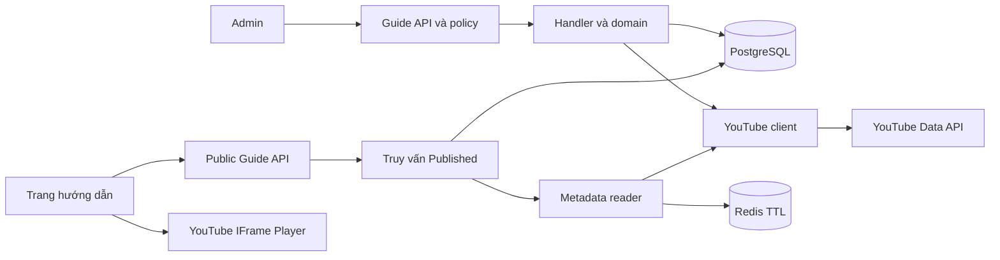
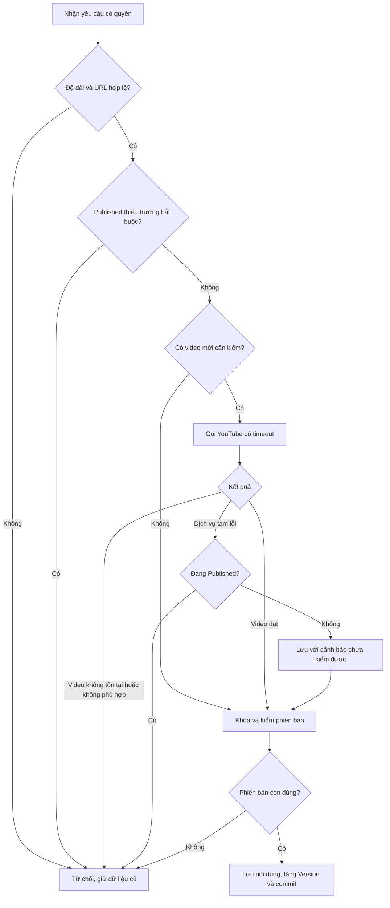
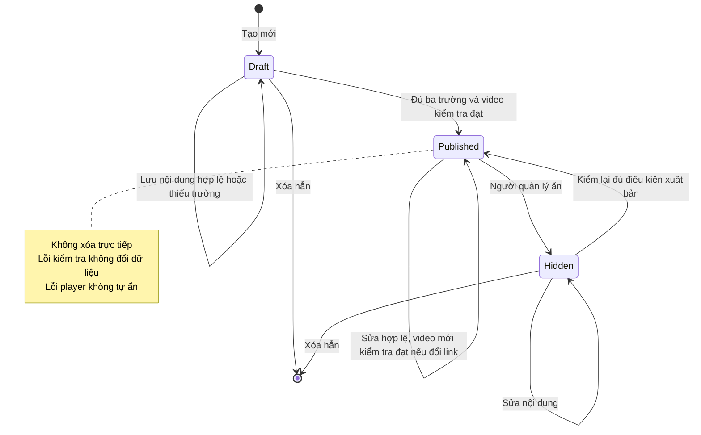
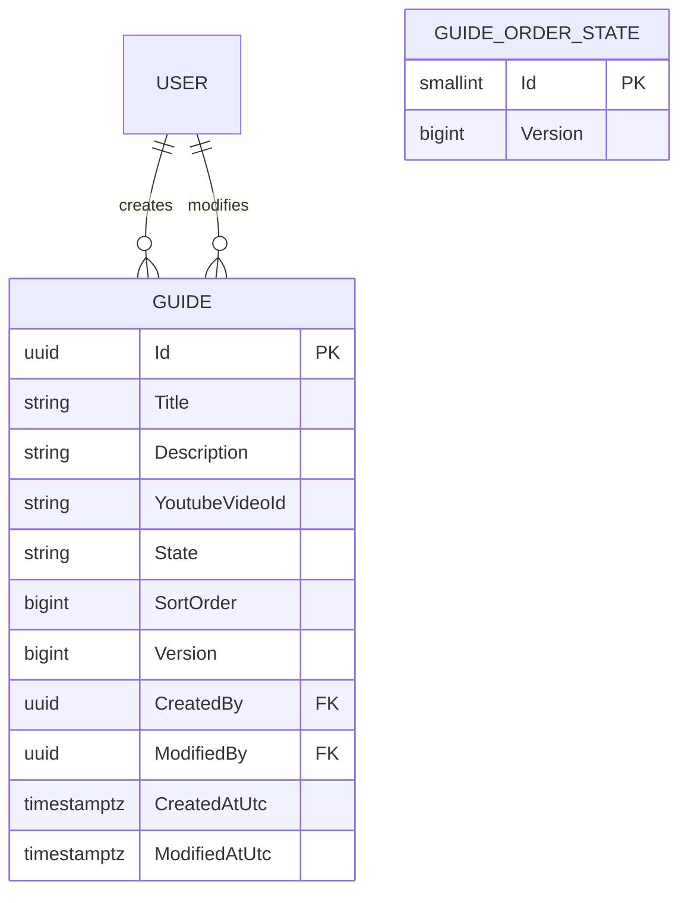

<!-- HƯỚNG DẪN CHO AI KHI ĐIỀN HOẶC CHỈNH SỬA MẪU
- Đọc toàn bộ mẫu, các comment hướng dẫn và tài liệu nguồn được cung cấp trước khi viết. Tuân thủ các quy tắc nghiệp vụ, điều kiện, ngoại lệ và giới hạn đã được xác nhận.
- Không bịa, tự chế hoặc suy đoán thành sự thật: yêu cầu, quy tắc, số liệu, API, schema, mã lỗi, nguồn tham khảo, người phụ trách và kết quả kiểm thử phải có căn cứ. Nội dung ví dụ trong mẫu không phải dữ kiện của dự án.
- Khi thiếu thông tin hoặc các nguồn mâu thuẫn, hỏi người dùng để làm rõ; giữ nguyên placeholder ở phần chưa xác định. Không tự chọn đáp án, lấp chỗ trống hay tuyên bố tài liệu đã hoàn tất.
- Chỉ thay nội dung cần điền hoặc được yêu cầu sửa. Không tự mở rộng phạm vi, sửa nghĩa quy tắc, bỏ điều kiện/ngoại lệ, xoá hay ghi đè nội dung hợp lệ đã có.
- Giữ nguyên tên, cấp và thứ tự heading, nhãn in đậm, tiền tố bullet, cấu trúc danh sách, tên/thứ tự/số cột bảng và cú pháp code fence. Không dịch, đổi tên, gộp hoặc thêm mục ngoài cấu trúc mẫu.
- Chỉ lặp khối luồng, AC hoặc API theo đúng khuôn khi có căn cứ; chỉ bỏ phần tuỳ chọn khi hướng dẫn riêng của mẫu cho phép và đã xác định không áp dụng.
- Mã tham chiếu và section phải trỏ tới tài liệu có thật đã được cung cấp hoặc kiểm chứng. Không giữ mã ví dụ như tham chiếu thật và không tự tạo tài liệu liên quan để hợp thức hoá liên kết.
- Giữ các comment hướng dẫn trong file. Xuất Markdown UTF-8, mỗi file một tài liệu; không bọc toàn bộ file trong code fence, không chèn lời dẫn hay giải thích ngoài mẫu.
- Trước khi bàn giao, đối chiếu nội dung với nguồn, kiểm tra cấu trúc, giá trị cho phép, giới hạn độ dài và tính nhất quán của mã/tham chiếu. Báo rõ phần chưa đủ thông tin; không tuyên bố đã chạy test hoặc import khi chưa thực hiện.
-->

<!-- Thay mã TDD-001 và nội dung ví dụ; giữ nguyên heading và nhãn in đậm.
Sơ đồ dùng mermaid, plantuml hoặc URL. Giữ heading Architecture, Sequence Diagram, Activity Diagram, State Diagram, Data Model.
Ví dụ API phải có heading trùng METHOD /path trong Endpoints. Xoá phần API/sơ đồ không dùng.
Version, Updated At và Change Log do lịch sử phiên bản quản lý, để trống khi nhập mới.
Author/Reviewer là tên hiển thị; gán tài khoản, phê duyệt, giả định và câu hỏi mở trên giao diện sau import.
Thiết kế phải truy vết về Story và Business Rule được cung cấp. Phân biệt thiết kế đề xuất với implementation đã kiểm chứng; không mô tả API/schema/sơ đồ ví dụ như hệ thống thật hoặc tự quyết định nghiệp vụ còn thiếu.
BẮT BUỘC KHI HOÀN THIỆN MẪU: phải có cả Reviewer và Approver, mỗi tên 1–200 ký tự sau khi bỏ khoảng trắng đầu/cuối. Không xoá hai dòng metadata, để trống, dùng tên bịa hoặc giữ placeholder rồi coi là hoàn tất.
Nếu chưa biết người review hoặc người phê duyệt, phải hỏi người dùng và báo tài liệu chưa đủ thông tin; không tự lấy Author/Owner làm người thay thế. Tên trong file không tự gán tài khoản hoặc xác nhận đã duyệt; gán thành viên trên giao diện sau import.
Đây là yêu cầu hoàn thiện mẫu; backend hiện vẫn nhận file cũ thiếu hai trường để tương thích.

VALIDATION CHO FILE NHẬP (đối chiếu ImportSnapshotValidator, MarkdownParser và ImportService):
- Mỗi file .md UTF-8 không rỗng chỉ có một heading cấp 1 chứa mã tài liệu dài 1–100 ký tự. Mã không được trùng trong cùng lần nhập hoặc thuộc loại tài liệu khác đã tồn tại.
- Không dùng tên README.md hoặc sitemap.md vì importer bỏ qua. Giao diện nhận .md/.zip, tối đa 2.000 file, tổng file tải lên 31 MiB; API giới hạn request 32 MiB và tổng nội dung đọc/giải nén 64 MiB.
- Chỉ nhập đè tài liệu cùng loại đang Draft, chưa có phiên bản và chưa lưu trữ. Import thay toàn bộ nội dung bản nháp, vì vậy phải giữ lại nội dung hợp lệ ngoài phần được yêu cầu sửa.
- Không dùng Status trong Markdown hoặc tên Approver để tự xác nhận phê duyệt; import không cấp quyền hay gán tài khoản từ tên. Chạy Kiểm tra file và xử lý lỗi/cảnh báo trước khi nhập.
- Giới hạn độ dài bên dưới tính theo string.Length của .NET (đơn vị UTF-16); không tự cắt ngắn dữ kiện quan trọng để vượt validation, hãy viết lại có căn cứ hoặc hỏi người dùng.
- Feature tối đa 300 ký tự và được dùng làm tiêu đề tài liệu. Status được parser nhận: Draft / In Review / Approved / Deprecated; tài liệu nhập mới vẫn có trạng thái phê duyệt Draft.
- Endpoint: đường dẫn tối đa 500 ký tự; tên/mô tả endpoint được lưu trong Name tối đa 300. HTTP method: GET / POST / PUT / PATCH / DELETE / HEAD / OPTIONS.
- Error Codes: mã tối đa 100 ký tự, không trùng trong tài liệu; giữ dạng - **CODE** (400): mô tả. HTTP status trong Error Codes và Response phải là số nguyên đọc được bằng Int32; không tự đặt status khác hợp đồng API.
- URL sơ đồ tối đa 1.000 ký tự. Mục sơ đồ được sử dụng phải có khối mermaid/plantuml hoặc URL theo mẫu; không để một mục sơ đồ rỗng. Nhãn mục được tách từ bullet như tên External API Fields tối đa 300 ký tự.
- Heading Examples phải khớp METHOD /path ở Endpoints. Giữ các nhãn Request:, Response 200: (thay mã theo contract) và Error Response: để parser tách đúng dữ liệu.
- Tham chiếu dạng DOC-KEY/section: ghi chú: mã đích tối đa 100 ký tự, section tối đa 100, ghi chú tối đa 1.000. Không trùng bộ mã đích + section + loại liên kết trong cùng tài liệu.
ĐỐI CHIẾU FORM TDD (src/features/tdds/validations.ts; form có thể chặt hơn import):
- Điền Feature, Author, Reviewer, Problem và ít nhất một Goal; các Goal/Non-goal/Notes đã thêm không được rỗng. API đã khai báo phải có endpoint và mô tả/mục đích; Fields phải có tên và ý nghĩa; Error Codes phải có mã, HTTP status và điều kiện.
- Form còn kiểm tra Version, Updated At và nội dung Change Log khi khai báo; với file nhập mới, giữ các trường lịch sử này trống theo hợp đồng import, không tự tạo dữ liệu lịch sử.
-->

# TDD-GUIDE-001

## Document Info

- **Feature**: Quản lý và xem video hướng dẫn YouTube
- **Author**: [Chưa xác định]
- **Reviewer**: Tân Trần
- **Approver**: Tân Trần
- **Status**: Draft
- **Version**:
- **Updated At**:

## Context & Goals

### Problem

Trang `/vi/guide` đã có danh sách và cửa sổ xem hướng dẫn, nhưng mục đã kiểm tra còn báo video đang biên tập. Ở thời điểm khảo sát ban đầu, backend chưa có module hướng dẫn. Cần cho người có quyền Quản lý hướng dẫn nhập nội dung, gán video YouTube, xuất bản và chủ động sắp xếp; khách chưa đăng nhập cũng xem được nội dung đã xuất bản.

Nghiệp vụ căn cứ hai Story và ba BR của GUIDE đã được chốt trong hội thoại. Hai xác nhận bổ sung là giới hạn tiêu đề 200/mô tả 2.000 ký tự và chỉ nhận video đã đăng, gồm Shorts. Người dùng đã chốt toàn bộ TDD được bàn giao tại commit f9d659d bằng câu “ok chốt” trong hội thoại. Sau đó người dùng yêu cầu “Ok triển khai theo TDD” và xác nhận “chỉ backend”. Backend đã được triển khai trên nhánh `feature/video-guides`; giao diện vẫn ngoài phạm vi đợt này. Kết quả và giới hạn kiểm chứng ghi tại [bàn giao backend](../discovery/guide-backend-implementation.md). Status vẫn Draft theo mẫu nhập tài liệu, không đại diện cho thao tác phê duyệt trong Document First. Chuỗi tài liệu phụ thuộc liên module chưa được đọc hết; giới hạn khảo sát ghi trong `discovery/guide-system-test-coverage.md`. Không dùng bản nháp này để tuyên bố đã hoàn tất rà soát toàn bộ RBAC.

### Goals

- Thực hiện đầy đủ ba trạng thái Nháp, Xuất bản, Ẩn và điều kiện xóa theo BR-GUIDE-001.
- Lấy ảnh, thời lượng và kiểm tra video ở backend; không tin kết quả kiểm tra do trình duyệt gửi lên.
- Giữ nguyên bản đang hiển thị khi một lần sửa không hợp lệ; tránh ghi đè khi nhiều người cùng sửa hoặc sắp xếp.
- API công khai chỉ trả bản Xuất bản, hỗ trợ tìm trong tiêu đề hoặc mô tả và giữ thứ tự admin đã lưu.

### Non-goals

- Danh mục, bài viết, nhiều ngôn ngữ, lưu tệp video, sửa/xóa video trên YouTube.
- Bản sửa chờ xuất bản, thùng rác, tự ẩn khi trình phát lỗi hoặc thống kê lượt xem.
- Livestream đang diễn ra hoặc sắp phát. Không tự đặt giới hạn thời lượng tối đa.

## Architecture

Dùng cấu trúc hiện có của backend .NET 8: Carter nhận request; contract và FluentValidation kiểm đầu vào; MediatR xử lý query/command; handler kiểm điều kiện trạng thái, domain giữ thực thể và cổng dữ liệu; EF Core 8/Npgsql lưu PostgreSQL. Các endpoint backend dưới đây đã được triển khai; màn hình và player vẫn là thiết kế cho đợt frontend.

| Thành phần | Trách nhiệm và phần thay đổi |
|---|---|
| Admin `/admin/guides` dự kiến | Danh sách mọi trạng thái, form ba trường, xem trước video, xuất bản/ẩn/xóa, di chuyển vị trí. Nút xóa chỉ có ở Nháp/Ẩn và cần xác nhận trên giao diện. |
| Trang `/vi/guide` | Đọc API công khai; tìm kiếm; thẻ có ảnh, tiêu đề, mô tả, thời lượng; phát YouTube trong cửa sổ. Đóng cửa sổ phải dừng/hủy player, trả focus về nút mở; có đóng bằng bàn phím và tên truy cập được. |
| `GuideApi`, contract GUIDE | Tách endpoint công khai và quản trị. API quản trị kiểm policy `guide.manage`; không kiểm tên vai trò và không yêu cầu Assignment. |
| Handler GUIDE, `Guide` | Đọc dữ liệu, kiểm phiên bản, kiểm quy tắc, thay đổi trạng thái trong transaction; mọi lỗi sau khi bắt đầu ghi phải ném ngoại lệ để rollback. |
| `YoutubeVideoClient` | Dùng HttpClient có cấu hình, gọi cố định Google API bằng video ID; lấy metadata và kiểm khả năng nhúng/loại video. |
| `GuideVideoService` | Dùng `ICacheService<ICacheInstance>` cho dữ liệu YouTube có hạn dùng; không dùng Redis lưu trạng thái đăng nhập. |
| PostgreSQL | Nguồn chính thức cho nội dung, trạng thái, vị trí và phiên bản của hướng dẫn. |



**Notes**:
- BR-GUIDE-001 được kiểm bằng policy, kiểm trạng thái trong handler và transaction; BR-GUIDE-002 bằng validator, YouTube client và xử lý lỗi player; BR-GUIDE-003 bằng truy vấn Published, bộ lọc tìm kiếm và lưu thứ tự.
- `Version` là số tăng mỗi lần thay đổi hướng dẫn. Form gửi phiên bản đã đọc; nếu admin khác đã sửa thì trả 409 và yêu cầu tải lại. Ví dụ hai người cùng mở bản 4: người thứ nhất lưu thành bản 5, người thứ hai không được ghi đè bản 5 bằng dữ liệu dựa trên bản 4.
- `OrderVersion` bảo vệ toàn bộ thứ tự. Tạo, xóa hoặc di chuyển đều khóa dòng `GuideOrderState` trước rồi mới khóa các Guide theo Id tăng dần. Sửa nội dung chỉ khóa Guide, không xin khóa thứ tự sau đó. Cách này tuần tự hóa thao tác sắp xếp và tránh vòng chờ khóa.
- Dùng `TransactionPipelineBehavior` hiện có. Nó mở transaction trước handler, nên lời gọi YouTube trong command vẫn nằm trong thời gian transaction đang mở. Gọi YouTube trước khi khóa dòng hoặc sửa entity và giới hạn tổng thời gian 5 giây cho mỗi yêu cầu; không mô tả đây là HTTP ngoài transaction. Khi giữ nhiều kết nối trở thành vấn đề thực tế mới tách bước điều phối; đợt này không đổi pipeline chung.
- Sau khi đọc snapshot và kiểm video, handler khóa và đọc lại bản mới nhất, so `expectedVersion`, trạng thái và video ID trước khi ghi. Thay đổi đồng thời làm yêu cầu thất bại toàn bộ. Không tự thử lại lệnh ghi.
- Không dùng `Result.Failure` để thoát sau khi đã sửa entity: pipeline hiện commit khi handler trả về bình thường. Dùng `ValidationException`, `ConflictException`, `NotFoundException`, `DependencyUnavailableException` theo loại lỗi; cache YouTube là dữ liệu ngoài SQL nên không được xem là đã rollback cùng SQL.
- Admin dùng quyền mới trong `PermissionNames` và policy hiện có ở `JwtExtensions.cs`. Giữ xác thực, dấu phiên và kiểm Origin theo TDD-AUTH-001; không thêm miễn CSRF. Frontend khác origin gửi cookie theo cơ chế hiện có và origin phải nằm trong cấu hình cho phép.
- Public API đọc trực tiếp SQL, gắn chính sách không lưu cache HTTP cho nội dung và trạng thái. Sau khi ẩn thành công, yêu cầu mới không trả hướng dẫn đó. Không thể thu hồi video đã tải trong tab đang mở hoặc một request đã đọc trước lúc ẩn.
- Chưa có repository frontend trong workspace; các màn hình nêu trên là thiết kế chức năng, chưa phải danh sách file đã xác minh. Form hiển thị bộ đếm ký tự, giữ nội dung khi lưu lỗi và báo lỗi cạnh trường tương ứng. Dán link chỉ cập nhật kết quả xem trước của đúng link hiện tại; hủy/bỏ qua phản hồi cũ khi người dùng thay link.

## Sequence Diagram

Xuất bản phải kiểm lại video, dù bước xem trước từng thành công. Trình tự kiểm phiên bản sau lời gọi YouTube ngăn việc dùng kết quả cũ để xuất bản nội dung vừa bị người khác sửa.

```mermaid
sequenceDiagram
    actor A as Người quản lý
    participant API as API và policy
    participant H as Handler
    participant Y as YouTube
    participant DB as PostgreSQL
    A->>API: Publish(id, expectedVersion)
    API->>API: Xác thực, kiểm guide.manage
    API->>H: Command trong transaction
    H->>DB: Đọc snapshot, kiểm nội dung và phiên bản
    H->>Y: videos.list, bỏ qua cache
    alt Không kiểm tra được hoặc video không phù hợp
        Y-->>H: Lỗi hoặc video không đạt
        H-->>API: Ngoại lệ, rollback
        API-->>A: 422 hoặc 503, giữ trạng thái
    else Video đạt
        Y-->>H: Metadata đã kiểm
        H->>DB: Khóa Guide, đọc lại và so phiên bản
        alt Đã thay đổi
            H-->>API: Conflict, rollback
            API-->>A: 409, yêu cầu tải lại
        else Vẫn đúng phiên bản
            H->>DB: Published, Version tăng; commit
            API-->>A: 200, bản mới
        end
    end
```

## Activity Diagram

Luồng lưu nội dung áp dụng cho tạo Nháp và sửa ở mọi trạng thái. Kiểm định dạng link trước khi gọi YouTube; kết quả xem trước từ client không thay thế bước kiểm tại server.



## State Diagram

Chỉ lệnh Xuất bản chuyển Nháp/Ẩn thành Xuất bản; thao tác lưu không tự xuất bản. Việc sửa bản đang Xuất bản có hiệu lực ngay khi commit thành công.



## Data Model

`Guide` lưu một hướng dẫn hiện tại, tạo khi lưu Nháp lần đầu, cập nhật khi sửa/đổi trạng thái/sắp xếp và xóa thật theo BR-GUIDE-001. Nội dung tiếng Việt là dữ liệu admin nhập; không sao chép tiêu đề/mô tả từ YouTube. Trường NULL nghĩa là chưa nhập, chỉ hợp lệ ở Nháp/Ẩn.

| Cột | PostgreSQL | Ràng buộc và ý nghĩa |
|---|---|---|
| Id | uuid | PK, server sinh |
| Title | varchar(200), NULL | Tiêu đề, bắt buộc khi Published |
| Description | varchar(2000), NULL | Mô tả, bắt buộc khi Published |
| YoutubeVideoId | varchar(11), NULL | ID video; CHECK nếu có phải khớp `[A-Za-z0-9_-]{11}` toàn chuỗi |
| State | varchar(16), NOT NULL | CHECK một trong Draft, Published, Hidden |
| SortOrder | bigint, NOT NULL | CHECK > 0; vị trí chung cho mọi trạng thái |
| Version | bigint, NOT NULL | CHECK > 0; bắt đầu 1, EF concurrency token |
| CreatedBy / ModifiedBy | uuid, NOT NULL | Hai FK tới User.Id, ON DELETE RESTRICT; lấy từ phiên đăng nhập |
| CreatedAtUtc / ModifiedAtUtc | timestamptz, NOT NULL | Thời điểm server; tạo mới hai giá trị bằng nhau |

CHECK Published yêu cầu Title, Description sau trim không rỗng và YoutubeVideoId không NULL. Database bảo vệ độ dài và điều kiện tối thiểu; khả năng phát phải kiểm với YouTube, không thể biểu diễn bằng CHECK. Không đặt unique trên tiêu đề hoặc video vì nghiệp vụ chưa cấm dùng lại.

`GuideOrderState` có đúng một dòng do migration tạo, không có API thêm/xóa. Dòng này biểu diễn phiên bản của thứ tự chung; vừa cung cấp `orderVersion` cho admin vừa làm điểm khóa cho tạo/xóa/di chuyển. Không đặt FK giả tới một Guide bất kỳ.

| Cột | PostgreSQL | Ràng buộc và ý nghĩa |
|---|---|---|
| Id | smallint, NOT NULL | PK, CHECK Id=1 |
| Version | bigint, NOT NULL | CHECK > 0, bắt đầu 1; tăng mỗi lần thứ tự/thành viên danh sách thay đổi |



Dữ liệu giả định dưới đây minh họa hai bản ghi, không phải dữ liệu seed hay video đã kiểm thực tế. User `00000000-0000-0000-0000-000000000101` phải tồn tại; ký hiệu U trong bảng nghĩa là UUID này. Thời điểm dùng UTC. A/B lần lượt là UUID `10000000-0000-0000-0000-000000000001`/`10000000-0000-0000-0000-000000000002`.

| Guide.Id | Title | Description | YoutubeVideoId | State | SortOrder | Version | CreatedBy | ModifiedBy | CreatedAtUtc | ModifiedAtUtc |
|---|---|---|---|---|---|---|---|---|---|---|
| A | Chụp ảnh lô đất | Các bước chụp ảnh trước khi gửi. | abcDEF123_- | Published | 1 | 2 | U | U | 2026-09-30T02:00:00Z | 2026-09-30T02:05:00Z |
| B | Xem kết quả | NULL | NULL | Draft | 2 | 1 | U | U | 2026-09-30T02:10:00Z | 2026-09-30T02:10:00Z |

| GuideOrderState.Id | Version |
|---|---|
| 1 | 3 |

OrderVersion=3 vì khởi tạo là 1 rồi tạo A và B. Xuất bản A tăng Guide.Version lên 2, không đổi thứ tự. Nếu sửa A sang video không cho nhúng, toàn bộ dòng A giữ nguyên. Di chuyển B trước A với expectedOrderVersion=3 làm B.SortOrder=1, B.Version=2; A.SortOrder=2, A.Version=3; OrderVersion=4. Hai dòng được đổi ModifiedBy=U và ModifiedAtUtc theo lúc di chuyển. B vẫn là Draft; công khai vẫn chỉ thấy A. Ẩn A tiếp theo làm A.State=Hidden, A.Version=4, không đổi OrderVersion. Xóa A sau đó xóa dòng A, giữ B và tăng OrderVersion=5; không gửi lệnh xóa video tới YouTube.

Dùng lại User, Permission, Role và RolePermission theo TDD-RBAC-001/Data Model. Dòng danh mục mới dự kiến là `(Code='guide.manage', Label='Quản lý hướng dẫn', RequiresAssignment=false)`; bản ghi cấp quyền hệ thống có `(RoleId='00000000-0000-0000-0000-0000000000a1', PermissionCode='guide.manage')`. Không tự cấp cho vai trò tùy chỉnh. `Label` đã có trên entity Permission; phải giữ các ràng buộc EF hiện có khi tạo migration.

Ảnh và thời lượng chỉ lưu tạm trong Redis theo key `guide:youtube:v1:{videoId}` với thời hạn tuyệt đối 24 giờ kể từ lúc lấy từ YouTube; đọc cache không kéo dài thời hạn. Một mục gồm videoId, thumbnailUrl, durationSeconds, embeddable, liveBroadcastContent và fetchedAtUtc. Ví dụ ID `abcDEF123_-` trả thời lượng `PT3M20S` thì lưu durationSeconds=200. URL ảnh phải lấy từ phản hồi, không chế đường dẫn như dữ liệu đã được xác minh. Không lưu payload YouTube vào log hoặc bản sao lâu dài trong SQL.

**Notes**:
- Chuẩn hóa nội dung về Unicode NFC và trim trước khi đếm; đếm Unicode scalar ở cả frontend và backend để khớp `char_length` PostgreSQL. Chuỗi rỗng thành NULL; không cắt chuỗi quá dài. Giới hạn 200/2.000 là nghiệp vụ đã chốt; cách đếm thuộc TDD đã chốt, cần ghi rõ trên contract cho frontend.
- Chuẩn hóa dữ liệu: Guide.Id xác định nội dung, trạng thái và vị trí; YoutubeVideoId xác định metadata trong cache riêng. Không lưu thêm canonical URL, embed URL, tên người sửa hoặc nhãn trạng thái vào Guide; tính từ ID/quan hệ khi đọc. OrderState lưu một sự kiện độc lập là phiên bản thứ tự, không lặp dữ liệu Guide.
- Index `(SortOrder, Id)` phục vụ danh sách; thêm index từng FK audit theo quy ước EF. Truy vấn luôn sắp SortOrder rồi Id để ổn định. Chưa thêm trigram/index tìm kiếm: chưa có số liệu về lượng hướng dẫn hoặc tải để biện minh.
- Tạo mới lấy max(SortOrder)+1 khi đã giữ khóa OrderState. Di chuyển đọc toàn bộ thứ tự dưới khóa rồi đánh số lại 1..N, chỉ tăng Version/ModifiedAt của Guide có vị trí đổi. Không đặt UNIQUE SortOrder vì việc cập nhật nhiều dòng trong một transaction có thể tạm trùng; invariant được bảo vệ bằng khóa chung và kiểm thử PostgreSQL thật. Cách này phù hợp danh sách hướng dẫn nhỏ, chi phí O(N); cần đánh giá lại khi số lượng thực tế lớn.
- Xóa giữ khóa OrderState trước Guide; không cần đánh lại số các dòng còn lại. Publish/Hide giữ vị trí cũ. `beforeId=null` nghĩa là đưa xuống cuối, kể cả sau Nháp/Ẩn; public chỉ lọc Published trên thứ tự chung.
- Migration `20260930004917_AddVideoGuides` tạo hai bảng rỗng, seed OrderState và thêm quyền cùng grant của admin. Chưa xác minh cơ sở dữ liệu đang triển khai, kích thước hay cửa sổ bảo trì; không lấy xác nhận dev/test của module cũ làm hiện trạng GUIDE. Không chuyển sáu thẻ giao diện thành dữ liệu thật khi chưa biết nguồn/link.
- Trước triển khai: sao lưu và kiểm khả năng phục hồi trên môi trường riêng; xác minh quyền/role seed, catalog và schema hiện tại. Thử migration trên PostgreSQL 15 với bản schema trước thay đổi, kiểm FK/CHECK và cấp quyền thực tế. `PermissionCatalogGuard` kiểm code và DB khớp nên cần phối hợp migration và bản code mới, tránh khởi động code cũ sau khi seed quyền mới. Chưa thể hứa triển khai không gián đoạn khi chưa kiểm topology.
- Sau migration: kiểm hai bảng, singleton, danh mục quyền, token mới, admin có quyền và public không lộ Nháp/Ẩn. Nếu phải quay code cũ, phối hợp gỡ RolePermission rồi Permission mới sau khi sao lưu grants; giữ hai bảng GUIDE để bảo toàn nội dung. Không dùng Down xóa bảng để giả định phục hồi dữ liệu. Đã tạo migration và chạy trên PostgreSQL 15 tạm cho test; chưa áp dụng vào môi trường phát triển dùng chung hoặc production.

## Internal API

Tất cả endpoint dưới đây là contract phiên bản 1 đã triển khai trong backend GUIDE. Admin cần `guide.manage`; public AllowAnonymous. Body JSON; GUID sai định dạng trả 400 theo binding. Giữ envelope `Result<T>` hiện có cho thành công; lỗi dùng middleware hiện có. Các mã cụ thể của module đặt trong `messageCode`, không thay `code` chung của exception.

DTO đọc admin gồm id, title, description, youtubeUrl, youtubeVideoId, state, sortOrder, version, createdAtUtc, modifiedAtUtc, metadata và videoWarning. DTO public chỉ gồm id, title, description, youtubeVideoId, youtubeUrl và metadata; không trả tác giả, trạng thái nháp hay phiên bản sửa. `metadata` gồm thumbnailUrl, durationSeconds, fetchedAtUtc; null khi chưa lấy được. `videoWarning` là mã hoặc null, không coi đây là kết quả xuất bản đã xác thực.

### Endpoints

- **GET** `/api/v1/guides` — Danh sách Published; query keyword, pageIndex, pageSize; trả Result<PagedResult<GuidePublicDto>>.
- **GET** `/api/v1/guides/{guideId}` — Một hướng dẫn Published; Nháp/Ẩn/đã xóa đều trả 404.
- **GET** `/api/v1/admin/guides` — Query state tùy chọn, keyword, pageIndex, pageSize; trả Result<{page, orderVersion}>; page dùng PagedResult<GuideAdminDto>.
- **GET** `/api/v1/admin/guides/{guideId}` — Chi tiết mọi trạng thái; không tồn tại trả 404.
- **POST** `/api/v1/admin/guides` — Body {title?, description?, youtubeUrl?}; tạo Draft cuối danh sách; trả 201 Result<GuideAdminDto>.
- **PUT** `/api/v1/admin/guides/{guideId}` — Body {title?, description?, youtubeUrl?, expectedVersion}; thay toàn bộ ba trường; trường bỏ qua là NULL. Trả 200 Result<GuideAdminDto>.
- **POST** `/api/v1/admin/guides/{guideId}/publish` — Body {expectedVersion}; kiểm đủ ba trường, kiểm video mới trực tiếp với YouTube; trả 200 Result<GuideAdminDto>.
- **POST** `/api/v1/admin/guides/{guideId}/hide` — Body {expectedVersion}; Published thành Hidden; trả 200 Result<GuideAdminDto>.
- **DELETE** `/api/v1/admin/guides/{guideId}` — Query expectedVersion; chỉ Draft/Hidden; trả 204, không có body.
- **POST** `/api/v1/admin/guides/{guideId}/move` — Body {beforeId?, expectedVersion, expectedOrderVersion}; trả 200 Result<{orderVersion}>; frontend tải lại danh sách sau thành công.
- **POST** `/api/v1/admin/guides/video-preview` — Body {youtubeUrl}; kiểm trực tiếp YouTube, trả 200 Result<{youtubeVideoId, metadata}>; không tạo/sửa Guide, xử lý bằng query không transaction.

Các phiên bản phải là số nguyên dương. Move từ chối beforeId bằng chính guideId hoặc không tồn tại. Move không đổi vị trí trả cùng orderVersion; Hide khi đã Hidden và Publish khi đã Published có thể trả bản hiện tại nếu expectedVersion khớp, không ghi lại. Draft không được Hide. Mọi stale version trả 409, kể cả yêu cầu lặp; Create không tự thử lại khi client không biết kết quả.

Keyword trim, tìm literal không phân biệt hoa/thường nhưng có phân biệt dấu, trong Title OR Description. Escape `%`, `_`, `\` trước ILike có tham số, không ghép SQL từ chuỗi nhập. Một Guide chỉ xuất hiện một lần. Keyword rỗng nghĩa là không lọc. Phân trang theo PagedResult hiện có: mặc định 1/10, giá trị không dương về mặc định, pageSize tối đa 100; từ chối offset tràn số. Admin trả page và orderVersion từ cùng snapshot SQL để không ghép hai thời điểm khác nhau.

Cả GET danh sách lẫn chi tiết đều truy vấn điều kiện Published ở SQL. Đọc metadata sau khi đọc page, batch các ID khác nhau; tối đa 50 ID/lần YouTube. Nếu cache hết hạn và YouTube lỗi, vẫn trả nội dung SQL, metadata=null; giao diện hiện ảnh thay thế, không hiển thị thời lượng giả và vẫn cho thử phát. Không tự ẩn. Đây là xử lý dự phòng kỹ thuật trong TDD đã chốt; không bảo đảm giữ nguyên bản sao metadata đã hết hạn khi YouTube thay đổi video.

### Examples

#### POST /api/v1/admin/guides/{guideId}/move

```
Request:
{"beforeId":"10000000-0000-0000-0000-000000000001","expectedVersion":1,"expectedOrderVersion":3}

Response 200:
{"value":{"orderVersion":4},"isSuccess":true,"isFailure":false,"error":{"code":"","message":"","messageCode":""}}

Error Response:
{"title":"Conflict","code":"Conflict","status":409,"detail":"Thứ tự đã được thay đổi. Hãy tải lại danh sách.","messageCode":"GuideOrderConflict","errors":null}
```

Ví dụ gọi với guideId=B trong Data Model. Nếu orderVersion đã khác 3, không thay đổi thứ tự dù expectedVersion của B còn đúng.

#### POST /api/v1/admin/guides/video-preview

```
Request:
{"youtubeUrl":"https://www.youtube.com/shorts/abcDEF123_-"}

Response 200:
{"value":{"youtubeVideoId":"abcDEF123_-","metadata":{"thumbnailUrl":"https://i.ytimg.com/vi/abcDEF123_-/hqdefault.jpg","durationSeconds":200,"fetchedAtUtc":"2026-09-30T02:00:00Z"}},"isSuccess":true,"isFailure":false,"error":{"code":"","message":"","messageCode":""}}

Error Response:
{"title":"Dependency Unavailable","code":"DependencyUnavailable","status":503,"detail":"Chưa kiểm tra được video. Hãy thử lại sau.","messageCode":"YoutubeUnavailable","errors":null}
```

ID và URL ảnh trong ví dụ là dữ liệu giả lập; chỉ trả thành công khi Google thực sự trả metadata tương ứng. Kết quả preview không phải token cho phép xuất bản.

### Error Codes

- **GuideContentInvalid** (422): Nội dung vượt giới hạn hoặc bản Published/publish thiếu trường bắt buộc; errors chỉ ra trường.
- **GuideYoutubeUrlInvalid** (422): Không phân tích được URL được hỗ trợ hoặc ID video không đúng định dạng.
- **GuideVideoUnavailable** (422): YouTube trả thành công nhưng không tìm thấy video, không cho nhúng hoặc không có thời lượng hợp lệ.
- **GuideVideoTypeUnsupported** (422): YouTube báo live hoặc upcoming; từ chối gán hoặc xuất bản.
- **YoutubeUnavailable** (503): Timeout, lỗi mạng, quota, lỗi cấu hình credentials hoặc lỗi dịch vụ khiến không thể kiểm tra; không báo video đã bị xóa khi chưa biết.
- **GuideNotFound** (404): Không có Guide ở phạm vi endpoint; public trả cùng lỗi cho Hidden/Draft/đã xóa.
- **GuideVersionConflict** (409): expectedVersion không khớp sau khi khóa và đọc lại.
- **GuideOrderConflict** (409): expectedOrderVersion không khớp sau khi khóa thứ tự.
- **GuideStateConflict** (409): Xóa Published hoặc Hide Draft.
- **GuideMoveInvalid** (422): beforeId không tồn tại hoặc bằng chính guideId.
- **CsrfInvalid** (403): Theo TDD-AUTH-001; không thêm mã khác cho GUIDE.

401/403 do xác thực và policy hiện có trả; không định nghĩa mã thay thế. 422 dùng ValidationException, 409 dùng ConflictException, 503 dùng DependencyUnavailableException. Khi lưu Draft/Hidden gặp lỗi dịch vụ tạm thời, cho lưu URL đúng định dạng và trả `videoWarning=YoutubeUnavailable`; đây là ngoại lệ có chủ đích của lệnh lưu, không áp dụng publish. Video chắc chắn không phù hợp bị từ chối. Khi không thay video của Published, không bắt kiểm lại YouTube cho một sửa đổi chỉ có tiêu đề/mô tả; lỗi player được xử lý riêng theo BR-GUIDE-002.

## External API

### Endpoints

- **YouTube Data API** — GET `https://www.googleapis.com/youtube/v3/videos`, part=snippet,contentDetails,status, id lấy từ URL đã phân tích; chọn fields cần dùng để giảm payload. API key chỉ ở backend qua header X-Goog-Api-Key và cấu hình secret.
- **YouTube IFrame Player API** — Nhúng bằng videoId, nhận sự kiện lỗi để hiển thị thông báo. Không yêu cầu người xem đăng nhập BMT.

### Fields

- **id** — Video ID 11 ký tự, giữ nguyên hoa/thường. Nhận HTTPS trên youtube.com/www.youtube.com/m.youtube.com với watch?v=, shorts/ hoặc embed/; và youtu.be/{id}. Không nhận playlist thuần, URL có userinfo hoặc port ngoài mặc định; không gọi HTTP tới URL admin nhập.
- **snippet.thumbnails** — Chọn ảnh có sẵn theo thứ tự high, medium, default; lấy URL trực tiếp từ response.
- **contentDetails.duration** — Parse ISO 8601 sang giây dương; thiếu/không parse được thì chưa đủ điều kiện xuất bản.
- **snippet.liveBroadcastContent** — Chỉ nhận none; live/upcoming bị từ chối, kể cả embeddable=true. Shorts đã đăng dùng cùng contract video; không cần endpoint Shorts riêng.
- **status.embeddable** — Phải true khi xuất bản/thay video Published. Đây không phải bảo đảm phát được ở mọi vùng/thiết bị.

### Error Handling

Timeout tổng 5 giây và truyền CancellationToken; không tự retry trong cùng request để tránh giữ transaction lâu và tiêu quota nhiều lần. Admin được bấm thử lại. Không tự theo redirect ra host tùy ý. Với thành công nhưng items rỗng, trả GuideVideoUnavailable; 403 quota/credentials, 429, 5xx hoặc lỗi mạng trả YoutubeUnavailable. Không log API key hoặc headers chứa credentials; log video ID, loại lỗi, thời gian và correlation ID đủ cho chẩn đoán.

Cache miss khi đọc được gom theo batch, request đồng thời cùng ID có thể gộp trong một process; không tuyên bố chống gọi trùng trên nhiều instance. Redis lỗi thì thử provider trong cùng ngân sách timeout và cho public phản hồi thiếu metadata khi thất bại. Mỗi lần chờ cache bị giới hạn 250 ms vì bộ Redis dùng chung chưa tự ngắt theo CancellationToken; ghi cache thất bại không hủy metadata vừa lấy thành công. Publish và preview luôn bỏ qua cache để kiểm mới; chỉ cache metadata hợp lệ, với TTL tuyệt đối. Metadata của video cũ không được dùng cho ID mới.

Player báo video không phát được thì hiện thông báo và nút đóng/thử lại; không thay trạng thái Guide. Kiểm các lỗi 100, 101/150 và 153; lỗi 153 có thể do thiếu thông tin nhận diện nguồn nhúng. Khi dùng enablejsapi phải đặt origin đúng; cấu hình referrer policy phù hợp, không dùng no-referrer cho iframe. Không cưỡng ép autoplay; người xem chủ động bấm phát.

### Quirks

- [videos.list](https://developers.google.com/youtube/v3/docs/videos/list) hỗ trợ truy vấn theo ID; không dùng tìm kiếm YouTube để suy ra video từ tiêu đề. [Video resource](https://developers.google.com/youtube/v3/docs/videos) mô tả ảnh, duration, liveBroadcastContent và embeddable.
- Theo [YouTube Developer Policies](https://developers.google.com/youtube/terms/developer-policies), dữ liệu API lưu tạm cần được làm mới hoặc xóa trong thời hạn áp dụng. TTL tuyệt đối 24 giờ là lựa chọn kỹ thuật nằm trong giới hạn 30 ngày của dữ liệu không được người dùng YouTube cấp quyền; không lưu thêm bản sao metadata lâu dài trong SQL hay log. Video ID do admin cung cấp và nội dung BMT nhập được lưu riêng.
- API key theo [Google API system parameters](https://docs.cloud.google.com/apis/docs/system-parameters); phải bật YouTube Data API cho project và giới hạn key phù hợp. Chưa có kiểm chứng credentials/quota của môi trường BMT trong tác vụ này.
- Chính sách phát trên website và lỗi thực tế theo [IFrame API](https://developers.google.com/youtube/iframe_api_reference). Video vẫn có thể bị xóa, đổi riêng tư hoặc chặn nhúng sau khi xuất bản; BMT không tự thay quyền trên YouTube.

## References

### User Stories

- STORY-GUIDE-001
- STORY-GUIDE-002

### Business Rules

- BR-GUIDE-001
- BR-GUIDE-002
- BR-GUIDE-003

### Use Cases

### Others

- [Bảng phủ System Test](../discovery/guide-system-test-coverage.md): ST-GUIDE-001 đến ST-GUIDE-043; đây là đặc tả; bằng chứng kiểm thử backend và phần trình duyệt chưa chạy được tách trong báo cáo bàn giao.
- [Bảng phủ Unit Test](../discovery/guide-unit-test-coverage.md): 44 đặc tả unit dự kiến, cùng ranh giới với integration/system test.
- [Kế hoạch và xác nhận nghiệp vụ](../discovery/guide-planning.md).
- [TDD-RBAC-001](TDD-RBAC-001.md): danh mục quyền, policy và dữ liệu phân quyền dùng lại.
- [TDD-AUTH-001](TDD-AUTH-001.md): kiểm Origin cho request ghi dùng cookie.
- Mã hiện có làm căn cứ: `src/bmt-be.presentation/apis/news/NewsArticleApi.cs`, `src/bmt-be.contract/constants/PermissionNames.cs`, `src/bmt-be.api/dependencyInjection/extensions/JwtExtensions.cs`, `src/bmt-be.api/startup/PermissionCatalogGuard.cs`, `src/bmt-be.persistence/ApplicationDbContext.cs`, `src/bmt-be.application/behaviors/TransactionPipelineBehavior.cs`, `src/bmt-be.application/abstractions/ICacheService.cs`, `src/bmt-be.contract/abstractions/shared/PagedResult.cs` trong repository bmt-be.
- Kiểm chứng dự kiến: validator/domain bằng unit test theo TDD đã chốt; policy/HTTP bằng API integration; CHECK/FK/rollback và cập nhật đồng thời bằng PostgreSQL thật; player/Shorts bằng trình duyệt với video thật. Mock YouTube chỉ chứng minh nhánh xử lý API, không chứng minh video phát được. Đã soạn UT-GUIDE-001 đến UT-GUIDE-044 theo TDD đã chốt. Mã kiểm thử backend, kết quả và giới hạn nằm trong [báo cáo bàn giao](../discovery/guide-backend-implementation.md); UT-GUIDE-043/044 thuộc frontend, chưa triển khai hoặc chạy.

## Change Log
