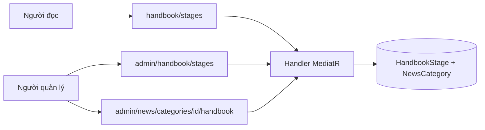
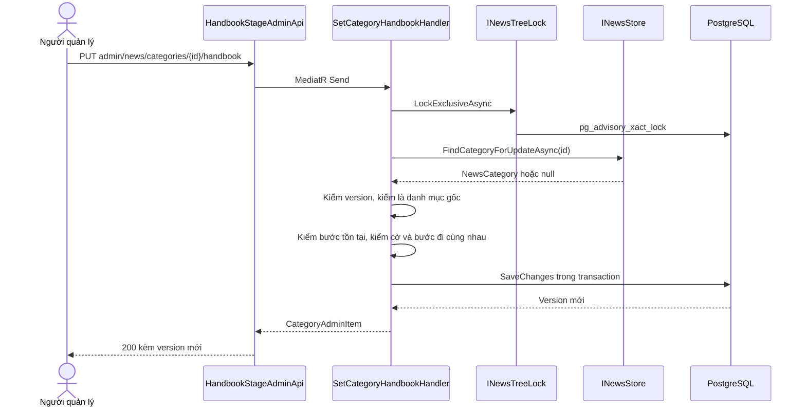
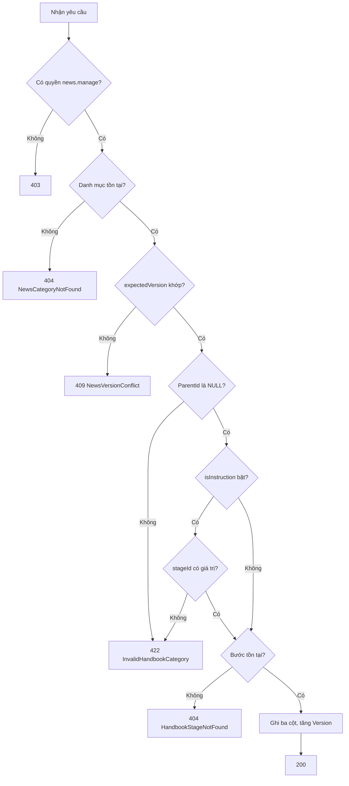
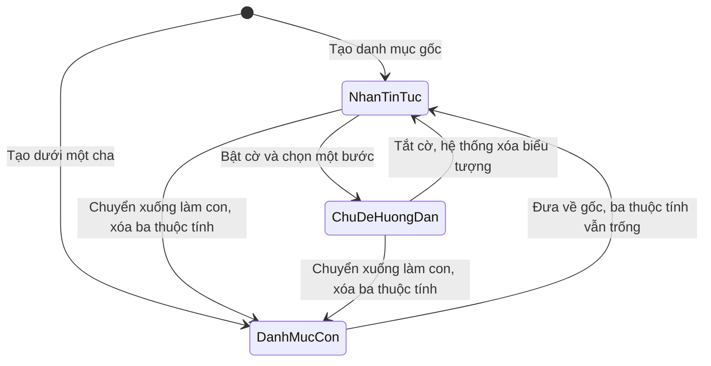
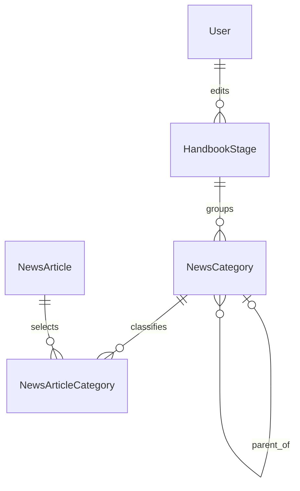

<!-- HƯỚNG DẪN CHO AI KHI ĐIỀN HOẶC CHỈNH SỬA MẪU
- Đọc toàn bộ mẫu, các comment hướng dẫn và tài liệu nguồn được cung cấp trước khi viết. Tuân thủ các quy tắc nghiệp vụ, điều kiện, ngoại lệ và giới hạn đã được xác nhận.
- Không bịa, tự chế hoặc suy đoán thành sự thật: yêu cầu, quy tắc, số liệu, API, schema, mã lỗi, nguồn tham khảo, người phụ trách và kết quả kiểm thử phải có căn cứ. Nội dung ví dụ trong mẫu không phải dữ kiện của dự án.
- Khi thiếu thông tin hoặc các nguồn mâu thuẫn, hỏi người dùng để làm rõ; giữ nguyên placeholder ở phần chưa xác định. Không tự chọn đáp án, lấp chỗ trống hay tuyên bố tài liệu đã hoàn tất.
- Chỉ thay nội dung cần điền hoặc được yêu cầu sửa. Không tự mở rộng phạm vi, sửa nghĩa quy tắc, bỏ điều kiện/ngoại lệ, xoá hay ghi đè nội dung hợp lệ đã có.
- Giữ nguyên tên, cấp và thứ tự heading, nhãn in đậm, tiền tố bullet, cấu trúc danh sách, tên/thứ tự/số cột bảng và cú pháp code fence. Không dịch, đổi tên, gộp hoặc thêm mục ngoài cấu trúc mẫu.
- Chỉ lặp khối luồng, AC hoặc API theo đúng khuôn khi có căn cứ; chỉ bỏ phần tuỳ chọn khi hướng dẫn riêng của mẫu cho phép và đã xác định không áp dụng.
- Mã tham chiếu và section phải trỏ tới tài liệu có thật đã được cung cấp hoặc kiểm chứng. Không giữ mã ví dụ như tham chiếu thật và không tự tạo tài liệu liên quan để hợp thức hoá liên kết.
- Giữ các comment hướng dẫn trong file. Xuất Markdown UTF-8, mỗi file một tài liệu; không bọc toàn bộ file trong code fence, không chèn lời dẫn hay giải thích ngoài mẫu.
- Trước khi bàn giao, đối chiếu nội dung với nguồn, kiểm tra cấu trúc, giá trị cho phép, giới hạn độ dài và tính nhất quán của mã/tham chiếu. Báo rõ phần chưa đủ thông tin; không tuyên bố đã chạy test hoặc import khi chưa thực hiện.
-->

<!-- Thay mã TDD-001 và nội dung ví dụ; giữ nguyên heading và nhãn in đậm.
Sơ đồ dùng mermaid, plantuml hoặc URL. Giữ heading Architecture, Sequence Diagram, Activity Diagram, State Diagram, Data Model.
Ví dụ API phải có heading trùng METHOD /path trong Endpoints. Xoá phần API/sơ đồ không dùng.
Version, Updated At và Change Log do lịch sử phiên bản quản lý, để trống khi nhập mới.
Author/Reviewer là tên hiển thị; gán tài khoản, phê duyệt, giả định và câu hỏi mở trên giao diện sau import.
Thiết kế phải truy vết về Story và Business Rule được cung cấp. Phân biệt thiết kế đề xuất với implementation đã kiểm chứng; không mô tả API/schema/sơ đồ ví dụ như hệ thống thật hoặc tự quyết định nghiệp vụ còn thiếu.
BẮT BUỘC KHI HOÀN THIỆN MẪU: phải có cả Reviewer và Approver, mỗi tên 1–200 ký tự sau khi bỏ khoảng trắng đầu/cuối. Không xoá hai dòng metadata, để trống, dùng tên bịa hoặc giữ placeholder rồi coi là hoàn tất.
Nếu chưa biết người review hoặc người phê duyệt, phải hỏi người dùng và báo tài liệu chưa đủ thông tin; không tự lấy Author/Owner làm người thay thế. Tên trong file không tự gán tài khoản hoặc xác nhận đã duyệt; gán thành viên trên giao diện sau import.
Đây là yêu cầu hoàn thiện mẫu; backend hiện vẫn nhận file cũ thiếu hai trường để tương thích.

VALIDATION CHO FILE NHẬP (đối chiếu ImportSnapshotValidator, MarkdownParser và ImportService):
- Mỗi file .md UTF-8 không rỗng chỉ có một heading cấp 1 chứa mã tài liệu dài 1–100 ký tự. Mã không được trùng trong cùng lần nhập hoặc thuộc loại tài liệu khác đã tồn tại.
- Không dùng tên README.md hoặc sitemap.md vì importer bỏ qua. Giao diện nhận .md/.zip, tối đa 2.000 file, tổng file tải lên 31 MiB; API giới hạn request 32 MiB và tổng nội dung đọc/giải nén 64 MiB.
- Chỉ nhập đè tài liệu cùng loại đang Draft, chưa có phiên bản và chưa lưu trữ. Import thay toàn bộ nội dung bản nháp, vì vậy phải giữ lại nội dung hợp lệ ngoài phần được yêu cầu sửa.
- Không dùng Status trong Markdown hoặc tên Approver để tự xác nhận phê duyệt; import không cấp quyền hay gán tài khoản từ tên. Chạy Kiểm tra file và xử lý lỗi/cảnh báo trước khi nhập.
- Giới hạn độ dài bên dưới tính theo string.Length của .NET (đơn vị UTF-16); không tự cắt ngắn dữ kiện quan trọng để vượt validation, hãy viết lại có căn cứ hoặc hỏi người dùng.
- Feature tối đa 300 ký tự và được dùng làm tiêu đề tài liệu. Status được parser nhận: Draft / In Review / Approved / Deprecated; tài liệu nhập mới vẫn có trạng thái phê duyệt Draft.
- Endpoint: đường dẫn tối đa 500 ký tự; tên/mô tả endpoint được lưu trong Name tối đa 300. HTTP method: GET / POST / PUT / PATCH / DELETE / HEAD / OPTIONS.
- Error Codes: mã tối đa 100 ký tự, không trùng trong tài liệu; giữ dạng - **CODE** (400): mô tả. HTTP status trong Error Codes và Response phải là số nguyên đọc được bằng Int32; không tự đặt status khác hợp đồng API.
- URL sơ đồ tối đa 1.000 ký tự. Mục sơ đồ được sử dụng phải có khối mermaid/plantuml hoặc URL theo mẫu; không để một mục sơ đồ rỗng. Nhãn mục được tách từ bullet như tên External API Fields tối đa 300 ký tự.
- Heading Examples phải khớp METHOD /path ở Endpoints. Giữ các nhãn Request:, Response 200: (thay mã theo contract) và Error Response: để parser tách đúng dữ liệu.
- Tham chiếu dạng DOC-KEY/section: ghi chú: mã đích tối đa 100 ký tự, section tối đa 100, ghi chú tối đa 1.000. Không trùng bộ mã đích + section + loại liên kết trong cùng tài liệu.
ĐỐI CHIẾU FORM TDD (src/features/tdds/validations.ts; form có thể chặt hơn import):
- Điền Feature, Author, Reviewer, Problem và ít nhất một Goal; các Goal/Non-goal/Notes đã thêm không được rỗng. API đã khai báo phải có endpoint và mô tả/mục đích; Fields phải có tên và ý nghĩa; Error Codes phải có mã, HTTP status và điều kiện.
- Form còn kiểm tra Version, Updated At và nội dung Change Log khi khai báo; với file nhập mới, giữ các trường lịch sử này trống theo hợp đồng import, không tự tạo dữ liệu lịch sử.
-->

# TDD-HB-001

## Document Info

- **Feature**: Cẩm nang — ba bước xây nhà và chủ đề hướng dẫn
- **Author**: Claude
- **Reviewer**: Tân Trần
- **Approver**: Tân Trần
- **Status**: Draft
- **Version**:
- **Updated At**:

## Context & Goals

### Problem

STORY-HB-001, STORY-HB-002 và BR-HB-001 đã được người dùng chốt ngày 07/10/2026. Trang Cẩm nang cần ba bước cố định có nội dung sửa được từ quản trị, và trong mỗi bước là các chủ đề hướng dẫn dẫn tới bài viết.

Backend đã có sẵn cây danh mục Tin tức đa cấp cùng bộ API quản trị đầy đủ ([TDD-NEWS-002](TDD-NEWS-002.md)). Thiết kế này dùng lại cây đó làm nơi chứa chủ đề hướng dẫn, thay vì dựng một cây thứ hai gần giống. Phân biệt chủ đề hướng dẫn với nhãn tin tức bằng một cờ trên danh mục gốc.

Hệ quả kéo theo: bài thuộc bước nào được suy ra từ danh mục đã gắn cho bài, nên không cần thêm quan hệ bài–bước và không cần API mới để lấy bài của một chủ đề.

### Goals

- Thêm bảng `HandbookStage` giữ nội dung ba bước; seed đúng ba dòng và không cho thêm hoặc xóa.
- Thêm ba cột `StageId`, `IsInstruction`, `IconKey` vào `NewsCategory`, chỉ đặt được ở danh mục gốc.
- Cho người có quyền `news.manage` sửa nội dung bước và đặt ba thuộc tính trên cho danh mục gốc.
- Cho người đọc lấy ba bước kèm chủ đề của từng bước bằng một yêu cầu, không cần đăng nhập.

### Non-goals

- Thêm, xóa hoặc đổi thứ tự ba bước.
- Bản dịch cho tiêu đề bước và tên chủ đề; phần này dùng bản dịch sẵn có trong giao diện.
- Mã quyền mới; thiết kế dùng lại `news.manage`.
- Lấy bài theo chủ đề bằng endpoint riêng; dùng `GET /news/articles?categoryId=` đã có.

## Architecture

Ba thành phần tham gia:

- **Carter endpoint** `HandbookStageApi` (công khai) và `HandbookStageAdminApi` (cần `news.manage`), đặt tại `presentation/apis/handbook/`.
- **Handler MediatR** trong `application/usecases/{commands,queries}/handbook/`, dùng `IHandbookStore` mới và `INewsStore` sẵn có.
- **Lưu trữ**: bảng `HandbookStage` mới cùng ba cột mới trên `NewsCategory`.



**Kỹ thuật 1 — Giới hạn thuộc tính ở danh mục gốc bằng CHECK.**

Cây danh mục không giới hạn số cấp, nên nếu cho gắn bước ở mọi cấp sẽ xuất hiện tình huống con thuộc bước khác cha; khi chuyển cha thì cả nhánh lệch bước mà không ràng buộc nào ngăn được. Thiết kế giới hạn ba thuộc tính ở danh mục gốc, và để database tự ép bằng một CHECK thay vì chỉ kiểm ở handler. Nhờ đó mọi đường ghi, kể cả script sửa dữ liệu sau này, đều không tạo được dòng sai.

Tình huống: người quản lý gửi yêu cầu đặt `stageId` cho danh mục con "Ép cọc". Handler trả 422 trước; nếu có writer khác bỏ qua handler, CHECK `CK_NewsCategory_RootOnlyFlags` vẫn chặn ở tầng database.

Giới hạn: CHECK chỉ xét một dòng. Việc hạ một danh mục gốc xuống làm con phải tự xóa ba thuộc tính trong cùng transaction, vì CHECK không tự dọn hộ — nếu chỉ gán `ParentId` thì câu lệnh sẽ vi phạm CHECK và thất bại. Handler `UpdateNewsCategoryCommandHandler` được sửa để xóa ba cột này khi danh mục chuyển từ gốc xuống làm con.

**Kỹ thuật 2 — Dùng lại khóa cây advisory có sẵn.**

`INewsTreeLock` khóa toàn cây danh mục bằng `pg_advisory_xact_lock` theo transaction (`persistence/repositories/NewsStore.cs:17`). Ghi danh mục lấy khóa exclusive, ghi bài lấy khóa shared. Thao tác đặt ba thuộc tính mới là ghi danh mục, nên cũng lấy khóa exclusive theo đúng thứ tự hiện có: cây trước, dòng bài sau.

Nhờ đó hai người quản lý cùng đổi bước của hai danh mục gốc sẽ chạy lần lượt, và không ai chen được vào giữa một lần chuyển cha đang dở.

Giới hạn: khóa áp cho toàn cây chứ không theo nhánh, nên thông lượng ghi danh mục bị giới hạn. Hiện chưa có số liệu để chứng minh cần khóa theo nhánh; giữ nguyên cách đang dùng.

**Kỹ thuật 3 — Suy ra bước của bài từ danh mục, không lưu thêm quan hệ.**

Bài không có cột bước. Khi cần biết bài thuộc bước nào, truy vấn đi ngược từ các danh mục của bài lên danh mục gốc của nhánh rồi đọc `StageId` ở đó. Lợi ích: chuyển bước của một chủ đề chỉ sửa một dòng, toàn bộ bài trong nhánh đổi theo ngay, không phải cập nhật hàng loạt.

Tình huống: chủ đề "Móng" đang thuộc Phần thô có 40 bài. Người quản lý chuyển nó sang Phần hoàn thiện; hệ thống chỉ ghi một dòng `NewsCategory`, 40 bài lập tức hiện ở bước mới.

Giới hạn: đọc bài theo bước phải đi qua phép nối đệ quy. Trang Cẩm nang không cần phép này vì nó lấy bài theo từng chủ đề bằng `GET /news/articles?categoryId=` đã có, và truy vấn đó vốn đã dùng `WITH RECURSIVE` cho cả nhánh. Nếu sau này cần "mọi bài của một bước" thì phải thêm truy vấn riêng và đo lại.

**Notes**:
- Không tạo cây thứ hai cho chủ đề hướng dẫn. Cây danh mục hiện có đã có tên duy nhất theo cha, thứ tự, chuyển cha và chống vòng lặp; dựng lại bộ đó cho chủ đề là trùng lặp công sức và trùng lặp lỗi.
- `IconKey` lưu dạng chuỗi tự do, backend không kiểm thuộc bộ biểu tượng nào. Bộ biểu tượng do frontend định nghĩa (`HANDBOOK_TOPIC_ICONS`), và frontend đã rơi về biểu tượng mặc định khi khóa lạ. Đổi lại backend không chặn được khóa sai; đánh đổi này tránh việc mỗi lần thêm biểu tượng phải sửa và triển khai lại backend.
- Thuộc tính Cẩm nang của danh mục đặt ở endpoint riêng chứ không nhét thêm trường vào `UpdateNewsCategoryCommand`. Lý do: record hiện tại dùng `null` cho `ParentId` với nghĩa "đưa về gốc"; thêm `stageId` nullable vào đó sẽ nhập nhằng giữa "không đổi" và "xóa bước".

## Sequence Diagram

Người quản lý biến một danh mục gốc thành chủ đề hướng dẫn.



## Activity Diagram

Kiểm tra khi lưu thuộc tính Cẩm nang của một danh mục.



## State Diagram

Vai trò của một danh mục trong cây và điều kiện chuyển đổi.



Tắt cờ chủ đề hướng dẫn không xóa `StageId`, vì BR-HB-001 khoản 5 cho phép nhãn tin tức vẫn thuộc một bước. Chỉ `IconKey` bị xóa, vì khoản 6 nói nhãn tin tức không có biểu tượng.

## Data Model

### Bảng mới `HandbookStage`

Mỗi dòng là **một bước trong quá trình xây nhà** hiển thị thành một thẻ trên trang Cẩm nang. Bảng luôn có đúng ba dòng, được seed trong migration. Người quản lý chỉ cập nhật ba trường nội dung; không có đường thêm hoặc xóa dòng trong ứng dụng.

`Code` là mã kỹ thuật ổn định để frontend đối chiếu (`structure`, `finishing`, `interior`), không đổi theo tiêu đề hiển thị. `StepNumber` là số thứ tự in trên thẻ và cũng là thứ tự sắp xếp. `Version` là token chống ghi đè, theo đúng cách `NewsArticle` và `NewsCategory` đang dùng.

| Cột | Kiểu và ràng buộc |
| --- | --- |
| Id | uuid PK |
| Code | varchar(32) NN, UNIQUE `UX_HandbookStage_Code` |
| StepNumber | integer NN, UNIQUE `UX_HandbookStage_StepNumber`, CHECK > 0 |
| Title | varchar(200) NN, CHECK có ký tự không phải khoảng trắng |
| Description | varchar(500) NN, CHECK có ký tự không phải khoảng trắng |
| CoverImageUrl | text NN, CHECK có ký tự không phải khoảng trắng |
| Version | bigint NN DEFAULT 1, CHECK > 0, concurrency token |
| CreatedBy, ModifiedBy | uuid NN, FK `User` ON DELETE RESTRICT |
| CreatedAtUtc, ModifiedAtUtc | timestamptz NN |

### Ba cột mới trên `NewsCategory`

Bảng `NewsCategory` giữ nguyên ý nghĩa đã mô tả ở [TDD-NEWS-002](TDD-NEWS-002.md): một dòng là một danh mục trong cây Tin tức. Ba cột mới nói danh mục đó đóng vai trò gì trong Cẩm nang.

| Cột | Kiểu và ràng buộc |
| --- | --- |
| StageId | uuid NULL, FK `HandbookStage` ON DELETE RESTRICT |
| IsInstruction | boolean NN DEFAULT false |
| IconKey | varchar(64) NULL |

Hai CHECK mới:

- `CK_NewsCategory_RootOnlyFlags`: `"ParentId" IS NULL OR ("StageId" IS NULL AND "IsInstruction" = false AND "IconKey" IS NULL)` — ba thuộc tính chỉ tồn tại ở danh mục gốc (BR-HB-001 khoản 4).
- `CK_NewsCategory_InstructionNeedsStage`: `NOT "IsInstruction" OR "StageId" IS NOT NULL` — chủ đề hướng dẫn bắt buộc thuộc một bước (BR-HB-001 khoản 5).

`StageId` NULL ở danh mục gốc nghĩa là danh mục không gắn bước nào, không phải dữ liệu thiếu. `IconKey` NULL nghĩa là chưa chọn biểu tượng; frontend dùng biểu tượng mặc định.

Index mới `IX_NewsCategory_Stage` trên `(StageId, SortOrder, Id)` WHERE `StageId IS NOT NULL`, phục vụ truy vấn nạp chủ đề của một bước.

### Quan hệ



Một bước có 0..n danh mục gốc; một danh mục gốc thuộc 0 hoặc 1 bước. Xóa bước bị FK RESTRICT chặn khi còn danh mục trỏ tới — và ứng dụng vốn không có đường xóa bước, nên ràng buộc này là lớp chặn cuối cùng cho các thao tác ngoài ứng dụng.

### Dữ liệu mẫu

Dữ liệu giả định, lược các cột audit lặp lại, dùng bí danh cho UUID; không phải dữ liệu production và không phải SQL chạy được. A là một `User` có sẵn, T1 = `2026-10-07T02:00:00Z`. Tên miền ảnh minh họa là `images.example.test`, giả định đã khai báo trong `UploadedFileOption__AllowedHosts`.

| Bảng | Dòng dữ liệu |
| --- | --- |
| HandbookStage | S1: Code='structure', StepNumber=1, Title='Phần thô', Description='Kết cấu chịu lực, tường, mái và hệ thống kỹ thuật âm.', CoverImageUrl='https://images.example.test/handbook/stage-1.webp', Version=1. |
| HandbookStage | S2: Code='finishing', StepNumber=2, Title='Phần hoàn thiện', Description='Trát, ốp lát, sơn bả, cửa và thiết bị.', Version=1. |
| HandbookStage | S3: Code='interior', StepNumber=3, Title='Trang trí nội thất', Description='Thiết kế nội thất, đồ gỗ, đồ rời và trang trí không gian.', Version=1. |
| NewsCategory | C1: ParentId=NULL, Name='Vật liệu', StageId=NULL, IsInstruction=false, IconKey=NULL, SortOrder=0, Version=1. |
| NewsCategory | C4: ParentId=NULL, Name='Móng', StageId=S1, IsInstruction=true, IconKey='foundation', SortOrder=1, Version=1. |
| NewsCategory | C5: ParentId=C4, Name='Ép cọc', StageId=NULL, IsInstruction=false, IconKey=NULL, SortOrder=0, Version=1. |

C1 là nhãn tin tức: nó hiện ở chip lọc của khối bài viết, không hiện trong bước nào. C4 là chủ đề hướng dẫn của bước Phần thô. C5 là con của C4 nên ba cột mới đều trống; nó vẫn thuộc Phần thô vì cả nhánh theo danh mục gốc.

Bài N1 gắn C5 qua một dòng `NewsArticleCategory`. Mở bước Phần thô thì thấy chủ đề "Móng"; chọn "Móng" thì `GET /news/articles?categoryId=C4` trả cả N1, vì truy vấn đó đã lấy cả nhánh con.

**Thay đổi qua các bước:**

Chuyển C4 sang bước Phần hoàn thiện: `StageId=S2`, `Version=2`, `ModifiedAtUtc` cập nhật. C5 và N1 không đổi một dòng nào, nhưng N1 lập tức hiện ở Phần hoàn thiện.

Chuyển C4 thành con của C1: cùng một transaction ghi `ParentId=C1`, `StageId=NULL`, `IsInstruction=false`, `IconKey=NULL`, `Version=3`. Nếu chỉ ghi `ParentId` mà giữ ba cột cũ thì `CK_NewsCategory_RootOnlyFlags` làm câu lệnh thất bại và cả transaction rollback.

Thử đặt `StageId=S1` cho C5: handler trả 422 `InvalidHandbookCategory` trước khi ghi; C5 giữ nguyên `Version=1`.

Thử bật `IsInstruction=true` cho C1 mà không gửi `stageId`: handler trả 422; nếu bỏ qua handler thì `CK_NewsCategory_InstructionNeedsStage` chặn.

**Notes**:
- Migration `HandbookStagesAndCategoryFlags` tạo `HandbookStage`, seed ba dòng bằng `HasData`, rồi thêm ba cột và hai CHECK vào `NewsCategory`. Thứ tự bắt buộc: tạo bảng bước trước, vì cột `StageId` tham chiếu tới nó.
- Ba cột mới đều nullable hoặc có DEFAULT, nên dữ liệu danh mục đang có nhận giá trị trống và không đổi hành vi. Không cần backfill. Người dùng xác nhận ngày 07/10/2026 rằng `NewsCategory` trên production đã có dữ liệu thật; trước khi chạy migration cần đếm số node, độ sâu và số bài mỗi danh mục để biết cây thật đang ra sao, nhưng việc này không chặn migration.
- `HasData` cho ba dòng bước ghi cố định cả `Id`, `CreatedBy` và `ModifiedBy`. `CreatedBy` cần một `User` có thật; dùng chính tài khoản quản trị đã được seed cho `Permission`, không tạo người dùng giả.
- Seed chỉ chạy một lần. Sau khi người quản lý sửa nội dung bước, các lần migration sau không được ghi đè — `HasData` của EF Core chỉ chèn khi thiếu dòng theo khóa chính, nên hành vi này đúng; không thêm lệnh cập nhật nội dung bước vào migration sau.
- Index `IX_NewsCategory_Stage` có điều kiện nên chỉ chứa các danh mục gốc có bước, hiện là vài chục dòng. Chi phí ghi không đáng kể.

## Internal API

### Endpoints

- **GET** `/api/v1/handbook/stages` — công khai, trả ba bước kèm chủ đề hướng dẫn của từng bước.
- **GET** `/api/v1/admin/handbook/stages` — cần `news.manage`, trả ba bước kèm `version`.
- **PUT** `/api/v1/admin/handbook/stages/{stageId}` — cần `news.manage`, sửa tiêu đề, mô tả và ảnh.
- **PUT** `/api/v1/admin/news/categories/{categoryId}/handbook` — cần `news.manage`, đặt ba thuộc tính Cẩm nang cho một danh mục gốc.

Bài của một chủ đề dùng `GET /api/v1/news/articles?categoryId={categoryId}` đã có; không thêm endpoint mới.

Sắp xếp chủ đề trong bước dùng API đổi vị trí danh mục đã có (`POST /api/v1/admin/news/categories/{categoryId}/position`); không thêm endpoint mới. Thứ tự của chủ đề trong bước là thứ tự `SortOrder` của danh mục gốc. Giao diện tính mốc dời trên toàn bộ danh mục gốc, vì chủ đề của các bước và nhãn tin tức cùng nằm trong một dãy. Khi phiên bản của chủ đề hoặc của mốc đã đổi, API trả xung đột phiên bản (409) và giao diện tải lại danh sách.

**Các API danh mục hiện có trả thêm ba trường** `stageId`, `isInstruction` và `iconKey` (`GET /news/categories`, `GET /news/categories/{id}`, bản `admin` tương ứng, và kết quả tạo, sửa, chuyển danh mục). Giao diện cần cờ `isInstruction` để biết danh mục nào hiện trong một bước và danh mục nào hiện ở bộ lọc bài viết (BR-HB-001 khoản 3); thiếu nó thì chủ đề hướng dẫn lẫn vào chip lọc tin. Danh mục con luôn trả `stageId` NULL, `isInstruction` false và `iconKey` NULL. Chip lọc phải loại cả nhánh của chủ đề hướng dẫn chứ không chỉ nút gốc, vì giao diện lấy con của nút gốc làm chip.

### Examples

#### GET /api/v1/handbook/stages

```
Response 200:
{"isSuccess": true, "value": [
  {"id": "S1", "code": "structure", "stepNumber": 1,
   "title": "Phần thô",
   "description": "Kết cấu chịu lực, tường, mái và hệ thống kỹ thuật âm.",
   "coverImageUrl": "https://images.example.test/handbook/stage-1.webp",
   "topics": [{"id": "C4", "name": "Móng", "iconKey": "foundation", "sortOrder": 1}]}
]}
```

#### PUT /api/v1/admin/handbook/stages/{stageId}

```
Request:
{"title": "Phần thô",
 "description": "Kết cấu chịu lực, tường, mái và hệ thống kỹ thuật âm.",
 "coverImageUrl": "https://images.example.test/handbook/stage-1.webp",
 "expectedVersion": 1}

Response 200:
{"isSuccess": true, "value": {"id": "S1", "code": "structure", "version": 2}}

Error Response:
{"code": "InvalidHandbookStage"}
```

#### PUT /api/v1/admin/news/categories/{categoryId}/handbook

```
Request:
{"stageId": "S1", "isInstruction": true, "iconKey": "foundation", "expectedVersion": 1}

Response 200:
{"isSuccess": true, "value": {"id": "C4", "name": "Móng", "stageId": "S1",
 "isInstruction": true, "iconKey": "foundation", "version": 2}}

Error Response:
{"code": "InvalidHandbookCategory"}
```

### Error Codes

- **HandbookStageNotFound** (404): `stageId` được yêu cầu không tồn tại.
- **InvalidHandbookStage** (422): thiếu tiêu đề, mô tả hoặc ảnh; hoặc ảnh không phải URL https thuộc tên miền kho ảnh đã cấu hình.
- **InvalidHandbookCategory** (422): đặt thuộc tính Cẩm nang cho danh mục con, hoặc bật cờ chủ đề hướng dẫn mà không có bước.
- **NewsCategoryNotFound** (404): dùng lại mã hiện có khi `categoryId` không tồn tại.
- **NewsVersionConflict** (409): dùng lại mã hiện có khi `expectedVersion` đã cũ.
- **NewsStorageUnavailable** (503): dùng lại mã hiện có khi chưa cấu hình tên miền kho ảnh.

## External API

### Endpoints

- **Dịch vụ presigned URL (ngoài backend)** — Frontend gọi để xin URL upload rồi tự tải ảnh lên; dịch vụ trả URL ảnh cố định, không hết hạn. Backend không gọi dịch vụ này và không có adapter tới nó.

### Fields

- **coverImageUrl** — URL ảnh cố định do frontend gửi cho backend. Phải là URL https thuộc một tên miền trong `UploadedFileOption__AllowedHosts`; không nhận URL upload có chữ ký hoặc URL đọc có hạn. Backend kiểm bằng `IUploadedFileUrlPolicy` sẵn có.

### Error Handling

Lỗi xin URL upload hoặc tải ảnh lên xảy ra giữa frontend và dịch vụ presign; backend không biết tới. Frontend báo lỗi, không gửi URL của ảnh chưa tải lên thành công và cho thử lại. Tải lên xong nhưng lưu thất bại để lại tệp chưa dùng ở kho; backend không tự xóa và chưa có lịch dọn.

### Quirks

- URL ảnh được lưu trực tiếp trong bản ghi. Khi đổi tên miền kho, phải thêm tên miền mới vào `AllowedHosts` trước khi frontend gửi URL mới; dữ liệu cũ vẫn sửa được vì URL đã lưu không bị kiểm lại.
- Xóa nội dung bước không đồng nghĩa xóa ảnh đã công khai; chính sách dọn ảnh chưa nằm trong nghiệp vụ này.

## References

### User Stories

- STORY-HB-001
- STORY-HB-002

### Business Rules

- BR-HB-001
- BR-NEWS-002

### Use Cases

### Others

- Tài liệu kỹ thuật: [TDD-NEWS-001](TDD-NEWS-001.md) — bài viết, liên kết danh mục và đọc công khai.
- Tài liệu kỹ thuật: [TDD-NEWS-002](TDD-NEWS-002.md) — cây danh mục, khóa cây và quy ước khóa chung.

## Change Log
