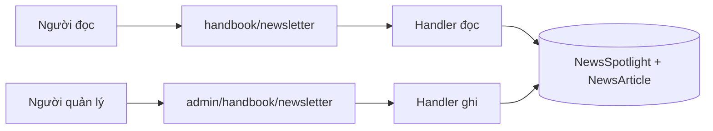
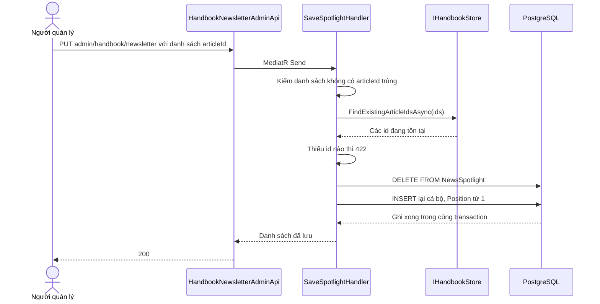
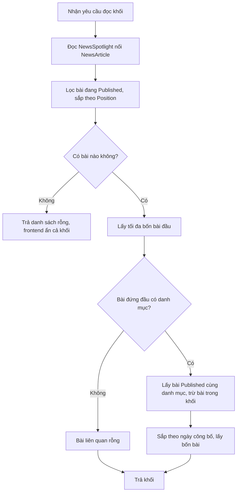
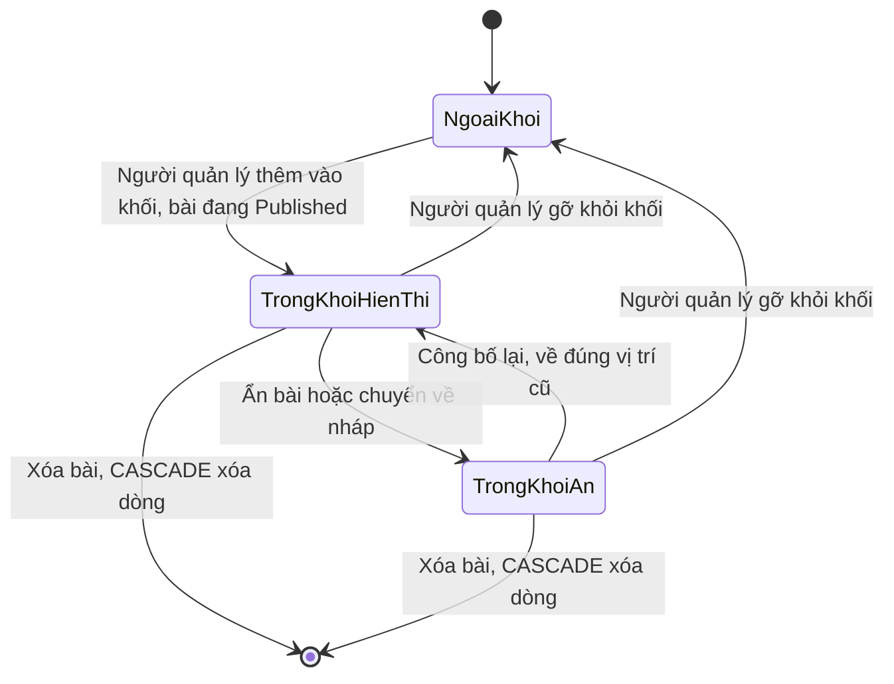
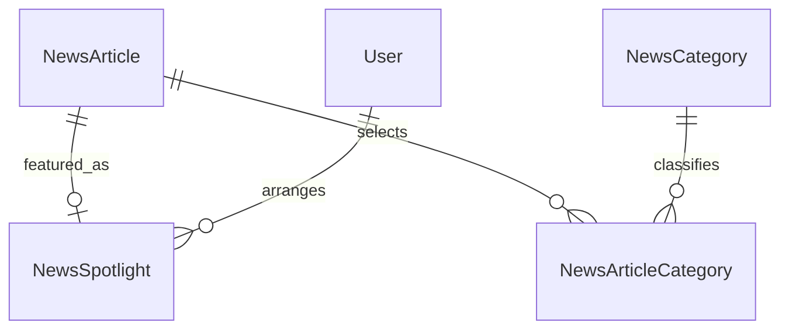

<!-- HƯỚNG DẪN CHO AI KHI ĐIỀN HOẶC CHỈNH SỬA MẪU
- Đọc toàn bộ mẫu, các comment hướng dẫn và tài liệu nguồn được cung cấp trước khi viết. Tuân thủ các quy tắc nghiệp vụ, điều kiện, ngoại lệ và giới hạn đã được xác nhận.
- Không bịa, tự chế hoặc suy đoán thành sự thật: yêu cầu, quy tắc, số liệu, API, schema, mã lỗi, nguồn tham khảo, người phụ trách và kết quả kiểm thử phải có căn cứ. Nội dung ví dụ trong mẫu không phải dữ kiện của dự án.
- Khi thiếu thông tin hoặc các nguồn mâu thuẫn, hỏi người dùng để làm rõ; giữ nguyên placeholder ở phần chưa xác định. Không tự chọn đáp án, lấp chỗ trống hay tuyên bố tài liệu đã hoàn tất.
- Chỉ thay nội dung cần điền hoặc được yêu cầu sửa. Không tự mở rộng phạm vi, sửa nghĩa quy tắc, bỏ điều kiện/ngoại lệ, xoá hay ghi đè nội dung hợp lệ đã có.
- Giữ nguyên tên, cấp và thứ tự heading, nhãn in đậm, tiền tố bullet, cấu trúc danh sách, tên/thứ tự/số cột bảng và cú pháp code fence. Không dịch, đổi tên, gộp hoặc thêm mục ngoài cấu trúc mẫu.
- Chỉ lặp khối luồng, AC hoặc API theo đúng khuôn khi có căn cứ; chỉ bỏ phần tuỳ chọn khi hướng dẫn riêng của mẫu cho phép và đã xác định không áp dụng.
- Mã tham chiếu và section phải trỏ tới tài liệu có thật đã được cung cấp hoặc kiểm chứng. Không giữ mã ví dụ như tham chiếu thật và không tự tạo tài liệu liên quan để hợp thức hoá liên kết.
- Giữ các comment hướng dẫn trong file. Xuất Markdown UTF-8, mỗi file một tài liệu; không bọc toàn bộ file trong code fence, không chèn lời dẫn hay giải thích ngoài mẫu.
- Trước khi bàn giao, đối chiếu nội dung với nguồn, kiểm tra cấu trúc, giá trị cho phép, giới hạn độ dài và tính nhất quán của mã/tham chiếu. Báo rõ phần chưa đủ thông tin; không tuyên bố đã chạy test hoặc import khi chưa thực hiện.
-->

<!-- Thay mã TDD-001 và nội dung ví dụ; giữ nguyên heading và nhãn in đậm.
Sơ đồ dùng mermaid, plantuml hoặc URL. Giữ heading Architecture, Sequence Diagram, Activity Diagram, State Diagram, Data Model.
Ví dụ API phải có heading trùng METHOD /path trong Endpoints. Xoá phần API/sơ đồ không dùng.
Version, Updated At và Change Log do lịch sử phiên bản quản lý, để trống khi nhập mới.
Author/Reviewer là tên hiển thị; gán tài khoản, phê duyệt, giả định và câu hỏi mở trên giao diện sau import.
Thiết kế phải truy vết về Story và Business Rule được cung cấp. Phân biệt thiết kế đề xuất với implementation đã kiểm chứng; không mô tả API/schema/sơ đồ ví dụ như hệ thống thật hoặc tự quyết định nghiệp vụ còn thiếu.
BẮT BUỘC KHI HOÀN THIỆN MẪU: phải có cả Reviewer và Approver, mỗi tên 1–200 ký tự sau khi bỏ khoảng trắng đầu/cuối. Không xoá hai dòng metadata, để trống, dùng tên bịa hoặc giữ placeholder rồi coi là hoàn tất.
Nếu chưa biết người review hoặc người phê duyệt, phải hỏi người dùng và báo tài liệu chưa đủ thông tin; không tự lấy Author/Owner làm người thay thế. Tên trong file không tự gán tài khoản hoặc xác nhận đã duyệt; gán thành viên trên giao diện sau import.
Đây là yêu cầu hoàn thiện mẫu; backend hiện vẫn nhận file cũ thiếu hai trường để tương thích.

VALIDATION CHO FILE NHẬP (đối chiếu ImportSnapshotValidator, MarkdownParser và ImportService):
- Mỗi file .md UTF-8 không rỗng chỉ có một heading cấp 1 chứa mã tài liệu dài 1–100 ký tự. Mã không được trùng trong cùng lần nhập hoặc thuộc loại tài liệu khác đã tồn tại.
- Không dùng tên README.md hoặc sitemap.md vì importer bỏ qua. Giao diện nhận .md/.zip, tối đa 2.000 file, tổng file tải lên 31 MiB; API giới hạn request 32 MiB và tổng nội dung đọc/giải nén 64 MiB.
- Chỉ nhập đè tài liệu cùng loại đang Draft, chưa có phiên bản và chưa lưu trữ. Import thay toàn bộ nội dung bản nháp, vì vậy phải giữ lại nội dung hợp lệ ngoài phần được yêu cầu sửa.
- Không dùng Status trong Markdown hoặc tên Approver để tự xác nhận phê duyệt; import không cấp quyền hay gán tài khoản từ tên. Chạy Kiểm tra file và xử lý lỗi/cảnh báo trước khi nhập.
- Giới hạn độ dài bên dưới tính theo string.Length của .NET (đơn vị UTF-16); không tự cắt ngắn dữ kiện quan trọng để vượt validation, hãy viết lại có căn cứ hoặc hỏi người dùng.
- Feature tối đa 300 ký tự và được dùng làm tiêu đề tài liệu. Status được parser nhận: Draft / In Review / Approved / Deprecated; tài liệu nhập mới vẫn có trạng thái phê duyệt Draft.
- Endpoint: đường dẫn tối đa 500 ký tự; tên/mô tả endpoint được lưu trong Name tối đa 300. HTTP method: GET / POST / PUT / PATCH / DELETE / HEAD / OPTIONS.
- Error Codes: mã tối đa 100 ký tự, không trùng trong tài liệu; giữ dạng - **CODE** (400): mô tả. HTTP status trong Error Codes và Response phải là số nguyên đọc được bằng Int32; không tự đặt status khác hợp đồng API.
- URL sơ đồ tối đa 1.000 ký tự. Mục sơ đồ được sử dụng phải có khối mermaid/plantuml hoặc URL theo mẫu; không để một mục sơ đồ rỗng. Nhãn mục được tách từ bullet như tên External API Fields tối đa 300 ký tự.
- Heading Examples phải khớp METHOD /path ở Endpoints. Giữ các nhãn Request:, Response 200: (thay mã theo contract) và Error Response: để parser tách đúng dữ liệu.
- Tham chiếu dạng DOC-KEY/section: ghi chú: mã đích tối đa 100 ký tự, section tối đa 100, ghi chú tối đa 1.000. Không trùng bộ mã đích + section + loại liên kết trong cùng tài liệu.
ĐỐI CHIẾU FORM TDD (src/features/tdds/validations.ts; form có thể chặt hơn import):
- Điền Feature, Author, Reviewer, Problem và ít nhất một Goal; các Goal/Non-goal/Notes đã thêm không được rỗng. API đã khai báo phải có endpoint và mô tả/mục đích; Fields phải có tên và ý nghĩa; Error Codes phải có mã, HTTP status và điều kiện.
- Form còn kiểm tra Version, Updated At và nội dung Change Log khi khai báo; với file nhập mới, giữ các trường lịch sử này trống theo hợp đồng import, không tự tạo dữ liệu lịch sử.
-->

# TDD-HB-002

## Document Info

- **Feature**: Cẩm nang — khối Bản tin với bài nổi bật và bài liên quan
- **Author**: Claude
- **Reviewer**: Tân Trần
- **Approver**: Tân Trần
- **Status**: Draft
- **Version**:
- **Updated At**:

## Context & Goals

### Problem

STORY-HB-003 và BR-HB-002 đã được người dùng chốt ngày 07/10/2026. Trang Cẩm nang có một khối Bản tin hiển thị bốn bài nổi bật đánh số 01 đến 04, kèm danh sách bài liên quan bên cạnh.

Thứ tự bốn bài do người quản lý quyết định, không theo ngày công bố — nên phải lưu lại lựa chọn đó. Trước đây BR-NEWS-003 khoản 7 ghi là chưa làm ghim tin; quyết định ngày 07/10/2026 bỏ điều đó và chuyển quy tắc sang BR-HB-002.

Điểm cần cân nhắc là nơi lưu thứ tự. Đặt một cờ và một số thứ tự lên `NewsArticle` là cách gọn nhất về số bảng, nhưng kéo theo ba vấn đề thật được phân tích ở Architecture.

### Goals

- Lưu lựa chọn và thứ tự bài nổi bật tách khỏi bảng bài viết.
- Khối luôn hiện bốn bài khi còn đủ bài công bố, kể cả khi một vài bài đã xếp bị ẩn.
- Ẩn cả khối khi không còn bài nổi bật nào đang công bố, và báo cho người quản lý biết.
- Suy ra danh sách bài liên quan từ danh mục của bài đứng đầu, không để người quản lý chọn tay.

### Non-goals

- Nhiều khối nổi bật trên cùng một trang hoặc trên các trang khác.
- Hẹn giờ đưa bài vào hoặc ra khỏi khối.
- Liên kết xem tất cả bài liên quan.

## Architecture

- **Carter endpoint** `HandbookNewsletterApi` (công khai) và `HandbookNewsletterAdminApi` (cần `news.manage`).
- **Handler MediatR** trong `application/usecases/{commands,queries}/handbook/`.
- **Bảng mới `NewsSpotlight`** giữ danh sách và thứ tự.



**Kỹ thuật 1 — Bảng riêng thay vì cột trên bài viết.**

Nếu đặt số thứ tự lên `NewsArticle` thì gặp ba vấn đề:

Thứ nhất, sắp xếp lại khối sẽ ghi vào các dòng bài. `Version` là concurrency token và `ModifiedAtUtc` là khóa sắp xếp của index `IX_NewsArticle_Modified`, nên đổi chỗ bốn bài sẽ đẩy cả bốn lên đầu danh sách quản trị dù nội dung không đổi.

Thứ hai, chống trùng vị trí cần một unique index, mà unique index của PostgreSQL kiểm ngay từng dòng. Đổi bài A từ vị trí 1 sang 2 và bài B từ 2 sang 1 sẽ vi phạm ở giữa chừng, phải dùng ràng buộc hoãn hoặc đi qua một giá trị tạm.

Thứ ba, thứ tự hiển thị là việc của tầng trình bày, không phải thuộc tính của bài viết.

Với bảng riêng, sắp xếp lại trở thành: xóa hết dòng của khối rồi chèn lại cả bộ trong một transaction. Không có bước trung gian nào vi phạm unique, và bảng `NewsArticle` không bị đụng tới.

Tình huống: người quản lý kéo bài ở vị trí 4 lên vị trí 1 rồi lưu. Hệ thống xóa sáu dòng `NewsSpotlight` hiện có và chèn lại sáu dòng theo thứ tự mới. Sáu bài viết giữ nguyên `Version` và `ModifiedAtUtc`.

Giới hạn: đọc khối phải nối sang `NewsArticle`. Danh sách tối đa vài chục dòng nên chi phí không đáng kể.

**Kỹ thuật 2 — Vị trí là thứ tự tương đối, số hiển thị tính khi đọc.**

`Position` chỉ nói bài nào đứng trước bài nào; nó không phải số 01 đến 04 in trên giao diện. Truy vấn công khai lọc bài đang `Published`, sắp theo `Position` rồi lấy bốn dòng đầu, và frontend đánh số theo đúng thứ tự nhận được.

Nhờ vậy bài bị ẩn không để lại chỗ trống: các bài sau tự dồn lên. Và khi bài đó được công bố lại, nó trở về đúng chỗ cũ vì `Position` chưa bao giờ bị sửa.

Tình huống: khối chứa B1 đến B6 theo thứ tự. B2 bị ẩn nên khối hiện B1, B3, B4, B5 và đánh số 01 đến 04. Công bố lại B2 thì nó về số 02 và B5 lui ra ngoài khối, không ai phải xếp lại.

Giới hạn: `Position` có thể thưa sau nhiều lần sửa. Điều đó không sao vì chỉ thứ tự tương đối có ý nghĩa; thao tác lưu luôn ghi lại cả bộ nên hệ thống đánh số lại liên tục từ 1 mỗi lần lưu.

**Kỹ thuật 3 — Bài liên quan suy ra khi đọc, không lưu.**

Danh sách bên phải khối lấy các bài đang `Published` có chung ít nhất một danh mục với bài đứng đầu khối, loại trừ các bài đang hiển thị trong khối, sắp theo ngày công bố mới nhất và lấy bốn bài.

Không lưu gì thêm: đổi thứ tự khối là danh sách liên quan đổi theo, không có dữ liệu nào cần dọn.

Tình huống: bài số 01 gắn "Vật liệu". Danh sách liên quan gồm các bài công bố khác cùng "Vật liệu". Người quản lý kéo một bài thuộc "Nội thất" lên số 01 thì danh sách liên quan chuyển sang các bài "Nội thất".

Giới hạn: bài đứng đầu không gắn danh mục nào thì danh sách liên quan rỗng. Đây là hệ quả đúng của BR-NEWS-001 khoản 2 — bài không danh mục vẫn công bố được — và khối vẫn hiển thị phần bài nổi bật bình thường.

**Notes**:
- Không có cột phân loại khối. Hiện chỉ có một khối nổi bật; thêm cột để dự phòng khối thứ hai là thiết kế cho nhu cầu chưa có. Khi cần, thêm một cột kèm giá trị mặc định là một migration rẻ.
- Ẩn bài không xóa dòng `NewsSpotlight`, nhưng xóa bài thì xóa. Đây là lý do khóa ngoại dùng CASCADE: bài bị xóa hẳn không còn gì để trỏ tới, còn bài bị ẩn chỉ là tạm thời và phải giữ được chỗ.
- Khi không còn bài công bố nào trong khối, API công khai trả danh sách rỗng và frontend không dựng dải Bản tin. Hệ thống không tự lấy bài mới nhất lấp vào, vì như vậy sẽ mâu thuẫn với BR-HB-002 khoản 1 nói thứ tự do người quản lý quyết định.

## Sequence Diagram

Người quản lý lưu lại thứ tự mới của khối.



## Activity Diagram

Dựng khối Bản tin cho người đọc.



## State Diagram

Vị trí của một bài đối với khối Bản tin.



Đây là trạng thái của quan hệ bài–khối, không phải trạng thái của bài. Bài vẫn giữ `Draft`, `Published`, `Hidden` theo [TDD-NEWS-001](TDD-NEWS-001.md).

## Data Model

### Bảng mới `NewsSpotlight`

Mỗi dòng là **một lần người quản lý xếp một bài vào khối Bản tin**. Dòng được tạo và xóa theo cả bộ mỗi lần lưu thứ tự; không có đường sửa một dòng lẻ.

| Cột | Kiểu và ràng buộc |
| --- | --- |
| ArticleId | uuid PK, FK `NewsArticle` ON DELETE CASCADE |
| Position | integer NN, UNIQUE `UX_NewsSpotlight_Position`, CHECK > 0 |
| CreatedBy, ModifiedBy | uuid NN, FK `User` ON DELETE RESTRICT |
| CreatedAtUtc, ModifiedAtUtc | timestamptz NN |

`ArticleId` làm khóa chính nên một bài chỉ nằm ở một vị trí — đúng BR-HB-002 khoản 4, và không cần kiểm thêm ở ứng dụng. `Position` duy nhất nên không có hai bài cùng số.

Bảng không có cột nào nói bài đang hiển thị hay không; điều đó đọc từ `NewsArticle.State` khi truy vấn.

### Quan hệ



Một bài có 0 hoặc 1 dòng trong khối. Xóa bài xóa dòng đó; xóa danh mục không ảnh hưởng gì tới khối.

### Dữ liệu mẫu

Dữ liệu giả định, lược cột audit, dùng bí danh cho UUID; không phải dữ liệu production. A là một `User` có sẵn, T1 = `2026-10-07T02:00:00Z`.

| Bảng | Dòng dữ liệu |
| --- | --- |
| NewsSpotlight | (ArticleId=B1, Position=1), (B2, 2), (B3, 3), (B4, 4), (B5, 5), (B6, 6); tất cả CreatedBy=ModifiedBy=A, CreatedAtUtc=ModifiedAtUtc=T1. |
| NewsArticle | B1 đến B6 đều State='Published' với ngày công bố khác nhau; B1 gắn danh mục C1='Vật liệu'. |

Người quản lý xếp dư hai bài để dự phòng. Khối hiển thị B1, B2, B3, B4 và đánh số 01 đến 04.

**Ẩn B2:** `NewsArticle` B2 chuyển `State='Hidden'`, `Version` tăng. Bảng `NewsSpotlight` **không đổi một dòng nào** — B2 vẫn giữ `Position=2`. Khối hiển thị B1, B3, B4, B5 và vẫn đánh số 01 đến 04.

**Công bố lại B2:** `State='Published'`. Khối trở lại B1, B2, B3, B4; B5 lui ra ngoài. Người quản lý không thao tác gì thêm.

**Xóa hẳn B1:** CASCADE xóa dòng `(B1, 1)`. Các dòng còn lại giữ nguyên `Position` 2 đến 6, nên khối hiển thị B2, B3, B4, B5. Số thứ tự thưa không gây vấn đề vì chỉ thứ tự tương đối có ý nghĩa.

**Lưu thứ tự mới** đưa B4 lên đầu: transaction xóa toàn bộ dòng rồi chèn lại `(B4, 1), (B2, 2), (B3, 3), (B5, 4), (B6, 5)` với `Position` đánh lại liên tục từ 1. Năm bài viết giữ nguyên `Version` và `ModifiedAtUtc` của chúng.

**Bài liên quan của khối trên:** bài đứng đầu là B4; lấy các bài `Published` có chung danh mục với B4, loại B4, B2, B3, B5 đang hiển thị, sắp theo ngày công bố mới nhất, lấy bốn bài. Đây là kết quả đọc, không có dòng nào được lưu.

**Nhánh bị từ chối:** lưu danh sách chứa cùng một `articleId` hai lần bị handler trả 422 trước khi ghi. Lưu danh sách chứa một bài đã bị xóa trong lúc người quản lý đang thao tác cũng trả 422, và transaction rollback nên khối giữ nguyên bộ cũ.

**Notes**:
- Migration `NewsSpotlight` chỉ tạo một bảng mới, không đụng bảng nào đang có dữ liệu và không cần backfill. Khối rỗng ngay sau khi triển khai, nên dải Bản tin chưa hiển thị cho tới khi người quản lý xếp bài — cần báo trước cho người vận hành.
- Xóa cả bộ rồi chèn lại là thao tác ghi trên vài chục dòng, nằm trong một transaction do `TransactionPipelineBehavior` mở sẵn cho mọi `Command`. Handler không mở transaction thứ hai.
- Truy vấn công khai đọc khối và đọc bài liên quan trong cùng một snapshot chỉ đọc, theo cách `INewsReadStore` đang dùng, để danh sách liên quan không lệch với bộ bài đang hiển thị.
- Không thêm index cho `NewsSpotlight` ngoài khóa chính và unique `Position`. Bảng chỉ vài chục dòng và luôn đọc toàn bộ.

## Internal API

### Endpoints

- **GET** `/api/v1/handbook/newsletter` — công khai, trả bài nổi bật và bài liên quan.
- **GET** `/api/v1/admin/handbook/newsletter` — cần `news.manage`, trả cả bài đang ẩn kèm trạng thái.
- **PUT** `/api/v1/admin/handbook/newsletter` — cần `news.manage`, thay toàn bộ danh sách và thứ tự.

### Examples

#### GET /api/v1/handbook/newsletter

```
Response 200:
{"isSuccess": true, "value": {
  "featured": [
    {"id": "B1", "slug": "gia-vat-lieu-thang-8",
     "title": "Giá vật liệu xây dựng mới nhất tháng 8/2026",
     "coverImageUrl": "https://images.example.test/news/b1.webp",
     "readingTimeMinutes": 5,
     "firstPublishedAtUtc": "2026-08-07T03:00:00Z",
     "categories": [{"id": "C1", "name": "Vật liệu"}]}
  ],
  "related": [
    {"id": "B9", "slug": "kinh-nghiem-chon-nha-thau",
     "title": "Kinh nghiệm chọn nhà thầu uy tín",
     "coverImageUrl": "https://images.example.test/news/b9.webp",
     "readingTimeMinutes": 6,
     "categories": [{"id": "C2", "name": "Kinh nghiệm xây nhà"}]}
  ]}}
```

`featured` rỗng nghĩa là không còn bài nổi bật nào đang công bố; frontend không dựng dải Bản tin.

#### PUT /api/v1/admin/handbook/newsletter

```
Request:
{"articleIds": ["B4", "B2", "B3", "B5", "B6"]}

Response 200:
{"isSuccess": true, "value": [
  {"articleId": "B4", "position": 1, "state": "Published", "title": "..."},
  {"articleId": "B2", "position": 2, "state": "Hidden", "title": "..."}
]}

Error Response:
{"code": "InvalidNewsSpotlight"}
```

Phản hồi quản trị kèm `state` của từng bài để giao diện báo khối đang không hiển thị khi mọi bài đều khác `Published`.

### Error Codes

- **InvalidNewsSpotlight** (422): danh sách chứa `articleId` trùng nhau, hoặc chứa bài không còn tồn tại.
- **NewsArticleNotFound** (404): dùng lại mã hiện có khi thao tác nhắm tới một bài không tồn tại.

## External API

### Endpoints

- Không áp dụng — thiết kế này không gọi dịch vụ ngoài nào.

### Fields

- Không áp dụng — không có trường nào đến từ hệ thống ngoài.

### Error Handling

Không áp dụng. Khối Bản tin chỉ tham chiếu bài viết đã có; ảnh bìa của bài theo quyết định chung đã mô tả ở [TDD-NEWS-001](TDD-NEWS-001.md).

### Quirks

- Không áp dụng.

## References

### User Stories

- STORY-HB-003

### Business Rules

- BR-HB-002
- BR-NEWS-003

### Use Cases

### Others

- Tài liệu kỹ thuật: [TDD-NEWS-001](TDD-NEWS-001.md) — trạng thái bài và index phục vụ danh sách công khai.
- Tài liệu kỹ thuật: [TDD-NEWS-003](TDD-NEWS-003.md) — trường `slug` trong phản hồi bài viết.

## Change Log
