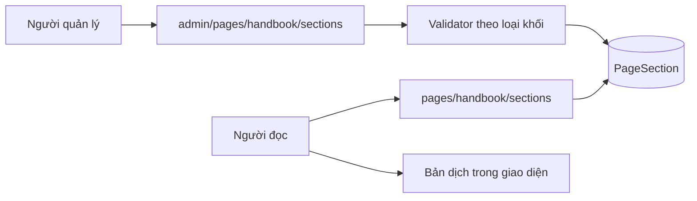
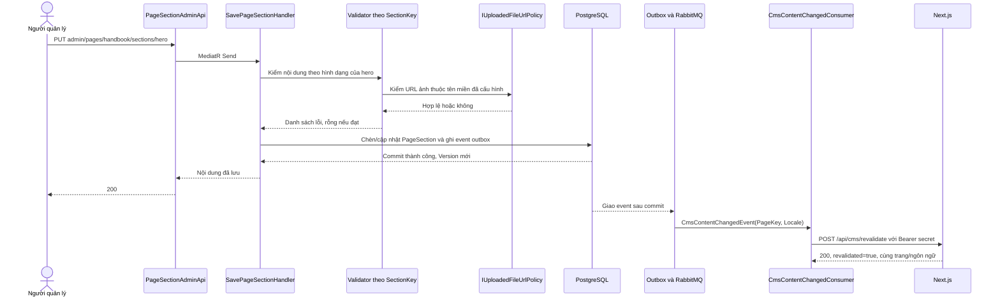
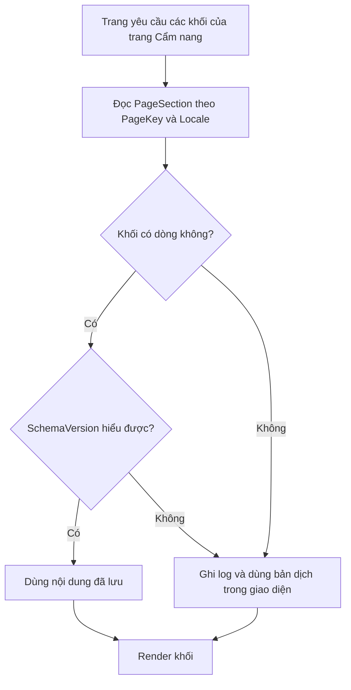
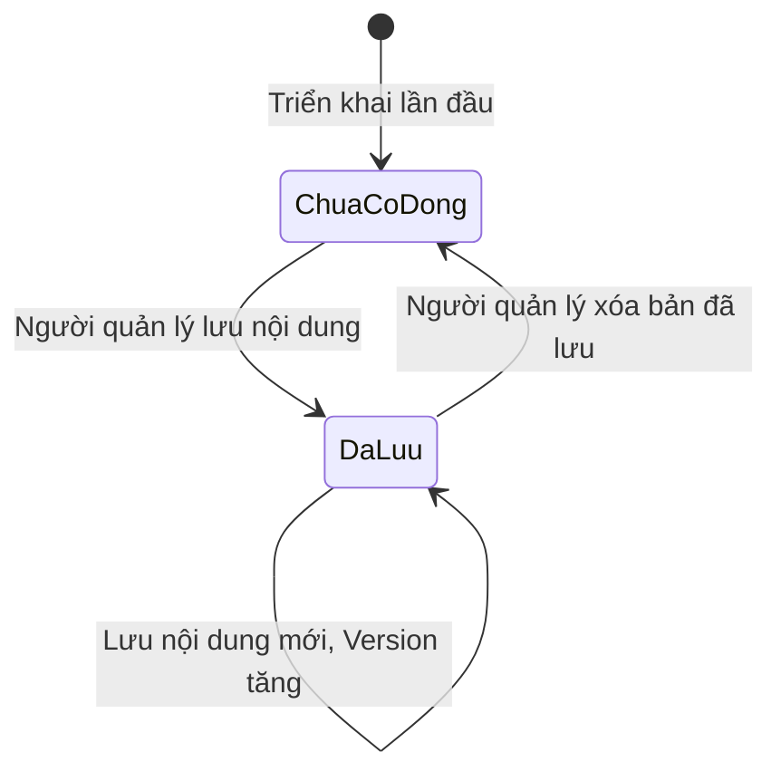
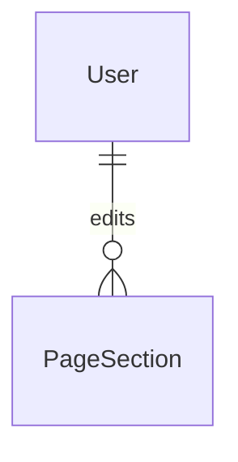

<!-- HƯỚNG DẪN CHO AI KHI ĐIỀN HOẶC CHỈNH SỬA MẪU
- Đọc toàn bộ mẫu, các comment hướng dẫn và tài liệu nguồn được cung cấp trước khi viết. Tuân thủ các quy tắc nghiệp vụ, điều kiện, ngoại lệ và giới hạn đã được xác nhận.
- Không bịa, tự chế hoặc suy đoán thành sự thật: yêu cầu, quy tắc, số liệu, API, schema, mã lỗi, nguồn tham khảo, người phụ trách và kết quả kiểm thử phải có căn cứ. Nội dung ví dụ trong mẫu không phải dữ kiện của dự án.
- Khi thiếu thông tin hoặc các nguồn mâu thuẫn, hỏi người dùng để làm rõ; giữ nguyên placeholder ở phần chưa xác định. Không tự chọn đáp án, lấp chỗ trống hay tuyên bố tài liệu đã hoàn tất.
- Chỉ thay nội dung cần điền hoặc được yêu cầu sửa. Không tự mở rộng phạm vi, sửa nghĩa quy tắc, bỏ điều kiện/ngoại lệ, xoá hay ghi đè nội dung hợp lệ đã có.
- Giữ nguyên tên, cấp và thứ tự heading, nhãn in đậm, tiền tố bullet, cấu trúc danh sách, tên/thứ tự/số cột bảng và cú pháp code fence. Không dịch, đổi tên, gộp hoặc thêm mục ngoài cấu trúc mẫu.
- Chỉ lặp khối luồng, AC hoặc API theo đúng khuôn khi có căn cứ; chỉ bỏ phần tuỳ chọn khi hướng dẫn riêng của mẫu cho phép và đã xác định không áp dụng.
- Mã tham chiếu và section phải trỏ tới tài liệu có thật đã được cung cấp hoặc kiểm chứng. Không giữ mã ví dụ như tham chiếu thật và không tự tạo tài liệu liên quan để hợp thức hoá liên kết.
- Giữ các comment hướng dẫn trong file. Xuất Markdown UTF-8, mỗi file một tài liệu; không bọc toàn bộ file trong code fence, không chèn lời dẫn hay giải thích ngoài mẫu.
- Trước khi bàn giao, đối chiếu nội dung với nguồn, kiểm tra cấu trúc, giá trị cho phép, giới hạn độ dài và tính nhất quán của mã/tham chiếu. Báo rõ phần chưa đủ thông tin; không tuyên bố đã chạy test hoặc import khi chưa thực hiện.
-->

<!-- Thay mã TDD-001 và nội dung ví dụ; giữ nguyên heading và nhãn in đậm.
Sơ đồ dùng mermaid, plantuml hoặc URL. Giữ heading Architecture, Sequence Diagram, Activity Diagram, State Diagram, Data Model.
Ví dụ API phải có heading trùng METHOD /path trong Endpoints. Xoá phần API/sơ đồ không dùng.
Version, Updated At và Change Log do lịch sử phiên bản quản lý, để trống khi nhập mới.
Author/Reviewer là tên hiển thị; gán tài khoản, phê duyệt, giả định và câu hỏi mở trên giao diện sau import.
Thiết kế phải truy vết về Story và Business Rule được cung cấp. Phân biệt thiết kế đề xuất với implementation đã kiểm chứng; không mô tả API/schema/sơ đồ ví dụ như hệ thống thật hoặc tự quyết định nghiệp vụ còn thiếu.
BẮT BUỘC KHI HOÀN THIỆN MẪU: phải có cả Reviewer và Approver, mỗi tên 1–200 ký tự sau khi bỏ khoảng trắng đầu/cuối. Không xoá hai dòng metadata, để trống, dùng tên bịa hoặc giữ placeholder rồi coi là hoàn tất.
Nếu chưa biết người review hoặc người phê duyệt, phải hỏi người dùng và báo tài liệu chưa đủ thông tin; không tự lấy Author/Owner làm người thay thế. Tên trong file không tự gán tài khoản hoặc xác nhận đã duyệt; gán thành viên trên giao diện sau import.
Đây là yêu cầu hoàn thiện mẫu; backend hiện vẫn nhận file cũ thiếu hai trường để tương thích.

VALIDATION CHO FILE NHẬP (đối chiếu ImportSnapshotValidator, MarkdownParser và ImportService):
- Mỗi file .md UTF-8 không rỗng chỉ có một heading cấp 1 chứa mã tài liệu dài 1–100 ký tự. Mã không được trùng trong cùng lần nhập hoặc thuộc loại tài liệu khác đã tồn tại.
- Không dùng tên README.md hoặc sitemap.md vì importer bỏ qua. Giao diện nhận .md/.zip, tối đa 2.000 file, tổng file tải lên 31 MiB; API giới hạn request 32 MiB và tổng nội dung đọc/giải nén 64 MiB.
- Chỉ nhập đè tài liệu cùng loại đang Draft, chưa có phiên bản và chưa lưu trữ. Import thay toàn bộ nội dung bản nháp, vì vậy phải giữ lại nội dung hợp lệ ngoài phần được yêu cầu sửa.
- Không dùng Status trong Markdown hoặc tên Approver để tự xác nhận phê duyệt; import không cấp quyền hay gán tài khoản từ tên. Chạy Kiểm tra file và xử lý lỗi/cảnh báo trước khi nhập.
- Giới hạn độ dài bên dưới tính theo string.Length của .NET (đơn vị UTF-16); không tự cắt ngắn dữ kiện quan trọng để vượt validation, hãy viết lại có căn cứ hoặc hỏi người dùng.
- Feature tối đa 300 ký tự và được dùng làm tiêu đề tài liệu. Status được parser nhận: Draft / In Review / Approved / Deprecated; tài liệu nhập mới vẫn có trạng thái phê duyệt Draft.
- Endpoint: đường dẫn tối đa 500 ký tự; tên/mô tả endpoint được lưu trong Name tối đa 300. HTTP method: GET / POST / PUT / PATCH / DELETE / HEAD / OPTIONS.
- Error Codes: mã tối đa 100 ký tự, không trùng trong tài liệu; giữ dạng - **CODE** (400): mô tả. HTTP status trong Error Codes và Response phải là số nguyên đọc được bằng Int32; không tự đặt status khác hợp đồng API.
- URL sơ đồ tối đa 1.000 ký tự. Mục sơ đồ được sử dụng phải có khối mermaid/plantuml hoặc URL theo mẫu; không để một mục sơ đồ rỗng. Nhãn mục được tách từ bullet như tên External API Fields tối đa 300 ký tự.
- Heading Examples phải khớp METHOD /path ở Endpoints. Giữ các nhãn Request:, Response 200: (thay mã theo contract) và Error Response: để parser tách đúng dữ liệu.
- Tham chiếu dạng DOC-KEY/section: ghi chú: mã đích tối đa 100 ký tự, section tối đa 100, ghi chú tối đa 1.000. Không trùng bộ mã đích + section + loại liên kết trong cùng tài liệu.
ĐỐI CHIẾU FORM TDD (src/features/tdds/validations.ts; form có thể chặt hơn import):
- Điền Feature, Author, Reviewer, Problem và ít nhất một Goal; các Goal/Non-goal/Notes đã thêm không được rỗng. API đã khai báo phải có endpoint và mô tả/mục đích; Fields phải có tên và ý nghĩa; Error Codes phải có mã, HTTP status và điều kiện.
- Form còn kiểm tra Version, Updated At và nội dung Change Log khi khai báo; với file nhập mới, giữ các trường lịch sử này trống theo hợp đồng import, không tự tạo dữ liệu lịch sử.
-->

# TDD-HB-003

## Document Info

- **Feature**: Cẩm nang — nội dung chữ cố định của trang
- **Author**: Claude
- **Reviewer**: Tân Trần
- **Approver**: Tân Trần
- **Status**: Draft
- **Version**:
- **Updated At**:

## Context & Goals

### Problem

STORY-HB-004 và BR-HB-003 đã được người dùng chốt ngày 07/10/2026; ngày 08/10/2026 bổ sung banner của tab Thư viện mẫu và tên hai tab. Các câu chữ cố định của trang Cẩm nang — tên hai tab, phần mở đầu, tiêu đề nhóm ba bước, tiêu đề và mô tả khối bài viết, tiêu đề khối Bản tin, banner của tab Thư viện mẫu — hiện nằm trong mã frontend, nên đổi một dòng chữ cũng phải triển khai lại.

Mỗi khối có hình dạng khác nhau: phần mở đầu có dòng nhãn, tiêu đề, mô tả, chữ trên nút và ảnh nền (tùy chọn); tiêu đề khối Bản tin chỉ có một dòng chữ. Nếu mỗi khối một bảng thì thêm khối nào cũng phải migration, quá nặng cho một trang tiếp thị.

### Goals

- Lưu nội dung các khối chữ theo trang, theo khối và theo ngôn ngữ, sửa được từ quản trị.
- Thêm khối mới không phải đổi cấu trúc cơ sở dữ liệu.
- Giữ chữ hiển thị đầy đủ cả khi khối chưa từng được sửa.

### Non-goals

- Quản lý nội dung cho các trang khác ngoài Cẩm nang.
- Lịch sử sửa, bản nháp và hẹn giờ xuất bản cho khối chữ.
- Kéo thả để thêm, xóa hoặc đổi thứ tự khối trên trang.

## Architecture

- **Carter endpoint** `PageSectionApi` (công khai) và `PageSectionAdminApi` (cần `news.manage`).
- **Handler MediatR** cùng một bộ validator, mỗi loại khối một validator.
- **Bảng mới `PageSection`** với cột nội dung kiểu `jsonb`.



**Kỹ thuật 1 — Nội dung dạng jsonb với validator riêng cho từng loại khối.**

`jsonb` là kiểu dữ liệu JSON đã phân tích sẵn của PostgreSQL. Dùng nó nghĩa là mỗi khối tự mang hình dạng riêng mà bảng không cần biết trước, nên thêm khối mới chỉ là thêm một dòng và một validator, không phải migration.

Dự án đã dùng cách này ở tám chỗ, kèm đúng kiểu CHECK được dùng ở đây (`QuotationConfigurations.cs:46`, `EstimateGenerationConfigurations.cs:20`), nên không phải mô hình mới với đội.

Hình dạng của từng khối được khai báo trong `PageSectionCatalog`: trường chữ bắt buộc, trường chữ tùy chọn và trường ảnh. Trường ảnh luôn tùy chọn: bỏ trống thì giao diện dùng ảnh mặc định, nên admin sửa chữ không phải tải ảnh lại. Nút của khối `hero` cuộn xuống ba bước chứ không phải liên kết, nên khối không có trường liên kết; trường lạ bị từ chối thay vì bỏ qua im lặng.

Đánh đổi quan trọng: database chỉ kiểm được "đây là một đối tượng JSON", không kiểm được bên trong có đủ trường hay không. Vì vậy mỗi `SectionKey` có một validator riêng ở tầng ứng dụng, chạy trước khi ghi. Không có validator thì cột `jsonb` sẽ nhận bất cứ thứ gì và lỗi chỉ lộ ra khi người đọc mở trang.

Tình huống: người quản lý gửi khối phần mở đầu thiếu trường tiêu đề. Validator của `hero` trả 422 kèm tên trường thiếu; dòng cũ giữ nguyên.

**Kỹ thuật 2 — `SchemaVersion` để đổi hình dạng khối mà không làm hỏng dữ liệu cũ.**

Mỗi dòng ghi lại hình dạng nội dung của nó theo phiên bản nào. Khi một khối cần thêm trường bắt buộc, code đọc được cả dòng phiên bản cũ lẫn mới và chuyển đổi khi đọc, thay vì phải sửa hàng loạt dữ liệu rồi mới triển khai.

Tình huống: khối phần mở đầu thêm trường ảnh nền thứ hai cho màn hình lớn. Dòng cũ mang `SchemaVersion=1` nên code đọc hiểu là chưa có trường đó và dùng ảnh hiện có; dòng mới ghi `SchemaVersion=2`.

Giới hạn: `SchemaVersion` chỉ hữu ích nếu code thật sự xử lý từng phiên bản. Nếu bỏ qua, cột này chỉ là số vô nghĩa.

**Kỹ thuật 3 — Thiếu dòng là trạng thái hợp lệ, không phải lỗi.**

Khối chưa từng được sửa thì không có dòng nào trong bảng. API công khai trả về đúng các khối đang có; frontend dùng bản dịch sẵn trong `messages/*.json` cho những khối không nhận được. Nhờ vậy trang không bao giờ trống chữ, kể cả ngay sau khi triển khai lần đầu khi bảng hoàn toàn rỗng.

Dự án đã dùng cách này cho dải nhận xét khách hàng, mô tả ở `cms.types.ts:159`: ba trường chữ để trống thì site dùng bản dịch trong `messages/*.json`.

Giới hạn: bản mặc định nằm trong mã frontend nên đổi nó vẫn phải triển khai lại. Đây là bản dự phòng, không phải nơi biên tập.

**Notes**:
- Bảng đặt tên `PageSection` chứ không gắn chữ Handbook, vì cấu trúc trang–khối–ngôn ngữ dùng lại được cho trang khác. Lần này chỉ khai báo các khối của trang Cẩm nang; không tạo sẵn dòng cho trang chưa có yêu cầu.
- Ảnh trong nội dung khối đi qua cùng `IUploadedFileUrlPolicy` đang dùng cho ảnh bài viết. Validator của từng loại khối gọi policy đó cho mọi trường chứa URL ảnh.
- Không thêm mã quyền mới; dùng `news.manage` theo quyết định ngày 07/10/2026.

**Làm mới cache khi nội dung thay đổi (yêu cầu ngày 08/10/2026).** Handler lưu/xóa khối gọi `ICmsContentChangePublisher`; adapter phát `CmsContentChangedEvent(PageKey, Locale)` qua MassTransit Bus Outbox hiện có. Thông báo được ghi cùng transaction với `PageSection` và chỉ giao sau commit. Validator hoặc kiểm version từ chối thì không phát; lưu lại nội dung không đổi cũng không phát. Cơ chế này dùng chung cho `home`, `footer`, `contractors` và `handbook`, không thêm bảng hay migration.

`CmsContentChangedConsumer` gọi `POST /api/cms/revalidate` của Next.js bằng secret trong header `Authorization`. Next.js hết hạn cache theo trang/ngôn ngữ; không nhận bản nội dung từ event mà đọc lại BE ở lần mở trang kế tiếp. Vì vậy giao trùng hoặc đảo thứ tự event không làm nội dung quay về bản cũ. Ví dụ: lưu phần mở đầu tiếng Việt rồi khôi phục mặc định trước khi consumer xử lý; cả hai event đều xoá cùng tag và lần đọc sau lấy trạng thái hiện hành trong database.

Thiếu secret nghĩa là webhook chưa bật và publisher không tạo event. Khi đã bật, lỗi HTTP hoặc timeout được consumer ném lại để MassTransit thử lại theo `MessageBusOption`; hết số lần thử, message nằm trong hàng đợi `cms-content-changed_error` để kiểm cấu hình và phát lại. Lưu dữ liệu đã commit không thất bại theo lỗi Next.js. Admin vẫn gọi trực tiếp API cache sau khi lưu để làm mới đúng instance đang sử dụng, kể cả khi test bằng frontend local. Tab công khai đã mở không tự đổi nội dung; người đọc cần tải lại.

**CMS trang bảng giá — yêu cầu ngày 09/10/2026.** Người dùng yêu cầu quản lý đúng năm khối đã chụp trên `/vi/plans`. Màn hình được đặt trong nhóm Gói dịch vụ ở bản đầu và chuyển sang nhóm Nội dung theo yêu cầu tiếp theo cùng ngày. Đây là phạm vi mới ngoài STORY-HB-004; dùng lại cơ chế `PageSection`, không thay nghiệp vụ thuê bao trong TDD-SUB-001.

| PageKey | SectionKey | Nội dung được sửa |
| --- | --- | --- |
| plans | hero | Tiêu đề và mô tả đầu trang. Từ cuối của tiêu đề giữ màu cam. |
| plans | advice | Tiêu đề, mô tả, chữ nút gọi, chữ nút chat và hotline. Nút chat giữ thao tác mở trợ lý AI. |
| plans | comparison | Tiêu đề, tên cột, chữ nút chọn gói; nhóm và hạng mục động với ba ô Có/Không/chữ cho BASIC/PLUS/PRO theo STORY-CMS-001. |
| plans | value | Tiêu đề và danh sách hạng mục động gồm tên, icon, ba ô chữ BASIC/PLUS/PRO; giữ tương thích 17 khóa chữ cũ. |
| plans | notes | Ba ghi chú thanh toán/dự toán/quà và dòng phạm vi hồ sơ. |

Catalog backend khai báo trường của năm khối trong `PlansSectionKeys` và `PageSectionCatalog`; frontend đối chiếu qua `PLANS_COPY_KEYS`. Khóa lồng trong bản dịch được đổi thành khóa JSON phẳng bằng dấu gạch dưới, ví dụ `rows.uploadPhoto` → `rows_uploadPhoto`, `cells.easy.advanced` → `cells_easy_advanced`. Mọi trường là chữ tùy chọn, tối đa 1.000 ký tự Unicode theo giới hạn CMS hiện có. Trường không được lưu hoặc để trống dùng bản dịch của chính ngôn ngữ đang xem.

Giá, hạn mức thật, quyền lợi thật, nội dung tư vấn/quà trên thẻ và cờ `isHighlighted` tiếp tục thuộc cấu hình gói. Theo STORY-CMS-001 được chốt ngày 09/10/2026, các ô trong bảng so sánh là nội dung CMS độc lập; chúng có thể chứa số/chữ khác cấu hình gói nhưng không thay cấu hình hoặc quyền đã cấp. Cách lấy giá trị bảng từ gói trong bản đầu được giữ để đọc nội dung cũ, rồi chuyển thành điểm bắt đầu khi biên tập bảng động lần đầu. Cột tô cam dựa trên cờ Nổi bật của từng gói đang công bố, gồm cả trường hợp nhiều gói cùng được đánh dấu theo TDD-SUB-001. Các biến `{count}`, `{hotline}` và `{name}` trong chữ CMS nhận dữ liệu hiện hành từ bên gọi; nội dung được hiển thị dưới dạng chữ thuần, không thực thi HTML hoặc ICU do người soạn nhập.

Route quản trị `/admin/plans-content` nằm trong nhóm Nội dung, sau Cẩm nang. Dùng GET/PUT/DELETE `/api/v1/admin/pages/plans/sections` theo contract chung, cùng quyền `news.manage` với CMS Trang chủ/Footer; phần cấu hình gói vẫn cần `plan.manage`. Lưu theo `locale` và `expectedVersion`; khôi phục chỉ xóa khối của ngôn ngữ được chọn. Năm khối đóng/mở được; các trường luôn được giữ trong form để đóng khối không mất nội dung hoặc bỏ qua validation khi Lưu tất cả.

Phần `plans/value` dùng `PlansValueEditor` để sửa tiêu đề và danh sách hạng mục động trong bảng Hạng mục/BASIC/PLUS/PRO theo STORY-CMS-002. Bốn hàng `easy/time/budget/ready` và 17 khóa chữ phẳng là dữ liệu cũ được giữ tương thích; danh sách `items` đã lưu thay hoàn toàn các hàng cũ. Cột hạng mục cố định khi cuộn ngang trên desktop; điện thoại cuộn toàn bộ bảng để sửa được cột PRO. Menu, trạng thái mở nhóm và breadcrumb lấy từ `ADMIN_NAV`, nên chuyển mục CMS sang Nội dung không đổi URL hoặc quyền truy cập.

Trang công khai đọc GET `/api/v1/pages/plans/sections?locale=vi|en` từ server, cache 60 giây với tag `cms:plans:<locale>`; client dùng cùng nội dung cho các lần đọc trong phiên. Lưu/xóa sử dụng publisher chung và webhook cache hiện có, thêm `plans` vào danh sách trang được phép làm mới. Dùng bảng `PageSection` đã có, không thêm migration. Backend commit `864b6df` đã triển khai thành công ngày 09/10/2026; GET `plans` trên `bmt-api.vnzdna.com` ở cả hai ngôn ngữ trả HTTP 200 với danh sách rỗng, thay cho lỗi 404 trước triển khai. Frontend mới vẫn chạy local; chưa kiểm thao tác lưu bằng phiên quản trị thật.

Kiểm thử backend trong `PlansPageSectionTests` kiểm lưu/đọc năm khối, tách ngôn ngữ, từ chối trường cấu hình gói hoặc giá trị sai kiểu, phiên bản cũ và giới hạn chữ. `scripts/plans-content.test.mjs` kiểm phạm vi biên tập, khóa dịch, nội dung chỉ gồm phần đã sửa, thay biến và contract giữa frontend/backend. Kiểm thử handler dùng kho giả, không chứng minh transaction/database hoặc policy HTTP trên server thật.

**Bảng giá trị CMS động — STORY-CMS-002 và BR-CMS-002, chốt ngày 09/10/2026.** Khối `plans/value` bổ sung `items` gồm tối đa 100 hàng; thứ tự mảng là thứ tự công khai. Mỗi mục có `label`, `icon`, `basic`, `advanced`, `pro` dạng chuỗi. Dùng trường `Items` và validator chữ/icon hiện có; không đổi database, endpoint, policy hoặc schemaVersion. Giữ 17 khóa chữ cũ để tương thích. Frontend dùng adapter riêng: chưa có items thì giữ bốn hàng/chữ/icon cũ làm điểm bắt đầu; items đã lưu thay hoàn toàn bảng, kể cả `[]`. Không lọc bỏ hàng đang để trống; mỗi trường chưa có trong mục được đọc thành chuỗi rỗng, không mượn chữ của hàng khác.

Màn admin có tên Gói tư vấn trong nhóm Nội dung; URL vẫn là `/admin/plans-content`. Theo yêu cầu gom màn ngày 09/10/2026, phần này nằm trong tab Gói thiết kế; tab Gói giám sát dùng cùng màn với dữ liệu và API riêng. Bảng admin dùng Form.List cho khóa ổn định khi thêm/xóa/di chuyển. Mỗi hàng có ô tên, bộ chọn icon xem trước và ba ô chữ. Icon được chọn từ danh sách Lucide do frontend cung cấp qua route metadata `/api/icon-preview`; backend chỉ kiểm định dạng icon tối đa 64 ký tự theo quy tắc hiện có, không phụ thuộc phiên bản thư viện frontend. Server tra node cho icon CMS để HTML ban đầu có icon; client tra thêm khi nội dung CMS đã cập nhật có tên icon chưa có trong HTML. Icon thiếu/không tra được dùng Circle; các hàng cũ khởi tạo MousePointerClick, Clock, Wallet, HardHat. Không đưa toàn bộ mã thư viện icon vào bundle client.

Giữ cơ chế ngôn ngữ, phiên bản, lưu/khôi phục/cache của PageSection. Lưu `items: []` giữ tiêu đề và không phục hồi bốn hàng mặc định. Các ô chữ động hiển thị nguyên văn, không thay biến hoặc thực thi HTML. Các điều kiện được đối chiếu ST-CMS-010 đến ST-CMS-015. Ngày 09/10/2026, 154 test handler (kho giả), 11 test CMS frontend, 22 test phân quyền, bảy test rendering và 22 kiểm tra trình duyệt với API cô lập đạt. Backend commit `05f2929` đã triển khai thành công qua run `37890154131`; GET CMS plans cho vi/en trả HTTP 200. Chưa kiểm ghi bằng phiên quản trị thật hoặc SQL của danh sách mới; frontend chỉ chạy local. Metadata tài liệu còn thiếu tên reviewer/approver/owner, nên bản tài liệu vẫn chưa đủ thông tin để hoàn tất mẫu.

**Bảng so sánh CMS động — STORY-CMS-001 và BR-CMS-001, người dùng chốt ngày 09/10/2026.**

Phần `plans/comparison` nhận thêm trường `groups`. Đây là thay đổi hình dạng JSON trong `PageSection.Content`, không đổi entity, cột, khóa, index hoặc transaction. Backend dùng loại trường `PlansComparisonGroups` và `PlansComparisonContentValidator` để kiểm cấu trúc lồng; không mở rộng danh sách `Items` một cấp của các trang khác.

```json
{
  "groups": [
    {
      "id": "core",
      "title": "Quyền lợi chính",
      "style": "standard",
      "rows": [
        {
          "id": "designOptions",
          "label": "Số phương án thiết kế mới",
          "basic": { "kind": "text", "text": "3 phương án" },
          "advanced": { "kind": "yes", "text": "" },
          "pro": { "kind": "no", "text": "" }
        }
      ]
    }
  ]
}
```

Ví dụ là fixture minh họa nội dung CMS, không phải cấu hình hạn mức bán. `advanced` là mã cột PLUS đã có ở frontend. `style` nhận `standard` hoặc `accent`; tên nhóm và tên hàng cho phép chuỗi rỗng như các trường CMS hiện có. Mỗi ô có `kind` là `yes`, `no` hoặc `text`, cùng trường `text` dạng chuỗi; chữ khi chọn `text` hiển thị nguyên văn, không thay biến hoặc thực thi HTML. Khi đổi kiểu ô trong admin, chữ đã nhập được giữ để có thể chọn lại.

Thứ tự mảng là thứ tự nhóm/hàng. ID do frontend tạo, dài 1–64 ký tự ASCII gồm chữ/số/gạch ngang/gạch dưới; ID nhóm không trùng trong bảng và ID hàng không trùng trên toàn bảng. Trần kỹ thuật của payload: 100 nhóm và tổng 500 hàng; giới hạn chữ vẫn 1.000 ký tự Unicode sau trim theo CMS hiện có. Sai loại, thiếu cột, enum lạ, trường thừa/lặp, ID sai/trùng hoặc vượt trần đều bị 422 `InvalidPageSection` trước khi thay nội dung hoặc phát event.

`groups` chưa có thì vẫn đọc 47 trường chữ phẳng cũ và giá trị gói như bản đầu. API tiếp tục nhận các trường cũ để tương thích; không backfill. Admin dùng cùng hàm dựng bảng cũ và ghép bản gói công khai với dữ liệu nền đang được trang sử dụng. Sáu trường tiêu đề/tên cột/chữ nút tiếp tục lưu theo cơ chế chỉ ghi phần đổi; lần đầu sửa comparison thì gửi toàn bộ `groups` để chốt nội dung bảng CMS. Không có request ghi `/admin/plans`, quyền lợi hoặc thuê bao từ editor này. Sau khi có `groups`, ô bảng lấy từ CMS, không đổi theo giá trị gói mới; thẻ gói và nút mua vẫn dùng cấu hình gói thật.

`groups: []` là bảng đã xóa hết hàng, không phải thiếu nội dung: frontend giữ tiêu đề và hàng nút chọn gói, không rơi về bảng cũ. Nhóm có `rows: []` giữ trong admin nhưng được bỏ qua khi hiển thị công khai. Xóa nhóm bỏ cả các hàng trong nhóm khỏi bản đang sửa; xóa/sắp xếp chưa lưu không đổi trang công khai. Chỉ thao tác Khôi phục mặc định gửi DELETE phần comparison theo locale để quay về bảng mặc định hiện hành.

Editor dùng một trường form có cấu trúc qua adapter của `HomeSectionDef`, nên vẫn dùng trạng thái chưa lưu, kiểm phiên bản, chuyển ngôn ngữ, lưu từng khối và làm mới cache của `PageContentManager`. Đóng khối giữ trường trong form. Các hàm dựng/kiểm nội dung dùng chung ở `shared/cms`; admin không import feature công khai. Route, quyền `news.manage`, `schemaVersion: 1`, response và mã lỗi giữ nguyên; không đổi quyền `plan.manage`. Cần backend mới nhận `groups` trước khi biên tập bằng frontend mới; backend cũ từ chối trường này thay vì nhận rồi bỏ dữ liệu.

Đặc tả ST-CMS-001 đến ST-CMS-009 bám AC và BR đã chốt. Kiểm thử handler dùng kho giả; kiểm trình duyệt dùng API fixture và không ghi production. Kết quả thực thi được ghi riêng sau khi chạy, không suy ra từ đặc tả.

### CMS gói giám sát — STORY-CMS-003

- Bổ sung trang PageSection `supervision` cho sáu khối `comparison`, `addons`, `scope`, `journey`, `value`, `notes`, dùng API công khai và quản trị PageSection hiện có; quyền `news.manage`, version, locale, khôi phục và sự kiện cập nhật cache giữ cơ chế chung. Không đổi schema database.
- Bảng so sánh có `groups` với tối đa 100 nhóm, 500 hàng theo giới hạn kỹ thuật hiện có; mỗi hàng có `id`, `label` và ba ô `self`, `check`, `control` kiểu `{kind: yes|no|text, text}`. JSON không dùng tên cột gói thiết kế. Admin chuyển ba cột này vào ba vị trí của bộ điều khiển bảng dùng chung rồi chuyển ngược khi lưu; phép chuyển không ghi dữ liệu gói.
- `addons.items`: tối đa 100 hàng `{label,price,note}`; `scope.items`: tối đa 100 mục `{text}`; `journey.items`: tối đa 100 bước `{title,description,icon}`; `value.items`: tối đa 100 hàng `{label,icon,self,check,control}`. Danh sách rỗng được giữ nguyên; chưa có danh sách dùng nội dung hiện tại của đúng ngôn ngữ làm mặc định. Số bước hành trình đánh theo thứ tự mảng.
- `notes` giữ ba trường chữ `payment`, `scope`, `area` cùng ba tên icon. Scope có icon tiêu đề; các tiêu đề phần, nhãn cột phụ phí và chữ nút comparison là trường CMS phẳng. Chữ mỗi trường tối đa 1.000 ký tự, icon theo định dạng hiện có; frontend chọn có xem trước và dùng icon dự phòng.
- CMS nằm trong Nội dung → Gói tư vấn → tab Gói giám sát tại `/admin/plans-content?tab=supervision`. Tab Gói thiết kế dùng `tab=design` hoặc đường dẫn không có tham số. Route cũ `/admin/supervision-content` chuyển hướng tới tab giám sát; quyền `news.manage` giữ nguyên. Tab đã mở giữ component/form khi chuyển tab để không mất bản nhập; tên form riêng theo PageKey tránh trùng ID ô nhập và nhãn. SSR công khai `/plans/supervision` đọc PageSection và icon metadata; Suspense vẫn giữ fallback đủ bảng giá và tham số công trình được đọc phía client như trước. Cache `cms:supervision:{locale}` phải cập nhật đường dẫn `/{locale}/plans/supervision`.
- Tên và giá đầu cột tiếp tục từ nguồn cấu hình gói hiện có; ô CMS không đọc lại hạn mức sau khi lưu. Nút mua giữ ID/offer và công trình; self không tạo nút mua. CMS không thay PlanRevision, entitlement, lịch/lượt kiểm tra hoặc vòng đời gói.
- Kiểm chứng theo BR-CMS-003 và ST-CMS-016–024; backend kiểm đúng cột và từ chối trường lạ. Các test handler/kho giả không chứng minh HTTP policy hoặc SQL; kiểm trình duyệt dùng fixture phải ghi riêng với xác minh API thật.

## Sequence Diagram

Người quản lý sửa khối phần mở đầu.



## Activity Diagram

Dựng chữ cho một khối khi người đọc mở trang.



## State Diagram

Vòng đời nội dung của một khối.



Ở cả hai trạng thái, trang công khai đều hiển thị đầy đủ chữ: `DaLuu` dùng nội dung trong database, `ChuaCoDong` dùng bản dịch trong giao diện.

## Data Model

### Bảng mới `PageSection`

Mỗi dòng là **nội dung của một khối trên một trang, ở một ngôn ngữ**. Dòng được tạo lần đầu khi người quản lý lưu khối đó, và bị xóa khi họ muốn quay về bản mặc định. Không có dòng nghĩa là khối chưa được biên tập, không phải dữ liệu thiếu.

| Cột | Kiểu và ràng buộc |
| --- | --- |
| Id | uuid PK |
| PageKey | varchar(64) NN |
| SectionKey | varchar(64) NN |
| Locale | varchar(10) NN, CHECK IN ('vi', 'en') |
| Content | jsonb NN, CHECK `jsonb_typeof("Content") = 'object'` |
| SchemaVersion | integer NN DEFAULT 1, CHECK > 0 |
| Version | bigint NN DEFAULT 1, CHECK > 0, concurrency token |
| CreatedBy, ModifiedBy | uuid NN, FK `User` ON DELETE RESTRICT |
| CreatedAtUtc, ModifiedAtUtc | timestamptz NN |

Unique index `UX_PageSection_Page_Section_Locale` trên `(PageKey, SectionKey, Locale)` — mỗi khối có nhiều nhất một bản cho mỗi ngôn ngữ. Index này cũng phục vụ truy vấn đọc cả trang vì `PageKey` là cột trái nhất.

`SectionKey` của trang Cẩm nang: `hero`, `stagesHeading`, `articlesHeading`, `newsletterHeading`, `libraryBanner`, `tabs`. `PageKey` lần này chỉ có `handbook`.

Hai khối thêm ngày 08/10/2026 chỉ là hai dòng khai báo trong `PageSectionCatalog` cùng bản dịch mặc định ở giao diện, không đổi bảng. `libraryBanner` có `title` và `description` bắt buộc, `backgroundImageUrl` tùy chọn; `title` được chứa ký tự xuống dòng. `tabs` có hai trường chữ bắt buộc `newsLabel` và `libraryLabel`, không có ảnh.

### Quan hệ



Bảng không tham chiếu tới bài viết, danh mục hay bước. Nội dung khối là chữ của trang, độc lập với dữ liệu nghiệp vụ.

### Dữ liệu mẫu

Dữ liệu giả định, lược cột audit, dùng bí danh cho UUID; không phải dữ liệu production. A là một `User` có sẵn, T1 = `2026-10-07T02:00:00Z`.

| Bảng | Dòng dữ liệu |
| --- | --- |
| PageSection | P1: PageKey='handbook', SectionKey='hero', Locale='vi', SchemaVersion=1, Version=1, Content như dưới. |
| PageSection | P2: PageKey='handbook', SectionKey='stagesHeading', Locale='vi', SchemaVersion=1, Version=1, Content={"title": "3 nội dung quan trọng trong quá trình xây nhà"}. |

Nội dung của P1:

```
{"eyebrow": "CẨM NANG BUILDX",
 "title": "Hiểu rõ từng bước xây nhà",
 "description": "Từ phần thô đến hoàn thiện, khám phá kiến thức giúp bạn chủ động hơn với công trình của mình.",
 "ctaLabel": "Khám phá cẩm nang",
 "backgroundImageUrl": "https://images.example.test/handbook/hero.webp"}
```

Bốn khối còn lại của trang, `articlesHeading`, `newsletterHeading`, `libraryBanner` và `tabs`, **chưa có dòng nào**. Người đọc mở trang vẫn thấy đủ chữ vì frontend dùng bản dịch trong `messages/vi.json` cho bốn khối đó.

Mở trang ở ngôn ngữ `en`: không dòng nào khớp `Locale='en'`, nên cả sáu khối dùng bản dịch trong `messages/en.json`. Hệ thống không lấy dòng tiếng Việt để thay.

**Sửa P1** đổi tiêu đề: cùng dòng được cập nhật `Content`, `Version=2`, `ModifiedAtUtc` mới. Không tạo dòng thứ hai và không có lịch sử.

**Xóa P1**: dòng biến mất, khối quay lại dùng bản dịch trong giao diện.

**Nhánh bị từ chối:** gửi nội dung `hero` thiếu `title` bị validator trả 422 và P1 giữ `Version=1`. Gửi `backgroundImageUrl` trỏ ra ngoài tên miền kho ảnh cũng bị từ chối. Gửi một chuỗi JSON không phải đối tượng, ví dụ một mảng, bị CHECK `jsonb_typeof` chặn ở tầng database nếu lọt qua ứng dụng.

**Notes**:
- Migration `PageSections` chỉ tạo một bảng mới, không đụng dữ liệu đang có và không seed dòng nào. Bảng rỗng là trạng thái hợp lệ, nên không cần backfill.
- Thông báo CMS dùng ba bảng MassTransit `OutboxMessage`, `OutboxState`, `InboxState` đã có. `OutboxMessage` giữ event cho tới khi giao được; `OutboxState` theo dõi lô giao và `InboxState` theo dõi consumer. Payload chỉ gồm trang/ngôn ngữ, không chứa secret hay bản nội dung. Ví dụ giả định cho phần mở đầu P1: phần message trong envelope là `{"pageKey":"handbook","locale":"vi"}`; không phải bản ghi đầy đủ của MassTransit và không thay cấu trúc các bảng. Nếu transaction rollback, P1 và event mới cùng bị hoàn tác.
- Không đặt index GIN trên cột `Content`. Hệ thống chỉ đọc khối theo khóa `(PageKey, SectionKey, Locale)`, không tìm kiếm bên trong JSON. Index GIN sẽ tốn ghi mà không phục vụ truy vấn nào.
- Giới hạn độ dài do validator quy định, không đặt ở cột `jsonb`: mỗi trường chữ tối đa 1000 ký tự Unicode sau khi bỏ khoảng trắng đầu và cuối, vượt thì từ chối và không tự cắt (`PageSectionLimits.TextMaxLength`). Con số 1000 được chọn để một nội dung bất thường không làm phình dòng; người dùng đã xác nhận giữ giới hạn này ngày 08/10/2026 và nó là quy tắc nghiệp vụ (BR-HB-003 khoản 7). Trần cho cả khối chưa đặt: mỗi khối chỉ có vài trường nên tổng độ dài đã bị chặn bởi giới hạn từng trường.

## Internal API

### Endpoints

- **GET** `/api/v1/pages/{pageKey}/sections` — công khai, trả các khối đã được biên tập của một trang theo ngôn ngữ.
- **GET** `/api/v1/admin/pages/{pageKey}/sections` — cần `news.manage`, trả thêm `version` và `schemaVersion`.
- **PUT** `/api/v1/admin/pages/{pageKey}/sections/{sectionKey}` — cần `news.manage`, lưu nội dung một khối.
- **DELETE** `/api/v1/admin/pages/{pageKey}/sections/{sectionKey}` — cần `news.manage`, xóa bản đã lưu để quay về bản mặc định.

Ngôn ngữ truyền qua tham số `locale`, mặc định `vi`.

### Examples

#### GET /api/v1/pages/handbook/sections?locale=vi

```
Response 200:
{"isSuccess": true, "value": [
  {"sectionKey": "hero", "schemaVersion": 1,
   "content": {"eyebrow": "CẨM NANG BUILDX",
               "title": "Hiểu rõ từng bước xây nhà",
               "description": "Từ phần thô đến hoàn thiện, khám phá kiến thức giúp bạn chủ động hơn với công trình của mình.",
               "ctaLabel": "Khám phá cẩm nang",
               "backgroundImageUrl": "https://images.example.test/handbook/hero.webp"}},
  {"sectionKey": "stagesHeading", "schemaVersion": 1,
   "content": {"title": "3 nội dung quan trọng trong quá trình xây nhà"}}
]}
```

Các khối không có trong phản hồi là khối chưa được biên tập; frontend dùng bản dịch của mình.

#### PUT /api/v1/admin/pages/handbook/sections/hero

```
Request:
{"locale": "vi",
 "schemaVersion": 1,
 "content": {"eyebrow": "CẨM NANG BUILDX",
             "title": "Hiểu rõ từng bước xây nhà",
             "description": "Từ phần thô đến hoàn thiện...",
             "ctaLabel": "Khám phá cẩm nang",
             "backgroundImageUrl": "https://images.example.test/handbook/hero.webp"},
 "expectedVersion": 1}

Response 200:
{"isSuccess": true, "value": {"sectionKey": "hero", "locale": "vi", "version": 2}}

Error Response:
{"code": "InvalidPageSection"}
```

### Error Codes

- **PageSectionNotFound** (404): `pageKey` hoặc `sectionKey` không nằm trong danh sách khối được khai báo, hoặc xóa một khối chưa có bản lưu.
- **InvalidPageSection** (422): nội dung thiếu trường bắt buộc, sai kiểu, vượt giới hạn độ dài, hoặc chứa URL ảnh ngoài tên miền đã cấu hình.
- **NewsVersionConflict** (409): dùng lại mã hiện có khi `expectedVersion` đã cũ.
- **NewsStorageUnavailable** (503): dùng lại mã hiện có khi chưa cấu hình tên miền kho ảnh.

## External API

### Endpoints

- **Dịch vụ presigned URL (ngoài backend)** — Frontend gọi để xin URL upload rồi tự tải ảnh lên; dịch vụ trả URL ảnh cố định, không hết hạn. Backend không gọi dịch vụ này và không có adapter tới nó.
- **POST** `/api/cms/revalidate` — API trên Next.js. Consumer gửi `{"pageKey":"handbook","locale":"vi"}` cùng `Authorization: Bearer <secret>`; phản hồi 200 phải có `revalidated=true` và đúng `pageKey`, `locale` đã gửi.

### Fields

- **backgroundImageUrl và các trường ảnh khác trong nội dung khối** — URL ảnh cố định do frontend gửi cho backend. Phải là URL https thuộc một tên miền trong `UploadedFileOption__AllowedHosts`; không nhận URL upload có chữ ký hoặc URL đọc có hạn. Backend kiểm bằng `IUploadedFileUrlPolicy` sẵn có.
- **CmsRevalidationOption:Secret** — Phải trùng `CMS_REVALIDATION_SECRET` ở Next.js, chỉ cấu hình trên server. Thiếu secret thì chưa bật webhook.
- **CmsRevalidationOption:FrontendBaseUrl** — Gốc URL của Next.js, mặc định lấy `ClientOption:BaseUrl` (`CLIENT_BASE_URL` khi dùng Compose). Đích gọi cố định thêm `/api/cms/revalidate`; URL phải là http(s), không có path, query, fragment hay user-info. Production dùng HTTPS. BE bên ngoài không truy cập được frontend `localhost` trên laptop.
- **CmsRevalidationOption:TimeoutSeconds** — Timeout HTTP 5 giây mặc định, nhận 1–30 giây. Không có lớp retry HTTP riêng; consumer dùng chính sách MassTransit đang có.

### Error Handling

Lỗi xin URL upload hoặc tải ảnh lên xảy ra giữa frontend và dịch vụ presign; backend không biết tới. Frontend báo lỗi, không gửi URL của ảnh chưa tải lên thành công và cho thử lại. Tải lên xong nhưng lưu thất bại để lại tệp chưa dùng ở kho; backend không tự xóa và chưa có lịch dọn.

Webhook cache không theo redirect để tránh chuyển secret tới host khác. HTTP không thành công, JSON không hợp lệ hoặc acknowledgement khác trang/ngôn ngữ đều là lỗi delivery và được MassTransit thử lại. Không ghi secret, header hoặc response body vào log. Khi Next.js ngừng lâu hoặc secret sai, kiểm hàng đợi lỗi và phát lại sau khi sửa; cache 60 giây trên Next.js vẫn là cơ chế dự phòng. Nếu chạy nhiều instance Next.js, cần cache dùng chung hoặc cơ chế chuyển thông báo tới mọi instance.

### Quirks

- URL ảnh được lưu trực tiếp trong bản ghi. Khi đổi tên miền kho, phải thêm tên miền mới vào `AllowedHosts` trước khi frontend gửi URL mới; dữ liệu cũ vẫn sửa được vì URL đã lưu không bị kiểm lại.
- Mỗi loại khối có tập trường ảnh riêng, nên validator của từng `SectionKey` phải tự gọi policy cho đúng các trường đó; thêm trường ảnh mới mà quên gọi policy sẽ mở một đường lưu URL ngoài tên miền.

## References

### User Stories

- STORY-HB-004
- STORY-CMS-001

### Business Rules

- BR-HB-003
- BR-CMS-001

### Use Cases

### Others

- Tài liệu kỹ thuật: [TDD-NEWS-001](TDD-NEWS-001.md) — quyết định chung về tệp và ảnh, cùng `IUploadedFileUrlPolicy`.

## Change Log
