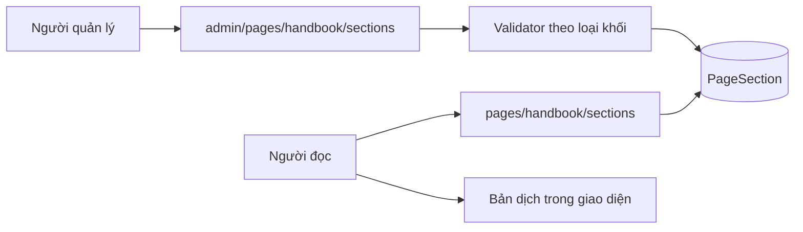
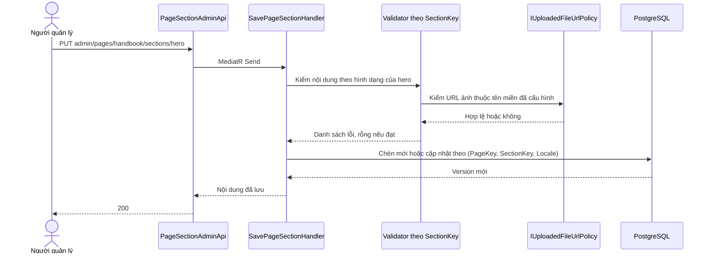
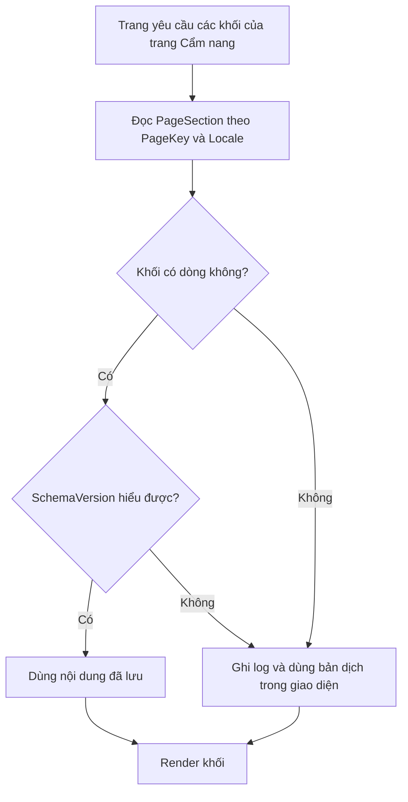
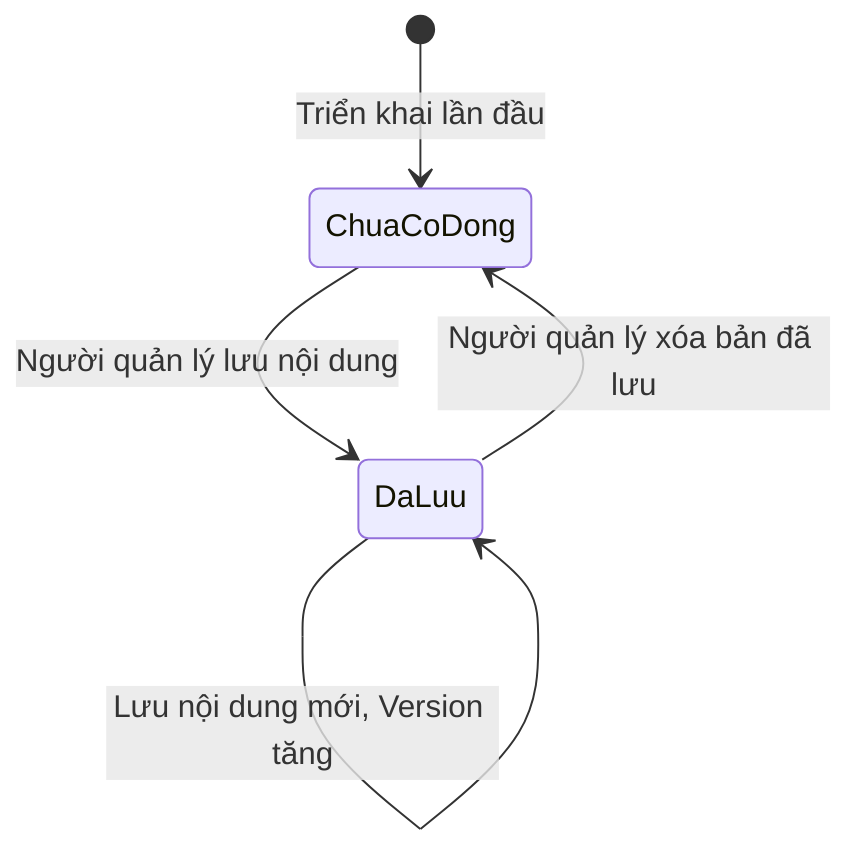
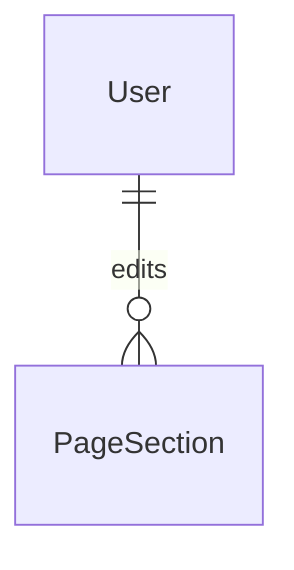

<!-- HƯỚNG DẪN CHO AI KHI ĐIỀN HOẶC CHỈNH SỬA MẪU
- Đọc toàn bộ mẫu, các comment hướng dẫn và tài liệu nguồn được cung cấp trước khi viết. Tuân thủ các quy tắc nghiệp vụ, điều kiện, ngoại lệ và giới hạn đã được xác nhận.
- Không bịa, tự chế hoặc suy đoán thành sự thật: yêu cầu, quy tắc, số liệu, API, schema, mã lỗi, nguồn tham khảo, người phụ trách và kết quả kiểm thử phải có căn cứ. Nội dung ví dụ trong mẫu không phải dữ kiện của dự án.
- Khi thiếu thông tin hoặc các nguồn mâu thuẫn, hỏi người dùng để làm rõ; giữ nguyên placeholder ở phần chưa xác định. Không tự chọn đáp án, lấp chỗ trống hay tuyên bố tài liệu đã hoàn tất.
- Chỉ thay nội dung cần điền hoặc được yêu cầu sửa. Không tự mở rộng phạm vi, sửa nghĩa quy tắc, bỏ điều kiện/ngoại lệ, xoá hay ghi đè nội dung hợp lệ đã có.
- Giữ nguyên tên, cấp và thứ tự heading, nhãn in đậm, tiền tố bullet, cấu trúc danh sách, tên/thứ tự/số cột bảng và cú pháp code fence. Không dịch, đổi tên, gộp hoặc thêm mục ngoài cấu trúc mẫu.
- Chỉ lặp khối luồng, AC hoặc API theo đúng khuôn khi có căn cứ; chỉ bỏ phần tuỳ chọn khi hướng dẫn riêng của mẫu cho phép và đã xác định không áp dụng.
- Mã tham chiếu và section phải trỏ tới tài liệu có thật đã được cung cấp hoặc kiểm chứng. Không giữ mã ví dụ như tham chiếu thật và không tự tạo tài liệu liên quan để hợp thức hoá liên kết.
- Giữ các comment hướng dẫn trong file. Xuất Markdown UTF-8, mỗi file một tài liệu; không bọc toàn bộ file trong code fence, không chèn lời dẫn hay giải thích ngoài mẫu.
- Trước khi bàn giao, đối chiếu nội dung với nguồn, kiểm tra cấu trúc, giá trị cho phép, giới hạn độ dài và tính nhất quán của mã/tham chiếu. Báo rõ phần chưa đủ thông tin; không tuyên bố đã chạy test hoặc import khi chưa thực hiện.
-->

<!-- Thay mã TDD-001 và nội dung ví dụ; giữ nguyên heading và nhãn in đậm.
Sơ đồ dùng mermaid, plantuml hoặc URL. Giữ heading Architecture, Sequence Diagram, Activity Diagram, State Diagram, Data Model.
Ví dụ API phải có heading trùng METHOD /path trong Endpoints. Xoá phần API/sơ đồ không dùng.
Version, Updated At và Change Log do lịch sử phiên bản quản lý, để trống khi nhập mới.
Author/Reviewer là tên hiển thị; gán tài khoản, phê duyệt, giả định và câu hỏi mở trên giao diện sau import.
Thiết kế phải truy vết về Story và Business Rule được cung cấp. Phân biệt thiết kế đề xuất với implementation đã kiểm chứng; không mô tả API/schema/sơ đồ ví dụ như hệ thống thật hoặc tự quyết định nghiệp vụ còn thiếu.
BẮT BUỘC KHI HOÀN THIỆN MẪU: phải có cả Reviewer và Approver, mỗi tên 1–200 ký tự sau khi bỏ khoảng trắng đầu/cuối. Không xoá hai dòng metadata, để trống, dùng tên bịa hoặc giữ placeholder rồi coi là hoàn tất.
Nếu chưa biết người review hoặc người phê duyệt, phải hỏi người dùng và báo tài liệu chưa đủ thông tin; không tự lấy Author/Owner làm người thay thế. Tên trong file không tự gán tài khoản hoặc xác nhận đã duyệt; gán thành viên trên giao diện sau import.
Đây là yêu cầu hoàn thiện mẫu; backend hiện vẫn nhận file cũ thiếu hai trường để tương thích.

VALIDATION CHO FILE NHẬP (đối chiếu ImportSnapshotValidator, MarkdownParser và ImportService):
- Mỗi file .md UTF-8 không rỗng chỉ có một heading cấp 1 chứa mã tài liệu dài 1–100 ký tự. Mã không được trùng trong cùng lần nhập hoặc thuộc loại tài liệu khác đã tồn tại.
- Không dùng tên README.md hoặc sitemap.md vì importer bỏ qua. Giao diện nhận .md/.zip, tối đa 2.000 file, tổng file tải lên 31 MiB; API giới hạn request 32 MiB và tổng nội dung đọc/giải nén 64 MiB.
- Chỉ nhập đè tài liệu cùng loại đang Draft, chưa có phiên bản và chưa lưu trữ. Import thay toàn bộ nội dung bản nháp, vì vậy phải giữ lại nội dung hợp lệ ngoài phần được yêu cầu sửa.
- Không dùng Status trong Markdown hoặc tên Approver để tự xác nhận phê duyệt; import không cấp quyền hay gán tài khoản từ tên. Chạy Kiểm tra file và xử lý lỗi/cảnh báo trước khi nhập.
- Giới hạn độ dài bên dưới tính theo string.Length của .NET (đơn vị UTF-16); không tự cắt ngắn dữ kiện quan trọng để vượt validation, hãy viết lại có căn cứ hoặc hỏi người dùng.
- Feature tối đa 300 ký tự và được dùng làm tiêu đề tài liệu. Status được parser nhận: Draft / In Review / Approved / Deprecated; tài liệu nhập mới vẫn có trạng thái phê duyệt Draft.
- Endpoint: đường dẫn tối đa 500 ký tự; tên/mô tả endpoint được lưu trong Name tối đa 300. HTTP method: GET / POST / PUT / PATCH / DELETE / HEAD / OPTIONS.
- Error Codes: mã tối đa 100 ký tự, không trùng trong tài liệu; giữ dạng - **CODE** (400): mô tả. HTTP status trong Error Codes và Response phải là số nguyên đọc được bằng Int32; không tự đặt status khác hợp đồng API.
- URL sơ đồ tối đa 1.000 ký tự. Mục sơ đồ được sử dụng phải có khối mermaid/plantuml hoặc URL theo mẫu; không để một mục sơ đồ rỗng. Nhãn mục được tách từ bullet như tên External API Fields tối đa 300 ký tự.
- Heading Examples phải khớp METHOD /path ở Endpoints. Giữ các nhãn Request:, Response 200: (thay mã theo contract) và Error Response: để parser tách đúng dữ liệu.
- Tham chiếu dạng DOC-KEY/section: ghi chú: mã đích tối đa 100 ký tự, section tối đa 100, ghi chú tối đa 1.000. Không trùng bộ mã đích + section + loại liên kết trong cùng tài liệu.
ĐỐI CHIẾU FORM TDD (src/features/tdds/validations.ts; form có thể chặt hơn import):
- Điền Feature, Author, Reviewer, Problem và ít nhất một Goal; các Goal/Non-goal/Notes đã thêm không được rỗng. API đã khai báo phải có endpoint và mô tả/mục đích; Fields phải có tên và ý nghĩa; Error Codes phải có mã, HTTP status và điều kiện.
- Form còn kiểm tra Version, Updated At và nội dung Change Log khi khai báo; với file nhập mới, giữ các trường lịch sử này trống theo hợp đồng import, không tự tạo dữ liệu lịch sử.
-->

# TDD-HB-003

## Document Info

- **Feature**: Cẩm nang — nội dung chữ cố định của trang
- **Author**: Claude
- **Reviewer**: Tân Trần
- **Approver**: Tân Trần
- **Status**: Draft
- **Version**:
- **Updated At**:

## Context & Goals

### Problem

STORY-HB-004 và BR-HB-003 đã được người dùng chốt ngày 07/10/2026. Các câu chữ cố định của trang Cẩm nang — phần mở đầu, tiêu đề nhóm ba bước, tiêu đề và mô tả khối bài viết, tiêu đề khối Bản tin — hiện nằm trong mã frontend, nên đổi một dòng chữ cũng phải triển khai lại.

Mỗi khối có hình dạng khác nhau: phần mở đầu có dòng nhãn, tiêu đề, mô tả, chữ trên nút và ảnh nền (tùy chọn); tiêu đề khối Bản tin chỉ có một dòng chữ. Nếu mỗi khối một bảng thì thêm khối nào cũng phải migration, quá nặng cho một trang tiếp thị.

### Goals

- Lưu nội dung các khối chữ theo trang, theo khối và theo ngôn ngữ, sửa được từ quản trị.
- Thêm khối mới không phải đổi cấu trúc cơ sở dữ liệu.
- Giữ chữ hiển thị đầy đủ cả khi khối chưa từng được sửa.

### Non-goals

- Quản lý nội dung cho các trang khác ngoài Cẩm nang.
- Lịch sử sửa, bản nháp và hẹn giờ xuất bản cho khối chữ.
- Kéo thả để thêm, xóa hoặc đổi thứ tự khối trên trang.

## Architecture

- **Carter endpoint** `PageSectionApi` (công khai) và `PageSectionAdminApi` (cần `news.manage`).
- **Handler MediatR** cùng một bộ validator, mỗi loại khối một validator.
- **Bảng mới `PageSection`** với cột nội dung kiểu `jsonb`.



**Kỹ thuật 1 — Nội dung dạng jsonb với validator riêng cho từng loại khối.**

`jsonb` là kiểu dữ liệu JSON đã phân tích sẵn của PostgreSQL. Dùng nó nghĩa là mỗi khối tự mang hình dạng riêng mà bảng không cần biết trước, nên thêm khối mới chỉ là thêm một dòng và một validator, không phải migration.

Dự án đã dùng cách này ở tám chỗ, kèm đúng kiểu CHECK được dùng ở đây (`QuotationConfigurations.cs:46`, `EstimateGenerationConfigurations.cs:20`), nên không phải mô hình mới với đội.

Hình dạng của từng khối được khai báo trong `PageSectionCatalog`: trường chữ bắt buộc, trường chữ tùy chọn và trường ảnh. Trường ảnh luôn tùy chọn: bỏ trống thì giao diện dùng ảnh mặc định, nên admin sửa chữ không phải tải ảnh lại. Nút của khối `hero` cuộn xuống ba bước chứ không phải liên kết, nên khối không có trường liên kết; trường lạ bị từ chối thay vì bỏ qua im lặng.

Đánh đổi quan trọng: database chỉ kiểm được "đây là một đối tượng JSON", không kiểm được bên trong có đủ trường hay không. Vì vậy mỗi `SectionKey` có một validator riêng ở tầng ứng dụng, chạy trước khi ghi. Không có validator thì cột `jsonb` sẽ nhận bất cứ thứ gì và lỗi chỉ lộ ra khi người đọc mở trang.

Tình huống: người quản lý gửi khối phần mở đầu thiếu trường tiêu đề. Validator của `hero` trả 422 kèm tên trường thiếu; dòng cũ giữ nguyên.

**Kỹ thuật 2 — `SchemaVersion` để đổi hình dạng khối mà không làm hỏng dữ liệu cũ.**

Mỗi dòng ghi lại hình dạng nội dung của nó theo phiên bản nào. Khi một khối cần thêm trường bắt buộc, code đọc được cả dòng phiên bản cũ lẫn mới và chuyển đổi khi đọc, thay vì phải sửa hàng loạt dữ liệu rồi mới triển khai.

Tình huống: khối phần mở đầu thêm trường ảnh nền thứ hai cho màn hình lớn. Dòng cũ mang `SchemaVersion=1` nên code đọc hiểu là chưa có trường đó và dùng ảnh hiện có; dòng mới ghi `SchemaVersion=2`.

Giới hạn: `SchemaVersion` chỉ hữu ích nếu code thật sự xử lý từng phiên bản. Nếu bỏ qua, cột này chỉ là số vô nghĩa.

**Kỹ thuật 3 — Thiếu dòng là trạng thái hợp lệ, không phải lỗi.**

Khối chưa từng được sửa thì không có dòng nào trong bảng. API công khai trả về đúng các khối đang có; frontend dùng bản dịch sẵn trong `messages/*.json` cho những khối không nhận được. Nhờ vậy trang không bao giờ trống chữ, kể cả ngay sau khi triển khai lần đầu khi bảng hoàn toàn rỗng.

Dự án đã dùng cách này cho dải nhận xét khách hàng, mô tả ở `cms.types.ts:159`: ba trường chữ để trống thì site dùng bản dịch trong `messages/*.json`.

Giới hạn: bản mặc định nằm trong mã frontend nên đổi nó vẫn phải triển khai lại. Đây là bản dự phòng, không phải nơi biên tập.

**Notes**:
- Bảng đặt tên `PageSection` chứ không gắn chữ Handbook, vì cấu trúc trang–khối–ngôn ngữ dùng lại được cho trang khác. Lần này chỉ khai báo các khối của trang Cẩm nang; không tạo sẵn dòng cho trang chưa có yêu cầu.
- Ảnh trong nội dung khối đi qua cùng `IUploadedFileUrlPolicy` đang dùng cho ảnh bài viết. Validator của từng loại khối gọi policy đó cho mọi trường chứa URL ảnh.
- Không thêm mã quyền mới; dùng `news.manage` theo quyết định ngày 07/10/2026.

## Sequence Diagram

Người quản lý sửa khối phần mở đầu.



## Activity Diagram

Dựng chữ cho một khối khi người đọc mở trang.



## State Diagram

Vòng đời nội dung của một khối.



Ở cả hai trạng thái, trang công khai đều hiển thị đầy đủ chữ: `DaLuu` dùng nội dung trong database, `ChuaCoDong` dùng bản dịch trong giao diện.

## Data Model

### Bảng mới `PageSection`

Mỗi dòng là **nội dung của một khối trên một trang, ở một ngôn ngữ**. Dòng được tạo lần đầu khi người quản lý lưu khối đó, và bị xóa khi họ muốn quay về bản mặc định. Không có dòng nghĩa là khối chưa được biên tập, không phải dữ liệu thiếu.

| Cột | Kiểu và ràng buộc |
| --- | --- |
| Id | uuid PK |
| PageKey | varchar(64) NN |
| SectionKey | varchar(64) NN |
| Locale | varchar(10) NN, CHECK IN ('vi', 'en') |
| Content | jsonb NN, CHECK `jsonb_typeof("Content") = 'object'` |
| SchemaVersion | integer NN DEFAULT 1, CHECK > 0 |
| Version | bigint NN DEFAULT 1, CHECK > 0, concurrency token |
| CreatedBy, ModifiedBy | uuid NN, FK `User` ON DELETE RESTRICT |
| CreatedAtUtc, ModifiedAtUtc | timestamptz NN |

Unique index `UX_PageSection_Page_Section_Locale` trên `(PageKey, SectionKey, Locale)` — mỗi khối có nhiều nhất một bản cho mỗi ngôn ngữ. Index này cũng phục vụ truy vấn đọc cả trang vì `PageKey` là cột trái nhất.

`SectionKey` của trang Cẩm nang: `hero`, `stagesHeading`, `articlesHeading`, `newsletterHeading`. `PageKey` lần này chỉ có `handbook`.

### Quan hệ



Bảng không tham chiếu tới bài viết, danh mục hay bước. Nội dung khối là chữ của trang, độc lập với dữ liệu nghiệp vụ.

### Dữ liệu mẫu

Dữ liệu giả định, lược cột audit, dùng bí danh cho UUID; không phải dữ liệu production. A là một `User` có sẵn, T1 = `2026-10-07T02:00:00Z`.

| Bảng | Dòng dữ liệu |
| --- | --- |
| PageSection | P1: PageKey='handbook', SectionKey='hero', Locale='vi', SchemaVersion=1, Version=1, Content như dưới. |
| PageSection | P2: PageKey='handbook', SectionKey='stagesHeading', Locale='vi', SchemaVersion=1, Version=1, Content={"title": "3 nội dung quan trọng trong quá trình xây nhà"}. |

Nội dung của P1:

```
{"eyebrow": "CẨM NANG BUILDX",
 "title": "Hiểu rõ từng bước xây nhà",
 "description": "Từ phần thô đến hoàn thiện, khám phá kiến thức giúp bạn chủ động hơn với công trình của mình.",
 "ctaLabel": "Khám phá cẩm nang",
 "backgroundImageUrl": "https://images.example.test/handbook/hero.webp"}
```

Hai khối còn lại của trang, `articlesHeading` và `newsletterHeading`, **chưa có dòng nào**. Người đọc mở trang vẫn thấy đủ chữ vì frontend dùng bản dịch trong `messages/vi.json` cho hai khối đó.

Mở trang ở ngôn ngữ `en`: không dòng nào khớp `Locale='en'`, nên cả bốn khối dùng bản dịch trong `messages/en.json`. Hệ thống không lấy dòng tiếng Việt để thay.

**Sửa P1** đổi tiêu đề: cùng dòng được cập nhật `Content`, `Version=2`, `ModifiedAtUtc` mới. Không tạo dòng thứ hai và không có lịch sử.

**Xóa P1**: dòng biến mất, khối quay lại dùng bản dịch trong giao diện.

**Nhánh bị từ chối:** gửi nội dung `hero` thiếu `title` bị validator trả 422 và P1 giữ `Version=1`. Gửi `backgroundImageUrl` trỏ ra ngoài tên miền kho ảnh cũng bị từ chối. Gửi một chuỗi JSON không phải đối tượng, ví dụ một mảng, bị CHECK `jsonb_typeof` chặn ở tầng database nếu lọt qua ứng dụng.

**Notes**:
- Migration `PageSections` chỉ tạo một bảng mới, không đụng dữ liệu đang có và không seed dòng nào. Bảng rỗng là trạng thái hợp lệ, nên không cần backfill.
- Không đặt index GIN trên cột `Content`. Hệ thống chỉ đọc khối theo khóa `(PageKey, SectionKey, Locale)`, không tìm kiếm bên trong JSON. Index GIN sẽ tốn ghi mà không phục vụ truy vấn nào.
- Giới hạn độ dài từng trường chữ do validator của mỗi loại khối quy định, không đặt ở cột `jsonb`. Kèm theo, đặt trần kích thước toàn khối để một nội dung bất thường không làm phình dòng; con số cụ thể chưa chốt và cần người dùng quyết định.

## Internal API

### Endpoints

- **GET** `/api/v1/pages/{pageKey}/sections` — công khai, trả các khối đã được biên tập của một trang theo ngôn ngữ.
- **GET** `/api/v1/admin/pages/{pageKey}/sections` — cần `news.manage`, trả thêm `version` và `schemaVersion`.
- **PUT** `/api/v1/admin/pages/{pageKey}/sections/{sectionKey}` — cần `news.manage`, lưu nội dung một khối.
- **DELETE** `/api/v1/admin/pages/{pageKey}/sections/{sectionKey}` — cần `news.manage`, xóa bản đã lưu để quay về bản mặc định.

Ngôn ngữ truyền qua tham số `locale`, mặc định `vi`.

### Examples

#### GET /api/v1/pages/handbook/sections?locale=vi

```
Response 200:
{"isSuccess": true, "value": [
  {"sectionKey": "hero", "schemaVersion": 1,
   "content": {"eyebrow": "CẨM NANG BUILDX",
               "title": "Hiểu rõ từng bước xây nhà",
               "description": "Từ phần thô đến hoàn thiện, khám phá kiến thức giúp bạn chủ động hơn với công trình của mình.",
               "ctaLabel": "Khám phá cẩm nang",
               "backgroundImageUrl": "https://images.example.test/handbook/hero.webp"}},
  {"sectionKey": "stagesHeading", "schemaVersion": 1,
   "content": {"title": "3 nội dung quan trọng trong quá trình xây nhà"}}
]}
```

Các khối không có trong phản hồi là khối chưa được biên tập; frontend dùng bản dịch của mình.

#### PUT /api/v1/admin/pages/handbook/sections/hero

```
Request:
{"locale": "vi",
 "schemaVersion": 1,
 "content": {"eyebrow": "CẨM NANG BUILDX",
             "title": "Hiểu rõ từng bước xây nhà",
             "description": "Từ phần thô đến hoàn thiện...",
             "ctaLabel": "Khám phá cẩm nang",
             "backgroundImageUrl": "https://images.example.test/handbook/hero.webp"},
 "expectedVersion": 1}

Response 200:
{"isSuccess": true, "value": {"sectionKey": "hero", "locale": "vi", "version": 2}}

Error Response:
{"code": "InvalidPageSection"}
```

### Error Codes

- **PageSectionNotFound** (404): `pageKey` hoặc `sectionKey` không nằm trong danh sách khối được khai báo, hoặc xóa một khối chưa có bản lưu.
- **InvalidPageSection** (422): nội dung thiếu trường bắt buộc, sai kiểu, vượt giới hạn độ dài, hoặc chứa URL ảnh ngoài tên miền đã cấu hình.
- **NewsVersionConflict** (409): dùng lại mã hiện có khi `expectedVersion` đã cũ.
- **NewsStorageUnavailable** (503): dùng lại mã hiện có khi chưa cấu hình tên miền kho ảnh.

## External API

### Endpoints

- **Dịch vụ presigned URL (ngoài backend)** — Frontend gọi để xin URL upload rồi tự tải ảnh lên; dịch vụ trả URL ảnh cố định, không hết hạn. Backend không gọi dịch vụ này và không có adapter tới nó.

### Fields

- **backgroundImageUrl và các trường ảnh khác trong nội dung khối** — URL ảnh cố định do frontend gửi cho backend. Phải là URL https thuộc một tên miền trong `UploadedFileOption__AllowedHosts`; không nhận URL upload có chữ ký hoặc URL đọc có hạn. Backend kiểm bằng `IUploadedFileUrlPolicy` sẵn có.

### Error Handling

Lỗi xin URL upload hoặc tải ảnh lên xảy ra giữa frontend và dịch vụ presign; backend không biết tới. Frontend báo lỗi, không gửi URL của ảnh chưa tải lên thành công và cho thử lại. Tải lên xong nhưng lưu thất bại để lại tệp chưa dùng ở kho; backend không tự xóa và chưa có lịch dọn.

### Quirks

- URL ảnh được lưu trực tiếp trong bản ghi. Khi đổi tên miền kho, phải thêm tên miền mới vào `AllowedHosts` trước khi frontend gửi URL mới; dữ liệu cũ vẫn sửa được vì URL đã lưu không bị kiểm lại.
- Mỗi loại khối có tập trường ảnh riêng, nên validator của từng `SectionKey` phải tự gọi policy cho đúng các trường đó; thêm trường ảnh mới mà quên gọi policy sẽ mở một đường lưu URL ngoài tên miền.

## References

### User Stories

- STORY-HB-004

### Business Rules

- BR-HB-003

### Use Cases

### Others

- Tài liệu kỹ thuật: [TDD-NEWS-001](TDD-NEWS-001.md) — quyết định chung về tệp và ảnh, cùng `IUploadedFileUrlPolicy`.

## Change Log
