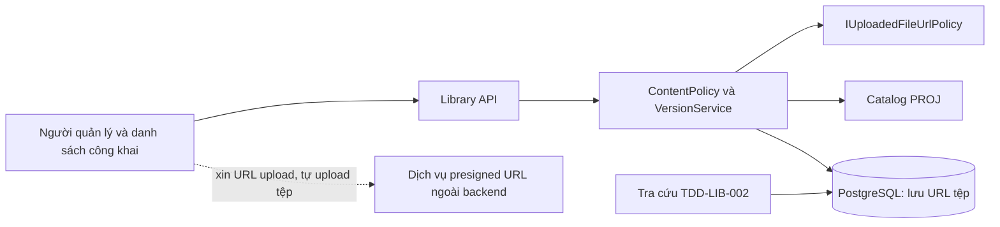
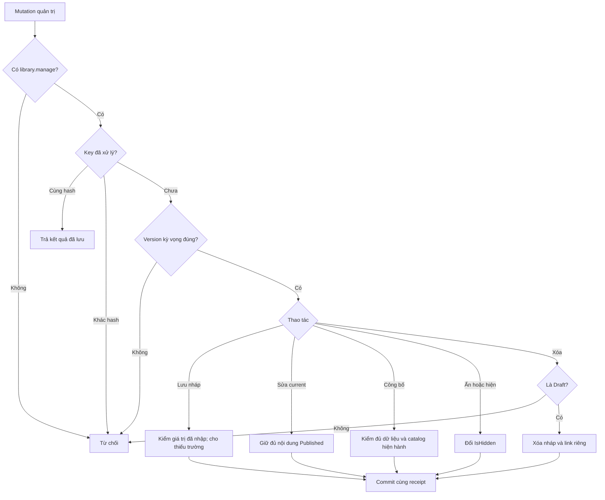
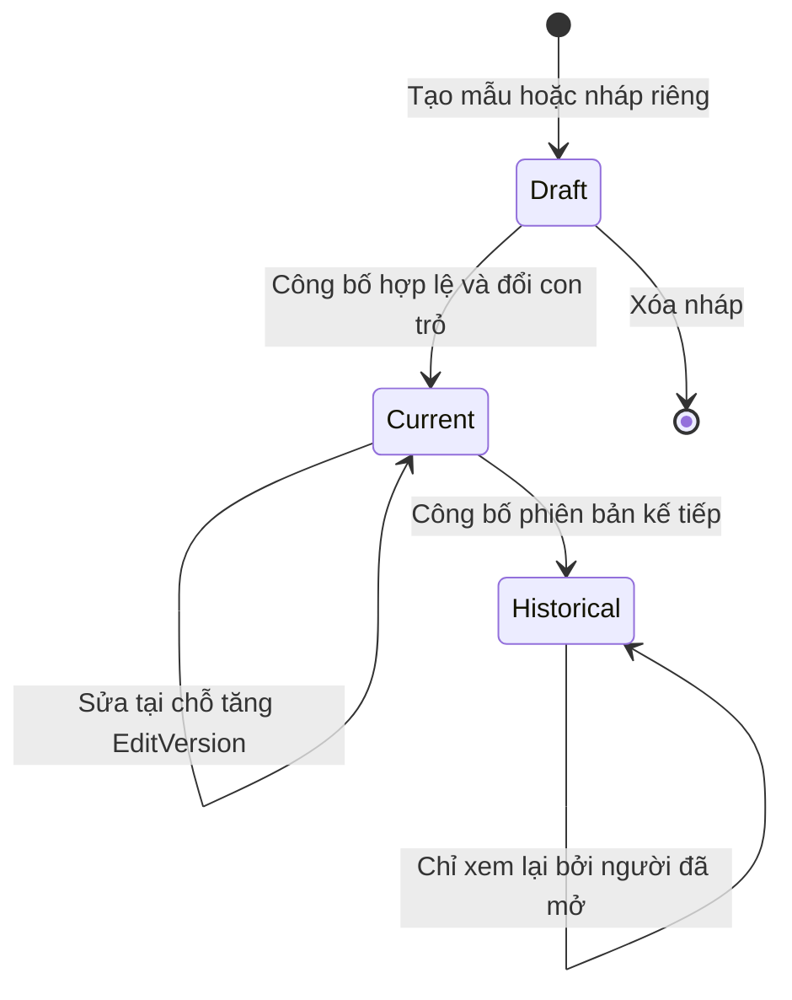
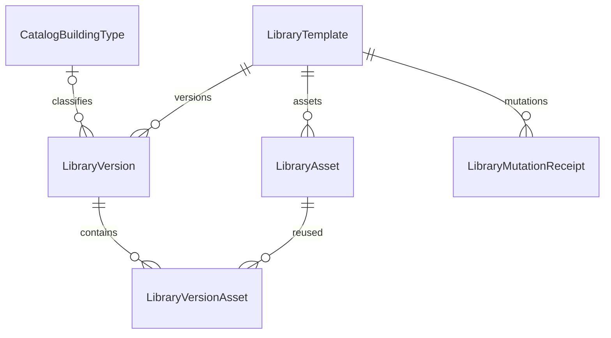

<!-- HƯỚNG DẪN CHO AI KHI ĐIỀN HOẶC CHỈNH SỬA MẪU
- Đọc toàn bộ mẫu, các comment hướng dẫn và tài liệu nguồn được cung cấp trước khi viết. Tuân thủ các quy tắc nghiệp vụ, điều kiện, ngoại lệ và giới hạn đã được xác nhận.
- Không bịa, tự chế hoặc suy đoán thành sự thật: yêu cầu, quy tắc, số liệu, API, schema, mã lỗi, nguồn tham khảo, người phụ trách và kết quả kiểm thử phải có căn cứ. Nội dung ví dụ trong mẫu không phải dữ kiện của dự án.
- Khi thiếu thông tin hoặc các nguồn mâu thuẫn, hỏi người dùng để làm rõ; giữ nguyên placeholder ở phần chưa xác định. Không tự chọn đáp án, lấp chỗ trống hay tuyên bố tài liệu đã hoàn tất.
- Chỉ thay nội dung cần điền hoặc được yêu cầu sửa. Không tự mở rộng phạm vi, sửa nghĩa quy tắc, bỏ điều kiện/ngoại lệ, xoá hay ghi đè nội dung hợp lệ đã có.
- Giữ nguyên tên, cấp và thứ tự heading, nhãn in đậm, tiền tố bullet, cấu trúc danh sách, tên/thứ tự/số cột bảng và cú pháp code fence. Không dịch, đổi tên, gộp hoặc thêm mục ngoài cấu trúc mẫu.
- Chỉ lặp khối luồng, AC hoặc API theo đúng khuôn khi có căn cứ; chỉ bỏ phần tuỳ chọn khi hướng dẫn riêng của mẫu cho phép và đã xác định không áp dụng.
- Mã tham chiếu và section phải trỏ tới tài liệu có thật đã được cung cấp hoặc kiểm chứng. Không giữ mã ví dụ như tham chiếu thật và không tự tạo tài liệu liên quan để hợp thức hoá liên kết.
- Giữ các comment hướng dẫn trong file. Xuất Markdown UTF-8, mỗi file một tài liệu; không bọc toàn bộ file trong code fence, không chèn lời dẫn hay giải thích ngoài mẫu.
- Trước khi bàn giao, đối chiếu nội dung với nguồn, kiểm tra cấu trúc, giá trị cho phép, giới hạn độ dài và tính nhất quán của mã/tham chiếu. Báo rõ phần chưa đủ thông tin; không tuyên bố đã chạy test hoặc import khi chưa thực hiện.
-->

<!-- Thay mã TDD-001 và nội dung ví dụ; giữ nguyên heading và nhãn in đậm.
Sơ đồ dùng mermaid, plantuml hoặc URL. Giữ heading Architecture, Sequence Diagram, Activity Diagram, State Diagram, Data Model.
Ví dụ API phải có heading trùng METHOD /path trong Endpoints. Xoá phần API/sơ đồ không dùng.
Version, Updated At và Change Log do lịch sử phiên bản quản lý, để trống khi nhập mới.
Author/Reviewer là tên hiển thị; gán tài khoản, phê duyệt, giả định và câu hỏi mở trên giao diện sau import.
Thiết kế phải truy vết về Story và Business Rule được cung cấp. Phân biệt thiết kế đề xuất với implementation đã kiểm chứng; không mô tả API/schema/sơ đồ ví dụ như hệ thống thật hoặc tự quyết định nghiệp vụ còn thiếu.
BẮT BUỘC KHI HOÀN THIỆN MẪU: phải có cả Reviewer và Approver, mỗi tên 1–200 ký tự sau khi bỏ khoảng trắng đầu/cuối. Không xoá hai dòng metadata, để trống, dùng tên bịa hoặc giữ placeholder rồi coi là hoàn tất.
Nếu chưa biết người review hoặc người phê duyệt, phải hỏi người dùng và báo tài liệu chưa đủ thông tin; không tự lấy Author/Owner làm người thay thế. Tên trong file không tự gán tài khoản hoặc xác nhận đã duyệt; gán thành viên trên giao diện sau import.
Đây là yêu cầu hoàn thiện mẫu; backend hiện vẫn nhận file cũ thiếu hai trường để tương thích.

VALIDATION CHO FILE NHẬP (đối chiếu ImportSnapshotValidator, MarkdownParser và ImportService):
- Mỗi file .md UTF-8 không rỗng chỉ có một heading cấp 1 chứa mã tài liệu dài 1–100 ký tự. Mã không được trùng trong cùng lần nhập hoặc thuộc loại tài liệu khác đã tồn tại.
- Không dùng tên README.md hoặc sitemap.md vì importer bỏ qua. Giao diện nhận .md/.zip, tối đa 2.000 file, tổng file tải lên 31 MiB; API giới hạn request 32 MiB và tổng nội dung đọc/giải nén 64 MiB.
- Chỉ nhập đè tài liệu cùng loại đang Draft, chưa có phiên bản và chưa lưu trữ. Import thay toàn bộ nội dung bản nháp, vì vậy phải giữ lại nội dung hợp lệ ngoài phần được yêu cầu sửa.
- Không dùng Status trong Markdown hoặc tên Approver để tự xác nhận phê duyệt; import không cấp quyền hay gán tài khoản từ tên. Chạy Kiểm tra file và xử lý lỗi/cảnh báo trước khi nhập.
- Giới hạn độ dài bên dưới tính theo string.Length của .NET (đơn vị UTF-16); không tự cắt ngắn dữ kiện quan trọng để vượt validation, hãy viết lại có căn cứ hoặc hỏi người dùng.
- Feature tối đa 300 ký tự và được dùng làm tiêu đề tài liệu. Status được parser nhận: Draft / In Review / Approved / Deprecated; tài liệu nhập mới vẫn có trạng thái phê duyệt Draft.
- Endpoint: đường dẫn tối đa 500 ký tự; tên/mô tả endpoint được lưu trong Name tối đa 300. HTTP method: GET / POST / PUT / PATCH / DELETE / HEAD / OPTIONS.
- Error Codes: mã tối đa 100 ký tự, không trùng trong tài liệu; giữ dạng - **CODE** (400): mô tả. HTTP status trong Error Codes và Response phải là số nguyên đọc được bằng Int32; không tự đặt status khác hợp đồng API.
- URL sơ đồ tối đa 1.000 ký tự. Mục sơ đồ được sử dụng phải có khối mermaid/plantuml hoặc URL theo mẫu; không để một mục sơ đồ rỗng. Nhãn mục được tách từ bullet như tên External API Fields tối đa 300 ký tự.
- Heading Examples phải khớp METHOD /path ở Endpoints. Giữ các nhãn Request:, Response 200: (thay mã theo contract) và Error Response: để parser tách đúng dữ liệu.
- Tham chiếu dạng DOC-KEY/section: ghi chú: mã đích tối đa 100 ký tự, section tối đa 100, ghi chú tối đa 1.000. Không trùng bộ mã đích + section + loại liên kết trong cùng tài liệu.
ĐỐI CHIẾU FORM TDD (src/features/tdds/validations.ts; form có thể chặt hơn import):
- Điền Feature, Author, Reviewer, Problem và ít nhất một Goal; các Goal/Non-goal/Notes đã thêm không được rỗng. API đã khai báo phải có endpoint và mô tả/mục đích; Fields phải có tên và ý nghĩa; Error Codes phải có mã, HTTP status và điều kiện.
- Form còn kiểm tra Version, Updated At và nội dung Change Log khi khai báo; với file nhập mới, giữ các trường lịch sử này trống theo hợp đồng import, không tự tạo dữ liệu lịch sử.
-->

# TDD-LIB-001

## Document Info

- **Feature**: Quản lý thư viện mẫu — nội dung, bản nháp, phiên bản, danh mục và tìm kiếm
- **Author**: Codex
- **Reviewer**: Tân Trần
- **Approver**: Tân Trần
- **Status**: Draft
- **Version**:
- **Updated At**:

## Context & Goals

### Problem

Người dùng đã chốt STORY-LIB-001–003 và BR-LIB-001–003; có 28 đặc tả ST-LIB-001–028. Việc tách tài liệu không thay nghiệp vụ, schema hoặc API đã đề xuất. Đây là thiết kế để chốt, chưa phải implementation hoặc kết quả kiểm thử.

Tài liệu này sở hữu năm bảng nội dung/quản trị và các API quản lý, danh sách công khai. Quyền xem, tính lượt, lịch sử và tải nội dung bảo vệ nằm ở [TDD-LIB-002](TDD-LIB-002.md).

### Goals

- Lưu nháp thiếu dữ liệu, kiểm đủ trước công bố.
- Sửa tại chỗ giữ VersionId; công bố mới giữ nguyên phiên bản cũ.
- Dùng chung catalog PROJ và phục vụ tìm/lọc công khai.

### Non-goals

- Không thiết kế lại quota hoặc LibraryAccess; tham chiếu TDD-LIB-002.
- Không yêu thích, xoay 3D, tìm kích thước, phân công mẫu, sửa bản đã thay thế hoặc xóa bản đã công bố.
- Chưa triển khai code/migration hoặc viết mã test. Đặc tả Unit Test UT-LIB-001–032 đã có nhưng chưa thực thi.
- Backend không làm kho tệp: không nhận bytes, không tạo presigned URL, không tải tệp về để kiểm nội dung và không tạo ảnh thu nhỏ. Frontend upload tệp qua dịch vụ presigned URL rồi gửi URL; backend chỉ lưu URL (quyết định ngày 26/09/2026, cùng quy ước với TDD-PROJ-001).

## Architecture

**Hiện trạng đã xác minh**

Backend là .NET 8, EF Core/Npgsql 8; compose dùng PostgreSQL 15. `ApplicationDbContext` có User và các bảng nền RBAC, chưa có bảng LIB, catalog PROJ hay subscription trong DbContext được đọc. Không có tenant filter. Các port/tên lớp mới trong tài liệu là đề xuất, không khẳng định đã tồn tại.

Kiểm tra lại ngày 26/09/2026 trên `develop` tại `9c7b147`: chưa có code LIB. Code đã có phần lưu URL tệp của dự toán mà LIB dùng lại: option `UploadedFileOption` (`src/bmt-be.application/dependencyInjection/options/UploadedFileOption.cs`, biến `UploadedFileOption__AllowedHosts__0`, `__1`…), interface `IUploadedFileUrlPolicy` và lớp `UploadedFileUrlPolicy` (`src/bmt-be.application/services/UploadedFileUrlPolicy.cs`). `Check(url)` trả `NotConfigured` khi danh sách tên miền rỗng, `HostNotAllowed` khi URL không phải https tuyệt đối, có thông tin đăng nhập, có cổng khác mặc định hoặc tên máy chủ không khớp chính xác một phần tử của danh sách, và `Allowed` khi hợp lệ. Lớp này không gọi HTTP tới URL.

`TransactionPipelineBehavior` commit khi handler trả về bình thường, kể cả Result.Failure. Generic `ICommand<T>` không kế thừa marker `ICommand`; command ghi mới phải đặt hậu tố Command hoặc hiện thực `ITransactionalRequest`. `IUnitOfWork` hiện đăng ký transient: phải đổi scoped để LIB và dịch vụ quota dùng cùng DbContext/transaction. Sau khi bắt đầu ghi, lỗi phải ném exception để rollback, không trả Result.Failure rồi để pipeline commit. Không mở transaction lồng. Quy ước tương ứng đã có trong TDD-PROJ-001.

**Phân chia trách nhiệm**

| Thành phần dự kiến | Trách nhiệm |
|---|---|
| LibraryApi, AdminLibraryApi | Carter routes, policy, DTO; không tự tính quota. Chống CSRF do lớp dùng chung ở [TDD-AUTH-001](TDD-AUTH-001.md) đảm nhận. |
| LibraryContentPolicy | Kiểm tên, kích thước, ảnh đại diện, phân loại và điều kiện công bố. Không kiểm định dạng hay dung lượng tệp; phần này do frontend kiểm (xác nhận ngày 26/09/2026). |
| LibraryVersionService | Sửa tại chỗ, nháp riêng, công bố, ẩn/hiện, xóa nháp; kiểm version chống ghi đè. |
| ILibraryCatalogReader | Đọc cùng EstimateCatalog/CatalogBuildingType/CatalogFloor của PROJ; trả revision và lựa chọn hợp lệ. Không có bản sao danh mục LIB. |
| IUploadedFileUrlPolicy (đã có trong code) | Kiểm URL tệp mới là https và thuộc tên miền kho presign trong `UploadedFileOption__AllowedHosts`; dùng chung với PROJ, không tạo bản kiểm URL thứ hai cho LIB. |



**Quyền và biên dữ liệu**

Mã quyền `library.manage` là quyền quản lý thư viện mẫu đã chốt tên theo STORY-RBAC-001/Preconditions, RequiresAssignment=false, seed cho vai trò hệ thống Admin; các vai trò khác được cấp bằng RBAC hiện có. Policy kiểm theo mã quyền này, không kiểm tên vai trò "Admin" (BR-RBAC-001, BR-RBAC-011); thiếu quyền trả 403 và không ghi dữ liệu nghiệp vụ. Bổ sung cả PermissionNames, migration seed và policy registry để PermissionCatalogGuard không từ chối khởi động. Quyền này khác quyền lợi gói `catalog.detail`: một bên là quản trị, một bên là quyền khách mở mẫu mới. Không tái dùng `assignment.manage` hoặc bắt phân công nhân viên vào mẫu.

Mutation dùng cookie được kiểm Origin theo [TDD-AUTH-001](TDD-AUTH-001.md), không dùng CORS thay CSRF. Endpoint công khai chỉ trả summary và ảnh đại diện của phiên bản hiện hành không ẩn. Endpoint thumbnail kiểm lại current/visibility trước khi phục vụ ảnh. Tệp vẫn nằm ở URL công khai, cố định của kho presign, nên người đã biết URL gốc vẫn mở được sau khi mẫu bị ẩn hoặc ảnh bị thay; backend không thu hồi được URL đó. Người dùng xác nhận ngày 26/09/2026: API không trả URL gốc cho khách; nội dung được bảo vệ và thumbnail do backend chuyển tiếp tệp ([TDD-LIB-002/Architecture](TDD-LIB-002.md#architecture)). Ảnh đã tải xuống trước đó không thể thu hồi khỏi máy khách.

Preview quản trị và các route đọc nội dung bảo vệ theo TDD-LIB-002/Internal API; quyền library.manage không tạo lịch sử khách hoặc dùng lượt.

**Mẫu, phiên bản và lần sửa**

`LibraryTemplate` là định danh mẫu, giữ con trỏ CurrentVersionId và IsHidden. `LibraryVersion` là phiên bản tính lượt. `EditVersion` là số kiểm soát sửa đồng thời, không phải phiên bản tính lượt. Mỗi lần sửa metadata, ảnh, thứ tự, cover hoặc file tăng EditVersion của cùng VersionId. Khi V1 được sửa, quyền xem V1 giữ nguyên và nội dung đọc mới phản ánh sửa đó.

Phiên bản có State Draft hoặc Published. Phiên bản cũ là Published nhưng không còn được CurrentVersionId trỏ tới; không lưu thêm trạng thái Superseded để tránh lệch hai nguồn. Number được cấp lúc công bố bằng max Number đã công bố + 1 dưới khóa Template. Nháp có Number/PublishedAtUtc NULL. Có thể có nhiều nháp kỹ thuật; công bố phải gửi expectedCurrentVersionId nên nháp dựa trên bản cũ không tự ghi đè bản mới. Không tự thêm luồng gộp nháp. BaseVersionId là dấu nguồn sao chép, không bị so bằng current mỗi lần công bố: Admin có thể xem xét một nháp cũ rồi gửi expectedCurrentVersionId hiện hành, nhưng server không tự đổi giá trị kỳ vọng thay khách.

Tạo nháp từ current sao chép metadata và các dòng liên kết tài nguyên; mỗi LibraryAsset (một URL tệp) được dùng chung bằng AssetId, không lặp URL. Thay tệp luôn là thêm LibraryAsset mới với URL mới; backend không sửa URL của asset đang được bản khác tham chiếu. Khi công bố, dữ liệu nháp phải đủ, phân loại phải hợp lệ theo catalog hiện hành. Transaction đổi con trỏ và chuyển Draft sang Published. Bản trước không còn sửa được, kể cả API trực tiếp.

Ẩn/hiện chỉ đổi Template.IsHidden, không thay phiên bản, lượt hoặc quyền xem. Mẫu chưa công bố không xuất hiện dù IsHidden=false. Xóa nháp xóa các liên kết của riêng nháp; không xóa dòng LibraryAsset, tệp ở kho presign hoặc template identity dùng bởi lịch sử/receipt. Công bố không tự đảo IsHidden; mẫu đang ẩn tiếp tục ẩn tới khi người quản lý chọn Hiện lại.

**Dùng chung catalog mà vẫn giữ phân loại cũ**

Version lưu CatalogRevisionId, BuildingTypeId, FloorCount, HasTum. Tên và cờ lấy từ revision đã ghim, không sao chép tên vào bảng LIB. Nullable HasTum phân biệt false=Không tum và NULL=Không áp dụng/nháp chưa nhập. Cờ từ catalog phân biệt hai nghĩa NULL này.

Sửa tên/ảnh/file không đổi revision phân loại. Nếu đổi bất kỳ trường phân loại nào, revalidate toàn bộ bộ loại/tầng/tum theo current catalog và ghim revision mới trong cùng transaction. Công bố nháp luôn revalidate và ghim current revision, kể cả khi được sao từ bản cũ. Phần tầng dùng đúng FloorCount của PROJ: 1 là trệt, 3 là tổng ba tầng; nhãn phải thống nhất với catalog, không tự cộng thêm một tầng hoặc tính tum thành tầng.

Bộ lọc dùng UNION DISTINCT của lựa chọn catalog hiện hành và phân loại trên các phiên bản current công khai. Lọc tầng giới hạn theo BuildingTypeId khi được chọn. Tầng cũ chỉ được thêm vào filter vì đang có mẫu public, không trở lại thành lựa chọn hợp lệ cho công bố mới. Mẫu ẩn, nháp và phiên bản lịch sử không làm xuất hiện giá trị filter. Tên loại trên từng mẫu dùng revision của mẫu; nhãn bộ lọc ưu tiên tên current của cùng định danh.

**Khóa và ranh giới với tra cứu**

Mutation quản trị khóa User người thao tác FOR UPDATE → EstimateCatalog FOR SHARE khi revalidate → Template FOR UPDATE → Version theo Id tăng dần. Ghi content, con trỏ và receipt cùng transaction; frontend upload tệp lên kho presign trước, ngoài backend. Không lấy khóa tài khoản khách/quota sau Template. Quy tắc khóa phối hợp đầy đủ và xử lý mở khi nội dung đổi được định nghĩa một lần tại [TDD-LIB-002/Architecture](TDD-LIB-002.md#architecture).

**Upload và tài nguyên**

Backend không nhận bytes tệp. Theo quyết định ngày 26/09/2026 (cùng quy ước ở TDD-PROJ-001/Architecture, ghi chú "URL ảnh thuộc kho presign"), mỗi tệp đi theo ba bước:

1. Frontend kiểm định dạng và dung lượng tệp theo BR-LIB-001 khoản 2 (ảnh JPG/PNG/WebP; tệp đính kèm PDF/DWG/DXF), xin URL upload từ dịch vụ presigned URL rồi tự upload tệp lên đó. Dịch vụ này nằm ngoài backend.
2. Frontend gửi `POST .../assets` với `{kind, url, originalName, mediaType, sizeBytes}` của tệp vừa upload.
3. Backend chỉ kiểm URL bằng `IUploadedFileUrlPolicy` (URL tuyệt đối https, không khoảng trắng, tối đa 2048 ký tự, tên máy chủ thuộc `UploadedFileOption__AllowedHosts`) và `kind` là Image hoặc Attachment, rồi tạo một dòng LibraryAsset trong transaction ngắn. Backend không kiểm `mediaType`, phần mở rộng của `originalName` hay `sizeBytes` so với định dạng và dung lượng cho phép. Danh sách tên miền rỗng thì trả 503 `LibraryStorageUnavailable`, không lưu URL.

Ví dụ: ảnh `mat-bang.jpg` được upload lên `https://cdn.example.test/lib/m1/mat-bang.jpg`. Với `UploadedFileOption__AllowedHosts__0=cdn.example.test`, backend tạo F1 với Kind=Image, MediaType=image/jpeg. Cùng yêu cầu nhưng URL `https://other.example.test/mat-bang.jpg` hoặc `http://cdn.example.test/mat-bang.jpg` bị trả 422 `UnsupportedLibraryFile`, không tạo dòng. Một ảnh `.gif` bị frontend từ chối trước khi upload; nếu request gửi thẳng API với URL đúng tên miền thì backend vẫn nhận.

Người dùng xác nhận ngày 26/09/2026: định dạng và dung lượng tệp mẫu (BR-LIB-001 khoản 2) do frontend kiểm, như PROJ (TDD-PROJ-001); backend chỉ kiểm URL. Backend không tải tệp về, nên request gửi thẳng API với URL đúng tên miền nhưng trỏ tới tệp sai định dạng sẽ không bị chặn; đây là hệ quả đã được chấp nhận. `originalName`, `mediaType` và `sizeBytes` do frontend khai, chỉ dùng để hiển thị và đặt tên, `Content-Type` khi chuyển tiếp tệp; backend không xác minh. Backend không tạo ảnh thu nhỏ; ảnh đại diện dùng chính tệp ảnh cover. PDF/CAD là tệp tải về, không render trên server.

Tạo LibraryAsset không tự gắn vào phiên bản; attach là transaction riêng kiểm quyền, TemplateId và expectedEditVersion. Upload lỗi thì frontend không gọi API, lưu hoặc attach lỗi thì transaction rollback; nội dung cũ giữ nguyên. Tệp đã upload mà không được lưu hoặc gắn có thể còn nằm ở kho presign; backend không xóa tệp ở kho, việc dọn tệp không còn được tham chiếu thuộc dịch vụ lưu trữ.

Không đặt số ảnh/tệp tối đa trong validator (BR-LIB-001 khoản 2). Giới hạn dung lượng và thời gian upload giờ là của dịch vụ presigned URL, không phải của API backend; phải làm rõ với bên cung cấp dịch vụ và không mô tả “không giới hạn” là năng lực vật lý vô hạn.

URL đã lưu của LibraryAsset không bị sửa là hợp đồng đầu vào cho luồng tải tài nguyên có quyền tại TDD-LIB-002. Thumbnail công khai chỉ phục vụ cover current không ẩn.

**Phạm vi thay đổi mã khi được giao triển khai**

- Thêm DTO/validator tại `contract/services/library/`, command/query handler tại `application/usecases/.../library/`, Carter routes tại `presentation/apis/library/` và entity/config tại domain/persistence.
- Thêm các port đã nêu vào application/abstractions; catalog adapter đọc schema PROJ, quota adapter ghi schema SUB. Dùng lại `IUploadedFileUrlPolicy` và `UploadedFileOption` đã có, không thêm storage adapter. Không cho LIB cập nhật catalog hoặc cấu hình gói trực tiếp.
- Bổ sung permission/policy registry/seed và UoW scoped; chống CSRF đã có ở lớp chung ([TDD-AUTH-001](TDD-AUTH-001.md)). Hồi quy auth và gói/lượt sau thay đổi nền tảng.
- Thứ tự triển khai: nền RBAC/UoW → catalog và SUB cốt lõi → metadata/nháp/assets → công bố/danh sách → quyền xem/quota/history → tích hợp tải tệp và kiểm thử lỗi. Chưa giao triển khai trong tác vụ thiết kế này.

Chi tiết triển khai nội dung/quản trị thuộc tài liệu này; bước quota/history và tải có quyền thuộc TDD-LIB-002.

**Nơi thực hiện quy tắc và kiểm chứng**

| Quy tắc | Nơi thực hiện | Đặc tả hệ thống | Đặc tả Unit Test |
|---|---|---|---|
| BR-LIB-001: nội dung, kích thước, file | Validator, LibraryContentPolicy, `IUploadedFileUrlPolicy` và CHECK; định dạng và dung lượng tệp kiểm ở frontend, backend chỉ kiểm URL | ST-LIB-001–005 | UT-LIB-001–005, UT-LIB-009–011, UT-LIB-025 |
| BR-LIB-001: catalog và filter | ILibraryCatalogReader, FKs ghép, query projections | ST-LIB-010, ST-LIB-012–016 | UT-LIB-006–008, UT-LIB-028–032 |
| BR-LIB-002: sửa/công bố/ẩn/xóa | VersionService, mutex Template, receipt, state guard | ST-LIB-006–009, ST-LIB-011 | UT-LIB-012–024, UT-LIB-026–027 |

Đặc tả UT-LIB-001–032 kiểm validator, policy, service quản trị, receipt, thứ tự gọi khóa và truy vấn công khai ở biên unit; chưa có mã test hoặc kết quả chạy. Không dùng mock để kết luận mutex/UNIQUE/rollback đúng. Integration dùng PostgreSQL 15 thật và hai connection cho lượt cuối, cùng phiên bản, đổi kỳ, sửa/công bố chen lúc mở. Kiểm URL tệp (tên miền, https, độ dài) dùng lại test của `UploadedFileUrlPolicy`; backend không có test định dạng hay dung lượng tệp vì phần này thuộc frontend. Bổ sung thực nghiệm công bố lúc xác nhận và upload lớn qua dịch vụ presign trên môi trường thử; không báo đạt từ việc viết đặc tả.

Đặc tả UT-LIB-009, UT-LIB-010 và UT-LIB-032 đã được viết lại ngày 26/09/2026 theo thiết kế lưu URL: kiểm URL khi thêm tài nguyên, không kiểm định dạng ở backend, và thumbnail chuyển tiếp ảnh cover.

**Notes**:

- Không thêm broker, outbox hoặc database khác. Quota/Access/nội dung cùng PostgreSQL; tệp nằm ở kho presign ngoài backend, backend chỉ lưu URL. [EF Core transactions](https://learn.microsoft.com/en-us/ef/core/saving/transactions).
- Log operationId/accountId/versionId/editVersion, kết quả Granted/Reused/Denied/Conflict, không log token, signed URL hay bytes. Theo dõi lỗi đọc tệp, thời gian chờ khóa, cấp quyền thất bại và lệch Access/UsageOperation; chưa đặt ngưỡng cảnh báo khi chưa có tải thực.
- RPO/RTO của tệp, giới hạn dung lượng upload và việc dọn tệp mồ côi thuộc dịch vụ presigned URL, chưa có số liệu. Backup của backend chỉ gồm URL trong database; cần thống nhất với bên vận hành kho để quyền xem không trỏ tới tệp đã mất trước khi mở production.
- **Đã xác nhận ngày 26/09/2026 (LIB, lưu URL)**: (1) Định dạng và dung lượng ảnh và tệp đính kèm của thư viện mẫu do frontend kiểm, như PROJ; backend chỉ kiểm URL https thuộc `UploadedFileOption__AllowedHosts`. (2) Nội dung được bảo vệ tải qua route backend có kiểm quyền; backend chuyển tiếp tệp, không lộ URL gốc ([TDD-LIB-002/Architecture](TDD-LIB-002.md#architecture)).

## Sequence Diagram

```mermaid
sequenceDiagram
    actor A as Người quản lý
    participant P as Dịch vụ presigned URL
    participant API as AdminLibraryApi
    participant DB as PostgreSQL
    A->>A: Frontend kiểm định dạng và dung lượng tệp
    A->>P: Xin URL upload và tự upload tệp
    P-->>A: URL https cố định của tệp
    A->>API: POST assets với url, kind, originalName, mediaType
    API->>API: Chỉ kiểm URL https thuộc AllowedHosts
    API->>DB: Lưu LibraryAsset bằng giao dịch ngắn
    A->>API: Tạo và chỉnh sửa nháp riêng
    API->>DB: Lưu nháp, link tài nguyên và receipt
    Note over API,DB: Current vẫn phục vụ khách
    A->>API: Publish với expected versions và key
    API->>DB: Khóa actor, catalog, template và version
    alt Dữ liệu thiếu hoặc version xung đột
        API->>DB: Rollback
        API-->>A: Lỗi, current không đổi
    else Hợp lệ
        API->>DB: Publish nháp, đổi current và ghi receipt
        API->>DB: Commit
        API-->>A: Phiên bản mới; bản trước khóa sửa
    end
```

## Activity Diagram



## State Diagram



Current/Historical là trạng thái suy ra từ State=Published và con trỏ Template, không phải hai giá trị State được lưu. IsHidden thuộc Template, không phải trạng thái Version. Quyền Access không hết hạn theo kỳ và không bị gỡ bởi ẩn mẫu.

## Data Model

**Quy ước và bảng dùng lại**

UUID cho định danh; timestamptz/UTC cho thời điểm; PascalCase; NN là NOT NULL. Không dùng soft-delete filter làm mất lịch sử. FK mặc định ON DELETE RESTRICT; chỉ xóa link của nháp trong transaction xóa nháp. Dữ liệu khách ngăn truy cập chéo bằng AccountId, không tự thêm tenant.

Dùng lại User/RBAC theo TDD-RBAC-001; EstimateCatalog, EstimateCatalogRevision, CatalogBuildingType và CatalogFloor theo [TDD-PROJ-001/Data Model](TDD-PROJ-001.md#data-model). Dùng DesignSubscription, DesignPeriod, PeriodQuota, UsageOperation theo [TDD-SUB-002/Data Model](TDD-SUB-002.md#data-model), gồm LifecycleState của TDD-SUB-005. Không sao chép số dư vào LIB.

LibraryAccess và phần mở rộng UsageOperation có nguồn duy nhất tại [TDD-LIB-002/Data Model](TDD-LIB-002.md#data-model); không định nghĩa lại ở đây.

**Ý nghĩa từng bảng**

| Bảng | Một dòng đại diện cho gì; ai ghi; quan hệ |
|---|---|
| LibraryTemplate | Một mẫu ổn định. Người có `library.manage` tạo; CurrentVersionId NULL trước công bố, IsHidden dùng chung cho mẫu. Không lưu tên/kích thước tại đây. |
| LibraryVersion | Một phiên bản nội dung tính lượt, thuộc một Template. Người có `library.manage` sửa khi Draft/current; Published cũ không sửa. Number NULL trước công bố. EditVersion khác Number. |
| LibraryAsset | Một tệp (ảnh hoặc tệp đính kèm) thuộc một Template, lưu bằng URL ở kho presign. Người có `library.manage` tạo sau khi frontend upload xong và backend kiểm URL. URL và metadata không sửa sau khi tạo, dùng lại được giữa các phiên bản cùng mẫu. |
| LibraryVersionAsset | Một liên kết Version–Asset với vị trí hiển thị. Cho phép cùng asset ở nhiều phiên bản; không lặp metadata file. |
| LibraryMutationReceipt | Một mutation quản trị đã commit, dùng nhận diện key gửi lại; lưu hash và kết quả ID/version, không chứa bytes tài nguyên. |

**Cột và ràng buộc**

| Bảng | Cột, khóa và CHECK |
|---|---|
| LibraryTemplate | Id uuid PK; CurrentVersionId uuid NULL; IsHidden boolean NN DEFAULT false; Version bigint NN DEFAULT 1 CHECK>0; CreatedBy uuid NN FK User; CreatedAtUtc timestamptz NN. FK(Id,CurrentVersionId) → LibraryVersion(TemplateId,Id), thêm sau khi tạo bảng; current phải Published do transaction policy. |
| LibraryVersion | Id uuid PK; TemplateId uuid NN FK Template; State varchar(16) NN CHECK Draft/Published; Number bigint NULL; EditVersion bigint NN DEFAULT 1 CHECK>0; BaseVersionId uuid NULL; Name text NULL; Description text NULL; DrawingKind varchar(2) NULL CHECK NULL/2D/3D; WidthM,LengthM,AreaM2 numeric(28,2) NULL CHECK NULL hoặc >0; CatalogRevisionId,BuildingTypeId uuid NULL; FloorCount int NULL CHECK NULL hoặc >=1; HasTum boolean NULL; CoverAssetId uuid NULL; CreatedBy uuid NN FK User; CreatedAtUtc,ModifiedAtUtc timestamptz NN; PublishedAtUtc timestamptz NULL. UNIQUE(TemplateId,Id), UNIQUE(TemplateId,Number). CHECK Draft thì Number/PublishedAtUtc NULL, Published thì Number>0 và PublishedAtUtc NN. |
| LibraryAsset | Id uuid PK; TemplateId uuid NN FK Template; Kind varchar(16) NN CHECK Image/Attachment; Url varchar(2048) NN CHECK bắt đầu bằng `https://` (cùng kiểu CHECK với `CK_CatalogStyle_ImageUrl` của PROJ); OriginalName text NN; MediaType varchar(100) NN; SizeBytes bigint NULL CHECK NULL hoặc >0; CreatedBy uuid NN FK User; CreatedAtUtc timestamptz NN; UNIQUE(TemplateId,Id). Tên miền của Url kiểm ở ứng dụng bằng `IUploadedFileUrlPolicy`, không kiểm bằng CHECK vì danh sách đọc từ cấu hình. OriginalName, MediaType và SizeBytes là dữ liệu frontend khai, backend không xác minh với nội dung tệp. Không có cột khóa kho, ảnh thu nhỏ hay checksum. |
| LibraryVersionAsset | TemplateId uuid NN; VersionId uuid NN; AssetId uuid NN; Position bigint NN CHECK>0; PK(VersionId,AssetId); UNIQUE(VersionId,Position); FK(TemplateId,VersionId) → Version(TemplateId,Id); FK(TemplateId,AssetId) → Asset(TemplateId,Id). |
| LibraryMutationReceipt | Id uuid PK; ActorId uuid NN FK User; Operation varchar(24) NN CHECK Create/Save/Publish/Visibility/DeleteDraft/Attach/Detach/Reorder; RequestKey varchar(100) NN; RequestHash char(64) NN; TemplateId uuid NN FK Template; ResultVersionId uuid NULL; Result jsonb NN; CreatedAtUtc timestamptz NN; UNIQUE(ActorId,Operation,RequestKey). ResultVersionId không FK vì receipt xóa nháp phải còn trả lại được ID đã xóa; không dùng nó để cấp quyền đọc nội dung. |

Ràng buộc bổ sung:

- FK Version(TemplateId,BaseVersionId) → Version(TemplateId,Id), NULL với phiên bản đầu. Base phải là bản đã công bố của cùng mẫu tại thời điểm tạo nháp; kiểm trong handler.
- CatalogRevisionId/BuildingTypeId cùng NULL hoặc cùng có giá trị. FK ghép tới CatalogBuildingType; FK ba cột (CatalogRevisionId,BuildingTypeId,FloorCount) tới CatalogFloor. Chưa có loại thì FloorCount và HasTum NULL. Policy kiểm cờ bật/tắt: trường bị tắt phải để trống; gửi 0 tầng hoặc Không tum cho trường bị tắt bị từ chối 422 InvalidLibraryContent, không tự quy đổi về NULL (BR-LIB-001 khoản 4). Công bố kiểm đủ trường, trim Name có nội dung, cover là Image của phiên bản và có ít nhất một Image.
- FK Version(Id,CoverAssetId) → VersionAsset(VersionId,AssetId), CoverAssetId NULL khi nháp chưa có cover. Tạo version trước với cover NULL, tạo link rồi gán cover trước công bố. Thay cover tạo link mới trước, đổi pointer rồi bỏ link cũ; không cần xóa toàn bộ link bằng SaveChanges một lần tùy ý.
- CHECK Published dùng các điều kiện IS NOT NULL rõ ràng cho các trường bắt buộc, không dựa so sánh với NULL để chặn dữ liệu. CHECK Published yêu cầu Name có nội dung, DrawingKind, cả ba kích thước, catalog/type và cover NN. Chuỗi kiểm whitespace ở domain; không tự đặt max tên/mô tả nghiệp vụ. Giá trị có mặt trong nháp vẫn phải đúng định dạng/miền giá trị. Người dùng đã xác nhận cho lưu nháp thiếu thông tin; chỉ yêu cầu đủ trường trước công bố. NULL biểu diễn thông tin chưa nhập trong Draft, không dùng giá trị 0 hoặc chuỗi rỗng thay cho thiếu dữ liệu.
- Reorder dùng vị trí tạm không trùng trong transaction rồi ghi vị trí đích trước commit; không dựa thứ tự UPDATE của EF để tránh UNIQUE. Có thể đổi hai bước SaveChanges trong cùng UoW, không commit giữa chừng.
- Numeric(28,2) khớp decimal của PROJ: JSON chuỗi, tối đa 26 chữ số phần nguyên và hai chữ số lẻ, không exponent/NaN/Infinity, từ chối thay vì làm tròn; giới hạn biểu diễn không phải trần kích thước nghiệp vụ. [PostgreSQL numeric](https://www.postgresql.org/docs/15/datatype-numeric.html).

**ERD và quan hệ**



Nháp có thể chưa có phân loại; Published bắt buộc có. FK current, cover và base được mô tả ở phần ràng buộc. RESTRICT bảo vệ tài nguyên còn tham chiếu; policy chặn xóa Published ngay cả khi chưa có người xem. Access của TDD-LIB-002 tham chiếu Version và giữ nguyên khi ẩn mẫu.

**Dữ liệu mẫu xuyên suốt**

Dữ liệu giả định, ID bí danh thay uuid, lược cột không liên quan; không phải SQL seed hoặc dữ liệu thật. T1<T2<T3 theo UTC. Catalog C1 có loại B1=Nhà phố, tầng 3, tum bật; C2 chỉ cho tầng 2. U1 là khách, A1 là quản trị. Kỳ DP1/quota Q1 của U1 có Limit=20, Used=0, Reserved=0; schema và dữ liệu kỳ xem TDD-SUB-002/Data Model.

| Bảng | Dòng dữ liệu lưu thực tế (cột chọn lọc) |
|---|---|
| LibraryTemplate | Id=M1; CurrentVersionId=V1; IsHidden=false; Version=2; CreatedBy=A1; CreatedAtUtc=T1. |
| LibraryVersion | Id=V1; TemplateId=M1; State=Published; Number=1; EditVersion=1; BaseVersionId=NULL; Name=Nhà ABC; DrawingKind=2D; WidthM=5; LengthM=20; AreaM2=80; CatalogRevisionId=C1; BuildingTypeId=B1; FloorCount=3; HasTum=true; CoverAssetId=F1; PublishedAtUtc=T1. |
| LibraryAsset | F1/M1/Kind=Image/Url=https://cdn.example.test/lib/m1/mat-bang.jpg/OriginalName=mat-bang.jpg/MediaType=image/jpeg/SizeBytes=120000; F2/M1/Kind=Attachment/Url=https://cdn.example.test/lib/m1/ban-ve.pdf/OriginalName=ban-ve.pdf/MediaType=application/pdf/SizeBytes=240000. Giả định `UploadedFileOption__AllowedHosts__0=cdn.example.test`; tên miền chỉ minh họa. |
| LibraryVersionAsset | M1/V1/F1/Position=1; M1/V1/F2/Position=2. |
| LibraryMutationReceipt | ActorId=A1; Operation=Publish; RequestKey=publish-demo-1; RequestHash=HP1; TemplateId=M1; ResultVersionId=V1; Result={"versionId":"V1","number":1,"templateVersion":2}; CreatedAtUtc=T1. Result minh họa JSON, ID thật là uuid. |

Sau mở đầu tiên, Q1 Used=1 và Access U1/V1 cùng tồn tại; mất mạng rồi mở lại không tạo OP2. A1 sửa tên và thay ảnh F1 bằng F3: V1.EditVersion=2, cover/link trỏ F3; M1.CurrentVersionId vẫn V1. U1 xem lịch sử thấy tên/ảnh mới nhưng Used vẫn 1. F3 là dòng LibraryAsset mới với URL mới, ví dụ https://cdn.example.test/lib/m1/mat-bang-2.jpg; dòng F1 và URL của F1 không bị sửa.

Tạo nháp V2: TemplateId=M1, BaseVersionId=V1, State=Draft, Number/PublishedAtUtc NULL, EditVersion=1; các link sao lại dùng F3/F2. Sửa nháp không đổi V1. Khi công bố ở T3 sau khi catalog thành C2, V2 phải dùng tầng 2 và C2; V1 tiếp tục C1/tầng 3. M1.CurrentVersionId=V2, V2.Number=2, V2.State=Published; V1 không còn sửa được. U1 mở V2 đủ điều kiện tạo OP2 và Access U1/V2, Q1 Used=2; lịch sử có hai dòng. Gói hết hạn hoặc M1.IsHidden=true không xóa hai dòng này.

Lỗi trước commit OP2: quota và Access/operation đều không đổi. Xóa một nháp V3 để lại receipt Operation=DeleteDraft, ResultVersionId=V3; không có FK để receipt ngăn xóa nháp. Nếu kỳ không giới hạn, Used vẫn tăng cho OP1, Limit=NULL; quyền U1/V1 không phụ thuộc Limit về sau.
Các thay đổi lượt trong tình huống trên chỉ giải thích quan hệ; schema và bản ghi Access/UsageOperation minh họa nằm tại TDD-LIB-002/Data Model.

**Chuẩn hóa, chỉ mục và vòng đời**

| Dữ kiện | Nguồn duy nhất, khóa và đánh đổi |
|---|---|
| Nội dung | Phụ thuộc VersionId; tên/kích thước không lặp ở Template, Access hoặc receipt phục vụ đọc. |
| Phân loại | Phụ thuộc revision+type; lưu FK ghim lịch sử, không sao chép tên hiện hành. |
| File | URL và metadata phụ thuộc AssetId; VersionAsset chỉ lưu quan hệ/thứ tự. TemplateId lặp để FK ghép ngăn gắn file mẫu khác, được ràng buộc ở cả hai đầu. |
| Receipt | JSON là kết quả thao tác bất biến để gửi lại, không phải nguồn nội dung hoặc bảng snapshot toàn mẫu. |

Index theo truy vấn: Version(TemplateId,Number) unique; Version(PublishedAtUtc DESC,Id DESC) WHERE State='Published'; Version(DrawingKind,BuildingTypeId,FloorCount,HasTum) WHERE State='Published'; Asset(TemplateId,Id) unique; VersionAsset(VersionId,Position) unique và index AssetId cho tra tham chiếu; receipt unique key. Không tạo full-text engine; tìm tên bằng ILIKE có escape ký tự wildcard, truy vấn SQL trước phân trang. Hiệu năng contains có thể cần pg_trgm khi có số liệu, không cam kết B-tree tăng tốc contains.

Danh sách public JOIN Template.CurrentVersionId, IsHidden=false; sort PublishedAtUtc DESC, VersionId DESC để ổn định khi trùng thời gian; pageIndex/pageSize dùng chuẩn PagedResult của repo. Không lưu LastPublishedAt thứ hai trên Template. Assets cũng phân trang để số tệp không biến thành payload/RAM không giới hạn. Trang assets nhận expectedEditVersion; nội dung đổi giữa hai trang trả 409 và client tải lại từ đầu, không ghép danh sách hai lần sửa. Các khóa/hình dạng DTO này là kiểm soát kỹ thuật, không thêm phiên bản tính lượt.

Migration là công việc triển khai sau: kiểm tra schema thực tế trước; tạo bảng Template/Version/Asset/link/receipt, các FK vòng sau bảng; thêm UsageOperation.TemplateVersionId và Access sau module SUB, thêm permission. Không chạy migration ở tác vụ này. Code đọc hiện chưa có module LIB/SUB, nhưng không suy ra production trống: nếu đã có lượt tra cứu kiểu cũ thì dừng backfill tự động, cần ánh xạ phiên bản thật từ dữ liệu cũ; không gán mọi lượt cũ vào current version. Rollback sau có Access không được drop lịch sử/asset; ưu tiên tắt route mới và sửa tiếp trên schema giữ dữ liệu.
Schema quota/Access được triển khai theo TDD-LIB-002 sau bảng Version; không tạo thêm bảng do tách tài liệu.

## Internal API

### Endpoints

Tất cả route dưới đây là đề xuất. Mutation quản trị cần library.manage và Idempotency-Key; chống CSRF theo [TDD-AUTH-001](TDD-AUTH-001.md). RequestKey 1–100 ký tự; request hash chứa route, target, expected versions và body chuẩn hóa. Cùng actor/operation/key khác hash trả 409; cùng hash trả kết quả đã commit trước kiểm optimistic version, nhưng vẫn kiểm quyền hiện tại. API khách không nhận AccountId từ client.

- **GET** `/api/v1/design-templates` — Công khai. query `drawingKind,buildingTypeId,floorCount,hasTum,name,pageIndex,pageSize`; thiếu hasTum nghĩa Tất cả. Trả summary: templateId,versionId,number,name,dimensions,type label,floorCount,hasTum,thumbnailUrl,publishedAtUtc. `thumbnailUrl` trỏ tới route thumbnail bên dưới, không phải URL gốc ở kho; không trả URL tệp chi tiết hoặc manifest.
- **GET** `/api/v1/design-templates/filters` — Công khai. query drawingKind/buildingTypeId; trả loại và số tầng hiện hành cộng giá trị cũ có mẫu public.
- **GET** `/api/v1/design-templates/{templateId}/thumbnail` — Công khai chỉ khi có current public; phục vụ ảnh cover của phiên bản hiện hành (backend không tạo ảnh thu nhỏ), không chấp nhận assetId bất kỳ. Backend chuyển tiếp tệp ảnh, không chuyển hướng tới URL gốc (TDD-LIB-002/Architecture, xác nhận ngày 26/09/2026).
- **GET** `/api/v1/admin/library/templates` — library.manage; danh sách quản trị gồm hidden và trạng thái current; có phân trang, không qua quota.
- **GET** `/api/v1/admin/library/templates/{templateId}/versions` — library.manage; phiên bản/nháp và EditVersion để chọn sửa/preview; không cho sửa old.
- **POST** `/api/v1/admin/library/templates` — Tạo Template và nháp đầu tiên với dữ liệu; 201 `{templateId,versionId,templateVersion,editVersion}`. Cho lưu nháp thiếu trường; dữ liệu có mặt phải hợp lệ. Body rỗng tạo nháp trống, chưa công khai.
- **POST** `/api/v1/admin/library/templates/{templateId}/drafts` — `{expectedTemplateVersion,baseVersionId}`; sao current thành nháp mới, không đổi current; base phải là current lúc tiếp nhận.
- **PUT** `/api/v1/admin/library/templates/{templateId}/versions/{versionId}` — `{expectedEditVersion,name,description,drawingKind,widthM,lengthM,areaM2,buildingTypeId,floorCount,hasTum}`; sửa metadata current/nháp. So giá trị phân loại với bản đã lưu để quyết định revalidate; không tự ghim catalog mới khi chỉ sửa tên.
- **POST** `/api/v1/admin/library/templates/{templateId}/assets` — `{kind,url,originalName,mediaType,sizeBytes}` của một tệp frontend đã upload qua dịch vụ presigned URL; backend không nhận bytes. Chỉ kiểm URL bằng `IUploadedFileUrlPolicy` và `kind`; định dạng và dung lượng theo BR-LIB-001 khoản 2 do frontend kiểm. Tạo LibraryAsset trong transaction ngắn, trả 201 `{assetId}`. Gửi lại tạo thêm asset chưa gắn; không tự thay nội dung version. Không áp cơ chế receipt quản trị cho thao tác này trong đợt này.
- **PUT** `/api/v1/admin/library/templates/{templateId}/versions/{versionId}/assets/{assetId}` — `{expectedEditVersion,position,setAsCover}`; attach/reposition asset cùng template, tăng EditVersion. Nếu setAsCover=false thì giữ cover hiện có. Vị trí đã chiếm trả 409, dùng reorder để đổi chỗ.
- **POST** `/api/v1/admin/library/templates/{templateId}/versions/{versionId}/reorder` — `{expectedEditVersion,items:[{assetId,position}]}`; đổi vị trí tập con, kiểm không trùng toàn bộ phiên bản, không xóa asset không nằm trong request.
- **DELETE** `/api/v1/admin/library/templates/{templateId}/versions/{versionId}/assets/{assetId}` — expectedEditVersion trong query; detach, không xóa dòng LibraryAsset hay tệp ở kho. Không được làm current Published thiếu ảnh/cover; phải chọn cover khác trước.
- **POST** `/api/v1/admin/library/templates/{templateId}/versions/{versionId}/publish` — `{expectedTemplateVersion,expectedEditVersion,expectedCurrentVersionId}`; kiểm đủ nội dung/catalog và đổi con trỏ cùng receipt.
- **PUT** `/api/v1/admin/library/templates/{templateId}/visibility` — `{expectedTemplateVersion,isHidden}`; cùng version mẫu, không đổi lượt.
- **DELETE** `/api/v1/admin/library/templates/{templateId}/versions/{versionId}` — expectedEditVersion trong query; chỉ nháp, xóa link và nháp cùng receipt; published trả 409.

Các API mở, preview/chi tiết và tải tài nguyên được định nghĩa duy nhất tại TDD-LIB-002/Internal API.

### Examples

#### POST /api/v1/admin/library/templates/{templateId}/versions/{versionId}/publish

```
Request:
Header Idempotency-Key: publish-v2-demo
{"expectedTemplateVersion":4,"expectedEditVersion":3,"expectedCurrentVersionId":"10000000-0000-0000-0000-000000000001"}

Response 200:
{"versionId":"10000000-0000-0000-0000-000000000002","number":2,"templateVersion":5,"editVersion":4}

Error Response:
{"code":"InvalidLibraryContent","detail":"Cần chọn số tầng hợp lệ theo cấu hình hiện hành trước khi công bố."}
```

### Error Codes

- **Unauthorized** (401): Phiên thiếu/không hợp lệ; dùng mã xác thực hiện có khi tích hợp.
- **AccessForbidden** (403): Thiếu library.manage hoặc không có Access cho đọc nội dung; không trả tài nguyên bảo vệ.
- **LibraryNotFound** (404): Mẫu/version không tồn tại hoặc không có bản public trong route công khai.
- **LibraryVersionConflict** (409): Mutation quản trị dùng expected version cũ.
- **LibraryVersionReadOnly** (409): Sửa phiên bản đã bị thay thế hoặc xóa Published.
- **LibraryPositionConflict** (409): Vị trí liên kết tài nguyên bị trùng.
- **IdempotencyConflict** (409): Cùng mutation key nhưng khác nội dung.
- **InvalidLibraryContent** (422): Thiếu dữ liệu khi công bố, sai kích thước/phân loại/cover/membership hoặc dữ liệu có giá trị không hợp lệ.
- **UnsupportedLibraryFile** (422): `kind` không phải Image hoặc Attachment, hoặc `url` không phải URL tuyệt đối https, dài hơn 2048 ký tự hay không thuộc tên miền trong `UploadedFileOption__AllowedHosts`. Không dùng cho sai định dạng hay dung lượng, vì backend không kiểm hai điều này.
- **LibraryStorageUnavailable** (503): Chưa cấu hình tên miền kho presign khi gửi URL tệp mới, hoặc không đọc được tệp khi chuẩn bị/phục vụ nội dung (TDD-LIB-002); không tính lượt nếu trước commit mở đầu.

Giới hạn dung lượng và timeout khi upload thuộc dịch vụ presigned URL, không tự chuyển thành hạn mức nghiệp vụ.

## External API

### Endpoints

- **Dịch vụ presigned URL — ngoài phạm vi backend** — Frontend xin URL upload, tự upload tệp và nhận URL cố định của tệp. Backend không gọi dịch vụ này và không tạo presigned URL; chỉ nhận URL có tên máy chủ nằm trong `UploadedFileOption__AllowedHosts` (dùng chung với PROJ, TDD-PROJ-001/External API).

### Fields

- **url** — URL https cố định của tệp do dịch vụ presign trả; backend lưu nguyên chuỗi vào `LibraryAsset.Url`, không nhận khóa kho hay đường dẫn nội bộ.
- **originalName/mediaType/sizeBytes** — Frontend khai sau khi đã tự kiểm định dạng và dung lượng; backend lưu để hiển thị và đặt tên tải xuống, không kiểm hay xác minh với nội dung tệp.

### Error Handling

Upload lỗi thì frontend không gọi API, nội dung cũ giữ nguyên. Upload xong nhưng lưu LibraryAsset lỗi để lại tệp chưa được tham chiếu ở kho; backend không báo version đã lưu và không xóa tệp. Gửi lại attach/publish dùng cùng key/hash. Lỗi đọc tệp khi mở hoặc tải thuộc TDD-LIB-002.

### Quirks

- Không rollback được kho presign bằng SQL. Dọn tệp mồ côi thuộc dịch vụ lưu trữ và phải tránh xóa tệp còn được LibraryAsset của phiên bản current/old/nháp tham chiếu; cần thống nhất với bên vận hành kho.
- Tệp ở URL công khai có thể bị thay hoặc xóa ngoài hệ thống; backend không phát hiện khi lưu.
- Không sao chép quy tắc ảnh 5 MB/10 MB của PROJ sang LIB.

## References

### User Stories

- STORY-LIB-001
- STORY-LIB-002
- STORY-LIB-003
- STORY-PROJ-005
- STORY-RBAC-001/Preconditions

### Business Rules

- BR-LIB-001/Then
- BR-LIB-002/Then
- BR-LIB-003/Then
- BR-PROJ-004/Then
- BR-RBAC-001/Then
- BR-RBAC-010/Then
- BR-RBAC-011/Then

### Use Cases

### Others

- Phạm vi use case: Quản lý mẫu, sửa tại chỗ, công bố phiên bản mới, ẩn/hiện và xóa nháp. Tìm/lọc, mở lần đầu, xem lại và tải tài nguyên từ lịch sử.

- [TDD-LIB-002](TDD-LIB-002.md): LibraryAccess, quota, lịch sử, tải có quyền và thứ tự khóa chung.

- Unit Test: UT-LIB-001 đến UT-LIB-032 cho nội dung, phiên bản, quyền quản trị và danh sách công khai; UT-LIB-033 đến UT-LIB-050 thuộc TDD-LIB-002. Đặc tả chưa thực thi, chưa có mã test.

- [Bảng System Test LIB](../discovery/library-system-test-coverage.md) — đặc tả System Test chưa thực thi.
- [TDD-PROJ-001](TDD-PROJ-001.md) — catalog revision, kiểu số, UoW và quy ước lưu URL tệp (`UploadedFileOption__AllowedHosts`, `IUploadedFileUrlPolicy`).
- Code lưu URL tệp dùng lại: `bmt-be/src/bmt-be.application/services/UploadedFileUrlPolicy.cs`, `bmt-be/src/bmt-be.application/abstractions/IUploadedFileUrlPolicy.cs`, `bmt-be/src/bmt-be.application/dependencyInjection/options/UploadedFileOption.cs` (`develop` tại `9c7b147`).
- [TDD-SUB-001](TDD-SUB-001.md) — BenefitDefinition và mã catalog.detail.
- [TDD-SUB-002](TDD-SUB-002.md) — kỳ/quota; phần tra cứu được cập nhật theo TDD-LIB-002.
- [TDD-SUB-005](TDD-SUB-005.md) — LifecycleState khi kiểm hiệu lực kỳ.
- [TDD-RBAC-001](TDD-RBAC-001.md) — policy/permission; LIB thêm quyền không cần Assignment.
- Hiện trạng code: `bmt-be/src/bmt-be.persistence/ApplicationDbContext.cs`, `bmt-be/src/bmt-be.application/behaviors/TransactionPipelineBehavior.cs`, `bmt-be/src/bmt-be.persistence/repositories/EFUnitOfWork.cs`, `bmt-be/src/bmt-be.persistence/dependencyInjection/extensions/ServiceCollectionExtensions.cs`, `bmt-be/src/bmt-be.contract/constants/PermissionNames.cs`.
- Chưa hoàn tất rà soát toàn bộ chuỗi phụ thuộc ngoài LIB; các UT-SUB và phần TDD-SUB lịch sử về bytes replay cần đối chiếu khi cập nhật thiết kế được chốt. Không dùng ghi chú cũ để ghi đè BR-LIB-003.

## Change Log

- 2026-09-26 (chốt tải qua backend và kiểm tệp ở frontend): Người dùng xác nhận ngày 26/09/2026: định dạng và dung lượng tệp mẫu (BR-LIB-001 khoản 2) do frontend kiểm như PROJ; backend chỉ kiểm URL https thuộc `UploadedFileOption__AllowedHosts` và `kind`, bỏ kiểm `mediaType`/phần mở rộng khai báo và thu hẹp nghĩa `UnsupportedLibraryFile`. Nội dung được bảo vệ và thumbnail do backend chuyển tiếp tệp, không lộ URL gốc (TDD-LIB-002). Hai câu hỏi mở ở Notes chuyển thành đã xác nhận. Viết lại UT-LIB-009, UT-LIB-010, UT-LIB-032.
- 2026-09-26 (lưu URL tệp): Theo quyết định backend không có kho tệp riêng: frontend upload qua dịch vụ presigned URL, backend chỉ lưu URL https thuộc `UploadedFileOption__AllowedHosts`, kiểm bằng `IUploadedFileUrlPolicy` đã có trong code. Bỏ `ILibraryObjectStore`, `PutImmutable`, bộ kiểm bytes và tạo thumbnail; `LibraryAsset` thay `StorageKey`, `ThumbnailKey`, `Sha256` bằng cột `Url`, `SizeBytes` thành dữ liệu khai báo có thể NULL. `POST .../assets` nhận URL thay cho stream bytes; thumbnail dùng ảnh cover. Định dạng tệp kiểm ở frontend, backend kiểm định dạng khai báo; việc áp hệ quả này cho LIB và việc trả hay giấu URL gốc là câu hỏi mở. UT-LIB-009, UT-LIB-010, UT-LIB-032 cần viết lại sau khi chốt TDD. Nghiệp vụ BR-LIB-001–003 không đổi.
- 2026-09-26 (CSRF): Chống CSRF dẫn tới [TDD-AUTH-001](TDD-AUTH-001.md), bỏ antiforgery token.
- 2026-09-25: Ghi `library.manage` là tên quyền đã chốt theo STORY-RBAC-001 (RequiresAssignment=false, vai trò Admin có quyền), policy kiểm theo mã quyền chứ không theo tên vai trò. Bảng ý nghĩa dữ liệu đổi “Admin tạo/sửa” thành “người có `library.manage`”. Bổ sung tham chiếu STORY-RBAC-001 và BR-RBAC-001. Thiết kế nội dung, phiên bản và API không đổi.
