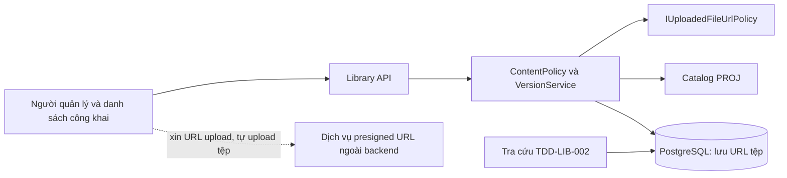
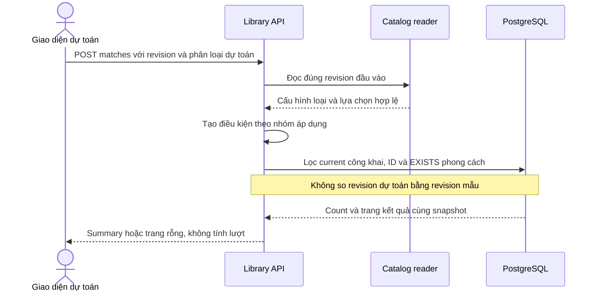
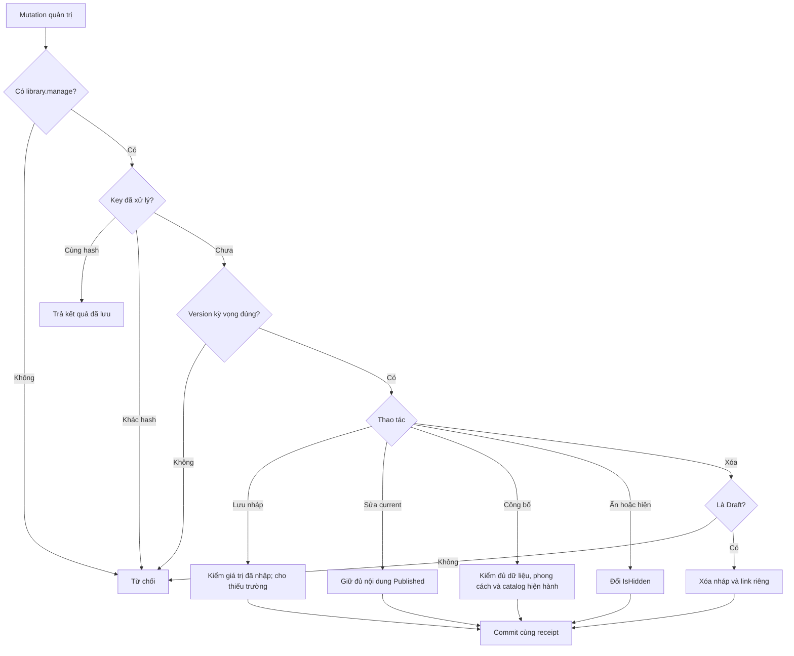
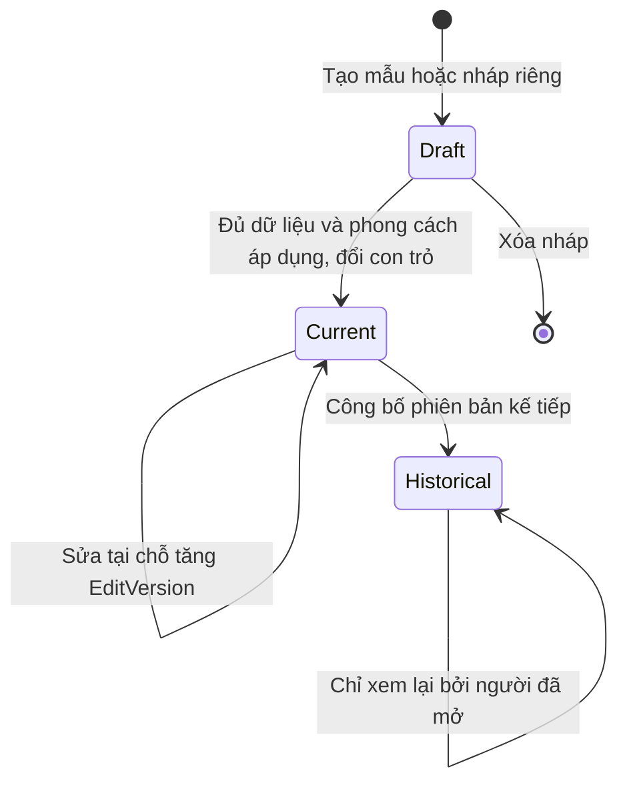
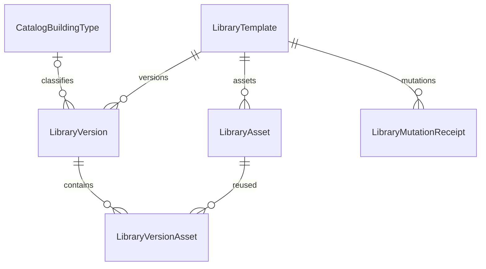
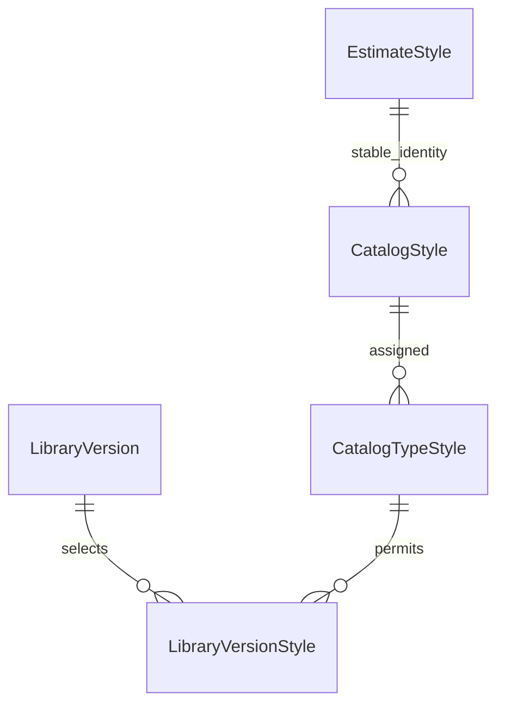

<!-- HƯỚNG DẪN CHO AI KHI ĐIỀN HOẶC CHỈNH SỬA MẪU
- Đọc toàn bộ mẫu, các comment hướng dẫn và tài liệu nguồn được cung cấp trước khi viết. Tuân thủ các quy tắc nghiệp vụ, điều kiện, ngoại lệ và giới hạn đã được xác nhận.
- Không bịa, tự chế hoặc suy đoán thành sự thật: yêu cầu, quy tắc, số liệu, API, schema, mã lỗi, nguồn tham khảo, người phụ trách và kết quả kiểm thử phải có căn cứ. Nội dung ví dụ trong mẫu không phải dữ kiện của dự án.
- Khi thiếu thông tin hoặc các nguồn mâu thuẫn, hỏi người dùng để làm rõ; giữ nguyên placeholder ở phần chưa xác định. Không tự chọn đáp án, lấp chỗ trống hay tuyên bố tài liệu đã hoàn tất.
- Chỉ thay nội dung cần điền hoặc được yêu cầu sửa. Không tự mở rộng phạm vi, sửa nghĩa quy tắc, bỏ điều kiện/ngoại lệ, xoá hay ghi đè nội dung hợp lệ đã có.
- Giữ nguyên tên, cấp và thứ tự heading, nhãn in đậm, tiền tố bullet, cấu trúc danh sách, tên/thứ tự/số cột bảng và cú pháp code fence. Không dịch, đổi tên, gộp hoặc thêm mục ngoài cấu trúc mẫu.
- Chỉ lặp khối luồng, AC hoặc API theo đúng khuôn khi có căn cứ; chỉ bỏ phần tuỳ chọn khi hướng dẫn riêng của mẫu cho phép và đã xác định không áp dụng.
- Mã tham chiếu và section phải trỏ tới tài liệu có thật đã được cung cấp hoặc kiểm chứng. Không giữ mã ví dụ như tham chiếu thật và không tự tạo tài liệu liên quan để hợp thức hoá liên kết.
- Giữ các comment hướng dẫn trong file. Xuất Markdown UTF-8, mỗi file một tài liệu; không bọc toàn bộ file trong code fence, không chèn lời dẫn hay giải thích ngoài mẫu.
- Trước khi bàn giao, đối chiếu nội dung với nguồn, kiểm tra cấu trúc, giá trị cho phép, giới hạn độ dài và tính nhất quán của mã/tham chiếu. Báo rõ phần chưa đủ thông tin; không tuyên bố đã chạy test hoặc import khi chưa thực hiện.
-->

<!-- Thay mã TDD-001 và nội dung ví dụ; giữ nguyên heading và nhãn in đậm.
Sơ đồ dùng mermaid, plantuml hoặc URL. Giữ heading Architecture, Sequence Diagram, Activity Diagram, State Diagram, Data Model.
Ví dụ API phải có heading trùng METHOD /path trong Endpoints. Xoá phần API/sơ đồ không dùng.
Version, Updated At và Change Log do lịch sử phiên bản quản lý, để trống khi nhập mới.
Author/Reviewer là tên hiển thị; gán tài khoản, phê duyệt, giả định và câu hỏi mở trên giao diện sau import.
Thiết kế phải truy vết về Story và Business Rule được cung cấp. Phân biệt thiết kế đề xuất với implementation đã kiểm chứng; không mô tả API/schema/sơ đồ ví dụ như hệ thống thật hoặc tự quyết định nghiệp vụ còn thiếu.
BẮT BUỘC KHI HOÀN THIỆN MẪU: phải có cả Reviewer và Approver, mỗi tên 1–200 ký tự sau khi bỏ khoảng trắng đầu/cuối. Không xoá hai dòng metadata, để trống, dùng tên bịa hoặc giữ placeholder rồi coi là hoàn tất.
Nếu chưa biết người review hoặc người phê duyệt, phải hỏi người dùng và báo tài liệu chưa đủ thông tin; không tự lấy Author/Owner làm người thay thế. Tên trong file không tự gán tài khoản hoặc xác nhận đã duyệt; gán thành viên trên giao diện sau import.
Đây là yêu cầu hoàn thiện mẫu; backend hiện vẫn nhận file cũ thiếu hai trường để tương thích.

VALIDATION CHO FILE NHẬP (đối chiếu ImportSnapshotValidator, MarkdownParser và ImportService):
- Mỗi file .md UTF-8 không rỗng chỉ có một heading cấp 1 chứa mã tài liệu dài 1–100 ký tự. Mã không được trùng trong cùng lần nhập hoặc thuộc loại tài liệu khác đã tồn tại.
- Không dùng tên README.md hoặc sitemap.md vì importer bỏ qua. Giao diện nhận .md/.zip, tối đa 2.000 file, tổng file tải lên 31 MiB; API giới hạn request 32 MiB và tổng nội dung đọc/giải nén 64 MiB.
- Chỉ nhập đè tài liệu cùng loại đang Draft, chưa có phiên bản và chưa lưu trữ. Import thay toàn bộ nội dung bản nháp, vì vậy phải giữ lại nội dung hợp lệ ngoài phần được yêu cầu sửa.
- Không dùng Status trong Markdown hoặc tên Approver để tự xác nhận phê duyệt; import không cấp quyền hay gán tài khoản từ tên. Chạy Kiểm tra file và xử lý lỗi/cảnh báo trước khi nhập.
- Giới hạn độ dài bên dưới tính theo string.Length của .NET (đơn vị UTF-16); không tự cắt ngắn dữ kiện quan trọng để vượt validation, hãy viết lại có căn cứ hoặc hỏi người dùng.
- Feature tối đa 300 ký tự và được dùng làm tiêu đề tài liệu. Status được parser nhận: Draft / In Review / Approved / Deprecated; tài liệu nhập mới vẫn có trạng thái phê duyệt Draft.
- Endpoint: đường dẫn tối đa 500 ký tự; tên/mô tả endpoint được lưu trong Name tối đa 300. HTTP method: GET / POST / PUT / PATCH / DELETE / HEAD / OPTIONS.
- Error Codes: mã tối đa 100 ký tự, không trùng trong tài liệu; giữ dạng - **CODE** (400): mô tả. HTTP status trong Error Codes và Response phải là số nguyên đọc được bằng Int32; không tự đặt status khác hợp đồng API.
- URL sơ đồ tối đa 1.000 ký tự. Mục sơ đồ được sử dụng phải có khối mermaid/plantuml hoặc URL theo mẫu; không để một mục sơ đồ rỗng. Nhãn mục được tách từ bullet như tên External API Fields tối đa 300 ký tự.
- Heading Examples phải khớp METHOD /path ở Endpoints. Giữ các nhãn Request:, Response 200: (thay mã theo contract) và Error Response: để parser tách đúng dữ liệu.
- Tham chiếu dạng DOC-KEY/section: ghi chú: mã đích tối đa 100 ký tự, section tối đa 100, ghi chú tối đa 1.000. Không trùng bộ mã đích + section + loại liên kết trong cùng tài liệu.
ĐỐI CHIẾU FORM TDD (src/features/tdds/validations.ts; form có thể chặt hơn import):
- Điền Feature, Author, Reviewer, Problem và ít nhất một Goal; các Goal/Non-goal/Notes đã thêm không được rỗng. API đã khai báo phải có endpoint và mô tả/mục đích; Fields phải có tên và ý nghĩa; Error Codes phải có mã, HTTP status và điều kiện.
- Form còn kiểm tra Version, Updated At và nội dung Change Log khi khai báo; với file nhập mới, giữ các trường lịch sử này trống theo hợp đồng import, không tự tạo dữ liệu lịch sử.
-->

# TDD-LIB-001

## Document Info

- **Feature**: Quản lý thư viện mẫu — nội dung, bản nháp, phiên bản, danh mục và tìm kiếm
- **Author**: Codex
- **Reviewer**: Tân Trần
- **Approver**: Tân Trần
- **Status**: Draft
- **Version**:
- **Updated At**:

## Context & Goals

### Problem

Người dùng đã chốt STORY-LIB-001–003 và BR-LIB-001–003; có 31 đặc tả ST-LIB-001–031. Việc tách tài liệu không thay nghiệp vụ, schema hoặc API đã đề xuất. Người dùng chốt thiết kế ngày 25/09/2026. Ngày 26/09/2026, phần của tài liệu này đã được triển khai ở nhánh `feature/library-admin` của `bmt-be` (commit `66e4671`, chưa merge vào `develop`); hiện trạng ghi ở Architecture.

Tài liệu này sở hữu năm bảng nội dung/quản trị đã triển khai, bảng LibraryVersionStyle bổ sung trong thiết kế ngày 30/09/2026 và các API quản lý, danh sách công khai. Quyền xem, tính lượt, lịch sử và tải nội dung bảo vệ nằm ở [TDD-LIB-002](TDD-LIB-002.md).

**Bổ sung ngày 30/09/2026 — đã triển khai backend trong workspace:** người dùng đã chốt STORY-LIB-001/AC-008–AC-011, STORY-LIB-002/AC-005–AC-009 và BR-LIB-001 khoản 9–14; đã có ST-LIB-032–041. Người dùng đã chốt thiết kế và yêu cầu chỉ triển khai BE. Phần bổ sung thay các mô tả cũ chỉ có loại/tầng/tum ở những điểm tương ứng; giao diện nằm ngoài đợt này. Các ghi nhận commit/migration trước ngày này chỉ chứng minh phạm vi cũ.

Tài liệu tiếp tục sở hữu nội dung và tìm kiếm; thêm bảng liên kết phong cách và API tìm mẫu bằng thông tin dự toán. TDD-LIB-002 chỉ bổ sung cách đọc phong cách của phiên bản có quyền xem; quyền và lượt không đổi.

### Goals

- Lưu nháp thiếu dữ liệu, kiểm đủ trước công bố.
- Sửa tại chỗ giữ VersionId; công bố mới giữ nguyên phiên bản cũ.
- Dùng chung catalog PROJ và phục vụ tìm/lọc công khai.
- Mẫu 3D chọn nhiều phong cách trong từng nhóm; tìm mẫu khớp mọi điều kiện áp dụng qua ID ổn định, không yêu cầu cùng CatalogRevisionId.

### Non-goals

- Không thiết kế lại quota hoặc LibraryAccess; tham chiếu TDD-LIB-002.
- Không yêu thích, xoay 3D, tìm kích thước, phân công mẫu, sửa bản đã thay thế hoặc xóa bản đã công bố.
- Không triển khai phần của TDD-LIB-002 trong cùng đợt: LibraryAccess, phần mở rộng UsageOperation, mở mẫu tính lượt, lịch sử, preview và tải nội dung được bảo vệ.
- Backend không làm kho tệp: không nhận bytes, không tạo presigned URL, không tải tệp về để kiểm nội dung và không tạo ảnh thu nhỏ. Frontend upload tệp qua dịch vụ presigned URL rồi gửi URL; backend chỉ lưu URL (quyết định ngày 26/09/2026, cùng quy ước với TDD-PROJ-001).

## Architecture

**Hiện trạng đã xác minh**

Backend là .NET 8, EF Core/Npgsql 8; compose dùng PostgreSQL 15. `ApplicationDbContext` có User và các bảng nền RBAC, chưa có bảng LIB, catalog PROJ hay subscription trong DbContext được đọc. Không có tenant filter. Các port/tên lớp mới trong tài liệu là đề xuất, không khẳng định đã tồn tại.

**Đối chiếu code ngày 28/09/2026:** thiết kế này đã có trên `develop` của `bmt-be` từ commit `66e4671` (`LibraryApi`, migration `20260926102541_LibraryTemplates`). Đoạn trên và câu đầu của đoạn này ghi hiện trạng lúc thiết kế, giữ lại để tra cứu.

Kiểm tra lại ngày 26/09/2026 trên `develop` tại `9c7b147`: chưa có code LIB. Code đã có phần lưu URL tệp của dự toán mà LIB dùng lại: option `UploadedFileOption` (`src/bmt-be.application/dependencyInjection/options/UploadedFileOption.cs`, biến `UploadedFileOption__AllowedHosts__0`, `__1`…), interface `IUploadedFileUrlPolicy` và lớp `UploadedFileUrlPolicy` (`src/bmt-be.application/services/UploadedFileUrlPolicy.cs`). `Check(url)` trả `NotConfigured` khi danh sách tên miền rỗng, `HostNotAllowed` khi URL không phải https tuyệt đối, có thông tin đăng nhập, có cổng khác mặc định hoặc tên máy chủ không khớp chính xác một phần tử của danh sách, và `Allowed` khi hợp lệ. Lớp này không gọi HTTP tới URL.

`TransactionPipelineBehavior` commit khi handler trả về bình thường, kể cả Result.Failure. Generic `ICommand<T>` không kế thừa marker `ICommand`; command ghi mới phải đặt hậu tố Command hoặc hiện thực `ITransactionalRequest`. `IUnitOfWork` đã đăng ký scoped trên `develop` (kiểm lại tại `79faf34`), nên LIB và dịch vụ quota dùng cùng DbContext/transaction. Sau khi bắt đầu ghi, lỗi phải ném exception để rollback, không trả Result.Failure rồi để pipeline commit. Không mở transaction lồng. Quy ước tương ứng đã có trong TDD-PROJ-001.

**Hiện trạng triển khai (26/09/2026, nhánh `feature/library-admin`, commit `66e4671`, tách từ `develop` tại `79faf34`, chưa merge)**

Đã có trong code toàn bộ phạm vi của tài liệu này. Phần của TDD-LIB-002 đã triển khai sau đó ở nhánh `feature/library-access`, commit `0263297` (chưa merge), kèm log thao tác quản trị của tài liệu này. Tên thành phần trong code khác tên dự kiến ở bảng dưới như sau:

- `LibraryContentPolicy` là lớp tĩnh trong `application/usecases/commands/library/`, kiểm phân loại theo danh mục và điều kiện đủ để công bố. `LibraryVersionService` không thành một lớp: mỗi thao tác là một command handler riêng (tạo mẫu, tạo nháp, sửa metadata, lưu URL tệp, gắn, gỡ, sắp xếp tài nguyên, công bố, ẩn/hiện, xóa nháp), dùng chung `LibraryWriteFlow` cho người thao tác, biên nhận, khóa và kiểm expected version.
- `ILibraryCatalogReader` hiện thực bằng `LibraryCatalogReader`, đọc qua `IEstimateStore` của PROJ; thư viện không ghi danh mục.
- Khóa và truy cập dữ liệu qua `ILibraryLocks`, `ILibraryStore`, `ILibraryReadStore` (domain) và `LibraryLocks`, `LibraryStore`, `LibraryReadStore` (persistence). URL tệp kiểm bằng `IUploadedFileUrlPolicy` có sẵn.
- Route ở `presentation/apis/library/LibraryApi.cs`: `DesignTemplateApi` (công khai) và `AdminLibraryApi` (quản trị, policy `library.manage`). Mã quyền `library.manage` đã thêm vào `PermissionNames`, seed cho vai trò `admin` trong migration `20260926102541_LibraryTemplates`; policy đăng ký tự động từ `PermissionNames.All`.
- Kiểm thử: unit test ở `test/bmt-be.application.tests/usecases/library/`, integration test PostgreSQL ở `test/bmt-be.integration.tests/Library*Tests.cs`, test API ở `test/bmt-be.api.tests/library/`. Ánh xạ từng đặc tả UT-LIB ghi trong chính đặc tả đó.

**Đối chiếu code trước khi triển khai ngày 30/09/2026**

- `domain/entities/Library.cs` chưa có liên kết phong cách; `LibraryVersion` mới lưu CatalogRevisionId/BuildingTypeId/FloorCount/HasTum. `EstimateCatalog.cs` đã có EstimateStyle, CatalogStyle và CatalogTypeStyle; dùng lại cả hai nhóm Architecture/Interior, không tạo danh mục mới.
- `contract/services/library/Command.cs`, `Query.cs`, `Response.cs`, `LibraryText.cs`, `validators/LibraryValidators.cs` và `presentation/apis/library/LibraryApi.cs` cần thêm contract lưu/đọc phong cách và truy vấn đối chiếu. Các đường dẫn code trong phần này tính từ `bmt-be/src/`.
- `SaveLibraryVersionCommandHandler` hiện so loại/tầng/tum để quyết định khóa catalog và đổi revision. Mở rộng phép so sang DrawingKind và hai tập StyleId. `CreateLibraryDraftCommandHandler`, `PublishLibraryVersionCommandHandler`, `DeleteLibraryDraftCommandHandler` phải cùng xử lý link phong cách; không chỉ sửa DTO.
- `ILibraryCatalogReader` hiện chỉ có ReadCurrentAsync; bổ sung ReadRevisionAsync(revisionId) qua IEstimateStore để đọc đúng cấu hình của mẫu/dự toán cũ. LIB chỉ đọc catalog của PROJ. `ILibraryStore` thêm đọc/ghi/xóa link; `ILibraryReadStore` thêm truy vấn match. `LibraryAccessStore` và DTO detail phải đọc hai tập phong cách trong cùng snapshot với metadata.
- Thành phần mới dự kiến: `LibraryVersionStyle` (domain), cấu hình tương ứng trong `LibraryConfigurations.cs`, `GetMatchingDesignTemplatesQueryHandler` và policy tạo điều kiện match. Giữ PostgreSQL, EF Core và UoW hiện có; không thêm cache, broker hoặc bảng kết quả gợi ý.

**Kết quả triển khai backend ngày 30/09/2026**

- `LibraryVersionStyle` và `LibraryVersionStyleConfiguration` lưu tập phong cách của từng phiên bản. Migration `20260930101013_AddLibraryVersionStyles` thêm bảng, khóa ghép, index và FK kiểm revision/type của parent bằng SQL. Không backfill hoặc sửa dữ liệu 2D. Migration đã chạy trên PostgreSQL 15 tạm của bộ test; chưa áp dụng lên môi trường dùng chung.
- `LibraryContent` phân biệt null/không gửi với mảng rỗng, so sánh tập và giữ thuật toán hash cũ khi hai mảng đều không gửi. `LibraryStyles` kiểm nhóm/loại, số lựa chọn và thực hiện thay link trong transaction. Tạo, sửa, sao nháp, công bố, xóa nháp đều xử lý link; attach/detach/reorder kiểm phong cách của Published theo revision đã ghim.
- `GetMatchingDesignTemplatesQueryHandler` đọc revision đầu vào rồi dùng chung truy vấn công khai trong `LibraryReadStore`; các điều kiện phong cách dùng EXISTS. Có `GET /api/v1/admin/library/classification-options`, có hai mảng lọc ở danh sách công khai và hai tập lựa chọn ở filters. `AdminVersionItem` và detail trả tên/ảnh theo revision mẫu, đọc cùng snapshot với metadata.
- Phân trang tính offset bằng số 64 bit, chặn ở `int.MaxValue` trước khi truyền vào EF để không tràn số. Trang vượt tổng kết quả trả rỗng; không thay điều kiện tìm.
- Kết quả và giới hạn kiểm chứng ở [bảng kiểm thử](../discovery/library-unit-test-coverage.md). Đợt bàn giao này commit và đẩy code lên `develop` theo yêu cầu người dùng; migration chưa áp dụng lên database dùng chung. Trước phát hành vẫn cần kiểm tra môi trường đích chưa có mẫu 3D và thực hiện các bước migration bên dưới; FE do bên tích hợp thực hiện theo phạm vi người dùng đã chốt.

**Phong cách của mẫu — cách lưu và cập nhật**

Danh mục PROJ sở hữu định danh, tên, ảnh, nhóm và việc gán phong cách cho loại công trình. LIB chỉ sở hữu việc một phiên bản mẫu chọn những phong cách nào. Chọn quan hệ nhiều–nhiều qua `LibraryVersionStyle`, không lưu chuỗi ID, JSON hoặc các cột Style1/Style2. Mỗi link thuộc một VersionId nên bản nháp có thể sửa riêng, bản cũ giữ lựa chọn của nó.

Luồng ghi đề xuất:

1. Xác thực library.manage và kiểm receipt như hiện tại. Chuẩn hóa mỗi mảng StyleId theo thứ tự UUID cố định trước khi băm; từ chối Guid.Empty, mục trùng và mục sai nhóm. Hai mảng là tập hợp không có thứ tự nghiệp vụ. Phân biệt mảng không gửi/null với mảng rỗng trong hash để không nhầm “giữ nguyên” với “xóa hết”.
2. Đọc sơ bộ metadata và các link trong cùng snapshot; so DrawingKind, loại/tầng/tum và hai tập phong cách hiệu lực để biết có cần khóa catalog. Sau khóa Template/Version, đọc lại link và kiểm expectedEditVersion. Nếu giờ mới phát hiện cần khóa catalog mà chưa khóa, trả 409 LibraryVersionConflict; không lấy khóa catalog sau Template.
3. Khi thay phân loại, kiểm toàn bộ bộ dữ liệu theo current catalog dưới khóa SHARE rồi ghim revision mới. Khi chỉ sửa tên/ảnh/tệp, giữ revision và lựa chọn cũ. Sửa Published vẫn phải giữ đủ nội dung theo cấu hình đã ghim; nháp cho thiếu dữ liệu. Chỉ 3D được gắn phong cách; từng mục phải đúng nhóm, được gán cho loại và nhóm đó đang bật. Công bố yêu cầu ít nhất một mục ở mỗi nhóm bật. 2D hoặc chưa chọn DrawingKind/loại thì hai tập phải rỗng; không tự suy ra loại hoặc nhóm.
4. Tạo nháp sao chép tất cả link sang VersionId mới, giữ revision nguồn. Công bố luôn kiểm lại catalog hiện hành và chuyển mọi link sang revision mới trong cùng transaction; nếu bất kỳ mục không còn hợp lệ thì từ chối, không tự xóa hay thay phong cách. Khi đổi 3D thành 2D, client gửi rõ hai mảng rỗng; không tự xóa lựa chọn ngầm.
5. Ghi metadata, link, EditVersion và receipt cùng transaction. Khi đổi revision/type: kiểm hết trước khi ghi; xóa link cũ và SaveChanges, cập nhật parent và SaveChanges, rồi thêm link mới và ghi receipt. Các bước SaveChanges không commit riêng. Lỗi bất kỳ bước nào phải ném exception để UoW rollback cả bộ. Với cùng revision/type chỉ sửa phần chênh lệch. Xóa nháp xóa link phong cách trước parent; không xóa catalog.

Một lần đổi tập phong cách tăng EditVersion của chính phiên bản, không tạo Number mới, không đổi PublishedAtUtc, không cấp hay xóa Access. Thay đổi chen vào lúc mở mẫu được phát hiện bằng EditVersion theo TDD-LIB-002. Mọi mutation ảnh/tệp đang kiểm điều kiện Published phải được rà để dùng chung policy hoàn chỉnh, tránh một đường ghi bỏ qua quy tắc phong cách.

**Hai luồng tìm mẫu — làm rõ sau bản thiết kế đầu tiên**

1. Trang thư viện (`/vi/handbook?tab=library`) dùng GET danh sách/filter công khai. Khách chọn tùy ý các điều kiện loại công trình, tầng/tum và hai nhóm phong cách của 3D; điều kiện chưa chọn không chặn tìm kiếm. Bổ sung hai nhóm phong cách vào contract bộ lọc, dùng ID ổn định. Mỗi nhóm nhận tập StyleId. Trong nhóm dùng OR (khớp ít nhất một), giữa hai nhóm và các điều kiện loại/tầng/tum dùng AND (đồng thời). Tập rỗng nghĩa không lọc nhóm đó.
2. Trang tạo dự toán (`/vi/design/{id}/input`) tự gọi match 2D và 3D khi AI đang xử lý. FE dùng đúng CatalogRevisionId và phân loại của đầu vào đã được chấp nhận gửi AI, không dùng dữ liệu chưa lưu hoặc filter của trang thư viện. Đây là thời điểm tích hợp đã xác nhận, thay câu hỏi cũ về tự tìm ngay khi nhập hay bấm nút tìm.

Theo TDD-PROJ-002/Internal API, FE đợi lưu đầu vào hoàn tất rồi gửi inputVersion; khi tác vụ được tiếp nhận/Pending, có thể gửi hai request matches với drawingKind=2D và 3D từ cùng bộ phân loại. Gắn kết quả bất đồng bộ với estimateId/operationId/inputVersion ở FE, hủy hoặc bỏ phản hồi thuộc tác vụ/trang trước khi điều hướng hay bắt đầu tác vụ khác. Khi tải lại trang, đọc dự toán qua route đã có quyền và kiểm đúng tác vụ đang hiển thị trước khi gọi match; không cấp quyền đọc dự toán qua API thư viện công khai.

Hai lời gọi match có thể chạy độc lập với polling trạng thái AI; lỗi thư viện không đổi trạng thái AI, không gửi lại tác vụ tạo thiết kế và không tác động lượt tạo. Hiển thị rõ mẫu tham khảo có sẵn. Backend match chỉ đọc danh sách; không xác nhận tác vụ AI dựa trên body do client khai và không cần mở truy cập operation cho người khác. Chưa chốt tần suất gọi lại khi thư viện thay đổi trong lúc chờ; không tự đặt polling thư viện.

**Tìm mẫu từ dự toán — tách cấu hình đầu vào và điều kiện đối chiếu**

Đề xuất API chỉ đọc nhận bộ thông tin phân loại và CatalogRevisionId của dự toán, không nhận hoặc đọc EstimateId. Frontend lấy dữ liệu từ dự toán người dùng đang được phép xem; API tìm chỉ trả nội dung thư viện công khai, không tra hoặc tiết lộ dữ liệu riêng của dự toán. Gửi một bộ điều kiện khác chỉ thay kết quả tìm, không ghi vào dự toán hoặc cấp quyền xem. Như vậy không cần quyền quản trị catalog hay quyền tạo thiết kế để dùng API danh sách.

Policy đọc `CatalogBuildingType` tại revision đầu vào, kiểm type và các lựa chọn đã gửi, rồi tạo các điều kiện có áp dụng. Với 2D chỉ dùng loại/tầng/tum; bỏ qua hai lựa chọn phong cách của dự toán dù chúng đang có giá trị. Với 3D kiểm mỗi nhóm đang bật có một StyleId hợp lệ; đối chiếu kiểu Architecture với Architecture, Interior với Interior. Trường/nhóm tắt không thành điều kiện; không dùng cấu hình current thay cấu hình dự toán. Luồng dự toán chạy sau khi AI đã tiếp nhận đầu vào hợp lệ, nên các phân loại áp dụng đã đủ. Request match thiếu trường áp dụng là dữ liệu gọi API không hợp lệ; không tự chuyển sang “Tất cả”. Quy tắc này không áp cho trang thư viện lọc tự do.

Truy vấn bắt đầu từ `LibraryTemplate.CurrentVersionId`, IsHidden=false và Version.State=Published; so DrawingKind và BuildingTypeId. Nếu tầng/tum áp dụng thì so bằng giá trị, dùng cờ áp dụng riêng để không làm mất điều kiện HasTum=false. Với 3D, thêm một EXISTS cho mỗi nhóm áp dụng. EXISTS kiểm có link chứa StyleId, không JOIN nhân số dòng, không so bằng toàn bộ tập phong cách. Mỗi mẫu xuất hiện một lần; count, sort và page thực hiện sau tất cả điều kiện, trong cùng snapshot ngắn như read store hiện có.

Ví dụ biểu thức SQL có tham số, chỉ minh họa điều kiện, không phải script triển khai:

```sql
WHERE t."IsHidden" = false
  AND t."CurrentVersionId" = v."Id"
  AND v."State" = 'Published'
  AND v."DrawingKind" = @drawingKind
  AND v."BuildingTypeId" = @buildingTypeId
  AND (NOT @floorsApplicable OR v."FloorCount" = @floorCount)
  AND (NOT @tumApplicable OR v."HasTum" = @hasTum)
  AND (NOT @architectureApplicable OR EXISTS (
      SELECT 1 FROM "LibraryVersionStyle" s
      WHERE s."VersionId" = v."Id"
        AND s."Group" = 'Architecture' AND s."StyleId" = @architectureStyleId))
  AND (NOT @interiorApplicable OR EXISTS (
      SELECT 1 FROM "LibraryVersionStyle" s
      WHERE s."VersionId" = v."Id"
        AND s."Group" = 'Interior' AND s."StyleId" = @interiorStyleId))
```

Không thêm `v.CatalogRevisionId = @catalogRevisionId`. FK revision ở dữ liệu lưu kiểm sự hợp lệ của từng bên, không phải điều kiện hai bên bằng nhau khi tìm. TypeId/StyleId giữ nguyên qua đổi tên/ảnh; hai mục trùng tên nhưng khác ID không khớp. Tên hiển thị của mẫu vẫn đọc theo revision mẫu. Không có kết quả thì trả trang rỗng, không tìm gần giống, không giữ/trừ lượt và không ghi lịch sử. Mở mẫu từ kết quả vẫn đi access-info/open như trước.

**Phần đã rõ và điểm còn mở**

- Đã xác nhận: danh mục dùng chung; 3D nhiều phong cách; tối thiểu một mục/nhóm bật khi công bố; match mọi điều kiện; so ID ổn định qua revision; không tự nới điều kiện.
- Thiết kế đề xuất để duyệt: bảng/link, contract, transaction, chỉ mục và API dưới đây. Chưa có migration hoặc mã ứng dụng cho phần này.
- Đã xác nhận thêm: trang thư viện lọc tự do; trang dự toán tự lấy mẫu khi AI đang làm việc; hiện chưa có mẫu 3D nên không cần chuyển đổi phong cách của mẫu 3D cũ.
- Đã xác nhận bộ lọc tự do: nhiều mục mỗi nhóm, khớp ít nhất một trong từng nhóm đã chọn; hai nhóm kết hợp AND. Match từ dự toán vẫn nhận một lựa chọn mỗi nhóm theo đầu vào đã gửi AI. Không còn câu hỏi nghiệp vụ mở trong nhóm vấn đề vừa trao đổi; TDD bổ sung chưa được duyệt.

**Phân chia trách nhiệm**

| Thành phần dự kiến | Trách nhiệm |
|---|---|
| LibraryApi, AdminLibraryApi | Carter routes, policy, DTO; không tự tính quota. Chống CSRF do lớp dùng chung ở [TDD-AUTH-001](TDD-AUTH-001.md) đảm nhận. |
| LibraryContentPolicy | Kiểm tên, kích thước, ảnh đại diện, phân loại và điều kiện công bố. Không kiểm định dạng hay dung lượng tệp; phần này do frontend kiểm (xác nhận ngày 26/09/2026). |
| LibraryVersionService | Sửa tại chỗ, nháp riêng, công bố, ẩn/hiện, xóa nháp; kiểm version chống ghi đè. |
| ILibraryCatalogReader | Đọc cùng EstimateCatalog/CatalogBuildingType/CatalogFloor/CatalogStyle/CatalogTypeStyle của PROJ; đọc current khi ghi phân loại hoặc revision cụ thể khi giữ lịch sử/tìm mẫu. Không có bản sao danh mục LIB. |
| IUploadedFileUrlPolicy (đã có trong code) | Kiểm URL tệp mới là https và thuộc tên miền kho presign trong `UploadedFileOption__AllowedHosts`; dùng chung với PROJ, không tạo bản kiểm URL thứ hai cho LIB. |



**Quyền và biên dữ liệu**

Mã quyền `library.manage` là quyền quản lý thư viện mẫu đã chốt tên theo STORY-RBAC-001/Preconditions, RequiresAssignment=false, seed cho vai trò hệ thống Admin; các vai trò khác được cấp bằng RBAC hiện có. Policy kiểm theo mã quyền này, không kiểm tên vai trò "Admin" (BR-RBAC-001, BR-RBAC-011); thiếu quyền trả 403 và không ghi dữ liệu nghiệp vụ. Bổ sung cả PermissionNames, migration seed và policy registry để PermissionCatalogGuard không từ chối khởi động. Quyền này khác quyền lợi gói `catalog.detail`: một bên là quản trị, một bên là quyền khách mở mẫu mới. Không tái dùng `assignment.manage` hoặc bắt phân công nhân viên vào mẫu.

Mutation dùng cookie được kiểm Origin theo [TDD-AUTH-001](TDD-AUTH-001.md), không dùng CORS thay CSRF. Endpoint công khai chỉ trả summary và ảnh đại diện của phiên bản hiện hành không ẩn. Ảnh đại diện công khai trả thẳng URL gốc: `thumbnailUrl` là `LibraryAsset.Url` của ảnh cover thuộc phiên bản hiện hành không ẩn, để trình duyệt và CDN cache được (người dùng xác nhận ngày 26/09/2026). Backend chỉ quyết định có đưa URL đó vào danh sách hay không; không có route thumbnail chuyển tiếp ảnh. Vì tệp nằm ở URL công khai, cố định của kho presign, người đã biết URL ảnh cover vẫn mở được sau khi mẫu bị ẩn hoặc ảnh bị thay; điều này chấp nhận được vì ảnh cover là nội dung công khai. Nội dung được bảo vệ thì khác: API không trả URL gốc, backend chuyển tiếp tệp qua route có kiểm quyền ([TDD-LIB-002/Architecture](TDD-LIB-002.md#architecture)). Ảnh đã tải xuống trước đó không thể thu hồi khỏi máy khách.

Preview quản trị và các route đọc nội dung bảo vệ theo TDD-LIB-002/Internal API; quyền library.manage không tạo lịch sử khách hoặc dùng lượt.

**Mẫu, phiên bản và lần sửa**

`LibraryTemplate` là định danh mẫu, giữ con trỏ CurrentVersionId và IsHidden. `LibraryVersion` là phiên bản tính lượt. `EditVersion` là số kiểm soát sửa đồng thời, không phải phiên bản tính lượt. Mỗi lần sửa metadata, ảnh, thứ tự, cover hoặc file tăng EditVersion của cùng VersionId. Khi V1 được sửa, quyền xem V1 giữ nguyên và nội dung đọc mới phản ánh sửa đó.

Phiên bản có State Draft hoặc Published. Phiên bản cũ là Published nhưng không còn được CurrentVersionId trỏ tới; không lưu thêm trạng thái Superseded để tránh lệch hai nguồn. Number được cấp lúc công bố bằng max Number đã công bố + 1 dưới khóa Template. Nháp có Number/PublishedAtUtc NULL. Có thể có nhiều nháp kỹ thuật; công bố phải gửi expectedCurrentVersionId nên nháp dựa trên bản cũ không tự ghi đè bản mới. Không tự thêm luồng gộp nháp. BaseVersionId là dấu nguồn sao chép, không bị so bằng current mỗi lần công bố: Admin có thể xem xét một nháp cũ rồi gửi expectedCurrentVersionId hiện hành, nhưng server không tự đổi giá trị kỳ vọng thay khách.

Tạo nháp từ current sao chép metadata, các dòng liên kết tài nguyên và liên kết phong cách theo thiết kế bổ sung; mỗi LibraryAsset (một URL tệp) được dùng chung bằng AssetId, không lặp URL. Thay tệp luôn là thêm LibraryAsset mới với URL mới; backend không sửa URL của asset đang được bản khác tham chiếu. Khi công bố, dữ liệu nháp phải đủ, phân loại phải hợp lệ theo catalog hiện hành. Transaction đổi con trỏ và chuyển Draft sang Published. Bản trước không còn sửa được, kể cả API trực tiếp.

Ẩn/hiện chỉ đổi Template.IsHidden, không thay phiên bản, lượt hoặc quyền xem. Mẫu chưa công bố không xuất hiện dù IsHidden=false. Xóa nháp xóa các liên kết của riêng nháp; không xóa dòng LibraryAsset, tệp ở kho presign hoặc template identity dùng bởi lịch sử/receipt. Công bố không tự đảo IsHidden; mẫu đang ẩn tiếp tục ẩn tới khi người quản lý chọn Hiện lại.

**Dùng chung catalog mà vẫn giữ phân loại cũ**

Version lưu CatalogRevisionId, BuildingTypeId, FloorCount, HasTum; thiết kế bổ sung lưu hai tập phong cách trong LibraryVersionStyle. Tên và cờ lấy từ revision đã ghim, không sao chép tên vào bảng LIB. Nullable HasTum phân biệt false=Không tum và NULL=Không áp dụng/nháp chưa nhập. Cờ từ catalog phân biệt hai nghĩa NULL này.

Sửa tên/ảnh/file không đổi revision phân loại. Nếu đổi bất kỳ trường phân loại nào, revalidate toàn bộ bộ loại/tầng/tum và phong cách áp dụng theo current catalog và ghim revision mới trong cùng transaction. Công bố nháp luôn revalidate và ghim current revision, kể cả khi được sao từ bản cũ. Phần tầng dùng đúng FloorCount của PROJ: 1 là trệt, 3 là tổng ba tầng; nhãn phải thống nhất với catalog, không tự cộng thêm một tầng hoặc tính tum thành tầng.

Bộ lọc dùng UNION DISTINCT của lựa chọn catalog hiện hành và phân loại trên các phiên bản current công khai. Lọc tầng giới hạn theo BuildingTypeId khi được chọn. Tầng cũ chỉ được thêm vào filter vì đang có mẫu public, không trở lại thành lựa chọn hợp lệ cho công bố mới. Mẫu ẩn, nháp và phiên bản lịch sử không làm xuất hiện giá trị filter. Tên loại trên từng mẫu dùng revision của mẫu; nhãn bộ lọc ưu tiên tên current của cùng định danh.

**Khóa và ranh giới với tra cứu**

Mutation quản trị khóa User người thao tác FOR UPDATE → EstimateCatalog FOR SHARE khi revalidate → Template FOR UPDATE → Version theo Id tăng dần. Ghi content, con trỏ và receipt cùng transaction; frontend upload tệp lên kho presign trước, ngoài backend. Không lấy khóa tài khoản khách/quota sau Template. Quy tắc khóa phối hợp đầy đủ và xử lý mở khi nội dung đổi được định nghĩa một lần tại [TDD-LIB-002/Architecture](TDD-LIB-002.md#architecture).

**Upload và tài nguyên**

Backend không nhận bytes tệp. Theo quyết định ngày 26/09/2026 (cùng quy ước ở TDD-PROJ-001/Architecture, ghi chú "URL ảnh thuộc kho presign"), mỗi tệp đi theo ba bước:

1. Frontend kiểm định dạng và dung lượng tệp theo BR-LIB-001 khoản 2 (ảnh JPG/PNG/WebP; tệp đính kèm PDF/DWG/DXF), xin URL upload từ dịch vụ presigned URL rồi tự upload tệp lên đó. Dịch vụ này nằm ngoài backend.
2. Frontend gửi `POST .../assets` với `{kind, url, originalName, mediaType, sizeBytes}` của tệp vừa upload.
3. Backend chỉ kiểm URL bằng `IUploadedFileUrlPolicy` (URL tuyệt đối https, không khoảng trắng, tối đa 2048 ký tự, tên máy chủ thuộc `UploadedFileOption__AllowedHosts`) và `kind` là Image hoặc Attachment, rồi tạo một dòng LibraryAsset trong transaction ngắn. Backend không kiểm `mediaType`, phần mở rộng của `originalName` hay `sizeBytes` so với định dạng và dung lượng cho phép. Danh sách tên miền rỗng thì trả 503 `LibraryStorageUnavailable`, không lưu URL.

Ví dụ: ảnh `mat-bang.jpg` được upload lên `https://cdn.example.test/lib/m1/mat-bang.jpg`. Với `UploadedFileOption__AllowedHosts__0=cdn.example.test`, backend tạo F1 với Kind=Image, MediaType=image/jpeg. Cùng yêu cầu nhưng URL `https://other.example.test/mat-bang.jpg` hoặc `http://cdn.example.test/mat-bang.jpg` bị trả 422 `UnsupportedLibraryFile`, không tạo dòng. Một ảnh `.gif` bị frontend từ chối trước khi upload; nếu request gửi thẳng API với URL đúng tên miền thì backend vẫn nhận.

Người dùng xác nhận ngày 26/09/2026: định dạng và dung lượng tệp mẫu (BR-LIB-001 khoản 2) do frontend kiểm, như PROJ (TDD-PROJ-001); backend chỉ kiểm URL. Backend không tải tệp về, nên request gửi thẳng API với URL đúng tên miền nhưng trỏ tới tệp sai định dạng sẽ không bị chặn; đây là hệ quả đã được chấp nhận. `originalName`, `mediaType` và `sizeBytes` do frontend khai, chỉ dùng để hiển thị và đặt tên, `Content-Type` khi chuyển tiếp tệp; backend không xác minh. Backend không tạo ảnh thu nhỏ; ảnh đại diện dùng chính tệp ảnh cover. PDF/CAD là tệp tải về, không render trên server.

Tạo LibraryAsset không tự gắn vào phiên bản; attach là transaction riêng kiểm quyền, TemplateId và expectedEditVersion. Upload lỗi thì frontend không gọi API, lưu hoặc attach lỗi thì transaction rollback; nội dung cũ giữ nguyên. Tệp đã upload mà không được lưu hoặc gắn có thể còn nằm ở kho presign; backend không xóa tệp ở kho, việc dọn tệp không còn được tham chiếu thuộc dịch vụ lưu trữ.

Không đặt số ảnh/tệp tối đa trong validator (BR-LIB-001 khoản 2). Giới hạn dung lượng và thời gian upload giờ là của dịch vụ presigned URL, không phải của API backend; phải làm rõ với bên cung cấp dịch vụ và không mô tả “không giới hạn” là năng lực vật lý vô hạn.

URL đã lưu của LibraryAsset không bị sửa là hợp đồng đầu vào cho luồng tải tài nguyên có quyền tại TDD-LIB-002. Danh sách công khai chỉ trả URL ảnh cover của phiên bản hiện hành không ẩn.

**Phạm vi thay đổi mã khi được giao triển khai**

- Thêm DTO/validator tại `contract/services/library/`, command/query handler tại `application/usecases/.../library/`, Carter routes tại `presentation/apis/library/` và entity/config tại domain/persistence.
- Thêm các port đã nêu vào application/abstractions; catalog adapter đọc schema PROJ, quota adapter ghi schema SUB. Dùng lại `IUploadedFileUrlPolicy` và `UploadedFileOption` đã có, không thêm storage adapter. Không cho LIB cập nhật catalog hoặc cấu hình gói trực tiếp.
- Bổ sung permission/policy registry/seed và UoW scoped; chống CSRF đã có ở lớp chung ([TDD-AUTH-001](TDD-AUTH-001.md)). Hồi quy auth và gói/lượt sau thay đổi nền tảng.
- Thứ tự triển khai: nền RBAC/UoW → catalog và SUB cốt lõi → metadata/nháp/assets → công bố/danh sách → quyền xem/quota/history → tích hợp tải tệp và kiểm thử lỗi. Ngày 26/09/2026 đã làm xong phần metadata/nháp/assets và công bố/danh sách (commit `66e4671`); quyền xem, quota, lịch sử và tải tệp thuộc TDD-LIB-002, làm cùng ngày ở commit `0263297`.

Chi tiết triển khai nội dung/quản trị thuộc tài liệu này; bước quota/history và tải có quyền thuộc TDD-LIB-002.

**Nơi thực hiện quy tắc và kiểm chứng**

| Quy tắc | Nơi thực hiện | Đặc tả hệ thống | Đặc tả Unit Test |
|---|---|---|---|
| BR-LIB-001: nội dung, kích thước, file | Validator, LibraryContentPolicy, `IUploadedFileUrlPolicy` và CHECK; định dạng và dung lượng tệp kiểm ở frontend, backend chỉ kiểm URL | ST-LIB-001–005 | UT-LIB-001–005, UT-LIB-009–011, UT-LIB-025 |
| BR-LIB-001: catalog và filter | ILibraryCatalogReader, FKs ghép, query projections | ST-LIB-010, ST-LIB-012–016 | UT-LIB-006–008, UT-LIB-028–032 |
| BR-LIB-002: sửa/công bố/ẩn/xóa | VersionService, mutex Template, receipt, state guard | ST-LIB-006–009, ST-LIB-011 | UT-LIB-012–024, UT-LIB-026–027 |

Bảng bổ sung cho nghiệp vụ ngày 30/09/2026:

| Quy tắc | Nơi thực hiện | Đặc tả hệ thống | Đặc tả Unit Test |
|---|---|---|---|
| BR-LIB-001 khoản 9–10: nhiều phong cách và nhóm áp dụng | LibraryContentPolicy, link và FK, các handler tạo/sửa/nháp/công bố | ST-LIB-032–035, ST-LIB-049–051 | UT-LIB-053–065, UT-LIB-073, UT-LIB-075–078 |
| BR-LIB-001 khoản 11–14: khớp đủ qua revision | Policy tạo điều kiện, GetMatchingDesignTemplatesQueryHandler, EXISTS trong read store | ST-LIB-036–041, ST-LIB-048 | UT-LIB-066–070, UT-LIB-072 |
| BR-LIB-001 khoản 15–16: hai luồng tìm | GET danh sách/filter, matches, điều phối bất đồng bộ tại FE | ST-LIB-042–048 | UT-LIB-071–072; luồng FE kiểm qua System Test |
| Đọc phong cách theo revision có quyền | AdminVersionItem, LibraryVersionDetail, snapshot đọc | ST-LIB-051 | UT-LIB-074, UT-LIB-077 |

Bổ sung integration PostgreSQL để kiểm FK ghép, rollback giữa các bước thay link, đổi catalog cùng lúc công bố và hai yêu cầu sửa cùng EditVersion. Kiểm SQL thực tế lọc trước phân trang, count không trùng và query plan với bộ dữ liệu đại diện; chưa có số liệu tải để cam kết độ trễ hoặc thêm chỉ mục ngoài các chỉ mục được giải thích ở Data Model. Hồi quy bản cũ, lịch sử/quyền xem và receipt gửi lại. Đặc tả bổ sung được liệt kê trong bảng trên và bảng truy vết tại References; chưa có mã test hoặc kết quả chạy cho phần bổ sung.

Đặc tả UT-LIB-001–032 kiểm validator, policy, service quản trị, receipt, thứ tự gọi khóa và truy vấn công khai ở biên unit; mã test đã có ở commit `66e4671`, mỗi đặc tả ghi tên test tương ứng. Không dùng mock để kết luận mutex/UNIQUE/rollback đúng: các phần này kiểm bằng integration test PostgreSQL 15 (`LibraryConstraintTests`, `LibraryFlowTests`, `LibraryConcurrencyTests`, `LibraryReadTests`). Integration dùng PostgreSQL 15 thật và hai connection cho lượt cuối, cùng phiên bản, đổi kỳ, sửa/công bố chen lúc mở. Kiểm URL tệp (tên miền, https, độ dài) dùng lại test của `UploadedFileUrlPolicy`; backend không có test định dạng hay dung lượng tệp vì phần này thuộc frontend. Bổ sung thực nghiệm công bố lúc xác nhận và upload lớn qua dịch vụ presign trên môi trường thử; không báo đạt từ việc viết đặc tả.

Đặc tả UT-LIB-009, UT-LIB-010 và UT-LIB-032 đã được viết lại ngày 26/09/2026 theo thiết kế lưu URL: kiểm URL khi thêm tài nguyên, không kiểm định dạng ở backend, và danh sách công khai trả thẳng URL ảnh cover của phiên bản hiện hành không ẩn.

**Notes**:

- Không thêm broker, outbox hoặc database khác. Quota/Access/nội dung cùng PostgreSQL; tệp nằm ở kho presign ngoài backend, backend chỉ lưu URL. [EF Core transactions](https://learn.microsoft.com/en-us/ef/core/saving/transactions).
- Log operationId/accountId/versionId/editVersion, kết quả Granted/Reused/Denied/Conflict, không log token, signed URL hay bytes. Người dùng xác nhận ngày 26/09/2026: log thao tác quản trị (operationId, kết quả) làm cùng đợt TDD-LIB-002, không làm trong đợt triển khai tài liệu này. Đã có ở commit `0263297`: `LibraryAdminOperationLoggingBehavior` ghi thao tác, người thao tác, Idempotency-Key, mẫu, phiên bản, kết quả `Succeeded`/`Rejected`, mã lỗi và thời gian xử lý của mọi lệnh quản trị thư viện, kể cả lỗi validation; không ghi nội dung yêu cầu hay URL tệp. Chưa phân biệt lần gửi lại cùng key với lần ghi mới trong log. Theo dõi lỗi đọc tệp, thời gian chờ khóa, cấp quyền thất bại và lệch Access/UsageOperation; chưa đặt ngưỡng cảnh báo khi chưa có tải thực.
- RPO/RTO của tệp, giới hạn dung lượng upload và việc dọn tệp mồ côi thuộc dịch vụ presigned URL, chưa có số liệu. Backup của backend chỉ gồm URL trong database; cần thống nhất với bên vận hành kho để quyền xem không trỏ tới tệp đã mất trước khi mở production.
- **Đã xác nhận ngày 26/09/2026 (LIB, lưu URL)**: (1) Định dạng và dung lượng ảnh và tệp đính kèm của thư viện mẫu do frontend kiểm, như PROJ; backend chỉ kiểm URL https thuộc `UploadedFileOption__AllowedHosts`. (2) Nội dung được bảo vệ tải qua route backend có kiểm quyền; backend chuyển tiếp tệp, không lộ URL gốc ([TDD-LIB-002/Architecture](TDD-LIB-002.md#architecture)).
- **Đã xác nhận ngày 26/09/2026 (đọc tài nguyên cho người quản lý)**: thêm route đọc danh sách tài nguyên của một phiên bản cho người có `library.manage`, có phân trang, trả URL gốc, loại, vị trí và cover, phục vụ màn sửa và sắp xếp. Route này thuộc tài liệu này, khác route đọc tài nguyên của khách ở TDD-LIB-002 (khách không nhận URL gốc).

## Sequence Diagram

```mermaid
sequenceDiagram
    actor A as Người quản lý
    participant P as Dịch vụ presigned URL
    participant API as AdminLibraryApi
    participant DB as PostgreSQL
    A->>A: Frontend kiểm định dạng và dung lượng tệp
    A->>P: Xin URL upload và tự upload tệp
    P-->>A: URL https cố định của tệp
    A->>API: POST assets với url, kind, originalName, mediaType
    API->>API: Chỉ kiểm URL https thuộc AllowedHosts
    API->>DB: Lưu LibraryAsset bằng giao dịch ngắn
    A->>API: Tạo và chỉnh sửa nháp riêng
    API->>DB: Lưu nháp, link tài nguyên và receipt
    Note over API,DB: Current vẫn phục vụ khách
    A->>API: Publish với expected versions và key
    API->>DB: Khóa actor, catalog, template và version
    alt Dữ liệu thiếu hoặc version xung đột
        API->>DB: Rollback
        API-->>A: Lỗi, current không đổi
    else Hợp lệ
        API->>DB: Publish nháp, đổi current và ghi receipt
        API->>DB: Commit
        API-->>A: Phiên bản mới; bản trước khóa sửa
    end
```

Luồng tìm mẫu bổ sung, áp dụng khi dữ liệu phân loại đầu vào đã đủ:




## Activity Diagram



## State Diagram



Current/Historical là trạng thái suy ra từ State=Published và con trỏ Template, không phải hai giá trị State được lưu. IsHidden thuộc Template, không phải trạng thái Version. Quyền Access không hết hạn theo kỳ và không bị gỡ bởi ẩn mẫu.

## Data Model

**Quy ước và bảng dùng lại**

UUID cho định danh; timestamptz/UTC cho thời điểm; PascalCase; NN là NOT NULL. Không dùng soft-delete filter làm mất lịch sử. FK mặc định ON DELETE RESTRICT; chỉ xóa link của nháp trong transaction xóa nháp. Dữ liệu khách ngăn truy cập chéo bằng AccountId, không tự thêm tenant.

Dùng lại User/RBAC theo TDD-RBAC-001; EstimateCatalog, EstimateCatalogRevision, CatalogBuildingType và CatalogFloor theo [TDD-PROJ-001/Data Model](TDD-PROJ-001.md#data-model). Dùng DesignSubscription, DesignPeriod, PeriodQuota, UsageOperation theo [TDD-SUB-002/Data Model](TDD-SUB-002.md#data-model), gồm LifecycleState của TDD-SUB-005. Không sao chép số dư vào LIB.

LibraryAccess và phần mở rộng UsageOperation có nguồn duy nhất tại [TDD-LIB-002/Data Model](TDD-LIB-002.md#data-model); không định nghĩa lại ở đây.

**Ý nghĩa từng bảng**

| Bảng | Một dòng đại diện cho gì; ai ghi; quan hệ |
|---|---|
| LibraryTemplate | Một mẫu ổn định. Người có `library.manage` tạo; CurrentVersionId NULL trước công bố, IsHidden dùng chung cho mẫu. Không lưu tên/kích thước tại đây. |
| LibraryVersion | Một phiên bản nội dung tính lượt, thuộc một Template. Người có `library.manage` sửa khi Draft/current; Published cũ không sửa. Number NULL trước công bố. EditVersion khác Number. |
| LibraryAsset | Một tệp (ảnh hoặc tệp đính kèm) thuộc một Template, lưu bằng URL ở kho presign. Người có `library.manage` tạo sau khi frontend upload xong và backend kiểm URL. URL và metadata không sửa sau khi tạo, dùng lại được giữa các phiên bản cùng mẫu. |
| LibraryVersionAsset | Một liên kết Version–Asset với vị trí hiển thị. Cho phép cùng asset ở nhiều phiên bản; không lặp metadata file. |
| LibraryMutationReceipt | Một mutation quản trị đã commit, dùng nhận diện key gửi lại; lưu hash và kết quả ID/version, không chứa bytes tài nguyên. |

**Cột và ràng buộc**

| Bảng | Cột, khóa và CHECK |
|---|---|
| LibraryTemplate | Id uuid PK; CurrentVersionId uuid NULL; IsHidden boolean NN DEFAULT false; Version bigint NN DEFAULT 1 CHECK>0; CreatedBy uuid NN FK User; CreatedAtUtc timestamptz NN. FK(Id,CurrentVersionId) → LibraryVersion(TemplateId,Id), thêm sau khi tạo bảng; current phải Published do transaction policy. |
| LibraryVersion | Id uuid PK; TemplateId uuid NN FK Template; State varchar(16) NN CHECK Draft/Published; Number bigint NULL; EditVersion bigint NN DEFAULT 1 CHECK>0; BaseVersionId uuid NULL; Name text NULL; Description text NULL; DrawingKind varchar(2) NULL CHECK NULL/2D/3D; WidthM,LengthM,AreaM2 numeric(28,2) NULL CHECK NULL hoặc >0; CatalogRevisionId,BuildingTypeId uuid NULL; FloorCount int NULL CHECK NULL hoặc >=1; HasTum boolean NULL; CoverAssetId uuid NULL; CreatedBy uuid NN FK User; CreatedAtUtc,ModifiedAtUtc timestamptz NN; PublishedAtUtc timestamptz NULL. UNIQUE(TemplateId,Id), UNIQUE(TemplateId,Number). CHECK Draft thì Number/PublishedAtUtc NULL, Published thì Number>0 và PublishedAtUtc NN. |
| LibraryAsset | Id uuid PK; TemplateId uuid NN FK Template; Kind varchar(16) NN CHECK Image/Attachment; Url varchar(2048) NN CHECK bắt đầu bằng `https://` (cùng kiểu CHECK với `CK_CatalogStyle_ImageUrl` của PROJ); OriginalName text NN; MediaType varchar(100) NN; SizeBytes bigint NULL CHECK NULL hoặc >0; CreatedBy uuid NN FK User; CreatedAtUtc timestamptz NN; UNIQUE(TemplateId,Id). Tên miền của Url kiểm ở ứng dụng bằng `IUploadedFileUrlPolicy`, không kiểm bằng CHECK vì danh sách đọc từ cấu hình. OriginalName, MediaType và SizeBytes là dữ liệu frontend khai, backend không xác minh với nội dung tệp. Không có cột khóa kho, ảnh thu nhỏ hay checksum. |
| LibraryVersionAsset | TemplateId uuid NN; VersionId uuid NN; AssetId uuid NN; Position bigint NN CHECK>0; PK(VersionId,AssetId); UNIQUE(VersionId,Position); FK(TemplateId,VersionId) → Version(TemplateId,Id); FK(TemplateId,AssetId) → Asset(TemplateId,Id). |
| LibraryMutationReceipt | Id uuid PK; ActorId uuid NN FK User; Operation varchar(24) NN CHECK Create/Save/Publish/Visibility/DeleteDraft/Attach/Detach/Reorder; RequestKey varchar(100) NN; RequestHash char(64) NN; TemplateId uuid NN FK Template; ResultVersionId uuid NULL; Result jsonb NN; CreatedAtUtc timestamptz NN; UNIQUE(ActorId,Operation,RequestKey). ResultVersionId không FK vì receipt xóa nháp phải còn trả lại được ID đã xóa; không dùng nó để cấp quyền đọc nội dung. |

Ràng buộc bổ sung:

- FK Version(TemplateId,BaseVersionId) → Version(TemplateId,Id), NULL với phiên bản đầu. Base phải là bản đã công bố của cùng mẫu tại thời điểm tạo nháp; kiểm trong handler.
- CatalogRevisionId/BuildingTypeId cùng NULL hoặc cùng có giá trị. FK ghép tới CatalogBuildingType; FK ba cột (CatalogRevisionId,BuildingTypeId,FloorCount) tới CatalogFloor. Chưa có loại thì FloorCount và HasTum NULL. Policy kiểm cờ bật/tắt: trường bị tắt phải để trống; gửi 0 tầng hoặc Không tum cho trường bị tắt bị từ chối 422 InvalidLibraryContent, không tự quy đổi về NULL (BR-LIB-001 khoản 4). Công bố kiểm đủ trường, trim Name có nội dung, cover là Image của phiên bản và có ít nhất một Image.
- FK Version(Id,CoverAssetId) → VersionAsset(VersionId,AssetId), CoverAssetId NULL khi nháp chưa có cover. Tạo version trước với cover NULL, tạo link rồi gán cover trước công bố. Thay cover tạo link mới trước, đổi pointer rồi bỏ link cũ; không cần xóa toàn bộ link bằng SaveChanges một lần tùy ý.
- CHECK Published dùng các điều kiện IS NOT NULL rõ ràng cho các trường bắt buộc, không dựa so sánh với NULL để chặn dữ liệu. CHECK Published yêu cầu Name có nội dung, DrawingKind, cả ba kích thước, catalog/type và cover NN. Chuỗi kiểm whitespace ở domain; không tự đặt max tên/mô tả nghiệp vụ. Giá trị có mặt trong nháp vẫn phải đúng định dạng/miền giá trị. Người dùng đã xác nhận cho lưu nháp thiếu thông tin; chỉ yêu cầu đủ trường trước công bố. NULL biểu diễn thông tin chưa nhập trong Draft, không dùng giá trị 0 hoặc chuỗi rỗng thay cho thiếu dữ liệu.
- Reorder dùng vị trí tạm không trùng trong transaction rồi ghi vị trí đích trước commit; không dựa thứ tự UPDATE của EF để tránh UNIQUE. Có thể đổi hai bước SaveChanges trong cùng UoW, không commit giữa chừng.
- Numeric(28,2) khớp decimal của PROJ: JSON chuỗi, tối đa 26 chữ số phần nguyên và hai chữ số lẻ, không exponent/NaN/Infinity, từ chối thay vì làm tròn; giới hạn biểu diễn không phải trần kích thước nghiệp vụ. [PostgreSQL numeric](https://www.postgresql.org/docs/15/datatype-numeric.html).

**ERD và quan hệ**



Nháp có thể chưa có phân loại; Published bắt buộc có. FK current, cover và base được mô tả ở phần ràng buộc. RESTRICT bảo vệ tài nguyên còn tham chiếu; policy chặn xóa Published ngay cả khi chưa có người xem. Access của TDD-LIB-002 tham chiếu Version và giữ nguyên khi ẩn mẫu.

**Dữ liệu mẫu xuyên suốt**

Dữ liệu giả định, ID bí danh thay uuid, lược cột không liên quan; không phải SQL seed hoặc dữ liệu thật. T1<T2<T3 theo UTC. Catalog C1 có loại B1=Nhà phố, tầng 3, tum bật; C2 chỉ cho tầng 2. U1 là khách, A1 là quản trị. Kỳ DP1/quota Q1 của U1 có Limit=20, Used=0, Reserved=0; schema và dữ liệu kỳ xem TDD-SUB-002/Data Model.

| Bảng | Dòng dữ liệu lưu thực tế (cột chọn lọc) |
|---|---|
| LibraryTemplate | Id=M1; CurrentVersionId=V1; IsHidden=false; Version=2; CreatedBy=A1; CreatedAtUtc=T1. |
| LibraryVersion | Id=V1; TemplateId=M1; State=Published; Number=1; EditVersion=1; BaseVersionId=NULL; Name=Nhà ABC; DrawingKind=2D; WidthM=5; LengthM=20; AreaM2=80; CatalogRevisionId=C1; BuildingTypeId=B1; FloorCount=3; HasTum=true; CoverAssetId=F1; PublishedAtUtc=T1. |
| LibraryAsset | F1/M1/Kind=Image/Url=https://cdn.example.test/lib/m1/mat-bang.jpg/OriginalName=mat-bang.jpg/MediaType=image/jpeg/SizeBytes=120000; F2/M1/Kind=Attachment/Url=https://cdn.example.test/lib/m1/ban-ve.pdf/OriginalName=ban-ve.pdf/MediaType=application/pdf/SizeBytes=240000. Giả định `UploadedFileOption__AllowedHosts__0=cdn.example.test`; tên miền chỉ minh họa. |
| LibraryVersionAsset | M1/V1/F1/Position=1; M1/V1/F2/Position=2. |
| LibraryMutationReceipt | ActorId=A1; Operation=Publish; RequestKey=publish-demo-1; RequestHash=HP1; TemplateId=M1; ResultVersionId=V1; Result={"versionId":"V1","number":1,"templateVersion":2}; CreatedAtUtc=T1. Result minh họa JSON, ID thật là uuid. |

Sau mở đầu tiên, Q1 Used=1 và Access U1/V1 cùng tồn tại; mất mạng rồi mở lại không tạo OP2. A1 sửa tên và thay ảnh F1 bằng F3: V1.EditVersion=2, cover/link trỏ F3; M1.CurrentVersionId vẫn V1. U1 xem lịch sử thấy tên/ảnh mới nhưng Used vẫn 1. F3 là dòng LibraryAsset mới với URL mới, ví dụ https://cdn.example.test/lib/m1/mat-bang-2.jpg; dòng F1 và URL của F1 không bị sửa.

Tạo nháp V2: TemplateId=M1, BaseVersionId=V1, State=Draft, Number/PublishedAtUtc NULL, EditVersion=1; các link sao lại dùng F3/F2. Sửa nháp không đổi V1. Khi công bố ở T3 sau khi catalog thành C2, V2 phải dùng tầng 2 và C2; V1 tiếp tục C1/tầng 3. M1.CurrentVersionId=V2, V2.Number=2, V2.State=Published; V1 không còn sửa được. U1 mở V2 đủ điều kiện tạo OP2 và Access U1/V2, Q1 Used=2; lịch sử có hai dòng. Gói hết hạn hoặc M1.IsHidden=true không xóa hai dòng này.

Lỗi trước commit OP2: quota và Access/operation đều không đổi. Xóa một nháp V3 để lại receipt Operation=DeleteDraft, ResultVersionId=V3; không có FK để receipt ngăn xóa nháp. Nếu kỳ không giới hạn, Used vẫn tăng cho OP1, Limit=NULL; quyền U1/V1 không phụ thuộc Limit về sau.
Các thay đổi lượt trong tình huống trên chỉ giải thích quan hệ; schema và bản ghi Access/UsageOperation minh họa nằm tại TDD-LIB-002/Data Model.

**Chuẩn hóa, chỉ mục và vòng đời**

| Dữ kiện | Nguồn duy nhất, khóa và đánh đổi |
|---|---|
| Nội dung | Phụ thuộc VersionId; tên/kích thước không lặp ở Template, Access hoặc receipt phục vụ đọc. |
| Phân loại | Phụ thuộc revision+type; lưu FK ghim lịch sử, không sao chép tên hiện hành. |
| File | URL và metadata phụ thuộc AssetId; VersionAsset chỉ lưu quan hệ/thứ tự. TemplateId lặp để FK ghép ngăn gắn file mẫu khác, được ràng buộc ở cả hai đầu. |
| Receipt | JSON là kết quả thao tác bất biến để gửi lại, không phải nguồn nội dung hoặc bảng snapshot toàn mẫu. |

Index theo truy vấn: Version(TemplateId,Number) unique; Version(PublishedAtUtc DESC,Id DESC) WHERE State='Published'; Version(DrawingKind,BuildingTypeId,FloorCount,HasTum) WHERE State='Published'; Asset(TemplateId,Id) unique; VersionAsset(VersionId,Position) unique và index AssetId cho tra tham chiếu; receipt unique key. Không tạo full-text engine; tìm tên bằng ILIKE có escape ký tự wildcard, truy vấn SQL trước phân trang. Hiệu năng contains có thể cần pg_trgm khi có số liệu, không cam kết B-tree tăng tốc contains.

Danh sách public JOIN Template.CurrentVersionId, IsHidden=false; sort PublishedAtUtc DESC, VersionId DESC để ổn định khi trùng thời gian; pageIndex/pageSize dùng chuẩn PagedResult của repo. Không lưu LastPublishedAt thứ hai trên Template. Assets cũng phân trang để số tệp không biến thành payload/RAM không giới hạn. Trang assets nhận expectedEditVersion; nội dung đổi giữa hai trang trả 409 và client tải lại từ đầu, không ghép danh sách hai lần sửa. Các khóa/hình dạng DTO này là kiểm soát kỹ thuật, không thêm phiên bản tính lượt.

**Ghi chú thiết kế ban đầu, đã có migration bên dưới; không dùng làm kế hoạch migration cho bổ sung phong cách:** kiểm tra schema thực tế trước; tạo bảng Template/Version/Asset/link/receipt, các FK vòng sau bảng; thêm UsageOperation.TemplateVersionId và Access sau module SUB, thêm permission. Không chạy migration ở tác vụ này. Code đọc hiện chưa có module LIB/SUB, nhưng không suy ra production trống: nếu đã có lượt tra cứu kiểu cũ thì dừng backfill tự động, cần ánh xạ phiên bản thật từ dữ liệu cũ; không gán mọi lượt cũ vào current version. Rollback sau có Access không được drop lịch sử/asset; ưu tiên tắt route mới và sửa tiếp trên schema giữ dữ liệu.
Schema quota/Access được triển khai theo TDD-LIB-002 sau bảng Version; không tạo thêm bảng do tách tài liệu.

**Bổ sung Data Model ngày 30/09/2026 — LibraryVersionStyle**

Một dòng là một phong cách được người quản lý chọn cho một phiên bản mẫu 3D. Ví dụ chọn hai kiến trúc và ba nội thất thì có năm dòng. Link được tạo/sửa cùng metadata, sao chép khi tạo nháp và xóa khi xóa nháp. Không thêm bảng danh mục, không lưu tên/ảnh phong cách trong LIB.

| Bảng/cột | Kiểu, NULL và ý nghĩa |
|---|---|
| LibraryVersionStyle.VersionId | uuid NN; phiên bản sở hữu lựa chọn, FK đơn tới LibraryVersion.Id cho EF theo dõi thứ tự parent/con. |
| LibraryVersionStyle.CatalogRevisionId | uuid NN; phải bằng revision của phiên bản mẫu. |
| LibraryVersionStyle.BuildingTypeId | uuid NN; phải bằng loại công trình của phiên bản mẫu. |
| LibraryVersionStyle.Group | varchar(16) NN; CHECK Architecture hoặc Interior. |
| LibraryVersionStyle.StyleId | uuid NN; định danh phong cách có sẵn, không phát sinh ID phong cách khi gắn mẫu. |
| LibraryVersion — cấu trúc bổ sung | Không thêm cột nghiệp vụ; thêm unique index không lọc UX_LibraryVersion_ClassificationKey trên (Id,CatalogRevisionId,BuildingTypeId) làm đích FK ghép. CatalogRevisionId/BuildingTypeId vẫn nullable cho nháp. |

PK `LibraryVersionStyle(VersionId,Group,StyleId)` chặn trùng trong nhóm. FK `FK_LibraryVersionStyle_Classification` từ (VersionId,CatalogRevisionId,BuildingTypeId) tới LibraryVersion(Id,CatalogRevisionId,BuildingTypeId); FK `FK_LibraryVersionStyle_CatalogTypeStyle` từ (CatalogRevisionId,BuildingTypeId,Group,StyleId) tới CatalogTypeStyle(RevisionId,BuildingTypeId,Group,StyleId). FK thứ hai kéo theo phong cách đúng nhóm qua các ràng buộc PROJ hiện có. Mọi cột link NN nên không thể né FK bằng NULL. Nháp chưa có phân loại chưa được có link.

Cả ba FK dùng ON DELETE RESTRICT; xóa link của nháp trước khi xóa phiên bản. Không cascade sang catalog, không xóa link của bản cũ khi current đổi. Database chặn link sai revision/type/nhóm và phong cách chưa được gán. Policy trong transaction kiểm chỉ 3D có link, cờ nhóm bật/tắt và tối thiểu một mục/nhóm bật khi Published; FK không tự kiểm ba điều kiện đó. Không dùng CHECK truy vấn bảng khác để giả lập kiểm số phần tử. [PostgreSQL 15 — constraints](https://www.postgresql.org/docs/15/ddl-constraints.html).

Ánh xạ EF: khai FK đơn VersionId và FK tới CatalogTypeStyle bằng Fluent API. Khai unique index trên parent bằng HasIndex(...).IsUnique(); thêm FK ghép tới parent bằng SQL trong migration, cùng cách repository đang xử lý FK nullable ở LibraryAccess/UsageOperation. Không biến ba cột parent thành alternate key EF vì revision/type cần giữ nullable và có thể được ghim lại khi sửa; alternate key mang ngữ nghĩa chỉ đọc trong EF. Phải giữ SQL bổ sung khi tạo migration sau này và kiểm model/migration trên PostgreSQL. [EF Core — keys](https://learn.microsoft.com/en-us/ef/core/modeling/keys).



| Quan hệ | Số lượng và bên giữ FK | Xóa | Ý nghĩa |
|---|---|---|---|
| Version → VersionStyle | Một version có 0..n link; mỗi link bắt buộc một version đúng revision/type | RESTRICT | Nháp/2D có thể không có link; tối thiểu ở 3D Published do policy kiểm. |
| CatalogTypeStyle → VersionStyle | Một mục gán có 0..n link từ các mẫu; mỗi link trỏ đúng một mục | RESTRICT | LIB dùng lại cấu hình PROJ, không tự gán phong cách cho loại. |

**Ví dụ phong cách và match giữa hai revision**

Dữ liệu giả định, bí danh UUID, chỉ trích cột; không phải seed hoặc dữ liệu thật. Ví dụ này độc lập với M1/V1 ở phần trên. Schema/mẫu đầy đủ của bảng catalog và Estimate dùng lại TDD-PROJ-001/Data Model.

| Bảng | Dòng minh họa |
|---|---|
| EstimateBuildingType; EstimateStyle (dùng lại) | Type BT1; phong cách AR1, AR2 thuộc Architecture; IN1, IN2, IN3 thuộc Interior. Các ID ổn định. |
| CatalogBuildingType (dùng lại) | RA/BT1 và RB/BT1 cùng bật tầng, tum và hai nhóm phong cách; tên Villa ở RA, Villa mới ở RB. |
| CatalogFloor (dùng lại) | RA/BT1/3 và RB/BT1/3. |
| CatalogStyle (dùng lại) | RA có AR1/IN1; RB có AR1,AR2,IN1,IN2,IN3, đúng Group. Tên/ảnh AR1 có thể khác giữa RA/RB. |
| CatalogTypeStyle (dùng lại) | RA/BT1/Architecture/AR1, RA/BT1/Interior/IN1; RB gán cả năm phong cách đúng nhóm cho BT1. |
| Estimate (chỉ đọc đầu vào) | E10, CatalogRevisionId=RA, BuildingTypeId=BT1, FloorCount=3, HasTum=false, ArchitectureStyleId=AR1, InteriorStyleId=IN1. |
| LibraryTemplate | M10, CurrentVersionId=V10, IsHidden=false; các cột bắt buộc còn lại theo bảng gốc. |
| LibraryVersion | V10/M10, DrawingKind=3D, State=Published, CatalogRevisionId=RB, BuildingTypeId=BT1, FloorCount=3, HasTum=false; có đủ tên/kích thước/cover/Number/PublishedAtUtc. |
| LibraryVersionStyle | Năm dòng: V10/RB/BT1/Architecture/AR1; V10/RB/BT1/Architecture/AR2; V10/RB/BT1/Interior/IN1; V10/RB/BT1/Interior/IN2; V10/RB/BT1/Interior/IN3. |

Kết quả: tìm 3D từ E10 lấy được V10 dù RA khác RB, vì loại/tầng/tum khớp và hai tập chứa AR1/IN1. Tạo nháp V11 sao chép năm dòng với VersionId=V11; sửa nháp không đổi V10. Xóa nháp V11 xóa đúng năm link của nó. Nếu current catalog RC không còn gán AR1 cho BT1, công bố V11 khi vẫn giữ AR1 bị từ chối; V10 giữ link RB. Không có dòng ở bảng kết quả tìm mẫu vì kết quả là projection đọc.

**Chuẩn hóa và chỉ mục bổ sung**

Dữ kiện chọn phong cách có khóa (VersionId,Group,StyleId). CatalogRevisionId/BuildingTypeId phụ thuộc VersionId, Group phụ thuộc StyleId: đây là lặp dữ liệu có chủ đích để FK kiểm được đúng phiên bản, loại và nhóm, không khẳng định bảng đạt BCNF. Mọi giá trị lặp được FK ghép ràng buộc với nguồn duy nhất; chúng không được sửa độc lập. Tên, ảnh, cờ áp dụng và số lượng phong cách không sao chép. So với link chỉ VersionId/StyleId, thiết kế tốn thêm cột và bước ghi nhưng database chặn được lỗi gắn nhầm revision hoặc loại.

PK phục vụ EXISTS theo VersionId/Group/StyleId và đọc hai tập của mẫu. Thêm index `IX_LibraryVersionStyle_CatalogAssignment` trên (CatalogRevisionId,BuildingTypeId,Group,StyleId) phục vụ FK và đối soát. Giữ index lọc Version hiện có; chưa thêm index theo StyleId đứng đầu khi chưa có query plan chứng minh cần. Đọc danh sách quản trị lấy các link theo tập VersionId của một trang, không query riêng từng mẫu; metadata và link nằm trong cùng snapshot. Summary công khai không kèm toàn bộ tập phong cách nên không làm payload phình theo số lựa chọn.

**Migration, dữ liệu cũ và tương thích — đề xuất, chưa thực hiện**

1. Người dùng xác nhận hiện chưa có mẫu 3D. Trước triển khai, kiểm read-only môi trường đích còn đúng điều kiện này và khảo sát dung lượng bảng/thời gian triển khai cho phép. Không suy ra không có mẫu 2D. Nếu thực tế xuất hiện 3D từ thời điểm chốt đến triển khai, báo sai khác trước khi chuyển đổi; không tự gán phong cách.
2. Thêm unique index parent, bảng link, CHECK/FK/index con; không thay tên, ID, revision hoặc trạng thái các dòng cũ. Migration không tự tạo StyleId hoặc gán theo tên/ảnh. Tạo index parent có thể khóa ghi; chọn cửa sổ triển khai sau khi có số liệu. Chưa cam kết zero downtime hoặc tự chọn CONCURRENTLY.
3. Triển khai backend/DTO mới và giao diện quản trị cùng đợt. Payload cũ không có mảng phong cách không được làm mất link mới: update giữ nhóm không gửi; [] xóa rõ ràng, vẫn qua validation. Backend cũ không hiểu link và có thể đổi parent/sao nháp sai, nên không cho backend cũ và mới cùng nhận ghi LIB sau khi đã có link. Không dùng tính tương thích payload để suy ra tương thích nhiều phiên bản server.
4. Không backfill phong cách vì chưa có mẫu 3D. Sau triển khai, mọi mẫu 3D công bố phải có ít nhất một phong cách trong mỗi nhóm đang bật; không có ngoại lệ cho dữ liệu cũ. Giữ nguyên mẫu 2D, phiên bản và Access hiện có.
5. Kiểm trước/sau: count các bảng gốc và Access/UsageOperation không đổi do migration; không có orphan/khác revision/type/nhóm; 2D không có link; Published 3D đáp ứng nhóm áp dụng theo phương án chuyển đổi đã duyệt. Chạy migration từ schema cũ trên PostgreSQL tạm và thử ngắt giao dịch thay link rồi rollback; chạy ST-LIB-032–041 khi API/fixture sẵn sàng.
6. Trước khi có link mới, có thể quay code về phiên bản cũ với schema bổ sung còn nguyên nếu đã kiểm tương thích. Sau khi có link, không drop bảng hoặc để code cũ ghi LIB; tạm ngừng ghi hoặc dùng bản sửa tiếp hiểu schema mới. Bảo toàn link, phiên bản và quyền xem. Backup database phải gồm bảng mới; chưa có RPO/RTO và chưa diễn tập khôi phục.

Không thay migration đã chạy; tạo migration EF mới ở bước triển khai. Không thực hiện backfill, DDL hoặc đổi dịch vụ trong tác vụ tài liệu này.

**Hiện trạng migration (26/09/2026, commit `66e4671`)**: migration `20260926102541_LibraryTemplates` tạo năm bảng, CHECK, index và seed `library.manage` cho `Permission` và `RolePermission` của `admin`. Mới áp dụng lên PostgreSQL 15 trong container kiểm thử và đã chạy thử Up → Down → Up; chưa áp dụng lên database dùng chung. Phần `UsageOperation.TemplateVersionId` và `LibraryAccess` của TDD-LIB-002 nằm ở migration `20260926115537_LibraryAccess` (commit `0263297`). Các điểm cài đặt cụ thể:

- Hai khóa ngoại ghép `FK_LibraryTemplate_CurrentVersion` (Id, CurrentVersionId) → LibraryVersion(TemplateId, Id) và `FK_LibraryVersion_Cover` (Id, CoverAssetId) → LibraryVersionAsset(VersionId, AssetId) được thêm bằng SQL thuần trong migration, không khai trong mô hình EF. Mỗi khóa đặt khóa chính của bảng vào khóa ngoại trỏ tới bảng đang trỏ ngược lại nó, tạo vòng quan hệ mà EF không dựng được mô hình lúc chạy migration; `DesignSubscription` của SUB đã làm cùng cách. Vì EF không biết hai khóa này, handler lưu liên kết trước rồi mới gán cover, và bỏ cover trước khi xóa liên kết.
- `Version` của mẫu và `EditVersion` của phiên bản là concurrency token của EF, làm lớp chặn cuối sau khóa dòng; xung đột trả 409 `LibraryVersionConflict`.
- Tên ràng buộc chính: `CK_LibraryVersion_State`, `CK_LibraryVersion_PublishedFields`, `CK_LibraryVersion_PublishedComplete`, `CK_LibraryVersion_Classification`, `CK_LibraryVersion_Dimensions`, `CK_LibraryVersion_DrawingKind`, `CK_LibraryVersion_FloorCount`, `CK_LibraryAsset_Url`, `CK_LibraryAsset_Kind`, `CK_LibraryAsset_SizeBytes`, `CK_LibraryVersionAsset_Position`, `UX_LibraryVersion_Template_Number`, `UX_LibraryVersionAsset_Version_Position`, `UX_LibraryMutationReceipt_Actor_Operation_Key`, `FK_LibraryVersion_CatalogBuildingType`, `FK_LibraryVersion_CatalogFloor`. Index phục vụ truy vấn: `IX_LibraryVersion_Published` (PublishedAtUtc DESC, Id DESC, lọc Published), `IX_LibraryVersion_Filter`, `IX_LibraryTemplate_Created` (danh sách quản trị).
- Biên nhận dùng `Operation=Create` cho cả tạo mẫu lẫn tạo nháp từ current: hai thao tác trả cùng dạng kết quả và mã băm yêu cầu có đường dẫn, nên không thêm giá trị Operation mới.

## Internal API

### Endpoints

Các route dưới đây đã có trong code ở commit `66e4671` (nhánh `feature/library-admin`, chưa merge). Mutation quản trị cần library.manage và Idempotency-Key, trừ `POST .../assets`; chống CSRF theo [TDD-AUTH-001](TDD-AUTH-001.md). Mọi phản hồi của hai nhóm route có `Cache-Control: no-store`. Chi tiết cài đặt đã chốt khi triển khai: tạo nháp không tăng `templateVersion` vì không đổi dòng mẫu; gửi ẩn/hiện đúng trạng thái đang có thì không đổi gì và giữ `templateVersion`; công bố một phiên bản không còn là nháp trả 409 `LibraryVersionConflict`; gỡ ảnh đại diện của nháp đưa cover về trống, còn với phiên bản hiện hành thì trả 422; gỡ tài nguyên chưa gắn trả 404 `LibraryNotFound`; gắn tài nguyên không thuộc mẫu trả 422 `InvalidLibraryContent`. RequestKey 1–100 ký tự; request hash chứa route, target, expected versions và body chuẩn hóa. Cùng actor/operation/key khác hash trả 409; cùng hash trả kết quả đã commit trước kiểm optimistic version, nhưng vẫn kiểm quyền hiện tại. API khách không nhận AccountId từ client.

- **GET** `/api/v1/design-templates` — Công khai. query `drawingKind,buildingTypeId,floorCount,hasTum,name,pageIndex,pageSize`; thiếu hasTum nghĩa Tất cả. Trả summary: templateId,versionId,number,name,dimensions,type label,floorCount,hasTum,thumbnailUrl,publishedAtUtc. `thumbnailUrl` là URL gốc (`LibraryAsset.Url`) của ảnh cover thuộc phiên bản hiện hành không ẩn, để trình duyệt/CDN cache; mẫu bị ẩn hoặc chưa có bản hiện hành không xuất hiện trong danh sách. Không trả URL tệp chi tiết, tệp đính kèm hoặc manifest; các tệp đó là nội dung được bảo vệ, đi qua route có quyền của TDD-LIB-002.
- **GET** `/api/v1/design-templates/filters` — Công khai. query drawingKind/buildingTypeId; trả loại và số tầng hiện hành cộng giá trị cũ có mẫu public. Trong code trả `{buildingTypes:[{buildingTypeId,name}], floorCounts:[int]}`; `drawingKind` chỉ lọc phần giá trị lấy từ mẫu công khai; loại không còn trong danh mục hiện hành dùng tên ở phiên bản danh mục mới nhất có mẫu công khai.
- **GET** `/api/v1/admin/library/templates` — library.manage; danh sách quản trị gồm hidden và trạng thái current; có phân trang, không qua quota. Trong code mỗi dòng có templateId, templateVersion, isHidden, createdAtUtc, currentVersionId, currentNumber, currentName, currentPublishedAtUtc, draftCount; mới tạo trước.
- **GET** `/api/v1/admin/library/templates/{templateId}/versions` — library.manage; phiên bản/nháp và EditVersion để chọn sửa/preview; không cho sửa old. Trong code trả templateVersion, isHidden, currentVersionId và một trang phiên bản (metadata, phân loại kèm tên loại đã ghim, coverAssetId, assetCount, isCurrent, isReadOnly); danh sách tài nguyên của từng phiên bản đọc ở route `.../versions/{versionId}/assets` bên dưới.
- **GET** `/api/v1/admin/library/templates/{templateId}/versions/{versionId}/assets` — library.manage; query `pageIndex,pageSize,expectedEditVersion`. Trả `{templateId,versionId,state,editVersion,isCurrent,isReadOnly,coverAssetId,assets}`; `assets` là một trang theo chuẩn PagedResult, mỗi dòng `{assetId,kind,url,originalName,mediaType,sizeBytes,position,isCover}`, xếp theo `position` tăng dần rồi `assetId`. `url` là URL gốc ở kho presign vì người quản lý đã có URL khi upload; route này không dùng cho khách. Đọc được cả nháp, phiên bản hiện hành và phiên bản đã bị thay thế. Không tính lượt, không ghi dữ liệu. `expectedEditVersion` là tùy chọn: trang đầu bỏ trống, các trang sau gửi `editVersion` đã nhận; phiên bản đã sửa giữa hai trang thì trả 409 `LibraryVersionConflict` để client tải lại từ trang đầu, không ghép danh sách của hai lần sửa. Mẫu không tồn tại hoặc phiên bản không thuộc mẫu trả 404 `LibraryNotFound`. Phiên bản và trang tài nguyên đọc trong cùng một snapshot. Người dùng xác nhận thêm route này ngày 26/09/2026; đã có trong code ở commit `9e02c4d` (nhánh `feature/library-admin-assets`, chưa merge).
- **POST** `/api/v1/admin/library/templates` — Tạo Template và nháp đầu tiên với dữ liệu; 201 `{templateId,versionId,templateVersion,editVersion}`. Cho lưu nháp thiếu trường; dữ liệu có mặt phải hợp lệ. Body rỗng tạo nháp trống, chưa công khai.
- **POST** `/api/v1/admin/library/templates/{templateId}/drafts` — `{expectedTemplateVersion,baseVersionId}`; sao current thành nháp mới, không đổi current; base phải là current lúc tiếp nhận. Trả 201 cùng dạng với tạo mẫu `{templateId,versionId,templateVersion,editVersion}`.
- **PUT** `/api/v1/admin/library/templates/{templateId}/versions/{versionId}` — `{expectedEditVersion,name,description,drawingKind,widthM,lengthM,areaM2,buildingTypeId,floorCount,hasTum}`; sửa metadata current/nháp. So giá trị phân loại với bản đã lưu để quyết định revalidate; không tự ghim catalog mới khi chỉ sửa tên.
- **POST** `/api/v1/admin/library/templates/{templateId}/assets` — `{kind,url,originalName,mediaType,sizeBytes}` của một tệp frontend đã upload qua dịch vụ presigned URL; backend không nhận bytes. Chỉ kiểm URL bằng `IUploadedFileUrlPolicy` và `kind`; định dạng và dung lượng theo BR-LIB-001 khoản 2 do frontend kiểm. Tạo LibraryAsset trong transaction ngắn, trả 201 `{assetId}`. Gửi lại tạo thêm asset chưa gắn; không tự thay nội dung version. Không áp cơ chế receipt quản trị cho thao tác này trong đợt này.
- **PUT** `/api/v1/admin/library/templates/{templateId}/versions/{versionId}/assets/{assetId}` — `{expectedEditVersion,position,setAsCover}`; attach/reposition asset cùng template, tăng EditVersion. Nếu setAsCover=false thì giữ cover hiện có. Vị trí đã chiếm trả 409, dùng reorder để đổi chỗ.
- **POST** `/api/v1/admin/library/templates/{templateId}/versions/{versionId}/reorder` — `{expectedEditVersion,items:[{assetId,position}]}`; đổi vị trí tập con, kiểm không trùng toàn bộ phiên bản, không xóa asset không nằm trong request.
- **DELETE** `/api/v1/admin/library/templates/{templateId}/versions/{versionId}/assets/{assetId}` — expectedEditVersion trong query; detach, không xóa dòng LibraryAsset hay tệp ở kho. Không được làm current Published thiếu ảnh/cover; phải chọn cover khác trước.
- **POST** `/api/v1/admin/library/templates/{templateId}/versions/{versionId}/publish` — `{expectedTemplateVersion,expectedEditVersion,expectedCurrentVersionId}`; kiểm đủ nội dung/catalog và đổi con trỏ cùng receipt.
- **PUT** `/api/v1/admin/library/templates/{templateId}/visibility` — `{expectedTemplateVersion,isHidden}`; cùng version mẫu, không đổi lượt.
- **DELETE** `/api/v1/admin/library/templates/{templateId}/versions/{versionId}` — expectedEditVersion trong query; chỉ nháp, xóa link và nháp cùng receipt; published trả 409 `LibraryVersionReadOnly`. Thành công trả 204.

Các API mở, preview/chi tiết và tải tài nguyên được định nghĩa duy nhất tại TDD-LIB-002/Internal API.

**Hợp đồng bổ sung ngày 30/09/2026 — đề xuất, chưa có trong code**

- **POST** `/api/v1/design-templates/matches` — Tìm mẫu công khai từ thông tin phân loại dự toán; chỉ đọc, không yêu cầu đăng nhập/gói và không tính lượt. Body và phản hồi mô tả dưới đây. Dùng Query, không có hậu tố Command hoặc marker transaction ghi; không nhận Idempotency-Key.

`CreateLibraryTemplateCommand` và `SaveLibraryVersionCommand` thêm `architectureStyleIds` và `interiorStyleIds` vào LibraryContentInput. Mỗi phần tử là UUID khác rỗng; mảng không trùng. Tạo mới: bỏ qua/null nghĩa tập rỗng. Update: bỏ qua/null nghĩa giữ tập đã lưu của nhóm, [] nghĩa xóa hết; mảng có phần tử thay toàn bộ tập của nhóm. Metadata khác giữ hợp đồng PUT hiện có. Khi thay loại hoặc DrawingKind, giữ ngầm một tập không còn hợp lệ sẽ bị từ chối; client phải gửi tập mới/rỗng phù hợp. Mảng không có thứ tự; response sắp theo StyleId cho ổn định. Receipt băm cả hai giá trị và dấu giữ nguyên trước khi đọc dữ liệu hiệu lực. Cần phiên bản hóa nội bộ thuật toán hash khi triển khai: giữ cách băm cũ cho payload mà cả hai mảng đều bỏ qua/null; payload có mảng dùng dấu phiên bản mới để receipt trước triển khai vẫn replay được.

`GET .../templates/{templateId}/versions` bổ sung vào từng AdminVersionItem `architectureStyles` và `interiorStyles`, mỗi phần tử `{styleId,name,imageUrl}` theo revision mẫu; tập rỗng trả [], không null. Đây là tên/ảnh danh mục, không phải tài nguyên mẫu. Đọc chi tiết có quyền ở TDD-LIB-002 trả cùng hai tập; summary công khai và lịch sử dạng danh sách giữ payload gọn hiện có. Dropdown quản trị dùng lại danh mục hiện có qua luồng có quyền phù hợp, không bắt người chỉ có library.manage phải được cấp thêm estimate.catalog.manage.

Để người quản lý LIB đọc được lựa chọn mà không có quyền sửa catalog, bổ sung route chỉ đọc:

- **GET** `/api/v1/admin/library/classification-options` — Cần library.manage; query buildingTypeId tùy chọn. Đọc current catalog, trả `{catalogRevisionId,buildingTypes:[{buildingTypeId,name,floorsEnabled,tumEnabled,architectureEnabled,interiorEnabled,floorCounts,architectureStyles,interiorStyles}]}`; mỗi style `{styleId,name,imageUrl}`. Có type thì thu hẹp theo type; nhóm tắt trả danh sách chọn rỗng dù PROJ còn giữ các dòng gán. Không có current catalog trả revision null và danh sách rỗng; type không thuộc current trả 422 InvalidLibraryContent. Chỉ là projection của catalog, không sao chép dữ liệu và không cho sửa danh mục. Lưu/công bố kiểm lại current dưới khóa; dropdown không khóa catalog lâu qua thao tác người dùng.

Body tìm mẫu: `{drawingKind,catalogRevisionId,buildingTypeId,floorCount,hasTum,architectureStyleId,interiorStyleId,pageIndex,pageSize}`. DrawingKind bắt buộc 2D hoặc 3D; revision và type là UUID bắt buộc. Các trường còn lại nullable theo cấu hình revision đầu vào. Chỉ nhận một StyleId mỗi nhóm vì đó là lựa chọn của dự toán, khác các mảng của mẫu. Backend đọc revision/type để suy ra cờ áp dụng, không nhận cờ do client khai. Tầng/tum thuộc nhóm tắt bỏ khỏi điều kiện; 2D bỏ hai phong cách khỏi điều kiện; 3D kiểm ID được gán cho type ở đúng nhóm bật. Không kiểm theo current catalog nên đầu vào cũ hợp lệ không bị mất kết quả khi current đã đổi.

Phản hồi 200 dùng `PagedResult<DesignTemplateSummary>` hiện có (payload gồm items,pageIndex,pageSize,totalCount,hasNextPage,hasPreviousPage); không có kết quả là items=[] và totalCount=0. Chuẩn trang theo LibraryPaging hiện có: mặc định 1/10, pageSize tối đa 100; kiểm offset bằng số đủ lớn trước khi chuyển kiểu để tránh tràn. Không trả version cũ, nháp, mẫu ẩn, URL tệp chi tiết hoặc manifest. Route không truy cập EstimateId, không ghi đầu vào dự toán; tên và ảnh cover kết quả vẫn theo mẫu.

Đề xuất lỗi kỹ thuật cho match: 422 `InvalidLibraryMatchCriteria` nếu revision/type không tồn tại, không đúng quan hệ, thiếu trường hoặc lựa chọn áp dụng không hợp lệ. Luồng FE hợp lệ gọi khi AI đang xử lý với đầu vào đã đủ; không dùng endpoint này để chặn việc lọc tự do tại trang thư viện. Sai kiểu JSON/UUID dùng 400 theo binding hiện có. Cache-Control no-store; mở chi tiết giữ nguyên TDD-LIB-002.

Route classification-options và matches đã được triển khai trong backend của workspace ngày 30/09/2026. Route GET danh sách và filters giữ chức năng lọc thủ công, bổ sung hai nhóm phong cách cho 3D; không yêu cầu nhập đủ như match.

**Contract bộ lọc tự do — đã chốt nghiệp vụ**

`GET /api/v1/design-templates` thêm hai tham số mảng UUID `architectureStyleIds` và `interiorStyleIds`; truyền lặp tên tham số, ví dụ `architectureStyleIds=id1&architectureStyleIds=id2`. Không truyền nghĩa tập rỗng/không lọc. Chuẩn hóa ID trùng thành một phần tử; UUID sai cú pháp dùng lỗi binding chung, Guid.Empty từ chối ở validator. Giữ nguyên name, loại, tầng/tum và phân trang. Không nhận catalogRevisionId cho bộ lọc tự do, không kiểm lựa chọn phải thuộc current catalog để tránh loại mẫu dùng danh mục cũ. ID khác nhóm hoặc không tồn tại không khớp link nào; không chuyển sang so tên.

Mỗi nhóm có lựa chọn tạo một EXISTS: VersionId đúng mẫu, Group đúng nhóm và StyleId thuộc tập ID gửi lên. Hai EXISTS kết hợp AND với các điều kiện khác; tập rỗng bỏ EXISTS tương ứng. Nếu drawingKind=2D thì bỏ qua cả hai tập phong cách vì không áp dụng. Nếu không chỉ định drawingKind nhưng có phong cách thì chỉ mẫu 3D có link khớp có thể xuất hiện; không tự cho 2D vượt qua điều kiện phong cách. Dùng cùng quy tắc lọc trước count/page, không trả trùng như matches.

`GET /api/v1/design-templates/filters` thêm `architectureStyles` và `interiorStyles` dạng `[{styleId,name}]`. Đề xuất tập lựa chọn từ các link của phiên bản 3D hiện hành công khai, kết hợp các lựa chọn current catalog thuộc nhóm đang bật; nếu có buildingTypeId thì thu hẹp cả hai nguồn theo loại đó. Loại bỏ trùng bằng StyleId, nhãn ưu tiên current cùng ID, nếu không có thì dùng tên ở revision mới nhất trong các mẫu công khai liên quan. Không thêm lựa chọn chỉ từ mẫu ẩn/nháp/lịch sử; vẫn giữ mục cũ đang có mẫu công khai sử dụng. drawingKind=2D trả hai tập rỗng. Đây là projection đọc, không gán thêm phong cách hoặc thay danh mục PROJ.

Ví dụ: khách chọn kiến trúc [AR1,AR2] và nội thất [IN1,IN2]. Mẫu có [AR2,AR3] và [IN2] được trả nếu khớp các điều kiện khác; mẫu chỉ khớp AR1 nhưng không chứa IN1/IN2 bị loại. Khi bỏ nhóm nội thất, chỉ còn điều kiện kiến trúc. Đây là dữ liệu minh họa, không phải danh mục mặc định.

### Examples

#### POST /api/v1/admin/library/templates/{templateId}/versions/{versionId}/publish

```
Request:
Header Idempotency-Key: publish-v2-demo
{"expectedTemplateVersion":4,"expectedEditVersion":3,"expectedCurrentVersionId":"10000000-0000-0000-0000-000000000001"}

Response 200:
{"versionId":"10000000-0000-0000-0000-000000000002","number":2,"templateVersion":5,"editVersion":4}

Error Response:
{"code":"InvalidLibraryContent","detail":"Cần chọn số tầng hợp lệ theo cấu hình hiện hành trước khi công bố."}
```

#### POST /api/v1/design-templates/matches

Dữ liệu ví dụ giả định: revision đầu vào RA chứa type và AR1/IN1 hợp lệ; có thể lấy mẫu ở RB. Ví dụ trang rỗng không có nghĩa dữ liệu đầu vào thiếu.

```
Request:
{"drawingKind":"3D","catalogRevisionId":"10000000-0000-0000-0000-000000000001","buildingTypeId":"20000000-0000-0000-0000-000000000001","floorCount":3,"hasTum":false,"architectureStyleId":"30000000-0000-0000-0000-000000000001","interiorStyleId":"40000000-0000-0000-0000-000000000001","pageIndex":1,"pageSize":10}

Response 200:
{"items":[],"pageIndex":1,"pageSize":10,"totalCount":0,"hasNextPage":false,"hasPreviousPage":false}

Error Response:
{"messageCode":"InvalidLibraryMatchCriteria","detail":"Phong cách kiến trúc không thuộc loại công trình trong phiên bản danh mục được gửi."}
```

Ví dụ chỉ là payload; dùng wrapper/lỗi chung của ApiEndpoint khi triển khai, không tạo cấu trúc lỗi riêng.


### Error Codes

- **Unauthorized** (401): Phiên thiếu/không hợp lệ; dùng mã xác thực hiện có khi tích hợp.
- **AccessForbidden** (403): Thiếu library.manage hoặc không có Access cho đọc nội dung; không trả tài nguyên bảo vệ.
- **LibraryNotFound** (404): Mẫu/version không tồn tại hoặc không có bản public trong route công khai.
- **LibraryVersionConflict** (409): Mutation quản trị dùng expected version cũ, hoặc phiên bản đã sửa giữa hai lần đọc trang tài nguyên của người quản lý.
- **LibraryVersionReadOnly** (409): Sửa phiên bản đã bị thay thế hoặc xóa Published.
- **LibraryPositionConflict** (409): Vị trí liên kết tài nguyên bị trùng.
- **IdempotencyConflict** (409): Cùng mutation key nhưng khác nội dung.
- **InvalidLibraryContent** (422): Thiếu dữ liệu khi công bố, sai kích thước/phân loại/cover/membership hoặc dữ liệu có giá trị không hợp lệ; bổ sung phong cách sai nhóm/loại, nhóm tắt, gắn vào 2D, UUID trùng/rỗng hoặc thiếu phong cách nhóm bật khi công bố.
- **InvalidLibraryMatchCriteria** (422): Mã mới đề xuất; revision/type hoặc lựa chọn đầu vào tìm mẫu không hợp lệ. Thiếu trường áp dụng là request match không hợp lệ; không dùng lỗi này để yêu cầu người dùng chọn đủ filter ở trang thư viện.
- **UnsupportedLibraryFile** (422): `kind` không phải Image hoặc Attachment, hoặc `url` không phải URL tuyệt đối https, dài hơn 2048 ký tự hay không thuộc tên miền trong `UploadedFileOption__AllowedHosts`. Không dùng cho sai định dạng hay dung lượng, vì backend không kiểm hai điều này.
- **LibraryStorageUnavailable** (503): Chưa cấu hình tên miền kho presign khi gửi URL tệp mới, hoặc không đọc được tệp khi chuẩn bị/phục vụ nội dung (TDD-LIB-002); không tính lượt nếu trước commit mở đầu.

Giới hạn dung lượng và timeout khi upload thuộc dịch vụ presigned URL, không tự chuyển thành hạn mức nghiệp vụ.

## External API

### Endpoints

- **Dịch vụ presigned URL — ngoài phạm vi backend** — Frontend xin URL upload, tự upload tệp và nhận URL cố định của tệp. Backend không gọi dịch vụ này và không tạo presigned URL; chỉ nhận URL có tên máy chủ nằm trong `UploadedFileOption__AllowedHosts` (dùng chung với PROJ, TDD-PROJ-001/External API).

### Fields

- **url** — URL https cố định của tệp do dịch vụ presign trả; backend lưu nguyên chuỗi vào `LibraryAsset.Url`, không nhận khóa kho hay đường dẫn nội bộ.
- **originalName/mediaType/sizeBytes** — Frontend khai sau khi đã tự kiểm định dạng và dung lượng; backend lưu để hiển thị và đặt tên tải xuống, không kiểm hay xác minh với nội dung tệp.

### Error Handling

Upload lỗi thì frontend không gọi API, nội dung cũ giữ nguyên. Upload xong nhưng lưu LibraryAsset lỗi để lại tệp chưa được tham chiếu ở kho; backend không báo version đã lưu và không xóa tệp. Gửi lại attach/publish dùng cùng key/hash. Lỗi đọc tệp khi mở hoặc tải thuộc TDD-LIB-002.

### Quirks

- Không rollback được kho presign bằng SQL. Dọn tệp mồ côi thuộc dịch vụ lưu trữ và phải tránh xóa tệp còn được LibraryAsset của phiên bản current/old/nháp tham chiếu; cần thống nhất với bên vận hành kho.
- Tệp ở URL công khai có thể bị thay hoặc xóa ngoài hệ thống; backend không phát hiện khi lưu.
- Không sao chép quy tắc ảnh 5 MB/10 MB của PROJ sang LIB.

## References

### User Stories

- STORY-LIB-001
- STORY-LIB-002
- STORY-LIB-003
- STORY-PROJ-005
- STORY-RBAC-001/Preconditions

### Business Rules

- BR-LIB-001/Then
- BR-LIB-002/Then
- BR-LIB-003/Then
- BR-PROJ-004/Then
- BR-RBAC-001/Then
- BR-RBAC-010/Then
- BR-RBAC-011/Then

### Use Cases

### Others

- [TDD-PROJ-002/Internal API](TDD-PROJ-002.md#internal-api): FE đợi lưu inputVersion rồi bắt đầu tác vụ; lấy mẫu tham khảo khi AI đang xử lý, độc lập với kết quả AI.

- Phạm vi use case: Quản lý mẫu, sửa tại chỗ, công bố phiên bản mới, ẩn/hiện và xóa nháp. Tìm/lọc, mở lần đầu, xem lại và tải tài nguyên từ lịch sử.

- [TDD-LIB-002](TDD-LIB-002.md): LibraryAccess, quota, lịch sử, tải có quyền và thứ tự khóa chung.

- Unit Test: UT-LIB-001 đến UT-LIB-032 cho nội dung, phiên bản, quyền quản trị và danh sách công khai; UT-LIB-051 và UT-LIB-052 cho route đọc tài nguyên của người quản lý; UT-LIB-033 đến UT-LIB-050 thuộc TDD-LIB-002. System Test ST-LIB-031 cho route đọc tài nguyên của người quản lý. Mã test của UT-LIB-001–032 có ở commit `66e4671`, mỗi đặc tả ghi tên test; mã test của UT-LIB-033–050 có ở commit `0263297`.

- Bổ sung ngày 30/09/2026: [ST-LIB-032](../systemtest/ST-LIB-032.md) đến [ST-LIB-051](../systemtest/ST-LIB-051.md) phủ nhiều phong cách, đối chiếu qua revision, hai luồng tìm và các biên tích hợp. Sau khi người dùng chốt TDD, đã soạn [UT-LIB-053](../unittest/UT-LIB-053.md) đến [UT-LIB-078](../unittest/UT-LIB-078.md); riêng UT-LIB-074 thuộc phần đọc chi tiết của TDD-LIB-002. Xem [bảng Unit Test bổ sung](../discovery/library-unit-test-coverage.md). Đã bổ sung mã test backend; kết quả thực thi và phạm vi chưa kiểm ở bảng kiểm thử này.

- [Bảng System Test LIB](../discovery/library-system-test-coverage.md) — đặc tả System Test chưa thực thi.
- [TDD-PROJ-001](TDD-PROJ-001.md) — catalog revision, kiểu số, UoW và quy ước lưu URL tệp (`UploadedFileOption__AllowedHosts`, `IUploadedFileUrlPolicy`).
- Code lưu URL tệp dùng lại: `bmt-be/src/bmt-be.application/services/UploadedFileUrlPolicy.cs`, `bmt-be/src/bmt-be.application/abstractions/IUploadedFileUrlPolicy.cs`, `bmt-be/src/bmt-be.application/dependencyInjection/options/UploadedFileOption.cs` (`develop` tại `9c7b147`).
- [TDD-SUB-001](TDD-SUB-001.md) — BenefitDefinition và mã catalog.detail.
- [TDD-SUB-002](TDD-SUB-002.md) — kỳ/quota; phần tra cứu được cập nhật theo TDD-LIB-002.
- [TDD-SUB-005](TDD-SUB-005.md) — LifecycleState khi kiểm hiệu lực kỳ.
- [TDD-RBAC-001](TDD-RBAC-001.md) — policy/permission; LIB thêm quyền không cần Assignment.
- Hiện trạng code: `bmt-be/src/bmt-be.persistence/ApplicationDbContext.cs`, `bmt-be/src/bmt-be.application/behaviors/TransactionPipelineBehavior.cs`, `bmt-be/src/bmt-be.persistence/repositories/EFUnitOfWork.cs`, `bmt-be/src/bmt-be.persistence/dependencyInjection/extensions/ServiceCollectionExtensions.cs`, `bmt-be/src/bmt-be.contract/constants/PermissionNames.cs`.
- Code triển khai (nhánh `feature/library-admin`, commit `66e4671`): `bmt-be/src/bmt-be.domain/entities/Library.cs`, `bmt-be/src/bmt-be.domain/abstractions/repositories/ILibraryStores.cs`, `bmt-be/src/bmt-be.contract/services/library/`, `bmt-be/src/bmt-be.contract/constants/LibraryConstants.cs`, `bmt-be/src/bmt-be.application/usecases/commands/library/`, `bmt-be/src/bmt-be.application/usecases/queries/library/`, `bmt-be/src/bmt-be.application/services/LibraryCatalogReader.cs`, `bmt-be/src/bmt-be.persistence/configurations/LibraryConfigurations.cs`, `bmt-be/src/bmt-be.persistence/repositories/LibraryStore.cs`, `bmt-be/src/bmt-be.persistence/Migrations/20260926102541_LibraryTemplates.cs`, `bmt-be/src/bmt-be.presentation/apis/library/LibraryApi.cs`.
- Chưa hoàn tất rà soát toàn bộ chuỗi phụ thuộc ngoài LIB; các UT-SUB và phần TDD-SUB lịch sử về bytes replay cần đối chiếu khi cập nhật thiết kế được chốt. Không dùng ghi chú cũ để ghi đè BR-LIB-003.

## Change Log

- 2026-09-30 (triển khai BE): Thêm nhiều phong cách 3D theo phiên bản, dùng lại catalog PROJ; triển khai lưu/đọc, bộ lọc tự do, match theo dữ liệu dự toán và classification-options. Thêm migration `20260930101013_AddLibraryVersionStyles`, kiểm thử unit, HTTP và PostgreSQL. Người dùng giới hạn phạm vi ở BE; chưa triển khai FE hoặc môi trường dùng chung.

- 2026-09-30 (đặc tả kiểm thử sau khi chốt TDD): Người dùng xác nhận bản TDD bổ sung trong hội thoại; thêm ST-LIB-042–051 và UT-LIB-053–078, cập nhật truy vết. Chưa sửa mã ứng dụng, chạy migration hoặc thực thi test. Giữ nguyên trạng thái phê duyệt trên hệ thống.

- 2026-09-30 (làm rõ hai luồng): trang thư viện lọc tự do, thêm phong cách; trang dự toán gọi match khi AI đang xử lý bằng đầu vào đã gửi. Người dùng xác nhận chưa có mẫu 3D, bỏ phương án backfill cũ. Bộ lọc tự do đã chốt chọn nhiều mục, khớp ít nhất một trong mỗi nhóm và AND giữa các nhóm.

- 2026-09-30: Bổ sung thiết kế nhiều phong cách 3D bằng LibraryVersionStyle, đọc danh mục dùng chung, contract lưu/đọc, API match theo ID ổn định qua revision, ERD/mẫu dữ liệu, transaction, migration và tương thích. Dẫn ST-LIB-032–041. Còn mở hành vi tìm khi thiếu dữ liệu, thời điểm gọi ở UI và chính sách cho mẫu 3D cũ; chưa triển khai hoặc chạy test.

- 2026-09-28 (đối chiếu code): Ghi ở Context & Goals rằng thiết kế đã có trên `develop` của `bmt-be` từ commit `66e4671`; các câu “chưa có code LIB” là hiện trạng lúc thiết kế. Không đổi thiết kế.
- 2026-09-26 (log quản trị đã triển khai cùng TDD-LIB-002): Log thao tác quản trị thư viện đã có ở nhánh `feature/library-access` của `bmt-be`, commit `0263297`; ghi ở Notes. Sửa các câu nói phần của TDD-LIB-002 chưa làm ở Architecture, Data Model và References. Nghiệp vụ không đổi.
- 2026-09-26 (route đọc tài nguyên cho người quản lý): Người dùng xác nhận ngày 26/09/2026 hai câu hỏi mở sau đợt triển khai: (1) thêm `GET /api/v1/admin/library/templates/{templateId}/versions/{versionId}/assets` cho người có `library.manage`, có phân trang, trả URL gốc, loại, vị trí và cover; (2) log thao tác quản trị làm cùng đợt TDD-LIB-002. Thêm route vào Internal API và Error Codes, ghi quyết định ở Notes, thêm đặc tả UT-LIB-051, UT-LIB-052 và ST-LIB-031. Route đã triển khai ở nhánh `feature/library-admin-assets` của `bmt-be`, commit `9e02c4d` (tách từ `develop` tại `66e4671`, chưa merge); không cần migration vì truy vấn dùng index `UX_LibraryVersionAsset_Version_Position` sẵn có. Nghiệp vụ BR-LIB-001–003 không đổi.
- 2026-09-26 (triển khai): Triển khai toàn bộ phạm vi tài liệu này ở nhánh `feature/library-admin` của `bmt-be`, commit `66e4671` (tách từ `develop` tại `79faf34`, chưa merge): năm bảng, migration `20260926102541_LibraryTemplates`, mã quyền `library.manage` seed cho `admin`, API quản trị và API công khai, unit test theo UT-LIB-001–032, integration test PostgreSQL và test API cho quyền. Ghi hiện trạng ở Architecture, Data Model và Internal API: hai khóa ngoại ghép tạo vòng (current, cover) thêm bằng SQL thuần; biên nhận tạo nháp dùng `Operation=Create`; các chi tiết cài đặt của route (mã lỗi khi công bố bản không phải nháp, gỡ cover của nháp, ẩn/hiện khi trạng thái không đổi, dạng phản hồi của danh sách quản trị và bộ lọc). Sửa số đặc tả System Test thành 30 và ghi `IUnitOfWork` đã scoped. Nghiệp vụ BR-LIB-001–003 không đổi.
- 2026-09-26 (thumbnail công khai trả URL gốc): Người dùng xác nhận ngày 26/09/2026: ảnh đại diện công khai trả thẳng URL gốc của ảnh cover thuộc phiên bản hiện hành không ẩn, để trình duyệt/CDN cache; chỉ nội dung được bảo vệ mới đi qua backend chuyển tiếp. Bỏ endpoint `GET /api/v1/design-templates/{templateId}/thumbnail` (không còn cần route chuyển tiếp ảnh công khai); `thumbnailUrl` trong danh sách là `LibraryAsset.Url` của cover. Sửa Architecture, Data Model và Internal API; viết lại UT-LIB-032 và sửa UT-LIB-028 theo quyết định này.
- 2026-09-26 (chốt tải qua backend và kiểm tệp ở frontend): Người dùng xác nhận ngày 26/09/2026: định dạng và dung lượng tệp mẫu (BR-LIB-001 khoản 2) do frontend kiểm như PROJ; backend chỉ kiểm URL https thuộc `UploadedFileOption__AllowedHosts` và `kind`, bỏ kiểm `mediaType`/phần mở rộng khai báo và thu hẹp nghĩa `UnsupportedLibraryFile`. Nội dung được bảo vệ và thumbnail do backend chuyển tiếp tệp, không lộ URL gốc (TDD-LIB-002). Hai câu hỏi mở ở Notes chuyển thành đã xác nhận. Viết lại UT-LIB-009, UT-LIB-010, UT-LIB-032.
- 2026-09-26 (lưu URL tệp): Theo quyết định backend không có kho tệp riêng: frontend upload qua dịch vụ presigned URL, backend chỉ lưu URL https thuộc `UploadedFileOption__AllowedHosts`, kiểm bằng `IUploadedFileUrlPolicy` đã có trong code. Bỏ `ILibraryObjectStore`, `PutImmutable`, bộ kiểm bytes và tạo thumbnail; `LibraryAsset` thay `StorageKey`, `ThumbnailKey`, `Sha256` bằng cột `Url`, `SizeBytes` thành dữ liệu khai báo có thể NULL. `POST .../assets` nhận URL thay cho stream bytes; thumbnail dùng ảnh cover. Định dạng tệp kiểm ở frontend, backend kiểm định dạng khai báo; việc áp hệ quả này cho LIB và việc trả hay giấu URL gốc là câu hỏi mở. UT-LIB-009, UT-LIB-010, UT-LIB-032 cần viết lại sau khi chốt TDD. Nghiệp vụ BR-LIB-001–003 không đổi.
- 2026-09-26 (CSRF): Chống CSRF dẫn tới [TDD-AUTH-001](TDD-AUTH-001.md), bỏ antiforgery token.
- 2026-09-25: Ghi `library.manage` là tên quyền đã chốt theo STORY-RBAC-001 (RequiresAssignment=false, vai trò Admin có quyền), policy kiểm theo mã quyền chứ không theo tên vai trò. Bảng ý nghĩa dữ liệu đổi “Admin tạo/sửa” thành “người có `library.manage`”. Bổ sung tham chiếu STORY-RBAC-001 và BR-RBAC-001. Thiết kế nội dung, phiên bản và API không đổi.
