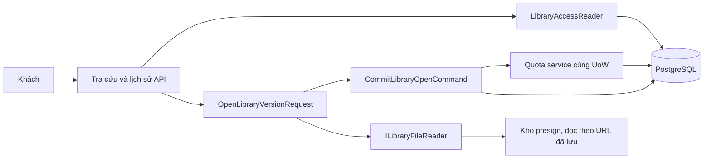
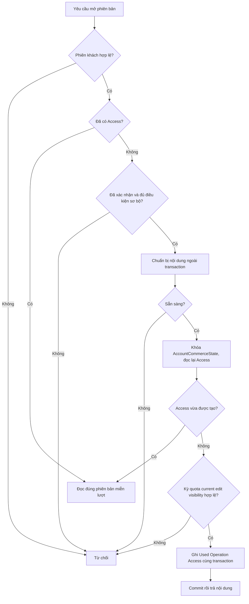
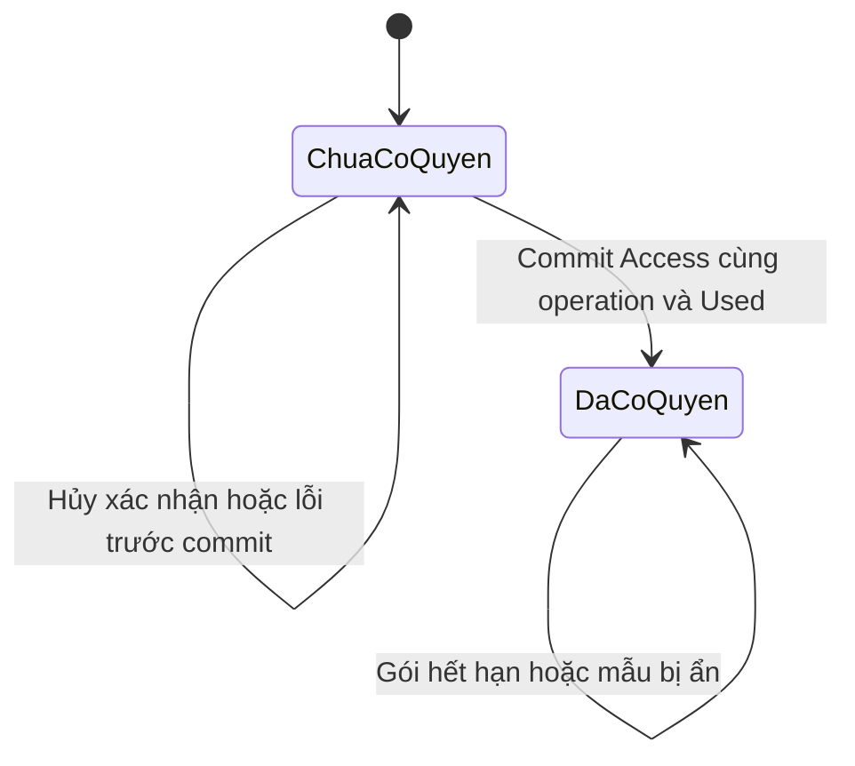
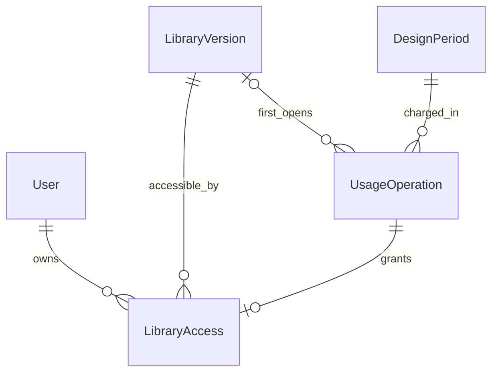

<!-- HƯỚNG DẪN CHO AI KHI ĐIỀN HOẶC CHỈNH SỬA MẪU
- Đọc toàn bộ mẫu, các comment hướng dẫn và tài liệu nguồn được cung cấp trước khi viết. Tuân thủ các quy tắc nghiệp vụ, điều kiện, ngoại lệ và giới hạn đã được xác nhận.
- Không bịa, tự chế hoặc suy đoán thành sự thật: yêu cầu, quy tắc, số liệu, API, schema, mã lỗi, nguồn tham khảo, người phụ trách và kết quả kiểm thử phải có căn cứ. Nội dung ví dụ trong mẫu không phải dữ kiện của dự án.
- Khi thiếu thông tin hoặc các nguồn mâu thuẫn, hỏi người dùng để làm rõ; giữ nguyên placeholder ở phần chưa xác định. Không tự chọn đáp án, lấp chỗ trống hay tuyên bố tài liệu đã hoàn tất.
- Chỉ thay nội dung cần điền hoặc được yêu cầu sửa. Không tự mở rộng phạm vi, sửa nghĩa quy tắc, bỏ điều kiện/ngoại lệ, xoá hay ghi đè nội dung hợp lệ đã có.
- Giữ nguyên tên, cấp và thứ tự heading, nhãn in đậm, tiền tố bullet, cấu trúc danh sách, tên/thứ tự/số cột bảng và cú pháp code fence. Không dịch, đổi tên, gộp hoặc thêm mục ngoài cấu trúc mẫu.
- Chỉ lặp khối luồng, AC hoặc API theo đúng khuôn khi có căn cứ; chỉ bỏ phần tuỳ chọn khi hướng dẫn riêng của mẫu cho phép và đã xác định không áp dụng.
- Mã tham chiếu và section phải trỏ tới tài liệu có thật đã được cung cấp hoặc kiểm chứng. Không giữ mã ví dụ như tham chiếu thật và không tự tạo tài liệu liên quan để hợp thức hoá liên kết.
- Giữ các comment hướng dẫn trong file. Xuất Markdown UTF-8, mỗi file một tài liệu; không bọc toàn bộ file trong code fence, không chèn lời dẫn hay giải thích ngoài mẫu.
- Trước khi bàn giao, đối chiếu nội dung với nguồn, kiểm tra cấu trúc, giá trị cho phép, giới hạn độ dài và tính nhất quán của mã/tham chiếu. Báo rõ phần chưa đủ thông tin; không tuyên bố đã chạy test hoặc import khi chưa thực hiện.
-->

<!-- Thay mã TDD-001 và nội dung ví dụ; giữ nguyên heading và nhãn in đậm.
Sơ đồ dùng mermaid, plantuml hoặc URL. Giữ heading Architecture, Sequence Diagram, Activity Diagram, State Diagram, Data Model.
Ví dụ API phải có heading trùng METHOD /path trong Endpoints. Xoá phần API/sơ đồ không dùng.
Version, Updated At và Change Log do lịch sử phiên bản quản lý, để trống khi nhập mới.
Author/Reviewer là tên hiển thị; gán tài khoản, phê duyệt, giả định và câu hỏi mở trên giao diện sau import.
Thiết kế phải truy vết về Story và Business Rule được cung cấp. Phân biệt thiết kế đề xuất với implementation đã kiểm chứng; không mô tả API/schema/sơ đồ ví dụ như hệ thống thật hoặc tự quyết định nghiệp vụ còn thiếu.
BẮT BUỘC KHI HOÀN THIỆN MẪU: phải có cả Reviewer và Approver, mỗi tên 1–200 ký tự sau khi bỏ khoảng trắng đầu/cuối. Không xoá hai dòng metadata, để trống, dùng tên bịa hoặc giữ placeholder rồi coi là hoàn tất.
Nếu chưa biết người review hoặc người phê duyệt, phải hỏi người dùng và báo tài liệu chưa đủ thông tin; không tự lấy Author/Owner làm người thay thế. Tên trong file không tự gán tài khoản hoặc xác nhận đã duyệt; gán thành viên trên giao diện sau import.
Đây là yêu cầu hoàn thiện mẫu; backend hiện vẫn nhận file cũ thiếu hai trường để tương thích.

VALIDATION CHO FILE NHẬP (đối chiếu ImportSnapshotValidator, MarkdownParser và ImportService):
- Mỗi file .md UTF-8 không rỗng chỉ có một heading cấp 1 chứa mã tài liệu dài 1–100 ký tự. Mã không được trùng trong cùng lần nhập hoặc thuộc loại tài liệu khác đã tồn tại.
- Không dùng tên README.md hoặc sitemap.md vì importer bỏ qua. Giao diện nhận .md/.zip, tối đa 2.000 file, tổng file tải lên 31 MiB; API giới hạn request 32 MiB và tổng nội dung đọc/giải nén 64 MiB.
- Chỉ nhập đè tài liệu cùng loại đang Draft, chưa có phiên bản và chưa lưu trữ. Import thay toàn bộ nội dung bản nháp, vì vậy phải giữ lại nội dung hợp lệ ngoài phần được yêu cầu sửa.
- Không dùng Status trong Markdown hoặc tên Approver để tự xác nhận phê duyệt; import không cấp quyền hay gán tài khoản từ tên. Chạy Kiểm tra file và xử lý lỗi/cảnh báo trước khi nhập.
- Giới hạn độ dài bên dưới tính theo string.Length của .NET (đơn vị UTF-16); không tự cắt ngắn dữ kiện quan trọng để vượt validation, hãy viết lại có căn cứ hoặc hỏi người dùng.
- Feature tối đa 300 ký tự và được dùng làm tiêu đề tài liệu. Status được parser nhận: Draft / In Review / Approved / Deprecated; tài liệu nhập mới vẫn có trạng thái phê duyệt Draft.
- Endpoint: đường dẫn tối đa 500 ký tự; tên/mô tả endpoint được lưu trong Name tối đa 300. HTTP method: GET / POST / PUT / PATCH / DELETE / HEAD / OPTIONS.
- Error Codes: mã tối đa 100 ký tự, không trùng trong tài liệu; giữ dạng - **CODE** (400): mô tả. HTTP status trong Error Codes và Response phải là số nguyên đọc được bằng Int32; không tự đặt status khác hợp đồng API.
- URL sơ đồ tối đa 1.000 ký tự. Mục sơ đồ được sử dụng phải có khối mermaid/plantuml hoặc URL theo mẫu; không để một mục sơ đồ rỗng. Nhãn mục được tách từ bullet như tên External API Fields tối đa 300 ký tự.
- Heading Examples phải khớp METHOD /path ở Endpoints. Giữ các nhãn Request:, Response 200: (thay mã theo contract) và Error Response: để parser tách đúng dữ liệu.
- Tham chiếu dạng DOC-KEY/section: ghi chú: mã đích tối đa 100 ký tự, section tối đa 100, ghi chú tối đa 1.000. Không trùng bộ mã đích + section + loại liên kết trong cùng tài liệu.
ĐỐI CHIẾU FORM TDD (src/features/tdds/validations.ts; form có thể chặt hơn import):
- Điền Feature, Author, Reviewer, Problem và ít nhất một Goal; các Goal/Non-goal/Notes đã thêm không được rỗng. API đã khai báo phải có endpoint và mô tả/mục đích; Fields phải có tên và ý nghĩa; Error Codes phải có mã, HTTP status và điều kiện.
- Form còn kiểm tra Version, Updated At và nội dung Change Log khi khai báo; với file nhập mới, giữ các trường lịch sử này trống theo hợp đồng import, không tự tạo dữ liệu lịch sử.
-->

# TDD-LIB-002

## Document Info

- **Feature**: Tra cứu thư viện mẫu — lượt, quyền xem từng phiên bản, lịch sử và tải tài nguyên
- **Author**: Codex
- **Reviewer**: Tân Trần
- **Approver**: Tân Trần
- **Status**: Draft
- **Version**:
- **Updated At**:

## Context & Goals

### Problem

Người dùng đã chốt STORY-LIB-001–003 và BR-LIB-001–003; có 28 đặc tả ST-LIB-001–028. Việc tách tài liệu không thay nghiệp vụ, schema hoặc API đã đề xuất. Đây là thiết kế để chốt, chưa phải implementation hoặc kết quả kiểm thử.

Tài liệu này sở hữu LibraryAccess, phần bổ sung UsageOperation và các API tra cứu/lịch sử/tải file. Định nghĩa nội dung, file, phiên bản và catalog được dùng lại từ [TDD-LIB-001](TDD-LIB-001.md). Phần tra cứu cũ của TDD-SUB-002 được thay bằng hợp đồng ở đây.

### Goals

- Một tài khoản/phiên bản chỉ ghi nhận một lượt, kể cả gửi lại hoặc mở đồng thời.
- Xem lại miễn lượt độc lập gói; sửa tại chỗ trả nội dung mới của cùng phiên bản.
- Ghi quyền xem, chứng từ và Used cùng transaction; bảo vệ ảnh/tệp và lịch sử từng tài khoản.

### Non-goals

- Không định nghĩa lại nội dung hoặc quản trị phiên bản của TDD-LIB-001.
- Không thay thiết kế AI/cấp kỳ ngoài phần TemplateDetail.
- Không tự đặt hạn lưu quyền xem, vận hành storage hoặc triển khai code/mã test. Đặc tả Unit Test UT-LIB-033–050 đã có nhưng chưa thực thi.

## Architecture

**Hiện trạng và nền tảng transaction**

Dùng cùng hiện trạng .NET 8/EF Core/Npgsql/PostgreSQL 15 đã xác minh ở [TDD-LIB-001/Architecture](TDD-LIB-001.md#architecture). UoW phải scoped; command ghi phải được TransactionPipelineBehavior nhận diện; lỗi sau ghi phải rollback bằng exception. Không mở transaction lồng hoặc gọi HTTP tới URL tệp khi giữ transaction ghi.

**Phân chia trách nhiệm**

| Thành phần dự kiến | Trách nhiệm |
|---|---|
| OpenLibraryVersionRequest | Chuẩn bị nội dung ngoài transaction ghi; chuyển sang CommitLibraryOpenCommand khi cần mua quyền xem. |
| ILibraryQuotaService | Cổng application tới module Subscription; đọc kỳ/quyền và ghi PeriodQuota/UsageOperation trong UoW đang mở. Không tự commit. |
| LibraryAccessReader | Đọc quyền AccountId + VersionId; không kiểm lại gói cho phiên bản đã mở. |
| ILibraryFileReader (dự kiến) | Đọc tệp từ URL đã lưu trong LibraryAsset: thăm dò trước khi tính lượt và mở luồng đọc có Range để backend chuyển tiếp tệp (đã xác nhận ngày 26/09/2026, xem bên dưới). Chỉ gọi URL đã lưu, không nhận URL từ request. Không ghi hay xóa tệp. |



**Quyền và biên dữ liệu**

Người có `library.manage` (kiểm theo mã quyền, không theo tên vai trò Admin; BR-RBAC-001, BR-RBAC-011) preview bản nháp/current/old không tính quota và không tạo lịch sử khách. Không dùng preview quản trị để cấp quyền xem cho tài khoản khách. Khách mở chi tiết/history phải có phiên Customer hợp lệ; AccountId lấy từ phiên, không nhận từ body. Phiên bị khóa/thu hồi vẫn bị từ chối: xem lại miễn gói không có nghĩa bỏ kiểm xác thực.

Permission library.manage được định nghĩa tại TDD-LIB-001; endpoint khách lấy AccountId từ phiên, không từ body. POST mở dùng cookie được kiểm Origin theo [TDD-AUTH-001](TDD-AUTH-001.md). Danh sách và thumbnail công khai theo TDD-LIB-001 không được trả manifest bảo vệ.

**Lượt và quyền xem: cùng lưu hoặc cùng hoàn tác**

`LibraryAccess` lưu một quyền xem của một tài khoản đối với một phiên bản; `UsageOperation` là chứng từ lượt đã dùng ở kỳ nào. Hai bảng có chức năng khác nhau và ghi trong cùng transaction với tăng Used. Lịch sử được đọc từ Access JOIN Version JOIN UsageOperation; không thêm bảng History hoặc Favorite.

Luồng mở lần đầu:

1. Xác thực. Đọc Access trước: nếu đã có thì mở đúng phiên bản miễn lượt, không kiểm IsHidden/gói/current như điều kiện mở mới. Không lấy bytes phản hồi cũ từ UsageOperation; đọc nội dung hiện tại của VersionId đó.
2. Nếu chưa có Access: cần `confirmUse=true`, VersionId cụ thể và expectedEditVersion lấy từ access-info. Không tự thay bằng phiên bản mới nhất sau khi khách xác nhận. Kiểm sơ bộ gói/quyền để tránh chuẩn bị cho yêu cầu chắc chắn bị từ chối.
3. Chuẩn bị manifest nội dung và kiểm tài nguyên sẵn sàng ngoài transaction ghi; chỉ đọc metadata theo trang và thăm dò URL tệp đã lưu (ví dụ HTTP HEAD, có timeout), không tải hết bytes vào RAM. Tất cả asset tham chiếu phải có dòng LibraryAsset và URL đọc được khi chuẩn bị. Giữ bước thăm dò để lỗi đọc tệp trước khi ghi nhận không tính lượt (BR-LIB-003 khoản 7); cần kiểm kho presign có hỗ trợ HEAD không. Có thể xử lý theo lô; không áp giới hạn nghiệp vụ số file. Lỗi chuẩn bị chưa cấp Access, chưa trừ lượt. Chưa gửi nội dung bảo vệ cho khách.
4. CommitLibraryOpenCommand dùng transaction ngắn, thứ tự khóa bên dưới. Đọc lại Access sau khi lấy khóa AccountCommerceState của khách; nếu đã có do yêu cầu khác thắng thì không tính thêm; kết thúc transaction và đọc lại manifest theo EditVersion mới nếu bản chuẩn bị đã cũ, không gửi dữ liệu chuẩn bị lỗi thời. Nếu chưa có, kiểm gói current còn hiệu lực, LifecycleState cho phép dùng, quyền `catalog.detail`, số dư hữu hạn `Limit-Used-Reserved>0` hoặc unlimited; kiểm Template vẫn công khai và VersionId vẫn current, EditVersion vẫn khớp dữ liệu đã chuẩn bị.
5. Ghi UsageOperation Succeeded cho TemplateDetail, tăng Used đúng 1 và tạo Access trong cùng transaction. Unlimited vẫn ghi Used phục vụ thống kê nhưng không bị chặn bởi Limit; Reserved không đổi. Commit trước khi trả chi tiết.
6. Mất phản hồi sau commit: lần sau Access đã tồn tại nên mở miễn lượt, kể cả khác key, khác kỳ, hết hạn hoặc mẫu đã ẩn. Không thêm API trình duyệt xác nhận nhận đủ bytes rồi mới tính lượt.

Điểm thành công là server đã chuẩn bị được nội dung chi tiết cùng tham chiếu tài nguyên hợp lệ và commit quyền xem/lượt, không phải khách đã tải xong tất cả PDF/CAD. Nếu đọc tệp lỗi ở lần tải sau, trả lỗi và cho tải lại miễn lượt, không tự hoàn lượt đã ghi nhận. Tính nhất quán giữa thăm dò và commit dựa vào việc URL của LibraryAsset không bị sửa và URL do dịch vụ presign trả là cố định (TDD-PROJ-001). Tệp vẫn có thể bị thay hoặc xóa ở kho ngoài hệ thống; backend không thể hứa kho không gặp sự cố ngay sau bước thăm dò.

`OperationKey` cho TemplateDetail được server dựng cố định `lib-open:{VersionId}` trong phạm vi AccountId; RequestHash là SHA-256 của `TemplateDetail + TemplateId + VersionId`. Không đưa EditVersion vào hash vì sửa tại chỗ không tạo đối tượng tính lượt mới. Thêm UNIQUE(AccountId,TemplateVersionId) WHERE UsageKind='TemplateDetail'. Chống trùng không phụ thuộc client nhớ key. Header Idempotency-Key cũ nếu gửi không quyết định một lượt mới; endpoint LIB không cần header đó. Admin mutation vẫn cần key/hash riêng.

**Khóa, thời điểm kiểm tra và lỗi đồng thời**

Mọi ghi dùng PostgreSQL READ COMMITTED và cùng connection/UoW. Cách lấy khóa là SELECT có tham số và FOR UPDATE/FOR SHARE, không coi EF tracking là khóa. Khóa được giữ đến cuối transaction theo [PostgreSQL 15](https://www.postgresql.org/docs/15/explicit-locking.html).

| Luồng | Thứ tự khóa, đọc lại và commit |
|---|---|
| Mở mới | AccountCommerceState của khách FOR UPDATE (tạo trước bằng INSERT ON CONFLICT DO NOTHING nếu chưa có, theo TDD-PAY-001) → dữ liệu kỳ/quota theo thứ tự TDD-SUB-002 → Template FOR SHARE → Version FOR SHARE. Đọc lại quyền Access ngay sau khóa AccountCommerceState; không lấy khóa catalog vì phân loại version đã ghim. |
| Mutation quản trị | User người thao tác FOR UPDATE để tuần tự receipt → EstimateCatalog FOR SHARE khi cần revalidate → Template FOR UPDATE → Version theo Id tăng dần. Không lấy khóa account khách hoặc quota sau Template. |
| Thay đổi catalog | Theo PROJ, khóa singleton catalog và tạo revision mới; không quay ngược đọc/khóa Template của LIB. |
| Xem lại/đọc nội dung | SELECT projection nhất quán; nhiều truy vấn metadata dùng read-only REPEATABLE READ ngắn hoặc một truy vấn; kết thúc transaction trước khi gọi URL tệp. Không giữ transaction lúc truyền file. |

**Vì sao khóa AccountCommerceState thay cho User**: AccountCommerceState (TDD-PAY-001/Data Model) là điểm tuần tự hóa chung cho mọi thao tác đụng tới gói và lượt của một khách: mua, gán, hủy, khôi phục gói (TDD-PAY-001), nhận/chốt tác vụ AI (TDD-PROJ-002) và mở mẫu ở đây. Nếu luồng mở mẫu chỉ khóa User, một lần hủy/đổi gói khóa AccountCommerceState có thể chạy song song với lần trừ lượt tra cứu mà không phải chờ nhau, dẫn tới trừ lượt trên kỳ vừa bị thay. Khi mọi luồng lấy AccountCommerceState trước rồi mới tới kỳ/quota, các thao tác của cùng khách nối đuôi nhau và không tạo vòng chờ khóa. Luồng mở mẫu chỉ lấy khóa, không đổi cột nào của AccountCommerceState. Đánh đổi: mở mẫu phải chờ nếu cùng lúc khách đang thanh toán hoặc nhận AI; các transaction đều ngắn và không giữ khóa khi gọi kho tệp.

Khóa SHARE trên Template/Version cho nhiều khách mở cùng mẫu nhưng chặn sửa/ẩn/công bố chen vào đoạn commit. Hai lần mở cùng tài khoản nối đuôi ở AccountCommerceState; lần sau thấy Access, không bị báo hết lượt chỉ vì lần đầu vừa dùng lượt cuối. Hai phiên bản khác nhau tranh lượt cuối vẫn theo mutex account. UNIQUE bảo vệ lớp cuối nếu một đường ghi sai quy ước khóa.

Chuẩn bị xong nhưng EditVersion/current đổi: trả 409 LibraryVersionChanged trước ghi và không trừ lượt; UI tải access-info mới và yêu cầu xác nhận lại, không âm thầm mua bản khác. Nếu Access đã tồn tại thì không cần xác nhận mới; trả dữ liệu phiên bản đã có quyền. Khi rollback/deadlock, không thử lại riêng câu tăng Used; retry toàn transaction bằng cùng định danh mở, theo chính sách vận hành sẽ cấu hình. Không đặt retry vô hạn.

**Tải tài nguyên và ranh giới storage**

Theo quyết định ngày 26/09/2026, backend không có kho tệp riêng: tệp nằm ở kho presign, tại URL https công khai và cố định, backend chỉ lưu URL trong `LibraryAsset.Url` ([TDD-LIB-001/Architecture](TDD-LIB-001.md#architecture)). Route tải vẫn kiểm quyền xem đúng VersionId và asset còn thuộc phiên bản đó trước khi phục vụ tệp. Thumbnail public dùng route riêng chỉ phục vụ cover current không ẩn. Khi thay ảnh đại diện trong cùng phiên bản, server không bỏ link ảnh cũ trước khi LibraryAsset mới được lưu và mutation commit. Các tệp đã được gỡ khỏi current không còn được cấp qua route của current; asset còn tham chiếu từ phiên bản cũ vẫn đọc được qua phiên bản cũ hợp lệ.

**Đã xác nhận ngày 26/09/2026 — backend chuyển tiếp tệp, không lộ URL gốc.** BR-LIB-003 khoản 8 yêu cầu người chưa có quyền xem không lấy được ảnh chi tiết hoặc tệp bằng đường dẫn trực tiếp. Vì URL ở kho presign công khai và không hết hạn, ai có URL gốc là mở được tệp mà không qua kiểm quyền của backend. Người dùng chọn cách backend chuyển tiếp tệp, giống tải tệp qua link chia sẻ ở [TDD-PROJ-003](TDD-PROJ-003.md):

- Nội dung được bảo vệ (ảnh chi tiết, tệp đính kèm, cover trong lịch sử) chỉ tải qua route `.../assets/{assetId}/content` của backend. Route kiểm quyền xem đã mở của đúng VersionId và asset còn thuộc phiên bản, rồi mới đọc URL đã lưu và stream tệp về. Chuyển tiếp header `Range` nếu kho hỗ trợ; đặt `Cache-Control: private, no-store`. API không trả URL gốc ở kho cho khách, kể cả người đã có quyền xem.
- Thumbnail công khai (TDD-LIB-001) dùng cùng cách chuyển tiếp để không lộ URL gốc của ảnh cover. Header cache của thumbnail chưa chốt.
- `ILibraryFileReader` chỉ gọi URL đã lưu trong `LibraryAsset.Url`, không nhận URL từ request.

Ví dụ: khách K đã mở phiên bản V1 và gửi `GET /api/v1/library-versions/V1/assets/F2/content`. Backend kiểm Access của K với V1 và F2 còn thuộc V1, rồi đọc `https://cdn.example.test/lib/m1/ban-ve.pdf` và trả nội dung tệp với tên tải xuống `ban-ve.pdf`; phản hồi không chứa URL gốc. Nếu K gửi link route này cho người chưa mở V1, người đó nhận 403 `AccessForbidden`.

Giới hạn: tốn băng thông và kết nối của API. Người đã biết URL gốc (người quản lý, hoặc URL bị lộ từ kho) vẫn mở được vì kho công khai; backend không thu hồi được tệp người dùng đã tải về máy.

Upload, kiểm URL và schema asset do TDD-LIB-001 định nghĩa. TDD này chỉ đọc URL đã lưu (thăm dò và chuyển tiếp), không ghi hay xóa tệp ở kho và không thêm hạn mức tải.

**Nơi thực hiện quy tắc và kiểm chứng**

| Quy tắc | Nơi thực hiện | Đặc tả hệ thống | Đặc tả Unit Test |
|---|---|---|---|
| BR-LIB-003: lượt/quyền/lịch sử | AccessReader + quota service + transaction | ST-LIB-017–023, ST-LIB-026–028 | UT-LIB-033–043, UT-LIB-047–049 |
| BR-LIB-003: tài nguyên và cách ly | Download policy; account từ phiên | ST-LIB-024–025 | UT-LIB-044–046, UT-LIB-050 |

Đặc tả UT-LIB-033–050 kiểm luồng mở, quyền xem, lượt, lịch sử và tải tài nguyên ở biên unit; chưa có mã test hoặc kết quả chạy. Không dùng mock để kết luận mutex/UNIQUE/rollback đúng. Integration dùng PostgreSQL 15 thật và hai connection cho lượt cuối, cùng phiên bản, đổi kỳ, sửa/công bố chen lúc mở. Kiểm với kho presign thử: thăm dò URL lỗi hoặc hết thời gian trước khi ghi nhận, chuyển tiếp tệp có Range. Bổ sung thực nghiệm công bố lúc xác nhận và tệp lớn trên môi trường thử; không báo đạt từ việc viết đặc tả.

Đặc tả UT-LIB-033, UT-LIB-034, UT-LIB-042 và UT-LIB-046 đã được viết lại ngày 26/09/2026 theo `ILibraryFileReader` và cách chuyển tiếp tệp; hành vi mong đợi (lỗi chuẩn bị không tính lượt, tải có kiểm quyền) không đổi.

**Notes**:

- Không thêm broker, outbox hoặc database khác. Quota/Access/nội dung cùng PostgreSQL; tệp nằm ở kho presign ngoài backend và được thăm dò trước transaction ghi. [EF Core transactions](https://learn.microsoft.com/en-us/ef/core/saving/transactions).
- Log operationId/accountId/versionId/editVersion, kết quả Granted/Reused/Denied/Conflict, không log token, signed URL hay bytes. Theo dõi lỗi đọc tệp, thời gian chờ khóa, cấp quyền thất bại và lệch Access/UsageOperation; chưa đặt ngưỡng cảnh báo khi chưa có tải thực.
- Timeout khi thăm dò và chuyển tiếp tệp, RPO/RTO và việc giữ tệp là phần vận hành chưa có số liệu; tệp do dịch vụ presigned URL quản lý. Backup của backend chỉ gồm URL; cần thống nhất với bên vận hành kho để quyền xem không trỏ tới tệp đã mất trước khi mở production.

## Sequence Diagram

```mermaid
sequenceDiagram
    actor C as Khách
    participant API as LIB
    participant STORE as Kho presign (URL đã lưu)
    participant DB as PostgreSQL
    participant SUB as Quota cùng UoW
    C->>API: POST open versionId, expectedEditVersion, confirmUse
    API->>DB: Đọc Access theo account và version
    alt Đã có quyền
        API->>DB: Đọc nội dung phiên bản hiện tại
        API-->>C: 200 miễn lượt
    else Chưa có quyền
        API->>STORE: Thăm dò URL tệp ngoài transaction
        alt Chuẩn bị lỗi
            API-->>C: 503, chưa tính lượt
        else Sẵn sàng
            API->>DB: Begin, khóa AccountCommerceState và đọc lại Access
            alt Yêu cầu khác đã cấp quyền
                API->>DB: Commit không ghi lượt
            else Chưa có quyền
                API->>SUB: Khóa/kiểm kỳ và quota
                API->>DB: Khóa SHARE Template/Version; kiểm current/edit/hidden
                API->>SUB: Used + 1, UsageOperation Succeeded
                API->>DB: Insert Access; commit cùng quota
            end
            API-->>C: 200 đúng version; mất mạng không trừ lại
        end
    end
```

## Activity Diagram



## State Diagram



Sơ đồ áp dụng riêng từng cặp AccountId/VersionId; không thêm cột State vào LibraryAccess. Công bố V2 không đổi quyền V1 và không tự cấp quyền V2. Khóa/thu hồi phiên vẫn chặn yêu cầu dù Access còn tồn tại.

## Data Model

**Quy ước và bảng dùng lại**

UUID, timestamptz/UTC, PascalCase, NN là NOT NULL; FK ON DELETE RESTRICT. Dùng lại LibraryTemplate/Version/Asset/VersionAsset theo [TDD-LIB-001/Data Model](TDD-LIB-001.md#data-model), gồm dữ liệu mẫu M1/V1/V2 và F1/F2/F3. Không định nghĩa lại các bảng nội dung. User từ RBAC; DesignPeriod/PeriodQuota/UsageOperation từ TDD-SUB-002 cùng LifecycleState TDD-SUB-005. AccountCommerceState theo [TDD-PAY-001/Data Model](TDD-PAY-001.md#data-model): luồng mở mẫu chỉ dùng dòng của khách làm khóa tuần tự hóa, không ghi cột nào. Tài khoản từ phiên là biên cách ly, không thêm tenant.

**LibraryAccess — quyền xem của tài khoản**

Một dòng là quyền xem một phiên bản do lần mở thành công đầu tiên cấp. CommitLibraryOpenCommand tạo cùng UsageOperation Succeeded và tăng Used. Không đổi/xóa khi hết gói, ẩn mẫu hoặc có phiên bản mới. Ngày mở lấy từ SettledAtUtc, không sao chép số dư/nội dung.

| Bảng | Cột, khóa và CHECK |
|---|---|
| LibraryAccess | AccountId uuid NN FK User; VersionId uuid NN FK Version; UsageOperationId uuid NN UNIQUE; PK(AccountId,VersionId). FK(AccountId,VersionId,UsageOperationId) → UsageOperation(AccountId,TemplateVersionId,Id). Không lưu ngày hết hạn, tên, số dư hoặc bản sao nội dung. FirstOpenedAt đọc từ SettledAtUtc của operation. |

**Thay đổi UsageOperation cho tra cứu**

Thêm `TemplateVersionId uuid NULL` FK LibraryVersion. Với TemplateDetail bắt buộc có TemplateVersionId, State=Succeeded, SettledAtUtc NN, DeadlineUtc/ResponseBody/ResponseContentType NULL; ResourceId là TemplateId và FK ghép `(ResourceId,TemplateVersionId)` tới Version(TemplateId,Id). ContentVersion lưu EditVersion dạng chuỗi tại thời điểm cấp, chỉ để đối soát; không dùng để khóa nội dung xem lại. Với DesignGeneration, TemplateVersionId NULL và giữ nguyên quy tắc AI.

Thêm UNIQUE(AccountId,TemplateVersionId,Id) làm đích FK Access và UNIQUE có lọc `(AccountId,TemplateVersionId) WHERE UsageKind='TemplateDetail'`. OperationKey/hash server xác định như Architecture. ResponseBody không còn là nguồn nội dung LIB. Không xóa các cột khỏi bảng trong lần này để tránh ảnh hưởng thiết kế khác; sửa CHECK theo UsageKind.

Access chỉ được tạo cùng operation Succeeded và quota Used trong một transaction. FK ngăn gắn chứng từ của người khác/phiên bản khác; một operation chỉ cấp một Access. Đối soát phát hiện operation tra cứu thiếu Access phải coi là lỗi nhất quán, không tự tính thêm lượt để sửa. Không xóa operation đang được Access tham chiếu khi dọn lịch sử kỳ.

**ERD và quan hệ**



Mỗi Access có đúng một operation Succeeded khớp tài khoản/phiên bản; operation AI không có Access và TemplateVersionId NULL. TemplateDetail phải có TemplateVersionId. Không xóa Version hoặc operation khi Access còn tham chiếu; không coi bảng Access là bản sao ledger tính lượt.

**Dữ liệu mẫu và thay đổi lượt**

Dữ liệu giả định, bí danh thay UUID, lược cột; không phải SQL seed. Dùng cùng M1/V1/V2, U1, DP1/Q1 và T1<T2<T3 UTC như TDD-LIB-001/Data Model. Q1 Limit=20, Used=0, Reserved=0 trước mở.

| Bảng | Dòng dữ liệu lưu thực tế (cột chọn lọc) |
|---|---|
| AccountCommerceState (dùng lại) | AccountId=U1; các cột thứ tự đơn giữ nguyên trước và sau khi mở mẫu. Luồng mở chỉ khóa FOR UPDATE dòng này; mẫu cột đầy đủ tại TDD-PAY-001/Data Model. |
| UsageOperation | Id=OP1; AccountId=U1; PeriodId=DP1; BenefitId=quyền catalog.detail; UsageKind=TemplateDetail; ResourceId=M1; TemplateVersionId=V1; OperationKey=lib-open:V1 (V1 thực tế là UUID); State=Succeeded; AcceptedAtUtc=SettledAtUtc=T2; ContentVersion=1; ResponseBody/ResponseContentType/DeadlineUtc=NULL. RequestHash là SHA-256 bộ định danh. |
| LibraryAccess | AccountId=U1; VersionId=V1; UsageOperationId=OP1. Không có cột số dư hoặc nội dung. |

Sau mở đầu tiên, Q1 Used=1 và Access U1/V1 cùng tồn tại; mất mạng rồi mở lại không tạo OP2. A1 sửa tên và thay ảnh F1 bằng F3: V1.EditVersion=2, cover/link trỏ F3; M1.CurrentVersionId vẫn V1. U1 xem lịch sử thấy tên/ảnh mới nhưng Used vẫn 1. F1 không bị ghi đè.

Tạo nháp V2: TemplateId=M1, BaseVersionId=V1, State=Draft, Number/PublishedAtUtc NULL, EditVersion=1; các link sao lại dùng F3/F2. Sửa nháp không đổi V1. Khi công bố ở T3 sau khi catalog thành C2, V2 phải dùng tầng 2 và C2; V1 tiếp tục C1/tầng 3. M1.CurrentVersionId=V2, V2.Number=2, V2.State=Published; V1 không còn sửa được. U1 mở V2 đủ điều kiện tạo OP2 và Access U1/V2, Q1 Used=2; lịch sử có hai dòng. Gói hết hạn hoặc M1.IsHidden=true không xóa hai dòng này.

Lỗi trước commit OP2: quota và Access/operation đều không đổi. Xóa một nháp V3 để lại receipt Operation=DeleteDraft, ResultVersionId=V3; không có FK để receipt ngăn xóa nháp. Nếu kỳ không giới hạn, Used vẫn tăng cho OP1, Limit=NULL; quyền U1/V1 không phụ thuộc Limit về sau.

**Chuẩn hóa, index và migration**

Quyền xem phụ thuộc AccountId+VersionId; UsageOperationId unique. Nội dung chỉ ở Version; số dư chỉ ở PeriodQuota. Access không giữ snapshot, FirstOpenedAt lấy từ chứng từ.

Access PK(AccountId,VersionId) phục vụ kiểm quyền; index VersionId phục vụ FK/tra tham chiếu. UsageOperation(AccountId,SettledAtUtc DESC,Id DESC) WHERE UsageKind=TemplateDetail phục vụ lịch sử; UNIQUE theo account/phiên bản như trên chống trừ trùng. History phân trang, sort SettledAtUtc DESC rồi VersionId DESC; tài nguyên phân trang theo Position/AssetId và expectedEditVersion, xung đột giữa hai trang trả 409 để đọc lại.

Tạo bảng Version của TDD-LIB-001 trước khi thêm TemplateVersionId/FK vào UsageOperation và tạo Access. Nếu môi trường có lượt kiểu cũ, cần đối soát ánh xạ version trước backfill; không gán toàn bộ vào current hoặc tự hoàn/tính lại lượt. Không drop Access/operation/asset có người đã xem khi rollback; ưu tiên tắt route rồi sửa tiếp. Không chạy migration trong tác vụ này.

## Internal API

### Endpoints

Route đề xuất; AccountId lấy từ phiên. POST mở được kiểm Origin theo [TDD-AUTH-001](TDD-AUTH-001.md) nhưng không dựa Idempotency-Key của client để tính lượt. Định danh lượt là account/version. Danh sách công khai và mutation quản trị theo TDD-LIB-001/Internal API.

- **GET** `/api/v1/design-templates/{templateId}/access-info` — Phiên khách; trả currentVersionId,editVersion,alreadyOpened,requiresConfirmation,canOpen,deniedCode; không trả nội dung bảo vệ. Chỉ là gợi ý, POST kiểm lại.
- **POST** `/api/v1/design-templates/{templateId}/open` — Phiên khách; `{versionId,expectedEditVersion,confirmUse}`. Trả `{templateId,versionId,number,editVersion,charged,detailUrl}`. Đã có Access thì charged=false, không yêu cầu confirmUse hoặc gói; chưa có phải confirmUse=true và điều kiện hiện hành.
- **GET** `/api/v1/me/library-history` — Phiên khách; phân trang các version có Access, sort ngày mở đầu tiên DESC rồi VersionId DESC; mỗi version một dòng, có tên/cover theo nội dung version đó, kể cả hidden/old. Không dùng public thumbnail route cho cover cũ, dùng route file có quyền.
- **GET** `/api/v1/library-versions/{versionId}` — Phiên khách có Access hoặc Staff có library.manage; trả metadata, cover reference và URL trang assets. Không tự mua quyền xem qua GET.
- **GET** `/api/v1/library-versions/{versionId}/assets` — Cùng quyền đọc version, query pageIndex/pageSize/expectedEditVersion, phân trang theo Position,AssetId; trả editVersion và assetId,kind,name,size,contentUrl; `contentUrl` là route content bên dưới, không trả URL gốc ở kho (đã xác nhận ngày 26/09/2026, Architecture). expectedEditVersion khác EditVersion hiện tại thì trả 409 LibraryVersionChanged để client tải lại từ trang đầu, không ghép danh sách của hai lần sửa.
- **GET** `/api/v1/library-versions/{versionId}/assets/{assetId}/content` — Kiểm quyền version và membership; backend đọc URL đã lưu và stream ảnh hoặc tệp đính kèm về (tên tải xuống lấy từ OriginalName), chuyển tiếp Range hợp lệ nếu kho hỗ trợ. Không tính lượt. AssetId không thuộc phiên bản, kể cả tài nguyên đã gỡ khi sửa tại chỗ, trả 404 LibraryNotFound trước khi gọi URL tệp.

### Examples

#### POST /api/v1/design-templates/{templateId}/open

```
Request:
{"versionId":"10000000-0000-0000-0000-000000000001","expectedEditVersion":2,"confirmUse":true}

Response 200:
{"templateId":"20000000-0000-0000-0000-000000000001","versionId":"10000000-0000-0000-0000-000000000001","number":1,"editVersion":2,"charged":true,"detailUrl":"/api/v1/library-versions/10000000-0000-0000-0000-000000000001"}

Error Response:
{"code":"LibraryVersionChanged","detail":"Nội dung hoặc phiên bản đã thay đổi. Vui lòng xem lại trước khi xác nhận lượt."}
```

Mở lại cùng VersionId trả charged=false kể cả key khác và gói hết hạn. Sau sửa tại chỗ có thể trả editVersion lớn hơn 2; không lấy dữ liệu cũ từ lần mở đầu. Response minh họa phần payload, khi triển khai bọc Result theo ApiEndpoint của repo.

### Error Codes

- **Unauthorized** (401): Phiên thiếu/không hợp lệ; dùng mã xác thực hiện có khi tích hợp.
- **AccessForbidden** (403): Thiếu library.manage hoặc không có Access cho đọc nội dung; không trả tài nguyên bảo vệ.
- **LibraryNotFound** (404): Mẫu/version không tồn tại, không có bản public trong route công khai, hoặc tài nguyên không thuộc phiên bản được yêu cầu.
- **LibraryHidden** (409): Mẫu bị ẩn khi mở mới; không áp dụng để chặn Access đã có.
- **LibraryVersionChanged** (409): Current hoặc EditVersion đổi từ lúc chuẩn bị/xác nhận, hoặc đổi giữa hai lần tải trang tài nguyên.
- **LibraryConfirmationRequired** (409): Mở phiên bản chưa xem mà chưa xác nhận dùng lượt.
- **LibraryStorageUnavailable** (503): Thăm dò hoặc đọc tệp từ URL đã lưu bị lỗi hay hết thời gian; không tính lượt nếu trước commit mở đầu.
- **QuotaUnavailable** (409): Kỳ có quyền nhưng không còn lượt sẵn dùng; dùng hợp đồng SUB.

Thiếu gói, hết hạn/hủy hoặc thiếu quyền tra cứu dùng mã SUB hiện hành, không ánh xạ thành hết lượt. Lỗi giới hạn truyền tải/timeout của hạ tầng không phải max file nghiệp vụ.

## External API

### Endpoints

- **Kho presign — đọc theo URL đã lưu** — Backend gọi HTTP tới URL trong `LibraryAsset.Url` để thăm dò trước khi tính lượt và để chuyển tiếp tệp. Dịch vụ presigned URL nằm ngoài backend ([TDD-LIB-001/External API](TDD-LIB-001.md#external-api)); không tạo adapter lưu trữ.

### Fields

- **Url** — lấy từ LibraryAsset đã lưu, đã được kiểm tên miền `UploadedFileOption__AllowedHosts` lúc lưu; không nhận URL từ khách, nên route tải không bị dùng để gọi địa chỉ tùy ý.
- **Range** — khoảng byte hợp lệ chuyển tiếp tới kho khi kho hỗ trợ, vẫn kiểm quyền và membership trước.
- **VersionId/AssetId** — xác định tài nguyên được phép tải theo Access hoặc quyền quản trị.

### Error Handling

Chuẩn bị nội dung lỗi trước commit không tính lượt. Lỗi tải sau khi có Access cho tải lại miễn lượt; không tự hoàn lượt. Không giữ transaction khi gọi URL tệp, không xóa tệp để bù. Mất phản hồi sau commit được giải quyết bằng Access theo account/version.

### Quirks

- Kho có hỗ trợ HEAD và Range không, timeout và giới hạn hạ tầng còn cần kiểm chứng với bên cung cấp dịch vụ presign.
- Tệp ở URL công khai có thể bị thay hoặc xóa ngoài hệ thống; ai biết URL gốc vẫn mở được tệp mà không qua backend.
- Hợp đồng upload/URL/định dạng/thumbnail do TDD-LIB-001 sở hữu; đây chỉ là đường đọc có quyền.
- Không tự hết hạn Access hoặc xóa tệp lịch sử theo TTL của gói.

## References

### User Stories

- STORY-LIB-001
- STORY-LIB-002
- STORY-LIB-003
- STORY-SUB-001
- STORY-RBAC-001/Preconditions

### Business Rules

- BR-LIB-001/Then
- BR-LIB-002/Then
- BR-LIB-003/Then
- BR-SUB-005/Then
- BR-SUB-017/Then
- BR-RBAC-001/Then
- BR-RBAC-010/Then
- BR-RBAC-011/Then

### Use Cases

### Others

- Phạm vi use case: Quản lý mẫu, sửa tại chỗ, công bố phiên bản mới, ẩn/hiện và xóa nháp. Tìm/lọc, mở lần đầu, xem lại và tải tài nguyên từ lịch sử.

- [TDD-LIB-001](TDD-LIB-001.md): nguồn duy nhất cho nội dung, phiên bản, asset, receipt và API quản trị/công khai.

- Unit Test: UT-LIB-033 đến UT-LIB-050 cho mở mẫu, quyền xem, lượt, lịch sử và tải tài nguyên; UT-LIB-001 đến UT-LIB-032 thuộc TDD-LIB-001. Đặc tả chưa thực thi, chưa có mã test.

- [Bảng System Test LIB](../discovery/library-system-test-coverage.md) — đặc tả System Test chưa thực thi.
- [TDD-PROJ-001](TDD-PROJ-001.md) — catalog revision, kiểu số, UoW và quy ước lưu URL tệp.
- [TDD-PROJ-003](TDD-PROJ-003.md) — cách backend chuyển tiếp tệp qua route có kiểm link chia sẻ, dùng làm mẫu cho cách tải nội dung được bảo vệ.
- [TDD-SUB-001](TDD-SUB-001.md) — BenefitDefinition và mã catalog.detail.
- [TDD-SUB-002](TDD-SUB-002.md) — kỳ/quota; phần tra cứu được cập nhật theo TDD này.
- [TDD-SUB-005](TDD-SUB-005.md) — LifecycleState khi kiểm hiệu lực kỳ.
- [TDD-RBAC-001](TDD-RBAC-001.md) — policy/permission; LIB thêm quyền không cần Assignment.
- [TDD-PAY-001](TDD-PAY-001.md) — AccountCommerceState và thứ tự khóa thống nhất; [TDD-PROJ-002](TDD-PROJ-002.md) dùng cùng thứ tự khi nhận AI.
- Hiện trạng code: `bmt-be/src/bmt-be.persistence/ApplicationDbContext.cs`, `bmt-be/src/bmt-be.application/behaviors/TransactionPipelineBehavior.cs`, `bmt-be/src/bmt-be.persistence/repositories/EFUnitOfWork.cs`, `bmt-be/src/bmt-be.persistence/dependencyInjection/extensions/ServiceCollectionExtensions.cs`, `bmt-be/src/bmt-be.contract/constants/PermissionNames.cs`.
- Chưa hoàn tất rà soát toàn bộ chuỗi phụ thuộc ngoài LIB; các UT-SUB và phần TDD-SUB lịch sử về bytes replay cần đối chiếu khi cập nhật thiết kế được chốt. Không dùng ghi chú cũ để ghi đè BR-LIB-003.

## Change Log

- 2026-09-26 (chốt tải qua backend và kiểm tệp ở frontend): Người dùng xác nhận ngày 26/09/2026: nội dung mẫu được bảo vệ chỉ tải qua route backend có kiểm quyền xem đã mở; backend chuyển tiếp tệp, không lộ URL gốc, giống link chia sẻ của TDD-PROJ-003. Câu hỏi mở (a)/(b) ở Architecture chuyển thành quyết định đã xác nhận; thumbnail công khai dùng cùng cách chuyển tiếp. Viết lại UT-LIB-033, UT-LIB-034, UT-LIB-042, UT-LIB-046 theo `ILibraryFileReader`.
- 2026-09-26 (lưu URL tệp): Theo quyết định backend không có kho tệp riêng, tệp nằm ở kho presign và chỉ được lưu bằng URL (TDD-LIB-001). Thay `ILibraryObjectStore` bằng `ILibraryFileReader` dự kiến, chỉ đọc URL đã lưu; giữ bước thăm dò tệp trước khi tính lượt (BR-LIB-003 khoản 7). Thêm câu hỏi mở: trả URL gốc hay backend chuyển tiếp tệp, đề xuất chuyển tiếp như TDD-PROJ-003 để giữ BR-LIB-003 khoản 8; Internal API tạm viết theo đề xuất này. UT-LIB-033, UT-LIB-034, UT-LIB-042, UT-LIB-046 cần viết lại tên port sau khi chốt. Quy tắc tra cứu BR-LIB-003 không đổi.
- 2026-09-26 (CSRF): Chống CSRF dẫn tới [TDD-AUTH-001](TDD-AUTH-001.md).
- 2026-09-25: Đổi khóa đầu tiên của luồng mở mẫu lần đầu từ User khách sang AccountCommerceState, theo thứ tự thống nhất AccountCommerceState → kỳ/quota → Template/Version như TDD-PROJ-002 và TDD-PAY-001; cập nhật sơ đồ, mẫu dữ liệu và giải thích lý do. Ghi rõ quyền preview là `library.manage`, kiểm theo mã quyền; bổ sung tham chiếu STORY-RBAC-001, BR-RBAC-001 và TDD-PAY-001. Quy tắc tra cứu BR-LIB-003 không đổi.
