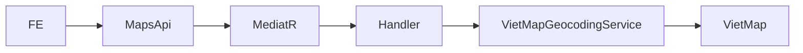
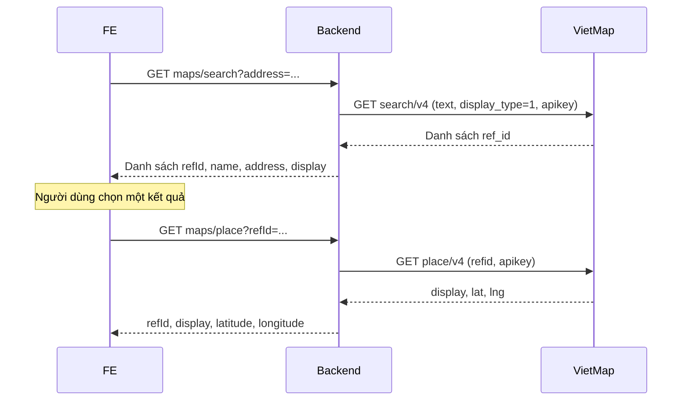
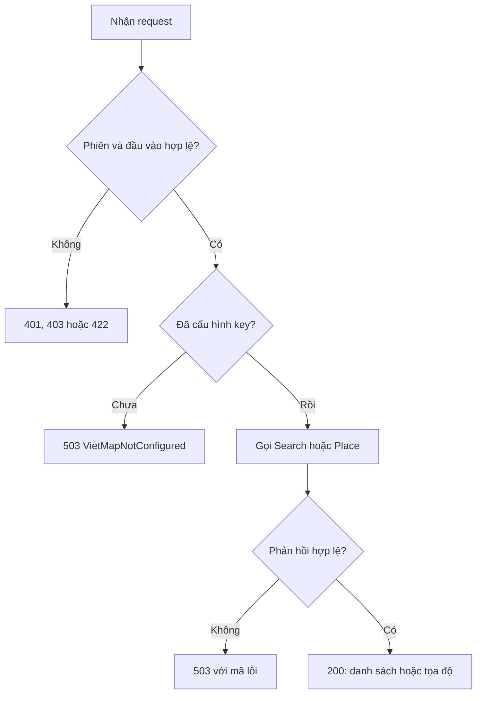

<!-- HƯỚNG DẪN CHO AI KHI ĐIỀN HOẶC CHỈNH SỬA MẪU
- Đọc toàn bộ mẫu, các comment hướng dẫn và tài liệu nguồn được cung cấp trước khi viết. Tuân thủ các quy tắc nghiệp vụ, điều kiện, ngoại lệ và giới hạn đã được xác nhận.
- Không bịa, tự chế hoặc suy đoán thành sự thật: yêu cầu, quy tắc, số liệu, API, schema, mã lỗi, nguồn tham khảo, người phụ trách và kết quả kiểm thử phải có căn cứ. Nội dung ví dụ trong mẫu không phải dữ kiện của dự án.
- Khi thiếu thông tin hoặc các nguồn mâu thuẫn, hỏi người dùng để làm rõ; giữ nguyên placeholder ở phần chưa xác định. Không tự chọn đáp án, lấp chỗ trống hay tuyên bố tài liệu đã hoàn tất.
- Chỉ thay nội dung cần điền hoặc được yêu cầu sửa. Không tự mở rộng phạm vi, sửa nghĩa quy tắc, bỏ điều kiện/ngoại lệ, xoá hay ghi đè nội dung hợp lệ đã có.
- Giữ nguyên tên, cấp và thứ tự heading, nhãn in đậm, tiền tố bullet, cấu trúc danh sách, tên/thứ tự/số cột bảng và cú pháp code fence. Không dịch, đổi tên, gộp hoặc thêm mục ngoài cấu trúc mẫu.
- Chỉ lặp khối luồng, AC hoặc API theo đúng khuôn khi có căn cứ; chỉ bỏ phần tuỳ chọn khi hướng dẫn riêng của mẫu cho phép và đã xác định không áp dụng.
- Mã tham chiếu và section phải trỏ tới tài liệu có thật đã được cung cấp hoặc kiểm chứng. Không giữ mã ví dụ như tham chiếu thật và không tự tạo tài liệu liên quan để hợp thức hoá liên kết.
- Giữ các comment hướng dẫn trong file. Xuất Markdown UTF-8, mỗi file một tài liệu; không bọc toàn bộ file trong code fence, không chèn lời dẫn hay giải thích ngoài mẫu.
- Trước khi bàn giao, đối chiếu nội dung với nguồn, kiểm tra cấu trúc, giá trị cho phép, giới hạn độ dài và tính nhất quán của mã/tham chiếu. Báo rõ phần chưa đủ thông tin; không tuyên bố đã chạy test hoặc import khi chưa thực hiện.
-->

<!-- Thay mã TDD-001 và nội dung ví dụ; giữ nguyên heading và nhãn in đậm.
Sơ đồ dùng mermaid, plantuml hoặc URL. Giữ heading Architecture, Sequence Diagram, Activity Diagram, State Diagram, Data Model.
Ví dụ API phải có heading trùng METHOD /path trong Endpoints. Xoá phần API/sơ đồ không dùng.
Version, Updated At và Change Log do lịch sử phiên bản quản lý, để trống khi nhập mới.
Author/Reviewer là tên hiển thị; gán tài khoản, phê duyệt, giả định và câu hỏi mở trên giao diện sau import.
Thiết kế phải truy vết về Story và Business Rule được cung cấp. Phân biệt thiết kế đề xuất với implementation đã kiểm chứng; không mô tả API/schema/sơ đồ ví dụ như hệ thống thật hoặc tự quyết định nghiệp vụ còn thiếu.
BẮT BUỘC KHI HOÀN THIỆN MẪU: phải có cả Reviewer và Approver, mỗi tên 1–200 ký tự sau khi bỏ khoảng trắng đầu/cuối. Không xoá hai dòng metadata, để trống, dùng tên bịa hoặc giữ placeholder rồi coi là hoàn tất.
Nếu chưa biết người review hoặc người phê duyệt, phải hỏi người dùng và báo tài liệu chưa đủ thông tin; không tự lấy Author/Owner làm người thay thế. Tên trong file không tự gán tài khoản hoặc xác nhận đã duyệt; gán thành viên trên giao diện sau import.
Đây là yêu cầu hoàn thiện mẫu; backend hiện vẫn nhận file cũ thiếu hai trường để tương thích.

VALIDATION CHO FILE NHẬP (đối chiếu ImportSnapshotValidator, MarkdownParser và ImportService):
- Mỗi file .md UTF-8 không rỗng chỉ có một heading cấp 1 chứa mã tài liệu dài 1–100 ký tự. Mã không được trùng trong cùng lần nhập hoặc thuộc loại tài liệu khác đã tồn tại.
- Không dùng tên README.md hoặc sitemap.md vì importer bỏ qua. Giao diện nhận .md/.zip, tối đa 2.000 file, tổng file tải lên 31 MiB; API giới hạn request 32 MiB và tổng nội dung đọc/giải nén 64 MiB.
- Chỉ nhập đè tài liệu cùng loại đang Draft, chưa có phiên bản và chưa lưu trữ. Import thay toàn bộ nội dung bản nháp, vì vậy phải giữ lại nội dung hợp lệ ngoài phần được yêu cầu sửa.
- Không dùng Status trong Markdown hoặc tên Approver để tự xác nhận phê duyệt; import không cấp quyền hay gán tài khoản từ tên. Chạy Kiểm tra file và xử lý lỗi/cảnh báo trước khi nhập.
- Giới hạn độ dài bên dưới tính theo string.Length của .NET (đơn vị UTF-16); không tự cắt ngắn dữ kiện quan trọng để vượt validation, hãy viết lại có căn cứ hoặc hỏi người dùng.
- Feature tối đa 300 ký tự và được dùng làm tiêu đề tài liệu. Status được parser nhận: Draft / In Review / Approved / Deprecated; tài liệu nhập mới vẫn có trạng thái phê duyệt Draft.
- Endpoint: đường dẫn tối đa 500 ký tự; tên/mô tả endpoint được lưu trong Name tối đa 300. HTTP method: GET / POST / PUT / PATCH / DELETE / HEAD / OPTIONS.
- Error Codes: mã tối đa 100 ký tự, không trùng trong tài liệu; giữ dạng - **CODE** (400): mô tả. HTTP status trong Error Codes và Response phải là số nguyên đọc được bằng Int32; không tự đặt status khác hợp đồng API.
- URL sơ đồ tối đa 1.000 ký tự. Mục sơ đồ được sử dụng phải có khối mermaid/plantuml hoặc URL theo mẫu; không để một mục sơ đồ rỗng. Nhãn mục được tách từ bullet như tên External API Fields tối đa 300 ký tự.
- Heading Examples phải khớp METHOD /path ở Endpoints. Giữ các nhãn Request:, Response 200: (thay mã theo contract) và Error Response: để parser tách đúng dữ liệu.
- Tham chiếu dạng DOC-KEY/section: ghi chú: mã đích tối đa 100 ký tự, section tối đa 100, ghi chú tối đa 1.000. Không trùng bộ mã đích + section + loại liên kết trong cùng tài liệu.
ĐỐI CHIẾU FORM TDD (src/features/tdds/validations.ts; form có thể chặt hơn import):
- Điền Feature, Author, Reviewer, Problem và ít nhất một Goal; các Goal/Non-goal/Notes đã thêm không được rỗng. API đã khai báo phải có endpoint và mô tả/mục đích; Fields phải có tên và ý nghĩa; Error Codes phải có mã, HTTP status và điều kiện.
- Form còn kiểm tra Version, Updated At và nội dung Change Log khi khai báo; với file nhập mới, giữ các trường lịch sử này trống theo hợp đồng import, không tự tạo dữ liệu lịch sử.
-->

# TDD-MAP-001

## Document Info

- **Feature**: Tra cứu địa chỉ và tọa độ qua VietMap
- **Author**: [Chưa xác định]
- **Reviewer**: [Chưa xác định]
- **Approver**: [Chưa xác định]
- **Status**: Draft
- **Version**:
- **Updated At**:

## Context & Goals

### Problem

Backend chưa có tích hợp VietMap. FE cần tìm địa chỉ và lấy tọa độ của kết quả người dùng chọn. Người dùng chưa có API key và yêu cầu tạo biến để điền sau. Bản nháp ghi contract triển khai; còn thiếu metadata review/phê duyệt.

### Goals

- Cung cấp Search và Place qua backend, giữ API key khỏi FE.
- Giữ lựa chọn người dùng, phân biệt danh sách rỗng với lỗi tích hợp, truyền tín hiệu hủy đến HTTP client.

### Non-goals

- Không ghi database, không sửa luồng lưu công trình, không thêm migration hoặc tự chạy triển khai.
- Không làm autocomplete, reverse geocoding hoặc cache kết quả.

## Architecture

Carter nhận query string và gửi qua MediatR. FluentValidation kiểm đầu vào trước khi handler gọi `IMapGeocodingService`. Adapter `VietMapGeocodingService` gọi HTTPS bằng HttpClient do DI quản lý. Hai query là thao tác chỉ đọc, không mở transaction database.



**Notes**:
- Hai endpoint dùng `RequireAuthorization()` và policy rate limit `api` hiện có: 100 request/phút theo tài khoản hoặc IP, cùng giới hạn toàn cục. Đây là bộ đếm trong từng instance, không phải hạn mức toàn cụm.
- Search gọi `search/v4` với `display_type=1` để trả địa chỉ hành chính mới. Place dùng nguyên `refId` để lấy tọa độ tương ứng. Không gọi Place cho cả danh sách vì mỗi lời gọi tiêu thụ lượt API.
- Base URL cố định `https://maps.vietmap.vn/api/`; không nhận URL từ FE. Mã hóa query string để địa chỉ chứa `&`, `+` không biến thành tham số khác.
- Không theo redirect, không tự retry; timeout mặc định 10 giây/lần gọi, cấu hình từ 1 đến 60 giây. Giới hạn buffer phản hồi 1 MiB. Khi lỗi, FE có thể thử lại theo thao tác người dùng.
- `RemoveAllLoggers()` ngăn HttpClientFactory ghi URL có `apikey`; adapter chỉ ghi mã HTTP hoặc loại sự cố, không ghi exception gốc hay response body. Hai query dùng `ISensitiveRequest` để pipeline không ghi nội dung địa chỉ/refId.
- Cấu hình .NET: `VietMapOption__ApiKey` (mặc định rỗng), `VietMapOption__TimeoutSeconds` (10). Docker Compose ánh xạ từ `VIETMAP_API_KEY` và `VIETMAP_TIMEOUT_SECONDS`. Điền key thật trong file môi trường riêng hoặc secret store, không commit key. Thiếu key trả 503 khi gọi, không chặn startup.

## Sequence Diagram



## Activity Diagram



## State Diagram

Không có thực thể lưu trạng thái; không áp dụng sơ đồ vòng đời.

## Data Model

Không thêm hay đọc bảng dữ liệu trong use case. DTO chỉ tồn tại trong request/response:

- Search ánh xạ `ref_id` thành `refId`; `name`, `address`, `display` giữ nguyên. Danh sách rỗng là kết quả hợp lệ.
- Place ánh xạ `lat` thành `latitude`, `lng` thành `longitude`; `refId` lấy từ request đã chọn. `lat/lng` ở DTO VietMap là nullable để phân biệt thiếu với 0. Vĩ độ trong [-90,90], kinh độ trong [-180,180], cả hai hữu hạn.
- Ví dụ giả lập: Search trả hai mã `geocode:A`, `geocode:B`; FE chọn B; Place trả `{ "display": "Địa chỉ B", "lat": 11, "lng": 107 }`; backend trả `{ "refId": "geocode:B", "display": "Địa chỉ B", "latitude": 11, "longitude": 107 }`. Không có bản ghi database được tạo.

**Notes**:
- Không trả JSON thô của VietMap. Search thiếu ref_id/display hoặc Place thiếu tọa độ/display là phản hồi không hợp lệ, trả 503.

## Internal API

### Endpoints

- **GET** `/api/v1/maps/search` — query `address` bắt buộc, có nội dung, tối đa 500 ký tự UTF-16; bỏ khoảng trắng đầu/cuối trước khi gọi VietMap. Trả danh sách kết quả để chọn.
- **GET** `/api/v1/maps/place` — query `refId` bắt buộc, có nội dung, tối đa 2048 ký tự UTF-16; giữ nguyên giá trị. Trả tọa độ địa điểm đã chọn.

### Examples

#### GET /api/v1/maps/search

```text
Request:
GET /api/v1/maps/search?address=<encodeURIComponent(địa chỉ đầy đủ)>
Cookie: phiên đăng nhập BMT

Response 200:
{"value":[{"refId":"geocode:A","name":"Nhà A","address":"Phường A","display":"Nhà A Phường A"},{"refId":"geocode:B","name":"Nhà B","address":"Phường B","display":"Nhà B Phường B"}],"isSuccess":true,"isFailure":false,"error":{"code":"","message":"","messageCode":""}}

Error Response:
HTTP 503
{"title":"Dependency Unavailable","status":503,"messageCode":"VietMapNotConfigured"}
```

#### GET /api/v1/maps/place

```text
Request:
GET /api/v1/maps/place?refId=geocode%3AB
Cookie: phiên đăng nhập BMT

Response 200:
{"value":{"refId":"geocode:B","display":"Địa chỉ B","latitude":11,"longitude":107},"isSuccess":true,"isFailure":false,"error":{"code":"","message":"","messageCode":""}}

Error Response:
HTTP 503
{"title":"Dependency Unavailable","status":503,"messageCode":"VietMapInvalidResponse"}
```

Ví dụ lỗi lược bớt `type`, `detail` và `instance` do middleware cung cấp. FE gọi với `credentials: "include"`, URL-encode từng giá trị, đọc kết quả trong `value`. Search cần địa chỉ đầy đủ; nếu cần gợi ý khi đang gõ phải tích hợp Autocomplete riêng. Khi đổi địa chỉ, FE bỏ `refId` và tọa độ cũ; hủy/bỏ phản hồi cũ đến muộn. Khi Place thành công, có thể gửi `latitude/longitude` theo contract lưu công trình hiện có.

### Error Codes

- **MapAddressRequired** (422): thiếu, rỗng hoặc chỉ có khoảng trắng; nằm trong `errors[].messageCode` theo validation chung.
- **MapAddressTooLong** (422): địa chỉ vượt 500 ký tự.
- **MapRefIdRequired** (422): mã địa điểm thiếu hoặc rỗng.
- **MapRefIdTooLong** (422): mã địa điểm vượt 2048 ký tự.
- **VietMapNotConfigured** (503): API key trống.
- **VietMapUnavailable** (503): lỗi mạng hoặc VietMap trả HTTP ngoài 2xx, kể cả 429; không trả lỗi thô.
- **VietMapTimeout** (503): hết thời gian chờ, không phải do FE hủy.
- **VietMapInvalidResponse** (503): JSON sai cấu trúc, thiếu dữ liệu bắt buộc hoặc tọa độ không hợp lệ.

Chưa đăng nhập trả 401; phiên chưa xác minh trả 403. Rate limit trả 429 và `Retry-After` theo cơ chế hiện có.

## External API

### Endpoints

- **VietMap Search v4** — `GET https://maps.vietmap.vn/api/search/v4?text=...&display_type=1&apikey=...`.
- **VietMap Place v4** — `GET https://maps.vietmap.vn/api/place/v4?refid=...&apikey=...`.

### Fields

- **apikey** — key chỉ lấy từ cấu hình backend.
- **text** — địa chỉ đầy đủ do FE gửi.
- **ref_id / refid** — mã opaque; giữ nguyên tiền tố và nội dung, không phân tích hay tự tạo.
- **lat / lng** — vĩ độ và kinh độ kiểu số theo độ thập phân.

### Error Handling

Không retry tự động, không cache. Timeout, lỗi mạng, HTTP lỗi và dữ liệu sai được ánh xạ sang 503 với mã riêng. Tín hiệu hủy từ request được truyền qua MediatR tới HttpClient; không đổi hủy chủ động thành lỗi timeout. API key chưa có nên việc kiểm chứng dùng HTTP stub; test này không chứng minh key/quota hoặc tích hợp VietMap thật.

### Quirks

- Search v4 không trả tọa độ. Chỉ gọi Place khi người dùng chọn, tránh gọi N lần theo danh sách.
- Search nhận địa chỉ đầy đủ; trả rỗng với chuỗi gõ dở không đồng nghĩa dịch vụ lỗi.
- Định dạng Place phụ thuộc refId; chọn display_type=1 ở Search để thống nhất địa chỉ mới.

## References

### User Stories

- STORY-MAP-001

### Business Rules

- BR-MAP-001

### Use Cases

### Others

- [VietMap Search v4](https://maps.vietmap.vn/docs/vi/map-api/geocode-version/geocode-v4/)
- [VietMap Place v4](https://maps.vietmap.vn/docs/vi/map-api/place-v4/)

## Change Log
