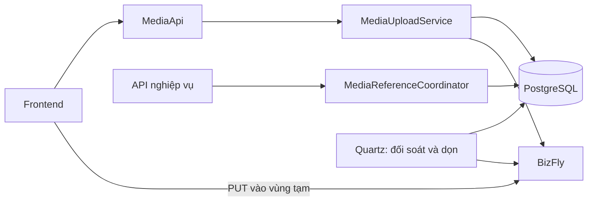
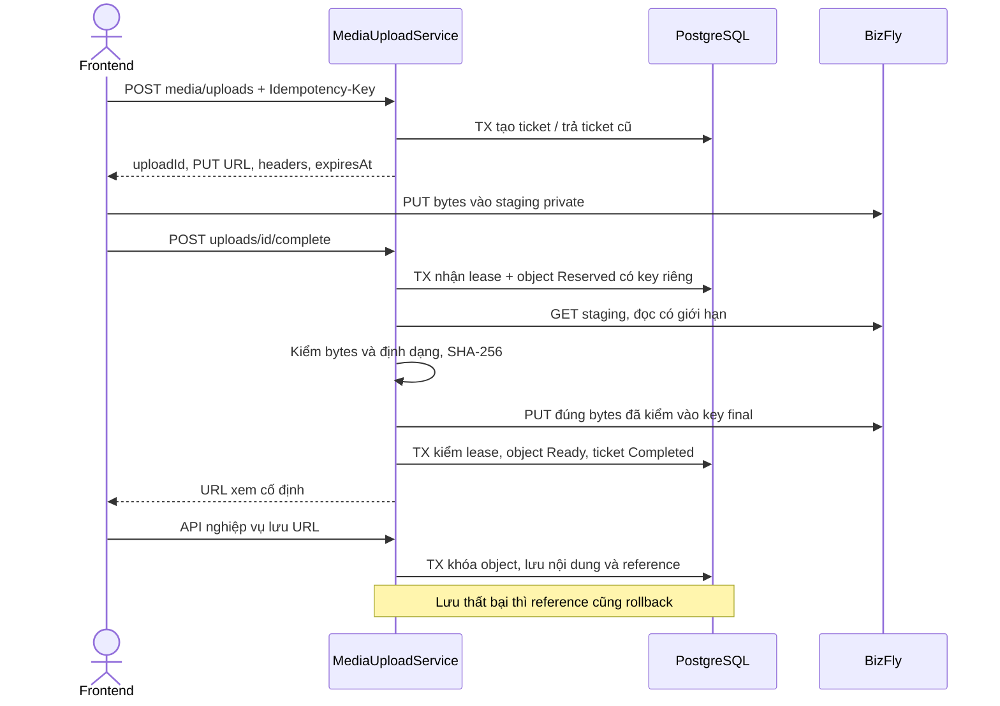
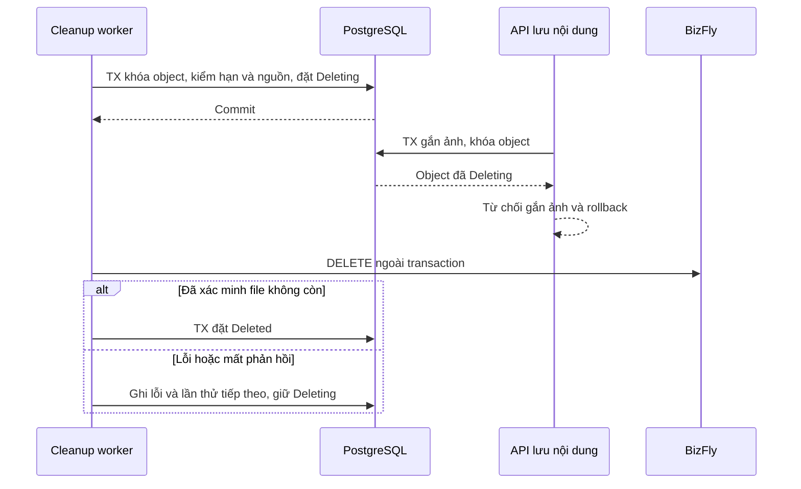
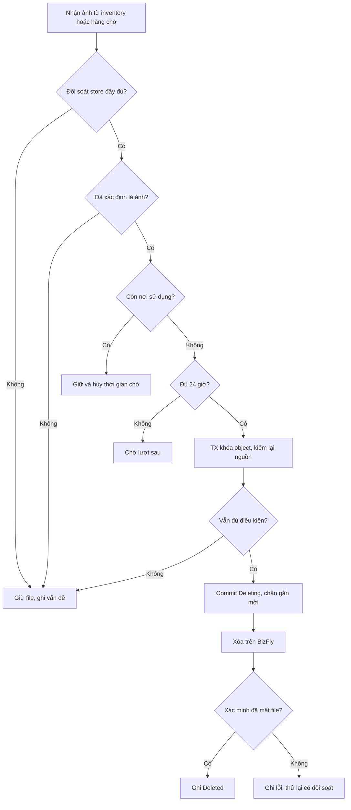
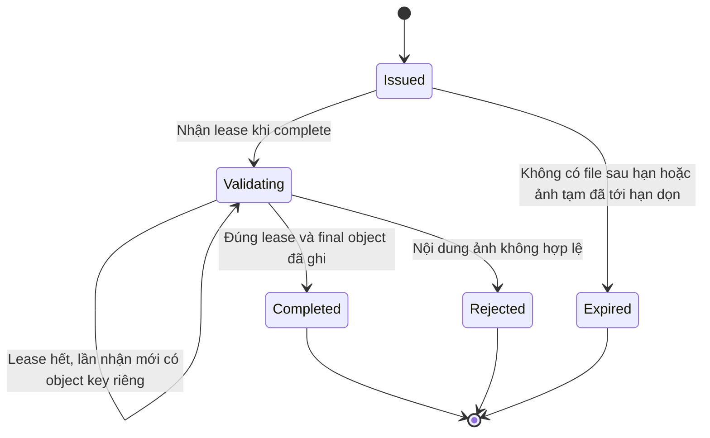
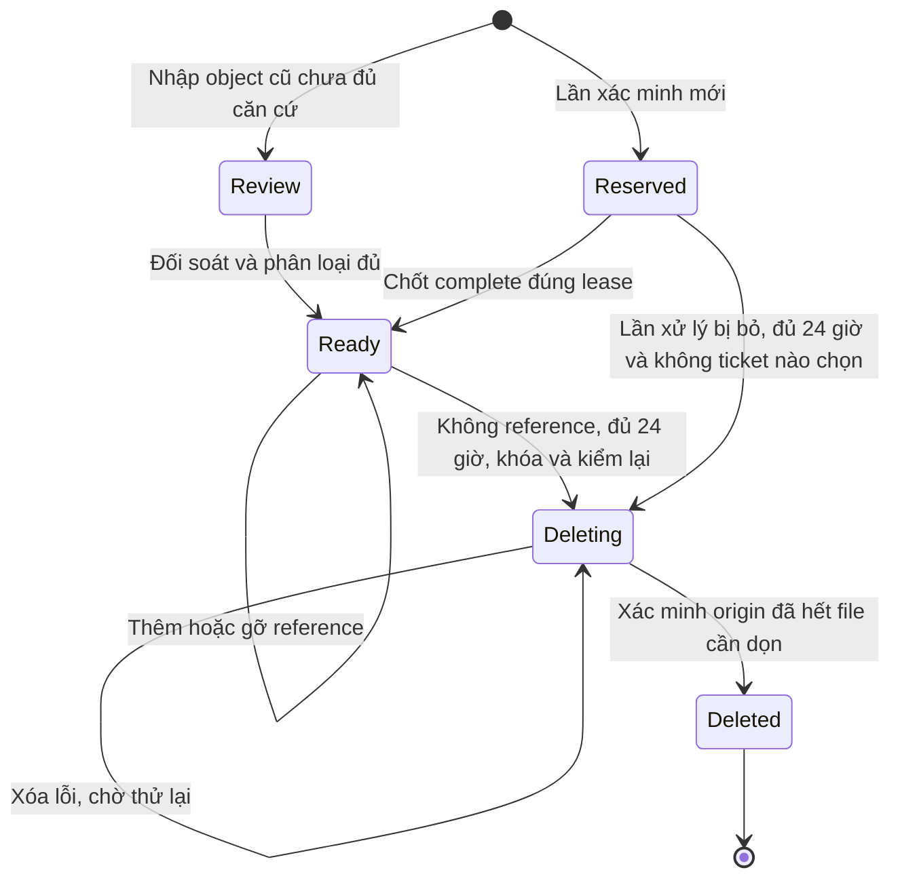
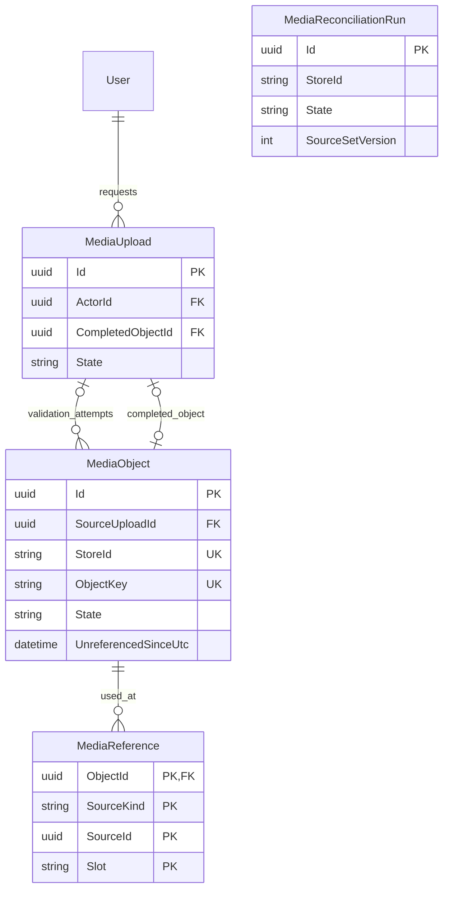

<!-- HƯỚNG DẪN CHO AI KHI ĐIỀN HOẶC CHỈNH SỬA MẪU
- Đọc toàn bộ mẫu, các comment hướng dẫn và tài liệu nguồn được cung cấp trước khi viết. Tuân thủ các quy tắc nghiệp vụ, điều kiện, ngoại lệ và giới hạn đã được xác nhận.
- Không bịa, tự chế hoặc suy đoán thành sự thật: yêu cầu, quy tắc, số liệu, API, schema, mã lỗi, nguồn tham khảo, người phụ trách và kết quả kiểm thử phải có căn cứ. Nội dung ví dụ trong mẫu không phải dữ kiện của dự án.
- Khi thiếu thông tin hoặc các nguồn mâu thuẫn, hỏi người dùng để làm rõ; giữ nguyên placeholder ở phần chưa xác định. Không tự chọn đáp án, lấp chỗ trống hay tuyên bố tài liệu đã hoàn tất.
- Chỉ thay nội dung cần điền hoặc được yêu cầu sửa. Không tự mở rộng phạm vi, sửa nghĩa quy tắc, bỏ điều kiện/ngoại lệ, xoá hay ghi đè nội dung hợp lệ đã có.
- Giữ nguyên tên, cấp và thứ tự heading, nhãn in đậm, tiền tố bullet, cấu trúc danh sách, tên/thứ tự/số cột bảng và cú pháp code fence. Không dịch, đổi tên, gộp hoặc thêm mục ngoài cấu trúc mẫu.
- Chỉ lặp khối luồng, AC hoặc API theo đúng khuôn khi có căn cứ; chỉ bỏ phần tuỳ chọn khi hướng dẫn riêng của mẫu cho phép và đã xác định không áp dụng.
- Mã tham chiếu và section phải trỏ tới tài liệu có thật đã được cung cấp hoặc kiểm chứng. Không giữ mã ví dụ như tham chiếu thật và không tự tạo tài liệu liên quan để hợp thức hoá liên kết.
- Giữ các comment hướng dẫn trong file. Xuất Markdown UTF-8, mỗi file một tài liệu; không bọc toàn bộ file trong code fence, không chèn lời dẫn hay giải thích ngoài mẫu.
- Trước khi bàn giao, đối chiếu nội dung với nguồn, kiểm tra cấu trúc, giá trị cho phép, giới hạn độ dài và tính nhất quán của mã/tham chiếu. Báo rõ phần chưa đủ thông tin; không tuyên bố đã chạy test hoặc import khi chưa thực hiện.
-->

<!-- Thay mã TDD-001 và nội dung ví dụ; giữ nguyên heading và nhãn in đậm.
Sơ đồ dùng mermaid, plantuml hoặc URL. Giữ heading Architecture, Sequence Diagram, Activity Diagram, State Diagram, Data Model.
Ví dụ API phải có heading trùng METHOD /path trong Endpoints. Xoá phần API/sơ đồ không dùng.
Version, Updated At và Change Log do lịch sử phiên bản quản lý, để trống khi nhập mới.
Author/Reviewer là tên hiển thị; gán tài khoản, phê duyệt, giả định và câu hỏi mở trên giao diện sau import.
Thiết kế phải truy vết về Story và Business Rule được cung cấp. Phân biệt thiết kế đề xuất với implementation đã kiểm chứng; không mô tả API/schema/sơ đồ ví dụ như hệ thống thật hoặc tự quyết định nghiệp vụ còn thiếu.
BẮT BUỘC KHI HOÀN THIỆN MẪU: phải có cả Reviewer và Approver, mỗi tên 1–200 ký tự sau khi bỏ khoảng trắng đầu/cuối. Không xoá hai dòng metadata, để trống, dùng tên bịa hoặc giữ placeholder rồi coi là hoàn tất.
Nếu chưa biết người review hoặc người phê duyệt, phải hỏi người dùng và báo tài liệu chưa đủ thông tin; không tự lấy Author/Owner làm người thay thế. Tên trong file không tự gán tài khoản hoặc xác nhận đã duyệt; gán thành viên trên giao diện sau import.
Đây là yêu cầu hoàn thiện mẫu; backend hiện vẫn nhận file cũ thiếu hai trường để tương thích.

VALIDATION CHO FILE NHẬP (đối chiếu ImportSnapshotValidator, MarkdownParser và ImportService):
- Mỗi file .md UTF-8 không rỗng chỉ có một heading cấp 1 chứa mã tài liệu dài 1–100 ký tự. Mã không được trùng trong cùng lần nhập hoặc thuộc loại tài liệu khác đã tồn tại.
- Không dùng tên README.md hoặc sitemap.md vì importer bỏ qua. Giao diện nhận .md/.zip, tối đa 2.000 file, tổng file tải lên 31 MiB; API giới hạn request 32 MiB và tổng nội dung đọc/giải nén 64 MiB.
- Chỉ nhập đè tài liệu cùng loại đang Draft, chưa có phiên bản và chưa lưu trữ. Import thay toàn bộ nội dung bản nháp, vì vậy phải giữ lại nội dung hợp lệ ngoài phần được yêu cầu sửa.
- Không dùng Status trong Markdown hoặc tên Approver để tự xác nhận phê duyệt; import không cấp quyền hay gán tài khoản từ tên. Chạy Kiểm tra file và xử lý lỗi/cảnh báo trước khi nhập.
- Giới hạn độ dài bên dưới tính theo string.Length của .NET (đơn vị UTF-16); không tự cắt ngắn dữ kiện quan trọng để vượt validation, hãy viết lại có căn cứ hoặc hỏi người dùng.
- Feature tối đa 300 ký tự và được dùng làm tiêu đề tài liệu. Status được parser nhận: Draft / In Review / Approved / Deprecated; tài liệu nhập mới vẫn có trạng thái phê duyệt Draft.
- Endpoint: đường dẫn tối đa 500 ký tự; tên/mô tả endpoint được lưu trong Name tối đa 300. HTTP method: GET / POST / PUT / PATCH / DELETE / HEAD / OPTIONS.
- Error Codes: mã tối đa 100 ký tự, không trùng trong tài liệu; giữ dạng - **CODE** (400): mô tả. HTTP status trong Error Codes và Response phải là số nguyên đọc được bằng Int32; không tự đặt status khác hợp đồng API.
- URL sơ đồ tối đa 1.000 ký tự. Mục sơ đồ được sử dụng phải có khối mermaid/plantuml hoặc URL theo mẫu; không để một mục sơ đồ rỗng. Nhãn mục được tách từ bullet như tên External API Fields tối đa 300 ký tự.
- Heading Examples phải khớp METHOD /path ở Endpoints. Giữ các nhãn Request:, Response 200: (thay mã theo contract) và Error Response: để parser tách đúng dữ liệu.
- Tham chiếu dạng DOC-KEY/section: ghi chú: mã đích tối đa 100 ký tự, section tối đa 100, ghi chú tối đa 1.000. Không trùng bộ mã đích + section + loại liên kết trong cùng tài liệu.
ĐỐI CHIẾU FORM TDD (src/features/tdds/validations.ts; form có thể chặt hơn import):
- Điền Feature, Author, Reviewer, Problem và ít nhất một Goal; các Goal/Non-goal/Notes đã thêm không được rỗng. API đã khai báo phải có endpoint và mô tả/mục đích; Fields phải có tên và ý nghĩa; Error Codes phải có mã, HTTP status và điều kiện.
- Form còn kiểm tra Version, Updated At và nội dung Change Log khi khai báo; với file nhập mới, giữ các trường lịch sử này trống theo hợp đồng import, không tự tạo dữ liệu lịch sử.
-->

# TDD-MEDIA-001

## Document Info

- **Feature**: Upload ảnh bằng presigned URL BizFly và dọn ảnh mới, ảnh cũ sau 24 giờ không sử dụng
- **Author**: Tân Trần
- **Reviewer**: Tân Trần
- **Approver**: Tân Trần
- **Status**: Draft
- **Version**:
- **Updated At**:

## Context & Goals

### Problem

Người dùng đã chốt STORY-MEDIA-001, STORY-MEDIA-002, BR-MEDIA-001 và BR-MEDIA-002 trong hội thoại. Backend BMT sẽ cấp quyền upload JPG/PNG/WebP tối đa 5 MiB cho người dùng đã đăng nhập, trả URL xem công khai cố định, đồng thời dọn ảnh mới và cũ trong bucket riêng của BMT. Ảnh không còn được dùng phải chờ ít nhất 24 giờ; ảnh cũ thiếu lịch sử bắt đầu chờ từ lần đầu xác định không còn nơi sử dụng. Bản ghi đăng ký tài nguyên thư viện không tự giữ ảnh.

Người dùng đã chốt toàn bộ TDD trong hội thoại sau khi làm rõ phương án vùng tạm. Mã nguồn, migration và các test tự động đã được bổ sung trong workspace; chưa triển khai lên môi trường dùng thật. Status vẫn là Draft vì chưa thực hiện phê duyệt trên hệ thống tài liệu. Khảo sát workspace cho thấy .NET 8, EF Core/Npgsql 8.0.0, PostgreSQL 15, Carter/MediatR và Quartz 3.13.1. Trước thay đổi này, BMT có `UploadedFileUrlPolicy` kiểm host URL và nhiều module lưu URL trực tiếp, chưa có bộ theo dõi ảnh dùng chung. Mã nhà thầu đang có thay đổi chưa commit và bộ lưu file BizFly riêng; phải phối hợp khi triển khai, không ghi đè phần đang làm.

Code Taskcoper có `GET /api/v1/storages/presigned-url`, nhận key từ client, cấp PUT trong 2 phút. Tham số giới hạn 5 MiB chưa được thực thi; metadata owner cũng đang tắt trong adapter dù response hướng dẫn gửi access token. BMT chỉ tham khảo cách cấu hình S3/BizFly, không sao chép các hành vi này.

### Goals

- Giữ giới hạn 5.242.880 byte và định dạng đã chốt tại bước xác nhận ảnh; không tin riêng tên file, MIME hoặc dung lượng client khai.
- Không cấp URL có quyền ghi vào key ảnh đã công bố. URL xem ảnh không hết hạn theo URL upload.
- Lưu nơi sử dụng ảnh cùng transaction nghiệp vụ; không để thao tác dọn làm hỏng một lần lưu đã thành công.
- Đối soát cả bucket cũ và dữ liệu nghiệp vụ, giữ ảnh còn dùng trong lịch sử, nháp và nội dung ẩn.
- Có kết quả xử lý và cách thử lại khi database, BizFly hoặc worker gặp lỗi.

### Non-goals

- Dọn PDF, CAD, Excel hoặc file không phải ảnh; chuyển file riêng tư hiện có sang công khai.
- Tạo giao diện thư viện ảnh dùng chung, thay đổi quyền sửa nội dung hoặc áp thêm hạn mức dung lượng theo tài khoản.
- Tự áp dụng migration hoặc xóa file trên kho đang phục vụ khách. Migration và mã kiểm thử nằm trong phạm vi triển khai đã được giao.
- Khẳng định BizFly thực tế đã vượt kiểm thử tương thích; chưa có cấu hình bucket thử để kiểm chứng.

## Architecture

**Thành phần triển khai**

| Thành phần | Trách nhiệm |
|---|---|
| `MediaApi` trong `presentation/apis/media/` | Ba route tạo phiên upload, hoàn tất và đọc trạng thái; dùng auth và envelope hiện có. |
| `MediaUploadService` trong application | Điều phối nhiều transaction ngắn và I/O ngoài DB, tương tự cách `ContractorFileService` tách upload khỏi command lưu metadata. |
| Các command media | Tạo ticket, nhận việc xác minh, hoàn tất hoặc từ chối ảnh; mỗi handler một file. Worker dọn dùng `MediaMaintenanceDatabase` cho các transaction ngắn. |
| `IMediaObjectStore` / `BizflyMediaObjectStore` | Ký URL, GET/HEAD/PUT, liệt kê object/phiên bản và DELETE bằng cấu hình kho. Không nhận URL tùy ý từ request để gọi HTTP. |
| `IMediaUrlResolver` | Quy đổi URL được cấu hình về `(StoreId, ObjectKey)`, hợp nhất URL CDN và endpoint của cùng một file. |
| `MediaReferenceSynchronizer` | Khóa object, kiểm trạng thái và cập nhật tập nơi sử dụng trong chính transaction nghiệp vụ. |
| `MediaSourceReader` và `MediaTextExtractor` | Mỗi nhóm dữ liệu khai rõ cách trích URL/key, đọc ngược nơi sử dụng và dựng lại bảng tra cứu. |
| `ReconcileMediaJob` / `MediaReconciliationService` | Đọc kho và nguồn nghiệp vụ theo trang, nhập metadata ảnh cũ, phát hiện sai lệch. |
| `CleanupMediaJob` / `MediaCleanupService` | Nhận ảnh đủ điều kiện, chốt Deleting trong DB, xóa trên kho ngoài transaction, xác minh và chốt kết quả. |



**Luồng upload và bảo vệ nội dung đã xác minh**

Người dùng đã đồng ý phương án vùng tạm sau khi được giải thích: `media/staging/` là nhóm đường dẫn riêng tư trên BizFly, dự kiến nằm trong bucket BMT; ảnh hợp lệ được ghi sang `media/images/` để trả URL công khai. Chỉ cần bucket staging riêng nếu cấu hình kho hiện tại không tách được quyền đọc theo tiền tố. Sau đó, người dùng đã xác nhận chốt toàn bộ bản TDD này để tiếp tục đặc tả Unit Test.

1. `POST /media/uploads` nhận tên file, MIME và số byte; lấy ActorId từ `ICurrentUserService`, không nhận owner, bucket hoặc key từ client. Tạo `MediaUpload` và key `media/staging/{uploadId:N}`. Giá trị kỹ thuật trong thiết kế: URL PUT sống 5 phút; giới hạn ảnh theo BR cố định 5 MiB.
2. Frontend PUT raw bytes trực tiếp lên BizFly với header được trả. Key tạm có ACL private; chính sách bucket/CDN không được ghi đè thành public. Không gửi cookie hoặc token BMT đến BizFly.
3. Frontend gọi `POST /media/uploads/{uploadId}/complete`. Service nhận quyền xác minh bằng một transaction ngắn: đặt ticket Validating, cấp lease token và tạo một `MediaObject` Reserved với key mới `media/images/{objectId:N}.{ext}`. Mỗi lần nhận lại việc có objectId/key riêng; worker cũ không ghi đè file của worker mới.
4. Ngoài transaction: đọc object tạm qua SDK; kiểm ContentLength, đọc tối đa 5 MiB cộng 1 byte vào file tạm tự xóa; số byte thật phải khớp số đã khai. Nhận dạng JPEG/PNG/WebP bằng nội dung, không chỉ MIME/đuôi; định dạng thật phải khớp MIME đã khai, nếu không trả 422. Bộ kiểm định dạng phải kiểm cấu trúc cần thiết của định dạng, từ chối file rỗng/hỏng/truncated; parser được chọn và ghim phiên bản khi triển khai, không dùng `System.Drawing` trên server. Không tự thêm giới hạn kích thước pixel hoặc đổi ảnh trong thiết kế này.
5. Tính SHA-256 trên đúng bytes vừa kiểm, PUT chính file tạm đó lên key Reserved bằng quyền server và MIME đã xác minh. Không thực hiện GET để kiểm rồi Copy từ một key staging có thể đã bị ghi đè. Nhờ PUT từ buffer đã kiểm, nội dung công bố không phụ thuộc lần ghi tiếp theo vào staging.
6. Một transaction ngắn kiểm ticket vẫn do đúng lease token quản lý, object vẫn Reserved, metadata và kết quả PUT đã đủ. Chuyển object Ready, gắn CompletedObjectId, ticket Completed; đặt UploadedAtUtc và UnreferencedSinceUtc bằng LastModified của đúng bytes staging đã đọc. Chưa có nơi sử dụng cho tới khi API nghiệp vụ lưu reference. Chỉ response này hoặc GET trạng thái Completed mới trả URL xem. URL công khai chỉ trỏ đến key final, không trỏ staging.
7. API nghiệp vụ vẫn nhận URL. Resolver tìm object theo key; coordinator kiểm Ready và cập nhật nơi sử dụng cùng lần lưu nội dung. Metadata `LibraryAsset` đơn độc không được tạo reference giữ ảnh.

Ticket Issued chỉ được complete khi staging còn tồn tại và chưa đủ 24 giờ từ LastModified của bytes đang đọc. Hết hạn URL PUT không tự cấm complete một file đã upload thành công. Khi chưa thấy file và URL hết hạn, worker có thể chốt Expired; file PUT đến muộn vẫn được quét và dọn sau 24 giờ nhưng ticket không được mở lại. Khi nhận lease phải giữ quyền xử lý staging tới khi complete kết thúc; cleanup khóa ticket và không xóa staging có lease còn hạn. Lỗi file thật chốt Rejected và xóa lease; lỗi hạ tầng giữ Validating để lần sau nhận lại sau khi lease hết. Complete và cleanup dùng DB clock để kiểm hạn.

MIME client khai chỉ là điều kiện sớm để cấp URL. Với PUT, một client bất thường vẫn có thể gửi bytes thừa vào vùng tạm; giới hạn 5 MiB được thực thi bắt buộc trước khi BMT chấp nhận/công bố ảnh. Thiết kế không hứa kho chặn mọi bytes thừa ngay khi truyền. POST policy có điều kiện `content-length-range` là phương án khác nhưng chưa xác minh với BizFly; không âm thầm đổi contract sang multipart. Luồng xác minh thêm một lần GET và PUT của backend cho mỗi ảnh, đổi lại không phụ thuộc conditional copy của nhà cung cấp.

Presigned URL có thể được sử dụng nhiều lần trong thời hạn và PUT cùng key có thể thay nội dung; đây là lý do tách staging và final. [AWS: presigned URL](https://docs.aws.amazon.com/AmazonS3/latest/userguide/using-presigned-url.html). Tài liệu BizFly có ví dụ cấp URL PUT với header ký và yêu cầu client gửi đúng header. [BizFly: client upload](https://support.bizflycloud.vn/api/simple-storage/).

**Transaction, chống gửi lặp và lease**

- Không gọi toàn bộ `MediaUploadService` qua một command có transaction bao ngoài. Endpoint gọi service; service gửi các command ngắn qua MediatR và mở scope mới cho từng bước. `TransactionPipelineBehavior` hiện tự mở transaction với request kết thúc bằng Command; không mở transaction lồng trong handler, không giữ transaction khi gọi BizFly.
- Tạo ticket yêu cầu `Idempotency-Key` dài 1–128 ký tự. Unique `(ActorId, RequestKey)`; hash của tên file đã chuẩn hóa, MIME và size. Cùng key/cùng hash trả cùng ticket; khác hash trả 409. Nếu URL đã hết hạn, trả trạng thái/ticket cũ mà không gia hạn quyền ghi; thao tác upload mới dùng key mới.
- Complete tự chống lặp theo uploadId. Completed trả cùng object và URL; Validating với lease còn hạn trả 202; owner khác trả 404. Nếu final object đã Deleting/Deleted, không trả URL như còn sử dụng được; trả 410.
- Lease là quyền nhận việc có thời hạn trong DB; lease token khác nhau giữa các lần nhận việc. Đề xuất 120 giây, gia hạn qua transaction ngắn khi cần. Mọi lệnh chốt phải kiểm token và thời hạn bằng DB clock. Mất lease thì không chốt kết quả. Object Reserved của lần cũ được đối soát riêng, không bị worker cũ dùng làm object hoàn tất của lần mới.
- Khi client mất phản hồi sau commit, GET trạng thái truy lại ticket đã lưu. Không xóa final file trong catch vì không biết transaction cuối đã commit hay chưa.
- `IPostCommitActionQueue` không phải hàng đợi bền vững; không dựa riêng vào nó để bảo đảm dọn. Quartz quét công việc bền vững trong DB; không thêm broker hoặc saga cho luồng này.

**Đồng bộ nơi sử dụng và tránh xóa khi đang lưu**

`MediaReference` là bảng tra cứu được dựng từ dữ liệu nghiệp vụ, không thay các URL/quan hệ đang là nguồn sự thật. Mọi đường ghi có thể thêm, thay, sao chép hoặc xóa nơi sử dụng phải tham gia coordinator, gồm bulk delete, sao phiên bản, lưu HTML và ghi snapshot từ tác vụ nền.

Thứ tự khóa: lấy đủ khóa nghiệp vụ hiện có trước; lấy advisory lock theo StoreId cho phần đồng bộ ngắn; xác định tập object cũ và mới; khóa các dòng MediaObject theo Id tăng dần bằng `SELECT ... FOR UPDATE`; sau đó không lấy thêm khóa nghiệp vụ mới. Ghi nội dung và thay tập reference cùng transaction. Xóa reference cuối đặt UnreferencedSinceUtc bằng DB clock; thêm reference xóa mốc này. Hủy transaction khôi phục cả nội dung, reference và mốc thời gian.

`ApplicationDbContext.SaveChangesAsync` gọi synchronizer trong cùng transaction với dữ liệu nghiệp vụ. Các lần xóa hàng loạt của `ContractorStore` đánh dấu aggregate cần đồng bộ trước khi lưu. Khóa theo StoreId bảo vệ cả key cũ chưa có dòng metadata, tránh backfill ghi từ dữ liệu đã lỗi thời; mọi lượt đồng bộ đọc nguồn sau khi lấy khóa này. Đây là đánh đổi: các lần ghi có ảnh trong cùng kho chờ nhau ở đoạn SQL ngắn. Chỉ thay đổi trường ảnh, thêm/xóa nguồn hoặc thao tác bulk được đánh dấu mới kích hoạt đồng bộ; đổi mật khẩu hoặc trường không liên quan không kiểm lại URL cũ. Không giữ khóa khi gọi kho. DbContext dùng đăng ký scoped thay cho pooling để nhận resolver/extractor từ DI.

Worker chỉ nhận file Ready không có reference, đã đủ 24 giờ và phạm vi đối soát đã đạt. Khi giữ khóa object, worker đọc lại nguồn nghiệp vụ theo registry để phát hiện reference bị thiếu trong bảng tra cứu; nếu thấy sai lệch thì giữ ảnh và sửa bảng tra cứu, không xóa. Worker không khóa ngược lại aggregate nghiệp vụ. Sau khi đã kiểm, worker commit trạng thái Deleting rồi mới gọi BizFly. Mọi writer chờ khóa thấy Deleting/Deleted phải từ chối gắn ảnh và rollback. Nếu writer commit trước, worker thấy reference và bỏ qua. Khóa dòng tự giải phóng khi transaction kết thúc. [PostgreSQL 15: explicit locking](https://www.postgresql.org/docs/15/explicit-locking.html).

Deleting là quyết định loại ảnh khỏi khả năng gắn mới, không phải bằng chứng đã xóa file. Không quay lại Ready sau timeout DELETE: một lệnh DELETE cũ có thể vẫn đang tới kho. Thử lại chỉ với cùng key đã bị loại khỏi khả năng gắn mới, rồi xác minh kết quả; chỉ chốt Deleted sau khi origin không còn object/phiên bản cần dọn. Lỗi hoặc reference bất thường xuất hiện thì ngừng xóa, ghi lỗi để đối soát; không mở lại khả năng gắn ảnh trong khi DELETE cũ chưa rõ kết quả.

**Nguồn tham chiếu phải được tích hợp**

| SourceKind dự kiến | SourceId / Slot | Nguồn thật và quy tắc |
|---|---|---|
| `User` | User.Id / Avatar hoặc Cover | `User.Avatar`, `CoverImageUrl`; URL ngoài kho BMT không đưa vào đối tượng được xóa. Dữ liệu chưa bị xóa vật lý vẫn được kiểm. |
| `Architect` | Architect.Id / Avatar | `Architect.AvatarUrl`, gồm trạng thái ẩn. |
| `NewsArticle` | Article.Id / Cover hoặc Body | CoverImageUrl và từng URL ảnh trong ContentHtml sau sanitizer; cùng object lặp nhiều thẻ tạo một reference cho slot Body. Không dùng regex để phân tích HTML. |
| `Estimate` | Estimate.Id / Input | InputImageUrl của bản đang lưu. |
| `CatalogRevision` | RevisionId / Style-{StyleId} | Mọi `CatalogStyle.ImageUrl` ở các revision còn được lưu; sao revision cũng sao nơi sử dụng. |
| `EstimateInputSnapshot` | OperationId / Input, Payload | `EstimateGenerationInput.InputImageUrl` và hai ImageUrl trong Payload của `EstimateGenerationSnapshotV1`; không chỉ đọc cột InputImageUrl. |
| `EstimateResult` | OperationId / File-{FileId} và Payload | `EstimateResultFile.FileUrl` cùng các URL tài nguyên trong payload hợp đồng kết quả; trạng thái xử lý chưa hoàn tất vẫn cần bảo vệ tài nguyên đã ghi. Payload schema chưa hỗ trợ làm phạm vi đối soát chưa đạt. |
| `EstimateExport` | Export.Id / Output | OutputUrl nếu ánh xạ về ảnh trong kho; PDF/XLSX bản thân không thuộc diện dọn ảnh. |
| `LibraryVersion` | Version.Id / Asset-{AssetId} | JOIN LibraryVersionAsset → LibraryAsset.Url, kể cả current, old và Draft. Cover phải thuộc link của phiên bản; kiểm cả cover để phát hiện dữ liệu sai. LibraryAsset đứng riêng không giữ file. |
| `PlanRevision` | Revision.Id / Cover | CoverImageUrl của mọi revision còn được lưu, không chỉ gói đang bán. |
| `Contractor` và `ContractorProject` | Parent.Id / loại quan hệ + Id | Các link ảnh hồ sơ/công trình, giấy phép và hợp tác có AssetId, JOIN ContractorAsset.StorageKey. Resolver so endpoint và bucket của `BizflyContractorFileOption` với kho MEDIA trước khi dùng StorageKey. Nếu đã cấu hình một kho khác thì key nằm ngoài phạm vi dọn này; thiếu cấu hình khi có dữ liệu thì chặn đối soát. Chỉ dọn object được xác định là ảnh; giữ ACL private và route đọc hiện có. Không dùng presign công khai để thay luồng tài liệu riêng tư. |
| `RetainedPayload` | Id dòng / mã bảng + đường dẫn trường đã đăng ký | Bản chụp/audit hoặc payload bền vững có thể còn dùng ảnh phải có extractor theo schema. Payload không biết schema hoặc đường ghi chưa được tích hợp chặn bật dọn cho store. |

Registry là danh sách tường minh, có SourceSetVersion; không quét mọi chuỗi trong database rồi coi là quan hệ đúng. Với khóa nguồn ghép, SourceId là UUID aggregate, phần khóa còn lại đặt trong Slot chuẩn hóa tối đa 128 ký tự. Receipt chỉ lưu Id/kết quả điều khiển không được coi là nơi dùng ảnh; nếu payload lưu nội dung ảnh còn phục vụ người dùng thì phải khai extractor. Trước khi bật dọn, kiểm toàn bộ đường ghi thật và fixtures cho từng nguồn; không lấy một lần rg hoặc bảng này làm bằng chứng phủ hết.

**Đối soát ảnh cũ và vùng tạm**

- `MediaStoreOption` cấu hình StoreId ổn định, endpoint, region, bucket, public base URL và các alias đọc cũ. Không tự lấy cấu hình Taskcoper hay tái sử dụng credential nhà thầu. Bucket được người dùng xác nhận riêng cho BMT; tên và quyền thật còn phải cấu hình.
- Resolver so scheme/host/path-prefix theo cấu hình, phân biệt hoa thường của key, giải mã đường dẫn đúng một lần, không gộp `..`, không double-decode `%2F` hoặc tùy tiện bỏ query `versionId`. Hai alias chỉ được gộp khi cấu hình chứng minh cùng bucket/key. URL lạ có thể thuộc bucket nhưng chưa ánh xạ được phải làm phạm vi đối soát chưa đạt.
- Quét kho theo continuation token và ghi checkpoint. Bucket bật versioning dùng ListVersions, gồm cả key chỉ còn phiên bản cũ sau delete marker; không dựa riêng vào ListObjectsV2. Một reference có versionId giữ toàn bộ key và mọi phiên bản của key, chọn cách bảo thủ để tránh xóa lịch sử. Không chỉ khởi tạo danh sách từ URL còn trong DB. Nhận dạng ảnh cũ từ metadata cùng nội dung nhận dạng khi cần; file không xác định được để Review. Không áp giới hạn JPG/PNG/WebP/5 MiB mới để xóa ảnh cũ đang dùng. Ảnh cũ loại khác chỉ dọn sau khi đã xác định đó là ảnh và không có nơi sử dụng.
- Backfill reference không tự gán chủ sở hữu cho ảnh cũ. Không biết uploader thì SourceUploadId NULL. Không biết ngày ngừng dùng thì UnreferencedSinceUtc là lần đối soát đầy đủ đầu tiên xác định không còn reference, không phải LastModified của kho.
- Ảnh có provider metadata thay đổi trong lúc xét xóa phải được đối soát lại. Không dùng ETag làm bằng chứng hash nội dung hoặc tự suy ra object không được dùng.
- Staging không phải URL dùng trong nội dung. Đối soát HEAD/list để nhận ra upload thành công dù frontend không gọi complete; mốc chờ là LastModified của lần PUT thành công quan sát được. Giữ staging ít nhất 24 giờ từ mốc đó. Không có object sau khi URL hết hạn thì hết ticket; PUT đã bắt đầu trước hạn có thể hoàn tất muộn, nên vẫn quét prefix staging định kỳ, kể cả ticket đã hết. Không cấp lại quyền ghi cùng key.
- Object final Reserved của worker mất lease không được attach. Chờ ít nhất 24 giờ từ lúc xác định lần xử lý bị bỏ, rồi đối soát nguồn/ticket và kho trước khi dọn. Ghi muộn của worker cũ chỉ tạo file không được công bố ở key riêng; lượt quét sau nhận ra và dọn, không chạm key final đã hoàn tất của worker mới.
- Chỉ bật xóa khi mọi writer của BMT đã tham gia coordinator, đã ngừng signer cũ có thể ghi đè key final, và mọi nguồn ảnh trong store đã có extractor. Không cho một phiên bản ứng dụng cũ ghi URL mà bỏ qua khóa trong khi cleanup đang chạy.

Kết quả đối soát cho phép dọn phải là run gần nhất của store ở trạng thái Completed, đúng ConfigurationHash và SourceSetVersion đang chạy. Run Running/Failed mới hơn chặn nhận việc xóa; các lần thử DELETE cũng phải kiểm lại gate này và nơi sử dụng. Khi thay cấu hình hoặc bộ extractor, gate đóng tới khi một run mới hoàn tất. Tombstone Deleted không được chuyển lại Ready: nếu inventory thấy key xuất hiện trở lại do PUT đến muộn, ghi lỗi và xử lý file tái xuất hiện sau 24 giờ từ LastModified mới, vẫn giữ tombstone và chặn attach.

**Xác thực, cấu hình và khả năng vận hành**

- Các route media dùng phiên sử dụng thông thường của BMT, không yêu cầu quyền quản trị. Theo `JwtExtensions.BaseAccessPolicy`, không dùng token quên mật khẩu hoặc phiên buộc đổi mật khẩu để gọi tính năng; giữ điều kiện xác minh email hiện có. Nếu định nghĩa “đã đăng nhập” cần bao gồm các phiên đang bị hạn chế này thì đó là thay đổi auth cần chốt riêng, không tự nới policy bằng `AuthenticatedOnly`.
- Kiểm ActorId và tài khoản còn hợp lệ ở command; đọc/complete ticket chỉ cho chủ ticket. Đây là kiểm quyền trên phiên upload, không hạn chế quyền dùng URL ảnh công khai ở API nghiệp vụ vốn đã có quyền riêng.
- POST sử dụng cơ chế cookie hiện có và kiểm Origin/CSRF theo cấu hình API; presigned PUT không mang cookie BMT. CORS kho chỉ cho origin frontend đã cấu hình và các header thực tế ký. Không bắt JavaScript tự đặt Content-Length; trình duyệt quản lý header đó.
- Giữ cơ chế rate limit chung, không tự đặt quota ảnh theo người dùng. Dùng `Cache-Control: no-store` cho response chứa URL ký, không ghi URL ký/token/secret vào log.
- Giá trị kỹ thuật trong cấu hình mẫu: URL 300 giây, lease 120 giây, timeout một lần I/O 30 giây, job quét mỗi 300 giây, batch 100 object. Thời gian chờ nghiệp vụ 24 giờ là hằng số, không bị một thay đổi cấu hình rút ngắn. Bám quy ước Quartz hiện có: lịch để trống/0 thì chưa bật. `CleanupEnabled` mặc định false đến khi đối soát và kiểm thử kho đạt.
- SDK không tự retry DELETE/PUT ở nhiều tầng. Worker lưu NextDeleteAttemptAtUtc theo khoảng chờ tăng dần 1, 5, 15, 60 phút rồi tối đa 60 phút, có jitter; 403/cấu hình sai chờ sửa cấu hình, không lặp nhanh. Không bỏ vĩnh viễn một file chỉ vì đã thử nhiều lần.
- Log mỗi attempt có correlationId, objectId, uploadId nếu có, stage, kết quả, mã lỗi và thời gian; không log tên file/URL gốc. Metric: upload hoàn tất/từ chối, ticket kẹt, đối soát thất bại, ảnh chờ xóa, xóa lỗi, độ trễ sau hạn. RPO/RTO và ngưỡng cảnh báo chưa có số liệu, cần xác định khi vận hành.

**Notes**:
- Chọn bốn bảng dùng chung và các extractor tường minh; không tạo bảng theo từng loại ảnh, không thêm database khác. Chi phí chính là tích hợp các đường ghi và backfill, không phải thao tác ký URL.
- Giới hạn file được xác minh trước khi cấp kết quả Ready. Khóa đồng thời và quyền trên object phải được kiểm chứng với PostgreSQL thật; SDK/kho tương thích phải kiểm trên bucket thử BizFly.
- URL các API nghiệp vụ giữ hình dạng hiện có. Trong namespace ảnh mới, không chấp nhận một URL chỉ đúng host nhưng không có object Ready. URL cũ chưa đối soát vẫn được đọc như hiện tại; không bật xóa cho phạm vi chưa hoàn tất đối soát.
- Ảnh cũ/riêng tư không được đổi ACL hay di chuyển sang prefix public trong quá trình nhập metadata. URL đã lưu không bị rewrite hàng loạt.

**Thứ tự triển khai và phạm vi tài liệu cần đồng bộ**

1. Hoàn thiện cấu hình kho và kiểm chứng khả năng tách staging private/final public; chốt thư viện kiểm ảnh và SDK trước khi thêm dependency.
2. Thêm schema media và coordinator; tích hợp tất cả đường ghi, giữ cleanup tắt. Các API nghiệp vụ giữ DTO URL nhưng bổ sung lỗi ảnh chưa sẵn sàng/đã dọn.
3. Thêm API upload, xác minh bytes, xử lý gửi lặp và trạng thái; frontend chỉ lưu URL sau complete thành công.
4. Thêm inventory/backfill, kiểm nguồn hiện tại và lịch sử, thử lỗi/đồng thời trên PostgreSQL và bucket thử.
5. Chuyển tất cả writer/signer, kiểm gate đối soát rồi bật cleanup. Không bật xóa chỉ vì migration đã thành công.

Khảo sát thấy mô tả cũ trong TDD-PROJ-001 (External API, Error Handling), TDD-NEWS-001 và TDD-LIB-001/002 còn đặt việc presign/kiểm file/dọn ngoài backend. Quyết định MEDIA mới thay phần trách nhiệm này; quyền và nghiệp vụ của các module đó vẫn giữ nguyên. Chưa sửa các TDD cũ và chưa rà hết chuỗi tham chiếu của chúng trong đợt soạn bản nháp này. Trước khi triển khai phải đọc đầy đủ, đồng bộ các đoạn bị ảnh hưởng và kiểm các test cũ kỳ vọng backend không quản lý file. Đây là phần đối chiếu tài liệu còn mở, không phải một kết quả đã đạt.

**Đối chiếu quy tắc và kiểm thử**

| Căn cứ | Nơi thực hiện trong thiết kế | System Test |
|---|---|---|
| BR-MEDIA-001/Then khoản 1, 5 | Auth route; owner ticket; giữ policy của API nghiệp vụ | ST-MEDIA-001..003, 009..010, 012 |
| BR-MEDIA-001/Then khoản 2, 3, 4 | Validator khai báo; xác minh bytes; staging/final; URL public cố định | ST-MEDIA-001..008, 011, 015..016 |
| BR-MEDIA-001/Then khoản 6, 7 | Transaction nội dung + reference; đưa ảnh chưa dùng vào lịch dọn | ST-MEDIA-013..014 |
| BR-MEDIA-002/Then khoản 1, 9 và Except | Inventory cả bucket; alias resolver; mốc đối soát đầu tiên; gate khi thiếu dữ liệu | ST-MEDIA-024..026, 029, 034 |
| BR-MEDIA-002/Then khoản 2, 3, 8 | UnreferencedSinceUtc, DB clock, lượt dọn sau ít nhất 24 giờ | ST-MEDIA-017..019 |
| BR-MEDIA-002/Then khoản 4, 5, 6 | Reference registry, giữ lịch sử; khóa object, cập nhật reference cùng transaction | ST-MEDIA-020..023, 025, 032 |
| BR-MEDIA-002/Then khoản 7 | Deleting bền vững, lease, xác minh origin, tự thử lại | ST-MEDIA-027..028, 033 |
| BR-MEDIA-002/Then khoản 10 | Chỉ LibraryVersionAsset và nơi dùng thật giữ ảnh; tombstone chặn gắn lại | ST-MEDIA-030..031 |

Các ST hiện là đặc tả, chưa chạy. Integration test phải dùng PostgreSQL thật để chứng minh rollback/khóa/ràng buộc; kiểm BizFly bằng bucket thử để chứng minh chữ ký, ACL, CORS và xóa. Khi triển khai cần bổ sung kiểm chứng complete bị gọi đồng thời, mất lease, PUT staging lặp lại, file sai bytes và PUT đến muộn; không dùng mock để kết luận kho thật đã đạt. Sau khi người dùng chốt TDD, đã soạn UT-MEDIA-001 đến UT-MEDIA-079. Các unit được nêu trong đặc tả là thành phần dự kiến, chưa có mã test thực thi. Thời gian DB trong unit test do boundary giả lập cung cấp; việc dùng DB clock và tính đúng đắn của khóa/transaction phải được kiểm trên PostgreSQL thật.

## Sequence Diagram





## Activity Diagram



## State Diagram





Orphan không phải trạng thái lưu riêng: Ready có UnreferencedSinceUtc khác NULL và không có reference là ảnh đang chờ dọn. Như vậy không cần đồng bộ thêm một cờ InUse có thể lệch với quan hệ thật.

## Data Model

**Ý nghĩa và quyền sở hữu**

| Bảng mới | Một dòng đại diện cho gì | Ai ghi và khi nào |
|---|---|---|
| MediaUpload | Một yêu cầu upload của một tài khoản, đồng thời giữ kết quả chống gửi lặp và lease xác minh | Command tạo ticket/nhận việc/chốt complete; worker theo dõi ticket hết hạn |
| MediaObject | Một key file do BMT quản lý trong một store; giữ cả tombstone sau khi file đã xóa | Luồng upload tạo Reserved; inventory nhập ảnh cũ; coordinator cập nhật mốc không dùng; worker chốt xóa |
| MediaReference | Một nơi sử dụng một object trong một trường/tập ảnh của một dòng nghiệp vụ | Cùng transaction với writer của nguồn; inventory dựng lại để đối soát |
| MediaReconciliationRun | Một lần quét/đối soát một store với phiên bản bộ extractor và mapping xác định | Job ghi checkpoint, tiến độ, lỗi và kết quả hoàn tất |

MediaUpload và MediaObject tách vì một ticket có thể có nhiều lần xác minh bị bỏ, mỗi lần đã tạo một key riêng, nhưng chỉ một object được chọn làm kết quả. Ảnh cũ không có ticket nên SourceUploadId NULL. MediaReference là projection có chủ đích: URL và quan hệ nguồn vẫn ở các bảng nghiệp vụ, không chuyển quyền sở hữu nội dung sang module media.

**Cột và ràng buộc**

Mọi timestamp là `timestamptz` dùng UTC. UUID do ứng dụng cấp. Không thêm tenant vì backend hiện không có mô hình tổ chức áp cho tính năng này. Tên schema dùng quy ước bảng hiện có. Các trường dưới đây là dữ liệu lưu thật; URL xem, số nơi sử dụng và thời điểm đủ hạn được tính khi đọc.

| Bảng | Cột | Kiểu / NULL | Ý nghĩa |
|---|---|---|---|
| MediaUpload | Id; ActorId | uuid PK; uuid NOT NULL FK User | Ticket và người xin upload; không lấy ActorId từ body |
| MediaUpload | RequestKey; RequestHash | varchar(128); char(64), NOT NULL | Khóa gửi lặp và SHA-256 nội dung yêu cầu chuẩn hóa |
| MediaUpload | OriginalName; DeclaredContentType; DeclaredSizeBytes | varchar(255); varchar(32); bigint, NOT NULL | Dữ liệu khai báo, khác metadata thật của object |
| MediaUpload | StoreId; StagingKey | varchar(64); varchar(1024), NOT NULL | Định danh kho cấu hình và key riêng của ticket |
| MediaUpload | State | varchar(16) NOT NULL | Issued, Validating, Completed, Rejected, Expired |
| MediaUpload | IssuedAtUtc; UploadExpiresAtUtc | timestamptz NOT NULL | Thời điểm cấp và hạn quyền PUT, không phải ngày upload thành công |
| MediaUpload | LeaseToken; LeaseUntilUtc | uuid; timestamptz, NULL | Cùng NULL nếu không Validating; token nhận việc |
| MediaUpload | CompletedObjectId | uuid NULL | Chỉ có khi Completed; phải là object có SourceUploadId bằng Id ticket |
| MediaUpload | LastErrorCode | varchar(64) NULL | Mã lỗi đã làm sạch, không lưu response có secret |
| MediaObject | Id; StoreId; ObjectKey | uuid PK; varchar(64); varchar(1024), NOT NULL | Identity thực là UNIQUE StoreId + ObjectKey, phân biệt hoa thường |
| MediaObject | SourceUploadId | uuid NULL FK MediaUpload | NULL cho ảnh cũ hoặc luồng file nội bộ đã có |
| MediaObject | State | varchar(16) NOT NULL | Reserved, Review, Ready, Deleting, Deleted |
| MediaObject | MediaType; SizeBytes; Sha256 | varchar(127); bigint; char(64), NULL | Metadata đã quan sát/xác minh; SHA NULL khi chưa đọc toàn bộ ảnh cũ |
| MediaObject | FirstObservedAtUtc | timestamptz NOT NULL | Lần đầu BMT ghi nhận key |
| MediaObject | UploadedAtUtc | timestamptz NULL | Với upload mới: thời điểm PUT staging thành công lấy từ metadata của bytes đã đọc; NULL nếu ảnh cũ thiếu căn cứ |
| MediaObject | ProviderETag; ProviderLastModifiedAtUtc | varchar(1024); timestamptz, NULL | Dấu nhận diện phiên bản quan sát, không dùng ETag thay SHA-256 |
| MediaObject | UnreferencedSinceUtc | timestamptz NULL | Mốc không còn nơi sử dụng; NULL khi đang dùng hoặc chưa đủ căn cứ |
| MediaObject | DeleteLeaseToken; DeleteLeaseUntilUtc | uuid; timestamptz, NULL | Quyền worker xử lý xóa, không cho phép attach lại khi lease hết |
| MediaObject | DeleteAttempts; NextDeleteAttemptAtUtc; LastErrorCode | integer NOT NULL DEFAULT 0; timestamptz NULL; varchar(64) NULL | Điều khiển và chẩn đoán thử lại |
| MediaObject | DeletedAtUtc; RowVersion | timestamptz NULL; bigint NOT NULL DEFAULT 0 | Kết quả xóa và phiên bản cạnh tranh; mọi mutation tăng RowVersion |
| MediaReference | ObjectId; SourceKind; SourceId; Slot | uuid; varchar(64); uuid; varchar(128), NOT NULL | PK ghép cả bốn; cùng ảnh lặp trong một slot chỉ có một dòng |
| MediaReference | LinkedAtUtc | timestamptz NOT NULL | Lúc reference này được tạo; không dùng làm mốc upload |
| MediaReconciliationRun | Id; StoreId; SourceSetVersion; ConfigurationHash | uuid PK; varchar(64); integer; char(64), NOT NULL | Phạm vi/cấu hình của lần đối soát; hash không chứa secret |
| MediaReconciliationRun | State | varchar(16) NOT NULL | Running, Completed, Failed |
| MediaReconciliationRun | StartedAtUtc; HeartbeatAtUtc; CompletedAtUtc | timestamptz NOT NULL; timestamptz NOT NULL; timestamptz NULL | Theo dõi job kẹt và lần hoàn tất |
| MediaReconciliationRun | Checkpoint; ScannedObjects; LastErrorCode | jsonb NOT NULL DEFAULT '{}'; bigint NOT NULL DEFAULT 0; varchar(64) NULL | Cursor theo pha kho/nguồn; không nhét danh sách tất cả object vào một JSON |

Ràng buộc cụ thể cho migration dự kiến:

- `PK_MediaUpload`, `PK_MediaObject`, `PK_MediaReference`, `PK_MediaReconciliationRun` theo khóa ở bảng trên.
- `UX_MediaUpload_Actor_RequestKey`; `UX_MediaUpload_Store_StagingKey`; `UX_MediaObject_Store_Key`. So key bằng collation `C`; kiểm `octet_length(ObjectKey)` và `octet_length(StagingKey)` từ 1 tới 1024. Không trim hoặc đổi chữ thường key sau khi sinh.
- `CK_MediaUpload_Size`: 1 <= DeclaredSizeBytes <= 5242880; `CK_MediaUpload_ContentType`: image/jpeg, image/png hoặc image/webp; `CK_MediaUpload_Expires`: UploadExpiresAtUtc > IssuedAtUtc; tên gốc/key không rỗng.
- CHECK trạng thái thuộc danh sách của từng bảng. Ticket Completed khi và chỉ khi CompletedObjectId khác NULL; Validating khi và chỉ khi hai cột lease đều khác NULL.
- `FK_MediaUpload_Actor` và `FK_MediaObject_SourceUpload` dùng RESTRICT. Thêm UNIQUE `(SourceUploadId, Id)` ở MediaObject rồi FK ghép `(MediaUpload.Id, CompletedObjectId)` tới `(SourceUploadId, Id)`; NULL CompletedObjectId bỏ kiểm ghép theo MATCH SIMPLE. Thêm FK đơn CompletedObjectId → MediaObject.Id để mô hình ORM có quan hệ rõ. Tạo bảng ticket trước với con trỏ NULL, bảng object sau, rồi thêm FK ngược; không cần constraint deferred để insert đúng thứ tự.
- MediaObject Deleted khi và chỉ khi DeletedAtUtc khác NULL. DeleteAttempts >= 0, RowVersion >= 0, SizeBytes NULL hoặc > 0. Ready có MediaType và SizeBytes đã biết. Object Ready có SourceUploadId khác NULL phải có MIME thuộc danh sách, SizeBytes <= 5242880, UploadedAtUtc và Sha256 khác NULL; ảnh cũ không bị CHECK giới hạn mới.
- `FK_MediaReference_Object` dùng RESTRICT. Không cascade xóa ticket/object để làm mất dấu vết của file ngoài DB. Tombstone được giữ để chặn việc dùng lại URL cũ; chưa có yêu cầu thời hạn xóa lịch sử nên không tự đặt TTL cho tombstone/idempotency.
- `SourceKind` dùng allowlist versioned của registry. Không thể có FK quan hệ tới nhiều bảng bằng một SourceId: đây là giới hạn được chấp nhận của projection, bù bằng ghi cùng transaction, kiểm nguồn trước xóa và rebuild. Không tuyên bố FK ObjectId chứng minh nguồn còn tồn tại.
- Run Completed khi và chỉ khi CompletedAtUtc khác NULL; SourceSetVersion > 0, ScannedObjects >= 0. Mỗi store chỉ có một run Running, bảo vệ bằng partial UNIQUE. Heartbeat cập nhật mỗi 30 giây; sau 120 giây không cập nhật, lượt thay thế khóa dòng và chuyển run cũ Failed trước khi tạo run mới. Mọi checkpoint/kết quả phải cập nhật có điều kiện State=Running; worker cũ không được chốt run đã Failed.

**Index theo truy vấn**

| Index | Truy vấn / lý do |
|---|---|
| `UX_MediaUpload_Actor_RequestKey` | Tìm lại ticket và chặn hai request tạo trùng |
| `IX_MediaUpload_State_Expiry` trên State, UploadExpiresAtUtc, Id | Quét ticket hết hạn/đang kẹt theo trang |
| `IX_MediaObject_SourceUpload` | Tìm các attempt object của ticket |
| `UX_MediaObject_Store_Key` | Ánh xạ URL về cùng object và nhập lại inventory không trùng |
| `IX_MediaObject_Orphan` trên StoreId, UnreferencedSinceUtc, Id WHERE State='Ready' AND UnreferencedSinceUtc IS NOT NULL | Lấy ảnh quá hạn, dùng keyset pagination |
| `IX_MediaObject_DeleteRetry` trên NextDeleteAttemptAtUtc, Id WHERE State='Deleting' | Nhận lại xóa lỗi, dùng FOR UPDATE SKIP LOCKED |
| PK MediaReference bắt đầu bằng ObjectId | EXISTS nơi sử dụng trước xóa; không lưu thêm ReferenceCount |
| `IX_MediaReference_Source` trên SourceKind, SourceId, Slot, ObjectId | Thay tập reference khi nội dung đổi/xóa |
| `IX_MediaReconciliationRun_Store_Time` trên StoreId, StartedAtUtc DESC, Id | Xác định kết quả gần nhất đúng version/config |



Quan hệ completed_object là 0..1 ở mỗi phía; validation_attempts là một ticket có 0..n object, mỗi object có 0..1 ticket (ảnh cũ không có). StoreId là khóa cấu hình, không vẽ như FK tới một bảng store không tồn tại. Trong ERD, UK của StoreId/ObjectKey biểu diễn một khóa duy nhất ghép, không phải từng cột riêng lẻ.

**Mẫu dữ liệu thực sự lưu**

Ví dụ giả định dùng bí danh UUID U1, UP1, O1, O2, NEWS1 và RUN1; không phải seed có thể chạy. Tất cả thời gian UTC, chỉ trích cột. StoreId `bmt-main` là bí danh cấu hình, không phải tên bucket thật.

| Bảng | Dòng mẫu ở 2026-10-01 08:02 UTC |
|---|---|
| User (dùng lại) | Id=U1; tài khoản có phiên hợp lệ. Nguồn cấu trúc: `bmt-be/src/bmt-be.domain/entities/User.cs`; không thêm hay sửa User trong migration media. |
| MediaUpload | Id=UP1, ActorId=U1, RequestKey=req-001, DeclaredContentType=image/png, DeclaredSizeBytes=1048576, State=Completed, IssuedAtUtc=08:00, UploadExpiresAtUtc=08:05, LeaseToken=NULL, LeaseUntilUtc=NULL, CompletedObjectId=O1 |
| MediaObject | Id=O1, SourceUploadId=UP1, StoreId=bmt-main, ObjectKey=media/images/{O1}.png, State=Ready, MediaType=image/png, SizeBytes=1048576, Sha256 là hash 64 ký tự của bytes, UploadedAtUtc=08:01, FirstObservedAtUtc=08:01:30, UnreferencedSinceUtc=NULL, DeletedAtUtc=NULL |
| NewsArticle (dùng lại) | Id=NEWS1, CoverImageUrl=https://images.example.test/media/images/{O1}.png. Nguồn cấu trúc: `bmt-be/src/bmt-be.domain/entities/NewsArticle.cs`; URL vẫn nằm ở bảng nghiệp vụ. |
| MediaReference | ObjectId=O1, SourceKind=NewsArticle, SourceId=NEWS1, Slot=Cover, LinkedAtUtc=08:02 |
| MediaObject (ảnh cũ) | Id=O2, SourceUploadId=NULL, StoreId=bmt-main, ObjectKey=legacy/old-front.jpg, State=Ready, MediaType=image/jpeg, SizeBytes=7340032, UploadedAtUtc=NULL, Sha256=NULL, FirstObservedAtUtc=08:00, UnreferencedSinceUtc=08:10 sau lần đối soát đầy đủ; không có reference |
| MediaReconciliationRun | Id=RUN1, StoreId=bmt-main, SourceSetVersion=1, ConfigurationHash là hash mapping không chứa secret, State=Completed, StartedAtUtc=08:00, HeartbeatAtUtc=08:10, CompletedAtUtc=08:10, Checkpoint={"phase":"done"}, ScannedObjects=2, LastErrorCode=NULL |

Dòng O2 là trạng thái tại 08:10 sau khi run hoàn tất, muộn hơn bảng O1 tại 08:02. SizeBytes của O2 trên 5 MiB vẫn hợp lệ vì là ảnh cũ, không có SourceUploadId. Các dấu `{O1}` chỉ minh họa key được sinh từ UUID thật, không lưu ký tự ngoặc trong key mới.

Nếu NEWS1 thay O1 tại 09:00 và đó là nơi cuối: xóa reference, đặt O1.UnreferencedSinceUtc=09:00 trong cùng transaction. Trước 09:00 ngày hôm sau không được dọn. Nếu một bản nháp gắn O1 lúc 10:00, thêm reference và đặt mốc NULL. O2 không rõ lịch sử chỉ đủ điều kiện từ 08:10 ngày hôm sau. Khi O2 bị claim: State=Deleting, DeleteAttempts tăng; sau DELETE được xác minh: State=Deleted, DeletedAtUtc có giá trị; không xóa dòng O2.

Nếu đăng ký `LibraryAsset` cho O1 nhưng không có `LibraryVersionAsset`, không có MediaReference của thư viện. Nếu version V1 gắn asset LA1: SourceKind=LibraryVersion, SourceId=V1, Slot=Asset-LA1, ObjectId=O1. Sau khi xóa link cuối, đặt mốc không dùng như trên dù LA1 vẫn còn. Khi đọc danh sách ảnh có thể gắn, lọc object Deleting/Deleted; giữ metadata lịch sử của LA1, không làm giả URL còn sử dụng được.

**Notes**:
- Chuẩn hóa: ticket giữ dữ liệu khai báo; object giữ dữ liệu thực tế; reference giữ quan hệ; run giữ tiến độ. Không lưu PublicUrl, ReferenceCount, IsOrphan hoặc EligibleAt để tránh nhiều bản sự thật. SourceId đa hình chỉ ở projection, không thay FK thật của nghiệp vụ.
- Expand: migration thêm bốn bảng, FK, CHECK, index; giữ nguyên URL và bảng cũ. BMT không tự chạy migration khi khởi động. Migration `20260930111750_AddMediaUploadsAndCleanup` đã được tạo; chỉ được áp dụng trong database kiểm thử tạm. FK `FK_MediaUpload_CompletedOwnership` được thêm bằng SQL để giữ SourceUploadId nullable ở ảnh cũ; khai alternate key trong EF sẽ làm mất tính nullable này.
- Deploy code biết ghi reference và tombstone ở tất cả instance, CleanupEnabled=false. Quét/backfill theo trang có checkpoint và UPSERT key; sau khi lấy khóa object phải đọc lại nguồn hiện tại, không ghi đè reference mới bằng một snapshot cũ của backfill. Việc tạo snapshot phục vụ đối soát không được giữ một transaction đọc dài xuyên I/O kho.
- Verify: mapping mọi alias; đầy đủ SourceSetVersion; không có FK lỗi; đối chiếu source→reference và reference→source; kiểm trường hợp HTML/JSON/revision cũ/asset thư viện rời. Run lỗi hoặc thiếu extractor thì không bật xóa dù một phần đã quét xong.
- Switch: ngừng signer/writer cũ không tham gia đồng bộ; chờ các quyền upload cũ hết hiệu lực và đối soát object ghi muộn; chỉ bật cleanup khi các điều kiện này được chứng minh trên môi trường đích. Lần đầu của ảnh cũ vẫn bắt đầu 24 giờ từ kết quả đối soát, không từ ngày triển khai.
- Rollback: tắt nhận việc xóa trước khi quay lại code; chờ các request DELETE đang chạy có kết quả, giữ tombstone và không cho code cũ gắn lại URL đã xóa. Down migration không khôi phục file; phục hồi DB phải đối chiếu kho và tombstone trước khi cho ghi lại. Không drop bảng media trong lần rollback code thông thường.
- Dữ liệu thực tế, tốc độ tăng và số object chưa có. Batch 100 là giá trị khởi đầu có thể điều chỉnh, không là cam kết hiệu năng; chưa cần partition hay full-text index.

## Internal API

### Endpoints

- **POST** `/api/v1/media/uploads` — Tạo ticket/ký URL PUT; phiên thông thường; header Idempotency-Key. Body `{fileName, contentType, sizeBytes}`. Lần đầu trả 201, gửi lại cùng key trả 200; body dùng Result với value/isSuccess/isFailure/error theo dự án.
- **POST** `/api/v1/media/uploads/{uploadId}/complete` — Chỉ owner; body rỗng. Trả 200 khi Completed, 202 nếu một lần xác minh đang giữ lease, lỗi tương ứng khi chưa có file/sai file/quá hạn. Không nhận URL hoặc key tùy ý từ client.
- **GET** `/api/v1/media/uploads/{uploadId}` — Chỉ owner; trả trạng thái, uploadExpiresAtUtc, fileUrl khi Completed và final object còn Ready, failureCode khi có. Không trả URL ký trong GET trạng thái.

API nghiệp vụ hiện có vẫn dùng trường URL, nhưng trước khi thêm reference phải qua coordinator. URL managed ở Deleting/Deleted trả 410 `MediaImageGone`; URL staging/Reserved trả 409 `MediaImageNotReady`. URL ngoài kho tiếp tục theo policy riêng của chức năng, không biến endpoint thành cổng gọi URL tùy ý. Với URL legacy mới xuất hiện trong request, chỉ ghi nhận metadata/khóa tham chiếu khi mapping chắc chắn; nếu chưa đủ căn cứ thì không bật cleanup cho store và không giả tạo trạng thái Ready của file chưa kiểm.

### Examples

#### POST /api/v1/media/uploads

```
Request:
Idempotency-Key: media-request-001
{"fileName":"mat-tien.png","contentType":"image/png","sizeBytes":1048576}

Response 201:
{"value":{"uploadId":"10000000-0000-0000-0000-000000000001","state":"Issued","uploadMethod":"PUT","uploadUrl":"https://storage.example.test/bmt-example/media/staging/10000000000000000000000000000001?signature=example","requiredHeaders":{"Content-Type":"image/png","x-amz-acl":"private"},"uploadExpiresAtUtc":"2026-10-01T08:05:00Z","maxSizeBytes":5242880},"isSuccess":true,"isFailure":false,"error":{"code":"","message":"","messageCode":""}}

Error Response:
{"title":"Validation Failure","code":"ValidationFailure","status":422,"detail":"One or more validation errors occurred","messageCode":"InvalidMediaUpload","errors":[{"PropertyName":"sizeBytes","ErrorMessage":"Dung lượng tối đa là 5.242.880 byte."}]}
```

URL/host/chữ ký ở ví dụ là giả định. Envelope đã đối chiếu `Result`, `Error`, `ValidationException` và `ExceptionHandlingMiddleware` hiện tại; không gửi secret hay access token theo ví dụ Taskcoper. Khi ticket đã hết hạn, replay cùng Idempotency-Key không tạo URL có thời hạn mới; uploadUrl là NULL, state/expiry của ticket cũ được giữ, client tạo thao tác mới bằng key mới.

#### POST /api/v1/media/uploads/{uploadId}/complete

```
Request:
POST /api/v1/media/uploads/10000000-0000-0000-0000-000000000001/complete
{}

Response 200:
{"value":{"uploadId":"10000000-0000-0000-0000-000000000001","state":"Completed","fileUrl":"https://images.example.test/media/images/20000000000000000000000000000001.png","contentType":"image/png","sizeBytes":1048576},"isSuccess":true,"isFailure":false,"error":{"code":"","message":"","messageCode":""}}

Error Response:
{"title":"Conflict","code":"Conflict","status":409,"detail":"Chưa có ảnh upload hoàn chỉnh.","messageCode":"MediaUploadNotReady","errors":null}
```

202 trả `{uploadId,state:"Validating"}` trong value và `Retry-After: 2`, không trả fileUrl chưa được chốt. POST complete được gửi lại sau lỗi mạng. Khi Reserved đã ghi được file nhưng chưa chốt DB, chỉ đúng lease mới được chọn object đó; lần xử lý khác dùng key khác.

#### GET /api/v1/media/uploads/{uploadId}

```
Request:
GET /api/v1/media/uploads/10000000-0000-0000-0000-000000000001

Response 200:
{"value":{"uploadId":"10000000-0000-0000-0000-000000000001","state":"Completed","uploadExpiresAtUtc":"2026-10-01T08:05:00Z","fileUrl":"https://images.example.test/media/images/20000000000000000000000000000001.png","failureCode":null},"isSuccess":true,"isFailure":false,"error":{"code":"","message":"","messageCode":""}}

Error Response:
{"title":"Not Found","code":"NotFound","status":404,"detail":"Không thấy phiên upload.","messageCode":"MediaUploadNotFound","errors":null}
```

### Error Codes

- **InvalidMediaUpload** (422): tên file rỗng/quá 255 ký tự/chứa ký tự điều khiển, MIME ngoài danh sách, số byte ngoài 1..5242880 hoặc file thật không đạt định dạng/dung lượng. Frontend phải hiển thị lỗi upload, không lưu URL như thành công.
- **MediaUploadNotFound** (404): không có ticket hoặc người gọi không phải owner.
- **MediaUploadNotReady** (409): complete khi object tạm chưa tồn tại hoặc chưa đọc được một upload hoàn chỉnh; client có thể thử lại sau khi PUT thành công.
- **MediaImageNotReady** (409): API nghiệp vụ nhận URL thuộc vùng staging hoặc object chưa Ready.
- **MediaUploadExpired** (410): phiên upload không còn có thể hoàn tất, ảnh tạm đã tới hạn dọn hoặc ticket đã Expired; phải tạo thao tác mới.
- **MediaImageGone** (410): ảnh đang Deleting hoặc đã Deleted; không cho gắn vào nội dung hoặc trả như ảnh còn dùng được.
- **MediaUploadLeaseLost** (409): lượt xác minh không còn giữ đúng token hoặc đã hết hạn; không công bố kết quả của lượt cũ.
- **MediaIdempotencyConflict** (409): cùng ActorId/Idempotency-Key nhưng khác nội dung yêu cầu.
- **MediaStorageUnavailable** (503): thiếu/sai cấu hình, kho lỗi hoặc việc xác minh chưa hoàn thành vì lỗi hạ tầng. Không biến 403/timeout của kho thành “file không tồn tại”.
- **MediaReferenceUnavailable** (503): không xác định được mapping/trạng thái an toàn của một ảnh managed mới cần gắn; không commit một tham chiếu đoán.

401/403/429 dùng auth/rate limit hiện có, không tạo mã media thay thế. `messageCode` là mã nghiệp vụ; `code` là nhóm lỗi theo middleware. Middleware hiện serialize lỗi bằng JsonSerializer mặc định nên phần tử errors dùng PropertyName/ErrorMessage; response thành công dùng JSON web camelCase. Lỗi validation media dùng ValidationException của application với messageCode được truyền rõ. HTTP 410 được middleware ánh xạ bằng GoneException kế thừa DomainException và nhánh 410, dùng chung cho MediaImageGone/MediaUploadExpired. HTTP 503 dùng DependencyUnavailableException hiện có; không trả Result.Failure mặc định thành 400.

## External API

### Endpoints

- **BizFly S3 — PUT có chữ ký** — Frontend ghi một key staging do BMT sinh; HTTPS, Signature V4, ForcePathStyle theo cấu hình endpoint. Header ký phải khớp request trình duyệt.
- **BizFly S3 — HEAD/GET/PUT object** — Backend kiểm file tạm, đọc có giới hạn rồi ghi key final từ bytes đã kiểm; không dùng URL client gửi để quyết định đích gọi.
- **BizFly S3 — ListObjectsV2, ListObjectVersions, DeleteObject** — Inventory quét cả bucket theo trang; cleanup xóa và xác minh trạng thái origin, kể cả phiên bản nếu bucket bật versioning.

### Fields

- **StoreId / BucketName / Endpoint / Region** — cấu hình do vận hành cung cấp; StoreId không được đổi nghĩa sang bucket khác trong khi còn metadata.
- **AccessKey / SecretKey** — chỉ ở secret configuration, không trong DB, source, response hoặc log. Quyền tối thiểu phải đủ prefix staging/final và phạm vi ảnh cũ đã xác định.
- **Key** — opaque, phân biệt hoa thường, sinh bởi server cho upload mới; ảnh cũ lấy nguyên identity từ listing. Không lấy trực tiếp fileName làm key.
- **Content-Type / ContentLength** — giá trị provider quan sát khác với khai báo client; kiểm lại bytes trước khi chấp nhận ảnh mới.
- **ETag / VersionId / LastModified** — metadata provider để phát hiện thay đổi và đối soát; không coi ETag luôn là MD5 hoặc ngày sửa là ngày ngừng dùng.
- **PublicBaseUrl / LegacyReadAliases** — dùng để sinh URL mới và ánh xạ URL cũ. URL xem không có chữ ký ngắn hạn. Không thay URL cũ chỉ vì thêm alias.

### Error Handling

GET/HEAD 404 chỉ là chưa có object ở trạng thái đang xét; 403 là lỗi quyền. Lỗi mạng/5xx trả 503 hoặc ghi retry cho worker; không ghi thành công giả. Luôn truyền CancellationToken. Khi request bị hủy sau PUT final, object Reserved được đối soát lại; không xóa bù ngay dựa trên exception.

DELETE timeout không xác định kết quả. Giữ Deleting, đối soát origin trước lần thử tiếp; nếu không còn object thì có thể chốt Deleted. Nếu bucket versioning bật, DELETE không chỉ dừng ở delete marker: liệt kê và xóa các version/marker của đúng key không còn được dùng, rồi xác minh lại. Nếu version có tham chiếu, hoặc không đủ quyền đọc/xóa version, giữ lại và báo vấn đề; không báo đã giải phóng dung lượng. Không bỏ qua legal hold/object lock bằng quyền đặc biệt.

Các object chưa được writer cũ bảo vệ phải qua bước cutover trước cleanup. Provider không có transaction với PostgreSQL; khôi phục DB không phục hồi object đã xóa. Log kiểm tra kết quả không ghi URL gốc hoặc chữ ký.

### Quirks

- Tài liệu BizFly xác nhận API tương thích S3 và có ví dụ presigned PUT; cần kiểm trên endpoint/bucket thực tế: ký/header, CORS trình duyệt, private staging, public final, listing phân trang, versioning và phản hồi DELETE. Không dùng SDK giả lập để kết luận BizFly đã đạt.
- Đã ghim AWSSDK.S3 4.0.103.4 và ImageSharp 2.1.13. Bộ giải mã dùng các định dạng mặc định, giới hạn mỗi lần cấp phát 256 MiB và pool 32 MiB; hết tài nguyên trả lỗi hạ tầng, không tự biến thành một hạn mức pixel nghiệp vụ.
- Mọi URL staging cũ còn hiệu lực có thể ghi lại file tạm; key final không có presigned PUT. File staging ghi muộn được inventory xử lý lại sau thời gian chờ, không được coi là ảnh đã công bố.
- Cấu hình public toàn bucket có thể làm ACL private không đủ. Trước khi bật upload mới phải chứng minh staging không đọc công khai được; nếu bucket hiện tại không tách được quyền theo prefix thì cần một bucket staging riêng. Đây là điều kiện triển khai cần kiểm chứng, không âm thầm chuyển cả kho sang private và làm hỏng URL cũ.

## References

### User Stories

- STORY-MEDIA-001
- STORY-MEDIA-002

### Business Rules

- BR-MEDIA-001
- BR-MEDIA-002

### Use Cases

### Others

- Bằng chứng kiểm thử ngày 2026-09-30: `MediaPolicyTests` và `MediaStorageProtocolTests` có 35 test đạt; `MediaApiPipelineTests` có 8 test đạt; `MediaFlowTests` có 16 test đạt trên PostgreSQL 15 tạm, gồm migration Up/Down, FK ownership, rollback, cạnh tranh attach/delete, staging có lease và file tái xuất hiện. Các test SDK dùng HTTP transport giả, không gọi BizFly thật. Hồi quy: API 422/422, infrastructure 227/227, integration PostgreSQL 504/504 đạt. Lượt PostgreSQL trước đó gặp hết dung lượng Docker; đã sửa vòng đời database tạm của test và chạy lại đạt, không thay kỳ vọng để bỏ qua lỗi.
- Kiểm BizFly thật ngày 2026-09-30 bằng API Release và PostgreSQL tạm, dùng bộ `BIZFLY_*` trong `.docker/.env.dev` sau khi người dùng xác nhận đây là bucket BMT. Chỉ ánh xạ sang `MediaStoreOption` trong tiến trình thử; không sửa env đang dùng. Presigned PUT trả 200; complete trả 200; ảnh PNG công khai có byte và SHA-256 đúng với ảnh gửi lên; ghi đè staging không đổi ảnh hoàn tất. Kiểm chống gửi lặp, quyền chủ upload và đầu vào đạt. CORS preflight trả 204, cho phép PUT cùng `content-type` và `x-amz-acl` từ origin frontend đã cấu hình; chưa chạy trên trình duyệt thật.
- Phát hiện ban đầu trên kho thật: staging đọc được ẩn danh dù ACL object là `private`; policy công khai cấp cả đọc, ghi, xóa và quản lý bucket. Sau yêu cầu “thu hẹp lại”, đã giữ nguyên quyền của chủ bucket, bỏ các quyền công khai đó và đặt bucket ACL về `private`. Policy cuối cùng chỉ cho công khai `s3:GetObject`/`s3:GetObjectVersion` trên `arn:aws:s3:::bmt/media/images/*`. Danh sách object tại lúc áp dụng được đọc đầy đủ: chỉ có hai object thử, không có ảnh cũ cần giữ quyền đọc ở prefix khác. Cấu hình trước thay đổi đã được lưu riêng để đối chiếu.
- Kiểm lại sau thay đổi: cả 28 kiểm tra trong bài thử đạt. Staging trả 403 khi GET ẩn danh ở cả endpoint và public host; presigned PUT và complete vẫn thành công; ảnh hoàn tất trả 200 và giữ nguyên byte/SHA-256. PUT/DELETE ẩn danh trên đúng object thử, đọc policy/ACL và liệt kê bucket ẩn danh đều trả 403. Không dùng điều kiện `aws:PrincipalType` để bảo vệ staging trong policy cuối cùng; quyền đọc công khai được giới hạn bằng prefix cụ thể. Chưa bật cleanup hoặc thay env của stack dev.
- Hai object do bài thử tạo đã được xóa đúng key bằng request có ký; HEAD có ký sau xóa đều trả 404. API và bốn container tạm đã được dừng. GetBucketVersioning trả 200; chưa kiểm đầy đủ luồng nhiều phiên bản trên BizFly, tác vụ dọn thật sau 24 giờ hoặc tải lớn. Không coi toàn bộ ST/79 UT là đạt từ lần kiểm này.
- Kiểm bản tích hợp trên `origin/develop` tại `5d93ecc`, commit backend `5082335`: build Release thành công, không warning/lỗi; toàn bộ 2.685 test đạt (domain 1, application 1.514, persistence 17, infrastructure 227, API 422, integration PostgreSQL 504), không có test lỗi hoặc bỏ qua. Danh sách bảng kỳ vọng trong test persistence đã thêm đủ bốn bảng MEDIA.
- Mã triển khai: `bmt-be/src/bmt-be.application/services/MediaUploadService.cs`, `bmt-be/src/bmt-be.persistence/media/`, `bmt-be/src/bmt-be.infrastructure/files/Media*`, `BizflyMediaObjectStore.cs`, `bmt-be/src/bmt-be.presentation/apis/media/MediaApi.cs`.
- Cấu hình: `.docker/.env.sample`, `.docker/compose.yaml`, `.docker/docker-compose.yml` trong backend. `MEDIA_ENABLED=false`, `MEDIA_CLEANUP_ENABLED=false`, `MEDIA_CUTOVER_VERIFIED=false`, hai interval bằng 0 là mặc định. Cấu hình endpoint/region/bucket/credential/public URL của BMT riêng; không tự lấy secret từ Taskcoper hoặc kho nhà thầu. Thêm mọi alias cũ đúng prefix và khai host URL mới vào `UPLOADED_FILE_ALLOWED_HOST`.
- Trình tự vận hành: áp dụng migration qua bước triển khai riêng; kiểm private staging/public final và CORS trên bucket thử; bật upload khi cấu hình đạt; chạy reconciliation bằng `MEDIA_RECONCILE_INTERVAL_SECONDS=300`; kiểm run gần nhất Completed đúng hash/version và không có Review chưa phân loại; ngừng mọi signer/writer cũ trước khi xác nhận CutoverVerified và bật cleanup với interval 300. Không dùng cờ này thay bằng chứng kiểm môi trường. Ảnh cũ chưa rõ lịch sử vẫn phải chờ đủ 24 giờ từ lần đối soát đầy đủ đầu tiên.
- Checkpoint lưu tiến độ của từng run. Sau khi một run hết heartbeat và bị đánh Failed, run mới quét lại từ đầu để kiểm đủ inventory và nguồn; thao tác nhập metadata/đồng bộ reference chống lặp. Không tuyên bố có cơ chế tiếp tục từ cursor của run đã lỗi.
- `Review` với LastErrorCode=`MediaNotImage` là file đã phân loại ngoài phạm vi, được giữ lại và không làm khóa việc dọn ảnh. Review chưa phân loại chặn gate ngay, kể cả xuất hiện sau run Completed. Bộ đọc audit chỉ nhận các trường ảnh đã đăng ký; URL trong trường chưa hỗ trợ làm đối soát Failed.
- Kiểm nguồn trước xóa hiện đọc registry theo trang cho từng ứng viên. Cách này ưu tiên đủ nguồn và có chi phí tăng theo lượng nội dung; chưa có kết quả load test hoặc cam kết thông lượng trên dữ liệu thật.


- Bộ Unit Test: UT-MEDIA-001 đến UT-MEDIA-079 trong `unittest/` là đặc tả. Các test tự động dưới đây mới là bằng chứng đã chạy; không đánh dấu toàn bộ 79 đặc tả đạt từ một tập test nhỏ hơn. Các nhóm được đối chiếu như sau:

| Nhóm | Đặc tả Unit Test | Kiểm chứng bổ sung |
|---|---|---|
| Đầu vào, ticket và chống gửi lặp | UT-MEDIA-001..021 | ST-MEDIA-001..010 kiểm route/auth; unique và race khi tạo ticket cần PostgreSQL thật |
| Xác minh file, complete và lease | UT-MEDIA-022..039 | ST-MEDIA-008, 011, 013..016; cần bucket thử cho chữ ký, ACL và CORS |
| Ánh xạ URL và giữ phiên bản | UT-MEDIA-040..045 | ST-MEDIA-025, 034 với URL kho thực tế |
| Theo dõi nơi dùng và extractor | UT-MEDIA-046..055 | ST-MEDIA-014, 020..023, 030..032; rollback và cạnh tranh lưu/xóa cần PostgreSQL thật |
| Điều kiện dọn và lỗi kho | UT-MEDIA-056..072 | ST-MEDIA-017..019, 026..028, 033; không dùng mock để chứng minh DELETE thật hoặc khóa giữa hai worker |
| Đối soát ảnh cũ | UT-MEDIA-073..079 | ST-MEDIA-024, 026, 029, 034; backfill và truy vấn tất cả nguồn cần integration test |


- Bộ System Test: ST-MEDIA-001 đến ST-MEDIA-034 trong `systemtest/`; đây là đặc tả chưa thực thi.
- Code tham chiếu Taskcoper: `src/taskcoper-be.presentation/apis/storage/StorageApi.cs`, `src/taskcoper-be.application/usecases/queries/storage/GeneratePresignedUrlQueryHandler.cs`, `src/taskcoper-be.infrastructure/storage/BizFlyStorageService.cs` trong `~/Documents/WorkSpace/taskcoper/taskcoper-be`.
- Code BMT đã khảo sát: `src/bmt-be.application/services/UploadedFileUrlPolicy.cs`, `src/bmt-be.application/behaviors/TransactionPipelineBehavior.cs`, `src/bmt-be.application/services/EstimateGenerationInputFactory.cs`, `src/bmt-be.application/usecases/commands/library/AddLibraryAssetCommandHandler.cs`, `DetachLibraryAssetCommandHandler.cs`, `src/bmt-be.persistence/configurations/LibraryConfigurations.cs`, `src/bmt-be.application/services/ContractorFileService.cs`, `src/bmt-be.infrastructure/files/BizflyContractorFileStore.cs`, `src/bmt-be.api/dependencyInjection/extensions/JwtExtensions.cs`, `src/bmt-be.infrastructure/dependencyInjection/extensions/ServiceCollectionExtensions.cs`.
- [BizFly: presigned PUT, ACL, listing và versioning](https://support.bizflycloud.vn/api/simple-storage/).
- [BizFly: cấu hình CORS bucket](https://bizflycloud.vn/docs/simple_storage/howtos/bucket_config/).
- [AWS: thời hạn và khả năng dùng lại presigned URL](https://docs.aws.amazon.com/AmazonS3/latest/userguide/using-presigned-url.html).
- [AWS: POST policy và giới hạn dung lượng](https://docs.aws.amazon.com/AmazonS3/latest/API/sigv4-HTTPPOSTConstructPolicy.html).
- [PostgreSQL 15: khóa dòng và thứ tự khóa](https://www.postgresql.org/docs/15/explicit-locking.html).

## Change Log
