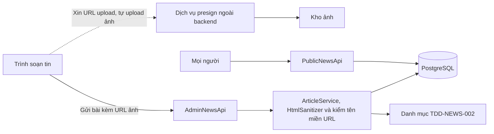
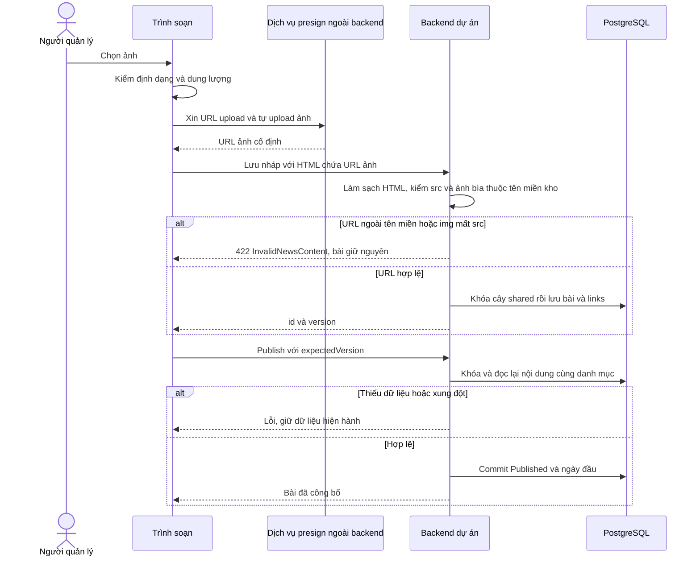
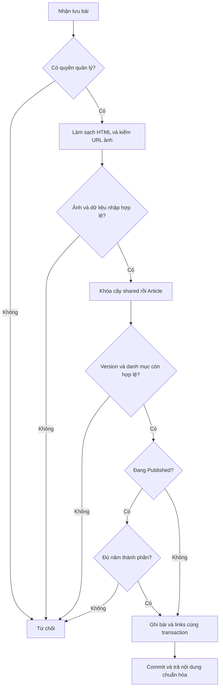
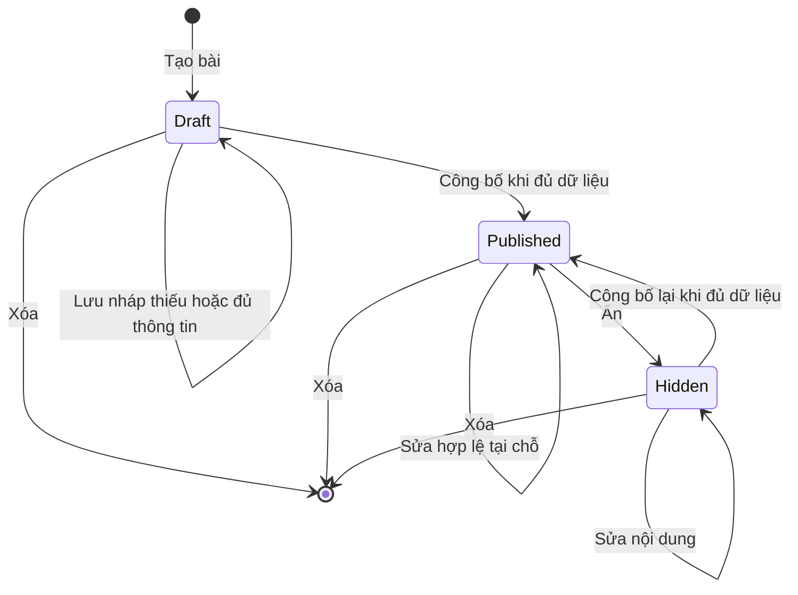
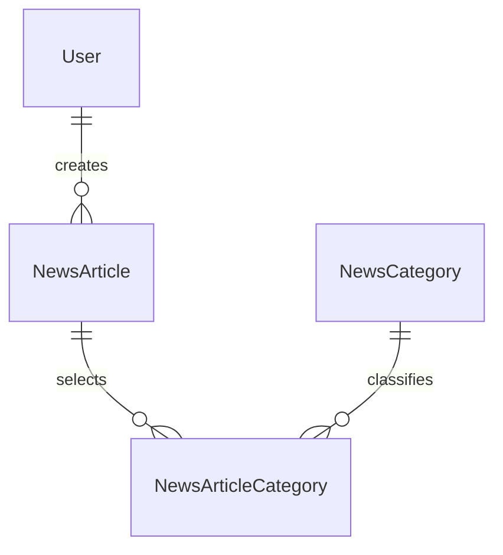

<!-- HƯỚNG DẪN CHO AI KHI ĐIỀN HOẶC CHỈNH SỬA MẪU
- Đọc toàn bộ mẫu, các comment hướng dẫn và tài liệu nguồn được cung cấp trước khi viết. Tuân thủ các quy tắc nghiệp vụ, điều kiện, ngoại lệ và giới hạn đã được xác nhận.
- Không bịa, tự chế hoặc suy đoán thành sự thật: yêu cầu, quy tắc, số liệu, API, schema, mã lỗi, nguồn tham khảo, người phụ trách và kết quả kiểm thử phải có căn cứ. Nội dung ví dụ trong mẫu không phải dữ kiện của dự án.
- Khi thiếu thông tin hoặc các nguồn mâu thuẫn, hỏi người dùng để làm rõ; giữ nguyên placeholder ở phần chưa xác định. Không tự chọn đáp án, lấp chỗ trống hay tuyên bố tài liệu đã hoàn tất.
- Chỉ thay nội dung cần điền hoặc được yêu cầu sửa. Không tự mở rộng phạm vi, sửa nghĩa quy tắc, bỏ điều kiện/ngoại lệ, xoá hay ghi đè nội dung hợp lệ đã có.
- Giữ nguyên tên, cấp và thứ tự heading, nhãn in đậm, tiền tố bullet, cấu trúc danh sách, tên/thứ tự/số cột bảng và cú pháp code fence. Không dịch, đổi tên, gộp hoặc thêm mục ngoài cấu trúc mẫu.
- Chỉ lặp khối luồng, AC hoặc API theo đúng khuôn khi có căn cứ; chỉ bỏ phần tuỳ chọn khi hướng dẫn riêng của mẫu cho phép và đã xác định không áp dụng.
- Mã tham chiếu và section phải trỏ tới tài liệu có thật đã được cung cấp hoặc kiểm chứng. Không giữ mã ví dụ như tham chiếu thật và không tự tạo tài liệu liên quan để hợp thức hoá liên kết.
- Giữ các comment hướng dẫn trong file. Xuất Markdown UTF-8, mỗi file một tài liệu; không bọc toàn bộ file trong code fence, không chèn lời dẫn hay giải thích ngoài mẫu.
- Trước khi bàn giao, đối chiếu nội dung với nguồn, kiểm tra cấu trúc, giá trị cho phép, giới hạn độ dài và tính nhất quán của mã/tham chiếu. Báo rõ phần chưa đủ thông tin; không tuyên bố đã chạy test hoặc import khi chưa thực hiện.
-->

<!-- Thay mã TDD-001 và nội dung ví dụ; giữ nguyên heading và nhãn in đậm.
Sơ đồ dùng mermaid, plantuml hoặc URL. Giữ heading Architecture, Sequence Diagram, Activity Diagram, State Diagram, Data Model.
Ví dụ API phải có heading trùng METHOD /path trong Endpoints. Xoá phần API/sơ đồ không dùng.
Version, Updated At và Change Log do lịch sử phiên bản quản lý, để trống khi nhập mới.
Author/Reviewer là tên hiển thị; gán tài khoản, phê duyệt, giả định và câu hỏi mở trên giao diện sau import.
Thiết kế phải truy vết về Story và Business Rule được cung cấp. Phân biệt thiết kế đề xuất với implementation đã kiểm chứng; không mô tả API/schema/sơ đồ ví dụ như hệ thống thật hoặc tự quyết định nghiệp vụ còn thiếu.
BẮT BUỘC KHI HOÀN THIỆN MẪU: phải có cả Reviewer và Approver, mỗi tên 1–200 ký tự sau khi bỏ khoảng trắng đầu/cuối. Không xoá hai dòng metadata, để trống, dùng tên bịa hoặc giữ placeholder rồi coi là hoàn tất.
Nếu chưa biết người review hoặc người phê duyệt, phải hỏi người dùng và báo tài liệu chưa đủ thông tin; không tự lấy Author/Owner làm người thay thế. Tên trong file không tự gán tài khoản hoặc xác nhận đã duyệt; gán thành viên trên giao diện sau import.
Đây là yêu cầu hoàn thiện mẫu; backend hiện vẫn nhận file cũ thiếu hai trường để tương thích.

VALIDATION CHO FILE NHẬP (đối chiếu ImportSnapshotValidator, MarkdownParser và ImportService):
- Mỗi file .md UTF-8 không rỗng chỉ có một heading cấp 1 chứa mã tài liệu dài 1–100 ký tự. Mã không được trùng trong cùng lần nhập hoặc thuộc loại tài liệu khác đã tồn tại.
- Không dùng tên README.md hoặc sitemap.md vì importer bỏ qua. Giao diện nhận .md/.zip, tối đa 2.000 file, tổng file tải lên 31 MiB; API giới hạn request 32 MiB và tổng nội dung đọc/giải nén 64 MiB.
- Chỉ nhập đè tài liệu cùng loại đang Draft, chưa có phiên bản và chưa lưu trữ. Import thay toàn bộ nội dung bản nháp, vì vậy phải giữ lại nội dung hợp lệ ngoài phần được yêu cầu sửa.
- Không dùng Status trong Markdown hoặc tên Approver để tự xác nhận phê duyệt; import không cấp quyền hay gán tài khoản từ tên. Chạy Kiểm tra file và xử lý lỗi/cảnh báo trước khi nhập.
- Giới hạn độ dài bên dưới tính theo string.Length của .NET (đơn vị UTF-16); không tự cắt ngắn dữ kiện quan trọng để vượt validation, hãy viết lại có căn cứ hoặc hỏi người dùng.
- Feature tối đa 300 ký tự và được dùng làm tiêu đề tài liệu. Status được parser nhận: Draft / In Review / Approved / Deprecated; tài liệu nhập mới vẫn có trạng thái phê duyệt Draft.
- Endpoint: đường dẫn tối đa 500 ký tự; tên/mô tả endpoint được lưu trong Name tối đa 300. HTTP method: GET / POST / PUT / PATCH / DELETE / HEAD / OPTIONS.
- Error Codes: mã tối đa 100 ký tự, không trùng trong tài liệu; giữ dạng - **CODE** (400): mô tả. HTTP status trong Error Codes và Response phải là số nguyên đọc được bằng Int32; không tự đặt status khác hợp đồng API.
- URL sơ đồ tối đa 1.000 ký tự. Mục sơ đồ được sử dụng phải có khối mermaid/plantuml hoặc URL theo mẫu; không để một mục sơ đồ rỗng. Nhãn mục được tách từ bullet như tên External API Fields tối đa 300 ký tự.
- Heading Examples phải khớp METHOD /path ở Endpoints. Giữ các nhãn Request:, Response 200: (thay mã theo contract) và Error Response: để parser tách đúng dữ liệu.
- Tham chiếu dạng DOC-KEY/section: ghi chú: mã đích tối đa 100 ký tự, section tối đa 100, ghi chú tối đa 1.000. Không trùng bộ mã đích + section + loại liên kết trong cùng tài liệu.
ĐỐI CHIẾU FORM TDD (src/features/tdds/validations.ts; form có thể chặt hơn import):
- Điền Feature, Author, Reviewer, Problem và ít nhất một Goal; các Goal/Non-goal/Notes đã thêm không được rỗng. API đã khai báo phải có endpoint và mô tả/mục đích; Fields phải có tên và ý nghĩa; Error Codes phải có mã, HTTP status và điều kiện.
- Form còn kiểm tra Version, Updated At và nội dung Change Log khi khai báo; với file nhập mới, giữ các trường lịch sử này trống theo hợp đồng import, không tự tạo dữ liệu lịch sử.
-->

# TDD-NEWS-001

## Document Info

- **Feature**: Tin tức — quản lý bài, rich text, URL ảnh và đọc công khai
- **Author**: Codex
- **Reviewer**: Tân Trần
- **Approver**: Tân Trần
- **Status**: Draft
- **Version**:
- **Updated At**:

## Context & Goals

### Problem

STORY-NEWS-001–003 và BR-NEWS-001–003 đã được người dùng chốt; ST-NEWS-001–027 là đặc tả chưa thực thi. Tin tức miễn phí, không cần đăng nhập hoặc gói. Một bài có nhiều danh mục riêng, sửa tại chỗ, xóa được ở mọi trạng thái. Không dùng cơ chế phiên bản/quota của LIB.

Tài liệu này định nghĩa bài viết, liên kết bài–danh mục, đọc công khai và cách backend nhận URL ảnh. [TDD-NEWS-002](TDD-NEWS-002.md) sở hữu cây danh mục và quy ước khóa chung. Hiện trạng triển khai ghi ở Architecture/Notes.

**Áp dụng quyết định đã xác nhận ngày 26/09/2026 về tệp và ảnh** (quyết định chung cho mọi tính năng có file/ảnh, đã áp dụng trước ở [TDD-PROJ-001](TDD-PROJ-001.md)):

1. Backend không nhận bytes ảnh, không làm kho lưu trữ và không tạo presigned URL. Frontend xin URL upload từ dịch vụ presign nằm ngoài backend, tự upload, nhận URL cố định không hết hạn, rồi gửi URL đó cho backend lưu. Frontend kiểm định dạng và dung lượng.
2. Backend chỉ nhận URL ảnh là URL tuyệt đối https thuộc tên miền kho presign, dùng chung cấu hình `UploadedFileOption__AllowedHosts` và cách so khớp đã có (`IUploadedFileUrlPolicy`).

**Đã xác nhận ngày 26/09/2026 (lần 2)**, người dùng trả lời các câu hỏi mở sau lần triển khai đầu:

1. Tiêu đề tối đa 200 ký tự, mô tả ngắn tối đa 500 ký tự, tính sau khi bỏ khoảng trắng đầu/cuối; nội dung HTML tối đa 200.000 ký tự, tính trên HTML đã làm sạch. Đếm theo ký tự Unicode (Rune), như dự toán đếm. Vượt giới hạn thì từ chối 422 như các lỗi đầu vào khác, không tự cắt ngắn. Đây là quy tắc nghiệp vụ, ghi ở BR-NEWS-001 khoản 9 và STORY-NEWS-001/AC-009.
2. Ảnh trong nội dung sai tên miền kho hoặc mất `src` thì từ chối cả yêu cầu với 422. Chỉ kiểm tên miền với URL ảnh mới; URL đã lưu không bị kiểm lại, giống dự toán.
3. Được dùng thư viện HtmlSanitizer 9.2.1039 (giấy phép MIT).
4. Cho phép `target="_blank"` trên thẻ `a`; khi đó backend luôn đặt `rel="noopener noreferrer"`. Chỉ nhận giá trị `_blank`, giá trị target khác bị bỏ.

Vì vậy bản thiết kế trước có hai endpoint `POST /api/v1/admin/news/image-uploads/presign`, `.../complete` và cổng `INewsImageUploadGateway` xác minh object trên cloud đã bị bỏ. Ảnh bìa và mọi ảnh trong nội dung HTML chỉ được nhận khi là URL https thuộc tên miền cho phép; với rich text, backend kiểm thuộc tính `src` của từng thẻ `img` sau khi làm sạch HTML.

### Goals

- Lưu nháp thiếu thông tin; công bố kiểm đủ; sửa, ẩn và xóa phản ánh ở lần đọc mới.
- FE tự upload ảnh qua dịch vụ presign ngoài backend rồi gửi URL; backend chỉ lưu URL https thuộc tên miền kho presign, kể cả URL trong rich text.
- Lọc cả nhánh danh mục, không lặp bài, phân trang và giữ ngày công bố đầu tiên.
- Bảo vệ thao tác quản trị và làm sạch rich text tại backend.

### Non-goals

- Không quota, lịch sử xem, phiên bản bài, phê duyệt nội dung, thùng rác hoặc khôi phục bài.
- Không video, tệp đính kèm, ghim, bình luận, thích, yêu thích hoặc thống kê lượt đọc.
- Không có endpoint upload, presign hay xác minh ảnh ở backend (quyết định ngày 26/09/2026).

## Architecture

**Hiện trạng đã kiểm tra**

Hiện trạng code kiểm ngày 26/09/2026: thiết kế này và [TDD-NEWS-002](TDD-NEWS-002.md) đã được triển khai ở commit `4714e68` trên nhánh `feature/news` của `bmt-be`, tách từ `develop` tại `f21d749`, nay đã merge vào `develop` (đối chiếu ngày 28/09/2026); commit `e390e2d`, cũng đã có trên `develop`, thêm các quyết định ngày 26/09/2026 (lần 2) ở mục bên dưới. Migration `20260926092623_NewsArticlesAndCategories` tạo ba bảng của Data Model và seed quyền `news.manage` cho vai trò `admin`; migration `20260926092932_NewsArticleTextLimits` thêm giới hạn độ dài. Hai migration mới được tạo, chưa áp dụng lên database dùng chung. Phần chưa làm ghi ở Notes bên dưới.

Backend dùng .NET 8, MediatR, FluentValidation, Carter, EF Core/Npgsql 8; Docker Compose dùng PostgreSQL 15. Tin tức không có tenant filter và không thêm tenant.

`PermissionNames` có mã `news.manage` (`RequiresAssignment = false`). `JwtExtensions` đăng ký sẵn một policy cho mỗi mã quyền, mang theo các điều kiện nền (phiên đã xác thực, email đã xác minh, không phải phiên quên mật khẩu, không bị buộc đổi mật khẩu); `OnTokenValidated` kiểm dấu phiên nên tài khoản bị khóa mất phiên. Route quản trị Tin tức gắn policy `news.manage`, route đọc công khai gắn `AllowAnonymous`. Lớp chống CSRF dùng chung của [TDD-AUTH-001](TDD-AUTH-001.md) đã có trong `develop`.

Dịch vụ presigned URL nằm ngoài backend và do bên khác cung cấp. Backend đã có sẵn phần kiểm tên miền dùng chung: `IUploadedFileUrlPolicy` (`src/bmt-be.application/services/UploadedFileUrlPolicy.cs`) đọc `UploadedFileOption__AllowedHosts`, được ảnh phong cách và ảnh đầu vào của dự toán dùng từ trước. Tin tức dùng lại đúng lớp này, không viết bản so khớp thứ hai.

**Thành phần**

| Thành phần | Trách nhiệm |
| --- | --- |
| AdminNewsApi / PublicNewsApi | Route quản lý có quyền và route đọc AllowAnonymous; DTO, trạng thái HTTP. Chống CSRF do lớp dùng chung ở [TDD-AUTH-001](TDD-AUTH-001.md) đảm nhận, module không tự làm. |
| NewsArticleService | Lưu bài và liên kết danh mục cùng transaction; kiểm trạng thái, dữ liệu công bố và Version. |
| INewsHtmlSanitizer | Phân tích HTML bằng parser, giữ allowlist, trả HTML chuẩn hóa, danh sách `src` của ảnh và kết quả kiểm nội dung có nghĩa. |
| IUploadedFileUrlPolicy (dùng lại) | Kiểm URL ảnh bìa và `src` của ảnh trong nội dung thuộc tên miền kho presign; không gọi HTTP tới URL. |
| INewsStore / INewsTreeLock | Ghi bài, liên kết và danh mục; đọc ID danh mục còn tồn tại; khóa cây theo TDD-NEWS-002, không ghi bản sao cây. |
| INewsReadStore | SQL projection, tìm tiêu đề, lọc cả nhánh bằng WITH RECURSIVE và EXISTS, phân trang; không gọi module Subscription. |



**Quyền và biên dữ liệu**

Mã quyền `news.manage` là quyền quản lý tin tức đã chốt tên theo STORY-RBAC-001/Preconditions, RequiresAssignment=false; vai trò Admin có quyền này. Policy kiểm theo mã quyền, không kiểm tên vai trò "Admin" (BR-RBAC-001, BR-RBAC-011); thiếu quyền trả 403 và không ghi dữ liệu nghiệp vụ. Thêm PermissionNames, bản ghi Permission qua migration và policy có hiệu lực tại backend; cấp cho Admin theo cơ chế vai trò hệ thống, các vai trò khác qua quản lý quyền hiện có. Không tạo quyền danh mục riêng, không yêu cầu Assignment. ActorId lấy từ phiên; client không được đặt CreatedBy, thời điểm công bố hoặc trạng thái qua DTO lưu nội dung.

Quản trị phải có phiên hợp lệ, tài khoản không bị khóa/buộc đổi mật khẩu và quyền hiện hành. Khi chưa có cơ chế RBAC hoàn chỉnh, cần bổ sung trước mở route; không thay kiểm quyền bằng việc chỉ kiểm đăng nhập. Public API dùng AllowAnonymous và chỉ truy vấn Published; cookie hết hạn/không có gói không biến việc đọc công khai thành yêu cầu đăng nhập. Chống CSRF theo [TDD-AUTH-001](TDD-AUTH-001.md): mutation dùng cookie phải có `Origin` (không có thì `Referer`) nằm trong danh sách được phép, sai thì trả 403 `CsrfInvalid`; không dùng CORS thay cho chống CSRF.

**Rich text và URL ảnh**

Chọn HTML đã làm sạch lưu trong ContentHtml text; không lưu song song JSON editor và HTML như hai nguồn nội dung. Đây là lựa chọn kỹ thuật; editor FE có thể xuất/nhập HTML theo contract, chưa chốt thư viện editor. Backend luôn làm sạch lại cả lưu nháp lẫn lưu bài công bố; FE chỉ preview bản đã làm sạch, không render HTML thô từ request lỗi.

Allowlist cơ bản: p, br, strong, b, em, i, u, s, h2–h6, ul, ol, li, blockquote, a, img. Thuộc tính: href/title/target của a; src/alt/title/width/height của img với kích thước dương hợp lệ. Không chấp nhận script, style, iframe, object, embed, form, SVG, thuộc tính on*, srcdoc, CSS tùy ý hoặc URL javascript/data/blob. Link chỉ URL tuyệt đối http/https. Thẻ a được có thêm `target`, nhưng chỉ nhận `_blank` (không phân biệt hoa thường); giá trị khác bị bỏ. Liên kết có `target="_blank"` luôn được backend đặt `rel="noopener noreferrer"` và bỏ rel người soạn gửi: `noopener` chặn trang được mở điều khiển trang Tin tức qua `window.opener`, `noreferrer` không gửi địa chỉ trang Tin tức cho trang kia. Ví dụ `<a href="https://e.org" target="_BLANK" rel="opener">` được lưu thành `<a href="https://e.org" target="_blank" rel="noopener noreferrer">`; `target="_self"` bị bỏ và không có rel. Không dùng regex làm bộ làm sạch HTML. Thiết kế theo [OWASP về HTML sanitization](https://cheatsheetseries.owasp.org/cheatsheets/Cross_Site_Scripting_Prevention_Cheat_Sheet.html).

Sau làm sạch, nội dung gồm chữ có nghĩa hoặc ít nhất một ảnh hợp lệ mới được coi là có nội dung; p/br rỗng hoặc chỉ khoảng trắng không đáp ứng điều kiện công bố. Tiêu đề và mô tả ngắn là plain text, trim khoảng trắng ngoài và hiển thị có escape. Giới hạn độ dài theo quyết định lần 2: tiêu đề 200, mô tả ngắn 500 ký tự sau trim, kiểm ở validator; nội dung 200.000 ký tự trên HTML đã làm sạch, kiểm ở handler ngay sau bước làm sạch, vì phần bị loại (script...) không được lưu nên không tính, còn ký tự được escape (`&` thành `&amp;`) thì tính vì nằm trong bản lưu. Ví dụ đoạn `<p>` chứa 199.993 chữ cái cho HTML đúng 200.000 ký tự nên được lưu; thêm một chữ nữa thì 422. CoverImageUrl là ảnh riêng, không bắt buộc trùng một ảnh trong nội dung. Người dùng chỉ chốt có ảnh đại diện, không chốt chọn từ gallery như LIB.

**URL ảnh thuộc kho presign** (áp dụng quyết định đã xác nhận ngày 26/09/2026; việc từ chối cả yêu cầu và chỉ kiểm URL mới được xác nhận ở lần 2):

- Luồng ảnh: frontend kiểm định dạng, dung lượng, xin URL upload từ dịch vụ presign ngoài backend, tự upload, nhận URL cố định không hết hạn, rồi chèn URL đó vào `img src` hoặc gửi làm `coverImageUrl`. Upload lỗi thì frontend không chèn URL (STORY-NEWS-001/EXC-03); backend không tham gia bước upload.
- Hình thức URL: URL tuyệt đối dùng https, có tên máy chủ, không khoảng trắng hay ký tự điều khiển, tối đa 2048 ký tự. Đây là cùng hàm kiểm hình thức URL ảnh của dự toán (`EstimateText.IsValidImageUrl`), dùng lại chứ không viết bản thứ hai.
- Tên miền: `IUploadedFileUrlPolicy` so khớp chính xác tên máy chủ với `UploadedFileOption__AllowedHosts`, không phân biệt hoa thường, không nhận tên miền con, không nhận URL có thông tin đăng nhập hoặc cổng khác 443; tên miền quốc tế so ở dạng punycode. Không so theo tiền tố đường dẫn. Ví dụ với `UploadedFileOption__AllowedHosts__0=images.example.test`: nhận `https://images.example.test/news/a.webp`; từ chối `http://images.example.test/a.webp`, `https://img.images.example.test/a.webp`, `https://images.example.test.evil.test/a.webp`.
- Ảnh trong nội dung: sau khi làm sạch HTML, backend lấy thuộc tính `src` của từng thẻ `img` còn lại và kiểm như ảnh bìa. Thẻ `img` bị bộ làm sạch bỏ `src` (ví dụ `data:`, `javascript:`) hoặc có `src` ngoài tên miền cho phép làm cả yêu cầu bị từ chối 422 `InvalidNewsContent`, không tự bỏ ảnh rồi lưu phần còn lại. Liên kết `a href` không bị giới hạn tên miền, chỉ giới hạn scheme http/https.
- Chỉ kiểm tên miền với URL mới: URL ảnh bìa hoặc `src` đã có trong bản đang lưu của chính bài đó được giữ mà không kiểm lại, giống ảnh phong cách của dự toán. Nhờ vậy khi đổi danh sách tên miền, người quản lý vẫn sửa được tiêu đề của bài cũ. URL mới vẫn phải qua cả hai bước kiểm.
- Chưa cấu hình tên miền nào (`AllowedHosts` rỗng) mà yêu cầu có URL ảnh mới thì trả 503 `NewsStorageUnavailable`; backend không nhận tên miền bất kỳ. Yêu cầu không có URL ảnh mới không bị ảnh hưởng.
- Công bố không kiểm lại tên miền vì chỉ đọc dữ liệu đã được kiểm lúc lưu.
- Hệ quả đã chấp nhận: yêu cầu gửi thẳng API với URL https trên tên miền kho nhưng trỏ tới tệp sai định dạng hoặc quá dung lượng không bị backend chặn; định dạng và dung lượng chỉ được kiểm ở frontend. Backend không gọi HTTP tới URL để kiểm tệp. Tệp vẫn có thể bị thay hoặc xóa ở kho ngoài hệ thống.

URL ảnh là URL đọc được độc lập với API bài. Ẩn/xóa ngừng phục vụ bài, không hứa thu hồi bản ảnh người đọc đã biết URL hoặc đã tải. Backend không xóa tệp khi xóa bài vì ảnh có thể còn được dùng ở bài khác; việc dọn tệp không còn được tham chiếu thuộc dịch vụ lưu trữ, chưa nằm trong scope.

**Luồng lưu, công bố và xử lý đồng thời**

1. Xác thực/quyền, kiểm DTO và làm sạch HTML. Kiểm URL ảnh mới theo tên miền kho presign (không gọi dịch vụ ngoài); URL không hợp lệ dừng ở đây với 422, chưa cấu hình tên miền dừng với 503, không thay nội dung hiện tại. Vì cần biết URL nào đã có trong bản đang lưu, bước kiểm tên miền chạy sau khi đọc lại bài ở bước 3, trước khi ghi.
2. Gọi command có hậu tố Command hoặc marker ITransactionalRequest. Generic ICommand<T> hiện không kế thừa ICommand; không dựa vào tên interface để giả định pipeline đã mở transaction.
3. Trong cùng PostgreSQL READ COMMITTED transaction, lấy khóa chia sẻ cây theo TDD-NEWS-002 trước khi kiểm danh mục; sau đó khóa Article FOR UPDATE. Tạo mới dùng ID server sinh; sửa bắt buộc expectedVersion. Đọc lại danh mục tồn tại và phiên bản sau khóa.
4. Lưu đầy đủ snapshot DTO và thay tập NewsArticleCategory bằng các ID distinct. Draft cho thiếu; Published phải đủ năm thành phần. Hidden có thể được chỉnh nội dung nhưng chỉ publish lại khi đủ. Không đổi ngày công bố khi lưu.
5. Publish chỉ nhận expectedVersion và đọc dữ liệu đã lưu để kiểm đủ. Draft → Published đặt FirstPublishedAtUtc một lần; Hidden → Published giữ ngày cũ. Published → Published không đổi ngày hoặc tạo phiên bản; stale Version vẫn báo xung đột. Hide chỉ Published → Hidden; đã Hidden là no-op với Version đúng, Draft trả lỗi trạng thái.
6. Save, publish, hide làm tăng Version khi dữ liệu/trạng thái đổi. Delete có expectedVersion, xóa vật lý Article và link cùng transaction ở mọi trạng thái. Không có trường IsDeleted, không kế thừa Entity có soft-delete nếu gây sai cơ chế. GET sau delete trả 404, không có restore API.
7. Commit trước trả kết quả. Lỗi sau bắt đầu ghi phải ném exception để rollback; pipeline hiện commit mọi response bình thường kể cả Result.Failure. Không mở transaction lồng. Luồng lưu bài không gọi dịch vụ ngoài nào nên không có bước mạng trong lúc giữ khóa DB. IUnitOfWork đã được đăng ký scoped trong code hiện tại, nên pipeline và handler dùng chung một transaction.

Version là token chống ghi đè, không phải phiên bản nội dung phục vụ khách. Ví dụ hai quản trị cùng đọc Version=4: người lưu đầu lên 5; người còn lại nhận 409, tải lại trước sửa, không tự ghi đè hoặc tự trộn nội dung.

POST tạo bài không tự động retry: FE khóa nút khi đang gửi; nếu mất phản hồi, tải lại danh sách quản trị để đối chiếu trước tạo tiếp. Chưa có bảng receipt chống trùng thao tác tạo. Save/publish/hide gửi lại expectedVersion cũ trả 409; FE đọc lại để xác định kết quả, không hứa replay cùng response. DELETE gửi lại sau xóa trả 404. Đây là semantics kỹ thuật công khai cho FE, không thêm lịch sử bài.

**Đọc công khai và tìm kiếm**

GET danh sách chỉ chọn Id, Title, Summary, CoverImageUrl, FirstPublishedAtUtc và các danh mục được gắn; không lấy ContentHtml hoặc audit actor. Detail chọn cùng metadata và ContentHtml; không chấp nhận tham số trạng thái để vượt Published. Không gọi quota, không tạo Access hoặc lượt đọc.

Tìm title bằng ILIKE có tham số và escape ký tự %, _, backslash để từ khóa là văn bản thường; không tìm mô tả/nội dung. Lọc một categoryId dùng tập con TDD-NEWS-002 rồi EXISTS trên bảng liên kết, vì EXISTS không nhân bản bài như JOIN nhiều danh mục. CategoryId không tồn tại (ví dụ danh mục vừa bị xóa khi người đọc còn giữ bộ lọc cũ) được xử lý như không có bài khớp: CTE chỉ có tập rỗng nên trả trang rỗng với TotalCount=0, không trả 404, theo BR-NEWS-003 khoản 5. Danh mục tồn tại nhưng không có bài cũng trả trang rỗng. FE có thể gọi `GET /api/v1/news/categories/{id}` của TDD-NEWS-002 nếu cần biết nhãn bộ lọc còn tồn tại hay không.

Sort FirstPublishedAtUtc DESC, Id DESC. PageIndex mặc định 1, PageSize 10, tối đa 100 theo PagedResult hiện có; <=0 về mặc định, vượt 100 clamp về 100. Kiểm phép tính offset không tràn Int32; input không biểu diễn được trả 422. Count và items phải dùng cùng predicate và snapshot: read-only REPEATABLE READ ngắn nếu hai truy vấn, không giữ transaction khi trả response. Projection danh mục có thể truy vấn theo tập ID của trang, không N+1 và không bị JOIN làm tăng TotalCount. Không hứa snapshot xuyên nhiều lần chuyển trang khi dữ liệu đang thay đổi.

Chưa dùng cache bài/CDN HTML hoặc query cache MediatR cho Tin tức. Public lẫn admin trả Cache-Control: no-store; FE không dùng bản cũ sau mutation và không prerender bài thành nội dung tĩnh không có revalidation. Như vậy request đọc mới sau commit phản ánh sửa/ẩn/xóa; không thể thu hồi response đã gửi trước commit.

**Nơi thực hiện quy tắc và kiểm chứng**

| Quy tắc | Nơi thực hiện | System Test |
| --- | --- | --- |
| BR-NEWS-001: quyền, đủ trường và vòng đời | Policy, NewsArticleService, CHECK cùng transaction link | ST-NEWS-001–003, ST-NEWS-006–011 |
| BR-NEWS-001: ảnh URL và rich text | FE upload qua dịch vụ presign ngoài backend, IUploadedFileUrlPolicy, sanitizer | ST-NEWS-004–005, ST-NEWS-027 |
| BR-NEWS-001 khoản 9: giới hạn độ dài | Validator (tiêu đề, mô tả ngắn), handler sau khi làm sạch (nội dung), varchar(200)/varchar(500) và CHECK độ dài nội dung | ST-NEWS-030 |
| BR-NEWS-002: liên kết danh mục hợp lệ | CategoryReader, khóa cây, FK | ST-NEWS-008, ST-NEWS-018 |
| BR-NEWS-003: public, lọc, thứ tự, không quota | SQL projection và route AllowAnonymous | ST-NEWS-020–026 |

Integration phải dùng PostgreSQL 15 thật để kiểm FK, khóa shared/exclusive, xung đột sửa/xóa/công bố, rollback giữa bài và links; không dùng EF InMemory để kết luận. Cần thử sanitize bằng trình duyệt thật ở trang soạn và trang đọc. Lỗi upload ảnh xảy ra giữa frontend và dịch vụ presign nên kiểm ở System Test (ST-NEWS-005), không có phần backend tương ứng. Unit strategy là policy trạng thái, validation, sanitizer và kiểm tên miền URL ảnh; bộ đặc tả UT được dẫn trong bảng độ phủ kiểm thử đơn vị.

**Notes**:

- Không thêm bảng Version, History, Favorite hoặc quota. Ba bảng nghiệp vụ toàn module là NewsArticle, NewsCategory và NewsArticleCategory.
- Code nằm ở `contract/services/news`, `application/usecases/{commands,queries}/news`, `presentation/apis/news/NewsArticleApi.cs`, `domain/entities/NewsArticle.cs`, `domain/abstractions/repositories/INewsStores.cs`, `persistence/configurations/NewsConfigurations.cs`, `persistence/repositories/NewsStore.cs`; bộ làm sạch là adapter `infrastructure/news/NewsHtmlSanitizer.cs`. Không có adapter cloud vì backend không gọi dịch vụ presign.
- **Bộ làm sạch HTML** (người dùng xác nhận dùng ngày 26/09/2026, lần 2): thư viện HtmlSanitizer 9.2.1039 (giấy phép MIT, hỗ trợ .NET 8), chạy trên bộ phân tích HTML5 AngleSharp nên HTML sai cấu trúc được phân tích như trình duyệt, không dùng regex. Allowlist đúng như mục Rich text và URL ảnh. Thẻ ngoài allowlist nhưng vô hại (div, span khi dán từ Word) bị bỏ thẻ, giữ chữ; thẻ chạy mã hoặc nhúng nội dung (script, style, iframe, object, embed, form, svg, math, template...) bị bỏ cả phần bên trong. Sau khi làm sạch, `href` không phải URL tuyệt đối http/https bị bỏ; `width`/`height` không phải số nguyên dương bị bỏ. Làm sạch lại kết quả đã làm sạch cho ra đúng chuỗi đó. Ví dụ `<p onclick="x()">a</p><script>alert(1)</script>` bị từ chối 422 vì ảnh mất `src`; bỏ ảnh đó thì lưu thành `<p>a</p>`.
- **Đọc cùng snapshot**: tổng số và các dòng của trang được đọc trong một transaction REPEATABLE READ chỉ đọc, mở và đóng ngay trong `NewsReadStore`; request đọc không đi qua TransactionPipelineBehavior nên không có transaction lồng.
- **Phần chưa triển khai**: log có cấu trúc riêng cho Tin tức (actorId, articleId, hành động, thời gian chờ khóa) chưa thêm, hiện chỉ có log chung của pipeline và middleware; thử sanitize trên trình duyệt thật (ST-NEWS-027) và các System Test chưa chạy.
- ExceptionHandlingMiddleware hiện đã ánh xạ ConflictException/DbUpdateConcurrencyException sang 409 và DependencyUnavailableException sang 503; Tin tức dùng lại, không thêm middleware. Giữ envelope lỗi hiện có với code/status/detail/messageCode/errors; mã lỗi riêng của Tin tức nằm ở `messageCode`. Không để lỗi DB thô hoặc HTML thô lọt ra client/log.
- Khi thêm log riêng: ghi actorId, articleId, hành động, conflict và thời gian chờ khóa; không log rich text. Chưa có ngưỡng tải, timeout và RPO/RTO được chốt; không tự đặt cam kết.

## Sequence Diagram



## Activity Diagram



## State Diagram



FirstPublishedAtUtc NULL ở Draft, có giá trị ở Published/Hidden và không đổi sau lần công bố đầu. Không có chuyển Published về Draft, không có phiên bản riêng hoặc đường khôi phục bài đã xóa.

## Data Model

**Quy ước và ý nghĩa từng bảng**

UUID là định danh; thời điểm timestamptz theo UTC; bigint Version tăng từ 1; NN là NOT NULL. Bảng dùng tên PascalCase theo persistence hiện có. NewsArticle là một bài hiện tại; NewsArticleCategory là một liên kết người quản lý đã chọn, không lưu các cha suy ra. NewsCategory và schema của nó chỉ định nghĩa ở TDD-NEWS-002. User phục vụ FK actor, dùng entity/configuration hiện có, không sao chép quyền hay tên người vào bài.

| Bảng | Cột và ràng buộc |
| --- | --- |
| NewsArticle | Id uuid PK; State varchar(16) NN DEFAULT 'Draft' CHECK IN ('Draft','Published','Hidden'); Title varchar(200) NULL; Summary varchar(500) NULL; ContentHtml text NULL CHECK char_length(ContentHtml) <= 200000; CoverImageUrl text NULL; FirstPublishedAtUtc timestamptz NULL; Version bigint NN DEFAULT 1 CHECK >0; CreatedBy uuid NN FK User RESTRICT; ModifiedBy uuid NN FK User RESTRICT; CreatedAtUtc, ModifiedAtUtc timestamptz NN. |
| NewsArticleCategory | ArticleId uuid NN FK NewsArticle ON DELETE CASCADE; CategoryId uuid NN FK NewsCategory ON DELETE RESTRICT; PK(ArticleId,CategoryId). Không có thứ tự, danh mục chính, tên danh mục hoặc các cha được sao chép. |

NULL của các trường nội dung biểu diễn chưa nhập. Giới hạn 200/500/200.000 ký tự (BR-NEWS-001 khoản 9) được ứng dụng kiểm trước; varchar(n) và `char_length` của PostgreSQL cũng đếm ký tự Unicode nên cột và CHECK là lớp chặn cuối cùng cách đếm, ví dụ 200 chữ Hán ngoài BMP vẫn vừa Title. Normalize chuỗi rỗng thành NULL. Không đặt unique Title vì nghiệp vụ không cấm bài trùng tiêu đề. Version là concurrency token EF; không dùng làm bảng lịch sử. Audit fields được gán server, cùng transaction nội dung.

CHECK: (State='Draft') = (FirstPublishedAtUtc IS NULL), tức Draft thì chưa có ngày đầu, Published/Hidden thì đã có. Viết dạng so hai vế để một giá trị State lạ chỉ vi phạm CHECK trạng thái, không kéo thêm ràng buộc này. Với Published, từng Title/Summary/ContentHtml/CoverImageUrl phải IS NOT NULL và btrim không rỗng. SQL CHECK không thay kiểm HTML có nghĩa hoặc xác minh URL. Việc Published có ít nhất một Category là ràng buộc nhiều dòng: NewsArticleService kiểm tập liên kết cuối cùng trong cùng transaction và dùng khóa cây. Không dùng CHECK có subquery; không cho writer khác bỏ qua service/khóa. FK RESTRICT ở Category và việc gỡ links chỉ qua article service ngăn bài công bố bị mất danh mục ngoài quy trình.

**Quan hệ và xóa**



Mỗi link có đúng một Article và một Category. Article nháp/ẩn có thể chưa có link; Published phải có ít nhất một. Xóa Article cascade links, không xóa Category hoặc tệp ảnh ở kho. Xóa Category bị chặn nếu còn bất kỳ link nào, không xét trạng thái bài. FK ModifiedBy tới User cũng RESTRICT, được mô tả trong schema dù sơ đồ chỉ vẽ quan hệ người tạo để dễ đọc.

**Dữ liệu mẫu lưu trữ**

Mẫu giả định, lược cột audit lặp lại, dùng A/N1/C1/C2/C3 làm bí danh UUID, không phải seed chạy được. A là User có sẵn. C1=Vật liệu, C2=Sơn con C1, C3=Kinh nghiệm theo TDD-NEWS-002. T1=2026-09-23T08:00:00Z, T2=2026-09-23T09:00:00Z. Tên miền ảnh minh họa là `images.example.test`, giả định đã khai báo `UploadedFileOption__AllowedHosts__0=images.example.test`; môi trường thật dùng tên miền của kho presign.

| Bảng | Dòng dữ liệu |
| --- | --- |
| NewsArticle | Id=N1; State=Draft; Title='Chọn sơn'; Summary/ContentHtml/CoverImageUrl/FirstPublishedAtUtc=NULL; Version=1; CreatedBy=ModifiedBy=A; CreatedAtUtc=ModifiedAtUtc=T1. |
| NewsArticleCategory | Chưa có dòng cho N1 khi nháp chỉ có tiêu đề. Sau lưu đủ: (ArticleId=N1,CategoryId=C2) và (ArticleId=N1,CategoryId=C3). Không tự tạo dòng N1/C1. |

Lưu đủ thêm Summary='Cách chọn sơn', ContentHtml='<p>Nội dung</p>', CoverImageUrl='https://images.example.test/news/final/F2.webp'; Version=2, ModifiedAtUtc=T2, State vẫn Draft và ngày đầu NULL. Hai URL là URL cố định do dịch vụ presign trả cho frontend, không phải URL upload có chữ ký. Nếu lần lưu này gửi thêm `` thì cả yêu cầu bị từ chối 422 và N1 giữ Version=1.

Publish N1 với expectedVersion=2 tại T2: State=Published, FirstPublishedAtUtc=T2, Version=3. Sửa tiêu đề lên Version=4 vẫn giữ T2. Hide lên 5, publish lại lên 6 vẫn giữ T2. Nếu validation hoặc ghi link lỗi, rollback cả bài lẫn links; không tăng Version một phần. Delete xóa N1 và hai links; C2/C3 vẫn tồn tại. Không có bản ghi Access/UsageOperation hoặc bảng lưu ảnh mới trong module này.

**Chuẩn hóa, chỉ mục và triển khai schema**

Title/ContentHtml/State/ngày công bố phụ thuộc ArticleId; danh mục được chọn phụ thuộc toàn khóa ArticleId+CategoryId. Không lặp nhãn danh mục, đường dẫn cây, số bài hay ngày đọc. HTML là nội dung tài liệu cần render, không dùng như danh sách category; không cần tách mỗi node thành bảng.

Index `IX_NewsArticle_Published` (FirstPublishedAtUtc DESC,Id DESC) WHERE State='Published' phục vụ trang khách. Index `IX_NewsArticle_Modified` (ModifiedAtUtc DESC,Id DESC) phục vụ quản trị. PK link hỗ trợ đọc danh mục theo bài; thêm `IX_NewsArticleCategory_Category_Article` (CategoryId,ArticleId) cho EXISTS và chặn xóa danh mục. FK CreatedBy/ModifiedBy có index `IX_NewsArticle_CreatedBy`, `IX_NewsArticle_ModifiedBy` phục vụ kiểm tham chiếu. ILIKE contains chưa được B-tree hỗ trợ hiệu quả; chỉ thêm pg_trgm khi có số liệu và kế hoạch index phù hợp.

Migration `20260926092623_NewsArticlesAndCategories` (tạo bằng `dotnet ef migrations add`, đứng sau `20260926091223_ConsultationArchitect` của `develop`) tạo NewsArticle, NewsCategory rồi NewsArticleCategory; migration `20260926092932_NewsArticleTextLimits` đổi Title sang varchar(200), Summary sang varchar(500) và thêm `CK_NewsArticle_ContentLength`. Hai migration đi liền nhau và chưa áp dụng ở đâu nên không có dữ liệu cũ vượt giới hạn; dùng EF configuration cho FK, CHECK, index, Version concurrency token, và seed dòng `Permission`/`RolePermission` của `news.manage` qua `HasData`. Tên ràng buộc cần ánh xạ lỗi nằm trong `DatabaseConstraintNames`. PK ghép của bảng liên kết đi qua `INewsStore`, không ép vào IRepositoryBase có Id đơn. Ba bảng mới nên không có dữ liệu cũ cần backfill. Không tự đổi ngày đầu thành ngày migration. Rollback ứng dụng không drop bài đã được nhập; tắt route rồi sửa tiếp. Migration đã chạy trên PostgreSQL 15 trong integration test, chưa áp dụng lên database dùng chung.

**Notes**:

- Restore DB cần đối chiếu kho ảnh vì DB chỉ giữ URL. Chưa có chính sách dọn tệp/RPO/RTO; không tự xóa ảnh bằng cascade SQL hoặc hứa restore bài qua giao diện.
- DB constraints và EF mapping được mô tả để viết migration; SQL trong truy vấn ở TDD-NEWS-002 là minh họa có tham số, chưa thực thi kiểm chứng.

## Internal API

### Endpoints

Các route dưới đây là contract v1. Backend không có endpoint upload hoặc presign ảnh. Carter dùng /api/v{version:apiVersion}. Quản trị yêu cầu news.manage; mutation dùng cookie được kiểm Origin theo [TDD-AUTH-001](TDD-AUTH-001.md). JSON field camelCase; UUID dạng chuỗi. Response dưới đây mô tả payload; endpoint giữ envelope Result của repo nếu đang dùng, không bọc PagedResult thêm một lần.

- **GET** `/api/v1/news/articles` — Public; query keyword, categoryId, pageIndex, pageSize. Trả PagedResult<ArticleSummary> chỉ Published; không có contentHtml hoặc thông tin người quản trị. categoryId không tồn tại trả danh sách rỗng, không trả 404.
- **GET** `/api/v1/news/articles/{id}` — Public; ArticleDetail gồm id,title,summary,coverImageUrl,contentHtml,firstPublishedAtUtc,categories. Không Published hoặc không tồn tại trả 404.
- **GET** `/api/v1/admin/news/articles` — Có quyền; query keyword,state,pageIndex,pageSize. Trả metadata và version theo ModifiedAtUtc DESC,Id DESC; không trả toàn bộ rich text trong danh sách.
- **GET** `/api/v1/admin/news/articles/{id}` — Có quyền; trả toàn bộ nội dung, state,version,categoryIds và metadata thời điểm để soạn/đối chiếu.
- **POST** `/api/v1/admin/news/articles` — Tạo Draft với ArticleWrite, được thiếu trường. Trả 201 với id,version,state và nội dung đã làm sạch; không tự công bố.
- **PUT** `/api/v1/admin/news/articles/{id}` — ArticleWrite kèm expectedVersion; thay snapshot nội dung và toàn bộ categoryIds cùng transaction. Giữ state/ngày đầu; trả 200 với bản đã lưu.
- **POST** `/api/v1/admin/news/articles/{id}/publish` — Body expectedVersion; kiểm đủ nội dung đã lưu. Công bố Draft/Hidden, giữ ngày đầu nếu đã có; trả id,state,version,firstPublishedAtUtc.
- **POST** `/api/v1/admin/news/articles/{id}/hide` — Body expectedVersion; Published sang Hidden, không đổi ngày đầu; trả id,state,version. Draft trả 409.
- **DELETE** `/api/v1/admin/news/articles/{id}` — Query expectedVersion bắt buộc; xóa mọi trạng thái cùng links, thành công 204; không tồn tại 404, version cũ 409.

ArticleWrite = {title?,summary?,contentHtml?,coverImageUrl?,categoryIds:uuid[]}; title tối đa 200, summary tối đa 500 ký tự sau trim, contentHtml tối đa 200.000 ký tự sau khi làm sạch; thiếu trường chuỗi là NULL, categoryIds thiếu khi tạo là []; PUT bắt buộc gửi categoryIds (thiếu thì 422); trường nội dung không gửi được hiểu là NULL, tức xóa giá trị, nên frontend gửi đủ các trường để rõ nghĩa thay thế. Không nhận state hoặc firstPublishedAtUtc. ID category trùng trong input được distinct. expectedVersion là số nguyên dương. coverImageUrl và `src` của mọi `img` phải là URL https thuộc tên miền kho presign theo Architecture (URL mới mới bị kiểm tên miền); `href` của liên kết chỉ bị giới hạn scheme http/https.

### Examples

#### POST /api/v1/admin/news/articles

```
Request:
{"title":"Chọn sơn","categoryIds":[]}

Response 201:
{"id":"10000000-0000-0000-0000-000000000001","version":1,"state":"Draft","title":"Chọn sơn","summary":null,"contentHtml":null,"coverImageUrl":null,"categoryIds":[],"firstPublishedAtUtc":null}

Error Response:
{"title":"Forbidden","code":"Forbidden","status":403,"detail":"You do not have permission to access this resource.","messageCode":"AccessForbidden","errors":null}
```

#### POST /api/v1/admin/news/articles/{id}/publish

```
Request:
{"expectedVersion":2}

Response 200:
{"id":"10000000-0000-0000-0000-000000000001","state":"Published","version":3,"firstPublishedAtUtc":"2026-09-23T09:00:00Z"}

Error Response:
{"title":"Validation Failure","code":"ValidationFailure","status":422,"detail":"One or more validation errors occurred","messageCode":"InvalidNewsContent","errors":[{"PropertyName":"categoryIds","ErrorMessage":"Cần có ít nhất một danh mục trước khi công bố."}]}
```

#### PUT /api/v1/admin/news/articles/{id}

```
Request:
{"expectedVersion":1,"title":"Chọn sơn","summary":"Cách chọn sơn","contentHtml":"<p>Nội dung</p>","coverImageUrl":"https://images.example.test/news/final/F2.webp","categoryIds":["20000000-0000-0000-0000-000000000002","20000000-0000-0000-0000-000000000003"]}

Response 200:
{"id":"10000000-0000-0000-0000-000000000001","version":2,"state":"Draft","title":"Chọn sơn","summary":"Cách chọn sơn","contentHtml":"<p>Nội dung</p>","coverImageUrl":"https://images.example.test/news/final/F2.webp","categoryIds":["20000000-0000-0000-0000-000000000002","20000000-0000-0000-0000-000000000003"],"firstPublishedAtUtc":null}

Error Response:
{"title":"Validation Failure","code":"ValidationFailure","status":422,"detail":"One or more validation errors occurred","messageCode":"InvalidNewsContent","errors":[{"PropertyName":"contentHtml","ErrorMessage":"Ảnh trong nội dung phải là tệp đã upload lên kho lưu ảnh của hệ thống."}]}
```

Ví dụ lỗi ở trên xảy ra khi `contentHtml` có ``: handler kiểm tên miền nên thân lỗi theo dạng của `ExceptionHandlingMiddleware`. Lỗi hình thức bị validator chặn trước handler (ví dụ `coverImageUrl` dùng http, thiếu `categoryIds` khi PUT) cũng trả 422 nhưng theo dạng ProblemDetails sẵn có của repo, mã `InvalidNewsContent` nằm ở `errors[].messageCode`. Trong mọi thân lỗi, mã lỗi riêng của Tin tức nằm ở `messageCode`, còn `code` là nhóm lỗi chung của middleware (`Forbidden`, `Conflict`, `NotFound`, `ValidationFailure`...). Phản hồi thật mã hóa ký tự tiếng Việt dạng `\uXXXX` của `System.Text.Json`.

### Error Codes

- **Unauthorized** (401): Thiếu hoặc không có phiên quản trị hợp lệ.
- **AccessForbidden** (403): Không có news.manage; quyền đọc public không cho phép mutation.
- **CsrfInvalid** (403): Mutation dùng cookie có `Origin`/`Referer` ngoài danh sách được phép, hoặc thiếu cả hai; theo [TDD-AUTH-001](TDD-AUTH-001.md).
- **NewsArticleNotFound** (404): Không có bài; trên public còn áp dụng cho bài không Published.
- **NewsVersionConflict** (409): expectedVersion cũ; giữ dữ liệu hiện hành.
- **NewsStateConflict** (409): Thao tác trạng thái không được phép, ví dụ ẩn Draft.
- **InvalidNewsContent** (422): Thiếu nội dung bắt buộc, tiêu đề/mô tả ngắn/nội dung vượt giới hạn độ dài, URL không hợp lệ hoặc ngoài tên miền kho presign, `img` mất `src` sau khi làm sạch, danh mục lưu không tồn tại hoặc DTO sai định dạng.
- **NewsStorageUnavailable** (503): Chưa cấu hình tên miền kho ảnh (`UploadedFileOption__AllowedHosts` rỗng) mà yêu cầu có URL ảnh mới; backend không nhận tên miền bất kỳ.

Hai mã `NewsImageNotReady` và `NewsUploadTicketInvalid` của bản thiết kế trước đã bỏ cùng hai endpoint presign/complete. Request quá lớn của hạ tầng dùng 413 theo cấu hình thực; chưa tự đặt dung lượng hoặc số ảnh tối đa nghiệp vụ. Cần ánh xạ exception rõ ràng, không để HandlerFailure mặc định biến mọi lỗi thành 400.

## External API

### Endpoints

- **Dịch vụ presigned URL (ngoài backend)** — Frontend gọi để xin URL upload rồi tự upload ảnh; dịch vụ trả URL ảnh cố định, không hết hạn. Backend không gọi dịch vụ này và không có adapter tới nó.

### Fields

- **URL ảnh cố định** — Giá trị frontend gửi cho backend ở `coverImageUrl` hoặc trong `img src`. Phải là URL https thuộc một tên miền trong `UploadedFileOption__AllowedHosts`; không dùng URL upload có chữ ký hoặc URL đọc có hạn.

### Error Handling

Lỗi xin URL upload hoặc upload ảnh xảy ra giữa frontend và dịch vụ presign; backend không biết tới. Frontend báo lỗi, không chèn URL của ảnh chưa upload thành công và cho thử lại (STORY-NEWS-001/EXC-03). Upload xong nhưng lưu bài thất bại để lại tệp chưa dùng ở kho; backend không tự xóa hay đặt lịch dọn.

### Quirks

- URL ảnh được lưu trực tiếp trong bài. Khi đổi tên miền kho, phải thêm tên miền mới vào `AllowedHosts` trước khi frontend gửi URL mới; bài cũ vẫn sửa được vì URL đã lưu không bị kiểm lại. Tên miền cũ phải còn phục vụ ảnh hoặc có kế hoạch chuyển URL riêng.
- Ẩn/xóa bài không đồng nghĩa xóa ảnh đã công khai; chính sách dọn ảnh và thu hồi link chưa nằm trong nghiệp vụ này.

## References

### User Stories

- STORY-NEWS-001
- STORY-NEWS-002
- STORY-NEWS-003
- STORY-RBAC-001/Preconditions

### Business Rules

- BR-NEWS-001/Then
- BR-NEWS-001/Except
- BR-NEWS-002/Then
- BR-NEWS-003/Then
- BR-RBAC-001/Then
- BR-RBAC-011/Then

### Use Cases

### Others

- Xác nhận thiết kế: Người dùng đã chốt hai TDD Tin tức trong hội thoại. Giới hạn tên danh mục tối đa 200 ký tự sau trim lấy theo BR-NEWS-002 khoản 1 và STORY-NEWS-002/AC-008. Status Draft vẫn giữ theo quy trình import; không thay cho phê duyệt trên hệ thống.
- Unit Test: [Độ phủ kiểm thử đơn vị Tin tức](../discovery/news-unit-test-coverage.md).

- Danh mục: [TDD-NEWS-002](TDD-NEWS-002.md).
- System Test: [Bảng độ phủ Tin tức](../discovery/news-system-test-coverage.md).
- Code nền: `bmt-be/src/bmt-be.persistence/ApplicationDbContext.cs`, `bmt-be/src/bmt-be.application/behaviors/TransactionPipelineBehavior.cs`, `bmt-be/src/bmt-be.persistence/repositories/EFUnitOfWork.cs`, `bmt-be/src/bmt-be.persistence/dependencyInjection/extensions/ServiceCollectionExtensions.cs`.
- Code quyền và lỗi: `bmt-be/src/bmt-be.contract/constants/PermissionNames.cs`, `bmt-be/src/bmt-be.api/startup/PermissionCatalogGuard.cs`, `bmt-be/src/bmt-be.api/dependencyInjection/extensions/JwtExtensions.cs`, `bmt-be/src/bmt-be.api/middlewares/ExceptionHandlingMiddleware.cs`.
- Code phân trang: `bmt-be/src/bmt-be.contract/abstractions/shared/PagedResult.cs`.
- Quyết định về tệp và ảnh ngày 26/09/2026: [TDD-PROJ-001](TDD-PROJ-001.md), mục Architecture (URL ảnh thuộc kho presign). Code dùng lại: `bmt-be/src/bmt-be.application/services/UploadedFileUrlPolicy.cs`, `bmt-be/src/bmt-be.application/dependencyInjection/options/UploadedFileOption.cs`, `bmt-be/src/bmt-be.contract/services/estimate/EstimateText.cs` (`IsValidImageUrl`).
- Code Tin tức (nhánh `feature/news`): `bmt-be/src/bmt-be.application/usecases/commands/news/`, `bmt-be/src/bmt-be.persistence/repositories/NewsStore.cs`, `bmt-be/src/bmt-be.infrastructure/news/NewsHtmlSanitizer.cs`, `bmt-be/src/bmt-be.presentation/apis/news/NewsArticleApi.cs`.
- An toàn rich text: [OWASP XSS Prevention](https://cheatsheetseries.owasp.org/cheatsheets/Cross_Site_Scripting_Prevention_Cheat_Sheet.html).

## Change Log

- 2026-09-28 (đối chiếu code): Ghi ở Context & Goals rằng commit `4714e68` và `e390e2d` đã có trên `develop` của `bmt-be`. Mục “Phần chưa triển khai” trong Notes vẫn đúng: handler Tin tức chưa ghi log có cấu trúc riêng. Không đổi thiết kế.
- 2026-09-26 (quyết định lần 2): Ghi bốn quyết định người dùng xác nhận: giới hạn tiêu đề 200, mô tả ngắn 500, nội dung sau làm sạch 200.000 ký tự (đếm Rune, 422, không cắt; cột varchar và CHECK mới ở migration `20260926092932_NewsArticleTextLimits`); từ chối cả yêu cầu khi ảnh sai tên miền hoặc mất src và chỉ kiểm URL mới; dùng HtmlSanitizer 9.2.1039; cho `target="_blank"` với rel `noopener noreferrer` do backend đặt. Cập nhật SHA sau khi rebase lên `develop` `f21d749` (`4714e68`, `bce2eb2`, `e390e2d`) và tên migration sinh lại `20260926092623_NewsArticlesAndCategories`.
- 2026-09-26 (ảnh): Áp dụng quyết định đã xác nhận ngày 26/09/2026 về tệp và ảnh: bỏ hai endpoint `POST /api/v1/admin/news/image-uploads/presign`, `.../complete`, cổng `INewsImageUploadGateway` và hai mã lỗi `NewsImageNotReady`, `NewsUploadTicketInvalid`. Ảnh bìa và `src` của mọi `img` trong rich text (kiểm sau khi làm sạch HTML) chỉ nhận URL https thuộc `UploadedFileOption__AllowedHosts`, dùng lại `IUploadedFileUrlPolicy`; `NewsStorageUnavailable` (503) đổi nghĩa thành chưa cấu hình tên miền kho ảnh. Ghi hiện trạng triển khai ở commit `4714e68` nhánh `feature/news`, bộ làm sạch HtmlSanitizer, snapshot đọc REPEATABLE READ và cách viết lại CHECK ngày công bố đầu.
- 2026-09-26 (CSRF): Chống CSRF dẫn tới [TDD-AUTH-001](TDD-AUTH-001.md), bỏ antiforgery token; mã lỗi đổi từ `CsrfRejected` thành mã chung `CsrfInvalid`.
- 2026-09-25: Lọc tin theo categoryId không tồn tại trả danh sách rỗng như BR-NEWS-003 khoản 5, không trả 404; bỏ mã lỗi `NewsCategoryNotFound` khỏi API bài viết (mã này vẫn dùng cho API danh mục ở TDD-NEWS-002). Ghi `news.manage` là tên quyền đã chốt theo STORY-RBAC-001, kiểm theo mã quyền. Giới hạn tên danh mục 200 ký tự dẫn căn cứ BR-NEWS-002 khoản 1 và STORY-NEWS-002/AC-008. Bổ sung tham chiếu STORY-NEWS-002, STORY-RBAC-001, BR-RBAC-001 và BR-RBAC-011.
