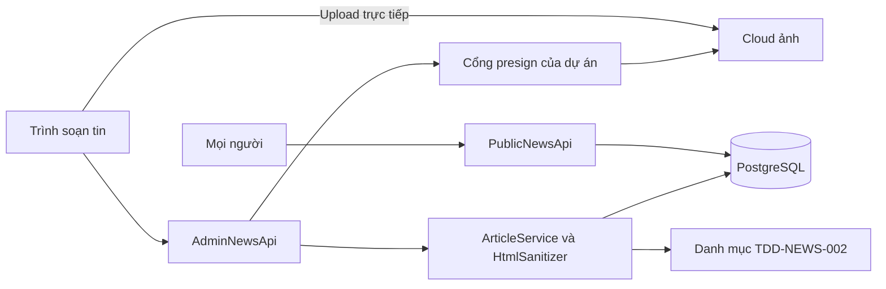
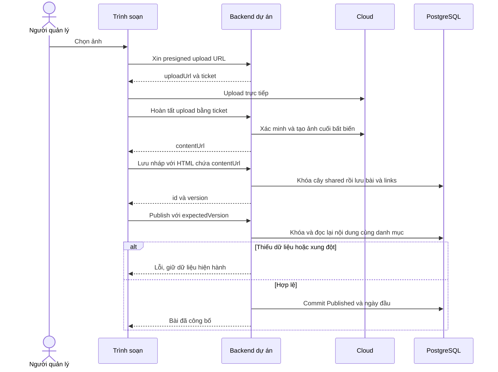
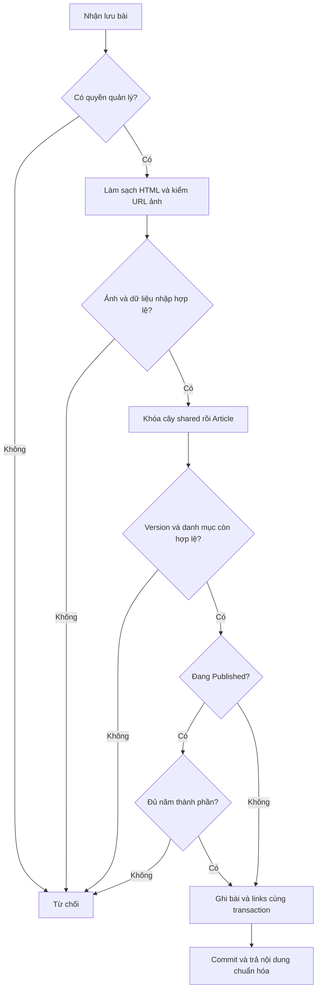
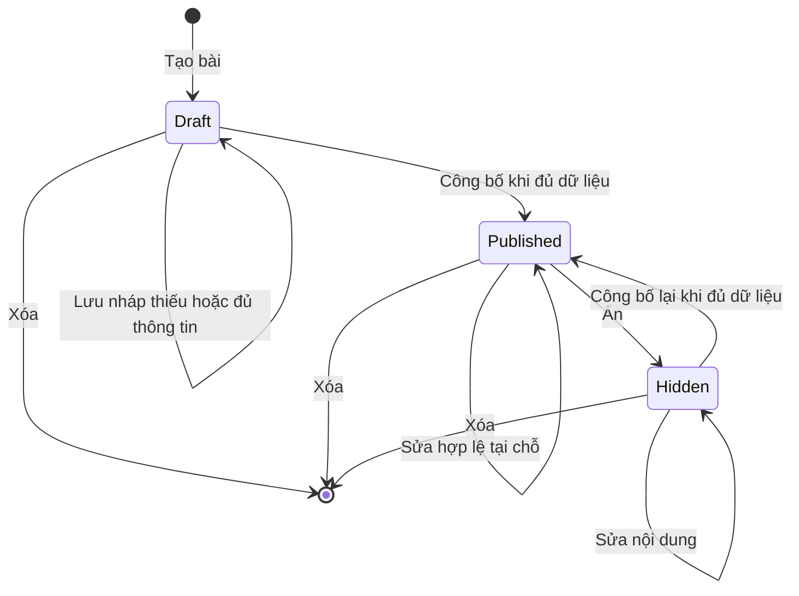
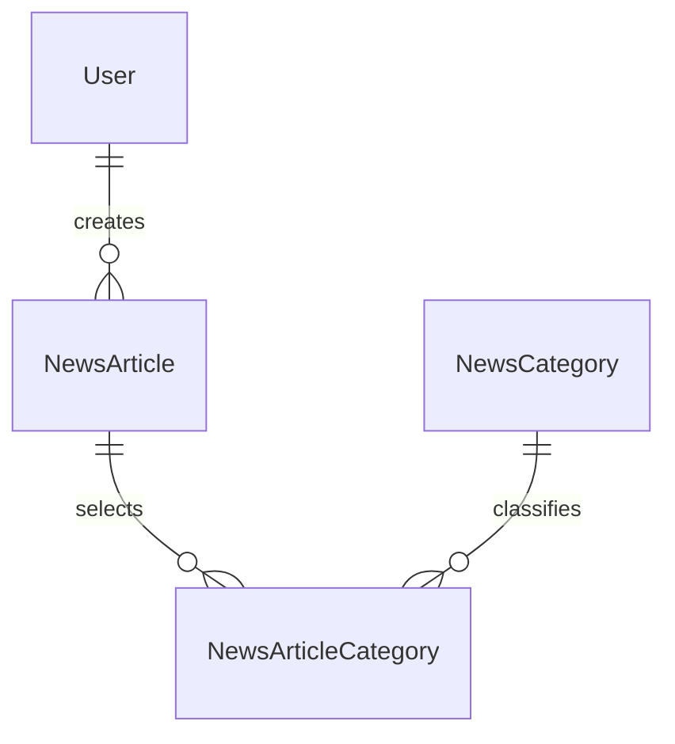

<!-- HƯỚNG DẪN CHO AI KHI ĐIỀN HOẶC CHỈNH SỬA MẪU
- Đọc toàn bộ mẫu, các comment hướng dẫn và tài liệu nguồn được cung cấp trước khi viết. Tuân thủ các quy tắc nghiệp vụ, điều kiện, ngoại lệ và giới hạn đã được xác nhận.
- Không bịa, tự chế hoặc suy đoán thành sự thật: yêu cầu, quy tắc, số liệu, API, schema, mã lỗi, nguồn tham khảo, người phụ trách và kết quả kiểm thử phải có căn cứ. Nội dung ví dụ trong mẫu không phải dữ kiện của dự án.
- Khi thiếu thông tin hoặc các nguồn mâu thuẫn, hỏi người dùng để làm rõ; giữ nguyên placeholder ở phần chưa xác định. Không tự chọn đáp án, lấp chỗ trống hay tuyên bố tài liệu đã hoàn tất.
- Chỉ thay nội dung cần điền hoặc được yêu cầu sửa. Không tự mở rộng phạm vi, sửa nghĩa quy tắc, bỏ điều kiện/ngoại lệ, xoá hay ghi đè nội dung hợp lệ đã có.
- Giữ nguyên tên, cấp và thứ tự heading, nhãn in đậm, tiền tố bullet, cấu trúc danh sách, tên/thứ tự/số cột bảng và cú pháp code fence. Không dịch, đổi tên, gộp hoặc thêm mục ngoài cấu trúc mẫu.
- Chỉ lặp khối luồng, AC hoặc API theo đúng khuôn khi có căn cứ; chỉ bỏ phần tuỳ chọn khi hướng dẫn riêng của mẫu cho phép và đã xác định không áp dụng.
- Mã tham chiếu và section phải trỏ tới tài liệu có thật đã được cung cấp hoặc kiểm chứng. Không giữ mã ví dụ như tham chiếu thật và không tự tạo tài liệu liên quan để hợp thức hoá liên kết.
- Giữ các comment hướng dẫn trong file. Xuất Markdown UTF-8, mỗi file một tài liệu; không bọc toàn bộ file trong code fence, không chèn lời dẫn hay giải thích ngoài mẫu.
- Trước khi bàn giao, đối chiếu nội dung với nguồn, kiểm tra cấu trúc, giá trị cho phép, giới hạn độ dài và tính nhất quán của mã/tham chiếu. Báo rõ phần chưa đủ thông tin; không tuyên bố đã chạy test hoặc import khi chưa thực hiện.
-->

<!-- Thay mã TDD-001 và nội dung ví dụ; giữ nguyên heading và nhãn in đậm.
Sơ đồ dùng mermaid, plantuml hoặc URL. Giữ heading Architecture, Sequence Diagram, Activity Diagram, State Diagram, Data Model.
Ví dụ API phải có heading trùng METHOD /path trong Endpoints. Xoá phần API/sơ đồ không dùng.
Version, Updated At và Change Log do lịch sử phiên bản quản lý, để trống khi nhập mới.
Author/Reviewer là tên hiển thị; gán tài khoản, phê duyệt, giả định và câu hỏi mở trên giao diện sau import.
Thiết kế phải truy vết về Story và Business Rule được cung cấp. Phân biệt thiết kế đề xuất với implementation đã kiểm chứng; không mô tả API/schema/sơ đồ ví dụ như hệ thống thật hoặc tự quyết định nghiệp vụ còn thiếu.
BẮT BUỘC KHI HOÀN THIỆN MẪU: phải có cả Reviewer và Approver, mỗi tên 1–200 ký tự sau khi bỏ khoảng trắng đầu/cuối. Không xoá hai dòng metadata, để trống, dùng tên bịa hoặc giữ placeholder rồi coi là hoàn tất.
Nếu chưa biết người review hoặc người phê duyệt, phải hỏi người dùng và báo tài liệu chưa đủ thông tin; không tự lấy Author/Owner làm người thay thế. Tên trong file không tự gán tài khoản hoặc xác nhận đã duyệt; gán thành viên trên giao diện sau import.
Đây là yêu cầu hoàn thiện mẫu; backend hiện vẫn nhận file cũ thiếu hai trường để tương thích.

VALIDATION CHO FILE NHẬP (đối chiếu ImportSnapshotValidator, MarkdownParser và ImportService):
- Mỗi file .md UTF-8 không rỗng chỉ có một heading cấp 1 chứa mã tài liệu dài 1–100 ký tự. Mã không được trùng trong cùng lần nhập hoặc thuộc loại tài liệu khác đã tồn tại.
- Không dùng tên README.md hoặc sitemap.md vì importer bỏ qua. Giao diện nhận .md/.zip, tối đa 2.000 file, tổng file tải lên 31 MiB; API giới hạn request 32 MiB và tổng nội dung đọc/giải nén 64 MiB.
- Chỉ nhập đè tài liệu cùng loại đang Draft, chưa có phiên bản và chưa lưu trữ. Import thay toàn bộ nội dung bản nháp, vì vậy phải giữ lại nội dung hợp lệ ngoài phần được yêu cầu sửa.
- Không dùng Status trong Markdown hoặc tên Approver để tự xác nhận phê duyệt; import không cấp quyền hay gán tài khoản từ tên. Chạy Kiểm tra file và xử lý lỗi/cảnh báo trước khi nhập.
- Giới hạn độ dài bên dưới tính theo string.Length của .NET (đơn vị UTF-16); không tự cắt ngắn dữ kiện quan trọng để vượt validation, hãy viết lại có căn cứ hoặc hỏi người dùng.
- Feature tối đa 300 ký tự và được dùng làm tiêu đề tài liệu. Status được parser nhận: Draft / In Review / Approved / Deprecated; tài liệu nhập mới vẫn có trạng thái phê duyệt Draft.
- Endpoint: đường dẫn tối đa 500 ký tự; tên/mô tả endpoint được lưu trong Name tối đa 300. HTTP method: GET / POST / PUT / PATCH / DELETE / HEAD / OPTIONS.
- Error Codes: mã tối đa 100 ký tự, không trùng trong tài liệu; giữ dạng - **CODE** (400): mô tả. HTTP status trong Error Codes và Response phải là số nguyên đọc được bằng Int32; không tự đặt status khác hợp đồng API.
- URL sơ đồ tối đa 1.000 ký tự. Mục sơ đồ được sử dụng phải có khối mermaid/plantuml hoặc URL theo mẫu; không để một mục sơ đồ rỗng. Nhãn mục được tách từ bullet như tên External API Fields tối đa 300 ký tự.
- Heading Examples phải khớp METHOD /path ở Endpoints. Giữ các nhãn Request:, Response 200: (thay mã theo contract) và Error Response: để parser tách đúng dữ liệu.
- Tham chiếu dạng DOC-KEY/section: ghi chú: mã đích tối đa 100 ký tự, section tối đa 100, ghi chú tối đa 1.000. Không trùng bộ mã đích + section + loại liên kết trong cùng tài liệu.
ĐỐI CHIẾU FORM TDD (src/features/tdds/validations.ts; form có thể chặt hơn import):
- Điền Feature, Author, Reviewer, Problem và ít nhất một Goal; các Goal/Non-goal/Notes đã thêm không được rỗng. API đã khai báo phải có endpoint và mô tả/mục đích; Fields phải có tên và ý nghĩa; Error Codes phải có mã, HTTP status và điều kiện.
- Form còn kiểm tra Version, Updated At và nội dung Change Log khi khai báo; với file nhập mới, giữ các trường lịch sử này trống theo hợp đồng import, không tự tạo dữ liệu lịch sử.
-->

# TDD-NEWS-001

## Document Info

- **Feature**: Tin tức — quản lý bài, rich text, upload ảnh và đọc công khai
- **Author**: Codex
- **Reviewer**: Tân Trần
- **Approver**: Tân Trần
- **Status**: Draft
- **Version**:
- **Updated At**:

## Context & Goals

### Problem

STORY-NEWS-001–003 và BR-NEWS-001–003 đã được người dùng chốt; ST-NEWS-001–027 là đặc tả chưa thực thi. Tin tức miễn phí, không cần đăng nhập hoặc gói. Một bài có nhiều danh mục riêng, sửa tại chỗ, xóa được ở mọi trạng thái. Không dùng cơ chế phiên bản/quota của LIB.

Tài liệu này định nghĩa bài viết, liên kết bài–danh mục, đọc công khai và tích hợp ảnh. [TDD-NEWS-002](TDD-NEWS-002.md) sở hữu cây danh mục và quy ước khóa chung. Các bảng, port và route dưới đây là thiết kế mới, chưa phải code đã triển khai.

### Goals

- Lưu nháp thiếu thông tin; công bố kiểm đủ; sửa, ẩn và xóa phản ánh ở lần đọc mới.
- FE nhận presigned URL từ backend dự án, upload trực tiếp lên cloud và lưu URL nội dung ảnh trong rich text.
- Lọc cả nhánh danh mục, không lặp bài, phân trang và giữ ngày công bố đầu tiên.
- Bảo vệ thao tác quản trị và làm sạch rich text tại backend.

### Non-goals

- Không quota, lịch sử xem, phiên bản bài, phê duyệt nội dung, thùng rác hoặc khôi phục bài.
- Không video, tệp đính kèm, ghim, bình luận, thích, yêu thích hoặc thống kê lượt đọc.
- Không triển khai code, migration hoặc Unit Test trong lần bàn giao TDD này.

## Architecture

**Hiện trạng đã kiểm tra**

Backend dùng .NET 8, MediatR, FluentValidation, Carter, EF Core/Npgsql 8; Docker Compose dùng PostgreSQL 15. ApplicationDbContext hiện có User và các bảng nền RBAC, chưa có NewsArticle hoặc NewsCategory, không có tenant filter. Không thêm tenant vào Tin tức.

PermissionNames chưa có quyền Tin tức. JwtExtensions mới đăng ký policy xác thực chung; policy quyền và kiểm phiên RBAC đầy đủ chưa thấy trong code đã đọc. User có Status, MustChangePassword, SecurityStamp nhưng chú thích xác nhận phần áp dụng còn ở giai đoạn tiếp theo. Không coi có bảng RBAC là đã bảo vệ được route mới.

Người dùng xác nhận dùng presigned URL của dự án. Trong checkout này chưa tìm thấy source dịch vụ presign/storage; chỉ có tên lịch sử trong AGENTS.md và file .lscache. Vì vậy tái sử dụng cơ chế của dự án theo hợp đồng ở External API; cần ánh xạ tới dịch vụ/nhánh source thực khi triển khai, không khẳng định đang có route hoặc tự chọn cloud khác.

**Thành phần dự kiến**

| Thành phần | Trách nhiệm |
| --- | --- |
| AdminNewsApi / PublicNewsApi | Route quản lý có quyền và route đọc AllowAnonymous; DTO, trạng thái HTTP. Chống CSRF do lớp dùng chung ở [TDD-AUTH-001](TDD-AUTH-001.md) đảm nhận, module không tự làm. |
| NewsArticleService | Lưu bài và liên kết danh mục cùng transaction; kiểm trạng thái, dữ liệu công bố và Version. |
| INewsHtmlSanitizer | Phân tích HTML bằng parser, giữ allowlist, trả HTML chuẩn hóa và kết quả kiểm nội dung. |
| INewsImageUploadGateway | Bao cơ chế presign hiện có của dự án; hoàn tất upload, xác minh ảnh và trả URL đọc bền vững. |
| INewsCategoryReader | Đọc ID danh mục hợp lệ và tập con theo TDD-NEWS-002, không ghi bản sao cây. |
| NewsReadRepository | SQL projection, tìm tiêu đề, lọc bằng EXISTS và phân trang; không gọi module Subscription. |



**Quyền và biên dữ liệu**

Mã quyền `news.manage` là quyền quản lý tin tức đã chốt tên theo STORY-RBAC-001/Preconditions, RequiresAssignment=false; vai trò Admin có quyền này. Policy kiểm theo mã quyền, không kiểm tên vai trò "Admin" (BR-RBAC-001, BR-RBAC-011); thiếu quyền trả 403 và không ghi dữ liệu nghiệp vụ. Thêm PermissionNames, bản ghi Permission qua migration và policy có hiệu lực tại backend; cấp cho Admin theo cơ chế vai trò hệ thống, các vai trò khác qua quản lý quyền hiện có. Không tạo quyền danh mục riêng, không yêu cầu Assignment. ActorId lấy từ phiên; client không được đặt CreatedBy, thời điểm công bố hoặc trạng thái qua DTO lưu nội dung.

Quản trị phải có phiên hợp lệ, tài khoản không bị khóa/buộc đổi mật khẩu và quyền hiện hành. Khi chưa có cơ chế RBAC hoàn chỉnh, cần bổ sung trước mở route; không thay kiểm quyền bằng việc chỉ kiểm đăng nhập. Public API dùng AllowAnonymous và chỉ truy vấn Published; cookie hết hạn/không có gói không biến việc đọc công khai thành yêu cầu đăng nhập. Chống CSRF theo [TDD-AUTH-001](TDD-AUTH-001.md): mutation dùng cookie phải có `Origin` (không có thì `Referer`) nằm trong danh sách được phép, sai thì trả 403 `CsrfInvalid`; không dùng CORS thay cho chống CSRF.

**Rich text và URL ảnh**

Chọn HTML đã làm sạch lưu trong ContentHtml text; không lưu song song JSON editor và HTML như hai nguồn nội dung. Đây là lựa chọn kỹ thuật; editor FE có thể xuất/nhập HTML theo contract, chưa chốt thư viện editor. Backend luôn làm sạch lại cả lưu nháp lẫn lưu bài công bố; FE chỉ preview bản đã làm sạch, không render HTML thô từ request lỗi.

Allowlist cơ bản: p, br, strong, b, em, i, u, s, h2–h6, ul, ol, li, blockquote, a, img. Thuộc tính: href/title của a; src/alt/title/width/height của img với kích thước dương hợp lệ. Không chấp nhận script, style, iframe, object, embed, form, SVG, thuộc tính on*, srcdoc, CSS tùy ý hoặc URL javascript/data/blob. Link chỉ http/https; ảnh chỉ HTTPS tại origin và prefix cloud được cấu hình chính xác, không so bằng StartsWith trên chuỗi host. Nếu mở liên kết tab mới thì thêm rel=noopener noreferrer. Không dùng regex làm bộ làm sạch HTML. Cấu hình parser/sanitizer cụ thể phải kiểm khả năng trên .NET 8 trước chọn package. Thiết kế theo [OWASP về HTML sanitization](https://cheatsheetseries.owasp.org/cheatsheets/Cross_Site_Scripting_Prevention_Cheat_Sheet.html).

Sau làm sạch, nội dung gồm chữ có nghĩa hoặc ít nhất một ảnh hợp lệ mới được coi là có nội dung; p/br rỗng hoặc chỉ khoảng trắng không đáp ứng điều kiện công bố. Tiêu đề và mô tả ngắn là plain text, trim khoảng trắng ngoài và hiển thị có escape. CoverImageUrl là ảnh riêng, không bắt buộc trùng một ảnh trong nội dung. Người dùng chỉ chốt có ảnh đại diện, không chốt chọn từ gallery như LIB.

FE gọi presign, upload bytes lên cloud, hoàn tất/xác minh upload rồi chèn `contentUrl` vào img src hoặc cover. Không lưu `uploadUrl`, chữ ký upload hoặc URL GET có hạn vào bài. Gateway xác minh URL thuộc kho của dự án, object tồn tại và là ảnh hợp lệ trước nhận URL mới vào bài; không gửi HTTP tới URL tùy ý của client. Ảnh đã xác minh dùng object cuối bất biến để lần upload lại không thay nội dung âm thầm. Cách hoàn tất và ánh xạ provider ở External API.

URL ảnh cloud là URL đọc được độc lập với API bài. Ẩn/xóa ngừng phục vụ bài, không hứa thu hồi bản ảnh người đọc đã biết URL hoặc đã tải. Không tự xóa object khi xóa bài vì ảnh có thể còn được dùng ở bài khác. Chưa đưa dọn ảnh không còn dùng hoặc quản trị thư viện media vào scope.

**Luồng lưu, công bố và xử lý đồng thời**

1. Xác thực/quyền, kiểm DTO và làm sạch HTML. Xác minh URL ảnh mới qua gateway trước mở transaction ghi; lỗi storage dừng ở đây, không thay nội dung hiện tại.
2. Gọi command có hậu tố Command hoặc marker ITransactionalRequest. Generic ICommand<T> hiện không kế thừa ICommand; không dựa vào tên interface để giả định pipeline đã mở transaction.
3. Trong cùng PostgreSQL READ COMMITTED transaction, lấy khóa chia sẻ cây theo TDD-NEWS-002 trước khi kiểm danh mục; sau đó khóa Article FOR UPDATE. Tạo mới dùng ID server sinh; sửa bắt buộc expectedVersion. Đọc lại danh mục tồn tại và phiên bản sau khóa.
4. Lưu đầy đủ snapshot DTO và thay tập NewsArticleCategory bằng các ID distinct. Draft cho thiếu; Published phải đủ năm thành phần. Hidden có thể được chỉnh nội dung nhưng chỉ publish lại khi đủ. Không đổi ngày công bố khi lưu.
5. Publish chỉ nhận expectedVersion và đọc dữ liệu đã lưu để kiểm đủ. Draft → Published đặt FirstPublishedAtUtc một lần; Hidden → Published giữ ngày cũ. Published → Published không đổi ngày hoặc tạo phiên bản; stale Version vẫn báo xung đột. Hide chỉ Published → Hidden; đã Hidden là no-op với Version đúng, Draft trả lỗi trạng thái.
6. Save, publish, hide làm tăng Version khi dữ liệu/trạng thái đổi. Delete có expectedVersion, xóa vật lý Article và link cùng transaction ở mọi trạng thái. Không có trường IsDeleted, không kế thừa Entity có soft-delete nếu gây sai cơ chế. GET sau delete trả 404, không có restore API.
7. Commit trước trả kết quả. Lỗi sau bắt đầu ghi phải ném exception để rollback; pipeline hiện commit mọi response bình thường kể cả Result.Failure. Không mở transaction lồng, không gọi cloud trong lúc giữ khóa DB. IUnitOfWork đang transient, phải đổi scoped để pipeline và handler giữ cùng transaction.

Version là token chống ghi đè, không phải phiên bản nội dung phục vụ khách. Ví dụ hai quản trị cùng đọc Version=4: người lưu đầu lên 5; người còn lại nhận 409, tải lại trước sửa, không tự ghi đè hoặc tự trộn nội dung.

POST tạo bài không tự động retry: FE khóa nút khi đang gửi; nếu mất phản hồi, tải lại danh sách quản trị để đối chiếu trước tạo tiếp. Chưa có bảng receipt chống trùng thao tác tạo. Save/publish/hide gửi lại expectedVersion cũ trả 409; FE đọc lại để xác định kết quả, không hứa replay cùng response. DELETE gửi lại sau xóa trả 404. Đây là semantics kỹ thuật công khai cho FE, không thêm lịch sử bài.

**Đọc công khai và tìm kiếm**

GET danh sách chỉ chọn Id, Title, Summary, CoverImageUrl, FirstPublishedAtUtc và các danh mục được gắn; không lấy ContentHtml hoặc audit actor. Detail chọn cùng metadata và ContentHtml; không chấp nhận tham số trạng thái để vượt Published. Không gọi quota, không tạo Access hoặc lượt đọc.

Tìm title bằng ILIKE có tham số và escape ký tự %, _, backslash để từ khóa là văn bản thường; không tìm mô tả/nội dung. Lọc một categoryId dùng tập con TDD-NEWS-002 rồi EXISTS trên bảng liên kết, vì EXISTS không nhân bản bài như JOIN nhiều danh mục. CategoryId không tồn tại (ví dụ danh mục vừa bị xóa khi người đọc còn giữ bộ lọc cũ) được xử lý như không có bài khớp: CTE chỉ có tập rỗng nên trả trang rỗng với TotalCount=0, không trả 404, theo BR-NEWS-003 khoản 5. Danh mục tồn tại nhưng không có bài cũng trả trang rỗng. FE có thể gọi `GET /api/v1/news/categories/{id}` của TDD-NEWS-002 nếu cần biết nhãn bộ lọc còn tồn tại hay không.

Sort FirstPublishedAtUtc DESC, Id DESC. PageIndex mặc định 1, PageSize 10, tối đa 100 theo PagedResult hiện có; <=0 về mặc định, vượt 100 clamp về 100. Kiểm phép tính offset không tràn Int32; input không biểu diễn được trả 422. Count và items phải dùng cùng predicate và snapshot: read-only REPEATABLE READ ngắn nếu hai truy vấn, không giữ transaction khi trả response. Projection danh mục có thể truy vấn theo tập ID của trang, không N+1 và không bị JOIN làm tăng TotalCount. Không hứa snapshot xuyên nhiều lần chuyển trang khi dữ liệu đang thay đổi.

Chưa dùng cache bài/CDN HTML hoặc query cache MediatR cho Tin tức. Public lẫn admin trả Cache-Control: no-store; FE không dùng bản cũ sau mutation và không prerender bài thành nội dung tĩnh không có revalidation. Như vậy request đọc mới sau commit phản ánh sửa/ẩn/xóa; không thể thu hồi response đã gửi trước commit.

**Nơi thực hiện quy tắc và kiểm chứng**

| Quy tắc | Nơi thực hiện | System Test |
| --- | --- | --- |
| BR-NEWS-001: quyền, đủ trường và vòng đời | Policy, NewsArticleService, CHECK cùng transaction link | ST-NEWS-001–003, ST-NEWS-006–011 |
| BR-NEWS-001: ảnh URL và rich text | FE upload, gateway, sanitizer | ST-NEWS-004–005, ST-NEWS-027 |
| BR-NEWS-002: liên kết danh mục hợp lệ | CategoryReader, khóa cây, FK | ST-NEWS-008, ST-NEWS-018 |
| BR-NEWS-003: public, lọc, thứ tự, không quota | SQL projection và route AllowAnonymous | ST-NEWS-020–026 |

Integration phải dùng PostgreSQL 15 thật để kiểm FK, khóa shared/exclusive, xung đột sửa/xóa/công bố, rollback giữa bài và links; không dùng EF InMemory để kết luận. Cần thử sanitize bằng trình duyệt thật ở trang soạn và trang đọc; thử presign quá hạn, PUT lỗi, finalize lỗi và URL ảnh sau hạn upload. Unit strategy là policy trạng thái, validation và sanitizer; bộ đặc tả UT được dẫn trong bảng độ phủ kiểm thử đơn vị.

**Notes**:

- Không thêm bảng Version, History, Favorite hoặc quota. Ba bảng nghiệp vụ toàn module là NewsArticle, NewsCategory và NewsArticleCategory.
- Bổ sung code dự kiến tại contract/services/news, application/usecases/{commands,queries}/news, presentation/apis/news, domain/entities và persistence/configurations; gateway cloud/sanitizer là adapter infrastructure. Tên đường dẫn này mô tả nơi sẽ thêm, chưa có implementation.
- Cần bổ sung ánh xạ ConflictException/DbUpdateConcurrencyException sang 409 và lỗi gateway sang 503. Middleware hiện chưa ánh xạ ConflictException nên chỉ khai báo class không đủ. Giữ envelope lỗi hiện có với code/status/detail/messageCode/errors; không để lỗi DB thô hoặc HTML thô lọt ra client/log.
- Log actorId, articleId, hành động, conflict, storage failure và thời gian chờ khóa; không log rich text, chữ ký upload hoặc URL có token. Chưa có ngưỡng tải, timeout và RPO/RTO được chốt; không tự đặt cam kết.

## Sequence Diagram



## Activity Diagram



## State Diagram



FirstPublishedAtUtc NULL ở Draft, có giá trị ở Published/Hidden và không đổi sau lần công bố đầu. Không có chuyển Published về Draft, không có phiên bản riêng hoặc đường khôi phục bài đã xóa.

## Data Model

**Quy ước và ý nghĩa từng bảng**

UUID là định danh; thời điểm timestamptz theo UTC; bigint Version tăng từ 1; NN là NOT NULL. Bảng dùng tên PascalCase theo persistence hiện có. NewsArticle là một bài hiện tại; NewsArticleCategory là một liên kết người quản lý đã chọn, không lưu các cha suy ra. NewsCategory và schema của nó chỉ định nghĩa ở TDD-NEWS-002. User phục vụ FK actor, dùng entity/configuration hiện có, không sao chép quyền hay tên người vào bài.

| Bảng | Cột và ràng buộc |
| --- | --- |
| NewsArticle | Id uuid PK; State varchar(16) NN DEFAULT 'Draft' CHECK IN ('Draft','Published','Hidden'); Title text NULL; Summary text NULL; ContentHtml text NULL; CoverImageUrl text NULL; FirstPublishedAtUtc timestamptz NULL; Version bigint NN DEFAULT 1 CHECK >0; CreatedBy uuid NN FK User RESTRICT; ModifiedBy uuid NN FK User RESTRICT; CreatedAtUtc, ModifiedAtUtc timestamptz NN. |
| NewsArticleCategory | ArticleId uuid NN FK NewsArticle ON DELETE CASCADE; CategoryId uuid NN FK NewsCategory ON DELETE RESTRICT; PK(ArticleId,CategoryId). Không có thứ tự, danh mục chính, tên danh mục hoặc các cha được sao chép. |

NULL của các trường nội dung biểu diễn chưa nhập. Normalize chuỗi rỗng thành NULL. Không đặt unique Title vì nghiệp vụ không cấm bài trùng tiêu đề. Version là concurrency token EF; không dùng làm bảng lịch sử. Audit fields được gán server, cùng transaction nội dung.

CHECK: (State='Draft' AND FirstPublishedAtUtc IS NULL) OR (State IN ('Published','Hidden') AND FirstPublishedAtUtc IS NOT NULL). Với Published, từng Title/Summary/ContentHtml/CoverImageUrl phải IS NOT NULL và btrim không rỗng. SQL CHECK không thay kiểm HTML có nghĩa hoặc xác minh URL. Việc Published có ít nhất một Category là ràng buộc nhiều dòng: NewsArticleService kiểm tập liên kết cuối cùng trong cùng transaction và dùng khóa cây. Không dùng CHECK có subquery; không cho writer khác bỏ qua service/khóa. FK RESTRICT ở Category và việc gỡ links chỉ qua article service ngăn bài công bố bị mất danh mục ngoài quy trình.

**Quan hệ và xóa**



Mỗi link có đúng một Article và một Category. Article nháp/ẩn có thể chưa có link; Published phải có ít nhất một. Xóa Article cascade links, không xóa Category hoặc object cloud. Xóa Category bị chặn nếu còn bất kỳ link nào, không xét trạng thái bài. FK ModifiedBy tới User cũng RESTRICT, được mô tả trong schema dù sơ đồ chỉ vẽ quan hệ người tạo để dễ đọc.

**Dữ liệu mẫu lưu trữ**

Mẫu giả định, lược cột audit lặp lại, dùng A/N1/C1/C2/C3 làm bí danh UUID, không phải seed chạy được. A là User có sẵn. C1=Vật liệu, C2=Sơn con C1, C3=Kinh nghiệm theo TDD-NEWS-002. T1=2026-09-23T08:00:00Z, T2=2026-09-23T09:00:00Z; domain ảnh minh họa phải thay bằng origin dự án khi triển khai.

| Bảng | Dòng dữ liệu |
| --- | --- |
| NewsArticle | Id=N1; State=Draft; Title='Chọn sơn'; Summary/ContentHtml/CoverImageUrl/FirstPublishedAtUtc=NULL; Version=1; CreatedBy=ModifiedBy=A; CreatedAtUtc=ModifiedAtUtc=T1. |
| NewsArticleCategory | Chưa có dòng cho N1 khi nháp chỉ có tiêu đề. Sau lưu đủ: (ArticleId=N1,CategoryId=C2) và (ArticleId=N1,CategoryId=C3). Không tự tạo dòng N1/C1. |

Lưu đủ thêm Summary='Cách chọn sơn', ContentHtml='<p>Nội dung</p>', CoverImageUrl='https://images.example.test/news/final/F2.webp'; Version=2, ModifiedAtUtc=T2, State vẫn Draft và ngày đầu NULL. Hai URL là object đã hoàn tất/xác minh, không phải presigned PUT.

Publish N1 với expectedVersion=2 tại T2: State=Published, FirstPublishedAtUtc=T2, Version=3. Sửa tiêu đề lên Version=4 vẫn giữ T2. Hide lên 5, publish lại lên 6 vẫn giữ T2. Nếu validation hoặc ghi link lỗi, rollback cả bài lẫn links; không tăng Version một phần. Delete xóa N1 và hai links; C2/C3 vẫn tồn tại. Không có bản ghi Access/UsageOperation hoặc bảng lưu ảnh mới trong module này.

**Chuẩn hóa, chỉ mục và triển khai schema**

Title/ContentHtml/State/ngày công bố phụ thuộc ArticleId; danh mục được chọn phụ thuộc toàn khóa ArticleId+CategoryId. Không lặp nhãn danh mục, đường dẫn cây, số bài hay ngày đọc. HTML là nội dung tài liệu cần render, không dùng như danh sách category; không cần tách mỗi node thành bảng.

Index NewsArticle(FirstPublishedAtUtc DESC,Id DESC) WHERE State='Published' phục vụ trang khách. Index (ModifiedAtUtc DESC,Id DESC) phục vụ quản trị. PK link hỗ trợ đọc danh mục theo bài; thêm (CategoryId,ArticleId) cho EXISTS và chặn xóa danh mục. FK CreatedBy/ModifiedBy cần index phục vụ kiểm tham chiếu. ILIKE contains chưa được B-tree hỗ trợ hiệu quả; chỉ thêm pg_trgm khi có số liệu và kế hoạch index phù hợp.

Migration triển khai tạo Category trước, Article sau rồi link; dùng EF configuration cho FK, CHECK, index, Version concurrency token. PK ghép dùng repository riêng hoặc DbContext, không ép vào IRepositoryBase có Id đơn. Kiểm schema thực tế trước chạy: checkout chưa có NEWS không chứng minh production trống. Nếu có dữ liệu cũ, phải đối soát liên kết và ngày công bố trước backfill. Không tự đổi ngày đầu thành ngày migration. Rollback ứng dụng không drop bài đã được nhập; tắt route rồi sửa tiếp. Chưa chạy migration.

**Notes**:

- Restore DB cần đối chiếu cloud vì DB chỉ giữ URL. Chưa có chính sách dọn object/RPO/RTO; không tự xóa ảnh bằng cascade SQL hoặc hứa restore bài qua giao diện.
- DB constraints và EF mapping được mô tả để viết migration; SQL trong truy vấn ở TDD-NEWS-002 là minh họa có tham số, chưa thực thi kiểm chứng.

## Internal API

### Endpoints

Các route dưới đây là contract đề xuất v1, không khẳng định endpoint presign hiện có trùng tên. Carter dùng /api/v{version:apiVersion}. Quản trị yêu cầu news.manage; mutation dùng cookie được kiểm Origin theo [TDD-AUTH-001](TDD-AUTH-001.md). JSON field camelCase; UUID dạng chuỗi. Response dưới đây mô tả payload; endpoint giữ envelope Result của repo nếu đang dùng, không bọc PagedResult thêm một lần.

- **GET** `/api/v1/news/articles` — Public; query keyword, categoryId, pageIndex, pageSize. Trả PagedResult<ArticleSummary> chỉ Published; không có contentHtml hoặc thông tin người quản trị. categoryId không tồn tại trả danh sách rỗng, không trả 404.
- **GET** `/api/v1/news/articles/{id}` — Public; ArticleDetail gồm id,title,summary,coverImageUrl,contentHtml,firstPublishedAtUtc,categories. Không Published hoặc không tồn tại trả 404.
- **GET** `/api/v1/admin/news/articles` — Có quyền; query keyword,state,pageIndex,pageSize. Trả metadata và version theo ModifiedAtUtc DESC,Id DESC; không trả toàn bộ rich text trong danh sách.
- **GET** `/api/v1/admin/news/articles/{id}` — Có quyền; trả toàn bộ nội dung, state,version,categoryIds và metadata thời điểm để soạn/đối chiếu.
- **POST** `/api/v1/admin/news/articles` — Tạo Draft với ArticleWrite, được thiếu trường. Trả 201 với id,version,state và nội dung đã làm sạch; không tự công bố.
- **PUT** `/api/v1/admin/news/articles/{id}` — ArticleWrite kèm expectedVersion; thay snapshot nội dung và toàn bộ categoryIds cùng transaction. Giữ state/ngày đầu; trả 200 với bản đã lưu.
- **POST** `/api/v1/admin/news/articles/{id}/publish` — Body expectedVersion; kiểm đủ nội dung đã lưu. Công bố Draft/Hidden, giữ ngày đầu nếu đã có; trả id,state,version,firstPublishedAtUtc.
- **POST** `/api/v1/admin/news/articles/{id}/hide` — Body expectedVersion; Published sang Hidden, không đổi ngày đầu; trả id,state,version. Draft trả 409.
- **DELETE** `/api/v1/admin/news/articles/{id}` — Query expectedVersion bắt buộc; xóa mọi trạng thái cùng links, thành công 204; không tồn tại 404, version cũ 409.
- **POST** `/api/v1/admin/news/image-uploads/presign` — Xin upload qua dịch vụ presign của dự án; body fileName,contentType,sizeBytes. Trả uploadUrl,method,headers,expiresAtUtc,uploadTicket; không nhận object key tùy ý.
- **POST** `/api/v1/admin/news/image-uploads/complete` — Body uploadTicket; backend xác minh/hoàn tất ảnh qua gateway, trả contentUrl đọc bền vững. Không gửi bytes ảnh qua API bài viết.

ArticleWrite = {title?,summary?,contentHtml?,coverImageUrl?,categoryIds:uuid[]}; thiếu trường chuỗi là NULL, categoryIds thiếu khi tạo là []; PUT bắt buộc gửi categoryIds và cả các trường nội dung nullable để rõ nghĩa thay thế. Không nhận state hoặc firstPublishedAtUtc. ID category trùng trong input được distinct. expectedVersion là số nguyên dương. Mọi URL mới phải qua hợp đồng ảnh; link URL và img URL được kiểm riêng.

### Examples

#### POST /api/v1/admin/news/articles

```
Request:
{"title":"Chọn sơn","categoryIds":[]}

Response 201:
{"id":"10000000-0000-0000-0000-000000000001","version":1,"state":"Draft","title":"Chọn sơn","summary":null,"contentHtml":null,"coverImageUrl":null,"categoryIds":[],"firstPublishedAtUtc":null}

Error Response:
{"code":"AccessForbidden","status":403,"detail":"Bạn không có quyền quản lý Tin tức."}
```

#### POST /api/v1/admin/news/articles/{id}/publish

```
Request:
{"expectedVersion":2}

Response 200:
{"id":"10000000-0000-0000-0000-000000000001","state":"Published","version":3,"firstPublishedAtUtc":"2026-09-23T09:00:00Z"}

Error Response:
{"code":"InvalidNewsContent","status":422,"detail":"Cần có ít nhất một danh mục trước khi công bố."}
```

#### POST /api/v1/admin/news/image-uploads/complete

```
Request:
{"uploadTicket":"opaque-ticket-from-presign"}

Response 200:
{"contentUrl":"https://images.example.test/news/final/F1.webp"}

Error Response:
{"code":"NewsImageNotReady","status":422,"detail":"Upload chưa hoàn tất hoặc dữ liệu không phải ảnh hợp lệ."}
```

### Error Codes

- **Unauthorized** (401): Thiếu hoặc không có phiên quản trị hợp lệ.
- **AccessForbidden** (403): Không có news.manage; quyền đọc public không cho phép mutation.
- **CsrfInvalid** (403): Mutation dùng cookie có `Origin`/`Referer` ngoài danh sách được phép, hoặc thiếu cả hai; theo [TDD-AUTH-001](TDD-AUTH-001.md).
- **NewsArticleNotFound** (404): Không có bài; trên public còn áp dụng cho bài không Published.
- **NewsVersionConflict** (409): expectedVersion cũ; giữ dữ liệu hiện hành.
- **NewsStateConflict** (409): Thao tác trạng thái không được phép, ví dụ ẩn Draft.
- **InvalidNewsContent** (422): Thiếu nội dung bắt buộc, URL không hợp lệ, danh mục lưu không tồn tại hoặc DTO sai định dạng.
- **NewsImageNotReady** (422): Upload thiếu/chưa xong hoặc xác minh bytes ảnh không đạt.
- **NewsUploadTicketInvalid** (422): Ticket sai chữ ký, actor/purpose hoặc đã hết hạn.
- **NewsStorageUnavailable** (503): Không ký, xác minh hoặc hoàn tất upload do lỗi dịch vụ cloud.

Lỗi media/request quá lớn của hạ tầng dùng 413 theo cấu hình thực; chưa tự đặt dung lượng hoặc số ảnh tối đa nghiệp vụ. Cần ánh xạ exception rõ ràng, không để HandlerFailure mặc định biến mọi lỗi thành 400.

## External API

### Endpoints

- **Presign của dự án** — Gateway CreateUploadTicket cấp quyền ghi tạm cho một object cụ thể; FE dùng method/headers trả về để upload trực tiếp lên cloud.
- **Hoàn tất ảnh** — Gateway CompleteUpload xác minh và tạo object cuối bất biến; trả URL đọc ổn định. Tái dùng bước tương đương của dịch vụ media hiện có nếu đã đáp ứng.
- **Kiểm URL ảnh** — Gateway ValidateContentUrls dùng SDK/metadata của kho dự án, chỉ nhận key suy ra từ origin/prefix đã cấu hình; không tải URL ngoài tùy ý.

### Fields

- **uploadUrl** — URL có hạn chỉ dùng upload, không lưu vào rich text; không log chữ ký.
- **method/headers** — FE gửi đúng method và signed headers do presign quy định; không tự giả định luôn là PUT nếu dịch vụ trả hợp đồng khác.
- **uploadTicket** — Dữ liệu opaque do backend ký/bảo vệ, ràng buộc actor, object staging, loại ảnh, size và hạn; không chứa secret cloud. Adapter có thể dùng uploadId hiện có với cùng mức bảo vệ.
- **contentUrl** — HTTPS URL ổn định tới ảnh cuối đã xác minh; không dùng chữ ký GET sắp hết hạn. Đây là giá trị lưu trong HTML/cover.
- **fileName/contentType/sizeBytes** — Gợi ý từ FE; tên key do server sinh, phải xác minh MIME/bytes/size thực khi hoàn tất. Danh sách định dạng và giới hạn hạ tầng kế thừa hợp đồng upload của dự án, chưa thấy source để chốt giá trị.

### Error Handling

Cloud nằm ngoài SQL transaction. Presign/upload/complete lỗi không được báo bài đã lưu; FE giữ nội dung đang soạn và cho thử lại. Gửi lại complete dùng cùng ticket phải trả cùng URL nếu ảnh đã hoàn tất; expired ticket chưa hoàn tất phải upload lại theo cơ chế dự án. Nếu cần hoàn tất sau timeout, đối chiếu object cuối theo định danh trong ticket thay vì sinh thêm ảnh mỗi lần.

Nếu dịch vụ presign chỉ cung cấp PUT có thể ghi đè, dùng key staging riêng: complete đọc một version/ETag cố định, xác minh bytes, rồi copy có điều kiện hoặc ghi chính bytes đã xác minh sang key final mà FE không có quyền ghi. Không copy lại từ staging đã thay đổi sau xác minh. Đồng thời finalize phải dùng create-if-absent cho final key hoặc cơ chế idempotent tương đương. Nếu provider không hỗ trợ thì adapter phải giải quyết trước triển khai; chỉ HEAD Content-Type không chứng minh bytes là ảnh hợp lệ.

Không mở SQL transaction khi gọi cloud. Upload xong nhưng lưu bài thất bại để lại object chưa dùng; chưa tự xóa/đặt lịch dọn. Điều này không đòi thêm bảng media của NEWS; gateway có thể dùng dữ liệu/ticket của cơ chế upload chung. Nếu dịch vụ chung chưa có persistence cần thiết, thiết kế bổ sung tại module media, không lặng lẽ tạo thư viện ảnh trong scope Tin tức.

### Quirks

- Người dùng đã chốt dùng presign của dự án; nhà cung cấp, route thực, CORS cloud, hạn ticket và cơ chế complete cần đối chiếu source triển khai. Không thay bằng dịch vụ mới hoặc đưa secret lên FE.
- URL cloud được lưu trực tiếp nên đổi domain phải có alias ổn định hoặc migration URL có kiểm tra; không để bài dùng uploadUrl hết hạn.
- Ẩn/xóa bài không đồng nghĩa xóa ảnh đã công khai; chính sách dọn ảnh và thu hồi link chưa nằm trong nghiệp vụ này.

## References

### User Stories

- STORY-NEWS-001
- STORY-NEWS-002
- STORY-NEWS-003
- STORY-RBAC-001/Preconditions

### Business Rules

- BR-NEWS-001/Then
- BR-NEWS-001/Except
- BR-NEWS-002/Then
- BR-NEWS-003/Then
- BR-RBAC-001/Then
- BR-RBAC-011/Then

### Use Cases

### Others

- Xác nhận thiết kế: Người dùng đã chốt hai TDD Tin tức trong hội thoại. Giới hạn tên danh mục tối đa 200 ký tự sau trim lấy theo BR-NEWS-002 khoản 1 và STORY-NEWS-002/AC-008. Status Draft vẫn giữ theo quy trình import; không thay cho phê duyệt trên hệ thống.
- Unit Test: [Độ phủ kiểm thử đơn vị Tin tức](../discovery/news-unit-test-coverage.md).

- Danh mục: [TDD-NEWS-002](TDD-NEWS-002.md).
- System Test: [Bảng độ phủ Tin tức](../discovery/news-system-test-coverage.md).
- Code nền: `bmt-be/src/bmt-be.persistence/ApplicationDbContext.cs`, `bmt-be/src/bmt-be.application/behaviors/TransactionPipelineBehavior.cs`, `bmt-be/src/bmt-be.persistence/repositories/EFUnitOfWork.cs`, `bmt-be/src/bmt-be.persistence/dependencyInjection/extensions/ServiceCollectionExtensions.cs`.
- Code quyền và lỗi: `bmt-be/src/bmt-be.contract/constants/PermissionNames.cs`, `bmt-be/src/bmt-be.api/startup/PermissionCatalogGuard.cs`, `bmt-be/src/bmt-be.api/dependencyInjection/extensions/JwtExtensions.cs`, `bmt-be/src/bmt-be.api/middlewares/ExceptionHandlingMiddleware.cs`.
- Code phân trang: `bmt-be/src/bmt-be.contract/abstractions/shared/PagedResult.cs`.
- An toàn rich text: [OWASP XSS Prevention](https://cheatsheetseries.owasp.org/cheatsheets/Cross_Site_Scripting_Prevention_Cheat_Sheet.html).

## Change Log

- 2026-09-26 (CSRF): Chống CSRF dẫn tới [TDD-AUTH-001](TDD-AUTH-001.md), bỏ antiforgery token; mã lỗi đổi từ `CsrfRejected` thành mã chung `CsrfInvalid`.
- 2026-09-25: Lọc tin theo categoryId không tồn tại trả danh sách rỗng như BR-NEWS-003 khoản 5, không trả 404; bỏ mã lỗi `NewsCategoryNotFound` khỏi API bài viết (mã này vẫn dùng cho API danh mục ở TDD-NEWS-002). Ghi `news.manage` là tên quyền đã chốt theo STORY-RBAC-001, kiểm theo mã quyền. Giới hạn tên danh mục 200 ký tự dẫn căn cứ BR-NEWS-002 khoản 1 và STORY-NEWS-002/AC-008. Bổ sung tham chiếu STORY-NEWS-002, STORY-RBAC-001, BR-RBAC-001 và BR-RBAC-011.
