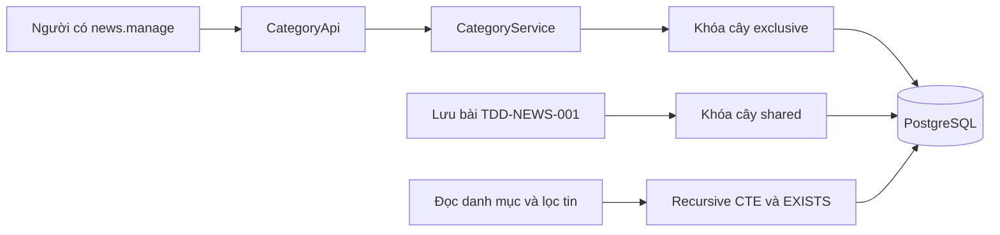
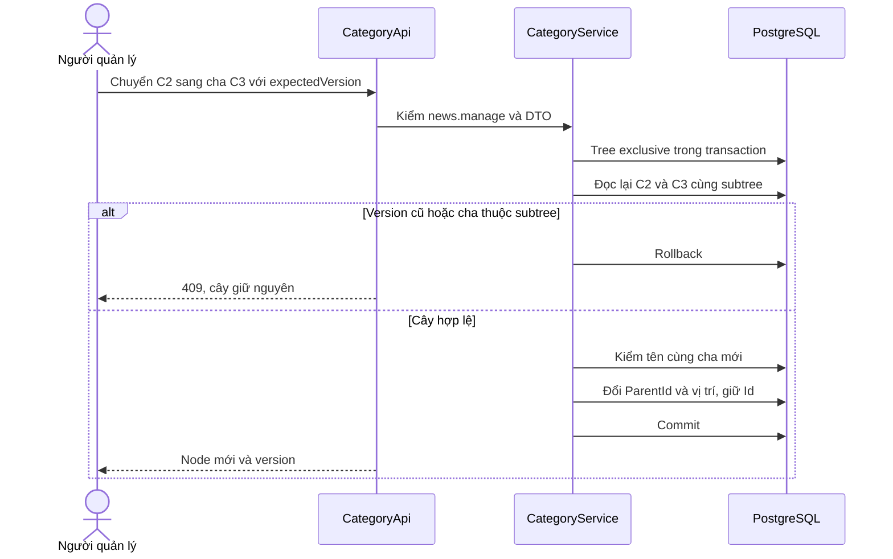
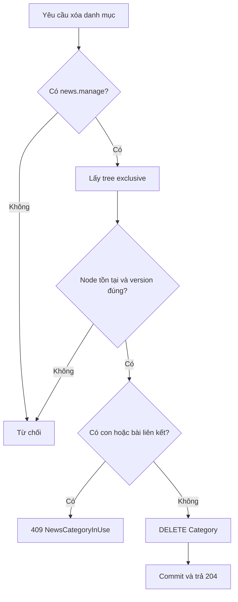
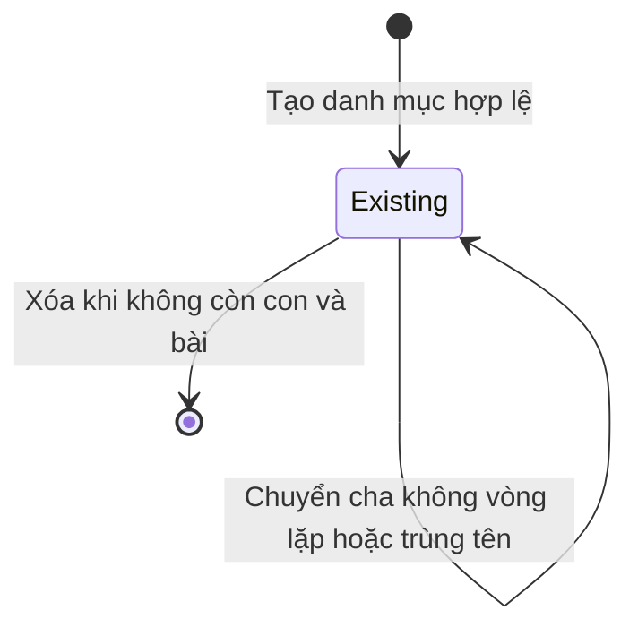
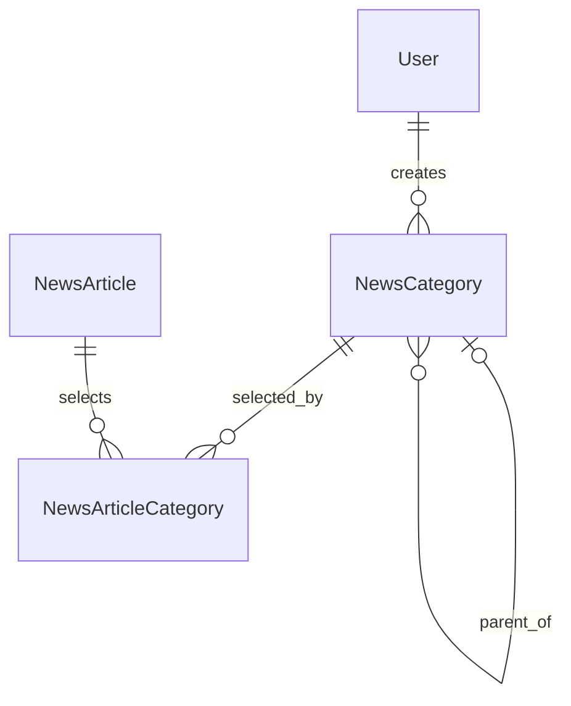

<!-- HƯỚNG DẪN CHO AI KHI ĐIỀN HOẶC CHỈNH SỬA MẪU
- Đọc toàn bộ mẫu, các comment hướng dẫn và tài liệu nguồn được cung cấp trước khi viết. Tuân thủ các quy tắc nghiệp vụ, điều kiện, ngoại lệ và giới hạn đã được xác nhận.
- Không bịa, tự chế hoặc suy đoán thành sự thật: yêu cầu, quy tắc, số liệu, API, schema, mã lỗi, nguồn tham khảo, người phụ trách và kết quả kiểm thử phải có căn cứ. Nội dung ví dụ trong mẫu không phải dữ kiện của dự án.
- Khi thiếu thông tin hoặc các nguồn mâu thuẫn, hỏi người dùng để làm rõ; giữ nguyên placeholder ở phần chưa xác định. Không tự chọn đáp án, lấp chỗ trống hay tuyên bố tài liệu đã hoàn tất.
- Chỉ thay nội dung cần điền hoặc được yêu cầu sửa. Không tự mở rộng phạm vi, sửa nghĩa quy tắc, bỏ điều kiện/ngoại lệ, xoá hay ghi đè nội dung hợp lệ đã có.
- Giữ nguyên tên, cấp và thứ tự heading, nhãn in đậm, tiền tố bullet, cấu trúc danh sách, tên/thứ tự/số cột bảng và cú pháp code fence. Không dịch, đổi tên, gộp hoặc thêm mục ngoài cấu trúc mẫu.
- Chỉ lặp khối luồng, AC hoặc API theo đúng khuôn khi có căn cứ; chỉ bỏ phần tuỳ chọn khi hướng dẫn riêng của mẫu cho phép và đã xác định không áp dụng.
- Mã tham chiếu và section phải trỏ tới tài liệu có thật đã được cung cấp hoặc kiểm chứng. Không giữ mã ví dụ như tham chiếu thật và không tự tạo tài liệu liên quan để hợp thức hoá liên kết.
- Giữ các comment hướng dẫn trong file. Xuất Markdown UTF-8, mỗi file một tài liệu; không bọc toàn bộ file trong code fence, không chèn lời dẫn hay giải thích ngoài mẫu.
- Trước khi bàn giao, đối chiếu nội dung với nguồn, kiểm tra cấu trúc, giá trị cho phép, giới hạn độ dài và tính nhất quán của mã/tham chiếu. Báo rõ phần chưa đủ thông tin; không tuyên bố đã chạy test hoặc import khi chưa thực hiện.
-->

<!-- Thay mã TDD-001 và nội dung ví dụ; giữ nguyên heading và nhãn in đậm.
Sơ đồ dùng mermaid, plantuml hoặc URL. Giữ heading Architecture, Sequence Diagram, Activity Diagram, State Diagram, Data Model.
Ví dụ API phải có heading trùng METHOD /path trong Endpoints. Xoá phần API/sơ đồ không dùng.
Version, Updated At và Change Log do lịch sử phiên bản quản lý, để trống khi nhập mới.
Author/Reviewer là tên hiển thị; gán tài khoản, phê duyệt, giả định và câu hỏi mở trên giao diện sau import.
Thiết kế phải truy vết về Story và Business Rule được cung cấp. Phân biệt thiết kế đề xuất với implementation đã kiểm chứng; không mô tả API/schema/sơ đồ ví dụ như hệ thống thật hoặc tự quyết định nghiệp vụ còn thiếu.
BẮT BUỘC KHI HOÀN THIỆN MẪU: phải có cả Reviewer và Approver, mỗi tên 1–200 ký tự sau khi bỏ khoảng trắng đầu/cuối. Không xoá hai dòng metadata, để trống, dùng tên bịa hoặc giữ placeholder rồi coi là hoàn tất.
Nếu chưa biết người review hoặc người phê duyệt, phải hỏi người dùng và báo tài liệu chưa đủ thông tin; không tự lấy Author/Owner làm người thay thế. Tên trong file không tự gán tài khoản hoặc xác nhận đã duyệt; gán thành viên trên giao diện sau import.
Đây là yêu cầu hoàn thiện mẫu; backend hiện vẫn nhận file cũ thiếu hai trường để tương thích.

VALIDATION CHO FILE NHẬP (đối chiếu ImportSnapshotValidator, MarkdownParser và ImportService):
- Mỗi file .md UTF-8 không rỗng chỉ có một heading cấp 1 chứa mã tài liệu dài 1–100 ký tự. Mã không được trùng trong cùng lần nhập hoặc thuộc loại tài liệu khác đã tồn tại.
- Không dùng tên README.md hoặc sitemap.md vì importer bỏ qua. Giao diện nhận .md/.zip, tối đa 2.000 file, tổng file tải lên 31 MiB; API giới hạn request 32 MiB và tổng nội dung đọc/giải nén 64 MiB.
- Chỉ nhập đè tài liệu cùng loại đang Draft, chưa có phiên bản và chưa lưu trữ. Import thay toàn bộ nội dung bản nháp, vì vậy phải giữ lại nội dung hợp lệ ngoài phần được yêu cầu sửa.
- Không dùng Status trong Markdown hoặc tên Approver để tự xác nhận phê duyệt; import không cấp quyền hay gán tài khoản từ tên. Chạy Kiểm tra file và xử lý lỗi/cảnh báo trước khi nhập.
- Giới hạn độ dài bên dưới tính theo string.Length của .NET (đơn vị UTF-16); không tự cắt ngắn dữ kiện quan trọng để vượt validation, hãy viết lại có căn cứ hoặc hỏi người dùng.
- Feature tối đa 300 ký tự và được dùng làm tiêu đề tài liệu. Status được parser nhận: Draft / In Review / Approved / Deprecated; tài liệu nhập mới vẫn có trạng thái phê duyệt Draft.
- Endpoint: đường dẫn tối đa 500 ký tự; tên/mô tả endpoint được lưu trong Name tối đa 300. HTTP method: GET / POST / PUT / PATCH / DELETE / HEAD / OPTIONS.
- Error Codes: mã tối đa 100 ký tự, không trùng trong tài liệu; giữ dạng - **CODE** (400): mô tả. HTTP status trong Error Codes và Response phải là số nguyên đọc được bằng Int32; không tự đặt status khác hợp đồng API.
- URL sơ đồ tối đa 1.000 ký tự. Mục sơ đồ được sử dụng phải có khối mermaid/plantuml hoặc URL theo mẫu; không để một mục sơ đồ rỗng. Nhãn mục được tách từ bullet như tên External API Fields tối đa 300 ký tự.
- Heading Examples phải khớp METHOD /path ở Endpoints. Giữ các nhãn Request:, Response 200: (thay mã theo contract) và Error Response: để parser tách đúng dữ liệu.
- Tham chiếu dạng DOC-KEY/section: ghi chú: mã đích tối đa 100 ký tự, section tối đa 100, ghi chú tối đa 1.000. Không trùng bộ mã đích + section + loại liên kết trong cùng tài liệu.
ĐỐI CHIẾU FORM TDD (src/features/tdds/validations.ts; form có thể chặt hơn import):
- Điền Feature, Author, Reviewer, Problem và ít nhất một Goal; các Goal/Non-goal/Notes đã thêm không được rỗng. API đã khai báo phải có endpoint và mô tả/mục đích; Fields phải có tên và ý nghĩa; Error Codes phải có mã, HTTP status và điều kiện.
- Form còn kiểm tra Version, Updated At và nội dung Change Log khi khai báo; với file nhập mới, giữ các trường lịch sử này trống theo hợp đồng import, không tự tạo dữ liệu lịch sử.
-->

# TDD-NEWS-002

## Document Info

- **Feature**: Tin tức — cây danh mục đa cấp, phân loại và lọc theo nhánh
- **Author**: Codex
- **Reviewer**: Tân Trần
- **Approver**: Tân Trần
- **Status**: Draft
- **Version**:
- **Updated At**:

## Context & Goals

### Problem

STORY-NEWS-002 và BR-NEWS-002 đã chốt cây danh mục riêng không giới hạn số cấp, tên duy nhất cùng cha, chuyển nhánh không mất liên kết bài và chỉ xóa danh mục không còn con hoặc bài. STORY-NEWS-003 yêu cầu lọc cha bao gồm mọi cấp con, không lặp bài.

Tài liệu này sở hữu NewsCategory, thao tác cây và quy ước khóa chung. [TDD-NEWS-001](TDD-NEWS-001.md) sở hữu NewsArticle, NewsArticleCategory, API bài, rich text và media. Hai tài liệu cùng module/DB, không phải hai dịch vụ độc lập. Hiện trạng code kiểm ngày 26/09/2026: thiết kế đã được triển khai ở commit `4714e68` (kèm test ở `bce2eb2`; `e390e2d` chỉ đổi phần bài viết) trên nhánh `feature/news` của `bmt-be`, tách từ `develop` tại `f21d749`, chưa merge; migration `20260926092623_NewsArticlesAndCategories` mới được tạo, chưa áp dụng lên database dùng chung. Chi tiết ở Architecture/Notes.

### Goals

- Biểu diễn cây không có trần độ sâu nghiệp vụ và không tạo vòng lặp khi có thao tác đồng thời.
- Giữ định danh và liên kết bài khi đổi tên, thứ tự hoặc cha.
- Ngăn xóa danh mục đang dùng, kể cả nháp/ẩn; đọc toàn nhánh không nhân bản bài.

### Non-goals

- Không dùng chung danh mục loại công trình, không snapshot cây theo phiên bản.
- Không quyền quản lý danh mục riêng, danh mục chính hoặc tự gắn mọi cha vào bài.
- Không thống kê bài theo danh mục, cache cây hoặc bảng closure/path ở giai đoạn này.

## Architecture

**Nền tảng và trách nhiệm**

Dùng cùng hiện trạng .NET 8, EF Core/Npgsql 8, PostgreSQL 15 và các thiếu hụt RBAC/transaction đã xác minh ở TDD-NEWS-001/Architecture. Chưa có bảng hoặc handler danh mục Tin tức. Không coi các đoạn hướng dẫn lịch sử về tenant/storage trong AGENTS.md là code hiện hành.

| Thành phần dự kiến | Trách nhiệm |
| --- | --- |
| NewsCategoryApi | API đọc công khai và quản trị; quản trị dùng cùng news.manage (tên quyền đã chốt theo STORY-RBAC-001), không Assignment. Policy kiểm theo mã quyền, không theo tên vai trò "Admin" (BR-RBAC-001, BR-RBAC-011). |
| NewsCategoryService | Tạo, đổi tên, chuyển cha, đổi thứ tự, xóa; kiểm cây, tên và Version. |
| NewsCategoryNamePolicy | Chuẩn hóa tên để so trùng, giữ dấu tiếng Việt và kiểm tên bắt buộc. |
| INewsTreeLock | Lấy advisory transaction lock cùng key: exclusive khi ghi cây, shared khi ghi bài/liên kết. |
| NewsCategoryRepository | Recursive CTE, EXISTS, truy vấn anh em theo thứ tự; không đệ quy tải từng node gây N+1. |



**Chọn mô hình cây**

Mỗi NewsCategory lưu ParentId tới cha trực tiếp; NULL là gốc. Không lưu Depth, FullPath, tên cha, danh sách hậu duệ hay số bài vì có thể suy ra. Khi chuyển C2 từ C1 sang C3, chỉ đổi ParentId của C2; các con của C2 và NewsArticleCategory giữ nguyên. Mô hình này đơn giản hơn closure table và tránh cập nhật hàng loạt đường dẫn mỗi lần chuyển nhánh. Đánh đổi là truy vấn nhánh cần CTE; chỉ cân nhắc cấu trúc bổ sung khi có tải thực chứng minh cần.

Cây được đọc theo từng cấp, không trả JSON lồng sâu vô hạn. FE mở một node thì lấy trang con trực tiếp và hasChildren. Không đặt maxDepth trong validator/CTE; giới hạn pageSize và timeout là giới hạn truyền tải/vận hành, không cắt nhánh hoặc giả vờ trả đủ dữ liệu. Khi timeout phải báo lỗi để thử lại, không trả một phần như thành công.

Truy vấn hậu duệ dùng WITH RECURSIVE trên các ID và UNION để loại ID đã gặp; không thêm cột depth làm mất tác dụng loại trùng. Chặn vòng lặp ở write là điều kiện chính; UNION giúp truy vấn không lặp mãi nếu dữ liệu ngoài luồng bị hỏng. [PostgreSQL 15 recursive queries](https://www.postgresql.org/docs/15/queries-with.html).

**Tên và thứ tự danh mục**

Tên hiển thị = input.Normalize(FormC).Trim(), phải còn ký tự không trắng. NameKey = Name.ToUpperInvariant() sau cùng chuẩn hóa; giữ dấu, không bỏ khoảng trắng giữa từ. Ví dụ “ Sơn ” và “sơn” có cùng NameKey “SƠN”, còn “Son” khác “Sơn”. Cùng cha so trùng; mọi gốc có ParentId NULL thuộc cùng phạm vi. Không tái dùng ProcessText.NormalizeText nếu nó bỏ dấu hoặc biến đổi ngoài quy tắc này.

NameKey được lưu cùng Name trong một lần ghi, không cho client gửi. So sánh NameKey bằng collation C; mọi writer dùng cùng thuật toán. Đây là dữ liệu dẫn xuất có chủ đích để unique index không phụ thuộc locale của DB. Đổi tên hoặc chuyển cha đều kiểm trùng tại cha đích. Version EF tăng khi node thay đổi.

SortOrder bigint NN >=0, thứ tự đọc SortOrder ASC,Id ASC. Khi tạo/chuyển cha, append cuối danh sách con tại cha đích. Đổi thứ tự là thao tác move-before: gửi beforeCategoryId thuộc cùng cha, hoặc NULL để đưa cuối. Dưới khóa exclusive, đọc danh sách ID/version anh em, tạo thứ tự đích và gán SortOrder=0..n-1 theo batch; chỉ tăng Version của dòng đổi vị trí. Không cần UNIQUE SortOrder: thứ tự bằng nhau vẫn có Id làm tie-break và không gây lỗi tạm khi đổi chỗ. Nếu cấp có nhiều con, đọc/gán theo tập, không mỗi node một request hoặc transaction.

Request move-before gửi expectedVersion của node, expectedParentId và expectedBeforeVersion khi beforeCategoryId có giá trị. Anchor bị chuyển, xóa hoặc đổi version thì trả 409. Không cho beforeCategoryId là chính node. Không cần trường treeVersion hoặc bảng singleton mới; chỉ kiểm những node và phạm vi có liên quan dưới cùng khóa.

**Khóa chung và transaction**

Dùng transaction READ COMMITTED. INewsTreeLock đề xuất namespace key `(1313167187,1)` dành riêng NEWS tree trong registry khóa của ứng dụng; phải kiểm không trùng khi triển khai. Gọi pg_advisory_xact_lock cho exclusive, pg_advisory_xact_lock_shared cho shared trên đúng connection/transaction của UoW. Khóa được giải phóng khi commit/rollback, không dùng session lock trên connection pool. Cơ chế là quy ước phối hợp của các writer, không tự thay FK/UNIQUE. [PostgreSQL advisory locks](https://www.postgresql.org/docs/15/explicit-locking.html).

| Luồng | Thứ tự và kiểm tra |
| --- | --- |
| Tạo/sửa/chuyển/đổi thứ tự/xóa Category | Tree exclusive → đọc lại node, cha, anchor và links → kiểm version/invariants → ghi → commit. Không khóa thêm từng dòng danh mục: mọi writer của NewsCategory đều phải lấy khóa exclusive trước, nên không có ai khác sửa các dòng này cho tới lúc commit; token Version là lớp chặn cuối. |
| Tạo/sửa/publish/hide/delete Article | Tree shared → Article FOR UPDATE khi đã tồn tại → kiểm danh mục và tập link cuối → ghi bài/links → commit. Không nâng shared thành exclusive giữa transaction. |
| Đọc category, lọc hoặc đọc bài | Không cần advisory lock; dùng một statement/snapshot nhất quán. Nhiều truy vấn cùng response thì read-only REPEATABLE READ ngắn như TDD-NEWS-001. |

Hai thao tác chuyển A xuống B và B xuống A không cùng vượt qua kiểm: thao tác sau đọc cây đã commit rồi bị chặn. Khi một bài vừa gắn C và quản trị khác xóa C, khóa tree buộc chúng nối tiếp: gắn trước thì xóa bị chặn; xóa trước thì lưu bài báo danh mục không tồn tại. Hai article vẫn ghi đồng thời được nhờ shared lock, trừ cùng một bài bị khóa row. Đánh đổi là mọi mutation cây tuần tự, còn public read không bị khóa; chưa có bằng chứng tải cần khóa theo nhánh phức tạp hơn.

Service cây không lấy khóa Article để xóa hoặc di chuyển bài; nếu có link thì từ chối xóa Category. Không tự cascade bài hoặc gỡ link. Tránh thứ tự ngược Article → tree để giảm deadlock. IUnitOfWork scoped và exception rollback là điều kiện triển khai như TDD-NEWS-001; không dùng transaction lồng.

**Luồng thay đổi cây**

Tạo: sau xác thực và normalize, lấy exclusive; kiểm cha tồn tại nếu không NULL, kiểm tên cùng cha; sinh UUID, append SortOrder, Version=1, commit. POST tạo không tự retry khi mất phản hồi; FE đọc lại cấp cha để đối chiếu. Không tự coi trùng tên là replay cùng request.

Đổi tên/chuyển cha: dưới exclusive, đọc lại node và expectedVersion; kiểm cha đích tồn tại. Tính tập hậu duệ gồm chính node; nếu cha đích thuộc tập thì trả NewsCategoryCycle. Kiểm trùng NameKey tại cha đích, loại chính node. Giữ node Id; chỉ đổi Name/NameKey/ParentId và SortOrder nếu chuyển cha, tăng Version; các links bài không đổi. Chỉ đổi tên không đổi vị trí. NULL newParentId đưa node về gốc.

Xóa: dưới exclusive và version đúng, kiểm EXISTS con trực tiếp hoặc NewsArticleCategory không lọc trạng thái. Có một trong hai thì trả NewsCategoryInUse. Không có thì xóa vật lý Category. FK RESTRICT là hàng rào cuối nếu có writer sai quy ước. Không cần duyệt toàn hậu duệ để xóa vì không có con trực tiếp thì không có hậu duệ. Mất phản hồi sau xóa rồi DELETE lại trả 404, không tạo thùng rác.

Unique violation tên được ánh xạ NewsCategoryNameConflict 409; concurrency conflict 409. Các lỗi DB xảy ra sau ghi phải rollback transaction rồi mới trả lỗi; không catch trong handler để tiếp tục SELECT trên transaction đã lỗi. Không trả raw SQL/constraint message ra client. Khi deadlock/timeout, không báo thành công; retry toàn thao tác có expectedVersion sau đọc lại, không retry riêng từng UPDATE.

**Đọc và lọc theo cây**

GET children trả node trực tiếp dưới parentId hoặc gốc khi thiếu parentId: id,parentId,name,sortOrder,hasChildren; admin thêm version. Kèm phân trang theo PagedResult (1/10/max100) của TDD-NEWS-001. Tên của danh mục đang có bài nháp không tiết lộ nội dung bài; dữ liệu danh mục dùng công khai, không có trạng thái ẩn danh mục trong nghiệp vụ. GET một node trả metadata đó, không trả toàn bộ hậu duệ. Bộ chọn nhiều danh mục của admin mở cây từng cấp, lưu ID được chọn, không tự chọn ancestor.

Contract INewsCategoryReader.GetDescendantIdsQuery(categoryId) trả truy vấn tập ID tại DB; không kéo toàn cây về RAM rồi Where Contains một danh sách dài. Lọc bài ở TDD-NEWS-001 có thể dùng CTE dưới đây. @keywordPattern đã được escape ở application; tham số SQL không nối chuỗi người dùng vào câu lệnh.

Mô tả SQL để triển khai trong NewsReadRepository, không phải kết quả đã thực thi: `WITH RECURSIVE subtree AS (SELECT "Id" FROM "NewsCategory" WHERE "Id"=@categoryId UNION SELECT c."Id" FROM "NewsCategory" c JOIN subtree s ON c."ParentId"=s."Id") SELECT a."Id",a."Title",a."FirstPublishedAtUtc" FROM "NewsArticle" a WHERE a."State"='Published' AND EXISTS (SELECT 1 FROM "NewsArticleCategory" ac JOIN subtree s ON s."Id"=ac."CategoryId" WHERE ac."ArticleId"=a."Id") ORDER BY a."FirstPublishedAtUtc" DESC,a."Id" DESC LIMIT @take OFFSET @skip`.

Predicate tìm title được thêm trước ORDER BY; count dùng cùng subtree/EXISTS/keyword. Không có categoryId thì bỏ CTE/EXISTS; không tự thay bằng cây gốc nào. categoryId không tồn tại làm subtree rỗng nên kết quả là danh sách rỗng, không phải lỗi 404 (BR-NEWS-003 khoản 5, TDD-NEWS-001/Architecture). Dùng UNION/EXISTS nên bài N1 gắn C1 và C2 vẫn chỉ có một dòng trước phân trang. Lọc C2 không kéo bài chỉ gắn C1 vào. Sau chuyển C2 sang C3, lần truy vấn mới dùng ParentId mới, không chờ dựng lại bản sao cây.

**Kiểm chứng và triển khai**

| Quy tắc | Bảo vệ | Đặc tả liên quan |
| --- | --- | --- |
| Không giới hạn cấp, cây riêng | ParentId và CTE, không maxDepth | ST-NEWS-012 |
| Tên cùng cha, trùng tại gốc và khi chuyển | NamePolicy, unique index, exclusive tree lock | ST-NEWS-013, ST-NEWS-016 |
| Không vòng lặp | Kiểm subtree sau exclusive | ST-NEWS-014 |
| Giữ links, đổi thứ tự, chuyển nhánh | Id ổn định, update nguyên tử | ST-NEWS-015 |
| Chỉ xóa danh mục rỗng | EXISTS và FK RESTRICT | ST-NEWS-017–018 |
| Chung quyền, không Assignment | news.manage policy | ST-NEWS-019 |
| Lọc con, loại trùng, phân trang | CTE + EXISTS trước Count/Skip/Take | ST-NEWS-021–024 |

Ngoài 29 ST nghiệp vụ, integration test trên PostgreSQL 15 thật (`test/bmt-be.integration.tests/NewsConcurrencyTests.cs`, `NewsConstraintTests.cs`, `NewsReadTests.cs`) kiểm: hai chuyển nhánh chéo nhau đồng thời, tạo trùng tên ở gốc đồng thời, xóa cha đồng thời tạo con, xóa Category đồng thời gắn bài và ngược lại, reorder với anchor đã đổi version, unique index NULLS NOT DISTINCT, FK RESTRICT, CTE cây 13 cấp và lọc không lặp qua nhiều trang. Các test chạy đạt ngày 26/09/2026. Chưa có test rollback giữa batch đổi thứ tự vì không có cách gây lỗi giữa batch mà không sửa code; batch nằm trong một SaveChanges nên rollback do transaction bảo đảm. Không dùng EF InMemory để chứng minh khóa hoặc unique index.

**Notes**:

- Không thêm service ngoài, broker/outbox hoặc DB riêng. Transaction ngắn trong cùng PostgreSQL giải quyết nhất quán bài–danh mục.
- Code nằm ở `contract/services/newsCategory` (gồm `NewsCategoryText` chuẩn hóa tên), `application/usecases/{commands,queries}/newsCategory`, `presentation/apis/newsCategory/NewsCategoryApi.cs`, `persistence/configurations/NewsConfigurations.cs` và `persistence/repositories/NewsStore.cs` (`NewsTreeLock`, `NewsStore`, `NewsReadStore`). SQL tham số nằm ở persistence, nghiệp vụ không phụ thuộc HTTP hoặc cloud.
- Tên hiển thị được chuẩn NFC rồi mới bỏ khoảng trắng đầu/cuối (bản trước ghi trim rồi mới chuẩn hóa), để dấu tổ hợp đứng đầu hoặc cuối chuỗi cũng được gộp trước khi cắt; kết quả với tên thông thường không đổi.
- Không gian khóa advisory `(1313167187, 1)` đã kiểm: chưa module nào khác trong code dùng advisory lock.
- Thống nhất registry key advisory lock, thuật toán normalize và versioning ở mọi writer/import script trước mở chức năng. Có truy vấn đối soát vòng lặp/orphan/tên trùng khi migration hoặc vận hành, không tự sửa cây khách đã nhập.

## Sequence Diagram



## Activity Diagram



## State Diagram



Existing chỉ minh họa vòng đời tồn tại, không tạo cột State/Active cho Category. Không có trạng thái ẩn, lưu trữ hoặc khôi phục danh mục đã xóa.

## Data Model

**Bảng sở hữu và ý nghĩa**

NewsCategory lưu một danh mục hiện tại trong cây Tin tức, tạo/cập nhật bởi người có news.manage. ParentId NULL nghĩa là gốc, không phải dữ liệu thiếu. SortOrder là thứ tự trong nhóm cùng cha. NameKey chỉ để so tên; tên hiển thị vẫn là Name. NewsArticleCategory do TDD-NEWS-001 sở hữu; chỉ đọc bảng đó để biết danh mục có bài, không lưu bản sao số bài hoặc danh sách ID vào Category.

| Bảng | Cột, kiểu và ràng buộc |
| --- | --- |
| NewsCategory | Id uuid PK; ParentId uuid NULL FK NewsCategory ON DELETE RESTRICT; Name varchar(200) NN; NameKey varchar(200) COLLATE "C" NN; SortOrder bigint NN DEFAULT 0 CHECK >=0; Version bigint NN DEFAULT 1 CHECK >0; CreatedBy,ModifiedBy uuid NN FK User ON DELETE RESTRICT; CreatedAtUtc,ModifiedAtUtc timestamptz NN. CHECK ParentId IS NULL OR ParentId<>Id; CHECK btrim(Name)<>'' AND btrim(NameKey)<>''. |

Tên danh mục tối đa 200 ký tự sau trim/chuẩn hóa theo BR-NEWS-002 khoản 1 và STORY-NEWS-002/AC-008; tên vượt giới hạn bị từ chối, không tự cắt ngắn. Validator FE và BE đếm Unicode scalar, kiểm cả Name và NameKey trước ghi, quá dài trả 422 InvalidNewsCategory. Ví dụ tên 200 ký tự được lưu; tên 201 ký tự bị từ chối và danh mục giữ nguyên tên, vị trí. Giới hạn này cũng giúp unique index có kích thước an toàn và không liên quan đến số cấp của cây.

Đề xuất unique index `UX_NewsCategory_Parent_NameKey` trên (ParentId,NameKey) NULLS NOT DISTINCT để cả gốc ParentId=NULL cũng duy nhất. PostgreSQL 15 hỗ trợ tùy chọn này; nếu EF mapping không sinh đúng thì migration dùng SQL chỉ cho index này. Không dùng UNIQUE mặc định rồi bỏ lọt trùng tên gốc. [PostgreSQL 15 unique constraints](https://www.postgresql.org/docs/15/ddl-constraints.html).

NameKey được NamePolicy sinh lại bất cứ khi nào Name đổi và commit cùng Name. DB unique bảo vệ cạnh tranh, không tự chứng minh NameKey đúng nếu writer bỏ qua NamePolicy. Migration/import phải gọi cùng chuẩn hóa; đối soát định kỳ hoặc khi đổi thuật toán. CHECK self-parent không đủ ngăn vòng dài; invariant đó do CategoryService và khóa exclusive thực hiện, không khai báo là đã được FK/CHECK bảo đảm.

**Quan hệ và delete behavior**



Một node có 0 hoặc 1 cha; một cha có 0..n con. Có con thì FK ParentId RESTRICT chặn xóa. Có bài thì FK CategoryId từ link RESTRICT chặn xóa bất kể trạng thái bài. Xóa Article chỉ cascade link, không xóa Category. Actor User là quan hệ bắt buộc theo code User hiện có; dữ liệu audit không dùng để phân quyền theo chủ sở hữu.

**Ví dụ dữ liệu lưu thực tế**

Dữ liệu giả định, bí danh UUID và lược audit; A là người quản lý hiện có. T1=2026-09-23T08:00:00Z. Mỗi dòng dưới có CreatedBy=ModifiedBy=A, CreatedAtUtc=ModifiedAtUtc=T1; tên và thời điểm không phải dữ liệu production.

| Bảng | Các bản ghi |
| --- | --- |
| NewsCategory | C1: ParentId=NULL, Name='Vật liệu', NameKey='VẬT LIỆU', SortOrder=0, Version=1. |
| NewsCategory | C2: ParentId=C1, Name='Sơn', NameKey='SƠN', SortOrder=0, Version=1. |
| NewsCategory | C3: ParentId=NULL, Name='Kinh nghiệm', NameKey='KINH NGHIỆM', SortOrder=1, Version=1. |

N1 của TDD-NEWS-001 gắn C2 và C3 qua hai link; không lưu link C1. Lọc C1 vẫn tìm thấy N1 nhờ subtree {C1,C2}. Chuyển C2 xuống C3: ParentId=C3, Version=2, ModifiedAtUtc cập nhật; Id/NameKey và links N1/C2, N1/C3 giữ nguyên. Lọc C1 không còn N1; lọc C3 trả N1 một lần dù khớp cả hai danh mục. C2 không xóa được vì còn N1. Gỡ link N1/C2 khi N1 vẫn còn C3 rồi xóa C2 thì thành công.

Nếu chuyển C1 xuống hậu duệ trong cây ban đầu, từ chối trước ghi; mọi dòng giữ nguyên. Tạo tên ' vật liệu ' ở gốc bị trùng sau chuẩn hóa. Nếu hai quản trị cùng tạo tên đó, unique index và khóa cây đảm bảo không tồn tại hai dòng trùng ở gốc.

**Chuẩn hóa, index và mapping**

Id xác định Name, ParentId, SortOrder và audit; (ParentId,NameKey) là khóa ứng viên kể cả NULL theo unique index đề xuất. NameKey là biểu diễn dẫn xuất có kiểm soát duy nhất; không coi nó là nguồn tên thứ hai. Bảng link chỉ hai FK/PK ghép, không lưu tên hoặc đường dẫn nên đổi tên/chuyển cha không gây dữ liệu lệch ở bài. Không có finding yêu cầu thêm bảng closure hoặc history theo nghiệp vụ hiện tại.

Thêm index `IX_NewsCategory_Parent_Sort_Id` (ParentId,SortOrder,Id) cho tải con, EXISTS con và recursive join theo ParentId. Unique index tên phục vụ kiểm trùng; không thêm index ParentId đơn dư thừa. Index CreatedBy/ModifiedBy phục vụ FK. Link (CategoryId,ArticleId) được định nghĩa ở TDD-NEWS-001, không tạo lần nữa ở migration danh mục.

EF mapping: Parent optional self-reference Restrict, Version IsConcurrencyToken, không soft-delete. Migration tạo Category trước Article/link, tên constraint cố định để ánh xạ lỗi. Seed permission mới phải đồng bộ PermissionNames và PermissionCatalogGuard, không seed danh mục ví dụ thành danh mục thật. Trước áp dụng vào môi trường có dữ liệu, kiểm vòng lặp, orphan và tên trùng sau chuẩn hóa; không tự xóa/gộp danh mục để vượt unique constraint. Rollback sau nhập dữ liệu không drop cây hoặc links; ưu tiên tắt route và sửa tiếp.

**Notes**:

- Schema đã có trong migration `20260926092623_NewsArticlesAndCategories` (tạo bằng `dotnet ef migrations add`, chạy trên PostgreSQL trong integration test; chưa áp dụng lên database dùng chung). Index tên dùng `AreNullsDistinct(false)` của Npgsql nên migration sinh đúng NULLS NOT DISTINCT, không cần SQL tay. Các invariant nhiều dòng được ghi rõ là trách nhiệm transaction/service, không gán sai cho CHECK.
- Chưa có số lượng node, lưu lượng ghi hoặc SLA để chứng minh hiệu năng. Khóa global tree đơn giản và có giới hạn thông lượng ghi; phải đo trước đổi sang khóa theo nhánh.

## Internal API

### Endpoints

Route mới đề xuất. Dùng news.manage và phiên như TDD-NEWS-001; chống CSRF theo [TDD-AUTH-001](TDD-AUTH-001.md); endpoint công khai AllowAnonymous. DTO UUID dạng chuỗi; parentId NULL/thiếu trên GET nghĩa gốc. Tất cả list có phân trang và thứ tự SortOrder,Id. expectedVersion là token kỹ thuật, không phải phiên bản cây có thể xem lại.

- **GET** `/api/v1/news/categories` — Public; query parentId,pageIndex,pageSize; trả con trực tiếp với id,parentId,name,sortOrder,hasChildren, không trả toàn cây lồng nhau.
- **GET** `/api/v1/news/categories/{id}` — Public; metadata một node; không có node trả 404. Phục vụ nhãn của danh mục đã chọn.
- **GET** `/api/v1/admin/news/categories` — Có quyền; cùng query, trả thêm version để sửa. Không lọc theo trạng thái bài sử dụng danh mục.
- **GET** `/api/v1/admin/news/categories/{id}` — Có quyền; trả metadata và version của node trước đổi tên/chuyển/xóa.
- **POST** `/api/v1/admin/news/categories` — Body name,parentId nullable; kiểm tên và cha, append cuối; trả 201 CategoryAdminDto với version=1.
- **PUT** `/api/v1/admin/news/categories/{id}` — Body name,parentId,expectedVersion; đổi tên/cha nguyên tử, append khi chuyển cha; trả node với version mới. Không cho sửa NameKey hoặc SortOrder thô.
- **POST** `/api/v1/admin/news/categories/{id}/position` — Body expectedVersion,expectedParentId,beforeCategoryId,expectedBeforeVersion; đổi vị trí trong cùng cha, beforeCategoryId=NULL là cuối; trả các node đổi version.
- **DELETE** `/api/v1/admin/news/categories/{id}` — Query expectedVersion; chỉ xóa khi không con và không link bài; thành công 204, đang dùng 409, không tồn tại 404.

CategoryAdminDto = {id,parentId,name,sortOrder,version,hasChildren}. Position khi beforeCategoryId=NULL thì expectedBeforeVersion=NULL; khi có anchor phải có version của anchor. Parent đích trong PUT phải tồn tại; parentId giữ nguyên thì giữ SortOrder. Không thay cả parent lẫn position trong hai request không rõ thứ tự: chuyển cha xong nhận version mới rồi sắp xếp bằng request tiếp theo nếu cần.

### Examples

#### POST /api/v1/admin/news/categories

```
Request:
{"name":" Sơn ","parentId":"20000000-0000-0000-0000-000000000001"}

Response 201:
{"id":"20000000-0000-0000-0000-000000000002","parentId":"20000000-0000-0000-0000-000000000001","name":"Sơn","sortOrder":0,"version":1,"hasChildren":false}

Error Response:
{"code":"NewsCategoryNameConflict","status":409,"detail":"Tên danh mục đã tồn tại dưới cùng danh mục cha."}
```

#### PUT /api/v1/admin/news/categories/{id}

```
Request:
{"name":"Sơn","parentId":"20000000-0000-0000-0000-000000000003","expectedVersion":1}

Response 200:
{"id":"20000000-0000-0000-0000-000000000002","parentId":"20000000-0000-0000-0000-000000000003","name":"Sơn","sortOrder":0,"version":2,"hasChildren":false}

Error Response:
{"code":"NewsCategoryCycle","status":409,"detail":"Không thể chuyển danh mục vào chính nó hoặc nhánh con của nó."}
```

### Error Codes

- **Unauthorized** (401): Không có phiên quản trị hợp lệ.
- **AccessForbidden** (403): Không có news.manage.
- **CsrfInvalid** (403): Mutation dùng cookie có `Origin`/`Referer` ngoài danh sách được phép, hoặc thiếu cả hai; theo [TDD-AUTH-001](TDD-AUTH-001.md).
- **NewsCategoryNotFound** (404): Node hoặc cha yêu cầu không tồn tại.
- **NewsCategoryNameConflict** (409): Trùng NameKey dưới cùng cha, gồm cả gốc hoặc cha đích khi chuyển.
- **NewsCategoryCycle** (409): Cha mới là chính node hoặc hậu duệ.
- **NewsCategoryInUse** (409): Có danh mục con hoặc bài liên kết ở bất kỳ trạng thái nào.
- **NewsVersionConflict** (409): Version node/anchor cũ hoặc anchor không còn thuộc cha kỳ vọng khi reorder.
- **InvalidNewsCategory** (422): Tên rỗng/quá 200 ký tự, DTO sai định dạng hoặc anchor là chính node.

Ánh xạ concurrency/constraint sau rollback theo yêu cầu TDD-NEWS-001; không trả SQL thô. `InvalidNewsCategory` do validator trả nên nằm ở `errors[].messageCode` của ProblemDetails 422; các mã còn lại nằm ở `messageCode` của thân lỗi middleware. Lỗi timeout/hạ tầng trả lỗi vận hành phù hợp, không coi là thành công một phần của cây.

## References

### User Stories

- STORY-NEWS-002
- STORY-NEWS-001
- STORY-NEWS-003
- STORY-RBAC-001/Preconditions

### Business Rules

- BR-NEWS-001/Then
- BR-NEWS-002/Then
- BR-NEWS-003/Then
- BR-RBAC-001/Then
- BR-RBAC-011/Then

### Use Cases

- STORY-NEWS-002/EXC-01
- STORY-NEWS-002/AC-008

### Others

- Xác nhận thiết kế: Người dùng đã chốt hai TDD Tin tức trong hội thoại. Ngày 26/09/2026 (lần 2) người dùng trả lời các câu hỏi mở sau lần triển khai đầu; các quyết định đó chỉ đổi phần bài viết và ghi ở TDD-NEWS-001/Context & Goals, cây danh mục không đổi. Giới hạn tên danh mục tối đa 200 ký tự sau trim lấy theo BR-NEWS-002 khoản 1 và STORY-NEWS-002/AC-008. Status Draft vẫn giữ theo quy trình import; không thay cho phê duyệt trên hệ thống.
- Unit Test: [Độ phủ kiểm thử đơn vị Tin tức](../discovery/news-unit-test-coverage.md).

- Bài viết: [TDD-NEWS-001](TDD-NEWS-001.md).
- System Test: [Bảng độ phủ Tin tức](../discovery/news-system-test-coverage.md).
- PostgreSQL cây: [Recursive queries](https://www.postgresql.org/docs/15/queries-with.html).
- PostgreSQL khóa: [Explicit locking](https://www.postgresql.org/docs/15/explicit-locking.html).
- PostgreSQL unique: [Constraints](https://www.postgresql.org/docs/15/ddl-constraints.html).
- Code nguồn: `bmt-be/src/bmt-be.persistence/ApplicationDbContext.cs`, `bmt-be/src/bmt-be.contract/abstractions/shared/PagedResult.cs`, `bmt-be/src/bmt-be.contract/constants/PermissionNames.cs`; nền tảng transaction và auth đã đối chiếu tại TDD-NEWS-001/Architecture.

## Change Log

- 2026-09-26 (quyết định lần 2): Cập nhật SHA sau khi rebase lên `develop` `f21d749` (`4714e68`, `bce2eb2`) và tên migration sinh lại `20260926092623_NewsArticlesAndCategories`; ghi các quyết định lần 2 thuộc TDD-NEWS-001, cây danh mục không đổi.
- 2026-09-26 (triển khai): Ghi hiện trạng code ở nhánh `feature/news` (commit `4714e68`, test `bce2eb2`); bỏ bước khóa từng dòng danh mục vì khóa cây exclusive đã xếp hàng mọi writer; ghi thứ tự chuẩn hóa tên NFC rồi trim; liệt kê integration test đã chạy. Schema và API không đổi.
- 2026-09-26 (CSRF): Chống CSRF dẫn tới [TDD-AUTH-001](TDD-AUTH-001.md); mã lỗi đổi từ `CsrfRejected` thành mã chung `CsrfInvalid`.
- 2026-09-25: Giới hạn tên danh mục 200 ký tự dẫn căn cứ BR-NEWS-002 khoản 1 và STORY-NEWS-002/AC-008 thay cho ghi chú “người dùng chốt cùng TDD”; thêm ví dụ biên 200/201 ký tự. Ghi rõ lọc theo categoryId không tồn tại trả danh sách rỗng. Ghi `news.manage` là tên quyền đã chốt, kiểm theo mã quyền; bổ sung tham chiếu STORY-RBAC-001, BR-RBAC-001, BR-RBAC-011 và Use Cases của STORY-NEWS-002. Schema và API không đổi.
