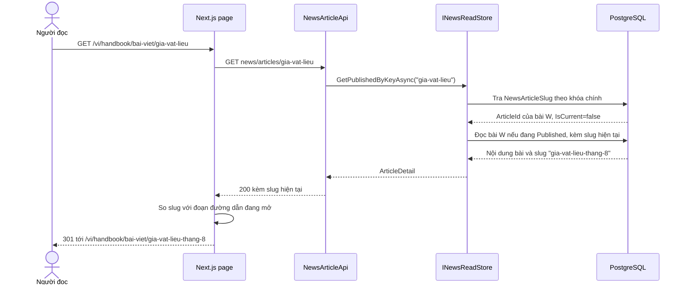
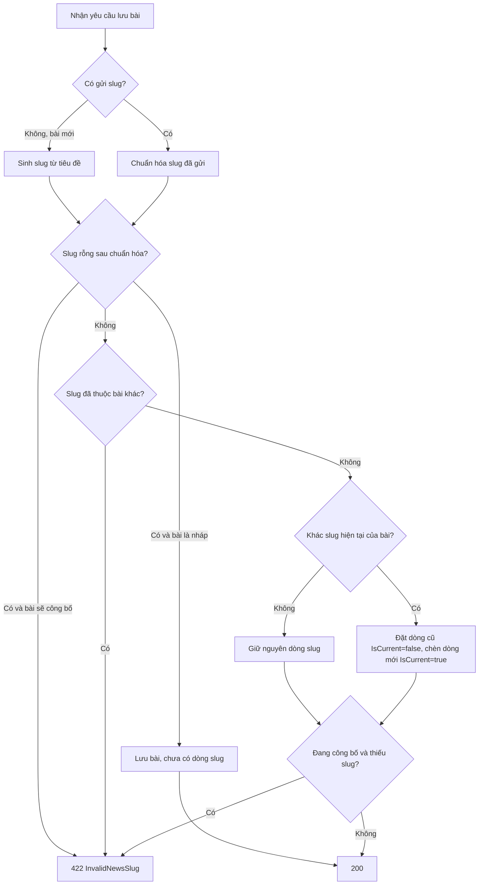
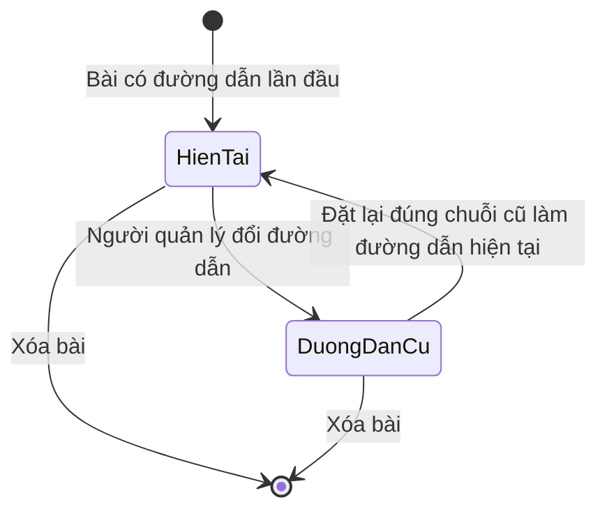
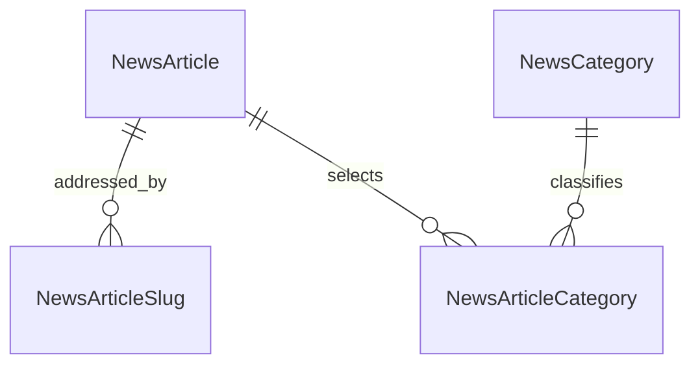

<!-- HƯỚNG DẪN CHO AI KHI ĐIỀN HOẶC CHỈNH SỬA MẪU
- Đọc toàn bộ mẫu, các comment hướng dẫn và tài liệu nguồn được cung cấp trước khi viết. Tuân thủ các quy tắc nghiệp vụ, điều kiện, ngoại lệ và giới hạn đã được xác nhận.
- Không bịa, tự chế hoặc suy đoán thành sự thật: yêu cầu, quy tắc, số liệu, API, schema, mã lỗi, nguồn tham khảo, người phụ trách và kết quả kiểm thử phải có căn cứ. Nội dung ví dụ trong mẫu không phải dữ kiện của dự án.
- Khi thiếu thông tin hoặc các nguồn mâu thuẫn, hỏi người dùng để làm rõ; giữ nguyên placeholder ở phần chưa xác định. Không tự chọn đáp án, lấp chỗ trống hay tuyên bố tài liệu đã hoàn tất.
- Chỉ thay nội dung cần điền hoặc được yêu cầu sửa. Không tự mở rộng phạm vi, sửa nghĩa quy tắc, bỏ điều kiện/ngoại lệ, xoá hay ghi đè nội dung hợp lệ đã có.
- Giữ nguyên tên, cấp và thứ tự heading, nhãn in đậm, tiền tố bullet, cấu trúc danh sách, tên/thứ tự/số cột bảng và cú pháp code fence. Không dịch, đổi tên, gộp hoặc thêm mục ngoài cấu trúc mẫu.
- Chỉ lặp khối luồng, AC hoặc API theo đúng khuôn khi có căn cứ; chỉ bỏ phần tuỳ chọn khi hướng dẫn riêng của mẫu cho phép và đã xác định không áp dụng.
- Mã tham chiếu và section phải trỏ tới tài liệu có thật đã được cung cấp hoặc kiểm chứng. Không giữ mã ví dụ như tham chiếu thật và không tự tạo tài liệu liên quan để hợp thức hoá liên kết.
- Giữ các comment hướng dẫn trong file. Xuất Markdown UTF-8, mỗi file một tài liệu; không bọc toàn bộ file trong code fence, không chèn lời dẫn hay giải thích ngoài mẫu.
- Trước khi bàn giao, đối chiếu nội dung với nguồn, kiểm tra cấu trúc, giá trị cho phép, giới hạn độ dài và tính nhất quán của mã/tham chiếu. Báo rõ phần chưa đủ thông tin; không tuyên bố đã chạy test hoặc import khi chưa thực hiện.
-->

<!-- Thay mã TDD-001 và nội dung ví dụ; giữ nguyên heading và nhãn in đậm.
Sơ đồ dùng mermaid, plantuml hoặc URL. Giữ heading Architecture, Sequence Diagram, Activity Diagram, State Diagram, Data Model.
Ví dụ API phải có heading trùng METHOD /path trong Endpoints. Xoá phần API/sơ đồ không dùng.
Version, Updated At và Change Log do lịch sử phiên bản quản lý, để trống khi nhập mới.
Author/Reviewer là tên hiển thị; gán tài khoản, phê duyệt, giả định và câu hỏi mở trên giao diện sau import.
Thiết kế phải truy vết về Story và Business Rule được cung cấp. Phân biệt thiết kế đề xuất với implementation đã kiểm chứng; không mô tả API/schema/sơ đồ ví dụ như hệ thống thật hoặc tự quyết định nghiệp vụ còn thiếu.
BẮT BUỘC KHI HOÀN THIỆN MẪU: phải có cả Reviewer và Approver, mỗi tên 1–200 ký tự sau khi bỏ khoảng trắng đầu/cuối. Không xoá hai dòng metadata, để trống, dùng tên bịa hoặc giữ placeholder rồi coi là hoàn tất.
Nếu chưa biết người review hoặc người phê duyệt, phải hỏi người dùng và báo tài liệu chưa đủ thông tin; không tự lấy Author/Owner làm người thay thế. Tên trong file không tự gán tài khoản hoặc xác nhận đã duyệt; gán thành viên trên giao diện sau import.
Đây là yêu cầu hoàn thiện mẫu; backend hiện vẫn nhận file cũ thiếu hai trường để tương thích.

VALIDATION CHO FILE NHẬP (đối chiếu ImportSnapshotValidator, MarkdownParser và ImportService):
- Mỗi file .md UTF-8 không rỗng chỉ có một heading cấp 1 chứa mã tài liệu dài 1–100 ký tự. Mã không được trùng trong cùng lần nhập hoặc thuộc loại tài liệu khác đã tồn tại.
- Không dùng tên README.md hoặc sitemap.md vì importer bỏ qua. Giao diện nhận .md/.zip, tối đa 2.000 file, tổng file tải lên 31 MiB; API giới hạn request 32 MiB và tổng nội dung đọc/giải nén 64 MiB.
- Chỉ nhập đè tài liệu cùng loại đang Draft, chưa có phiên bản và chưa lưu trữ. Import thay toàn bộ nội dung bản nháp, vì vậy phải giữ lại nội dung hợp lệ ngoài phần được yêu cầu sửa.
- Không dùng Status trong Markdown hoặc tên Approver để tự xác nhận phê duyệt; import không cấp quyền hay gán tài khoản từ tên. Chạy Kiểm tra file và xử lý lỗi/cảnh báo trước khi nhập.
- Giới hạn độ dài bên dưới tính theo string.Length của .NET (đơn vị UTF-16); không tự cắt ngắn dữ kiện quan trọng để vượt validation, hãy viết lại có căn cứ hoặc hỏi người dùng.
- Feature tối đa 300 ký tự và được dùng làm tiêu đề tài liệu. Status được parser nhận: Draft / In Review / Approved / Deprecated; tài liệu nhập mới vẫn có trạng thái phê duyệt Draft.
- Endpoint: đường dẫn tối đa 500 ký tự; tên/mô tả endpoint được lưu trong Name tối đa 300. HTTP method: GET / POST / PUT / PATCH / DELETE / HEAD / OPTIONS.
- Error Codes: mã tối đa 100 ký tự, không trùng trong tài liệu; giữ dạng - **CODE** (400): mô tả. HTTP status trong Error Codes và Response phải là số nguyên đọc được bằng Int32; không tự đặt status khác hợp đồng API.
- URL sơ đồ tối đa 1.000 ký tự. Mục sơ đồ được sử dụng phải có khối mermaid/plantuml hoặc URL theo mẫu; không để một mục sơ đồ rỗng. Nhãn mục được tách từ bullet như tên External API Fields tối đa 300 ký tự.
- Heading Examples phải khớp METHOD /path ở Endpoints. Giữ các nhãn Request:, Response 200: (thay mã theo contract) và Error Response: để parser tách đúng dữ liệu.
- Tham chiếu dạng DOC-KEY/section: ghi chú: mã đích tối đa 100 ký tự, section tối đa 100, ghi chú tối đa 1.000. Không trùng bộ mã đích + section + loại liên kết trong cùng tài liệu.
ĐỐI CHIẾU FORM TDD (src/features/tdds/validations.ts; form có thể chặt hơn import):
- Điền Feature, Author, Reviewer, Problem và ít nhất một Goal; các Goal/Non-goal/Notes đã thêm không được rỗng. API đã khai báo phải có endpoint và mô tả/mục đích; Fields phải có tên và ý nghĩa; Error Codes phải có mã, HTTP status và điều kiện.
- Form còn kiểm tra Version, Updated At và nội dung Change Log khi khai báo; với file nhập mới, giữ các trường lịch sử này trống theo hợp đồng import, không tự tạo dữ liệu lịch sử.
-->

# TDD-NEWS-003

## Document Info

- **Feature**: Tin tức — đường dẫn bài viết có lịch sử và ngôn ngữ của bài
- **Author**: Claude
- **Reviewer**: Tân Trần
- **Approver**: Tân Trần
- **Status**: Draft
- **Version**:
- **Updated At**:

## Context & Goals

### Problem

BR-NEWS-004 cùng các tiêu chí mới của STORY-NEWS-001 và STORY-NEWS-003 đã được người dùng chốt ngày 07/10/2026.

Frontend đã dựng đường dẫn bài viết theo slug (`routes.ts:144` → `/handbook/bai-viet/{slug}`), nhưng bảng `NewsArticle` chưa có cột slug nên hiện vẫn truyền định danh UUID. Đường dẫn dạng UUID khó đọc và không có giá trị cho tìm kiếm.

Thêm nữa, người quản lý muốn sửa được đường dẫn mà không làm gãy các liên kết đã chia sẻ, nên hệ thống phải giữ các đường dẫn cũ và dẫn người đọc về đường dẫn hiện tại.

Phần ngôn ngữ chuẩn bị trước cho bản tiếng Anh: locale `en` đã khai báo trong `src/i18n/routing.ts` nhưng `src/proxy.ts` đang chuyển hướng mọi `/en` về `/vi`. Thêm cột ngôn ngữ ngay bây giờ rẻ hơn nhiều so với tách bảng dịch sau khi đã có dữ liệu.

### Goals

- Mỗi bài có một đường dẫn hiện tại và giữ lại mọi đường dẫn cũ, tất cả duy nhất trên toàn hệ thống.
- Mở bằng đường dẫn cũ thì người đọc được dẫn về đường dẫn hiện tại, không gặp trang lỗi.
- Bài công bố bắt buộc có đường dẫn; danh mục không còn là điều kiện công bố.
- Mỗi bài thuộc đúng một ngôn ngữ, bản dịch là bài riêng và tồn tại độc lập.

### Non-goals

- Giao diện quản lý bản dịch và màn ghép cặp hai ngôn ngữ.
- Dịch tên danh mục và tiêu đề bước.
- Tự sinh lại đường dẫn khi tiêu đề đổi.

## Architecture

Thay đổi nằm ở ba chỗ:

- **Bảng mới `NewsArticleSlug`** giữ mọi đường dẫn của mọi bài, đánh dấu đường dẫn nào đang là hiện tại. Hai index: unique có điều kiện `UX_NewsArticleSlug_Current` trên `(ArticleId)` WHERE `IsCurrent`, và `IX_NewsArticleSlug_Article` trên `(ArticleId, Slug)` cho khóa ngoại và việc liệt kê lịch sử.
- **Hai cột mới trên `NewsArticle`**: `Locale` và `TranslationGroupId`.
- **Luồng đọc công khai** nhận một chuỗi thay cho UUID, và trả về đường dẫn chính thức để frontend tự chuyển hướng.

```mermaid
flowchart LR
    Reader[Người đọc] --> Page[Next.js server component]
    Page --> Api[news/articles/{idOrSlug}]
    Api --> Store[(NewsArticleSlug + NewsArticle)]
    Page -->|slug khác đường dẫn đang mở| Redirect[301 tới đường dẫn hiện tại]
```

**Kỹ thuật 1 — Một bảng giữ cả đường dẫn hiện tại lẫn đường dẫn cũ.**

Cách thường gặp là để đường dẫn hiện tại thành một cột trên bài và đẩy đường dẫn cũ sang bảng lịch sử. Thiết kế này không làm vậy, vì khi đó không có ràng buộc nào ngăn đường dẫn cũ của bài A trùng đường dẫn mới của bài B — hai nguồn, không một khóa chung.

Ở đây mọi đường dẫn nằm trong một bảng và `Slug` chính là khóa chính, nên trùng là không thể. Cờ `IsCurrent` nói dòng nào đang dùng, và một unique index có điều kiện bảo đảm mỗi bài chỉ có đúng một dòng hiện tại.

Tình huống: bài W đang có đường dẫn `gia-vat-lieu`. Người quản lý đổi sang `gia-vat-lieu-thang-8`. Trong một transaction, hệ thống đặt `IsCurrent=false` cho dòng cũ rồi chèn dòng mới với `IsCurrent=true`. Sau đó một người khác tạo bài mới và cố đặt `gia-vat-lieu`: khóa chính chặn ngay, kể cả khi chuỗi đó chỉ còn là đường dẫn cũ.

Giới hạn: danh sách bài phải nối thêm một lần để lấy đường dẫn hiện tại. Đây là phép nối một–một theo index, với trang tối đa 100 bài thì không đáng kể. Đổi lại là tính duy nhất được database bảo đảm thay vì do ứng dụng tự giữ.

**Kỹ thuật 2 — Chuyển hướng do frontend phát, backend chỉ nói đường dẫn chính thức.**

Backend là API trả JSON. Nếu nó trả 301 kèm `Location` thì thư viện gọi HTTP của frontend sẽ tự đi theo và trả về nội dung bài, nhưng thanh địa chỉ của người đọc không đổi — đúng cái mà công cụ tìm kiếm cần lại không xảy ra.

Vì vậy backend luôn trả 200 kèm trường `slug` là đường dẫn hiện tại của bài. Server component của Next.js so `slug` đó với đoạn đường dẫn đang mở; khác nhau thì gọi `permanentRedirect`, và trình duyệt nhận chuyển hướng vĩnh viễn thật.

Tình huống: người đọc mở `/vi/handbook/bai-viet/gia-vat-lieu`. Backend trả nội dung bài W kèm `slug: "gia-vat-lieu-thang-8"`. Trang thấy lệch nên chuyển hướng sang `/vi/handbook/bai-viet/gia-vat-lieu-thang-8`; người đọc thấy đúng một lần tải trang.

Giới hạn: cách này đòi frontend phải kiểm. Nếu một client khác gọi thẳng API thì nó nhận nội dung bài mà không có chuyển hướng — chấp nhận được, vì chuyển hướng là chuyện của tầng trình bày.

**Kỹ thuật 3 — Nhận cả UUID lẫn đường dẫn trên một endpoint.**

Endpoint chi tiết hiện ràng buộc `{articleId:guid}`. Thiết kế bỏ ràng buộc đó: handler thử đọc chuỗi thành UUID trước, không được thì tra `NewsArticleSlug`. Frontend đã gọi theo dạng này (`handbook.bmt.ts:348` truyền `idOrSlug`), nên không phải sửa.

Giới hạn: về lý thuyết một đường dẫn có thể trùng dạng UUID và bị hiểu nhầm thành định danh. Đường dẫn sinh từ tiêu đề tiếng Việt nên không rơi vào dạng 8-4-4-4-12 chữ số hex; ngoài ra bước sinh đường dẫn từ chối chuỗi phân tích được thành UUID.

**Notes**:
- Bảng đường dẫn không lưu `Locale`. Ngôn ngữ đã nằm ở `NewsArticle`, và lưu thêm một bản ở bảng đường dẫn sẽ tạo ra hai nguồn có thể lệch nhau. Hệ quả: bản tiếng Việt và bản tiếng Anh của cùng một bài không dùng chung một chuỗi đường dẫn. Thực tế không vướng vì tiêu đề hai ngôn ngữ khác nhau.
- `TranslationGroupId` không phải khóa ngoại tới bảng nào. Nó chỉ là mã nhóm để biết các bài nào là bản dịch của nhau. Bài đầu tiên lấy chính `Id` của mình làm mã nhóm, nên bài đơn lẻ không cần dòng phụ nào.
- Sửa tiêu đề không đụng tới đường dẫn. Quyết định này làm người quản lý phải chủ động sửa đường dẫn khi muốn, nhưng tránh việc một lần sửa lỗi chính tả làm đổi URL đang được chia sẻ.

## Sequence Diagram

Người đọc mở bài bằng một đường dẫn cũ.



## Activity Diagram

Lưu một bài kèm đường dẫn.



## State Diagram

Vòng đời một dòng đường dẫn.



Vòng đời của bài vẫn là Draft, Published và Hidden như [TDD-NEWS-001](TDD-NEWS-001.md) mô tả; thiết kế này không thêm trạng thái mới cho bài.

## Data Model

### Bảng mới `NewsArticleSlug`

Mỗi dòng là **một chuỗi đường dẫn từng hoặc đang trỏ tới một bài**. Dòng được tạo khi bài có đường dẫn lần đầu và mỗi lần người quản lý đổi đường dẫn. Dòng không bao giờ bị sửa chuỗi; đổi đường dẫn là hạ cờ dòng cũ rồi chèn dòng mới.

| Cột | Kiểu và ràng buộc |
| --- | --- |
| Slug | varchar(200) PK, COLLATE "C" |
| ArticleId | uuid NN, FK `NewsArticle` ON DELETE CASCADE |
| IsCurrent | boolean NN DEFAULT false |
| CreatedAtUtc | timestamptz NN |

- Unique index có điều kiện `UX_NewsArticleSlug_Current` trên `(ArticleId)` WHERE `IsCurrent` — mỗi bài có nhiều nhất một đường dẫn hiện tại.
- Index `IX_NewsArticleSlug_Article` trên `(ArticleId)` cho khóa ngoại và để liệt kê lịch sử của một bài.
- CHECK `CK_NewsArticleSlug_Format`: chuỗi chỉ gồm chữ thường, chữ số và dấu gạch ngang, không bắt đầu hoặc kết thúc bằng gạch ngang.

Collation `"C"` so từng byte, không phụ thuộc locale của database — theo đúng cách `NewsCategory.NameKey` đang làm, để kết quả so trùng không đổi khi database đổi locale.

### Hai cột mới trên `NewsArticle`

| Cột | Kiểu và ràng buộc |
| --- | --- |
| Locale | varchar(10) NN DEFAULT 'vi' |
| TranslationGroupId | uuid NN |

- Unique index `UX_NewsArticle_TranslationGroup_Locale` trên `(TranslationGroupId, Locale)` — một nhóm dịch chỉ có một bài cho mỗi ngôn ngữ.
- CHECK `CK_NewsArticle_Locale`: `"Locale" IN ('vi', 'en')`.

Điều kiện "bài `Published` phải có dòng đường dẫn hiện tại" trải trên hai bảng nên CHECK không diễn đạt được. `CK_NewsArticle_PublishedFields` giữ nguyên ba trường chữ như cũ; handler kiểm đường dẫn trong cùng transaction, dưới khóa dòng bài đã có. Đây là cùng cách đang áp dụng cho ràng buộc "bài công bố phải có danh mục" trước đây — và chính ràng buộc đó nay bị bỏ theo BR-NEWS-001 khoản 2.

### Quan hệ



Một bài có 0..n đường dẫn, trong đó nhiều nhất một đang là hiện tại. Xóa bài xóa luôn mọi đường dẫn của nó nhờ CASCADE, nên các chuỗi đó được dùng lại cho bài khác — khớp STORY-NEWS-003/AC-007, nơi đường dẫn của bài đã xóa phải báo không tìm thấy.

### Dữ liệu mẫu

Dữ liệu giả định, lược cột audit, dùng bí danh cho UUID; không phải dữ liệu production. T1 = `2026-08-07T03:00:00Z`, T2 = `2026-10-07T04:00:00Z`.

| Bảng | Dòng dữ liệu |
| --- | --- |
| NewsArticle | W: State='Published', Title='Giá vật liệu xây dựng mới nhất tháng 8/2026', Locale='vi', TranslationGroupId=W, FirstPublishedAtUtc=T1, Version=3. |
| NewsArticleSlug | ('gia-vat-lieu', ArticleId=W, IsCurrent=true, CreatedAtUtc=T1). |

`TranslationGroupId` bằng chính `Id` của bài vì W chưa có bản dịch.

**Sau khi người quản lý đổi đường dẫn tại T2**, trong một transaction:

| Bảng | Dòng dữ liệu |
| --- | --- |
| NewsArticleSlug | ('gia-vat-lieu', ArticleId=W, IsCurrent=**false**, CreatedAtUtc=T1). |
| NewsArticleSlug | ('gia-vat-lieu-thang-8', ArticleId=W, IsCurrent=**true**, CreatedAtUtc=T2). |
| NewsArticle | W: Version=4, ModifiedAtUtc=T2; `FirstPublishedAtUtc` giữ nguyên T1. |

Mở `gia-vat-lieu` trả nội dung W kèm `slug: "gia-vat-lieu-thang-8"`, và trang chuyển hướng. Mở `gia-vat-lieu-thang-8` trả nội dung W kèm đúng chuỗi đó, không chuyển hướng.

**Thêm bản tiếng Anh** cho W: một dòng `NewsArticle` mới E với `Locale='en'`, `TranslationGroupId=W`, `Id=E`, và một dòng slug `('construction-material-prices-august-2026', ArticleId=E, IsCurrent=true)`. Hai bài có trạng thái và ngày công bố riêng; xóa W không xóa E, vì giữa chúng không có khóa ngoại.

**Các nhánh bị từ chối:** tạo bài mới với đường dẫn `gia-vat-lieu` bị khóa chính chặn dù chuỗi đó chỉ còn là đường dẫn cũ. Công bố một bài chưa có dòng slug hiện tại bị handler từ chối 422. Sửa tiêu đề W không tạo thêm dòng slug nào.

**Notes**:
- Migration `NewsArticleSlugsAndLocale` tạo `NewsArticleSlug` và thêm hai cột vào `NewsArticle`. Bảng `NewsArticle` có thể đã có dữ liệu, nên migration chạy `UPDATE "NewsArticle" SET "TranslationGroupId" = "Id"` **trước** khi tạo unique index `(TranslationGroupId, Locale)`: để nguyên giá trị mặc định thì mọi bài cùng mang nhóm rỗng và cùng `Locale` là `vi`, nên index sẽ không tạo được. `Locale` nhận giá trị `vi` từ DEFAULT của cột.
- Migration **không** backfill đường dẫn. Theo Except của [BR-NEWS-004](../businessrule/BR-NEWS-004.md), bài cũ đang công bố vẫn đọc được qua định danh, và người quản lý bổ sung đường dẫn ở lần lưu sửa tiếp theo; handler tự sinh từ tiêu đề lúc đó. Sinh đường dẫn bằng SQL đòi bảng chuyển đổi dấu tiếng Việt dài và dễ sai, trong khi lợi ích chỉ là rút ngắn giai đoạn chuyển tiếp.
- Đường dẫn do hệ thống sinh mà trùng thì nối hậu tố số tăng dần (BR-NEWS-004 khoản 3), tối đa 1000 lần thử rồi báo lỗi để một tiêu đề rất phổ biến không làm vòng lặp chạy mãi. Đường dẫn người quản lý tự nhập mà trùng thì từ chối ngay.
- `Locale` dùng `varchar(10)` kèm CHECK thay vì kiểu enum của PostgreSQL. Enum đòi migration mỗi lần thêm ngôn ngữ và khóa chặt hơn mức cần thiết ở giai đoạn này.
- Không đặt `Slug` làm cột trên `NewsArticle`. Giữ cùng lúc một cột trên bài và một bảng lịch sử tạo ra hai nguồn cho cùng một dữ kiện, và không ràng buộc nào bảo đảm chúng không giẫm lên nhau.

## Internal API

### Endpoints

- **GET** `/api/v1/news/articles/{idOrSlug}` — công khai; bỏ ràng buộc `:guid` của route hiện tại. Trả thêm trường `slug`.
- **GET** `/api/v1/news/articles` — công khai; mỗi phần tử trả thêm `slug`.

`slug` có thể là `null` ở cả hai endpoint: bài cũ đang công bố chưa có dòng đường dẫn vì migration không backfill (BR-NEWS-004 Except). Giao diện dùng định danh của bài thay cho đường dẫn và không chuyển hướng với các bài đó.
- **POST** `/api/v1/admin/news/articles` và **PUT** `/api/v1/admin/news/articles/{articleId}` — nhận thêm `slug` và `locale`.
- **GET** `/api/v1/admin/news/articles/{articleId}` — trả thêm `slug`, `locale`, `translationGroupId` và danh sách đường dẫn cũ.

### Examples

#### GET /api/v1/news/articles/gia-vat-lieu

```
Response 200:
{"isSuccess": true, "value": {
  "id": "W",
  "slug": "gia-vat-lieu-thang-8",
  "title": "Giá vật liệu xây dựng mới nhất tháng 8/2026",
  "readingTimeMinutes": 5,
  "coverImageUrl": "https://images.example.test/news/cover.webp",
  "firstPublishedAtUtc": "2026-08-07T03:00:00Z",
  "categories": [{"id": "C1", "name": "Vật liệu"}],
  "contentHtml": "<p>Nội dung</p>"}}
```

Trang gọi bằng `gia-vat-lieu` nhưng nhận về `slug` khác, nên chuyển hướng vĩnh viễn sang đường dẫn trong trường `slug`.

#### PUT /api/v1/admin/news/articles/{articleId}

```
Request:
{"title": "Giá vật liệu xây dựng mới nhất tháng 8/2026",
 "slug": "gia-vat-lieu-thang-8",
 "locale": "vi",
 "readingTimeMinutes": 5,
 "coverImageUrl": "https://images.example.test/news/cover.webp",
 "contentHtml": "<p>Nội dung</p>",
 "categoryIds": [],
 "expectedVersion": 3}

Response 200:
{"isSuccess": true, "value": {"id": "W", "slug": "gia-vat-lieu-thang-8",
 "previousSlugs": ["gia-vat-lieu"], "state": "Published", "version": 4}}

Error Response:
{"code": "InvalidNewsSlug"}
```

`categoryIds` rỗng vẫn công bố được theo BR-NEWS-001 khoản 2.

### Error Codes

- **InvalidNewsSlug** (422): đường dẫn rỗng sau chuẩn hóa, sai định dạng, phân tích được thành UUID, hoặc đã thuộc một bài khác kể cả khi chỉ còn là đường dẫn cũ.
- **NewsArticleNotFound** (404): dùng lại mã hiện có; áp dụng cho chuỗi không khớp đường dẫn nào và cho bài không ở trạng thái `Published` trên API công khai.
- **InvalidNewsContent** (422): dùng lại mã hiện có cho các lỗi nội dung khác.
- **NewsVersionConflict** (409): dùng lại mã hiện có.

## External API

### Endpoints

- Không áp dụng — thiết kế này không gọi dịch vụ ngoài nào.

### Fields

- Không áp dụng — không có trường nào đến từ hệ thống ngoài.

### Error Handling

Không áp dụng. Thiết kế không thêm đường gọi ra ngoài. Việc chuyển hướng từ đường dẫn cũ do frontend phát, không phải do một dịch vụ ngoài.

### Quirks

- Ảnh trong bài vẫn theo quyết định chung về tệp và ảnh đã mô tả ở [TDD-NEWS-001](TDD-NEWS-001.md); thiết kế này không đổi phần đó.

## References

### User Stories

- STORY-NEWS-001
- STORY-NEWS-003

### Business Rules

- BR-NEWS-001
- BR-NEWS-004

### Use Cases

### Others

- Tài liệu kỹ thuật: [TDD-NEWS-001](TDD-NEWS-001.md) — bài viết, trạng thái và đọc công khai.
- Tài liệu kỹ thuật: [PostgreSQL 15 — unique index có điều kiện](https://www.postgresql.org/docs/15/indexes-partial.html).

## Change Log
