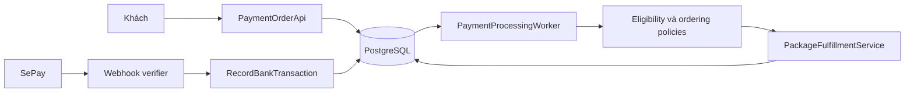
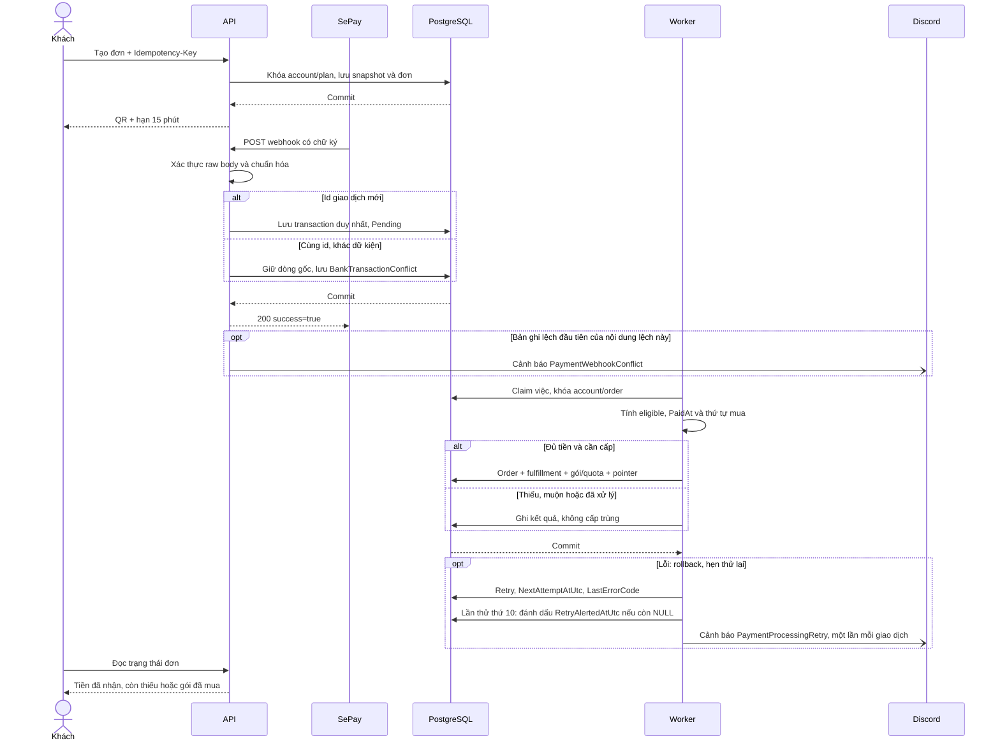
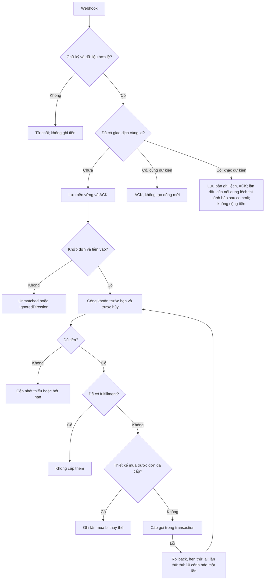
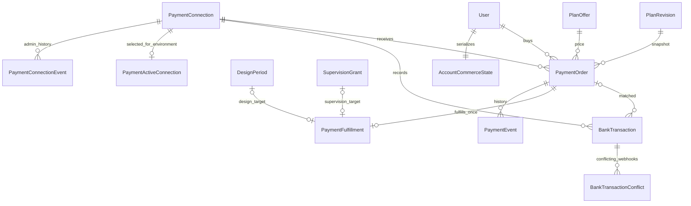

<!-- HƯỚNG DẪN CHO AI KHI ĐIỀN HOẶC CHỈNH SỬA MẪU
- Đọc toàn bộ mẫu, các comment hướng dẫn và tài liệu nguồn được cung cấp trước khi viết. Tuân thủ các quy tắc nghiệp vụ, điều kiện, ngoại lệ và giới hạn đã được xác nhận.
- Không bịa, tự chế hoặc suy đoán thành sự thật: yêu cầu, quy tắc, số liệu, API, schema, mã lỗi, nguồn tham khảo, người phụ trách và kết quả kiểm thử phải có căn cứ. Nội dung ví dụ trong mẫu không phải dữ kiện của dự án.
- Khi thiếu thông tin hoặc các nguồn mâu thuẫn, hỏi người dùng để làm rõ; giữ nguyên placeholder ở phần chưa xác định. Không tự chọn đáp án, lấp chỗ trống hay tuyên bố tài liệu đã hoàn tất.
- Chỉ thay nội dung cần điền hoặc được yêu cầu sửa. Không tự mở rộng phạm vi, sửa nghĩa quy tắc, bỏ điều kiện/ngoại lệ, xoá hay ghi đè nội dung hợp lệ đã có.
- Giữ nguyên tên, cấp và thứ tự heading, nhãn in đậm, tiền tố bullet, cấu trúc danh sách, tên/thứ tự/số cột bảng và cú pháp code fence. Không dịch, đổi tên, gộp hoặc thêm mục ngoài cấu trúc mẫu.
- Chỉ lặp khối luồng, AC hoặc API theo đúng khuôn khi có căn cứ; chỉ bỏ phần tuỳ chọn khi hướng dẫn riêng của mẫu cho phép và đã xác định không áp dụng.
- Mã tham chiếu và section phải trỏ tới tài liệu có thật đã được cung cấp hoặc kiểm chứng. Không giữ mã ví dụ như tham chiếu thật và không tự tạo tài liệu liên quan để hợp thức hoá liên kết.
- Giữ các comment hướng dẫn trong file. Xuất Markdown UTF-8, mỗi file một tài liệu; không bọc toàn bộ file trong code fence, không chèn lời dẫn hay giải thích ngoài mẫu.
- Trước khi bàn giao, đối chiếu nội dung với nguồn, kiểm tra cấu trúc, giá trị cho phép, giới hạn độ dài và tính nhất quán của mã/tham chiếu. Báo rõ phần chưa đủ thông tin; không tuyên bố đã chạy test hoặc import khi chưa thực hiện.
-->

<!-- Thay mã TDD-001 và nội dung ví dụ; giữ nguyên heading và nhãn in đậm.
Sơ đồ dùng mermaid, plantuml hoặc URL. Giữ heading Architecture, Sequence Diagram, Activity Diagram, State Diagram, Data Model.
Ví dụ API phải có heading trùng METHOD /path trong Endpoints. Xoá phần API/sơ đồ không dùng.
Version, Updated At và Change Log do lịch sử phiên bản quản lý, để trống khi nhập mới.
Author/Reviewer là tên hiển thị; gán tài khoản, phê duyệt, giả định và câu hỏi mở trên giao diện sau import.
Thiết kế phải truy vết về Story và Business Rule được cung cấp. Phân biệt thiết kế đề xuất với implementation đã kiểm chứng; không mô tả API/schema/sơ đồ ví dụ như hệ thống thật hoặc tự quyết định nghiệp vụ còn thiếu.
BẮT BUỘC KHI HOÀN THIỆN MẪU: phải có cả Reviewer và Approver, mỗi tên 1–200 ký tự sau khi bỏ khoảng trắng đầu/cuối. Không xoá hai dòng metadata, để trống, dùng tên bịa hoặc giữ placeholder rồi coi là hoàn tất.
Nếu chưa biết người review hoặc người phê duyệt, phải hỏi người dùng và báo tài liệu chưa đủ thông tin; không tự lấy Author/Owner làm người thay thế. Tên trong file không tự gán tài khoản hoặc xác nhận đã duyệt; gán thành viên trên giao diện sau import.
Đây là yêu cầu hoàn thiện mẫu; backend hiện vẫn nhận file cũ thiếu hai trường để tương thích.

VALIDATION CHO FILE NHẬP (đối chiếu ImportSnapshotValidator, MarkdownParser và ImportService):
- Mỗi file .md UTF-8 không rỗng chỉ có một heading cấp 1 chứa mã tài liệu dài 1–100 ký tự. Mã không được trùng trong cùng lần nhập hoặc thuộc loại tài liệu khác đã tồn tại.
- Không dùng tên README.md hoặc sitemap.md vì importer bỏ qua. Giao diện nhận .md/.zip, tối đa 2.000 file, tổng file tải lên 31 MiB; API giới hạn request 32 MiB và tổng nội dung đọc/giải nén 64 MiB.
- Chỉ nhập đè tài liệu cùng loại đang Draft, chưa có phiên bản và chưa lưu trữ. Import thay toàn bộ nội dung bản nháp, vì vậy phải giữ lại nội dung hợp lệ ngoài phần được yêu cầu sửa.
- Không dùng Status trong Markdown hoặc tên Approver để tự xác nhận phê duyệt; import không cấp quyền hay gán tài khoản từ tên. Chạy Kiểm tra file và xử lý lỗi/cảnh báo trước khi nhập.
- Giới hạn độ dài bên dưới tính theo string.Length của .NET (đơn vị UTF-16); không tự cắt ngắn dữ kiện quan trọng để vượt validation, hãy viết lại có căn cứ hoặc hỏi người dùng.
- Feature tối đa 300 ký tự và được dùng làm tiêu đề tài liệu. Status được parser nhận: Draft / In Review / Approved / Deprecated; tài liệu nhập mới vẫn có trạng thái phê duyệt Draft.
- Endpoint: đường dẫn tối đa 500 ký tự; tên/mô tả endpoint được lưu trong Name tối đa 300. HTTP method: GET / POST / PUT / PATCH / DELETE / HEAD / OPTIONS.
- Error Codes: mã tối đa 100 ký tự, không trùng trong tài liệu; giữ dạng - **CODE** (400): mô tả. HTTP status trong Error Codes và Response phải là số nguyên đọc được bằng Int32; không tự đặt status khác hợp đồng API.
- URL sơ đồ tối đa 1.000 ký tự. Mục sơ đồ được sử dụng phải có khối mermaid/plantuml hoặc URL theo mẫu; không để một mục sơ đồ rỗng. Nhãn mục được tách từ bullet như tên External API Fields tối đa 300 ký tự.
- Heading Examples phải khớp METHOD /path ở Endpoints. Giữ các nhãn Request:, Response 200: (thay mã theo contract) và Error Response: để parser tách đúng dữ liệu.
- Tham chiếu dạng DOC-KEY/section: ghi chú: mã đích tối đa 100 ký tự, section tối đa 100, ghi chú tối đa 1.000. Không trùng bộ mã đích + section + loại liên kết trong cùng tài liệu.
ĐỐI CHIẾU FORM TDD (src/features/tdds/validations.ts; form có thể chặt hơn import):
- Điền Feature, Author, Reviewer, Problem và ít nhất một Goal; các Goal/Non-goal/Notes đã thêm không được rỗng. API đã khai báo phải có endpoint và mô tả/mục đích; Fields phải có tên và ý nghĩa; Error Codes phải có mã, HTTP status và điều kiện.
- Form còn kiểm tra Version, Updated At và nội dung Change Log khi khai báo; với file nhập mới, giữ các trường lịch sử này trống theo hợp đồng import, không tự tạo dữ liệu lịch sử.
-->

# TDD-PAY-001

## Document Info

- **Feature**: Đơn thanh toán QR, nhận webhook SePay và cấp gói đúng một lần
- **Author**: Codex
- **Reviewer**: Tân Trần
- **Approver**: Tân Trần
- **Status**: Draft
- **Version**:
- **Updated At**:

## Context & Goals

### Problem

STORY-PAY-001 cần giữ giá/quyền lợi lúc tạo đơn, cộng dồn chuyển thiếu trong 15 phút và tự cấp gói. Webhook có thể trùng, đến muộn hoặc đảo thứ tự. Phải phân biệt tiền thực nhận, tiền hợp lệ theo thời gian và việc cấp quyền để không mất giao dịch hoặc cấp trùng.

Hiện trạng ngày 26/09/2026: module thanh toán đã có trong nhánh `develop` của `bmt-be` ở commit `de3c61f` (migration `20260926070317_PaymentOrder` chạy sau `20260926040024_EstimateCatalogAndDraft`); chi tiết và các điểm khác thiết kế ở Change Log. Nhánh `feature/payment-alerts-connections` đã được merge vào `develop` (fast-forward sau `388a426`) với ba commit: `62b226f` và `97108bb` cảnh báo Discord cho webhook lệch dữ kiện và cho giao dịch xử lý lỗi lặp lại (migration `20260926074258_PaymentAlerts`); `3256436` API quản trị kết nối nhận tiền theo STORY-PAY-003, BR-PAY-006 (migration `20260926075035_PaymentConnectionAdmin`). Hai migration chưa áp dụng lên database dùng chung. Dùng lại kiến trúc .NET 8, Carter, MediatR, FluentValidation, EF Core/Npgsql. Danh mục gói, kỳ thiết kế và gói giám sát ở TDD-SUB-001/002/004 đã có một phần trong code qua các migration `PlanCatalog`, `DesignSubscription` và `SupervisionGrant`; phần thay đổi ngày 25/09/2026 của các tài liệu đó vẫn là dự kiến. RabbitMQ, MassTransit 8.4.1 với outbox có sẵn của thư viện và Quartz đã được đưa lại vào mã nguồn ngày 23/09/2026 cho gửi email và tác vụ nền (xem `bmt-be/CLAUDE.md`). Luồng thanh toán không cần chúng: bảng BankTransaction đóng vai trò hộp thư bền vững cho worker, như mô tả ở Architecture.

### Goals

- Một đơn mua một gói, lưu bản giá/quyền lợi bất biến, chờ đúng 15 phút; hỗ trợ hai loại gói.
- Mỗi giao dịch thực tế chỉ ghi nhận một lần; mỗi đơn hợp lệ có một kết quả cấp gói duy nhất dù worker hoặc webhook lặp.
- Giữ giao dịch trước khi xác nhận với SePay; cấp gói có thể thử lại sau lỗi mà không yêu cầu khách chuyển tiền lần nữa.
- Xếp thứ tự mua thiết kế bằng thời điểm đủ tiền, sau đó thứ tự tạo đơn; không dùng thứ tự nhận webhook.
- Người trực hệ thống được báo qua Discord khi webhook trùng id nhưng lệch dữ kiện, và khi một giao dịch xử lý lỗi tới lần thử thứ 10; mỗi giao dịch lỗi chỉ báo một lần.
- Người có quyền `payment.connection.manage` quản lý kết nối nhận tiền và chọn kết nối đang dùng cho từng môi trường qua API, không cần sửa database hay biến môi trường chọn kết nối.

### Non-goals

- Hoàn tiền hoặc ghi nhận đã hoàn tiền; giảm giá, phụ phí, định kỳ tự trừ tiền; nhân viên xác nhận cấp gói thủ công.
- Quản lý khảo sát/giám sát; gán giao dịch chưa khớp bằng tay; tích hợp cổng checkout/IPN khác của SePay.
- Triển khai code, migration hoặc tài khoản SePay thật trong bước thiết kế.

## Architecture

**Các kỹ thuật được dùng và lý do**

| Kỹ thuật | Cách hoạt động trong luồng này | Tình huống và giới hạn |
| --- | --- | --- |
| Transaction — nhóm thay đổi cùng thành công hoặc cùng hoàn tác | Việc nhận tiền có transaction lưu BankTransaction; việc cấp gói có transaction khác cập nhật đơn, kỳ/gói, quota và fulfillment. | Lưu quota lỗi thì hoàn tác lần cấp, nhưng vẫn giữ tiền đã tiếp nhận để xử lý lại. Không giữ transaction SQL chờ HTTP từ SePay. |
| Durable inbox — lưu việc cần xử lý trong DB | BankTransaction được lưu trước khi ACK (trả xác nhận nhận webhook); worker đọc các dòng chưa xong. | Nếu tiến trình dừng sau ACK, lần khởi động sau vẫn tìm được việc. Inbox không có nghĩa gói đã được cấp ngay khi ACK. |
| HostedService, retry và lease | Worker chạy nền, lỗi thì hẹn thử lại; lease là quyền nhận việc có thời hạn, LeaseToken nhận diện lần nhận việc. | Worker chết thì worker khác có thể tiếp tục sau hạn giữ việc. Lease không tự chống cấp trùng; phải kết hợp khóa và UNIQUE. |
| Idempotency — gửi lại cùng yêu cầu không gây thêm tác động | So RequestKey và hash nội dung; trùng hoàn toàn trả kết quả cũ. Webhook được nhận diện riêng bằng ConnectionId + ProviderTransactionId. | Khách chuyển thêm thật tạo provider ID mới nên vẫn cộng tiền; webhook gửi lại cùng ID thì không cộng lại. Khác nội dung với cùng key bị từ chối. |
| Khóa dòng và thứ tự khóa thống nhất | Các thao tác cùng khách khóa AccountCommerceState trước khi đổi đơn/gói; các luồng lấy khóa theo cùng thứ tự. | Hai request mua/gán/hủy không cùng sửa trạng thái dựa trên dữ liệu cũ. Đổi lại request có thể phải chờ; không giữ khóa khi gọi dịch vụ ngoài. |
| UNIQUE có điều kiện và FK ghép | UNIQUE chỉ áp dụng cho các đơn thiết kế đang chờ; FK ghép kiểm cả định danh và chủ sở hữu. | Database chặn hai đơn chờ hoặc liên kết sang gói của khách khác dù hai request cùng qua kiểm tra ở ứng dụng. Hết hạn phải được cập nhật dưới khóa; không dựa vào NOW() trong điều kiện index. |
| Snapshot bằng revision bất biến | Đơn trỏ tới bản quyền lợi đã công bố và lưu giá lúc tạo. | Giá hiện tại tăng vẫn không đổi số tiền/quyền lợi của O1. Bản revision được tham chiếu không được sửa tại chỗ. |
| Thời gian sự kiện và thứ tự đã áp dụng | OccurredAtUtc xét thời điểm ngân hàng; ReceivedAtUtc đo lúc nhận; AppliedPaidAtUtc giữ mốc dùng khi quyết định cấp. | Phân biệt giao dịch đúng hạn đến muộn với giao dịch phát sinh quá hạn; khi sửa mốc của gói đã cấp thì giữ A theo quy tắc đã chốt. |
| HMAC và hash nội dung | HMAC kiểm chữ ký của request theo secret và raw body; CanonicalHash so các dữ kiện chuẩn hóa của cùng giao dịch. | HMAC xác thực nguồn, không thay quy tắc đủ tiền. Hash không phải mã hóa và không tự che nội dung nhạy cảm. Hợp đồng provider nằm ở External API. |
| Cảnh báo sau commit và dấu “đã báo” | Webhook lệch: handler chèn BankTransactionConflict bằng `INSERT ... ON CONFLICT DO NOTHING` trên unique index có điều kiện `(TransactionId, CanonicalHash) WHERE Alerted`; chỉ lần chèn được dòng Alerted=true mới đăng ký việc gửi cảnh báo vào IPostCommitActionQueue, và TransactionPipelineBehavior chỉ chạy việc này sau khi commit. Worker lỗi: sau khi ghi lịch thử lại, nếu số lần thử đã tới ngưỡng thì chạy `UPDATE ... SET RetryAlertedAtUtc WHERE RetryAlertedAtUtc IS NULL`; chỉ lời gọi đổi được dòng mới gửi cảnh báo. | Transaction rollback thì không có cảnh báo sai. Hai worker cùng lỗi một giao dịch vẫn chỉ báo một lần. Kênh Discord gửi theo kiểu cố gắng hết sức: hàng đợi nằm trong bộ nhớ, nên tiến trình dừng ngay sau khi đánh dấu có thể làm mất cảnh báo đó; log mức Error vẫn còn. |

Các kỹ thuật trên là thiết kế dự kiến. Phần dưới chỉ rõ thành phần chịu trách nhiệm và thứ tự xử lý để tránh chỉ liệt kê tên kỹ thuật.


**Trách nhiệm và đường dẫn dự kiến**:

| Thành phần | Nơi dự kiến | Trách nhiệm |
| --- | --- | --- |
| PaymentOrderApi / SePayWebhookApi | presentation/apis/payment/ | API khách và endpoint máy gửi webhook tách policy; không nhận giá/quyền lợi do client tự khai. |
| Command/Query/Response và validator | contract/services/payment/ | Chuẩn hóa DTO, Idempotency-Key, version, mã lỗi. |
| CreatePaymentOrderHandler / CancelPaymentOrderHandler | application/usecases/commands/payment/ | Chốt bản bán, giới hạn đơn chờ, hủy đơn theo tiền đã ghi nhận. |
| SePayEnvelopeVerifier / SePayPayloadMapper | infrastructure/payments/sepay/ | Xác minh HMAC trên raw body, nhận diện tài khoản nhận, chuẩn hóa tiền và giờ giao dịch. |
| RecordBankTransactionHandler | application/usecases/commands/payment/ | Lưu bền vững giao dịch và trạng thái chờ xử lý; chưa cấp gói trong request webhook. Cùng id nhưng lệch dữ kiện thì lưu BankTransactionConflict và hẹn cảnh báo sau commit. |
| PaymentProcessingWorker / PaymentProcessingRunner / ProcessBankTransactionHandler | infrastructure/payments/ và application/usecases/commands/payment/ | Đọc việc chưa xử lý trong PostgreSQL; tính tiền hợp lệ và cấp gói trong một transaction riêng. Runner hẹn thử lại khi lỗi và gửi cảnh báo lỗi lặp lại qua IAlertNotifier. |
| PaymentEligibilityPolicy / PurchaseOrderingPolicy | domain/policies/payment/ | Hàm thuần tính đủ tiền, biên thời gian và thứ tự mua. |
| PackageFulfillmentService | application/abstractions và persistence implementation | Dùng lại chính DesignPeriod/PeriodQuota và SupervisionGrant, không tạo bộ entitlement song song. |
| PaymentStore / configuration | persistence/payments/ và configurations/ | Khóa, dedupe, projection, constraint và history. |
| IAlertNotifier / DiscordAlertNotifier | application/abstractions/ và infrastructure/alerting/ | Dùng lại kênh cảnh báo Discord có sẵn; thêm hai loại `PaymentWebhookConflict` và `PaymentProcessingRetry`. Cảnh báo không mang secret, chữ ký hay nội dung chuyển khoản. |
| PaymentConnectionAdminApi và các handler quản trị connection | presentation/apis/payment/, application/usecases/commands/paymentConnection/ và queries/paymentConnection/ | Xem, tạo, sửa connection và chọn connection đang dùng theo môi trường; kiểm quyền `payment.connection.manage`. Chi tiết ở mục Quản trị connection bên dưới. |

Luồng có hai giao dịch SQL: (1) xác thực và lưu giao dịch nhận tiền; (2) quyết toán đơn và cấp gói. Bảng BankTransaction đóng vai trò hộp thư bền vững cho worker, không cần thêm message broker. HostedService mới là phần cần thêm có chủ đích, không giả định hạ tầng chạy nền đã tồn tại.



**Notes**:

- TransactionPipelineBehavior hiện commit khi handler trả bình thường, kể cả Result.Failure. Lệnh mới phải dùng ITransactionalRequest, kiểm tra trước khi sửa và ném domain exception nếu cần rollback; không bắt lỗi sau ghi rồi trả Failure. Bổ sung ánh xạ ConflictException 409 và lỗi phụ thuộc 503 vì middleware hiện chưa xử lý chúng. Không mở nested transaction trong handler.
- Chỉ gửi ACK sau khi RecordBankTransactionHandler đã commit. DB lỗi trả 503; không trả success trước khi dữ liệu bền vững. Worker xử lý lỗi ở DbContext/scope mới, không tái sử dụng transaction đã abort.
- Worker lấy việc bằng UPDATE/SELECT FOR UPDATE SKIP LOCKED với lease token, LeaseUntilUtc và NextAttemptAtUtc; mặc định kỹ thuật đề xuất poll 2 giây, lease 60 giây, backoff 5 giây tăng đến 5 phút. Lease chỉ điều phối công việc; khóa/constraint vẫn là lớp bảo vệ cuối. Mất lease không được đánh dấu việc của worker khác đã xong. Không bỏ việc sau một số lần lỗi; lưu Attempts/LastErrorCode. Từ lần thử `PaymentProcessingOption__AlertAfterAttempts` (mặc định 10 theo quyết định ngày 26/09/2026), mỗi lần lỗi ghi log mức Error; lần lỗi đầu tiên đạt ngưỡng còn gửi một cảnh báo Discord `PaymentProcessingRetry`. Cột `BankTransaction.RetryAlertedAtUtc` bảo đảm mỗi giao dịch chỉ báo một lần. Nếu lần thử thứ 10 không ghi được lịch thử lại vì đã mất lease thì không báo; lần lỗi kế tiếp của worker đang giữ việc sẽ báo thay. Đây không phải SLA nghiệp vụ.
- Thứ tự khóa thống nhất: AccountCommerceState → Plan (chỉ tạo đơn) → các PaymentOrder theo Id → DesignSubscription/DesignPeriod hoặc SupervisionGrant → quota/operation. Mọi luồng liên quan cùng tài khoản dùng AccountCommerceState trước khi sửa gói. Chức năng gán thêm khóa `FOR KEY SHARE` trên dòng công trình đích ngay sau AccountCommerceState, theo TDD-SUB-004. Ingress chỉ ghi transaction, không giữ khóa bank transaction rồi chờ khóa tài khoản. Không khóa dòng quyền của người thao tác: quyền đọc từ claim `perm` theo TDD-RBAC-001, giống TDD-SUB-004/005/006.
- HMAC timestamp dùng chống phát lại request, khác transactionDate dùng xét 15 phút. Payload được gửi lại hợp lệ với chữ ký mới không bị loại chỉ vì giao dịch ngân hàng đã cũ.

**Tạo đơn và snapshot**:

1. Dùng accountId từ phiên đã xác minh, không từ body. Chỉ tài khoản có `AccountKind = Customer` được tạo đơn; tài khoản nhân viên bị từ chối 403 trước mọi thao tác ghi, theo BR-RBAC-005 khoản 5. Khóa AccountCommerceState, kiểm tra idempotency trước giới hạn đơn chờ. Cùng key/body trả lại đơn cũ kể cả đã hết hạn; khác body trả 409.
2. Đóng các đơn thiết kế chờ đã hết hạn trong transaction; kiểm tra không còn đơn chờ trước khi tạo. Partial unique index bảo vệ cả hai request tạo đồng thời. Không đặt NOW() trong điều kiện partial index.
3. Khóa Plan theo cùng quy ước công bố/ngừng bán. Đọc PublishedRevision và offer, kiểm tra đang bán; lưu RevisionId, OfferKey, PriceVnd, Currency và tài khoản nhận vào đơn. Bản công bố bất biến giữ giá, quyền lợi, nội dung tư vấn và mô tả dịch vụ đã chốt cho đơn theo BR-PAY-001; không sao chép một JSON quyền lợi khác có thể lệch với revision. Gói giám sát không dùng danh mục quyền lợi: revision của gói giám sát được công bố với tên, giá và mô tả dịch vụ theo BR-SUB-008 khoản 7, và đơn giám sát chốt đúng các nội dung đó qua RevisionId.
4. CreatedAtUtc lấy từ clock server sau khóa; ExpiresAtUtc=CreatedAtUtc+15 phút. AccountOrderSequence tăng dưới khóa để phân xử trường hợp cùng độ chính xác thời gian tạo. PaymentCode ngẫu nhiên đủ entropy, unique, không dùng email/điện thoại.
5. QR được tạo từ số tiền còn thiếu và mã đơn đã commit. API trả thêm thông tin chuyển khoản dạng chữ tại `beneficiary.transferContent`, giống `des` trong QR. Với VietinBank, nội dung là `SEVQR {PaymentCode}`; trường `paymentCode` vẫn chỉ chứa mã BMT để khớp webhook. Lỗi tải ảnh QR không hủy hoặc tạo đơn mới.

**Nhận và cộng tiền**:

- Kết nối nhận tiền được cấu hình phía server. Chỉ nhận webhook đã xác thực; validate id dương, transferAmount nguyên dương và tài khoản/ngân hàng/VA khớp connection. Test payload id=0 không được ghi thành giao dịch thật; test mode dùng cấu hình và dữ liệu tách live.
- Unique(ConnectionId, ProviderTransactionId) chống lặp. Cùng ID và cùng dữ kiện cốt lõi (CanonicalHash giống) nhận ACK nhưng không tạo dòng mới.
- Cùng ID nhưng dữ kiện cốt lõi khác (CanonicalHash khác, ví dụ khác số tiền, tài khoản nhận, thời điểm hay nội dung nhận diện): vẫn trả 200 cho SePay, giữ dòng gốc, không cộng thêm hay ghi đè (quyết định ngày 26/09/2026). Mỗi lần nhận webhook lệch, handler lưu nội dung đã chuẩn hóa thành một dòng BankTransactionConflict trong cùng transaction. Chỉ lần đầu của mỗi cặp (giao dịch gốc, CanonicalHash) có Alerted=true và gửi một cảnh báo Discord `PaymentWebhookConflict` sau khi commit (Q6); vận hành kiểm tra nguồn. Hai webhook lệch giống hệt nhau đến cùng lúc vẫn chỉ báo một lần nhờ unique index có điều kiện. Nội dung lệch khác (hash khác) của cùng giao dịch là cặp mới nên được báo riêng; Subject là Id bản ghi lệch nên bước chống trùng 30 giây của kênh Discord không gộp hai cặp khác nhau. Không ghi secret, chữ ký hay raw body vào log, bảng hoặc cảnh báo; nội dung chuyển khoản chỉ lưu trong bảng, không đưa vào cảnh báo.
- Tài khoản ảo (VA): chưa biết có dùng. Code hỗ trợ cả hai cách. Connection có SubAccount thì QR và thông tin chuyển khoản dùng số VA, và webhook phải có `subAccount` trùng khớp mới được khớp đơn. Connection không có SubAccount thì QR dùng tài khoản chính và không xét `subAccount` của payload. Cách SePay điền `accountNumber` và `subAccount` khi tiền vào VA chưa được kiểm chứng, nên phải thử với tài khoản SePay thật trước khi bật Live (quyết định ngày 26/09/2026).
- Chỉ transferType=in có thể trả cho đơn. Giao dịch out nếu lọt qua cấu hình được lưu IgnoredDirection, không trừ tiền đơn hoặc suy ra hoàn tiền.
- Khớp mã bằng code đã chuẩn hóa chữ hoa và so khớp toàn bộ PaymentCode, cùng connection của đơn. Null/rỗng/mã không tồn tại → Unmatched, hiển thị quản trị; không dò theo số tiền hoặc tên khách. Không có API gán thủ công.
- `ReceivedAmountVnd` là tổng tiền in thực tế khớp đơn đã xử lý; `EligibleAmountVnd` chỉ gồm khoản phát sinh từ lúc tạo đơn đến trước min(ExpiresAtUtc, CanceledAtUtc nếu có). Tiền muộn vẫn tra cứu được, không tính vào đủ điều kiện. API tách hai tổng để không báo đã đủ hợp lệ khi chỉ đủ sau hạn.
- Khi eligible < price và đơn còn mở: status PartiallyPaid nếu đã nhận tiền, Remaining=max(price-eligible,0); QR giữ PaymentCode và cập nhật amount. Hết hạn/hủy thì không đưa QR thanh toán tiếp, nhưng không giả định ảnh QR khách đã lưu ngăn được chuyển tiền.
- Recompute prefix sum các khoản hợp lệ theo (OccurredAtUtc,ProviderTransactionId). PaidAtUtc là thời điểm sớm nhất tổng đạt price; ProviderTransactionId chỉ ổn định thứ tự trong cùng giây, không làm thay đổi thời điểm đủ tiền.
- Khi đủ tiền, cập nhật order và fulfillment trong transaction xử lý. CanceledAtUtc/ExpiredAtUtc là dấu lịch sử, không xóa khi webhook chứng minh đủ tiền trước mốc. Paid hợp lệ được ưu tiên hơn trạng thái hủy/hết hạn từng hiển thị.
- Hủy đơn chỉ nhận tài khoản `AccountKind = Customer` là chủ đơn; tài khoản nhân viên nhận 403 theo BR-RBAC-005. Hủy đơn khóa cùng account/order, kiểm tra cả các giao dịch tiền vào đã lưu chờ worker qua ConnectionId+PaymentCode (OrderId có thể chưa gán), không chỉ cột tổng có thể chậm. Có tiền đã nhận thì từ chối hủy. Ingress đến sau lúc hủy vẫn được xử lý theo thời gian thực tế; đây là ngoại lệ đã chốt, không phải lỗi khóa.

**Cấp gói và thứ tự mua**:

- Dùng Fulfillment.OrderId làm khóa duy nhất. ActivationKey của DesignPeriod là `payment:{orderId}` và ActivationHash từ snapshot bất biến; retry cùng đơn không đổi giá, kỳ hoặc lượt.
- So sánh khóa mua `(PaidAtUtc, AccountOrderSequence)` trong cùng account. AccountOrderSequence thể hiện thứ tự tạo dưới khóa. Gói thiết kế mua trước đến muộn vẫn có Fulfillment disposition SupersededBeforeActivation, không tạo kỳ/quota giả và không đổi CurrentPeriodId. API quản trị vẫn hiển thị lần mua đã bị thay thế.
- Nếu đây là lần mua sau: kết thúc kỳ cũ theo TDD-SUB-002, tạo kỳ mới với StartsAtUtc tại lúc cấp quyền, ngày kết thúc theo BR-SUB-014, quota từ revision đã chốt. CurrentPeriodId và Fulfillment cùng commit. Giữ LatestPurchaseOrderId kể cả khi gói mới bị hủy/hết hạn để webhook cũ không làm sống lại gói trước.
- Giám sát luôn tạo một SupervisionGrant chưa gán, hạn một năm theo TDD-SUB-004. Không kiểm tra công trình hoặc nhân viên tiếp nhận khi cấp; khách không cần có công trình để mua (BR-PAY-001 khoản 4).
- Nhận khoản mới cho đơn đã trả tiền không tạo fulfillment thứ hai. Recompute PaidAtUtc để phản ánh dữ liệu thật. Nếu khoản cũ đến muộn làm đảo thứ tự giữa các lần mua đã cấp, giữ gói đang hiệu lực theo xác nhận của người dùng; không tự quay lại gói đã bị thay thế. Lưu OrderingDiscrepancy=true và PaymentEvent ghi old/new PaidAt, các order liên quan; nhân viên xử lý bên ngoài, không thêm trạng thái hoàn tiền.
- PaymentFulfillment lưu AppliedPaidAtUtc và AppliedOrderSequence bất biến tại quyết định cấp/bỏ kích hoạt. AccountCommerceState.LatestPurchaseOrderId giữ quyết định đã áp dụng, kể cả gói bị hủy. Order.PaidAtUtc có thể được hiệu chỉnh từ giao dịch đến muộn nhưng không tự ghi đè thứ tự quyền đã áp dụng; PurchaseOrderingPolicy so với khóa đã áp dụng, phát hiện lệch và không đảo lại gói. Một lần mua mới sau đó vẫn được xử lý bình thường nếu khóa mua mới lớn hơn khóa đã áp dụng. Dữ liệu trái thứ tự trong khoảng đã có sai lệch được ghi nhận cùng discrepancy, không tự khôi phục quyền hoặc làm mới quota.
- Phân biệt hai ca: đơn A chưa từng xử lý đến sau B thì SupersededBeforeActivation nếu A mua trước; còn A đã cấp thay B rồi mới hiệu chỉnh thời điểm thì giữ A và ghi discrepancy. Không dùng cùng nhánh để vô tình cấp lại B.

**Quản trị connection (đã chốt ngày 26/09/2026, đã có code ở commit `3256436`)**:

Căn cứ: STORY-PAY-003, BR-PAY-006. Quyền riêng `payment.connection.manage`, Admin có mặc định; secret vẫn ở biến môi trường `SePayOption__Connections__{n}__ConnectionId`/`WebhookSecret` theo Id connection, API không nhận và không trả secret; connection đang dùng của từng môi trường Test/Live được chọn qua API, bỏ `SePayOption__ActiveConnectionId`; đơn mới dùng connection đang dùng, đơn cũ giữ connection lúc tạo; connection đã có đơn hoặc giao dịch webhook không đổi tài khoản nhận. Câu trả lời Q1–Q7 ghi ở bảng cuối mục.

1. PaymentConnectionAdminApi đăng ký nhóm route `/api/v1/admin/payment-connections` và `/api/v1/admin/payment-environments`. Mọi route cần verified session và claim `perm` có `payment.connection.manage` theo TDD-RBAC-001; handler kiểm lại quyền nên lệnh gọi thẳng qua MediatR cũng bị chặn. Không có đường tắt theo tên vai trò. Quyền mới nằm trong `PermissionNames.All`, nên seed `HasData` tự gán cho vai trò `admin`.
2. Tạo connection: validator kiểm Environment thuộc Test/Live; Gateway, AccountNumber, QrBankCode dài 1–100 ký tự sau khi bỏ khoảng trắng hai đầu; QrBankCode chỉ nhận chữ cái ASCII và chữ số, ví dụ `VietinBank` hoặc BIN, không nhận URL ảnh QR; SubAccount rỗng thì lưu NULL. Server sinh Id, đặt Provider=SePay, Enabled theo request, Version=1, CreatedBy/CreatedAtUtc và SecretReference là mô tả khóa cấu hình theo Id (`SePayOption:Connections[ConnectionId=<Id>]:WebhookSecret`). Không nhận Idempotency-Key: gửi trùng chỉ tạo thêm một connection chưa dùng, không đụng tới tiền; người dùng sửa hoặc tắt dòng thừa. Trường lạ như `webhookSecret` trong body bị bỏ qua.
3. Sửa connection: khi QrBankCode thay đổi, handler kiểm định dạng mã ngắn/BIN như lúc tạo, sai thì trả 422 `PaymentConnectionInputInvalid` trước khi ghi. Nếu giữ nguyên URL đã lưu nhầm trước đây, vẫn cho phép bật/tắt theo các điều kiện hiện có. Khóa dòng PaymentConnection `FOR UPDATE`, so `expectedVersion`. Gửi đúng giá trị hiện tại thì trả kết quả hiện tại, không tăng version, không ghi lịch sử. Đổi Gateway, AccountNumber, SubAccount hoặc QrBankCode khi connection đã có đơn hoặc giao dịch webhook (`EXISTS` trên PaymentOrder và BankTransaction theo ConnectionId) thì trả 409 `PaymentConnectionAccountLocked` (Q1). Tắt connection đang được chọn cho môi trường trả 409 `PaymentConnectionInUse` (Q2). Environment không có trong lệnh sửa nên không đổi được. Không có thao tác xóa (Q3).
4. Chọn connection đang dùng: bảng PaymentActiveConnection có tối đa một dòng cho mỗi môi trường. Handler khóa dòng của môi trường `FOR UPDATE` (nếu có) và so `expectedVersion` (NULL khi môi trường chưa từng chọn). Sau đó khóa connection đích `FOR SHARE` và kiểm connection đang bật, cùng môi trường, máy chủ đang xử lý có secret cho Id đó; thiếu một điều kiện thì trả 409 `PaymentConnectionNotReady`. Chọn lại đúng connection đang dùng thì không đổi gì. Lần chọn đầu chèn dòng bằng `INSERT ... ON CONFLICT DO NOTHING`; hai yêu cầu chọn lần đầu cùng lúc thì yêu cầu thua nhận 409 `PaymentConnectionVersionConflict`. FK ghép `(ConnectionId, Environment)` chặn ở database việc chọn connection của môi trường khác. Không có thao tác bỏ chọn (Q4).
5. Tạo đơn: `ResolveConnectionAsync` đọc PaymentActiveConnection của môi trường máy chủ (`SePayOption__Environment`, Q5), khóa connection `FOR SHARE` tới hết transaction và kiểm Enabled cùng secret. Không có connection hợp lệ thì trả 503 `PaymentUnavailable` (Q4). Khóa `FOR SHARE` buộc thao tác sửa tài khoản (`FOR UPDATE`) chờ đơn đang tạo commit, nên không thể có đơn đầu tiên được tạo đúng lúc tài khoản vừa bị đổi; webhook đang chèn giao dịch cũng giữ khóa khóa ngoại trên dòng connection nên lệnh sửa phải chờ tương tự. Thứ tự khóa của tạo đơn là AccountCommerceState → Plan → PaymentConnection; thao tác quản trị chỉ khóa PaymentActiveConnection → PaymentConnection, không khóa dữ liệu khách, nên không tạo vòng chờ.
6. `SePayOption__Environment` bắt buộc, chỉ nhận Test hoặc Live; thiếu hoặc sai thì `ValidateOnStart` làm ứng dụng không khởi động (Q5). Biến này chỉ chọn môi trường, không chọn connection. Hai file compose chuyển `SEPAY_ACTIVE_CONNECTION_ID` thành `SEPAY_ENVIRONMENT` với giá trị mặc định rỗng, để thiếu biến thì API dừng lúc khởi động thay vì chạy sai môi trường.
7. Webhook không đổi: xác thực theo secret của Id trong đường dẫn và vẫn nhận khi connection đã tắt hoặc không còn là connection đang dùng, để đơn cũ tiếp tục nhận tiền.
8. Đọc danh sách và chi tiết: trả tài khoản nhận, Enabled, `isActive`, `secretConfigured` (máy chủ xử lý request có secret cho Id hay không, chỉ true/false), `accountLocked`, `webhookPath`, `secretConfigKeys` (tên biến môi trường cần đặt, không có giá trị), Version và mốc tạo/sửa. Các cờ được dựng bằng ba câu truy vấn theo danh sách Id, không truy vấn lặp từng dòng. Nhiều máy chủ có thể cấu hình secret khác nhau, nên `secretConfigured` chỉ đúng cho máy chủ đã trả lời.
9. Lịch sử thao tác: mỗi lần tạo, sửa, chọn connection đang dùng thành công ghi một dòng PaymentConnectionEvent trong cùng transaction, gồm người làm, thời điểm, hành động và giá trị trước/sau; yêu cầu bị từ chối không ghi (Q7). Đổi tài khoản nhận tiền là thao tác nhạy cảm vì có thể chuyển tiền của khách sang tài khoản khác, nên cần biết ai làm và làm lúc nào.

**Quyết định đã xác nhận ngày 26/09/2026**:

| Mã | Câu hỏi | Quyết định | Nơi thực hiện |
| --- | --- | --- | --- |
| Q1 | Connection chưa có đơn thì sửa được những trường nào? | Chưa có đơn và chưa có giao dịch webhook thì sửa được ngân hàng, số tài khoản, VA, mã ngân hàng QR và bật/tắt; Environment cố định sau khi tạo. “Đã dùng” là có đơn hoặc có giao dịch webhook. | UpdatePaymentConnectionCommandHandler, `IsConnectionUsedAsync` |
| Q2 | Tắt connection đang dùng hoặc còn đơn chờ thì sao? | Chặn tắt connection đang được chọn (409 `PaymentConnectionInUse`). Connection còn đơn chờ vẫn tắt được; webhook của nó vẫn được nhận. | UpdatePaymentConnectionCommandHandler |
| Q3 | Có xóa connection không? | Không xóa, chỉ tắt. | Không có route xóa |
| Q4 | Môi trường chưa có connection đang dùng thì tạo đơn trả gì? | 503 `PaymentUnavailable`; không có thao tác bỏ chọn, chỉ đổi sang connection khác. | CreatePaymentOrderCommandHandler |
| Q5 | Máy chủ biết mình thuộc Test hay Live bằng cách nào? | Biến `SePayOption__Environment` (Test/Live); thiếu thì không khởi động. Chỉ chọn môi trường, không chọn connection. | SePayOption, `ValidateOnStart` |
| Q6 | SePay gửi lại cùng một webhook lệch nhiều lần thì báo mấy lần? | Vẫn lưu mỗi lần nhận vào BankTransactionConflict, nhưng chỉ báo Discord lần đầu cho mỗi cặp (giao dịch gốc, CanonicalHash), đúng một lần kể cả khi đến đồng thời. | RecordBankTransactionCommandHandler, `InsertTransactionConflictAsync` (commit `97108bb`) |
| Q7 | Có cần lịch sử thao tác trên connection không? | Có: bảng PaymentConnectionEvent (ai, lúc nào, làm gì, giá trị trước/sau, không có secret) và API xem lịch sử. | Handler tạo/sửa/chọn, GetPaymentConnectionHistoryQueryHandler |

**Ánh xạ rule và kiểm chứng**:

| Quy tắc | Nơi thực hiện | Kiểm chứng |
| --- | --- | --- |
| BR-PAY-001 | CreatePaymentOrderHandler, immutable revision, unique pending design | UT tạo đơn/snapshot; ST-PAY-001–005, ST-SUB-033; integration tạo đồng thời |
| BR-PAY-002 | verifier/mapper, PaymentEligibilityPolicy, transaction unique | UT tiền/giờ/dedupe; ST-PAY-006–014 |
| BR-PAY-003 | CancelPaymentOrderHandler và policy cutoff | UT thời điểm hủy; ST-PAY-015–018, ST-PAY-022 |
| BR-PAY-004 / BR-SUB-021 | PurchaseOrderingPolicy, FulfillmentService | ST-PAY-019–021, ST-PAY-023; integration worker retry/cấp quota |
| BR-RBAC-005 | Kiểm `AccountKind = Customer` trong CreatePaymentOrderHandler và CancelPaymentOrderHandler trước khi ghi | ST-PAY-070 (STORY-PAY-001/AC-028, EXC-08); UT-PAY-071, UT-PAY-072 |
| Quyết định 26/09/2026 về webhook lệch và lỗi lặp lại | RecordBankTransactionHandler, PaymentProcessingRunner, PaymentStore.TryMarkRetryAlertedAsync, PaymentStore.InsertTransactionConflictAsync | UT-PAY-022, UT-PAY-111, UT-PAY-113; integration UT-PAY-112 và `PaymentFlowTests.Webhook_SameIdDifferentFacts_StoresConflictAlertsAndDoesNotCredit` |
| BR-PAY-006 | PaymentConnectionAdminApi, handler quản trị connection, `ResolveConnectionAsync`, SePayOption | ST-PAY-089 đến ST-PAY-101; UT-PAY-114 đến UT-PAY-127 (UT-PAY-124 đến UT-PAY-126 là integration PostgreSQL) |

## Sequence Diagram



## Activity Diagram



## State Diagram

Trạng thái đơn, việc xử lý webhook và hiệu lực gói là ba khái niệm riêng. Fulfillment lỗi không biến tiền đã nhận thành chưa thanh toán.

```mermaid
stateDiagram-v2
    [*] --> Pending
    Pending --> PartiallyPaid: Nhận thiếu trong hạn
    Pending --> Canceled: Khách hủy khi chưa nhận tiền
    Pending --> Expired: Đến hạn chưa đủ
    PartiallyPaid --> Expired: Đến hạn chưa đủ
    Pending --> Paid: Đủ tiền hợp lệ
    PartiallyPaid --> Paid: Cộng đủ tiền hợp lệ
    Canceled --> Paid: Chứng minh đủ tiền trước hủy và hạn
    Expired --> Paid: Chứng minh đủ tiền trước hạn
    Paid --> Paid: Khoản mới hoặc webhook lặp; không cấp trùng
```



## Data Model

**Ý nghĩa các bảng và đơn vị của một bản ghi**

Đọc quan hệ theo chiều: khách tạo **đơn** → ngân hàng phát sinh một hoặc nhiều **giao dịch** → hệ thống ghi một **kết quả cấp gói**. Ba việc này có thời điểm và trạng thái riêng, nên không gộp vào một bảng.

| Bảng | Một dòng đại diện cho gì? | Khi tạo, khi thay đổi và liên kết chính |
| --- | --- | --- |
| PaymentConnection | Một cấu hình nhận tiền qua SePay cho một môi trường/tài khoản ngân hàng. | Cấu hình trước khi bán; PaymentOrder và BankTransaction cùng tham chiếu connection. Khi đổi tài khoản nhận, tạo connection khác để đơn cũ vẫn đối chiếu đúng. SecretReference chỉ là địa chỉ tham chiếu bí mật, không phải khóa thật. Người có `payment.connection.manage` tạo và sửa qua API; dòng cũ do vận hành chèn tay trước khi có API có CreatedBy=NULL. Không xóa dòng, chỉ tắt. |
| PaymentActiveConnection | Lựa chọn connection đang dùng cho đơn mới của một môi trường. | Tối đa một dòng cho Test và một dòng cho Live; người có quyền đổi ConnectionId qua API, không xóa dòng. Thay biến `SePayOption__ActiveConnectionId`. Chưa có dòng nghĩa là môi trường đó chưa mở nhận thanh toán và tạo đơn trả 503 (Q4). |
| PaymentConnectionEvent | Một thao tác quản trị trên connection: tạo, sửa hoặc chọn làm connection đang dùng. | Ghi cùng transaction với thao tác; lưu người làm, thời điểm và giá trị trước/sau. Không lưu secret. Khác PaymentEvent: bảng này không gắn với đơn. |
| BankTransactionConflict | Một lần nhận webhook có cùng id giao dịch với dòng đã lưu nhưng dữ kiện cốt lõi khác. | Tạo trong transaction của request webhook lệch; không bao giờ sửa. TransactionId trỏ tới BankTransaction gốc; connection và id SePay đọc qua dòng gốc, không chép lại. Alerted=true chỉ ở dòng đầu của mỗi cặp (TransactionId, CanonicalHash), là dòng đã hẹn gửi cảnh báo. Không phải việc chờ worker và không cộng tiền. |
| AccountCommerceState | Điểm điều phối các thao tác mua gói của một khách. | Tạo khi cần xử lý khách lần đầu. Khóa dòng này để cấp số thứ tự đơn và thay gói tuần tự; LatestPurchaseOrderId giữ lần mua thiết kế đã áp dụng, không phải số dư tiền. |
| PaymentOrder | Một yêu cầu mua đúng một gói theo một bản giá/quyền lợi đã chọn. | Tạo trước khi hiển thị QR; lưu giá/revision bất biến, cập nhật trạng thái và tổng tiền khi xử lý giao dịch. AccountId là người mua; chưa có fulfillment không có nghĩa chưa nhận tiền. |
| BankTransaction | Một giao dịch ngân hàng đã được xác thực và lưu, đồng thời là một việc chờ worker xử lý. | Tạo khi nhận webhook lần đầu. Dữ kiện tiền/thời gian gốc được giữ; trạng thái khớp đơn và xử lý có thể đổi. Một đơn có nhiều dòng; OrderId=NULL khi chưa khớp, không tự đoán khách. RetryAlertedAtUtc=NULL nghĩa là chưa gửi cảnh báo lỗi lặp lại cho giao dịch này. |
| PaymentFulfillment | Một kết quả quyết định cấp quyền của một đơn đã đủ điều kiện. | Tạo một lần cùng transaction cấp gói. Activated trỏ tới kỳ thiết kế hoặc gói giám sát; SupersededBeforeActivation ghi lần mua thiết kế đến muộn mà không tạo kỳ/quota giả. Không thêm dòng khi webhook lặp. |
| PaymentOperation | Kết quả nhận diện một yêu cầu hủy đơn để gửi lại không hủy lần nữa. | Tạo khi thao tác hủy hoàn tất; khóa theo khách, loại thao tác và RequestKey. Khác PaymentEvent: bảng này phục vụ trả lại kết quả yêu cầu cũ. Tạo đơn dùng CreateKey/CreateHash ngay trên PaymentOrder. |
| PaymentEvent | Một mốc lịch sử giải thích điều gì đã xảy ra với đơn. | Ghi khi tạo, hủy, hết hạn, đủ tiền, cấp gói hoặc phát hiện lệch thứ tự. Có thể liên kết giao dịch/nhân viên gây ra sự kiện; không phải bản sao từng webhook và không ghi xác nhận hoàn tiền. |
| Plan / PlanRevision / PlanOffer | Lần lượt là danh tính gói bán, một bản quyền lợi và một mức giá theo lựa chọn mua của bản đó. | Là nguồn danh mục trong TDD-SUB-001. Đơn giữ RevisionId và OfferKey đã chọn; sửa danh mục tạo bản mới, không sửa bản đã chốt cho đơn. `ConstructionSite` là mã lựa chọn giá giám sát, không phải ID công trình; code hiện vẫn dùng mã `Project` (xem TDD-SUB-001). |
| DesignSubscription / DesignPeriod / PeriodQuota | Lần lượt là đầu mối gói thiết kế của khách, một kỳ đã cấp và bộ đếm của một quyền trong kỳ. | Nguồn quyền ở TDD-SUB-002; fulfillment tạo kỳ/quota rồi cập nhật kỳ hiện hành. Không lưu lại quota trong đơn thanh toán. |
| SupervisionGrant | Một gói giám sát đã cấp cho khách, có thể chưa gán công trình. | Fulfillment tạo gói; thao tác gán/hủy/khôi phục sử dụng cùng dòng tại TDD-SUB-004/005. |

**Dữ liệu lưu trữ minh họa — trả thiếu rồi chuyển thêm**

Đây là dữ liệu giả định, chỉ trích các cột liên quan, không phải SQL seed hoặc dữ liệu đã ghi vào DB. Các ký hiệu U1, C1, O1, R1, P1 là bí danh của UUID để đọc quan hệ; khi triển khai phải dùng UUID thật. Số tiền trong DB là số nguyên VNĐ; API biểu diễn bằng chuỗi để không mất độ chính xác. Các giờ dưới đây thuộc ngày 19/09/2026 và đều là UTC (`03:00Z` tương ứng 10:00 giờ Việt Nam).

| Bảng | Giá trị minh họa được lưu | Cách đọc |
| --- | --- | --- |
| PaymentConnection | Id=C1; Provider=SePay; Environment=Test; Enabled=true; AccountNumber=TEST_ACCOUNT; SecretReference=secret-store/test/sepay | Cấu hình thử nghiệm giả định; không chứa thông tin ngân hàng hoặc secret thật. |
| PlanRevision / PlanOffer | RevisionId=R1; OfferKey=Month; giá của lựa chọn mua=2000000 | Bản danh mục đã công bố và giá nguồn. Tên cột cụ thể của danh mục theo TDD-SUB-001; PaymentOrder.PriceVnd chốt lại giá này. |
| PaymentOrder, lúc tạo | Id=O1; AccountId=U1; ConnectionId=C1; RevisionId=R1; OfferKey=Month; Kind=Design; PriceVnd=2000000; Currency=VND; AccountOrderSequence=1; CreatedAtUtc=03:00Z; ExpiresAtUtc=03:15Z; State=Pending; ReceivedAmountVnd=0; EligibleAmountVnd=0 | Khách có 15 phút trả tiền; lúc này chưa có kỳ sử dụng. |
| BankTransaction, khoản thứ nhất sau xử lý | ProviderTransactionId=101; OrderId=O1; AmountVnd=500000; OccurredAtUtc=03:05Z; ReceivedAtUtc=03:05:02Z; Direction=in; MatchState=Matched; ProcessingState=Completed | Giao dịch thực tế 500.000 đồng, nhận webhook sau 2 giây. |
| PaymentOrder, sau khoản thứ nhất | Id=O1; State=PartiallyPaid; ReceivedAmountVnd=500000; EligibleAmountVnd=500000; PaidAtUtc=NULL | Còn thiếu 1.500.000 đồng; QR đổi số tiền còn thiếu, hạn vẫn là 03:15Z. Đây là cập nhật cùng dòng O1. |
| BankTransaction, khoản thứ hai sau xử lý | ProviderTransactionId=102; OrderId=O1; AmountVnd=1600000; OccurredAtUtc=03:14Z; ReceivedAtUtc=03:16Z; MatchState=Matched; ProcessingState=Completed | Tiền phát sinh trước hạn, nên hợp lệ dù webhook đến sau hạn. |
| PaymentOrder, sau khoản thứ hai | Id=O1; State=Paid; ReceivedAmountVnd=2100000; EligibleAmountVnd=2100000; PaidAtUtc=03:14Z | Đủ tiền và dư 100.000 đồng. Dư tiền không tạo gói thứ hai. |
| PaymentFulfillment | OrderId=O1; AccountId=U1; Kind=Design; Disposition=Activated; DesignPeriodId=P1; SupervisionGrantId=NULL; AppliedPaidAtUtc=03:14Z; AppliedOrderSequence=1; CompletedAtUtc=03:16:01Z | Kỳ P1 bắt đầu tại lúc hệ thống cấp, không tính lùi về 03:14Z. |
| AccountCommerceState | AccountId=U1; NextOrderSequence=2; LatestPurchaseOrderId=O1 | Số 2 dành cho đơn kế tiếp; O1 là lần mua thiết kế đã áp dụng. |
| PaymentEvent | OrderId=O1; TransactionId=ID nội bộ của khoản 102; AtUtc=03:16:01Z; Detail chứa tổng hợp lệ 2100000 và kỳ P1 | Một sự kiện giải thích quyết định cấp. EventKind dùng bộ tên sự kiện do implementation định nghĩa theo các mốc ở schema. |
| PaymentOperation, nhánh hủy độc lập | AccountId=U1; OrderId=O2; OperationKind=Cancel; RequestKey=cancel-o2-1; ResultVersion=2 | O2 là đơn khác chưa nhận tiền đã hủy thành công. Không được tạo kết quả hủy thành công cho O1 đã nhận tiền. RequestHash là hash thật khi triển khai, được lược khỏi ví dụ. |

**Dữ liệu lưu trữ minh họa — webhook lệch dữ kiện và lỗi lặp lại**

Tiếp tục tình huống O1 ở trên. Khoản 101 là dòng BankTransaction có Id nội bộ T101. H101 và H999 thay cho hai CanonicalHash dài 64 ký tự. Giờ đều là UTC ngày 19/09/2026.

| Bảng | Giá trị minh họa được lưu | Cách đọc |
| --- | --- | --- |
| BankTransactionConflict X1 | Id=X1; TransactionId=T101; ReceivedAtUtc=03:20:00Z; CanonicalHash=H999; OccurredAtUtc=03:05Z; Direction=in; AmountVnd=5000000; Code=O1 PaymentCode; ReceivedAccountNumber=TEST_ACCOUNT; Alerted=true | SePay gửi lại id=101 nhưng số tiền là 5.000.000. Dòng T101 giữ AmountVnd=500000 và CanonicalHash=H101; O1 không được cộng thêm. BMT trả 200 và gửi một cảnh báo có Subject=X1. |
| BankTransactionConflict X2 | Id=X2; TransactionId=T101; ReceivedAtUtc=03:25:00Z; CanonicalHash=H999; Alerted=false; các dữ kiện khác như X1 | Cùng webhook lệch được gửi lại lần nữa: vẫn lưu thêm một dòng để tra lại, nhưng không cảnh báo nữa vì cặp (T101, H999) đã báo ở X1 (Q6). Nếu sau đó có webhook lệch với hash khác H999 thì đó là cặp mới, lưu Alerted=true và báo thêm một lần. |
| BankTransaction T777 trước lần thử thứ 10 | Id=T777; OrderId=NULL; MatchState=Pending; ProcessingState=Retry; Attempts=9; LastErrorCode=InvalidOperationException; RetryAlertedAtUtc=NULL | Giao dịch khác đã lỗi 9 lần khi cấp gói; mỗi lần transaction cấp gói rollback nên OrderId vẫn NULL. Chưa gửi cảnh báo. |
| BankTransaction T777 sau lần thử thứ 10 lỗi | Attempts=10; ProcessingState=Retry; NextAttemptAtUtc=lúc lỗi + 300 giây; RetryAlertedAtUtc=lúc lỗi | Gửi một cảnh báo PaymentProcessingRetry với Subject=T777. Lần 11, 12… vẫn hẹn thử lại nhưng không báo nữa vì RetryAlertedAtUtc đã có giá trị. |

**Dữ liệu minh họa — đổi connection đang dùng**

Tiếp tục tình huống O1 dùng connection C1. A1 là Admin có `payment.connection.manage`. Giờ là UTC ngày 20/09/2026.

| Bảng | Giá trị minh họa được lưu | Cách đọc |
| --- | --- | --- |
| PaymentConnection C2 | Id=C2; Provider=SePay; Environment=Test; Gateway=Vietcombank; AccountNumber=TEST_ACCOUNT_2; SubAccount=NULL; QrBankCode=Vietcombank; Enabled=true; Version=1; CreatedAtUtc=02:00Z; CreatedBy=A1 | A1 tạo connection cho tài khoản nhận mới; vận hành đặt secret theo Id C2 trong biến môi trường. |
| PaymentActiveConnection, trước | Environment=Test; ConnectionId=C1; Version=1 | O1 được tạo khi C1 đang dùng nên O1.ConnectionId=C1. |
| PaymentActiveConnection, sau | Environment=Test; ConnectionId=C2; SelectedAtUtc=02:05Z; SelectedBy=A1; Version=2 | Cập nhật cùng dòng Test. Đơn tạo sau đó có ConnectionId=C2; O1 giữ C1 và webhook gửi tới `/api/v1/payment-webhooks/sepay/C1` vẫn được nhận. |
| PaymentConnectionEvent E1, E2 | E1: ConnectionId=C2; Action=Created; ActorId=A1; AtUtc=02:00Z. E2: ConnectionId=C2; Action=Selected; ActorId=A1; AtUtc=02:05Z; Detail={"environment":"Test","fromConnectionId":"C1","toConnectionId":"C2"} | Hai thao tác thành công, hai dòng lịch sử. |
| Sửa C1 bị từ chối | Request đổi AccountNumber của C1 | C1 đã có O1 nên trả 409 `PaymentConnectionAccountLocked`; C1 giữ Version cũ và không có dòng lịch sử mới. |

Các bảng quyền được cấp và mẫu bộ đếm xem [TDD-SUB-005 — Data Model](TDD-SUB-005.md#data-model); dữ liệu giám sát chưa gán rồi gán xem [TDD-SUB-004 — Data Model](TDD-SUB-004.md#data-model). Các bảng User/Plan/Revision làm cha phải tồn tại trước các bản ghi con; ví dụ trích cột không thay thế ràng buộc FK bên dưới.

Dữ liệu mẫu bổ sung dưới đây mô tả PackageMutationReceipt của luồng sử dụng gói sau khi được cấp. Bảng này lưu kết quả yêu cầu gán, hủy hoặc khôi phục gói theo [TDD-SUB-004](TDD-SUB-004.md#data-model) và [TDD-SUB-005](TDD-SUB-005.md#data-model). Hủy đơn thanh toán dùng PaymentOperation như O2 ở trên; hủy gói đã cấp dùng PackageMutationReceipt. Nhận webhook và cấp gói vẫn dùng BankTransaction/PaymentFulfillment theo thiết kế của tài liệu này.

Đây là tình huống giả định độc lập với đơn thiết kế O1: U1 đã mua gói giám sát G1, đang Unassigned ở version=1 và còn hạn gán. CS1 là công trình do U1 tự tạo theo [TDD-SITE-001](TDD-SITE-001.md), chưa có gói giữ chỗ khác khi được chọn. Công trình là thực thể riêng, khác bản dự toán. NV1 là nhân viên có các quyền package.cancel và package.restore. Các ID là bí danh UUID; H1–H3 thay cho RequestHash dài 64 ký tự. Tên Operation dưới đây chỉ minh họa loại thao tác, chưa chốt enum triển khai. ResultBody chỉ trích các trường kết quả; mọi thời điểm đều là UTC.

| Bảng | Giá trị minh họa được lưu | Cách đọc |
| --- | --- | --- |
| PackageMutationReceipt M1 — gán lần đầu | Id=M1; ActorId=U1; Operation=Assign; TargetId=G1; RequestKey=assign-g1-1; RequestHash=H1; ResultVersion=2; ResultBody={"grantId":"G1","constructionSiteId":"CS1","state":"Assigned","version":2}; AtUtc=2026-10-01T02:00:00Z | Yêu cầu có constructionSiteId=CS1, expectedVersion=1. Cập nhật G1 sang CS1, FirstAssignedAtUtc, version=2. Không có bảng sự kiện gán riêng: TDD-SUB-004 đã bỏ `SupervisionAssignmentEvent` vì mỗi gói chỉ gán một lần. |
| PackageMutationReceipt M2 — hủy gói | Id=M2; ActorId=NV1; Operation=Cancel; TargetId=G1; RequestKey=cancel-g1-1; RequestHash=H2; ResultVersion=3; ResultBody={"state":"CanceledByStaff","resultVersion":3}; AtUtc=2026-10-03T02:00:00Z | Yêu cầu có expectedVersion=2 và lý do “Hủy theo yêu cầu khách”. G1 chuyển Assigned → CanceledByStaff, giữ CS1; tạo LifecycleEvent L1 với Action=Cancel, ActorId=NV1, lý do trên, PackageVersion=3, ReceiptId=M2. Phân công của gói, nếu có, giữ nguyên theo TDD-SUB-005. |
| PackageMutationReceipt M3 — khôi phục gói | Id=M3; ActorId=NV1; Operation=Restore; TargetId=G1; RequestKey=restore-g1-1; RequestHash=H3; ResultVersion=4; ResultBody={"state":"Assigned","resultVersion":4}; AtUtc=2026-10-04T02:00:00Z | Yêu cầu có expectedVersion=3 và lý do “Khôi phục gói đã hủy nhầm”. Giả định CS1 chưa có gói giữ chỗ khác, G1 chuyển CanceledByStaff → Assigned trên đúng CS1; tạo LifecycleEvent L2 với Action=Restore, ActorId=NV1, lý do trên, PackageVersion=4, ReceiptId=M3. Giữ L1/M2. |

LifecycleEvent là PackageLifecycleEvent. L1/L2 đều có AccountId=U1, PackageKind=Supervision, SupervisionGrantId=G1 và DesignPeriodId=NULL. Mỗi sự kiện có AtUtc trùng receipt tương ứng; FromState/ToState của L1/L2 là cặp trạng thái mô tả trong bảng. Gán đầu lưu FirstAssignedAtUtc=2026-10-01T02:00:00Z; các bước sau giữ mốc này và hạn gán ban đầu.

Sau ba thao tác thành công, có một dòng G1 ở version=4 vẫn trỏ CS1, hai sự kiện hủy/khôi phục L1/L2 và ba receipt M1–M3. Một receipt có 0 hoặc 1 PackageLifecycleEvent: M1 không có sự kiện đi kèm, M2/M3 đi kèm L1/L2. Receipt lưu kết quả yêu cầu; sự kiện lưu thay đổi nghiệp vụ và lý do.

Hủy/khôi phục kỳ thiết kế cũng tạo receipt với TargetId là DesignPeriod.Id và lifecycle event có PackageKind=Design, DesignPeriodId tương ứng, SupervisionGrantId=NULL. Hai thao tác này vẫn thuộc nhóm Cancel/Restore; không có thao tác gán công trình cho gói thiết kế.

| Tình huống | Dữ liệu minh họa | Kết quả lưu |
| --- | --- | --- |
| Yêu cầu mới thành công | U1 gán G1 vào CS1 với key assign-g1-1 | Lưu thay đổi G1 và M1 trong cùng transaction; hoặc thành công cả hai, hoặc hoàn tác cả hai. |
| Máy chủ đã lưu nhưng ứng dụng mất phản hồi | M1 đã được commit; ứng dụng chưa nhận được kết quả | Giữ M1. Mất phản hồi không làm mất kết quả đã lưu. |
| Gửi lại cùng key và nội dung | U1 gửi lại assign-g1-1, constructionSiteId=CS1, expectedVersion=1 | Kiểm lại quyền/sở hữu rồi trả M1; không thêm receipt hoặc tăng version. Nếu G1 đã bị hủy sau đó thì vẫn chỉ trả kết quả cũ của M1; ứng dụng GET để đọc trạng thái hiện tại. |
| Cùng key nhưng đổi nội dung | U1 dùng assign-g1-1 nhưng đổi constructionSiteId thành CS2 | Trả 409 IdempotencyConflict; không sửa M1 và không thay đổi gói. |
| Yêu cầu mới bị từ chối | Thiếu quyền, hết hạn gán, sai version, gói đã gán (không đổi công trình được) hoặc công trình đích đã có gói giữ chỗ | Không tạo receipt thành công hoặc sự kiện thay đổi. |
| Ghi dữ liệu lỗi | Gán G1 nhưng không ghi được M1 | Rollback toàn bộ transaction; không giữ thay đổi G1 hoặc receipt của lần thử đó. |

PackageMutationReceipt chỉ lưu kết quả các thao tác thành công nêu trên, không phải nhật ký mọi request. Đọc dữ liệu, sử dụng lượt AI, tự hết hạn, tạo/hủy đơn thanh toán và nhận webhook không tạo receipt thuộc bảng này theo phạm vi hiện tại.

**Mẫu ngoại lệ đã xác nhận**: A đã được cấp với AppliedPaidAtUtc=03:17Z và thay B có mốc 03:16Z. Khoản cũ đến muộn khiến PaymentOrder.PaidAtUtc của A thành 03:14Z: lưu PaidAt mới, OrderingDiscrepancy=true và PaymentEvent giải thích chênh lệch; giữ AppliedPaidAtUtc=03:17Z cùng gói A. Không tạo fulfillment thứ hai, không đưa B về Active và không đổi hạn/lượt của A.


Bảng dưới là schema mới/điều chỉnh dự kiến. Dùng PostgreSQL uuid, timestamptz UTC; tiền numeric(20,0), C# decimal nguyên, API biểu diễn chuỗi số VNĐ để không mất chính xác trên JavaScript. Không tự làm tròn giá lẻ: offer dùng cho chuyển khoản phải có giá nguyên đồng. FK lịch sử ON DELETE RESTRICT; không hard-delete đơn/giao dịch/gói để hủy.

| Bảng | Trường chính, khóa và ràng buộc |
| --- | --- |
| PaymentConnection | Id uuid PK; Provider varchar(16)=SePay; Environment varchar(8)=Test/Live; Gateway varchar(100), AccountNumber varchar(100), SubAccount varchar(100) NULL; QrBankCode varchar(100); SecretReference text (chỉ trỏ secret store); Enabled bool. Connection đã có đơn không đổi tài khoản nhận; thay tài khoản tạo connection mới. Thêm ở migration `PaymentConnectionAdmin`: UNIQUE(Id, Environment) (`AK_PaymentConnection_Id_Environment`) làm đích FK ghép; Version bigint NN DEFAULT 1; CreatedAtUtc timestamptz NN DEFAULT now() (dòng cũ lấy lúc chạy migration); CreatedBy uuid NULL FK User (NULL với dòng do vận hành chèn trước khi có API); UpdatedAtUtc timestamptz NULL; UpdatedBy uuid NULL FK User. |
| PaymentActiveConnection | Environment varchar(8) PK CHECK Test/Live; ConnectionId uuid NN; FK (ConnectionId, Environment) tới PaymentConnection(Id, Environment) ON DELETE RESTRICT; SelectedAtUtc timestamptz NN; SelectedBy uuid NN FK User; Version bigint NN >0. |
| PaymentConnectionEvent | Id uuid PK; ConnectionId uuid NN FK ON DELETE RESTRICT; Action varchar(16) CHECK Created/Updated/Selected; ActorId uuid NN FK User; AtUtc timestamptz; Detail jsonb (giá trị trước/sau của trường đổi, connection cũ/mới khi chọn; không chứa secret). Index (ConnectionId, AtUtc DESC, Id DESC). |
| AccountCommerceState | AccountId uuid PK FK User; NextOrderSequence bigint >0; LatestPurchaseOrderId uuid NULL; Version bigint. Tạo một lần bằng INSERT ON CONFLICT DO NOTHING rồi khóa hàng. FK ghép (AccountId,LatestPurchaseOrderId) bảo đảm đơn cùng khách. |
| PaymentOrder | Id uuid PK; AccountId FK User; AccountOrderSequence bigint; PlanId, RevisionId uuid; OfferKey varchar(24)=Month/Year/ConstructionSite; Kind varchar(16)=Design/Supervision; PriceVnd numeric(20,0)>0; Currency char(3)=VND; ConnectionId FK; PaymentCode varchar(32) UNIQUE; CreatedAtUtc, ExpiresAtUtc; CanceledAtUtc/ExpiredAtUtc/PaidAtUtc NULL; State varchar(16); ReceivedAmountVnd/EligibleAmountVnd numeric(20,0)>=0; Version bigint; OrderingDiscrepancy boolean NN DEFAULT false; CreateKey varchar(100); CreateHash char(64). UNIQUE(AccountId,Id), UNIQUE(AccountId,Id,Kind) làm đích cho PaymentFulfillment, UNIQUE(AccountId,AccountOrderSequence), UNIQUE(AccountId,CreateKey); FK(RevisionId,Kind) tới PlanRevision; FK(RevisionId,OfferKey) tới PlanOffer đã mở rộng. Code không có FK(PlanId,RevisionId) như thiết kế ban đầu, chỉ có index PlanId: xem Change Log 26/09/2026. |
| BankTransaction | Id uuid PK; ConnectionId FK; ProviderTransactionId bigint>0; OccurredAtUtc, ReceivedAtUtc timestamptz; Direction varchar(3); AmountVnd numeric(20,0)>0; Code varchar(100) NULL (lưu dạng đã chuẩn hóa: bỏ khoảng trắng hai đầu, chữ hoa; index (ConnectionId, Code) cho bước kiểm hủy đơn); Content text; ReferenceCode text NULL; AccountNumber/Gateway/SubAccount đã nhận; CanonicalHash char(64); OrderId uuid NULL FK; MatchState varchar(24)=Pending/Matched/Unmatched/IgnoredDirection/ConnectionMismatch; ProcessingState varchar(16)=Pending/Retry/Completed; Attempts int>=0; NextAttemptAtUtc/LeaseUntilUtc NULL; LeaseToken uuid NULL; LastErrorCode varchar(100) NULL; RetryAlertedAtUtc timestamptz NULL (thêm ở migration `PaymentAlerts`). UNIQUE(ConnectionId,ProviderTransactionId). |
| BankTransactionConflict | Id uuid PK; TransactionId uuid NN FK BankTransaction ON DELETE RESTRICT; ReceivedAtUtc timestamptz; CanonicalHash char(64); OccurredAtUtc timestamptz; Direction varchar(3) CHECK in/out; AmountVnd numeric(20,0) CHECK >0; Code varchar(100) NULL (đã chuẩn hóa); Content text; ReferenceCode text NULL; ReceivedAccountNumber/ReceivedGateway varchar(100); ReceivedSubAccount varchar(100) NULL; Alerted boolean NN. Index (TransactionId, ReceivedAtUtc, Id); UNIQUE (TransactionId, CanonicalHash) WHERE Alerted, tên `UX_BankTransactionConflict_TransactionId_CanonicalHash_Alerted`. Không có cột chữ ký, timestamp chữ ký, secret hay raw body. |
| PaymentFulfillment | OrderId uuid PK FK PaymentOrder; AccountId uuid NN; Kind varchar(16); Disposition varchar(32)=Activated/SupersededBeforeActivation; DesignPeriodId uuid NULL UNIQUE; SupervisionGrantId uuid NULL UNIQUE; CompletedAtUtc timestamptz; AppliedPaidAtUtc timestamptz NN; AppliedOrderSequence bigint NN. Activated đòi đúng một target đúng loại; SupersededBeforeActivation chỉ Design và hai target NULL. FK ghép tới đơn/target cùng AccountId; không cho một đơn vừa thiết kế vừa giám sát. |
| PaymentOperation | AccountId uuid, OperationKind varchar(32), RequestKey varchar(100), RequestHash char(64), OrderId uuid FK(AccountId,OrderId), ResultVersion bigint, AtUtc timestamptz; PK(AccountId,OperationKind,RequestKey). Dùng replay hủy; kết quả gắn lịch sử thao tác, trạng thái hiện tại đọc lại riêng. |
| PaymentEvent | Id uuid PK; OrderId FK; EventKind varchar(32); AtUtc timestamptz; ActorId uuid NULL FK User; TransactionId uuid NULL FK; Detail jsonb không chứa secret. Ghi tạo/hủy/hết hạn/đủ tiền/cấp/sửa thứ tự, không chứa sự kiện đã hoàn tiền. |

**Mở rộng danh mục cũ**: PlanOffer dùng OfferKey thay ý nghĩa chỉ Cycle; Month/Year cho Design, ConstructionSite cho Supervision. Có thể giữ tên cột Cycle để giảm thay đổi nhưng DTO mới gọi OfferKey, cần một tên thống nhất lúc triển khai. Quyết định ở TDD này chọn đổi cột thành OfferKey. Giá giám sát là offer ConstructionSite của revision bất biến, không giả định chu kỳ giám sát. Mã `ConstructionSite` thay `Project` từ ngày 25/09/2026 vì gói giám sát gắn với công trình, không gắn với bản dự toán; đây là mã lựa chọn giá, không phải ID công trình. Code hiện vẫn dùng `OfferKeys.Project` và cột `PlanOffer.OfferKey` dài 8 ký tự; TDD-SUB-001 mô tả migration nới cột lên `varchar(24)` và đổi giá trị. `PaymentOrder.OfferKey` dùng cùng độ dài và cùng tập giá trị khi bảng này được tạo. OfferQuota chỉ Month/Year của Design. Bổ sung định nghĩa kiểu gói/offer bằng CHECK với Kind cùng dòng và FK ghép xuyên revision; điều kiện đủ hai offer thiết kế kiểm tra khi công bố. TDD-SUB-001 cần áp dụng phụ lục này trước khi triển khai.



**Notes**:

- Partial unique index `UX_Order_OnePendingDesign(AccountId) WHERE Kind='Design' AND State IN ('Pending','PartiallyPaid')`. Expire stale orders dưới khóa trước tạo; worker sweep hỗ trợ nhưng tính đúng không phụ thuộc sweep chạy đúng giờ. Đơn cũ chuyển Paid do webhook muộn không tự hủy đơn mới đang chờ.
- Index Order(AccountId,CreatedAtUtc DESC,Id), Order(State,ExpiresAtUtc), BankTransaction(OrderId,OccurredAtUtc,ProviderTransactionId), BankTransaction(ProcessingState,NextAttemptAtUtc) và BankTransaction(MatchState,OccurredAtUtc DESC,Id). Eligible/PaidAt là projection có thể dựng lại từ transaction; không sửa bằng UI.
- Migration `20260926085401_CommerceAdminLookupIndexes` (commit `c1d757a`, đã nằm trên `develop` của `bmt-be`) thêm bốn index cho API tra cứu quản trị của [TDD-PAY-002](TDD-PAY-002.md): `IX_PaymentOrder_CreatedAtUtc_Id` (PaymentOrder: CreatedAtUtc, Id), `IX_BankTransaction_OccurredAtUtc_Id` (BankTransaction: OccurredAtUtc, Id), `IX_BankTransaction_ProviderTransactionId` (BankTransaction: ProviderTransactionId) và `IX_PaymentFulfillment_CompletedAtUtc_OrderId` (PaymentFulfillment: CompletedAtUtc, OrderId). Ba index ghép giúp danh sách mặc định không lọc, sắp theo thời điểm rồi Id, đọc được một trang mà không phải sắp cả bảng; index `ProviderTransactionId` phục vụ tìm giao dịch theo mã SePay mà không biết connection. Migration chỉ thêm index, không đổi dữ liệu.
- Constrain ExpiresAtUtc=CreatedAtUtc+15 phút, Eligible<=Received; số tiền vượt numeric20 hoặc không nguyên từ provider phải bị từ chối, không overflow/silent round. Kind/offer/connection/account consistency được kiểm dưới transaction, đồng thời bảo vệ bằng composite FK nơi có đủ cột.
- Thiết kế thời điểm mua trước đến muộn không tạo DesignPeriod giả. Danh sách gói đã mua của quản trị lấy fulfillment cùng order nên vẫn có lịch sử bị thay thế trước kích hoạt.
- Kế hoạch schema cho `OfferKey` (database hiện chỉ có dữ liệu dev/test, không chuyển đổi dữ liệu thật): `PaymentOrder` chưa có trong database nên được tạo mới với `OfferKey varchar(24)` và CHECK chỉ nhận `Month`/`Year`/`ConstructionSite`. `PlanOffer.OfferKey` được nới từ `varchar(8)` lên `varchar(24)` và đổi `Project` thành `ConstructionSite` theo migration của TDD-SUB-001. Khóa ngoại `(RevisionId, OfferKey)` từ `PaymentOrder` tới `PlanOffer` đòi hai cột cùng kiểu, nên migration tạo `PaymentOrder` phải chạy sau migration đó. Kiểm sau: không còn dòng `OfferKey = 'Project'` ở cả hai bảng.
- Trước migration cần kiểm database thật. Nếu đã có schema theo TDD cũ thì chuyển Cycle→OfferKey cùng FK, bổ sung offer ConstructionSite, backfill từ nguồn giá đã xác minh; không tự đặt giá giám sát hoặc tạo đơn thanh toán giả cho grant cũ. Lịch sử không có đơn được ghi Origin=Legacy ở adapter đọc, không bắt buộc bịa giao dịch.
- Account/bank/secret thật chưa được cung cấp. Validate cấu hình và chỉ bật checkout Live khi connection/giá/quyền lợi và worker đã sẵn sàng. Không đưa credentials vào tài liệu.
- Migration `20260926074258_PaymentAlerts` (nhánh `feature/payment-alerts-connections`) thêm cột `BankTransaction.RetryAlertedAtUtc` NULL và bảng BankTransactionConflict kèm cột Alerted và unique index có điều kiện. Bản này sinh lại ở commit `97108bb` thay cho `20260926072356_PaymentAlerts` của `62b226f`, vì migration đó chưa áp dụng ở đâu. Chỉ thêm cột cho phép NULL và bảng mới nên không đổi dữ liệu cũ; giao dịch đã lưu có RetryAlertedAtUtc=NULL, nên giao dịch đang lỗi quá 10 lần lúc triển khai sẽ được báo một lần ở lần lỗi kế tiếp. Down xóa bảng và cột; dòng bản ghi lệch mất theo.
- BankTransactionConflict tách khỏi PaymentEvent vì PaymentEvent là mốc của một đơn (OrderId bắt buộc), còn webhook lệch có thể thuộc giao dịch chưa khớp đơn nào. Bảng không lặp ConnectionId/ProviderTransactionId của dòng gốc để không có hai nơi lưu cùng một dữ kiện.
- Migration `20260926075035_PaymentConnectionAdmin` (commit `3256436`): seed dòng Permission `payment.connection.manage` và RolePermission của `admin` qua `HasData`; thêm cột mới của PaymentConnection cùng UNIQUE(Id, Environment); tạo PaymentActiveConnection và PaymentConnectionEvent. Migration không đọc được biến môi trường nên không tự chèn PaymentActiveConnection từ `SePayOption__ActiveConnectionId` cũ; sau khi triển khai, Admin chọn connection qua API, trước đó tạo đơn trả 503 (Q4). API từ chối khởi động khi bảng Permission lệch `PermissionNames`, và cũng từ chối khi thiếu `SePayOption__Environment`, nên phải chạy migration và đặt biến trước khi chạy code mới. Down gặp lỗi nếu vai trò tự tạo đã được gán quyền mới (FK RESTRICT phía Permission); khi đó gỡ quyền khỏi vai trò trước.

## Internal API

### Endpoints

Các route dưới đây đã có code; Carter đăng ký `/api/v{version:apiVersion}`. API khách dùng default verified-session policy hiện có và kiểm ownership. Tạo và hủy đơn còn kiểm `AccountKind = Customer` trước khi ghi: tài khoản nhân viên không được mua gói theo BR-RBAC-005 khoản 5, nên nhận 403 `AccessForbidden` kể cả khi gọi thẳng API. Kiểm theo loại tài khoản, không theo tên vai trò. Body không có accountId, price hoặc quyền lợi. Customer GET không bao giờ cho sửa trạng thái.

- **POST** `/api/v1/payment-orders` — `{planId,offerKey}`; header Idempotency-Key bắt buộc. Trả 201 Result<OrderDetail>, replay 200. Server chọn connection; lỗi thiếu cấu hình 503, gói ngừng bán 409. Server chọn connection đang dùng (PaymentActiveConnection) của môi trường máy chủ `SePayOption__Environment`; chưa có connection hợp lệ thì 503 `PaymentUnavailable` (Q4, Q5).
- **GET** `/api/v1/payment-orders` — Đơn của chính khách, pageIndex/pageSize theo PagedResult hiện có (mặc định 1/10, tối đa 100); sắp CreatedAtUtc DESC,Id DESC.
- **GET** `/api/v1/payment-orders/{orderId}` — Trả snapshot, state, receivedAmountVnd, eligibleAmountVnd, remainingAmountVnd, extraReceivedAmountVnd, expiresAtUtc, serverNowUtc, version, qrUrl nếu còn chờ và fulfillment nếu có. Không trả raw webhook.
- **POST** `/api/v1/payment-orders/{orderId}/cancel` — `{expectedVersion}` + Idempotency-Key; cùng key/hash replay, khác body 409; kiểm ownership trước replay.
- **POST** `/api/v1/payment-webhooks/sepay/{connectionId}` — Endpoint máy, chỉ xác thực HMAC riêng; không yêu cầu cookie. Trả đúng ACK SePay sau commit, không bọc Result. Webhook cùng id nhưng lệch dữ kiện vẫn trả 200, lưu bản ghi lệch và chỉ cảnh báo lần đầu của mỗi nội dung lệch; không cộng tiền. Endpoint được miễn kiểm Origin chống CSRF bằng `.SkipCsrfCheck()` ([TDD-AUTH-001](TDD-AUTH-001.md)/Architecture, danh sách miễn trừ), vì máy chủ SePay gọi mà không có cookie hay `Origin` và nguồn gọi đã được xác thực bằng HMAC. Đây là endpoint duy nhất được miễn; test `CsrfPipelineTests.ExemptEndpoints_OnlySePayWebhook` kiểm điều này.
- **GET** `/api/v1/admin/payment-connections` — Cần `payment.connection.manage`. Trả ListResult các connection của cả hai môi trường, sắp Environment, CreatedAtUtc DESC, Id DESC; số dòng nhỏ nên không phân trang. Mỗi dòng có tài khoản nhận, enabled, isActive, secretConfigured, accountLocked, webhookPath, secretConfigKeys, version; không có secret.
- **GET** `/api/v1/admin/payment-connections/{connectionId}` — Cần `payment.connection.manage`. Chi tiết một connection, cùng trường như danh sách cộng mốc tạo/sửa và người tạo/sửa.
- **POST** `/api/v1/admin/payment-connections` — Cần `payment.connection.manage`. `{environment,gateway,accountNumber,subAccount,qrBankCode,enabled}`; không có trường secret. Trả 201 Result<PaymentConnectionDetail>.
- **PUT** `/api/v1/admin/payment-connections/{connectionId}` — Cần `payment.connection.manage`. `{expectedVersion,gateway,accountNumber,subAccount,qrBankCode,enabled}`; Environment không đổi được. Connection đã có đơn hoặc giao dịch webhook mà đổi trường tài khoản nhận thì 409 `PaymentConnectionAccountLocked`; tắt connection đang được chọn thì 409 `PaymentConnectionInUse`; gửi đúng giá trị hiện tại thì không đổi version.
- **PUT** `/api/v1/admin/payment-environments/{environment}/active-connection` — Cần `payment.connection.manage`. `{connectionId,expectedVersion}`; expectedVersion để null khi môi trường chưa từng chọn. Trả 200 kèm lựa chọn mới. Chỉ nhận connection đang bật, cùng môi trường, có secret trên máy chủ xử lý. Không có route bỏ chọn hay xóa connection (Q3, Q4).
- **GET** `/api/v1/admin/payment-connections/{connectionId}/history` — Cần `payment.connection.manage`. Trả lịch sử thao tác, sắp AtUtc DESC, Id DESC, phân trang theo PagedResult hiện có.

### Examples

#### POST /api/v1/payment-orders

```
Request:
Idempotency-Key: 846051ae-80b9-4b39-8017-e4b775899321
{"planId":"11111111-1111-1111-1111-111111111111","offerKey":"Month"}

Response 201:
{"value":{"id":"22222222-2222-2222-2222-222222222222","state":"Pending","priceVnd":"2000000","currency":"VND","receivedAmountVnd":"0","eligibleAmountVnd":"0","remainingAmountVnd":"2000000","paymentCode":"BMT7K9D3P2Q8R","createdAtUtc":"2026-09-19T03:00:00Z","expiresAtUtc":"2026-09-19T03:15:00Z","serverNowUtc":"2026-09-19T03:00:00Z","version":1},"isSuccess":true,"isFailure":false,"error":{"code":"","message":""}}

Error Response:
{"title":"Conflict","code":"Conflict","status":409,"detail":"Đang có một đơn thiết kế chờ thanh toán.","messageCode":"PendingDesignOrderExists","errors":null}
```

Ví dụ chỉ trích các trường chính; DTO OrderDetail còn có planName/revisionId/offerKey, thông tin thụ hưởng từ connection, qrUrl, fulfillment và lịch sử liên quan theo mô tả endpoint. Enum serialize dạng chuỗi rõ trong DTO. `extraReceivedAmountVnd=max(received-price,0)` chỉ mô tả chênh lệch thực nhận, không tự tuyên bố đó là khoản hoàn hoặc số tiền hợp lệ.

#### POST /api/v1/payment-webhooks/sepay/{connectionId}

```
Request:
Content-Type: application/json
X-SePay-Timestamp: <unix-seconds-luc-ky>
X-SePay-Signature: sha256=<hmac-cua-raw-body>
{"id":92704,"gateway":"Vietcombank","transactionDate":"2026-09-19 10:14:00","accountNumber":"TESTACCOUNT","subAccount":"","code":"BMT7K9D3P2Q8R","content":"BMT7K9D3P2Q8R","transferType":"in","transferAmount":2000000,"referenceCode":"TESTREF"}

Response 200:
{"success":true}

Error Response:
{"success":false,"message":"Invalid signature"}
```

Error Response webhook tương ứng HTTP 401. Các số/tài khoản là dữ liệu minh họa, không phải cấu hình thật; không sao chép chữ ký placeholder để kiểm thử.

#### POST /api/v1/admin/payment-connections

```
Request:
{"environment":"Test","gateway":"Vietcombank","accountNumber":"TEST_ACCOUNT_2","subAccount":null,"qrBankCode":"Vietcombank","enabled":true}

Response 201:
{"value":{"id":"33333333-3333-3333-3333-333333333333","environment":"Test","gateway":"Vietcombank","accountNumber":"TEST_ACCOUNT_2","subAccount":null,"qrBankCode":"Vietcombank","enabled":true,"isActive":false,"secretConfigured":false,"accountLocked":false,"webhookPath":"/api/v1/payment-webhooks/sepay/33333333-3333-3333-3333-333333333333","secretConfigKeys":["SePayOption__Connections__{n}__ConnectionId","SePayOption__Connections__{n}__WebhookSecret"],"version":1,"createdAtUtc":"2026-09-20T02:00:00Z"},"isSuccess":true,"isFailure":false,"error":{"code":"","message":""}}

Error Response:
{"type":"Validation Error","title":"Validation Error","status":422,"detail":"A validation error occured","errors":[{"code":"Environment","message":"Môi trường phải là Test hoặc Live.","messageCode":"PaymentConnectionInputInvalid"}]}
```

`secretConfigured=false` vì vận hành chưa đặt secret cho Id mới; `{n}` là số thứ tự mục cấu hình do vận hành chọn. Lỗi đầu vào do validator phát hiện không đi qua `ExceptionHandlingMiddleware`: `ApiEndpoint.HandlerFailure` trả ProblemDetails 422 có `type` và `title` là `Validation Error`, còn mã riêng `PaymentConnectionInputInvalid` nằm ở `messageCode` của từng phần tử trong `errors`, cạnh tên trường (`code`) và thông báo (`message`).

#### PUT /api/v1/admin/payment-environments/{environment}/active-connection

```
Request:
PUT /api/v1/admin/payment-environments/Test/active-connection
{"connectionId":"33333333-3333-3333-3333-333333333333","expectedVersion":1}

Response 200:
{"value":{"environment":"Test","connectionId":"33333333-3333-3333-3333-333333333333","previousConnectionId":"44444444-4444-4444-4444-444444444444","selectedAtUtc":"2026-09-20T02:05:00Z","version":2},"isSuccess":true,"isFailure":false,"error":{"code":"","message":""}}

Error Response:
{"title":"Conflict","code":"Conflict","status":409,"detail":"Chỉ chọn được kết nối đang bật, cùng môi trường và đã có secret trên máy chủ.","messageCode":"PaymentConnectionNotReady","errors":null}
```

Đổi lựa chọn không sửa đơn đã tạo.

Cách đọc thân lỗi (kiểm với `ExceptionHandlingMiddleware` và `DomainException` trên `develop` của `bmt-be` tại `c1d757a`): lỗi nghiệp vụ ném ngoại lệ miền trả `{title, code, status, detail, messageCode, errors}`. Trường `code` là loại lỗi chung suy từ loại ngoại lệ (`Conflict`, `NotFound`, `Forbidden`, `BadRequest`, `ValidationFailure`, `DependencyUnavailable`); mã riêng của tài liệu này, như `PendingDesignOrderExists` hay `PaymentConnectionNotReady`, nằm ở `messageCode`. Các mã ở Error Codes bên dưới vì vậy là giá trị của `messageCode`, trừ lỗi validator (mã nằm trong `errors[].messageCode`) và phản hồi webhook (dùng envelope riêng của SePay).

### Error Codes

- **Unauthorized** (401): phiên khách không hợp lệ.
- **AccessForbidden** (403): phiên không đạt policy, không có quyền, tài khoản nhân viên (`AccountKind = Staff`) gọi API tạo hay hủy đơn, hoặc thiếu `payment.connection.manage` khi gọi API quản trị connection.
- **PaymentOrderNotFound** (404): không có đơn thuộc khách; không lộ đơn người khác.
- **PlanNotPurchasable** (409): gói chưa bán/ngừng bán tại lúc tạo đơn mới.
- **PendingDesignOrderExists** (409): đã có đơn thiết kế chờ.
- **IdempotencyConflict** (409): key đã dùng với nội dung khác.
- **PaymentOrderVersionConflict** (409): version cũ.
- **PaymentOrderCannotCancel** (409): đã nhận tiền hoặc đơn không còn chờ.
- **PaymentInputInvalid** (422): body/offer/key/giá không hợp lệ.
- **PaymentUnavailable** (503): connection hoặc thành phần cấp gói chưa sẵn sàng.
- **WebhookAuthenticationFailed** (401): HMAC/timestamp không hợp lệ, trả envelope webhook.
- **WebhookPayloadInvalid** (422): payload không thể chuẩn hóa, không ghi tiền.
- **WebhookStoreUnavailable** (503): không lưu bền vững được, không ACK thành công.
- **PaymentConnectionNotFound** (404): không có connection với Id đã gửi.
- **PaymentConnectionVersionConflict** (409): expectedVersion của connection hoặc của lựa chọn connection đang dùng đã cũ.
- **PaymentConnectionAccountLocked** (409): đổi ngân hàng, số tài khoản, VA hoặc mã ngân hàng QR của connection đã có đơn hoặc giao dịch.
- **PaymentConnectionNotReady** (409): chọn làm connection đang dùng một connection đang tắt, khác môi trường hoặc chưa có secret trên máy chủ xử lý.
- **PaymentConnectionInUse** (409): tắt connection đang dùng của một môi trường.
- **PaymentConnectionInputInvalid** (422): môi trường, tài khoản, độ dài trường hoặc định dạng mã ngân hàng QR không hợp lệ.

## External API

### Endpoints

- **SePay Webhooks → BMT POST** `/api/v1/payment-webhooks/sepay/{connectionId}` — biến động giao dịch ngân hàng, không phải checkout IPN. Chọn JSON, tiền vào cho connection cụ thể; không bật lọc bỏ giao dịch không có mã để đáp ứng quản trị giao dịch chưa khớp. [Tạo webhook](https://developer.sepay.vn/en/sepay-webhooks/tao-webhook).
- **GET** `https://vietqr.app/img` — tạo ảnh QR từ acc, bank, amount và des được URL-encode. Link do server dựng từ snapshot; không gửi thông tin khách trong des. [QR chính thức](https://developer.sepay.vn/vi/sepay-webhooks/tao-qr-va-form-thanh-toan).

### Fields

- **id** — khóa giao dịch chống lặp; **transactionDate** — giờ Việt Nam, chuẩn hóa UTC; **transferAmount** — số đồng nguyên; **transferType** — in/out.
- **accountNumber, gateway, subAccount** — nhận diện tài khoản nhận; **code** — có thể null; **content** — nội dung; **referenceCode** — tham chiếu ngân hàng. Không dùng accumulated để tính tiền đơn. [Payload SePay](https://developer.sepay.vn/vi/sepay-webhooks/tich-hop-webhook).
- **X-SePay-Signature, X-SePay-Timestamp** — HMAC-SHA256 ký `{timestamp}.{raw_body}`, chữ ký hex có tiền tố sha256=. So sánh constant-time; cửa sổ kỹ thuật đề xuất ±300 giây cho timestamp chữ ký, không phải hạn tuổi giao dịch. [Xác thực SePay](https://developer.sepay.vn/vi/sepay-webhooks/xac-thuc).

### Error Handling

SePay cần HTTP 200/201 và JSON `{"success":true}` trong 30 giây; BMT chọn 200 sau lưu bền vững. Retry/replay có thể lặp, nên dựa unique transaction ID chứ không dựa số lần gọi. Thiết kế không phụ thuộc lịch retry cụ thể của nhà cung cấp; sau ACK, worker nội bộ chịu trách nhiệm phục hồi lỗi cấp gói. [Hợp đồng phản hồi](https://docs.sepay.vn/tich-hop-webhooks.html), [retry và lỗi](https://developer.sepay.vn/vi/sepay-webhooks/xu-ly-loi).

### Quirks

- Chữ ký kiểm raw bytes trước deserialize. JSON được serialize lại có thể khác chữ ký; không lấy chữ ký từ body tự khai.
- Đề xuất PaymentCode `BMT` + 10 ký tự A–Z/0–9 ngẫu nhiên; unique index và sinh lại khi va chạm. Cấu hình prefix và độ dài đúng trên SePay, không dùng cấu hình mặc định ngắn hơn. [Mẫu mã thanh toán](https://developer.sepay.vn/vi/sepay-webhooks/cau-hinh-ma-thanh-toan).
- Với VietinBank cá nhân/hộ kinh doanh, nội dung phải có `SEVQR` để SePay nhận thông báo giao dịch. BMT đặt tiền tố `SEVQR ` trước mã đơn, ví dụ `SEVQR BMT33QK5OOVTR`, ở cả `des` và `beneficiary.transferContent`. Nhận diện VietinBank theo `VietinBank`/`ICB` (không phân biệt hoa thường) hoặc BIN `970415`, kể cả mã tách từ URL cũ. Mô hình connection chưa phân loại cá nhân/doanh nghiệp nên áp dụng tiền tố cho connection VietinBank; ngân hàng khác giữ nội dung BMT hiện có. [Yêu cầu SePay](https://developer.sepay.vn/vi/tien-ich-khac/tao-qr-code), [hướng dẫn VietinBank cá nhân](https://docs.sepay.vn/ket-noi-vietinbank.html), [mã ngân hàng](https://vietqr.app/banks.json).
- Frontend hiển thị và sao chép `beneficiary.transferContent`; không dùng `paymentCode` thay nội dung chuyển khoản đầy đủ. Trên SePay, bật mẫu nhận diện tiền tố `BMT`, hậu tố tối thiểu/tối đa đều 10, loại Số và chữ, ở đúng môi trường Test/Live. SePay tách mã BMT vào `code`; BMT tiếp tục khớp toàn bộ `code` với PaymentCode, không khớp bằng `SEVQR` hoặc tự dò content khi code rỗng. Chưa xác minh cấu hình của tài khoản SePay thật.
- QR chỉ điền sẵn thông tin, không ngăn khách sửa số tiền hoặc dùng ảnh cũ. Server luôn xét transaction và hạn thật.
- `bank` phải chứa mã ngân hàng như `VietinBank`, không phải URL. Để đọc dữ liệu cũ đã nhập nhầm, `PaymentQrBuilder` chỉ tách một tham số `bank` hợp lệ từ URL HTTPS `vietqr.app/img`, không có userinfo hay cổng khác mặc định. QR và `beneficiary.bankCode` dùng mã đã tách; không ghi lại connection đã khóa. Không tách được mã thì `qrUrl=null`, `beneficiary.bankCode` rỗng, các thông tin còn lại của đơn vẫn được trả.
- Khi `SePayOption__QrImageBaseUrl` đã có query, bộ dựng QR giữ các tham số trình bày và thay toàn bộ `acc`, `bank`, `amount`, `des` bằng dữ liệu của connection/đơn, kể cả khi tham số bị lặp. `acc` dùng VA nếu có, nếu không dùng tài khoản chính; `amount` là số tiền còn thiếu; `des` được dựng từ mã ngân hàng và PaymentCode của BMT, không lấy nguyên nội dung hay tài khoản từ URL lưu nhầm. Không thay thời hạn đơn.
- Tài liệu provider đã đọc ngày 19/09/2026, chưa test với tài khoản thật. HMAC, test/live, tài khoản/VA và payload retry phải được kiểm chứng trước khi bật Live.
- Tài khoản ảo (VA): chưa biết BMT có dùng. Code hỗ trợ cả tài khoản chính và VA như mô tả ở Architecture; chưa rõ khi tiền vào VA thì SePay gửi số VA ở `subAccount` hay ở `accountNumber`. Phải thử với tài khoản SePay thật trước khi mở nhận tiền thật (quyết định ngày 26/09/2026).

## References

### User Stories

- STORY-PAY-001
- STORY-PAY-003
- STORY-PAY-003/AC-002

### Business Rules

- BR-PAY-001/Then
- BR-PAY-002/Then
- BR-PAY-003/Then
- BR-PAY-004/Then
- BR-PAY-006/Then
- BR-RBAC-005/Then
- BR-SUB-004/Then
- BR-SUB-006/Then
- BR-SUB-008/Then
- BR-SUB-014/Then
- BR-SUB-021/Then

### Use Cases

- STORY-PAY-001/Main Flow
- STORY-PAY-001/EXC-08

### Others

- [Danh mục gói](TDD-SUB-001.md), [kỳ và quota](TDD-SUB-002.md), [gán giám sát](TDD-SUB-004.md), [hủy/khôi phục](TDD-SUB-005.md), [quản trị tra cứu](TDD-PAY-002.md).
- [TransactionPipelineBehavior](../../bmt-be/src/bmt-be.application/behaviors/TransactionPipelineBehavior.cs), [EfUnitOfWork](../../bmt-be/src/bmt-be.persistence/repositories/EfUnitOfWork.cs), [middleware lỗi](../../bmt-be/src/bmt-be.api/middlewares/ExceptionHandlingMiddleware.cs).
- [Bảng truy vết và kiểm thử kỹ thuật](../discovery/payment-technical-design.md).
- Đặc tả Unit Test: UT-PAY-001 đến UT-PAY-036, UT-PAY-071 đến UT-PAY-074, UT-PAY-111 đến UT-PAY-127. UT-PAY-022 sửa ngày 26/09/2026 theo quyết định lưu bản ghi lệch và cảnh báo (Q6). System Test của STORY-PAY-003: ST-PAY-089 đến ST-PAY-101. Mã test của API quản trị connection: `test/bmt-be.application.tests/usecases/payment/PaymentConnectionAdminTests.cs` và `test/bmt-be.integration.tests/PaymentConnectionAdminTests.cs`. Mẫu PackageMutationReceipt của luồng sau cấp gói được kiểm ở UT-PAY-048 (gán), UT-PAY-061 (hủy, khôi phục); không còn thao tác đổi công trình. Mã test ngày 26/09/2026 trên nhánh `feature/payment-order` của `bmt-be`: `test/bmt-be.application.tests/usecases/payment/`, `test/bmt-be.infrastructure.tests/payments/`, và integration test PostgreSQL `PaymentFlowTests`, `PaymentConstraintTests` (ST-PAY-062 đến ST-PAY-065, UT-PAY-034).

## Change Log

- 2026-09-26 (index tra cứu và thân lỗi): Thêm vào Data Model/Notes bốn index của migration `20260926085401_CommerceAdminLookupIndexes` (commit `c1d757a`, phục vụ TDD-PAY-002). Sửa ví dụ Error Response cho khớp `ExceptionHandlingMiddleware` và `ApiEndpoint.HandlerFailure` trên `develop` tại `c1d757a`: `code` là loại lỗi chung (`Conflict`...), mã riêng nằm ở `messageCode`; lỗi validator trả ProblemDetails 422 với mã riêng trong `errors[].messageCode`. Ghi cách đọc thân lỗi trước mục Error Codes.
- 2026-09-26 (miễn kiểm CSRF): Endpoint POST /api/v1/payment-webhooks/sepay/{connectionId} được miễn kiểm Origin chống CSRF bằng .SkipCsrfCheck() (TDD-AUTH-001/Architecture, danh sách miễn trừ), vì máy chủ SePay gọi mà không có cookie hay Origin và nguồn gọi đã được xác thực bằng HMAC. Đây là endpoint duy nhất được miễn; test CsrfPipelineTests.ExemptEndpoints_OnlySePayWebhook kiểm điều này. Code ở commit `53ec4be` trên `develop` của `bmt-be` (`SePayWebhookApi.cs`).
- 2026-09-26 (chốt Q1–Q7 và triển khai quản trị connection): Người dùng trả lời Q1–Q7 ngày 26/09/2026, đều theo phương án đề xuất; bảng câu hỏi ở Architecture chuyển thành bảng quyết định đã xác nhận. Q6 đổi hành vi đã code ở `62b226f`: vẫn lưu mỗi webhook lệch nhưng chỉ báo lần đầu của mỗi cặp (giao dịch gốc, CanonicalHash), nhờ cột `BankTransactionConflict.Alerted` và unique index có điều kiện (commit `97108bb`, migration `20260926074258_PaymentAlerts` sinh lại thay bản `20260926072356`). API quản trị connection, quyền `payment.connection.manage`, bảng PaymentActiveConnection và PaymentConnectionEvent, biến `SePayOption__Environment` thay `SePayOption__ActiveConnectionId` đã có code ở commit `3256436`, migration `20260926075035_PaymentConnectionAdmin`; chưa merge, chưa áp dụng lên database dùng chung. Khác bản thiết kế trước: chọn connection đang dùng khóa dòng lựa chọn trước rồi mới chèn khi chưa có, thay cho chèn trước rồi khóa, vì dòng lựa chọn cần ConnectionId hợp lệ ngay lúc chèn. Thêm ST-PAY-089 đến ST-PAY-101 và UT-PAY-113 đến UT-PAY-127.
- 2026-09-26 (cảnh báo và thiết kế quản trị connection): Theo quyết định người dùng ngày 26/09/2026. (1) Webhook cùng id nhưng khác dữ kiện: vẫn trả 200, giữ dòng gốc, không cộng tiền; lưu nội dung lệch vào bảng mới BankTransactionConflict và gửi cảnh báo Discord `PaymentWebhookConflict` sau commit. Điểm này thay điểm (5) “ghi log cảnh báo (đang chờ xác nhận)” của mục triển khai bên dưới. (2) Worker vẫn thử lại mãi; lần thử thứ 10 gửi cảnh báo `PaymentProcessingRetry`, mỗi giao dịch một lần nhờ cột mới `BankTransaction.RetryAlertedAtUtc`. Hai điểm này đã có code ở commit `62b226f` trên nhánh `feature/payment-alerts-connections` của `bmt-be` (tách từ `develop` `de3c61f`, chưa merge), migration `20260926072356_PaymentAlerts` chưa áp dụng lên database dùng chung; đặc tả UT-PAY-022 (sửa), UT-PAY-111, UT-PAY-112. Phương án báo mỗi lần nhận webhook lệch còn chờ xác nhận (Q6). (3) VA: giữ code hỗ trợ cả tài khoản chính và VA; phải thử với tài khoản SePay thật trước khi bật Live. (4) Thiết kế API quản trị connection với quyền `payment.connection.manage`, bảng PaymentActiveConnection và PaymentConnectionEvent, cột theo dõi thay đổi của PaymentConnection; thêm bản nháp STORY-PAY-003, BR-PAY-006. Phần (4) chưa có code và chưa có đặc tả test, chờ người dùng chốt TDD và các câu hỏi Q1–Q7 ở Architecture.
- 2026-09-26 (triển khai): Đã có code ở commit `de3c61f` trên nhánh `feature/payment-order` của `bmt-be`, đã rebase lên `develop` (sau phần dự toán `a557993`), chưa merge vào `develop`. Migration `20260926070317_PaymentOrder` (sinh lại sau rebase, chạy sau `20260926040024_EstimateCatalogAndDraft`) tạo sáu bảng PaymentConnection, PaymentOrder, BankTransaction, PaymentFulfillment, PaymentOperation, PaymentEvent và thêm `AccountCommerceState.LatestPurchaseOrderId` với khóa ngoại ghép `(AccountId, LatestPurchaseOrderId)`; chưa áp dụng lên database dùng chung. Có đủ năm route ở Internal API, worker nền `PaymentProcessingWorker` (nhận việc bằng `FOR UPDATE SKIP LOCKED`, lease, thử lại tăng dần 5 giây tới 5 phút, đánh dấu đơn quá hạn), và bước cấp gói gọi thẳng `CommitDesignPeriodCommandHandler` (không qua MediatR để không commit sớm transaction của worker) hoặc tạo `SupervisionGrant` chưa gán. Cấu hình đọc từ `SePayOption__ActiveConnectionId`, `SePayOption__Connections__{n}__ConnectionId`, `SePayOption__Connections__{n}__WebhookSecret` và `PaymentProcessingOption__*`; `SecretReference` chỉ ghi tên khóa cấu hình để vận hành tra, code tìm secret theo Id connection. Điểm khác thiết kế ở trên: (1) bỏ FK(PlanId, RevisionId) tới PlanRevision vì `PlanRevision.PlanId` nằm trong vòng khóa ngoại với con trỏ bản công bố của Plan và EF 8 từ chối dựng mô hình; phiên bản vẫn có FK(RevisionId, Kind) và FK(RevisionId, OfferKey), handler lấy RevisionId từ `Plan.PublishedRevisionId` dưới khóa Plan; (2) BankTransaction.Code lưu dạng đã chuẩn hóa kèm index (ConnectionId, Code); (3) PaymentOperation có thêm AtUtc; (4) mốc dưới của khoản hợp lệ là lúc tạo đơn làm tròn xuống giây, vì SePay chỉ cho thời điểm giao dịch tới giây (đang chờ xác nhận); (5) webhook cùng id nhưng khác dữ kiện được ACK 200, giữ dòng gốc và ghi log cảnh báo (đang chờ xác nhận); (6) `PackageFulfillmentService` đặt ở application/services, không ở persistence. Tài khoản nhận thật, secret và cách tạo dòng PaymentConnection vẫn chưa có.
- 2026-09-26 (bước nền): Đã tạo bảng `AccountCommerceState` trong code bằng migration `AccountCommerceState` (commit `a53faeb` trên nhánh `feature/account-commerce-state` của `bmt-be`, chưa merge vào `develop`, chưa áp dụng lên database dùng chung). Bảng có `AccountId` (khóa chính, khóa ngoại `RESTRICT` tới `User`), `NextOrderSequence bigint` với CHECK `> 0` và `Version bigint`; dòng mới có cả hai giá trị bằng 1. Chưa có `LatestPurchaseOrderId` và khóa ngoại ghép `(AccountId, LatestPurchaseOrderId)`; hai phần này thêm cùng bảng `PaymentOrder`. `DesignSubscriptionStore.LockAccountAsync` tạo dòng bằng `INSERT ... ON CONFLICT DO NOTHING` rồi khóa `FOR UPDATE`; mọi luồng gói và lượt đang có lấy khóa này đầu tiên, thay cho khóa dòng `User`. Thiết kế không đổi.
- 2026-09-25 (lần 2): Bỏ đổi công trình và quyền `supervision.reassign` khỏi mẫu PackageMutationReceipt (BR-SUB-009): mẫu còn ba thao tác gán, hủy, khôi phục; bỏ `SupervisionAssignmentEvent` theo TDD-SUB-004. Thứ tự khóa của luồng gán dùng `FOR KEY SHARE` trên công trình đích theo TDD-SUB-004 và TDD-SITE-001.
- 2026-09-25: Cập nhật theo US/BR đã chốt ngày 25/09/2026. Đổi "dự án" sang công trình trong luồng sau khi cấp gói giám sát: mẫu PackageMutationReceipt dùng `constructionSiteId`, `OldConstructionSiteId`/`NewConstructionSiteId` và bí danh CS1/CS2; mã lựa chọn giá giám sát `Project` đổi thành `ConstructionSite`, `PaymentOrder.OfferKey` dùng `varchar(24)` theo TDD-SUB-001, kèm kế hoạch schema ở Data Model/Notes. Thứ tự khóa bỏ bước khóa quyền người thao tác, bắt đầu từ AccountCommerceState như TDD-SUB-004/005/006. Ghi rõ đơn chốt giá, quyền lợi và mô tả dịch vụ theo revision (BR-PAY-001); gói giám sát không dùng danh mục quyền lợi (BR-SUB-008 khoản 7). API tạo và hủy đơn kiểm `AccountKind = Customer`, chặn tài khoản nhân viên (BR-RBAC-005 khoản 5). Cập nhật hiện trạng: MassTransit/outbox đã được đưa lại ngày 23/09/2026 nhưng luồng thanh toán không dùng; bổ sung tham chiếu BR-RBAC-005, BR-SUB-008.
