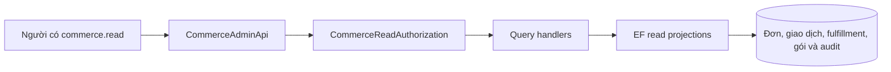
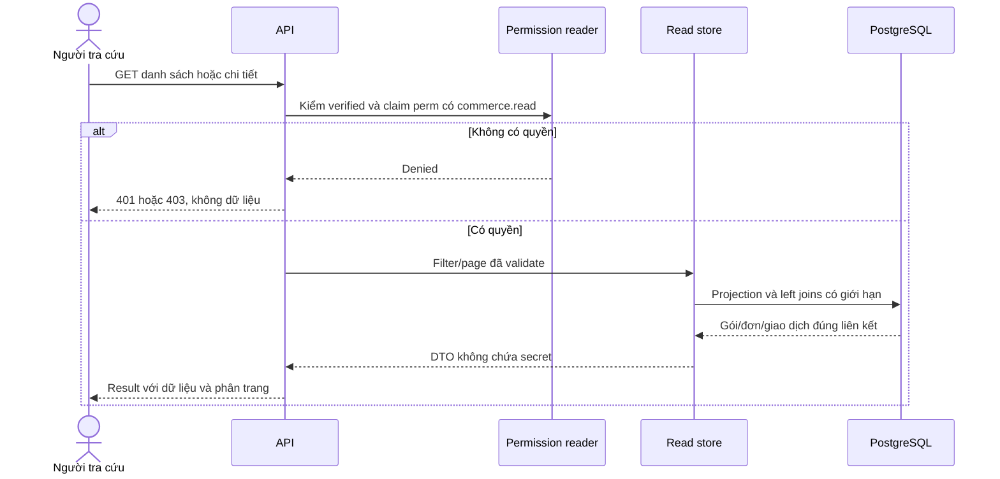
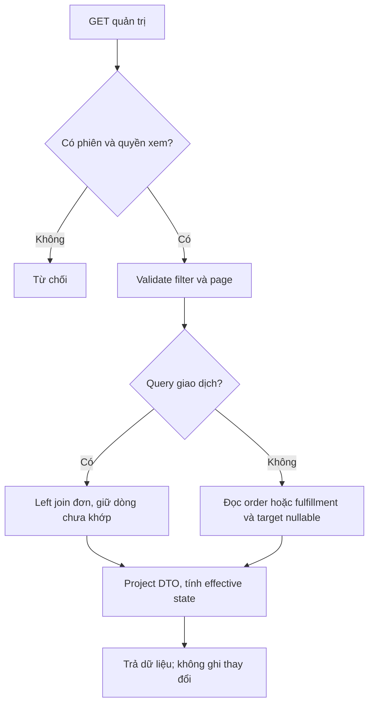
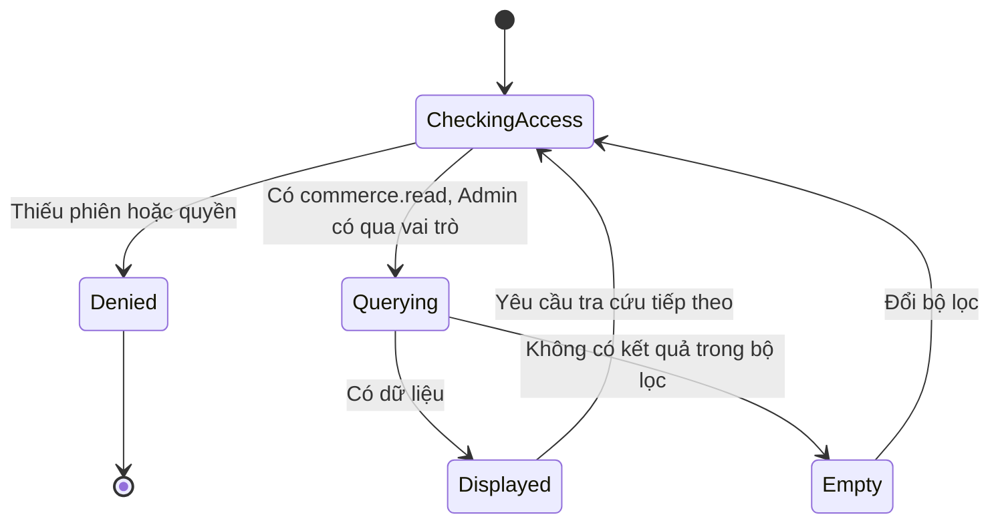
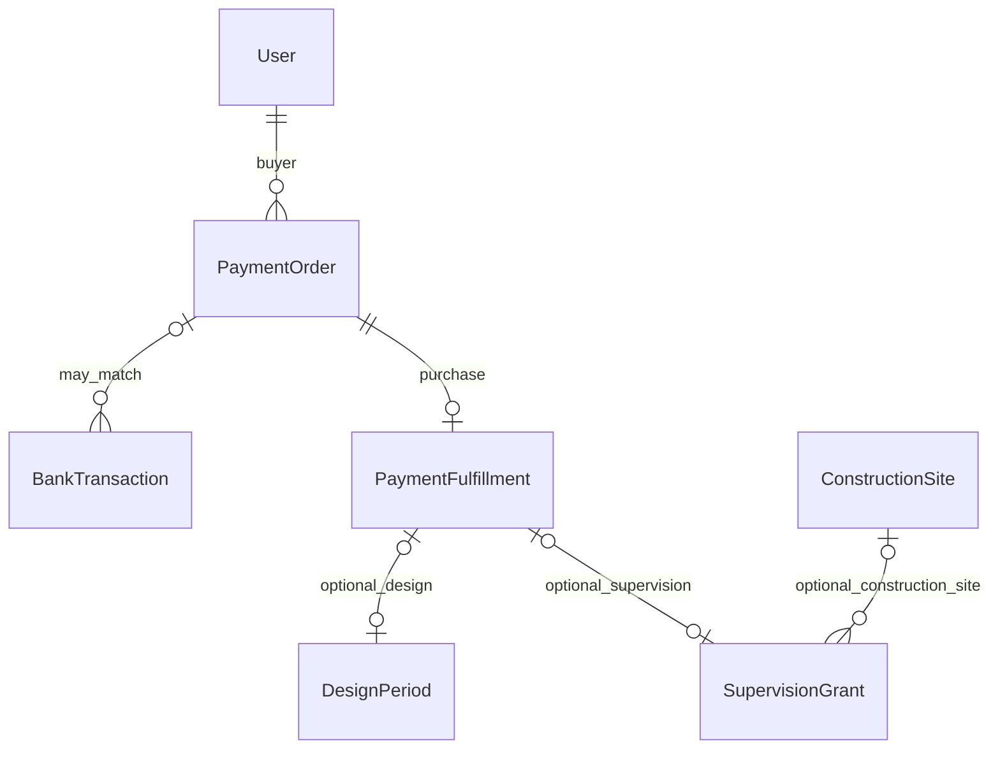

<!-- HƯỚNG DẪN CHO AI KHI ĐIỀN HOẶC CHỈNH SỬA MẪU
- Đọc toàn bộ mẫu, các comment hướng dẫn và tài liệu nguồn được cung cấp trước khi viết. Tuân thủ các quy tắc nghiệp vụ, điều kiện, ngoại lệ và giới hạn đã được xác nhận.
- Không bịa, tự chế hoặc suy đoán thành sự thật: yêu cầu, quy tắc, số liệu, API, schema, mã lỗi, nguồn tham khảo, người phụ trách và kết quả kiểm thử phải có căn cứ. Nội dung ví dụ trong mẫu không phải dữ kiện của dự án.
- Khi thiếu thông tin hoặc các nguồn mâu thuẫn, hỏi người dùng để làm rõ; giữ nguyên placeholder ở phần chưa xác định. Không tự chọn đáp án, lấp chỗ trống hay tuyên bố tài liệu đã hoàn tất.
- Chỉ thay nội dung cần điền hoặc được yêu cầu sửa. Không tự mở rộng phạm vi, sửa nghĩa quy tắc, bỏ điều kiện/ngoại lệ, xoá hay ghi đè nội dung hợp lệ đã có.
- Giữ nguyên tên, cấp và thứ tự heading, nhãn in đậm, tiền tố bullet, cấu trúc danh sách, tên/thứ tự/số cột bảng và cú pháp code fence. Không dịch, đổi tên, gộp hoặc thêm mục ngoài cấu trúc mẫu.
- Chỉ lặp khối luồng, AC hoặc API theo đúng khuôn khi có căn cứ; chỉ bỏ phần tuỳ chọn khi hướng dẫn riêng của mẫu cho phép và đã xác định không áp dụng.
- Mã tham chiếu và section phải trỏ tới tài liệu có thật đã được cung cấp hoặc kiểm chứng. Không giữ mã ví dụ như tham chiếu thật và không tự tạo tài liệu liên quan để hợp thức hoá liên kết.
- Giữ các comment hướng dẫn trong file. Xuất Markdown UTF-8, mỗi file một tài liệu; không bọc toàn bộ file trong code fence, không chèn lời dẫn hay giải thích ngoài mẫu.
- Trước khi bàn giao, đối chiếu nội dung với nguồn, kiểm tra cấu trúc, giá trị cho phép, giới hạn độ dài và tính nhất quán của mã/tham chiếu. Báo rõ phần chưa đủ thông tin; không tuyên bố đã chạy test hoặc import khi chưa thực hiện.
-->

<!-- Thay mã TDD-001 và nội dung ví dụ; giữ nguyên heading và nhãn in đậm.
Sơ đồ dùng mermaid, plantuml hoặc URL. Giữ heading Architecture, Sequence Diagram, Activity Diagram, State Diagram, Data Model.
Ví dụ API phải có heading trùng METHOD /path trong Endpoints. Xoá phần API/sơ đồ không dùng.
Version, Updated At và Change Log do lịch sử phiên bản quản lý, để trống khi nhập mới.
Author/Reviewer là tên hiển thị; gán tài khoản, phê duyệt, giả định và câu hỏi mở trên giao diện sau import.
Thiết kế phải truy vết về Story và Business Rule được cung cấp. Phân biệt thiết kế đề xuất với implementation đã kiểm chứng; không mô tả API/schema/sơ đồ ví dụ như hệ thống thật hoặc tự quyết định nghiệp vụ còn thiếu.
BẮT BUỘC KHI HOÀN THIỆN MẪU: phải có cả Reviewer và Approver, mỗi tên 1–200 ký tự sau khi bỏ khoảng trắng đầu/cuối. Không xoá hai dòng metadata, để trống, dùng tên bịa hoặc giữ placeholder rồi coi là hoàn tất.
Nếu chưa biết người review hoặc người phê duyệt, phải hỏi người dùng và báo tài liệu chưa đủ thông tin; không tự lấy Author/Owner làm người thay thế. Tên trong file không tự gán tài khoản hoặc xác nhận đã duyệt; gán thành viên trên giao diện sau import.
Đây là yêu cầu hoàn thiện mẫu; backend hiện vẫn nhận file cũ thiếu hai trường để tương thích.

VALIDATION CHO FILE NHẬP (đối chiếu ImportSnapshotValidator, MarkdownParser và ImportService):
- Mỗi file .md UTF-8 không rỗng chỉ có một heading cấp 1 chứa mã tài liệu dài 1–100 ký tự. Mã không được trùng trong cùng lần nhập hoặc thuộc loại tài liệu khác đã tồn tại.
- Không dùng tên README.md hoặc sitemap.md vì importer bỏ qua. Giao diện nhận .md/.zip, tối đa 2.000 file, tổng file tải lên 31 MiB; API giới hạn request 32 MiB và tổng nội dung đọc/giải nén 64 MiB.
- Chỉ nhập đè tài liệu cùng loại đang Draft, chưa có phiên bản và chưa lưu trữ. Import thay toàn bộ nội dung bản nháp, vì vậy phải giữ lại nội dung hợp lệ ngoài phần được yêu cầu sửa.
- Không dùng Status trong Markdown hoặc tên Approver để tự xác nhận phê duyệt; import không cấp quyền hay gán tài khoản từ tên. Chạy Kiểm tra file và xử lý lỗi/cảnh báo trước khi nhập.
- Giới hạn độ dài bên dưới tính theo string.Length của .NET (đơn vị UTF-16); không tự cắt ngắn dữ kiện quan trọng để vượt validation, hãy viết lại có căn cứ hoặc hỏi người dùng.
- Feature tối đa 300 ký tự và được dùng làm tiêu đề tài liệu. Status được parser nhận: Draft / In Review / Approved / Deprecated; tài liệu nhập mới vẫn có trạng thái phê duyệt Draft.
- Endpoint: đường dẫn tối đa 500 ký tự; tên/mô tả endpoint được lưu trong Name tối đa 300. HTTP method: GET / POST / PUT / PATCH / DELETE / HEAD / OPTIONS.
- Error Codes: mã tối đa 100 ký tự, không trùng trong tài liệu; giữ dạng - **CODE** (400): mô tả. HTTP status trong Error Codes và Response phải là số nguyên đọc được bằng Int32; không tự đặt status khác hợp đồng API.
- URL sơ đồ tối đa 1.000 ký tự. Mục sơ đồ được sử dụng phải có khối mermaid/plantuml hoặc URL theo mẫu; không để một mục sơ đồ rỗng. Nhãn mục được tách từ bullet như tên External API Fields tối đa 300 ký tự.
- Heading Examples phải khớp METHOD /path ở Endpoints. Giữ các nhãn Request:, Response 200: (thay mã theo contract) và Error Response: để parser tách đúng dữ liệu.
- Tham chiếu dạng DOC-KEY/section: ghi chú: mã đích tối đa 100 ký tự, section tối đa 100, ghi chú tối đa 1.000. Không trùng bộ mã đích + section + loại liên kết trong cùng tài liệu.
ĐỐI CHIẾU FORM TDD (src/features/tdds/validations.ts; form có thể chặt hơn import):
- Điền Feature, Author, Reviewer, Problem và ít nhất một Goal; các Goal/Non-goal/Notes đã thêm không được rỗng. API đã khai báo phải có endpoint và mô tả/mục đích; Fields phải có tên và ý nghĩa; Error Codes phải có mã, HTTP status và điều kiện.
- Form còn kiểm tra Version, Updated At và nội dung Change Log khi khai báo; với file nhập mới, giữ các trường lịch sử này trống theo hợp đồng import, không tự tạo dữ liệu lịch sử.
-->

# TDD-PAY-002

## Document Info

- **Feature**: Tra cứu quản trị người mua, gói đã mua, đơn và giao dịch
- **Author**: Codex
- **Reviewer**: Tân Trần
- **Approver**: Tân Trần
- **Status**: Draft
- **Version**:
- **Updated At**:

## Context & Goals

### Problem

STORY-PAY-002 cần Admin và nhân viên có quyền tra cứu riêng xem ai mua gói nào, các đơn và từng khoản chuyển. Dữ liệu gồm cả giao dịch chưa khớp đơn, đơn hết hạn/hủy, gói bị hủy hoặc bị thay thế. Không thể chỉ lấy CurrentPeriodId hoặc join bắt buộc transaction→order vì sẽ làm mất lịch sử và giao dịch chưa khớp.

**Hiện trạng ngày 26/09/2026:** module tra cứu đã có trong `develop` của `bmt-be` ở commit `c1d757a`, kèm migration `20260926085401_CommerceAdminLookupIndexes` chưa áp dụng lên database dùng chung. Route lịch sử thanh toán của đơn và email người mua (quyết định của người dùng ngày 26/09/2026) có code ở commit `a9e5069` trên nhánh `feature/payment-lookup-events`, chưa merge; không cần migration. Chi tiết và các điểm khác thiết kế ban đầu ở mục Architecture, “Đã triển khai”. Phần nó phụ thuộc đã có từ commit `182e2a8` ngày 25/09/2026 trên nhánh `feature/construction-site` của `bmt-be`: bảng `ConstructionSite` theo [TDD-SITE-001](TDD-SITE-001.md), cột `SupervisionGrant.ConstructionSiteId` theo [TDD-SUB-004](TDD-SUB-004.md). API của khách `GET /api/v1/me/supervision-grants` đã trả `constructionSiteName`: `GetMySupervisionGrantsQueryHandler` đọc tên công trình của cả trang bằng một câu truy vấn theo danh sách `ConstructionSiteId`. Projection của tài liệu này có thể dùng cùng cách, cho kết quả như LEFT JOIN ở Data Model. Thiết kế dùng projection trực tiếp từ các bảng ở TDD-PAY-001, TDD-SUB-004/005, không thêm database báo cáo hoặc copy trạng thái sang bảng tổng hợp khác.

**Cập nhật ngày 25/09/2026 (lần 3)**, đã có trong `develop` của `bmt-be` từ commit `5689f4d` (gỡ gói, bỏ khôi phục, bản lưu công trình trong `PackageLifecycleEvent`). Người dùng chốt ba điểm ảnh hưởng tới phần tra cứu:

- Nhân viên được gỡ gói giám sát khỏi công trình khi khách gán nhầm ([TDD-SUB-007](TDD-SUB-007.md), BR-SUB-026). Lịch sử gỡ (người gỡ, thời điểm, lý do, tên và địa chỉ công trình cũ) chỉ nhân viên có `commerce.read` xem được, cùng chỗ tra cứu gói đã mua (BR-PAY-005 khoản 4, BR-SUB-026 khoản 7). Quyền `supervision.unassign` không kèm quyền xem lịch sử này.
- Bỏ thao tác khôi phục gói (BR-SUB-025 đã bỏ). Lịch sử không còn dòng khôi phục mới; dòng `Restore` cũ trong dữ liệu dev/test, nếu có, vẫn hiện.
- Khách xóa được công trình chỉ còn gói đã hủy; khi đó gói mất liên kết công trình. Tên công trình của gói đã hủy lấy từ bản lưu trong sự kiện hủy ([TDD-SUB-005](TDD-SUB-005.md#data-model)).

### Goals

- Danh sách và chi tiết truy được khách–gói–đơn–giao dịch đúng, không làm mất gói chưa gán hoặc lần mua bị thay thế trước kích hoạt.
- Kiểm quyền ở server cho mọi query; quyền xem độc lập với quyền hủy (`package.cancel`) và quyền gỡ gói (`supervision.unassign`). Hệ thống không có thao tác đổi thẳng công trình của gói (BR-SUB-009) hay khôi phục gói (BR-SUB-025 đã bỏ).
- Lịch sử gói giám sát cho biết từng lần gỡ khỏi công trình, kèm tên và địa chỉ công trình cũ, kể cả khi công trình đó đã bị xóa (BR-PAY-005 khoản 4, STORY-SUB-006/AC-005).
- Gói giám sát đã gán hiện tên công trình; `commerce.read` không mở quyền xem danh sách công trình của khách (BR-PAY-005 khoản 2).
- Giao dịch chưa khớp hiện “Chưa xác định đơn”; không đoán người mua và không có thao tác gán tay.
- Phân trang ổn định, không N+1, phân biệt tổng tiền thực nhận và tiền đủ điều kiện.

### Non-goals

- Hoàn tiền/ghi nhận hoàn tiền; sửa giao dịch; gán thủ công; xác nhận thủ công cấp gói; báo cáo doanh thu hoặc xuất file.
- Đọc toàn bộ lịch sử ngân hàng ngoài các giao dịch connection SePay đã tiếp nhận. Không tuyên bố đây là sao kê đầy đủ khi webhook cấu hình sai hoặc bỏ lỡ giao dịch.

## Architecture

**Giải thích các kỹ thuật truy vấn**

| Kỹ thuật | Cách dùng trong màn hình quản trị | Ví dụ và giới hạn |
| --- | --- | --- |
| Projection / Select DTO | Chỉ chọn các cột cần hiển thị từ bảng gốc. | Trả số tiền, thời gian, liên kết; không trả toàn bộ connection hoặc secret. DTO không phải bảng mới. |
| Left join — giữ dòng dù thiếu liên kết | Lấy BankTransaction làm gốc, ghép Order nếu có. | T3 không khớp đơn vẫn xuất hiện với buyerId=null; inner join sẽ loại T3. |
| AsNoTracking — đọc không theo dõi thay đổi entity | Read store không giữ entity để cập nhật; query không gọi SaveChanges. | Giảm phần quản lý entity khi chỉ đọc. Đây không phải cơ chế phân quyền; vẫn phải kiểm quyền server. |
| Phân trang trên tập gốc, sort có khóa phụ | Đếm/lấy đơn trước khi đọc các collection; sắp thời gian rồi Id. | Hai khoản chuyển của O1 không thành hai đơn; cùng giây vẫn có thứ tự xác định. Giao dịch mới giữa hai lần gọi có thể làm dịch trang. |
| Tránh N+1 và tích nhân khi join | N+1 là mỗi dòng lại gọi thêm query; nhiều nhánh collection join có thể nhân số dòng. Dùng các query theo tập ID và giới hạn collection. | Trang 10 đơn không tự phát sinh 10 lần đọc giao dịch; hai khoản chuyển và ba event không bị hiểu thành sáu giao dịch. |
| RepeatableRead khi cần phản hồi nhất quán | Count và items có thể đọc cùng ảnh dữ liệu trong một read transaction. | Tránh totalCount ở một thời điểm và items ở thời điểm khác trong cùng phản hồi. Không giữ ảnh dữ liệu đó cho tất cả các trang ở các request sau. |
| Trạng thái tính khi đọc, quyền kiểm mỗi request | Dùng dữ liệu lifecycle/hạn để dựng phản hồi; policy kiểm claim `perm` trong access token ở mỗi request. | Đọc gói hết hạn không ghi trạng thái vào DB hoặc chạy lại cấp gói. Theo BR-RBAC-009, thu hồi quyền có hiệu lực chậm nhất khi access token hết hạn; khóa tài khoản hoặc buộc đăng xuất thì cắt ngay nhờ dấu phiên. |


| Thành phần | Trách nhiệm |
| --- | --- |
| `CommerceAdminApi` ở presentation/apis/payment/ | Bảy route GET chỉ đọc; cả nhóm route gắn policy `commerce.read` (policy này đã gồm điều kiện phiên đã xác minh). |
| `GetAdminPaymentOrders`/`GetAdminPaymentOrder`, `GetAdminBankTransactions`/`GetAdminBankTransaction`, `GetAdminPackagePurchases`/`GetAdminPackagePurchase`, `GetAdminPackagePurchaseHistory` (`QueryHandler`) ở application/usecases/queries/commerceAdmin/ | Kiểm quyền lại ở handler, chuẩn hóa trang, dựng truy vấn chỉ đọc và DTO. |
| `CommerceReadAccess` | Kiểm người gọi có claim `perm` là `commerce.read` và tài khoản chưa bị xóa; thiếu người gọi trả 401, thiếu quyền trả 403 `AccessForbidden`. Lệnh gọi thẳng qua MediatR cũng bị chặn. |
| Policy `commerce.read` | Gắn ở endpoint, kiểm claim `perm` trong access token theo [TDD-RBAC-001](TDD-RBAC-001.md#architecture). Vai trò Admin có mã `commerce.read` trong danh sách quyền của nó nên Admin xem được; không có đường tắt bỏ qua kiểm quyền chỉ vì là Admin. Không nhận quyền qua query string hoặc header tự khai. |
| `CommerceAdminQueries` | Truy vấn dùng chung: `PurchaseRows` (fulfillment ghép đơn, LEFT JOIN kỳ thiết kế và gói giám sát), bộ lọc trạng thái dịch sang SQL, đọc tên người và tên công trình theo danh sách Id. Nguồn là các `IQueryable` không theo dõi thay đổi của `IPaymentStore` và `IUnitOfWork`, thêm `IPaymentStore.QueryEvents()`. |
| `CommerceStatusProjector` | Hàm thuần suy trạng thái đơn và trạng thái hiệu lực của lần mua từ đồng hồ server, vòng đời gói và kết quả cấp gói; chọn tên công trình hiển thị; nhãn “Chưa xác định đơn”. Không ghi dữ liệu trong GET. |
| `CommerceFilters` và validator ở contract/services/commerceAdmin/ | Đọc bộ lọc dạng chuỗi (UUID, enum, thời điểm ISO 8601, id SePay), chuẩn hóa trang, kiểm vị trí trang không tràn `int`. |



**Notes**:

- `RequireAuthorization` phải bao gồm default verified-session policy; policy named chỉ RequireRole(Admin) hiện có chưa đủ để thay thế điều kiện phiên. Policy theo mã quyền và cách phát hành claim `perm` được định nghĩa ở [TDD-RBAC-001](TDD-RBAC-001.md#architecture).
- Toàn bộ query read-only, không hiện thực ITransactionalRequest để tránh transaction ghi không cần thiết. Nếu cần count/items nhất quán trong một phản hồi thì dùng read transaction RepeatableRead qua read store, không chạy SaveChanges. Không đưa query này qua cache toàn cục khi chưa có invalidation quyền/dữ liệu.
- API mặc định theo PagedResult hiện có: pageIndex 1, pageSize 10, tối đa 100. Chuẩn hóa giá trị <=0 về mặc định theo lớp hiện có; chặn offset tràn số trước query. Sort cố định (thời điểm DESC, Id DESC); không nhận tên cột SQL từ client. Giữa các trang có thể có giao dịch mới; nếu cần snapshot xuyên nhiều lần gọi sẽ bổ sung sau, không tự hứa không dịch trang.
- Bộ lọc đề xuất: customerId, planId, kind, state, orderId, paymentCode và khoảng UTC from/to; transaction có thêm matchState. Các lọc exact id/code và thời gian áp dụng server-side. Chưa triển khai tìm nội dung tùy ý với contains không index; không lấy toàn bộ dữ liệu về rồi lọc.
- Từ gói sang đơn dùng PaymentFulfillment.OrderId; từ đơn sang transaction dùng BankTransaction.OrderId. Không join bằng số tiền hoặc tên gói. PaymentOrder giữ snapshot giá/revision; thông tin tài khoản khách là hiện tại trừ khi có snapshot danh tính đã được thiết kế riêng.
- `purchaseId` dùng OrderId của lần mua đã hoàn tất; `packageId` nullable nếu SupersededBeforeActivation, để vẫn hiển thị lần mua mà không bịa DesignPeriod/quota. Mọi dòng gồm kind, buyerId, buyerDisplayName, planId, revisionId, planNameAtPurchase, paidAtUtc, fulfillmentAtUtc, disposition, current effective state; constructionSiteId NULL được phép cho giám sát chưa gán.
- Transaction DTO có id nội bộ, providerTransactionId, occurredAtUtc, receivedAtUtc, amountVnd, direction, code, content, referenceCode, matchState, processingState, orderId/buyerId/packageId nullable. Không trả raw body, signature, secret, accumulated hoặc toàn bộ cấu hình bank connection. Chỉ người có quyền xem nội dung chuyển khoản.
- Đơn DTO tách receivedAmountVnd, eligibleAmountVnd, remainingAmountVnd và extraReceivedAmountVnd. Khoản muộn vẫn trong danh sách transaction, không cộng vào eligible. Khoản trùng webhook chỉ một transaction. Khi xử lý cấp gói đang retry, hiển thị processingState và fulfillment chưa có, không báo khách chưa trả tiền chỉ vì grant chưa hoàn tất.
- Chi tiết nhiều collection dùng các query riêng có giới hạn, không Include nhiều nhánh tạo tích Descartes. Count không tính sau join one-to-many làm nhân số đơn/gói. Không dùng GET để đánh dấu đã hoàn tiền, sửa trạng thái hoặc chạy lại cấp gói.
- Thời điểm đủ tiền có thể được bổ sung bằng webhook muộn. Nếu thay đổi thứ tự của hai gói đã cấp, theo quyết định mới giữ gói hiện hành và gắn OrderingDiscrepancy cho tra cứu; nhân viên xử lý ngoài hệ thống, không có nút tự sửa gói từ query.

**Đã triển khai** (commit `c1d757a`, nhánh `feature/payment-lookup` của `bmt-be`). Các điểm dưới đây là lựa chọn kỹ thuật khi viết code, hoặc chỗ code khác mô tả ở trên:

1. Không tạo `ICommerceReadStore` riêng ở persistence. Handler ghép các `IQueryable` không theo dõi thay đổi của `IPaymentStore` và `IUnitOfWork`, giống các query thanh toán của khách đã có; phần dùng chung nằm ở `CommerceAdminQueries`.
2. Chưa dùng read transaction `RepeatableRead`. Tổng số dòng và các dòng của trang đọc bằng hai câu lệnh riêng, nên nếu có giao dịch mới được ghi giữa hai câu thì `totalCount` có thể lệch một ít so với trang. Chấp nhận ở bản này vì chỉ là màn hình tra cứu; muốn nhất quán tuyệt đối thì bổ sung sau.
3. Bộ lọc: `fromUtc` tính cả mốc, `toUtc` không tính mốc; `fromUtc` sau `toUtc` trả 422. Đơn lọc theo `CreatedAtUtc`, giao dịch theo `OccurredAtUtc`. Chuỗi thời điểm không ghi múi giờ được hiểu là UTC. `paymentCode` so sau khi bỏ khoảng trắng và đổi chữ hoa, như cách lưu. Route nhận UUID, enum, thời điểm, id SePay dạng chuỗi rồi validator kiểm, để sai định dạng trả 422 `CommerceQueryInvalid` thay cho lỗi 400 của bước bind tham số.
4. Lọc đơn theo `state` dùng trạng thái tại lúc đọc, cùng cách hiển thị: đơn `Pending`/`PartiallyPaid` đã qua `ExpiresAtUtc` tính là `Expired`.
5. `effectiveState` của lần mua: gói giám sát dùng `Unassigned`, `ExpiredUnassigned`, `Assigned`, `Completed`, `CanceledByStaff` như TDD-SUB-004. Kỳ thiết kế dùng `Active` (còn `Active` và chưa tới `ScheduledEndsAtUtc`), `Expired` (còn `Active` trong database nhưng đã qua ngày kết thúc), `CanceledByStaff`, `Superseded`. Lần mua thiết kế bị thay thế trước kích hoạt mang `SupersededBeforeActivation`. Bộ lọc `effectiveState` dịch cùng các điều kiện này sang SQL.
6. Danh sách giao dịch: `matchLabel` là “Chưa xác định đơn” mỗi khi giao dịch không có `OrderId`, gồm cả `Pending` (worker chưa xử lý), `IgnoredDirection` và `ConnectionMismatch`. Chi tiết giao dịch trả thêm tài khoản nhận SePay báo, số lần worker đã nhận việc, mã thanh toán và tên người mua của đơn đã khớp; không trả `CanonicalHash`, lease hay `LastErrorCode`.
7. Chi tiết đơn không nhúng danh sách giao dịch hay lịch sử: trả `transactionCount`, `transactionsPath` (`/api/v1/admin/bank-transactions?orderId=...`), `eventsPath` (`/api/v1/admin/payment-orders/{orderId}/events`, có với mọi đơn), và `purchasePath`, `historyPath` khi đơn đã được cấp gói. Route `events` chỉ đọc `PaymentEvent` của đơn, sắp AtUtc DESC, Id DESC, dùng index `IX_PaymentEvent_OrderId_AtUtc_Id`. Không dựng mốc giả từ trạng thái đơn: đơn đã quá hạn nhưng hệ thống chưa đánh dấu thì chưa có mốc `Expired`, dù chi tiết đơn đã hiện `Expired`. Mốc có người thao tác (ví dụ khách hủy đơn) trả `actorId` và họ tên; mốc do hệ thống ghi có `actorId` NULL.
8. Lịch sử lần mua ghép ba nguồn: `PaymentEvent` của đơn, `PackageLifecycleEvent` của kỳ hoặc gói được cấp, và mốc gán đọc từ `SupervisionGrant` (`FirstAssigned`; `CurrentAssigned` chỉ khi `AssignedAtUtc` khác `FirstAssignedAtUtc`). Người gán là chủ gói. Mỗi nguồn chỉ lấy tối đa “vị trí trang + cỡ trang” dòng đầu theo cùng thứ tự rồi trộn, nên kết quả đúng như phân trang trên hợp ba nguồn mà không phải viết `UNION`. Thứ tự Id trong bộ nhớ so theo chuỗi hex của UUID, trùng thứ tự `uuid` của PostgreSQL.
9. Người mua trả `buyerId`, `buyerDisplayName` và `buyerEmail` (họ tên và email hiện tại của tài khoản, không phải bản chụp lúc mua) ở danh sách và chi tiết đơn, lần mua, giao dịch đã khớp đơn; danh sách giao dịch cũng trả họ tên. Giao dịch chưa khớp đơn có ba trường này NULL. Không trả số điện thoại. Người thao tác trong lịch sử chỉ có họ tên, không có email.

## Sequence Diagram



## Activity Diagram



## State Diagram

Sơ đồ mô tả phiên tra cứu, không tạo thêm trạng thái nghiệp vụ của đơn/gói.



## Data Model

**Ý nghĩa dữ liệu nguồn và kết quả đọc**

Module này không tạo thêm bảng. Một projection là kết quả chọn/ghép cột để trả cho màn hình, không phải bản ghi được lưu riêng. Schema và ví dụ bản ghi gốc nằm trong [TDD-PAY-001](TDD-PAY-001.md#data-model), [TDD-SUB-004](TDD-SUB-004.md#data-model) và [TDD-SUB-005](TDD-SUB-005.md#data-model).

| Bảng nguồn | Ý nghĩa một dòng | Dùng để trả thông tin gì? |
| --- | --- | --- |
| User | Một tài khoản khách hoặc nhân viên. | Người mua hiện tại hoặc người thực hiện thao tác. Không suy khách từ nội dung chuyển khoản chưa khớp. |
| PaymentOrder / PlanRevision | Một đơn mua và bản quyền lợi đã chốt cho đơn. | Ai đặt gói nào, giá tại lúc mua, trạng thái đơn; không lấy giá mới từ danh mục hiện hành. |
| BankTransaction | Một giao dịch ngân hàng đã được hệ thống tiếp nhận. | Từng khoản chuyển, thời điểm, số tiền, tình trạng khớp/xử lý, kể cả không có OrderId. |
| PaymentFulfillment | Một kết quả cấp quyền của lần mua. | Lịch sử mua thành công; có thể không có packageId nếu SupersededBeforeActivation. |
| DesignPeriod / SupervisionGrant / ConstructionSite | Một kỳ thiết kế, một gói giám sát đã cấp và công trình liên quan nếu có. | Hiệu lực hiện tại, hạn/lượt, công trình đã gán; vắng công trình không làm mất lần mua. Projection LEFT JOIN `ConstructionSite` ([TDD-SITE-001](TDD-SITE-001.md#data-model)) theo `SupervisionGrant.ConstructionSiteId` để trả `constructionSiteId` và `constructionSiteName` là tên hiện tại. Gói đã hủy mà công trình đã bị xóa (`ConstructionSiteId` NULL) thì `constructionSiteName` lấy từ `PackageLifecycleEvent.ConstructionSiteName` của sự kiện mà `CancelEventId` trỏ tới. Gói chưa gán, kể cả gói vừa bị gỡ, thì cả hai là null. Chỉ lấy tên, không trả địa chỉ ở danh sách và chi tiết. |
| PaymentEvent / PackageLifecycleEvent | Một mốc thanh toán; một lần nhân viên hủy, hoàn thành, mở lại hoặc gỡ gói khỏi công trình. Dòng `Restore` chỉ còn ở dữ liệu cũ. | Ghép lịch sử để giải thích quá trình sử dụng, không thêm trạng thái “đã hoàn tiền”. Dòng `Unassign` và dòng `Cancel` của gói giám sát có công trình mang bản lưu `ConstructionSiteId`, `ConstructionSiteName`, `ConstructionSiteAddress` tại lúc thao tác ([TDD-SUB-005](TDD-SUB-005.md#data-model)); lịch sử trả nguyên bản lưu này, không join lại `ConstructionSite`. Mốc gán lấy từ `SupervisionGrant.FirstAssignedAtUtc` (lần gán đầu) và `AssignedAtUtc` (lần gán hiện tại, NULL khi chưa gán) theo [TDD-SUB-004](TDD-SUB-004.md#data-model). Các lần gán nằm giữa hai lần gỡ không có dòng lịch sử riêng, chỉ có biên nhận `Assign`; mỗi lần gỡ đã lưu công trình cũ nên vẫn đủ để biết gói từng ở đâu. |
| UserRole / RolePermission | Một lần một người giữ một vai trò, và một mã quyền thuộc vai trò đó. | Bảng dùng lại, định nghĩa ở [TDD-RBAC-001](TDD-RBAC-001.md#data-model). Thay cho `StaffAccessProfile` và `StaffPermission` của bản trước. Chúng quyết định request hiện tại có được đọc các dữ liệu trên không, nhưng ở đường chạy thực tế thì quyền đọc từ claim `perm` trong access token chứ không truy vấn lại hai bảng này. Không trả hồ sơ quyền trong DTO giao dịch. |

**Mẫu dữ liệu nguồn → dữ liệu màn hình**

Các ID dưới đây là bí danh UUID, dữ liệu giả định. Cột “Kết quả đọc” chỉ minh họa các trường DTO liên quan, không được insert thành bảng mới.

| Dữ liệu thực lưu ở bảng nguồn | Kết quả đọc cho quản trị | Vì sao cần phân biệt? |
| --- | --- | --- |
| O1.PriceVnd=2000000; O1.ReceivedAmountVnd=2100000; O1.EligibleAmountVnd=2100000; O1.RevisionId=R1; R1 là bản quyền lợi cũ | Một dòng đơn O1: priceVnd="2000000", receivedAmountVnd="2100000", eligibleAmountVnd="2100000" | Gói trong danh mục có giá mới cũng không đổi giá O1. Một đơn có hai khoản chuyển vẫn đếm một đơn. |
| T1.OrderId=O1, AmountVnd=500000; T2.OrderId=O1, AmountVnd=1600000 | Hai dòng giao dịch T1/T2, cùng orderId=O1 và buyerId=U1 | Đếm giao dịch riêng với đếm đơn; không cộng thêm lần nữa vì join ra hai dòng. |
| T3.OrderId=NULL; MatchState=Unmatched; AmountVnd=300000 | orderId=null; buyerId=null; packageId=null; matchLabel="Chưa xác định đơn" | Không có liên kết thì giữ null. Inner join sẽ làm mất T3 khỏi màn hình. |
| Fulfillment O4: Kind=Design; Disposition=SupersededBeforeActivation; DesignPeriodId=NULL; SupervisionGrantId=NULL | purchaseId=O4; packageId=null; disposition=SupersededBeforeActivation | Vẫn có lần mua được ghi nhận dù không tạo kỳ hiệu lực. |
| Fulfillment O5 trỏ G5; G5.State=Unassigned; G5.ConstructionSiteId=NULL; còn hạn gán | purchaseId=O5; packageId=G5; constructionSiteId=null; constructionSiteName=null; effectiveState=Unassigned | Khách đã mua gói giám sát nhưng chưa dùng cho công trình nào. |
| Fulfillment O7 trỏ G7 của U2; G7.State=Assigned; G7.ConstructionSiteId=CS7; CS7.Name=Nhà Thủ Đức; U2 còn công trình CS8 “Nhà Gò Vấp” chưa có gói | purchaseId=O7; packageId=G7; constructionSiteId=CS7; constructionSiteName="Nhà Thủ Đức" | Nhân viên có `commerce.read` biết gói phục vụ công trình nào (STORY-PAY-002/AC-009). CS8 không xuất hiện ở đâu trong API này vì không có gói nào trỏ tới. |
| Fulfillment O8 trỏ G8; G8.State=Unassigned; G8.ConstructionSiteId=NULL; G8.FirstAssignedAtUtc=2026-10-01T02:00:00Z; G8.AssignedAtUtc=NULL; PackageLifecycleEvent L8: Action=Unassign; ActorId=NV3; AtUtc=2026-10-05T03:00:00Z; Reason=Khách gán nhầm công trình; ConstructionSiteName=Nhà Thủ Đức; ConstructionSiteAddress=12 Võ Văn Ngân, TP. Thủ Đức | Chi tiết: packageId=G8; constructionSiteId=null; constructionSiteName=null. Lịch sử: một dòng gỡ với người gỡ NV3, thời điểm, lý do, công trình cũ "Nhà Thủ Đức" và địa chỉ | Gói đang chưa gán nên chi tiết không có công trình; công trình cũ chỉ hiện trong lịch sử, đúng STORY-SUB-006/AC-005. Khách xem gói của mình qua TDD-SUB-004 thì không thấy dòng lịch sử này. |
| Fulfillment O9 trỏ G9; G9.State=CanceledByStaff; G9.ConstructionSiteId=NULL (khách đã xóa công trình); G9.CancelEventId=L9; L9: Action=Cancel; ConstructionSiteName=Nhà Gò Vấp | constructionSiteId=null; constructionSiteName="Nhà Gò Vấp"; effectiveState=CanceledByStaff | Công trình đã bị xóa cứng nên không join được; tên lấy từ bản lưu của sự kiện hủy (BR-SUB-024 khoản 9). |
| O6.PaidAtUtc được hiệu chỉnh; O6.OrderingDiscrepancy=true; fulfillment vẫn giữ AppliedPaidAtUtc cũ | Chi tiết đơn có dấu lệch thứ tự và lịch sử thay đổi; gói hiện hành giữ nguyên | Tra cứu giúp nhân viên hiểu lý do xử lý bên ngoài, không kích hoạt sửa gói khi mở màn hình. |

NULL biểu diễn “không có liên kết”, không phải lỗi hệ thống hoặc số tiền bằng 0. EffectiveState được tính từ dữ liệu hiện tại và đồng hồ server; nếu chưa triển khai cache thì không lưu thêm một bản trạng thái để tự đồng bộ.


Không thêm bảng nghiệp vụ mới. Các DTO không phải nguồn dữ liệu thứ hai và không được cập nhật trực tiếp.

| Projection | Nguồn và quan hệ | Lưu ý |
| --- | --- | --- |
| AdminOrderSummary/Detail | PaymentOrder → User, PlanRevision; nullable Fulfillment | Tất cả trạng thái đơn; không đọc giá hiện hành từ Plan.PublishedRevisionId. |
| AdminPurchaseSummary/Detail | PaymentFulfillment → PaymentOrder → User; left join DesignPeriod/SupervisionGrant | Mua trước đến muộn có thể không có target; giám sát chưa gán không bị loại. |
| AdminTransactionSummary/Detail | BankTransaction left join PaymentOrder và Fulfillment | Unmatched có buyer/order/package NULL; không dùng inner join. |
| PackageHistory | PaymentEvent, PackageLifecycleEvent (kèm bản lưu công trình), mốc `FirstAssignedAtUtc`/`AssignedAtUtc` của SupervisionGrant | Ghép theo định danh/loại, không suy trạng thái hoàn tiền. Bảng `SupervisionAssignmentEvent` đã bỏ theo TDD-SUB-004. |



**Notes**:

- Dùng index đã định nghĩa tại TDD-PAY-001/SUB-004/005. Migration `20260926085401_CommerceAdminLookupIndexes` (commit `c1d757a`) thêm bốn index để danh sách mặc định không phải sắp cả bảng mới lấy được một trang: `IX_PaymentOrder_CreatedAtUtc_Id`, `IX_BankTransaction_OccurredAtUtc_Id`, `IX_PaymentFulfillment_CompletedAtUtc_OrderId`, và `IX_BankTransaction_ProviderTransactionId` cho lọc theo id SePay không kèm connection (index UNIQUE hiện có bắt đầu bằng `ConnectionId` nên không dùng được). PostgreSQL quét ngược index tăng dần cho thứ tự `DESC, DESC`. Chưa thêm Order(PlanId,CreatedAtUtc DESC,Id); lọc theo gói dùng `IX_PaymentOrder_PlanId` hiện có. Chưa chạy EXPLAIN trên dữ liệu thật, nên chưa khẳng định đã đo hiệu năng. Migration chỉ tạo index, không đổi dữ liệu; Down xóa bốn index. Trên bảng lớn ở production, cân nhắc tạo index `CONCURRENTLY` ngoài migration để không khóa ghi.
- Đếm và phân trang trên tập gốc trước khi lấy collection giao dịch/audit. Một order có ba giao dịch vẫn là một order, không ba dòng order. Giao dịch dùng (OccurredAtUtc DESC,Id DESC) để thứ tự ổn định khi cùng giây.
- Dữ liệu VNĐ trả chuỗi nguyên như TDD-PAY-001. DateTimeOffset trả ISO 8601 UTC, UI hiển thị giờ Việt Nam; nội dung chuyển khoản phải render text, không render HTML.
- Query xuyên khách là chủ ý của quyền quản trị; query khách ở TDD-PAY-001 luôn có account predicate. Không dùng cùng handler rồi bật cờ `ignoreOwnership=true` từ client.
- Nguồn quyền nhân viên đã có trong code theo [TDD-RBAC-001](TDD-RBAC-001.md): bảng `UserRole`/`RolePermission`, claim `perm`, và migration `20260923152830_InitialRbac` seed `commerce.read` cho vai trò `admin`. Không coi tên vai trò là chứng minh quyền. Policy kiểm claim `perm` ở mỗi request. Theo BR-RBAC-009, thay đổi vai trò hoặc thu hồi quyền có hiệu lực chậm nhất khi access token hiện tại hết hạn; khóa tài khoản hoặc buộc đăng xuất cắt phiên ngay nhờ dấu phiên, không chờ token hết hạn.

## Internal API

### Endpoints

Tất cả route dưới đây là read-only, cần verified session và claim `commerce.read`; Admin có mã này qua vai trò `admin`, không có đường tắt theo vai trò. DTO dùng Result<T>/PagedResult<T> hiện có, không bọc một success envelope khác.

- **GET** `/api/v1/admin/payment-orders` — Lọc customerId/planId/kind/state/paymentCode/fromUtc/toUtc, pageIndex/pageSize; trả một dòng mỗi đơn.
- **GET** `/api/v1/admin/payment-orders/{orderId}` — Snapshot, tổng thực nhận/hợp lệ, fulfillment, OrderingDiscrepancy và liên kết trang transaction/audit. Collection lớn lấy riêng, không nhét vô hạn vào detail.
- **GET** `/api/v1/admin/payment-orders/{orderId}/events` — Lịch sử thanh toán của mọi đơn, kể cả đơn chưa được cấp gói: tạo, hủy, hết hạn, đủ tiền, cấp gói, lệch thứ tự, theo `PaymentEvent`. Sắp AtUtc DESC, Id DESC, có page; đơn không tồn tại trả 404 `CommerceRecordNotFound`.
- **GET** `/api/v1/admin/bank-transactions` — Lọc orderId/matchState/fromUtc/toUtc/providerTransactionId; Unmatched không cần customerId. Nếu lọc customerId thì chỉ các transaction đã khớp khách đó.
- **GET** `/api/v1/admin/bank-transactions/{transactionId}` — Thông tin giao dịch đã chuẩn hóa và liên kết nullable; không có thao tác gán tay.
- **GET** `/api/v1/admin/package-purchases` — Lọc customerId/planId/kind/disposition/effectiveState, phân trang; nguồn Fulfillment+Order, gồm lịch sử bị thay thế và giám sát chưa gán.
- **GET** `/api/v1/admin/package-purchases/{orderId}` — Chi tiết lần mua, target nullable, hạn/lượt; với gói giám sát đã gán trả `constructionSiteId` và `constructionSiteName`; gói đã hủy mà công trình đã bị xóa trả `constructionSiteName` từ bản lưu của sự kiện hủy; trả liên kết history.
- **GET** `/api/v1/admin/package-purchases/{orderId}/history` — Audit tạo/cấp; gán (mốc `FirstAssignedAtUtc` và `AssignedAtUtc`); hủy, hoàn thành, mở lại; gỡ gói khỏi công trình kèm người gỡ, thời điểm, lý do, tên và địa chỉ công trình cũ; dòng `Restore` cũ nếu có. Sắp AtUtc DESC,Id DESC có page; không tạo lịch sử hoàn tiền.

Nhóm route này không có API danh sách hay chi tiết công trình. Nhân viên chỉ có `commerce.read` gọi API công trình của [TDD-SITE-001](TDD-SITE-001.md#internal-api) nhận 403 theo BR-SITE-003/Except (ST-PAY-072). Cũng không có route đổi thẳng công trình hay khôi phục gói; ST-PAY-053 kiểm các yêu cầu ghi còn lại (hủy gói, gỡ gói) đều bị từ chối khi chỉ có quyền xem. Lịch sử gỡ gói chỉ trả qua route history ở trên, nên chỉ người có `commerce.read` xem được; nhân viên chỉ có `supervision.unassign` gọi route này nhận 403 (STORY-SUB-006/AC-005, ST-PAY-078).

### Examples

#### GET /api/v1/admin/bank-transactions

```
Request:
GET /api/v1/admin/bank-transactions?matchState=Unmatched&pageIndex=1&pageSize=10

Response 200:
{"value":{"items":[{"id":"99999999-9999-9999-9999-999999999999","providerTransactionId":92704,"occurredAtUtc":"2026-09-19T03:14:00Z","amountVnd":"2000000","direction":"in","content":"NO MATCH","matchState":"Unmatched","matchLabel":"Chưa xác định đơn","orderId":null,"buyerId":null,"packageId":null}],"pageIndex":1,"pageSize":10,"totalCount":1,"hasNextPage":false,"hasPreviousPage":false},"isSuccess":true,"isFailure":false,"error":{"code":"","message":""}}

Error Response:
{"title":"Forbidden","code":"Forbidden","status":403,"detail":"You do not have permission to access this resource.","messageCode":"AccessForbidden","errors":null}
```

Payload minh họa trích trường chính; DTO chi tiết gồm code/referenceCode/receivedAtUtc/processingState theo Architecture. Không trả raw webhook hoặc secret. Mã lỗi ở mục Error Codes nằm ở trường `messageCode` của phản hồi, giống các API khác của `bmt-be`; trường `code` là mã chung theo HTTP (`Forbidden`, `NotFound`). Lỗi validation trả 422 với `messageCode` của từng lỗi trong `errors` là `CommerceQueryInvalid`.

### Error Codes

- **Unauthorized** (401): chưa đăng nhập hoặc phiên không hợp lệ.
- **AccessForbidden** (403): thiếu quyền tra cứu hoặc phiên không đạt policy.
- **CommerceRecordNotFound** (404): id không tồn tại sau khi kiểm quyền.
- **CommerceQueryInvalid** (422): filter enum/UUID/time range không hợp lệ hoặc offset tràn; không tự dùng raw SQL từ filter.

## References

### User Stories

- STORY-PAY-002
- STORY-PAY-002/AC-009
- STORY-PAY-002/AC-010
- STORY-PAY-002/AC-011
- STORY-SUB-006/AC-005

### Business Rules

- BR-PAY-005/Then
- BR-PAY-001/Then
- BR-PAY-002/Then
- BR-PAY-004/Then
- BR-RBAC-009/Then
- BR-SUB-009/Except
- BR-SITE-003/Except
- BR-SUB-024/Then
- BR-SUB-026/Then

### Use Cases

- STORY-PAY-002/Main Flow

### Others

- [Nguồn đơn/giao dịch](TDD-PAY-001.md), [giám sát](TDD-SUB-004.md), [quyền riêng/lifecycle](TDD-SUB-005.md), [gỡ gói khỏi công trình](TDD-SUB-007.md), [công trình](TDD-SITE-001.md).
- [BR-SUB-025](../businessrule/BR-SUB-025.md) đã bỏ ngày 25/09/2026, không còn là căn cứ thiết kế.
- [PagedResult](../../bmt-be/src/bmt-be.contract/abstractions/shared/PagedResult.cs), [Result](../../bmt-be/src/bmt-be.contract/abstractions/shared/Result.cs), [JwtExtensions](../../bmt-be/src/bmt-be.api/dependencyInjection/extensions/JwtExtensions.cs).
- [Bảng truy vết kiểm thử](../discovery/payment-technical-design.md); ST-PAY-047–054 (ST-PAY-048, ST-PAY-053 đã bỏ phần quyền đổi công trình ngày 25/09/2026 và đổi phần khôi phục thành gỡ gói), ST-PAY-072 và ST-PAY-078 (lịch sử gỡ chỉ người có `commerce.read` xem), ST-PAY-102 (lịch sử thanh toán của đơn chưa được cấp gói), ST-PAY-103 (email người mua). Không có External API: tra cứu từ dữ liệu nội bộ, không gọi SePay ở mỗi lần mở màn hình.
- Đặc tả Unit Test: UT-PAY-063 đến UT-PAY-070, UT-PAY-080 (tên công trình của gói giám sát, null khi chưa gán), UT-PAY-081 (viết lại ở lần 3: lịch sử có sự kiện gỡ, hủy kèm bản lưu công trình, mốc `FirstAssignedAtUtc` và `AssignedAtUtc`, dòng `Restore` cũ), UT-PAY-107 (tên công trình của gói đã gỡ và gói đã hủy), UT-PAY-108 (chỉ `commerce.read` xem lịch sử gỡ). UT-PAY-064 sửa ở lần 3 (không cần quyền hủy hay gỡ). UT-PAY-128, UT-PAY-129 (lịch sử thanh toán của đơn), UT-PAY-130 (email người mua), thêm ngày 26/09/2026. Mã test ở commit `c1d757a` của `bmt-be`: `test/bmt-be.application.tests/usecases/commerceAdmin/` (`CommerceAdminQueryTests`, `CommerceAdminValidatorTests`, `CommerceStatusProjectorTests`), `test/bmt-be.api.tests/security/CommerceAdminApiAuthorizationTests.cs` (policy qua pipeline HTTP) và integration test PostgreSQL `test/bmt-be.integration.tests/CommerceAdminQueryTests.cs`. Mã test của UT-PAY-128 đến UT-PAY-130 ở commit `a9e5069`: `CommerceAdminOrderEventsAndEmailTests` và `CommerceAdminQueryTests.OrderEvents_CanceledAndPaidOrders_ReadFromPostgresWithBuyerEmail` (integration). Tên test ghi trong từng đặc tả.

## Change Log

- 2026-09-26 (lịch sử đơn và email): Người dùng trả lời hai câu hỏi mở ngày 26/09/2026. (1) Thêm route `GET /api/v1/admin/payment-orders/{orderId}/events` có phân trang, quyền `commerce.read`, trả lịch sử thanh toán của mọi đơn kể cả đơn chưa được cấp gói, theo `PaymentEvent`; chi tiết đơn thêm `eventsPath`. (2) Trả email người mua (`buyerEmail`) trong danh sách và chi tiết đơn, lần mua, giao dịch đã khớp đơn; danh sách giao dịch thêm `buyerDisplayName`. Code ở commit `a9e5069` trên nhánh `feature/payment-lookup-events` của `bmt-be`, chưa merge; không cần migration. Thêm STORY-PAY-002/AC-010, AC-011; BR-PAY-005 khoản 2, 4; UT-PAY-128 đến UT-PAY-130; ST-PAY-102, ST-PAY-103.
- 2026-09-26 (triển khai): Đã có code ở commit `c1d757a` trên nhánh `feature/payment-lookup` của `bmt-be` (tách từ `develop` `9c7b147`, chưa merge): bảy route ở Internal API, kiểm quyền `commerce.read` ở policy và ở handler, migration `20260926085401_CommerceAdminLookupIndexes` với bốn index cho danh sách (chưa áp dụng lên database dùng chung). Lựa chọn kỹ thuật và điểm khác thiết kế ghi ở Architecture, mục “Đã triển khai”: không tạo read store riêng, chưa dùng `RepeatableRead`, quy ước khoảng thời gian, bộ lọc trạng thái tính tại lúc đọc, tập giá trị `effectiveState` của kỳ thiết kế, lịch sử trộn ba nguồn. Ví dụ Error Response sửa theo phản hồi thật của policy (`code` là `Forbidden`, mã riêng nằm ở `messageCode`). Hai câu hỏi mở của lần này (route lịch sử thanh toán của đơn chưa được cấp gói; email người mua) đã được người dùng trả lời, xem mục trên.
- 2026-09-25 (lần 3): Theo quyết định người dùng ngày 25/09/2026: lịch sử gói gồm sự kiện gỡ gói khỏi công trình (TDD-SUB-007) với bản lưu tên, địa chỉ công trình cũ; chỉ `commerce.read` xem, `supervision.unassign` không kèm quyền xem. Bỏ khôi phục khỏi mô tả hành vi (BR-SUB-025 đã bỏ); dòng `Restore` cũ vẫn hiện. Mốc gán dùng `FirstAssignedAtUtc` và `AssignedAtUtc`. Gói đã hủy mà công trình đã bị xóa lấy tên từ bản lưu của sự kiện hủy. Bỏ `SupervisionAssignmentEvent` khỏi nguồn `PackageHistory`. Thêm mẫu dữ liệu G8 (đã gỡ), G9 (đã hủy, công trình đã xóa), STORY-SUB-006/AC-005, BR-SUB-026, ST-PAY-078. Thiết kế chưa có trong code.
- 2026-09-25 (đồng bộ code): Ghi hiện trạng phụ thuộc: bảng công trình và cột `ConstructionSiteId` đã có từ commit `182e2a8`, API gói giám sát của khách đã trả tên công trình; module tra cứu quản trị vẫn chưa có code.
- 2026-09-25 (lần 2): Bỏ quyền và lịch sử đổi công trình (BR-SUB-009, BR-SUB-023 đã bỏ); lịch sử gán lấy từ `FirstAssignedAtUtc` thay `SupervisionAssignmentEvent`. Projection gói giám sát trả thêm `constructionSiteName` qua LEFT JOIN `ConstructionSite` (TDD-SITE-001); ghi rõ `commerce.read` không có API công trình (BR-PAY-005 khoản 2, BR-SITE-003/Except). Thêm STORY-PAY-002/AC-009, ST-PAY-072.
- 2026-09-25: Cập nhật theo US/BR đã chốt ngày 25/09/2026. Quyền tra cứu ghi là "có `commerce.read`; Admin có qua vai trò", bỏ cách viết "Admin hoặc commerce.read" ở Sequence/State Diagram và Internal API. Thời điểm hiệu lực khi thu hồi quyền theo BR-RBAC-009 (chậm nhất khi access token hết hạn, ngay khi khóa hoặc buộc đăng xuất), thay câu "thu hồi có hiệu lực ở request tiếp theo"; cập nhật hiện trạng nguồn quyền RBAC đã có trong code. Đổi `Project`/`projectId`/"dự án" trong projection, mẫu dữ liệu và ERD sang `ConstructionSite`/`constructionSiteId`/công trình, ghi rõ phụ thuộc đặc tả Công trình chưa soạn. Bổ sung tham chiếu BR-RBAC-009.
- 2026-09-20: Đổi nguồn quyền tra cứu từ `StaffAccessProfile`/`StaffPermission` sang policy theo mã quyền của [TDD-RBAC-001](TDD-RBAC-001.md). Mã `commerce.read` giữ nguyên tên; Admin xem được vì vai trò Admin chứa mã này, không phải vì có đường tắt theo vai trò. Nghiệp vụ tra cứu quản trị không đổi.
