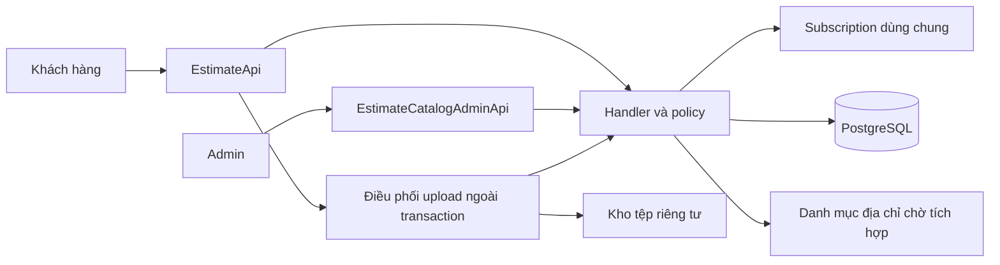
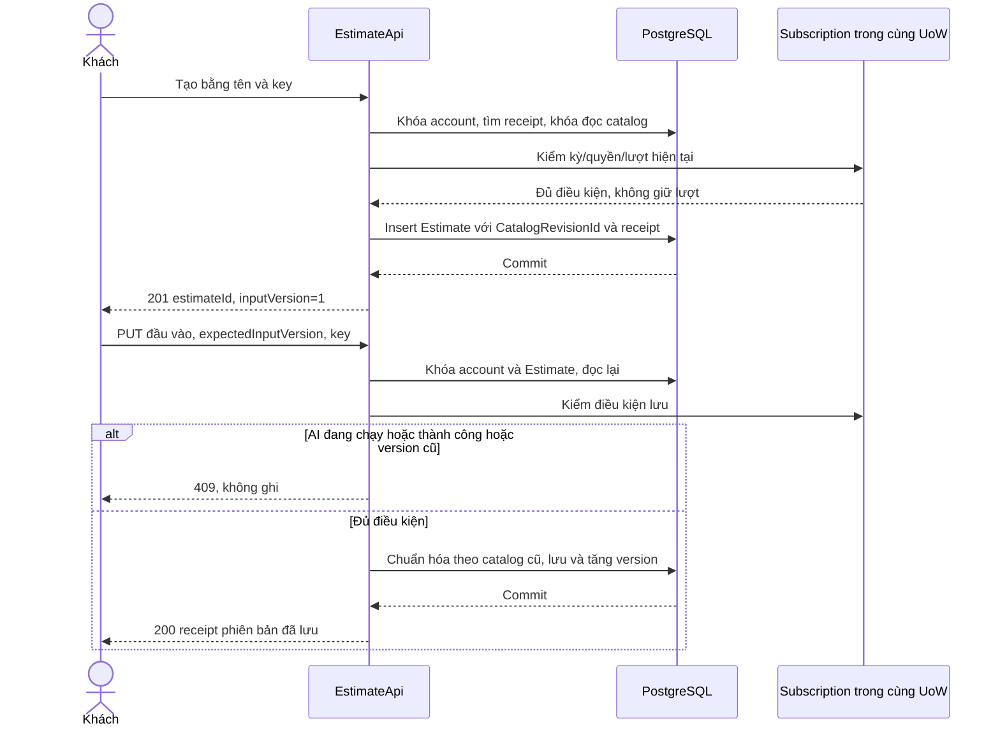
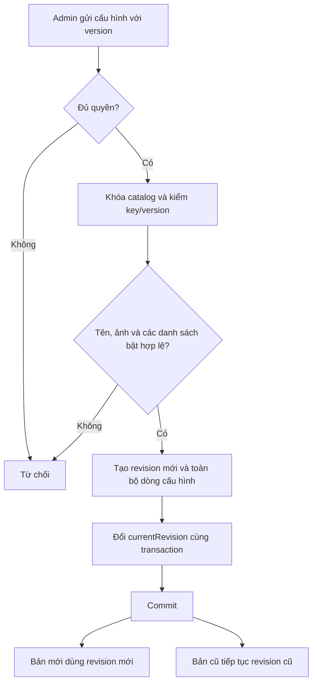
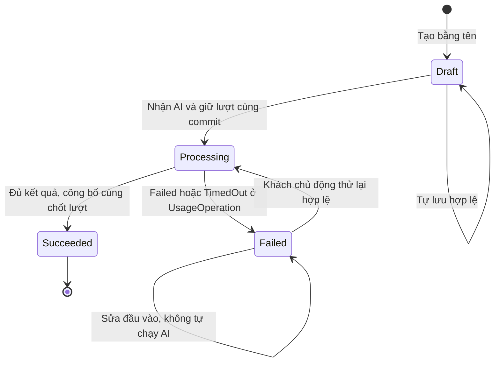
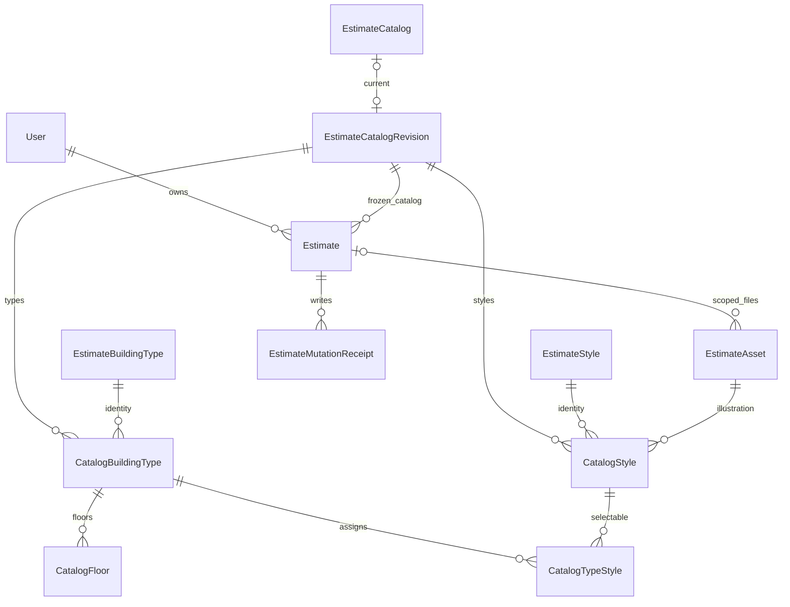

<!-- HƯỚNG DẪN CHO AI KHI ĐIỀN HOẶC CHỈNH SỬA MẪU
- Đọc toàn bộ mẫu, các comment hướng dẫn và tài liệu nguồn được cung cấp trước khi viết. Tuân thủ các quy tắc nghiệp vụ, điều kiện, ngoại lệ và giới hạn đã được xác nhận.
- Không bịa, tự chế hoặc suy đoán thành sự thật: yêu cầu, quy tắc, số liệu, API, schema, mã lỗi, nguồn tham khảo, người phụ trách và kết quả kiểm thử phải có căn cứ. Nội dung ví dụ trong mẫu không phải dữ kiện của dự án.
- Khi thiếu thông tin hoặc các nguồn mâu thuẫn, hỏi người dùng để làm rõ; giữ nguyên placeholder ở phần chưa xác định. Không tự chọn đáp án, lấp chỗ trống hay tuyên bố tài liệu đã hoàn tất.
- Chỉ thay nội dung cần điền hoặc được yêu cầu sửa. Không tự mở rộng phạm vi, sửa nghĩa quy tắc, bỏ điều kiện/ngoại lệ, xoá hay ghi đè nội dung hợp lệ đã có.
- Giữ nguyên tên, cấp và thứ tự heading, nhãn in đậm, tiền tố bullet, cấu trúc danh sách, tên/thứ tự/số cột bảng và cú pháp code fence. Không dịch, đổi tên, gộp hoặc thêm mục ngoài cấu trúc mẫu.
- Chỉ lặp khối luồng, AC hoặc API theo đúng khuôn khi có căn cứ; chỉ bỏ phần tuỳ chọn khi hướng dẫn riêng của mẫu cho phép và đã xác định không áp dụng.
- Mã tham chiếu và section phải trỏ tới tài liệu có thật đã được cung cấp hoặc kiểm chứng. Không giữ mã ví dụ như tham chiếu thật và không tự tạo tài liệu liên quan để hợp thức hoá liên kết.
- Giữ các comment hướng dẫn trong file. Xuất Markdown UTF-8, mỗi file một tài liệu; không bọc toàn bộ file trong code fence, không chèn lời dẫn hay giải thích ngoài mẫu.
- Trước khi bàn giao, đối chiếu nội dung với nguồn, kiểm tra cấu trúc, giá trị cho phép, giới hạn độ dài và tính nhất quán của mã/tham chiếu. Báo rõ phần chưa đủ thông tin; không tuyên bố đã chạy test hoặc import khi chưa thực hiện.
-->

<!-- Thay mã TDD-001 và nội dung ví dụ; giữ nguyên heading và nhãn in đậm.
Sơ đồ dùng mermaid, plantuml hoặc URL. Giữ heading Architecture, Sequence Diagram, Activity Diagram, State Diagram, Data Model.
Ví dụ API phải có heading trùng METHOD /path trong Endpoints. Xoá phần API/sơ đồ không dùng.
Version, Updated At và Change Log do lịch sử phiên bản quản lý, để trống khi nhập mới.
Author/Reviewer là tên hiển thị; gán tài khoản, phê duyệt, giả định và câu hỏi mở trên giao diện sau import.
Thiết kế phải truy vết về Story và Business Rule được cung cấp. Phân biệt thiết kế đề xuất với implementation đã kiểm chứng; không mô tả API/schema/sơ đồ ví dụ như hệ thống thật hoặc tự quyết định nghiệp vụ còn thiếu.
BẮT BUỘC KHI HOÀN THIỆN MẪU: phải có cả Reviewer và Approver, mỗi tên 1–200 ký tự sau khi bỏ khoảng trắng đầu/cuối. Không xoá hai dòng metadata, để trống, dùng tên bịa hoặc giữ placeholder rồi coi là hoàn tất.
Nếu chưa biết người review hoặc người phê duyệt, phải hỏi người dùng và báo tài liệu chưa đủ thông tin; không tự lấy Author/Owner làm người thay thế. Tên trong file không tự gán tài khoản hoặc xác nhận đã duyệt; gán thành viên trên giao diện sau import.
Đây là yêu cầu hoàn thiện mẫu; backend hiện vẫn nhận file cũ thiếu hai trường để tương thích.

VALIDATION CHO FILE NHẬP (đối chiếu ImportSnapshotValidator, MarkdownParser và ImportService):
- Mỗi file .md UTF-8 không rỗng chỉ có một heading cấp 1 chứa mã tài liệu dài 1–100 ký tự. Mã không được trùng trong cùng lần nhập hoặc thuộc loại tài liệu khác đã tồn tại.
- Không dùng tên README.md hoặc sitemap.md vì importer bỏ qua. Giao diện nhận .md/.zip, tối đa 2.000 file, tổng file tải lên 31 MiB; API giới hạn request 32 MiB và tổng nội dung đọc/giải nén 64 MiB.
- Chỉ nhập đè tài liệu cùng loại đang Draft, chưa có phiên bản và chưa lưu trữ. Import thay toàn bộ nội dung bản nháp, vì vậy phải giữ lại nội dung hợp lệ ngoài phần được yêu cầu sửa.
- Không dùng Status trong Markdown hoặc tên Approver để tự xác nhận phê duyệt; import không cấp quyền hay gán tài khoản từ tên. Chạy Kiểm tra file và xử lý lỗi/cảnh báo trước khi nhập.
- Giới hạn độ dài bên dưới tính theo string.Length của .NET (đơn vị UTF-16); không tự cắt ngắn dữ kiện quan trọng để vượt validation, hãy viết lại có căn cứ hoặc hỏi người dùng.
- Feature tối đa 300 ký tự và được dùng làm tiêu đề tài liệu. Status được parser nhận: Draft / In Review / Approved / Deprecated; tài liệu nhập mới vẫn có trạng thái phê duyệt Draft.
- Endpoint: đường dẫn tối đa 500 ký tự; tên/mô tả endpoint được lưu trong Name tối đa 300. HTTP method: GET / POST / PUT / PATCH / DELETE / HEAD / OPTIONS.
- Error Codes: mã tối đa 100 ký tự, không trùng trong tài liệu; giữ dạng - **CODE** (400): mô tả. HTTP status trong Error Codes và Response phải là số nguyên đọc được bằng Int32; không tự đặt status khác hợp đồng API.
- URL sơ đồ tối đa 1.000 ký tự. Mục sơ đồ được sử dụng phải có khối mermaid/plantuml hoặc URL theo mẫu; không để một mục sơ đồ rỗng. Nhãn mục được tách từ bullet như tên External API Fields tối đa 300 ký tự.
- Heading Examples phải khớp METHOD /path ở Endpoints. Giữ các nhãn Request:, Response 200: (thay mã theo contract) và Error Response: để parser tách đúng dữ liệu.
- Tham chiếu dạng DOC-KEY/section: ghi chú: mã đích tối đa 100 ký tự, section tối đa 100, ghi chú tối đa 1.000. Không trùng bộ mã đích + section + loại liên kết trong cùng tài liệu.
ĐỐI CHIẾU FORM TDD (src/features/tdds/validations.ts; form có thể chặt hơn import):
- Điền Feature, Author, Reviewer, Problem và ít nhất một Goal; các Goal/Non-goal/Notes đã thêm không được rỗng. API đã khai báo phải có endpoint và mô tả/mục đích; Fields phải có tên và ý nghĩa; Error Codes phải có mã, HTTP status và điều kiện.
- Form còn kiểm tra Version, Updated At và nội dung Change Log khi khai báo; với file nhập mới, giữ các trường lịch sử này trống theo hợp đồng import, không tự tạo dữ liệu lịch sử.
-->

# TDD-PROJ-001

## Document Info

- **Feature**: Tạo dự toán — danh mục có phiên bản, nhập liệu và tự lưu
- **Author**: Codex
- **Reviewer**: Tân Trần
- **Approver**: Tân Trần
- **Status**: Draft
- **Version**:
- **Updated At**:

## Context & Goals

### Problem

Người dùng đã chốt US/BR cho cả ba bước Tạo dự toán. Tài liệu này thiết kế STORY-PROJ-001 và STORY-PROJ-005; gửi AI ở TDD-PROJ-002, hồ sơ/chia sẻ ở TDD-PROJ-003. Mã PROJ được giữ để bảo toàn tham chiếu, nhưng entity mới là `Estimate`, route là `/estimates`. Không tạo bảng `Project`, không liên kết bản dự toán với gói giám sát hoặc phân công công trình của tính năng tương lai.

Hiện trạng đã kiểm tra: .NET 8, EF Core/Npgsql 8.0.0, PostgreSQL 15 trong compose; `ApplicationDbContext` chỉ có User. Carter, MediatR, FluentValidation và xác thực cookie/JWT đang có; chưa có danh mục, dự toán, lưu tệp, RBAC đầy đủ hoặc subscription. Các bảng, lớp và API dưới đây đều là thiết kế đề xuất. TDD-SUB-002/TDD-PAY-001/TDD-RBAC-001 là nguồn thiết kế dùng lại, không phải module đã triển khai.

**Đã xác nhận**: tạo bằng tên, tự lưu bản nháp chưa đủ; một diện tích chung; một ảnh hoặc mô tả; cấu hình tầng/tum và hai nhóm phong cách; giữ toàn bộ danh mục của bản cũ; kiểm tra quyền/quota khi tạo và lưu nhưng không giữ/trừ lượt. Bổ sung ngày 21/09/2026: tên loại công trình/phong cách có nội dung sau trim, tối đa 200 ký tự, cho phép trùng tên.

**Đề xuất chưa chốt**: schema/API, phiên bản danh mục bất biến, kiểm soát cập nhật đồng thời và quy ước biểu diễn ở dưới. **Cần làm rõ trước tích hợp**: nguồn dữ liệu tỉnh/xã, nhà cung cấp lưu tệp, cấu hình vận hành và hợp đồng AI. Phạm vi đã đọc và giới hạn rà soát tham chiếu được ghi trong bảng bàn giao thiết kế; chưa coi toàn bộ chuỗi tài liệu ngoài PROJ đã được kiểm chứng nội dung.

### Goals

- Tạo/lưu không làm thay quota; kiểm quyền và ghi đầu vào trong cùng giao dịch database.
- Mỗi bản giữ đúng phiên bản danh mục đã chọn lúc tạo; Admin không sửa lịch sử đang được bản cũ sử dụng.
- Yêu cầu đến muộn hoặc từ tab khác không âm thầm ghi đè đầu vào đã lưu; đang chạy/đã thành công không sửa được.
- Lỗi ảnh hoặc lỗi lưu không làm mất ảnh cũ. Không đưa tệp chưa kiểm tra vào đầu vào AI.

### Non-goals

- Viết frontend, triển khai code/migration, tạo phong cách mẫu, chạy AI hoặc gửi email thật trong tác vụ thiết kế.
- Quản lý dự án/công trình tương lai, giám sát, xóa/ngừng dùng danh mục, chuyển bản cũ sang danh mục mới.
- Thêm ghi chú riêng, bảng đơn giá, công thức dự toán hoặc quyền AI theo cờ phong cách.

## Architecture

Giữ các module trong cùng ứng dụng và PostgreSQL để quyền/quota và đầu vào có thể được kiểm tra cùng một giao dịch. Không thêm broker, tenant hoặc database riêng.

| Thành phần dự kiến | Trách nhiệm và vị trí |
|---|---|
| EstimateApi, EstimateCatalogAdminApi | Carter tại `presentation/apis/estimates/` và `estimateCatalog/`; xác thực rồi chuyển DTO sang MediatR. |
| CreateEstimateHandler, SaveEstimateInputHandler | `application/usecases/commands/estimates/`; lấy chủ sở hữu từ phiên, kiểm quyền/quota/phiên bản, ghi dữ liệu và biên nhận cùng giao dịch. |
| SaveBuildingTypeHandler, SaveStyleHandler | `application/usecases/commands/estimateCatalog/`; kiểm quyền Admin, tạo phiên bản danh mục mới, cập nhật con trỏ sau khi kiểm toàn bộ cấu hình. |
| EstimateInputPolicy, CatalogConfigurationPolicy | Domain thuần: chuyển loại/tỉnh, kiểm dữ liệu đã nhập, kiểm đầy đủ trước AI, kiểm danh sách bật không rỗng. |
| IEstimateStore, IEstimateCatalogStore | Persistence dùng cùng DbContext/UoW, projection chỉ đọc dùng AsNoTracking. Khóa và ràng buộc nằm tại đây. |
| IEstimateWriteAccess | Adapter vào subscription: kiểm kỳ hiện tại Active, thời hạn, quyền design.generate và lượt sẵn dùng; không tự tạo kỳ/quota. |
| ILocationCatalog | Đọc tập địa chỉ được duyệt và kiểm xã thuộc tỉnh; chưa chọn nguồn. Không tin tên/mã tự khai từ client. |
| IEstimateAssetStore | Đọc/ghi bytes ở kho riêng tư; metadata ở PostgreSQL. Nhà cung cấp chưa chọn; không giả định backend đã có S3. |



**Notes**:

- **Phiên bản danh mục bất biến**: mỗi lần Admin lưu hợp lệ tạo một `EstimateCatalogRevision` và bộ dòng cấu hình mới. Bản dự toán giữ FK tới revision tại lúc tạo. Ví dụ D1 giữ V1, Admin đổi tên ảnh thành V2 thì D1 vẫn đọc V1; D2 mới dùng V2. Copy toàn bộ cấu hình của revision là lựa chọn đơn giản để kiểm ràng buộc; đổi lại tốn dữ liệu theo số lần Admin lưu. Chưa có tải để cần lưu phần chênh lệch. Không có bước duyệt/công bố mới trên giao diện: lưu hợp lệ là cập nhật revision hiện hành.
- Khóa singleton `EstimateCatalog` khi Admin lưu; `expectedCatalogVersion` ngăn ghi đè thay đổi Admin khác. Tạo bản dự toán đọc con trỏ bằng FOR SHARE trong giao dịch, gắn revision rồi commit; Admin đổi con trỏ bằng FOR UPDATE phải chờ. Mốc tạo được xác định tại giao dịch này, không lấy đồng hồ client. Không bao giờ cập nhật những dòng cấu hình của revision đã commit.
- **Thống nhất khóa thương mại**: dùng `AccountCommerceState` của TDD-PAY-001, không tạo một khóa riêng cho quota dự toán. Thứ tự của luồng này: AccountCommerceState → EstimateCatalog (chỉ lúc tạo, khóa đọc) → Estimate → DesignSubscription → DesignPeriod → PeriodQuota → UsageOperation → dữ liệu con/receipt. Thao tác Admin chỉ khóa catalog, không xin khóa account thương mại. Luồng thanh toán/hủy/gán phải cùng lấy AccountCommerceState trước dữ liệu tài khoản; không giữ khóa catalog rồi quay lại xin khóa thương mại. TDD-SUB-002 còn mô tả khóa User là thiết kế cũ, cần dùng phụ lục phối hợp trong TDD-PROJ-002 khi triển khai.
- `AccountCommerceState` được tạo bằng insert-on-conflict-do-nothing rồi khóa; hành động này không cấp subscription. Kiểm quyền trước sửa; sau khi chờ khóa phải đọc lại dữ liệu và lấy `EffectiveNow` từ đồng hồ server. Dùng FOR UPDATE chỉ trong giao dịch ngắn, không giữ khóa khi tải ảnh/HTTP. [PostgreSQL 15 — row locks](https://www.postgresql.org/docs/15/explicit-locking.html#LOCKING-ROWS).
- **Tự lưu và phiên bản**: `InputVersion` tăng mỗi lần ghi đầu vào thành công, không tăng khi gửi AI hoặc đọc. PUT gửi toàn bộ đầu vào và `expectedInputVersion`; sai phiên bản trả 409, giữ cả bản đã lưu lẫn nội dung chưa lưu ở trang. Frontend chỉ có một yêu cầu lưu đang chờ; gộp thay đổi mới để gửi sau phản hồi. Không tự dùng phiên bản mới để ghi đè khi có xung đột từ tab khác: đọc lại và cho khách xem nội dung trước khi tiếp tục.
- **Chống gửi lặp**: create/save có Idempotency-Key (1–100 ký tự). `EstimateMutationReceipt` lưu key, SHA-256 của DTO chuẩn hóa, estimateId, phiên bản kết quả. Cùng actor/thao tác/key và cùng hash trả receipt cũ; khác hash trả 409. Xác thực và ownership luôn chạy trước replay. Replay không ghi lại đầu vào nên không đòi quota để thực hiện lại một lần lưu đã commit; response chỉ xác nhận phiên bản đã lưu, client GET để lấy hiện trạng. Yêu cầu chưa từng commit vẫn kiểm toàn bộ quyền/quota/khóa hiện tại. Không replay tự động yêu cầu trước đã bị từ chối vì quyền/lượt.
- Lưu danh mục cũng kiểm chống gửi lặp trước expectedCatalogVersion sau khi xác thực quyền quản trị. Hash gồm thao tác, ID mục được sửa (nếu có), phiên bản mong đợi và DTO đã chuẩn hóa. Revision lưu key/hash và target đã tạo/sửa; cùng key/hash trả đúng revision/target cũ, khác hash trả 409. Không tạo revision mới chỉ vì client mất phản hồi.
- Không gọi MediatR command con tự commit bên trong command đang có transaction. Mọi lệnh ghi đánh dấu `ITransactionalRequest`; store/subscription cùng scoped UoW. Hiện UoW đăng ký transient và pipeline commit cả Result.Failure: cần đổi scoped, ném exception khi từ chối sau sửa để rollback. Ghi lại thiết kế này trong hạng mục nền tảng và kiểm hồi quy auth khi triển khai. [EF Core — transactions](https://learn.microsoft.com/en-us/ef/core/saving/transactions).
- **Thay ảnh**: upload một tệp ngoài SQL, nhận diện nội dung thật, ghi object bất biến và xác nhận đọc được; sau đó ghi asset metadata. PUT đầu vào mới gắn assetId trong transaction kiểm lại quyền, purpose, estimateId, phiên bản và khóa. Trước commit ảnh cũ vẫn được dùng. File chưa gắn hoặc file mất phản hồi không thành ảnh đầu vào; chưa tự xóa file cũ còn được snapshot tác vụ hoặc revision tham chiếu. Chính sách dọn file mồ côi chờ vận hành, không xóa theo một TTL tự đặt.
- Backend áp dụng chuẩn hóa đổi loại trên dữ liệu cũ trước, rồi áp các trường được gửi trong DTO: chỉ giữ giá trị cũ hợp lệ trong loại mới; dữ liệu mới được khách chọn phải hợp lệ. Để tránh coi giá trị cũ vô hiệu là lựa chọn mới, client gửi `changedFields` với PUT; backend chỉ áp các trường trong danh sách đó như lựa chọn chủ động. Các trường không có trong changedFields phải khớp bản đã lưu tại expectedInputVersion trước chuẩn hóa, nếu khác thì trả 422; sau chuẩn hóa không áp lại các giá trị cũ vừa bị xóa. Hash chống lặp bao gồm expectedInputVersion, input và changedFields đã sắp xếp, loại trùng. Đổi tỉnh luôn xóa xã cũ; nếu cùng PUT chọn xã mới thì kiểm xã đó thuộc tỉnh mới. Không đổi diện tích/địa chỉ chi tiết/ảnh/mô tả vì đổi loại. Response GET sau lưu là dữ liệu đã chuẩn hóa.
- Bản nháp được NULL các trường bắt buộc trước AI, nhưng dữ liệu có giá trị phải hợp lệ. Nhóm phong cách tắt luôn lưu NULL; bật yêu cầu đúng một lựa chọn khi gửi AI. Tầng bật yêu cầu một giá trị trong danh sách; tum bật yêu cầu boolean có giá trị, false khác NULL. Không tự chọn phong cách hoặc Có/Không tum.
- Quy ước kỹ thuật đề xuất: 1 MB = 1.000.000 byte; ảnh đầu vào ≤10.000.000, ảnh phong cách ≤5.000.000 byte. Giới hạn tính bytes thực, không chỉ Content-Length. Chuỗi đếm Unicode scalar (Rune), không đếm UTF-16 như giới hạn nhập tài liệu; không tự đổi chuẩn Unicode. Tên trim khoảng trắng đầu/cuối, mô tả giữ nội dung gốc nhưng whitespace-only không đáp ứng điều kiện mô tả.
- Diện tích dùng `numeric(28,2)`/C# decimal; JSON gửi chuỗi thập phân như `"70.25"` để không mất chính xác trong JavaScript. Validator kiểm chuỗi số trước chuyển kiểu: tối đa 26 chữ số phần nguyên, 0–2 phần lẻ, >0, không exponent/NaN/Infinity. Đây là giới hạn biểu diễn, không trần diện tích nghiệp vụ; từ chối thay vì làm tròn. PostgreSQL có thể làm tròn khi ép vào numeric có scale, nên kiểm trước ghi là bắt buộc. [PostgreSQL 15 — numeric](https://www.postgresql.org/docs/15/datatype-numeric.html).
- Danh mục địa chỉ là phụ thuộc riêng. Adapter trả `datasetVersion, provinceCode/name, wardCode/name`; backend lưu giá trị đã xác minh. Thay địa chỉ phải kiểm tập dữ liệu tương ứng; nguồn chưa sẵn sàng thì không nhận địa chỉ giả. Việc xử lý xã đã bị ngừng dùng trong bản cũ còn mở; không suy ra quy tắc giữ catalog loại/phong cách cũng áp dụng địa giới.
- Cookie hiện có SameSite=None khi HTTPS. Các mutation mới phải kiểm antiforgery token và Origin hợp lệ, gồm multipart; không dùng CORS thay CSRF. Thêm endpoint cấp request token cho phiên và chia sẻ Data Protection keyring giữa instance trước triển khai. GET công khai dùng token chia sẻ không dùng cookie quyền khách. [ASP.NET Core 8 — antiforgery](https://learn.microsoft.com/en-us/aspnet/core/security/anti-request-forgery?view=aspnetcore-8.0).
- Quyền khách: verified session + AccountKind=Customer + ownership. Quyền quản trị danh mục dùng policy verified Staff có quyền `estimate.catalog.manage` theo RBAC; seed permission này cho vai trò hệ thống Admin, không cho mọi nhân viên. Không dùng role Admin để bỏ qua các điều kiện của tài khoản khách. Việc gán quyền cho vai trò nhân viên khác vẫn theo quy trình RBAC, không tự cấp ở tính năng này.

## Sequence Diagram



## Activity Diagram



## State Diagram



Trạng thái bản dự toán là giá trị đọc từ UsageOperation gần nhất theo TDD-PROJ-002, không thêm cột trạng thái thứ hai để hai nơi lệch nhau. Chưa có operation thì Draft; Pending hiển thị Processing; Failed/TimedOut hiển thị thất bại với mã lý do. Khả năng sửa còn phụ thuộc quyền hiện tại.

## Data Model

PK là khóa chính, FK là khóa ngoại, NN là bắt buộc. Mọi ID mới là uuid, thời gian timestamptz/UTC, bảng/cột PascalCase theo ánh xạ hiện có. Các bảng lịch sử không kế thừa cơ chế xóa mềm của Entity nếu dẫn đến lọc mất dữ liệu cũ. Không có API xóa trong phạm vi này; tất cả FK dùng ON DELETE RESTRICT trừ khi mô tả khác.

| Bảng | Một dòng lưu việc gì, ai ghi, ý nghĩa NULL |
|---|---|
| EstimateCatalog | Một đầu mối danh mục toàn hệ thống; Admin đổi con trỏ khi lưu. CurrentRevisionId NULL khi chưa thiết lập, khi đó chưa cho tạo bản dự toán. |
| EstimateCatalogRevision | Một lần Admin lưu cấu hình hợp lệ. Gồm actor, parent, key/hash để replay; bất biến sau commit. Parent NULL ở bản đầu. |
| EstimateBuildingType | Danh tính ổn định của một loại; tên và cờ nằm trong revision, không lưu tên hiện hành tại đây. |
| EstimateStyle | Danh tính phong cách và nhóm Architecture/Interior bất biến. Chuyển nhóm là tạo phong cách khác, không sửa nhóm làm hỏng lịch sử. |
| CatalogBuildingType | Cấu hình của một loại trong một revision: tên, bốn cờ cho chọn tầng/tum/kiến trúc/nội thất. |
| CatalogStyle | Tên và một ảnh của phong cách trong revision. Không NULL ảnh. Cùng StyleId có tên/ảnh khác ở revision khác. |
| CatalogFloor | Một số tầng được cho chọn cho một loại trong revision; 1 nghĩa là Trệt, 3 là Trệt + 2 lầu. Tum tách riêng, không cộng vào số này. |
| CatalogTypeStyle | Một phong cách được gán cho một loại ở một nhóm trong revision. Bảng nối nhiều–nhiều, không lưu danh sách ID bằng chuỗi. |
| Estimate | Một bản dự toán thuộc một khách, giữ revision và đầu vào hiện tại. Ngoài tên, các đầu vào được NULL khi chưa nhập. Không lưu quota hoặc đơn giá. |
| EstimateAsset | Một object đã tải, kiểm định dạng và đọc lại được. Metadata được ghi sau upload; Purpose phân biệt Input/Style/Result/Export. EstimateId NULL chỉ với ảnh Style. Bytes ở kho riêng tư, không lưu URL công khai. |
| EstimateMutationReceipt | Một lần tạo/lưu đã commit. Dùng khi mất phản hồi, không phải lịch sử mọi ký tự gõ. Mỗi receipt thuộc đúng một Estimate. |

| Bảng | Cột, kiểu và ràng buộc |
|---|---|
| EstimateCatalog | Id smallint PK CHECK=1; CurrentRevisionId uuid NULL FK revision; Version bigint NN CHECK>=0. |
| EstimateCatalogRevision | Id uuid PK; Number bigint NN UNIQUE CHECK>0; ParentId uuid NULL FK revision; CreatedBy uuid NN FK User; CreatedAtUtc timestamptz NN; Operation varchar(32) NN CHECK=Bootstrap/AddType/UpdateType/AddStyle/UpdateStyle; MutationKey varchar(100) NN; RequestHash char(64) NN; TargetBuildingTypeId uuid NULL FK EstimateBuildingType; TargetStyleId uuid NULL FK EstimateStyle; UNIQUE(CreatedBy,Operation,MutationKey). CHECK Bootstrap không có target, AddType/UpdateType chỉ có TargetBuildingTypeId, AddStyle/UpdateStyle chỉ có TargetStyleId. Hai target phục vụ trả đúng kết quả khi gửi lặp. |
| EstimateBuildingType | Id uuid PK; CreatedAtUtc timestamptz NN. |
| EstimateStyle | Id uuid PK; Group varchar(16) NN CHECK IN (Architecture,Interior); CreatedAtUtc timestamptz NN; UNIQUE(Id,Group). |
| CatalogBuildingType | RevisionId uuid NN FK revision; BuildingTypeId uuid NN FK type; Name varchar(200) NN CHECK char_length(Name)>0; FloorsEnabled, TumEnabled, ArchitectureEnabled, InteriorEnabled boolean NN; PK(RevisionId,BuildingTypeId). Trim/whitespace kiểm ở domain. Không UNIQUE Name. |
| CatalogStyle | RevisionId uuid NN FK revision; StyleId uuid NN; Group varchar(16) NN; Name varchar(200) NN CHECK char_length(Name)>0; ImageAssetId uuid NN FK asset; PK(RevisionId,StyleId); UNIQUE(RevisionId,StyleId,Group); FK(StyleId,Group) tới EstimateStyle. Purpose=Style của ảnh kiểm trong transaction. Không UNIQUE Name. |
| CatalogFloor | RevisionId uuid NN; BuildingTypeId uuid NN; FloorCount int NN CHECK>=1; PK(RevisionId,BuildingTypeId,FloorCount); FK(RevisionId,BuildingTypeId) tới CatalogBuildingType. Giới hạn int là giới hạn kỹ thuật, không trần tầng nghiệp vụ. |
| CatalogTypeStyle | RevisionId,BuildingTypeId,StyleId uuid NN; Group varchar(16) NN; PK(RevisionId,BuildingTypeId,Group,StyleId); FK(RevisionId,BuildingTypeId) tới CatalogBuildingType; FK(RevisionId,StyleId,Group) tới CatalogStyle. |
| Estimate | Id uuid PK; OwnerId uuid NN FK User; CatalogRevisionId uuid NN FK revision; Name varchar(200) NN; InputVersion bigint NN DEFAULT 1 CHECK>0; CreatedAtUtc,ModifiedAtUtc timestamptz NN; BuildingTypeId uuid NULL; AreaM2 numeric(28,2) NULL CHECK NULL OR >0; Description varchar(500) NULL; ProvinceCode,ProvinceName,WardCode,WardName,LocationDatasetVersion,AddressDetail text NULL; FinishPackage varchar(16) NULL CHECK Basic/Standard/Vip; FloorCount int NULL; HasTum boolean NULL; ArchitectureStyleId,InteriorStyleId,InputAssetId uuid NULL. UNIQUE(OwnerId,Id), UNIQUE(Id,CatalogRevisionId). Name phải có nội dung sau trim. |
| EstimateAsset | Id uuid PK; CreatedBy uuid NULL FK User; EstimateId uuid NULL FK Estimate; Purpose varchar(16) NN CHECK Input/Style/Result/Export; StorageKey text NN UNIQUE; MediaType varchar(100) NN; SizeBytes bigint NN CHECK>0; Sha256 char(64) NN; CreatedAtUtc timestamptz NN; CHECK (Purpose=Style AND EstimateId IS NULL) OR (Purpose<>Style AND EstimateId IS NOT NULL); UNIQUE(Id,EstimateId). CHECK Purpose thuộc Input/Style thì CreatedBy NOT NULL; Result/Export do worker tạo thì CreatedBy NULL. Không lưu trạng thái Ready giả trước khi object hợp lệ. |
| EstimateMutationReceipt | Id uuid PK; ActorId uuid NN FK User; EstimateId uuid NN; Operation varchar(16) NN CHECK Create/Save; RequestKey varchar(100) NN; RequestHash char(64) NN; ResultInputVersion bigint NN; CreatedAtUtc timestamptz NN; UNIQUE(ActorId,Operation,RequestKey); FK(ActorId,EstimateId) tới Estimate(OwnerId,Id). |

Ràng buộc bổ sung của Estimate: FK `(CatalogRevisionId,BuildingTypeId)` tới CatalogBuildingType; FK `(CatalogRevisionId,BuildingTypeId,FloorCount)` tới CatalogFloor. Hai cột nhóm cố định `ArchitectureGroup varchar(16) NN DEFAULT Architecture CHECK=Architecture` và `InteriorGroup ... Interior` phục vụ FK ghép từ mỗi lựa chọn tới CatalogTypeStyle đúng nhóm. FK `(InputAssetId,Id)` tới EstimateAsset `(Id,EstimateId)`. CHECK BuildingTypeId NULL thì tầng/tum/phong cách phải NULL; WardCode NULL đồng thời WardName NULL; nếu có ward phải có tỉnh và datasetVersion. Cặp code/name tỉnh cùng NULL hoặc cùng có giá trị. Giá trị địa chỉ chi tiết được nhập độc lập từ bản nháp. Snapshot tên địa chỉ là dữ liệu lịch sử đã xác minh, không phải nguồn danh mục địa chỉ mới.

FK không tự kiểm cờ bật/tắt hoặc số phần tử danh sách. CatalogConfigurationPolicy kiểm tất cả dòng của revision mới trong cùng transaction trước đổi con trỏ. EstimateInputPolicy kiểm theo revision đã ghim. Quyền ghi SQL trực tiếp không được bỏ qua các policy này; kiểm thử constraint không thay kiểm thử policy.



Quan hệ current trong sơ đồ chỉ là con trỏ, không có nghĩa xóa các revision không còn current. Một revision chứa các dòng con bắt buộc có cha; một type/style có thể hiện diện ở nhiều revision. Một Estimate có 0 hoặc 1 ảnh đầu vào qua InputAssetId nhưng có nhiều asset lịch sử hoặc chưa gắn. User, AccountCommerceState và các bảng quyền/gói dùng lại schema và mẫu tại TDD-RBAC-001/Data Model, TDD-PAY-001/Data Model và TDD-SUB-002/Data Model.

**Mẫu lưu trữ xuyên suốt** — dữ liệu giả định, các ký hiệu U1/A1/V1/B1/K1/N1/F1/D1 là bí danh UUID, không phải SQL seed. Trích cột; cột NN bị lược vẫn phải ghi khi triển khai. T1=2026-09-21T03:00:00Z.

| Bảng | Dòng minh họa |
|---|---|
| EstimateCatalog | Id=1; CurrentRevisionId=V1; Version=1. |
| EstimateCatalogRevision | Id=V1; Number=1; ParentId=NULL; CreatedBy=A1; CreatedAtUtc=T1; Operation=Bootstrap; TargetBuildingTypeId=NULL; TargetStyleId=NULL; MutationKey=bootstrap-1; RequestHash=H1 (bí danh hash 64 ký tự). |
| EstimateBuildingType | Id=B1; CreatedAtUtc=T1. |
| EstimateStyle | Hai dòng: K1/Architecture và N1/Interior; CreatedAtUtc=T1. |
| EstimateAsset | F1: CreatedBy=A1; EstimateId=NULL; Purpose=Style; StorageKey=style/f1; MediaType=image/jpeg; SizeBytes=120000; Sha256=HF1; CreatedAtUtc=T1. F2 tương tự, key=style/f2, MediaType=image/webp, SizeBytes=140000, Sha256=HF2. |
| CatalogBuildingType | V1/B1; Name=Nhà phố; bốn cờ đều true. Các loại ban đầu khác được lược khỏi ví dụ. |
| CatalogStyle | V1/K1/Architecture/“Kiến trúc thử”/F1; V1/N1/Interior/“Nội thất thử”/F2. Đây là dữ liệu Admin tự nhập. |
| CatalogFloor | Hai dòng V1/B1/1 và V1/B1/3. |
| CatalogTypeStyle | V1/B1/Architecture/K1 và V1/B1/Interior/N1. |
| Estimate — vừa tạo | D1; OwnerId=U1; CatalogRevisionId=V1; Name=Nhà A; InputVersion=1; CreatedAtUtc=ModifiedAtUtc=T1; các đầu vào khác NULL. |
| EstimateMutationReceipt — create | RCP1; ActorId=U1; EstimateId=D1; Operation=Create; RequestKey=create-1; RequestHash=HC1; ResultInputVersion=1; CreatedAtUtc=T1. |
| Estimate — sau tự lưu | D1; InputVersion=2; BuildingTypeId=B1; AreaM2=70.25; Description=Nhà hai phòng ngủ; FloorCount=3; HasTum=false; ArchitectureStyleId=K1; InteriorStyleId=N1; FinishPackage=Standard; địa chỉ còn NULL nên chưa gửi AI. |
| EstimateMutationReceipt — save | RCP2; ActorId=U1; EstimateId=D1; Operation=Save; RequestKey=save-1; RequestHash=HS1; ResultInputVersion=2. |

Admin sửa tên K1 ở V2: tạo revision V2 ParentId=V1, sao chép cấu hình, chỉ thay CatalogStyle V2/K1; singleton trỏ V2. D1 giữ V1/K1. D2 tạo sau commit mới ghim V2. Không UPDATE dòng V1/K1. Nếu upload ảnh F3 lỗi, không có CatalogStyle nào trỏ F3; nếu lưu revision lỗi, singleton vẫn V1. Với ảnh đầu vào, F4 có EstimateId=D1/Purpose=Input; chỉ PUT thành công mới đặt D1.InputAssetId=F4.

**Notes**:

- Chuẩn hóa: tên/cờ phụ thuộc `(RevisionId,BuildingTypeId)`; tên/ảnh phong cách phụ thuộc `(RevisionId,StyleId)`; dòng gán không lặp tên/ảnh. Nhóm lặp trong FK và cột nhóm cố định có ràng buộc để ngăn chéo nhóm. Snapshot qua revision là chủ ý giữ lịch sử, không phải dữ liệu hiện hành bị lặp rồi cần đồng bộ. InputVersion/receipt là metadata điều phối, không bảng quota thứ hai.
- Index: PK ghép phục vụ đọc cả revision và kiểm lựa chọn; thêm CatalogStyle(ImageAssetId), Estimate(OwnerId,ModifiedAtUtc DESC,Id), EstimateAsset(EstimateId,CreatedAtUtc), receipt unique key như trên. Không thêm index đơn trùng tiền tố PK. Chưa thiết kế API danh sách/lọc phức tạp ngoài nhu cầu mở lại bản theo ID.
- Bootstrap: Admin phải chuẩn bị năm loại ban đầu và phong cách trước khi mở tính năng cho khách. Endpoint lưu từng loại/phong cách tạo revision hợp lệ; nút bật tính năng ở cấu hình triển khai chỉ mở sau kiểm dữ liệu đủ, không tự seed phong cách/tầng theo ảnh chụp. Revision đầu có thể đang được chuẩn bị bởi Admin; khi cổng tạo khách chưa mở thì không có bản nháp ghim một catalog thiết lập dở.
- Migration chỉ là kế hoạch: xác minh DB đích; triển khai nền RBAC/subscription/AccountCommerceState trước; thêm asset/catalog/estimate/receipt theo thứ tự FK; tạo FK vòng nullable sau bảng; kiểm quyền và cấu hình rồi mới mở route khách. Chưa có module Estimate trong code không chứng minh DB production trống. Nếu có Project cũ, không đổi tên/backfill sang Estimate khi chưa xác nhận ý nghĩa. Không chạy migration lúc khởi động. Khi lỗi triển khai, tắt nhận yêu cầu mới và quay code tương thích; không DROP dữ liệu/receipt/revision đang tham chiếu để rollback.
- Các cấu hình chưa có số liệu: debounce frontend, dung lượng request JSON/header, giới hạn pixel khi giải mã, timeout kho tệp, retention, RPO/RTO và tải. Đặt trước production sau đo/đối chiếu hạ tầng; không đưa con số giả thành SLA. Không giới hạn số loại/phong cách theo danh sách mẫu.
- Kiểm chứng: ST-PROJ-001–020, 048–056 và 058; integration PostgreSQL cho stale version, create-vs-admin-save, đổi loại sai FK, fail trước commit, cập nhật đồng thời với giữ lượt; browser cho dữ liệu chưa lưu và retry. Chưa viết Unit Test chi tiết trước khi người dùng chốt TDD.

## Internal API

### Endpoints

Tất cả route dưới đây là đề xuất v1. Response JSON thành công dùng envelope `Result<T>` hiện có; ví dụ chỉ lược trường trong value khi đã ghi rõ. Unknown JSON members bị từ chối cho DTO mutation, không bind EF entity. OwnerId/quota/revision hiệu lực do server quyết định.

- **GET** `/api/v1/antiforgery/token` — Phiên verified lấy request token; no-store. Mutation dùng cookie phải gửi X-CSRF-Token hợp lệ, token không thay quyền sở hữu.
- **POST** `/api/v1/estimates` — `{name}` + Idempotency-Key; 201 `{estimateId,inputVersion}`. Kiểm quyền tạo, ghim catalog hiện hành; cùng key trả receipt cũ.
- **GET** `/api/v1/estimates/{estimateId}` — Chủ sở hữu đọc `{estimateId,inputVersion,catalogRevisionId,input,state,canEdit,writeDeniedCode,missingFields}`; hết gói vẫn xem được. canEdit chỉ gợi ý, mutation kiểm lại.
- **GET** `/api/v1/estimates/{estimateId}/catalog` — Chủ sở hữu đọc snapshot danh mục của bản, gồm loại/cờ/danh sách tầng/hai nhóm tên-ảnh. Không trả catalog hiện hành thay thế.
- **PUT** `/api/v1/estimates/{estimateId}/input` — `{expectedInputVersion,changedFields,input}` + key; 200 `{estimateId,savedInputVersion}`. Input đủ tất cả trường DTO, NULL nghĩa chưa nhập; changedFields xác định trường chủ động sửa, không cho sửa field ngoài danh sách. Đọc lại GET sau thành công để lấy chuẩn hóa; không gọi AI.
- **POST** `/api/v1/estimates/{estimateId}/input-assets` — Multipart đúng một file; kiểm sơ bộ quyền trước upload và kiểm lại khi ghi metadata. 201 `{assetId,sizeBytes,mediaType}` chưa đồng nghĩa ảnh đã gắn. PUT input mới gắn.
- **GET** `/api/v1/estimates/{estimateId}/assets/{assetId}` — Chủ sở hữu tải ảnh đầu vào thuộc bản; kiểm assetId khớp estimateId và được phép đọc, không trả file Result/Export chưa công bố qua route này.
- **GET** `/api/v1/estimate-locations/provinces` — Phiên verified nhận version và danh sách tỉnh từ nguồn đã cấu hình; chưa có nguồn thì 503.
- **GET** `/api/v1/estimate-locations/provinces/{provinceCode}/wards` — Phiên verified, query datasetVersion; chỉ trả xã/phường thuộc tỉnh trong dataset đó.
- **GET** `/api/v1/admin/estimate-catalog` — Quyền estimate.catalog.manage, trả cấu hình hiện hành và catalogVersion.
- **POST** `/api/v1/admin/estimate-catalog/style-assets` — Admin upload đúng một JPG/PNG/WebP; 201 assetId. Không tự tạo phong cách vì upload thành công.
- **POST** `/api/v1/admin/estimate-catalog/building-types` — `{expectedCatalogVersion,name,floorsEnabled,tumEnabled,architectureEnabled,interiorEnabled,floorCounts,architectureStyleIds,interiorStyleIds}` + key; thêm identity và revision, 201 `{buildingTypeId,catalogRevisionId,catalogVersion}`.
- **PUT** `/api/v1/admin/estimate-catalog/building-types/{buildingTypeId}` — Cùng DTO/key, sửa cấu hình qua revision mới, 200 cùng dạng kết quả. Mọi mảng không có phần tử trùng; nhóm bật phải có lựa chọn phù hợp.
- **POST** `/api/v1/admin/estimate-catalog/styles` — `{expectedCatalogVersion,group,name,imageAssetId}` + key; group Architecture/Interior, 201 `{styleId,catalogRevisionId,catalogVersion}`.
- **PUT** `/api/v1/admin/estimate-catalog/styles/{styleId}` — `{expectedCatalogVersion,name,imageAssetId}` + key; giữ group, 200 cùng dạng kết quả.
- **GET** `/api/v1/estimate-style-assets/{assetId}` — Phiên verified chỉ đọc Purpose=Style đã được catalog tham chiếu; không cho truy cập Input/Result/Export bằng ID. Bản cũ vẫn xem được ảnh cũ.

DTO input gồm `name,buildingTypeId,areaM2,description,provinceCode,wardCode,locationDatasetVersion,addressDetail,finishPackage,floorCount,hasTum,architectureStyleId,interiorStyleId,inputAssetId`. Backend không nhận tên tỉnh/xã để ghi trực tiếp; lấy từ adapter. Với địa chỉ chưa đổi, dùng snapshot đã xác minh đang lưu; không gọi nguồn địa chỉ để chặn thao tác sửa mô tả. Trước AI phải đủ và hợp lệ theo dataset đã kiểm, nhưng chính sách địa giới ngừng dùng cần chốt cùng nguồn.

### Examples

#### POST /api/v1/estimates

```
Request:
Idempotency-Key: create-estimate-1
X-CSRF-Token: <request-token>
{"name":"  Nhà A  "}

Response 201:
{"value":{"estimateId":"11111111-1111-4111-8111-111111111111","inputVersion":1},"isSuccess":true,"isFailure":false,"error":{"code":"","message":""}}

Error Response:
{"title":"Conflict","code":"QuotaUnavailable","status":409,"detail":"Không còn lượt tạo thiết kế sẵn dùng.","messageCode":"QuotaUnavailable","errors":null}
```

#### PUT /api/v1/estimates/{estimateId}/input

```
Request:
Idempotency-Key: save-estimate-1
X-CSRF-Token: <request-token>
{"expectedInputVersion":1,"changedFields":["areaM2","description"],"input":{"name":"Nhà A","buildingTypeId":null,"areaM2":"70.25","description":"Nhà hai phòng ngủ","provinceCode":null,"wardCode":null,"locationDatasetVersion":null,"addressDetail":null,"finishPackage":null,"floorCount":null,"hasTum":null,"architectureStyleId":null,"interiorStyleId":null,"inputAssetId":null}}

Response 200:
{"value":{"estimateId":"11111111-1111-4111-8111-111111111111","savedInputVersion":2},"isSuccess":true,"isFailure":false,"error":{"code":"","message":""}}

Error Response:
{"title":"Conflict","code":"InputVersionConflict","status":409,"detail":"Thông tin đã thay đổi. Đọc lại bản đã lưu trước khi tiếp tục.","messageCode":"InputVersionConflict","errors":null}
```

### Error Codes

- **Unauthorized** (401): phiên không hợp lệ; dùng mapping xác thực hiện có.
- **AccessForbidden** (403): thiếu quyền Admin hoặc tài khoản nhân viên gọi thao tác khách.
- **CsrfInvalid** (403): mutation cookie thiếu/sai antiforgery hoặc Origin không hợp lệ; bổ sung filter dự kiến.
- **EstimateNotFound** (404): không có bản trong phạm vi owner, gồm ID của người khác.
- **SubscriptionInactive** (403): chưa có kỳ, đã hết hạn, bị hủy hoặc bị thay thế.
- **EntitlementMissing** (403): không có quyền design.generate của kỳ hiện tại.
- **QuotaUnavailable** (409): số sẵn dùng hữu hạn bằng 0, gồm đang giữ hết.
- **InputVersionConflict** (409): phiên bản đầu vào đã đổi; không ghi đè.
- **CatalogVersionConflict** (409): catalog hiện hành khác version Admin gửi.
- **GenerationInProgress** (409): có tác vụ Pending, không sửa đầu vào.
- **EstimateAlreadyGenerated** (409): đã có kết quả thành công, cần bản mới.
- **IdempotencyConflict** (409): key trùng nhưng hash khác.
- **InvalidEstimateInput** (422): dữ liệu có giá trị sai giới hạn/cặp địa chỉ/lựa chọn, tên sai hoặc changedFields không khớp.
- **InvalidCatalogConfiguration** (422): danh sách đang bật rỗng, sai nhóm hoặc tên/ảnh không hợp lệ.
- **InvalidAsset** (422): sai nội dung định dạng, số lượng, scope hoặc asset chưa dùng được.
- **UploadTooLarge** (413): số byte vượt giới hạn ảnh; thêm mapping khi triển khai.
- **DependencyUnavailable** (503): catalog chưa thiết lập, nguồn địa chỉ/kho tệp chưa sẵn sàng; không lưu thành công giả.

409/413/503 cần bổ sung ngoại lệ và mapping middleware; hiện code chưa có đủ. Lỗi nghiệp vụ trả cùng cấu trúc code/status/detail/messageCode/errors; không dùng Result.Failure mặc định thành 400 cho mọi lỗi. Không trả exception nhà cung cấp hoặc đường dẫn object.

## External API

### Endpoints

- **Kho tệp riêng tư — chờ nhà cung cấp** — Port nội bộ PutImmutable/OpenRead; chưa định nghĩa URL, credential hoặc giá dịch vụ.
- **Danh mục địa chỉ — chờ nguồn dữ liệu** — Port đọc dataset và kiểm quan hệ tỉnh/xã; không cố định mã hành chính từ website mẫu.

### Fields

- **assetId** — UUID nội bộ, không phải URL khách tự gửi; bytes và metadata phải khớp.
- **datasetVersion** — Mã phiên bản nguồn địa chỉ để có thể giải thích lựa chọn đã lưu.
- **contentHash** — SHA-256 bytes lưu trữ, phục vụ đối chiếu; không thay kiểm định dạng hoặc quyền đọc.

### Error Handling

Upload/lấy danh mục chạy ngoài transaction ghi. Lỗi trước khi object hoàn tất không gắn asset. Lỗi sau upload nhưng trước commit metadata có thể để lại object mồ côi; không xóa ảnh cũ để bù. Retry file có thể tạo asset chưa gắn khác, nhưng PUT chỉ cho một ảnh đầu vào và kiểm version. Không tự tải URL do khách cung cấp; adapter địa chỉ và storage chỉ dùng host được cấu hình.

### Quirks

- Chưa có hợp đồng nhà cung cấp; không tuyên bố đã hỗ trợ giải mã HEIC chỉ vì cho phép phần mở rộng. Cần bộ đọc định dạng có hỗ trợ HEIC, kiểm thực tế trước mở upload production.
- Ảnh minh họa và ảnh đầu vào có quy tắc định dạng/dung lượng khác nhau. Không dùng đường đọc ảnh minh họa để tải đầu vào riêng tư.

## References

### User Stories

- STORY-PROJ-001
- STORY-PROJ-005

### Business Rules

- BR-PROJ-001/Then
- BR-PROJ-002/Then
- BR-PROJ-003/Then
- BR-PROJ-004/Then
- BR-PROJ-005/Then
- BR-SUB-007/Then
- BR-RBAC-005/Then

### Use Cases

- STORY-PROJ-001/Main Flow
- STORY-PROJ-005/Main Flow

### Others

- TDD-PROJ-002/Architecture
- TDD-PROJ-003/Architecture
- TDD-SUB-002/Data Model
- TDD-SUB-005/Data Model
- TDD-PAY-001/Data Model
- TDD-RBAC-001/Data Model
- [Truy vết và điểm còn mở](../discovery/estimate-technical-design.md).
- [ST hiện có](../discovery/estimate-system-test-coverage.md).
- [DbContext](../../bmt-be/src/bmt-be.persistence/ApplicationDbContext.cs), [User](../../bmt-be/src/bmt-be.domain/entities/User.cs), [Carter UserApi](../../bmt-be/src/bmt-be.presentation/apis/user/UserApi.cs).
- [Pipeline transaction](../../bmt-be/src/bmt-be.application/behaviors/TransactionPipelineBehavior.cs), [UoW](../../bmt-be/src/bmt-be.persistence/repositories/EFUnitOfWork.cs), [DI persistence](../../bmt-be/src/bmt-be.persistence/dependencyInjection/extensions/ServiceCollectionExtensions.cs).
- [Cookie helper](../../bmt-be/src/bmt-be.presentation/abstractions/AuthCookieHelper.cs), [policy hiện có](../../bmt-be/src/bmt-be.api/dependencyInjection/extensions/JwtExtensions.cs).

## Change Log
