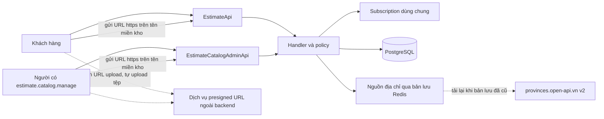
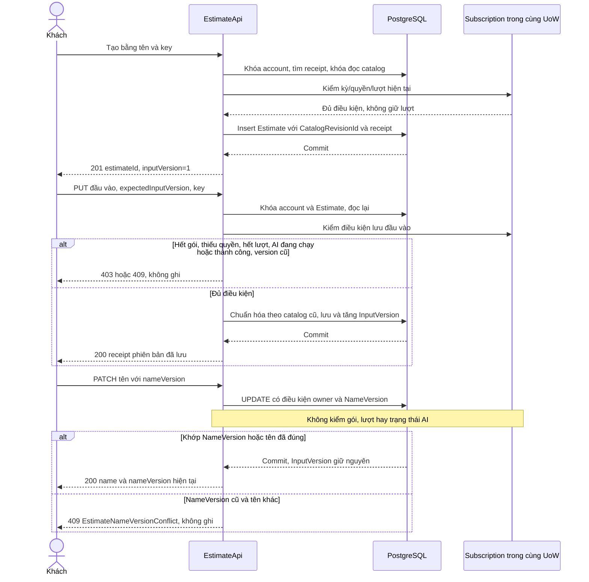
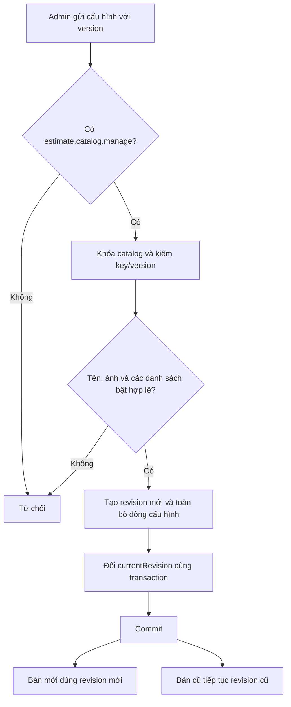
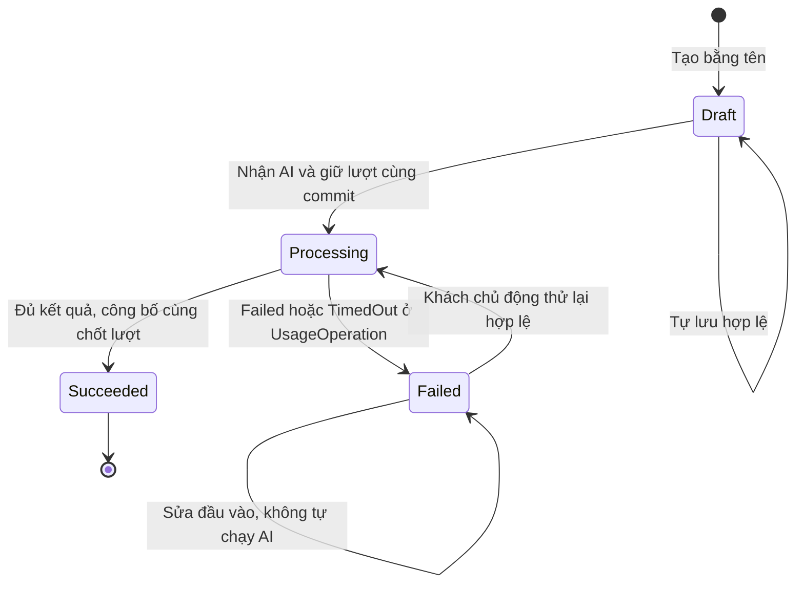
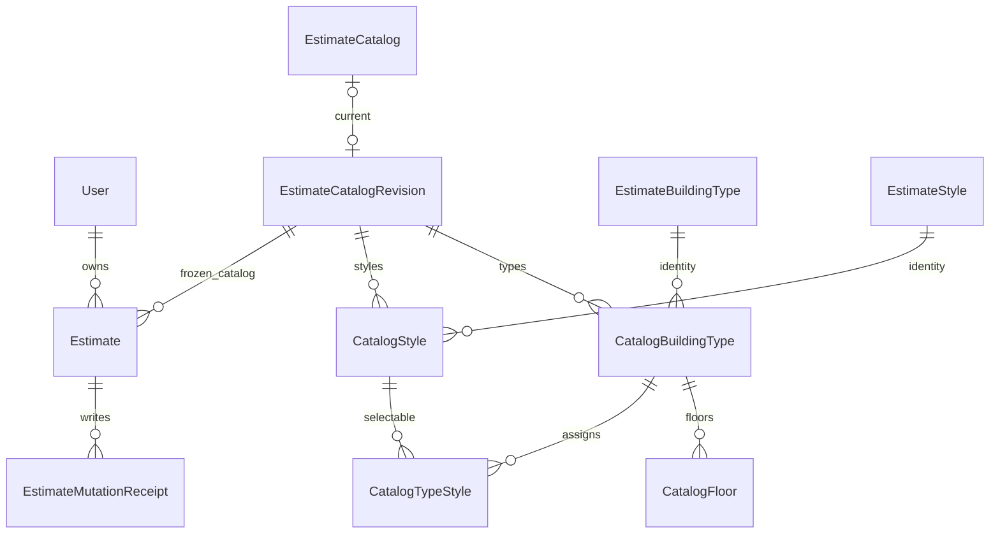

<!-- HƯỚNG DẪN CHO AI KHI ĐIỀN HOẶC CHỈNH SỬA MẪU
- Đọc toàn bộ mẫu, các comment hướng dẫn và tài liệu nguồn được cung cấp trước khi viết. Tuân thủ các quy tắc nghiệp vụ, điều kiện, ngoại lệ và giới hạn đã được xác nhận.
- Không bịa, tự chế hoặc suy đoán thành sự thật: yêu cầu, quy tắc, số liệu, API, schema, mã lỗi, nguồn tham khảo, người phụ trách và kết quả kiểm thử phải có căn cứ. Nội dung ví dụ trong mẫu không phải dữ kiện của dự án.
- Khi thiếu thông tin hoặc các nguồn mâu thuẫn, hỏi người dùng để làm rõ; giữ nguyên placeholder ở phần chưa xác định. Không tự chọn đáp án, lấp chỗ trống hay tuyên bố tài liệu đã hoàn tất.
- Chỉ thay nội dung cần điền hoặc được yêu cầu sửa. Không tự mở rộng phạm vi, sửa nghĩa quy tắc, bỏ điều kiện/ngoại lệ, xoá hay ghi đè nội dung hợp lệ đã có.
- Giữ nguyên tên, cấp và thứ tự heading, nhãn in đậm, tiền tố bullet, cấu trúc danh sách, tên/thứ tự/số cột bảng và cú pháp code fence. Không dịch, đổi tên, gộp hoặc thêm mục ngoài cấu trúc mẫu.
- Chỉ lặp khối luồng, AC hoặc API theo đúng khuôn khi có căn cứ; chỉ bỏ phần tuỳ chọn khi hướng dẫn riêng của mẫu cho phép và đã xác định không áp dụng.
- Mã tham chiếu và section phải trỏ tới tài liệu có thật đã được cung cấp hoặc kiểm chứng. Không giữ mã ví dụ như tham chiếu thật và không tự tạo tài liệu liên quan để hợp thức hoá liên kết.
- Giữ các comment hướng dẫn trong file. Xuất Markdown UTF-8, mỗi file một tài liệu; không bọc toàn bộ file trong code fence, không chèn lời dẫn hay giải thích ngoài mẫu.
- Trước khi bàn giao, đối chiếu nội dung với nguồn, kiểm tra cấu trúc, giá trị cho phép, giới hạn độ dài và tính nhất quán của mã/tham chiếu. Báo rõ phần chưa đủ thông tin; không tuyên bố đã chạy test hoặc import khi chưa thực hiện.
-->

<!-- Thay mã TDD-001 và nội dung ví dụ; giữ nguyên heading và nhãn in đậm.
Sơ đồ dùng mermaid, plantuml hoặc URL. Giữ heading Architecture, Sequence Diagram, Activity Diagram, State Diagram, Data Model.
Ví dụ API phải có heading trùng METHOD /path trong Endpoints. Xoá phần API/sơ đồ không dùng.
Version, Updated At và Change Log do lịch sử phiên bản quản lý, để trống khi nhập mới.
Author/Reviewer là tên hiển thị; gán tài khoản, phê duyệt, giả định và câu hỏi mở trên giao diện sau import.
Thiết kế phải truy vết về Story và Business Rule được cung cấp. Phân biệt thiết kế đề xuất với implementation đã kiểm chứng; không mô tả API/schema/sơ đồ ví dụ như hệ thống thật hoặc tự quyết định nghiệp vụ còn thiếu.
BẮT BUỘC KHI HOÀN THIỆN MẪU: phải có cả Reviewer và Approver, mỗi tên 1–200 ký tự sau khi bỏ khoảng trắng đầu/cuối. Không xoá hai dòng metadata, để trống, dùng tên bịa hoặc giữ placeholder rồi coi là hoàn tất.
Nếu chưa biết người review hoặc người phê duyệt, phải hỏi người dùng và báo tài liệu chưa đủ thông tin; không tự lấy Author/Owner làm người thay thế. Tên trong file không tự gán tài khoản hoặc xác nhận đã duyệt; gán thành viên trên giao diện sau import.
Đây là yêu cầu hoàn thiện mẫu; backend hiện vẫn nhận file cũ thiếu hai trường để tương thích.

VALIDATION CHO FILE NHẬP (đối chiếu ImportSnapshotValidator, MarkdownParser và ImportService):
- Mỗi file .md UTF-8 không rỗng chỉ có một heading cấp 1 chứa mã tài liệu dài 1–100 ký tự. Mã không được trùng trong cùng lần nhập hoặc thuộc loại tài liệu khác đã tồn tại.
- Không dùng tên README.md hoặc sitemap.md vì importer bỏ qua. Giao diện nhận .md/.zip, tối đa 2.000 file, tổng file tải lên 31 MiB; API giới hạn request 32 MiB và tổng nội dung đọc/giải nén 64 MiB.
- Chỉ nhập đè tài liệu cùng loại đang Draft, chưa có phiên bản và chưa lưu trữ. Import thay toàn bộ nội dung bản nháp, vì vậy phải giữ lại nội dung hợp lệ ngoài phần được yêu cầu sửa.
- Không dùng Status trong Markdown hoặc tên Approver để tự xác nhận phê duyệt; import không cấp quyền hay gán tài khoản từ tên. Chạy Kiểm tra file và xử lý lỗi/cảnh báo trước khi nhập.
- Giới hạn độ dài bên dưới tính theo string.Length của .NET (đơn vị UTF-16); không tự cắt ngắn dữ kiện quan trọng để vượt validation, hãy viết lại có căn cứ hoặc hỏi người dùng.
- Feature tối đa 300 ký tự và được dùng làm tiêu đề tài liệu. Status được parser nhận: Draft / In Review / Approved / Deprecated; tài liệu nhập mới vẫn có trạng thái phê duyệt Draft.
- Endpoint: đường dẫn tối đa 500 ký tự; tên/mô tả endpoint được lưu trong Name tối đa 300. HTTP method: GET / POST / PUT / PATCH / DELETE / HEAD / OPTIONS.
- Error Codes: mã tối đa 100 ký tự, không trùng trong tài liệu; giữ dạng - **CODE** (400): mô tả. HTTP status trong Error Codes và Response phải là số nguyên đọc được bằng Int32; không tự đặt status khác hợp đồng API.
- URL sơ đồ tối đa 1.000 ký tự. Mục sơ đồ được sử dụng phải có khối mermaid/plantuml hoặc URL theo mẫu; không để một mục sơ đồ rỗng. Nhãn mục được tách từ bullet như tên External API Fields tối đa 300 ký tự.
- Heading Examples phải khớp METHOD /path ở Endpoints. Giữ các nhãn Request:, Response 200: (thay mã theo contract) và Error Response: để parser tách đúng dữ liệu.
- Tham chiếu dạng DOC-KEY/section: ghi chú: mã đích tối đa 100 ký tự, section tối đa 100, ghi chú tối đa 1.000. Không trùng bộ mã đích + section + loại liên kết trong cùng tài liệu.
ĐỐI CHIẾU FORM TDD (src/features/tdds/validations.ts; form có thể chặt hơn import):
- Điền Feature, Author, Reviewer, Problem và ít nhất một Goal; các Goal/Non-goal/Notes đã thêm không được rỗng. API đã khai báo phải có endpoint và mô tả/mục đích; Fields phải có tên và ý nghĩa; Error Codes phải có mã, HTTP status và điều kiện.
- Form còn kiểm tra Version, Updated At và nội dung Change Log khi khai báo; với file nhập mới, giữ các trường lịch sử này trống theo hợp đồng import, không tự tạo dữ liệu lịch sử.
-->

# TDD-PROJ-001

## Document Info

- **Feature**: Tạo dự toán — danh mục có phiên bản, nhập liệu và tự lưu
- **Author**: Codex
- **Reviewer**: Tân Trần
- **Approver**: Tân Trần
- **Status**: Draft
- **Version**:
- **Updated At**:

## Context & Goals

### Problem

Người dùng đã chốt US/BR cho cả ba bước Tạo dự toán. Tài liệu này thiết kế STORY-PROJ-001 và STORY-PROJ-005; gửi AI ở TDD-PROJ-002, hồ sơ/chia sẻ ở TDD-PROJ-003. Mã PROJ được giữ để bảo toàn tham chiếu, nhưng entity mới là `Estimate`, route là `/estimates`. Không tạo bảng `Project`. Bản dự toán và Công trình (tên kỹ thuật `ConstructionSite`) là hai thực thể khác nhau: Công trình do khách tự tạo để gắn gói giám sát, chưa có đặc tả, và không liên kết với bản dự toán hay phân công công trình trong đợt này (BR-SUB-007/Notes).

Hiện trạng lúc thiết kế ngày 21/09/2026: .NET 8, EF Core/Npgsql 8.0.0, PostgreSQL 15 trong compose; `ApplicationDbContext` chỉ có User. Carter, MediatR, FluentValidation và xác thực cookie/JWT đang có; chưa có danh mục, dự toán, lưu tệp, RBAC đầy đủ hoặc subscription. Các bảng, lớp và API dưới đây đều là thiết kế đề xuất. TDD-SUB-002/TDD-PAY-001/TDD-RBAC-001 là nguồn thiết kế dùng lại, không phải module đã triển khai.

Hiện trạng code kiểm lại ngày 26/09/2026: thiết kế này đã được triển khai và merge vào `develop` của `bmt-be` (commit `a557993`), trừ các phần ghi ở mục "Phần chưa triển khai" trong Notes của Architecture. Migration `EstimateCatalogAndDraft` tạo mười bảng của Data Model, seed dòng `EstimateCatalog` và quyền `estimate.catalog.manage` cho vai trò `admin`. Khóa thương mại dùng `DesignSubscriptionStore.LockAccountAsync` hiện có (khóa `AccountCommerceState`, commit `a53faeb`). Migration chưa được áp dụng lên database dùng chung. Bốn quyết định bổ sung ngày 26/09/2026 (lần 2) ở đoạn dưới được triển khai trên nhánh `feature/estimate-followups` (tách từ `develop` tại `de3c61f`), không đổi schema và không thêm migration; nay đã có trên `develop` ở commit `388a426` (đối chiếu ngày 28/09/2026).

**Đã xác nhận**: tạo bằng tên, tự lưu bản nháp chưa đủ; một diện tích chung; một ảnh hoặc mô tả; cấu hình tầng/tum và hai nhóm phong cách; giữ toàn bộ danh mục của bản cũ; kiểm tra quyền/quota khi tạo và lưu nhưng không giữ/trừ lượt. Bổ sung ngày 21/09/2026: tên loại công trình/phong cách có nội dung sau trim, tối đa 200 ký tự, cho phép trùng tên. Bổ sung ngày 25/09/2026: chủ sở hữu đổi tên bản dự toán bất cứ lúc nào, kể cả khi gói hết hạn, hết lượt, toàn bộ lượt còn lại đang giữ hoặc AI đang xử lý; chỉ cần quyền sở hữu và tên hợp lệ. Tên không phải đầu vào gửi AI (BR-SUB-007 khoản 11, BR-PROJ-003 khoản 9). Quyền quản trị danh mục là `estimate.catalog.manage`, không gắn phân công (STORY-RBAC-001/Preconditions). Bổ sung ngày 26/09/2026 về tệp và ảnh: frontend xin URL upload từ dịch vụ presigned URL, tự upload tệp lên URL đó rồi gửi URL của tệp cho backend; backend chỉ lưu URL, không nhận bytes, không làm kho lưu trữ và không tạo presigned URL. Frontend kiểm định dạng và dung lượng ảnh (ảnh đầu vào JPG/PNG/HEIC tối đa 10 MB theo BR-PROJ-002 khoản 6; ảnh phong cách JPG/PNG/WebP tối đa 5 MB theo BR-PROJ-004 khoản 15). Backend kiểm URL là URL tuyệt đối dùng https; điều kiện "không giới hạn tên miền" của lần xác nhận này đã được thay bằng quyết định lần 2 bên dưới. Người dùng chấp nhận ảnh đầu vào của khách nằm ở URL công khai. Khi làm việc với AI service (TDD-PROJ-002, TDD-PROJ-003), AI trả URL các tệp kết quả và backend lưu các URL đó.

**Đã xác nhận ngày 26/09/2026 (lần 2)**:

1. URL ảnh phong cách (Admin) và ảnh đầu vào (khách) ngoài điều kiện là URL tuyệt đối https còn phải thuộc tên miền của kho presign. Danh sách tên miền đọc từ cấu hình. URL do dịch vụ presign trả là cố định, không hết hạn. Frontend vẫn kiểm định dạng và dung lượng.
2. Tắt một nhóm lựa chọn (số tầng, tum, phong cách kiến trúc, phong cách nội thất) của một loại công trình không xóa danh sách đã cấu hình, để khi bật lại thì danh sách cũ hiện ra. Nhóm tắt được phép có danh sách rỗng hoặc có dữ liệu. Khách vẫn chỉ thấy và chọn nhóm đang bật; BR-PROJ-004 khoản 13 (nhóm bật phải có ít nhất một lựa chọn) giữ nguyên.
3. Tính năng mở cho khách bằng `EstimateOption__CustomerCreationEnabled`, do người vận hành bật sau khi Admin xác nhận danh mục đủ. Hệ thống không tự kiểm danh mục đã "đủ" hay chưa.
4. Nguồn tỉnh/xã là dịch vụ bên thứ ba provinces.open-api.vn, dữ liệu theo địa giới mới (34 tỉnh/thành, hai cấp tỉnh–xã), lưu trong Redis qua hạ tầng cache sẵn có. Dịch vụ lỗi thì dùng bản đã lưu; chỉ trả 503 khi chưa có bản nào. Kiểm xã thuộc tỉnh khi lưu đầu vào cũng dùng dữ liệu này. Bản nháp đang giữ một xã đã bị gộp hoặc ngừng dùng vẫn giữ và hiển thị xã đó, nhưng trước khi gửi AI khách phải chọn lại xã theo dữ liệu mới; phần kiểm trước khi gửi AI thuộc TDD-PROJ-002 và chưa làm.

**Đề xuất chưa chốt**: schema/API, phiên bản danh mục bất biến, kiểm soát cập nhật đồng thời và quy ước biểu diễn ở dưới. **Cần làm rõ trước tích hợp**: hợp đồng AI và các con số vận hành chưa có số liệu (Notes của Data Model). Cảnh báo khi nguồn địa chỉ lỗi kéo dài đã được người dùng chốt ngày 26/09/2026 và đã có trong code (ghi chú "Cảnh báo khi nguồn lỗi kéo dài" trong Architecture). Dịch vụ presigned URL do bên khác cung cấp, nằm ngoài phạm vi backend. Phạm vi đã đọc và giới hạn rà soát tham chiếu được ghi trong bảng bàn giao thiết kế; chưa coi toàn bộ chuỗi tài liệu ngoài PROJ đã được kiểm chứng nội dung.

### Goals

- Tạo/lưu không làm thay quota; kiểm quyền và ghi đầu vào trong cùng giao dịch database.
- Mỗi bản giữ đúng phiên bản danh mục đã chọn lúc tạo; Admin không sửa lịch sử đang được bản cũ sử dụng.
- Yêu cầu đến muộn hoặc từ tab khác không âm thầm ghi đè đầu vào đã lưu; đầu vào không sửa được khi AI đang chạy hoặc đã thành công.
- Đổi tên bản dự toán là thao tác riêng: chỉ kiểm quyền sở hữu và tên hợp lệ, được phép ở mọi trạng thái; không đổi InputVersion và không ghi đè tên do tab khác vừa lưu.
- Lỗi upload hoặc lỗi lưu không làm mất URL ảnh cũ. Backend chỉ nhận URL https thuộc tên miền kho presign đã cấu hình; định dạng và dung lượng ảnh do frontend kiểm trước khi upload.

### Non-goals

- Viết frontend, triển khai code/migration, tạo phong cách mẫu, chạy AI hoặc gửi email thật trong tác vụ thiết kế.
- Liên kết bản dự toán với Công trình (`ConstructionSite`, thực thể riêng do khách tạo cho gói giám sát, đặc tả ở STORY-SITE-001 và [TDD-SITE-001](TDD-SITE-001.md); STORY-SITE-001/Out of Scope không gắn công trình với bản dự toán) hoặc với gói giám sát; xóa/ngừng dùng danh mục; chuyển bản cũ sang danh mục mới.
- Nhật ký riêng cho thao tác đổi tên bản dự toán (chưa có yêu cầu).
- Thêm ghi chú riêng, bảng đơn giá, công thức dự toán hoặc quyền AI theo cờ phong cách.

## Architecture

Giữ các module trong cùng ứng dụng và PostgreSQL để quyền/quota và đầu vào có thể được kiểm tra cùng một giao dịch. Không thêm broker, tenant hoặc database riêng.

| Thành phần dự kiến | Trách nhiệm và vị trí |
|---|---|
| EstimateApi, EstimateCatalogAdminApi | Carter tại `presentation/apis/estimates/` và `estimateCatalog/`; xác thực rồi chuyển DTO sang MediatR. |
| CreateEstimateHandler, SaveEstimateInputHandler | `application/usecases/commands/estimates/`; lấy chủ sở hữu từ phiên, kiểm quyền/quota/phiên bản, ghi dữ liệu và biên nhận cùng giao dịch. |
| RenameEstimateHandler | Cùng thư mục; lấy chủ sở hữu từ phiên, kiểm tên và NameVersion rồi ghi tên bằng một câu UPDATE có điều kiện. Không gọi IEstimateWriteAccess, không đọc UsageOperation, không đổi InputVersion. |
| SaveBuildingTypeHandler, SaveStyleHandler | `application/usecases/commands/estimateCatalog/`; kiểm quyền `estimate.catalog.manage`, tạo phiên bản danh mục mới, cập nhật con trỏ sau khi kiểm toàn bộ cấu hình. |
| EstimateInputPolicy, CatalogConfigurationPolicy | Domain thuần: chuyển loại/tỉnh, kiểm dữ liệu đã nhập, kiểm đầy đủ trước AI, kiểm danh sách bật không rỗng. |
| IEstimateStore, IEstimateCatalogStore | Persistence dùng cùng DbContext/UoW, projection chỉ đọc dùng AsNoTracking. Khóa và ràng buộc nằm tại đây. |
| IEstimateWriteAccess | Adapter vào subscription: kiểm kỳ hiện tại Active, thời hạn, quyền design.generate và lượt sẵn dùng; không tự tạo kỳ/quota. |
| ILocationCatalog | Đọc tỉnh/xã từ provinces.open-api.vn v2 qua bản lưu trong Redis và kiểm xã thuộc tỉnh. Không tin tên/mã tự khai từ client. |
| IUploadedFileUrlPolicy | Kiểm URL tệp mới thuộc tên miền kho presign theo cấu hình `UploadedFileOption`; không gọi HTTP tới URL. |

Ảnh không có thành phần lưu trữ ở backend: frontend upload qua dịch vụ presigned URL rồi gửi URL; backend kiểm URL thuộc tên miền kho presign rồi lưu URL trong cột của Estimate và CatalogStyle.



**Notes**:

- **Phiên bản danh mục bất biến**: mỗi lần Admin lưu hợp lệ tạo một `EstimateCatalogRevision` và bộ dòng cấu hình mới. Bản dự toán giữ FK tới revision tại lúc tạo. Ví dụ D1 giữ V1, Admin đổi tên ảnh thành V2 thì D1 vẫn đọc V1; D2 mới dùng V2. Copy toàn bộ cấu hình của revision là lựa chọn đơn giản để kiểm ràng buộc; đổi lại tốn dữ liệu theo số lần Admin lưu. Chưa có tải để cần lưu phần chênh lệch. Không có bước duyệt/công bố mới trên giao diện: lưu hợp lệ là cập nhật revision hiện hành.
- Khóa singleton `EstimateCatalog` khi Admin lưu; `expectedCatalogVersion` ngăn ghi đè thay đổi Admin khác. Tạo bản dự toán đọc con trỏ bằng FOR SHARE trong giao dịch, gắn revision rồi commit; Admin đổi con trỏ bằng FOR UPDATE phải chờ. Mốc tạo được xác định tại giao dịch này, không lấy đồng hồ client. Không bao giờ cập nhật những dòng cấu hình của revision đã commit.
- **Thống nhất khóa thương mại**: dùng `AccountCommerceState` của TDD-PAY-001, không tạo một khóa riêng cho quota dự toán. Thứ tự của luồng này: AccountCommerceState → EstimateCatalog (chỉ lúc tạo, khóa đọc) → Estimate → DesignSubscription → DesignPeriod → PeriodQuota → UsageOperation → dữ liệu con/receipt. Thao tác Admin chỉ khóa catalog, không xin khóa account thương mại. Luồng thanh toán/hủy/gán phải cùng lấy AccountCommerceState trước dữ liệu tài khoản; không giữ khóa catalog rồi quay lại xin khóa thương mại. TDD-SUB-002 đã dùng cùng thứ tự khóa này (AccountCommerceState → Estimate → DesignSubscription → DesignPeriod/PeriodQuota → UsageOperation); code khóa bằng `DesignSubscriptionStore.LockAccountAsync` từ commit `a53faeb`, không còn khóa dòng User.
- `AccountCommerceState` được tạo bằng insert-on-conflict-do-nothing rồi khóa; hành động này không cấp subscription. Kiểm quyền trước sửa; sau khi chờ khóa phải đọc lại dữ liệu và lấy `EffectiveNow` từ đồng hồ server. Dùng FOR UPDATE chỉ trong giao dịch ngắn, không giữ khóa khi tải ảnh/HTTP. [PostgreSQL 15 — row locks](https://www.postgresql.org/docs/15/explicit-locking.html#LOCKING-ROWS).
- **Tự lưu và phiên bản**: `InputVersion` tăng mỗi lần ghi đầu vào thành công, không tăng khi gửi AI, đọc hoặc đổi tên. PUT gửi toàn bộ đầu vào và `expectedInputVersion`; sai phiên bản trả 409, giữ cả bản đã lưu lẫn nội dung chưa lưu ở trang. Frontend chỉ có một yêu cầu lưu đang chờ; gộp thay đổi mới để gửi sau phản hồi. Không tự dùng phiên bản mới để ghi đè khi có xung đột từ tab khác: đọc lại và cho khách xem nội dung trước khi tiếp tục.
- **Chống gửi lặp**: create/save có Idempotency-Key (1–100 ký tự). `EstimateMutationReceipt` lưu key, SHA-256 của DTO chuẩn hóa, estimateId, phiên bản kết quả. Cùng actor/thao tác/key và cùng hash trả receipt cũ; khác hash trả 409. Xác thực và ownership luôn chạy trước replay. Replay không ghi lại đầu vào nên không đòi quota để thực hiện lại một lần lưu đã commit; response chỉ xác nhận phiên bản đã lưu, client GET để lấy hiện trạng. Yêu cầu chưa từng commit vẫn kiểm toàn bộ quyền/quota/khóa hiện tại. Không replay tự động yêu cầu trước đã bị từ chối vì quyền/lượt. Đổi tên không dùng receipt này, lý do ở ghi chú đổi tên bên dưới.
- **Đổi tên tách khỏi lưu đầu vào**: tên là nhãn quản lý của chủ sở hữu, không nằm trong snapshot gửi AI (TDD-PROJ-002). Vì vậy đổi tên có route riêng `PATCH /estimates/{estimateId}/name` và bộ đếm riêng `NameVersion`, còn PUT /input không nhận `name`. Cách tách này giải quyết hai vấn đề: (1) đổi tên không phải qua kiểm gói, lượt và khóa AI của đầu vào; (2) đổi tên không tăng InputVersion, nên yêu cầu gửi AI hoặc lần tự lưu đang chờ với `expectedInputVersion` vừa đọc không bị 409 chỉ vì khách vừa đổi tên ở tab khác.
  - Cách chạy: sau khi xác thực phiên (AccountKind=Customer) và kiểm tên (trim, 1–200 ký tự tính theo Rune, không tự cắt), handler chạy một câu `UPDATE "Estimate" SET "Name"=@name, "NameVersion"="NameVersion"+1, "ModifiedAtUtc"=@now WHERE "Id"=@id AND "OwnerId"=@owner AND "NameVersion"=@expected AND "Name"<>@name`. Câu lệnh có điều kiện này là kiểm soát ghi đè lạc quan: chỉ một yêu cầu cùng NameVersion thắng, không cần giữ khóa hàng qua nhiều bước và không cần khóa AccountCommerceState vì không đụng tới gói/lượt. Nếu hai giao dịch cùng cập nhật hàng Estimate (đổi tên và lưu đầu vào), PostgreSQL tự xếp hàng theo khóa hàng; mỗi bên chỉ ghi cột của mình nên không mất dữ liệu của bên kia.
  - Khi UPDATE không ảnh hưởng dòng nào, handler đọc lại bản theo Id và OwnerId: không có thì 404 EstimateNotFound; có và tên hiện tại đúng bằng tên đã trim trong yêu cầu thì trả 200 với `{name,nameVersion}` hiện tại, không tăng NameVersion; còn lại trả 409 EstimateNameVersionConflict. Điều kiện `"Name"<>@name` làm cho việc gửi đúng tên đang lưu là thao tác không đổi: không tăng NameVersion, nên không làm tệp đã xuất mất hiệu lực vô ích.
  - Ví dụ: D1 có Name=Nhà A, NameVersion=1. Tab 1 đổi thành “Nhà A - phương án chốt” với nameVersion=1, commit NameVersion=2 nhưng mất phản hồi. Tab 1 gửi lại cùng body: UPDATE không khớp, đọc lại thấy tên đã đúng nên trả 200 với NameVersion=2. Nếu trước lần gửi lại đó, tab 2 đã đổi tiếp thành “Nhà B” (NameVersion=3) thì lần gửi lại nhận 409, không ghi đè “Nhà B”. Vì cách so tên này đủ nhận diện lần gửi lại, đổi tên không dùng EstimateMutationReceipt và không cần Idempotency-Key.
  - Giới hạn: kiểu so tên không phân biệt được “gửi lại của chính mình” với “tab khác đổi đúng cùng tên”; cả hai đều dẫn tới cùng kết quả nên được coi là thành công. Không ghi nhật ký riêng cho đổi tên vì chưa có yêu cầu. Đổi tên không làm tệp PDF/Excel đã có mất hiệu lực: tên mới chỉ áp vào tên tệp tải về, nội dung tệp giữ như lúc AI tạo (người dùng xác nhận ngày 26/09/2026, TDD-PROJ-003/Architecture).
- Lưu danh mục cũng kiểm chống gửi lặp trước expectedCatalogVersion sau khi xác thực quyền quản trị. Hash gồm thao tác, ID mục được sửa (nếu có), phiên bản mong đợi và DTO đã chuẩn hóa. Revision lưu key/hash và target đã tạo/sửa; cùng key/hash trả đúng revision/target cũ, khác hash trả 409. Không tạo revision mới chỉ vì client mất phản hồi.
- Không gọi MediatR command con tự commit bên trong command đang có transaction. Mọi lệnh ghi đánh dấu `ITransactionalRequest`; store/subscription cùng scoped UoW. Hiện UoW đăng ký transient và pipeline commit cả Result.Failure: cần đổi scoped, ném exception khi từ chối sau sửa để rollback. Ghi lại thiết kế này trong hạng mục nền tảng và kiểm hồi quy auth khi triển khai. [EF Core — transactions](https://learn.microsoft.com/en-us/ef/core/saving/transactions).
- **Thay ảnh bằng URL**: frontend kiểm định dạng, dung lượng rồi upload tệp qua dịch vụ presigned URL, ngoài backend. Sau khi upload xong, frontend gửi URL mới trong `input.inputImageUrl` của PUT /input (có `inputImageUrl` trong `changedFields`). Backend kiểm URL tuyệt đối dùng https, không khoảng trắng, tối đa 2048 ký tự và thuộc tên miền kho presign (ghi chú "URL ảnh thuộc kho presign" bên dưới), rồi ghi URL trong cùng transaction kiểm quyền, phiên bản và khóa như mọi trường khác. Trước khi lần lưu đó commit, URL cũ vẫn là ảnh đầu vào; upload lỗi thì frontend không gửi PUT, lưu lỗi thì transaction rollback, nên URL cũ giữ nguyên (BR-PROJ-002 khoản 8, 9). Backend không tải tệp về để kiểm và không xóa tệp cũ ở kho; việc dọn tệp không còn được tham chiếu thuộc dịch vụ lưu trữ.
- **Hệ quả đã chấp nhận của quyết định URL**: yêu cầu gửi thẳng API với URL https trên tên miền kho nhưng trỏ tới tệp sai định dạng hoặc quá dung lượng không bị backend chặn; định dạng và dung lượng chỉ được kiểm ở frontend. Người dùng xác nhận URL do dịch vụ presign trả là cố định, không hết hạn; tệp vẫn có thể bị thay hoặc xóa ở kho ngoài hệ thống. Ảnh đầu vào nằm ở URL công khai theo xác nhận của người dùng.
- **URL ảnh thuộc kho presign** (quyết định lần 2 ngày 26/09/2026; phần so khớp là lựa chọn kỹ thuật):
  - Cấu hình: `UploadedFileOption__AllowedHosts__0`, `__1`… Dùng một option chung thay vì đặt trong `EstimateOption` vì kho presign dùng chung cho mọi tính năng lưu URL tệp (ảnh phong cách, ảnh đầu vào, và theo thiết kế là ảnh bài viết của TDD-NEWS-001). Khai báo một lần thì các tính năng không bị lệch nhau. Mỗi phần tử là tên máy chủ trần, ví dụ `cdn.example.vn`; phần tử trống bị bỏ qua; phần tử có scheme, cổng, đường dẫn, ký tự `*` hoặc dấu chấm cuối làm ứng dụng dừng lúc khởi động.
  - So khớp: tên máy chủ của URL phải bằng đúng một phần tử, không phân biệt hoa thường, so ở dạng ASCII (punycode) với tên miền tiếng Việt. Không nhận tên miền con (`img.cdn.example.vn` không khớp `cdn.example.vn`), URL có thông tin đăng nhập (`user@host`), cổng khác 443 hoặc địa chỉ IP. Cần thêm máy chủ nào thì khai báo thêm phần tử; không mở rộng bằng ký tự đại diện.
  - Chỉ kiểm URL mới: thêm phong cách, đổi ảnh phong cách, hoặc PUT /input có `inputImageUrl` trong `changedFields` với giá trị khác URL đang lưu. URL đã lưu trước đó không chặn lần lưu các trường khác, kể cả khi danh sách tên miền đã đổi; xóa ảnh (NULL) luôn được. Khi dựng phiên bản danh mục mới, backend không kiểm lại tên miền của mọi phong cách, để việc đổi danh sách không khóa thao tác sửa các mục khác.
  - Danh sách rỗng: từ chối mọi URL ảnh mới bằng 503 `DependencyUnavailable`. Đây là thiếu cấu hình phía hệ thống, không phải lỗi dữ liệu của người gửi, nên không dùng 422. Thao tác không gửi URL mới vẫn chạy bình thường.
  - Sai tên miền: 422 `InvalidEstimateInput` với trường `input.inputImageUrl`, hoặc 422 `InvalidCatalogConfiguration` với trường `imageUrl`. Lần lưu bị từ chối không đổi URL cũ.
  - Vị trí kiểm: lưu đầu vào kiểm sau biên nhận, gói/lượt, khóa AI, InputVersion và trường ngoài `changedFields`, trước khi áp lựa chọn. Lưu phong cách kiểm sau khi khóa danh mục, tra biên nhận và so `expectedCatalogVersion`.
- **Nhóm lựa chọn tắt vẫn giữ danh sách** (quyết định lần 2 ngày 26/09/2026):
  - `CatalogConfigurationPolicy` chỉ còn bắt nhóm bật phải có ít nhất một lựa chọn (BR-PROJ-004 khoản 13). Nhóm tắt được lưu danh sách rỗng hoặc có phần tử. Phong cách trong danh sách của nhóm tắt vẫn phải có trong phiên bản và đúng nhóm, vì khóa ngoại CatalogTypeStyle → CatalogStyle vẫn đòi điều này. Tum chỉ có cờ, không có danh sách.
  - Snapshot của bản dự toán không đổi cách ghim: phiên bản danh mục chép cả danh sách của nhóm tắt. GET /estimates/{estimateId}/catalog trả danh sách rỗng cho nhóm tắt để khách chỉ thấy nhóm bật; GET /admin/estimate-catalog trả đủ danh sách để Admin bật lại mà không phải nhập lại.
  - Chọn lựa chọn: `EstimateInputPolicy` chỉ nhận số tầng hoặc phong cách khi nhóm đang bật và giá trị có trong danh sách (`CanSelectFloor`, `CanSelectStyle`). Chủ động chọn phần tử của nhóm tắt, kể cả gửi thẳng API, trả 422 `InvalidEstimateInput`.
  - Đổi loại (BR-PROJ-004 khoản 11): giá trị thuộc nhóm tắt của loại mới bị xóa dù vẫn nằm trong danh sách được giữ. Ví dụ B2 tắt tầng nhưng giữ 1 và 3; bản đang ở B1 với tầng 3 đổi sang B2 thì tầng bị xóa.
  - Kiểm trước khi gửi AI: `FindMissingForGeneration` không đòi nhóm tắt, và giá trị của nhóm tắt không được tính là lựa chọn hợp lệ. TDD-PROJ-002 khi dựng đầu vào gửi AI phải dùng cùng hai hàm này, không đọc thẳng danh sách.
  - Database: dòng CatalogFloor/CatalogTypeStyle của nhóm tắt vẫn tồn tại, nên khóa ngoại ghép từ Estimate không còn chặn lựa chọn của nhóm tắt; chỉ policy chặn. Không thêm cột hay ràng buộc, vì mọi đường ghi đều qua policy và ghi SQL trực tiếp không được bỏ qua policy (Data Model).
- **Nguồn địa chỉ provinces.open-api.vn** (quyết định lần 2 ngày 26/09/2026; chi tiết gọi API ở External API):
  - Adapter `ProvincesOpenApiLocationCatalog` (infrastructure) tải trọn bộ 34 tỉnh kèm xã một lần, lưu nguyên khối trong Redis qua `ICacheService<ICacheInstance>`, không đặt hạn tự xóa. Bản lưu cũ hơn `ProvincesOpenApiOption__CacheTtlMinutes` được tải lại khi có người đọc danh sách; tải lỗi thì dùng tiếp bản cũ, chỉ trả 503 khi chưa có bản nào. Sau một lần lỗi, chờ `RefreshRetrySeconds` mới thử lại; mỗi tiến trình chỉ một yêu cầu gọi nguồn tại một thời điểm. Redis lỗi thì coi như chưa có bản lưu.
  - Không gọi HTTP khi đang giữ khóa dòng: nếu PUT /input có trường địa chỉ trong `changedFields`, handler gọi `PrepareAsync` để nạp sẵn hoặc làm mới dữ liệu trước khi khóa `AccountCommerceState`. Lúc giữ khóa, `VerifyAsync` dùng bản lưu dù đã cũ; chỉ khi chưa có bản nào mới gọi nguồn, và bỏ qua nếu vừa lỗi trong khoảng chờ thử lại.
  - Phiên bản dữ liệu: nguồn không công bố số phiên bản nên backend tính từ nội dung, dạng `pov2-` cộng 16 ký tự hex đầu của SHA-256 danh sách mã và tên tỉnh/xã. Nguồn đổi bất kỳ tỉnh/xã nào thì phiên bản đổi; tải lại đúng dữ liệu cũ thì giữ phiên bản. Chỉ phiên bản hiện hành được dùng: GET wards hoặc PUT /input gửi `datasetVersion` khác trả 409 `LocationDatasetChanged` để client tải lại danh sách.
  - Lưu để kiểm về sau: mỗi lần xác minh, Estimate lưu `ProvinceCode`, `ProvinceName`, `WardCode`, `WardName` và `LocationDatasetVersion` của bộ dữ liệu đã dùng. Các cột này đã có từ migration `EstimateCatalogAndDraft`, không cần cột mới. TDD-PROJ-002 so `LocationDatasetVersion` với phiên bản hiện hành; khác thì kiểm lại mã xã có còn thuộc tỉnh trong dữ liệu hiện hành không, không còn thì chặn gửi AI và yêu cầu chọn lại xã.
  - Xã đã bị gộp hoặc ngừng dùng: GET /estimates/{estimateId} vẫn trả snapshot đã lưu. PUT không đụng địa chỉ không gọi nguồn nên vẫn lưu được. Muốn đổi địa chỉ thì chọn theo phiên bản hiện hành.
  - Người dùng xác nhận ngày 26/09/2026: (a) Xã còn mã trong dữ liệu mới nhưng đổi tên vẫn được coi là còn dùng; khách không phải chọn lại, và TDD-PROJ-002 dùng tên mới khi dựng đầu vào gửi AI. Khách chỉ phải chọn lại khi mã xã không còn hoặc không còn thuộc tỉnh đã chọn. (b) Không đặt tuổi tối đa cho bản lưu: khi nguồn lỗi, hệ thống dùng bản đã lưu dù lưu từ bao lâu. (c) Chưa lập kênh liên hệ với bên cung cấp hay bản sao dữ liệu dự phòng; theo dõi lỗi tải qua log và cảnh báo Discord khi nguồn lỗi kéo dài (ghi chú ngay dưới), rồi quyết định tiếp khi có số liệu vận hành.
  - **Cảnh báo khi nguồn lỗi kéo dài** (người dùng chốt ngày 26/09/2026: có cảnh báo, không giới hạn tuổi bản lưu; đã có trong code trên nhánh `feature/provinces-outage-alert` của `bmt-be`, commit `63c7466`):
    - Đợt lỗi bắt đầu ở lần tải lỗi đầu tiên sau lần tải thành công gần nhất, và kết thúc ở lần tải thành công kế tiếp. "Tải lỗi" hiểu theo External API/Error Handling. Khi một lần tải lỗi thấy đã qua `ProvincesOpenApiOption__OutageAlertAfterMinutes` phút (mặc định 30) kể từ lần lỗi đầu tiên, hệ thống gửi một cảnh báo Discord loại `LocationSourceOutage`; các lần lỗi sau trong cùng đợt không gửi lại. Đợt đã được cảnh báo thì lần tải thành công kết thúc đợt gửi một tin `LocationSourceRecovered`. Đợt ngắn hơn ngưỡng không gửi gì. Đợt lỗi mới tính mốc lại từ đầu và được cảnh báo lại.
    - Nhiều instance: mốc lỗi đầu tiên và cờ đã cảnh báo nằm trong Redis cache, ở hai khóa `estimate:locations:{provinces-outage}:started-at` và `estimate:locations:{provinces-outage}:alerted`, không đặt hạn tự xóa. Mỗi lần ghi là một script Lua dùng `SET NX`, nên dù nhiều instance cùng tải lỗi thì chỉ một instance gửi cảnh báo, và khi hồi phục chỉ một instance gửi tin hồi phục. Thành phần: `ProvincesOutageMonitor` (gửi cảnh báo) và `RedisProvincesOutageStore` (giữ trạng thái đợt lỗi), đều ở `infrastructure/estimate/`.
    - Giới hạn: đợt lỗi chỉ được đo khi có lần tải. Bản lưu còn mới thì không gọi nguồn; sau một lần lỗi, mỗi instance chờ `RefreshRetrySeconds` mới thử lại. Vì vậy cảnh báo đến ở lần tải lỗi đầu tiên sau khi vượt ngưỡng; không ai đọc danh sách thì không có lần tải và không có cảnh báo. Khoảng thời gian không có lần tải nào vẫn tính vào đợt lỗi, vì chưa có lần tải thành công để kết thúc đợt. Redis lỗi khi ghi trạng thái thì chỉ ghi log, lần đọc địa chỉ vẫn chạy như cũ nhưng cảnh báo của đợt đó có thể bị mất. Cảnh báo chỉ gửi khi đã bật Discord (`DiscordOption__Enabled` và webhook). Các instance cần đồng bộ đồng hồ (NTP) vì mốc lỗi lấy từ đồng hồ của instance ghi.
    - Tín hiệu vận hành: mỗi lần tải lỗi ghi log Warning như trước. Lúc gửi cảnh báo ghi log Error kèm `OutageStartedAtUtc`, `OutageMinutes`, `AlertAfterMinutes`; lúc hồi phục ghi log Information kèm `OutageStartedAtUtc`. Không ghi được trạng thái vào Redis thì ghi log Warning "Không ghi được trạng thái đợt lỗi…". Nhận cảnh báo thì kiểm tra provinces.open-api.vn và đường mạng ra ngoài; khách vẫn dùng được bản lưu, chỉ API địa chỉ trả 503 nếu chưa có bản lưu nào.
- Backend áp dụng chuẩn hóa đổi loại trên dữ liệu cũ trước, rồi áp các trường được gửi trong DTO: chỉ giữ giá trị cũ hợp lệ trong loại mới; dữ liệu mới được khách chọn phải hợp lệ. Để tránh coi giá trị cũ vô hiệu là lựa chọn mới, client gửi `changedFields` với PUT; backend chỉ áp các trường trong danh sách đó như lựa chọn chủ động. Các trường không có trong changedFields phải khớp bản đã lưu tại expectedInputVersion trước chuẩn hóa, nếu khác thì trả 422; sau chuẩn hóa không áp lại các giá trị cũ vừa bị xóa. Hash chống lặp bao gồm expectedInputVersion, input và changedFields đã sắp xếp, loại trùng. Đổi tỉnh luôn xóa xã cũ; nếu cùng PUT chọn xã mới thì kiểm xã đó thuộc tỉnh mới. Không đổi diện tích/địa chỉ chi tiết/ảnh/mô tả vì đổi loại. Response GET sau lưu là dữ liệu đã chuẩn hóa.
- Bản nháp được NULL các trường bắt buộc trước AI, nhưng dữ liệu có giá trị phải hợp lệ. Nhóm phong cách tắt luôn lưu NULL; bật yêu cầu đúng một lựa chọn khi gửi AI. Tầng bật yêu cầu một giá trị trong danh sách; tum bật yêu cầu boolean có giá trị, false khác NULL. Không tự chọn phong cách hoặc Có/Không tum.
- Quy ước kỹ thuật: kiểm dung lượng ảnh thuộc frontend; đề xuất frontend dùng 1 MB = 1.000.000 byte (ảnh đầu vào ≤10.000.000 byte, ảnh phong cách ≤5.000.000 byte) và tính trên số byte thực của tệp. URL ảnh tối đa 2048 ký tự là giới hạn kỹ thuật cho cột `varchar(2048)`, chọn theo độ dài URL mà trình duyệt và CDN thường hỗ trợ; đây không phải quy tắc nghiệp vụ. Chuỗi đếm Unicode scalar (Rune), không đếm UTF-16 như giới hạn nhập tài liệu; không tự đổi chuẩn Unicode. Tên trim khoảng trắng đầu/cuối, mô tả giữ nội dung gốc nhưng whitespace-only không đáp ứng điều kiện mô tả. Mã tỉnh, mã xã và phiên bản dữ liệu địa chỉ tối đa 64 ký tự, không có khoảng trắng đầu/cuối (giới hạn kỹ thuật ở validator; cột vẫn là `text`).
- Diện tích dùng `numeric(28,2)`/C# decimal; JSON gửi chuỗi thập phân như `"70.25"` để không mất chính xác trong JavaScript. Validator kiểm chuỗi số trước chuyển kiểu: tối đa 26 chữ số phần nguyên, 0–2 phần lẻ, >0, không exponent/NaN/Infinity. Đây là giới hạn biểu diễn, không trần diện tích nghiệp vụ; từ chối thay vì làm tròn. PostgreSQL có thể làm tròn khi ép vào numeric có scale, nên kiểm trước ghi là bắt buộc. [PostgreSQL 15 — numeric](https://www.postgresql.org/docs/15/datatype-numeric.html).
- Danh mục địa chỉ là phụ thuộc riêng. Adapter trả `datasetVersion, provinceCode/name, wardCode/name`; backend lưu giá trị đã xác minh. Thay địa chỉ phải kiểm tập dữ liệu tương ứng; nguồn chưa sẵn sàng thì không nhận địa chỉ giả. Việc xử lý xã đã bị ngừng dùng trong bản cũ còn mở; không suy ra quy tắc giữ catalog loại/phong cách cũng áp dụng địa giới.
- Chống CSRF theo lớp dùng chung ở [TDD-AUTH-001](TDD-AUTH-001.md): mọi mutation dùng cookie phải có `Origin` (không có thì `Referer`) nằm trong `Cors:AllowedOrigins`, sai thì trả 403 `CsrfInvalid`; request có header `Authorization` không bị kiểm. Không có request token hay endpoint cấp token, và không dùng CORS thay CSRF. Cookie phiên là `SameSite=None; Secure` ngoài Development. GET công khai dùng token chia sẻ không dùng cookie quyền khách.
- Quyền khách: verified session + AccountKind=Customer + ownership. Tài khoản nhân viên (AccountKind=Staff) không tạo, sửa hoặc đổi tên bản dự toán; kiểm theo AccountKind, không theo tên vai trò. Quyền quản trị danh mục dùng policy verified Staff có quyền `estimate.catalog.manage` theo RBAC, RequiresAssignment=false (STORY-RBAC-001/Preconditions); seed permission này cho vai trò hệ thống Admin, không cho mọi nhân viên. Policy kiểm theo mã quyền, không kiểm tên vai trò "Admin" (BR-RBAC-001, BR-RBAC-011); thiếu quyền trả 403 và không ghi dữ liệu nghiệp vụ, ngoài nhật ký yêu cầu bị từ chối theo BR-RBAC-011 khoản 4. Không dùng role Admin để bỏ qua các điều kiện của tài khoản khách. Việc gán quyền cho vai trò nhân viên khác vẫn theo quy trình RBAC, không tự cấp ở tính năng này.
- **Quyết định kỹ thuật khi triển khai (26/09/2026)**, không đổi nghiệp vụ:
  - Tên trong code so với bảng thành phần: handler mang hậu tố `CommandHandler`/`QueryHandler` (ví dụ `CreateEstimateCommandHandler`, `SaveBuildingTypeCommandHandler`); `IEstimateStore` gộp phần đọc/ghi của cả bản dự toán và danh mục (không có `IEstimateCatalogStore` riêng); khóa dòng nằm ở `IEstimateRowLocks`; `IEstimateWriteAccess` có tên `IEstimateInputWriteAccess`, hiện thực là `EstimateInputWriteAccessPolicy`; `ILocationCatalog` có tên `IEstimateLocationCatalog` (thêm `PrepareAsync` để nạp sẵn dữ liệu trước khi khóa dòng).
  - Cổng tạo bản dự toán cho khách đóng mặc định. Người vận hành mở bằng `EstimateOption__CustomerCreationEnabled=true` sau khi Admin xác nhận danh mục đủ; hệ thống không tự kiểm danh mục đã đủ hay chưa (người dùng xác nhận ngày 26/09/2026). Cổng đóng hoặc danh mục chưa có phiên bản hiện hành thì POST /estimates trả 503 `DependencyUnavailable`. Cổng không áp cho đọc, lưu đầu vào hay đổi tên bản đã có.
  - Thứ tự kiểm khi lưu đầu vào: phiên khách → nạp sẵn dữ liệu địa chỉ nếu có sửa địa chỉ → khóa AccountCommerceState → khóa dòng Estimate (không thấy thì 404) → biên nhận → gói/quyền/lượt → tác vụ AI Pending/Succeeded → InputVersion → trường ngoài `changedFields` → tên miền của URL ảnh mới → áp và chuẩn hóa theo phiên bản đã ghim. Khi tạo: phiên khách → khóa AccountCommerceState → biên nhận → cổng mở → khóa EstimateCatalog FOR SHARE, đọc phiên bản hiện hành → gói/quyền/lượt.
  - `EstimateInputWriteAccessPolicy` (TDD-SUB-002) đọc kỳ hiện tại, sổ lượt `design.generate` và số dư dưới khóa AccountCommerceState; cùng điều kiện với bước giữ lượt nhưng không giữ lượt. GET /estimates/{id} dùng cùng hàm để tính `canEdit`, không khóa.
  - Trạng thái bản đọc từ UsageOperation có `UsageKind=DesignGeneration` và `ResourceId` bằng Id của bản, vì cột `EstimateId` thuộc TDD-PROJ-002. Tác vụ Pending/Succeeded dùng index `UX_UsageOperation_LiveDesignGeneration`; tìm tác vụ thất bại gần nhất chưa có index riêng cho tới khi TDD-PROJ-002 thêm index `(EstimateId, AcceptedAtUtc DESC, Id)`.
  - Danh mục: phiên bản mới có `Number` bằng `EstimateCatalog.Version` sau khi tăng, nên `catalogVersion` trả cho Admin cũng là số thứ tự phiên bản. Nhóm đang tắt được giữ danh sách theo ghi chú "Nhóm lựa chọn tắt vẫn giữ danh sách"; quy định cũ bắt danh sách của nhóm tắt phải rỗng đã bỏ. Sửa loại hoặc phong cách không có trong phiên bản hiện hành trả 404 `CatalogItemNotFound`.
  - `missingFields` của GET dùng tên trường của DTO; thiếu cả ảnh lẫn mô tả dùng tên chung `imageOrDescription`. GET còn trả `failureCode` của tác vụ thất bại gần nhất khi `state` là Failed.
  - Trường JSON lạ trong body và trong `input`, kể cả `name`, được giữ lại khi đọc JSON rồi validator trả 422 `InvalidEstimateInput` (hoặc `InvalidCatalogConfiguration` ở API danh mục), không bị bỏ qua. Lỗi hình thức từ validator dùng dạng ProblemDetails 422 hiện có của `ApiEndpoint`; lỗi phát hiện trong handler dùng dạng `{title,code,status,detail,messageCode,errors}` của middleware.
  - Khóa ngoại ghép của Estimate có tên cố định (`FK_Estimate_CatalogBuildingType`, `FK_Estimate_CatalogFloor`, `FK_Estimate_ArchitectureStyle`, `FK_Estimate_InteriorStyle`). Nếu một lần lưu vẫn chạm các khóa này, pipeline đổi thành 422 `InvalidEstimateInput`.
- **Phần chưa triển khai**: (1) CSRF: lớp kiểm Origin dùng chung theo [TDD-AUTH-001](TDD-AUTH-001.md) đã có trên nhánh `develop` của `bmt-be` (commit `53ec4be` và `9c7b147`); module này không cần code riêng. (2) Kiểm trước khi gửi AI rằng xã đã lưu còn thuộc tỉnh trong dữ liệu địa chỉ hiện hành: thuộc TDD-PROJ-002, đã có trên `develop` từ commit `62a626d` (`RequestEstimateGenerationCommandHandler` gọi `IEstimateLocationCatalog.VerifyAsync`). Nguồn địa chỉ đã có adapter thật từ đợt bổ sung ngày 26/09/2026 (lần 2).

## Sequence Diagram



Tạo bản dự toán và lưu đầu vào mới cần gói, quyền tạo thiết kế và lượt sẵn dùng; lưu đầu vào còn bị khóa khi AI đang chạy hoặc đã thành công. Đổi tên chỉ cần phiên khách là chủ sở hữu và tên hợp lệ, nên chạy được cả khi gói hết hạn, hết lượt, toàn bộ lượt đang giữ, tác vụ AI đang Pending hoặc đã thành công.

## Activity Diagram



## State Diagram



Trạng thái bản dự toán là giá trị đọc từ UsageOperation gần nhất theo TDD-PROJ-002, không thêm cột trạng thái thứ hai để hai nơi lệch nhau. Chưa có operation thì Draft; Pending hiển thị Processing; Failed/TimedOut hiển thị thất bại với mã lý do. Khả năng sửa đầu vào còn phụ thuộc quyền hiện tại. Tên bản dự toán không thuộc vòng đời này: chủ sở hữu đổi tên được ở mọi trạng thái Draft, Processing, Failed và Succeeded; đổi tên không tạo chuyển trạng thái nào.

## Data Model

PK là khóa chính, FK là khóa ngoại, NN là bắt buộc. Mọi ID mới là uuid, thời gian timestamptz/UTC, bảng/cột PascalCase theo ánh xạ hiện có. Các bảng lịch sử không kế thừa cơ chế xóa mềm của Entity nếu dẫn đến lọc mất dữ liệu cũ. Không có API xóa trong phạm vi này; tất cả FK dùng ON DELETE RESTRICT trừ khi mô tả khác.

| Bảng | Một dòng lưu việc gì, ai ghi, ý nghĩa NULL |
|---|---|
| EstimateCatalog | Một đầu mối danh mục toàn hệ thống; Admin đổi con trỏ khi lưu. CurrentRevisionId NULL khi chưa thiết lập, khi đó chưa cho tạo bản dự toán. |
| EstimateCatalogRevision | Một lần Admin lưu cấu hình hợp lệ. Gồm actor, parent, key/hash để replay; bất biến sau commit. Parent NULL ở bản đầu. |
| EstimateBuildingType | Danh tính ổn định của một loại; tên và cờ nằm trong revision, không lưu tên hiện hành tại đây. |
| EstimateStyle | Danh tính phong cách và nhóm Architecture/Interior bất biến. Chuyển nhóm là tạo phong cách khác, không sửa nhóm làm hỏng lịch sử. |
| CatalogBuildingType | Cấu hình của một loại trong một revision: tên, bốn cờ cho chọn tầng/tum/kiến trúc/nội thất. |
| CatalogStyle | Tên và URL một ảnh minh họa của phong cách trong revision. Không NULL ảnh. Cùng StyleId có tên/ảnh khác ở revision khác. |
| CatalogFloor | Một số tầng đã cấu hình cho một loại trong revision; 1 nghĩa là Trệt, 3 là Trệt + 2 lầu. Tum tách riêng, không cộng vào số này. Khi loại tắt chọn tầng, dòng vẫn được giữ để bật lại nhưng khách không chọn được. |
| CatalogTypeStyle | Một phong cách được gán cho một loại ở một nhóm trong revision. Bảng nối nhiều–nhiều, không lưu danh sách ID bằng chuỗi. Khi nhóm tắt, dòng vẫn được giữ nhưng khách không chọn được. |
| Estimate | Một bản dự toán thuộc một khách, giữ revision, tên và đầu vào hiện tại, gồm URL ảnh đầu vào. Tên là nhãn quản lý bắt buộc, không phải đầu vào AI; các đầu vào được NULL khi chưa nhập. InputVersion đếm số lần ghi đầu vào, NameVersion đếm số lần đổi tên; hai bộ đếm độc lập. Không lưu quota hoặc đơn giá. |
| EstimateMutationReceipt | Một lần tạo/lưu đầu vào đã commit. Dùng khi mất phản hồi, không phải lịch sử mọi ký tự gõ. Mỗi receipt thuộc đúng một Estimate. Đổi tên không tạo receipt; gửi lại đổi tên được nhận diện bằng NameVersion và tên hiện tại. |

| Bảng | Cột, kiểu và ràng buộc |
|---|---|
| EstimateCatalog | Id smallint PK CHECK=1; CurrentRevisionId uuid NULL FK revision; Version bigint NN CHECK>=0. |
| EstimateCatalogRevision | Id uuid PK; Number bigint NN UNIQUE CHECK>0; ParentId uuid NULL FK revision; CreatedBy uuid NN FK User; CreatedAtUtc timestamptz NN; Operation varchar(32) NN CHECK=Bootstrap/AddType/UpdateType/AddStyle/UpdateStyle; MutationKey varchar(100) NN; RequestHash char(64) NN; TargetBuildingTypeId uuid NULL FK EstimateBuildingType; TargetStyleId uuid NULL FK EstimateStyle; UNIQUE(CreatedBy,Operation,MutationKey). CHECK Bootstrap không có target, AddType/UpdateType chỉ có TargetBuildingTypeId, AddStyle/UpdateStyle chỉ có TargetStyleId. Hai target phục vụ trả đúng kết quả khi gửi lặp. |
| EstimateBuildingType | Id uuid PK; CreatedAtUtc timestamptz NN. |
| EstimateStyle | Id uuid PK; Group varchar(16) NN CHECK IN (Architecture,Interior); CreatedAtUtc timestamptz NN; UNIQUE(Id,Group). |
| CatalogBuildingType | RevisionId uuid NN FK revision; BuildingTypeId uuid NN FK type; Name varchar(200) NN CHECK có ít nhất một ký tự không phải khoảng trắng; FloorsEnabled, TumEnabled, ArchitectureEnabled, InteriorEnabled boolean NN; PK(RevisionId,BuildingTypeId). Trim/whitespace kiểm ở domain. Không UNIQUE Name. |
| CatalogStyle | RevisionId uuid NN FK revision; StyleId uuid NN; Group varchar(16) NN; Name varchar(200) NN CHECK có ít nhất một ký tự không phải khoảng trắng; ImageUrl varchar(2048) NN CHECK bắt đầu bằng https:// (không phân biệt hoa thường); PK(RevisionId,StyleId); UNIQUE(RevisionId,StyleId,Group); FK(StyleId,Group) tới EstimateStyle. URL đầy đủ (tuyệt đối, https, có host) kiểm ở validator. Không UNIQUE Name. |
| CatalogFloor | RevisionId uuid NN; BuildingTypeId uuid NN; FloorCount int NN CHECK>=1; PK(RevisionId,BuildingTypeId,FloorCount); FK(RevisionId,BuildingTypeId) tới CatalogBuildingType. Giới hạn int là giới hạn kỹ thuật, không trần tầng nghiệp vụ. |
| CatalogTypeStyle | RevisionId,BuildingTypeId,StyleId uuid NN; Group varchar(16) NN; PK(RevisionId,BuildingTypeId,Group,StyleId); FK(RevisionId,BuildingTypeId) tới CatalogBuildingType; FK(RevisionId,StyleId,Group) tới CatalogStyle. |
| Estimate | Id uuid PK; OwnerId uuid NN FK User; CatalogRevisionId uuid NN FK revision; Name varchar(200) NN; NameVersion bigint NN DEFAULT 1 CHECK>0; InputVersion bigint NN DEFAULT 1 CHECK>0; CreatedAtUtc,ModifiedAtUtc timestamptz NN; BuildingTypeId uuid NULL; AreaM2 numeric(28,2) NULL CHECK NULL OR >0; Description varchar(500) NULL; ProvinceCode,ProvinceName,WardCode,WardName,LocationDatasetVersion,AddressDetail text NULL; FinishPackage varchar(16) NULL CHECK Basic/Standard/Vip; FloorCount int NULL; HasTum boolean NULL; ArchitectureStyleId,InteriorStyleId uuid NULL; InputImageUrl varchar(2048) NULL CHECK NULL hoặc bắt đầu bằng https://. UNIQUE(OwnerId,Id), UNIQUE(Id,CatalogRevisionId). Name phải có nội dung sau trim. |
| EstimateMutationReceipt | Id uuid PK; ActorId uuid NN FK User; EstimateId uuid NN; Operation varchar(16) NN CHECK Create/Save; RequestKey varchar(100) NN; RequestHash char(64) NN; ResultInputVersion bigint NN; CreatedAtUtc timestamptz NN; UNIQUE(ActorId,Operation,RequestKey); FK(ActorId,EstimateId) tới Estimate(OwnerId,Id). |

Ràng buộc bổ sung của Estimate: FK `(CatalogRevisionId,BuildingTypeId)` tới CatalogBuildingType; FK `(CatalogRevisionId,BuildingTypeId,FloorCount)` tới CatalogFloor. Hai cột nhóm cố định `ArchitectureGroup varchar(16) NN DEFAULT Architecture CHECK=Architecture` và `InteriorGroup ... Interior` phục vụ FK ghép từ mỗi lựa chọn tới CatalogTypeStyle đúng nhóm. CHECK BuildingTypeId NULL thì tầng/tum/phong cách phải NULL; WardCode NULL đồng thời WardName NULL; nếu có ward phải có tỉnh và datasetVersion. Cặp code/name tỉnh cùng NULL hoặc cùng có giá trị. Giá trị địa chỉ chi tiết được nhập độc lập từ bản nháp. Snapshot tên địa chỉ là dữ liệu lịch sử đã xác minh, không phải nguồn danh mục địa chỉ mới.

FK không tự kiểm cờ bật/tắt hoặc số phần tử danh sách. Vì nhóm tắt vẫn giữ dòng CatalogFloor/CatalogTypeStyle, FK từ Estimate cũng không chặn được lựa chọn thuộc nhóm tắt; EstimateInputPolicy chặn phần này. CatalogConfigurationPolicy kiểm tất cả dòng của revision mới trong cùng transaction trước đổi con trỏ. EstimateInputPolicy kiểm theo revision đã ghim. Quyền ghi SQL trực tiếp không được bỏ qua các policy này; kiểm thử constraint không thay kiểm thử policy.



Quan hệ current trong sơ đồ chỉ là con trỏ, không có nghĩa xóa các revision không còn current. Một revision chứa các dòng con bắt buộc có cha; một type/style có thể hiện diện ở nhiều revision. Một Estimate có 0 hoặc 1 ảnh đầu vào, lưu bằng URL trong cột InputImageUrl; backend không giữ lịch sử các URL đã thay. User, AccountCommerceState và các bảng quyền/gói dùng lại schema và mẫu tại TDD-RBAC-001/Data Model, TDD-PAY-001/Data Model và TDD-SUB-002/Data Model.

**Mẫu lưu trữ xuyên suốt** — dữ liệu giả định, các ký hiệu U1/A1/V1/B1/K1/N1/D1 là bí danh UUID, không phải SQL seed; URL dùng tên miền example.test là placeholder. Trích cột; cột NN bị lược vẫn phải ghi khi triển khai. T1=2026-09-21T03:00:00Z.

| Bảng | Dòng minh họa |
|---|---|
| EstimateCatalog | Id=1; CurrentRevisionId=V1; Version=1. |
| EstimateCatalogRevision | Id=V1; Number=1; ParentId=NULL; CreatedBy=A1; CreatedAtUtc=T1; Operation=Bootstrap; TargetBuildingTypeId=NULL; TargetStyleId=NULL; MutationKey=bootstrap-1; RequestHash=H1 (bí danh hash 64 ký tự). |
| EstimateBuildingType | Id=B1; CreatedAtUtc=T1. |
| EstimateStyle | Hai dòng: K1/Architecture và N1/Interior; CreatedAtUtc=T1. |
| CatalogBuildingType | V1/B1; Name=Nhà phố; bốn cờ đều true. Các loại ban đầu khác được lược khỏi ví dụ. |
| CatalogStyle | V1/K1/Architecture/“Kiến trúc thử”/ImageUrl=https://cdn.example.test/style/k1.jpg; V1/N1/Interior/“Nội thất thử”/ImageUrl=https://cdn.example.test/style/n1.webp. Đây là dữ liệu Admin tự nhập; frontend đã kiểm định dạng và dung lượng trước khi upload. |
| CatalogFloor | Hai dòng V1/B1/1 và V1/B1/3. |
| CatalogTypeStyle | V1/B1/Architecture/K1 và V1/B1/Interior/N1. |
| Estimate — vừa tạo | D1; OwnerId=U1; CatalogRevisionId=V1; Name=Nhà A; NameVersion=1; InputVersion=1; CreatedAtUtc=ModifiedAtUtc=T1; các đầu vào khác NULL. |
| EstimateMutationReceipt — create | RCP1; ActorId=U1; EstimateId=D1; Operation=Create; RequestKey=create-1; RequestHash=HC1; ResultInputVersion=1; CreatedAtUtc=T1. |
| Estimate — sau tự lưu | D1; InputVersion=2; BuildingTypeId=B1; AreaM2=70.25; Description=Nhà hai phòng ngủ; FloorCount=3; HasTum=false; ArchitectureStyleId=K1; InteriorStyleId=N1; FinishPackage=Standard; địa chỉ còn NULL nên chưa gửi AI. |
| EstimateMutationReceipt — save | RCP2; ActorId=U1; EstimateId=D1; Operation=Save; RequestKey=save-1; RequestHash=HS1; ResultInputVersion=2. |
| Estimate — sau đổi tên | D1; Name=Nhà A - phương án chốt; NameVersion=2; InputVersion=2 (giữ nguyên); ModifiedAtUtc=T2 với T2=2026-09-21T05:00:00Z; các đầu vào không đổi. Kết quả này giống nhau dù lúc đó gói của U1 đã hết hạn, hết lượt hay bản đang có tác vụ AI Pending, vì đổi tên không kiểm các điều kiện đó. Không có dòng EstimateMutationReceipt mới. TDD-PROJ-003/Data Model dùng tiếp sự kiện đổi tên này cho tệp xuất. |
| Estimate — sau chọn địa chỉ | D1; InputVersion=3 (lần lưu sau đổi tên); NameVersion=2; ProvinceCode=1; ProvinceName=Thành phố Hà Nội; WardCode=4; WardName=Phường Ba Đình; LocationDatasetVersion=pov2-3f9c0a1b2c4d5e6f (bí danh phiên bản, không phải giá trị thật). Mã và tên lấy từ provinces.open-api.vn v2 lúc xác minh, không lấy từ client. |

Admin sửa tên K1 ở V2: tạo revision V2 ParentId=V1, sao chép cấu hình, chỉ thay CatalogStyle V2/K1; singleton trỏ V2. D1 giữ V1/K1. D2 tạo sau commit mới ghim V2. Không UPDATE dòng V1/K1. Nếu upload ảnh mới lỗi ở frontend thì không có yêu cầu lưu, V1 giữ nguyên; nếu lưu revision lỗi, singleton vẫn V1. Với ảnh đầu vào, D1.InputImageUrl=https://cdn.example.test/input/d1-a.jpg; khách thay ảnh thì frontend upload tệp mới rồi PUT với https://cdn.example.test/input/d1-b.jpg; chỉ khi PUT thành công D1.InputImageUrl mới đổi sang URL mới, lỗi thì giữ URL cũ. Trong ví dụ, `UploadedFileOption__AllowedHosts__0=cdn.example.test`; PUT với https://img.cdn.example.test/d1-c.jpg hoặc https://other.example.test/d1-c.jpg bị từ chối 422 và D1 giữ d1-b.

Nhóm tắt giữ danh sách: Admin tắt chọn tầng của B1 ở V3 nhưng vẫn gửi danh sách 1 và 3. Khi đó CatalogBuildingType V3/B1 có FloorsEnabled=false, còn CatalogFloor V3/B1/1 và V3/B1/3 vẫn có. Khách của bản ghim V3 không thấy và không chọn được tầng. Admin bật lại ở V4 thì danh sách 1, 3 hiện sẵn.

**Notes**:

- Chuẩn hóa: tên/cờ phụ thuộc `(RevisionId,BuildingTypeId)`; tên/ảnh phong cách phụ thuộc `(RevisionId,StyleId)`; dòng gán không lặp tên/ảnh. Nhóm lặp trong FK và cột nhóm cố định có ràng buộc để ngăn chéo nhóm. Snapshot qua revision là chủ ý giữ lịch sử, không phải dữ liệu hiện hành bị lặp rồi cần đồng bộ. InputVersion/NameVersion/receipt là metadata điều phối, không bảng quota thứ hai. Tên chỉ lưu ở Estimate.Name; màn hình, trang chia sẻ và tệp xuất đọc tên từ đây, không lưu bản sao tên ở bảng khác.
- Index: PK ghép phục vụ đọc cả revision và kiểm lựa chọn; thêm Estimate(OwnerId,ModifiedAtUtc DESC,Id) và receipt unique key như trên. Không thêm index đơn trùng tiền tố PK. EF tạo thêm index cho các cột khóa ngoại chưa được khóa chính hay index khác phủ tiền tố (ví dụ ba khóa ngoại ghép của Estimate); các index này giữ theo quy ước EF. Chưa thiết kế API danh sách/lọc phức tạp ngoài nhu cầu mở lại bản theo ID.
- Bootstrap: người có `estimate.catalog.manage` phải chuẩn bị năm loại ban đầu (BR-PROJ-001) và phong cách trước khi mở tính năng cho khách; danh mục không giới hạn ở năm loại này (BR-PROJ-004). Endpoint lưu từng loại/phong cách tạo revision hợp lệ. Người vận hành bật `EstimateOption__CustomerCreationEnabled` sau khi Admin xác nhận danh mục đủ; hệ thống không tự kiểm danh mục đã đủ hay chưa và không tự seed phong cách/tầng theo ảnh chụp. Revision đầu có thể đang được chuẩn bị bởi Admin; khi cổng tạo khách chưa mở thì không có bản nháp ghim một catalog thiết lập dở.
- Migration chỉ là kế hoạch: xác minh DB đích; triển khai nền RBAC/subscription/AccountCommerceState trước; thêm catalog/estimate/receipt theo thứ tự FK, trong đó Estimate có sẵn cột NameVersion NOT NULL DEFAULT 1; tạo FK vòng nullable sau bảng; kiểm quyền và cấu hình rồi mới mở route khách. Chưa có module Estimate trong code không chứng minh DB production trống. Nếu có Project cũ, không đổi tên/backfill sang Estimate khi chưa xác nhận ý nghĩa. Không chạy migration lúc khởi động. Khi lỗi triển khai, tắt nhận yêu cầu mới và quay code tương thích; không DROP dữ liệu/receipt/revision đang tham chiếu để rollback.
- Migration thực tế (26/09/2026): `EstimateCatalogAndDraft`, tạo bằng `dotnet ef migrations add`, đã merge vào `develop` (commit `a557993`), chưa áp dụng lên database dùng chung. Đợt bổ sung lần 2 cùng ngày không đổi schema và không thêm migration: nhóm tắt giữ danh sách dùng lại các bảng hiện có; phiên bản dữ liệu địa chỉ dùng cột `LocationDatasetVersion` có sẵn. Migration tạo mười bảng trên, seed dòng `EstimateCatalog` (Id=1, CurrentRevisionId=NULL, Version=0), thêm `Permission` `estimate.catalog.manage` (RequiresAssignment=false) và `RolePermission` cho vai trò `admin`. Tên của các CHECK và FK dùng trong code ghi ở `EstimateConfigurations.cs`, `EstimateCatalogConfigurations.cs`. Vì `PermissionCatalogGuard` so bảng Permission với code lúc khởi động, migration và code phải triển khai cùng lúc. Người dùng xử lý thứ tự merge với migration của nhánh thanh toán.
- Các cấu hình chưa có số liệu: debounce frontend, dung lượng request JSON/header, retention, RPO/RTO và tải. Đặt trước production sau đo/đối chiếu hạ tầng; không đưa con số giả thành SLA. Không giới hạn số loại/phong cách theo danh sách mẫu.
- Kiểm chứng: ST-PROJ-001–020, 048–056 và 058; integration PostgreSQL cho stale version, create-vs-admin-save, đổi loại sai FK, fail trước commit, cập nhật đồng thời với giữ lượt; browser cho dữ liệu chưa lưu và retry. Code đã merge có integration test PostgreSQL cho khóa ngoại ghép, ràng buộc kiểm, câu UPDATE có điều kiện của đổi tên, đổi tên chen giữa lúc lưu đầu vào giữ khóa dòng, hai lần lưu cùng phiên bản, gửi trùng khóa song song và tạo bản dự toán trong lúc Admin lưu danh mục. Phần tranh chấp với giữ lượt AI cần kiểm lại khi làm TDD-PROJ-002.
- Ngày 25/09/2026, ST-PROJ-015 đã được sửa để đổi tên vẫn được phép khi hết gói/hết lượt (BR-SUB-007 khoản 11, STORY-PROJ-001/AC-006, AC-019). ST-PROJ-061 đến ST-PROJ-068 kiểm đổi tên khi gói hết hạn, hết lượt, toàn bộ lượt đang giữ, AI đang Pending, đã Succeeded, không phải chủ sở hữu, tên không hợp lệ, xung đột `nameVersion` và gửi lại sau mất phản hồi. UT-PROJ-049 đến UT-PROJ-061 kiểm handler/validator đổi tên, snapshot gửi AI không có tên, tên tệp tải về theo tên hiện tại (UT-PROJ-056 đến UT-PROJ-058 sửa ngày 26/09/2026) và cờ `canRename`. Integration PostgreSQL vẫn cần kiểm đổi tên chen giữa lúc lưu đầu vào và lúc nhận AI mà không đổi InputVersion.
- Đợt bổ sung lần 2 ngày 26/09/2026: UT-PROJ-008, 011, 017, 018 được sửa; UT-PROJ-062, UT-PROJ-063 kiểm adapter địa chỉ bằng HttpMessageHandler giả và Redis giả, không gọi dịch vụ thật. ST-PROJ-006, 053, 054 được sửa; ST-PROJ-071 kiểm nguồn địa chỉ lỗi và xã cũ. Không có integration test mới vì không đổi ràng buộc database.
- Cảnh báo nguồn địa chỉ lỗi kéo dài (27/09/2026): UT-PROJ-067 kiểm ngưỡng, gửi một lần mỗi đợt, báo hồi phục và đợt mới bằng HttpMessageHandler giả, đồng hồ giả và `IAlertNotifier` giả. UT-PROJ-068 là integration test trên Redis thật (`redis:7-alpine`), kiểm nhiều instance cùng ghi thì chỉ một instance gửi cảnh báo và một instance báo hồi phục. Không đổi schema, không thêm migration.

## Internal API

### Endpoints

Tất cả route dưới đây là đề xuất v1. Response JSON thành công dùng envelope `Result<T>` hiện có; ví dụ chỉ lược trường trong value khi đã ghi rõ. Unknown JSON members bị từ chối cho DTO mutation, không bind EF entity. OwnerId/quota/revision hiệu lực do server quyết định.

- **POST** `/api/v1/estimates` — `{name}` + Idempotency-Key; 201 `{estimateId,inputVersion,nameVersion}`. Kiểm quyền tạo, ghim catalog hiện hành; cùng key trả receipt cũ.
- **GET** `/api/v1/estimates/{estimateId}` — Chủ sở hữu đọc `{estimateId,name,nameVersion,canRename,inputVersion,catalogRevisionId,input,state,failureCode,canEdit,writeDeniedCode,missingFields}`; hết gói vẫn xem được. `canEdit` và `writeDeniedCode` chỉ nói về đầu vào. `canRename` là true khi người gọi là chủ sở hữu Customer, không phụ thuộc gói, lượt hay trạng thái AI. Cả hai cờ chỉ là gợi ý, mutation kiểm lại.
- **PATCH** `/api/v1/estimates/{estimateId}/name` — Chủ sở hữu đổi tên với `{name,nameVersion}`; `nameVersion` là giá trị đã đọc từ GET. 200 `{name,nameVersion}` với tên đã trim và NameVersion mới (hoặc hiện tại nếu tên không đổi). Chỉ kiểm phiên Customer, quyền sở hữu, tên hợp lệ và NameVersion; không kiểm gói, quyền tạo thiết kế, lượt hay tác vụ AI, không đổi InputVersion, không gọi AI và không giữ/trừ lượt. Kiểm Origin theo [TDD-AUTH-001](TDD-AUTH-001.md) khi dùng cookie; không cần Idempotency-Key.
- **GET** `/api/v1/estimates/{estimateId}/catalog` — Chủ sở hữu đọc snapshot danh mục của bản, gồm loại/cờ/danh sách tầng/hai nhóm tên và URL ảnh. Danh sách của nhóm đang tắt trả rỗng vì khách không được chọn. Không trả catalog hiện hành thay thế.
- **PUT** `/api/v1/estimates/{estimateId}/input` — `{expectedInputVersion,changedFields,input}` + key; 200 `{estimateId,savedInputVersion}`. Input đủ tất cả trường DTO, NULL nghĩa chưa nhập; changedFields xác định trường chủ động sửa, không cho sửa field ngoài danh sách. Đọc lại GET sau thành công để lấy chuẩn hóa; không gọi AI.
- **GET** `/api/v1/estimate-locations/provinces` — Phiên verified nhận `datasetVersion` và danh sách tỉnh `{code,name}` từ provinces.open-api.vn v2 qua bản lưu Redis. Nguồn lỗi thì dùng bản đã lưu; chưa có bản nào thì 503.
- **GET** `/api/v1/estimate-locations/provinces/{provinceCode}/wards` — Phiên verified, query datasetVersion; chỉ trả xã/phường thuộc tỉnh trong dataset đó. `datasetVersion` khác phiên bản hiện hành trả 409 `LocationDatasetChanged`; mã tỉnh không có trong dữ liệu trả danh sách rỗng.
- **GET** `/api/v1/admin/estimate-catalog` — Quyền estimate.catalog.manage, trả cấu hình hiện hành và catalogVersion, gồm cả danh sách được giữ của nhóm đang tắt.
- **POST** `/api/v1/admin/estimate-catalog/building-types` — `{expectedCatalogVersion,name,floorsEnabled,tumEnabled,architectureEnabled,interiorEnabled,floorCounts,architectureStyleIds,interiorStyleIds}` + key; thêm identity và revision, 201 `{buildingTypeId,catalogRevisionId,catalogVersion}`.
- **PUT** `/api/v1/admin/estimate-catalog/building-types/{buildingTypeId}` — Cùng DTO/key, sửa cấu hình qua revision mới, 200 cùng dạng kết quả. Mọi mảng không có phần tử trùng; nhóm bật phải có lựa chọn phù hợp. Nhóm tắt được gửi kèm danh sách để giữ cho lần bật lại, hoặc gửi mảng rỗng.
- **POST** `/api/v1/admin/estimate-catalog/styles` — `{expectedCatalogVersion,group,name,imageUrl}` + key; group Architecture/Interior; `imageUrl` là URL https của ảnh frontend đã upload, tối đa 2048 ký tự, thuộc tên miền kho presign. 201 `{styleId,catalogRevisionId,catalogVersion}`.
- **PUT** `/api/v1/admin/estimate-catalog/styles/{styleId}` — `{expectedCatalogVersion,name,imageUrl}` + key; giữ group, 200 cùng dạng kết quả. Chỉ kiểm tên miền khi `imageUrl` khác URL đang lưu.

DTO input gồm `buildingTypeId,areaM2,description,provinceCode,wardCode,locationDatasetVersion,addressDetail,finishPackage,floorCount,hasTum,architectureStyleId,interiorStyleId,inputImageUrl`. `inputImageUrl` là URL https của ảnh frontend đã upload qua dịch vụ presigned URL, tối đa 2048 ký tự, thuộc tên miền kho presign khi là URL mới; backend không nhận tệp. PUT /input không nhận `name`: gửi `name` trong input hoặc changedFields bị từ chối 422 như mọi trường lạ; muốn đổi tên dùng PATCH /name. Backend không nhận tên tỉnh/xã để ghi trực tiếp; lấy từ adapter. Với địa chỉ chưa đổi, dùng snapshot đã xác minh đang lưu; không gọi nguồn địa chỉ để chặn thao tác sửa mô tả. Chọn tỉnh/xã mới phải gửi `locationDatasetVersion` bằng phiên bản hiện hành. Xã đã lưu mà nay bị gộp hoặc ngừng dùng vẫn được giữ và hiển thị; trước khi gửi AI khách phải chọn lại xã theo dữ liệu hiện hành (kiểm ở TDD-PROJ-002).

### Examples

#### POST /api/v1/estimates

```
Request:
Idempotency-Key: create-estimate-1
Origin: https://app.example.test
{"name":"  Nhà A  "}

Response 201:
{"value":{"estimateId":"11111111-1111-4111-8111-111111111111","inputVersion":1,"nameVersion":1},"isSuccess":true,"isFailure":false,"error":{"code":"","message":""}}

Error Response:
{"title":"Conflict","code":"QuotaUnavailable","status":409,"detail":"Không còn lượt tạo thiết kế sẵn dùng.","messageCode":"QuotaUnavailable","errors":null}
```

#### PUT /api/v1/estimates/{estimateId}/input

```
Request:
Idempotency-Key: save-estimate-1
Origin: https://app.example.test
{"expectedInputVersion":1,"changedFields":["areaM2","description"],"input":{"buildingTypeId":null,"areaM2":"70.25","description":"Nhà hai phòng ngủ","provinceCode":null,"wardCode":null,"locationDatasetVersion":null,"addressDetail":null,"finishPackage":null,"floorCount":null,"hasTum":null,"architectureStyleId":null,"interiorStyleId":null,"inputImageUrl":null}}

Response 200:
{"value":{"estimateId":"11111111-1111-4111-8111-111111111111","savedInputVersion":2},"isSuccess":true,"isFailure":false,"error":{"code":"","message":""}}

Error Response:
{"title":"Conflict","code":"InputVersionConflict","status":409,"detail":"Thông tin đã thay đổi. Đọc lại bản đã lưu trước khi tiếp tục.","messageCode":"InputVersionConflict","errors":null}
```

#### PATCH /api/v1/estimates/{estimateId}/name

```
Request:
Origin: https://app.example.test
{"name":"  Nhà A - phương án chốt  ","nameVersion":1}

Response 200:
{"value":{"name":"Nhà A - phương án chốt","nameVersion":2},"isSuccess":true,"isFailure":false,"error":{"code":"","message":""}}

Error Response:
{"title":"Conflict","code":"EstimateNameVersionConflict","status":409,"detail":"Tên bản dự toán vừa được đổi ở nơi khác. Đọc lại tên hiện tại trước khi đổi tiếp.","messageCode":"EstimateNameVersionConflict","errors":null}
```

Ví dụ vẫn trả 200 khi gói đã hết hạn hoặc bản đang có tác vụ AI Pending. Tên rỗng hoặc dài hơn 200 ký tự sau trim trả 422 InvalidEstimateInput với lỗi trường `name`; tên đã lưu giữ nguyên.

### Error Codes

- **Unauthorized** (401): phiên không hợp lệ; dùng mapping xác thực hiện có.
- **AccessForbidden** (403): thiếu quyền `estimate.catalog.manage` khi gọi API quản trị danh mục, hoặc tài khoản không phải Customer (AccountKind khác Customer) gọi thao tác khách, gồm cả đổi tên.
- **CsrfInvalid** (403): mutation dùng cookie có `Origin`/`Referer` ngoài danh sách được phép, hoặc thiếu cả hai; theo [TDD-AUTH-001](TDD-AUTH-001.md).
- **EstimateNotFound** (404): không có bản trong phạm vi owner, gồm ID của người khác.
- **SubscriptionInactive** (403): chỉ khi tạo bản dự toán hoặc lưu đầu vào: chưa có kỳ, đã hết hạn, bị hủy hoặc bị thay thế. Không áp cho đổi tên.
- **EntitlementMissing** (403): chỉ khi tạo bản dự toán hoặc lưu đầu vào: không có quyền design.generate của kỳ hiện tại. Không áp cho đổi tên.
- **QuotaUnavailable** (409): chỉ khi tạo bản dự toán hoặc lưu đầu vào: số sẵn dùng hữu hạn bằng 0, gồm đang giữ hết. Không áp cho đổi tên.
- **InputVersionConflict** (409): phiên bản đầu vào đã đổi; không ghi đè. Đổi tên không làm đổi InputVersion nên không gây lỗi này.
- **EstimateNameVersionConflict** (409): PATCH /name gửi nameVersion cũ trong khi tên hiện tại khác tên yêu cầu; không ghi đè tên đã đổi ở nơi khác.
- **CatalogVersionConflict** (409): catalog hiện hành khác version Admin gửi.
- **GenerationInProgress** (409): chỉ khi lưu đầu vào: có tác vụ Pending, không sửa đầu vào. Không áp cho đổi tên.
- **EstimateAlreadyGenerated** (409): chỉ khi lưu đầu vào: đã có kết quả thành công, cần bản mới. Không áp cho đổi tên.
- **IdempotencyConflict** (409): key trùng nhưng hash khác.
- **InvalidEstimateInput** (422): dữ liệu có giá trị sai giới hạn/cặp địa chỉ/lựa chọn (gồm lựa chọn thuộc nhóm đang tắt), tên sai khi tạo hoặc đổi tên, `inputImageUrl` không phải URL tuyệt đối https, dài hơn 2048 ký tự hoặc URL mới không thuộc tên miền kho presign, trường lạ (gồm `name` trong PUT /input) hoặc changedFields không khớp.
- **InvalidCatalogConfiguration** (422): danh sách đang bật rỗng, sai nhóm, tên không hợp lệ, hoặc `imageUrl` thiếu, không phải URL tuyệt đối https, dài hơn 2048 ký tự hay URL mới không thuộc tên miền kho presign.
- **CatalogItemNotFound** (404): loại công trình hoặc phong cách cần sửa không có trong danh mục hiện hành.
- **LocationDatasetChanged** (409): `datasetVersion` của GET wards hoặc `locationDatasetVersion` khi chọn tỉnh/xã khác phiên bản dữ liệu địa chỉ hiện hành; client tải lại danh sách rồi chọn lại, không ghi gì.
- **DependencyUnavailable** (503): danh mục chưa thiết lập, cổng tạo bản dự toán chưa mở, nguồn địa chỉ lỗi khi chưa có bản lưu nào, hoặc chưa cấu hình tên miền kho presign mà yêu cầu gửi URL ảnh mới; không lưu thành công giả.

Không còn mã InvalidAsset (422) và UploadTooLarge (413): backend không nhận tệp; định dạng và dung lượng ảnh do frontend kiểm. Lỗi nghiệp vụ trả cùng cấu trúc code/status/detail/messageCode/errors; không dùng Result.Failure mặc định thành 400 cho mọi lỗi. Không trả exception nhà cung cấp hoặc đường dẫn object.

## External API

### Endpoints

- **Dịch vụ presigned URL — ngoài phạm vi backend** — Frontend xin URL upload, tự upload tệp và nhận URL của tệp; backend không gọi dịch vụ này và không tạo presigned URL. Backend chỉ nhận URL có tên máy chủ nằm trong `UploadedFileOption__AllowedHosts`.
- **GET https://provinces.open-api.vn/api/v2/?depth=2 — Danh mục địa chỉ sau sáp nhập 07/2025** — Trả mảng 34 tỉnh/thành, mỗi tỉnh kèm mảng `wards`. Gốc URL lấy từ `ProvincesOpenApiOption__BaseUrl` (mặc định `https://provinces.open-api.vn/api/v2/`), thời gian chờ `TimeoutSeconds` (mặc định 10 giây). Không dùng API v1 vì v1 là dữ liệu trước sáp nhập (ba cấp có quận/huyện). Các endpoint khác của v2 (`/p/`, `/p/{code}`, `/w/?province=`, `/w/{code}`, `/w/from-legacy/`, `/w/{code}/to-legacies/`) chưa dùng.

### Fields

- **imageUrl / inputImageUrl** — URL https cố định, không hết hạn, của tệp do dịch vụ presigned URL trả sau khi frontend upload xong. Backend lưu nguyên chuỗi; kiểm URL tuyệt đối dùng https, có host, không khoảng trắng, tối đa 2048 ký tự, và URL mới phải có tên máy chủ khớp chính xác một phần tử của `UploadedFileOption__AllowedHosts` (không phân biệt hoa thường, không nhận tên miền con).
- **code (tỉnh) / code (xã)** — Số nguyên dương của nguồn, ví dụ Hà Nội là 1, Phường Ba Đình là 4. Backend lưu dạng chuỗi số thập phân (`"1"`, `"4"`) vào `ProvinceCode`/`WardCode`.
- **name** — Tên đầy đủ kèm cấp, ví dụ "Thành phố Hà Nội", "Phường Ba Đình". Backend lưu vào `ProvinceName`/`WardName` lúc xác minh.
- **wards[].province_code** — Mã tỉnh chứa xã. Backend kiểm trường này bằng mã của tỉnh bao ngoài; lệch thì bỏ cả lần tải.
- **datasetVersion** — Không có trong API. Backend tính từ nội dung: `pov2-` cộng 16 ký tự hex đầu của SHA-256 danh sách mã và tên tỉnh/xã đã sắp theo mã. Dùng để biết lựa chọn đã lưu thuộc bộ dữ liệu nào và phát hiện dữ liệu nguồn đã đổi.

### Error Handling

Upload do frontend làm, ngoài backend và ngoài transaction ghi. Upload lỗi thì frontend không gửi yêu cầu lưu, URL cũ giữ nguyên. Upload xong nhưng lưu lỗi có thể để lại tệp không được tham chiếu ở kho; backend không xóa tệp nào, việc dọn thuộc dịch vụ lưu trữ. Backend không tự tải nội dung ở URL khách hoặc Admin gửi; adapter địa chỉ chỉ dùng host được cấu hình.

Nguồn địa chỉ: HTTP khác 2xx, quá thời gian chờ, lỗi mạng, JSON không đọc được hoặc dữ liệu sai cấu trúc (mảng rỗng, mã không dương, tên trống, mã trùng, tỉnh không có xã, `province_code` lệch) đều được coi là tải lỗi. Khi tải lỗi, backend dùng bản đã lưu trong Redis nếu có, dù bản đó đã quá `CacheTtlMinutes`; chưa có bản nào thì trả 503 `DependencyUnavailable`. Sau một lần lỗi, backend chờ `RefreshRetrySeconds` (mặc định 60 giây) mới gọi lại, để không dồn yêu cầu vào nguồn đang lỗi. Lần tải lỗi không ghi đè bản lưu cũ. Redis lỗi thì coi như chưa có bản lưu và gọi thẳng nguồn. Nguồn lỗi liên tục quá `OutageAlertAfterMinutes` (mặc định 30 phút) thì gửi một cảnh báo Discord cho cả đợt lỗi, và một tin khi nguồn hồi phục (ghi chú "Cảnh báo khi nguồn lỗi kéo dài" ở Architecture).

### Quirks

- Ảnh minh họa (JPG/PNG/WebP, tối đa 5 MB) và ảnh đầu vào (JPG/PNG/HEIC, tối đa 10 MB) có quy tắc định dạng/dung lượng khác nhau; frontend áp đúng quy tắc cho từng loại. Backend dùng chung một phép kiểm URL https cho cả hai.
- Backend không kiểm nội dung tệp ở URL, nên không chứng minh được tệp thực sự là ảnh hợp lệ; đây là hệ quả đã chấp nhận của quyết định ngày 26/09/2026.
- provinces.open-api.vn không công bố số phiên bản bộ dữ liệu, thời điểm cập nhật hay điều khoản SLA trên trang tài liệu (kiểm ngày 26/09/2026); vì vậy phiên bản do backend tự tính. Phản hồi có `cache-control: s-maxage=30`, không dùng để quyết định thời gian lưu. Trọn bộ `?depth=2` khoảng 600 KB, 34 tỉnh và 3.321 xã tại thời điểm kiểm.
- Tên trong nguồn có thể đổi mà mã giữ nguyên; lúc đó phiên bản đổi và bản đã lưu giữ tên cũ tại thời điểm xác minh. Mã tỉnh v2 là mã tỉnh sau sáp nhập (ví dụ Cao Bằng là 4), không trùng nghĩa với mã v1.

## References

### User Stories

- STORY-PROJ-001
- STORY-PROJ-005
- STORY-PROJ-002/EXC-02
- STORY-PROJ-003/AC-006
- STORY-RBAC-001/Preconditions

### Business Rules

- BR-PROJ-001/Then
- BR-PROJ-002/Then
- BR-PROJ-003/Then
- BR-PROJ-004/Then
- BR-PROJ-005/Notes
- BR-PROJ-005/Then
- BR-SUB-007/Then
- BR-RBAC-005/Then
- BR-RBAC-001/Then
- BR-RBAC-011/Then

### Use Cases

- STORY-PROJ-001/Main Flow
- STORY-PROJ-001/EXC-01
- STORY-PROJ-005/Main Flow
- STORY-PROJ-005/EXC-01

### Others

- TDD-PROJ-002/Architecture
- TDD-PROJ-003/Architecture
- TDD-SUB-002/Data Model
- TDD-SUB-005/Data Model
- TDD-PAY-001/Data Model
- TDD-RBAC-001/Data Model
- [Truy vết và điểm còn mở](../discovery/estimate-technical-design.md).
- [ST hiện có](../discovery/estimate-system-test-coverage.md).
- [provinces.open-api.vn](https://provinces.open-api.vn/) và [đặc tả OpenAPI v2](https://provinces.open-api.vn/api/v2/openapi.json).
- TDD-NEWS-001/Architecture
- [DbContext](../../bmt-be/src/bmt-be.persistence/ApplicationDbContext.cs), [User](../../bmt-be/src/bmt-be.domain/entities/User.cs), [Carter UserApi](../../bmt-be/src/bmt-be.presentation/apis/user/UserApi.cs).
- [Pipeline transaction](../../bmt-be/src/bmt-be.application/behaviors/TransactionPipelineBehavior.cs), [UoW](../../bmt-be/src/bmt-be.persistence/repositories/EFUnitOfWork.cs), [DI persistence](../../bmt-be/src/bmt-be.persistence/dependencyInjection/extensions/ServiceCollectionExtensions.cs).
- [Cookie helper](../../bmt-be/src/bmt-be.presentation/abstractions/AuthCookieHelper.cs), [policy hiện có](../../bmt-be/src/bmt-be.api/dependencyInjection/extensions/JwtExtensions.cs).

## Change Log

- 2026-09-28 (đối chiếu code): Mục “Phần chưa triển khai” sửa khoản (2): việc kiểm xã còn thuộc tỉnh trước khi gửi AI đã có từ commit `62a626d`. Ghi ở Context & Goals rằng bốn quyết định lần 2 đã có trên `develop` ở commit `388a426`. Không đổi thiết kế.
- 2026-09-27 (cảnh báo nguồn địa chỉ lỗi kéo dài): Theo quyết định người dùng ngày 26/09/2026 (có cảnh báo, không giới hạn tuổi bản lưu), thêm cảnh báo Discord khi provinces.open-api.vn lỗi liên tục quá `ProvincesOpenApiOption__OutageAlertAfterMinutes` (mặc định 30 phút): mỗi đợt lỗi chỉ gửi một cảnh báo, đợt đã cảnh báo thì gửi một tin khi hồi phục. Trạng thái đợt lỗi lưu trong Redis bằng script Lua để đúng khi có nhiều instance. Thêm ghi chú "Cảnh báo khi nguồn lỗi kéo dài" ở Architecture, một câu ở External API/Error Handling, bỏ mục này khỏi "Cần làm rõ trước tích hợp"; thêm UT-PROJ-067, UT-PROJ-068. Code trên nhánh `feature/provinces-outage-alert` (commit `63c7466`). Không đổi schema, không thêm migration.
- 2026-09-26 (tên tệp sau đổi tên): Theo xác nhận của người dùng cùng ngày, đổi tên không làm tệp PDF/Excel mất hiệu lực; tên mới chỉ áp vào tên tệp tải về (TDD-PROJ-003). Sửa ghi chú ở phần đổi tên và phần kiểm chứng; `NameVersion` vẫn dùng để chống ghi đè khi đổi tên.
- 2026-09-26 (CSRF đã merge): Lớp kiểm Origin của TDD-AUTH-001 đã nằm trên `develop` (commit `53ec4be` và `9c7b147`); sửa mục "Phần chưa triển khai" cho khớp.
- 2026-09-26 (CSRF): Chống CSRF chuyển sang lớp kiểm Origin dùng chung ở [TDD-AUTH-001](TDD-AUTH-001.md) theo quyết định người dùng cùng ngày: bỏ `GET /api/v1/antiforgery/token` và header `X-CSRF-Token` khỏi endpoint, ví dụ và mục "Phần chưa triển khai"; `CsrfInvalid` giữ nguyên mã.
- 2026-09-26 (lần 2): Theo bốn quyết định người dùng xác nhận cùng ngày. (1) URL ảnh phong cách và ảnh đầu vào mới phải thuộc tên miền kho presign, đọc từ option chung `UploadedFileOption__AllowedHosts`; so khớp chính xác tên máy chủ, không phân biệt hoa thường, không nhận tên miền con; danh sách rỗng thì từ chối URL mới bằng 503. (2) Nhóm lựa chọn tắt giữ danh sách: bỏ quy định danh sách của nhóm tắt phải rỗng; khách không thấy và không chọn được phần tử của nhóm tắt; ghi ảnh hưởng tới snapshot, đổi loại và kiểm trước khi gửi AI. (3) Ghi rõ người vận hành bật `EstimateOption__CustomerCreationEnabled`, hệ thống không tự kiểm danh mục đủ. (4) Nguồn địa chỉ là provinces.open-api.vn v2 (`GET /api/v2/?depth=2`), lưu trong Redis, dùng bản lưu khi nguồn lỗi, phiên bản dữ liệu tính từ nội dung; thêm mã lỗi `LocationDatasetChanged` (409), thêm option `ProvincesOpenApiOption`. Không đổi schema, không thêm migration. Cập nhật hiện trạng: code đã merge vào `develop` (commit `a557993`).
- 2026-09-26: Theo quyết định của người dùng về tệp và ảnh: bỏ bảng `EstimateAsset`, cổng `IEstimateAssetStore` và bốn endpoint upload/tải (`POST /estimates/{estimateId}/input-assets`, `GET /estimates/{estimateId}/assets/{assetId}`, `POST /admin/estimate-catalog/style-assets`, `GET /estimate-style-assets/{assetId}`). Ảnh phong cách lưu bằng `CatalogStyle.ImageUrl`, ảnh đầu vào bằng `Estimate.InputImageUrl` (`varchar(2048)`, CHECK https); DTO dùng `imageUrl` và `inputImageUrl`. Frontend kiểm định dạng, dung lượng và upload qua dịch vụ presigned URL; backend chỉ kiểm URL tuyệt đối https. Giữ quy tắc giữ ảnh cũ tới khi lưu URL mới thành công. Bỏ mã lỗi InvalidAsset và UploadTooLarge; thêm CatalogItemNotFound (404). Sửa ghi chú khóa thương mại: TDD-SUB-002 đã dùng AccountCommerceState. Ghi hiện trạng triển khai trên nhánh `feature/estimate` (migration `EstimateCatalogAndDraft`), các quyết định kỹ thuật khi triển khai và phần chưa làm (CSRF, nguồn địa chỉ).
- 2026-09-25 (lần 2): Non-goals dẫn tới đặc tả Công trình (STORY-SITE-001, TDD-SITE-001) thay cho ghi chú "chưa có đặc tả". Không đổi thiết kế bản dự toán.
- 2026-09-25: Tách đổi tên bản dự toán khỏi lưu đầu vào theo BR-SUB-007 khoản 11 và BR-PROJ-003 khoản 9. Thêm `PATCH /api/v1/estimates/{estimateId}/name` với body `{name,nameVersion}`, trả `{name,nameVersion}`; thêm cột `Estimate.NameVersion` và mã lỗi `EstimateNameVersionConflict` (409). Đổi tên chỉ kiểm phiên Customer, quyền sở hữu và tên hợp lệ; không kiểm gói, lượt hay khóa AI, không tăng InputVersion và không dùng receipt. PUT /input bỏ `name`; GET trả thêm `name`, `nameVersion`, `canRename`; POST tạo trả thêm `nameVersion`. Ghi rõ các lỗi gói/lượt/khóa AI chỉ áp cho tạo và lưu đầu vào. Quyền quản trị danh mục kiểm theo mã `estimate.catalog.manage` (RequiresAssignment=false), không theo tên vai trò; thao tác khách kiểm AccountKind=Customer. Ghi đúng quan hệ với Công trình (`ConstructionSite`), bổ sung tham chiếu RBAC và ghi chú ST-PROJ-015 cần cập nhật.
