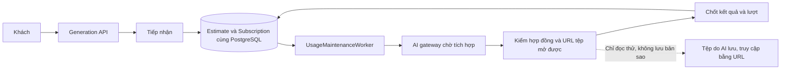
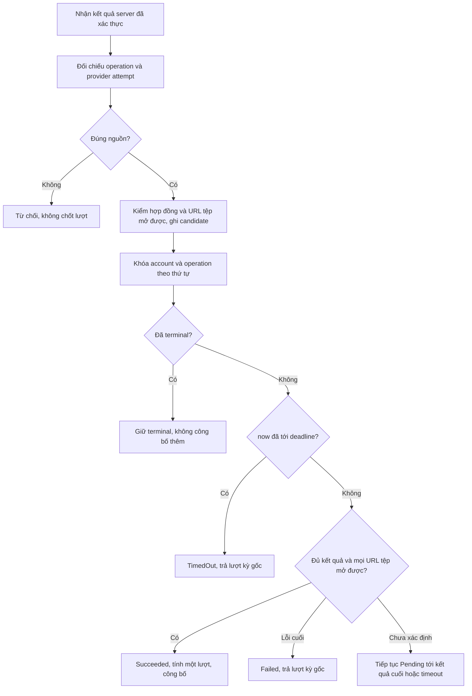
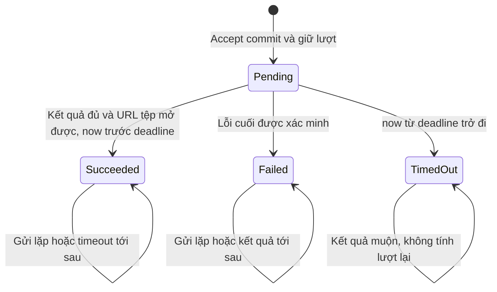
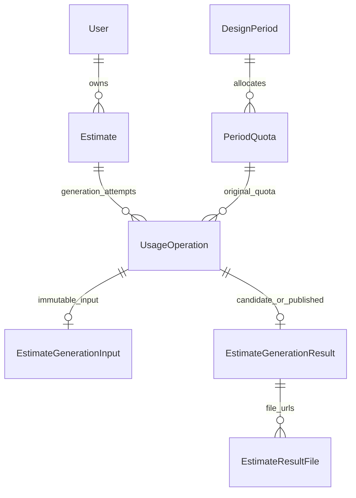

<!-- HƯỚNG DẪN CHO AI KHI ĐIỀN HOẶC CHỈNH SỬA MẪU
- Đọc toàn bộ mẫu, các comment hướng dẫn và tài liệu nguồn được cung cấp trước khi viết. Tuân thủ các quy tắc nghiệp vụ, điều kiện, ngoại lệ và giới hạn đã được xác nhận.
- Không bịa, tự chế hoặc suy đoán thành sự thật: yêu cầu, quy tắc, số liệu, API, schema, mã lỗi, nguồn tham khảo, người phụ trách và kết quả kiểm thử phải có căn cứ. Nội dung ví dụ trong mẫu không phải dữ kiện của dự án.
- Khi thiếu thông tin hoặc các nguồn mâu thuẫn, hỏi người dùng để làm rõ; giữ nguyên placeholder ở phần chưa xác định. Không tự chọn đáp án, lấp chỗ trống hay tuyên bố tài liệu đã hoàn tất.
- Chỉ thay nội dung cần điền hoặc được yêu cầu sửa. Không tự mở rộng phạm vi, sửa nghĩa quy tắc, bỏ điều kiện/ngoại lệ, xoá hay ghi đè nội dung hợp lệ đã có.
- Giữ nguyên tên, cấp và thứ tự heading, nhãn in đậm, tiền tố bullet, cấu trúc danh sách, tên/thứ tự/số cột bảng và cú pháp code fence. Không dịch, đổi tên, gộp hoặc thêm mục ngoài cấu trúc mẫu.
- Chỉ lặp khối luồng, AC hoặc API theo đúng khuôn khi có căn cứ; chỉ bỏ phần tuỳ chọn khi hướng dẫn riêng của mẫu cho phép và đã xác định không áp dụng.
- Mã tham chiếu và section phải trỏ tới tài liệu có thật đã được cung cấp hoặc kiểm chứng. Không giữ mã ví dụ như tham chiếu thật và không tự tạo tài liệu liên quan để hợp thức hoá liên kết.
- Giữ các comment hướng dẫn trong file. Xuất Markdown UTF-8, mỗi file một tài liệu; không bọc toàn bộ file trong code fence, không chèn lời dẫn hay giải thích ngoài mẫu.
- Trước khi bàn giao, đối chiếu nội dung với nguồn, kiểm tra cấu trúc, giá trị cho phép, giới hạn độ dài và tính nhất quán của mã/tham chiếu. Báo rõ phần chưa đủ thông tin; không tuyên bố đã chạy test hoặc import khi chưa thực hiện.
-->

<!-- Thay mã TDD-001 và nội dung ví dụ; giữ nguyên heading và nhãn in đậm.
Sơ đồ dùng mermaid, plantuml hoặc URL. Giữ heading Architecture, Sequence Diagram, Activity Diagram, State Diagram, Data Model.
Ví dụ API phải có heading trùng METHOD /path trong Endpoints. Xoá phần API/sơ đồ không dùng.
Version, Updated At và Change Log do lịch sử phiên bản quản lý, để trống khi nhập mới.
Author/Reviewer là tên hiển thị; gán tài khoản, phê duyệt, giả định và câu hỏi mở trên giao diện sau import.
Thiết kế phải truy vết về Story và Business Rule được cung cấp. Phân biệt thiết kế đề xuất với implementation đã kiểm chứng; không mô tả API/schema/sơ đồ ví dụ như hệ thống thật hoặc tự quyết định nghiệp vụ còn thiếu.
BẮT BUỘC KHI HOÀN THIỆN MẪU: phải có cả Reviewer và Approver, mỗi tên 1–200 ký tự sau khi bỏ khoảng trắng đầu/cuối. Không xoá hai dòng metadata, để trống, dùng tên bịa hoặc giữ placeholder rồi coi là hoàn tất.
Nếu chưa biết người review hoặc người phê duyệt, phải hỏi người dùng và báo tài liệu chưa đủ thông tin; không tự lấy Author/Owner làm người thay thế. Tên trong file không tự gán tài khoản hoặc xác nhận đã duyệt; gán thành viên trên giao diện sau import.
Đây là yêu cầu hoàn thiện mẫu; backend hiện vẫn nhận file cũ thiếu hai trường để tương thích.

VALIDATION CHO FILE NHẬP (đối chiếu ImportSnapshotValidator, MarkdownParser và ImportService):
- Mỗi file .md UTF-8 không rỗng chỉ có một heading cấp 1 chứa mã tài liệu dài 1–100 ký tự. Mã không được trùng trong cùng lần nhập hoặc thuộc loại tài liệu khác đã tồn tại.
- Không dùng tên README.md hoặc sitemap.md vì importer bỏ qua. Giao diện nhận .md/.zip, tối đa 2.000 file, tổng file tải lên 31 MiB; API giới hạn request 32 MiB và tổng nội dung đọc/giải nén 64 MiB.
- Chỉ nhập đè tài liệu cùng loại đang Draft, chưa có phiên bản và chưa lưu trữ. Import thay toàn bộ nội dung bản nháp, vì vậy phải giữ lại nội dung hợp lệ ngoài phần được yêu cầu sửa.
- Không dùng Status trong Markdown hoặc tên Approver để tự xác nhận phê duyệt; import không cấp quyền hay gán tài khoản từ tên. Chạy Kiểm tra file và xử lý lỗi/cảnh báo trước khi nhập.
- Giới hạn độ dài bên dưới tính theo string.Length của .NET (đơn vị UTF-16); không tự cắt ngắn dữ kiện quan trọng để vượt validation, hãy viết lại có căn cứ hoặc hỏi người dùng.
- Feature tối đa 300 ký tự và được dùng làm tiêu đề tài liệu. Status được parser nhận: Draft / In Review / Approved / Deprecated; tài liệu nhập mới vẫn có trạng thái phê duyệt Draft.
- Endpoint: đường dẫn tối đa 500 ký tự; tên/mô tả endpoint được lưu trong Name tối đa 300. HTTP method: GET / POST / PUT / PATCH / DELETE / HEAD / OPTIONS.
- Error Codes: mã tối đa 100 ký tự, không trùng trong tài liệu; giữ dạng - **CODE** (400): mô tả. HTTP status trong Error Codes và Response phải là số nguyên đọc được bằng Int32; không tự đặt status khác hợp đồng API.
- URL sơ đồ tối đa 1.000 ký tự. Mục sơ đồ được sử dụng phải có khối mermaid/plantuml hoặc URL theo mẫu; không để một mục sơ đồ rỗng. Nhãn mục được tách từ bullet như tên External API Fields tối đa 300 ký tự.
- Heading Examples phải khớp METHOD /path ở Endpoints. Giữ các nhãn Request:, Response 200: (thay mã theo contract) và Error Response: để parser tách đúng dữ liệu.
- Tham chiếu dạng DOC-KEY/section: ghi chú: mã đích tối đa 100 ký tự, section tối đa 100, ghi chú tối đa 1.000. Không trùng bộ mã đích + section + loại liên kết trong cùng tài liệu.
ĐỐI CHIẾU FORM TDD (src/features/tdds/validations.ts; form có thể chặt hơn import):
- Điền Feature, Author, Reviewer, Problem và ít nhất một Goal; các Goal/Non-goal/Notes đã thêm không được rỗng. API đã khai báo phải có endpoint và mô tả/mục đích; Fields phải có tên và ý nghĩa; Error Codes phải có mã, HTTP status và điều kiện.
- Form còn kiểm tra Version, Updated At và nội dung Change Log khi khai báo; với file nhập mới, giữ các trường lịch sử này trống theo hợp đồng import, không tự tạo dữ liệu lịch sử.
-->

# TDD-PROJ-002

## Document Info

- **Feature**: Tạo dự toán — điều phối AI, khóa đầu vào và quyết toán lượt
- **Author**: Codex
- **Reviewer**: Tân Trần
- **Approver**: Tân Trần
- **Status**: Draft
- **Version**:
- **Updated At**:

## Context & Goals

### Problem

STORY-PROJ-002 cần tiếp nhận đầu vào đã lưu, giữ một lượt, khóa sửa và chỉ tính đã dùng khi đủ kết quả đã lưu/có thể mở. AI do nhóm khác phụ trách; chưa có API, danh sách đầu ra bắt buộc, cơ chế callback/polling hoặc môi trường tích hợp. Thiết kế này hoàn thành ranh giới nội bộ và các bảo đảm dữ liệu; phần giao tiếp nhà cung cấp vẫn chờ hợp đồng. Ngày 26/09/2026 người dùng xác nhận làm trước toàn bộ phần của BMT với một adapter AI giả chạy trong tiến trình backend (không mở endpoint AI giả), xem đoạn quyết định bên dưới.

TDD-SUB-002 đã thiết kế `UsageOperation`, quota và worker, nhưng vẫn dùng tên Project và thứ tự khóa User. TDD-PAY-001/TDD-SUB-005 bổ sung AccountCommerceState và vòng đời kỳ. TDD này nối Estimate vào đúng sổ lượt đó và quy định một thứ tự khóa chung; không tạo bảng quota hoặc trạng thái cuối AI thứ hai.

Người dùng xác nhận ngày 26/09/2026 về tệp: backend không có kho tệp riêng. Ảnh đầu vào và ảnh phong cách được lưu bằng URL đã kiểm theo `UploadedFileOption__AllowedHosts` (TDD-PROJ-001), nên snapshot gửi AI dùng `inputImageUrl` và `imageUrl`. AI trả URL cho mọi tệp kết quả, kể cả PDF và Excel; backend chỉ lưu các URL đó, không tải về lưu lại và không tự dựng PDF/Excel. Cùng ngày, người dùng xác nhận cách xử lý địa chỉ trước khi gửi AI: xã giữ mã nhưng đổi tên vẫn là còn dùng và gửi AI bằng tên mới; khách chỉ phải chọn lại khi mã xã không còn hoặc không còn thuộc tỉnh (TDD-PROJ-001/Architecture). Hợp đồng API của AI service vẫn chưa có.

**Đã xác nhận ngày 26/09/2026 (lần 2) — làm trước với adapter AI giả**:

1. Chưa có hợp đồng API AI thật nên làm toàn bộ phần của BMT theo tài liệu này, với một cổng kết nối AI (`IEstimateAiGateway`) và một adapter giả (mock). Khi có API thật chỉ thay adapter; giữ nguyên ClaimEstimateDispatch, worker, kiểm và ghi candidate, lệnh chốt và ContractVersion. Hợp đồng của adapter giả là `mock-v1`.
2. Cập nhật theo yêu cầu ngày 06/10/2026: adapter giả bật bằng cấu hình `EstimateAiOption__Mode=Mock` ở Development, Staging hoặc Production. Môi trường tùy chỉnh khác mà đặt Mock thì API từ chối khởi động. Không cấu hình adapter thì yêu cầu tạo thiết kế trả 503 và không giữ lượt.
3. Adapter giả luôn thành công, không giả lập lỗi hay chậm. Nó trả một bộ kết quả mẫu cố định theo BR-PROJ-007: ảnh bìa, mặt bằng 2D, phối cảnh, bảng dự toán (JSON giả, ghi rõ là dữ liệu mẫu), PDF và Excel. URL năm tệp mẫu đọc từ cấu hình, tệp nằm trên kho presign. Người dùng chưa upload tệp mẫu nên giá trị mặc định là URL giữ chỗ, cần thay.
4. URL tệp kết quả của AI tạm được kiểm bằng `UploadedFileOption__AllowedHosts`. AI thật có cần danh sách tên miền riêng hay không vẫn là câu hỏi mở (Architecture/Notes).
6. Bổ sung cùng ngày (lần 3): URL tệp AI trả về sai dạng (không phải https tuyệt đối) hoặc có tên máy chủ ngoài danh sách cho phép thì tác vụ thất bại ngay với `InvalidProviderResult` và trả lượt ở kỳ gốc. URL đúng dạng nhưng đọc thử không được (404, lỗi mạng) vẫn chờ tới hạn 15 phút rồi hết hạn với `ResultFileUnavailable`.
7. Bổ sung cùng ngày (lần 4, phương án C): `UploadedFileOption__AllowedHosts` trống thì không tệp kết quả nào của AI được nhận, nên yêu cầu gửi AI trả 503 `DependencyUnavailable` ngay, không giữ lượt, không tạo tác vụ và không gọi AI, giống khi chưa cấu hình adapter.
5. Thời hạn một lần tạo mặc định 15 phút (`EstimateAiOption__GenerationTimeoutMinutes`). Job `ExpireStaleUsageJob` quét mỗi 60 giây (`UsageMaintenanceOption__ScanIntervalSeconds=60` là mặc định trong compose, `.env.sample` và workflow). Cả hai là cấu hình.

**Hiện trạng code (26/09/2026)**: thiết kế đã được triển khai trên nhánh `feature/estimate-generation` của `bmt-be` (commit `62a626d`, rebase lên `develop` tại `0263297` sau khi TDD-LIB-002 đã merge; quyết định URL tệp ở commit `624e212`), nay đã merge vào `develop` (đối chiếu ngày 28/09/2026). Migration `20260926141806_EstimateGeneration` tạo bằng `dotnet ef migrations add`, chưa áp dụng lên database dùng chung. Adapter AI thật vẫn chưa có vì chưa có hợp đồng API với bên AI. Route đọc kết quả của TDD-PROJ-003 đã có từ commit `f8a7ffa`. URL tệp mẫu cho adapter giả đã khai mặc định trong `.docker/compose.yaml` (`EstimateAiOption__Mock__*`); chưa kiểm các tệp đó có thật trên kho lưu trữ. Quyết định kỹ thuật khi triển khai ghi ở Architecture/Notes.

### Goals

- Tiếp nhận nguyên tử: đầu vào bất biến, UsageOperation Pending và Reserved tăng đúng một cùng commit.
- Kết thúc nguyên tử: kết quả được phép đọc, State=Succeeded, Reserved giảm và Used tăng đúng một cùng commit; lỗi/timeout chỉ giải phóng tại kỳ gốc.
- Không chạy hai tác vụ Pending/Succeeded trên một bản; gửi lặp, callback lặp và worker khởi động lại không tính lượt trùng.
- Kết quả muộn không được công bố, không gắn vào lần thử lại và không tính lại lượt.

### Non-goals

- Xây AI, tự tính giá/khối lượng, chọn bộ môn bản vẽ, số ảnh/tệp hoặc quy tắc chất lượng chuyên môn chưa có hợp đồng.
- Thêm lượt chỉnh sửa, bước khách duyệt mới trừ lượt, hủy tác vụ bởi khách hoặc tự tạo lần AI mới khi lỗi.
- Triển khai code, Unit Test chi tiết hoặc migration trong lần thiết kế ban đầu (đã triển khai sau đó, xem hiện trạng ở Problem).

## Architecture

**Tọa độ — bổ sung 01/10/2026, đã triển khai backend trên nhánh `feature/estimate-coordinates`:** US/BR và phần tọa độ của TDD-PROJ-001/002 đã được người dùng chốt trong hội thoại ngày 01/10/2026. Xác nhận này không thay trạng thái phê duyệt/import trên hệ thống tài liệu. Theo thiết kế TDD-PROJ-001, vị trí hiện tại được lưu ở `Estimate.Latitude/Longitude`; khi tiếp nhận AI, chép cả hai vào `address.latitude/longitude` của snapshot bất biến. `EstimateGenerationInputFactory.SchemaVersion` đã tăng từ 1 lên 2 và dùng record `EstimateGenerationSnapshotV2`; request gửi AI công khai vẫn chỉ có inputVersion, không nhận tọa độ mới chưa lưu. Xem [bàn giao tọa độ](../discovery/estimate-coordinates-implementation.md) về kết quả kiểm thử; chưa triển khai lên môi trường dùng chung hoặc tích hợp AI thật.

- `FindMissingForGeneration`/handler kiểm tọa độ đủ và trong miền trước reserve. Nếu đầu vào nội bộ bị sai, trả 422 `InvalidGenerationInput` theo latitude/longitude, không giữ lượt. Bản tạo nhanh được có cả cặp NULL theo TDD-PROJ-001; CHECK cặp và miền chặn dữ liệu sai ở DB, còn handler chặn thiếu tọa độ trước reserve; bước kiểm trong ứng dụng bảo vệ đường dựng snapshot và báo lỗi rõ.
- `ResolveAddressAsync` lấy cặp tọa độ từ đúng Estimate đang khóa. Khi nguồn hành chính đổi tên, chỉ cập nhật tên/phiên bản trong snapshot như hiện hành; không tự geocode lại hoặc đổi tọa độ vì tên đổi. Trong `SnapshotAddress` thêm hai số bắt buộc; factory ghi đúng cặp cùng InputVersion.
- V2 ghi một lần tại lúc accept. J1 nhận cặp A; J1 lỗi rồi khách đổi địa chỉ sang cặp B và thử lại thì J2 giữ B, J1 vẫn A. Worker gửi Payload và SchemaVersion đã lưu; không đọc tọa độ hiện tại của Estimate để dựng lại payload.
- Không sửa snapshot v1 lịch sử, không bổ sung tọa độ suy đoán vào payload cũ. Reader/adapter phải phân biệt SchemaVersion; đường cũ đang đọc payload thô tiếp tục đọc được v1, đường mới nhận v2. Adapter mock hiện nhận SchemaVersion và payload thô nên cần kiểm với v2; hợp đồng kết quả `mock-v1` giữ nguyên vì đây là phiên bản đầu ra, khác schema đầu vào. Hợp đồng AI thật vẫn chờ nhóm tích hợp, không tuyên bố nhà cung cấp nhận hai trường này.
- Không thêm cột Latitude/Longitude thứ hai vào EstimateGenerationInput: cặp lịch sử nằm trong Payload jsonb cùng địa chỉ. Không tạo index JSON hoặc đổi quan hệ/FK/quota. Không mở thêm dữ liệu tọa độ trên trang chia sẻ hoặc tự sửa tệp kết quả AI.
- Kiểm chứng bằng ST-PROJ-125 và các ca khóa đầu vào/quota hiện có. Đã bổ sung tọa độ vào UT-PROJ-023/065 và tạo UT-PROJ-127/128: kiểm snapshot v2 bất biến, giữ cặp khi nguồn hành chính đổi tên, từ chối dữ liệu sai trước reserve và worker gửi payload/schema đã lưu. Đã có mã backend và kết quả kiểm thử liên quan; xem [bàn giao tọa độ](../discovery/estimate-coordinates-implementation.md). Chưa chạy đầy đủ System Test qua FE hoặc AI thật.

**Bổ sung ngày 30/09/2026 — đã triển khai trên nhánh `feature/my-estimates`, chưa triển khai lên môi trường dùng chung:** [TDD-PROJ-005](TDD-PROJ-005.md) bổ sung thứ tự giữa xóa và tiếp nhận AI: cùng khóa account rồi Estimate, kiểm DeletedAtUtc trước replay/reserve. Bản Pending chặn xóa; bản đã xóa chặn mọi generation mới. Finalizer tiếp tục đọc lịch sử nội bộ, không hồi sinh bản hoặc sửa lượt vì xóa.

Tái sử dụng `UsageOperation` làm một lần sử dụng AI và nguồn trạng thái cuối. Module Estimate sở hữu đầu vào/kết quả; Subscription sở hữu kỳ, quyền, Used/Reserved và quyết định chốt lượt. Cả hai cùng PostgreSQL/DbContext, gọi service nội bộ cùng transaction thay vì gọi API HTTP giữa hai module.

| Thành phần dự kiến | Trách nhiệm |
|---|---|
| RequestEstimateGenerationHandler | Xác thực owner, khóa account/bản, replay key, kiểm inputVersion, kiểm đầu vào đầy đủ bằng `IEstimateInputPolicy.FindMissingForGeneration`, kiểm địa chỉ theo dữ liệu hiện hành qua `IEstimateLocationCatalog`, kiểm quyền/quota, tạo operation cùng input snapshot. |
| EstimateGenerationInputFactory | Tạo snapshot phiên bản nội bộ v2 từ dữ liệu đã xác minh (đã bổ sung tọa độ trên nhánh `feature/estimate-coordinates`, ngày 01/10/2026); chỉ đưa số tầng/phong cách khi `CanSelectFloor`/`CanSelectStyle` trả true; không nhận prompt/giá/quota tùy ý của client. |
| IDesignUsageCoordinator | Adapter tới store/policy TDD-SUB-002; Reserve/Complete/Fail/Expire tham gia UoW của handler gọi, không commit lồng. |
| UsageMaintenanceWorker | Worker theo TDD-SUB-002: nhận việc gửi AI, đối soát và timeout. Mỗi việc dùng scope/DbContext mới; không thêm RabbitMQ. Trong code: `EstimateGenerationWorker` (tiến trình nền) gọi `EstimateGenerationRunner` cho phần gửi, hỏi và chốt; tác vụ quá hạn do job Quartz `ExpireStaleUsageJob` có sẵn của TDD-SUB-002 trả lượt. |
| IEstimateAiGateway | Gửi/đối chiếu trạng thái theo hợp đồng nhà cung cấp sau này. Chưa có adapter thật; hiện có adapter giả `MockEstimateAiGateway` (`mock-v1`) và adapter "chưa cấu hình" `NotConfiguredEstimateAiGateway` khi không đặt Mode. |
| IEstimateResultValidator | Kiểm schema, nguồn operation/attempt và đủ bộ kết quả theo ContractVersion; thiếu contract không thể trả ResultReady. Trong code: mỗi adapter đăng ký một `IEstimateResultContract` theo ContractVersion (`MockEstimateResultContract` cho `mock-v1`); `EstimateResultVerifier` chọn đúng hợp đồng. |
| EstimateResultFileVerifier | Kiểm từng URL tệp trong kết quả, kể cả PDF/Excel: URL tuyệt đối https, tên máy chủ thuộc danh sách cho phép, mở được qua `IEstimateResultFileClient`. Không tải tệp về lưu lại và không trả URL gốc cho khách. Trong code gộp cùng bước kiểm hợp đồng ở `EstimateResultVerifier`. |
| IEstimateResultFileClient | Cổng đọc tệp theo URL do AI trả: kiểm mở được trước khi chốt (TDD này) và chuyển tiếp nội dung cho route tải của TDD-PROJ-003. Chỉ gọi URL https thuộc tên máy chủ cho phép, không theo chuyển hướng sang máy chủ khác. |
| FinalizeEstimateGenerationHandler | Khóa và đọc lại operation/kỳ gốc; quyết định thành công/lỗi/quá hạn, công bố kết quả cùng quyết toán quota. |



**Notes**:

- **Ranh giới tài nguyên**: UsageKind vẫn là DesignGeneration, ResourceId cho luồng này chính là Estimate.Id. Bổ sung `EstimateId` có FK thật như Data Model; không mở lại `/projects/...` làm route dự toán. Gói giám sát gắn với Công trình (tên kỹ thuật `ConstructionSite`; một số TDD giám sát cũ còn gọi là Project), là thực thể riêng do khách tạo, đặc tả ở STORY-SITE-001 và [TDD-SITE-001](TDD-SITE-001.md), không liên kết bản dự toán trong đợt này (BR-SUB-007/Notes). Không tự đổi nghĩa Project/Công trình thành Estimate.
- **Một điểm khóa chung**: mọi thao tác nhận AI/chốt/timeout/tạo-lưu dự toán/cấp-đổi-hủy-khôi phục gói lấy AccountCommerceState của chủ tài khoản trước. Luồng dự toán sau đó khóa Estimate → DesignSubscription → DesignPeriod → PeriodQuota → UsageOperation → dữ liệu kết quả. Luồng không dùng Estimate bỏ qua bước đó; không được lấy operation/quota rồi quay lại khóa account. Xác định OwnerId từ bản ghi trước khi xin khóa chỉ để định tuyến, phải đọc lại/kiểm owner dưới khóa. Worker scan không giữ khóa hàng khi gọi một handler cần khóa account. Đổi tên bản dự toán không đọc gói/lượt nên không lấy AccountCommerceState; nó chỉ cập nhật một dòng Estimate bằng câu UPDATE có điều kiện, không đảo thứ tự khóa của các luồng trên.
- TDD-SUB-002 cần đổi triển khai dự kiến từ khóa User sang AccountCommerceState cho toàn bộ đường quota, kể cả tra cứu, không chỉ endpoint dự toán. Nếu còn một đường chỉ khóa User, việc hủy/đổi gói có thể tranh với giữ lượt mà không được tuần tự hóa. Đây là thống nhất kỹ thuật với PAY, không thay nghiệp vụ quyền lợi. Không bật tính năng khi nền quota chưa thực hiện thống nhất.
- Hiệu lực mới: CurrentPeriodId đúng kỳ + LifecycleState=Active + nằm trong thời hạn + có design.generate; finite còn `Limit-Used-Reserved>=1`. Unlimited ghi Used/Reserved cho đối soát theo TDD-SUB-002 nhưng không có số dư hữu hạn và không chặn theo Used. Cơ bản/Tiêu chuẩn/VIP đầu vào không cấp entitlement; Boolean/3D hoặc cờ phong cách không cắt kết quả.
- **Replay trước kiểm quyền dùng mới**: sau xác thực/owner, tìm `(AccountId,DesignGeneration,OperationKey)`. Hash lấy `estimateId,inputVersion,operationKind`, không lấy bản đầu vào hiện tại đã thay đổi khi retry sau lỗi. Cùng key/hash trả operation cũ (200) dù kỳ hết hạn, không gửi lại AI hoặc giữ thêm. Khác hash trả 409. Key mới sau Failed/TimedOut là lần thử chủ động, kiểm lại quyền hiện hành; cùng key của lần Failed không trở thành tác vụ mới.
- Chỉ reserve khi adapter/contract/config thời gian chờ và danh sách tên máy chủ tệp `UploadedFileOption__AllowedHosts` sẵn sàng, và toàn bộ đầu vào hợp lệ. Lỗi cấu hình trước accept trả 503 không giữ lượt. Trong transaction tiếp nhận, khóa bản và kiểm InputVersion, kiểm không Pending/Succeeded, đóng băng input, thêm UsageOperation Pending và tăng Reserved. Commit là mốc tiếp nhận; frontend nhận 202 sau commit, không phải sau lời gọi AI. Đổi tên bản dự toán dùng NameVersion riêng và không tăng InputVersion (TDD-PROJ-001/Architecture), nên khách đổi tên ngay trước hoặc trong lúc bấm nhận dự toán không làm yêu cầu gửi AI bị InputVersionConflict. Hash replay cũng không chứa tên.
- Snapshot giữ input, catalogRevision, tên/ID của các lựa chọn danh mục tương ứng, areaM2 nguyên giá trị, URL ảnh đầu vào (`inputImageUrl`) và URL ảnh phong cách (`imageUrl`), địa chỉ đã kiểm theo dữ liệu hiện hành và gói hoàn thiện. Snapshot không chứa tên bản dự toán, vì tên không phải đầu vào gửi AI (BR-SUB-007 khoản 11). Snapshot không thay quota hiện hành khi khách retry, cũng không tự thêm phong cách mặc định khi một nhóm tắt. Mỗi operation có input riêng, nên sửa bản sau J1 lỗi không thay dữ liệu của J1.
- `DeadlineUtc=AcceptedAtUtc+ConfiguredGenerationTimeout`; bao gồm thời gian chờ gửi, nhận và lưu kết quả. Mặc định 15 phút, đọc từ `EstimateAiOption__GenerationTimeoutMinutes` (người dùng xác nhận ngày 26/09/2026). Lấy EffectiveNow sau đủ khóa bằng đồng hồ server, không dùng thời gian kết thúc AI do provider tự khai để vượt deadline. Khi chốt `now>=DeadlineUtc` thì TimedOut, kể cả callback vừa tới trước lúc quét. Tác vụ đã Succeeded trước đó giữ nguyên.
- **Lease không phải giấy phép gửi lại**: worker nhận dòng NotStarted bằng transaction ngắn, đặt Sending, lease token rồi gọi AI ngoài SQL. Nếu hết lease lúc chưa rõ provider đã nhận, đặt Unknown, đối chiếu bằng operationId/attemptId nếu provider hỗ trợ. Không mặc định gửi lại vì worker chết. Nhà cung cấp không có truy vấn/chống trùng thì chờ timeout; không tạo operation mới hay lặp HTTP POST mù. Worker khác không ghi trạng thái dispatch bằng lease cũ.
- Lỗi truyền mạng sau gửi và lỗi nghiệp vụ cuối cùng khác nhau. Provider trả lỗi cuối được xác thực → Failed và giải phóng. Không biết đã nhận → Pending/Unknown tới khi đối chiếu hoặc timeout. Thử lại giao dịch SQL thuần dùng DbContext mới, cùng operation/key; không đặt HTTP gọi AI trong vòng retry DB.
- **Công bố bằng transaction**: kiểm URL tệp mở được và ghi candidate (payload JSON cùng danh sách URL tệp) ngoài transaction dài; sau đó lock/check lại deadline/attempt/state. Chỉ transaction chốt mới gắn ResultRef và Succeeded cùng thay quota. Truy vấn đọc kết quả luôn JOIN operation Succeeded, không dựa vào có URL tệp hoặc có dòng Result. Lỗi SQL cuối để candidate chưa công bố; lần chốt lại không gọi AI. Backend không ghi tệp ở đâu cả, nên không có vùng tạm cần dọn: candidate chỉ là dòng DB mà không route nào đọc được khi operation chưa Succeeded.
- **Tệp kết quả lưu bằng URL** (người dùng xác nhận ngày 26/09/2026): AI trả URL cho mọi tệp kết quả, gồm ảnh, bản vẽ, PDF và Excel. Backend lưu mỗi URL thành một dòng `EstimateResultFile`, không tải về lưu lại và không tự dựng PDF/Excel. Trước khi chốt, `EstimateResultFileVerifier` kiểm từng URL: tuyệt đối, https, tên máy chủ thuộc danh sách cho phép, và mở được qua `IEstimateResultFileClient` (đọc thử, không lưu bytes). Một URL sai dạng (không phải URL tuyệt đối https) hoặc có tên máy chủ ngoài danh sách cho phép là sai hợp đồng: J1 thất bại ngay với `InvalidProviderResult` và trả lượt ở kỳ gốc (người dùng xác nhận ngày 26/09/2026, lần 3). Một URL đúng dạng nhưng không mở được thì bộ kết quả chưa đủ, không được Succeeded. Ví dụ: AI báo xong J1 với ba URL, một URL trả 404 → không chốt; nếu AI không gửi lại bộ đủ trước hạn thì J1 TimedOut và trả lượt. Giới hạn: backend không giữ bản sao, nên nếu sau này AI xóa tệp hoặc URL hết hạn thì hồ sơ không tải được dù J1 vẫn Succeeded; thời hạn giữ tệp phía AI là câu hỏi mở bên dưới. Khách không bao giờ nhận URL gốc; mọi lần xem/tải đi qua route có kiểm quyền của TDD-PROJ-003.
- **Kiểm địa chỉ và lựa chọn trước khi gửi AI** (theo TDD-PROJ-001/Architecture, mục nguồn địa chỉ và nhóm lựa chọn tắt): đây là bước của `RequestEstimateGenerationHandler`, chạy trước khi giữ lượt. Các bước dưới đây đã có trong `RequestEstimateGenerationCommandHandler` (commit `62a626d`).
  1. Trước khi khóa dòng, gọi `IEstimateLocationCatalog.PrepareAsync` rồi `GetProvincesAsync` để nạp sẵn dữ liệu và lấy phiên bản hiện hành. Không gọi HTTP khi đang giữ khóa. Nguồn lỗi ở bước này chỉ được báo nếu yêu cầu thật sự cần địa chỉ, nên lần gửi lại một tác vụ đã nhận vẫn trả tác vụ đó.
  2. Sau khi khóa và đọc lại Estimate, kiểm đầu vào đủ bằng `IEstimateInputPolicy.FindMissingForGeneration(state, catalog)` với `EstimateCatalogSnapshot` của revision đã ghim. Hàm này chỉ đòi nhóm đang bật và dùng `CanSelectFloor`/`CanSelectStyle`, nên không đọc thẳng danh sách của nhóm tắt. Thiếu trường nào thì trả 422 `InvalidGenerationInput` theo trường, không giữ lượt.
  3. So `Estimate.LocationDatasetVersion` với phiên bản hiện hành. Trùng thì dùng mã và tên đã lưu. Khác thì gọi `VerifyAsync(phiên bản hiện hành, ProvinceCode, WardCode)`: kết quả NULL (mã xã không còn hoặc không còn thuộc tỉnh) → 422 `InvalidGenerationInput` với trường `wardCode`, khách phải chọn lại xã; có kết quả → dùng `ProvinceName`/`WardName` mới trong snapshot, kể cả khi xã chỉ đổi tên. Handler không ghi đè cột địa chỉ của Estimate, vì việc này sẽ đổi InputVersion ngoài ý khách; snapshot ghi `datasetVersion` là phiên bản hiện hành.
  4. Nếu dữ liệu địa chỉ được làm mới giữa bước 1 và bước 3, `VerifyAsync` ném 409 `LocationDatasetChanged`; transaction rollback, không giữ lượt, khách bấm gửi lại. Nếu chưa có bản dữ liệu nào và nguồn lỗi thì 503 `DependencyUnavailable`, cũng không giữ lượt.
  5. `EstimateGenerationInputFactory` chỉ đưa số tầng, tum và phong cách của nhóm đang bật vào snapshot; nhóm tắt luôn là NULL, kể cả khi Estimate còn giữ giá trị cũ thuộc danh sách của nhóm tắt.
  - URL ảnh trong snapshot là URL đã kiểm tên miền khi lưu (TDD-PROJ-001). Handler không kiểm lại tên miền khi gửi AI, cùng nguyên tắc với TDD-PROJ-001: đổi danh sách tên miền không chặn bản đã lưu. AI tự tải ảnh từ các URL này.
- **Câu hỏi mở (chờ hợp đồng AI, chưa chốt)**: (1) endpoint, xác thực, cách gửi và nhận kết quả của AI service (webhook hay hỏi định kỳ, AI có tra được tác vụ theo `operationId` không); (2) URL tệp của AI có hết hạn không, cần xác thực không và AI giữ tệp bao lâu; (3) tên máy chủ tệp của AI dùng chung `UploadedFileOption__AllowedHosts` (tức AI ghi vào cùng kho presign) hay cần danh sách cấu hình riêng; (4) PDF/Excel có bắt buộc có mặt lúc AI báo thành công hay được AI tạo sau qua thao tác riêng (xem TDD-PROJ-003/Architecture); (5) danh sách vai trò tệp và schema bảng dự toán thật để viết hợp đồng thay `mock-v1`. Trong lúc chờ: dùng adapter giả trong tiến trình, không mở endpoint AI giả; tạm kiểm tên máy chủ tệp bằng `UploadedFileOption__AllowedHosts` (quyết định ngày 26/09/2026) và chưa đặt tên cấu hình cho danh sách riêng của AI.
- Nếu J1 timeout trong lúc tải kết quả, finalizer thấy terminal và không công bố. J2 có snapshot/result ID khác, không tìm “bản dự toán đang chạy” để đoán operation callback. Callback lặp sau Succeeded cùng kết quả chỉ ACK nội bộ, không tăng Used; callback khác nội dung cùng operation/attempt bị ghi nhận bất thường, không thay nguồn đã công bố.
- Hết hạn, hủy hoặc đổi kỳ sau tiếp nhận không hủy J1. Chốt vào `UsageOperation.PeriodId/BenefitId`, không tìm kỳ mới để giảm/tăng bộ đếm. Finalizer không dùng policy “được tạo mới” để từ chối lưu kết quả của tác vụ đã được nhận.
- **Adapter AI giả và cách thay adapter thật** (quyết định ngày 26/09/2026, Problem):
  - Adapter là lớp trong tiến trình backend, cài cổng `IEstimateAiGateway`, không phải một endpoint HTTP giả. Cổng có bốn phần: `IsConfigured`, `ContractVersion`, `SupportsLookupByOperationId` (AI tra được tác vụ theo mã BMT khi chưa có mã lần xử lý), `SubmitAsync` trả Accepted/Completed/Rejected/NotDelivered và `PollAsync` trả Running/Completed/Failed/NotFound. Kết quả là `EstimateAiResult` gồm operationId, providerAttemptId, contractVersion, payload JSON và danh sách `{roleKey, ordinal, fileUrl}`.
  - Chọn adapter bằng `EstimateAiOption__Mode`. Trống: đăng ký `NotConfiguredEstimateAiGateway`, không chạy worker, `IEstimateGenerationAvailability` trả "chưa sẵn sàng" nên POST generations trả 503 `DependencyUnavailable` trước khi giữ lượt. `IEstimateGenerationAvailability` cũng trả "chưa sẵn sàng" khi `UploadedFileOption__AllowedHosts` trống (`IUploadedFileUrlPolicy.IsConfigured`), kể cả khi đã bật Mock. `Mock`: đăng ký `MockEstimateAiGateway`, hợp đồng `MockEstimateResultContract` và worker. `AddEstimateAiInfrastructure` kiểm Mode lúc khởi động: giá trị lạ, hoặc `Mock` ngoài Development/Staging/Production, thì ném lỗi để API dừng khởi động.
  - Adapter giả không giữ trạng thái: gửi luôn trả Accepted với mã lần xử lý `mock-{operationId}`; hỏi (theo mã lần xử lý hay theo mã tác vụ) luôn trả cùng một bộ kết quả `mock-v1`. Payload có `isSample=true`, ghi chú là dữ liệu mẫu, ba phần `rough`/`finishing`/`interior`, `total` và `consultation`; số tiền là số giả cố định, không lấy từ website mẫu và không phụ thuộc đầu vào. Năm tệp có vai trò `cover-image`, `floor-plan-2d`, `perspective`, `dossier-pdf`, `estimate-xlsx`, URL đọc từ `EstimateAiOption__Mock__CoverImageUrl`, `__FloorPlanUrl`, `__PerspectiveUrl`, `__DossierPdfUrl`, `__EstimateXlsxUrl`. Mặc định là URL giữ chỗ `https://bmt.hcm.ss.bfcplatform.vn/mock-ai/v1/...`, chưa có tệp. Backend vẫn kiểm tên máy chủ và đọc thử từng URL như với AI thật, nên chừng nào chưa upload tệp mẫu thì tác vụ không thành công và hết hạn với `ResultFileUnavailable`. Đây là hành vi đúng của bước kiểm tệp.
  - Worker nhận kết quả ở lượt quét sau lần gửi (mặc định cách nhau `EstimateAiOption__PollIntervalSeconds=5` giây), nên luồng vẫn bất đồng bộ như thật dù adapter không có độ trễ.
  - Khi có API thật: thêm một giá trị Mode, viết adapter cài `IEstimateAiGateway` và một `IEstimateResultContract` cho ContractVersion của đối tác, rồi đăng ký trong `AddEstimateAiInfrastructure`. Handler tiếp nhận, worker, bước kiểm và ghi candidate, lệnh chốt và schema giữ nguyên. Adapter giả không chứng minh hợp đồng thật; kết quả chạy với nó chỉ là kết quả với giả lập.
- **Quyết định kỹ thuật khi triển khai (26/09/2026)**, không đổi nghiệp vụ:
  - Tên trong code: `RequestEstimateGenerationCommandHandler`, `RecordEstimateResultCandidateCommandHandler` (port RecordEstimateResultCandidate), `FinalizeEstimateGenerationCommandHandler` (FinalizeEstimateGeneration; FailEstimateGeneration là cùng lệnh với `failureCode`), `GetEstimateGenerationQueryHandler`, `DesignUsageCoordinator` (IDesignUsageCoordinator), `EstimateGenerationStore` (`ClaimDispatchAsync` là ClaimEstimateDispatch). ExpireDesignUsage dùng lệnh `SettleDesignUsageCommand` có sẵn qua `ExpireStaleUsageJob`.
  - Khóa ngoại ghép của bản chụp và kết quả trỏ tới khóa thay thế `UsageOperation(Id, AccountId, ResourceId)` và `(Id, ResourceId)`, không phải `(…, EstimateId)` như Data Model ghi: EF không cho khóa thay thế trên cột NULL, mà EstimateId NULL với tra cứu mẫu. CHECK `CK_UsageOperation_EstimateResource` buộc `ResourceId = EstimateId` với tạo thiết kế, và bảng con có khóa ngoại riêng tới `Estimate`, nên tác dụng như nhau (cùng lý do dùng index trên ResourceId ở Data Model).
  - Nhận việc: một câu `UPDATE … FROM (SELECT … FOR UPDATE SKIP LOCKED)` tự commit, chỉ khóa dòng UsageOperation rồi nhả ngay, không xin khóa tài khoản khi đang giữ khóa dòng tác vụ. Chỉ nhận tác vụ tạo thiết kế Pending còn hạn, chưa có lease còn hiệu lực. NotStarted chuyển Sending; Sending hết lease chuyển Unknown. Mỗi lần ghi của worker kèm điều kiện đúng `DispatchLeaseToken` và còn Pending. Tác vụ đã tới hạn không được nhận; job quá hạn trả lượt.
  - Unknown: adapter tra được theo mã tác vụ thì đối chiếu; AI trả NotFound (xác nhận chưa từng nhận) thì mới quay về NotStarted để gửi. Adapter không tra được thì chờ tới hạn, không gửi lại. Ngoại lệ lúc gửi ghi Unknown với `DispatchErrorCode=ProviderUnreachable`; `NotDelivered` (chắc chắn chưa gửi) quay về NotStarted.
  - Kiểm kết quả: sai hợp đồng (không có validator cho ContractVersion, payload không phải object, thiếu phần bắt buộc, tệp lặp vai trò/thứ tự, URL tệp không phải https tuyệt đối hoặc dài quá 2048 ký tự, tên máy chủ ngoài danh sách) là lỗi cuối → Failed `InvalidProviderResult` ngay, trả lượt ở kỳ gốc, không đọc thử URL nào (quyết định ngày 26/09/2026, lần 3). URL đúng dạng nhưng đọc thử không được (404, lỗi mạng), hoặc danh sách tên máy chủ chưa cấu hình (lớp phòng thủ, lẽ ra không tới được vì yêu cầu mới đã bị 503 khi danh sách trống; chỉ xảy ra nếu danh sách bị xóa sau khi tác vụ đã được nhận) → chưa ghi candidate, ghi `DispatchErrorCode=ResultFileUnavailable`, kiểm lại ở lượt sau tới hạn. Client đọc thử gửi HEAD (máy chủ không nhận HEAD thì GET một byte), không theo chuyển hướng, hạn chờ `EstimateAiOption__FileProbeTimeoutSeconds` (mặc định 10 giây).
  - Mã lý do: job chung của TDD-SUB-002 chốt quá hạn với mã `UsageTimedOut` của nó. Khi đọc, TimedOut được trả thành `ResultFileUnavailable` nếu `DispatchErrorCode` gần nhất là mã này, còn lại là `GenerationTimedOut`; lệnh chốt của tài liệu này ghi thẳng hai mã đó. Không sửa job chung.
  - Ghi candidate bỏ qua tác vụ không còn Pending và lần xử lý khác lần đã ghi nhận; khác nội dung với candidate đã có chỉ ghi log cảnh báo. PayloadHash là SHA-256 của ContractVersion, payload đã bỏ khoảng trắng và danh sách tệp sắp theo vai trò/thứ tự.
  - Bản chụp và payload mẫu lưu tiếng Việt nguyên dạng (không đổi thành `\uXXXX`) để đọc được khi đối soát.
  - Chưa làm: kiểm worker còn chạy trước khi nhận việc mới (hiện chỉ kiểm có adapter, hợp đồng và thời hạn), metric riêng (hiện chỉ có log theo operationId), và ánh xạ riêng lỗi unique của index sống sang 409 `GenerationInProgress` (mọi đường tiếp nhận đã khóa tài khoản và bản dự toán nên không gặp). Route `GET /api/v1/estimates/{estimateId}/result` mà `resultUrl` trỏ tới đã có khi triển khai TDD-PROJ-003 (commit `f8a7ffa`, nhánh `feature/estimate-sharing`).
  - Bổ sung khi triển khai TDD-PROJ-003 (commit `f8a7ffa`): `IEstimateResultFileClient` có thêm `OpenAsync` để chuyển tiếp tệp, và cả đọc thử lẫn mở tệp đều kiểm tên máy chủ trước mỗi lần gọi qua phần đọc tệp dùng chung với TDD-LIB-002; `IEstimateResultContract` có thêm `ProjectDossier` và `ExportFileRole`; hợp đồng `mock-v1` luôn được đăng ký để hồ sơ đã lưu vẫn đọc được khi tắt adapter giả. Việc nhận yêu cầu tạo thiết kế không đổi.
- Theo pipeline hiện có, Failed/TimedOut là kết quả xử lý cần commit: trả DTO trạng thái bình thường sau khi giải phóng, không ném exception làm rollback khoản trả lượt. Exception chỉ dùng khi transaction phải bỏ toàn bộ thay đổi. Không tự mở khóa đầu vào bằng một cờ rời: hết Pending thì khả năng sửa được tính lại cùng quyền hiện tại. Khóa này chỉ áp cho đầu vào: trong lúc Pending, chủ sở hữu vẫn đổi được tên bản dự toán qua PATCH /name của TDD-PROJ-001 (STORY-PROJ-002/EXC-02 bước 3); đổi tên không chạm UsageOperation, snapshot hay quota.

## Sequence Diagram

```mermaid
sequenceDiagram
    actor C as Khách
    participant API as Estimate API
    participant DB as PostgreSQL
    participant W as Worker
    participant AI as AI service
    participant L as Nguồn địa chỉ (bản lưu Redis)
    participant FS as Tệp do AI lưu (URL)
    C->>API: POST generation, key, inputVersion
    API->>L: PrepareAsync, lấy phiên bản hiện hành (trước khi khóa)
    API->>DB: Khóa account và dữ liệu; kiểm owner/key/input/quota
    API->>L: VerifyAsync nếu LocationDatasetVersion khác bản hiện hành
    L-->>API: Mã và tên xã hiện hành, hoặc NULL thì trả 422 wardCode
    API->>DB: Snapshot + Pending + Reserved tăng 1
    DB-->>API: Commit tiếp nhận
    API-->>C: 202 operationId
    W->>DB: Claim dispatch với lease token
    W->>AI: Gửi operationId và snapshot ngoài SQL
    AI-->>W: Kết quả đúng attempt kèm URL tệp, hoặc lỗi
    W->>FS: Đọc thử từng URL tệp, không lưu bản sao
    W->>DB: Ghi candidate gồm payload và URL tệp
    W->>DB: Khóa lại theo thứ tự; kiểm state và deadline
    alt Pending và trước hạn, đủ kết quả
      W->>DB: ResultRef + Succeeded + Reserved giảm + Used tăng
      DB-->>W: Commit công bố
    else Lỗi hoặc quá hạn
      W->>DB: Failed hoặc TimedOut + Reserved giảm tại kỳ gốc
      DB-->>W: Commit, không công bố candidate
    end
    C->>API: GET operation
    API-->>C: Trạng thái và route đọc kết quả của backend nếu thành công, không lộ URL gốc
```

## Activity Diagram



## State Diagram



Khách thử lại tạo operation khác từ đầu; không có Failed→Pending trên cùng dòng. DispatchState chỉ theo dõi đường gửi (`NotStarted/Sending/Sent/Unknown`), không thay State quyết toán.

## Data Model

Dùng lại DesignSubscription, DesignPeriod, PeriodQuota và UsageOperation theo [TDD-SUB-002/Data Model](TDD-SUB-002.md#data-model), bổ sung LifecycleState theo [TDD-SUB-005/Data Model](TDD-SUB-005.md#data-model). AccountCommerceState theo [TDD-PAY-001/Data Model](TDD-PAY-001.md#data-model). Không nhân bản schema/quota vào Estimate. Nguồn mẫu các bảng này ở đúng các mục liên kết; bên dưới chỉ minh họa delta khi chạy dự toán.

| Bảng mới/thay đổi | Một dòng và thời điểm ghi |
|---|---|
| UsageOperation — mở rộng | Một lần tạo thiết kế đã được tiếp nhận. Thêm FK rõ ràng tới Estimate và khóa lease; vẫn là nguồn trạng thái cuối, key/hash, kỳ giữ và deadline duy nhất. |
| EstimateGenerationInput | Một snapshot bất biến của đầu vào thuộc một UsageOperation. Ghi cùng tiếp nhận; không sửa khi bản nháp thay đổi sau lỗi. |
| EstimateGenerationResult | Một bộ kết quả đã kiểm tra và lưu của đúng operation/attempt. Có thể tồn tại dưới dạng candidate chưa công bố trước finalization; chỉ công bố qua operation Succeeded. Không phải bảng tính lại dự toán. |
| EstimateResultFile | Một tệp thuộc bộ kết quả nguồn (ảnh, bản vẽ, PDF hoặc Excel), lưu bằng URL do AI trả. Worker ghi cùng candidate sau khi kiểm URL mở được; không sửa sau đó. RoleKey theo hợp đồng, không tự hardcode số lượng. Bảng này thay cho EstimateResultAsset và EstimateAsset của bản thiết kế trước. |

| Bảng | Cột, null và ràng buộc |
|---|---|
| UsageOperation bổ sung | EstimateId uuid NULL; DispatchLeaseToken uuid NULL; DispatchErrorCode varchar(100) NULL. FK(AccountId,EstimateId) → Estimate(OwnerId,Id); CHECK (UsageKind=DesignGeneration AND EstimateId IS NOT NULL AND ResourceId=EstimateId) OR (UsageKind=TemplateDetail AND EstimateId IS NULL). UNIQUE(Id,AccountId,EstimateId); UNIQUE(Id,EstimateId) — trong code là khóa thay thế trên ResourceId, lý do ở Architecture/Notes. DispatchState giới hạn NotStarted/Sending/Sent/Unknown và không NULL cho DesignGeneration; TemplateDetail NULL. |
| EstimateGenerationInput | OperationId uuid PK; AccountId uuid NN; EstimateId uuid NN; InputVersion bigint NN CHECK>0; SchemaVersion int NN CHECK>0; CatalogRevisionId uuid NN; Payload jsonb NN CHECK object; InputImageUrl varchar(2048) NULL CHECK NULL hoặc bắt đầu bằng https:// (không phân biệt hoa thường); CreatedAtUtc timestamptz NN. FK(OperationId,AccountId,EstimateId) → UsageOperation(Id,AccountId,EstimateId); FK(EstimateId,CatalogRevisionId) → Estimate(Id,CatalogRevisionId). InputImageUrl là bản chụp `Estimate.InputImageUrl` lúc tiếp nhận, trùng giá trị `inputImageUrl` trong Payload; cả hai ghi một lần, không có khóa ngoại tới bảng tệp. |
| EstimateGenerationResult | OperationId uuid PK; EstimateId uuid NN; ProviderAttemptId varchar(200) NN; ContractVersion varchar(100) NN; Payload jsonb NN CHECK object; PayloadHash char(64) NN; StoredAtUtc timestamptz NN; ReadVerifiedAtUtc timestamptz NN (lúc backend kiểm xong mọi URL tệp mở được); FK(OperationId,EstimateId) → UsageOperation(Id,EstimateId); UNIQUE(OperationId,EstimateId). |
| EstimateResultFile | Id uuid PK; OperationId uuid NN; EstimateId uuid NN; RoleKey varchar(100) NN; Ordinal int NN CHECK>=0; FileUrl varchar(2048) NN CHECK bắt đầu bằng https:// (không phân biệt hoa thường); UNIQUE(OperationId,RoleKey,Ordinal); UNIQUE(Id,EstimateId); FK(OperationId,EstimateId) → EstimateGenerationResult(OperationId,EstimateId). Tên máy chủ thuộc danh sách cho phép kiểm ở verifier, không kiểm bằng CHECK. Giới hạn 2048 theo quy ước URL của TDD-PROJ-001; nếu hợp đồng AI có URL dài hơn thì xem lại. Id dùng làm tham số route tải của TDD-PROJ-003, để URL gốc không xuất hiện trong route. |

PK/FK mới dùng RESTRICT. FK vòng input/result với UsageOperation đi một chiều qua OperationId; `InputRef/ResultRef` giữ locator nội bộ `estimate-input:<operationId>` và `estimate-result:<operationId>` để tương thích port SUB. Không coi locator text là URL hoặc quyền đọc. Finalizer xác nhận tồn tại dòng tương ứng trước commit; unique Result OperationId bảo vệ một nguồn cho mỗi lần gọi.

Partial unique của TDD-SUB-002 dùng index đã có trong code: `UX_UsageOperation_LiveDesignGeneration` trên **ResourceId** WHERE UsageKind='DesignGeneration' AND State IN ('Pending','Succeeded') (migration `20260923173731_DesignSubscription`, `UsageOperationConfiguration`; kiểm trên `develop` của `bmt-be` tại `c1d757a`). Bản thiết kế trước đặt tên `UX_Usage_Estimate_Live` trên cột EstimateId dự kiến; không tạo index đó. Vì CHECK ở trên bắt `ResourceId=EstimateId` với DesignGeneration, index trên ResourceId chặn đúng những gì index trên EstimateId chặn, nên không tạo hai index đồng nghĩa. Index ngăn hai tác vụ sống trên cùng bản; Failed/TimedOut vẫn giữ lịch sử và không chiếm slot. Khóa thương mại bảo vệ quota tài khoản; index này bảo vệ tài nguyên, cả hai cần thiết.

Kết quả JSON chưa có schema nhà cung cấp nên không chốt cấu trúc tiền/bản vẽ giả. ContractVersion gắn với validator và mapper đã triển khai trước khi bật tích hợp. Các trường được dùng cho FK/quyền/trạng thái không nằm riêng trong JSON. Payload là nội dung chuyên môn bất biến để đọc/xuất; không tạo GIN index khi chưa có truy vấn phần tử. Không dùng `jsonb` để né ràng buộc quota.

**Snapshot nội bộ v2 — đã bổ sung tọa độ trong mã backend ngày 01/10/2026** gồm `estimateId,inputVersion,catalogRevisionId,buildingType{id,name},areaM2,description,address{datasetVersion,provinceCode,provinceName,wardCode,wardName,detail,latitude,longitude},finishPackage,floorCount,hasTum,architectureStyle{id,name,imageUrl}|null,interiorStyle{...}|null,inputImageUrl|null`. ID đều từ DB đã kiểm; areaM2 chuỗi thập phân theo TDD-PROJ-001. `address` lấy theo dữ liệu địa chỉ hiện hành sau bước kiểm ở Architecture/Notes: `datasetVersion` là phiên bản hiện hành, tên tỉnh/xã là tên mới nếu nguồn đã đổi tên. `imageUrl` lấy từ `CatalogStyle.ImageUrl` của revision đã ghim, `inputImageUrl` từ `Estimate.InputImageUrl`; cả hai đã được kiểm theo `UploadedFileOption__AllowedHosts` khi lưu. Đây là contract nội bộ BMT, không khẳng định AI chấp nhận payload này. Adapter chuyển ID/ảnh sang format được đối tác xác nhận, giữ đúng nghĩa NULL của nhóm không chọn. `buildingType.name` và tên phong cách là tên lựa chọn trong revision đã ghim; tên bản dự toán (`Estimate.Name`) không có trong snapshot.



Sơ đồ UsageOperation có cả loại TemplateDetail nên quan hệ Input/Result là 0..1 tổng quát; DesignGeneration mới nhận phải có đúng một input được handler ghi cùng transaction. Một kết quả có 0..n tệp theo hợp đồng; việc đủ phần bắt buộc do validator xác định, không mặc định zero tệp là thành công.

**Mẫu dữ liệu** — các ID là bí danh UUID; hash H1/HR1 là bí danh 64 ký tự, không dữ liệu seed. Giả sử đầu vào D1/V1/version=7 hợp lệ; timeout 10 phút dưới đây chỉ để minh họa, cấu hình mặc định là 15 phút.

| Bảng | Giá trị minh họa tại các mốc |
|---|---|
| AccountCommerceState dùng lại | AccountId=U1; các cột thứ tự đơn giữ nguyên. Luồng dự toán chỉ lấy khóa, không thay thứ tự mua. |
| PeriodQuota dùng lại, trước nhận | PeriodId=P1; BenefitId=BGEN; IsUnlimited=false; Limit=3; Used=0; Reserved=0. |
| UsageOperation — J1 | Id=J1; AccountId=U1; EstimateId=ResourceId=D1; UsageKind=DesignGeneration; PeriodId=P1; BenefitId=BGEN; OperationKey=gen-1; RequestHash=H1; State=Pending; AcceptedAtUtc=2026-09-21T03:00:00Z; DeadlineUtc=2026-09-21T03:10:00Z; SettledAtUtc=NULL; InputRef=estimate-input:J1; ResultRef=NULL; DispatchState=NotStarted; DispatchLeaseToken=NULL. |
| EstimateGenerationInput | OperationId=J1; AccountId=U1; EstimateId=D1; InputVersion=7; SchemaVersion=2; CatalogRevisionId=V1; InputImageUrl=NULL; CreatedAtUtc=03:00Z; Payload chứa snapshot đầy đủ, address.latitude=21.034, address.longitude=105.815 lấy từ D1 lúc nhận; areaM2="70.25", description="Nhà hai phòng ngủ", hai phong cách K1/N1 hợp lệ kèm `imageUrl` của từng phong cách (ví dụ https://cdn.example.test/style/k1.jpg theo mẫu của TDD-PROJ-001), `inputImageUrl`=null; không có tên bản dự toán. NULL ảnh được phép vì có mô tả. Giả sử D1 lưu LocationDatasetVersion=pov2-3f9c0a1b2c4d5e6f nhưng phiên bản hiện hành đã là pov2-9a8b7c6d5e4f3a2b (bí danh) và xã mã 4 đổi tên: VerifyAsync vẫn trả mã 4 thuộc tỉnh 1 kèm tên mới, nên Payload ghi datasetVersion mới và tên mới; cột địa chỉ của D1 giữ nguyên. Nếu mã 4 không còn thì không có dòng này: yêu cầu bị 422 trường `wardCode`, không giữ lượt. Nếu khách đổi tên D1 trong lúc J1 Pending, dòng này và InputVersion=7 giữ nguyên; chỉ D1.Name/NameVersion đổi. |
| PeriodQuota — sau nhận | P1/BGEN: Used=0; Reserved=1; available đọc ra 2. |
| UsageOperation — đã gửi | J1: DispatchState=Sent; ProviderAttemptId=provider-j1; lease đã nhả. Không tăng Used. |
| EstimateGenerationResult — candidate | OperationId=J1; EstimateId=D1; ProviderAttemptId=provider-j1; ContractVersion=partner-contract-test-v1; Payload={...nội dung fixture theo schema đối tác...}; PayloadHash=HR1; StoredAtUtc=03:02Z; ReadVerifiedAtUtc=03:02:01Z. Đây là ký hiệu dữ liệu mẫu, không JSON gửi được hoặc schema giả định. |
| EstimateResultFile | RF1: OperationId=J1; EstimateId=D1; RoleKey=plan-preview; Ordinal=0; FileUrl=https://ai-files.example.test/j1/plan-preview.png. RF2: OperationId=J1; EstimateId=D1; RoleKey=dossier-pdf; Ordinal=0; FileUrl=https://ai-files.example.test/j1/dossier.pdf. RF3: RoleKey=estimate-xlsx; Ordinal=0; FileUrl=https://ai-files.example.test/j1/estimate.xlsx. RoleKey là mã fixture, chỉ dùng nếu contract có; tên miền ai-files.example.test là URL minh họa, chưa biết AI dùng tên miền nào. Ba dòng ghi cùng candidate sau khi đọc thử cả ba URL thành công lúc 03:02:01Z. |
| UsageOperation — sau thành công | J1: State=Succeeded; SettledAtUtc=03:02:02Z; ResultRef=estimate-result:J1. |
| PeriodQuota — cùng commit thành công | P1/BGEN: Used=1; Reserved=0; available=2. |

Nhánh thay thế: J1 TimedOut tại 03:10Z → Used=0, Reserved=0; không có ResultRef công bố. J2 là operation khác với key gen-2, input snapshot riêng và kỳ hiện tại lúc nhận. Candidate J1 tới sau không được thay J2. Nếu trước lúc J1 hoàn tất tài khoản đã sang P2, thay đổi cuối cùng vẫn chỉ ở P1/BGEN. Với unlimited, Limit=NULL; Used/Reserved vẫn đo thao tác nhưng available trả NULL.

**Notes**:

- Chuẩn hóa: operation sở hữu trạng thái/kỳ/key/deadline; input sở hữu snapshot đã nhận, result sở hữu nội dung chuyên môn. Không thêm GenerationJob trùng trạng thái UsageOperation. AccountId/EstimateId lặp có composite FK ràng buộc, không cho dữ liệu hai chủ. Payload lặp đầu vào là lịch sử của lần gọi, không cập nhật theo bản nháp.
- Chốt callback/result cần hai pha: xác thực và stage; sau đó finalizer ngắn. Candidate chỉ được insert một lần theo operation/attempt/hash đã đối chiếu. Hai callback khác hash không được UPDATE kết quả nguồn. Có thể lưu log sự kiện provider tối giản để đối soát, nhưng chưa tự thêm bảng lưu toàn bộ raw response hoặc retention khi chưa có hợp đồng.
- Index dùng lại pending deadline, account-kind-key và period-benefit; thêm UsageOperation(EstimateId,AcceptedAtUtc DESC,Id) cho lịch sử/trạng thái bản, index dispatch theo State/DispatchState/lease để worker scan. Chỉ SELECT projection cần thiết, không tải cả JSON vào lượt poll trạng thái.
- Migration thực tế: `20260926141806_EstimateGeneration` (commit `62a626d`) thêm ba cột vào UsageOperation, hai khóa thay thế `AK_UsageOperation_Id_AccountId_ResourceId` và `AK_UsageOperation_Id_ResourceId`, index `IX_UsageOperation_EstimateId_AcceptedAtUtc_Id` (AcceptedAtUtc giảm dần), index lọc `IX_UsageOperation_Dispatch` (DispatchLeaseUntilUtc, AcceptedAtUtc, Id) cho tác vụ tạo thiết kế Pending, hai CHECK `CK_UsageOperation_EstimateResource`, `CK_UsageOperation_DispatchState`, khóa ngoại `FK_UsageOperation_Estimate_AccountId_EstimateId`, và ba bảng EstimateGenerationInput, EstimateGenerationResult, EstimateResultFile. Migration thêm cột và CHECK trong cùng một lần: nếu database đích đã có dòng DesignGeneration thiếu EstimateId hoặc DispatchState, lệnh thêm CHECK thất bại và migration dừng, đúng yêu cầu dừng trước CHECK ở câu dưới. Chưa áp dụng lên database dùng chung. Migration bổ sung EstimateId nullable trước để kiểm dữ liệu. Nếu đã có DesignGeneration dựa trên Project thật, dừng trước CHECK/NOT NULL: cần quyết định ánh xạ dữ liệu, không tự gán ProjectId sang EstimateId. Trong DB mới không có lịch sử thì thêm CHECK và FK ngay theo thứ tự cha trước con. Giữ cột ResourceId cho TemplateDetail. Không đổi tên Project trong các module giám sát trong đợt này.
- Theo dõi metric: số accept/deny theo mã lỗi; Pending quá deadline; thời gian dispatch/stage/finalize; Used/Reserved lệch so operation; số phản hồi muộn/trùng/không khớp attempt. Metric không dùng userId/raw URL làm nhãn. Log traceId/operationId/estimateId/periodId/attempt và mã lỗi, không log mô tả/địa chỉ/token/raw output/URL tệp.
- Khi worker dừng, API đọc vẫn hoạt động nhưng không nhận việc mới nếu dispatcher chưa sẵn sàng. Hết deadline được xử lý lại khi worker phục hồi hoặc khi finalizer chạy; cảnh báo nếu Pending quá hạn tồn đọng. Không trả lượt chỉ trên giao diện khi DB chưa quyết toán. Cần cấu hình timeout, tần suất quét, lease, giới hạn song song, cảnh báo và người vận hành trước production; chưa có SLA/RPO/RTO.
- Đối soát chỉ phát hiện sai lệch và tạo báo cáo: không tự đặt lại Used/Reserved từ đầu nếu chưa xác định nguyên nhân. Dữ liệu được nhận trước lỗi vẫn phải giữ để phục hồi. Backup của backend chỉ gồm DB (có URL tệp); bản thân tệp nằm ở phía AI hoặc kho presign, ngoài backend, nên việc giữ và sao lưu tệp phụ thuộc hợp đồng AI (câu hỏi mở ở Architecture/Notes). Chưa tự đặt lịch xóa.
- Kiểm chứng ST-PROJ-021–032, 051, 057, 072, 073; integration PostgreSQL hai connection cho tranh lượt, chốt-vs-timeout, đổi/hủy kỳ-vs-accept, rollback input/hold, worker crash trước/sau gửi và callback lặp. Giả lập AI chứng minh điều phối nội bộ, không chứng minh hợp đồng thực. Code ở `62a626d` có integration test PostgreSQL cho các tình huống này trong `EstimateGenerationFlowTests` và `EstimateGenerationConstraintTests` của `bmt-be`; đặc tả Unit Test ở UT-PROJ-019–032, 054, 055, 064–066.

## Internal API

### Endpoints

- **POST** `/api/v1/estimates/{estimateId}/generations` — Verified Customer + owner, kiểm Origin theo [TDD-AUTH-001](TDD-AUTH-001.md) khi dùng cookie; `{inputVersion}` + Idempotency-Key. Yêu cầu mới 202 `{operationId,state:"Pending",acceptedAtUtc,deadlineUtc}` kèm header `Location` tới route trạng thái; replay cùng key/hash 200 với trạng thái operation cũ, không reserve lại. Body chỉ nhận `inputVersion`; trường lạ trả 422 `InvalidGenerationInput`. Response có `Cache-Control: no-store`.
- **GET** `/api/v1/estimates/{estimateId}/generations/{operationId}` — Owner đọc `{operationId,state,acceptedAtUtc,deadlineUtc,settledAtUtc,failureCode,resultUrl}`. resultUrl chỉ có khi Succeeded, là route backend có kiểm quyền (`GET /api/v1/estimates/{estimateId}/result` của TDD-PROJ-003), không phải URL tệp gốc của AI. Không trả tỷ lệ hoàn tất giả nếu AI không có progress.

Ports nội bộ không phải HTTP công khai:

- `ReserveEstimateGeneration(ownerId,estimateId,inputVersion,key)` chạy qua handler transactional; dùng coordinator subscription cùng UoW.
- `ClaimEstimateDispatch(operationId,workerId)` → leaseToken + snapshot; transaction ngắn, lưu DispatchState=Sending và DispatchLeaseToken trước khi gọi nhà cung cấp; OperationId là mã chống gửi lặp phía BMT. ProviderAttemptId chỉ được lưu khi nhận được mã thực từ provider theo hợp đồng; không tin worker chỉ giữ bộ nhớ.
- `RecordEstimateResultCandidate(operationId,providerAttemptId,envelope)` → candidate; kiểm ContractVersion/đủ kết quả, kiểm mọi URL tệp qua `EstimateResultFileVerifier`, rồi ghi EstimateGenerationResult và EstimateResultFile; ngoài transaction chốt. Không tải tệp về lưu lại.
- `FinalizeEstimateGeneration(operationId,providerAttemptId,candidateRef)` → terminal hoặc Pending; kiểm identity, deadline và chốt quota/result cùng transaction.
- `FailEstimateGeneration` và `ExpireDesignUsage` dùng chung coordinator settlement, không có endpoint để khách tự báo AI thành công/thất bại.

Các kiểu lỗi/Result theo TDD-PROJ-001; chống CSRF theo [TDD-AUTH-001](TDD-AUTH-001.md). Phiên khách có quyền đọc operation cũ dù gói hết hạn, nhưng không có quyền bắt đầu operation mới. Khi khách bấm nhận dự toán, frontend đợi tự lưu cuối hoàn tất và dùng đúng inputVersion đã xác nhận; không đính kèm đầu vào chưa lưu vào POST generation.

### Examples

#### POST /api/v1/estimates/{estimateId}/generations

```
Request:
Idempotency-Key: gen-estimate-1
Origin: https://app.example.test
{"inputVersion":7}

Response 202:
{"value":{"operationId":"22222222-2222-4222-8222-222222222222","state":"Pending","acceptedAtUtc":"2026-09-21T03:00:00Z","deadlineUtc":"2026-09-21T03:10:00Z"},"isSuccess":true,"isFailure":false,"error":{"code":"","message":""}}

Error Response:
{"title":"Conflict","code":"GenerationInProgress","status":409,"detail":"Bản dự toán đang được xử lý.","messageCode":"GenerationInProgress","errors":null}
```

Deadline trong ví dụ là fixture 10 phút; cấu hình mặc định là 15 phút.

#### GET /api/v1/estimates/{estimateId}/generations/{operationId}

```
Request:
GET với phiên chủ sở hữu

Response 200:
{"value":{"operationId":"22222222-2222-4222-8222-222222222222","state":"TimedOut","acceptedAtUtc":"2026-09-21T03:00:00Z","deadlineUtc":"2026-09-21T03:10:00Z","settledAtUtc":"2026-09-21T03:10:00Z","failureCode":"GenerationTimedOut","resultUrl":null},"isSuccess":true,"isFailure":false,"error":{"code":"","message":""}}

Error Response:
{"title":"Not Found","code":"GenerationNotFound","status":404,"detail":"Không tìm thấy tác vụ trong bản dự toán này.","messageCode":"GenerationNotFound","errors":null}
```

### Error Codes

- **Unauthorized** (401): phiên không hợp lệ.
- **AccessForbidden** (403): không phải khách đủ chính sách phiên.
- **CsrfInvalid** (403): yêu cầu dùng cookie có `Origin`/`Referer` ngoài danh sách được phép, hoặc thiếu cả hai; theo [TDD-AUTH-001](TDD-AUTH-001.md).
- **EstimateNotFound** (404): bản không thuộc phạm vi owner.
- **GenerationNotFound** (404): operation không thuộc bản/owner hoặc không phải DesignGeneration.
- **SubscriptionInactive** (403): kỳ chưa có/hết hiệu lực/bị hủy/thay thế khi yêu cầu mới.
- **EntitlementMissing** (403): thiếu quyền design.generate.
- **QuotaUnavailable** (409): hết lượt sẵn dùng hữu hạn.
- **InputVersionConflict** (409): đầu vào đã đổi so phiên bản khách muốn gửi.
- **LocationDatasetChanged** (409): dữ liệu địa chỉ được làm mới trong lúc xử lý yêu cầu, theo mã lỗi cùng tên của TDD-PROJ-001; không giữ lượt, khách gửi lại.
- **IdempotencyConflict** (409): cùng key nhưng đổi nội dung yêu cầu.
- **GenerationInProgress** (409): một operation khác còn Pending.
- **EstimateAlreadyGenerated** (409): bản đã thành công, không nhận phương án mới.
- **InvalidGenerationInput** (422): tọa độ không hợp lệ hoặc thiếu, hoặc thiếu/sai đầu vào theo revision đã ghim (theo `FindMissingForGeneration`), hoặc xã đã lưu không còn trong dữ liệu địa chỉ hiện hành hay không còn thuộc tỉnh đã chọn (trường `wardCode`); trả lỗi theo trường, không giữ lượt.
- **DependencyUnavailable** (503): AI/contract/cấu hình timeout chưa sẵn sàng trước accept, `UploadedFileOption__AllowedHosts` trống (quyết định ngày 26/09/2026, phương án C), hoặc nguồn địa chỉ lỗi khi chưa có bản lưu nào. Không giữ lượt, không tạo tác vụ.

GenerationTimedOut, ProviderRejected, InvalidProviderResult (kết quả sai hợp đồng, gồm URL tệp sai dạng hoặc ngoài danh sách tên máy chủ), ResultFileUnavailable (URL tệp kết quả đúng dạng nhưng không mở được tới hạn) là failureCode của operation khi được xác định, không phải HTTP 500 cho GET trạng thái. Mã provider cụ thể chỉ map sau khi có hợp đồng; không đẩy raw message về khách.

## External API

### Endpoints

- **AI service — chờ tích hợp** — Chưa biết base URL, method/path, xác thực, submit/status/result, webhook hay polling. Không mở callback công khai trước khi có cơ chế xác thực và chống phát lại được xác nhận với nhóm AI.
- **Adapter AI giả mock-v1 — trong tiến trình, Development/Staging/Production** — Bật bằng `EstimateAiOption__Mode=Mock`; không gọi mạng. Gửi luôn được nhận, hỏi luôn trả bộ kết quả mẫu cố định (Architecture/Notes). Dùng để chạy trọn luồng của BMT trước khi có hợp đồng; không thay kiểm thử với AI thật.
- **Tệp kết quả của AI — đọc qua URL** — AI trả URL cho mọi tệp kết quả, kể cả PDF và Excel. Backend lưu URL, đọc thử trước khi chốt và chuyển tiếp nội dung khi khách tải (TDD-PROJ-003); không ghi tệp vào kho riêng. Chưa biết URL có hết hạn, cần xác thực hay nằm ở tên miền nào.
- **Ảnh đầu vào gửi AI — URL công khai** — AI tự tải ảnh từ `inputImageUrl` và `imageUrl` trong snapshot. Các URL này thuộc kho presign và đã kiểm tên miền khi lưu (TDD-PROJ-001); người dùng đã chấp nhận ảnh đầu vào nằm ở URL công khai.

### Fields

- **operationId** — ID của BMT để đối chiếu, chống lẫn callback; provider phải trả lại hoặc có bảng ánh xạ đáng tin cậy.
- **providerAttemptId** — Mã lần xử lý phía provider, không được dùng lại cho operation khác.
- **inputSnapshot/schemaVersion** — Dữ liệu nội bộ để adapter ánh xạ; ảnh gửi bằng URL. Cách biểu diễn nhóm phong cách NULL và ảnh HEIC còn cần hợp đồng.
- **contractVersion/resultEnvelope** — Schema và đủ bộ kết quả: kiến trúc/nội thất, dự toán phần thô/hoàn thiện/nội thất, tổng và hồ sơ theo phạm vi đã chốt, cùng URL của từng tệp; chi tiết trường, đơn vị tiền, định dạng tệp chưa có.
- **requiredOutputSet** — Danh sách phần cần có để báo thành công, và PDF/Excel có bắt buộc có URL ngay lúc thành công hay AI tạo sau; cần nhóm AI xác nhận trước cấu hình validator.

### Error Handling

Xác thực response/callback, đối chiếu ID và attempt trước thay dữ liệu. Khi đọc tệp theo URL AI trả (đọc thử lúc chốt, chuyển tiếp lúc khách tải), `IEstimateResultFileClient` chỉ chấp nhận URL https có tên máy chủ thuộc danh sách cho phép, không theo chuyển hướng sang máy chủ khác hoặc mạng nội bộ, giới hạn dung lượng và thời gian theo hợp đồng. Danh sách tên máy chủ này dùng chung `UploadedFileOption__AllowedHosts` hay cấu hình riêng là câu hỏi mở. Không nhận URL tùy ý từ khách. Không công bố HTML/script hoặc tệp chưa qua kiểm tra. Chữ ký, chống replay, timeout HTTP và chính sách query/retry còn chờ API thực, không giả định hỗ trợ idempotency.

Mất phản hồi gửi không tương đương provider từ chối. Quy trình Unknown không tự gửi lại. Kiểm URL tệp lỗi (ví dụ lỗi mạng tạm thời) có thể thử đọc lại cùng URL trong deadline khi contract cho phép; không gọi lại tạo thiết kế. Một terminal operation không được phục hồi thành Succeeded bởi vận hành hoặc callback đến muộn.

### Quirks

- Tắt nhóm chọn phong cách không tắt nhóm output; BMT không kiểm entitlement 3D để cắt output trong phạm vi hiện tại.
- Provider báo completed chưa đủ: BMT phải kiểm đủ và mọi URL tệp mở được. Nếu PDF/Excel được AI tạo sau thành công, việc đó không được biến thành operation AI tính lượt mới.
- URL tệp của AI có thể hết hạn hoặc bị xóa phía AI; backend không giữ bản sao nên khi đó hồ sơ không tải được, dù kết quả vẫn Succeeded và lượt không hoàn lại.
- Thiếu hợp đồng làm phần tích hợp AI thật chưa thể triển khai hoàn chỉnh; người dùng cho phép dùng mock ở Production ngày 06/10/2026, kết quả vẫn ghi rõ `isSample=true`. Không trả số tiền/ảnh của website mẫu để lấp kết quả.
- Adapter giả luôn thành công nên không tạo được nhánh AI từ chối hay AI trả sai hợp đồng; các nhánh đó chỉ kiểm bằng test với bản giả điều khiển được. Nhánh URL tệp không mở được tạo được bằng URL tệp mẫu chưa có tệp.

## References

### User Stories

- STORY-PROJ-002
- STORY-PROJ-001/AC-011
- STORY-PROJ-005/AC-004

### Business Rules

- BR-PROJ-001/Then
- BR-PROJ-002/Then
- BR-PROJ-004/Then
- BR-PROJ-005/Then
- BR-PROJ-007/Then
- BR-SUB-003/Then
- BR-SUB-005/Statement
- BR-SUB-007/Then
- BR-SUB-016/Then
- BR-SUB-017/Then
- BR-RBAC-005/Then

### Use Cases

- STORY-PROJ-002/Main Flow
- STORY-PROJ-002/ALT-01
- STORY-PROJ-002/ALT-02
- STORY-PROJ-002/EXC-02
- STORY-PROJ-002/EXC-04

### Others

- UT-PROJ-023/Unit Test
- UT-PROJ-065/Unit Test
- UT-PROJ-127/Unit Test
- UT-PROJ-128/Unit Test
- ST-PROJ-125/System Test
- TDD-PROJ-001/Data Model
- TDD-PROJ-001/Architecture
- TDD-PROJ-003/Data Model
- TDD-SUB-002/Data Model
- TDD-SUB-005/Data Model
- TDD-PAY-001/Architecture
- [Bảng truy vết](../discovery/estimate-technical-design.md).
- [TransactionPipelineBehavior](../../bmt-be/src/bmt-be.application/behaviors/TransactionPipelineBehavior.cs), [EfUnitOfWork](../../bmt-be/src/bmt-be.persistence/repositories/EFUnitOfWork.cs).

## Change Log

- 2026-10-06: Theo yêu cầu người dùng, cho phép `EstimateAiOption__Mode=Mock` ở Production cùng Development/Staging, thay quy định chặn Production ngày 26/09/2026. Adapter trả bộ dữ liệu `mock-v1` cố định có `isSample=true`, dự toán 200.000.000 VND, tư vấn và năm URL tệp từ cấu hình. Luồng bất đồng bộ, kiểm URL/tệp, quyền và quyết toán lượt giữ nguyên. Cập nhật UT-PROJ-064, UT-PROJ-066 và ST-PROJ-072.

- 2026-09-28 (đối chiếu code): Sửa hiện trạng code ở Context & Goals: thiết kế đã merge vào `develop`; route đọc kết quả của TDD-PROJ-003 đã có (commit `f8a7ffa`); URL tệp mẫu của adapter giả đã khai trong compose. Adapter AI thật vẫn chưa có. Không đổi thiết kế.
- 2026-09-26 (TDD-PROJ-003): Ghi các thay đổi ở phần dùng chung khi triển khai TDD-PROJ-003 (commit `f8a7ffa`): `IEstimateResultFileClient.OpenAsync`, kiểm tên máy chủ trên mọi lần đọc tệp, `IEstimateResultContract.ProjectDossier`/`ExportFileRole`, hợp đồng `mock-v1` luôn được đăng ký; route kết quả mà `resultUrl` trỏ tới đã có. Nghiệp vụ và luồng gửi AI không đổi.
- 2026-09-26 (danh sách tên máy chủ trống): Người dùng chọn phương án C: `UploadedFileOption__AllowedHosts` trống thì POST generations trả 503 `DependencyUnavailable` ngay, không giữ lượt, không gọi AI. Sửa Problem (quyết định số 7), Architecture/Notes và Error Codes; nhánh danh sách trống ở bước kiểm kết quả chỉ còn là lớp phòng thủ. Code ở commit `e0b7caf` trên nhánh `feature/estimate-generation-hosts`.
- 2026-09-26 (URL tệp sai dạng, rebase): Người dùng xác nhận URL tệp AI trả về sai dạng hoặc có tên máy chủ ngoài danh sách cho phép thì tác vụ thất bại ngay với `InvalidProviderResult` và trả lượt ở kỳ gốc; 404 hoặc lỗi mạng khi đọc thử vẫn chờ tới hạn. Sửa Problem, Architecture/Notes và Error Codes cho khớp; code ở commit `624e212`. Nhánh được rebase lên `develop` sau TDD-LIB-002: commit triển khai đổi thành `62a626d`, migration sinh lại thành `20260926141806_EstimateGeneration` (chạy sau `LibraryAccess`).
- 2026-09-26 (triển khai với adapter giả): Theo quyết định người dùng cùng ngày, đã triển khai trên nhánh `feature/estimate-generation` (commit `62a626d`, migration `20260926141806_EstimateGeneration`) với cổng `IEstimateAiGateway` và adapter giả `mock-v1` chỉ bật ở Development/Staging bằng `EstimateAiOption__Mode=Mock`; Production mà đặt Mock thì API không khởi động, không cấu hình thì 503 không giữ lượt. Ghi các quyết định: thời hạn mặc định 15 phút (`EstimateAiOption__GenerationTimeoutMinutes`), job quá hạn quét mỗi 60 giây, URL tệp mẫu đọc từ cấu hình (hiện là URL giữ chỗ cần thay), tạm kiểm URL tệp của AI bằng `UploadedFileOption__AllowedHosts`. Thêm mục "Adapter AI giả và cách thay adapter thật" và "Quyết định kỹ thuật khi triển khai" ở Architecture/Notes: khóa thay thế trên ResourceId thay cho EstimateId, cách nhận việc bằng SKIP LOCKED và lease token, xử lý Unknown, ánh xạ mã lý do khi job chung chốt quá hạn, các phần chưa làm. Bỏ câu "không tạo endpoint AI giả"; hợp đồng AI thật vẫn là câu hỏi mở, thêm câu hỏi về vai trò tệp và schema bảng dự toán.
- 2026-09-26 (tên index): Ghi đúng tên index trong code `UX_UsageOperation_LiveDesignGeneration` trên ResourceId (kiểm tại `develop` `c1d757a`) thay cho tên dự kiến `UX_Usage_Estimate_Live` trên EstimateId; không tạo index thứ hai trên EstimateId vì CHECK bắt hai cột bằng nhau. Thiết kế không đổi.
- 2026-09-26 (lưu URL tệp): Theo quyết định người dùng ngày 26/09/2026, backend không có kho tệp riêng. Bỏ `EstimateResultStager`, kho kết quả riêng tư, `EstimateGenerationInput.InputAssetId`, `EstimateResultAsset` và mọi khóa ngoại tới `EstimateAsset`; thêm cột `EstimateGenerationInput.InputImageUrl` và bảng `EstimateResultFile` lưu URL do AI trả cho mọi tệp kết quả, kể cả PDF và Excel. Snapshot v1 dùng `inputImageUrl` và `imageUrl`. Thêm `EstimateResultFileVerifier` và cổng `IEstimateResultFileClient` để kiểm URL tệp mở được trước khi chốt; port `StageEstimateResult` đổi thành `RecordEstimateResultCandidate`, failureCode `ResultStorageFailed` đổi thành `ResultFileUnavailable`. Thêm bước kiểm địa chỉ và lựa chọn trước khi gửi AI: so `LocationDatasetVersion`, gọi `VerifyAsync` khi khác phiên bản, xã đổi tên dùng tên mới, mã xã không còn thì 422 trường `wardCode`; đầu vào đủ theo `FindMissingForGeneration`, `CanSelectFloor`/`CanSelectStyle`. Thêm mã lỗi `LocationDatasetChanged` (409). Hợp đồng API AI, thời hạn URL tệp và danh sách tên máy chủ tệp của AI ghi là câu hỏi mở. Sửa các sơ đồ tương ứng.
- 2026-09-26 (CSRF): Chống CSRF dẫn tới [TDD-AUTH-001](TDD-AUTH-001.md); ví dụ bỏ header `X-CSRF-Token`, thay bằng `Origin`.
- 2026-09-25 (lần 2): Ranh giới tài nguyên dẫn tới đặc tả Công trình (STORY-SITE-001, TDD-SITE-001) thay cho ghi chú "chưa có đặc tả". Không đổi thiết kế gửi AI.
- 2026-09-25: Bỏ `name` khỏi snapshot nội bộ v1 gửi AI vì tên bản dự toán không phải đầu vào AI (BR-SUB-007 khoản 11). Ghi rõ đổi tên không tăng InputVersion nên không gây InputVersionConflict khi gửi AI, vẫn được phép khi tác vụ Pending và không lấy khóa AccountCommerceState. Thêm STORY-PROJ-002/EXC-02 vào Use Cases. Ghi đúng quan hệ giữa bản dự toán và Công trình (`ConstructionSite`) thay cho cách gọi "phụ thuộc tương lai".
