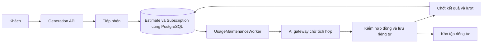
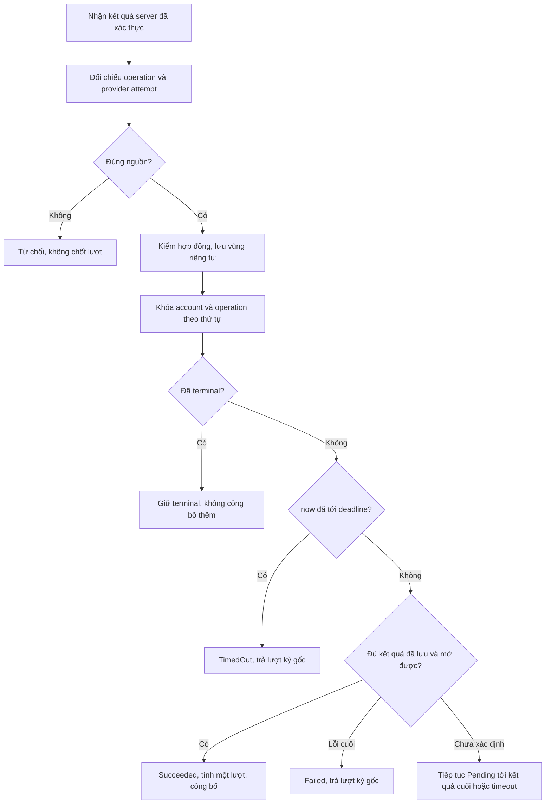
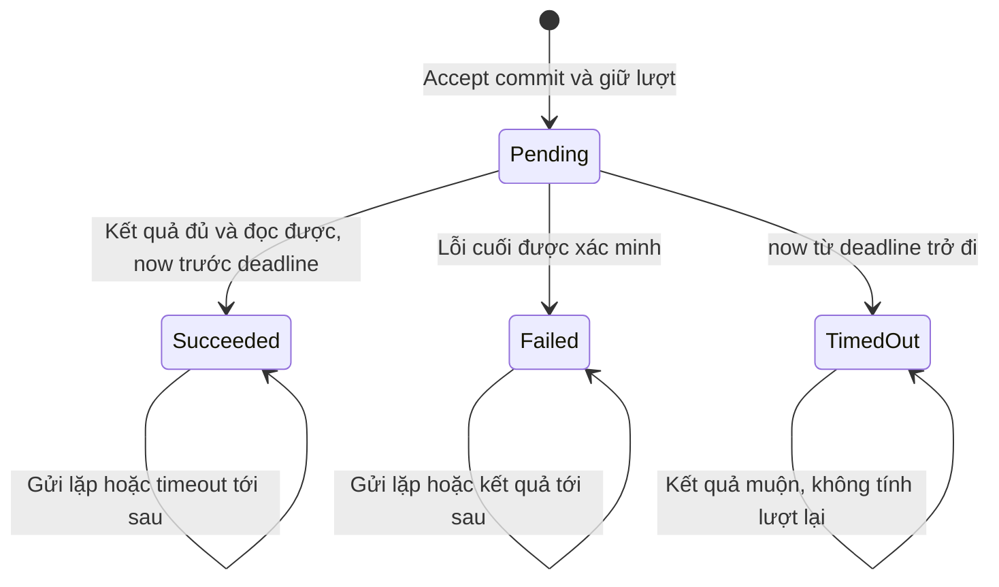
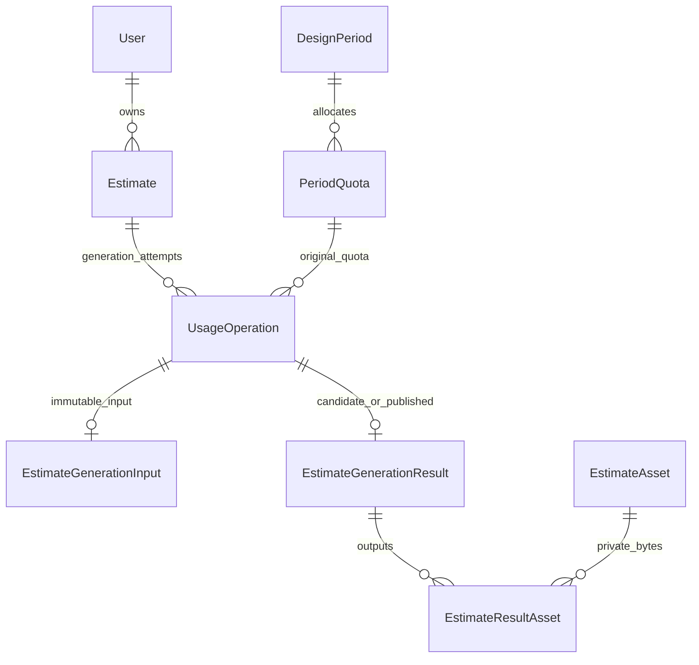

<!-- HƯỚNG DẪN CHO AI KHI ĐIỀN HOẶC CHỈNH SỬA MẪU
- Đọc toàn bộ mẫu, các comment hướng dẫn và tài liệu nguồn được cung cấp trước khi viết. Tuân thủ các quy tắc nghiệp vụ, điều kiện, ngoại lệ và giới hạn đã được xác nhận.
- Không bịa, tự chế hoặc suy đoán thành sự thật: yêu cầu, quy tắc, số liệu, API, schema, mã lỗi, nguồn tham khảo, người phụ trách và kết quả kiểm thử phải có căn cứ. Nội dung ví dụ trong mẫu không phải dữ kiện của dự án.
- Khi thiếu thông tin hoặc các nguồn mâu thuẫn, hỏi người dùng để làm rõ; giữ nguyên placeholder ở phần chưa xác định. Không tự chọn đáp án, lấp chỗ trống hay tuyên bố tài liệu đã hoàn tất.
- Chỉ thay nội dung cần điền hoặc được yêu cầu sửa. Không tự mở rộng phạm vi, sửa nghĩa quy tắc, bỏ điều kiện/ngoại lệ, xoá hay ghi đè nội dung hợp lệ đã có.
- Giữ nguyên tên, cấp và thứ tự heading, nhãn in đậm, tiền tố bullet, cấu trúc danh sách, tên/thứ tự/số cột bảng và cú pháp code fence. Không dịch, đổi tên, gộp hoặc thêm mục ngoài cấu trúc mẫu.
- Chỉ lặp khối luồng, AC hoặc API theo đúng khuôn khi có căn cứ; chỉ bỏ phần tuỳ chọn khi hướng dẫn riêng của mẫu cho phép và đã xác định không áp dụng.
- Mã tham chiếu và section phải trỏ tới tài liệu có thật đã được cung cấp hoặc kiểm chứng. Không giữ mã ví dụ như tham chiếu thật và không tự tạo tài liệu liên quan để hợp thức hoá liên kết.
- Giữ các comment hướng dẫn trong file. Xuất Markdown UTF-8, mỗi file một tài liệu; không bọc toàn bộ file trong code fence, không chèn lời dẫn hay giải thích ngoài mẫu.
- Trước khi bàn giao, đối chiếu nội dung với nguồn, kiểm tra cấu trúc, giá trị cho phép, giới hạn độ dài và tính nhất quán của mã/tham chiếu. Báo rõ phần chưa đủ thông tin; không tuyên bố đã chạy test hoặc import khi chưa thực hiện.
-->

<!-- Thay mã TDD-001 và nội dung ví dụ; giữ nguyên heading và nhãn in đậm.
Sơ đồ dùng mermaid, plantuml hoặc URL. Giữ heading Architecture, Sequence Diagram, Activity Diagram, State Diagram, Data Model.
Ví dụ API phải có heading trùng METHOD /path trong Endpoints. Xoá phần API/sơ đồ không dùng.
Version, Updated At và Change Log do lịch sử phiên bản quản lý, để trống khi nhập mới.
Author/Reviewer là tên hiển thị; gán tài khoản, phê duyệt, giả định và câu hỏi mở trên giao diện sau import.
Thiết kế phải truy vết về Story và Business Rule được cung cấp. Phân biệt thiết kế đề xuất với implementation đã kiểm chứng; không mô tả API/schema/sơ đồ ví dụ như hệ thống thật hoặc tự quyết định nghiệp vụ còn thiếu.
BẮT BUỘC KHI HOÀN THIỆN MẪU: phải có cả Reviewer và Approver, mỗi tên 1–200 ký tự sau khi bỏ khoảng trắng đầu/cuối. Không xoá hai dòng metadata, để trống, dùng tên bịa hoặc giữ placeholder rồi coi là hoàn tất.
Nếu chưa biết người review hoặc người phê duyệt, phải hỏi người dùng và báo tài liệu chưa đủ thông tin; không tự lấy Author/Owner làm người thay thế. Tên trong file không tự gán tài khoản hoặc xác nhận đã duyệt; gán thành viên trên giao diện sau import.
Đây là yêu cầu hoàn thiện mẫu; backend hiện vẫn nhận file cũ thiếu hai trường để tương thích.

VALIDATION CHO FILE NHẬP (đối chiếu ImportSnapshotValidator, MarkdownParser và ImportService):
- Mỗi file .md UTF-8 không rỗng chỉ có một heading cấp 1 chứa mã tài liệu dài 1–100 ký tự. Mã không được trùng trong cùng lần nhập hoặc thuộc loại tài liệu khác đã tồn tại.
- Không dùng tên README.md hoặc sitemap.md vì importer bỏ qua. Giao diện nhận .md/.zip, tối đa 2.000 file, tổng file tải lên 31 MiB; API giới hạn request 32 MiB và tổng nội dung đọc/giải nén 64 MiB.
- Chỉ nhập đè tài liệu cùng loại đang Draft, chưa có phiên bản và chưa lưu trữ. Import thay toàn bộ nội dung bản nháp, vì vậy phải giữ lại nội dung hợp lệ ngoài phần được yêu cầu sửa.
- Không dùng Status trong Markdown hoặc tên Approver để tự xác nhận phê duyệt; import không cấp quyền hay gán tài khoản từ tên. Chạy Kiểm tra file và xử lý lỗi/cảnh báo trước khi nhập.
- Giới hạn độ dài bên dưới tính theo string.Length của .NET (đơn vị UTF-16); không tự cắt ngắn dữ kiện quan trọng để vượt validation, hãy viết lại có căn cứ hoặc hỏi người dùng.
- Feature tối đa 300 ký tự và được dùng làm tiêu đề tài liệu. Status được parser nhận: Draft / In Review / Approved / Deprecated; tài liệu nhập mới vẫn có trạng thái phê duyệt Draft.
- Endpoint: đường dẫn tối đa 500 ký tự; tên/mô tả endpoint được lưu trong Name tối đa 300. HTTP method: GET / POST / PUT / PATCH / DELETE / HEAD / OPTIONS.
- Error Codes: mã tối đa 100 ký tự, không trùng trong tài liệu; giữ dạng - **CODE** (400): mô tả. HTTP status trong Error Codes và Response phải là số nguyên đọc được bằng Int32; không tự đặt status khác hợp đồng API.
- URL sơ đồ tối đa 1.000 ký tự. Mục sơ đồ được sử dụng phải có khối mermaid/plantuml hoặc URL theo mẫu; không để một mục sơ đồ rỗng. Nhãn mục được tách từ bullet như tên External API Fields tối đa 300 ký tự.
- Heading Examples phải khớp METHOD /path ở Endpoints. Giữ các nhãn Request:, Response 200: (thay mã theo contract) và Error Response: để parser tách đúng dữ liệu.
- Tham chiếu dạng DOC-KEY/section: ghi chú: mã đích tối đa 100 ký tự, section tối đa 100, ghi chú tối đa 1.000. Không trùng bộ mã đích + section + loại liên kết trong cùng tài liệu.
ĐỐI CHIẾU FORM TDD (src/features/tdds/validations.ts; form có thể chặt hơn import):
- Điền Feature, Author, Reviewer, Problem và ít nhất một Goal; các Goal/Non-goal/Notes đã thêm không được rỗng. API đã khai báo phải có endpoint và mô tả/mục đích; Fields phải có tên và ý nghĩa; Error Codes phải có mã, HTTP status và điều kiện.
- Form còn kiểm tra Version, Updated At và nội dung Change Log khi khai báo; với file nhập mới, giữ các trường lịch sử này trống theo hợp đồng import, không tự tạo dữ liệu lịch sử.
-->

# TDD-PROJ-002

## Document Info

- **Feature**: Tạo dự toán — điều phối AI, khóa đầu vào và quyết toán lượt
- **Author**: Codex
- **Reviewer**: Tân Trần
- **Approver**: Tân Trần
- **Status**: Draft
- **Version**:
- **Updated At**:

## Context & Goals

### Problem

STORY-PROJ-002 cần tiếp nhận đầu vào đã lưu, giữ một lượt, khóa sửa và chỉ tính đã dùng khi đủ kết quả đã lưu/có thể mở. AI do nhóm khác phụ trách; chưa có API, danh sách đầu ra bắt buộc, cơ chế callback/polling hoặc môi trường tích hợp. Thiết kế này hoàn thành ranh giới nội bộ và các bảo đảm dữ liệu; phần giao tiếp nhà cung cấp vẫn chờ hợp đồng, không tạo endpoint AI giả như đã thống nhất.

TDD-SUB-002 đã thiết kế `UsageOperation`, quota và worker, nhưng vẫn dùng tên Project và thứ tự khóa User. TDD-PAY-001/TDD-SUB-005 bổ sung AccountCommerceState và vòng đời kỳ. TDD này nối Estimate vào đúng sổ lượt đó và quy định một thứ tự khóa chung; không tạo bảng quota hoặc trạng thái cuối AI thứ hai.

### Goals

- Tiếp nhận nguyên tử: đầu vào bất biến, UsageOperation Pending và Reserved tăng đúng một cùng commit.
- Kết thúc nguyên tử: kết quả được phép đọc, State=Succeeded, Reserved giảm và Used tăng đúng một cùng commit; lỗi/timeout chỉ giải phóng tại kỳ gốc.
- Không chạy hai tác vụ Pending/Succeeded trên một bản; gửi lặp, callback lặp và worker khởi động lại không tính lượt trùng.
- Kết quả muộn không được công bố, không gắn vào lần thử lại và không tính lại lượt.

### Non-goals

- Xây AI, tự tính giá/khối lượng, chọn bộ môn bản vẽ, số ảnh/tệp hoặc quy tắc chất lượng chuyên môn chưa có hợp đồng.
- Thêm lượt chỉnh sửa, bước khách duyệt mới trừ lượt, hủy tác vụ bởi khách hoặc tự tạo lần AI mới khi lỗi.
- Triển khai code, Unit Test chi tiết hoặc migration trong lần thiết kế này.

## Architecture

Tái sử dụng `UsageOperation` làm một lần sử dụng AI và nguồn trạng thái cuối. Module Estimate sở hữu đầu vào/kết quả; Subscription sở hữu kỳ, quyền, Used/Reserved và quyết định chốt lượt. Cả hai cùng PostgreSQL/DbContext, gọi service nội bộ cùng transaction thay vì gọi API HTTP giữa hai module.

| Thành phần dự kiến | Trách nhiệm |
|---|---|
| RequestEstimateGenerationHandler | Xác thực owner, khóa account/bản, replay key, kiểm inputVersion và đầu vào đầy đủ, kiểm quyền/quota, tạo operation cùng input snapshot. |
| EstimateGenerationInputFactory | Tạo snapshot phiên bản nội bộ v1 từ dữ liệu đã xác minh; không nhận prompt/giá/quota tùy ý của client. |
| IDesignUsageCoordinator | Adapter tới store/policy TDD-SUB-002; Reserve/Complete/Fail/Expire tham gia UoW của handler gọi, không commit lồng. |
| UsageMaintenanceWorker | Worker theo TDD-SUB-002: nhận việc gửi AI, đối soát và timeout. Mỗi việc dùng scope/DbContext mới; không thêm RabbitMQ/Quartz. |
| IEstimateAiGateway | Gửi/đối chiếu trạng thái theo hợp đồng nhà cung cấp sau này; không có implementation thật ở hiện trạng. |
| IEstimateResultValidator | Kiểm schema, nguồn operation/attempt và đủ bộ kết quả theo ContractVersion; thiếu contract không thể trả ResultReady. |
| EstimateResultStager | Lưu dữ liệu/tệp riêng tư, kiểm đọc lại được trước chốt; không cung cấp đường tải công khai. |
| FinalizeEstimateGenerationHandler | Khóa và đọc lại operation/kỳ gốc; quyết định thành công/lỗi/quá hạn, công bố kết quả cùng quyết toán quota. |



**Notes**:

- **Ranh giới tài nguyên**: UsageKind vẫn là DesignGeneration, ResourceId cho luồng này chính là Estimate.Id. Bổ sung `EstimateId` có FK thật như Data Model; không mở lại `/projects/...` làm route dự toán. Gói giám sát gắn với Công trình (tên kỹ thuật `ConstructionSite`; một số TDD giám sát cũ còn gọi là Project), là thực thể riêng do khách tạo, đặc tả ở STORY-SITE-001 và [TDD-SITE-001](TDD-SITE-001.md), không liên kết bản dự toán trong đợt này (BR-SUB-007/Notes). Không tự đổi nghĩa Project/Công trình thành Estimate.
- **Một điểm khóa chung**: mọi thao tác nhận AI/chốt/timeout/tạo-lưu dự toán/cấp-đổi-hủy-khôi phục gói lấy AccountCommerceState của chủ tài khoản trước. Luồng dự toán sau đó khóa Estimate → DesignSubscription → DesignPeriod → PeriodQuota → UsageOperation → dữ liệu kết quả. Luồng không dùng Estimate bỏ qua bước đó; không được lấy operation/quota rồi quay lại khóa account. Xác định OwnerId từ bản ghi trước khi xin khóa chỉ để định tuyến, phải đọc lại/kiểm owner dưới khóa. Worker scan không giữ khóa hàng khi gọi một handler cần khóa account. Đổi tên bản dự toán không đọc gói/lượt nên không lấy AccountCommerceState; nó chỉ cập nhật một dòng Estimate bằng câu UPDATE có điều kiện, không đảo thứ tự khóa của các luồng trên.
- TDD-SUB-002 cần đổi triển khai dự kiến từ khóa User sang AccountCommerceState cho toàn bộ đường quota, kể cả tra cứu, không chỉ endpoint dự toán. Nếu còn một đường chỉ khóa User, việc hủy/đổi gói có thể tranh với giữ lượt mà không được tuần tự hóa. Đây là thống nhất kỹ thuật với PAY, không thay nghiệp vụ quyền lợi. Không bật tính năng khi nền quota chưa thực hiện thống nhất.
- Hiệu lực mới: CurrentPeriodId đúng kỳ + LifecycleState=Active + nằm trong thời hạn + có design.generate; finite còn `Limit-Used-Reserved>=1`. Unlimited ghi Used/Reserved cho đối soát theo TDD-SUB-002 nhưng không có số dư hữu hạn và không chặn theo Used. Cơ bản/Tiêu chuẩn/VIP đầu vào không cấp entitlement; Boolean/3D hoặc cờ phong cách không cắt kết quả.
- **Replay trước kiểm quyền dùng mới**: sau xác thực/owner, tìm `(AccountId,DesignGeneration,OperationKey)`. Hash lấy `estimateId,inputVersion,operationKind`, không lấy bản đầu vào hiện tại đã thay đổi khi retry sau lỗi. Cùng key/hash trả operation cũ (200) dù kỳ hết hạn, không gửi lại AI hoặc giữ thêm. Khác hash trả 409. Key mới sau Failed/TimedOut là lần thử chủ động, kiểm lại quyền hiện hành; cùng key của lần Failed không trở thành tác vụ mới.
- Chỉ reserve khi adapter/contract/config thời gian chờ sẵn sàng và toàn bộ đầu vào hợp lệ. Lỗi cấu hình trước accept trả 503 không giữ lượt. Trong transaction tiếp nhận, khóa bản và kiểm InputVersion, kiểm không Pending/Succeeded, đóng băng input, thêm UsageOperation Pending và tăng Reserved. Commit là mốc tiếp nhận; frontend nhận 202 sau commit, không phải sau lời gọi AI. Đổi tên bản dự toán dùng NameVersion riêng và không tăng InputVersion (TDD-PROJ-001/Architecture), nên khách đổi tên ngay trước hoặc trong lúc bấm nhận dự toán không làm yêu cầu gửi AI bị InputVersionConflict. Hash replay cũng không chứa tên.
- Snapshot giữ input, catalogRevision, tên/ID của các lựa chọn danh mục tương ứng, areaM2 nguyên giá trị, ảnh nội bộ, địa chỉ đã xác minh và gói hoàn thiện. Snapshot không chứa tên bản dự toán, vì tên không phải đầu vào gửi AI (BR-SUB-007 khoản 11). Snapshot không thay quota hiện hành khi khách retry, cũng không tự thêm phong cách mặc định khi một nhóm tắt. Mỗi operation có input riêng, nên sửa bản sau J1 lỗi không thay dữ liệu của J1.
- `DeadlineUtc=AcceptedAtUtc+ConfiguredGenerationTimeout`; bao gồm thời gian chờ gửi, nhận và lưu kết quả. Không có mặc định 15 phút. Lấy EffectiveNow sau đủ khóa bằng đồng hồ server, không dùng thời gian kết thúc AI do provider tự khai để vượt deadline. Khi chốt `now>=DeadlineUtc` thì TimedOut, kể cả callback vừa tới trước lúc quét. Tác vụ đã Succeeded trước đó giữ nguyên.
- **Lease không phải giấy phép gửi lại**: worker nhận dòng NotStarted bằng transaction ngắn, đặt Sending, lease token rồi gọi AI ngoài SQL. Nếu hết lease lúc chưa rõ provider đã nhận, đặt Unknown, đối chiếu bằng operationId/attemptId nếu provider hỗ trợ. Không mặc định gửi lại vì worker chết. Nhà cung cấp không có truy vấn/chống trùng thì chờ timeout; không tạo operation mới hay lặp HTTP POST mù. Worker khác không ghi trạng thái dispatch bằng lease cũ.
- Lỗi truyền mạng sau gửi và lỗi nghiệp vụ cuối cùng khác nhau. Provider trả lỗi cuối được xác thực → Failed và giải phóng. Không biết đã nhận → Pending/Unknown tới khi đối chiếu hoặc timeout. Thử lại giao dịch SQL thuần dùng DbContext mới, cùng operation/key; không đặt HTTP gọi AI trong vòng retry DB.
- **Công bố bằng transaction**: lưu candidate JSON/tệp và xác minh mở được ngoài transaction dài; sau đó lock/check lại deadline/attempt/state. Chỉ transaction chốt mới gắn ResultRef và Succeeded cùng thay quota. Truy vấn đọc kết quả luôn JOIN operation Succeeded, không dựa vào có tệp hoặc có dòng Result. Lỗi SQL cuối để candidate riêng tư; lần chốt lại không gọi AI. SQL không hoàn tác việc đã ghi object nên phải giữ vùng tạm riêng tư.
- Nếu J1 timeout trong lúc tải kết quả, finalizer thấy terminal và không công bố. J2 có snapshot/result ID khác, không tìm “bản dự toán đang chạy” để đoán operation callback. Callback lặp sau Succeeded cùng kết quả chỉ ACK nội bộ, không tăng Used; callback khác nội dung cùng operation/attempt bị ghi nhận bất thường, không thay nguồn đã công bố.
- Hết hạn, hủy hoặc đổi kỳ sau tiếp nhận không hủy J1. Chốt vào `UsageOperation.PeriodId/BenefitId`, không tìm kỳ mới để giảm/tăng bộ đếm. Finalizer không dùng policy “được tạo mới” để từ chối lưu kết quả của tác vụ đã được nhận.
- Theo pipeline hiện có, Failed/TimedOut là kết quả xử lý cần commit: trả DTO trạng thái bình thường sau khi giải phóng, không ném exception làm rollback khoản trả lượt. Exception chỉ dùng khi transaction phải bỏ toàn bộ thay đổi. Không tự mở khóa đầu vào bằng một cờ rời: hết Pending thì khả năng sửa được tính lại cùng quyền hiện tại. Khóa này chỉ áp cho đầu vào: trong lúc Pending, chủ sở hữu vẫn đổi được tên bản dự toán qua PATCH /name của TDD-PROJ-001 (STORY-PROJ-002/EXC-02 bước 3); đổi tên không chạm UsageOperation, snapshot hay quota.

## Sequence Diagram

```mermaid
sequenceDiagram
    actor C as Khách
    participant API as Estimate API
    participant DB as PostgreSQL
    participant W as Worker
    participant AI as AI service
    participant S as Kho kết quả riêng tư
    C->>API: POST generation, key, inputVersion
    API->>DB: Khóa account và dữ liệu; kiểm owner/key/input/quota
    API->>DB: Snapshot + Pending + Reserved tăng 1
    DB-->>API: Commit tiếp nhận
    API-->>C: 202 operationId
    W->>DB: Claim dispatch với lease token
    W->>AI: Gửi operationId và snapshot ngoài SQL
    AI-->>W: Kết quả đúng attempt hoặc lỗi
    W->>S: Kiểm đủ, lưu và xác nhận đọc được
    W->>DB: Khóa lại theo thứ tự; kiểm state và deadline
    alt Pending và trước hạn, đủ kết quả
      W->>DB: ResultRef + Succeeded + Reserved giảm + Used tăng
      DB-->>W: Commit công bố
    else Lỗi hoặc quá hạn
      W->>DB: Failed hoặc TimedOut + Reserved giảm tại kỳ gốc
      DB-->>W: Commit, không công bố candidate
    end
    C->>API: GET operation
    API-->>C: Trạng thái và URL kết quả có kiểm quyền nếu thành công
```

## Activity Diagram



## State Diagram



Khách thử lại tạo operation khác từ đầu; không có Failed→Pending trên cùng dòng. DispatchState chỉ theo dõi đường gửi (`NotStarted/Sending/Sent/Unknown`), không thay State quyết toán.

## Data Model

Dùng lại DesignSubscription, DesignPeriod, PeriodQuota và UsageOperation theo [TDD-SUB-002/Data Model](TDD-SUB-002.md#data-model), bổ sung LifecycleState theo [TDD-SUB-005/Data Model](TDD-SUB-005.md#data-model). AccountCommerceState theo [TDD-PAY-001/Data Model](TDD-PAY-001.md#data-model). Không nhân bản schema/quota vào Estimate. Nguồn mẫu các bảng này ở đúng các mục liên kết; bên dưới chỉ minh họa delta khi chạy dự toán.

| Bảng mới/thay đổi | Một dòng và thời điểm ghi |
|---|---|
| UsageOperation — mở rộng | Một lần tạo thiết kế đã được tiếp nhận. Thêm FK rõ ràng tới Estimate và khóa lease; vẫn là nguồn trạng thái cuối, key/hash, kỳ giữ và deadline duy nhất. |
| EstimateGenerationInput | Một snapshot bất biến của đầu vào thuộc một UsageOperation. Ghi cùng tiếp nhận; không sửa khi bản nháp thay đổi sau lỗi. |
| EstimateGenerationResult | Một bộ kết quả đã kiểm tra và lưu của đúng operation/attempt. Có thể tồn tại riêng tư trước finalization; chỉ công bố qua operation Succeeded. Không phải bảng tính lại dự toán. |
| EstimateResultAsset | Một tệp/ảnh/bản vẽ thuộc bộ kết quả nguồn. RoleKey theo hợp đồng, không tự hardcode số lượng; trỏ asset riêng tư của cùng bản. |

| Bảng | Cột, null và ràng buộc |
|---|---|
| UsageOperation bổ sung | EstimateId uuid NULL; DispatchLeaseToken uuid NULL; DispatchErrorCode varchar(100) NULL. FK(AccountId,EstimateId) → Estimate(OwnerId,Id); CHECK (UsageKind=DesignGeneration AND EstimateId IS NOT NULL AND ResourceId=EstimateId) OR (UsageKind=TemplateDetail AND EstimateId IS NULL). UNIQUE(Id,AccountId,EstimateId); UNIQUE(Id,EstimateId). DispatchState giới hạn NotStarted/Sending/Sent/Unknown cho DesignGeneration; TemplateDetail NULL. |
| EstimateGenerationInput | OperationId uuid PK; AccountId uuid NN; EstimateId uuid NN; InputVersion bigint NN CHECK>0; SchemaVersion int NN CHECK>0; CatalogRevisionId uuid NN; Payload jsonb NN CHECK object; InputAssetId uuid NULL; CreatedAtUtc timestamptz NN. FK(OperationId,AccountId,EstimateId) → UsageOperation(Id,AccountId,EstimateId); FK(EstimateId,CatalogRevisionId) → Estimate(Id,CatalogRevisionId); FK(InputAssetId,EstimateId) → EstimateAsset(Id,EstimateId). |
| EstimateGenerationResult | OperationId uuid PK; EstimateId uuid NN; ProviderAttemptId varchar(200) NN; ContractVersion varchar(100) NN; Payload jsonb NN CHECK object; PayloadHash char(64) NN; StoredAtUtc timestamptz NN; ReadVerifiedAtUtc timestamptz NN; FK(OperationId,EstimateId) → UsageOperation(Id,EstimateId); UNIQUE(OperationId,EstimateId). |
| EstimateResultAsset | OperationId uuid NN; EstimateId uuid NN; AssetId uuid NN; RoleKey varchar(100) NN; Ordinal int NN CHECK>=0; PK(OperationId,AssetId); UNIQUE(OperationId,RoleKey,Ordinal); FK(OperationId,EstimateId) → EstimateGenerationResult(OperationId,EstimateId); FK(AssetId,EstimateId) → EstimateAsset(Id,EstimateId). Purpose=Result kiểm trong store. |

PK/FK mới dùng RESTRICT. FK vòng input/result với UsageOperation đi một chiều qua OperationId; `InputRef/ResultRef` giữ locator nội bộ `estimate-input:<operationId>` và `estimate-result:<operationId>` để tương thích port SUB. Không coi locator text là URL hoặc quyền đọc. Finalizer xác nhận tồn tại dòng tương ứng trước commit; unique Result OperationId bảo vệ một nguồn cho mỗi lần gọi.

Partial unique của TDD-SUB-002 được đặt tên rõ `UX_Usage_Estimate_Live` trên EstimateId WHERE UsageKind='DesignGeneration' AND State IN ('Pending','Succeeded'). Nó ngăn hai tác vụ sống trên cùng bản; Failed/TimedOut vẫn giữ lịch sử và không chiếm slot. Chưa tạo hai index đồng nghĩa ResourceId/EstimateId khi đã có CHECK bằng nhau. Khóa thương mại bảo vệ quota tài khoản; index này bảo vệ tài nguyên, cả hai cần thiết.

Kết quả JSON chưa có schema nhà cung cấp nên không chốt cấu trúc tiền/bản vẽ giả. ContractVersion gắn với validator và mapper đã triển khai trước khi bật tích hợp. Các trường được dùng cho FK/quyền/trạng thái không nằm riêng trong JSON. Payload là nội dung chuyên môn bất biến để đọc/xuất; không tạo GIN index khi chưa có truy vấn phần tử. Không dùng `jsonb` để né ràng buộc quota.

**Snapshot nội bộ v1** gồm `estimateId,inputVersion,catalogRevisionId,buildingType{id,name},areaM2,description,address{datasetVersion,provinceCode,provinceName,wardCode,wardName,detail},finishPackage,floorCount,hasTum,architectureStyle{id,name,imageAssetId}|null,interiorStyle{...}|null,inputAssetId|null`. ID đều từ DB đã kiểm; areaM2 chuỗi thập phân theo TDD-PROJ-001. Đây là contract nội bộ BMT, không khẳng định AI chấp nhận payload này. Adapter chuyển ID/ảnh sang format được đối tác xác nhận, giữ đúng nghĩa NULL của nhóm không chọn. `buildingType.name` và tên phong cách là tên lựa chọn trong revision đã ghim; tên bản dự toán (`Estimate.Name`) không có trong snapshot.



Sơ đồ UsageOperation có cả loại TemplateDetail nên quan hệ Input/Result là 0..1 tổng quát; DesignGeneration mới nhận phải có đúng một input được handler ghi cùng transaction. Một kết quả có 0..n asset theo hợp đồng; việc đủ phần bắt buộc do validator xác định, không mặc định zero asset là thành công.

**Mẫu dữ liệu** — các ID là bí danh UUID; hash H1/HR1 là bí danh 64 ký tự, không dữ liệu seed. Giả sử đầu vào D1/V1/version=7 hợp lệ; timeout 10 phút dưới đây chỉ để minh họa, không cấu hình vận hành được chốt.

| Bảng | Giá trị minh họa tại các mốc |
|---|---|
| AccountCommerceState dùng lại | AccountId=U1; các cột thứ tự đơn giữ nguyên. Luồng dự toán chỉ lấy khóa, không thay thứ tự mua. |
| PeriodQuota dùng lại, trước nhận | PeriodId=P1; BenefitId=BGEN; IsUnlimited=false; Limit=3; Used=0; Reserved=0. |
| UsageOperation — J1 | Id=J1; AccountId=U1; EstimateId=ResourceId=D1; UsageKind=DesignGeneration; PeriodId=P1; BenefitId=BGEN; OperationKey=gen-1; RequestHash=H1; State=Pending; AcceptedAtUtc=2026-09-21T03:00:00Z; DeadlineUtc=2026-09-21T03:10:00Z; SettledAtUtc=NULL; InputRef=estimate-input:J1; ResultRef=NULL; DispatchState=NotStarted; DispatchLeaseToken=NULL. |
| EstimateGenerationInput | OperationId=J1; AccountId=U1; EstimateId=D1; InputVersion=7; SchemaVersion=1; CatalogRevisionId=V1; InputAssetId=NULL; CreatedAtUtc=03:00Z; Payload chứa snapshot đầy đủ, areaM2="70.25", description="Nhà hai phòng ngủ", hai phong cách K1/N1 hợp lệ; không có tên bản dự toán. NULL ảnh được phép vì có mô tả. Nếu khách đổi tên D1 trong lúc J1 Pending, dòng này và InputVersion=7 giữ nguyên; chỉ D1.Name/NameVersion đổi. |
| PeriodQuota — sau nhận | P1/BGEN: Used=0; Reserved=1; available đọc ra 2. |
| UsageOperation — đã gửi | J1: DispatchState=Sent; ProviderAttemptId=provider-j1; lease đã nhả. Không tăng Used. |
| EstimateAsset — kết quả | FOUT1; EstimateId=D1; Purpose=Result; StorageKey=result/j1/plan; MediaType=image/png; SizeBytes=123000; Sha256=HFOUT1; CreatedBy=NULL vì worker tạo; CreatedAtUtc=2026-09-21T03:02:00Z. OperationId trong EstimateResultAsset cho biết tác vụ sinh tệp; không nhận CreatedBy từ provider. |
| EstimateGenerationResult — candidate | OperationId=J1; EstimateId=D1; ProviderAttemptId=provider-j1; ContractVersion=partner-contract-test-v1; Payload={...nội dung fixture theo schema đối tác...}; PayloadHash=HR1; StoredAtUtc=03:02Z; ReadVerifiedAtUtc=03:02:01Z. Đây là ký hiệu dữ liệu mẫu, không JSON gửi được hoặc schema giả định. |
| EstimateResultAsset | OperationId=J1; EstimateId=D1; AssetId=FOUT1; RoleKey=plan-preview (mã fixture chỉ dùng nếu contract có); Ordinal=0. |
| UsageOperation — sau thành công | J1: State=Succeeded; SettledAtUtc=03:02:02Z; ResultRef=estimate-result:J1. |
| PeriodQuota — cùng commit thành công | P1/BGEN: Used=1; Reserved=0; available=2. |

Nhánh thay thế: J1 TimedOut tại 03:10Z → Used=0, Reserved=0; không có ResultRef công bố. J2 là operation khác với key gen-2, input snapshot riêng và kỳ hiện tại lúc nhận. Candidate J1 tới sau không được thay J2. Nếu trước lúc J1 hoàn tất tài khoản đã sang P2, thay đổi cuối cùng vẫn chỉ ở P1/BGEN. Với unlimited, Limit=NULL; Used/Reserved vẫn đo thao tác nhưng available trả NULL.

**Notes**:

- Chuẩn hóa: operation sở hữu trạng thái/kỳ/key/deadline; input sở hữu snapshot đã nhận, result sở hữu nội dung chuyên môn. Không thêm GenerationJob trùng trạng thái UsageOperation. AccountId/EstimateId lặp có composite FK ràng buộc, không cho dữ liệu hai chủ. Payload lặp đầu vào là lịch sử của lần gọi, không cập nhật theo bản nháp.
- Chốt callback/result cần hai pha: xác thực và stage; sau đó finalizer ngắn. Candidate chỉ được insert một lần theo operation/attempt/hash đã đối chiếu. Hai callback khác hash không được UPDATE kết quả nguồn. Có thể lưu log sự kiện provider tối giản để đối soát, nhưng chưa tự thêm bảng lưu toàn bộ raw response hoặc retention khi chưa có hợp đồng.
- Index dùng lại pending deadline, account-kind-key và period-benefit; thêm UsageOperation(EstimateId,AcceptedAtUtc DESC,Id) cho lịch sử/trạng thái bản, index dispatch theo State/DispatchState/lease để worker scan. Chỉ SELECT projection cần thiết, không tải cả JSON vào lượt poll trạng thái.
- Migration bổ sung EstimateId nullable trước để kiểm dữ liệu. Nếu đã có DesignGeneration dựa trên Project thật, dừng trước CHECK/NOT NULL: cần quyết định ánh xạ dữ liệu, không tự gán ProjectId sang EstimateId. Trong DB mới không có lịch sử thì thêm CHECK và FK ngay theo thứ tự cha trước con. Giữ cột ResourceId cho TemplateDetail. Không đổi tên Project trong các module giám sát trong đợt này.
- Theo dõi metric: số accept/deny theo mã lỗi; Pending quá deadline; thời gian dispatch/stage/finalize; Used/Reserved lệch so operation; số phản hồi muộn/trùng/không khớp attempt. Metric không dùng userId/raw URL làm nhãn. Log traceId/operationId/estimateId/periodId/attempt và mã lỗi, không log mô tả/địa chỉ/token/raw output.
- Khi worker dừng, API đọc vẫn hoạt động nhưng không nhận việc mới nếu dispatcher chưa sẵn sàng. Hết deadline được xử lý lại khi worker phục hồi hoặc khi finalizer chạy; cảnh báo nếu Pending quá hạn tồn đọng. Không trả lượt chỉ trên giao diện khi DB chưa quyết toán. Cần cấu hình timeout, tần suất quét, lease, giới hạn song song, cảnh báo và người vận hành trước production; chưa có SLA/RPO/RTO.
- Đối soát chỉ phát hiện sai lệch và tạo báo cáo: không tự đặt lại Used/Reserved từ đầu nếu chưa xác định nguyên nhân. Dữ liệu được nhận trước lỗi vẫn phải giữ để phục hồi. Backup phải gồm DB, object bất biến và khóa truy cập; chưa tự đặt lịch xóa.
- Kiểm chứng ST-PROJ-021–032, 051, 057; integration PostgreSQL hai connection cho tranh lượt, chốt-vs-timeout, đổi/hủy kỳ-vs-accept, rollback input/hold, worker crash trước/sau gửi và callback lặp. Giả lập AI chứng minh điều phối nội bộ, không chứng minh hợp đồng thực. Chưa viết đặc tả Unit Test trước chốt TDD.

## Internal API

### Endpoints

- **POST** `/api/v1/estimates/{estimateId}/generations` — Verified Customer + owner, kiểm Origin theo [TDD-AUTH-001](TDD-AUTH-001.md) khi dùng cookie; `{inputVersion}` + Idempotency-Key. Yêu cầu mới 202 `{operationId,state:"Pending",acceptedAtUtc,deadlineUtc}`; replay cùng key/hash 200 với trạng thái operation cũ, không reserve lại.
- **GET** `/api/v1/estimates/{estimateId}/generations/{operationId}` — Owner đọc `{operationId,state,acceptedAtUtc,deadlineUtc,settledAtUtc,failureCode,resultUrl}`. resultUrl chỉ có khi Succeeded, là route backend có kiểm quyền. Không trả tỷ lệ hoàn tất giả nếu AI không có progress.

Ports nội bộ không phải HTTP công khai:

- `ReserveEstimateGeneration(ownerId,estimateId,inputVersion,key)` chạy qua handler transactional; dùng coordinator subscription cùng UoW.
- `ClaimEstimateDispatch(operationId,workerId)` → leaseToken + snapshot; transaction ngắn, lưu DispatchState=Sending và DispatchLeaseToken trước khi gọi nhà cung cấp; OperationId là mã chống gửi lặp phía BMT. ProviderAttemptId chỉ được lưu khi nhận được mã thực từ provider theo hợp đồng; không tin worker chỉ giữ bộ nhớ.
- `StageEstimateResult(operationId,providerAttemptId,envelope)` → candidate; kiểm ContractVersion/đủ kết quả và files, ngoài transaction chốt.
- `FinalizeEstimateGeneration(operationId,providerAttemptId,candidateRef)` → terminal hoặc Pending; kiểm identity, deadline và chốt quota/result cùng transaction.
- `FailEstimateGeneration` và `ExpireDesignUsage` dùng chung coordinator settlement, không có endpoint để khách tự báo AI thành công/thất bại.

Các kiểu lỗi/Result theo TDD-PROJ-001; chống CSRF theo [TDD-AUTH-001](TDD-AUTH-001.md). Phiên khách có quyền đọc operation cũ dù gói hết hạn, nhưng không có quyền bắt đầu operation mới. Khi khách bấm nhận dự toán, frontend đợi tự lưu cuối hoàn tất và dùng đúng inputVersion đã xác nhận; không đính kèm đầu vào chưa lưu vào POST generation.

### Examples

#### POST /api/v1/estimates/{estimateId}/generations

```
Request:
Idempotency-Key: gen-estimate-1
Origin: https://app.example.test
{"inputVersion":7}

Response 202:
{"value":{"operationId":"22222222-2222-4222-8222-222222222222","state":"Pending","acceptedAtUtc":"2026-09-21T03:00:00Z","deadlineUtc":"2026-09-21T03:10:00Z"},"isSuccess":true,"isFailure":false,"error":{"code":"","message":""}}

Error Response:
{"title":"Conflict","code":"GenerationInProgress","status":409,"detail":"Bản dự toán đang được xử lý.","messageCode":"GenerationInProgress","errors":null}
```

Deadline trong ví dụ là fixture 10 phút, không phải giá trị cấu hình đã xác nhận.

#### GET /api/v1/estimates/{estimateId}/generations/{operationId}

```
Request:
GET với phiên chủ sở hữu

Response 200:
{"value":{"operationId":"22222222-2222-4222-8222-222222222222","state":"TimedOut","acceptedAtUtc":"2026-09-21T03:00:00Z","deadlineUtc":"2026-09-21T03:10:00Z","settledAtUtc":"2026-09-21T03:10:00Z","failureCode":"GenerationTimedOut","resultUrl":null},"isSuccess":true,"isFailure":false,"error":{"code":"","message":""}}

Error Response:
{"title":"Not Found","code":"GenerationNotFound","status":404,"detail":"Không tìm thấy tác vụ trong bản dự toán này.","messageCode":"GenerationNotFound","errors":null}
```

### Error Codes

- **Unauthorized** (401): phiên không hợp lệ.
- **AccessForbidden** (403): không phải khách đủ chính sách phiên.
- **CsrfInvalid** (403): yêu cầu dùng cookie có `Origin`/`Referer` ngoài danh sách được phép, hoặc thiếu cả hai; theo [TDD-AUTH-001](TDD-AUTH-001.md).
- **EstimateNotFound** (404): bản không thuộc phạm vi owner.
- **GenerationNotFound** (404): operation không thuộc bản/owner hoặc không phải DesignGeneration.
- **SubscriptionInactive** (403): kỳ chưa có/hết hiệu lực/bị hủy/thay thế khi yêu cầu mới.
- **EntitlementMissing** (403): thiếu quyền design.generate.
- **QuotaUnavailable** (409): hết lượt sẵn dùng hữu hạn.
- **InputVersionConflict** (409): đầu vào đã đổi so phiên bản khách muốn gửi.
- **IdempotencyConflict** (409): cùng key nhưng đổi nội dung yêu cầu.
- **GenerationInProgress** (409): một operation khác còn Pending.
- **EstimateAlreadyGenerated** (409): bản đã thành công, không nhận phương án mới.
- **InvalidGenerationInput** (422): thiếu hoặc sai đầu vào theo revision đã ghim; trả lỗi theo trường, không giữ lượt.
- **DependencyUnavailable** (503): AI/contract/storage/timeout chưa sẵn sàng trước accept.

GenerationTimedOut, ProviderRejected, InvalidProviderResult, ResultStorageFailed là failureCode của operation khi được xác định, không phải HTTP 500 cho GET trạng thái. Mã provider cụ thể chỉ map sau khi có hợp đồng; không đẩy raw message về khách.

## External API

### Endpoints

- **AI service — chờ tích hợp** — Chưa biết base URL, method/path, xác thực, submit/status/result, webhook hay polling. Không mở callback công khai trước khi có cơ chế xác thực và chống phát lại được xác nhận với nhóm AI.
- **Kho kết quả — port của TDD-PROJ-001** — Ghi object riêng tư bất biến, đọc lại trước ResultReady; không dùng URL hết hạn của AI làm hồ sơ lưu lâu dài.

### Fields

- **operationId** — ID của BMT để đối chiếu, chống lẫn callback; provider phải trả lại hoặc có bảng ánh xạ đáng tin cậy.
- **providerAttemptId** — Mã lần xử lý phía provider, không được dùng lại cho operation khác.
- **inputSnapshot/schemaVersion** — Dữ liệu nội bộ để adapter ánh xạ; cách biểu diễn nhóm phong cách NULL và ảnh HEIC còn cần hợp đồng.
- **contractVersion/resultEnvelope** — Schema và đủ bộ kết quả: kiến trúc/nội thất, dự toán phần thô/hoàn thiện/nội thất, tổng và hồ sơ theo phạm vi đã chốt; chi tiết trường, đơn vị tiền, định dạng tệp chưa có.
- **requiredOutputSet** — Danh sách phần cần có để báo thành công và phần PDF/Excel có thể xuất sau; cần nhóm AI xác nhận trước cấu hình validator.

### Error Handling

Xác thực response/callback, đối chiếu ID và attempt trước thay dữ liệu. Khi phải tải URL provider, adapter chỉ chấp nhận host/đường dẫn được cấu hình, HTTPS, chặn redirect sang mạng nội bộ, giới hạn bytes/pixel/thời gian theo hợp đồng; không nhận URL tùy ý từ khách. Không công bố HTML/script hoặc file đính kèm chưa qua kiểm tra. Chữ ký, chống replay, timeout HTTP và chính sách query/retry còn chờ API thực, không giả định hỗ trợ idempotency.

Mất phản hồi gửi không tương đương provider từ chối. Quy trình Unknown không tự gửi lại. Result staging lỗi có thể thử lại việc đọc/lưu cùng đầu ra bất biến trong deadline khi contract cho phép; không gọi lại tạo thiết kế. Một terminal operation không được phục hồi thành Succeeded bởi vận hành hoặc callback đến muộn.

### Quirks

- Tắt nhóm chọn phong cách không tắt nhóm output; BMT không kiểm entitlement 3D để cắt output trong phạm vi hiện tại.
- Provider báo completed chưa đủ: BMT phải lưu, kiểm đủ và mở được. Xuất PDF/Excel sau thành công không được biến thành operation AI tính lượt mới.
- Thiếu hợp đồng làm phần tích hợp chưa thể triển khai hoàn chỉnh; mock chỉ dành môi trường thử. Không trả số tiền/ảnh của website mẫu để lấp kết quả.

## References

### User Stories

- STORY-PROJ-002
- STORY-PROJ-001/AC-011
- STORY-PROJ-005/AC-004

### Business Rules

- BR-PROJ-001/Then
- BR-PROJ-002/Then
- BR-PROJ-004/Then
- BR-PROJ-005/Then
- BR-PROJ-007/Then
- BR-SUB-003/Then
- BR-SUB-005/Statement
- BR-SUB-007/Then
- BR-SUB-016/Then
- BR-SUB-017/Then
- BR-RBAC-005/Then

### Use Cases

- STORY-PROJ-002/Main Flow
- STORY-PROJ-002/ALT-01
- STORY-PROJ-002/ALT-02
- STORY-PROJ-002/EXC-02
- STORY-PROJ-002/EXC-04

### Others

- TDD-PROJ-001/Data Model
- TDD-PROJ-003/Data Model
- TDD-SUB-002/Data Model
- TDD-SUB-005/Data Model
- TDD-PAY-001/Architecture
- [Bảng truy vết](../discovery/estimate-technical-design.md).
- [TransactionPipelineBehavior](../../bmt-be/src/bmt-be.application/behaviors/TransactionPipelineBehavior.cs), [EfUnitOfWork](../../bmt-be/src/bmt-be.persistence/repositories/EFUnitOfWork.cs).

## Change Log

- 2026-09-26 (CSRF): Chống CSRF dẫn tới [TDD-AUTH-001](TDD-AUTH-001.md); ví dụ bỏ header `X-CSRF-Token`, thay bằng `Origin`.
- 2026-09-25 (lần 2): Ranh giới tài nguyên dẫn tới đặc tả Công trình (STORY-SITE-001, TDD-SITE-001) thay cho ghi chú "chưa có đặc tả". Không đổi thiết kế gửi AI.
- 2026-09-25: Bỏ `name` khỏi snapshot nội bộ v1 gửi AI vì tên bản dự toán không phải đầu vào AI (BR-SUB-007 khoản 11). Ghi rõ đổi tên không tăng InputVersion nên không gây InputVersionConflict khi gửi AI, vẫn được phép khi tác vụ Pending và không lấy khóa AccountCommerceState. Thêm STORY-PROJ-002/EXC-02 vào Use Cases. Ghi đúng quan hệ giữa bản dự toán và Công trình (`ConstructionSite`) thay cho cách gọi "phụ thuộc tương lai".
