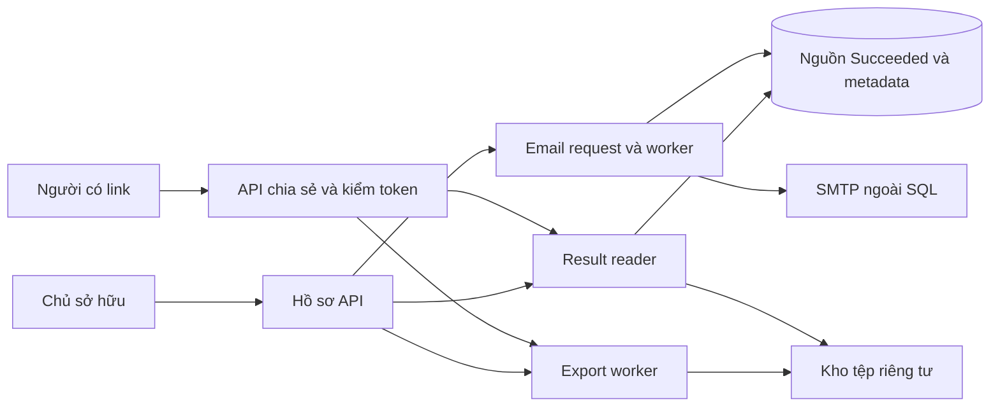
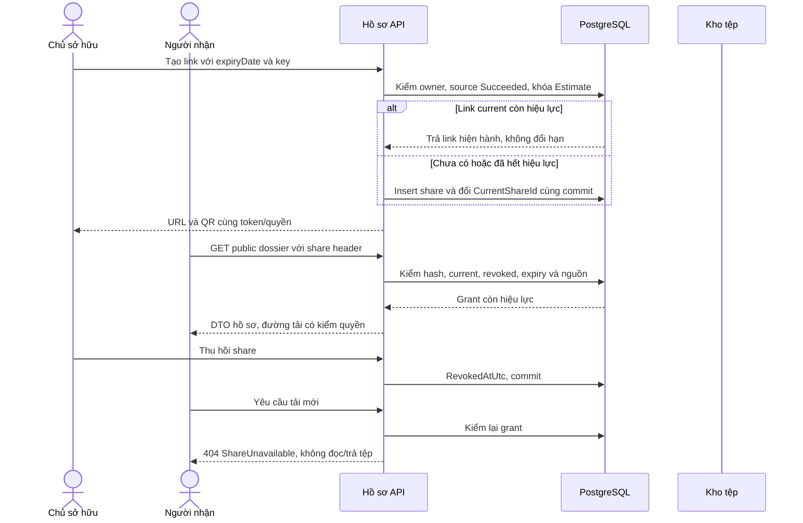
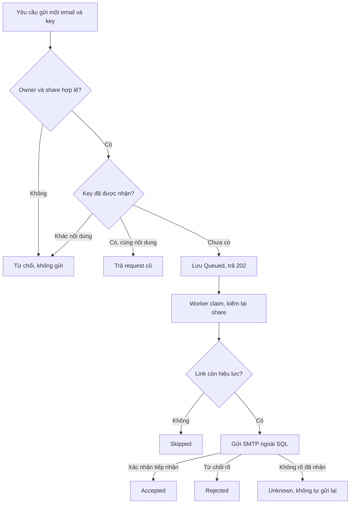
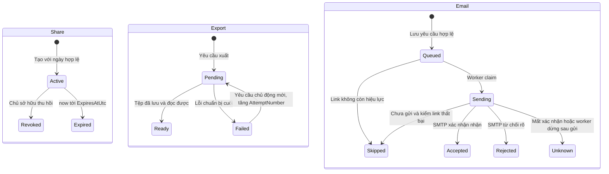
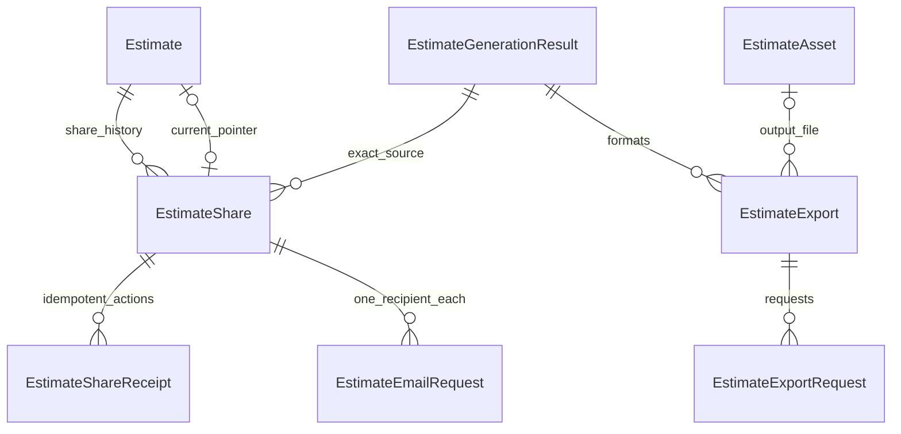

<!-- HƯỚNG DẪN CHO AI KHI ĐIỀN HOẶC CHỈNH SỬA MẪU
- Đọc toàn bộ mẫu, các comment hướng dẫn và tài liệu nguồn được cung cấp trước khi viết. Tuân thủ các quy tắc nghiệp vụ, điều kiện, ngoại lệ và giới hạn đã được xác nhận.
- Không bịa, tự chế hoặc suy đoán thành sự thật: yêu cầu, quy tắc, số liệu, API, schema, mã lỗi, nguồn tham khảo, người phụ trách và kết quả kiểm thử phải có căn cứ. Nội dung ví dụ trong mẫu không phải dữ kiện của dự án.
- Khi thiếu thông tin hoặc các nguồn mâu thuẫn, hỏi người dùng để làm rõ; giữ nguyên placeholder ở phần chưa xác định. Không tự chọn đáp án, lấp chỗ trống hay tuyên bố tài liệu đã hoàn tất.
- Chỉ thay nội dung cần điền hoặc được yêu cầu sửa. Không tự mở rộng phạm vi, sửa nghĩa quy tắc, bỏ điều kiện/ngoại lệ, xoá hay ghi đè nội dung hợp lệ đã có.
- Giữ nguyên tên, cấp và thứ tự heading, nhãn in đậm, tiền tố bullet, cấu trúc danh sách, tên/thứ tự/số cột bảng và cú pháp code fence. Không dịch, đổi tên, gộp hoặc thêm mục ngoài cấu trúc mẫu.
- Chỉ lặp khối luồng, AC hoặc API theo đúng khuôn khi có căn cứ; chỉ bỏ phần tuỳ chọn khi hướng dẫn riêng của mẫu cho phép và đã xác định không áp dụng.
- Mã tham chiếu và section phải trỏ tới tài liệu có thật đã được cung cấp hoặc kiểm chứng. Không giữ mã ví dụ như tham chiếu thật và không tự tạo tài liệu liên quan để hợp thức hoá liên kết.
- Giữ các comment hướng dẫn trong file. Xuất Markdown UTF-8, mỗi file một tài liệu; không bọc toàn bộ file trong code fence, không chèn lời dẫn hay giải thích ngoài mẫu.
- Trước khi bàn giao, đối chiếu nội dung với nguồn, kiểm tra cấu trúc, giá trị cho phép, giới hạn độ dài và tính nhất quán của mã/tham chiếu. Báo rõ phần chưa đủ thông tin; không tuyên bố đã chạy test hoặc import khi chưa thực hiện.
-->

<!-- Thay mã TDD-001 và nội dung ví dụ; giữ nguyên heading và nhãn in đậm.
Sơ đồ dùng mermaid, plantuml hoặc URL. Giữ heading Architecture, Sequence Diagram, Activity Diagram, State Diagram, Data Model.
Ví dụ API phải có heading trùng METHOD /path trong Endpoints. Xoá phần API/sơ đồ không dùng.
Version, Updated At và Change Log do lịch sử phiên bản quản lý, để trống khi nhập mới.
Author/Reviewer là tên hiển thị; gán tài khoản, phê duyệt, giả định và câu hỏi mở trên giao diện sau import.
Thiết kế phải truy vết về Story và Business Rule được cung cấp. Phân biệt thiết kế đề xuất với implementation đã kiểm chứng; không mô tả API/schema/sơ đồ ví dụ như hệ thống thật hoặc tự quyết định nghiệp vụ còn thiếu.
BẮT BUỘC KHI HOÀN THIỆN MẪU: phải có cả Reviewer và Approver, mỗi tên 1–200 ký tự sau khi bỏ khoảng trắng đầu/cuối. Không xoá hai dòng metadata, để trống, dùng tên bịa hoặc giữ placeholder rồi coi là hoàn tất.
Nếu chưa biết người review hoặc người phê duyệt, phải hỏi người dùng và báo tài liệu chưa đủ thông tin; không tự lấy Author/Owner làm người thay thế. Tên trong file không tự gán tài khoản hoặc xác nhận đã duyệt; gán thành viên trên giao diện sau import.
Đây là yêu cầu hoàn thiện mẫu; backend hiện vẫn nhận file cũ thiếu hai trường để tương thích.

VALIDATION CHO FILE NHẬP (đối chiếu ImportSnapshotValidator, MarkdownParser và ImportService):
- Mỗi file .md UTF-8 không rỗng chỉ có một heading cấp 1 chứa mã tài liệu dài 1–100 ký tự. Mã không được trùng trong cùng lần nhập hoặc thuộc loại tài liệu khác đã tồn tại.
- Không dùng tên README.md hoặc sitemap.md vì importer bỏ qua. Giao diện nhận .md/.zip, tối đa 2.000 file, tổng file tải lên 31 MiB; API giới hạn request 32 MiB và tổng nội dung đọc/giải nén 64 MiB.
- Chỉ nhập đè tài liệu cùng loại đang Draft, chưa có phiên bản và chưa lưu trữ. Import thay toàn bộ nội dung bản nháp, vì vậy phải giữ lại nội dung hợp lệ ngoài phần được yêu cầu sửa.
- Không dùng Status trong Markdown hoặc tên Approver để tự xác nhận phê duyệt; import không cấp quyền hay gán tài khoản từ tên. Chạy Kiểm tra file và xử lý lỗi/cảnh báo trước khi nhập.
- Giới hạn độ dài bên dưới tính theo string.Length của .NET (đơn vị UTF-16); không tự cắt ngắn dữ kiện quan trọng để vượt validation, hãy viết lại có căn cứ hoặc hỏi người dùng.
- Feature tối đa 300 ký tự và được dùng làm tiêu đề tài liệu. Status được parser nhận: Draft / In Review / Approved / Deprecated; tài liệu nhập mới vẫn có trạng thái phê duyệt Draft.
- Endpoint: đường dẫn tối đa 500 ký tự; tên/mô tả endpoint được lưu trong Name tối đa 300. HTTP method: GET / POST / PUT / PATCH / DELETE / HEAD / OPTIONS.
- Error Codes: mã tối đa 100 ký tự, không trùng trong tài liệu; giữ dạng - **CODE** (400): mô tả. HTTP status trong Error Codes và Response phải là số nguyên đọc được bằng Int32; không tự đặt status khác hợp đồng API.
- URL sơ đồ tối đa 1.000 ký tự. Mục sơ đồ được sử dụng phải có khối mermaid/plantuml hoặc URL theo mẫu; không để một mục sơ đồ rỗng. Nhãn mục được tách từ bullet như tên External API Fields tối đa 300 ký tự.
- Heading Examples phải khớp METHOD /path ở Endpoints. Giữ các nhãn Request:, Response 200: (thay mã theo contract) và Error Response: để parser tách đúng dữ liệu.
- Tham chiếu dạng DOC-KEY/section: ghi chú: mã đích tối đa 100 ký tự, section tối đa 100, ghi chú tối đa 1.000. Không trùng bộ mã đích + section + loại liên kết trong cùng tài liệu.
ĐỐI CHIẾU FORM TDD (src/features/tdds/validations.ts; form có thể chặt hơn import):
- Điền Feature, Author, Reviewer, Problem và ít nhất một Goal; các Goal/Non-goal/Notes đã thêm không được rỗng. API đã khai báo phải có endpoint và mô tả/mục đích; Fields phải có tên và ý nghĩa; Error Codes phải có mã, HTTP status và điều kiện.
- Form còn kiểm tra Version, Updated At và nội dung Change Log khi khai báo; với file nhập mới, giữ các trường lịch sử này trống theo hợp đồng import, không tự tạo dữ liệu lịch sử.
-->

# TDD-PROJ-003

## Document Info

- **Feature**: Tạo dự toán — hồ sơ, xuất tệp, chia sẻ và email
- **Author**: Codex
- **Reviewer**: Tân Trần
- **Approver**: Tân Trần
- **Status**: Draft
- **Version**:
- **Updated At**:

## Context & Goals

### Problem

STORY-PROJ-003/004 cần xem kết quả, PDF/Excel, link/QR và email từ cùng bộ kết quả AI đã lưu. Người nhận có link hợp lệ xem/tải không cần đăng nhập; chủ sở hữu vẫn dùng đầy đủ hồ sơ cũ khi gói hết hạn. Thu hồi phải chặn yêu cầu tải mới, nên không thể đưa URL object công khai độc lập với link.

Người dùng xác nhận bổ sung ngày 21/09/2026: mỗi bản có tối đa một link đang hiệu lực, dùng chung sao chép/QR/email; còn hiệu lực thì dùng lại, hết hạn hoặc thu hồi mới tạo khác. Ngày hết hạn dùng hết ngày theo Asia/Ho_Chi_Minh, 00:00 ngày kế tiếp hết hiệu lực, không chọn ngày đã qua.

AI API và nguồn tệp chưa có hợp đồng. Backend đã có IMailService/MailKit SMTP dùng cho xác thực, nhưng chưa có hàng đợi gửi hồ sơ hoặc trạng thái tiếp nhận. Thiết kế dưới đây bổ sung phần điều phối; không khẳng định đã gửi email, tạo file thật hoặc có hạ tầng lưu object.

### Goals

- UI, PDF và Excel luôn dùng một kết quả nguồn; không tự tính lại số tiền, không sửa diện tích đầu vào bằng giá trị AI ước tính.
- Các thao tác hồ sơ không kiểm số dư/quyền tạo mới, không gọi AI tạo thiết kế và không thay trạng thái thành công của operation nguồn.
- Link/QR/email có cùng ngày hết hạn/quyền thu hồi; request xem/tải mới sau hết hạn/thu hồi bị chặn ở backend.
- Gửi lặp hoặc crash không báo sai đã gửi/đã phát email; tác vụ tệp thất bại có thể yêu cầu lại từ cùng nguồn.

### Non-goals

- Tạo nội dung chuyên môn tại BMT; chọn thư viện PDF/Excel trước khi biết AI trả tệp hay dữ liệu cần xuất.
- Đính kèm hồ sơ trong email, gửi nhiều người một lần, theo dõi đã đọc thư, thu hồi tệp đã tải.
- Nhiều link đồng thời, gia hạn/đổi ngày link đang có, chia sẻ quyền chỉnh sửa hoặc quyền tạo AI.
- Triển khai frontend/trình xem hồ sơ, dịch vụ thật hoặc Unit Test chi tiết ở bước TDD.

## Architecture

Module Results chỉ đọc `EstimateGenerationResult` khi UsageOperation đã Succeeded. Module Exports chuẩn bị tệp từ nguồn đó; module Sharing kiểm token và thời hạn; module Email xếp yêu cầu gửi link. Tất cả dùng cùng EstimateId/OperationId để không lẫn bản và không phụ thuộc trạng thái quota hiện tại.

| Thành phần dự kiến | Vai trò |
|---|---|
| EstimateResultReader | Kiểm owner hoặc share grant, JOIN nguồn đã Succeeded rồi trả DTO an toàn. |
| RequestEstimateExportHandler / EstimateExportWorker | Tạo/nhận lại một export theo operation và format; lấy tệp đã có từ provider hoặc render từ nguồn đã lưu qua IEstimateDocumentExporter, chưa chọn adapter. |
| CreateEstimateShareHandler / RevokeEstimateShareHandler | Khóa Estimate để kiểm slot link hiện hành, tạo/thu hồi trong transaction; không thay quota hoặc inputVersion. |
| EstimateShareAccessPolicy | Kiểm đúng share, token hash, current pointer, chưa thu hồi và EffectiveNow < ExpiresAtUtc trên mỗi lần xem/tải. |
| EstimateFileReader | Stream bytes sau kiểm quyền và đúng liên kết result/export; không redirect tới URL kho tệp. |
| QueueEstimateEmailHandler / EstimateEmailWorker | Lưu một yêu cầu gửi một email; worker kiểm link còn hiệu lực rồi gửi ngoài transaction, cập nhật Accepted/Rejected/Unknown theo chứng cứ SMTP. |
| IEstimateShareTokenProtector | Sinh token ngẫu nhiên, lưu hash để kiểm; mã hóa bản token để owner lấy lại link/QR và email dùng cùng quyền. Keyring chia sẻ giữa instance và cần backup. |



**Notes**:

- **Một nguồn kết quả**: OperationId xác định bộ AI thành công duy nhất. Reader trả tổng, phần thô/hoàn thiện/nội thất, tư vấn và hồ sơ theo contract đã lưu; không cộng lại số tiền để “sửa” AI. Căn hộ không bị cắt nhóm phần thô. Nếu payload thiếu trường bắt buộc thì phải bị ngăn từ giai đoạn finalization, không điền số 0 tại reader.
- **Export tách khỏi AI**: unique `(OperationId,Format)` cho Pdf/Xlsx; file lần đầu và lần tải lại đều trỏ cùng nguồn. Nếu AI trả PDF/Xlsx bắt buộc ngay lúc thành công, exporter dùng file đó. Nếu contract cho xuất sau, exporter chỉ chuyển định dạng dữ liệu nguồn. Không gọi lại model thiết kế. Phân loại tệp nào bắt buộc lúc thành công là mục chờ AI, không tự coi PDF chưa có là thất bại nguồn.
- Yêu cầu export mới lưu Pending rồi worker chuẩn bị ngoài SQL; thành công mới gắn OutputAssetId và Ready. Gửi lại lúc Pending/Ready trả công việc đó. Failed chỉ khởi động lại khi có yêu cầu mới chủ động; cùng idempotency key không tạo lại việc. `AttemptNumber` tăng khi chủ động thử lại và `LeaseToken` chặn worker cũ gắn output sang lần mới. Retry thuần I/O cùng nguồn có thể do worker xử lý, không đổi quota; retry policy cần cấu hình theo adapter.
- **Một link hiệu lực**: Estimate bổ sung CurrentShareId. CreateShare khóa Estimate, đọc link current; còn hiệu lực thì trả link đó, không đổi ngày nếu body yêu cầu khác (409 ExistingShareActive). Hết hạn/đã thu hồi thì tạo share mới và cập nhật con trỏ cùng transaction. Đường đọc công khai yêu cầu shareId là CurrentShareId, nên chỉ một link được chấp nhận kể cả có dữ liệu cũ trong bảng. Giữ lịch sử share, không tái sử dụng token bị thu hồi.
- **Chống gửi lặp khi xuất/chia sẻ/email**: key dài 1–100 ký tự; hash chứa tên thao tác, estimateId, resourceId liên quan và body chuẩn hóa. Quyền owner hoặc quyền share được kiểm trước tra key; cùng key khác hash trả 409 IdempotencyConflict. Receipt chủ sở hữu đã commit được trả lại mà không tạo quyền mới, kể cả share cũ đã hết hạn/thu hồi; trả trạng thái hiện tại của chính share đó. Không tự đổi receipt sang link mới. Tạo share dùng lại link hiện hành cũng lưu receipt. Với export công khai, link hết hiệu lực bị từ chối trước cả replay. Email replay trả trạng thái yêu cầu cũ, không đòi gửi lại và không chuyển sang share mới.
- Mọi thời gian lưu UTC. `expiryDate` là ngày Việt Nam; server đổi thành thời điểm bắt đầu ngày kế tiếp tại Asia/Ho_Chi_Minh rồi sang UTC. Ví dụ 25/09/2026 → `2026-09-25T17:00:00Z`. Hợp lệ khi `now < expiresAt`; bằng mốc thì hết hạn. Không lấy timezone cá nhân hoặc giờ thiết bị để kéo dài link. Ngày hôm nay được phép đến hết ngày, ngày đã qua bị từ chối; không tự đặt số ngày tối đa.
- **Token link**: sinh 32 byte bằng bộ sinh ngẫu nhiên mật mã, encode base64url không padding; DB lưu SHA-256 để tra/so sánh và token ciphertext có xác thực để owner lấy lại. Token không chứa email hoặc thông tin khách. Mã hóa dùng Data Protection purpose riêng cho EstimateShare v1; keyring bền vững, dùng chung và quản lý truy cập. Ciphertext không thay hash kiểm quyền; mất keyring có thể làm owner không lấy lại link, nên cần phục hồi keyring trước mở tính năng.
- Đường dẫn frontend đề xuất `{ConfiguredPublicWebBase}/vi/estimates/shared/{shareId}#token=...`. Token ở fragment không tự gửi vào request log/referrer; frontend lấy rồi gửi qua header `X-Estimate-Share-Token` cho API. QR mã hóa chính URL đó, email chứa chính URL đó. Không lấy Host request làm base URL và không gọi dịch vụ QR bên ngoài làm lộ token. Route frontend là hợp đồng bàn giao, chưa có code trong workspace.
- **Thu hồi**: cập nhật RevokedAtUtc dưới khóa Estimate/Share rồi commit; kiểm public access đọc DB primary mỗi request, không cache quyền positive. Lấy giờ/đọc quyền ngay trước mở stream; request bắt đầu sau commit thu hồi hoặc sau expiry bị từ chối. Một stream đã được cấp quyền trước thu hồi có thể đang truyền, và bytes đã tải không thu hồi được; không hứa xóa nội dung khỏi máy người nhận.
- Tệp không có đường tải công khai riêng. GET/HEAD/Range mới đều kiểm grant hoặc owner, result Succeeded và asset cùng nguồn. Response no-store, Referrer-Policy=no-referrer, X-Content-Type-Options=nosniff; không đưa token vào query, log, metric, exception hoặc analytics. Nội dung AI dùng DTO/HTML đã escape; không render raw script. Lỗi share sai/thu hồi/hết hạn cùng 404 ShareUnavailable để không tiết lộ nội dung.
- Không yêu cầu subscription cho owner xem/xuất/share/email/revoke hoặc người nhận có link. Các endpoint chủ sở hữu vẫn cần verified session/owner; link công khai không cấp quyền gọi mutation owner. Header share chỉ có tác dụng trên route public, không dùng như token đăng nhập.
- **Email bền vững, trạng thái trung thực**: request hợp lệ lưu Queued rồi trả 202, chưa báo đã gửi. Worker claim bằng lease token, kiểm lại share hiện hành/hạn, dựng HTML từ dữ liệu đã escape và gọi SMTP ngoài SQL. Nhận phản hồi SMTP tiếp nhận thì Accepted, không phải Delivered. Nếu link đã hết hạn/thu hồi tại lần kiểm cuối ngay trước bắt đầu gửi thì Skipped, không gửi link khác tự động. Thu hồi xảy ra sau lần kiểm này có thể vẫn có thư tới nơi; link trong thư vẫn bị chặn tại thời điểm người nhận truy cập.
- SMTP hiện tại gọi SendAsync rồi DisconnectAsync trong một Task; nếu Disconnect lỗi sau khi server nhận thư, Task lỗi không chứng minh thư chưa được nhận. Adapter mới phải ghi nhận riêng mốc SendAsync đã được xác nhận; không biến lỗi đóng kết nối thành Rejected hoặc tự gửi lại. `IMailService` hiện không trả receipt/cancellation nên cần adapter riêng `IEstimateMailSender`, dùng cùng cấu hình MailKit mà không thay hợp đồng mail xác thực ngầm.
- Crash/mất phản hồi sau gửi trước ghi Accepted → Unknown; không tự gửi lại với SMTP vốn không bảo đảm idempotency. Sending hết lease mà chưa có bằng chứng tiếp nhận được chuyển Unknown, không nhận lại như Queued. Cùng key trả cùng request/trạng thái. Khách có thể chủ động gửi yêu cầu mới với key mới; UI phải cho biết lần trước chưa rõ để tránh hiểu rằng chắc chắn chưa gửi. Không tuyên bố exactly-once email. Rejected (được từ chối rõ ràng) cũng không tự lặp hàng loạt; chủ sở hữu chủ động yêu cầu lại.
- Danh sách một người nhận: parse đúng một địa chỉ mailbox; từ chối mảng, danh sách dấu phẩy/chấm phẩy, newline/CRLF và chuỗi thiếu địa chỉ. Không dùng giới hạn Email=50 của bảng User cho người nhận bên ngoài. Recipient text lưu địa chỉ đã chuẩn hóa; giới hạn request kỹ thuật không thay quy tắc chỉ một email.

## Sequence Diagram



## Activity Diagram



## State Diagram



Active/Expired là hiệu lực tính khi đọc từ mốc UTC, không cần cron mới hết hạn. Revoked giữ sự kiện thu hồi; không tái kích hoạt share cũ. Ready của export chỉ được trả cùng quyền truy cập nguồn; file lỗi về sau không đổi operation AI thành Failed.

## Data Model

Nguồn dùng lại: Estimate/EstimateAsset ở TDD-PROJ-001; EstimateGenerationResult/EstimateResultAsset và UsageOperation ở TDD-PROJ-002. TDD này không tạo bảng tiền hoặc copy payload AI vào share/email.

| Bảng mới/thay đổi | Ý nghĩa một dòng và nơi cập nhật |
|---|---|
| Estimate bổ sung CurrentShareId | Con trỏ tới quyền chia sẻ hiện hành hoặc NULL khi chưa chia sẻ. Không phải quyền truy cập của owner và không thay InputVersion. |
| EstimateExport | Một bản PDF hoặc XLSX của một kết quả nguồn; worker cập nhật việc chuẩn bị, asset, lease và attempt. NULL output khi chưa Ready. |
| EstimateExportRequest | Một hành động yêu cầu xuất với key, nhận diện lần gửi lại kể cả khi export đã thất bại; không phải bản sao bytes hoặc operation AI. |
| EstimateShare | Một lần cấp quyền link có token và ngày hết hạn. Tạo mới sau khi link cũ hết hiệu lực; RevokedAtUtc NULL khi chưa thu hồi. |
| EstimateShareReceipt | Một hành động Create/Revoke đã commit; kết quả chỉ shareId/trạng thái, không lưu plaintext token hoặc hồ sơ. |
| EstimateEmailRequest | Một yêu cầu gửi link tới đúng một email; worker ghi trạng thái tiếp nhận. Lưu người nhận để gửi nhưng không coi là contact người dùng. |

| Bảng | Cột, kiểu và ràng buộc |
|---|---|
| Estimate bổ sung | CurrentShareId uuid NULL; FK(Id,CurrentShareId) → EstimateShare(EstimateId,Id), tạo sau bảng share hoặc gắn pointer sau insert. |
| EstimateExport | Id uuid PK; EstimateId uuid NN; OperationId uuid NN; Format varchar(8) NN CHECK Pdf/Xlsx; State varchar(16) NN CHECK Pending/Ready/Failed; AttemptNumber int NN DEFAULT 1 CHECK>0; LeaseToken uuid NULL; LeaseUntilUtc timestamptz NULL; OutputAssetId uuid NULL; FailureCode varchar(100) NULL; CreatedAtUtc,UpdatedAtUtc timestamptz NN; UNIQUE(OperationId,Format); UNIQUE(Id,EstimateId); FK(OperationId,EstimateId) → EstimateGenerationResult(OperationId,EstimateId); FK(OutputAssetId,EstimateId) → EstimateAsset(Id,EstimateId). CHECK Ready có output, Pending/Failed output NULL. |
| EstimateExportRequest | Id uuid PK; EstimateId uuid NN; ExportId uuid NN; ActorId uuid NULL FK User; ShareId uuid NULL; RequestKey varchar(100) NN; RequestHash char(64) NN; AcceptedAttemptNumber int NN CHECK>0; CreatedAtUtc timestamptz NN; CHECK đúng một ActorId/ShareId có giá trị; FK(ExportId,EstimateId) → EstimateExport(Id,EstimateId); FK(ActorId,EstimateId) → Estimate(OwnerId,Id); FK(EstimateId,ShareId) → EstimateShare(EstimateId,Id). Hai unique index có điều kiện: (ActorId,RequestKey) WHERE ActorId IS NOT NULL và (ShareId,RequestKey) WHERE ShareId IS NOT NULL. |
| EstimateShare | Id uuid PK; EstimateId uuid NN FK Estimate; OperationId uuid NN; CreatedBy uuid NN; TokenHash char(64) NN UNIQUE; ProtectedToken text NN; ExpiryDate date NN; ExpiresAtUtc timestamptz NN; CreatedAtUtc timestamptz NN; RevokedAtUtc timestamptz NULL; UNIQUE(EstimateId,Id); FK(CreatedBy,EstimateId) → Estimate(OwnerId,Id); FK(OperationId,EstimateId) → EstimateGenerationResult(OperationId,EstimateId); CHECK ExpiresAtUtc>CreatedAtUtc và revoked NULL hoặc >=CreatedAtUtc. Không lưu trạng thái Active/Expired riêng. |
| EstimateShareReceipt | Id uuid PK; ActorId uuid NN FK User; EstimateId uuid NN; ShareId uuid NN; Operation varchar(16) NN CHECK Create/Revoke; RequestKey varchar(100) NN; RequestHash char(64) NN; CreatedAtUtc timestamptz NN; UNIQUE(ActorId,Operation,RequestKey); FK(ActorId,EstimateId) → Estimate(OwnerId,Id); FK(EstimateId,ShareId) → EstimateShare(EstimateId,Id). |
| EstimateEmailRequest | Id uuid PK; EstimateId uuid NN; ShareId uuid NN; RequestedBy uuid NN; Recipient text NN; RequestKey varchar(100) NN; RequestHash char(64) NN; State varchar(16) NN CHECK Queued/Sending/Accepted/Rejected/Unknown/Skipped; LeaseToken uuid NULL; LeaseUntilUtc timestamptz NULL; CreatedAtUtc,UpdatedAtUtc timestamptz NN; AcceptedAtUtc timestamptz NULL; ProviderReceipt text NULL; FailureCode varchar(100) NULL; UNIQUE(RequestedBy,RequestKey); FK(RequestedBy,EstimateId) → Estimate(OwnerId,Id); FK(EstimateId,ShareId) → EstimateShare(EstimateId,Id); CHECK Accepted có AcceptedAtUtc; các trạng thái khác AcceptedAtUtc NULL. |

FK dùng RESTRICT để không mất hồ sơ/lịch sử vì xóa cha. Không xóa mềm lịch sử share/receipt theo Entity cơ sở. ExportRequest tách vì export có thể được yêu cầu bởi owner hoặc share: một hàng export vẫn có nhiều hành động yêu cầu từ các nguồn khác nhau, mỗi action chỉ được nhận một lần. Hai unique index tách yêu cầu của chủ sở hữu và của link công khai. Các FK ghép bảo đảm export, chủ sở hữu hoặc share cùng một bản dự toán; danh tính do backend xác minh, không nhận ActorId/ShareId tùy ý từ body.

**Ràng buộc một link**: FK CurrentShareId cùng Estimate và policy public yêu cầu pointer khớp bảo đảm không có hai quyền current cho một bản. Create/revoke khóa Estimate trước Share; email enqueue/claim cần đọc đúng Share, không lấy Share lock rồi quay lại Estimate. Không tạo partial index chứa `now()`. Sau link S1 hết hạn, S2 được tạo và pointer sang S2; S1 giữ lịch sử, mọi cách dùng S1 đều không được cấp quyền mới.



**Mẫu lưu trữ** — UUID dưới dạng bí danh, ciphertext/hash chỉ ghi ký hiệu, không chứa token thật; UTC cho timestamp, date theo Việt Nam. D1/U1/J1 là bản thành công từ hai TDD trước.

| Bảng | Dòng minh họa |
|---|---|
| EstimateExport | EX1; EstimateId=D1; OperationId=J1; Format=Pdf; State=Pending; AttemptNumber=1; OutputAssetId=NULL; CreatedAtUtc=UpdatedAtUtc=2026-09-21T04:00Z. |
| EstimateExportRequest | ER1; EstimateId=D1; ExportId=EX1; ActorId=U1; ShareId=NULL; RequestKey=pdf-1; RequestHash=HER1; AcceptedAttemptNumber=1; CreatedAtUtc=04:00Z. |
| EstimateAsset sau xuất | FP1; EstimateId=D1; Purpose=Export; StorageKey=export/j1/pdf/attempt1; MediaType=application/pdf; SizeBytes=500000; Sha256=HFP1; CreatedBy=NULL cho hệ thống; CreatedAtUtc=2026-09-21T04:01:00Z. |
| EstimateExport sau ghi tệp | EX1: State=Ready; OutputAssetId=FP1; UpdatedAtUtc=04:01Z; LeaseToken/LeaseUntilUtc=NULL. Một dòng Format=Xlsx dùng cùng J1 nhưng file khác. |
| EstimateShare | S1; EstimateId=D1; OperationId=J1; CreatedBy=U1; TokenHash=HT1; ProtectedToken=CT1; ExpiryDate=2026-09-25; ExpiresAtUtc=2026-09-25T17:00:00Z; CreatedAtUtc=2026-09-21T04:02:00Z; RevokedAtUtc=NULL. |
| Estimate bổ sung | D1.CurrentShareId=S1; InputVersion giữ giá trị trước chia sẻ. |
| EstimateShareReceipt | SR1; ActorId=U1; EstimateId=D1; ShareId=S1; Operation=Create; RequestKey=share-1; RequestHash=HSR1; CreatedAtUtc=04:02Z. |
| EstimateEmailRequest | M1; EstimateId=D1; ShareId=S1; RequestedBy=U1; Recipient=recipient@example.test; RequestKey=mail-1; RequestHash=HM1; State=Queued; CreatedAtUtc=UpdatedAtUtc=2026-09-21T04:02:30Z; LeaseToken=LeaseUntilUtc=AcceptedAtUtc=ProviderReceipt=FailureCode=NULL. |
| EstimateEmailRequest sau SMTP nhận | M1.State=Accepted; AcceptedAtUtc=2026-09-21T04:03:00Z; ProviderReceipt chứa mã tiếp nhận nếu SMTP có; lease NULL. Không có DeliveredAtUtc giả. |
| Thu hồi | S1.RevokedAtUtc=2026-09-22T02:00:00Z; receipt SR2 Operation=Revoke; D1/J1/EX1/FP1 không đổi. |

Khi lấy lại link đang hiệu lực, giải mã CT1 cho owner, không tạo token khác. Sau thu hồi S1, POST tạo với ngày mới có thể tạo S2 và đổi pointer. Request M1 vẫn tham chiếu S1: không đổi sang S2 rồi tự gửi cho người nhận cũ. Người nhận đã tải FP1 giữ tệp trên máy; yêu cầu tải mới bằng S1 bị từ chối.

**Notes**:

- Chuẩn hóa: kết quả chuyên môn chỉ ở J1; export là bản chuyển định dạng có FK nguồn; share chỉ là quyền; email chỉ là ý định gửi. Ngày và ExpiresAtUtc lưu cùng nhau để giải thích lựa chọn và kiểm nhanh, store tính một lần theo múi giờ cố định, không cho client gửi hai giá trị mâu thuẫn. ProtectedToken/hash là hai biểu diễn cùng secret cho hai mục đích, cùng ghi lúc tạo và không sửa độc lập.
- Index: export unique source/format, State/UpdatedAtUtc/lease cho worker; token hash unique; share (EstimateId,CreatedAtUtc DESC,Id); receipt unique actor/operation/key; email (State,LeaseUntilUtc,CreatedAtUtc,Id) cho nhận việc và (RequestedBy,CreatedAtUtc DESC,Id) cho đọc trạng thái owner. Không index Recipient hoặc JSON toàn bộ khi chưa có truy vấn.
- Tất cả key tiếp nhận giữ lâu bằng lịch sử nghiệp vụ hiện có; retention chưa chốt, không tự TTL khiến cùng key có thể gửi lại hoặc tạo tác động lặp. Rate limit theo owner/share/IP cần cấu hình trước public launch, không biến thành quota thiết kế; no-store cho DTO/tệp có dữ liệu riêng tư.
- Ranh giới external: upload/export/SMTP không nằm trong transaction giữ khóa. DB commit lỗi sau ghi tệp để lại object chưa công bố; worker có thể đối chiếu hash/key cùng nguồn. DB lỗi sau SMTP acceptance là Unknown nếu chưa ghi được bằng chứng, không rollback email.
- Khả năng đọc được trước finalization không bảo đảm kho object vĩnh viễn không lỗi. Khi lỗi tải tệp sau thành công, trả lỗi phụ thuộc, giữ kết quả nguồn và cho yêu cầu lại; không hoàn/giữ thêm lượt. Không gán Ready từ file name hoặc chỉ kiểm extension.
- Migration: thêm bảng export/share/email và FK con trước con trỏ CurrentShareId; giữ NULL cho bản chưa chia sẻ. Nếu DB đã có URL công khai, cần thu hồi/đổi cơ chế truy cập trước khi hứa thu hồi hiệu lực; không tuyên bố route mới vô hiệu hóa URL cũ tự động. Chưa có dữ liệu thật để chọn kế hoạch chuyển; không chạy migration trong tác vụ này.
- Vận hành: metric queue age/export failures/mail Unknown/share denied; log requestId/exportId/shareId/operationId và mã lỗi, không log token/link đầy đủ/người nhận/địa chỉ. Readiness tệp/mail tách khỏi liveness API; mail hỏng không chặn owner xem nguồn. Ngưỡng cảnh báo, retry timeout, retention và người vận hành còn cần cấu hình. Không gửi email thật trong lúc soạn tài liệu.
- Kiểm chứng bằng ST-PROJ-033–047 và 057, ST-PROJ-059–060 kiểm biên hết ngày và một link đang hiệu lực. Integration dùng DB và private storage/SMTP sandbox cho lỗi commit, gửi lặp/Unknown, truy cập Range sau thu hồi; browser thật để chứng minh QR/fragment/header/download hoạt động. Unit Test chỉ mô tả chiến lược ở đây, chưa viết đặc tả chi tiết trước chốt TDD.

## Internal API

### Endpoints

JSON thành công dùng Result<T>; binary stream không bọc JSON. Idempotency-Key cho mọi POST mutation, no-store cho các response. Policy owner gồm verified Customer và cùng OwnerId, CSRF khi dùng cookie; không yêu cầu subscription. Policy public chỉ xét share/header, bỏ qua cookie để không phát sinh quyền owner từ token chia sẻ.

- **GET** `/api/v1/estimates/{estimateId}/result` — Owner nhận `{operationId,contractVersion,dossier,exportAvailability}` từ nguồn Succeeded. DTO dossier chi tiết chờ AI; không trả raw provider credential/URL hoặc toàn bộ envelope tùy ý.
- **POST** `/api/v1/estimates/{estimateId}/exports` — `{format:"Pdf"|"Xlsx"}` + key; 202 khi Pending, 200 khi đã Ready hoặc replay; `{exportId,state,attemptNumber}`. Failed + key mới chủ động → attempt mới; cùng key trả attempt đã nhận và currentState.
- **GET** `/api/v1/estimates/{estimateId}/exports/{exportId}` — Owner đọc trạng thái tệp/attempt và mã lỗi; Ready có đường tải backend.
- **GET** `/api/v1/estimates/{estimateId}/exports/{exportId}/file` — Owner tải binary đúng nguồn Ready, application/pdf hoặc XLSX MIME chuẩn; 409 nếu chưa sẵn sàng, 503 nếu storage lỗi.
- **GET** `/api/v1/estimates/{estimateId}/result-assets/{assetId}` — Owner xem/tải ảnh/bản vẽ thuộc kết quả Succeeded, không đọc candidate.
- **POST** `/api/v1/estimates/{estimateId}/shares` — `{expiryDate:"YYYY-MM-DD"}` + key; 201 share mới, 200 dùng lại link còn hiệu lực cùng ngày; 409 nếu muốn đổi ngày khi current còn hiệu lực. `{shareId,url,expiryDate,expiresAtUtc,state}`.
- **GET** `/api/v1/estimates/{estimateId}/shares/current` — Owner đọc link current và trạng thái; chưa có trả value=null; không tự gia hạn/tạo lại.
- **GET** `/api/v1/estimates/{estimateId}/shares/{shareId}/qr` — Owner nhận PNG QR của đúng URL current còn hiệu lực; không gọi dịch vụ QR ngoài.
- **POST** `/api/v1/estimates/{estimateId}/shares/{shareId}/revoke` — Body `{}` + key; 200 trạng thái thực, thu hồi lặp không tạo quyền mới. Không đổi inputVersion/quota.
- **POST** `/api/v1/estimates/{estimateId}/shares/{shareId}/emails` — `{recipient}` + key; 202 `{emailRequestId,state:"Queued"}`, replay 200 trạng thái đã có. Phải là link current còn hiệu lực; không chọn token khác tự động.
- **GET** `/api/v1/estimates/{estimateId}/emails/{emailRequestId}` — Owner đọc state và failureCode; Accepted nghĩa SMTP đã nhận, Unknown không biết đã nhận; không có dữ liệu đã mở thư.
- **GET** `/api/v1/public/estimate-shares/{shareId}` — Header X-Estimate-Share-Token, không cần login; trả dossier cùng whitelist dữ liệu như hồ sơ đã chia sẻ, không trả owner email/quota/input riêng chưa thuộc hồ sơ.
- **POST** `/api/v1/public/estimate-shares/{shareId}/exports` — Header share + key + `{format}`; chuẩn bị tải từ cùng nguồn nếu chưa có file, không AI/quota. Không ambient cookie, không cấp quyền khác; rate limit riêng.
- **GET** `/api/v1/public/estimate-shares/{shareId}/exports/{exportId}` — Header share, đọc trạng thái export của cùng operation được chia sẻ.
- **GET** `/api/v1/public/estimate-shares/{shareId}/exports/{exportId}/file` — Header share, stream sau kiểm grant hiện tại, source và export; không có URL public storage.
- **GET** `/api/v1/public/estimate-shares/{shareId}/assets/{assetId}` — Header share, ảnh/bản vẽ phải thuộc chính result đã chia sẻ và Succeeded.

Các GET file nếu hỗ trợ HEAD hoặc Range phải dùng cùng policy, không tạo route bỏ kiểm token. Frontend tải qua fetch có share header; không gắn trực tiếp URL storage vào img/download. Cơ chế stream/trình xem frontend cần triển khai cùng hợp đồng này, chưa có mã frontend trong workspace.

### Examples

#### POST /api/v1/estimates/{estimateId}/shares

```
Request:
Idempotency-Key: share-estimate-1
X-CSRF-Token: <request-token>
{"expiryDate":"2026-09-25"}

Response 201:
{"value":{"shareId":"33333333-3333-4333-8333-333333333333","url":"https://example.test/vi/estimates/shared/33333333-3333-4333-8333-333333333333#token=<random-token>","expiryDate":"2026-09-25","expiresAtUtc":"2026-09-25T17:00:00Z","state":"Active"},"isSuccess":true,"isFailure":false,"error":{"code":"","message":""}}

Error Response:
{"title":"Conflict","code":"ExistingShareActive","status":409,"detail":"Đang có link còn hiệu lực. Dùng link hiện tại hoặc thu hồi trước khi tạo link khác.","messageCode":"ExistingShareActive","errors":null}
```

Domain example.test và token là placeholder minh họa, không phải URL triển khai. Ngày tạo ví dụ là 21/09/2026.

#### POST /api/v1/estimates/{estimateId}/shares/{shareId}/emails

```
Request:
Idempotency-Key: email-estimate-1
X-CSRF-Token: <request-token>
{"recipient":"recipient@example.test"}

Response 202:
{"value":{"emailRequestId":"44444444-4444-4444-8444-444444444444","state":"Queued"},"isSuccess":true,"isFailure":false,"error":{"code":"","message":""}}

Error Response:
{"title":"Validation Error","code":"InvalidRecipient","status":422,"detail":"Nhập đúng một địa chỉ email hợp lệ.","messageCode":"InvalidRecipient","errors":null}
```

#### GET /api/v1/public/estimate-shares/{shareId}/exports/{exportId}/file

```
Request:
X-Estimate-Share-Token: <random-token>

Response 200:
Content-Type: application/pdf
Cache-Control: private, no-store
Content-Disposition: attachment; filename="estimate.pdf"
<binary PDF của đúng kết quả được chia sẻ>

Error Response:
{"title":"Not Found","code":"ShareUnavailable","status":404,"detail":"Link không khả dụng.","messageCode":"ShareUnavailable","errors":null}
```

### Error Codes

- **Unauthorized** (401): phiên owner không hợp lệ.
- **AccessForbidden** (403): không đáp ứng policy tài khoản cho thao tác owner.
- **CsrfInvalid** (403): mutation cookie thiếu/sai request token hoặc Origin.
- **EstimateNotFound** (404): bản không thuộc owner.
- **ResultNotReady** (409): chưa có operation Succeeded đủ kết quả.
- **ExportNotFound** (404): export/asset không thuộc đúng bản hoặc nguồn.
- **ExportNotReady** (409): Pending/Failed chưa có tệp được cung cấp.
- **InvalidExportFormat** (422): format khác Pdf/Xlsx.
- **InvalidExpiryDate** (422): ngày sai định dạng hoặc đã qua theo giờ Việt Nam.
- **ExistingShareActive** (409): current còn hiệu lực, yêu cầu ngày khác không được đổi hạn ngầm.
- **ShareUnavailable** (404): share/token sai, không current, hết hạn hoặc đã thu hồi; không trả nội dung.
- **EmailRequestNotFound** (404): email request không thuộc bản/owner.
- **InvalidRecipient** (422): không phải đúng một địa chỉ hợp lệ.
- **IdempotencyConflict** (409): cùng key khác body hoặc phạm vi tài nguyên.
- **DependencyUnavailable** (503): storage/exporter/token protector/mail adapter chưa sẵn sàng trước tiếp nhận, hoặc lỗi đọc tệp hiện tại.

Email đã được nhận vào hàng đợi nhưng sau đó thất bại trả trạng thái Rejected/Unknown/Skipped qua GET 200, không dùng 200 để nói đã gửi thành công. 409/503 và format lỗi cần nối vào middleware theo TDD-PROJ-001; không trả thông tin SMTP nhạy cảm.

## External API

### Endpoints

- **File provider/exporter — chờ hợp đồng AI** — Chưa chọn tự render hay lấy PDF/Excel sẵn. Nội dung phải từ result bất biến; API bên thứ ba và thư viện xuất sẽ chọn sau, không tự chọn công nghệ có chi phí/bản quyền mới.
- **SMTP — cấu hình mail hiện có** — Tái sử dụng MailKit và MailOption qua adapter có trạng thái tiếp nhận; không public endpoint gửi email tùy ý hoặc attachment.
- **Private storage — chờ hạ tầng** — Dùng cùng abstraction TDD-PROJ-001; chưa chọn vendor, region, retention hoặc SLA.

### Fields

- **sourceOperationId** — Ràng buộc tất cả tệp với đúng bộ kết quả đã thành công.
- **recipient** — Một địa chỉ đã được kiểm tra; không BCC/CC hoặc tự gửi thêm email tài khoản.
- **shareUrl** — URL của share đã lưu, hạn/thu hồi không thay khi đưa vào email/QR.
- **acceptanceEvidence** — Xác nhận SMTP tiếp nhận nếu có; không chứng minh phát hoặc đọc thư.

### Error Handling

Không giữ SQL transaction trong quá trình gọi SMTP/render/upload. Export lỗi giữ nguồn; Unknown mail không tự gửi lại; link bị thu hồi trong khi email đã gửi vẫn chặn request mới qua policy. Không trả đường tải trực tiếp độc lập làm mất hiệu lực thu hồi. Retry việc xuất chỉ dùng dữ liệu đã lưu, không gọi lại tạo thiết kế AI.

### Quirks

- Thời hạn link và thời hạn subscription độc lập.
- Chỉ hứa chặn yêu cầu truy cập mới; không hứa thu hồi bytes đã tải hoặc thư đã gửi.
- MailService hiện không phân biệt lỗi SendAsync và lỗi DisconnectAsync; cần adapter bổ sung trước khi dùng kết quả Task để hiển thị trạng thái gửi.
- Chưa có API AI/files thực nên phần DTO chuyên môn và exporter chưa thể hoàn chỉnh; schema điều phối và quyền đọc không phụ thuộc việc chọn provider.

## References

### User Stories

- STORY-PROJ-003
- STORY-PROJ-004

### Business Rules

- BR-PROJ-006/Then
- BR-PROJ-007/Then
- BR-SUB-003/Then
- BR-SUB-007/Then

### Use Cases

- STORY-PROJ-003/Main Flow
- STORY-PROJ-004/Main Flow
- STORY-PROJ-004/ALT-01
- STORY-PROJ-004/ALT-02

### Others

- TDD-PROJ-001/Data Model
- TDD-PROJ-002/Data Model
- [Truy vết và điểm còn mở](../discovery/estimate-technical-design.md).
- [IMailService](../../bmt-be/src/bmt-be.application/abstractions/IMailService.cs), [MailService](../../bmt-be/src/bmt-be.infrastructure/mail/MailService.cs), [Cookie helper](../../bmt-be/src/bmt-be.presentation/abstractions/AuthCookieHelper.cs).

## Change Log
