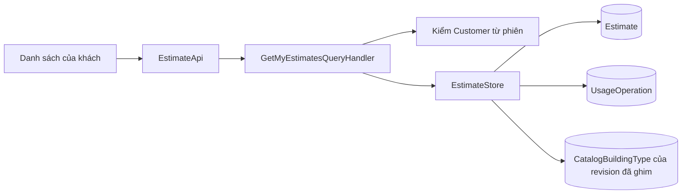
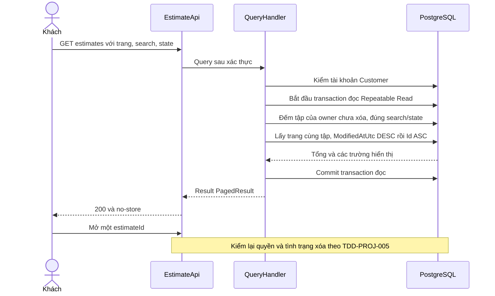
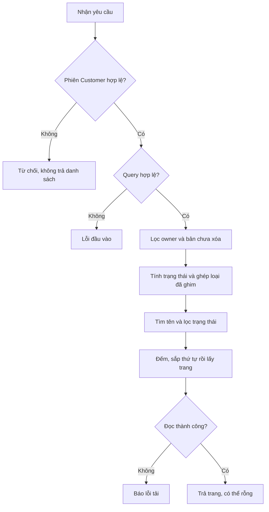
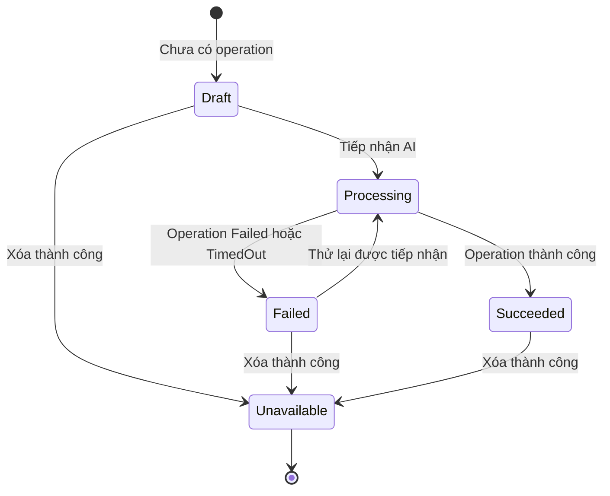
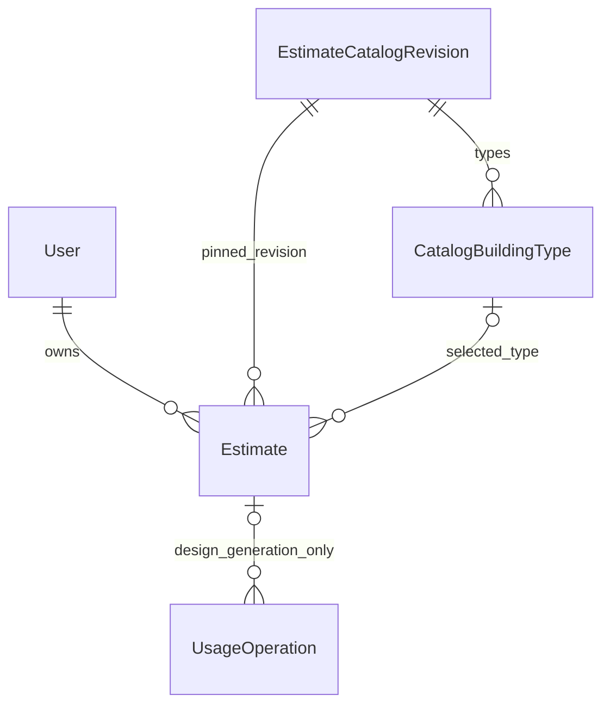

<!-- HƯỚNG DẪN CHO AI KHI ĐIỀN HOẶC CHỈNH SỬA MẪU
- Đọc toàn bộ mẫu, các comment hướng dẫn và tài liệu nguồn được cung cấp trước khi viết. Tuân thủ các quy tắc nghiệp vụ, điều kiện, ngoại lệ và giới hạn đã được xác nhận.
- Không bịa, tự chế hoặc suy đoán thành sự thật: yêu cầu, quy tắc, số liệu, API, schema, mã lỗi, nguồn tham khảo, người phụ trách và kết quả kiểm thử phải có căn cứ. Nội dung ví dụ trong mẫu không phải dữ kiện của dự án.
- Khi thiếu thông tin hoặc các nguồn mâu thuẫn, hỏi người dùng để làm rõ; giữ nguyên placeholder ở phần chưa xác định. Không tự chọn đáp án, lấp chỗ trống hay tuyên bố tài liệu đã hoàn tất.
- Chỉ thay nội dung cần điền hoặc được yêu cầu sửa. Không tự mở rộng phạm vi, sửa nghĩa quy tắc, bỏ điều kiện/ngoại lệ, xoá hay ghi đè nội dung hợp lệ đã có.
- Giữ nguyên tên, cấp và thứ tự heading, nhãn in đậm, tiền tố bullet, cấu trúc danh sách, tên/thứ tự/số cột bảng và cú pháp code fence. Không dịch, đổi tên, gộp hoặc thêm mục ngoài cấu trúc mẫu.
- Chỉ lặp khối luồng, AC hoặc API theo đúng khuôn khi có căn cứ; chỉ bỏ phần tuỳ chọn khi hướng dẫn riêng của mẫu cho phép và đã xác định không áp dụng.
- Mã tham chiếu và section phải trỏ tới tài liệu có thật đã được cung cấp hoặc kiểm chứng. Không giữ mã ví dụ như tham chiếu thật và không tự tạo tài liệu liên quan để hợp thức hoá liên kết.
- Giữ các comment hướng dẫn trong file. Xuất Markdown UTF-8, mỗi file một tài liệu; không bọc toàn bộ file trong code fence, không chèn lời dẫn hay giải thích ngoài mẫu.
- Trước khi bàn giao, đối chiếu nội dung với nguồn, kiểm tra cấu trúc, giá trị cho phép, giới hạn độ dài và tính nhất quán của mã/tham chiếu. Báo rõ phần chưa đủ thông tin; không tuyên bố đã chạy test hoặc import khi chưa thực hiện.
-->

<!-- Thay mã TDD-001 và nội dung ví dụ; giữ nguyên heading và nhãn in đậm.
Sơ đồ dùng mermaid, plantuml hoặc URL. Giữ heading Architecture, Sequence Diagram, Activity Diagram, State Diagram, Data Model.
Ví dụ API phải có heading trùng METHOD /path trong Endpoints. Xoá phần API/sơ đồ không dùng.
Version, Updated At và Change Log do lịch sử phiên bản quản lý, để trống khi nhập mới.
Author/Reviewer là tên hiển thị; gán tài khoản, phê duyệt, giả định và câu hỏi mở trên giao diện sau import.
Thiết kế phải truy vết về Story và Business Rule được cung cấp. Phân biệt thiết kế đề xuất với implementation đã kiểm chứng; không mô tả API/schema/sơ đồ ví dụ như hệ thống thật hoặc tự quyết định nghiệp vụ còn thiếu.
BẮT BUỘC KHI HOÀN THIỆN MẪU: phải có cả Reviewer và Approver, mỗi tên 1–200 ký tự sau khi bỏ khoảng trắng đầu/cuối. Không xoá hai dòng metadata, để trống, dùng tên bịa hoặc giữ placeholder rồi coi là hoàn tất.
Nếu chưa biết người review hoặc người phê duyệt, phải hỏi người dùng và báo tài liệu chưa đủ thông tin; không tự lấy Author/Owner làm người thay thế. Tên trong file không tự gán tài khoản hoặc xác nhận đã duyệt; gán thành viên trên giao diện sau import.
Đây là yêu cầu hoàn thiện mẫu; backend hiện vẫn nhận file cũ thiếu hai trường để tương thích.

VALIDATION CHO FILE NHẬP (đối chiếu ImportSnapshotValidator, MarkdownParser và ImportService):
- Mỗi file .md UTF-8 không rỗng chỉ có một heading cấp 1 chứa mã tài liệu dài 1–100 ký tự. Mã không được trùng trong cùng lần nhập hoặc thuộc loại tài liệu khác đã tồn tại.
- Không dùng tên README.md hoặc sitemap.md vì importer bỏ qua. Giao diện nhận .md/.zip, tối đa 2.000 file, tổng file tải lên 31 MiB; API giới hạn request 32 MiB và tổng nội dung đọc/giải nén 64 MiB.
- Chỉ nhập đè tài liệu cùng loại đang Draft, chưa có phiên bản và chưa lưu trữ. Import thay toàn bộ nội dung bản nháp, vì vậy phải giữ lại nội dung hợp lệ ngoài phần được yêu cầu sửa.
- Không dùng Status trong Markdown hoặc tên Approver để tự xác nhận phê duyệt; import không cấp quyền hay gán tài khoản từ tên. Chạy Kiểm tra file và xử lý lỗi/cảnh báo trước khi nhập.
- Giới hạn độ dài bên dưới tính theo string.Length của .NET (đơn vị UTF-16); không tự cắt ngắn dữ kiện quan trọng để vượt validation, hãy viết lại có căn cứ hoặc hỏi người dùng.
- Feature tối đa 300 ký tự và được dùng làm tiêu đề tài liệu. Status được parser nhận: Draft / In Review / Approved / Deprecated; tài liệu nhập mới vẫn có trạng thái phê duyệt Draft.
- Endpoint: đường dẫn tối đa 500 ký tự; tên/mô tả endpoint được lưu trong Name tối đa 300. HTTP method: GET / POST / PUT / PATCH / DELETE / HEAD / OPTIONS.
- Error Codes: mã tối đa 100 ký tự, không trùng trong tài liệu; giữ dạng - **CODE** (400): mô tả. HTTP status trong Error Codes và Response phải là số nguyên đọc được bằng Int32; không tự đặt status khác hợp đồng API.
- URL sơ đồ tối đa 1.000 ký tự. Mục sơ đồ được sử dụng phải có khối mermaid/plantuml hoặc URL theo mẫu; không để một mục sơ đồ rỗng. Nhãn mục được tách từ bullet như tên External API Fields tối đa 300 ký tự.
- Heading Examples phải khớp METHOD /path ở Endpoints. Giữ các nhãn Request:, Response 200: (thay mã theo contract) và Error Response: để parser tách đúng dữ liệu.
- Tham chiếu dạng DOC-KEY/section: ghi chú: mã đích tối đa 100 ký tự, section tối đa 100, ghi chú tối đa 1.000. Không trùng bộ mã đích + section + loại liên kết trong cùng tài liệu.
ĐỐI CHIẾU FORM TDD (src/features/tdds/validations.ts; form có thể chặt hơn import):
- Điền Feature, Author, Reviewer, Problem và ít nhất một Goal; các Goal/Non-goal/Notes đã thêm không được rỗng. API đã khai báo phải có endpoint và mô tả/mục đích; Fields phải có tên và ý nghĩa; Error Codes phải có mã, HTTP status và điều kiện.
- Form còn kiểm tra Version, Updated At và nội dung Change Log khi khai báo; với file nhập mới, giữ các trường lịch sử này trống theo hợp đồng import, không tự tạo dữ liệu lịch sử.
-->

# TDD-PROJ-004

## Document Info

- **Feature**: Dự toán của tôi — danh sách, tìm kiếm và lọc trạng thái
- **Author**: Codex
- **Reviewer**: Tân Trần
- **Approver**: Tân Trần
- **Status**: Draft
- **Version**:
- **Updated At**:

## Context & Goals

### Problem

**Triển khai ngày 30/09/2026:** người dùng đã giao triển khai sau khi chốt TDD và đặc tả test. Backend đã được bổ sung trên nhánh `feature/my-estimates`, trong worktree `bmt-be-my-estimates`. Migration chỉ được áp dụng trong database kiểm thử tạm. Xem [kết quả triển khai và kiểm chứng](../discovery/my-estimates-implementation.md) để biết phạm vi, mã test và điều kiện mở tính năng.

STORY-PROJ-006 và BR-PROJ-008 đã được người dùng chốt ngày 30/09/2026. Khách cần tìm lại mọi dự toán chưa xóa của mình, gồm nháp, đang xử lý, thành công và thất bại. Danh sách không có ảnh đại diện hoặc cột địa chỉ; không đòi gói còn hạn hoặc còn lượt.

Tại thời điểm thiết kế, code có API đọc từng bản nhưng chưa có API danh sách. `Estimate` lưu OwnerId, tên và mốc tạo/sửa; `UsageOperation` là nguồn trạng thái AI; `CatalogBuildingType` lưu tên loại theo revision đã ghim. Nền tảng kiểm tại workspace: .NET 8, EF Core/Npgsql 8.0.0, compose dùng PostgreSQL 15. Các thành phần dưới đây đã được triển khai trên nhánh nêu ở đầu tài liệu.

**Đã xác nhận:** phạm vi, thông tin mỗi dòng, bốn trạng thái, tìm theo tên kết hợp lọc trạng thái, phân trang và bản sửa gần nhất đứng trước. Ngày 30/09/2026, người dùng xác nhận tìm không phân biệt hoa/thường và dấu: “nha” tìm được “Nhà”. Bản đã xóa được đánh dấu và giữ dữ liệu nội bộ theo TDD-PROJ-005. Reviewer/Approver tiếp tục là Tân Trần. Người dùng đã chốt toàn bộ bản TDD này trong hội thoại ngày 30/09/2026; đây là căn cứ cho đặc tả Unit Test, không phải bằng chứng đã triển khai hoặc phê duyệt trên hệ thống tài liệu.

**Đề xuất chưa chốt:** không còn đề xuất kỹ thuật trong phạm vi bản TDD này chờ người dùng quyết định. Cách bố trí giao diện và các chính sách vận hành ngoài phạm vi vẫn giữ trạng thái đã nêu.

**Cần làm rõ:** không còn quyết định nghiệp vụ cản thiết kế API. Kiểm chứng môi trường, SQL và migration vẫn phải thực hiện khi triển khai; chưa đặt SLA, RPO/RTO hoặc chính sách dọn dữ liệu dài hạn.

### Goals

- Chỉ trả bản chưa xóa của khách đang đăng nhập, kể cả trong tổng số kết quả.
- Tìm/lọc trước khi sắp xếp và phân trang; trả đúng bản nháp chưa chọn loại.
- Trạng thái danh sách thống nhất với chi tiết, không có bảng trạng thái AI thứ hai.
- Đọc không gọi AI, không tạo kỳ gói hoặc thay Used/Reserved.

### Non-goals

- Thêm quyền nhân viên xem dự toán khách, ảnh đại diện, cột địa chỉ hoặc bộ lọc khác.
- Đổi điều kiện sửa đầu vào, gửi AI hoặc đổi tên của bản chưa xóa.
- Triển khai code, migration hoặc đặc tả Unit Test khi TDD chưa được chốt.

## Architecture

Thêm query vào feature `estimate` hiện có, giữ Carter → MediatR → repository → PostgreSQL. Không gọi handler đọc chi tiết cho từng dòng vì handler đó tải toàn bộ catalog và tính quyền sửa theo gói; danh sách chỉ cần các trường hiển thị.

| Thành phần | Trách nhiệm và thay đổi dự kiến |
|---|---|
| EstimateApi | Thêm GET trên gốc `/estimates`, phiên được xác minh theo policy hiện có, `WithNoStoreCache`. |
| Query.GetMyEstimatesQuery | Nhận pageIndex, pageSize, search, state; không nhận OwnerId. Đặt trong contract/services/estimate/Query.cs. |
| GetMyEstimatesQueryValidator | Kiểm dữ liệu phân trang, chiều dài tìm kiếm, enum trạng thái; đặt trong validators của estimate. |
| GetMyEstimatesQueryHandler | Lấy Customer từ EstimateAccess.RequireCustomerAsync, gọi store một lần cho trang và tổng; không gọi writeAccess hoặc coordinator lượt. |
| IEstimateStore / EstimateStore | Thêm projection danh sách; owner và điều kiện chưa xóa luôn thuộc truy vấn gốc. |
| Response.EstimateListItem | DTO chỉ đọc; không ánh xạ thành bảng. Trả estimateId, code, name, buildingType, state, createdAtUtc, modifiedAtUtc. |
| PagedResult | Dùng dạng dữ liệu trả về hiện có; không dùng nguyên CreateAsync nếu nó tự sửa đầu vào hoặc đếm và lấy trang từ hai ảnh chụp dữ liệu khác nhau. |



**Notes**:

- **Phạm vi quyền:** lấy OwnerId từ phiên, không từ query string. Staff kể cả Admin bị 403; token chia sẻ chỉ có tác dụng ở API hồ sơ công khai. GET không cần subscription. Cổng CustomerCreationEnabled không chặn danh sách của bản đã có.
- **Projection:** lọc owner và chưa xóa, ghép loại bằng `(CatalogRevisionId, BuildingTypeId)`, tính trạng thái, áp search/state, sắp `ModifiedAtUtc DESC, Id ASC`, rồi mới phân trang. Dùng LEFT JOIN để bản BuildingTypeId=NULL không bị mất. Không lấy tên loại từ revision hiện hành.
- **Trạng thái:** có DesignGeneration Pending → Processing; có Succeeded → Succeeded; không có hai trạng thái trên nhưng có Failed hoặc TimedOut → Failed; chưa có tác vụ → Draft. Chỉ xét UsageKind=DesignGeneration và đúng tài nguyên. Dùng phép EXISTS trong SQL thay vì gọi ReadGenerationAsync từng dòng. Unique index sống hiện có ngăn cùng bản vừa Pending vừa Succeeded. Không lấy tác vụ của người khác chỉ vì cùng tham số client.
- **Nhất quán một lần đọc:** store mở một transaction chỉ đọc, Repeatable Read, để phép đếm và lấy trang dùng cùng ảnh chụp dữ liệu; commit trước trả response. Query không hiện thực ICommand/ITransactionalRequest nên không bị pipeline ghi bao lại. Hai câu SQL có cùng bộ lọc, chạy tuần tự trên cùng DbContext, có cancellation. Khi database thay đổi giữa các lần chuyển trang, offset có thể dịch; không cam kết một ảnh chụp cố định cho cả phiên duyệt. PostgreSQL mô tả ảnh chụp Repeatable Read tại [Transaction Isolation](https://www.postgresql.org/docs/15/transaction-iso.html).
- **Mốc sửa:** dùng đúng ModifiedAtUtc hiện có, được ghi khi tạo, lưu đầu vào hoặc đổi tên thật sự. Đọc, tiếp nhận AI và đổi trạng thái operation không tự tăng mốc sửa. Không lấy AcceptedAtUtc thay lần sửa của bản. Hai bản cùng mốc dùng Id ASC làm thứ tự ổn định.
- **Tìm tên:** trim search; rỗng là bỏ điều kiện, tối đa 200 Unicode scalar sau trim. Tìm một phần tên, không phân biệt hoa/thường và dấu, gồm đ/Đ tương đương d/D. Chuẩn hóa cả tên và từ khóa bằng NFC, bỏ dấu bằng PostgreSQL `unaccent`, chuyển chữ thường rồi dùng `strpos` tìm chuỗi con. Tên lưu/hiển thị không đổi. Không chia từ, không tìm gần đúng; `%`, `_` và dấu gạch chéo ngược là ký tự thường vì không dùng mẫu LIKE. SQL nhận tham số, không ghép chuỗi người dùng thành SQL. Biểu thức cụ thể ở Data Model.
- **Tìm mã (bổ sung 07/10/2026):** cùng tham số `search` còn khớp một phần mã dự toán. Từ khóa cho phần mã được chuẩn hóa bằng `BuildXCodes.NormalizeSearch`: bỏ mọi khoảng trắng và dấu gạch ngang, đổi chữ hoa. Mã lưu chữ hoa có dấu gạch nên so với `replace(substr(e."Code", 7), '-', '')` bằng `strpos`. Phần thương hiệu `BUILDX` không dùng để so: nếu từ khóa đã chuẩn hóa bắt đầu bằng `BUILDX` thì bỏ phần đó (`BuildXCodes.SearchKey`), còn phía mã lưu chỉ so phần sau thương hiệu đã bỏ dấu gạch, ví dụ `BUILDX-HS-20261005-T4W8NC` so như `HS20261005T4W8NC`. Lý do: mã nào cũng có `BUILDX`, nên một từ ngắn như “i” sẽ khớp mọi bản ghi. Gõ đúng “BUILDX” thì khớp mọi mã; chuỗi vắt qua thương hiệu như “DX2026” không khớp. Một bản thuộc kết quả khi điều kiện tên **hoặc** điều kiện mã đúng; điều kiện owner, chưa xóa và state vẫn áp cho cả hai. Từ khóa còn rỗng sau chuẩn hóa (ví dụ chỉ gồm “-”) thì bỏ điều kiện mã, không diễn giải thành mọi mã. Không bỏ dấu tiếng Việt cho phần mã vì mã chỉ có chữ hoa và số.
- **Giao diện:** phân biệt đang tải, đã tải rỗng và lỗi tải. Giữ search/state khi tải lại. Đổi search/state đưa về trang 1; bỏ phản hồi cũ đến muộn bằng mã thứ tự request hoặc hủy request. Sau xóa tải lại cùng bộ lọc; nếu trang vượt trang cuối thì về trang cuối còn hợp lệ, tối thiểu trang 1. Mở bản dùng API chi tiết đang có và kiểm lại quyền/tình trạng xóa, không tự gửi AI.
- **Hiệu năng:** dùng index `IX_Estimate_Owner_ModifiedAt` `(OwnerId ASC, ModifiedAtUtc DESC, Id ASC)` hiện có, unique index tác vụ sống và index lịch sử của PROJ-002. Không tải payload, URL ảnh, snapshot hoặc toàn bộ catalog. Chưa có số liệu tải nên chưa thêm GIN/trigram/search index hoặc SLA. Khi triển khai, xem SQL và kế hoạch truy vấn trên dữ liệu đại diện trước quyết định index bổ sung.
- **Kiểm chứng tổng quát:** ST-PROJ-078–092 phủ đọc, phân trang, quyền và lỗi; PostgreSQL thật kiểm query/snapshot/thứ tự. Sau chốt TDD cần bổ sung kiểm biên trang, tên có dấu/ký tự đặc biệt và hai mốc sửa bằng nhau. Đặc tả Unit Test sau chốt nằm trong bảng độ phủ ở References; chưa có kết quả chạy.

## Sequence Diagram



## Activity Diagram



## State Diagram



Đây là trạng thái hiển thị tính khi đọc, không phải enum mới được lưu. Không có Processing → Unavailable vì xóa bị chặn. Unavailable không được trả thành một dòng trong danh sách; không có chuyển trạng thái khôi phục.

## Data Model

Không thêm bảng hoặc cột tên tìm kiếm cho danh sách. Mọi truy vấn đều có `OwnerId = ownerId` và `DeletedAtUtc IS NULL`; cột xóa được định nghĩa ở TDD-PROJ-005. Dùng extension `unaccent` trong PostgreSQL để so tên ngay trên dữ liệu đang lưu, tránh bản sao tên chuẩn hóa bị lệch khi đổi tên.

| Bảng dùng lại | Ý nghĩa trong truy vấn và nguồn schema/mẫu |
|---|---|
| Estimate | Một bản của một Customer, nguồn tên và mốc tạo/sửa; BuildingTypeId có thể NULL. Schema/mẫu: TDD-PROJ-001/Data Model. |
| CatalogBuildingType | Một loại trong một revision; khóa ghép `(RevisionId, BuildingTypeId)` quyết định tên hiển thị, không sửa lịch sử. Schema/mẫu: TDD-PROJ-001/Data Model. |
| UsageOperation | Một lần dùng quyền. Chỉ DesignGeneration của đúng Estimate tham gia tính trạng thái. Schema/mẫu: TDD-PROJ-002/Data Model; sổ lượt ở TDD-SUB-002/Data Model. |



Quan hệ cuối là phần chiếu riêng DesignGeneration; UsageOperation dùng chung cho tra cứu mẫu nên EstimateId cho phép NULL ở toàn bảng. Với DesignGeneration, CHECK và FK trong PROJ-002 bắt EstimateId có giá trị và đúng ResourceId. Quan hệ chọn loại dùng cả revision và mã loại, không chỉ BuildingTypeId.

Dữ liệu giả định, trích cột; D1/D2/U1/V1/B1/J1 là bí danh UUID. Mốc thời gian là UTC, không phải dữ liệu đã ghi database.

| Dòng nguồn | Giá trị |
|---|---|
| CatalogBuildingType | RevisionId=V1, BuildingTypeId=B1, Name=Nhà phố. |
| Estimate D1 | OwnerId=U1, CatalogRevisionId=V1, BuildingTypeId=NULL, Name=Bản nháp, CreatedAtUtc=2026-09-30T01:00:00Z, ModifiedAtUtc=2026-09-30T03:00:00Z; DeletedAtUtc=NULL, không có tác vụ. |
| Estimate D2 | OwnerId=U1, CatalogRevisionId=V1, BuildingTypeId=B1, Name=Nhà An, CreatedAtUtc=2026-09-30T02:00:00Z, ModifiedAtUtc=2026-09-30T02:30:00Z, DeletedAtUtc=NULL. |
| UsageOperation J1 | AccountId=U1, EstimateId=ResourceId=D2, UsageKind=DesignGeneration, State=TimedOut. Các cột còn lại tuân theo schema nguồn. |
| Projection | D1 đứng trước D2; D1 có buildingType=null, state=Draft; D2 có buildingType={id:B1,name:Nhà phố}, state=Failed. Không ghi projection xuống DB. |

**Biểu thức tìm tên dự kiến** (tham số `@search` đã trim và hợp lệ; biểu thức này đã được kiểm trong truy vấn PostgreSQL của repository):

```sql
strpos(
  lower(public.unaccent('public.unaccent'::regdictionary, normalize(e."Name", NFC))),
  lower(public.unaccent('public.unaccent'::regdictionary, normalize(@search, NFC)))
) > 0
```

Store dùng cùng biểu thức có tham số trong SQL đếm và SQL lấy trang, trên connection/transaction của DbContext hiện có; không tải tên về bộ nhớ để lọc sau phân trang. Chọn SQL có tham số tại repository cho phép dùng đúng `normalize`/`unaccent` trên provider hiện tại, không phụ thuộc việc EF tự dịch một hàm .NET tùy ý. `lower` dùng locale của database; môi trường thử và triển khai phải cùng encoding/locale và bộ quy tắc unaccent chuẩn. PostgreSQL mô tả [unaccent](https://www.postgresql.org/docs/15/unaccent.html) và các hàm [normalize, lower, strpos](https://www.postgresql.org/docs/15/functions-string.html).

| Tên lưu | Từ khóa sau trim | Kết quả mong đợi |
|---|---|---|
| Nhà An | nha / NHÀ / nhà | Có; tên trả về vẫn Nhà An. |
| Nhà ĐÔNG | dong / đông | Có; đ và Đ được bỏ dấu thành d/D. |
| Nhà An (ký tự có dấu dạng tổ hợp) | nha | Có như dạng ký tự dựng sẵn sau bước NFC. |
| Nhà 100%_A | %_ | Có đúng chuỗi ký tự; không mở rộng thành ký tự đại diện. |
| Nhà An | kho | Không. |

Đây là ví dụ so khớp, không bỏ qua điều kiện owner, chưa xóa hoặc state. Điều kiện mã được nối bằng OR với điều kiện tên ở trên, với `@code` là từ khóa đã chuẩn hóa theo Architecture/Notes: `(@codeActive AND strpos(replace(substr(e."Code", 7), '-', ''), @code) > 0)`, trong đó `@codeActive` sai khi từ khóa rỗng sau chuẩn hóa. Ví dụ `@search`="20261005-q7k" thành `@code`="20261005Q7K" và khớp `BUILDX-20261005-Q7K2M9`. Không dùng generated column/index hàm giả `IMMUTABLE`: kết quả unaccent phụ thuộc từ điển. Tìm chuỗi con phải kiểm tên trong tập của owner; index sắp xếp hiện có không bảo đảm tăng tốc phần bỏ dấu. Khi triển khai, đo SQL trên dữ liệu đại diện trước cân nhắc index riêng. Nếu từ khóa không rỗng nhưng sau bỏ dấu thành chuỗi rỗng, trả tập rỗng; không diễn giải thành tìm mọi tên. Bộ lọc đầy đủ phải có thêm `length(lower(public.unaccent('public.unaccent'::regdictionary, normalize(@search, NFC)))) > 0`. Khi search rỗng ngay sau trim, bỏ cả hai điều kiện tìm kiếm. Kiểm môi trường phải chứng minh cả chữ I/i và Đ/đ hoạt động như bảng mẫu; không dùng locale khác giữa các môi trường làm thay đổi hợp đồng.

**Notes**:

- Tên loại phụ thuộc khóa ghép revision/type; trạng thái phụ thuộc các operation đã lưu. Không sao chép tên loại hoặc trạng thái sang Estimate để phục vụ danh sách. Không phát sinh vấn đề chuẩn hóa cần tách thêm bảng trong phần chỉ đọc này. Name là nguồn duy nhất của phép tìm; không có cột NameSearch để đồng bộ.
- Không backfill hoặc sửa tên cũ. Khi triển khai cần migration cài `unaccent` trong schema public trước khi mở API danh sách; kiểm encoding UTF8, extension có sẵn trên máy chủ và quyền CREATE của tài khoản migration. Nếu extension đã có ở schema khác, phải đối chiếu và dùng đúng schema đó trong SQL, không âm thầm tạo từ điển khác hoặc di chuyển extension đang dùng. Runtime chỉ gọi hàm, không tự cài extension. Đã tạo migration và chạy trên database kiểm thử tạm, chưa chạy trên database dùng chung.
- Tổng kết quả và Items phải dùng cùng phạm vi owner, chưa xóa, search và state. Không dùng count toàn bảng rồi chỉ lọc Items.

## Internal API

### Endpoints

- **GET** `/api/v1/estimates` — Trả danh sách của phiên Customer. Query: pageIndex mặc định 1, pageSize mặc định 10, search tùy chọn, state tùy chọn. Không cần Idempotency-Key.

Hợp đồng phân trang đề xuất: pageIndex là int từ 1; pageSize là int 1–100. Tính offset bằng số 64-bit và từ chối nếu vượt Int32.MaxValue trước gọi Skip. Không âm thầm cắt trang hoặc lấy kích thước khác yêu cầu. state chỉ nhận Draft, Processing, Succeeded, Failed; bỏ tham số là tất cả, chuỗi rỗng/sai trả 422. search bỏ trống hoặc chỉ có khoảng trắng thì không tìm; tìm một phần tên không phân biệt hoa/thường hoặc dấu, hoặc một phần mã dự toán bỏ qua dấu gạch ngang, như mô tả ở Architecture. Query lặp tham số, tham số lạ như ownerId hoặc sort không được âm thầm áp dụng; từ chối 422. Lỗi không đọc được kiểu số ở bước binding là 400 theo pipeline HTTP.

Response: `Result<PagedResult<EstimateListItem>>`; value có items, pageIndex, pageSize, totalCount, hasNextPage, hasPreviousPage. Mỗi item có estimateId, code (mã dự toán theo TDD-PROJ-001), name, buildingType (`{id,name}` hoặc null), state, createdAtUtc, modifiedAtUtc. Không trả canEdit để tránh mở rộng truy vấn gói; khi mở bản, API chi tiết cung cấp quyền hiện tại. `totalCount=0` khi tập rỗng; trang vượt cuối có items rỗng và giữ tổng thực. `hasPreviousPage` giữ quy ước PagedResult là pageIndex>1.

### Examples

#### GET /api/v1/estimates

```
Request:
GET /api/v1/estimates?pageIndex=1&pageSize=10&state=Draft
Cookie: <phiên Customer hợp lệ>

Response 200:
{"value":{"items":[{"estimateId":"11111111-1111-4111-8111-111111111111","code":"BUILDX-20260930-Q7K2M9","name":"Bản nháp","buildingType":null,"state":"Draft","createdAtUtc":"2026-09-30T01:00:00Z","modifiedAtUtc":"2026-09-30T03:00:00Z"}],"pageIndex":1,"pageSize":10,"totalCount":1,"hasNextPage":false,"hasPreviousPage":false},"isSuccess":true,"isFailure":false,"error":{"code":"","message":""}}

Error Response:
{"title":"Validation Error","code":"InvalidEstimateListQuery","status":422,"detail":"Thông tin tìm kiếm hoặc phân trang không hợp lệ.","messageCode":"InvalidEstimateListQuery","errors":null}
```

Ví dụ lỗi trên là dạng exception nghiệp vụ hiện có; validation pipeline giữ cấu trúc lỗi trường của ApiEndpoint. Không đổi middleware chung chỉ để bọc lại lỗi cho hai endpoint mới.

### Error Codes

- **Unauthorized** (401): không có phiên hợp lệ; header chia sẻ không thay phiên.
- **AccessForbidden** (403): người gọi không thuộc AccountKind Customer.
- **InvalidEstimateListQuery** (422): giá trị trang, trạng thái, từ khóa hoặc tên tham số không hợp lệ theo hợp đồng đề xuất.

Lỗi binding 400 và lỗi hạ tầng 5xx giữ cơ chế chung. Không đổi lỗi DB thành 200 với items rỗng. Phản hồi danh sách dùng `Cache-Control: private, no-store`; không lưu cache chung theo URL giữa nhiều khách.

## References

### User Stories

- STORY-PROJ-006

### Business Rules

- BR-PROJ-008/Then
- BR-PROJ-008/Except
- BR-PROJ-009/Then
- BR-SUB-007/Except
- BR-RBAC-005/Then

### Use Cases

- STORY-PROJ-006/Main Flow
- STORY-PROJ-006/ALT-01
- STORY-PROJ-006/ALT-02
- STORY-PROJ-006/ALT-03
- STORY-PROJ-006/EXC-01
- STORY-PROJ-006/EXC-02
- STORY-PROJ-006/EXC-03

### Others

- TDD-PROJ-001/Data Model
- TDD-PROJ-002/Data Model
- TDD-PROJ-005/Architecture
- TDD-SUB-002/Data Model
- [Độ phủ ST-PROJ-078–092](../discovery/my-estimates-system-test-coverage.md).
- [Phạm vi khảo sát và điểm cần chốt](../discovery/my-estimates-technical-design.md).
- [EstimateApi](../../bmt-be/src/bmt-be.presentation/apis/estimate/EstimateApi.cs).
- [Query chi tiết](../../bmt-be/src/bmt-be.application/usecases/queries/estimate/GetEstimateQueryHandler.cs).
- [EstimateStore](../../bmt-be/src/bmt-be.persistence/repositories/EstimateStore.cs).
- [Cấu hình dữ liệu](../../bmt-be/src/bmt-be.persistence/configurations/EstimateConfigurations.cs).
- [PagedResult](../../bmt-be/src/bmt-be.contract/abstractions/shared/PagedResult.cs).

- [Đặc tả Unit Test và phạm vi kiểm chứng](../discovery/my-estimates-unit-test-coverage.md).
- UT-PROJ-132/Unit Test
- ST-PROJ-127/System Test

## Change Log

- 2026-10-07 (mã dự toán): Theo quyết định người dùng cùng ngày, mỗi item trả thêm `code`; tham số `search` hiện có tìm thêm theo một phần mã, bỏ khoảng trắng và dấu gạch ngang, không phân biệt hoa thường, nối OR với điều kiện tên. Không thêm tham số hay index. Căn cứ BR-PROJ-008 khoản 3 và 5, STORY-PROJ-006/AC-011; thêm UT-PROJ-132, ST-PROJ-127.
