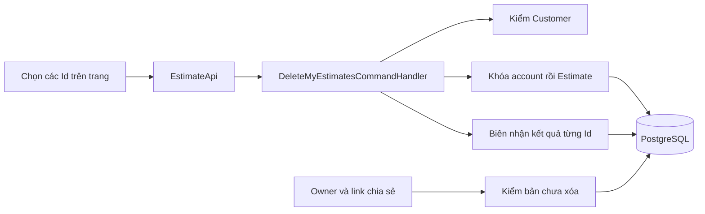
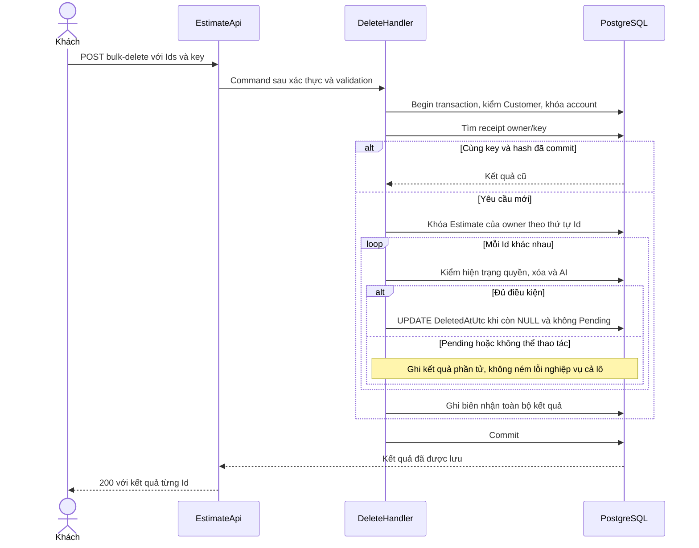
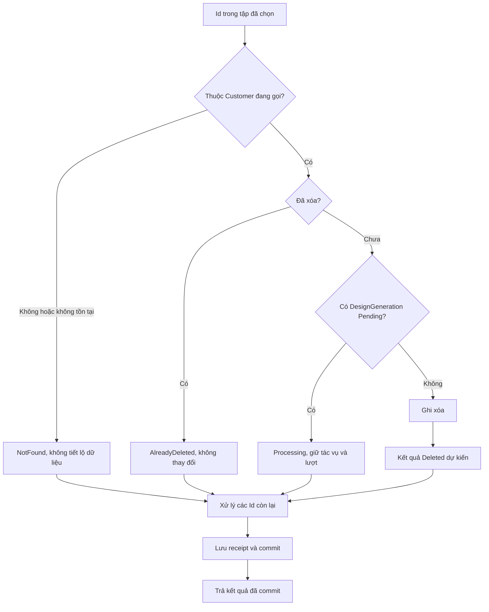
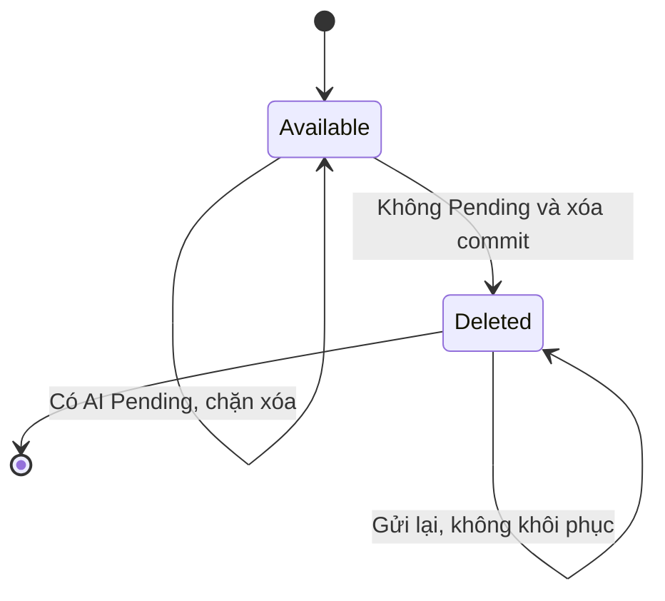
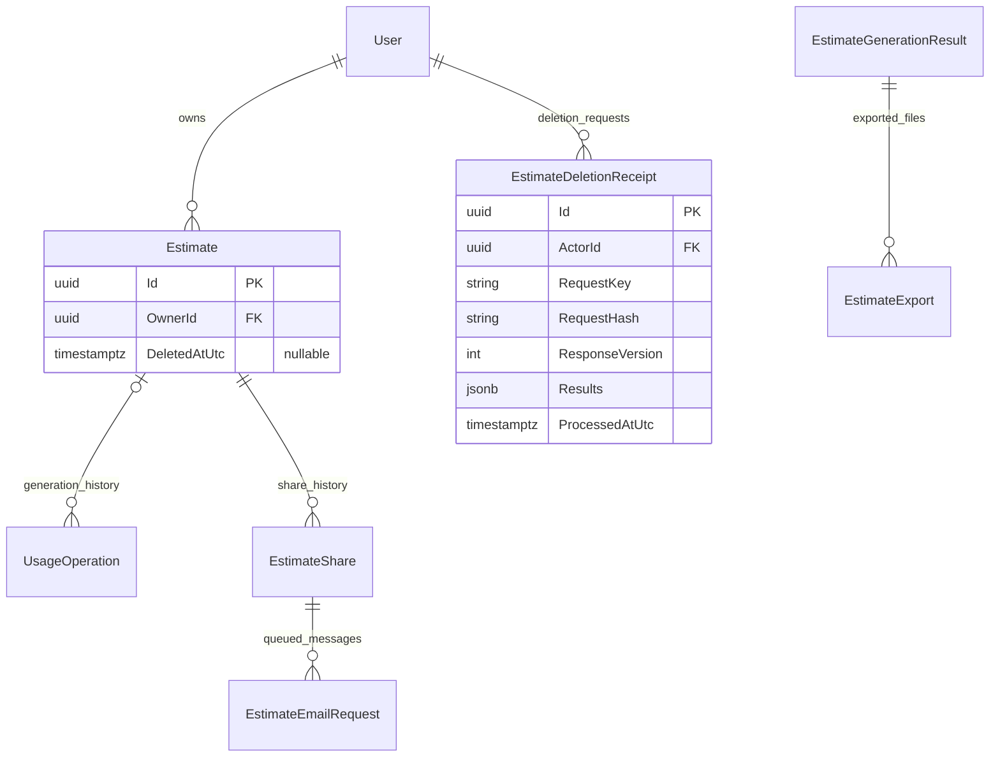

<!-- HƯỚNG DẪN CHO AI KHI ĐIỀN HOẶC CHỈNH SỬA MẪU
- Đọc toàn bộ mẫu, các comment hướng dẫn và tài liệu nguồn được cung cấp trước khi viết. Tuân thủ các quy tắc nghiệp vụ, điều kiện, ngoại lệ và giới hạn đã được xác nhận.
- Không bịa, tự chế hoặc suy đoán thành sự thật: yêu cầu, quy tắc, số liệu, API, schema, mã lỗi, nguồn tham khảo, người phụ trách và kết quả kiểm thử phải có căn cứ. Nội dung ví dụ trong mẫu không phải dữ kiện của dự án.
- Khi thiếu thông tin hoặc các nguồn mâu thuẫn, hỏi người dùng để làm rõ; giữ nguyên placeholder ở phần chưa xác định. Không tự chọn đáp án, lấp chỗ trống hay tuyên bố tài liệu đã hoàn tất.
- Chỉ thay nội dung cần điền hoặc được yêu cầu sửa. Không tự mở rộng phạm vi, sửa nghĩa quy tắc, bỏ điều kiện/ngoại lệ, xoá hay ghi đè nội dung hợp lệ đã có.
- Giữ nguyên tên, cấp và thứ tự heading, nhãn in đậm, tiền tố bullet, cấu trúc danh sách, tên/thứ tự/số cột bảng và cú pháp code fence. Không dịch, đổi tên, gộp hoặc thêm mục ngoài cấu trúc mẫu.
- Chỉ lặp khối luồng, AC hoặc API theo đúng khuôn khi có căn cứ; chỉ bỏ phần tuỳ chọn khi hướng dẫn riêng của mẫu cho phép và đã xác định không áp dụng.
- Mã tham chiếu và section phải trỏ tới tài liệu có thật đã được cung cấp hoặc kiểm chứng. Không giữ mã ví dụ như tham chiếu thật và không tự tạo tài liệu liên quan để hợp thức hoá liên kết.
- Giữ các comment hướng dẫn trong file. Xuất Markdown UTF-8, mỗi file một tài liệu; không bọc toàn bộ file trong code fence, không chèn lời dẫn hay giải thích ngoài mẫu.
- Trước khi bàn giao, đối chiếu nội dung với nguồn, kiểm tra cấu trúc, giá trị cho phép, giới hạn độ dài và tính nhất quán của mã/tham chiếu. Báo rõ phần chưa đủ thông tin; không tuyên bố đã chạy test hoặc import khi chưa thực hiện.
-->

<!-- Thay mã TDD-001 và nội dung ví dụ; giữ nguyên heading và nhãn in đậm.
Sơ đồ dùng mermaid, plantuml hoặc URL. Giữ heading Architecture, Sequence Diagram, Activity Diagram, State Diagram, Data Model.
Ví dụ API phải có heading trùng METHOD /path trong Endpoints. Xoá phần API/sơ đồ không dùng.
Version, Updated At và Change Log do lịch sử phiên bản quản lý, để trống khi nhập mới.
Author/Reviewer là tên hiển thị; gán tài khoản, phê duyệt, giả định và câu hỏi mở trên giao diện sau import.
Thiết kế phải truy vết về Story và Business Rule được cung cấp. Phân biệt thiết kế đề xuất với implementation đã kiểm chứng; không mô tả API/schema/sơ đồ ví dụ như hệ thống thật hoặc tự quyết định nghiệp vụ còn thiếu.
BẮT BUỘC KHI HOÀN THIỆN MẪU: phải có cả Reviewer và Approver, mỗi tên 1–200 ký tự sau khi bỏ khoảng trắng đầu/cuối. Không xoá hai dòng metadata, để trống, dùng tên bịa hoặc giữ placeholder rồi coi là hoàn tất.
Nếu chưa biết người review hoặc người phê duyệt, phải hỏi người dùng và báo tài liệu chưa đủ thông tin; không tự lấy Author/Owner làm người thay thế. Tên trong file không tự gán tài khoản hoặc xác nhận đã duyệt; gán thành viên trên giao diện sau import.
Đây là yêu cầu hoàn thiện mẫu; backend hiện vẫn nhận file cũ thiếu hai trường để tương thích.

VALIDATION CHO FILE NHẬP (đối chiếu ImportSnapshotValidator, MarkdownParser và ImportService):
- Mỗi file .md UTF-8 không rỗng chỉ có một heading cấp 1 chứa mã tài liệu dài 1–100 ký tự. Mã không được trùng trong cùng lần nhập hoặc thuộc loại tài liệu khác đã tồn tại.
- Không dùng tên README.md hoặc sitemap.md vì importer bỏ qua. Giao diện nhận .md/.zip, tối đa 2.000 file, tổng file tải lên 31 MiB; API giới hạn request 32 MiB và tổng nội dung đọc/giải nén 64 MiB.
- Chỉ nhập đè tài liệu cùng loại đang Draft, chưa có phiên bản và chưa lưu trữ. Import thay toàn bộ nội dung bản nháp, vì vậy phải giữ lại nội dung hợp lệ ngoài phần được yêu cầu sửa.
- Không dùng Status trong Markdown hoặc tên Approver để tự xác nhận phê duyệt; import không cấp quyền hay gán tài khoản từ tên. Chạy Kiểm tra file và xử lý lỗi/cảnh báo trước khi nhập.
- Giới hạn độ dài bên dưới tính theo string.Length của .NET (đơn vị UTF-16); không tự cắt ngắn dữ kiện quan trọng để vượt validation, hãy viết lại có căn cứ hoặc hỏi người dùng.
- Feature tối đa 300 ký tự và được dùng làm tiêu đề tài liệu. Status được parser nhận: Draft / In Review / Approved / Deprecated; tài liệu nhập mới vẫn có trạng thái phê duyệt Draft.
- Endpoint: đường dẫn tối đa 500 ký tự; tên/mô tả endpoint được lưu trong Name tối đa 300. HTTP method: GET / POST / PUT / PATCH / DELETE / HEAD / OPTIONS.
- Error Codes: mã tối đa 100 ký tự, không trùng trong tài liệu; giữ dạng - **CODE** (400): mô tả. HTTP status trong Error Codes và Response phải là số nguyên đọc được bằng Int32; không tự đặt status khác hợp đồng API.
- URL sơ đồ tối đa 1.000 ký tự. Mục sơ đồ được sử dụng phải có khối mermaid/plantuml hoặc URL theo mẫu; không để một mục sơ đồ rỗng. Nhãn mục được tách từ bullet như tên External API Fields tối đa 300 ký tự.
- Heading Examples phải khớp METHOD /path ở Endpoints. Giữ các nhãn Request:, Response 200: (thay mã theo contract) và Error Response: để parser tách đúng dữ liệu.
- Tham chiếu dạng DOC-KEY/section: ghi chú: mã đích tối đa 100 ký tự, section tối đa 100, ghi chú tối đa 1.000. Không trùng bộ mã đích + section + loại liên kết trong cùng tài liệu.
ĐỐI CHIẾU FORM TDD (src/features/tdds/validations.ts; form có thể chặt hơn import):
- Điền Feature, Author, Reviewer, Problem và ít nhất một Goal; các Goal/Non-goal/Notes đã thêm không được rỗng. API đã khai báo phải có endpoint và mô tả/mục đích; Fields phải có tên và ý nghĩa; Error Codes phải có mã, HTTP status và điều kiện.
- Form còn kiểm tra Version, Updated At và nội dung Change Log khi khai báo; với file nhập mới, giữ các trường lịch sử này trống theo hợp đồng import, không tự tạo dữ liệu lịch sử.
-->

# TDD-PROJ-005

## Document Info

- **Feature**: Xóa nhiều dự toán của tôi và chấm dứt quyền truy cập hồ sơ
- **Author**: Codex
- **Reviewer**: Tân Trần
- **Approver**: Tân Trần
- **Status**: Draft
- **Version**:
- **Updated At**:

## Context & Goals

### Problem

**Triển khai ngày 30/09/2026:** người dùng đã giao triển khai sau khi chốt TDD và đặc tả test. Backend đã được bổ sung trên nhánh `feature/my-estimates`, trong worktree `bmt-be-my-estimates`. Migration chỉ được áp dụng trong database kiểm thử tạm. Xem [kết quả triển khai và kiểm chứng](../discovery/my-estimates-implementation.md) để biết phạm vi, mã test và điều kiện mở tính năng.

STORY-PROJ-007 và BR-PROJ-009 đã được người dùng chốt ngày 30/09/2026: xóa các bản đủ điều kiện trong tập đã chọn, giữ bản đang xử lý AI, trả kết quả từng bản, không hoàn lượt, không khôi phục và không mở lại. Các ngoại lệ tương ứng đã bổ sung vào BR-PROJ-006, BR-PROJ-007 và BR-SUB-007. Chọn tất cả chỉ áp dụng trang đang xem theo STORY-PROJ-006.

Tại thời điểm thiết kế, code chưa có endpoint xóa hoặc trạng thái xóa trên Estimate. Code đang có FK RESTRICT từ lịch sử AI, hồ sơ và biên nhận; không thể đáp ứng yêu cầu bằng cách gọi Remove hàng Estimate rồi xóa dây chuyền. Danh sách, đường đọc của chủ sở hữu, token chia sẻ và worker là các đường khác nhau cần phối hợp.

**Đã xác nhận:** mọi quyết định nghiệp vụ nêu trên; gói hết hạn/hết lượt không chặn xóa; không hủy AI. Ngày 30/09/2026, người dùng đồng ý đánh dấu đã xóa, giữ dữ liệu kỹ thuật cùng lịch sử lượt để đối soát, không cho khách khôi phục, chưa tự động dọn tệp hoặc đặt thời hạn lưu trong đợt này. Người dùng đã chốt toàn bộ bản TDD này trong hội thoại ngày 30/09/2026; đây là căn cứ cho đặc tả Unit Test, không phải bằng chứng đã triển khai hoặc phê duyệt trên hệ thống tài liệu.

**Đề xuất chưa chốt:** không còn đề xuất kỹ thuật trong phạm vi bản TDD này chờ người dùng quyết định. Cách bố trí giao diện và các chính sách vận hành ngoài phạm vi vẫn giữ trạng thái đã nêu.

**Cần làm rõ:** không còn quyết định nghiệp vụ cản thiết kế API. Kiểm chứng môi trường, SQL và migration vẫn phải thực hiện khi triển khai; chưa đặt SLA, RPO/RTO hoặc chính sách dọn dữ liệu dài hạn.

### Goals

- Một yêu cầu hỗn hợp xóa đúng bản đủ điều kiện, giữ bản Pending và báo đúng kết quả từng Id.
- Tiếp nhận AI và xóa có thứ tự rõ ràng; không tồn tại bản vừa xóa thành công vừa tiếp nhận AI mới.
- Xóa chấm dứt truy cập mới qua tất cả đường owner/public; không làm mất lịch sử tính lượt.
- Gửi lại sau lỗi mạng không xóa thêm bản từng bị chặn hoặc tạo lại dữ liệu đã xóa.

### Non-goals

- Thùng rác, khôi phục, hủy AI, hoàn lượt hoặc quyền nhân viên xóa thay khách.
- Xóa mọi kết quả tìm kiếm bằng một điều kiện truy vấn thay tập Id đã chọn.
- Tự đặt retention hoặc gọi dịch vụ xóa tệp bên ngoài khi chưa được quyết định.
- Sửa code, sinh/chạy migration, gửi email hoặc viết đặc tả Unit Test trong bước TDD chưa được chốt.

## Architecture

Xử lý đồng bộ một lô tối đa 100 Id, cùng giới hạn một trang tối đa của TDD-PROJ-004. Giới hạn này bảo vệ request và thời gian giữ khóa, không giới hạn tổng số dự toán của tài khoản. Không thêm hàng đợi cho thao tác xóa; RabbitMQ/outbox hiện có chỉ liên quan công việc export/email đã được nhận trước đó.

| Thành phần | Thay đổi dự kiến |
|---|---|
| EstimateApi | Thêm POST `/estimates/bulk-delete`; phiên được xác minh, RequireIdempotencyKey, no-store; dùng kiểm Origin hiện có. |
| Command.DeleteMyEstimatesCommand | Tập Id và request key, không nhận owner, trạng thái AI hoặc cờ xác nhận quyền từ client. |
| DeleteMyEstimatesCommandValidator | Kiểm 1–100 phần tử, GUID hợp lệ khác Empty, trường lạ và key; không loại âm thầm những phần tử có định dạng sai. |
| DeleteMyEstimatesCommandHandler | Kiểm Customer, khóa tài khoản, tra biên nhận, khóa/kiểm từng bản, ghi trạng thái xóa và kết quả trong một transaction của pipeline. |
| IEstimateStore / IEstimateRowLocks | Bổ sung thao tác lô; phân biệt đọc nội bộ lịch sử với truy cập bản còn được dùng. Cập nhật DeletedAtUtc có điều kiện dưới khóa; không DELETE hàng Estimate. |
| EstimateDeletionReceipt | Biên nhận độc lập của một yêu cầu lô đã commit; thiết kế schema độc lập bên dưới. |
| Các điểm kiểm owner/share | Chặn bản đã xóa trước đọc nội dung hoặc trả biên nhận thao tác cũ; không chỉ ẩn dòng ở frontend. |



**Notes**:

- **Một transaction, kết quả riêng từng bản:** bản đang xử lý, không tồn tại hoặc không thuộc người gọi là kết quả nghiệp vụ của từng phần tử, không ném exception làm hỏng cả lô. Với 10 bản có 8 hợp lệ, ghi 8 lần xóa và biên nhận có 10 kết quả cùng commit. Chỉ sau commit mới trả Deleted. SQL hoặc commit lỗi làm lần giao dịch chưa commit bị hủy; không gọi đó là hoàn tác những bản đã xóa thành công. Lỗi mạng sau commit không làm mất 8 kết quả đã lưu.
- **Thứ tự khóa:** dùng `IDesignSubscriptionStore.LockAccountAsync(ownerId)` để cùng khóa AccountCommerceState với tiếp nhận AI; thao tác này chỉ điều phối, không kiểm/mua/cấp gói. Sau đó khóa các Estimate thuộc owner theo Id tăng dần. Không khóa bản của khách khác. Dưới khóa đọc lại tình trạng xóa và DesignGeneration Pending. Dùng câu truy vấn sau khi có khóa ở Read Committed, không dùng trạng thái client hoặc entity đã đọc trước lúc chờ. Không gọi HTTP, SMTP hoặc AI trong transaction. Khóa hàng giữ tới cuối transaction và ngăn writer khác cùng dòng; xem [PostgreSQL row locks](https://www.postgresql.org/docs/15/explicit-locking.html#LOCKING-ROWS).
- **AI và xóa:** AI commit tiếp nhận trước thì bản Pending bị chặn; xóa commit trước thì request generation mới và replay key cũ phải trả EstimateNotFound trước reserve hoặc replay. Pending đã vượt DeadlineUtc nhưng job chưa quyết toán vẫn bị chặn; xóa không tự chốt timeout hoặc trả lượt. Failed/TimedOut đã được quyết toán thì có thể xóa. Finalizer đến muộn không công bố lại kết quả terminal hoặc phục hồi bản.
- **Không đổi lượt:** handler chỉ đọc trạng thái tác vụ, không gọi Reserve/Settle, không sửa PeriodQuota, DesignPeriod hoặc UsageOperation. Giữ nguyên trạng thái Succeeded và Used đã có. Khóa account không đồng nghĩa gọi policy còn gói/còn lượt.
- **Gửi lại đúng một hành động:** mỗi lần người dùng chủ động xóa có Idempotency-Key. Chuẩn hóa tập Id bằng loại trùng và sắp theo chuỗi GUID dạng D chữ thường; hash SHA-256 của UTF-8 chuỗi `estimate-bulk-delete:v1\n` nối các GUID chuẩn hóa bằng `\n`, không newline cuối chuỗi; `\n` ở đây là một ký tự xuống dòng LF. Tra biên nhận trong phạm vi owner/key sau khóa account. Cùng key/hash trả đúng kết quả đã commit, không kiểm lại để xóa bản từng Pending; cùng key nhưng tập khác trả 409. Key mới là một hành động xóa mới, kiểm lại trạng thái hiện tại. Đổi thứ tự hoặc lặp Id không làm đổi hash; danh sách thô vẫn phải có tối đa 100 phần tử trước loại trùng.
- **Ví dụ gửi lại:** lần K1 trả D1=Deleted, D2=Processing. AI của D2 kết thúc sau đó. Retry K1 vẫn trả D2=Processing như kết quả của lần K1, không xóa D2. Khách tải lại rồi chủ động xóa D2 bằng K2 mới được đánh giá lại. Response có processedAtUtc và replayed để frontend phân biệt kết quả một hành động với trạng thái hiện tại.
- **Lỗi giữa chừng:** toàn bộ 200 chỉ được trả sau khi commit. Mất response hoặc 5xx có thể chưa rõ commit; frontend giữ đúng key và tập Id, cho tải lại danh sách hoặc retry cùng key. Không tự sinh key khác trong retry, không tự chọn thêm Id và không thông báo tất cả còn nguyên. Không có rollback SQL nào thu hồi dữ liệu đã trả hoặc email đã gửi.
- **Chọn trên giao diện:** gửi rõ estimateIds, không gửi search/filter làm tập xóa. Chọn tất cả lấy Id của trang đang hiển thị; bỏ chọn được tôn trọng. Trước gửi phải thể hiện hậu quả không khôi phục và ngừng chia sẻ. Cách bố trí hộp xác nhận và việc giữ lựa chọn thủ công khi đổi trang vẫn chưa được chốt; backend không suy từ đó thành quyền xóa cả tập tìm kiếm.
- **Quyền sau xóa:** những request mới sau commit phải không được đọc hoặc thao tác bản. Request đang đọc đã kiểm quyền trước commit có thể hoàn thành, kể cả stream tải; không giữ transaction suốt thời gian truyền tệp. Mỗi GET/Range mới kiểm lại. Không hứa thu hồi nội dung đã hiển thị hoặc bytes đã tải. Client phải bỏ dữ liệu của bản xóa khỏi bộ nhớ danh sách/chi tiết khi nhận kết quả.
- **Email đã xếp hàng:** giữ lịch sử yêu cầu. `ReadShareAccessAsync` phải không cấp quyền của bản đã xóa, nên worker kiểm trước gửi chuyển Skipped/ShareUnavailable. Nếu SMTP đã bắt đầu sau lần kiểm hợp lệ trước xóa thì thư có thể vẫn tới; link luôn bị chặn khi người nhận mở. Không tự đổi Accepted thành Skipped hoặc tự gửi lại Unknown để phản ánh thao tác xóa.
- **Export đã xếp hàng:** không nhận export mới sau xóa. Sau claim lease, worker đọc Estimate theo nguồn export và kiểm DeletedAtUtc trước gọi `ResolveUrlAsync` hoặc HTTP. Đã xóa thì chuyển Pending của đúng lease sang Failed/EstimateDeleted, nhả lease, không tự thử lại. Sau I/O thành công, thay bước CompleteExport bằng thao tác hoàn tất có transaction ngắn: khóa Estimate, đọc lại DeletedAtUtc, rồi UPDATE export với Id/State=Pending/LeaseToken đúng. Bản còn dùng được → Ready/OutputUrl; bản đã xóa → Failed/EstimateDeleted, OutputUrl=NULL. Cả hai nhả lease và ghi UpdatedAtUtc; nếu mất lease thì không ghi đè. Khóa Estimate luôn trước export, không giữ khóa qua I/O, không khóa account trong worker. Kết quả trả về phân biệt Ready, Deleted và LeaseLost để không ghi log mất lease khi thực tế đã xóa. Nếu Ready đã commit trước xóa, giữ lịch sử Ready; bộ kiểm quyền vẫn từ chối tải mới. Nhánh I/O lỗi dùng FailExportAsync hiện có, chỉ đổi đúng Pending/lease, không sửa trạng thái terminal. Job dòng kẹt không đổi terminal về Pending.
- **Giới hạn tệp ngoài backend:** tệp kết quả đang được chuyển tiếp qua backend nên kiểm quyền mới có thể chặn. Ảnh đầu vào ở URL công khai theo quyết định cũ của TDD-PROJ-001; người đã biết URL kho ngoài backend có thể còn mở được URL đó. Xóa quyền hồ sơ BMT không tự xóa tệp ở kho ngoài. Không biến câu “không mở lại hồ sơ” thành cam kết thu hồi URL công khai này.

Bảng tác động bắt buộc khi triển khai `DeletedAtUtc`:

| Đường hiện có | Điều phải bổ sung hoặc giữ |
|---|---|
| ReadOwnedAsync, FindOwnedForUpdateAsync, ReadNameAsync | Chỉ đường sản phẩm mới đọc bản chưa xóa; owner sai hoặc đã xóa cùng EstimateNotFound. Truy vấn nội bộ đối soát giữ quyền đọc lịch sử riêng. |
| RenameAsync và đọc lại khi UPDATE=0 | Điều kiện ghi phải có bản chưa xóa; không trả tên hiện tại như replay thành công cho bản đã xóa. |
| LockOwnedEstimateAsync / LockEstimateAsync | Không âm thầm đổi mọi caller vì finalizer cần khóa lịch sử. Tách rõ thao tác khóa bản đang dùng và khóa nội bộ có thể gồm bản đã xóa. Kiểm dưới khóa trước replay. |
| SaveEstimateInputCommandHandler | Chặn sau khi khóa, trước biên nhận và trước kiểm gói/lượt; request cũ không ghi lại đầu vào. |
| RequestEstimateGenerationCommandHandler | Chặn dưới khóa trước tra key, không trả operation cũ làm bản tiếp tục truy cập được. |
| CreateEstimateCommandHandler | Receipt Create có thể trỏ bản đã xóa: phải kiểm bản đích còn dùng được trước replay; trả EstimateNotFound, giữ receipt, không tạo bản thay thế với cùng key. Tạo bản mới chủ động dùng key mới. |
| GetEstimateGenerationQueryHandler và GET catalog | Kiểm owner/bản chưa xóa trước trả tác vụ hoặc danh mục đã ghim. |
| RequireOwnerAsync, RequireGrantAsync / ReadShareAccessAsync | Cả owner và public đều chặn; share hết hạn/thu hồi/sai/bản xóa dùng chung ShareUnavailable. Không cache grant qua nhiều request. |
| Result, result-files, export status/file | Kiểm quyền bản và đúng nguồn trước đọc URL hoặc mở kết nối nhà cung cấp; không trả URL gốc. |
| Create/revoke share, QR, current share, queue/read email | Chặn bản đã xóa trước replay hoặc cung cấp lại token/nội dung. |
| RequestSharedEstimateExportCommandHandler | Sau chờ khóa Estimate phải kiểm grant lần nữa, trước tìm receipt hoặc ghi outbox. |
| Finalizer/candidate/quota maintenance | Giữ terminal và lịch sử, không sửa Used/Reserved vì xóa. Không cho dữ liệu đến muộn đưa bản về trạng thái truy cập được. |

## Sequence Diagram



Nhánh cùng key khác hash ném IdempotencyConflict và không ghi thay đổi. Thao tác ghi xóa và receipt ở cùng transaction; không DELETE dữ liệu lịch sử.

## Activity Diagram



## State Diagram



Available tương ứng DeletedAtUtc=NULL; Deleted tương ứng DeletedAtUtc có giá trị. Trạng thái AI vẫn nằm ở UsageOperation, không bị đổi thành Deleted.

## Data Model

**Estimate — một dòng là một bản dự toán của Customer.** Giữ nguyên dòng và dữ liệu phụ thuộc; chỉ bổ sung thời điểm xóa. Handler xóa ghi dấu một lần sau khi kiểm owner và trạng thái AI dưới khóa. Mọi đường sản phẩm dùng `DeletedAtUtc IS NULL`; lịch sử nội bộ vẫn đọc được bằng truy vấn có mục đích rõ ràng. Không thêm quyền đọc lịch sử cho khách hoặc nhân viên qua API mới.

| Cột thay đổi | Kiểu, ràng buộc và ý nghĩa |
|---|---|
| Estimate.DeletedAtUtc | timestamptz NULL, EF `DateTimeOffset?`; NULL là chưa xóa, khác NULL là thời điểm xử lý xóa do đồng hồ server ghi ở UTC. Không có default NOW; CHECK `DeletedAtUtc IS NULL OR isfinite(DeletedAtUtc)`. Giá trị cũ mặc định NULL. |

Không thêm IsDeleted vì suy ra được từ DeletedAtUtc. Không cần DeletedById: tác nhân hợp lệ luôn là OwnerId bất biến và receipt đã lưu ActorId. Xóa không đổi ModifiedAtUtc, NameVersion hoặc InputVersion; không xóa Name, đầu vào, kết quả AI, URL, CurrentShareId, token/share history, export/email history và các receipt cũ. Không ghi RevokedAtUtc hàng loạt vì điều kiện DeletedAtUtc chặn mọi share của bản. Không có lệnh đưa DeletedAtUtc về NULL trong sản phẩm; giữ dữ liệu để đối soát không cấp quyền khôi phục.

Không dùng EF global query filter trên Estimate: finalizer và tác vụ lịch sử cần đọc hàng đã xóa. Store phải có phương thức tên rõ phạm vi, ví dụ `LockOwnedActiveEstimateAsync` cho sản phẩm và phương thức khóa lịch sử dùng trong finalizer/xóa lặp. Mọi SQL ghi của sản phẩm phải kiểm bản chưa xóa dưới khóa hoặc lặp điều kiện `DeletedAtUtc IS NULL`, kể cả nhánh đọc lại sau UPDATE=0. Không attach và UPDATE toàn bộ entity cũ làm DeletedAtUtc bị ghi lại NULL.

SQL đích sau khi đã khóa account rồi các hàng owner theo Id (tham số lấy từ server; store đã triển khai bằng ExecuteUpdateAsync tương đương):

```sql
UPDATE "Estimate" AS e
SET "DeletedAtUtc" = @processedAtUtc
WHERE e."Id" = @estimateId
  AND e."OwnerId" = @ownerId
  AND e."DeletedAtUtc" IS NULL
  AND NOT EXISTS (
    SELECT 1 FROM "UsageOperation" AS u
    WHERE u."AccountId" = @ownerId
      AND u."EstimateId" = e."Id"
      AND u."UsageKind" = 'DesignGeneration'
      AND u."State" = 'Pending'
  );
```

Store phân loại NotFound/AlreadyDeleted/Processing từ lần đọc dưới khóa trước UPDATE; chỉ đưa Deleted vào receipt nếu UPDATE đúng một hàng. Nếu hàng được xác định đủ điều kiện nhưng UPDATE=0 bất ngờ, dừng bằng lỗi kỹ thuật và rollback lô chưa commit, không tạo biên nhận báo Deleted. Khóa chung của mọi writer tiếp nhận AI bảo vệ khoảng giữa kiểm Pending và ghi dấu; riêng NOT EXISTS không đủ bảo vệ nếu writer bỏ qua thứ tự khóa.

Bảng độc lập được đề xuất để nhận diện lần xóa gửi lại là `EstimateDeletionReceipt`. Một dòng lưu **kết quả của một yêu cầu lô đã commit**, kể cả lô không có bản nào xóa được. Nó khác trạng thái hiện tại của từng Estimate: D2 từng bị chặn trong K1 vẫn có thể đã kết thúc AI sau đó. Không dùng EstimateMutationReceipt vì bảng cũ gắn một Estimate và ResultInputVersion, không phù hợp một lô có cả mã không tồn tại.

| Bảng/cột dự kiến | Kiểu, ràng buộc và ý nghĩa |
|---|---|
| EstimateDeletionReceipt.Id | uuid, PK, ứng dụng sinh; trả deletionRequestId cho khách đối chiếu lần yêu cầu. |
| ActorId | uuid NOT NULL, FK User(Id) ON DELETE RESTRICT; lấy từ phiên Customer. |
| RequestKey | varchar(100) NOT NULL, có nội dung, 1–100 ký tự theo quy ước key hiện có; UNIQUE(ActorId,RequestKey). |
| RequestHash | char(64) NOT NULL; SHA-256 lowercase hex của operation version và tập GUID chuẩn hóa; CHECK chuỗi khớp `^[0-9a-f]{64}$`. |
| ResponseVersion | int NOT NULL, CHECK=1 cho contract đợt này; giúp đọc receipt đã lưu khi API phát triển. |
| Results | jsonb NOT NULL, CHECK kiểu array, độ dài 1–100. Các phần tử `{estimateId,status}` theo contract. Không lưu tên, input, token, URL hoặc thông tin riêng của mã ngoài owner. |
| ProcessedAtUtc | timestamptz NOT NULL, đồng hồ server sau khi đủ khóa và trước ghi receipt; không diễn giải đây là timestamp chính xác của commit. |

Kết quả trong JSON là chứng từ bất biến, chỉ được đọc toàn khối để replay, không làm dữ liệu quan hệ để tìm kiếm từng dự toán. Vì tập có Id không tồn tại hoặc thuộc khách khác do người gọi gửi, các Id này không có FK sang Estimate; chúng không chứng minh quyền sở hữu. Các tham chiếu thật của AI/quota/hồ sơ vẫn giữ FK hiện có. Store kiểm mỗi GUID xuất hiện một lần, tập trả đúng tập chuẩn hóa và status nằm trong bốn giá trị hợp lệ trước lưu. DB bảo vệ loại JSON và số phần tử; không giả định CHECK JSON chứng minh quyền hoặc chống trùng phần tử.



Sơ đồ giữ các quan hệ hiện có và thêm receipt của yêu cầu xóa. DeletedAtUtc chỉ là thuộc tính của Estimate, không tạo thực thể hoặc quan hệ riêng. EstimateId của DesignGeneration phải có giá trị; UsageOperation của loại khác có thể không trỏ Estimate. Sơ đồ không hàm ý xóa cha sẽ xóa con. FK của các bảng lịch sử giữ RESTRICT; không đổi hành vi xóa cha/con.

| Bảng dùng lại | Vai trò và schema/mẫu nguồn |
|---|---|
| Estimate / EstimateMutationReceipt | Bản của khách và receipt tạo/lưu cũ, phải ngăn replay làm bản dùng được trở lại; TDD-PROJ-001/Data Model. |
| UsageOperation / PeriodQuota | Trạng thái tác vụ và lịch sử Used/Reserved không đổi do xóa; TDD-PROJ-002/Data Model và TDD-SUB-002/Data Model. |
| AccountCommerceState | Một dòng khóa điều phối theo tài khoản, không cấp gói; schema và mẫu ở TDD-PAY-001/Data Model. |
| EstimateShare / EstimateExport / EstimateEmailRequest | Quyền link, việc chuẩn bị tệp và lần gửi thư đã nhận; TDD-PROJ-003/Data Model. |

Mẫu giả định: U1 là bí danh UUID của Customer; D1=`11111111-1111-4111-8111-111111111111`, D2=`22222222-2222-4222-8222-222222222222`. Chỉ trích cột, không phải SQL seed hoặc dữ liệu đã lưu.

| Mốc | Dữ liệu dự kiến |
|---|---|
| Trước xóa | D1.DeletedAtUtc và D2.DeletedAtUtc đều NULL. D1 thành công, UsageOperation J1 State=Succeeded; D2 có J2 Pending. PeriodQuota của kỳ gốc: Used=1, Reserved=1. Không có receipt K1. |
| Receipt sau commit K1 | Id=R1 (bí danh UUID), ActorId=U1, RequestKey=delete-1, RequestHash=H1 (bí danh SHA-256 64 ký tự), ResponseVersion=1, ProcessedAtUtc=2026-09-30T04:00:00Z, Results=[{"estimateId":"11111111-1111-4111-8111-111111111111","status":"Deleted"},{"estimateId":"22222222-2222-4222-8222-222222222222","status":"Processing"}]. |
| Sau commit | D1.DeletedAtUtc=2026-09-30T04:00:00Z; D2.DeletedAtUtc=NULL. Tên, đầu vào, ModifiedAtUtc, InputVersion, NameVersion, CurrentShareId và dữ liệu kết quả của D1 giữ nguyên, nhưng mọi truy cập sản phẩm bị chặn. D2/J2 và Used=1, Reserved=1 giữ nguyên. J1 vẫn Succeeded; không có operation xóa dùng lượt. |
| Retry delete-1 | Không thêm receipt, trả R1 cùng Results và ProcessedAtUtc; replayed=true được tính khi trả, không phải cột lưu. |

**Notes**:

- Chuẩn hóa: `(ActorId,RequestKey)` xác định RequestHash, ResponseVersion, Results và ProcessedAtUtc. Receipt bất biến lưu kết quả tại một thời điểm, không phải bản sao trạng thái hiện hành cần đồng bộ. Không lưu thêm các bộ đếm deleted/blocked vì có thể tính từ Results. Không cần GIN cho JSON khi không truy vấn phần tử.
- Index mới của receipt chỉ gồm PK và UNIQUE(ActorId,RequestKey); không thêm index đơn ActorId trùng tiền tố. Giữ `IX_Estimate_Owner_ModifiedAt` hiện có cho truy vấn owner/sắp xếp; DeletedAtUtc là bộ lọc thêm. Chưa có tỷ lệ xóa hoặc số liệu tải để thêm partial index trùng bộ cột; đánh giá EXPLAIN khi triển khai nếu nhiều hàng đã xóa làm truy vấn chậm.
- Không đặt TTL cho receipt trong đợt thiết kế này: việc tự xóa key có thể khiến retry cũ trở thành hành động mới. Thời hạn lưu cùng kế hoạch dọn dữ liệu cần quyết định riêng, không suy ra cam kết giữ vĩnh viễn.
- **Thứ tự migration và mở tính năng:** (1) Kiểm schema hiện có, giao dịch dài, encoding UTF8 và extension unaccent theo TDD-PROJ-004. (2) Migration chỉ thêm `DeletedAtUtc timestamptz NULL` không default và tạo bảng/constraint/unique receipt theo schema trên; cấu hình EF phải khớp. Không backfill trạng thái từ Failed/TimedOut: tất cả dữ liệu cũ vẫn chưa xóa. (3) Triển khai đủ API và worker có guard; giữ route bulk-delete chưa được công bố qua `EstimateOption__CustomerDeletionEnabled=false` mặc định, route trả 503 DependencyUnavailable trước xử lý khi chưa bật. (4) Kiểm tất cả instance/consumer cũ đã dừng, guard trên owner/public/replay/worker hoạt động, rồi bật cờ. Không dùng CustomerCreationEnabled thay cờ này vì quyền xóa không phụ thuộc tạo mới.
- **Khóa và kiểm chứng migration:** ALTER TABLE vẫn cần khóa; chưa có kích thước/tần suất ghi thực tế nên không cam kết không gián đoạn hoặc thời gian chạy. Người triển khai chọn lock timeout và cửa sổ chạy theo môi trường; timeout phải dừng thay vì giữ khóa chờ vô hạn. Có thể thêm CHECK bằng NOT VALID rồi VALIDATE riêng để tách quét dữ liệu khỏi bước thêm cột; không sửa/xóa dữ liệu để ép qua constraint. Bảng receipt ban đầu rỗng nên tạo PK/FK/unique trực tiếp. Kiểm số hàng Estimate, owner/Id, nội dung tên/đầu vào/kết quả, Used/Reserved và receipt cũ trước–sau; cột mới đều NULL, receipt mới rỗng. Thử trên bản sao riêng từ schema cũ trước triển khai.
- **Tương thích và quay lui:** code cũ có thể chạy khi mới thêm schema và chưa nhận lần xóa nào. Sau lần xóa đầu tiên, code cũ không hiểu DeletedAtUtc không được phục vụ kể cả đã tắt nút xóa. Nếu cần dừng, tắt cờ xóa và giữ code có guard trên mọi đường đọc/ghi; ưu tiên sửa tiến. Down migration chỉ được cân nhắc khi chưa có DeletedAtUtc khác NULL và chưa có receipt; sau đó không được drop dấu xóa hoặc receipt làm bản sống lại. Không tự drop extension unaccent khi quay lui nếu có thành phần khác dùng. Migration `20260930015648_MyEstimates` đã được sinh và kiểm trên database tạm; chưa áp dụng lên database dùng chung.
- Khôi phục hạ tầng từ backup khác với chức năng khách khôi phục. Trước mở truy cập sau khôi phục database, phải đối chiếu các sự kiện xóa đã commit sau thời điểm backup; nếu chưa có nguồn đối chiếu thì chưa mở các route có nguy cơ đưa bản đã xóa trở lại. RPO/RTO và quy trình vận hành chưa được cung cấp, không cam kết số liệu.
- ST-PROJ-093–109 là căn cứ kiểm chứng; integration cần PostgreSQL thật cho đồng thời AI/xóa, SQL lỗi trước commit, response mất sau commit, hai request cùng key và tác động reader/worker. Mock không chứng minh khóa hoặc FK. Mã test và migration đã được bổ sung; bằng chứng chạy và giới hạn kiểm chứng nằm trong báo cáo triển khai ở đầu tài liệu.

## Internal API

### Endpoints

- **POST** `/api/v1/estimates/bulk-delete` — Body chỉ có estimateIds; Idempotency-Key bắt buộc; verified Customer, kiểm Origin cho cookie theo lớp chung. Một hoặc nhiều bản dùng chung route.

Body có 1–100 phần tử trước loại trùng. GUID hợp lệ, khác Empty; tập rỗng, thiếu mảng, quá giới hạn hoặc trường lạ trả 422 trước ghi. JSON không đọc được hoặc sai kiểu ở binding trả 400 theo HTTP pipeline. OwnerId không được nhận trong body. Key không rỗng, tối đa 100 theo quy ước hiện có; không tự sinh key khi thiếu.

Khi xử lý hoàn tất, HTTP 200 dùng Result với value gồm deletionRequestId, processedAtUtc, replayed và results. results có đúng một phần tử cho mỗi Id khác nhau, sắp theo GUID chuẩn hóa, không phụ thuộc thứ tự body. HTTP 200 và isSuccess=true nghĩa **đã xử lý xong yêu cầu lô**, không có nghĩa mọi phần tử được xóa.

| status từng phần tử | Ý nghĩa |
|---|---|
| Deleted | Bản thuộc khách, đủ điều kiện và thay đổi xóa đã commit ở lần yêu cầu này. |
| AlreadyDeleted | Bản thuộc khách đã xóa từ trước; không xóa lại, không tạo hoặc khôi phục. Nhận biết bằng OwnerId đúng và DeletedAtUtc khác NULL. |
| Processing | Bản thuộc khách chưa xóa, có DesignGeneration Pending khi kiểm dưới khóa; không hủy AI. |
| NotFound | Không có bản trong phạm vi owner hoặc Id của người khác. Cùng cấu trúc, không nêu tên/trạng thái thật hoặc phân biệt hai nguyên nhân. |

Bốn status là hợp đồng của bản TDD này; AlreadyDeleted chỉ được công bố với hàng thuộc chính người gọi. Receipt chỉ trả những Id người gọi đã gửi cùng kết quả được phép công bố, không chứa dữ liệu hồ sơ. Nếu cùng key/tập khác thì 409 toàn yêu cầu trước ghi.

### Examples

#### POST /api/v1/estimates/bulk-delete

```
Request:
Idempotency-Key: delete-1
Origin: https://app.example.test
{"estimateIds":["11111111-1111-4111-8111-111111111111","22222222-2222-4222-8222-222222222222"]}

Response 200:
{"value":{"deletionRequestId":"33333333-3333-4333-8333-333333333333","processedAtUtc":"2026-09-30T04:00:00Z","replayed":false,"results":[{"estimateId":"11111111-1111-4111-8111-111111111111","status":"Deleted"},{"estimateId":"22222222-2222-4222-8222-222222222222","status":"Processing"}]},"isSuccess":true,"isFailure":false,"error":{"code":"","message":""}}

Error Response:
{"title":"Conflict","code":"IdempotencyConflict","status":409,"detail":"Khóa Idempotency-Key này đã dùng cho một yêu cầu có nội dung khác.","messageCode":"IdempotencyConflict","errors":null}
```

Retry cùng key/body trả cùng Id, mốc xử lý và results, chỉ replayed=true. Cùng một lần trả Deleted không bao giờ bị đổi lại thành AlreadyDeleted trong replay; key mới mới có kết quả kiểm hiện tại.

### Error Codes

- **Unauthorized** (401): phiên thiếu hoặc hết hiệu lực; dùng mapping auth hiện có.
- **AccessForbidden** (403): không thuộc AccountKind Customer, kể cả Staff/Admin.
- **CsrfInvalid** (403): lớp kiểm Origin/Referer dùng chung từ chối request ghi; không miễn trừ route xóa.
- **InvalidEstimateDeleteRequest** (422): body/key sai giới hạn hoặc có trường không được nhận.
- **IdempotencyConflict** (409): cùng owner/key nhưng tập Id chuẩn hóa khác.
- **DependencyUnavailable** (503): cờ CustomerDeletionEnabled chưa bật; không xử lý lô hoặc tạo receipt.
- **EstimateNotFound** (404): các API owner hiện có gặp bản đã xóa; không phải HTTP của phần tử NotFound trong response lô.
- **ShareUnavailable** (404): các API public hiện có gặp share của bản đã xóa; giữ cùng mã với token sai/hết hạn/thu hồi.

Lỗi database/commit giữ mapping 5xx hiện có, không trả một danh sách Deleted giả. Chưa xác định được commit thì client coi kết quả chưa rõ và retry đúng key. Không dùng 409 GenerationInProgress cho cả lô khi chỉ có một bản đang chạy; status Processing thuộc kết quả từng Id.

## External API

### Endpoints

- **SMTP và URL tệp hiện có** — Thao tác xóa không gọi bên ngoài. Export/email đã được nhận trước đó áp dụng giới hạn đồng thời mô tả ở Architecture.

### Fields

- **shareId** — Link cũ phải đi qua kiểm trạng thái bản trước cấp quyền mới; không mang quyền truy cập độc lập với Estimate.
- **fileUrl / OutputUrl** — Vẫn là dữ liệu nội bộ của hồ sơ theo PROJ-002/003, không được trả ra để né bước kiểm quyền.

### Error Handling

Không đưa SMTP hoặc HTTP tệp vào transaction xóa. Lỗi dịch vụ ngoài không hoàn tác thao tác xóa đã commit và không hoàn lượt. Chưa có hợp đồng dọn tệp, không suy ra backend có quyền hoặc API xóa tệp ở nhà cung cấp.

### Quirks

- Bản tệp đã tải hoặc ảnh đầu vào công khai đã lộ URL không thu hồi được bằng việc chặn API BMT.
- Luồng tải hoặc SMTP đã bắt đầu trước mốc xóa có thể kết thúc; mọi lần truy cập hồ sơ mới vẫn bị kiểm lại.

## References

### User Stories

- STORY-PROJ-007
- STORY-PROJ-006/AC-008

### Business Rules

- BR-PROJ-009/Then
- BR-PROJ-009/Except
- BR-PROJ-008/Then
- BR-PROJ-005/Then
- BR-PROJ-006/Except
- BR-PROJ-007/Except
- BR-SUB-003/Then
- BR-SUB-007/Except
- BR-RBAC-005/Then

### Use Cases

- STORY-PROJ-007/Main Flow
- STORY-PROJ-007/ALT-01
- STORY-PROJ-007/ALT-02
- STORY-PROJ-007/ALT-03
- STORY-PROJ-007/EXC-01
- STORY-PROJ-007/EXC-02
- STORY-PROJ-007/EXC-03
- STORY-PROJ-007/EXC-04

### Others

- TDD-PROJ-001/Architecture
- TDD-PROJ-001/Data Model
- TDD-PROJ-002/Architecture
- TDD-PROJ-002/Data Model
- TDD-PROJ-003/Architecture
- TDD-PROJ-003/Data Model
- TDD-PROJ-004/Internal API
- TDD-SUB-002/Data Model
- TDD-PAY-001/Data Model
- TDD-AUTH-001/Architecture
- [ST-PROJ-093–109](../discovery/my-estimates-system-test-coverage.md).
- [Phạm vi khảo sát và điểm cần chốt](../discovery/my-estimates-technical-design.md).
- [Transaction pipeline](../../bmt-be/src/bmt-be.application/behaviors/TransactionPipelineBehavior.cs).
- [Tiếp nhận AI](../../bmt-be/src/bmt-be.application/usecases/commands/estimate/RequestEstimateGenerationCommandHandler.cs).
- [Replay tạo bản](../../bmt-be/src/bmt-be.application/usecases/commands/estimate/CreateEstimateCommandHandler.cs).
- [EstimateStore và khóa](../../bmt-be/src/bmt-be.persistence/repositories/EstimateStore.cs).
- [SharingStore](../../bmt-be/src/bmt-be.persistence/repositories/EstimateSharingStore.cs).
- [Worker export/email](../../bmt-be/src/bmt-be.application/services/EstimateSharingWorkers.cs).

- [Đặc tả Unit Test và phạm vi kiểm chứng](../discovery/my-estimates-unit-test-coverage.md).

## Change Log
