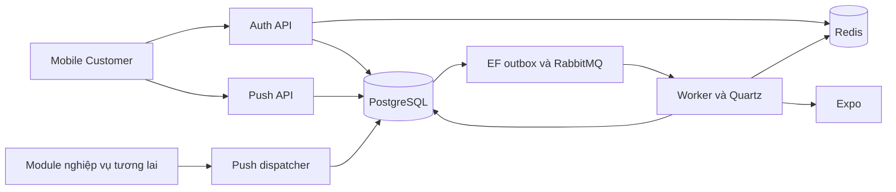
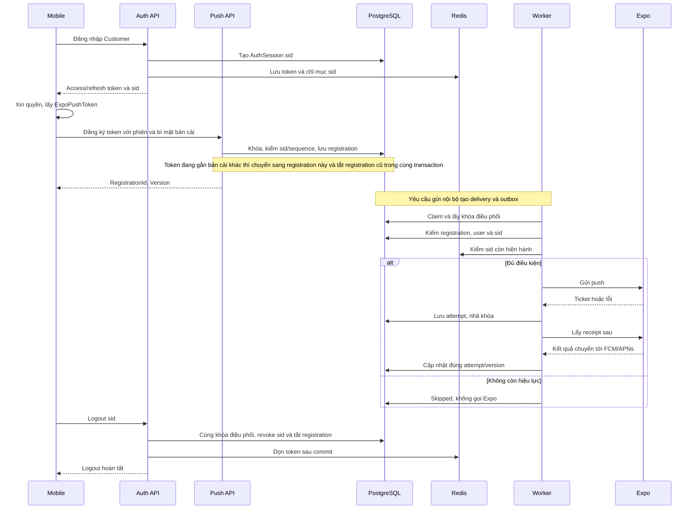
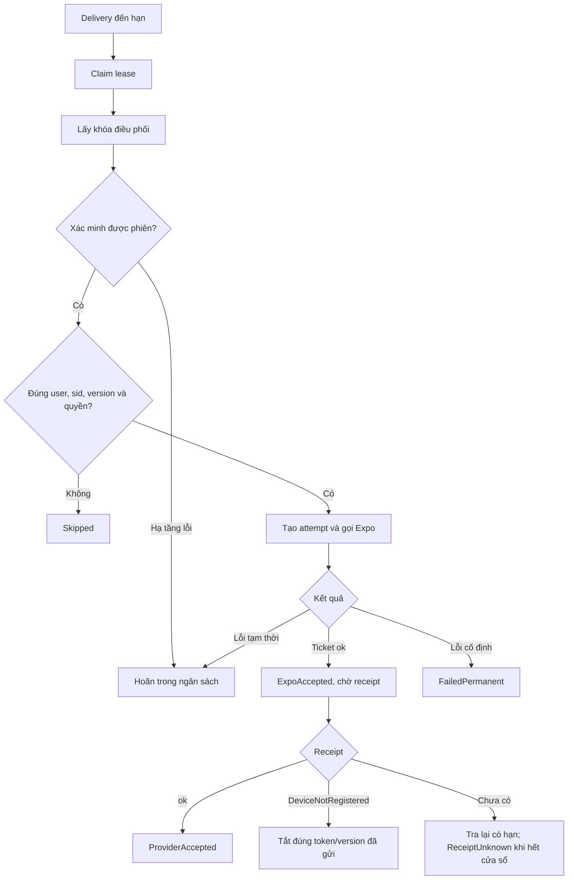
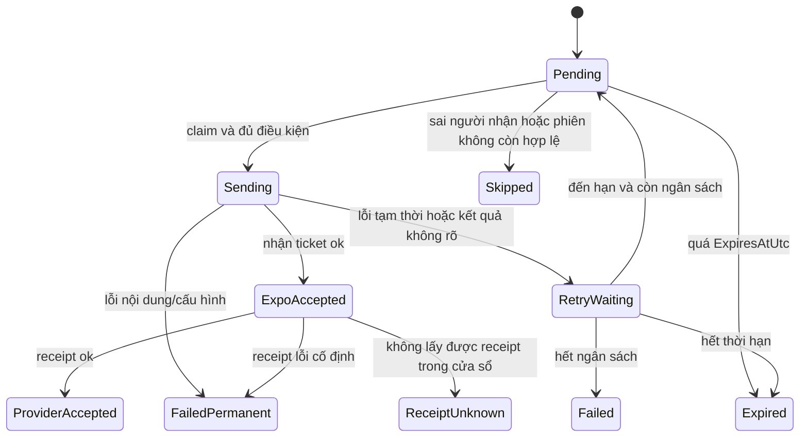
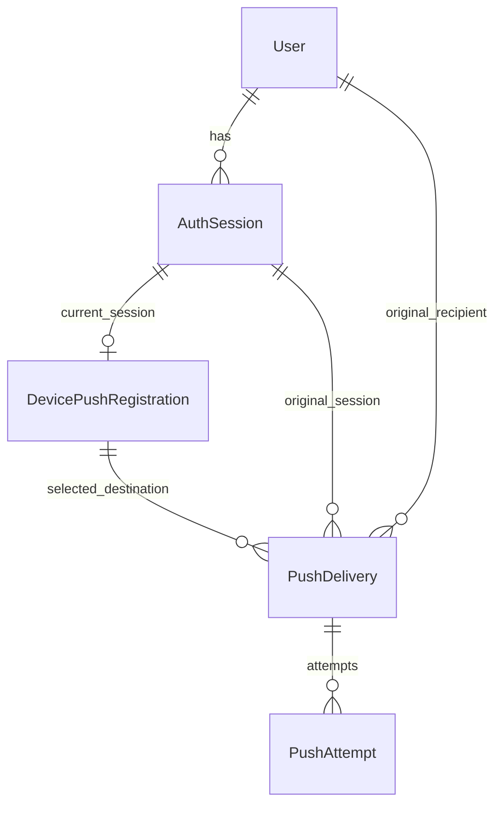

<!-- HƯỚNG DẪN CHO AI KHI ĐIỀN HOẶC CHỈNH SỬA MẪU
- Đọc toàn bộ mẫu, các comment hướng dẫn và tài liệu nguồn được cung cấp trước khi viết. Tuân thủ các quy tắc nghiệp vụ, điều kiện, ngoại lệ và giới hạn đã được xác nhận.
- Không bịa, tự chế hoặc suy đoán thành sự thật: yêu cầu, quy tắc, số liệu, API, schema, mã lỗi, nguồn tham khảo, người phụ trách và kết quả kiểm thử phải có căn cứ. Nội dung ví dụ trong mẫu không phải dữ kiện của dự án.
- Khi thiếu thông tin hoặc các nguồn mâu thuẫn, hỏi người dùng để làm rõ; giữ nguyên placeholder ở phần chưa xác định. Không tự chọn đáp án, lấp chỗ trống hay tuyên bố tài liệu đã hoàn tất.
- Chỉ thay nội dung cần điền hoặc được yêu cầu sửa. Không tự mở rộng phạm vi, sửa nghĩa quy tắc, bỏ điều kiện/ngoại lệ, xoá hay ghi đè nội dung hợp lệ đã có.
- Giữ nguyên tên, cấp và thứ tự heading, nhãn in đậm, tiền tố bullet, cấu trúc danh sách, tên/thứ tự/số cột bảng và cú pháp code fence. Không dịch, đổi tên, gộp hoặc thêm mục ngoài cấu trúc mẫu.
- Chỉ lặp khối luồng, AC hoặc API theo đúng khuôn khi có căn cứ; chỉ bỏ phần tuỳ chọn khi hướng dẫn riêng của mẫu cho phép và đã xác định không áp dụng.
- Mã tham chiếu và section phải trỏ tới tài liệu có thật đã được cung cấp hoặc kiểm chứng. Không giữ mã ví dụ như tham chiếu thật và không tự tạo tài liệu liên quan để hợp thức hoá liên kết.
- Giữ các comment hướng dẫn trong file. Xuất Markdown UTF-8, mỗi file một tài liệu; không bọc toàn bộ file trong code fence, không chèn lời dẫn hay giải thích ngoài mẫu.
- Trước khi bàn giao, đối chiếu nội dung với nguồn, kiểm tra cấu trúc, giá trị cho phép, giới hạn độ dài và tính nhất quán của mã/tham chiếu. Báo rõ phần chưa đủ thông tin; không tuyên bố đã chạy test hoặc import khi chưa thực hiện.
-->

<!-- Thay mã TDD-001 và nội dung ví dụ; giữ nguyên heading và nhãn in đậm.
Sơ đồ dùng mermaid, plantuml hoặc URL. Giữ heading Architecture, Sequence Diagram, Activity Diagram, State Diagram, Data Model.
Ví dụ API phải có heading trùng METHOD /path trong Endpoints. Xoá phần API/sơ đồ không dùng.
Version, Updated At và Change Log do lịch sử phiên bản quản lý, để trống khi nhập mới.
Author/Reviewer là tên hiển thị; gán tài khoản, phê duyệt, giả định và câu hỏi mở trên giao diện sau import.
Thiết kế phải truy vết về Story và Business Rule được cung cấp. Phân biệt thiết kế đề xuất với implementation đã kiểm chứng; không mô tả API/schema/sơ đồ ví dụ như hệ thống thật hoặc tự quyết định nghiệp vụ còn thiếu.
BẮT BUỘC KHI HOÀN THIỆN MẪU: phải có cả Reviewer và Approver, mỗi tên 1–200 ký tự sau khi bỏ khoảng trắng đầu/cuối. Không xoá hai dòng metadata, để trống, dùng tên bịa hoặc giữ placeholder rồi coi là hoàn tất.
Nếu chưa biết người review hoặc người phê duyệt, phải hỏi người dùng và báo tài liệu chưa đủ thông tin; không tự lấy Author/Owner làm người thay thế. Tên trong file không tự gán tài khoản hoặc xác nhận đã duyệt; gán thành viên trên giao diện sau import.
Đây là yêu cầu hoàn thiện mẫu; backend hiện vẫn nhận file cũ thiếu hai trường để tương thích.

VALIDATION CHO FILE NHẬP (đối chiếu ImportSnapshotValidator, MarkdownParser và ImportService):
- Mỗi file .md UTF-8 không rỗng chỉ có một heading cấp 1 chứa mã tài liệu dài 1–100 ký tự. Mã không được trùng trong cùng lần nhập hoặc thuộc loại tài liệu khác đã tồn tại.
- Không dùng tên README.md hoặc sitemap.md vì importer bỏ qua. Giao diện nhận .md/.zip, tối đa 2.000 file, tổng file tải lên 31 MiB; API giới hạn request 32 MiB và tổng nội dung đọc/giải nén 64 MiB.
- Chỉ nhập đè tài liệu cùng loại đang Draft, chưa có phiên bản và chưa lưu trữ. Import thay toàn bộ nội dung bản nháp, vì vậy phải giữ lại nội dung hợp lệ ngoài phần được yêu cầu sửa.
- Không dùng Status trong Markdown hoặc tên Approver để tự xác nhận phê duyệt; import không cấp quyền hay gán tài khoản từ tên. Chạy Kiểm tra file và xử lý lỗi/cảnh báo trước khi nhập.
- Giới hạn độ dài bên dưới tính theo string.Length của .NET (đơn vị UTF-16); không tự cắt ngắn dữ kiện quan trọng để vượt validation, hãy viết lại có căn cứ hoặc hỏi người dùng.
- Feature tối đa 300 ký tự và được dùng làm tiêu đề tài liệu. Status được parser nhận: Draft / In Review / Approved / Deprecated; tài liệu nhập mới vẫn có trạng thái phê duyệt Draft.
- Endpoint: đường dẫn tối đa 500 ký tự; tên/mô tả endpoint được lưu trong Name tối đa 300. HTTP method: GET / POST / PUT / PATCH / DELETE / HEAD / OPTIONS.
- Error Codes: mã tối đa 100 ký tự, không trùng trong tài liệu; giữ dạng - **CODE** (400): mô tả. HTTP status trong Error Codes và Response phải là số nguyên đọc được bằng Int32; không tự đặt status khác hợp đồng API.
- URL sơ đồ tối đa 1.000 ký tự. Mục sơ đồ được sử dụng phải có khối mermaid/plantuml hoặc URL theo mẫu; không để một mục sơ đồ rỗng. Nhãn mục được tách từ bullet như tên External API Fields tối đa 300 ký tự.
- Heading Examples phải khớp METHOD /path ở Endpoints. Giữ các nhãn Request:, Response 200: (thay mã theo contract) và Error Response: để parser tách đúng dữ liệu.
- Tham chiếu dạng DOC-KEY/section: ghi chú: mã đích tối đa 100 ký tự, section tối đa 100, ghi chú tối đa 1.000. Không trùng bộ mã đích + section + loại liên kết trong cùng tài liệu.
ĐỐI CHIẾU FORM TDD (src/features/tdds/validations.ts; form có thể chặt hơn import):
- Điền Feature, Author, Reviewer, Problem và ít nhất một Goal; các Goal/Non-goal/Notes đã thêm không được rỗng. API đã khai báo phải có endpoint và mô tả/mục đích; Fields phải có tên và ý nghĩa; Error Codes phải có mã, HTTP status và điều kiện.
- Form còn kiểm tra Version, Updated At và nội dung Change Log khi khai báo; với file nhập mới, giữ các trường lịch sử này trống theo hợp đồng import, không tự tạo dữ liệu lịch sử.
-->

# TDD-PUSH-001

## Document Info

- **Feature**: Đăng ký thiết bị khách hàng và nền tảng gửi push qua Expo cho Android/iOS
- **Author**: Codex
- **Reviewer**: Tân Trần
- **Approver**: Tân Trần
- **Status**: Draft
- **Version**:
- **Updated At**:

## Context & Goals

### Problem

**Trạng thái quyết định:** đã chốt tạm hoãn thông báo website; trạng thái Pending — technical debt được ghi tại STORY-PUSH-001/Out of Scope. Expo chưa được chốt; các sơ đồ, trường dữ liệu và contract liên quan Expo dưới đây là phương án để review, chưa phải căn cứ triển khai đã duyệt. Cần kiểm tra source mobile trước khi chọn dịch vụ push. Người dùng xác nhận ngày 25/09/2026: đội mobile chưa chọn công nghệ cho app, nên tài liệu này tạm hoãn; chưa viết đặc tả Unit Test và chưa triển khai code cho tới khi chốt app có dùng Expo hay không.

STORY-PUSH-001 và BR-PUSH-001..003 đã được người dùng chốt trong hội thoại. Một khách hàng có thể nhận push trên nhiều thiết bị; logout hoặc đổi tài khoản phải ngừng gửi cho phiên/tài khoản cũ. Đợt này chưa chọn loại thông báo nghiệp vụ. Đây là thiết kế đề xuất để review, chưa phải code đã triển khai hoặc kiểm thử đã chạy.

Hiện trạng đã kiểm tra trong backend:

| Thành phần | Hiện trạng và ảnh hưởng |
|---|---|
| `ISessionTokenStore`, `SessionTokenStore` | Redis lưu từng refresh token và tập token của user. Payload chưa có SessionId. `RotateAsync` hiện dùng Redis batch; batch không phải cơ chế compare-and-swap nguyên tử. |
| `GetLoginQueryHandler`, `GetTokenQueryHandler` | Đăng nhập tạo token mới; refresh thay cả access/refresh token. Đã kiểm stamp cũ trước khi refresh. |
| `UserApi`, `AuthCookieHelper` | Login hiện đặt cookie và bỏ token khỏi JSON. Logout đọc refresh token từ cookie. Mobile dùng Bearer cần contract riêng rõ ràng, không chỉ thêm cột ExpoPushToken. |
| `SessionCutter`, `ChangePasswordCommandHandler` | Đổi SecurityStamp trong SQL, dọn Redis sau commit. Push phải đọc trạng thái SQL hiện tại, không chỉ tin cache dấu phiên. |
| `ApplicationDbContext` | Chưa có bảng phiên bền vững, thiết bị push hoặc lượt gửi. |
| `ServiceCollectionExtensions` infrastructure | Có MassTransit/RabbitMQ, EF outbox và Quartz; dùng lại, không thêm broker khác. |

Chưa tìm thấy mã nguồn mobile trong workspace đã khảo sát. Phiên bản Expo SDK, EAS projectId và cấu hình FCM/APNs thực tế cần đội mobile cung cấp trước khi tích hợp. Không suy ra đã cấu hình được push chỉ từ backend.

### Goals

- Lưu bền vững đăng ký theo bản cài, hỗ trợ Android/iOS và nhiều thiết bị của một Customer.
- Liên kết đăng ký với phiên ổn định, chống yêu cầu cũ ghi đè sau chuyển tài khoản.
- Có bộ gửi nội bộ chạy nền, thử lại giới hạn, xử lý ticket/receipt và token hết hiệu lực.
- Giữ tương thích API web hiện có; kiểm chứng dữ liệu bằng PostgreSQL/Redis thật và adapter Expo có thể điều khiển lỗi.

### Non-goals

- Thông báo website: **Pending — technical debt**, đã được người dùng xác nhận ngày 2026-09-25 và ghi tại STORY-PUSH-001/Out of Scope. Đợt này chỉ thiết kế cho mobile Customer Android/iOS; chưa chốt loại thông báo website, lịch triển khai hoặc mở rộng schema để hỗ trợ website.

- Push cho Staff, web push, thông báo marketing, hộp thông báo/đã đọc, danh sách thiết bị cho người dùng tự quản lý.
- Tự chọn sự kiện nghiệp vụ, người được nhận theo từng nghiệp vụ, nội dung thật hoặc thời gian lưu lịch sử.
- Đảm bảo gửi đúng một lần, thu hồi thông báo đã chuyển sang dịch vụ ngoài, suy ra thiết bị đã hiển thị từ receipt.

## Architecture

**Thành phần và trách nhiệm**

| Thành phần đề xuất | Trách nhiệm |
|---|---|
| Module auth | Cấp `sid`, quản lý `AuthSession`, rotate/revoke, kiểm tra stamp và Purpose. |
| Module push | Sở hữu `DevicePushRegistration`, `PushDelivery`, `PushAttempt`; đăng ký, vô hiệu hóa, chọn đích và ghi kết quả. |
| `IPushSessionReader` | Đọc điều kiện phiên từ AuthSession, User và Redis; không để module push tự sửa refresh token. |
| `IPushDispatcher` | Cổng gọi nội bộ; nhận user và thông điệp đã được module nghiệp vụ cho phép, tạo công việc trong transaction/outbox. Không mở API gửi tùy ý cho mobile. |
| `ExpoPushClient` | Typed HttpClient gọi API Expo; không chứa quyết định nghiệp vụ người nhận. |
| Worker và Quartz | Xử lý delivery đến hạn, receipt đến hạn và công việc bị ngắt. SQL giữ lịch và trạng thái; RabbitMQ chỉ đánh thức xử lý. |

**Bốn bảng mới được đề xuất.** AuthSession lưu sự thật về phiên bị thu hồi/hết hạn; registration lưu địa chỉ nhận hiện tại; delivery lưu một yêu cầu cho một đích; attempt lưu từng lần gọi ngoài hệ thống. Tách delivery/attempt để thử lại không ghi đè ticket, token và lỗi của lần trước. Không tạo bảng Notification vì chưa có nghiệp vụ hộp thông báo.

**Phiên ổn định và tương thích đăng nhập**

- Backend sinh UUID `sid` sau khi xác thực thành công; thêm claim sid và SessionId vào payload Redis. SessionId giữ nguyên khi refresh; refresh token vẫn thay đổi.
- Đề xuất áp dụng AuthSession cho các phiên mobile mới. Phiên web cũ tiếp tục theo contract hiện hành và chưa được dùng để đăng ký push. Không suy ra sid bằng token hoặc userId.
- Mỗi AuthSession có Purpose=Login hoặc PasswordReset; chỉ phiên Login của Customer được đăng ký push. Token reset không được nâng thành phiên nhận push. Email verification/password reset phải được rà các điểm phát token riêng trước khi tích hợp; không sao chép token reset vào đường đăng ký.
- Redis bổ sung `bmt:auth:sid:{sid}` → refresh-token key hiện hành. Đây là chỉ mục dẫn xuất, không chứa trạng thái thay thế cho SQL. TTL không vượt thời hạn phiên; việc kiểm hợp lệ dùng ExpiresAtUtc thật, không tính khoảng grace của key như thời gian đăng nhập.
- Store/rotate/revoke dùng Lua hoặc transaction có điều kiện: rotate chỉ thành công nếu old refresh còn tồn tại và đúng sid/current token; hai refresh cùng token chỉ một lần thắng. Revoke theo sid xóa phiên hiện hành dù refresh token đã rotate. Mọi thao tác kiểm đồng thời AuthSession chưa revoked.
- PostgreSQL và Redis không chung transaction. Login lưu AuthSession rồi ghi Redis; chỉ trả token khi cả hai thành công. Nếu ghi Redis lỗi, trả lỗi hạ tầng và bù bằng thu hồi phiên SQL; phiên SQL không có Redis không đủ điều kiện push.
- Refresh lấy khóa phiên, kiểm SQL và stamp, rotate Redis trước rồi gia hạn SQL. Nếu bước SQL lỗi sau rotate, không trả token mới; thu hồi cả sid và ghi lỗi để dọn lại. Không dùng thứ tự gia hạn SQL trước rồi để Redis thất bại vẫn kéo dài điều kiện nhận push.
- Logout ghi RevokedAtUtc trong SQL trước, tắt registration đúng sid trong cùng transaction, sau commit mới dọn Redis. Dọn Redis lỗi không làm phiên SQL sống lại. Refresh và đăng ký đều kiểm SQL nên không tái kích hoạt phiên này.
- Đổi mật khẩu/khóa tài khoản đọc dấu phiên hiện hành trong SQL trước khi gửi. AuthSession giữ stamp tại lúc cấp, không được cập nhật theo stamp mới của user. Không cần chờ dọn Redis mới dừng push.

**Nhận diện bản cài, chuyển tài khoản và thứ tự cập nhật**

`InstallationId` là UUID do app tạo cho bản cài, không phải mã phần cứng. App tạo thêm bí mật ngẫu nhiên 256 bit và lưu trong kho bảo mật của nền tảng. Backend chỉ lưu SHA-256 của bí mật trong registration; không log/đưa bí mật vào URL. Đây là đề xuất kỹ thuật bảo vệ thao tác liên kết bản cài, không thay thế xác thực tài khoản.

- Đăng ký đầu tiên cần phiên hợp lệ, InstallationId và bí mật. Sau đó cập nhật/bind lại cần cả phiên phù hợp và bí mật khớp; chỉ biết InstallationId không đủ đổi người nhận.
- App thông thường logout A thành công rồi mới đổi sang B. Nếu logout mất mạng, xóa dữ liệu tài khoản khỏi giao diện nhưng phải ghi thao tác pending để xử lý khi kết nối lại; không hứa backend đã biết logout. Không hiển thị nội dung tài khoản cũ trong app sau chuyển tài khoản.
- Login mobile có thể gửi cặp InstallationId/bí mật của bản cài đã đăng ký. Sau xác thực tài khoản B, backend khóa đăng ký, thu hồi sid cũ gắn bản cài, liên kết sid B và tạm tắt gửi cho tới khi app đồng bộ quyền/token. Không thu hồi phiên A ở thiết bị khác.
- Nếu chưa có đăng ký, login không phụ thuộc lấy Expo token; app đăng ký sau. Mã phiên có `LoginOrder` tăng từ sequence SQL, không so thứ tự bằng giờ client. Khi bind một đăng ký tồn tại, sid mới phải có LoginOrder lớn hơn sid cũ; sid cũ không được chiếm lại đăng ký bằng request đến muộn.
- Trong cùng sid, app gửi `ClientSequence` tăng dần và `RequestId`; lưu last sequence/hash để cùng nội dung được replay, cùng sequence khác nội dung trả 409. Sequence nhỏ hơn bị từ chối. Version của đăng ký tăng khi đổi token, quyền hoặc sid; receipt và công việc cũ dùng version để không tác động nhầm.
- **Chuyển token khi cài lại app**: mỗi token/project chỉ có một registration hiện hành (UNIQUE(ExpoProjectId,TokenHash)). Khi phiên Login của Customer đăng ký một token đang gắn với registration của bản cài khác — thường gặp khi cài lại app: app có InstallationId và bí mật mới nhưng Expo trả lại token cũ — backend chuyển token sang registration của bản cài đang gọi và ngừng registration cũ (BR-PUSH-001 khoản 6, STORY-PUSH-001/AC-010). Trường hợp này không trả lỗi (bỏ mã PushTokenAlreadyBound trước đây) và không cần bước xác minh bổ sung; ràng buộc token duy nhất vẫn giữ nên không có hai đích gửi cho cùng token.
  - Cách chạy: đọc registration đang giữ TokenHash chỉ để biết userId/installationId cần khóa; lấy khóa điều phối cho cả hai bản cài theo giao thức ở mục dưới (userId rồi installationId tăng dần), rồi đọc lại trong transaction. Nếu vẫn qua rào chắn bên dưới: đặt registration cũ ExpoPushToken=NULL, TokenHash=NULL, DisabledAtUtc=now, DisabledReason=TokenMovedToNewInstallation và tăng Version; sau đó mới ghi token vào registration của bản cài đang gọi (tạo mới hoặc cập nhật, tăng Version). Hai lệnh ghi đi đúng thứ tự trong cùng transaction để unique theo TokenHash không báo trùng, rồi commit một lần.
  - Rào chắn yêu cầu đến muộn: chỉ chuyển khi sid của yêu cầu có LoginOrder lớn hơn sid đang gắn registration giữ token. Bản cài mới luôn phải đăng nhập lại nên có LoginOrder lớn hơn. Yêu cầu đến muộn từ phiên cũ của bản cài cũ có LoginOrder nhỏ hơn nên bị từ chối 409 PushRegistrationStale, không kéo token về đăng ký cũ. Các kiểm tra bí mật, sid và ClientSequence của chính bản cài đang gọi vẫn áp dụng như trên.
  - Ảnh hưởng tới gửi: delivery đã tạo cho registration cũ giữ RegistrationVersion cũ nên worker đánh Skipped khi kiểm lại. Receipt DeviceNotRegistered của attempt cũ chỉ tắt đúng RegistrationId+Version+TokenHash đã gửi, không tắt registration mới. Delivery tạo sau khi chuyển chỉ chọn registration mới.
  - Rủi ro cần biết: nếu token của một thiết bị bị lộ, một phiên Customer hợp lệ khác có thể chuyển token đó về bản cài của mình; khi đó thiết bị bị lộ token sẽ nhận thông báo của tài khoản vừa chuyển token, còn đăng ký cũ ngừng nhận. Đây là hệ quả của quy tắc đã chốt. Giảm rủi ro bằng cách không trả token ra API, không ghi token vào log/telemetry và giới hạn tần suất đăng ký theo tài khoản và bản cài.

**Chọn đích gửi và ranh giới logout**

Đăng ký đủ điều kiện khi token có giá trị, PermissionStatus cho phép, DisabledAtUtc=NULL, sid tồn tại/không revoked/chưa hết hạn, sid thuộc đúng user có AccountKind=Customer (không kiểm theo tên vai trò), user còn Active/không bị xóa và stamp sid bằng User.SecurityStamp. Chỉ mục sid trong Redis cũng phải còn tồn tại và khớp; không có key thì bỏ qua phiên, lỗi truy cập Redis thì hoãn gửi có giới hạn. Đọc đúng thời điểm trước mỗi lần gọi Expo, không chỉ lúc enqueue.

Để kiểm tra rồi gửi không bị logout chen giữa, đề xuất dùng **khóa điều phối theo tài khoản và bản cài** bằng PostgreSQL session advisory lock trên connection riêng của bước gửi. Logout, rebind, cập nhật token và thay stamp sử dụng cùng giao thức. Thứ tự: các userId sắp tăng dần, rồi các installationId sắp tăng dần; đọc lại chủ sở hữu sau khóa, nếu khác tập khóa thì nhả và thử lại. Không khóa ngược thứ tự ở đường cập nhật. Khóa có timeout và luôn nhả/dispose connection trong finally.

Worker giữ khóa điều phối từ lần kiểm tra cuối đến khi đã gọi transport và nhận kết quả/timeout. Không giữ transaction SQL qua HTTP; chỉ giữ connection và khóa điều phối trong thời gian ngắn có giới hạn. Logout đến trước được ghi nhận trước và worker không gửi; send đến trước có thể đã gửi trước khi logout hoàn tất. Timeout có thể là đã gửi nhưng mất phản hồi: ghi Unknown, không tuyên bố đã thu hồi thông báo. Chi phí là giới hạn số worker/connection và logout có thể chờ một cuộc gọi đang gửi; cần đo trên staging. Đây là lựa chọn kỹ thuật quan trọng cần review, không coi kiểm tra trạng thái đơn thuần là bảo đảm loại bỏ race.

**Gửi nền, chống xử lý lặp và phục hồi**

1. Module phía server gọi `IPushDispatcher.EnqueueAsync` trong transaction nghiệp vụ. Dispatcher tạo delivery cho các đăng ký tại thời điểm tiếp nhận và ghi outbox cùng transaction; không có đích thì trả kết quả NoEligibleRecipients nội bộ. Client không được gọi cổng này.
2. Khóa duy nhất `(MessageId, RegistrationId)` chống tạo cùng delivery nhiều lần. Snapshot RecipientUserId, SessionId và RegistrationVersion giữ người nhận ban đầu. Sau rebind sang B, delivery của A phải Skipped, không đọc token mới rồi gửi nội dung A cho B. Thiết bị mới xuất hiện sau enqueue không nhận bù thông báo cũ.
3. Worker claim delivery bằng lease/claim token, commit ngắn, rồi lấy khóa điều phối; reload và kiểm điều kiện. Chỉ chủ lease được ghi kết quả. Tạo attempt trước gọi HTTP; mỗi attempt giữ token snapshot, hash và version. Không gửi lại attempt đã có ticket.
4. Mất connection/timeout sau khi gửi có kết quả Unknown. Inbox/outbox chỉ chống lặp ở DB/broker, không đảm bảo HTTP Expo đúng một lần. Nếu thử lại có nguy cơ push trùng; giữ MessageId trong payload để app hạn chế xử lý lặp, không hứa hệ điều hành sẽ không hiển thị hai lần.
5. Quartz quét NextAttemptAtUtc, lease hết hạn và receipt chờ; lưu công việc trong SQL để restart vẫn phục hồi. Message broker retry chỉ xử lý lỗi hạ tầng trước claim; retry HTTP thuộc lịch delivery, không nhân hai tầng retry.
6. Đề xuất mặc định kỹ thuật: timeout HTTP 10 giây; tối đa 5 lần gửi gồm lần đầu; chờ 5s, 30s, 2m, 10m có jitter; dừng ở hạn ExpiresAtUtc do caller cung cấp. Redis lỗi trước gửi cũng có ngân sách kiểm tra hữu hạn, không lặp vô hạn. Các giá trị cấu hình cần được review/đo lại, không phải SLA nghiệp vụ.
7. Ticket ok → ExpoAccepted; receipt ok → ProviderAccepted. Lỗi DeviceNotRegistered vô hiệu hóa token bằng điều kiện RegistrationId + Version + TokenHash còn khớp attempt. Có thể re-register cùng token sau đó với version mới; receipt cũ không được tắt version mới.
8. 400/payload quá lớn/cấu hình credential sai: FailedPermanent hoặc cảnh báo cấu hình, không thử lại cùng nội dung vô hạn. 429/5xx/network là lỗi có thể thử lại. Hết ngân sách hoặc hết hạn thì Failed/Expired; receipt không có sau cửa sổ truy vấn thì ReceiptUnknown, không tự coi là thành công.




**Notes**:

- **Đã xác nhận:** phạm vi Customer Android/iOS, nhiều thiết bị, dừng gửi sau logout, chống yêu cầu A đến muộn, chuyển token sang bản cài mới khi cài lại app (BR-PUSH-001 khoản 6, xác nhận ngày 25/09/2026) và nền tảng gửi chưa gắn sự kiện nghiệp vụ. Reviewer/Approver: Tân Trần.
- **Đề xuất chưa chốt:** bốn bảng, khóa điều phối qua bước gọi Expo, ngân sách retry. Rào chắn LoginOrder khi chuyển token giữa hai bản cài đã được người dùng chốt ngày 25/09/2026 và ghi vào BR-PUSH-001 khoản 6. Bản TDD này cần review trước khi làm căn cứ viết Unit Test.
- **API mobile trả token riêng:** đã được thiết kế và người dùng chốt ngày 26/09/2026 ở [TDD-AUTH-002](TDD-AUTH-002.md). Phiên mobile lưu trên Redis với trường `clientKind`; bảng AuthSession, `sid`, `LoginOrder` và việc xoay token bằng Lua trong tài liệu này vẫn là đề xuất, sẽ được thêm lên trên thiết kế đó khi làm push.
- **Cần làm rõ trước triển khai:** app mobile có dùng Expo hay không (ngày 25/09/2026 đội mobile chưa chọn công nghệ), phiên bản SDK/project/credentials mobile, thời gian lưu dữ liệu. Luồng cài lại app cần thử trên thiết bị Android/iOS thật để xác nhận Expo có trả lại token cũ hay cấp token mới; cả hai trường hợp đều được thiết kế xử lý.
- **Thứ tự triển khai đề xuất:** migration thêm bảng → điều phối phiên và API mobile → đăng ký/token rotation/logout → dispatcher/outbox/worker → receipt/retry → tích hợp Android/iOS → kiểm chứng staging rồi bật feature. Chưa thực hiện bước nào trong giai đoạn tài liệu này.
- **Transaction auth:** thêm command/coordinator cho mobile; không dùng nguyên login query hiện tại để giả định có transaction. Mỗi bước SQL phải commit rõ trước bước Redis theo thứ tự trên; pipeline không được trì hoãn commit đến sau khi trả token. Refresh dùng cùng thứ tự khóa user, installation, session với các writer khác.
- **Lease:** đề xuất lease 60 giây, HTTP timeout 10 giây; sau khi lấy khóa điều phối phải kiểm lại lease và expiry. Worker hết lease không được gọi mới hoặc ghi kết quả bằng claim cũ. Khóa điều phối vẫn cần thiết vì lease riêng không chặn được hai cuộc gọi ngoài hệ thống. Ngân sách kiểm tra điều kiện do lỗi hạ tầng đề xuất tối đa 10 lần, đồng thời bị chặn bởi ExpiresAtUtc.
- **Chiến lược kiểm chứng:** unit test cho validation, điều kiện phiên, chuyển trạng thái và phân loại lỗi; integration test dùng PostgreSQL/Redis thật cho unique/FK, rotate/revoke, transaction, khóa và lease; system test dùng adapter Expo điều khiển lỗi rồi smoke trên thiết bị Android/iOS thật. Chưa viết đặc tả Unit Test hoặc chạy test.
- **Truy vết:** BR-PUSH-001 → đăng ký và FK/unique → ST-PUSH-001..004,008..009; khoản 6 và STORY-PUSH-001/AC-010 → chuyển token giữa bản cài → ST-PUSH-019..020; BR-PUSH-002 → phiên/khóa/chọn đích → ST-PUSH-005..007,010..012,018; BR-PUSH-003 → delivery/attempt/receipt → ST-PUSH-013..017.

## Sequence Diagram



## Activity Diagram



## State Diagram



Registration không lưu trạng thái Active tính sẵn: khả năng gửi được tính từ quyền, DisabledAtUtc và phiên hiện tại. Việc token còn giá trị không đồng nghĩa phiên còn đăng nhập.

## Data Model

Mọi tên bảng/cột dưới đây là đề xuất. UUID dùng `uuid`, thời điểm dùng `timestamptz` và ghi UTC; NN là NOT NULL. Không lưu access/refresh token trong SQL. Không thêm soft delete cho delivery/attempt. Dữ liệu người nhận và snapshot chỉ phục vụ gửi/đối soát, không phải hồ sơ thông báo đã đọc.

| Bảng | Một dòng đại diện cho gì | Cột chính và ràng buộc |
|---|---|---|
| AuthSession | Một phiên mobile được backend cấp; giữ nguyên qua refresh | `Id uuid PK`, `UserId uuid NN FK User RESTRICT`, `LoginOrder bigint NN UNIQUE` do sequence server cấp, `Purpose varchar(20) NN`, `SecurityStamp uuid NN` snapshot, `CreatedAtUtc timestamptz NN`, `ExpiresAtUtc timestamptz NN`, `RevokedAtUtc timestamptz NULL`, `Version bigint NN`; CHECK Version>=1, ExpiresAtUtc>CreatedAtUtc, RevokedAtUtc NULL hoặc >=CreatedAtUtc, Purpose chỉ Login/PasswordReset. UNIQUE(UserId,Id). |
| DevicePushRegistration | Một bản cài app trong một project/environment, giữ token và phiên sở hữu hiện tại | `Id uuid PK`, `AppScope varchar(100) NN`, `ExpoProjectId uuid NN`, `InstallationId uuid NN`, `InstallationSecretHash bytea NN` dài 32, `Platform varchar(10) NN` Android/iOS, `UserId uuid NN`, `SessionId uuid NN`, `ExpoPushToken varchar(512) NULL`, `TokenHash bytea NULL` dài 32, `PermissionStatus varchar(20) NN` Unknown/Denied/Granted/Provisional, `DisabledAtUtc timestamptz NULL`, `DisabledReason varchar(40) NULL` (ví dụ TokenMovedToNewInstallation khi token chuyển sang bản cài khác), `Version bigint NN`, `ClientSequence bigint NN`, `LastRequestId uuid NN`, `LastRequestHash bytea NN`, `CreatedAtUtc/UpdatedAtUtc/LastRegisteredAtUtc timestamptz NN`. FK(UserId,SessionId) tới AuthSession(UserId,Id) RESTRICT. |
| PushDelivery | Một thông điệp nội bộ gửi tới một registration đã được chọn | `Id uuid PK`, `MessageId uuid NN`, `RegistrationId uuid NN FK DevicePushRegistration RESTRICT`, `RecipientUserId uuid NN FK User RESTRICT`, `SessionId uuid NN FK AuthSession RESTRICT`, `RegistrationVersion bigint NN`, `Payload jsonb NN`, `PayloadHash bytea NN`, `State varchar(24) NN`, `AttemptCount int NN default 0`, `EligibilityCheckCount int NN default 0`, `NextAttemptAtUtc timestamptz NULL`, `ExpiresAtUtc timestamptz NN`, `LeaseToken uuid NULL`, `LeaseUntilUtc timestamptz NULL`, `CreatedAtUtc/UpdatedAtUtc timestamptz NN`, `LastErrorCode varchar(100) NULL`. UNIQUE(MessageId,RegistrationId); CHECK counts>=0, lease token/thời hạn cùng NULL hoặc cùng có giá trị. |
| PushAttempt | Một lần gọi Expo cho delivery, giữ dấu vết độc lập của lần thử | `Id uuid PK`, `DeliveryId uuid NN FK PushDelivery RESTRICT`, `Number int NN`, `RegistrationVersion bigint NN`, `TokenSnapshot varchar(512) NN`, `TokenHash bytea NN`, `State varchar(24) NN`, `TicketId varchar(200) NULL`, `SentAtUtc timestamptz NN`, `CompletedAtUtc timestamptz NULL`, `ReceiptNextCheckAtUtc timestamptz NULL`, `ReceiptDeadlineUtc timestamptz NULL`, `HttpStatus int NULL`, `ErrorCode varchar(100) NULL`. UNIQUE(DeliveryId,Number), Number>=1; ticketId unique khi khác NULL. |

**Quyền sở hữu và chuẩn hóa:** User sở hữu tài khoản; AuthSession sở hữu thời hạn/trạng thái phiên; registration sở hữu token và liên kết hiện tại. UserId trong registration được giữ để truy vấn người nhận và bị ràng buộc bằng FK ghép với session, không được cập nhật lệch. RecipientUserId/SessionId/version trong delivery và token trong attempt là snapshot có chủ đích: không đổi theo registration khi chuyển tài khoản. Payload là nội dung opaque của thông báo; trạng thái, khóa, lịch xử lý là cột riêng để truy vấn/ràng buộc.

**Khóa/index:** UNIQUE(AppScope,InstallationId), UNIQUE(ExpoProjectId,TokenHash) khi TokenHash khác NULL, UNIQUE(SessionId) cho registration. TokenHash lấy từ token chính xác, không đổi chữ hoa/thường; so token khi xử lý xung đột, không âm thầm gộp hai token khác nhau. CHECK token/hash cùng NULL hoặc cùng có giá trị; Granted/Provisional chỉ đủ điều kiện khi có token. Provisional iOS được xem là hệ điều hành đã cho phép dạng thông báo tương ứng; không tự nâng quyền hiển thị.

Index registration(UserId) phục vụ chọn mọi thiết bị của khách; AuthSession(UserId,RevokedAtUtc) phục vụ thu hồi; delivery(State,NextAttemptAtUtc), delivery(LeaseUntilUtc) và attempt(ReceiptNextCheckAtUtc) dùng cho worker. Index lớn/concurrent chưa cần quyết định khi chưa có số liệu; bảng mới ban đầu trống. Không có FK tới Redis.



Quan hệ registration–session chỉ mô tả liên kết hiện tại, không xóa lịch sử phiên cũ. Registration đổi sid nhưng delivery vẫn giữ sid lúc nhận việc. FK RESTRICT tránh xóa cha làm mất lịch sử chưa được xử lý; user soft delete khiến nguồn kiểm tra điều kiện từ chối gửi. Chưa có chính sách lưu lịch sử nên không tự thêm job xóa vĩnh viễn hoặc cascade dữ liệu.

**Dữ liệu mẫu:** các mã U1/U2, S1/S2, D1, M1, L1 và A1 dưới đây là bí danh UUID giả, không phải dữ liệu production. Chỉ trích các cột cần giải thích; token/bí mật không phải giá trị dùng được.

| Bảng | Dữ liệu ban đầu |
|---|---|
| User (bảng có sẵn) | U1: Customer/Active, SecurityStamp=K1; U2: Customer/Active, SecurityStamp=K2. |
| AuthSession | S1: UserId=U1, LoginOrder=101, Purpose=Login, SecurityStamp=K1, CreatedAtUtc=2026-09-24T03:00:00Z, ExpiresAtUtc=2026-09-24T05:00:00Z, RevokedAtUtc=NULL, Version=1. Mốc hết hạn chỉ là ví dụ, thực tế lấy cấu hình auth. |
| DevicePushRegistration | D1: AppScope=customer-production, InstallationId=I1, UserId=U1, SessionId=S1, Platform=iOS, ExpoPushToken=T1, TokenHash=H1, PermissionStatus=Granted, DisabledAtUtc=NULL, Version=1, ClientSequence=1. |
| PushDelivery | L1 (trước gửi): MessageId=M1, RegistrationId=D1, RecipientUserId=U1, SessionId=S1, RegistrationVersion=1, State=Pending, AttemptCount=0, Payload={"title":"Thông báo thử","body":"Kiểm tra kỹ thuật"}. |
| PushAttempt | A1 (sau khi gửi L1, L1 chuyển ExpoAccepted và AttemptCount=1): DeliveryId=L1, Number=1, TokenSnapshot=T1, TokenHash=H1, RegistrationVersion=1, State=ExpoAccepted, TicketId=E1; receipt chưa có nên CompletedAtUtc=NULL. |

Sau logout S1, RevokedAtUtc có giá trị và D1 bị tắt. U2 đăng nhập tạo S2/LoginOrder=102; bind lại D1 đổi UserId=U2, SessionId=S2, Version tăng, quyền/token phải được đồng bộ lại. L1 vẫn thuộc U1/S1 và phải Skipped nếu chưa gửi; không chuyển L1 sang U2. Nếu A1 đã gửi T1 rồi D1 đổi sang T2/H2/version mới, receipt lỗi H1 không được tắt T2. AuthSession không thay stamp K1 thành K2; đó là hai phiên khác nhau.

**Nhánh cài lại app** (tách khỏi nhánh logout/U2 ở trên, bắt đầu từ dữ liệu ban đầu): U1 xóa app trên thiết bị D1 mà không logout, cài lại và đăng nhập. App mới có InstallationId=I3, bí mật mới và Expo trả lại token T1. D3, S3 và L2 cũng là bí danh UUID giả.

| Bảng | Dữ liệu sau khi PUT I3 với token T1 thành công |
|---|---|
| AuthSession | S3: UserId=U1, LoginOrder=103, Purpose=Login, SecurityStamp=K1, CreatedAtUtc=2026-09-24T04:00:00Z, ExpiresAtUtc=2026-09-24T06:00:00Z, RevokedAtUtc=NULL, Version=1. S1 vẫn chưa bị thu hồi vì app cũ bị xóa mà không logout. |
| DevicePushRegistration — D1 bị chuyển token | D1: InstallationId=I1, UserId=U1, SessionId=S1, ExpoPushToken=NULL, TokenHash=NULL, PermissionStatus=Granted, DisabledAtUtc=2026-09-24T04:01:00Z, DisabledReason=TokenMovedToNewInstallation, Version=2. |
| DevicePushRegistration — D3 mới | D3: AppScope=customer-production, InstallationId=I3, UserId=U1, SessionId=S3, Platform=iOS, ExpoPushToken=T1, TokenHash=H1, PermissionStatus=Granted, DisabledAtUtc=NULL, Version=1, ClientSequence=1. |
| PushDelivery | L2: MessageId=M2, RegistrationId=D1, RecipientUserId=U1, SessionId=S1, RegistrationVersion=1, State=Pending, tạo trước lúc chuyển. Worker thấy D1.Version=2 nên đổi L2 sang Skipped, không gọi Expo. Thông điệp tạo sau đó cho U1 chỉ có delivery tới D3. |

D1 và D3 không cùng giữ H1 tại bất kỳ thời điểm commit nào. Nếu yêu cầu PUT của I1 với sid S1 (LoginOrder=101) đến muộn sau đó và gửi T1, backend trả 409 PushRegistrationStale vì 101 < 103; D3 giữ nguyên.

**Notes**:

Migration và triển khai an toàn:

- Thiết kế theo skill database-migration-planner: thêm bốn bảng và index trước; chưa tạo/chạy migration ở giai đoạn này. Không đổi hoặc xóa dữ liệu User, subscription, Redis phiên cũ.
- Deploy code hiểu sid và API mobile mới nhưng tắt feature gửi. Triển khai đồng nhất các writer login/refresh/logout trước khi bật đăng ký, tránh node cũ rotate token làm rơi sid.
- Phiên cũ không có sid tiếp tục web, nhưng API push trả SessionUpgradeRequired và yêu cầu đăng nhập lại bằng luồng mobile mới. Không backfill phiên bằng cách đoán từ userId hoặc quét token cũ.
- Tách AppScope/ExpoProjectId theo môi trường; backend lấy mapping từ cấu hình, không cho client chọn tùy ý project production.
- Kiểm migration trên database thử từ schema hiện tại; kiểm code web cũ, đăng ký mobile mới, refresh/logout, rollback giữa SQL/Redis và restart worker. Tắt feature worker trước rollback code; giữ bảng để không mất lịch sử, không dùng Down xóa dữ liệu như phương án phục hồi mặc định.
- Chưa đủ dữ liệu để chọn thời gian lưu token vô hiệu hóa, payload, attempt hoặc tốc độ gửi production. Phải chốt trước rollout; không tự đặt thời gian lưu theo ví dụ.

## Internal API

### Endpoints

Các route dưới đây là đề xuất mới. Tên contract/handler tuân CQRS của repo; API web hiện có giữ cookie và response hiện tại. Mobile dùng HTTPS/Bearer, lưu token trong kho bảo mật; không bật trả token JSON cho toàn bộ web chỉ vì thêm mobile.

- **POST** `/api/v1/mobile-auth/login` — Customer xác thực email/password; tạo AuthSession và token có sid. Có thể nhận InstallationId/installation secret của bản cài đã biết để bind lại. Push permission/token không phải tham số bắt buộc. Lỗi xử lý đăng ký push được trả thành trạng thái pending riêng, không làm mất kết quả xác thực thành công; không được coi bind đã thành công nếu transaction bind lỗi.
- **POST** `/api/v1/mobile-auth/refresh` — Body refreshToken; giữ sid, kiểm SQL/Redis/stamp và rotate một lần. Không nhận UserId từ client.
- **POST** `/api/v1/mobile-auth/logout` — Thu hồi đúng sid từ access token hợp lệ hoặc refresh token đã được tra và đối chiếu chủ sở hữu. Cookie không bắt buộc cho mobile. Logout idempotent; không cho sid từ body vô hiệu hóa phiên của người khác.
- **PUT** `/api/v1/me/push-installations/{installationId}` — Customer Login session; header `X-Installation-Secret`; body token/quyền/platform/sequence/requestId. Lần đầu tạo registration; các lần sau kiểm secret, sid/LoginOrder và sequence. Token đang gắn với bản cài khác thì được chuyển sang registration này và registration cũ bị tắt, khi sid gọi có LoginOrder lớn hơn sid đang giữ token; ngược lại trả 409 PushRegistrationStale. Lấy project từ cấu hình app/environment được server cho phép.
- **DELETE** `/api/v1/me/push-installations/{installationId}` — Tắt nhận push của registration đang thuộc sid gọi; không logout và không tác động phiên khác. Cần bí mật bản cài, điều kiện phiên và header If-Match chứa Version hiện tại; version cũ trả PushRegistrationStale, không tắt đăng ký mới.

Cổng nội bộ `EnqueueAsync(MessageId, RecipientUserId, Title, Body, Data, ExpiresAtUtc, CancellationToken)` không phải endpoint public. Cùng MessageId/đích cùng payload replay; payload khác trả xung đột. Module gọi chịu trách nhiệm xác minh quyền nhận nội dung. Đề xuất snapshot người nhận lúc enqueue; không gửi bù cho thiết bị mới sau đó.

### Examples

#### PUT /api/v1/me/push-installations/{installationId}

```text
Request:
Authorization: Bearer <access-token-co-sid>
X-Installation-Secret: <bi-mat-ban-cai-khong-ghi-log>
{"platform":"iOS","expoPushToken":"ExpoPushToken[gia-lap]","permissionStatus":"Granted","clientSequence":3,"requestId":"11111111-1111-4111-8111-111111111111"}

Response 200:
{"value":{"registrationId":"22222222-2222-4222-8222-222222222222","version":4,"permissionStatus":"Granted"},"isSuccess":true,"isFailure":false,"error":{"code":"","message":""}}

Error Response:
{"status":409,"code":"PushRegistrationStale","messageCode":"PushRegistrationStale","detail":"Đăng ký đã được cập nhật bởi phiên hoặc yêu cầu mới hơn."}
```

Với Denied/Unknown, token có thể NULL; cập nhật quyền được phép làm tắt registration. Provisional chỉ áp dụng iOS. Độ dài token tối đa 512 là giới hạn kỹ thuật đề xuất, không phải cam kết độ dài token của Expo. Không nhận token FCM/APNs vào trường ExpoPushToken. Validate dạng chuỗi không chứng minh client sở hữu thiết bị.

#### POST /api/v1/mobile-auth/login

```text
Request:
{"email":"customer@example.test","password":"<password>"}

Response 200:
{"value":{"accessToken":"<access-token>","refreshToken":"<refresh-token>","sessionId":"33333333-3333-4333-8333-333333333333","pushRegistrationStatus":"Pending"},"isSuccess":true,"isFailure":false,"error":{"code":"","message":""}}

Error Response:
{"status":401,"code":"InvalidCredentials","messageCode":"InvalidCredentials","detail":"Thông tin đăng nhập không hợp lệ."}
```

Response thực tế cần giữ thời hạn token theo contract Authenticated; ví dụ lược trường thời hạn, không đổi cách tính TTL đang cấu hình. Password/installation secret/token không đưa vào cache key, telemetry hoặc URL.

#### POST /api/v1/mobile-auth/refresh

```text
Request:
{"refreshToken":"<current-refresh-token>"}

Response 200:
{"value":{"accessToken":"<new-access-token>","refreshToken":"<new-refresh-token>","sessionId":"33333333-3333-4333-8333-333333333333"},"isSuccess":true,"isFailure":false,"error":{"code":"","message":""}}

Error Response:
{"status":401,"code":"InvalidRefreshToken","messageCode":"InvalidRefreshToken","detail":"Phiên không còn hợp lệ."}
```

#### POST /api/v1/mobile-auth/logout

```text
Request:
Authorization: Bearer <access-token-co-sid>
{"refreshToken":"<current-refresh-token>"}

Response 200:
{"isSuccess":true,"isFailure":false,"error":{"code":"","message":""}}

Error Response:
{"status":401,"code":"Unauthorized","messageCode":"Unauthorized","detail":"Không xác minh được phiên cần đăng xuất."}
```

#### DELETE /api/v1/me/push-installations/{installationId}

```text
Request:
Authorization: Bearer <access-token-co-sid>
X-Installation-Secret: <bi-mat-ban-cai>
If-Match: "4"

Response 204:

Error Response:
{"status":404,"code":"PushRegistrationNotFound","messageCode":"PushRegistrationNotFound","detail":"Không tìm thấy đăng ký trong phiên hiện tại."}
```

### Error Codes

- **Unauthorized** (401): không có phiên xác thực hợp lệ.
- **InvalidCredentials** (401): thông tin đăng nhập không hợp lệ; không tiết lộ tài khoản có tồn tại.
- **InvalidRefreshToken** (401): token/sid hết hạn, revoked hoặc stamp không khớp.
- **CustomerOnly** (403): tài khoản có User.AccountKind khác Customer; kiểm theo AccountKind, không theo tên vai trò. Tài khoản nhân viên không đăng ký và không nhận push khách hàng.
- **SessionUpgradeRequired** (409): phiên cũ không có sid phù hợp để đăng ký push.
- **PushRegistrationStale** (409): sid/sequence/version cũ, cùng RequestId với nội dung khác, hoặc yêu cầu từ sid có LoginOrder nhỏ hơn sid đang giữ token muốn chuyển token về.
- **PushRegistrationNotFound** (404): đăng ký không thuộc phạm vi phiên; dùng cùng lỗi khi bí mật bản cài không khớp để không tiết lộ chủ sở hữu.
- **PushRegistrationInvalid** (422): platform/quyền/token/sequence không hợp lệ.
- **PushDependencyUnavailable** (503): không xác minh/lưu được đăng ký do hạ tầng; lỗi endpoint push không đổi kết quả login đã thành công.

## External API

### Endpoints

- **Expo Push Service** — `POST https://exp.host/--/api/v2/push/send` để gửi; `POST https://exp.host/--/api/v2/push/getReceipts` để lấy kết quả ticket. [Tài liệu chính thức](https://docs.expo.dev/push-notifications/sending-notifications/).
- **Expo notifications SDK** — mobile xin quyền và lấy Expo token theo projectId. Chọn phiên bản theo SDK thực tế, không tự nâng package khi chưa có mã mobile. [SDK](https://docs.expo.dev/versions/latest/sdk/notifications/).

### Fields

- **to** — ExpoPushToken của attempt đã kiểm điều kiện.
- **title/body/data** — payload từ cổng gửi nội bộ; data chứa MessageId để app nhận diện xử lý lặp.
- **ticket id** — lưu theo từng attempt, dùng khi truy vấn receipt.
- **details.error** — phân loại lỗi, đặc biệt DeviceNotRegistered; không log nguyên payload chứa token.

### Error Handling

Gửi batch tối đa 100 message cùng project; xử lý ticket theo đúng vị trí từng message. Đặt giới hạn tốc độ/concurrency bằng cấu hình, không coi giới hạn batch là quyền gửi vô hạn. Truy vấn receipt lần đầu khoảng 15 phút sau; hoàn tất cửa sổ tra trước khi Expo xóa receipt sau 24 giờ. Các mốc này theo tài liệu Expo và phải kiểm lại khi triển khai. Receipt ok chỉ là FCM/APNs đã nhận, không phải user đã đọc. [Nguồn](https://docs.expo.dev/push-notifications/sending-notifications/).

Bật bảo vệ access token của Expo cho môi trường production nếu cấu hình dự án hỗ trợ; bí mật lưu ở cấu hình triển khai. FCM v1/APNs credentials đặt theo hướng dẫn Expo/EAS; không gửi credential cho mobile ngoài cấu hình ứng dụng mà SDK yêu cầu. Không expose endpoint public cho phép thử push đến token tùy ý.

### Quirks

- Token Expo không phải refresh token và không dùng làm danh tính user. Token có thể thay đổi hoặc vẫn giữ sau cài lại tùy nền tảng; token đổi thì cập nhật như đồng bộ thường, token giữ nguyên thì chuyển sang bản cài mới theo BR-PUSH-001 khoản 6. Không suy ra một token là một user. [FAQ Expo](https://docs.expo.dev/push-notifications/faq/).
- Native push token callback có thể trả token APNs/FCM; khi callback báo thay đổi, app lấy lại ExpoPushToken, không gửi nhầm native token vào backend.
- Tắt quyền trong hệ điều hành hoặc logout cục bộ khi offline không tự gửi sự kiện tức thì đến backend. App đồng bộ khi hoạt động lại; backend không hứa biết trạng thái thiết bị ngay khi offline.
- Expo/FCM/APNs có thể giao trùng hoặc không giao; không có trạng thái Delivered/Read nếu chưa thiết kế xác nhận từ app.

## References

### User Stories

- STORY-PUSH-001/Acceptance Criteria

### Business Rules

- BR-PUSH-001/Then
- BR-PUSH-002/Then
- BR-PUSH-003/Then

### Use Cases

- STORY-PUSH-001/Main Flow
- STORY-PUSH-001/Alternative Flow
- STORY-PUSH-001/Exception Flow

### Others

- [User dùng lại: schema thực thể](../../bmt-be/src/bmt-be.domain/entities/User.cs)
- [Session contract](../../bmt-be/src/bmt-be.application/abstractions/ISessionTokenStore.cs)
- [Redis store](../../bmt-be/src/bmt-be.infrastructure/authentication/SessionTokenStore.cs)
- [Auth endpoints](../../bmt-be/src/bmt-be.presentation/apis/user/UserApi.cs)
- [Session cutter](../../bmt-be/src/bmt-be.application/services/SessionCutter.cs)
- [Hạ tầng messaging](../../bmt-be/src/bmt-be.infrastructure/dependencyInjection/extensions/ServiceCollectionExtensions.cs)

- [ST-PUSH-001](../systemtest/ST-PUSH-001.md)
- [ST-PUSH-002](../systemtest/ST-PUSH-002.md)
- [ST-PUSH-003](../systemtest/ST-PUSH-003.md)
- [ST-PUSH-004](../systemtest/ST-PUSH-004.md)
- [ST-PUSH-005](../systemtest/ST-PUSH-005.md)
- [ST-PUSH-006](../systemtest/ST-PUSH-006.md)
- [ST-PUSH-007](../systemtest/ST-PUSH-007.md)
- [ST-PUSH-008](../systemtest/ST-PUSH-008.md)
- [ST-PUSH-009](../systemtest/ST-PUSH-009.md)
- [ST-PUSH-010](../systemtest/ST-PUSH-010.md)
- [ST-PUSH-011](../systemtest/ST-PUSH-011.md)
- [ST-PUSH-012](../systemtest/ST-PUSH-012.md)
- [ST-PUSH-013](../systemtest/ST-PUSH-013.md)
- [ST-PUSH-014](../systemtest/ST-PUSH-014.md)
- [ST-PUSH-015](../systemtest/ST-PUSH-015.md)
- [ST-PUSH-016](../systemtest/ST-PUSH-016.md)
- [ST-PUSH-017](../systemtest/ST-PUSH-017.md)
- [ST-PUSH-018](../systemtest/ST-PUSH-018.md)
- [ST-PUSH-019](../systemtest/ST-PUSH-019.md)
- [ST-PUSH-020](../systemtest/ST-PUSH-020.md)

## Change Log

- 2026-09-26 (API mobile trả token): Người dùng chốt TDD-AUTH-002 cho phiên mobile. Bỏ "API mobile trả token riêng" khỏi nhóm đề xuất chưa chốt và ghi rõ phần AuthSession/sid của tài liệu này vẫn là đề xuất.
- 2026-09-25 (tạm hoãn): Người dùng xác nhận đội mobile chưa chọn công nghệ cho app. Tài liệu giữ trạng thái chờ; chưa viết đặc tả Unit Test và chưa triển khai code cho tới khi chốt app có dùng Expo hay không.
- 2026-09-25: Theo BR-PUSH-001 khoản 6 và STORY-PUSH-001/AC-010, token đang gắn với bản cài khác được chuyển sang registration của bản cài mới và registration cũ bị tắt (DisabledReason=TokenMovedToNewInstallation) trong cùng transaction; bỏ mã lỗi `PushTokenAlreadyBound` và phương án challenge khôi phục. Giữ rào chắn yêu cầu đến muộn bằng LoginOrder (sid cũ hơn nhận 409 PushRegistrationStale); thêm mẫu dữ liệu nhánh cài lại app. `CustomerOnly` và điều kiện chọn đích ghi rõ kiểm User.AccountKind=Customer. Câu về thông báo website trỏ tới STORY-PUSH-001/Out of Scope thay cho ghi nhận technical debt riêng.
