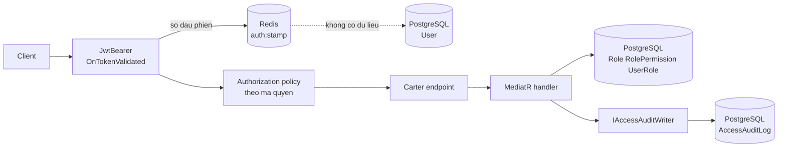
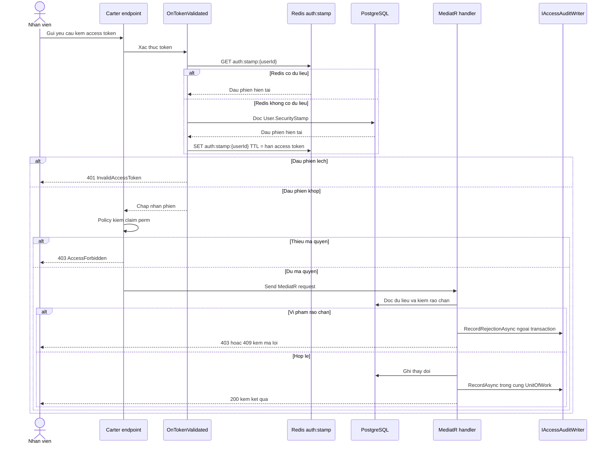
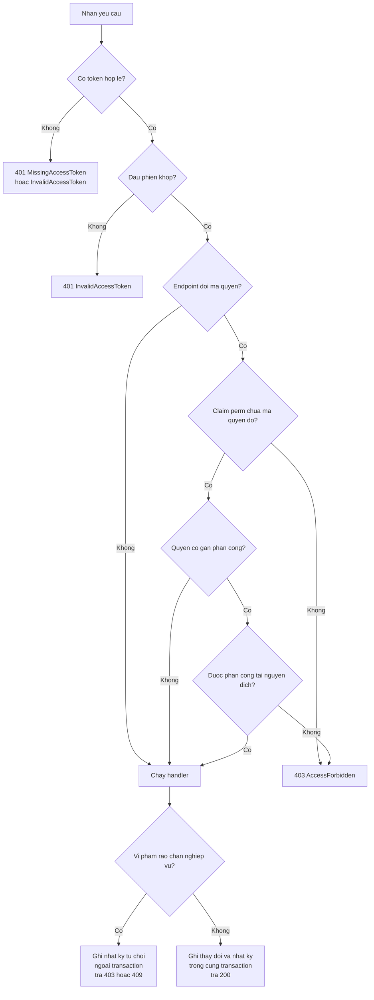
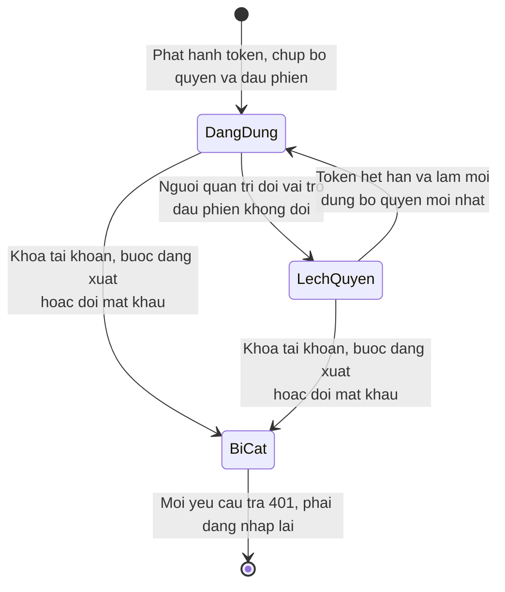

<!-- HƯỚNG DẪN CHO AI KHI ĐIỀN HOẶC CHỈNH SỬA MẪU
- Đọc toàn bộ mẫu, các comment hướng dẫn và tài liệu nguồn được cung cấp trước khi viết. Tuân thủ các quy tắc nghiệp vụ, điều kiện, ngoại lệ và giới hạn đã được xác nhận.
- Không bịa, tự chế hoặc suy đoán thành sự thật: yêu cầu, quy tắc, số liệu, API, schema, mã lỗi, nguồn tham khảo, người phụ trách và kết quả kiểm thử phải có căn cứ. Nội dung ví dụ trong mẫu không phải dữ kiện của dự án.
- Khi thiếu thông tin hoặc các nguồn mâu thuẫn, hỏi người dùng để làm rõ; giữ nguyên placeholder ở phần chưa xác định. Không tự chọn đáp án, lấp chỗ trống hay tuyên bố tài liệu đã hoàn tất.
- Chỉ thay nội dung cần điền hoặc được yêu cầu sửa. Không tự mở rộng phạm vi, sửa nghĩa quy tắc, bỏ điều kiện/ngoại lệ, xoá hay ghi đè nội dung hợp lệ đã có.
- Giữ nguyên tên, cấp và thứ tự heading, nhãn in đậm, tiền tố bullet, cấu trúc danh sách, tên/thứ tự/số cột bảng và cú pháp code fence. Không dịch, đổi tên, gộp hoặc thêm mục ngoài cấu trúc mẫu.
- Chỉ lặp khối luồng, AC hoặc API theo đúng khuôn khi có căn cứ; chỉ bỏ phần tuỳ chọn khi hướng dẫn riêng của mẫu cho phép và đã xác định không áp dụng.
- Mã tham chiếu và section phải trỏ tới tài liệu có thật đã được cung cấp hoặc kiểm chứng. Không giữ mã ví dụ như tham chiếu thật và không tự tạo tài liệu liên quan để hợp thức hoá liên kết.
- Giữ các comment hướng dẫn trong file. Xuất Markdown UTF-8, mỗi file một tài liệu; không bọc toàn bộ file trong code fence, không chèn lời dẫn hay giải thích ngoài mẫu.
- Trước khi bàn giao, đối chiếu nội dung với nguồn, kiểm tra cấu trúc, giá trị cho phép, giới hạn độ dài và tính nhất quán của mã/tham chiếu. Báo rõ phần chưa đủ thông tin; không tuyên bố đã chạy test hoặc import khi chưa thực hiện.
-->

<!-- Thay mã TDD-001 và nội dung ví dụ; giữ nguyên heading và nhãn in đậm.
Sơ đồ dùng mermaid, plantuml hoặc URL. Giữ heading Architecture, Sequence Diagram, Activity Diagram, State Diagram, Data Model.
Ví dụ API phải có heading trùng METHOD /path trong Endpoints. Xoá phần API/sơ đồ không dùng.
Version, Updated At và Change Log do lịch sử phiên bản quản lý, để trống khi nhập mới.
Author/Reviewer là tên hiển thị; gán tài khoản, phê duyệt, giả định và câu hỏi mở trên giao diện sau import.
Thiết kế phải truy vết về Story và Business Rule được cung cấp. Phân biệt thiết kế đề xuất với implementation đã kiểm chứng; không mô tả API/schema/sơ đồ ví dụ như hệ thống thật hoặc tự quyết định nghiệp vụ còn thiếu.
BẮT BUỘC KHI HOÀN THIỆN MẪU: phải có cả Reviewer và Approver, mỗi tên 1–200 ký tự sau khi bỏ khoảng trắng đầu/cuối. Không xoá hai dòng metadata, để trống, dùng tên bịa hoặc giữ placeholder rồi coi là hoàn tất.
Nếu chưa biết người review hoặc người phê duyệt, phải hỏi người dùng và báo tài liệu chưa đủ thông tin; không tự lấy Author/Owner làm người thay thế. Tên trong file không tự gán tài khoản hoặc xác nhận đã duyệt; gán thành viên trên giao diện sau import.
Đây là yêu cầu hoàn thiện mẫu; backend hiện vẫn nhận file cũ thiếu hai trường để tương thích.

VALIDATION CHO FILE NHẬP (đối chiếu ImportSnapshotValidator, MarkdownParser và ImportService):
- Mỗi file .md UTF-8 không rỗng chỉ có một heading cấp 1 chứa mã tài liệu dài 1–100 ký tự. Mã không được trùng trong cùng lần nhập hoặc thuộc loại tài liệu khác đã tồn tại.
- Không dùng tên README.md hoặc sitemap.md vì importer bỏ qua. Giao diện nhận .md/.zip, tối đa 2.000 file, tổng file tải lên 31 MiB; API giới hạn request 32 MiB và tổng nội dung đọc/giải nén 64 MiB.
- Chỉ nhập đè tài liệu cùng loại đang Draft, chưa có phiên bản và chưa lưu trữ. Import thay toàn bộ nội dung bản nháp, vì vậy phải giữ lại nội dung hợp lệ ngoài phần được yêu cầu sửa.
- Không dùng Status trong Markdown hoặc tên Approver để tự xác nhận phê duyệt; import không cấp quyền hay gán tài khoản từ tên. Chạy Kiểm tra file và xử lý lỗi/cảnh báo trước khi nhập.
- Giới hạn độ dài bên dưới tính theo string.Length của .NET (đơn vị UTF-16); không tự cắt ngắn dữ kiện quan trọng để vượt validation, hãy viết lại có căn cứ hoặc hỏi người dùng.
- Feature tối đa 300 ký tự và được dùng làm tiêu đề tài liệu. Status được parser nhận: Draft / In Review / Approved / Deprecated; tài liệu nhập mới vẫn có trạng thái phê duyệt Draft.
- Endpoint: đường dẫn tối đa 500 ký tự; tên/mô tả endpoint được lưu trong Name tối đa 300. HTTP method: GET / POST / PUT / PATCH / DELETE / HEAD / OPTIONS.
- Error Codes: mã tối đa 100 ký tự, không trùng trong tài liệu; giữ dạng - **CODE** (400): mô tả. HTTP status trong Error Codes và Response phải là số nguyên đọc được bằng Int32; không tự đặt status khác hợp đồng API.
- URL sơ đồ tối đa 1.000 ký tự. Mục sơ đồ được sử dụng phải có khối mermaid/plantuml hoặc URL theo mẫu; không để một mục sơ đồ rỗng. Nhãn mục được tách từ bullet như tên External API Fields tối đa 300 ký tự.
- Heading Examples phải khớp METHOD /path ở Endpoints. Giữ các nhãn Request:, Response 200: (thay mã theo contract) và Error Response: để parser tách đúng dữ liệu.
- Tham chiếu dạng DOC-KEY/section: ghi chú: mã đích tối đa 100 ký tự, section tối đa 100, ghi chú tối đa 1.000. Không trùng bộ mã đích + section + loại liên kết trong cùng tài liệu.
ĐỐI CHIẾU FORM TDD (src/features/tdds/validations.ts; form có thể chặt hơn import):
- Điền Feature, Author, Reviewer, Problem và ít nhất một Goal; các Goal/Non-goal/Notes đã thêm không được rỗng. API đã khai báo phải có endpoint và mô tả/mục đích; Fields phải có tên và ý nghĩa; Error Codes phải có mã, HTTP status và điều kiện.
- Form còn kiểm tra Version, Updated At và nội dung Change Log khi khai báo; với file nhập mới, giữ các trường lịch sử này trống theo hợp đồng import, không tự tạo dữ liệu lịch sử.
-->

# TDD-RBAC-001

## Document Info

- **Feature**: Mô hình vai trò – quyền, thực thi phân quyền trên mỗi yêu cầu và nhật ký thay đổi quyền
- **Author**: Claude
- **Reviewer**: Tân Trần
- **Approver**: Tân Trần
- **Status**: Draft
- **Version**:
- **Updated At**:

## Context & Goals

### Problem

Backend hiện chỉ có một cột `User.Role` kiểu chuỗi với hai giá trị `User` và `Admin` (`src/bmt-be.domain/entities/User.cs:14`). Mỗi người đúng một vai trò, không có nơi nào lưu quyền chi tiết, và bốn policy khai báo trong `src/bmt-be.api/dependencyInjection/extensions/JwtExtensions.cs:133-147` chưa endpoint nào dùng tới.

Trong khi đó `BR-PAY-005`, `BR-SUB-011`, `BR-SUB-012`, `BR-SUB-023`, `BR-SUB-024` và `BR-SUB-025` đều đã chốt các thao tác chỉ dành cho "nhân viên có quyền riêng" mà chưa có mô hình để thực hiện. `STORY-RBAC-001` và `STORY-RBAC-004` chốt mô hình RBAC chuẩn: người dùng giữ nhiều vai trò, vai trò chứa quyền, và mọi yêu cầu đều được kiểm ở server.

Hai chỗ trong mã hiện tại cản trở việc nhúng quyền vào token và đã được xác minh:

- `JwtExtensions.cs:65-67` — `OnTokenValidated` là no-op có chủ đích, nên access token chỉ được kiểm chữ ký và hạn. Không có bất kỳ kiểm tra nào mỗi request, nên khóa tài khoản không cắt được token đã cấp.
- `GetTokenQueryHandler.cs:44-50` — mỗi lần làm mới token, hệ thống đọc claim từ access token cũ rồi phát hành lại nguyên si. Nếu nhúng quyền vào token mà giữ cách này, bộ quyền cũ sẽ sống mãi qua mọi lần refresh.

### Goals

- Lưu vai trò và quyền theo mô hình `User` → `UserRole` → `Role` → `RolePermission` → `Permission`, cho phép một người giữ nhiều vai trò và quyền là hợp các vai trò đó.
- Nhúng bộ quyền vào access token để việc kiểm quyền thông thường không cần truy vấn database, đồng thời vẫn cắt được phiên ngay khi khóa tài khoản.
- Kiểm quyền ở server cho mọi yêu cầu, gồm cả yêu cầu gọi thẳng API; thiếu quyền trả 403.
- Ghi nhật ký mọi thay đổi vai trò, quyền và phân công, gồm cả các yêu cầu bị rào chắn từ chối.

### Non-goals

- Vòng đời tài khoản nhân viên, tạo tài khoản kèm mật khẩu sinh tự động, khóa và mở khóa. Xem [TDD-RBAC-002](TDD-RBAC-002.md).
- Cơ chế phân công tài nguyên và điều kiện "sửa hẹp". Xem [TDD-RBAC-003](TDD-RBAC-003.md).
- Vai trò lồng nhau, vai trò kế thừa quyền của vai trò khác và quyền tới từng trường dữ liệu.
- Màn hình quản trị. Tài liệu này chỉ mô tả hợp đồng API và mô hình dữ liệu.

## Architecture

Phân quyền được tách thành ba chặng, mỗi chặng trả lời đúng một câu hỏi. Tách như vậy để chặng rẻ nhất chạy trước và chỉ chặng thật sự cần dữ liệu mới chạm database.

| Chặng | Câu hỏi | Nơi thực hiện | Chi phí mỗi yêu cầu |
|---|---|---|---|
| 1. Phiên còn hiệu lực không | Token này có bị cắt sau khi cấp không | `OnTokenValidated` trong `JwtExtensions` | Một lần đọc Redis, khi Redis trống thì đọc `User` |
| 2. Có quyền không | Người gọi có mã quyền mà endpoint đòi không | Policy của ASP.NET Core gắn ở Carter endpoint | Không truy vấn, đọc claim trong token |
| 3. Có được phân công không | Người gọi có phụ trách đúng tài nguyên đích không | Handler, qua dịch vụ ở [TDD-RBAC-003](TDD-RBAC-003.md) | Một truy vấn `Assignment`, chỉ với quyền có gắn phân công |



### Bộ quyền nhúng trong token

Access token mang sẵn danh sách mã quyền của người gọi, nên chặng 2 không cần truy vấn gì. Khi đăng nhập hoặc làm mới token, hệ thống đọc các vai trò của người đó, gộp quyền của những vai trò này rồi ghi vào token dưới dạng nhiều claim `perm`, mỗi claim một mã.

Ví dụ một nhân viên giữ hai vai trò, một vai trò có `commerce.read`, một vai trò có `package.cancel` và `package.restore`, thì token mang ba claim `perm` là ba mã đó. Một mã xuất hiện ở cả hai vai trò vẫn chỉ ghi một lần, đúng nghĩa "hợp các quyền" của `BR-RBAC-001`.

Đánh đổi: bộ quyền trong token là ảnh chụp tại lúc phát hành. Thay đổi vai trò sau đó chưa tác động tới phiên đang mở cho tới khi token hết hạn. Đây chính là độ trễ mà `BR-RBAC-009` đã chốt, với hạn access token hiện cấu hình là 15 phút (`AccessTokenExpireMin` trong `src/bmt-be.application/dependencyInjection/options/JwtOption.cs`). Muốn cắt ngay thì dùng buộc đăng xuất ở [TDD-RBAC-002](TDD-RBAC-002.md).

Với chín mã quyền khởi tạo, phần `perm` thêm vào token khoảng vài trăm byte, không đáng kể so với giới hạn header HTTP. Nếu về sau số quyền tăng tới hàng trăm mã thì phải xem lại cách này; mốc cần xem lại chưa được xác định.

### Dấu phiên để cắt token đã cấp

Nhúng quyền vào token có một hệ quả: server không còn nhìn vào database ở mỗi yêu cầu, nên tự nó không biết tài khoản vừa bị khóa. `BR-RBAC-008` lại đòi khóa tài khoản phải chặn được ngay cả token chưa hết hạn.

Dấu phiên (security stamp) giải quyết đúng việc này. Đó là một giá trị ngẫu nhiên lưu ở cột `User.SecurityStamp`, được sao vào token dưới claim `stamp` lúc phát hành. Mỗi yêu cầu, `OnTokenValidated` so claim `stamp` với giá trị hiện tại của tài khoản: khớp thì cho qua, lệch thì từ chối với 401.

Thứ tự khi cắt phiên, thực hiện trong cùng một transaction ở chặng ghi database:

1. Sinh `SecurityStamp` mới cho tài khoản và lưu xuống `User`.
2. Sau khi transaction commit, xóa khóa Redis `auth:stamp:{userId}` và gọi `ISessionTokenStore.RevokeAllForUserAsync` để hủy các refresh token đang sống.

Từ thời điểm đó, mọi access token cũ mang `stamp` cũ đều lệch và bị từ chối. Xóa khóa Redis trước khi lần đọc kế tiếp diễn ra khiến lần đó nạp lại giá trị mới từ `User`.

Việc đọc dấu phiên đi qua Redis để không đặt thêm một truy vấn Postgres lên mọi yêu cầu: khóa `auth:stamp:{userId}` giữ giá trị hiện tại với TTL bằng hạn access token. Redis không có dữ liệu — vì bị xóa, hết TTL hoặc vừa khởi động lại — thì đọc `User.SecurityStamp` rồi ghi lại vào Redis. Nhờ vậy Redis chỉ là lớp đệm; mất Redis làm chậm chứ không làm sai, và không có cửa sổ nào token bị cắt lại được chấp nhận trở lại.

Giới hạn cần biết: cách này thêm một lần đọc Redis vào mọi yêu cầu đã đăng nhập, và làm Redis thành phụ thuộc của đường xác thực chứ không chỉ của luồng làm mới token như hiện nay. Đổi lại, nó cho phép giữ quyền trong token mà vẫn cắt phiên tức thì.

Dấu phiên chỉ đổi khi khóa tài khoản, buộc đăng xuất và đổi mật khẩu. Gán hoặc thu hồi vai trò **không** đổi dấu phiên, để độ trễ của thay đổi quyền đúng bằng hạn token như `BR-RBAC-009` đã chốt, thay vì vô tình biến mọi thay đổi vai trò thành cắt phiên.

### Phát hành lại claim khi làm mới token

`GetTokenQueryHandler.cs:44-50` hiện đọc claim từ access token cũ rồi phát hành lại y nguyên. Với thiết kế này, cách đó phải đổi: mỗi lần làm mới token, hệ thống chỉ lấy `UserId` từ token cũ, còn `perm`, `role` và `stamp` phải dựng lại từ database. Nếu giữ nguyên cách cũ, bộ quyền tại thời điểm đăng nhập sẽ sống mãi qua mọi lần refresh và `BR-RBAC-009` điểm 2 không bao giờ đúng.

Các claim khác đang phát hành ở `GetLoginQueryHandler.cs:65-86` giữ nguyên ý nghĩa. Claim `Role` dạng chuỗi đơn và `ClaimTypes.Role` hiện mang đúng một giá trị sẽ thành nhiều giá trị, mỗi vai trò một claim.

### Ghi nhật ký, kể cả khi yêu cầu bị từ chối

`BR-RBAC-012` đòi ghi cả thao tác thành công lẫn yêu cầu bị rào chắn từ chối. Hai loại này không thể ghi giống nhau, vì `TransactionPipelineBehavior` bọc mọi `ICommand` trong một transaction và rollback khi handler ném ngoại lệ. Một dòng nhật ký ghi trong transaction đó sẽ biến mất cùng lúc với thao tác bị từ chối.

Vì vậy `IAccessAuditWriter` có hai đường ghi:

- `RecordAsync` dùng cho thao tác thành công. Dòng nhật ký đi cùng `IUnitOfWork` đang mở, nên thay đổi và nhật ký cùng commit hoặc cùng rollback. Không có trường hợp đổi được vai trò mà không có dấu vết.
- `RecordRejectionAsync` dùng cho yêu cầu bị từ chối. Dòng nhật ký được ghi trên một `DbContext` riêng, ngoài transaction đang chạy, nên rollback của transaction chính không xóa nó.

Ví dụ: người quản trị tự gán thêm vai trò cho chính mình. Handler phát hiện vi phạm `BR-RBAC-004`, gọi `RecordRejectionAsync` với `Outcome = Rejected` và `RejectReasonCode = SelfPrivilegeEscalation`, rồi ném `NotPermissionException`. Transaction chính rollback nên không có dòng `UserRole` nào được tạo, còn dòng nhật ký vẫn nằm lại trong `AccessAuditLog`.

Giới hạn: vì hai đường ghi dùng hai kết nối, một dòng nhật ký từ chối vẫn có thể ghi thành công trong khi yêu cầu thất bại vì lý do khác, và ngược lại nếu chính việc ghi nhật ký lỗi thì thao tác từ chối vẫn trả về cho người gọi. Nhật ký ở đây phục vụ tra cứu quản trị, không phải sổ cái giao dịch.

### Nơi từng Business Rule được thực hiện

| Quy tắc | Nơi thực hiện |
|---|---|
| BR-RBAC-001 | Truy vấn gộp quyền khi phát hành token; claim `perm` trong access token |
| BR-RBAC-002 | Kiểm `Role.Kind = System` trong handler sửa, đổi tên và xóa vai trò |
| BR-RBAC-003 | Đếm `UserRole` của vai trò trong handler xóa vai trò |
| BR-RBAC-004 | Kiểm ba rào chắn trong các handler tạo vai trò, sửa quyền vai trò, gán và thu hồi vai trò |
| BR-RBAC-009 | Hạn access token cộng với việc dấu phiên không đổi khi sửa vai trò |
| BR-RBAC-010 | Policy theo mã quyền ở endpoint, cộng kiểm phân công trong handler theo [TDD-RBAC-003](TDD-RBAC-003.md) |
| BR-RBAC-011 | Policy ở endpoint, `OnTokenValidated`, và `ExceptionHandlingMiddleware` ánh xạ `NotPermissionException` sang 403 |
| BR-RBAC-012 | `IAccessAuditWriter` với hai đường ghi |

**Notes**:
- Dùng policy của ASP.NET Core thay vì thêm một pipeline behavior của MediatR cho chặng 2, vì Carter endpoint đã quen với `RequireAuthorization(tên policy)` (`src/bmt-be.presentation/apis/user/UserApi.cs:33-40`) và vì quyền cần biết trước khi MediatR chạy. Chặng 3 thì ngược lại, phải nằm trong handler vì chỉ ở đó mới biết tài nguyên đích.
- `RoleNames` hiện trộn tên vai trò với tên policy (`src/bmt-be.contract/constants/RoleNames.cs:3-9`). Thiết kế này tách thành `RoleCodes` cho mã vai trò, `PolicyNames` cho tên policy xác thực sẵn có, và `PermissionNames` cho chín mã quyền.
- Danh mục quyền lấy code làm nguồn sự thật, vì mỗi mã quyền phải có chỗ kiểm trong code mới có tác dụng. Bảng `Permission` là bản sao được migration seed lại, phục vụ khóa ngoại và nhãn hiển thị. Rủi ro lệch giữa code và bảng được xử lý bằng một kiểm tra lúc khởi động, nêu ở Data Model/Notes.
- Không tự khôi phục outbox, MassTransit hay Quartz; các thành phần này đã bị gỡ khỏi mã nguồn và thiết kế này không cần tới chúng.

## Sequence Diagram

Một yêu cầu thay đổi dữ liệu do nhân viên gửi, đi hết ba chặng kiểm tra rồi ghi nhật ký.



## Activity Diagram

Thứ tự kiểm tra cho một yêu cầu bất kỳ, gồm cả nhánh quyền có gắn phân công.



## State Diagram

Vòng đời hiệu lực của bộ quyền mà một phiên đang dùng. Sơ đồ này diễn đạt đúng độ trễ mà `BR-RBAC-009` chốt.



Ở trạng thái `LechQuyen`, phiên vẫn dùng bộ quyền cũ. Đây là hành vi đã chốt, không phải lỗi. Người quản trị muốn bỏ qua trạng thái này thì buộc đăng xuất để chuyển thẳng sang `BiCat`.

## Data Model

Năm bảng mới và một bảng được sửa. Mô tả dưới đây nêu mỗi bảng lưu việc gì và một dòng đại diện cho gì, trước khi liệt kê cột.

### `Permission` — danh mục mã quyền

Một dòng là **một mã quyền mà hệ thống biết kiểm tra**, ví dụ `package.cancel`. Bảng này không quyết định ai có quyền; nó chỉ cho biết những mã quyền nào tồn tại, hiển thị bằng nhãn gì, và mã nào cần thêm điều kiện phân công.

Dòng chỉ được tạo hoặc sửa bởi migration, không có API nào ghi vào bảng này. Nguồn sự thật là hằng số trong code; bảng là bản sao để `RolePermission` có khóa ngoại chặn mã sai và để giao diện đọc nhãn tiếng Việt mà không phải hardcode.

| Cột | Kiểu | Ràng buộc | Ý nghĩa |
|---|---|---|---|
| `Code` | varchar(64) | PK | Mã quyền, ví dụ `commerce.read` |
| `Label` | varchar(200) | NOT NULL | Nhãn tiếng Việt hiển thị trên màn hình quản trị |
| `Description` | text | NULL | Giải thích dài hơn, để trống khi nhãn đã đủ rõ |
| `RequiresAssignment` | boolean | NOT NULL | `true` nghĩa là còn cần điều kiện phân công theo `BR-RBAC-010` |

### `Role` — vai trò

Một dòng là **một vai trò có thể gán cho người dùng**. Vai trò hệ thống do migration tạo và không sửa được; vai trò nhân viên do người có quyền `role.manage` tạo qua API.

| Cột | Kiểu | Ràng buộc | Ý nghĩa |
|---|---|---|---|
| `Id` | uuid | PK | |
| `Code` | varchar(64) | UNIQUE, NULL | Mã ổn định, chỉ đặt cho vai trò hệ thống: `admin`, `customer`. Vai trò tự tạo để NULL vì code không tham chiếu tới chúng |
| `Name` | varchar(200) | UNIQUE, NOT NULL | Tên hiển thị. Duy nhất để thực hiện `STORY-RBAC-001/EXC-04` |
| `Kind` | varchar(20) | NOT NULL | `System` hoặc `Custom`. `System` chặn mọi thao tác sửa, đổi tên và xóa theo `BR-RBAC-002` |
| `CreatedAtUtc` | timestamptz | NOT NULL | |
| `CreatedBy` | uuid | FK `User(Id)`, NULL | NULL với hai vai trò hệ thống do migration tạo, vì lúc đó chưa có người thao tác |

### `RolePermission` — quyền của một vai trò

Một dòng là **một mã quyền được gắn vào một vai trò**. Bỏ quyền khỏi vai trò là xóa dòng, không có cột trạng thái, vì lịch sử đã nằm ở `AccessAuditLog`.

| Cột | Kiểu | Ràng buộc | Ý nghĩa |
|---|---|---|---|
| `RoleId` | uuid | PK, FK `Role(Id)` ON DELETE CASCADE | |
| `PermissionCode` | varchar(64) | PK, FK `Permission(Code)` ON DELETE RESTRICT | |

`CASCADE` phía `Role` cho phép xóa vai trò mà không phải dọn tay; xóa vai trò chỉ xảy ra khi đã không còn ai giữ theo `BR-RBAC-003`. `RESTRICT` phía `Permission` giữ cho một mã quyền đang được vai trò dùng không bị migration gỡ mất.

### `UserRole` — ai giữ vai trò nào

Một dòng là **một lần một người đang giữ một vai trò**. Thu hồi vai trò là xóa dòng. Quyền thực tế của một người là hợp quyền của các vai trò trong bảng này, đúng `BR-RBAC-001`.

| Cột | Kiểu | Ràng buộc | Ý nghĩa |
|---|---|---|---|
| `UserId` | uuid | PK, FK `User(Id)` ON DELETE CASCADE | |
| `RoleId` | uuid | PK, FK `Role(Id)` ON DELETE RESTRICT | |
| `GrantedAtUtc` | timestamptz | NOT NULL | |
| `GrantedBy` | uuid | FK `User(Id)`, NULL | NULL với các dòng do migration backfill từ cột `User.Role` cũ |

`RESTRICT` phía `Role` là cách database tự chặn việc xóa vai trò đang có người giữ, cùng hướng với kiểm tra trong handler.

### `AccessAuditLog` — nhật ký thay đổi quyền

Một dòng là **một lần thao tác liên quan tới vai trò, quyền hoặc phân công**, kể cả lần bị từ chối. Chỉ ghi thêm, không sửa và không xóa theo `BR-RBAC-012`.

| Cột | Kiểu | Ràng buộc | Ý nghĩa |
|---|---|---|---|
| `Id` | uuid | PK | |
| `ActorUserId` | uuid | FK `User(Id)`, NOT NULL | Người thao tác |
| `Action` | varchar(64) | NOT NULL | `RoleCreated`, `RoleUpdated`, `RoleDeleted`, `RoleGranted`, `RoleRevoked`, `StaffInvited`, `StaffActivated`, `StaffLocked`, `StaffUnlocked`, `StaffForceLoggedOut`, `AssignmentCreated`, `AssignmentTransferred`, `AssignmentEnded` |
| `TargetType` | varchar(32) | NOT NULL | `Role`, `User` hoặc `Assignment` |
| `TargetId` | uuid | NULL | NULL khi đối tượng chưa kịp tạo, ví dụ tạo vai trò bị từ chối |
| `TargetLabel` | varchar(200) | NOT NULL | Ảnh chụp tên đối tượng lúc thao tác. Nhờ cột này, nhật ký vẫn đọc được tên vai trò sau khi vai trò bị xóa, đúng `STORY-RBAC-001/AC-006` |
| `Outcome` | varchar(16) | NOT NULL | `Succeeded` hoặc `Rejected` |
| `RejectReasonCode` | varchar(64) | NULL | NULL khi `Outcome = Succeeded` |
| `BeforeJson` | jsonb | NULL | Trạng thái trước. NULL khi đối tượng vừa được tạo |
| `AfterJson` | jsonb | NULL | Trạng thái sau. NULL khi đối tượng bị xóa hoặc khi thao tác bị từ chối |
| `OccurredAtUtc` | timestamptz | NOT NULL | |

`TargetLabel` là dữ liệu chép lại chứ không phải khóa ngoại. Cố tình chấp nhận trùng lặp ở đây, vì mục đích là giữ nguyên tên tại thời điểm thao tác kể cả khi vai trò đã bị xóa hoặc đổi tên.

### `User` — bảng sẵn có, được sửa

Bảng này đã tồn tại (`src/bmt-be.persistence/configurations/UserConfiguration.cs`). Thiết kế thêm ba cột và bỏ một cột.

| Thay đổi | Cột | Kiểu | Ý nghĩa |
|---|---|---|---|
| Thêm | `AccountKind` | varchar(20) NOT NULL | `Customer` hoặc `Staff`, thực hiện việc tách hẳn hai loại tài khoản của `BR-RBAC-005` |
| Thêm | `Status` | varchar(20) NOT NULL | `Active` hoặc `Locked`. Ý nghĩa chuyển trạng thái xem [TDD-RBAC-002](TDD-RBAC-002.md) |
| Thêm | `MustChangePassword` | boolean NOT NULL, mặc định `false` | `true` khi tài khoản còn dùng mật khẩu do người khác biết. Định nghĩa và vòng đời xem [TDD-RBAC-002](TDD-RBAC-002.md#data-model) |
| Thêm | `SecurityStamp` | uuid NOT NULL | Dấu phiên, đổi khi khóa tài khoản, buộc đăng xuất và đổi mật khẩu |
| Bỏ | `Role` | varchar(50) | Thay bằng `UserRole` để một người giữ được nhiều vai trò |

### Sơ đồ quan hệ

```mermaid
erDiagram
    User {
        uuid Id PK
        varchar Email UK
        varchar AccountKind "Customer hoac Staff"
        varchar Status "Active hoac Locked"
        boolean MustChangePassword "true khi chua doi mat khau lan dau"
        uuid SecurityStamp "dau phien"
    }
    Role {
        uuid Id PK
        varchar Code UK "NULL voi vai tro tu tao"
        varchar Name UK
        varchar Kind "System hoac Custom"
        uuid CreatedBy FK "NULL voi vai tro he thong"
    }
    Permission {
        varchar Code PK
        varchar Label
        boolean RequiresAssignment
    }
    RolePermission {
        uuid RoleId PK, FK
        varchar PermissionCode PK, FK
    }
    UserRole {
        uuid UserId PK, FK
        uuid RoleId PK, FK
        timestamptz GrantedAtUtc
        uuid GrantedBy FK "NULL khi backfill"
    }
    AccessAuditLog {
        uuid Id PK
        uuid ActorUserId FK
        varchar Action
        varchar TargetType
        uuid TargetId "NULL khi chua tao duoc doi tuong"
        varchar TargetLabel "anh chup ten"
        varchar Outcome
        varchar RejectReasonCode "NULL khi thanh cong"
    }
    User ||--o{ UserRole : "giu"
    Role ||--o{ UserRole : "duoc giu boi"
    Role ||--o{ RolePermission : "gom"
    Permission ||--o{ RolePermission : "duoc gan vao"
    User ||--o{ Role : "tao"
    User ||--o{ AccessAuditLog : "thao tac"
```



### Dữ liệu mẫu

Toàn bộ mẫu dưới đây là **dữ liệu giả định để giải thích thiết kế**, không phải dữ liệu thật và không phải kết quả đã ghi database. ID viết dạng bí danh cho dễ đọc; bản ghi thật dùng uuid đầy đủ. Các cột không liên quan được lược bớt. Thời gian ghi theo UTC.

Tình huống xuyên suốt: chị Lan là người quản trị đang giữ vai trò Admin. Chị tạo vai trò "Nhân viên vận hành gói" rồi gán cho anh Nam.

Sau khi migration chạy, `Permission` có chín dòng. Trích ba dòng:

| Code | Label | RequiresAssignment |
|---|---|---|
| `commerce.read` | Tra cứu người mua, đơn và giao dịch | false |
| `package.cancel` | Hủy hiệu lực gói | false |
| `supervision.complete` | Hoàn thành và mở lại gói giám sát | true |

`Role` sau migration có hai vai trò hệ thống, rồi thêm một dòng khi chị Lan tạo vai trò mới:

| Id | Code | Name | Kind | CreatedBy |
|---|---|---|---|---|
| `role-admin` | `admin` | Quản trị hệ thống | System | NULL |
| `role-customer` | `customer` | Khách hàng | System | NULL |
| `role-ops` | NULL | Nhân viên vận hành gói | Custom | `user-lan` |

`RolePermission` của vai trò vừa tạo, đúng hai quyền chị Lan chọn:

| RoleId | PermissionCode |
|---|---|
| `role-ops` | `package.cancel` |
| `role-ops` | `package.restore` |

`UserRole` sau khi chị Lan gán vai trò cho anh Nam. Anh Nam đã giữ sẵn vai trò "Nhân viên tra cứu thanh toán" nên giờ có hai dòng:

| UserId | RoleId | GrantedAtUtc | GrantedBy |
|---|---|---|---|
| `user-nam` | `role-finance` | 2026-09-20T02:10:00Z | `user-lan` |
| `user-nam` | `role-ops` | 2026-09-21T03:05:00Z | `user-lan` |

Bộ quyền của anh Nam lúc này là hợp quyền hai vai trò: `commerce.read`, `package.cancel`, `package.restore`. Đây là **giá trị tính khi đọc**, không có cột nào lưu sẵn. Lần đăng nhập kế tiếp, access token của anh Nam mang ba claim `perm` tương ứng.

`AccessAuditLog` sau chuỗi thao tác trên, hai dòng thành công:

| Id | ActorUserId | Action | TargetType | TargetId | TargetLabel | Outcome | BeforeJson | AfterJson |
|---|---|---|---|---|---|---|---|---|
| `log-1` | `user-lan` | RoleCreated | Role | `role-ops` | Nhân viên vận hành gói | Succeeded | NULL | `{"name":"Nhân viên vận hành gói","permissions":["package.cancel","package.restore"]}` |
| `log-2` | `user-lan` | RoleGranted | User | `user-nam` | Nguyễn Văn Nam | Succeeded | `{"roles":["role-finance"]}` | `{"roles":["role-finance","role-ops"]}` |

Giả sử tiếp: chị Lan không có quyền `audit.read`, nhưng thử đưa `audit.read` vào vai trò `role-ops`. Yêu cầu vi phạm `BR-RBAC-004` nên bị từ chối. Transaction chính rollback, `RolePermission` không đổi, còn `AccessAuditLog` vẫn có thêm một dòng nhờ đường ghi riêng:

| Id | ActorUserId | Action | TargetType | TargetId | TargetLabel | Outcome | RejectReasonCode | AfterJson |
|---|---|---|---|---|---|---|---|---|
| `log-3` | `user-lan` | RoleUpdated | Role | `role-ops` | Nhân viên vận hành gói | Rejected | `PermissionNotHeldByActor` | NULL |

Sau đó chị Lan xóa vai trò `role-ops` khi không còn ai giữ. Dòng `Role` biến mất, nhưng cả ba dòng nhật ký trên vẫn đọc được tên "Nhân viên vận hành gói" nhờ `TargetLabel`.

**Notes**:

- **Index**: `UserRole` có PK ghép `(UserId, RoleId)` phục vụ truy vấn gộp quyền theo người; thêm index `(RoleId)` để đếm nhanh số người giữ một vai trò khi kiểm `BR-RBAC-003`. `AccessAuditLog` thêm index `(OccurredAtUtc DESC)` và `(ActorUserId, OccurredAtUtc DESC)` theo đúng hai bộ lọc mà `STORY-RBAC-004/ALT-03` mô tả; thêm `(TargetType, TargetId, OccurredAtUtc DESC)` cho việc tra theo đối tượng. Không thêm index cho cột chưa có truy vấn dùng tới.
- **Truy vấn gộp quyền** chạy đúng một lần mỗi khi phát hành token, không phải mỗi request: nối `UserRole` với `RolePermission` rồi lấy các `PermissionCode` khác nhau. Với một người giữ vài vai trò, đây là một truy vấn dùng PK, không cần index thêm.
- **Chặn lệch giữa code và bảng `Permission`**: lúc khởi động, ứng dụng đối chiếu danh sách mã trong `PermissionNames` với bảng `Permission`. Có mã trong bảng mà code không biết, hoặc ngược lại, thì ghi log mức cảnh báo và từ chối khởi động. Làm vậy để không rơi vào tình huống một vai trò mang mã quyền mà không chỗ nào kiểm, tức là quyền tồn tại trên giấy nhưng không có tác dụng.
- **Migration**: đây sẽ là migration đầu tiên có mặt trong repo, vì `src/bmt-be.persistence/Migrations/` hiện chưa tồn tại. Thứ tự: tạo `Permission` và seed chín dòng; tạo `Role` và seed hai vai trò hệ thống; seed `RolePermission` cho vai trò `admin` gồm cả chín quyền và cho `customer` không quyền nào; thêm bốn cột mới vào `User` với giá trị mặc định (`AccountKind = 'Customer'`, `Status = 'Active'`, `MustChangePassword = false`, `SecurityStamp = gen_random_uuid()`); backfill `UserRole` từ cột `Role` cũ, ánh xạ `'Admin'` sang `role-admin` và `'User'` sang `role-customer`, đồng thời đặt `AccountKind = 'Staff'` cho các dòng `Role = 'Admin'`; cuối cùng mới bỏ cột `Role`.
- **Dữ liệu cũ**: nếu database đang chạy còn trống thì bước backfill không tạo dòng nào và migration vẫn đúng. Nếu đã có tài khoản, mỗi tài khoản nhận đúng một dòng `UserRole` nên không ai mất quyền. Phải chạy backfill trước khi bỏ cột `Role`, vì bỏ trước sẽ mất nguồn dữ liệu và không khôi phục được. Không áp dụng migration ở bước thiết kế này.
- **`IUnitOfWork` hiện chỉ expose `UserRepository`** (`src/bmt-be.domain/abstractions/repositories/IUnitOfWork.cs`). Thêm các repository mới cho `Role`, `RolePermission`, `UserRole` và `AccessAuditLog` đòi sửa interface này, kéo theo mọi nơi hiện thực. Đây là thay đổi dự kiến, chưa có trong mã nguồn.

## Internal API

Các đường dẫn dưới đây là **hợp đồng đề xuất**, chưa có trong mã nguồn. Route theo quy ước `/api/v{version:apiVersion}/...` với `NewVersionedApi` và `HasApiVersion(1)` như `UserApi.cs:22-27`.

### Endpoints

- **GET** `/api/v1/permissions` — Danh mục mã quyền kèm nhãn và cờ cần phân công. Cần quyền `role.manage`.
- **GET** `/api/v1/roles` — Danh sách vai trò kèm loại, số người đang giữ và danh sách quyền. Cần quyền `role.manage`.
- **GET** `/api/v1/roles/{roleId}` — Chi tiết một vai trò. Cần quyền `role.manage`.
- **POST** `/api/v1/roles` — Tạo vai trò mới. Cần quyền `role.manage`.
- **PUT** `/api/v1/roles/{roleId}` — Đổi tên và đặt lại danh sách quyền của vai trò tự tạo. Cần quyền `role.manage`.
- **DELETE** `/api/v1/roles/{roleId}` — Xóa vai trò tự tạo không còn ai giữ. Cần quyền `role.manage`.
- **GET** `/api/v1/access-audit` — Tra cứu nhật ký, lọc theo `actorUserId`, `targetType`, `targetId`, `fromUtc`, `toUtc`, có phân trang. Cần quyền `audit.read`.

### Examples

#### POST /api/v1/roles

```
Request:
{"name": "Nhân viên vận hành gói", "permissions": ["package.cancel", "package.restore"]}

Response 201:
{"id": "role-ops", "name": "Nhân viên vận hành gói", "kind": "Custom", "permissions": ["package.cancel", "package.restore"], "memberCount": 0}

Error Response:
{"code": "PermissionNotHeldByActor", "detail": "Không cấp được quyền mà bạn không có: audit.read"}
```

#### PUT /api/v1/roles/{roleId}

```
Request:
{"name": "Nhân viên vận hành gói", "permissions": ["package.cancel"]}

Response 200:
{"id": "role-ops", "name": "Nhân viên vận hành gói", "kind": "Custom", "permissions": ["package.cancel"], "memberCount": 2, "effectiveWithinMinutes": 15}

Error Response:
{"code": "RoleIsSystem", "detail": "Vai trò hệ thống không sửa được"}
```

`effectiveWithinMinutes` trả về hạn access token đang cấu hình, để giao diện hiển thị cảnh báo thay đổi chưa có hiệu lực ngay theo `STORY-RBAC-001/AC-005`. Đây là giá trị đọc từ cấu hình, không phải cột trong database.

#### DELETE /api/v1/roles/{roleId}

```
Response 204:

Error Response:
{"code": "RoleInUse", "detail": "Còn 3 người đang giữ vai trò này", "memberCount": 3}
```

#### GET /api/v1/access-audit

```
Response 200:
{"items": [{"id": "log-2", "actorUserId": "user-lan", "actorName": "Trần Thị Lan", "action": "RoleGranted", "targetType": "User", "targetId": "user-nam", "targetLabel": "Nguyễn Văn Nam", "outcome": "Succeeded", "rejectReasonCode": null, "occurredAtUtc": "2026-09-21T03:05:00Z"}], "pageIndex": 1, "pageSize": 20, "totalCount": 137}
```

### Error Codes

- **MissingAccessToken** (401): Yêu cầu không kèm token và cũng không có cookie `accessToken`.
- **InvalidAccessToken** (401): Token sai chữ ký, hoặc dấu phiên trong token lệch với dấu phiên hiện tại của tài khoản.
- **ExpiredAccessToken** (401): Token hết hạn.
- **AccessForbidden** (403): Thiếu mã quyền mà endpoint đòi, hoặc thiếu phân công với quyền có gắn phân công.
- **PermissionNotHeldByActor** (403): Người thao tác định cấp một quyền mà bản thân không có.
- **SelfPrivilegeEscalation** (403): Người thao tác tự nâng quyền cho chính mình.
- **RoleIsSystem** (409): Yêu cầu sửa, đổi tên hoặc xóa vai trò hệ thống.
- **RoleInUse** (409): Yêu cầu xóa vai trò đang có người giữ.
- **RoleNameDuplicated** (409): Tên vai trò trùng vai trò đang có.
- **PermissionCodeUnknown** (422): Mã quyền gửi lên không có trong danh mục. Kiểm ở validator FluentValidation, nên đi theo nhánh `ValidationException` của `ExceptionHandlingMiddleware` và trả 422 như các lỗi đầu vào khác trong repo.
- **AuditLogImmutable** (409): Yêu cầu sửa hoặc xóa một bản ghi nhật ký.

Ba mã 401 và `AccessForbidden` đã có sẵn trong mã nguồn (`JwtExtensions.cs:68-128`). Các mã còn lại là đề xuất mới, ném bằng các kiểu ngoại lệ miền nghiệp vụ và ánh xạ trong `ExceptionHandlingMiddleware`; `NotPermissionException` hiện đã ánh xạ sang 403 (`ExceptionHandlingMiddleware.cs:66`) nhưng chưa handler nào ném.

Cách ánh xạ bám đúng bảng đã có trong `ExceptionHandlingMiddleware.cs:60-75`, không thêm nhánh mới: `NotPermissionException` cho 403, `BadRequestException` cho 400, `NotFoundException` cho 404, `ValidationException` cho 422. Riêng 409 đã có sẵn nhánh `DbUpdateException` khi vi phạm ràng buộc duy nhất, nên các trường hợp bị index duy nhất có lọc chặn sẽ tự ra 409; các trường hợp 409 do handler chủ động phát hiện cần một kiểu ngoại lệ miền nghiệp vụ mới ánh xạ sang 409, đây là phần bổ sung dự kiến.

## References

### User Stories

- STORY-RBAC-001
- STORY-RBAC-004

### Business Rules

- BR-RBAC-001/Then
- BR-RBAC-002/Then
- BR-RBAC-003/Then
- BR-RBAC-004/Then
- BR-RBAC-009/Then
- BR-RBAC-010/Then
- BR-RBAC-011/Then
- BR-RBAC-012/Then

### Use Cases

### Others

- Tài liệu kỹ thuật: [TDD-RBAC-002](TDD-RBAC-002.md) vòng đời tài khoản nhân viên và cắt phiên; [TDD-RBAC-003](TDD-RBAC-003.md) phân công tài nguyên.
- Tài liệu kỹ thuật: [TDD-SUB-005](TDD-SUB-005.md), [TDD-SUB-004](TDD-SUB-004.md) và [TDD-PAY-002](TDD-PAY-002.md) đang dựa trên mô hình gán quyền thẳng cho từng người; ba tài liệu này cần cập nhật sang mô hình vai trò, giữ nguyên bốn mã quyền đã đặt tên.

## Change Log

- 2026-09-20: Bỏ giá trị `PendingActivation` khỏi `User.Status` và thêm cột `User.MustChangePassword`, theo quyết định bỏ luồng mời qua email ở [TDD-RBAC-002](TDD-RBAC-002.md). Mô hình vai trò – quyền, dấu phiên và nhật ký không đổi.
