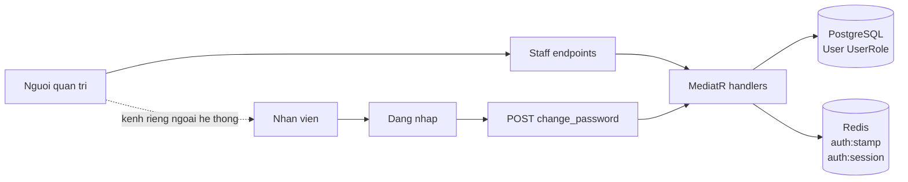
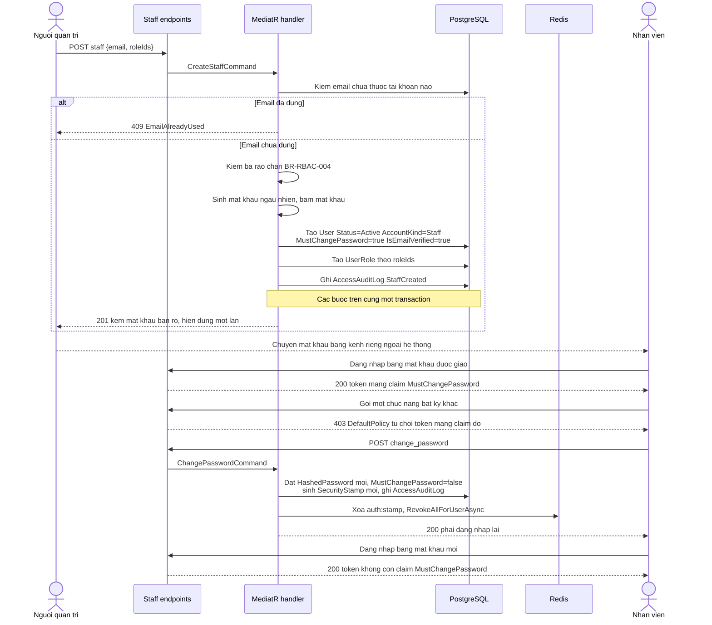
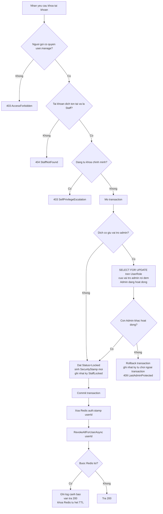
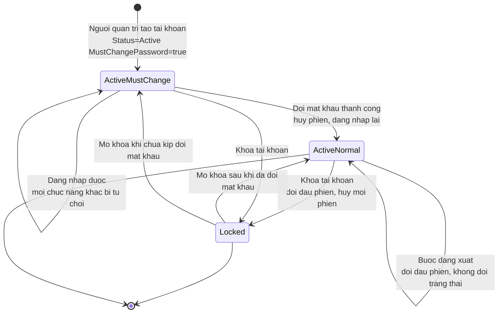
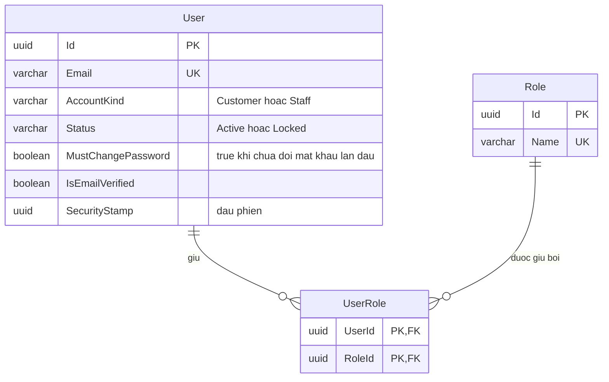

<!-- HƯỚNG DẪN CHO AI KHI ĐIỀN HOẶC CHỈNH SỬA MẪU
- Đọc toàn bộ mẫu, các comment hướng dẫn và tài liệu nguồn được cung cấp trước khi viết. Tuân thủ các quy tắc nghiệp vụ, điều kiện, ngoại lệ và giới hạn đã được xác nhận.
- Không bịa, tự chế hoặc suy đoán thành sự thật: yêu cầu, quy tắc, số liệu, API, schema, mã lỗi, nguồn tham khảo, người phụ trách và kết quả kiểm thử phải có căn cứ. Nội dung ví dụ trong mẫu không phải dữ kiện của dự án.
- Khi thiếu thông tin hoặc các nguồn mâu thuẫn, hỏi người dùng để làm rõ; giữ nguyên placeholder ở phần chưa xác định. Không tự chọn đáp án, lấp chỗ trống hay tuyên bố tài liệu đã hoàn tất.
- Chỉ thay nội dung cần điền hoặc được yêu cầu sửa. Không tự mở rộng phạm vi, sửa nghĩa quy tắc, bỏ điều kiện/ngoại lệ, xoá hay ghi đè nội dung hợp lệ đã có.
- Giữ nguyên tên, cấp và thứ tự heading, nhãn in đậm, tiền tố bullet, cấu trúc danh sách, tên/thứ tự/số cột bảng và cú pháp code fence. Không dịch, đổi tên, gộp hoặc thêm mục ngoài cấu trúc mẫu.
- Chỉ lặp khối luồng, AC hoặc API theo đúng khuôn khi có căn cứ; chỉ bỏ phần tuỳ chọn khi hướng dẫn riêng của mẫu cho phép và đã xác định không áp dụng.
- Mã tham chiếu và section phải trỏ tới tài liệu có thật đã được cung cấp hoặc kiểm chứng. Không giữ mã ví dụ như tham chiếu thật và không tự tạo tài liệu liên quan để hợp thức hoá liên kết.
- Giữ các comment hướng dẫn trong file. Xuất Markdown UTF-8, mỗi file một tài liệu; không bọc toàn bộ file trong code fence, không chèn lời dẫn hay giải thích ngoài mẫu.
- Trước khi bàn giao, đối chiếu nội dung với nguồn, kiểm tra cấu trúc, giá trị cho phép, giới hạn độ dài và tính nhất quán của mã/tham chiếu. Báo rõ phần chưa đủ thông tin; không tuyên bố đã chạy test hoặc import khi chưa thực hiện.
-->

<!-- Thay mã TDD-001 và nội dung ví dụ; giữ nguyên heading và nhãn in đậm.
Sơ đồ dùng mermaid, plantuml hoặc URL. Giữ heading Architecture, Sequence Diagram, Activity Diagram, State Diagram, Data Model.
Ví dụ API phải có heading trùng METHOD /path trong Endpoints. Xoá phần API/sơ đồ không dùng.
Version, Updated At và Change Log do lịch sử phiên bản quản lý, để trống khi nhập mới.
Author/Reviewer là tên hiển thị; gán tài khoản, phê duyệt, giả định và câu hỏi mở trên giao diện sau import.
Thiết kế phải truy vết về Story và Business Rule được cung cấp. Phân biệt thiết kế đề xuất với implementation đã kiểm chứng; không mô tả API/schema/sơ đồ ví dụ như hệ thống thật hoặc tự quyết định nghiệp vụ còn thiếu.
BẮT BUỘC KHI HOÀN THIỆN MẪU: phải có cả Reviewer và Approver, mỗi tên 1–200 ký tự sau khi bỏ khoảng trắng đầu/cuối. Không xoá hai dòng metadata, để trống, dùng tên bịa hoặc giữ placeholder rồi coi là hoàn tất.
Nếu chưa biết người review hoặc người phê duyệt, phải hỏi người dùng và báo tài liệu chưa đủ thông tin; không tự lấy Author/Owner làm người thay thế. Tên trong file không tự gán tài khoản hoặc xác nhận đã duyệt; gán thành viên trên giao diện sau import.
Đây là yêu cầu hoàn thiện mẫu; backend hiện vẫn nhận file cũ thiếu hai trường để tương thích.

VALIDATION CHO FILE NHẬP (đối chiếu ImportSnapshotValidator, MarkdownParser và ImportService):
- Mỗi file .md UTF-8 không rỗng chỉ có một heading cấp 1 chứa mã tài liệu dài 1–100 ký tự. Mã không được trùng trong cùng lần nhập hoặc thuộc loại tài liệu khác đã tồn tại.
- Không dùng tên README.md hoặc sitemap.md vì importer bỏ qua. Giao diện nhận .md/.zip, tối đa 2.000 file, tổng file tải lên 31 MiB; API giới hạn request 32 MiB và tổng nội dung đọc/giải nén 64 MiB.
- Chỉ nhập đè tài liệu cùng loại đang Draft, chưa có phiên bản và chưa lưu trữ. Import thay toàn bộ nội dung bản nháp, vì vậy phải giữ lại nội dung hợp lệ ngoài phần được yêu cầu sửa.
- Không dùng Status trong Markdown hoặc tên Approver để tự xác nhận phê duyệt; import không cấp quyền hay gán tài khoản từ tên. Chạy Kiểm tra file và xử lý lỗi/cảnh báo trước khi nhập.
- Giới hạn độ dài bên dưới tính theo string.Length của .NET (đơn vị UTF-16); không tự cắt ngắn dữ kiện quan trọng để vượt validation, hãy viết lại có căn cứ hoặc hỏi người dùng.
- Feature tối đa 300 ký tự và được dùng làm tiêu đề tài liệu. Status được parser nhận: Draft / In Review / Approved / Deprecated; tài liệu nhập mới vẫn có trạng thái phê duyệt Draft.
- Endpoint: đường dẫn tối đa 500 ký tự; tên/mô tả endpoint được lưu trong Name tối đa 300. HTTP method: GET / POST / PUT / PATCH / DELETE / HEAD / OPTIONS.
- Error Codes: mã tối đa 100 ký tự, không trùng trong tài liệu; giữ dạng - **CODE** (400): mô tả. HTTP status trong Error Codes và Response phải là số nguyên đọc được bằng Int32; không tự đặt status khác hợp đồng API.
- URL sơ đồ tối đa 1.000 ký tự. Mục sơ đồ được sử dụng phải có khối mermaid/plantuml hoặc URL theo mẫu; không để một mục sơ đồ rỗng. Nhãn mục được tách từ bullet như tên External API Fields tối đa 300 ký tự.
- Heading Examples phải khớp METHOD /path ở Endpoints. Giữ các nhãn Request:, Response 200: (thay mã theo contract) và Error Response: để parser tách đúng dữ liệu.
- Tham chiếu dạng DOC-KEY/section: ghi chú: mã đích tối đa 100 ký tự, section tối đa 100, ghi chú tối đa 1.000. Không trùng bộ mã đích + section + loại liên kết trong cùng tài liệu.
ĐỐI CHIẾU FORM TDD (src/features/tdds/validations.ts; form có thể chặt hơn import):
- Điền Feature, Author, Reviewer, Problem và ít nhất một Goal; các Goal/Non-goal/Notes đã thêm không được rỗng. API đã khai báo phải có endpoint và mô tả/mục đích; Fields phải có tên và ý nghĩa; Error Codes phải có mã, HTTP status và điều kiện.
- Form còn kiểm tra Version, Updated At và nội dung Change Log khi khai báo; với file nhập mới, giữ các trường lịch sử này trống theo hợp đồng import, không tự tạo dữ liệu lịch sử.
-->

# TDD-RBAC-002

## Document Info

- **Feature**: Tài khoản nhân viên: tạo kèm mật khẩu sinh tự động, gán và thu hồi vai trò, khóa, mở khóa và buộc đăng xuất
- **Author**: Claude
- **Reviewer**: Tân Trần
- **Approver**: Tân Trần
- **Status**: Draft
- **Version**:
- **Updated At**:

## Context & Goals

### Problem

Hiện không có đường nào tạo tài khoản nhân viên. `RegisterCommandHandler.cs:56` gán cứng chuỗi `"User"` cho mọi tài khoản đăng ký công khai, và không có API nào tạo được tài khoản Admin — muốn có Admin phải sửa dữ liệu thủ công.

`STORY-RBAC-002` chốt người quản trị tạo tài khoản nhân viên, hệ thống sinh mật khẩu và hiển thị một lần, người quản trị chuyển mật khẩu cho nhân viên bằng kênh riêng ngoài hệ thống. Không gửi email nào trong luồng này.

Vì người quản trị biết mật khẩu ban đầu, một thao tác ghi trong nhật ký chưa quy được trách nhiệm cho chính nhân viên. `BR-RBAC-006` vì vậy bắt nhân viên đổi mật khẩu trước khi dùng bất kỳ chức năng nào khác.

Hai thao tác cắt quyền có yêu cầu thời gian khác nhau, và đây là điểm khó còn lại:

- Thu hồi vai trò là thao tác quản trị bình thường, được phép trễ theo hạn access token, nhưng `BR-RBAC-007` đòi chuyển giao hết phân công trước.
- Khóa tài khoản là thao tác khẩn, `BR-RBAC-008` đòi có hiệu lực ngay và không đòi chuyển giao.

### Goals

- Tạo tài khoản nhân viên trong một lần gọi, trả mật khẩu đúng một lần và chỉ lưu bản băm.
- Chặn mọi chức năng khác cho tới khi nhân viên đổi mật khẩu lần đầu, dùng lại đúng cơ chế đã có cho luồng quên mật khẩu.
- Bảo đảm một địa chỉ email không vừa là tài khoản khách hàng vừa là tài khoản nhân viên.
- Khóa tài khoản và buộc đăng xuất cắt được phiên ngay, kể cả khi access token chưa hết hạn.
- Chặn ba trường hợp nguy hiểm: tự nâng quyền, cấp quyền mình không có, và làm hệ thống không còn Admin nào hoạt động.

### Non-goals

- Mô hình vai trò – quyền, claim trong token và nhật ký. Xem [TDD-RBAC-001](TDD-RBAC-001.md).
- Cơ chế phân công và chuyển giao. Xem [TDD-RBAC-003](TDD-RBAC-003.md).
- Thay đổi luồng đăng ký, xác thực email, đăng nhập, quên mật khẩu và đổi mật khẩu của khách hàng.
- Gửi email khi tạo tài khoản nhân viên, và chức năng cho người quản trị đặt lại mật khẩu của nhân viên khác.
- Xóa vĩnh viễn tài khoản nhân viên và đăng nhập bằng tài khoản của nhà cung cấp bên ngoài.

## Architecture

Ba nhóm thao tác, mỗi nhóm chạm một tập thành phần khác nhau.

| Nhóm | Thao tác | Thành phần chạm tới |
|---|---|---|
| Tạo tài khoản | Tạo tài khoản kèm mật khẩu sinh tự động | `User`, `IPasswordHasherService` |
| Đổi quyền | Gán vai trò, thu hồi vai trò | `UserRole`, `Assignment` khi kiểm điều kiện chuyển giao |
| Cắt phiên | Khóa, mở khóa, buộc đăng xuất, đổi mật khẩu lần đầu | `User.SecurityStamp`, Redis `auth:stamp`, `ISessionTokenStore` |



Mũi tên nét đứt là việc chuyển mật khẩu, diễn ra ngoài hệ thống. Hệ thống không biết và không bảo đảm được kênh đó an toàn; đó chính là lý do có bước bắt đổi mật khẩu.

### Mật khẩu sinh tự động, hiển thị một lần

Khi tạo tài khoản, handler sinh một mật khẩu bằng bộ sinh số ngẫu nhiên an toàn mật mã, băm bằng `IPasswordHasherService` sẵn có rồi lưu bản băm vào `User.HashedPassword`. Bản rõ **không** được lưu ở bất kỳ đâu: không vào cột nào, không vào nhật ký, không vào log ứng dụng.

Bản rõ chỉ xuất hiện đúng một lần, trong phản hồi của chính lời gọi tạo tài khoản. Gọi lại `GET /api/v1/staff/{userId}` sẽ không trả nó, vì lúc đó hệ thống cũng không còn giữ.

Hệ quả cần chấp nhận: mất mật khẩu trước khi kịp đổi thì không ai lấy lại được, kể cả người vừa tạo ra tài khoản. Đường thoát là luồng quên mật khẩu sẵn có, gửi mã qua email đã đăng ký. `BR-RBAC-006/Notes` ghi rõ đây là điểm còn mở nếu địa chỉ email không phải hộp thư nhân viên truy cập được.

### Bắt đổi mật khẩu lần đầu, mượn nguyên cơ chế đã có

Mã nguồn hiện tại đã có sẵn đúng khuôn mẫu cần dùng, cho luồng quên mật khẩu:

- Token mang claim `IsForgotPassword` (`VerifyForgotPasswordCodeCommandHandler.cs:75`).
- `DefaultPolicy` từ chối token mang claim đó (`JwtExtensions.cs:135-139`), nên mọi route thông thường đều đóng.
- Riêng `change_password` gắn policy yếu hơn `RoleNames.ChangePassword` (`UserApi.cs:37`), nên vẫn vào được.
- Đổi xong thì gọi `RevokeAllForUserAsync` (`ChangePasswordCommandHandler.cs:55`).

Thiết kế này mô phỏng đúng bốn bước đó cho việc đổi mật khẩu lần đầu, thay vì dựng một cơ chế thứ hai:

1. Cột `User.MustChangePassword` đặt `true` khi tạo tài khoản nhân viên.
2. Khi phát hành token, nếu cột này còn `true` thì thêm claim `MustChangePassword` với giá trị `true`.
3. `DefaultPolicy` thêm một điều kiện từ chối token mang claim đó, viết cùng kiểu với điều kiện `IsForgotPassword` đang có.
4. Nhân viên gọi `change_password`. Handler đặt `MustChangePassword = false`, sinh `SecurityStamp` mới, rồi hủy toàn bộ phiên.

Ví dụ: anh Sơn nhận mật khẩu từ chị Lan, đăng nhập thành công lúc 10:00 và nhận token mang claim `MustChangePassword`. Anh gọi API hủy gói — bị `DefaultPolicy` từ chối dù vai trò của anh có `package.cancel`. Anh đổi mật khẩu lúc 10:02, phiên bị hủy, đăng nhập lại lúc 10:03 và nhận token không còn claim đó. Từ lúc này anh hủy gói được.

Vì sao phải hủy phiên ở bước 4: chị Lan từng biết mật khẩu ban đầu. Nếu không hủy, một phiên mở bằng mật khẩu cũ vẫn sống tiếp sau khi anh Sơn đã đổi, và mục đích quy trách nhiệm của `BR-RBAC-006` không đạt được.

Giới hạn: việc hủy phiên ngay sau khi đổi khiến nhân viên phải đăng nhập lại thêm một lần. Đây là đánh đổi có chủ đích, giống hệt cách luồng quên mật khẩu hiện tại đang làm.

### Khóa tài khoản cắt phiên ngay

Việc cắt phiên dựa trên dấu phiên đã mô tả ở [TDD-RBAC-001](TDD-RBAC-001.md#architecture). Ở đây chỉ nói thứ tự thực hiện và lý do chọn thứ tự đó.

1. Trong transaction: đặt `User.Status = 'Locked'` và sinh `SecurityStamp` mới.
2. Ghi nhật ký bằng `RecordAsync`, cùng transaction, nên trạng thái và dấu vết cùng commit.
3. Sau khi transaction commit thành công: xóa khóa Redis `auth:stamp:{userId}`, rồi gọi `ISessionTokenStore.RevokeAllForUserAsync(userId)`.

Hai bước Redis nằm **sau** commit chứ không nằm trong transaction, vì transaction SQL không hoàn tác được thao tác Redis. Nếu đặt trước rồi transaction rollback, hệ thống sẽ cắt phiên của một người mà trạng thái tài khoản vẫn là bình thường.

Đặt sau commit tạo ra một cửa sổ rất ngắn giữa lúc commit và lúc xóa khóa Redis, trong đó một yêu cầu có thể đọc được dấu phiên cũ còn trong Redis và được chấp nhận. Chấp nhận cửa sổ này vì nó tính bằng mili giây và nó nghiêng về phía an toàn hơn so với chiều ngược lại. Nếu bước Redis lỗi, ghi log mức cảnh báo và vẫn trả thành công; khóa Redis sẽ tự hết TTL bằng hạn access token, sau đó lần đọc kế tiếp nạp lại dấu phiên mới từ `User`, nên hệ thống tự về đúng trạng thái.

`RevokeAllForUserAsync` đã có sẵn trong `src/bmt-be.application/abstractions/ISessionTokenStore.cs` và chú thích của nó ghi rõ dành cho "(future) admin kick". Thiết kế này dùng lại đúng hàm đó, không thêm cơ chế phiên mới.

Buộc đăng xuất chạy đúng ba bước trên nhưng không đổi `Status`. Mở khóa đặt `Status = 'Active'` và **không** sinh dấu phiên mới, vì các phiên cũ đã bị hủy từ lúc khóa; người đó phải đăng nhập lại.

### Thu hồi vai trò và khóa tài khoản là hai đường khác nhau

Đây là điểm dễ nhầm nhất của tính năng, nên tách thành hai endpoint riêng với hai bộ điều kiện riêng.

Thu hồi vai trò kiểm: rào chắn `BR-RBAC-004`, rồi đếm các phân công đang hiệu lực của người đó dựa trên vai trò bị thu hồi. Còn phân công thì trả 409 `StaffHasActiveAssignments` kèm số lượng, không đổi gì. Người quản trị chuyển giao theo [TDD-RBAC-003](TDD-RBAC-003.md) rồi gọi lại.

Khóa tài khoản không đếm phân công. Các dòng `Assignment` của người bị khóa giữ nguyên, nên người quản trị vẫn tra được người đó đang phụ trách gì để chia lại. Việc người bị khóa không thao tác được không đến từ việc gỡ phân công, mà đến từ việc phiên đã bị cắt.

Ví dụ: anh Nam nghỉ đột ngột khi đang phụ trách 30 khách hàng. Thu hồi vai trò sẽ bị chặn vì còn 30 phân công. Khóa tài khoản thì làm được ngay, cắt quyền tức thì, và 30 phân công vẫn còn đó để chia lại trong tuần sau.

### Ba rào chắn khi đổi quyền

`BR-RBAC-004` có ba điều kiện, kiểm theo thứ tự rẻ trước tốn sau:

1. Người thao tác có đang tự đổi quyền của chính mình theo hướng thêm quyền không. So `ActorUserId` với `targetUserId`, không truy vấn gì. Vi phạm thì 403 `SelfPrivilegeEscalation`.
2. Các quyền của vai trò định gán có nằm trong bộ quyền của người thao tác không. Đọc claim `perm` trong token của người thao tác và quyền của vai trò đích. Vi phạm thì 403 `PermissionNotHeldByActor`.
3. Thao tác có làm số Admin đang hoạt động về 0 không. Chỉ chạy khi vai trò liên quan là `admin` hoặc khi đang khóa tài khoản. Đếm số người giữ vai trò `admin` có `Status = 'Active'`, loại trừ chính người sắp bị tác động. Bằng 0 thì 409 `LastAdminProtected`.

Điều kiện 3 đếm dưới khóa dòng, **trong cùng transaction** với thao tác: câu đếm dùng `SELECT ... FOR UPDATE` trên các dòng `UserRole` của vai trò `admin`. Khóa hàng chỉ tồn tại tới khi transaction kết thúc, nên chạy câu này ngoài transaction thì khóa được nhả ngay và không chặn được gì. Không khóa thì hai yêu cầu chạy song song, mỗi yêu cầu thấy còn hai Admin và cùng cho qua, kết quả là hệ thống mất cả hai Admin cuối. Đây là một tình huống thật sự xảy ra được vì hai người quản trị có thể bấm cùng lúc.

### Nơi từng Business Rule được thực hiện

| Quy tắc | Nơi thực hiện |
|---|---|
| BR-RBAC-004 | Ba kiểm tra theo thứ tự trên, trong handler tạo tài khoản, gán vai trò, thu hồi vai trò và khóa tài khoản |
| BR-RBAC-005 | Kiểm `User.AccountKind` khi tạo tài khoản và khi gán vai trò; kiểm email trùng khi tạo |
| BR-RBAC-006 | Sinh mật khẩu và trả một lần trong handler tạo tài khoản; cột `User.MustChangePassword`, claim cùng tên và điều kiện mới của `DefaultPolicy` |
| BR-RBAC-007 | Đếm `Assignment` đang hiệu lực trong handler thu hồi vai trò |
| BR-RBAC-008 | Đổi `SecurityStamp`, xóa khóa Redis và `RevokeAllForUserAsync` sau commit |
| BR-RBAC-009 | Endpoint buộc đăng xuất; gán và thu hồi vai trò không đổi dấu phiên |
| BR-RBAC-012 | `IAccessAuditWriter` theo [TDD-RBAC-001](TDD-RBAC-001.md) |

**Notes**:
- Luồng đổi mật khẩu dùng lại nguyên endpoint `change_password` và `ChangePasswordCommandHandler` hiện có, chỉ bổ sung nhánh xử lý cờ `MustChangePassword`. Không thêm endpoint đổi mật khẩu thứ hai cho nhân viên.
- Tài khoản nhân viên được tạo với `IsEmailVerified = true` ngay từ đầu. Lý do kỹ thuật: `DefaultPolicy` hiện đòi claim `IsVerified` bằng `"true"` (`JwtExtensions.cs:137`), nên tài khoản chưa xác thực email sẽ không vào được route nào. Lý do nghiệp vụ: tài khoản được bàn giao trực tiếp chứ không qua email, nên không có bước xác thực email để chờ.
- Không có luồng nào trong tài liệu này gửi email, nên thiết kế không có mục External API. Luồng quên mật khẩu có gửi email nhưng đó là chức năng sẵn có, không thuộc phạm vi này.
- Trạng thái `PendingActivation` của bản trước đã bị bỏ cùng với luồng lời mời. Tài khoản nhân viên sinh ra đã ở `Active`; việc chưa dùng được ngay là do cờ `MustChangePassword`, không phải do trạng thái tài khoản.

## Sequence Diagram

Tạo tài khoản nhân viên, rồi nhân viên đăng nhập và đổi mật khẩu lần đầu.



## Activity Diagram

Khóa tài khoản, gồm cả nhánh bảo vệ Admin cuối cùng và thứ tự đặt các bước Redis sau commit. Lưu ý bước đếm Admin nằm **trong** transaction: `SELECT ... FOR UPDATE` chỉ giữ khóa tới khi transaction kết thúc, nên chạy nó ngoài transaction thì khóa được nhả ngay và không chặn được hai yêu cầu song song.



## State Diagram

Vòng đời một tài khoản nhân viên. Hai chiều độc lập: `Status` quyết định tài khoản có được dùng không, cờ `MustChangePassword` quyết định dùng được tới đâu.



Mở khóa đưa tài khoản về đúng trạng thái trước khi bị khóa, gồm cả cờ `MustChangePassword`. Người bị khóa trước khi kịp đổi mật khẩu thì sau khi mở khóa vẫn phải đổi.

## Data Model

Không có bảng mới. Thiết kế này thêm một cột vào bảng `User`; các cột `AccountKind`, `Status` và `SecurityStamp` được định nghĩa ở [TDD-RBAC-001](TDD-RBAC-001.md#data-model).

### `User` — cột bổ sung của tài liệu này

| Cột | Kiểu | Ràng buộc | Ý nghĩa |
|---|---|---|---|
| `MustChangePassword` | boolean | NOT NULL, mặc định `false` | `true` nghĩa là tài khoản còn dùng mật khẩu do người khác biết, nên chỉ được gọi chức năng đổi mật khẩu. Đặt `true` khi người quản trị tạo tài khoản nhân viên; đặt `false` khi chính người đó đổi mật khẩu thành công |

Cột này là **dữ liệu lưu thật**, không tính lại từ cột khác. Không suy nó từ `CreatedOnUtc` hay từ việc đã có phiên đăng nhập nào chưa: một người có thể đăng nhập nhiều lần mà vẫn chưa đổi mật khẩu.

Tài khoản khách hàng đăng ký công khai tự đặt mật khẩu nên luôn có `MustChangePassword = false`.

### Sơ đồ quan hệ



### Dữ liệu mẫu

Toàn bộ mẫu dưới đây là **dữ liệu giả định để giải thích thiết kế**, không phải dữ liệu thật và không phải kết quả đã ghi database. ID viết dạng bí danh; các cột không liên quan được lược bớt. Thời gian theo UTC. Chuỗi trong cột `HashedPassword` là giá trị rút gọn cho dễ đọc, không phải bản băm thật.

Tình huống xuyên suốt tiếp nối [TDD-RBAC-001](TDD-RBAC-001.md#data-model): chị Lan tạo tài khoản cho anh Sơn làm nhân viên tra cứu thanh toán.

**Bước 1 — chị Lan tạo tài khoản lúc 04:00 ngày 21/09/2026.** Một dòng `User` và một dòng `UserRole`, cùng transaction:

| User.Id | Email | AccountKind | Status | MustChangePassword | IsEmailVerified | HashedPassword | SecurityStamp |
|---|---|---|---|---|---|---|---|
| `user-son` | son@example.com | Staff | Active | true | true | `h-pw1` | `stamp-1` |

Phản hồi API trả về mật khẩu bản rõ, ví dụ `K7m-tR9x-Qe2v`. Giá trị này **không có cột nào trong database**; chỉ bản băm `h-pw1` được lưu. Chị Lan chép nó gửi cho anh Sơn qua kênh riêng.

**Bước 2 — anh Sơn đăng nhập lúc 06:10.** Không dòng nào đổi. Token của anh mang các claim `perm` là `commerce.read`, claim `stamp` là `stamp-1`, và thêm claim `MustChangePassword` bằng `true`.

Anh gọi màn hình tra cứu thanh toán: `DefaultPolicy` từ chối vì token mang claim `MustChangePassword`, dù claim `perm` có đúng quyền cần thiết. Quyền có trên dữ liệu, có cả trong token, nhưng chưa dùng được.

**Bước 3 — anh Sơn đổi mật khẩu lúc 06:12.** Ba giá trị đổi cùng lúc:

| User.Id | MustChangePassword | HashedPassword | SecurityStamp |
|---|---|---|---|
| `user-son` | false | `h-pw2` | `stamp-2` |

Sau commit, khóa Redis `auth:stamp:user-son` bị xóa và mọi refresh token của anh Sơn bị hủy. Phiên vừa dùng để đổi mật khẩu cũng chết theo: token của nó mang `stamp-1`, nay đã lệch. Anh Sơn đăng nhập lại lúc 06:13, nhận token mang `stamp-2` và không còn claim `MustChangePassword`. Từ lúc này anh mở được màn hình tra cứu.

**Bước 4 — anh Sơn nghỉ đột ngột, chị Lan khóa tài khoản lúc 09:00 ngày 30/09/2026.** Anh đang phụ trách hai khách hàng và đang có phiên với access token mang `stamp-2`, còn hạn tới 09:07.

Sau transaction:

| User.Id | Status | MustChangePassword | SecurityStamp |
|---|---|---|---|
| `user-son` | Locked | false | `stamp-3` |

Yêu cầu tiếp theo của anh Sơn mang `stamp-2`, lệch với `stamp-3` nên bị từ chối 401 ngay lúc 09:00, không chờ tới 09:07. Hai dòng `Assignment` của anh Sơn **không đổi**, nên chị Lan vẫn mở được danh sách hai khách hàng đó để chia lại.

**Bước 5 — chị Lan mở khóa lúc 14:00 cùng ngày.** `Status` về `Active`, `MustChangePassword` giữ nguyên `false`, `SecurityStamp` giữ nguyên `stamp-3`. Hai dòng `UserRole` và hai dòng `Assignment` vẫn nguyên như trước khi khóa. Anh Sơn phải đăng nhập lại vì refresh token cũ đã bị hủy ở bước 4.

**Notes**:

- **Index**: `User(AccountKind, Status)` phục vụ hai việc: liệt kê nhân viên trên màn hình quản trị và đếm Admin đang hoạt động ở rào chắn thứ ba. Không thêm index cho `MustChangePassword` vì không có truy vấn nào lọc theo cột này; nó chỉ được đọc cùng dòng `User` đã tra theo khóa chính.
- **Đếm Admin dưới khóa dòng**: câu đếm ở rào chắn thứ ba chạy `SELECT ... FOR UPDATE` trên các dòng `UserRole` của vai trò `admin`, trong cùng transaction với thao tác thu hồi hoặc khóa. Không khóa thì hai yêu cầu song song cùng thấy "còn hai Admin", cùng cho qua, và hệ thống mất Admin cuối cùng. Đánh đổi: hai thao tác trên Admin phải nối đuôi nhau; số Admin luôn nhỏ nên chi phí này không đáng kể.
- **Sinh mật khẩu**: dùng bộ sinh số ngẫu nhiên an toàn mật mã của .NET, không dùng `Random`. Độ dài và bộ ký tự phải đủ để vượt ràng buộc độ mạnh mà validator đổi mật khẩu hiện có đang áp dụng; giá trị cụ thể chốt khi triển khai, không đặt trong tài liệu nghiệp vụ.
- **Không ghi bản rõ ra log**: phản hồi tạo tài khoản chứa mật khẩu bản rõ, nên endpoint này phải được loại khỏi mọi cơ chế ghi log nội dung phản hồi. Nếu sau này thêm middleware ghi log request/response, phải chừa endpoint này ra.
- **Migration**: thêm cột `MustChangePassword` vào `User` trong cùng migration với các bảng của [TDD-RBAC-001](TDD-RBAC-001.md), giá trị mặc định `false`. Tài khoản đang có đều là tài khoản khách hàng tự đặt mật khẩu nên `false` là đúng, không cần backfill riêng. Không áp dụng migration ở bước thiết kế này.

## Internal API

Hợp đồng đề xuất, chưa có trong mã nguồn.

### Endpoints

- **POST** `/api/v1/staff` — Tạo tài khoản nhân viên kèm danh sách vai trò. Trả mật khẩu bản rõ đúng một lần. Cần quyền `user.manage` và `role.manage`.
- **GET** `/api/v1/staff` — Danh sách tài khoản nhân viên kèm trạng thái, cờ phải đổi mật khẩu và vai trò. Cần quyền `user.manage`.
- **POST** `/api/v1/staff/{userId}/roles` — Gán thêm vai trò. Cần quyền `role.manage`.
- **DELETE** `/api/v1/staff/{userId}/roles/{roleId}` — Thu hồi vai trò. Cần quyền `role.manage`.
- **POST** `/api/v1/staff/{userId}/lock` — Khóa tài khoản. Cần quyền `user.manage`.
- **POST** `/api/v1/staff/{userId}/unlock` — Mở khóa. Cần quyền `user.manage`.
- **POST** `/api/v1/staff/{userId}/force-logout` — Buộc đăng xuất, không đổi trạng thái tài khoản. Cần quyền `user.manage`.
- **POST** `/api/v1/users/change_password` — Endpoint sẵn có, dùng lại cho việc đổi mật khẩu lần đầu. Không thêm endpoint mới.

### Examples

#### POST /api/v1/staff

```
Request:
{"email": "son@example.com", "firstName": "Sơn", "lastName": "Phạm", "roleIds": ["role-finance"]}

Response 201:
{"userId": "user-son", "email": "son@example.com", "status": "Active", "mustChangePassword": true, "generatedPassword": "K7m-tR9x-Qe2v", "roles": [{"id": "role-finance", "name": "Nhân viên tra cứu thanh toán"}]}

Error Response:
{"code": "EmailAlreadyUsed", "detail": "Địa chỉ email này đã thuộc một tài khoản khác"}
```

`generatedPassword` chỉ xuất hiện trong phản hồi này. Không endpoint nào khác trả nó, và hệ thống không lưu bản rõ nên cũng không trả lại được.

#### Gọi một chức năng khác khi chưa đổi mật khẩu

```
Response 403:
{"title":"Forbidden","code":"MustChangePassword","status":403,"detail":"Bạn cần đổi mật khẩu trước khi dùng chức năng này.","messageCode":"MustChangePassword"}
```

#### DELETE /api/v1/staff/{userId}/roles/{roleId}

```
Response 204:

Error Response:
{"code": "StaffHasActiveAssignments", "detail": "Người này còn 2 tài nguyên đang phụ trách", "activeAssignmentCount": 2}
```

#### POST /api/v1/staff/{userId}/lock

```
Response 200:
{"userId": "user-son", "status": "Locked", "sessionsRevoked": true, "activeAssignmentCount": 2}

Error Response:
{"code": "LastAdminProtected", "detail": "Hệ thống phải còn ít nhất một Admin đang hoạt động"}
```

`activeAssignmentCount` trả về để giao diện nhắc người quản trị chia lại, chứ không phải điều kiện chặn — khóa tài khoản vẫn thành công khi số này lớn hơn 0.

### Error Codes

- **AccessForbidden** (403): Thiếu quyền `user.manage` hoặc `role.manage` theo từng endpoint.
- **MustChangePassword** (403): Tài khoản chưa đổi mật khẩu lần đầu nhưng gọi một chức năng khác ngoài đổi mật khẩu.
- **SelfPrivilegeEscalation** (403): Tự gán thêm vai trò cho chính mình, hoặc tự khóa chính mình.
- **PermissionNotHeldByActor** (403): Vai trò định gán có quyền mà người thao tác không có.
- **EmailAlreadyUsed** (409): Email đã thuộc một tài khoản, kể cả tài khoản khách hàng.
- **StaffHasActiveAssignments** (409): Thu hồi vai trò khi còn phân công đang hiệu lực.
- **LastAdminProtected** (409): Thao tác làm hệ thống không còn Admin nào đang hoạt động.
- **StaffNotFound** (404): Tài khoản không tồn tại hoặc không phải tài khoản nhân viên.
- **AccountLocked** (401): Tài khoản ở `Locked` cố đăng nhập.

## References

### User Stories

- STORY-RBAC-002

### Business Rules

- BR-RBAC-004/Then
- BR-RBAC-005/Then
- BR-RBAC-006/Then
- BR-RBAC-007/Then
- BR-RBAC-008/Then
- BR-RBAC-009/Then
- BR-RBAC-012/Then

### Use Cases

### Others

- Tài liệu kỹ thuật: [TDD-RBAC-001](TDD-RBAC-001.md) mô hình vai trò – quyền, dấu phiên và nhật ký; [TDD-RBAC-003](TDD-RBAC-003.md) phân công và chuyển giao.
- Hiện trạng mã nguồn dùng lại: [JwtExtensions](../../bmt-be/src/bmt-be.api/dependencyInjection/extensions/JwtExtensions.cs) cho `DefaultPolicy`, [ChangePasswordCommandHandler](../../bmt-be/src/bmt-be.application/usecases/commands/user/ChangePasswordCommandHandler.cs) cho luồng đổi mật khẩu, [ISessionTokenStore](../../bmt-be/src/bmt-be.application/abstractions/ISessionTokenStore.cs) cho việc hủy phiên.

## Change Log

- 2026-09-20: Bỏ toàn bộ luồng mời qua email theo quyết định mới. Xóa bảng `StaffInvitation`, ba endpoint lời mời và mục External API/SMTP; bỏ trạng thái `PendingActivation`. Thay bằng việc người quản trị tạo tài khoản kèm mật khẩu do hệ thống sinh và hiển thị một lần, cộng cờ `User.MustChangePassword` bắt đổi mật khẩu ở lần đăng nhập đầu, mượn đúng cơ chế claim và policy đã có của luồng quên mật khẩu.
- 2026-09-20: Sửa Activity Diagram của luồng khóa tài khoản. Bản trước đặt bước đếm Admin ở ngoài transaction, mâu thuẫn với Notes và làm `SELECT ... FOR UPDATE` mất tác dụng vì khóa được nhả ngay sau câu lệnh. Nay mở transaction trước rồi mới đếm; nhánh từ chối rollback transaction và ghi nhật ký qua đường ghi riêng.
