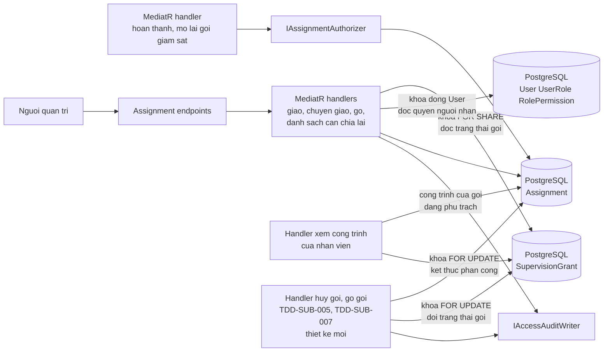
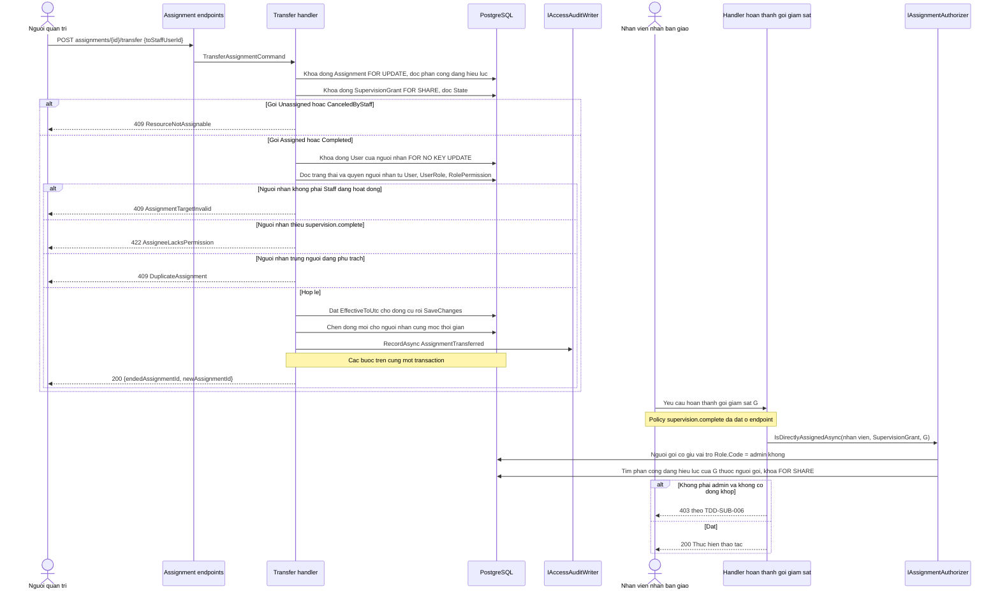
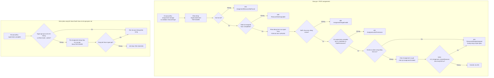
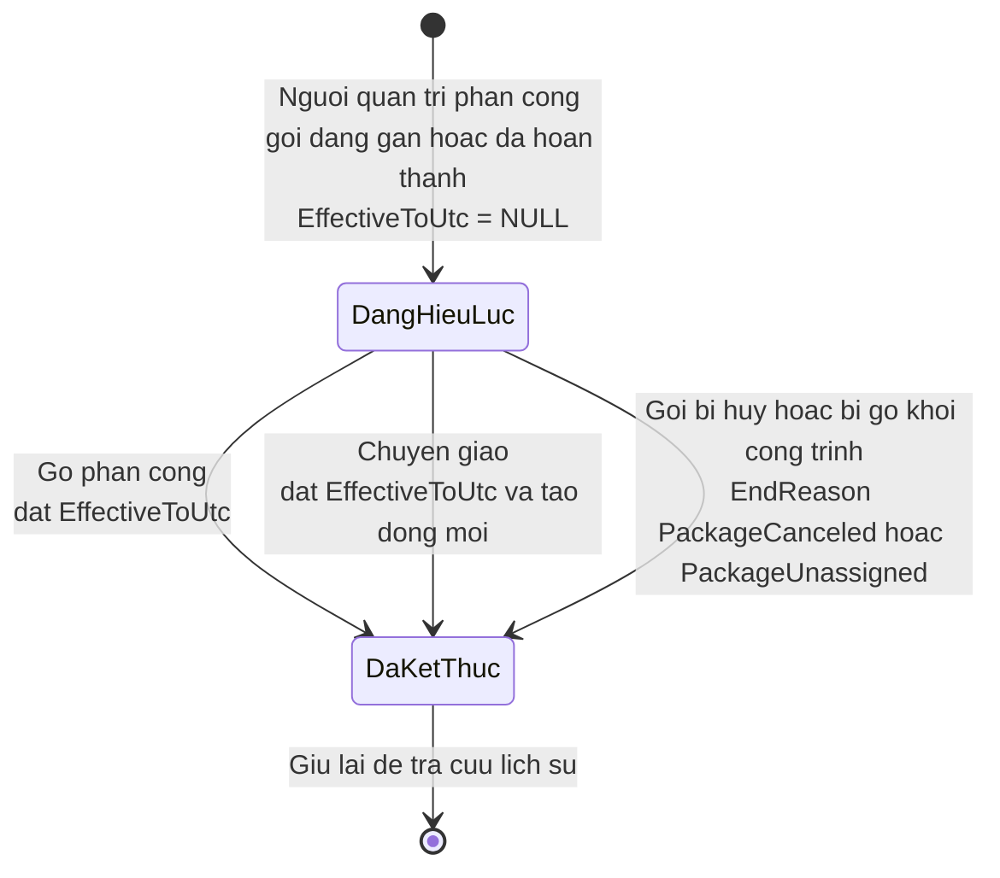
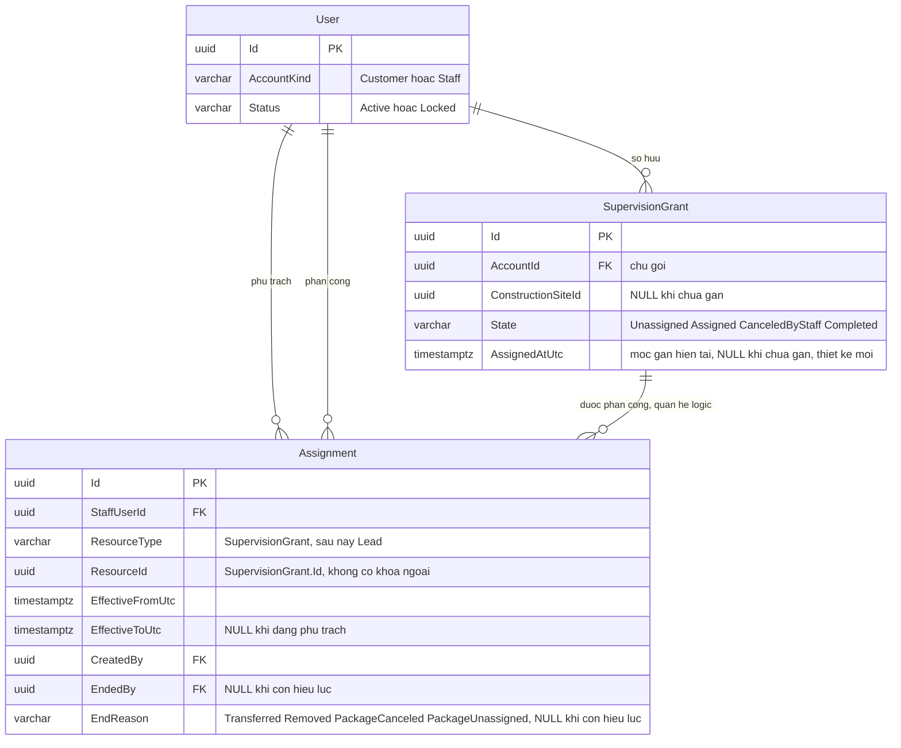

<!-- HƯỚNG DẪN CHO AI KHI ĐIỀN HOẶC CHỈNH SỬA MẪU
- Đọc toàn bộ mẫu, các comment hướng dẫn và tài liệu nguồn được cung cấp trước khi viết. Tuân thủ các quy tắc nghiệp vụ, điều kiện, ngoại lệ và giới hạn đã được xác nhận.
- Không bịa, tự chế hoặc suy đoán thành sự thật: yêu cầu, quy tắc, số liệu, API, schema, mã lỗi, nguồn tham khảo, người phụ trách và kết quả kiểm thử phải có căn cứ. Nội dung ví dụ trong mẫu không phải dữ kiện của dự án.
- Khi thiếu thông tin hoặc các nguồn mâu thuẫn, hỏi người dùng để làm rõ; giữ nguyên placeholder ở phần chưa xác định. Không tự chọn đáp án, lấp chỗ trống hay tuyên bố tài liệu đã hoàn tất.
- Chỉ thay nội dung cần điền hoặc được yêu cầu sửa. Không tự mở rộng phạm vi, sửa nghĩa quy tắc, bỏ điều kiện/ngoại lệ, xoá hay ghi đè nội dung hợp lệ đã có.
- Giữ nguyên tên, cấp và thứ tự heading, nhãn in đậm, tiền tố bullet, cấu trúc danh sách, tên/thứ tự/số cột bảng và cú pháp code fence. Không dịch, đổi tên, gộp hoặc thêm mục ngoài cấu trúc mẫu.
- Chỉ lặp khối luồng, AC hoặc API theo đúng khuôn khi có căn cứ; chỉ bỏ phần tuỳ chọn khi hướng dẫn riêng của mẫu cho phép và đã xác định không áp dụng.
- Mã tham chiếu và section phải trỏ tới tài liệu có thật đã được cung cấp hoặc kiểm chứng. Không giữ mã ví dụ như tham chiếu thật và không tự tạo tài liệu liên quan để hợp thức hoá liên kết.
- Giữ các comment hướng dẫn trong file. Xuất Markdown UTF-8, mỗi file một tài liệu; không bọc toàn bộ file trong code fence, không chèn lời dẫn hay giải thích ngoài mẫu.
- Trước khi bàn giao, đối chiếu nội dung với nguồn, kiểm tra cấu trúc, giá trị cho phép, giới hạn độ dài và tính nhất quán của mã/tham chiếu. Báo rõ phần chưa đủ thông tin; không tuyên bố đã chạy test hoặc import khi chưa thực hiện.
-->

<!-- Thay mã TDD-001 và nội dung ví dụ; giữ nguyên heading và nhãn in đậm.
Sơ đồ dùng mermaid, plantuml hoặc URL. Giữ heading Architecture, Sequence Diagram, Activity Diagram, State Diagram, Data Model.
Ví dụ API phải có heading trùng METHOD /path trong Endpoints. Xoá phần API/sơ đồ không dùng.
Version, Updated At và Change Log do lịch sử phiên bản quản lý, để trống khi nhập mới.
Author/Reviewer là tên hiển thị; gán tài khoản, phê duyệt, giả định và câu hỏi mở trên giao diện sau import.
Thiết kế phải truy vết về Story và Business Rule được cung cấp. Phân biệt thiết kế đề xuất với implementation đã kiểm chứng; không mô tả API/schema/sơ đồ ví dụ như hệ thống thật hoặc tự quyết định nghiệp vụ còn thiếu.
BẮT BUỘC KHI HOÀN THIỆN MẪU: phải có cả Reviewer và Approver, mỗi tên 1–200 ký tự sau khi bỏ khoảng trắng đầu/cuối. Không xoá hai dòng metadata, để trống, dùng tên bịa hoặc giữ placeholder rồi coi là hoàn tất.
Nếu chưa biết người review hoặc người phê duyệt, phải hỏi người dùng và báo tài liệu chưa đủ thông tin; không tự lấy Author/Owner làm người thay thế. Tên trong file không tự gán tài khoản hoặc xác nhận đã duyệt; gán thành viên trên giao diện sau import.
Đây là yêu cầu hoàn thiện mẫu; backend hiện vẫn nhận file cũ thiếu hai trường để tương thích.

VALIDATION CHO FILE NHẬP (đối chiếu ImportSnapshotValidator, MarkdownParser và ImportService):
- Mỗi file .md UTF-8 không rỗng chỉ có một heading cấp 1 chứa mã tài liệu dài 1–100 ký tự. Mã không được trùng trong cùng lần nhập hoặc thuộc loại tài liệu khác đã tồn tại.
- Không dùng tên README.md hoặc sitemap.md vì importer bỏ qua. Giao diện nhận .md/.zip, tối đa 2.000 file, tổng file tải lên 31 MiB; API giới hạn request 32 MiB và tổng nội dung đọc/giải nén 64 MiB.
- Chỉ nhập đè tài liệu cùng loại đang Draft, chưa có phiên bản và chưa lưu trữ. Import thay toàn bộ nội dung bản nháp, vì vậy phải giữ lại nội dung hợp lệ ngoài phần được yêu cầu sửa.
- Không dùng Status trong Markdown hoặc tên Approver để tự xác nhận phê duyệt; import không cấp quyền hay gán tài khoản từ tên. Chạy Kiểm tra file và xử lý lỗi/cảnh báo trước khi nhập.
- Giới hạn độ dài bên dưới tính theo string.Length của .NET (đơn vị UTF-16); không tự cắt ngắn dữ kiện quan trọng để vượt validation, hãy viết lại có căn cứ hoặc hỏi người dùng.
- Feature tối đa 300 ký tự và được dùng làm tiêu đề tài liệu. Status được parser nhận: Draft / In Review / Approved / Deprecated; tài liệu nhập mới vẫn có trạng thái phê duyệt Draft.
- Endpoint: đường dẫn tối đa 500 ký tự; tên/mô tả endpoint được lưu trong Name tối đa 300. HTTP method: GET / POST / PUT / PATCH / DELETE / HEAD / OPTIONS.
- Error Codes: mã tối đa 100 ký tự, không trùng trong tài liệu; giữ dạng - **CODE** (400): mô tả. HTTP status trong Error Codes và Response phải là số nguyên đọc được bằng Int32; không tự đặt status khác hợp đồng API.
- URL sơ đồ tối đa 1.000 ký tự. Mục sơ đồ được sử dụng phải có khối mermaid/plantuml hoặc URL theo mẫu; không để một mục sơ đồ rỗng. Nhãn mục được tách từ bullet như tên External API Fields tối đa 300 ký tự.
- Heading Examples phải khớp METHOD /path ở Endpoints. Giữ các nhãn Request:, Response 200: (thay mã theo contract) và Error Response: để parser tách đúng dữ liệu.
- Tham chiếu dạng DOC-KEY/section: ghi chú: mã đích tối đa 100 ký tự, section tối đa 100, ghi chú tối đa 1.000. Không trùng bộ mã đích + section + loại liên kết trong cùng tài liệu.
ĐỐI CHIẾU FORM TDD (src/features/tdds/validations.ts; form có thể chặt hơn import):
- Điền Feature, Author, Reviewer, Problem và ít nhất một Goal; các Goal/Non-goal/Notes đã thêm không được rỗng. API đã khai báo phải có endpoint và mô tả/mục đích; Fields phải có tên và ý nghĩa; Error Codes phải có mã, HTTP status và điều kiện.
- Form còn kiểm tra Version, Updated At và nội dung Change Log khi khai báo; với file nhập mới, giữ các trường lịch sử này trống theo hợp đồng import, không tự tạo dữ liệu lịch sử.
-->

# TDD-RBAC-003

## Document Info

- **Feature**: Phân công gói giám sát cho nhân viên, chuyển giao và điều kiện sửa hẹp
- **Author**: Claude
- **Reviewer**: Tân Trần
- **Approver**: Tân Trần
- **Status**: Draft
- **Version**:
- **Updated At**:

## Context & Goals

### Problem

`BR-SUB-011` và `BR-SUB-012` chỉ cho Admin hoặc nhân viên **đang phụ trách gói giám sát** hoàn thành hoặc mở lại gói đó. Vòng đời gói giám sát đã cấp nằm ở [TDD-SUB-004](TDD-SUB-004.md) (gán gói vào công trình), [TDD-SUB-005](TDD-SUB-005.md) (hủy gói; khôi phục đã bỏ ngày 25/09/2026), [TDD-SUB-007](TDD-SUB-007.md) (gỡ gói khỏi công trình, thiết kế mới) và [TDD-SUB-006](TDD-SUB-006.md) (hoàn thành, mở lại và đọc phân công). TDD-SUB-003 đã bị thay thế, chỉ giữ để tra cứu.

`STORY-RBAC-003` chốt mô hình chung: phân công ghi theo loại tài nguyên, để sau này thêm lead mà không phải dựng cơ chế thứ hai. Theo quyết định người dùng xác nhận ngày 25/09/2026, đợt này chỉ có **một loại tài nguyên là gói giám sát**; không có phân công mức khách hàng hay mức công trình. Gói gắn với một công trình theo `BR-SUB-009` cho tới khi bị gỡ theo `BR-SUB-026`, nên người phụ trách gói cũng là người lo công trình đó trong thời gian gói còn ở đó. Một bản thiết kế trước trong cùng ngày chọn phân công theo công trình; bản đó đã được thay khi chuẩn bị tính năng Công trình (`STORY-SITE-001`, `STORY-SITE-002`).

Các yêu cầu khó của thiết kế:

- Mỗi gói tại một thời điểm chỉ có một phân công đang hiệu lực. Giao một gói đang có người cho người khác phải bị từ chối và hướng sang chuyển giao (`BR-RBAC-013` khoản 4), kể cả khi hai yêu cầu giao chạy song song.
- Chỉ giao hoặc chuyển giao được gói đang giữ chỗ trên công trình, tức gói đã gán hoặc đã hoàn thành (`BR-RBAC-013` khoản 8), kể cả khi việc hủy gói hoặc gỡ gói chạy song song với việc giao.
- Người nhận khi giao và khi chuyển giao phải là nhân viên đang hoạt động, không bị khóa và đang có `supervision.complete` (`BR-RBAC-013` khoản 2).
- Hủy gói hoặc gỡ gói khỏi công trình kết thúc ngay phân công đang hiệu lực của gói (`BR-RBAC-013` khoản 9, sửa ngày 25/09/2026), kể cả khi việc giao hoặc chuyển giao chạy song song. Gói mới gắn vào cùng công trình, hoặc gói được khách gán lại sau khi bị gỡ, không kế thừa người phụ trách cũ (khoản 3, khoản 6).
- Thu hồi vai trò hoặc bỏ quyền khỏi vai trò không được làm người đang phụ trách gói mất `supervision.complete` (`BR-RBAC-007`). Khóa tài khoản thì không bị chặn, và các gói đang gán của người bị khóa vào danh sách cần chia lại (`BR-RBAC-008` khoản 4, `BR-RBAC-013` khoản 6).

Hiện trạng code trước đợt thay đổi ngày 25/09/2026:

- Bảng `Assignment` được tạo ở migration `20260923152830_InitialRbac`, với CHECK `ResourceType IN ('Customer', 'Project')` và index duy nhất có lọc trên `(StaffUserId, ResourceType, ResourceId)`.
- Bốn endpoint phân công, `AssignmentAuthorizer` (gồm nhánh kế thừa từ khách hàng xuống dự án qua `IResourceHierarchyReader`), bản tạm `UnavailableResourceHierarchyReader` và `AssignmentRowLocker` đã có. `AssignmentRowLocker` khóa dòng phân công bằng `FOR UPDATE` khi chuyển giao và bằng `FOR SHARE` khi kiểm phân công.
- Code chưa kiểm quyền của người nhận, chưa chặn hai người cùng phụ trách một tài nguyên và chưa kiểm tài nguyên có tồn tại hay không.
- Bảng `SupervisionGrant` đã có theo TDD-SUB-004, với cột `State` nhận `Unassigned`, `Assigned`, `CanceledByStaff`, `Completed`. Cột công trình của gói hiện còn tên `ProjectId`. Gói không có đường xóa: nghiệp vụ chỉ hủy, và cấu hình EF bỏ qua `IsDeleted` (`src/bmt-be.persistence/configurations/SupervisionGrantConfiguration.cs`).
- `SupervisionCompletionAccess` gọi `IsDirectlyAssignedAsync` với `ResourceTypes.Project` và `grant.ProjectId`.

Các thay đổi ngày 25/09/2026 dưới đây **đã có trong code**, ở commit `182e2a8` trên nhánh `feature/construction-site` của `bmt-be`, cùng migration `20260925074152_ConstructionSiteAndPackageAssignment`. Chỗ nào code còn khác thiết kế thì ghi ngay tại mục đó.

**Thay đổi thiết kế ngày 25/09/2026 (lần 3), đã có trong code ở nhánh `feature/supervision-unassign` của `bmt-be`, chưa merge vào `develop`.** Người dùng chốt thêm: nhân viên có quyền `supervision.unassign` được gỡ gói giám sát đã gán khỏi công trình khi khách gán nhầm (`STORY-SUB-006`, `BR-SUB-026`); hủy gói giám sát kết thúc phân công (`BR-SUB-024` khoản 7); bỏ thao tác khôi phục gói (`BR-SUB-025` đã bỏ). `BR-RBAC-013` khoản 9 vì vậy đổi từ "hủy giữ phân công, khôi phục thì người cũ phụ trách tiếp" sang "hủy hoặc gỡ gói kết thúc phân công". Code hiện tại ở `bmt-be` nhánh `develop`, commit `1ffdfbf`, vẫn chạy theo bản trước: hủy không đụng `Assignment` và còn khôi phục. Phần mới nằm ở các mục "Chỉ giao gói đang giữ chỗ trên công trình", "Kết thúc phân công khi hủy hoặc gỡ gói", "Thứ tự khóa giữa các luồng", "Danh sách cần chia lại", State Diagram và Data Model; mỗi chỗ đều ghi rõ là thiết kế mới. Luồng gỡ gói thiết kế ở [TDD-SUB-007](TDD-SUB-007.md), luồng hủy ở [TDD-SUB-005](TDD-SUB-005.md).

### Goals

- Một bảng phân công chung dùng được cho nhiều loại tài nguyên, để tính năng chia lead sau này không cần bảng mới. Đợt này bảng chỉ nhận loại `SupervisionGrant`.
- Database bảo đảm mỗi gói có tối đa một phân công đang hiệu lực, kể cả khi hai yêu cầu giao chạy cùng lúc.
- Không tạo được phân công mới cho gói không tồn tại, gói chưa gán công trình (kể cả gói vừa bị gỡ) hoặc gói đã hủy, kể cả khi việc hủy hoặc gỡ gói chạy song song.
- Sau khi hủy hoặc gỡ gói, gói không còn phân công đang hiệu lực, kể cả khi giao hoặc chuyển giao chạy song song (thiết kế lần 3).
- Trả lời được câu hỏi "người này có đang phụ trách gói kia tại thời điểm thao tác không" bằng một truy vấn dùng index.
- Không để lọt trường hợp gói có người phụ trách nhưng người đó không có `supervision.complete`, dù giao việc, chuyển giao, thu hồi vai trò và sửa quyền vai trò chạy song song.
- Tính được danh sách gói cần chia lại khi đọc, không cần bảng hay cột cờ riêng.
- Chuyển giao và gỡ phân công giữ đủ dấu vết để tra được ai từng phụ trách gói nào.

### Non-goals

- Tính năng chia lead, gồm cả chia thủ công và chia tự động. Tài liệu này chỉ bảo đảm cơ chế dùng lại được.
- Phân công theo khách hàng hoặc theo công trình; đợt này chỉ giao từng gói giám sát.
- Vòng đời gói giám sát: gán vào công trình (TDD-SUB-004), gỡ khỏi công trình (TDD-SUB-007), hủy (TDD-SUB-005), hoàn thành và mở lại (TDD-SUB-006). Tài liệu này chỉ mô tả phần các luồng đó đọc hoặc ghi `Assignment`. Không còn thao tác khôi phục gói. Dữ liệu và API của Công trình thuộc thiết kế kỹ thuật của Công trình; tài liệu này chỉ cung cấp truy vấn phạm vi xem theo phân công.
- Tự động chia lại gói khi nhân viên bị khóa, và quy tắc cân bằng số lượng giữa các nhân viên.
- Mô hình vai trò – quyền và vòng đời tài khoản. Xem [TDD-RBAC-001](TDD-RBAC-001.md) và [TDD-RBAC-002](TDD-RBAC-002.md).

## Architecture

Phân công là chặng thứ ba trong ba chặng kiểm tra mô tả ở [TDD-RBAC-001](TDD-RBAC-001.md#architecture). Chặng này nằm trong handler chứ không ở endpoint, vì chỉ trong handler mới biết gói đích là gói nào.



### Một bảng cho nhiều loại tài nguyên

Bảng `Assignment` không có khóa ngoại tới tài nguyên. Mỗi dòng mang một cặp `ResourceType` và `ResourceId`. Đợt này `ResourceType` chỉ có một giá trị là `SupervisionGrant`, và `ResourceId` là `SupervisionGrant.Id` của gói được giao. Thêm loại tài nguyên mới, ví dụ lead, chỉ cần một giá trị mới trong `ResourceType`, không cần bảng mới hay cột mới.

Tên `SupervisionGrant` trùng tên thực thể và tên bảng của gói giám sát đã cấp trong code, nên đọc một dòng phân công là biết phải tra bảng nào. Giá trị `ConstructionSite` của bản thiết kế trước trong cùng ngày không còn dùng.

Không có khóa ngoại thì database không tự bảo đảm `ResourceId` trỏ tới một gói có thật. Khác với bản trước, nay handler kiểm được việc này: gói giám sát đã có bảng, nên handler giao việc đọc dòng `SupervisionGrant` dưới khóa và trả 404 `AssignmentResourceNotFound` nếu không có. Gói không bao giờ bị xóa, nên một phân công đã tạo hợp lệ không trở thành dòng mồ côi. [Nợ kỹ thuật](../debt/assignment-resource-check.md) về việc không kiểm tài nguyên tồn tại đóng được khi bước kiểm này được triển khai.

Vẫn không thêm khóa ngoại vì một cột `ResourceId` phục vụ nhiều loại tài nguyên, còn một khóa ngoại chỉ trỏ được tới một bảng. Muốn có khóa ngoại thì phải thêm cột riêng như `SupervisionGrantId` cho từng loại. Chưa làm, vì gói không bị xóa và handler đã kiểm dưới khóa; nên xem lại khi có loại tài nguyên có thể bị xóa.

### Hiệu lực theo thời gian thay vì xóa dòng

Gỡ phân công không xóa dòng mà đặt `EffectiveToUtc`. Chuyển giao là đặt `EffectiveToUtc` cho dòng cũ và chèn dòng mới cho người nhận, tại cùng một mốc thời gian, trong cùng một transaction.

Làm vậy vì `STORY-RBAC-003/Non-Functional` đòi tra được ai từng phụ trách gói nào, và vì `BR-RBAC-008` đòi các phân công của người bị khóa vẫn còn để chia lại. Nếu gỡ bằng cách xóa dòng thì cả hai yêu cầu đều không đáp ứng được. `AccessAuditLog` một mình cũng không đủ, vì nó ghi theo thao tác chứ không trả lời được câu hỏi "trong khoảng thời gian này ai phụ trách gói G".

Một dòng còn hiệu lực khi `EffectiveToUtc IS NULL`. Không dùng `EffectiveToUtc > now()` làm điều kiện chính, vì thiết kế này không có phân công hẹn trước ngày kết thúc; mọi lần kết thúc đều xảy ra ngay tại thời điểm thao tác.

### Một gói, một người phụ trách

`BR-RBAC-013` khoản 4 cho mỗi gói tối đa một phân công đang hiệu lực tại một thời điểm. Thiết kế giữ ràng buộc này ở hai lớp.

1. **Handler giao việc** (`POST /assignments`) kiểm gói đã có dòng đang hiệu lực chưa. Có thì trả 409 `ResourceAlreadyAssigned`, không tạo dòng thứ hai, và phản hồi kèm mã phân công hiện tại để giao diện đưa người quản trị sang chuyển giao (`STORY-RBAC-003/EXC-05`, `AC-004`). Kiểm này áp dụng cả khi người nhận chính là người đang phụ trách.
2. **Index duy nhất có lọc** `UX_Assignment_ActiveResource` trên `(ResourceType, ResourceId) WHERE "EffectiveToUtc" IS NULL` là lớp chặn cuối ở database. "Có lọc" nghĩa là index chỉ chứa các dòng đang hiệu lực, nên một gói vẫn có nhiều dòng đã kết thúc làm lịch sử.

Cần cả hai lớp vì lớp 1 cho mã lỗi rõ nghĩa nhưng không chặn được hai yêu cầu song song. Ví dụ hai người quản trị cùng giao gói G3 cho hai nhân viên khác nhau: cả hai handler đều thấy G3 chưa có ai và cùng cho qua. Khi đó index chặn câu `INSERT` đến sau bằng lỗi PostgreSQL `23505`. Lỗi này có thể ném ra lúc lưu hoặc lúc commit, nên phải bắt ở lớp bao ngoài `TransactionPipelineBehavior`, sau khi transaction đã rollback. Lớp này là `ConstraintViolationPipelineBehavior`, bảng ánh xạ đầy đủ ở [TDD-SITE-001](TDD-SITE-001.md#architecture). Nó nhận đúng tên index `UX_Assignment_ActiveResource` và trả 409 `ResourceAlreadyAssigned` như lớp 1, thay vì mã 409 chung của middleware. Không chạy thêm câu SQL nào trong transaction PostgreSQL đã lỗi.

Index này thay index duy nhất cũ `IX_Assignment_StaffUserId_ResourceType_ResourceId` trên `(StaffUserId, ResourceType, ResourceId)`. Index cũ chỉ chặn một người được giao hai lần cùng một tài nguyên, và cố ý cho nhiều người cùng phụ trách theo bản BR trước; bản BR hiện tại đã bỏ điều đó.

Chuyển giao phải **đóng dòng cũ trước khi chèn dòng mới**. PostgreSQL kiểm index duy nhất ngay ở từng câu lệnh chứ không đợi tới lúc commit. Nếu câu `INSERT` dòng mới chạy trước câu `UPDATE` dòng cũ, chính thao tác chuyển giao hợp lệ sẽ vi phạm index. Handler vì vậy đặt `EffectiveToUtc` cho dòng cũ rồi gọi `SaveChangesAsync`, sau đó mới thêm dòng mới, cả hai trong cùng transaction. Không dựa vào thứ tự câu lệnh do EF Core tự sắp: dòng cũ không đổi giá trị cột của index, nên EF Core không thấy hai câu lệnh phụ thuộc nhau.

Chuyển giao cho chính người đang phụ trách vẫn bị từ chối với `DuplicateAssignment`, đúng `STORY-RBAC-003/EXC-03`.

Phân công gắn vào `Id` của gói, không gắn vào công trình. Vì vậy gói mới gắn vào cùng công trình là một dòng `SupervisionGrant` khác với `Id` khác, và không có sẵn người phụ trách (`BR-RBAC-013` khoản 3, `STORY-RBAC-003/ALT-07`). Ví dụ: gói G1 của công trình P do anh Nam phụ trách bị hủy; khách gắn gói mới G5 vào P. Theo thiết kế mới, dòng phân công của anh Nam trên G1 đã kết thúc ngay lúc hủy (khoản 9); G5 chưa có dòng nào nên nằm trong danh sách cần chia lại cho tới khi người quản trị giao. Tương tự, gói bị gỡ khỏi công trình rồi được khách gán lại (`STORY-SUB-006`) vẫn là cùng một dòng `SupervisionGrant`, nhưng phân công cũ đã kết thúc lúc gỡ, nên gói chưa có người phụ trách, kể cả người từng phụ trách chính gói đó (`STORY-RBAC-003/AC-013`).

### Chỉ giao gói đang giữ chỗ trên công trình

`BR-RBAC-013` khoản 8 chỉ cho giao mới và chuyển giao gói đang giữ chỗ trên công trình. Handler giao và handler chuyển giao đọc dòng gói bằng câu lệnh có tham số, qua `IAssignmentRowLocker.LockSupervisionGrantStateForShareAsync`:

```sql
SELECT "State" FROM "SupervisionGrant" WHERE "Id" = @grantId FOR SHARE
```

- Không có dòng: trả 404 `AssignmentResourceNotFound`.
- `State` là `Unassigned` hoặc `CanceledByStaff`: trả 409 `ResourceNotAssignable`, không tạo phân công. Gói chưa gán đã quá hạn gán vẫn có `State = Unassigned` (trạng thái `ExpiredUnassigned` chỉ tính khi đọc), nên cũng bị từ chối. Gói vừa bị gỡ khỏi công trình theo TDD-SUB-007 cũng về `Unassigned` nên bị từ chối như gói chưa gán.
- `State` là `Assigned` hoặc `Completed`: đi tiếp. Handler dùng đúng hằng tập giữ chỗ của TDD-SUB-004 (`SupervisionStates.HoldingConstructionSite`) thay vì tự viết lại danh sách, để không lệch với partial unique index của bảng gói.

Dùng 409 vì yêu cầu đúng khuôn và người gọi có quyền, nhưng xung đột với trạng thái hiện tại của gói; cùng yêu cầu đó có thể thành công sau khi khách gán gói vào công trình. Đây cũng là lý do `ResourceAlreadyAssigned` dùng 409. Mã 422 dành cho người nhận không thỏa điều kiện của yêu cầu (`AssigneeLacksPermission`), còn 404 dành cho gói không tồn tại.

**Khóa `FOR SHARE` trên dòng gói** giữ trạng thái gói đứng yên tới hết transaction giao việc. Theo thiết kế mới, hủy gói (TDD-SUB-005) và gỡ gói (TDD-SUB-007) khóa dòng gói bằng `FOR UPDATE` trước khi đổi `State`; khóa này phải chờ mọi khóa `FOR SHARE` đang giữ. Hai người quản trị cùng đọc một gói thì không chặn nhau, vì hai khóa `FOR SHARE` không xung đột. Tình huống: chị Lan giao G1 cho anh Tú đúng lúc anh Hùng hủy G1.

- Nếu việc giao lấy khóa trước, việc hủy chờ ở bước khóa dòng gói. Khi giao commit, việc hủy lấy được khóa, truy vấn lại phân công đang hiệu lực, thấy dòng vừa tạo của anh Tú và kết thúc dòng đó với `EndReason = PackageCanceled`. Kết cục: G1 đã hủy và không còn phân công đang hiệu lực.
- Nếu việc hủy lấy khóa trước, câu `FOR SHARE` chờ, rồi ở mức cô lập `READ COMMITTED` đọc lại dòng đã đổi và thấy `CanceledByStaff`, nên việc giao nhận 409 `ResourceNotAssignable`.

Gỡ gói chạy song song với giao cho cùng kết cục, chỉ khác `State` sau cùng là `Unassigned` và `EndReason = PackageUnassigned`. Không có kết cục nào để lại phân công đang hiệu lực trên gói đã hủy hoặc đã gỡ. Bản trước, cũng là code hiện tại, để hủy chỉ `UPDATE` dòng gói lúc lưu và giữ nguyên phân công vừa tạo. Khóa `FOR SHARE` không đổi cột `Version` của gói, nên kiểm version của luồng hủy không bị ảnh hưởng.

Gỡ phân công không đọc gói và làm được với gói ở mọi trạng thái (`STORY-RBAC-003/ALT-04`). Hủy gói giám sát và gỡ gói khỏi công trình kết thúc phân công đang hiệu lực của gói, mô tả ở mục kế tiếp. Không còn thao tác khôi phục gói (`BR-SUB-025` đã bỏ), nên không còn trường hợp người cũ phụ trách tiếp sau khôi phục.

### Kết thúc phân công khi hủy hoặc gỡ gói

**Thiết kế mới ngày 25/09/2026, đã có trong code ở nhánh `feature/supervision-unassign`.** `BR-RBAC-013` khoản 9 nay quy định: khi gói bị hủy theo `BR-SUB-024` hoặc bị gỡ khỏi công trình theo `BR-SUB-026`, phân công đang hiệu lực của gói kết thúc ngay tại thời điểm đó và được ghi nhật ký; người quản trị không phải gỡ tay.

Lý do kỹ thuật: sau hai thao tác này gói không còn giữ chỗ trên công trình, nên theo khoản 8 gói không giao mới hay chuyển giao được nữa. Nếu dòng phân công còn sống, gói có một người phụ trách không thao tác được gì, người đó vẫn xem được công trình qua gói, và việc thu hồi vai trò của người đó bị `BR-RBAC-007` chặn vô ích. Đây cũng là điều kiện mà [nợ kỹ thuật](../debt/assignment-resource-check.md) đặt ra: thêm đường làm gói mất tư cách phân công thì phải thiết kế cách xử lý phân công của gói đó.

Handler hủy gói giám sát (TDD-SUB-005) và handler gỡ gói (TDD-SUB-007) dùng chung một bước kết thúc phân công là lớp tĩnh nội bộ `SupervisionAssignmentCloser` trong `application/usecases/commands/subscription/` theo [TDD-SUB-007](TDD-SUB-007.md#architecture). Nhãn nhật ký dùng hàm `AssignmentLookup.GrantLabel` với tên công trình trong bản lưu, cùng định dạng với `AssignmentLookup.GrantLabelAsync`. Bước này chạy trong cùng transaction với việc đổi trạng thái gói, sau khi đã giữ các khóa theo thứ tự ở mục "Thứ tự khóa giữa các luồng":

1. Truy vấn lại dòng `Assignment` đang hiệu lực của gói (`ResourceType = 'SupervisionGrant'`, `ResourceId = grantId`, `EffectiveToUtc IS NULL`), dùng index `UX_Assignment_ActiveResource`. Không có dòng nào thì bỏ qua bước này. Nếu dòng tìm thấy khác dòng đã khóa ở bước khóa `Assignment` (dòng mới do giao song song vừa commit), khóa dòng đó bằng `IAssignmentRowLocker.LockAsync` trước khi ghi.
2. Đặt `EffectiveToUtc = now`, `EndedBy` = nhân viên đang hủy hoặc gỡ, `EndReason = PackageCanceled` (hủy) hoặc `PackageUnassigned` (gỡ).
3. Ghi `AccessAuditLog` hành động `AssignmentEnded` qua `IAccessAuditWriter.RecordAsync`: người thao tác là nhân viên hủy hoặc gỡ; `TargetId` là mã phân công; `TargetLabel` là "Gói giám sát · <tên công trình trước khi hủy hoặc gỡ>"; `BeforeJson` gồm `staffUserId` và `endReason`. Đây là thay đổi phân công thành công nên phải ghi theo `BR-RBAC-012` và khoản 7.

Hai cổng khóa mới của `IAssignmentRowLocker`, cài bằng SQL có tham số trong `AssignmentRowLocker`:

- `LockActiveByResourceForUpdateAsync(resourceType, resourceId)`: `SELECT "Id" FROM "Assignment" WHERE "ResourceType" = @type AND "ResourceId" = @id AND "EffectiveToUtc" IS NULL FOR UPDATE`, trả mã dòng hoặc NULL.
- `LockSupervisionGrantForUpdateAsync(grantId)`: `SELECT "Id" FROM "SupervisionGrant" WHERE "Id" = @id FOR UPDATE`, trả `true` khi có dòng. Handler đọc lại gói có tracking ngay sau đó.

Tình huống: G1 đang gán công trình P, do anh Tú phụ trách qua `asg-1`. Anh Khoa có `package.cancel` hủy G1 lúc 07:00. Trong cùng transaction: G1 thành `CanceledByStaff`, `asg-1` có `EffectiveToUtc = 07:00`, `EndedBy = anh Khoa`, `EndReason = PackageCanceled`, và nhật ký có một dòng `AssignmentEnded`. Từ yêu cầu kế tiếp, anh Tú không hoàn thành được G1 và không còn xem được P qua G1. G1 không vào danh sách cần chia lại vì đã hủy. Nếu thay vì hủy, anh Khoa gỡ G1 khỏi P, kết quả giống vậy với `EndReason = PackageUnassigned`; khi khách gán lại G1 vào công trình khác, G1 vào danh sách cần chia lại với trạng thái `NoAssignee`.

Đánh đổi: hủy và gỡ nay phải khóa thêm dòng phân công và dòng gói, nên chờ lâu hơn khi người quản trị đang chuyển giao chính gói đó. Số thao tác trên một gói rất ít, nên độ trễ này không đáng kể.

### Điều kiện của người nhận

`BR-RBAC-013` khoản 2 áp dụng cho cả giao và chuyển giao: người nhận phải là tài khoản nhân viên đang hoạt động, không bị khóa và đang có `supervision.complete`. Sau khi đã khóa và kiểm dòng gói, handler kiểm theo thứ tự:

1. Khóa dòng `User` của người nhận bằng `SELECT ... FOR NO KEY UPDATE`.
2. Người nhận tồn tại, chưa bị xóa, có `AccountKind = 'Staff'` và `Status = 'Active'`. Sai thì 409 `AssignmentTargetInvalid` (`EXC-01`, `EXC-02`, `AC-006`).
3. Người nhận có `supervision.complete` qua ít nhất một vai trò, đọc bằng truy vấn nối `UserRole` với `RolePermission` trong database. Không có thì 422 `AssigneeLacksPermission` (`EXC-06`, `AC-009`). Khi chuyển giao, phân công của người đang phụ trách giữ nguyên.

Bước 3 đọc từ database chứ không từ token. Người nhận không phải người gọi API nên trong yêu cầu không có token nào của họ; và token của chính họ cũng có thể mang bộ quyền cũ tới lúc hết hạn theo `BR-RBAC-009`. Dùng 422 vì người gọi có đủ quyền, chỉ người nhận được chọn không thỏa điều kiện; 403 dành cho người gọi thiếu quyền.

Bước 1 chặn trường hợp lọt khi thao tác khác chạy song song. Tình huống: chị Lan giao gói G cho anh Hải, cùng lúc một người quản trị khác thu hồi vai trò duy nhất cho anh Hải quyền `supervision.complete`. Không khóa thì việc giao thấy anh Hải còn quyền, việc thu hồi thấy anh Hải chưa phụ trách gói nào; cả hai cùng commit và anh Hải phụ trách G mà không còn quyền. Thu hồi vai trò ([TDD-RBAC-002](TDD-RBAC-002.md#architecture)) và sửa quyền vai trò ([TDD-RBAC-001](TDD-RBAC-001.md#architecture)) khóa cùng dòng `User` đó, nên bên đến sau phải chờ. Sau khi lấy được khóa, handler mới đọc quyền và phân công bằng câu lệnh riêng; ở mức cô lập `READ COMMITTED`, câu đọc này thấy thay đổi vừa commit của bên kia và từ chối đúng.

Dùng `FOR NO KEY UPDATE` thay vì `FOR UPDATE` để không chặn các lệnh chèn có khóa ngoại tới dòng `User` đó, vì các lệnh này chỉ cần khóa `FOR KEY SHARE`.

### Thứ tự khóa giữa các luồng

Các luồng dưới đây có thể chạy cùng lúc trên cùng một gói hoặc cùng một nhân viên. Thứ tự khóa của chúng:

| Luồng | Thứ tự khóa trong transaction |
|---|---|
| Giao (`POST /assignments`) | `SupervisionGrant` `FOR SHARE` → `User` người nhận `FOR NO KEY UPDATE` |
| Chuyển giao | `Assignment` `FOR UPDATE` → `SupervisionGrant` `FOR SHARE` → `User` người nhận `FOR NO KEY UPDATE` |
| Gỡ phân công | `Assignment` `FOR UPDATE` |
| Hoàn thành, mở lại ([TDD-SUB-006](TDD-SUB-006.md)) | tài khoản chủ gói `FOR UPDATE` → `Assignment` `FOR SHARE` (bỏ qua với Admin) → cập nhật `SupervisionGrant` |
| Hủy gói giám sát ([TDD-SUB-005](TDD-SUB-005.md)), thiết kế mới | tài khoản chủ gói `FOR UPDATE` → `Assignment` đang hiệu lực của gói `FOR UPDATE` → `SupervisionGrant` `FOR UPDATE` → truy vấn lại phân công đang hiệu lực → cập nhật gói và kết thúc phân công |
| Gỡ gói khỏi công trình ([TDD-SUB-007](TDD-SUB-007.md)), thiết kế mới | giống hủy gói giám sát |
| Thu hồi vai trò ([TDD-RBAC-002](TDD-RBAC-002.md)) | `User` nhân viên `FOR NO KEY UPDATE` → đếm `Assignment`, không khóa |
| Sửa quyền vai trò ([TDD-RBAC-001](TDD-RBAC-001.md)) | `Role` `FOR UPDATE` → các `User` giữ vai trò theo `Id` tăng dần `FOR NO KEY UPDATE` → đếm `Assignment`, không khóa |

"Tài khoản chủ gói" là dòng `User` của khách trong code hiện tại; TDD-SUB-006 dự kiến chuyển sang `AccountCommerceState` theo TDD-PAY-001.

Ba nguyên tắc giữ cho các luồng không chờ vòng lẫn nhau (deadlock):

1. Luồng nào cần cả `Assignment` lẫn `SupervisionGrant` đều khóa `Assignment` trước. Hoàn thành giữ khóa chia sẻ trên dòng phân công rồi mới cần khóa ghi trên gói; chuyển giao cũng lấy dòng phân công trước. Theo thiết kế mới, hủy và gỡ gói cũng khóa dòng phân công đang hiệu lực trước, rồi mới khóa ghi dòng gói. Vì vậy các luồng xếp hàng ngay ở dòng phân công, không bên nào giữ gói mà chờ dòng phân công.
2. Dòng `User` của nhân viên luôn khóa sau cùng. Thu hồi vai trò và sửa quyền vai trò không khóa `Assignment` hay `SupervisionGrant`, nên chúng chỉ có thể chờ ở dòng `User`, còn luồng phân công chỉ chờ dòng `User` khi đã giữ đủ các khóa khác.
3. Luồng phân công không khóa tài khoản chủ gói. Hủy và gỡ gói giữ khóa tài khoản rồi chờ ở dòng phân công và dòng gói; luồng phân công giữ các khóa này mà chỉ còn chờ dòng `User` của người nhận, không chờ gì từ luồng hủy hay gỡ, nên không tạo vòng chờ.

**Trường hợp biên của thiết kế mới: giao mới chạy song song với hủy hoặc gỡ.** Việc giao giữ `FOR SHARE` trên dòng gói nhưng chưa có dòng phân công nào, nên bước khóa `Assignment` của hủy hoặc gỡ không thấy dòng nào và đi tiếp, rồi chờ ở khóa `FOR UPDATE` trên dòng gói. Khi giao commit, hủy hoặc gỡ lấy được khóa gói và truy vấn lại phân công bằng một câu lệnh mới; ở mức `READ COMMITTED`, câu này thấy dòng vừa commit và kết thúc nó. Vì vậy hủy hoặc gỡ phải truy vấn lại **sau** khi khóa gói, không dùng kết quả của bước khóa `Assignment`.

Nếu đúng trong khe hẹp giữa lúc giao commit và lúc hủy hoặc gỡ truy vấn lại, một yêu cầu chuyển giao kịp khóa dòng phân công mới bằng `FOR UPDATE` rồi chờ `FOR SHARE` trên dòng gói, thì hai bên chờ nhau. PostgreSQL phát hiện chờ vòng, hủy một transaction với mã lỗi `40P01`. `ConstraintViolationPipelineBehavior` ánh xạ `40P01` của `CancelPackageCommand` và `UnassignSupervisionGrantCommand` thành 409 `PackageVersionConflict`, để client tải lại gói rồi gửi lại. Nếu bên bị hủy là chuyển giao, lỗi đi theo nhánh chung của middleware; khi người quản trị gửi lại, phân công đã bị hủy hoặc gỡ kết thúc nên nhận 409 `AssignmentAlreadyEnded`. Khe này rất hẹp và cần ba thao tác trên cùng một gói trong cùng lúc, nên chấp nhận để client thử lại thay vì thêm khóa.

Không khóa tài khoản chủ gói như các thao tác trên gói vì phân công không đổi dữ liệu thương mại của khách. Khóa `FOR UPDATE` trên dòng tài khoản sẽ chặn cả việc mua gói và các thao tác gói khác của khách đó trong lúc người quản trị giao việc, trong khi khóa `FOR SHARE` trên đúng dòng gói đã đủ để giữ trạng thái gói đứng yên.

### Kiểm phân công khi thao tác trên gói

Đợt này không có phân công mức khách hàng hay mức công trình (`BR-RBAC-013` khoản 3), nên phép kiểm chỉ còn một bước: có dòng phân công đang hiệu lực khớp đúng `('SupervisionGrant', grantId)` và thuộc người gọi hay không.

`IAssignmentAuthorizer.IsDirectlyAssignedAsync(staffUserId, resourceType, resourceId)` làm việc này và giữ khóa `FOR SHARE` trên dòng khớp tới hết transaction, để việc gỡ hoặc chuyển giao song song phải chờ, như [TDD-SUB-006](TDD-SUB-006.md) mô tả. Mỗi gói có tối đa một dòng đang hiệu lực, nên truy vấn dùng index `UX_Assignment_ActiveResource` và đọc nhiều nhất một dòng. Người gọi giữ vai trò hệ thống có mã `admin` thì đạt ngay, xem Activity Diagram.

Các thay đổi so với code ngày 23/09/2026, đã có trong code:

- Bỏ `IsAssignedAsync` cùng nhánh kế thừa từ khách hàng xuống dự án. Hàm này không có nơi gọi.
- Bỏ `IResourceHierarchyReader` và bản tạm `UnavailableResourceHierarchyReader`, vì không còn câu hỏi "dự án thuộc khách hàng nào".
- `SupervisionCompletionAccess` truyền `ResourceTypes.SupervisionGrant` và `grant.Id`, thay cho `ResourceTypes.Project` và `grant.ProjectId`. Không còn trường hợp truyền `Guid.Empty` cho gói chưa gán: gói chưa gán không thể có phân công theo khoản 8, nên người không phải Admin nhận 403 như trước. Mã lỗi thiếu phân công do TDD-SUB-006 đặt.
- `ResourceTypes` chỉ còn `SupervisionGrant`; bỏ `ResourceTypes.Customer` và `ResourceTypes.Project`.
- `AssignmentRowLocker.LockActiveForShareAsync` giữ nguyên điều kiện lọc, nhưng sau migration dùng `UX_Assignment_ActiveResource` thay cho index cũ trên `(StaffUserId, ResourceType, ResourceId)`, rồi lọc `StaffUserId` trên tối đa một dòng.
- Handler giao và chuyển giao khóa dòng gói qua hàm mới `LockSupervisionGrantStateForShareAsync` của `IAssignmentRowLocker`, cài bằng SQL có tham số trong `AssignmentRowLocker`. Các bước kiểm gói, người nhận và người đang phụ trách dùng chung trong `AssignmentLookup`.

### Phạm vi xem công trình theo gói đang phụ trách

`BR-SITE-003` khoản 3 cho nhân viên có `supervision.complete` mà không có `assignment.manage` chỉ xem công trình của những gói đang được phân công cho mình. Tài liệu này cung cấp truy vấn xác định phạm vi đó; endpoint xem công trình và cách dùng truy vấn nằm ở [TDD-SITE-001](TDD-SITE-001.md).

```sql
SELECT DISTINCT g."ConstructionSiteId"
FROM "Assignment" a
JOIN "SupervisionGrant" g ON g."Id" = a."ResourceId"
WHERE a."ResourceType" = 'SupervisionGrant'
  AND a."StaffUserId" = @staffUserId
  AND a."EffectiveToUtc" IS NULL
  AND g."ConstructionSiteId" IS NOT NULL
```

Câu truy vấn đi từ index `(StaffUserId, EffectiveToUtc) WHERE "EffectiveToUtc" IS NULL` để lấy các gói người đó đang phụ trách, rồi nối khóa chính của `SupervisionGrant`. Không cần lọc `State`: theo thiết kế mới, hủy hoặc gỡ gói kết thúc phân công, nên dòng phân công đang hiệu lực chỉ còn trỏ tới gói đang giữ chỗ (đã gán hoặc đã hoàn thành). Gói đã gỡ có `ConstructionSiteId` NULL nên cũng bị điều kiện `IS NOT NULL` loại ra. Code hiện tại vẫn giữ phân công của gói đã hủy; bước 3 của migration mới (xem Data Model) kết thúc các dòng đó, nên sau migration truy vấn không cần đổi. Code viết điều kiện này bằng LINQ trong `ConstructionSiteStaffScope.ApplyAssigned` ([TDD-SITE-001](TDD-SITE-001.md#architecture)), cho cùng kết quả. Để kiểm một công trình cụ thể, dùng cùng điều kiện với thêm `g."ConstructionSiteId" = @siteId` trong `EXISTS`. Đây là thao tác đọc nên không khóa: chuyển giao hoặc gỡ vừa commit có hiệu lực từ yêu cầu xem tiếp theo, đúng `STORY-SITE-002/Non-Functional`.

### Thu hồi vai trò và sửa quyền vai trò

`BR-RBAC-007` chặn thu hồi vai trò hoặc bỏ quyền khỏi vai trò khi việc đó làm một người mất `supervision.complete` trong khi vẫn phụ trách ít nhất một gói giám sát. Bản ghi phân công không lưu vai trò nào làm căn cứ, và không cần lưu: phép kiểm chỉ xét bộ quyền còn lại của người đó sau thay đổi. Người còn `supervision.complete` từ vai trò khác thì không bị chặn, đúng `STORY-RBAC-002/AC-011`.

Hai handler nằm ở hai tài liệu khác: thu hồi vai trò ở [TDD-RBAC-002](TDD-RBAC-002.md#architecture), sửa quyền vai trò ở [TDD-RBAC-001](TDD-RBAC-001.md#architecture). Tài liệu này cung cấp truy vấn đếm phân công đang hiệu lực theo người, dùng index `(StaffUserId, EffectiveToUtc) WHERE "EffectiveToUtc" IS NULL`. Mỗi dòng đang hiệu lực ứng với đúng một gói, nên số dòng là số gói người đó đang phụ trách. Theo thiết kế mới, gói đã hủy hoặc đã gỡ không còn phân công nên không được tính (`BR-RBAC-007/Notes`).

Cả bốn thao tác giao, chuyển giao, thu hồi vai trò và sửa quyền vai trò đều khóa dòng `User` của nhân viên bị ảnh hưởng trước khi đọc quyền và phân công. Khi một thao tác khóa nhiều người, như sửa quyền vai trò, thứ tự khóa là `Id` tăng dần.

### Danh sách cần chia lại

`BR-RBAC-013` khoản 6 và `BR-RBAC-008` khoản 4 định nghĩa danh sách gói cần chia lại. Danh sách chỉ gồm gói có `State = 'Assigned'`, chia hai nhóm:

- Gói chưa có phân công đang hiệu lực, trạng thái `NoAssignee` (`AC-005`).
- Gói có người phụ trách đang bị khóa tài khoản, trạng thái `AssigneeLocked` (`AC-010`). Phân công của người bị khóa vẫn còn; hệ thống không tự gỡ hay tự chuyển.

Gói chưa gán, đã hoàn thành hoặc đã hủy không vào danh sách (`AC-011`). Gói được khách gán lại sau khi bị gỡ (`STORY-SUB-006`) có `State = 'Assigned'` và không còn phân công, nên vào nhóm `NoAssignee` (`AC-013`). Tên trạng thái `NoAssignee` thay cho `Unassigned` của bản trước, để không trùng với `SupervisionStates.Unassigned`, vốn có nghĩa là gói chưa gán công trình.

Danh sách là **kết quả tính khi đọc**, không lưu thành bảng hay cột cờ. Bảng gói giám sát đã có, nên endpoint này nay triển khai được:

```sql
SELECT g."Id" AS "SupervisionGrantId", g."ConstructionSiteId", g."AccountId",
       a."Id" AS "AssignmentId", a."StaffUserId",
       CASE WHEN a."Id" IS NULL THEN 'NoAssignee' ELSE 'AssigneeLocked' END AS "Status"
FROM "SupervisionGrant" g
LEFT JOIN "Assignment" a
       ON a."ResourceType" = 'SupervisionGrant'
      AND a."ResourceId" = g."Id"
      AND a."EffectiveToUtc" IS NULL
LEFT JOIN "User" u ON u."Id" = a."StaffUserId"
WHERE g."State" = 'Assigned'
  AND (a."Id" IS NULL OR u."Status" = 'Locked')
ORDER BY g."AssignedAtUtc", g."Id"
LIMIT @pageSize OFFSET @offset
```

Phép nối `Assignment` dùng `UX_Assignment_ActiveResource`. Sắp theo `AssignedAtUtc`, mốc gán hiện tại (cột mới theo [TDD-SUB-004](TDD-SUB-004.md#data-model), thiết kế mới), để gói chờ lâu nhất kể từ lần gán gần nhất lên đầu; `Id` giữ thứ tự ổn định khi phân trang. Code hiện sắp theo `FirstAssignedAtUtc`. Với gói gán lại sau khi gỡ, mốc gán đầu là ngày gán vào công trình cũ, nên sắp theo cột này đẩy gói vừa gán lại lên đầu sai thứ tự; vì vậy đổi sang `AssignedAtUtc`. Chưa thêm index riêng cho `SupervisionGrant.State`, vì số gói hiện nhỏ và việc đọc danh sách chỉ do người quản trị thực hiện. Nếu đo thấy chậm thì thêm partial index `(AssignedAtUtc, Id) WHERE "State" = 'Assigned'` ở bảng gói theo TDD-SUB-004. Tên công trình được nối thêm từ bảng công trình lúc đọc, bằng một câu truy vấn cho cả trang. Phản hồi trả `customerUserId`, không kèm tên khách hàng, như ví dụ ở Internal API. Code viết truy vấn bằng LINQ trong `GetNeedsReassignmentQueryHandler`, cho cùng kết quả với câu SQL trên.

Mở khóa tài khoản thì gói ở nhóm thứ hai tự rời danh sách, vì trạng thái được tính từ `User.Status` hiện tại. Gói đã hoàn thành của người bị khóa không vào danh sách nhưng vẫn chuyển giao được theo khoản 8; người quản trị tra các gói của một người qua `GET /assignments?staffUserId=...&activeOnly=true`, đúng `STORY-RBAC-003/ALT-05`.

### Nơi từng Business Rule được thực hiện

| Quy tắc | Nơi thực hiện |
|---|---|
| BR-RBAC-001 | Truy vấn nối `UserRole` với `RolePermission` để biết người nhận có `supervision.complete` hay không |
| BR-RBAC-005 | Kiểm `User.AccountKind = 'Staff'` trong handler giao và chuyển giao |
| BR-RBAC-007 | Truy vấn đếm phân công đang hiệu lực theo người, gọi từ handler thu hồi vai trò và handler sửa quyền vai trò; khóa dòng `User` dùng chung với giao và chuyển giao |
| BR-RBAC-008 | Không đụng tới `Assignment` khi khóa tài khoản; gói đang gán của người bị khóa vào danh sách cần chia lại với trạng thái `AssigneeLocked` |
| BR-RBAC-010 | `IAssignmentAuthorizer.IsDirectlyAssignedAsync` gọi từ handler hoàn thành và mở lại gói giám sát, với `('SupervisionGrant', grantId)` |
| BR-RBAC-011 | Policy `assignment.manage` ở endpoint phân công |
| BR-RBAC-012 | `IAccessAuditWriter` với ba hành động `AssignmentCreated`, `AssignmentTransferred`, `AssignmentEnded`; theo thiết kế mới, `AssignmentEnded` còn được ghi khi hủy hoặc gỡ gói kết thúc phân công |
| BR-RBAC-013 | Bảng `Assignment` với một loại `SupervisionGrant`, index `UX_Assignment_ActiveResource`; khóa `FOR SHARE` và kiểm trạng thái gói (khoản 8); kiểm người nhận ở handler; danh sách cần chia lại tính khi đọc, sắp theo `AssignedAtUtc`; thiết kế mới: bước kết thúc phân công dùng chung cho hủy gói và gỡ gói, với `EndReason` `PackageCanceled` hoặc `PackageUnassigned` (khoản 9) |
| BR-SUB-006 | Tập trạng thái giữ chỗ `Assigned`/`Completed` dùng lại cho điều kiện của khoản 8 |
| BR-SUB-024 | Thiết kế mới: handler hủy gói giám sát ở [TDD-SUB-005](TDD-SUB-005.md) khóa phân công rồi gói, gọi bước kết thúc phân công với `PackageCanceled` (khoản 7) |
| BR-SUB-026 | Thiết kế mới: handler gỡ gói ở [TDD-SUB-007](TDD-SUB-007.md) khóa phân công rồi gói, gọi bước kết thúc phân công với `PackageUnassigned` (khoản 6); gói gán lại vào danh sách cần chia lại (khoản 8) |
| BR-SITE-003 | Truy vấn công trình của các gói đang phụ trách, dùng cho phạm vi xem của nhân viên chỉ có `supervision.complete` |

**Notes**:
- Chặng kiểm phân công đặt trong handler chứ không thành một pipeline behavior của MediatR, vì tài nguyên đích thường phải đọc từ database mới biết. Ví dụ phạm vi xem công trình phải đi từ phân công sang gói rồi mới tới công trình; một behavior chạy trước handler không có sẵn thông tin này mà không tự đi truy vấn thêm.
- `IAssignmentAuthorizer` khai báo ở `src/bmt-be.application/abstractions/`; `AssignmentAuthorizer` nằm ở `src/bmt-be.application/services/`, đã triển khai ngày 23/09/2026. `IsAssignedAsync`, `IResourceHierarchyReader` và `UnavailableResourceHierarchyReader` đã bỏ ngày 25/09/2026.
- Phần hoàn thành/mở lại của `TDD-SUB-003` đã được `TDD-SUB-006` thay thế. `TDD-SUB-006` dùng `IAssignmentAuthorizer.IsDirectlyAssignedAsync` làm nguồn sự thật duy nhất về việc ai phụ trách gói nào.
- Giao và chuyển giao không ghi nhật ký từ chối nào. Theo `BR-RBAC-012/Notes`, người dùng xác nhận ngày 25/09/2026: **không ghi nhật ký** khi phân công bị từ chối vì gói đã có người phụ trách, gói chưa gán công trình hoặc đã hủy, hoặc người nhận thiếu `supervision.complete`. Đó là lỗi nghiệp vụ, không phải từ chối vì rào chắn quyền theo `BR-RBAC-012` khoản 2, nên theo `BR-RBAC-011` khoản 4 yêu cầu bị từ chối không để lại dòng nào, kể cả trong `AccessAuditLog`. `AssignmentResourceNotFound` cũng là lỗi đầu vào nên không ghi. Việc ghi nhật ký từ chối trước đây cho `AssignmentTargetInvalid` và `DuplicateAssignment` đã bỏ. Trường hợp index chặn yêu cầu song song cũng không ghi gì, vì transaction đã rollback.
- `TargetLabel` của nhật ký phân công ghi tên công trình của gói tại thời điểm thao tác, ví dụ "Gói giám sát · Nhà phố Quận 7", để nhật ký vẫn đọc được khi khách đổi tên công trình (`BR-RBAC-012` khoản 3). Đã triển khai ở `AssignmentLookup.GrantLabelAsync` (commit `1c58c38`); gói chưa có công trình thì ghi mã gói. Khi hủy hoặc gỡ gói kết thúc phân công (thiết kế mới), nhãn được tính **trước** khi gỡ liên kết công trình, để nhật ký vẫn ghi tên công trình mà người đó từng phụ trách.

## Sequence Diagram

Chuyển giao một phân công, rồi nhân viên nhận bàn giao dùng quyền có gắn phân công.



Trình tự hủy hoặc gỡ gói kết thúc phân công (thiết kế mới) nằm ở [TDD-SUB-007, Sequence Diagram](TDD-SUB-007.md#sequence-diagram); hủy gói dùng cùng các bước khóa và kết thúc phân công.

## Activity Diagram

Hai luồng kiểm tra: giao gói cho nhân viên, và kiểm phân công khi hoàn thành hoặc mở lại gói giám sát.



Nhánh Admin ở luồng thứ hai thực hiện phần Except của `BR-RBAC-013`: `BR-SUB-011` và `BR-SUB-012` đã chốt Admin thao tác được trên gói giám sát mà không cần phân công. Đây là ngoại lệ **duy nhất** theo vai trò trong phần phân quyền. Handler nhận diện Admin bằng mã vai trò hệ thống `admin` (cột `Role.Code`, hằng số `RoleCodes.Admin`), không bằng tên hiển thị `Role.Name`: tên hiển thị là dữ liệu cho người đọc, còn mã là định danh ổn định mà code tham chiếu. Nhánh này chỉ bỏ qua chặng phân công. Người gọi vẫn phải qua policy `supervision.complete` ở endpoint trước khi tới đây; Admin qua được vì vai trò `admin` có mã này trong `RolePermission`. Hiện trạng code: `AssignmentAuthorizer` đã so `Role.Code == RoleCodes.Admin`, đọc từ database.

Chuyển giao đi qua cùng các bước A2–A11 như luồng giao, nhưng khóa dòng `Assignment` trước bước A2, và thay bước A12 bằng kiểm người nhận khác người đang phụ trách (`DuplicateAssignment`).

## State Diagram

Vòng đời một dòng phân công.



Dòng đã kết thúc không quay lại `DangHieuLuc`. Muốn giao lại gói cho đúng người cũ thì tạo một dòng mới, để hai khoảng thời gian phụ trách tách bạch khi tra cứu.

Mũi tên hủy hoặc gỡ gói là **thiết kế lần 3, đã có trong code ở nhánh `feature/supervision-unassign`**: dòng kết thúc ngay trong transaction hủy hoặc gỡ gói theo `BR-RBAC-013` khoản 9. Bản trước giữ nguyên dòng khi hủy và cho người cũ phụ trách tiếp sau khôi phục; cả hai nội dung này đã bỏ.

Sự kiện sau **không** làm dòng đổi trạng thái:

- Khóa tài khoản: người bị khóa vẫn còn phân công `DangHieuLuc` nhưng không thao tác được vì phiên đã bị cắt. Nếu gói đang ở trạng thái đã gán, gói hiện trong danh sách cần chia lại với trạng thái `AssigneeLocked`.

## Data Model

Một bảng, đã tạo ở migration `20260923152830_InitialRbac`. Thiết kế ngày 25/09/2026 đổi giá trị cho phép của `ResourceType` và index duy nhất; thiết kế lần 3 cùng ngày thêm hai giá trị `EndReason` ở migration `20260925123300_SupervisionUnassignWithoutRestore`. Các bảng `User`, `Role`, `UserRole`, `RolePermission` và `AccessAuditLog` được định nghĩa ở [TDD-RBAC-001](TDD-RBAC-001.md#data-model). Bảng `SupervisionGrant` được dùng lại, schema nguồn ở [TDD-SUB-004](TDD-SUB-004.md#data-model); tài liệu này chỉ đọc cột `State`, cột công trình và cột `AssignedAtUtc` (mốc gán hiện tại, thiết kế mới) của gói.

### `Assignment` — ai phụ trách gói giám sát nào

Một dòng là **một khoảng thời gian một nhân viên phụ trách một gói giám sát cụ thể**. Dòng được tạo khi người quản trị giao hoặc chuyển giao; được cập nhật đúng một lần trong đời, khi đặt `EffectiveToUtc` lúc gỡ phân công, lúc chuyển giao, hoặc theo thiết kế mới là lúc gói bị hủy hay bị gỡ khỏi công trình. Trong vận hành, dòng không bao giờ bị xóa; migration ngày 25/09/2026 là ngoại lệ, chỉ xóa dữ liệu dev/test (xem Notes).

Bảng này không có khóa ngoại tới gói, vì nó phải phục vụ nhiều loại tài nguyên. Việc kiểm gói có thật nằm ở handler, dưới khóa `FOR SHARE` trên dòng gói.

| Cột | Kiểu | Ràng buộc | Ý nghĩa |
|---|---|---|---|
| `Id` | uuid | PK | |
| `StaffUserId` | uuid | FK `User(Id)` ON DELETE RESTRICT, NOT NULL | Nhân viên phụ trách. `RESTRICT` để không mất lịch sử phụ trách khi xóa tài khoản |
| `ResourceType` | varchar(32) | NOT NULL, CHECK `CK_Assignment_ResourceType` | Đợt này chỉ nhận `SupervisionGrant`. Giá trị mới thêm sau, ví dụ `Lead`, dùng chung bảng này |
| `ResourceId` | uuid | NOT NULL | `SupervisionGrant.Id` của gói được giao. Không có khóa ngoại |
| `EffectiveFromUtc` | timestamptz | NOT NULL | Thời điểm bắt đầu phụ trách |
| `EffectiveToUtc` | timestamptz | NULL | NULL nghĩa là **đang phụ trách**. Có giá trị nghĩa là đã gỡ hoặc đã chuyển giao |
| `CreatedBy` | uuid | FK `User(Id)`, NOT NULL | Người quản trị đã giao |
| `EndedBy` | uuid | FK `User(Id)`, NULL | Người kết thúc dòng: người quản trị gỡ hoặc chuyển giao, hoặc theo thiết kế mới là nhân viên hủy gói hay gỡ gói khỏi công trình. NULL khi dòng còn hiệu lực |
| `EndReason` | varchar(20) | NULL, CHECK `CK_Assignment_EndReason` | `Transferred` hoặc `Removed`; thiết kế mới thêm `PackageCanceled` và `PackageUnassigned`. NULL khi dòng còn hiệu lực |

Ba cột kết thúc `EffectiveToUtc`, `EndedBy`, `EndReason` cùng NULL hoặc cùng có giá trị; CHECK `CK_Assignment_EndColumnsConsistent` đã có bảo đảm điều này.

`EndReason` cho biết vì sao dòng kết thúc, và mỗi lý do dẫn tới một hệ quả khác nhau:

| `EndReason` | Ai kết thúc | Hệ quả với gói |
|---|---|---|
| `Transferred` | Người quản trị chuyển giao | Gói vẫn có người phụ trách qua dòng mới |
| `Removed` | Người quản trị gỡ phân công | Gói không còn ai; nếu đang ở trạng thái đã gán thì vào danh sách cần chia lại với `NoAssignee` |
| `PackageCanceled` (thiết kế mới) | Nhân viên hủy gói theo TDD-SUB-005 | Gói đã hủy, không giao lại được và không vào danh sách cần chia lại |
| `PackageUnassigned` (thiết kế mới) | Nhân viên gỡ gói khỏi công trình theo TDD-SUB-007 | Gói về chưa gán; khi khách gán lại, gói vào danh sách cần chia lại với `NoAssignee` |

CHECK `CK_Assignment_EndReason` sau thay đổi: `"EndReason" IS NULL OR "EndReason" IN ('Transferred', 'Removed', 'PackageCanceled', 'PackageUnassigned')`. Giá trị dài nhất `PackageUnassigned` có 17 ký tự, vừa cột `varchar(20)`. Hằng số thêm vào `AssignmentEndReasons`. Không có cột nào trỏ từ dòng cũ sang dòng mới khi chuyển giao; quan hệ đó tra qua `AccessAuditLog` hoặc qua việc hai dòng có cùng `ResourceType`, `ResourceId` và liền nhau về thời gian.

Trạng thái trong danh sách cần chia lại (`NoAssignee`, `AssigneeLocked`) **không phải cột**. Nó được tính khi đọc từ `SupervisionGrant.State`, `Assignment` và `User.Status`, như mục Architecture mô tả.

### Sơ đồ quan hệ

Quan hệ giữa `SupervisionGrant` và `Assignment` là quan hệ logic qua `ResourceType = 'SupervisionGrant'` và `ResourceId`, không có khóa ngoại trong database.



### Dữ liệu mẫu

Toàn bộ mẫu dưới đây là **dữ liệu giả định để giải thích thiết kế**, không phải dữ liệu thật và không phải kết quả đã ghi database. ID viết dạng bí danh; bản ghi thật dùng uuid. Các cột không liên quan được lược bớt. Thời gian theo UTC.

Tình huống xuyên suốt: chị Lan và anh Hùng là người quản trị có `assignment.manage`. Anh Tú, chị Mai và anh Nam là nhân viên đang hoạt động, có `supervision.complete`. Anh Đức là nhân viên đang hoạt động nhưng chỉ có `commerce.read`. Anh Khoa là nhân viên đang hoạt động có `package.cancel` và `supervision.unassign`. Bảng `SupervisionGrant` (dùng lại, trích cột) có sáu gói. Cột `AssignedAtUtc` là cột mới theo thiết kế lần 3; với gói chưa từng gỡ, giá trị bằng `FirstAssignedAtUtc`:

| Id | AccountId | ConstructionSiteId | State | FirstAssignedAtUtc | AssignedAtUtc |
|---|---|---|---|---|---|
| `grant-g1` | `user-u1` | `site-p1` | Assigned | 2026-09-20T01:00:00Z | 2026-09-20T01:00:00Z |
| `grant-g2` | `user-u2` | `site-p2` | Assigned | 2026-09-21T01:00:00Z | 2026-09-21T01:00:00Z |
| `grant-g3` | `user-u1` | `site-p3` | Completed | 2026-09-10T01:00:00Z | 2026-09-10T01:00:00Z |
| `grant-g4` | `user-u1` | NULL | Unassigned | NULL | NULL |
| `grant-g5` | `user-u2` | `site-p4` | Assigned | 2026-09-21T02:00:00Z | 2026-09-21T02:00:00Z |
| `grant-g6` | `user-u2` | `site-p5` | Assigned | 2026-09-21T03:00:00Z | 2026-09-21T03:00:00Z |

**Bước 1 — chị Lan giao việc lúc 02:00 ngày 22/09/2026.** G1 và G6 cho anh Tú, G2 và G5 cho chị Mai:

| Id | StaffUserId | ResourceType | ResourceId | EffectiveFromUtc | EffectiveToUtc | EndReason |
|---|---|---|---|---|---|---|
| `asg-1` | `user-tu` | SupervisionGrant | `grant-g1` | 2026-09-22T02:00:00Z | NULL | NULL |
| `asg-2` | `user-mai` | SupervisionGrant | `grant-g2` | 2026-09-22T02:05:00Z | NULL | NULL |
| `asg-5` | `user-mai` | SupervisionGrant | `grant-g5` | 2026-09-22T02:10:00Z | NULL | NULL |
| `asg-6` | `user-tu` | SupervisionGrant | `grant-g6` | 2026-09-22T02:15:00Z | NULL | NULL |

Kết quả kiểm khi hoàn thành gói giám sát. Đây là kết quả tính khi đọc, không lưu:

| Người | Gói | Đạt | Vì sao |
|---|---|---|---|
| Anh Tú | G1 | Có | Có `asg-1` đang hiệu lực |
| Anh Tú | G2 | Không | Dòng đang hiệu lực duy nhất của G2 là `asg-2` của chị Mai |
| Chị Mai | G2 | Có | Có `asg-2` đang hiệu lực |

**Bước 2 — bốn yêu cầu bị từ chối lúc 03:00 ngày 23/09/2026.** Bảng `Assignment` không đổi:

- Giao thẳng G1 cho anh Nam, không qua chuyển giao: 409 `ResourceAlreadyAssigned`, vì G1 đã có `asg-1` (`AC-004`).
- Giao G4 cho anh Nam: 409 `ResourceNotAssignable`, vì G4 chưa gán công trình (`AC-011`).
- Giao G3 cho anh Đức: 422 `AssigneeLacksPermission`, vì anh Đức không có `supervision.complete` (`AC-009`). G3 đã hoàn thành nên được giao, chỉ người nhận không đạt.
- Chuyển giao G1 từ anh Tú sang anh Đức: cũng 422 `AssigneeLacksPermission`; `asg-1` vẫn của anh Tú.

**Bước 3 — hai người quản trị cùng giao G3 lúc 04:00 ngày 23/09/2026.** Chị Lan giao G3 cho anh Nam, cùng lúc anh Hùng giao G3 cho chị Mai. Hai khóa `FOR SHARE` trên dòng G3 không chặn nhau, nên cả hai handler đều thấy G3 chưa có ai. Yêu cầu của chị Lan commit trước và tạo `asg-3`. Câu `INSERT` của anh Hùng vi phạm `UX_Assignment_ActiveResource`, transaction rollback, anh Hùng nhận 409 `ResourceAlreadyAssigned`:

| Id | StaffUserId | ResourceType | ResourceId | EffectiveFromUtc | EffectiveToUtc | EndReason |
|---|---|---|---|---|---|---|
| `asg-3` | `user-nam` | SupervisionGrant | `grant-g3` | 2026-09-23T04:00:00Z | NULL | NULL |

**Bước 4 — chuyển giao G1 từ anh Tú sang anh Nam lúc 05:00 ngày 25/09/2026.** Handler đóng `asg-1` và lưu trước, rồi mới chèn `asg-4`:

| Id | StaffUserId | ResourceType | ResourceId | EffectiveFromUtc | EffectiveToUtc | EndedBy | EndReason |
|---|---|---|---|---|---|---|---|
| `asg-1` | `user-tu` | SupervisionGrant | `grant-g1` | 2026-09-22T02:00:00Z | 2026-09-25T05:00:00Z | `user-lan` | Transferred |
| `asg-4` | `user-nam` | SupervisionGrant | `grant-g1` | 2026-09-25T05:00:00Z | NULL | NULL | NULL |

Từ 05:00, anh Tú không còn thao tác được trên G1 vì dòng của anh đã có `EffectiveToUtc`; anh Nam thao tác được. Tại mọi thời điểm G1 chỉ có một dòng đang hiệu lực. Thử chuyển G1 tiếp từ anh Nam sang chính anh Nam thì bị từ chối với `DuplicateAssignment`, bảng không đổi.

**Bước 5 — anh Khoa hủy G5 lúc 07:00 ngày 26/09/2026 (thiết kế mới).** Luồng hủy của TDD-SUB-005 đổi `grant-g5.State` thành `CanceledByStaff` và, trong cùng transaction, kết thúc `asg-5`:

| Id | StaffUserId | ResourceType | ResourceId | EffectiveToUtc | EndedBy | EndReason |
|---|---|---|---|---|---|---|
| `asg-5` | `user-mai` | SupervisionGrant | `grant-g5` | 2026-09-26T07:00:00Z | `user-khoa` | PackageCanceled |

Nhật ký có một dòng `AssignmentEnded`, người thao tác là anh Khoa. Từ 07:00, chị Mai không hoàn thành được G5 và không còn xem được `site-p4` qua G5. Lúc 07:30, chị Lan thử giao G5 cho anh Nam và nhận 409 `ResourceNotAssignable`, vì G5 đã hủy. Không có thao tác khôi phục G5 (`AC-012`). Bản trước, cũng là code hiện tại, giữ nguyên `asg-5` khi hủy.

**Bước 6 — gỡ phân công của chị Mai trên G2 lúc 08:00 ngày 27/09/2026, không chuyển cho ai:**

| Id | StaffUserId | ResourceType | ResourceId | EffectiveToUtc | EndedBy | EndReason |
|---|---|---|---|---|---|---|
| `asg-2` | `user-mai` | SupervisionGrant | `grant-g2` | 2026-09-27T08:00:00Z | `user-lan` | Removed |

G2 không còn ai thao tác được. Các dòng `asg-1` tới `asg-6` đều còn trong bảng, nên tra lịch sử cho biết anh Tú phụ trách G1 từ 22/09 tới 25/09, chị Mai phụ trách G2 từ 22/09 tới 27/09 và G5 từ 22/09 tới lúc G5 bị hủy ngày 26/09.

**Bước 7 — anh Khoa gỡ G6 khỏi `site-p5` lúc 09:00 ngày 28/09/2026, khách gán lại lúc 10:00 (thiết kế mới).** Khách U2 báo đã gán nhầm công trình. Luồng gỡ của TDD-SUB-007 đưa G6 về `Unassigned` (`ConstructionSiteId` NULL, `AssignedAtUtc` NULL, `FirstAssignedAtUtc` giữ 2026-09-21T03:00:00Z) và kết thúc `asg-6`:

| Id | StaffUserId | ResourceType | ResourceId | EffectiveToUtc | EndedBy | EndReason |
|---|---|---|---|---|---|---|
| `asg-6` | `user-tu` | SupervisionGrant | `grant-g6` | 2026-09-28T09:00:00Z | `user-khoa` | PackageUnassigned |

Lúc 10:00, U2 gán G6 vào `site-p6`: `State = Assigned`, `ConstructionSiteId = site-p6`, `AssignedAtUtc = 2026-09-28T10:00:00Z`. G6 không có dòng phân công nào đang hiệu lực, nên vào danh sách cần chia lại với `NoAssignee`; anh Tú không tự phụ trách lại G6 (`AC-013`, `ALT-08`).

**Bước 8 — anh Nam bị khóa tài khoản lúc 10:00 ngày 30/09/2026.** `asg-3` và `asg-4` **không đổi**: `EffectiveToUtc` vẫn NULL. Anh Nam không thao tác được trên G1 và G3 vì phiên đã bị cắt theo [TDD-RBAC-002](TDD-RBAC-002.md), không phải vì phân công bị gỡ. Danh sách cần chia lại lúc này là kết quả tính khi đọc:

| Gói | `State` của gói | `AssignedAtUtc` | Phân công đang hiệu lực | Trạng thái trong danh sách |
|---|---|---|---|---|
| G1 | Assigned | 2026-09-20T01:00:00Z | `asg-4` của `user-nam`, tài khoản `Locked` | `AssigneeLocked` |
| G2 | Assigned | 2026-09-21T01:00:00Z | Không có | `NoAssignee` |
| G6 | Assigned | 2026-09-28T10:00:00Z | Không có | `NoAssignee` |
| G3 | Completed | 2026-09-10T01:00:00Z | `asg-3` của `user-nam`, tài khoản `Locked` | Không có trong danh sách |
| G4 | Unassigned | NULL | Không có | Không có trong danh sách |
| G5 | CanceledByStaff | 2026-09-21T02:00:00Z | Không có, `asg-5` đã kết thúc | Không có trong danh sách |

Danh sách sắp theo `AssignedAtUtc`: G1, G2, rồi G6. Nếu sắp theo `FirstAssignedAtUtc` như code hiện tại, G6 (mốc gán đầu 21/09) sẽ đứng trước G2, dù G6 vừa được gán lại ngày 28/09.

Chị Lan chuyển G1 sang người khác theo `ALT-05`; mỗi lần chuyển giao đóng một dòng của anh Nam và mở một dòng mới, và gói đó rời danh sách. G3 không nằm trong danh sách nhưng vẫn chuyển giao được, vì gói đã hoàn thành vẫn giữ chỗ trên công trình.

**Notes**:

- **Index duy nhất có lọc** `UX_Assignment_ActiveResource` trên `(ResourceType, ResourceId) WHERE "EffectiveToUtc" IS NULL` giữ đúng `BR-RBAC-013` khoản 4 như Bước 3. Nó cũng là index chính của phép kiểm phân công, của câu hỏi "ai đang phụ trách gói G" và của phép nối trong danh sách cần chia lại, vì mỗi gói có tối đa một dòng trong index. Index này thay `IX_Assignment_StaffUserId_ResourceType_ResourceId`.
- **Index** `(StaffUserId, EffectiveToUtc) WHERE "EffectiveToUtc" IS NULL` giữ nguyên, phục vụ đếm gói đang phụ trách khi thu hồi vai trò hoặc sửa quyền vai trò, liệt kê gói một người đang phụ trách, và truy vấn phạm vi xem công trình. `(ResourceType, ResourceId, EffectiveToUtc)` giữ nguyên, phục vụ tra lịch sử của một gói gồm cả dòng đã kết thúc.
- **Khóa khi chuyển giao**: handler đọc dòng phân công dưới khóa `FOR UPDATE`, để hai yêu cầu chuyển giao cùng một phân công phải nối đuôi nhau. Index đã chặn được hai dòng mới cho hai người nhận khác nhau, nhưng khóa dòng vẫn giữ để yêu cầu đến sau nhận `AssignmentAlreadyEnded` rõ nghĩa thay vì lỗi vi phạm index. Thứ tự khóa đầy đủ ở mục "Thứ tự khóa giữa các luồng".
- **Transaction**: đóng dòng cũ, lưu, rồi chèn dòng mới nằm trong cùng một transaction do `TransactionPipelineBehavior` mở, cùng với dòng nhật ký ghi bằng `RecordAsync`. Không có trạng thái trung gian nào được commit mà gói vừa mất người cũ vừa chưa có người mới.
- **Migration — đã triển khai ngày 25/09/2026**: là bước 5 của migration gộp `20260925074152_ConstructionSiteAndPackageAssignment`; danh sách đủ các bước ở [TDD-SITE-001](TDD-SITE-001.md#data-model). Database hiện chỉ có dữ liệu dev/test, nên không ánh xạ dữ liệu cũ sang gói thật. Thứ tự trong migration:
  1. Bỏ CHECK `CK_Assignment_ResourceType` cũ và index `IX_Assignment_StaffUserId_ResourceType_ResourceId`.
  2. Xóa mọi dòng có `ResourceType` là `Customer` hoặc `Project`. Không đổi nhãn các dòng này thành `SupervisionGrant`: `ResourceId` của chúng là mã khách hàng hoặc mã dự án, không phải mã gói, nên đổi nhãn sẽ tạo dòng trỏ tới gói không tồn tại. Cũng không ánh xạ qua `SupervisionGrant.ProjectId`, vì dòng đã kết thúc không xác định được gói nào đang ở dự án tại thời điểm đó. `AccessAuditLog` giữ nguyên, vì `TargetId` của nhật ký không có khóa ngoại.
  3. Thêm CHECK mới `"ResourceType" IN ('SupervisionGrant')`.
  4. Tạo `UX_Assignment_ActiveResource`.

  Migration không tự đếm dữ liệu trước và sau. Việc xác nhận môi trường chỉ có dữ liệu dev/test là bước vận hành trước khi chạy; có dữ liệu thật thì dừng và lập kế hoạch khác. Ngày 25/09/2026 đã chạy thử `Up` trên PostgreSQL có phân công `Project` cũ: sau migration không còn dòng `Customer` hay `Project`. Chưa áp dụng lên môi trường dev dùng chung hay production.

  Bảng nhỏ nên tạo index ngay trong transaction của migration, không cần `CREATE INDEX CONCURRENTLY`; bảng chỉ bị khóa ghi trong thời gian ngắn. Migration phải triển khai cùng phiên bản code có `ResourceTypes.SupervisionGrant`, vì code cũ còn ghi `Project` sẽ vi phạm CHECK mới. Sau migration, nhân viên trên môi trường dev/test cần được giao lại gói. Down migration xóa các phân công `SupervisionGrant` rồi dựng lại CHECK và index cũ, nhưng không lấy lại được các dòng đã xóa ở bước 2; muốn có lại dữ liệu đó thì khôi phục từ bản sao lưu của môi trường dev/test. Vì cùng một migration với TDD-SUB-004 và TDD-SITE-001, danh sách cần chia lại và truy vấn phạm vi xem công trình luôn có sẵn cột `ConstructionSiteId` và bảng công trình để đọc.
- **Migration — thiết kế mới ngày 25/09/2026 (lần 3)**: là bước 3 của migration gộp `20260925123300_SupervisionUnassignWithoutRestore` (đã tạo, chưa áp dụng lên database dùng chung); thứ tự đủ bốn bước ở [TDD-SUB-007](TDD-SUB-007.md#data-model). Database hiện chỉ có dữ liệu dev/test. Các việc của bảng `Assignment`:
  1. Bỏ và tạo lại `CK_Assignment_EndReason` với bốn giá trị `Transferred`, `Removed`, `PackageCanceled`, `PackageUnassigned`.
  2. Kết thúc các phân công đang hiệu lực của gói `CanceledByStaff`. Đây là dữ liệu tạo theo bản trước, khi hủy chưa kết thúc phân công. Mỗi dòng nhận `EffectiveToUtc = now()`, `EndReason = 'PackageCanceled'`, và `EndedBy` là `ActorId` của sự kiện hủy mà `SupervisionGrant.CancelEventId` trỏ tới. Nếu có gói `CanceledByStaff` còn phân công mà `CancelEventId` NULL (dữ liệu ghi tay), khối kiểm của migration dừng với thông báo nêu số dòng, không tự chọn người kết thúc.
  3. Không ghi `AccessAuditLog`, giống lần bỏ `supervision.reassign`: đây là thay đổi do hệ thống thực hiện khi triển khai, không có người thao tác.

  Down migration đổi các dòng `PackageCanceled`, `PackageUnassigned` thành `Removed` rồi dựng lại CHECK cũ; phân biệt lý do kết thúc bị mất, và các dòng đã kết thúc ở bước 2 không mở lại được. Migration phải triển khai cùng phiên bản code ghi hai giá trị mới.
- **Không còn dòng mồ côi do tài nguyên bị xóa**: phân công chỉ được tạo cho gói có thật, và gói không bao giờ bị xóa. Gỡ gói khỏi công trình không xóa gói nhưng làm gói mất tư cách phân công; thiết kế mới kết thúc phân công trong cùng transaction, nên không để lại phân công trên gói chưa gán. Nếu sau này thêm loại tài nguyên có thể bị xóa, phải thiết kế cách xử lý phân công của tài nguyên đó trước khi mở loại mới.

## Internal API

Bốn endpoint `GET`, `POST`, chuyển giao và `DELETE` đã triển khai ngày 23/09/2026 theo mô hình cũ, với hai loại tài nguyên và nhiều người cùng phụ trách. Các thay đổi ngày 25/09/2026, đã có trong code:

- `resourceType` chỉ nhận `SupervisionGrant`.
- Giao và chuyển giao khóa và kiểm trạng thái gói, rồi kiểm `supervision.complete` của người nhận.
- Giao từ chối gói đã có người phụ trách.
- Thêm `GET /assignments/needs-reassignment`, thay cho `GET /assignments/unassigned` của bản trước.

### Endpoints

- **GET** `/api/v1/assignments` — Danh sách phân công, lọc theo `staffUserId`, `resourceType`, `resourceId`, `activeOnly`, có phân trang. Cần quyền `assignment.manage`.
- **POST** `/api/v1/assignments` — Giao một gói giám sát đang giữ chỗ trên công trình và chưa có người phụ trách cho một nhân viên đang hoạt động có `supervision.complete`. Gói đã có người phụ trách thì từ chối và hướng sang chuyển giao. Cần quyền `assignment.manage`.
- **POST** `/api/v1/assignments/{assignmentId}/transfer` — Chuyển giao sang nhân viên khác đang hoạt động có `supervision.complete`; gói phải đang ở trạng thái đã gán hoặc đã hoàn thành. Cần quyền `assignment.manage`.
- **DELETE** `/api/v1/assignments/{assignmentId}` — Gỡ phân công, không chuyển cho ai; được với gói ở mọi trạng thái. Gói đang gán thì vào danh sách cần chia lại. Cần quyền `assignment.manage`.
- **GET** `/api/v1/assignments/needs-reassignment` — Danh sách gói cần chia lại: gói đang ở trạng thái đã gán mà chưa có người phụ trách, gồm gói được khách gán lại sau khi bị gỡ, hoặc người phụ trách đang bị khóa. Mỗi dòng có trạng thái `NoAssignee` hoặc `AssigneeLocked`, sắp theo `AssignedAtUtc` (thiết kế mới; code hiện sắp theo `FirstAssignedAtUtc`), có phân trang theo `pageIndex`, `pageSize`. Cần quyền `assignment.manage`.

### Examples

#### POST /api/v1/assignments

```
Request:
{"staffUserId": "user-tu", "resourceType": "SupervisionGrant", "resourceId": "grant-g1"}

Response 201:
{"id": "asg-1", "staffUserId": "user-tu", "resourceType": "SupervisionGrant", "resourceId": "grant-g1", "effectiveFromUtc": "2026-09-22T02:00:00Z", "effectiveToUtc": null}

Error Response:
{"title": "Conflict", "code": "Conflict", "status": 409, "detail": "Gói này đang có người phụ trách. Dùng chuyển giao để đổi người.", "messageCode": "ResourceAlreadyAssigned", "errors": null, "currentAssignmentId": "asg-1"}
```

`currentAssignmentId` là phân công đang hiệu lực của gói, để giao diện mở thẳng thao tác chuyển giao. Khi index chặn yêu cầu song song, phản hồi vẫn mang mã `ResourceAlreadyAssigned` nhưng không kèm `currentAssignmentId`, vì transaction đã lỗi và `ConstraintViolationPipelineBehavior` không đọc thêm được. Giao gói chưa gán công trình như G4 ở Bước 2 trả `{"title": "Conflict", "code": "Conflict", "status": 409, "detail": "Chỉ giao được gói giám sát đã gán công trình hoặc đã hoàn thành.", "messageCode": "ResourceNotAssignable", "errors": null}`.

#### POST /api/v1/assignments/{assignmentId}/transfer

```
Request:
{"toStaffUserId": "user-nam"}

Response 200:
{"endedAssignmentId": "asg-1", "newAssignmentId": "asg-4", "effectiveAtUtc": "2026-09-25T05:00:00Z"}

Error Response:
{"title": "Conflict", "code": "Conflict", "status": 409, "detail": "Chỉ giao được gói giám sát đã gán công trình hoặc đã hoàn thành.", "messageCode": "ResourceNotAssignable", "errors": null}
```

#### GET /api/v1/assignments?staffUserId=user-nam&activeOnly=true

```
Response 200:
{"items": [{"id": "asg-3", "staffUserId": "user-nam", "resourceType": "SupervisionGrant", "resourceId": "grant-g3", "effectiveFromUtc": "2026-09-23T04:00:00Z", "effectiveToUtc": null}, {"id": "asg-4", "staffUserId": "user-nam", "resourceType": "SupervisionGrant", "resourceId": "grant-g1", "effectiveFromUtc": "2026-09-25T05:00:00Z", "effectiveToUtc": null}], "pageIndex": 1, "pageSize": 20, "totalCount": 2}
```

Màn hình chia lại gói của một nhân viên bị khóa dùng truy vấn này theo `STORY-RBAC-003/ALT-05`, để thấy cả gói đã hoàn thành như G3 vốn không có trong danh sách cần chia lại. Tài khoản bị khóa vẫn xuất hiện trong kết quả vì phân công của họ không bị gỡ.

#### GET /api/v1/assignments/needs-reassignment

```
Response 200:
{"items": [{"supervisionGrantId": "grant-g1", "constructionSiteId": "site-p1", "constructionSiteName": "Nhà phố Quận 7", "customerUserId": "user-u1", "status": "AssigneeLocked", "assignmentId": "asg-4", "staffUserId": "user-nam"}, {"supervisionGrantId": "grant-g2", "constructionSiteId": "site-p2", "constructionSiteName": "Nhà phố Gò Vấp", "customerUserId": "user-u2", "status": "NoAssignee", "assignmentId": null, "staffUserId": null}, {"supervisionGrantId": "grant-g6", "constructionSiteId": "site-p6", "constructionSiteName": "Nhà vườn Củ Chi", "customerUserId": "user-u2", "status": "NoAssignee", "assignmentId": null, "staffUserId": null}], "pageIndex": 1, "pageSize": 20, "totalCount": 3}
```

Dữ liệu khớp Bước 8 ở Data Model và thứ tự sắp theo `AssignedAtUtc` của thiết kế mới; tên công trình là dữ liệu giả định. `status` là giá trị tính khi đọc. `constructionSiteName` đọc từ bảng công trình lúc trả phản hồi, nên luôn là tên hiện tại.

### Error Codes

Mỗi mã dưới đây là giá trị `messageCode` trong thân lỗi; trường `code` chỉ là loại lỗi chung như `Forbidden`, `Conflict`, `NotFound`.

- **AccessForbidden** (403): Thiếu quyền `assignment.manage`, hoặc thiếu điều kiện phân công khi dùng quyền có gắn phân công.
- **AssignmentTargetInvalid** (409): Người nhận không phải tài khoản nhân viên đang hoạt động, gồm cả tài khoản khách hàng và tài khoản đang bị khóa.
- **AssigneeLacksPermission** (422): Người nhận khi giao hoặc chuyển giao không có `supervision.complete`, đọc từ `UserRole` và `RolePermission` trong database.
- **ResourceAlreadyAssigned** (409): Gói đã có phân công đang hiệu lực, gồm cả trường hợp hai yêu cầu giao song song và index `UX_Assignment_ActiveResource` chặn yêu cầu đến sau. Người quản trị dùng chuyển giao để đổi người.
- **ResourceNotAssignable** (409): Gói chưa gán công trình (gồm gói vừa bị gỡ khỏi công trình) hoặc đã hủy nên không giao mới hay chuyển giao được. Gỡ phân công vẫn làm được.
- **AssignmentResourceNotFound** (404): `resourceId` không trỏ tới gói giám sát nào.
- **DuplicateAssignment** (409): Chuyển giao cho chính người đang phụ trách gói đó.
- **AssignmentNotFound** (404): Phân công không tồn tại.
- **AssignmentAlreadyEnded** (409): Phân công đã kết thúc hiệu lực, không chuyển giao hoặc gỡ lại được.
- **ResourceTypeUnknown** (422): `resourceType` khác `SupervisionGrant`. Kiểm ở validator nên trả 422, cùng nhánh với các lỗi đầu vào khác.

`AssigneeLacksPermission`, `ResourceAlreadyAssigned`, `ResourceNotAssignable` và `AssignmentResourceNotFound` là mã mới ngày 25/09/2026, đã có trong `AccessErrorCodes.cs`. `AssigneeLacksPermission` ném bằng `ValidationException` của tầng application, nên trả 422 với một phần tử trong `errors` cho trường `StaffUserId`. `ResourceAlreadyAssigned` và `ResourceNotAssignable` dùng `ConflictException`; `ResourceAlreadyAssigned` còn được `ConstraintViolationPipelineBehavior` ánh xạ theo tên index khi lỗi đến từ vi phạm `23505`. `AssignmentResourceNotFound` dùng `NotFoundException`. Số `currentAssignmentId` đi qua `DomainException.Extensions` và thành trường cùng cấp trong thân lỗi.

## References

### User Stories

- STORY-RBAC-003
- STORY-RBAC-003/Exception Flow: EXC-05 gói đã có người phụ trách; EXC-06 người nhận thiếu `supervision.complete`; EXC-07 gói chưa gán công trình hoặc đã hủy.
- STORY-RBAC-003/Alternative Flow: ALT-07 gói mới gắn vào cùng công trình; ALT-08 gói bị hủy hoặc bị gỡ khỏi công trình, phân công kết thúc. ALT-06 (gói bị hủy rồi khôi phục) không còn nghiệm thu từ 25/09/2026.
- STORY-RBAC-003/Acceptance Criteria: AC-004, AC-009, AC-010, AC-011, AC-012 và AC-013.
- STORY-SUB-005/AC-016: hủy gói giám sát kết thúc phân công.
- STORY-SUB-006/Main Flow: gỡ gói kết thúc phân công; gói gán lại vào danh sách cần chia lại.
- STORY-SITE-002/Alternative Flow: ALT-01 nhân viên có `supervision.complete` chỉ xem công trình của gói đang phụ trách.

### Business Rules

- BR-RBAC-001/Then
- BR-RBAC-005/Then
- BR-RBAC-007/Then
- BR-RBAC-008/Then
- BR-RBAC-010/Then
- BR-RBAC-011/Then
- BR-RBAC-012/Then
- BR-RBAC-013/Then
- BR-SUB-006/Then
- BR-SUB-011/Then
- BR-SUB-012/Then
- BR-SUB-024/Then
- BR-SUB-026/Then
- BR-SITE-003/Then

### Use Cases

### Others

- Tài liệu kỹ thuật: [TDD-RBAC-001](TDD-RBAC-001.md) mô hình vai trò – quyền, sửa quyền vai trò và nhật ký; [TDD-RBAC-002](TDD-RBAC-002.md) vòng đời tài khoản nhân viên và thu hồi vai trò.
- Tài liệu kỹ thuật: [TDD-SUB-004](TDD-SUB-004.md) bảng `SupervisionGrant` và tập trạng thái giữ chỗ; [TDD-SUB-005](TDD-SUB-005.md) hủy gói giám sát kết thúc phân công (thiết kế mới); [TDD-SUB-007](TDD-SUB-007.md) gỡ gói khỏi công trình kết thúc phân công và nơi đặt thứ tự migration gộp mới; [TDD-SUB-006](TDD-SUB-006.md) dùng `IAssignmentAuthorizer.IsDirectlyAssignedAsync` cho hoàn thành/mở lại gói giám sát. [TDD-SUB-003](TDD-SUB-003.md) đã bị TDD-SUB-004/005/006 thay thế.
- Tài liệu kỹ thuật: [TDD-SITE-001](TDD-SITE-001.md) dùng truy vấn phạm vi xem ở mục Architecture và cung cấp bảng công trình cho tên công trình trong danh sách cần chia lại.
- System Test liên quan: ST-RBAC-023 đến ST-RBAC-030 (AC-001 đến AC-008), ST-RBAC-053 (AC-009), ST-RBAC-054 (AC-010), ST-RBAC-055 (giao song song), ST-RBAC-058 (AC-011, EXC-07), ST-RBAC-059 (AC-012, ALT-08: hủy kết thúc phân công), ST-RBAC-060 (AC-012, ALT-07), ST-RBAC-061 (gói đã hoàn thành), ST-RBAC-062 (thu hồi vai trò thành công sau khi hủy và gỡ gói kết thúc phân công), ST-RBAC-063 (AC-013, ALT-08: gỡ gói kết thúc phân công, gói gán lại vào danh sách cần chia lại); ST-SITE-023, ST-SITE-024, ST-SITE-026 và ST-SITE-031 cho phạm vi xem công trình theo phân công. ST-SITE-025 đã bỏ.
- [Nợ kỹ thuật](../debt/assignment-resource-check.md) về việc kiểm tài nguyên tồn tại: đóng được khi handler giao việc kiểm gói theo thiết kế này.
- Đặc tả Unit Test: UT-RBAC-048 đến UT-RBAC-061, UT-RBAC-068 đến UT-RBAC-073 và UT-RBAC-081 đến UT-RBAC-090, UT-RBAC-092. UT-RBAC-051 đã rút khỏi nghiệm thu. Mã test ở `test/bmt-be.application.tests/usecases/assignment/` và `test/bmt-be.application.tests/behaviors/ConstraintViolationPipelineBehaviorTests.cs`; integration test khóa dòng và index ở `test/bmt-be.integration.tests/AssignmentConcurrencyTests.cs`. Chạy đạt ngày 25/09/2026: unit 338/338, integration 149/149. UT-RBAC-089 (phạm vi xem công trình) được kiểm cùng UT-SITE-033 trong `ConstructionSiteTests.cs` của [TDD-SITE-001](TDD-SITE-001.md); UT-RBAC-090 (migration) chưa có mã test. Cập nhật ngày 25/09/2026: UT-RBAC-049, UT-RBAC-050, UT-RBAC-052, UT-RBAC-053 đã được ghi mã trong test, trong đó 049 và 052 kiểm ở mức cổng khóa trong `test/bmt-be.integration.tests/SupervisionCompletionConstraintTests.cs`; UT-RBAC-072 có test thứ tự khóa và thứ tự lưu khi chuyển giao. Thiết kế lần 3 (đặc tả viết sau khi người dùng chốt TDD ngày 25/09/2026, mã test viết khi triển khai): UT-RBAC-095 (gói gán lại sau khi gỡ vào danh sách cần chia lại, sắp theo `AssignedAtUtc`), UT-RBAC-096 đến UT-RBAC-098 (bước kết thúc phân công dùng chung: kết thúc dòng đang hiệu lực và ghi `AssignmentEnded`, bỏ qua khi không có dòng, truy vấn lại sau khi khóa gói), UT-RBAC-099 (`AssignmentEndReasons` và CHECK), UT-RBAC-100 (migration bước 3). Đã sửa UT-RBAC-061, UT-RBAC-083, UT-RBAC-088, UT-RBAC-089, UT-RBAC-092 theo quy tắc hủy hoặc gỡ kết thúc phân công. Handler hủy và gỡ có đặc tả riêng ở nhóm UT-PAY; ánh xạ `40P01` thuộc đặc tả của hai handler đó. Mã test lần 3: UT-RBAC-095 ở `GetNeedsReassignmentQueryHandlerTests.cs`; UT-RBAC-096 đến UT-RBAC-098 kiểm qua handler gỡ và handler hủy (`SupervisionUnassignTests.cs`, `PackageLifecycleTests.cs`), vì `SupervisionAssignmentCloser` là lớp tĩnh nội bộ; UT-RBAC-099, UT-RBAC-100 ở `test/bmt-be.persistence.tests/SupervisionUnassignMigrationTests.cs`. Kết quả chạy ngày 25/09/2026 trên nhánh đó: unit test 465/465 (năm project test) và integration test 170/170 trên PostgreSQL 15 (Testcontainers) đạt; chưa chạy System Test và chưa áp dụng migration lên môi trường dev dùng chung hay production.

## Change Log

- 2026-09-25 (lần 3): Thiết kế theo US/BR/ST chốt thêm ngày 25/09/2026, chưa có trong code. `BR-RBAC-013` khoản 9 đổi sang "hủy hoặc gỡ gói kết thúc phân công": thêm mục "Kết thúc phân công khi hủy hoặc gỡ gói", hai cổng khóa `LockActiveByResourceForUpdateAsync` và `LockSupervisionGrantForUpdateAsync`, `EndReason` mới `PackageCanceled`, `PackageUnassigned`, nhật ký `AssignmentEnded` do hủy hoặc gỡ. Bảng thứ tự khóa thêm hủy gói giám sát và gỡ gói (khóa phân công trước gói), trường hợp biên với giao mới và ánh xạ `40P01` thành 409 `PackageVersionConflict`. Bỏ mọi nội dung khôi phục (BR-SUB-025 đã bỏ, ALT-06 không còn nghiệm thu). Danh sách cần chia lại sắp theo `AssignedAtUtc` và gồm gói gán lại sau khi gỡ (AC-013, ALT-08). Phạm vi xem công trình và thu hồi vai trò không còn tính gói đã hủy. Dữ liệu mẫu thêm G5 (hủy), G6 (gỡ rồi gán lại). Thêm bước migration kết thúc phân công của gói đã hủy cũ.
- 2026-09-25 (đồng bộ code): Đồng bộ với code đã triển khai ở commit `182e2a8`: phân công theo gói, kiểm gói có thật và đang giữ chỗ, kiểm quyền người nhận, `UX_Assignment_ActiveResource`, danh sách cần chia lại và `ConstraintViolationPipelineBehavior` đã có. Viết lại mục migration theo migration gộp đã chạy thử. Ghi rõ `TargetLabel` chưa đổi sang tên công trình; phản hồi danh sách cần chia lại không kèm tên khách hàng.
- 2026-09-25: Cập nhật theo US/BR chốt lần hai trong ngày 25/09/2026, khi chuẩn bị tính năng Công trình. Đối tượng phân công đổi từ công trình sang gói giám sát: `ResourceType` duy nhất là `SupervisionGrant`, `ResourceId` là `SupervisionGrant.Id`. Giao và chuyển giao khóa dòng gói bằng `FOR SHARE` và chỉ nhận gói `Assigned`/`Completed`, thêm lỗi 409 `ResourceNotAssignable` và 404 `AssignmentResourceNotFound` (`BR-RBAC-013` khoản 8, `EXC-07`, `AC-011`). Hủy và khôi phục gói không đổi phân công; gói mới gắn vào cùng công trình không kế thừa người phụ trách (khoản 3, 9; `ALT-06`, `ALT-07`, `AC-012`). Thêm mục thứ tự khóa giữa các luồng. Danh sách cần chia lại nay triển khai được, chỉ gồm gói `Assigned`, trạng thái đổi tên thành `NoAssignee`/`AssigneeLocked`. Thêm truy vấn phạm vi xem công trình theo gói đang phụ trách cho `BR-SITE-003`. Kế hoạch migration xóa toàn bộ dòng `Customer`/`Project` của dữ liệu dev/test thay vì đổi nhãn. Viết lại dữ liệu mẫu theo gói.
- 2026-09-25: Cập nhật theo US/BR đã chốt ngày 25/09/2026. Chỉ còn một loại tài nguyên `ConstructionSite`; bỏ phân công mức khách hàng, nhánh kế thừa, `IsAssignedAsync` và `IResourceHierarchyReader`. Mỗi công trình một người phụ trách: index duy nhất có lọc chuyển sang `(ResourceType, ResourceId) WHERE EffectiveToUtc IS NULL`; giao công trình đã có người trả 409 `ResourceAlreadyAssigned` (`EXC-05`, `AC-004`), kể cả khi hai yêu cầu chạy song song; chuyển giao đóng dòng cũ trước khi chèn dòng mới. Người nhận phải có `supervision.complete` đọc từ database, thiếu thì 422 `AssigneeLacksPermission` (`EXC-06`, `AC-009`); giao và chuyển giao khóa dòng `User` của người nhận. Thu hồi vai trò và sửa quyền vai trò theo `BR-RBAC-007` mới. Thay `GET /assignments/unassigned` bằng danh sách cần chia lại gồm công trình chưa có người và công trình có người phụ trách bị khóa (`AC-010`), vẫn chờ đặc tả Công trình. Nhánh Admin nhận diện theo mã vai trò hệ thống `admin`; lỗi thiếu phân công khi hoàn thành gói là `ConstructionSiteNotAssignedToActor` theo TDD-SUB-006; tham chiếu chuyển từ TDD-SUB-003 (đã bị thay thế) sang TDD-SUB-004/005/006. Viết lại dữ liệu mẫu và thêm kế hoạch migration schema cho dữ liệu dev/test; bổ sung tham chiếu `BR-RBAC-001`.
- 2026-09-23: Sửa Sequence Diagram cho khớp bảng BR-RBAC-012: chuyển giao ghi một dòng nhật ký `AssignmentTransferred` với người cũ ở `BeforeJson` và người mới ở `AfterJson`, thay vì hai dòng `AssignmentEnded` và `AssignmentCreated`. Hai dòng sẽ làm hành động `AssignmentTransferred` trong bảng không bao giờ được dùng.
- 2026-09-23: Đã triển khai bốn endpoint phân công, `IAssignmentAuthorizer` và khóa dòng khi chuyển giao. `IResourceHierarchyReader` mới có bản tạm ném lỗi, và việc kiểm tài nguyên tồn tại được ghi thành nợ kỹ thuật. `GET /assignments/unassigned` vẫn chưa triển khai được.
- 2026-09-20: Bỏ nhắc tới trạng thái `PendingActivation` theo quyết định bỏ luồng mời qua email ở [TDD-RBAC-002](TDD-RBAC-002.md). Cơ chế phân công và chuyển giao không đổi.
