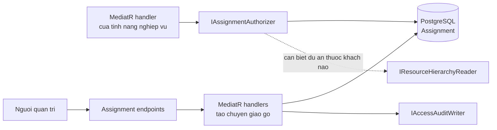
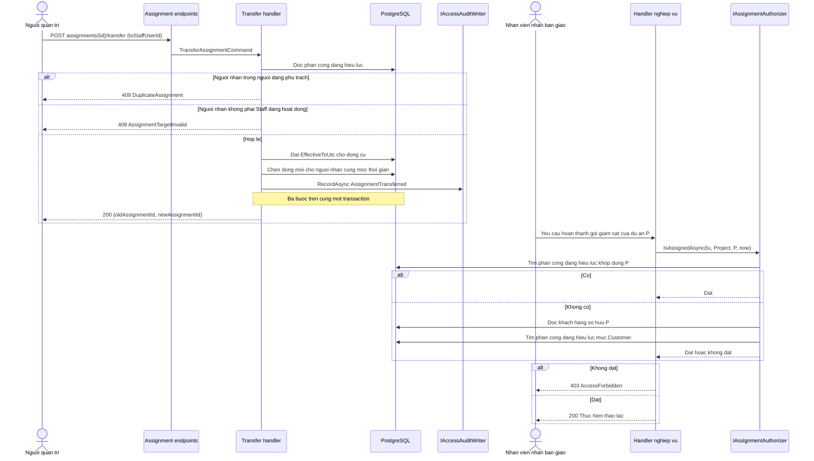
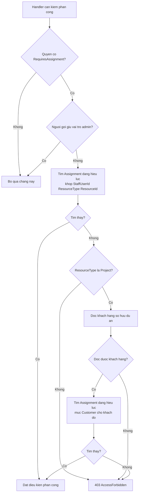
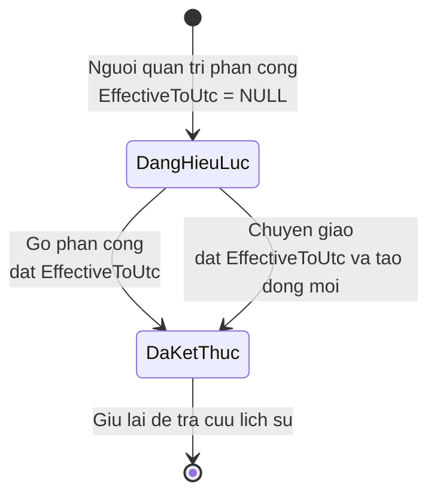
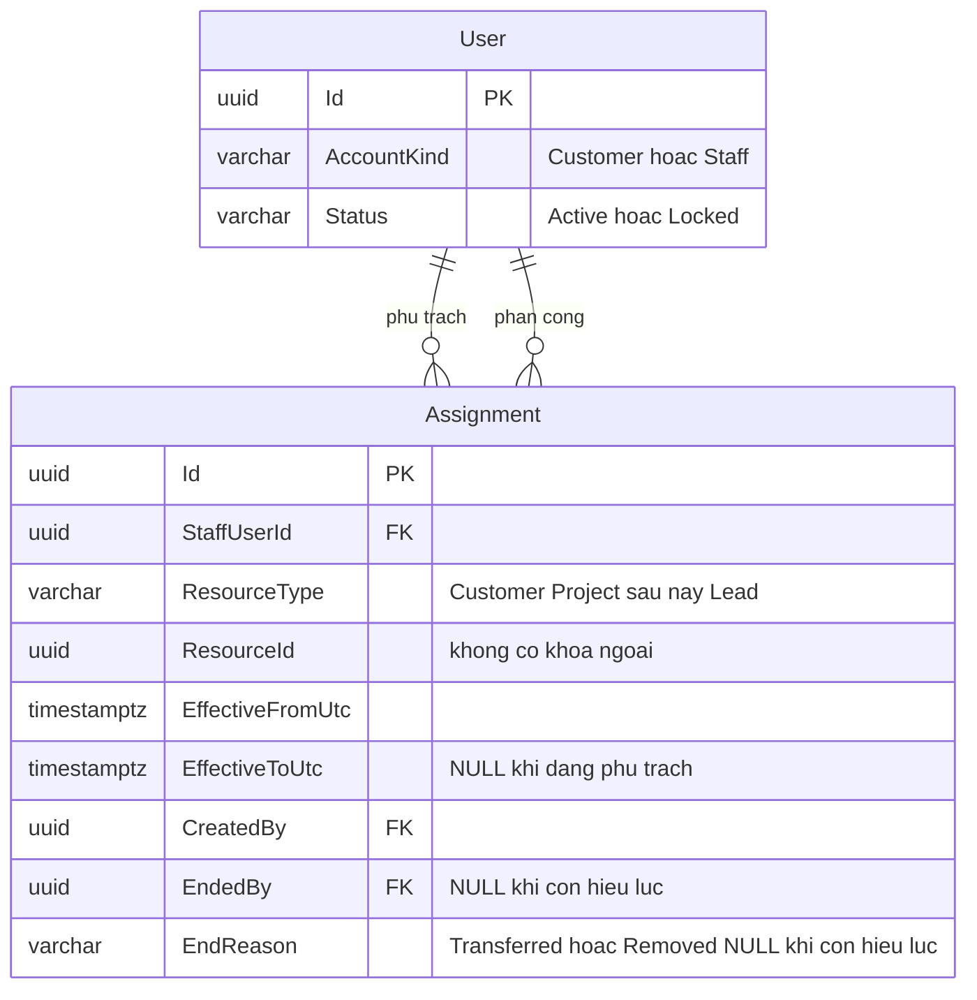

<!-- HƯỚNG DẪN CHO AI KHI ĐIỀN HOẶC CHỈNH SỬA MẪU
- Đọc toàn bộ mẫu, các comment hướng dẫn và tài liệu nguồn được cung cấp trước khi viết. Tuân thủ các quy tắc nghiệp vụ, điều kiện, ngoại lệ và giới hạn đã được xác nhận.
- Không bịa, tự chế hoặc suy đoán thành sự thật: yêu cầu, quy tắc, số liệu, API, schema, mã lỗi, nguồn tham khảo, người phụ trách và kết quả kiểm thử phải có căn cứ. Nội dung ví dụ trong mẫu không phải dữ kiện của dự án.
- Khi thiếu thông tin hoặc các nguồn mâu thuẫn, hỏi người dùng để làm rõ; giữ nguyên placeholder ở phần chưa xác định. Không tự chọn đáp án, lấp chỗ trống hay tuyên bố tài liệu đã hoàn tất.
- Chỉ thay nội dung cần điền hoặc được yêu cầu sửa. Không tự mở rộng phạm vi, sửa nghĩa quy tắc, bỏ điều kiện/ngoại lệ, xoá hay ghi đè nội dung hợp lệ đã có.
- Giữ nguyên tên, cấp và thứ tự heading, nhãn in đậm, tiền tố bullet, cấu trúc danh sách, tên/thứ tự/số cột bảng và cú pháp code fence. Không dịch, đổi tên, gộp hoặc thêm mục ngoài cấu trúc mẫu.
- Chỉ lặp khối luồng, AC hoặc API theo đúng khuôn khi có căn cứ; chỉ bỏ phần tuỳ chọn khi hướng dẫn riêng của mẫu cho phép và đã xác định không áp dụng.
- Mã tham chiếu và section phải trỏ tới tài liệu có thật đã được cung cấp hoặc kiểm chứng. Không giữ mã ví dụ như tham chiếu thật và không tự tạo tài liệu liên quan để hợp thức hoá liên kết.
- Giữ các comment hướng dẫn trong file. Xuất Markdown UTF-8, mỗi file một tài liệu; không bọc toàn bộ file trong code fence, không chèn lời dẫn hay giải thích ngoài mẫu.
- Trước khi bàn giao, đối chiếu nội dung với nguồn, kiểm tra cấu trúc, giá trị cho phép, giới hạn độ dài và tính nhất quán của mã/tham chiếu. Báo rõ phần chưa đủ thông tin; không tuyên bố đã chạy test hoặc import khi chưa thực hiện.
-->

<!-- Thay mã TDD-001 và nội dung ví dụ; giữ nguyên heading và nhãn in đậm.
Sơ đồ dùng mermaid, plantuml hoặc URL. Giữ heading Architecture, Sequence Diagram, Activity Diagram, State Diagram, Data Model.
Ví dụ API phải có heading trùng METHOD /path trong Endpoints. Xoá phần API/sơ đồ không dùng.
Version, Updated At và Change Log do lịch sử phiên bản quản lý, để trống khi nhập mới.
Author/Reviewer là tên hiển thị; gán tài khoản, phê duyệt, giả định và câu hỏi mở trên giao diện sau import.
Thiết kế phải truy vết về Story và Business Rule được cung cấp. Phân biệt thiết kế đề xuất với implementation đã kiểm chứng; không mô tả API/schema/sơ đồ ví dụ như hệ thống thật hoặc tự quyết định nghiệp vụ còn thiếu.
BẮT BUỘC KHI HOÀN THIỆN MẪU: phải có cả Reviewer và Approver, mỗi tên 1–200 ký tự sau khi bỏ khoảng trắng đầu/cuối. Không xoá hai dòng metadata, để trống, dùng tên bịa hoặc giữ placeholder rồi coi là hoàn tất.
Nếu chưa biết người review hoặc người phê duyệt, phải hỏi người dùng và báo tài liệu chưa đủ thông tin; không tự lấy Author/Owner làm người thay thế. Tên trong file không tự gán tài khoản hoặc xác nhận đã duyệt; gán thành viên trên giao diện sau import.
Đây là yêu cầu hoàn thiện mẫu; backend hiện vẫn nhận file cũ thiếu hai trường để tương thích.

VALIDATION CHO FILE NHẬP (đối chiếu ImportSnapshotValidator, MarkdownParser và ImportService):
- Mỗi file .md UTF-8 không rỗng chỉ có một heading cấp 1 chứa mã tài liệu dài 1–100 ký tự. Mã không được trùng trong cùng lần nhập hoặc thuộc loại tài liệu khác đã tồn tại.
- Không dùng tên README.md hoặc sitemap.md vì importer bỏ qua. Giao diện nhận .md/.zip, tối đa 2.000 file, tổng file tải lên 31 MiB; API giới hạn request 32 MiB và tổng nội dung đọc/giải nén 64 MiB.
- Chỉ nhập đè tài liệu cùng loại đang Draft, chưa có phiên bản và chưa lưu trữ. Import thay toàn bộ nội dung bản nháp, vì vậy phải giữ lại nội dung hợp lệ ngoài phần được yêu cầu sửa.
- Không dùng Status trong Markdown hoặc tên Approver để tự xác nhận phê duyệt; import không cấp quyền hay gán tài khoản từ tên. Chạy Kiểm tra file và xử lý lỗi/cảnh báo trước khi nhập.
- Giới hạn độ dài bên dưới tính theo string.Length của .NET (đơn vị UTF-16); không tự cắt ngắn dữ kiện quan trọng để vượt validation, hãy viết lại có căn cứ hoặc hỏi người dùng.
- Feature tối đa 300 ký tự và được dùng làm tiêu đề tài liệu. Status được parser nhận: Draft / In Review / Approved / Deprecated; tài liệu nhập mới vẫn có trạng thái phê duyệt Draft.
- Endpoint: đường dẫn tối đa 500 ký tự; tên/mô tả endpoint được lưu trong Name tối đa 300. HTTP method: GET / POST / PUT / PATCH / DELETE / HEAD / OPTIONS.
- Error Codes: mã tối đa 100 ký tự, không trùng trong tài liệu; giữ dạng - **CODE** (400): mô tả. HTTP status trong Error Codes và Response phải là số nguyên đọc được bằng Int32; không tự đặt status khác hợp đồng API.
- URL sơ đồ tối đa 1.000 ký tự. Mục sơ đồ được sử dụng phải có khối mermaid/plantuml hoặc URL theo mẫu; không để một mục sơ đồ rỗng. Nhãn mục được tách từ bullet như tên External API Fields tối đa 300 ký tự.
- Heading Examples phải khớp METHOD /path ở Endpoints. Giữ các nhãn Request:, Response 200: (thay mã theo contract) và Error Response: để parser tách đúng dữ liệu.
- Tham chiếu dạng DOC-KEY/section: ghi chú: mã đích tối đa 100 ký tự, section tối đa 100, ghi chú tối đa 1.000. Không trùng bộ mã đích + section + loại liên kết trong cùng tài liệu.
ĐỐI CHIẾU FORM TDD (src/features/tdds/validations.ts; form có thể chặt hơn import):
- Điền Feature, Author, Reviewer, Problem và ít nhất một Goal; các Goal/Non-goal/Notes đã thêm không được rỗng. API đã khai báo phải có endpoint và mô tả/mục đích; Fields phải có tên và ý nghĩa; Error Codes phải có mã, HTTP status và điều kiện.
- Form còn kiểm tra Version, Updated At và nội dung Change Log khi khai báo; với file nhập mới, giữ các trường lịch sử này trống theo hợp đồng import, không tự tạo dữ liệu lịch sử.
-->

# TDD-RBAC-003

## Document Info

- **Feature**: Phân công tài nguyên cho nhân viên, chuyển giao và điều kiện sửa hẹp
- **Author**: Claude
- **Reviewer**: Tân Trần
- **Approver**: Tân Trần
- **Status**: Draft
- **Version**:
- **Updated At**:

## Context & Goals

### Problem

`BR-SUB-011` và `BR-SUB-012` đã chốt chỉ Admin hoặc nhân viên **đang phụ trách dự án** mới được hoàn thành hoặc mở lại gói giám sát, nhưng `BR-SUB-011/Notes` ghi rõ cách lưu dữ liệu và quản lý phân công để lại cho bước thiết kế. `TDD-SUB-003` khai báo sẵn một đầu đọc phân công dự án và nói thẳng rằng module dự án và module phân công nhân viên chưa tồn tại.

`STORY-RBAC-003` chốt mô hình chung: phân công ghi theo loại tài nguyên, hiện có khách hàng và dự án, sau này thêm lead mà không phải dựng cơ chế thứ hai. Kèm theo đó là ba yêu cầu khó:

- Phân công ở mức khách hàng phải có hiệu lực xuống các dự án của khách đó (`BR-RBAC-013` điểm 3).
- Nhiều người phụ trách cùng một tài nguyên được phép, kể cả khi một người ở mức khách hàng và một người ở mức dự án (`BR-RBAC-013` điểm 4).
- Thu hồi vai trò bị chặn khi còn phân công đang hiệu lực, còn khóa tài khoản thì không (`BR-RBAC-007` và `BR-RBAC-008`).

### Goals

- Một bảng phân công chung dùng được cho nhiều loại tài nguyên, để tính năng chia lead sau này không cần bảng mới.
- Trả lời được câu hỏi "người này có đang phụ trách tài nguyên kia tại thời điểm thao tác không" bằng một truy vấn, gồm cả trường hợp kế thừa từ khách hàng xuống dự án.
- Chuyển giao và gỡ phân công giữ đủ dấu vết để tra được ai từng phụ trách tài nguyên nào.

### Non-goals

- Tính năng chia lead, gồm cả chia thủ công và chia tự động. Tài liệu này chỉ bảo đảm cơ chế dùng lại được.
- Định nghĩa schema của module khách hàng và module dự án. Phân công chỉ tham chiếu tới chúng theo định danh.
- Tự động chia lại tài nguyên khi nhân viên bị khóa, và quy tắc cân bằng số lượng giữa các nhân viên.
- Mô hình vai trò – quyền và vòng đời tài khoản. Xem [TDD-RBAC-001](TDD-RBAC-001.md) và [TDD-RBAC-002](TDD-RBAC-002.md).

## Architecture

Phân công là chặng thứ ba trong ba chặng kiểm tra mô tả ở [TDD-RBAC-001](TDD-RBAC-001.md#architecture). Chặng này nằm trong handler chứ không ở endpoint, vì chỉ trong handler mới biết tài nguyên đích là cái nào.



### Một bảng cho nhiều loại tài nguyên

Bảng `Assignment` không có khóa ngoại tới khách hàng hay dự án. Thay vào đó mỗi dòng mang một cặp `ResourceType` và `ResourceId`. Đây là cách để thêm loại tài nguyên mới, ví dụ lead, chỉ bằng một giá trị mới trong `ResourceType` mà không cần bảng mới hay cột mới.

Giá phải trả là database không tự bảo đảm `ResourceId` trỏ tới một bản ghi có thật, vì không có khóa ngoại nào để kiểm. Việc kiểm tài nguyên tồn tại phải nằm ở handler, và nếu một dự án bị xóa thì dòng phân công trở thành mồ côi mà database không báo. Chấp nhận đánh đổi này vì hai lý do: module dự án và module khách hàng chưa tồn tại nên chưa có bảng nào để trỏ tới, và yêu cầu nghiệp vụ nói rõ cơ chế phải mở cho loại tài nguyên tương lai.

Việc kiểm tài nguyên tồn tại vì vậy cũng chưa làm được: handler hiện chỉ kiểm `ResourceType` thuộc tập giá trị đã biết và nhận mọi `ResourceId` hợp lệ. Xem [nợ kỹ thuật](../debt/assignment-resource-check.md) để biết hệ quả và cách trả.

Nếu sau này chỉ còn đúng hai loại tài nguyên cố định và cả hai đều có bảng, có thể đổi sang hai cột khóa ngoại riêng cho chặt hơn. Mốc để xem lại chưa được xác định.

### Hiệu lực theo thời gian thay vì xóa dòng

Gỡ phân công không xóa dòng mà đặt `EffectiveToUtc`. Chuyển giao là đặt `EffectiveToUtc` cho dòng cũ và chèn dòng mới cho người nhận, tại cùng một mốc thời gian, trong cùng một transaction.

Làm vậy vì `STORY-RBAC-003/Non-Functional` đòi tra được ai từng phụ trách tài nguyên nào, và vì `BR-RBAC-008` đòi các phân công của người bị khóa vẫn còn để chia lại. Nếu gỡ bằng cách xóa dòng thì cả hai yêu cầu đều không đáp ứng được, và `AccessAuditLog` một mình không đủ vì nó ghi theo thao tác chứ không trả lời được câu hỏi "trong khoảng thời gian này ai phụ trách dự án P".

Một dòng còn hiệu lực khi `EffectiveToUtc IS NULL`. Không dùng `EffectiveToUtc > now()` làm điều kiện chính, vì thiết kế này không có phân công hẹn trước ngày kết thúc; mọi lần kết thúc đều xảy ra ngay tại thời điểm thao tác.

### Kế thừa từ khách hàng xuống dự án

`BR-RBAC-013` điểm 3 nói nhân viên phụ trách một khách hàng thì thao tác được trên các dự án của khách đó. Kiểm tra vì vậy phải xét hai khả năng, không chỉ một.

`IAssignmentAuthorizer.IsAssignedAsync(staffUserId, resourceType, resourceId, atUtc)` làm như sau:

1. Nếu có dòng phân công đang hiệu lực khớp đúng `(staffUserId, resourceType, resourceId)` thì đạt, dừng.
2. Nếu `resourceType` là `Project`, hỏi `IResourceHierarchyReader` xem dự án đó thuộc khách hàng nào, rồi kiểm tiếp có dòng phân công đang hiệu lực khớp `(staffUserId, 'Customer', customerId)` không. Có thì đạt.
3. Không rơi vào hai trường hợp trên thì không đạt.

Bước 2 cần một lần đọc để biết dự án thuộc khách nào. `IResourceHierarchyReader` là cổng để làm việc đó mà không buộc module phân quyền phụ thuộc trực tiếp vào module dự án — module dự án hiện chưa tồn tại. Khi module đó ra đời, nó hiện thực cổng này.

Thứ tự hai bước có chủ đích: trường hợp phổ biến là phân công đúng dự án, nên kiểm nó trước để phần lớn yêu cầu chỉ tốn một truy vấn. Chỉ khi trượt mới tốn thêm một lần đọc quan hệ.

Kế thừa chỉ đi một chiều, từ khách hàng xuống dự án. Phụ trách một dự án **không** cho thao tác trên khách hàng hay trên các dự án khác của cùng khách. Đây là cách hiểu trực tiếp của `BR-RBAC-013` điểm 3, không suy rộng thêm.

### Nhiều người cùng phụ trách một tài nguyên

`BR-RBAC-013` điểm 4 cho phép một tài nguyên có nhiều người phụ trách, kể cả khi một người ở mức khách hàng và một người khác ở mức dự án. Vì vậy **không** có ràng buộc duy nhất trên `(ResourceType, ResourceId)` giữa các dòng đang hiệu lực.

Ràng buộc duy nhất chỉ đặt ở mức chặt hơn: `(StaffUserId, ResourceType, ResourceId)` giữa các dòng đang hiệu lực. Nó chặn đúng một tình huống — cùng một người được phân công hai lần cùng một tài nguyên — tức `STORY-RBAC-003/EXC-03`, mà không cản trở việc hai người khác nhau cùng phụ trách.

Ví dụ hợp lệ: chị Mai phụ trách khách hàng K; anh Tú phụ trách riêng dự án P thuộc K. Cả hai cùng thao tác được trên P. Hệ thống không gỡ phân công nào để nhường chỗ. Ví dụ bị chặn: chuyển giao dự án P từ anh Tú sang chính anh Tú.

### Thu hồi vai trò đếm phân công nào

`BR-RBAC-007` nói thu hồi vai trò bị chặn khi còn phân công đang hiệu lực **dựa trên vai trò đó**. Điều này cần làm rõ vì `Assignment` không có cột trỏ tới vai trò.

Cách xác định: một phân công đang hiệu lực được coi là dựa trên vai trò `R` nếu sau khi gỡ `R` khỏi người đó, người đó không còn quyền có gắn phân công nào áp dụng cho loại tài nguyên của phân công ấy. Nói ngắn gọn: nếu thu hồi `R` làm phân công trở thành vô dụng thì phân công đó đang dựa vào `R`.

Với chín quyền khởi tạo, chỉ `supervision.complete` có `RequiresAssignment = true`, nên phép kiểm rút gọn thành: nếu sau khi gỡ `R` mà người đó không còn `supervision.complete`, thì mọi phân công đang hiệu lực của người đó đều được tính vào con số chặn. Ngược lại, người đó còn `supervision.complete` qua một vai trò khác thì thu hồi `R` không bị chặn, đúng `STORY-RBAC-002/ALT-02`.

Cách tính này đặt ở handler thu hồi vai trò, mô tả trong [TDD-RBAC-002](TDD-RBAC-002.md#architecture); tài liệu này cung cấp truy vấn đếm.

### Nơi từng Business Rule được thực hiện

| Quy tắc | Nơi thực hiện |
|---|---|
| BR-RBAC-005 | Kiểm `User.AccountKind = 'Staff'` trong handler tạo phân công |
| BR-RBAC-007 | Truy vấn đếm phân công đang hiệu lực, gọi từ handler thu hồi vai trò |
| BR-RBAC-008 | Không đụng tới `Assignment` khi khóa tài khoản; các dòng giữ nguyên |
| BR-RBAC-010 | `IAssignmentAuthorizer.IsAssignedAsync` gọi từ handler của tính năng có quyền gắn phân công |
| BR-RBAC-011 | Policy `assignment.manage` ở endpoint phân công |
| BR-RBAC-012 | `IAccessAuditWriter` với ba hành động `AssignmentCreated`, `AssignmentTransferred`, `AssignmentEnded` |
| BR-RBAC-013 | Bảng `Assignment`, index duy nhất có lọc, và hai bước kiểm kế thừa |

**Notes**:
- Chặng kiểm phân công đặt trong handler chứ không thành một pipeline behavior của MediatR, vì tài nguyên đích thường phải đọc từ database mới biết. Ví dụ `supervision.complete` nhận vào mã gói giám sát, còn điều kiện phân công lại xét trên dự án gắn với gói đó; một behavior chạy trước handler không có sẵn thông tin này mà không tự đi truy vấn thêm.
- `IAssignmentAuthorizer` và `IResourceHierarchyReader` khai báo ở `src/bmt-be.application/abstractions/`. Đã triển khai ngày 23/09/2026: `AssignmentAuthorizer` nằm ở `src/bmt-be.application/services/`. `IResourceHierarchyReader` hiện chỉ có bản tạm `UnavailableResourceHierarchyReader` ném lỗi khi bị gọi, vì module dự án chưa tồn tại; module đó ra đời thì thay bản tạm này.
- `TDD-SUB-003` đang khai báo một đầu đọc phân công riêng cho dự án. Khi cập nhật tài liệu đó, đầu đọc riêng nên thay bằng `IAssignmentAuthorizer` để chỉ còn một nguồn sự thật về việc ai phụ trách gì.
- Danh sách tài nguyên chưa có người phụ trách, theo `STORY-RBAC-003/ALT-04`, cần liệt kê được toàn bộ khách hàng và dự án rồi trừ đi những cái đang có phân công. Module khách hàng và module dự án chưa tồn tại nên **endpoint này chưa triển khai được**; hợp đồng đã mô tả ở Internal API để bên gọi biết trước hình dạng.

## Sequence Diagram

Chuyển giao một phân công, rồi một nhân viên dùng quyền có gắn phân công.



## Activity Diagram

Kiểm tra điều kiện phân công, gồm cả nhánh kế thừa từ khách hàng.



Nhánh Admin ở bước thứ hai thực hiện phần Except của `BR-RBAC-013`: `BR-SUB-011` và `BR-SUB-012` đã chốt Admin thao tác được trên gói giám sát mà không cần phân công dự án.

## State Diagram

Vòng đời một dòng phân công.



Dòng đã kết thúc không quay lại `DangHieuLuc`. Muốn giao lại tài nguyên cho đúng người cũ thì tạo một dòng mới, để hai khoảng thời gian phụ trách tách bạch khi tra cứu. Khóa tài khoản không làm dòng đổi trạng thái: người bị khóa vẫn còn phân công `DangHieuLuc` nhưng không thao tác được vì phiên đã bị cắt.

## Data Model

Một bảng mới. Các bảng `User`, `Role`, `UserRole` và `AccessAuditLog` được định nghĩa ở [TDD-RBAC-001](TDD-RBAC-001.md#data-model).

### `Assignment` — ai phụ trách tài nguyên nào

Một dòng là **một khoảng thời gian một nhân viên phụ trách một tài nguyên cụ thể**. Dòng được tạo khi người quản trị phân công hoặc chuyển giao; được cập nhật đúng một lần trong đời, khi đặt `EffectiveToUtc` lúc gỡ hoặc lúc chuyển giao. Không bao giờ bị xóa.

Bảng này không có khóa ngoại tới khách hàng hay dự án, vì nó phải phục vụ nhiều loại tài nguyên và vì hai module đó chưa tồn tại. Việc kiểm tài nguyên có thật nằm ở handler.

| Cột | Kiểu | Ràng buộc | Ý nghĩa |
|---|---|---|---|
| `Id` | uuid | PK | |
| `StaffUserId` | uuid | FK `User(Id)` ON DELETE RESTRICT, NOT NULL | Nhân viên phụ trách. `RESTRICT` để không mất lịch sử phụ trách khi xóa tài khoản |
| `ResourceType` | varchar(32) | NOT NULL | `Customer` hoặc `Project`. Giá trị mới thêm sau, ví dụ `Lead`, dùng chung bảng này |
| `ResourceId` | uuid | NOT NULL | Định danh tài nguyên. Không có khóa ngoại |
| `EffectiveFromUtc` | timestamptz | NOT NULL | Thời điểm bắt đầu phụ trách |
| `EffectiveToUtc` | timestamptz | NULL | NULL nghĩa là **đang phụ trách**. Có giá trị nghĩa là đã gỡ hoặc đã chuyển giao |
| `CreatedBy` | uuid | FK `User(Id)`, NOT NULL | Người quản trị đã phân công |
| `EndedBy` | uuid | FK `User(Id)`, NULL | Người quản trị đã gỡ hoặc chuyển giao. NULL khi dòng còn hiệu lực |
| `EndReason` | varchar(20) | NULL | `Transferred` hoặc `Removed`. NULL khi dòng còn hiệu lực |

`EndReason` phân biệt hai lý do kết thúc dẫn tới hai hệ quả khác nhau: chuyển giao thì tài nguyên vẫn có người phụ trách, còn gỡ thì tài nguyên rơi vào danh sách chưa có người phụ trách. Không có cột nào trỏ từ dòng cũ sang dòng mới khi chuyển giao; quan hệ đó tra qua `AccessAuditLog` hoặc qua việc hai dòng có cùng `ResourceType`, `ResourceId` và liền nhau về thời gian.

### Sơ đồ quan hệ



### Dữ liệu mẫu

Toàn bộ mẫu dưới đây là **dữ liệu giả định để giải thích thiết kế**, không phải dữ liệu thật và không phải kết quả đã ghi database. ID viết dạng bí danh; các cột không liên quan được lược bớt. Thời gian theo UTC.

Tình huống xuyên suốt: khách hàng K có hai dự án P1 và P2. Chị Mai phụ trách khách hàng K. Anh Tú phụ trách riêng dự án P1.

**Bước 1 — chị Lan phân công lúc 02:00 ngày 22/09/2026.** Hai dòng ở hai mức khác nhau:

| Id | StaffUserId | ResourceType | ResourceId | EffectiveFromUtc | EffectiveToUtc | EndReason |
|---|---|---|---|---|---|---|
| `asg-1` | `user-mai` | Customer | `cust-k` | 2026-09-22T02:00:00Z | NULL | NULL |
| `asg-2` | `user-tu` | Project | `proj-p1` | 2026-09-22T02:05:00Z | NULL | NULL |

Kết quả kiểm tra quyền thao tác, giả sử cả hai đều có `supervision.complete`:

| Người | Tài nguyên | Đạt | Vì sao |
|---|---|---|---|
| Chị Mai | P1 | Có | Trượt bước 1, đạt bước 2 nhờ `asg-1` ở mức khách hàng |
| Chị Mai | P2 | Có | Tương tự, cùng khách hàng K |
| Anh Tú | P1 | Có | Đạt ngay bước 1 nhờ `asg-2` |
| Anh Tú | P2 | Không | Trượt bước 1; anh Tú không phụ trách khách hàng K nên trượt bước 2 |

Hai dòng cùng cho phép thao tác trên P1, và hệ thống không gỡ dòng nào. Đây đúng `BR-RBAC-013` điểm 4.

**Bước 2 — chuyển giao P1 từ anh Tú sang anh Nam lúc 05:00 ngày 25/09/2026.** Dòng cũ kết thúc, dòng mới xuất hiện tại cùng mốc:

| Id | StaffUserId | ResourceType | ResourceId | EffectiveFromUtc | EffectiveToUtc | EndedBy | EndReason |
|---|---|---|---|---|---|---|---|
| `asg-2` | `user-tu` | Project | `proj-p1` | 2026-09-22T02:05:00Z | 2026-09-25T05:00:00Z | `user-lan` | Transferred |
| `asg-3` | `user-nam` | Project | `proj-p1` | 2026-09-25T05:00:00Z | NULL | NULL | NULL |

Từ 05:00, anh Tú không còn thao tác được trên P1 vì dòng của anh đã có `EffectiveToUtc`. Anh Nam thao tác được. Chị Mai vẫn thao tác được trên P1 qua `asg-1`, vì chuyển giao ở mức dự án không đụng tới phân công mức khách hàng.

**Bước 3 — gỡ phân công của chị Mai lúc 08:00 ngày 26/09/2026, không chuyển cho ai:**

| Id | StaffUserId | ResourceType | ResourceId | EffectiveToUtc | EndedBy | EndReason |
|---|---|---|---|---|---|---|
| `asg-1` | `user-mai` | Customer | `cust-k` | 2026-09-26T08:00:00Z | `user-lan` | Removed |

Sau bước này, khách hàng K không còn ai phụ trách ở mức khách hàng, và P2 không còn ai thao tác được. P1 vẫn có anh Nam qua `asg-3`. Ba dòng `asg-1`, `asg-2` và `asg-3` đều còn trong bảng, nên tra cứu lịch sử cho biết chị Mai phụ trách K từ 22/09 tới 26/09 và anh Tú phụ trách P1 từ 22/09 tới 25/09.

**Bước 4 — anh Nam bị khóa tài khoản lúc 10:00 ngày 30/09/2026.** Dòng `asg-3` **không đổi**: `EffectiveToUtc` vẫn NULL, `EndReason` vẫn NULL. Anh Nam không thao tác được trên P1 vì phiên đã bị cắt theo [TDD-RBAC-002](TDD-RBAC-002.md), không phải vì phân công bị gỡ. Chị Lan mở danh sách phân công đang hiệu lực của anh Nam, thấy P1, và chuyển sang người khác khi thu xếp được.

**Bước 5 — thử chuyển P1 từ anh Nam sang chính anh Nam.** Yêu cầu bị từ chối với `DuplicateAssignment`; bảng không đổi. Nếu không chặn, thao tác này sẽ đóng `asg-3` rồi mở một dòng mới cho cùng người, làm gãy lịch sử phụ trách mà không đem lại thay đổi nào.

**Notes**:

- **Index duy nhất có lọc** trên `(StaffUserId, ResourceType, ResourceId) WHERE EffectiveToUtc IS NULL` chặn việc cùng một người được phân công hai lần cùng một tài nguyên. Cố ý **không** đặt duy nhất trên `(ResourceType, ResourceId)` vì `BR-RBAC-013` điểm 4 cho phép nhiều người cùng phụ trách. Index này cũng là index chính cho bước 1 của phép kiểm, vì nó bắt đầu bằng `StaffUserId`.
- **Index** `(StaffUserId, EffectiveToUtc) WHERE EffectiveToUtc IS NULL` phục vụ hai truy vấn hay chạy: đếm phân công đang hiệu lực khi thu hồi vai trò, và liệt kê tài nguyên một người đang phụ trách. `(ResourceType, ResourceId, EffectiveToUtc)` phục vụ chiều ngược lại, liệt kê ai đang phụ trách một tài nguyên và tra lịch sử của tài nguyên đó.
- **Khóa khi chuyển giao**: handler chuyển giao đọc dòng phân công bằng truy vấn có tracking và khóa dòng, để hai yêu cầu chuyển giao cùng một phân công chạy song song không cùng đóng dòng cũ rồi tạo ra hai dòng mới cho hai người nhận khác nhau. Index duy nhất có lọc chặn được trường hợp hai dòng mới cho cùng một người, nhưng không chặn được hai người khác nhau — nên phải khóa ở tầng dòng chứ không dựa vào index.
- **Transaction**: kết thúc dòng cũ và chèn dòng mới nằm trong cùng một transaction do `TransactionPipelineBehavior` mở, cùng với dòng nhật ký ghi bằng `RecordAsync`. Không có trạng thái trung gian nào mà tài nguyên vừa mất người cũ vừa chưa có người mới.
- **Migration**: bảng `Assignment` được tạo trong cùng migration với các bảng của [TDD-RBAC-001](TDD-RBAC-001.md). Bảng mới hoàn toàn, không có bước backfill vì hệ thống chưa từng có dữ liệu phân công. Không áp dụng migration ở bước thiết kế này.
- **Dòng mồ côi**: vì không có khóa ngoại tới tài nguyên, xóa một dự án sẽ để lại dòng phân công trỏ tới định danh không còn tồn tại. Phép kiểm quyền vẫn an toàn, vì nó hỏi "người này có phụ trách tài nguyên kia không" chứ không hỏi ngược lại. Việc dọn dòng mồ côi sẽ thiết kế cùng module dự án; chưa có cơ chế cho việc đó.

## Internal API

Đã triển khai ngày 23/09/2026, trừ `GET /assignments/unassigned`.

### Endpoints

- **GET** `/api/v1/assignments` — Danh sách phân công, lọc theo `staffUserId`, `resourceType`, `resourceId`, `activeOnly`, có phân trang. Cần quyền `assignment.manage`.
- **POST** `/api/v1/assignments` — Phân công một tài nguyên cho một nhân viên. Cần quyền `assignment.manage`.
- **POST** `/api/v1/assignments/{assignmentId}/transfer` — Chuyển giao sang nhân viên khác. Cần quyền `assignment.manage`.
- **DELETE** `/api/v1/assignments/{assignmentId}` — Gỡ phân công, không chuyển cho ai. Cần quyền `assignment.manage`.
- **GET** `/api/v1/assignments/unassigned` — Tài nguyên chưa có người phụ trách, lọc theo `resourceType`. Cần quyền `assignment.manage`. **Chưa triển khai được** vì cần module khách hàng và module dự án để liệt kê toàn bộ tài nguyên.

### Examples

#### POST /api/v1/assignments

```
Request:
{"staffUserId": "user-mai", "resourceType": "Customer", "resourceId": "cust-k"}

Response 201:
{"id": "asg-1", "staffUserId": "user-mai", "resourceType": "Customer", "resourceId": "cust-k", "effectiveFromUtc": "2026-09-22T02:00:00Z", "effectiveToUtc": null}

Error Response:
{"code": "AssignmentTargetInvalid", "detail": "Chỉ phân công được cho tài khoản nhân viên đang hoạt động"}
```

#### POST /api/v1/assignments/{assignmentId}/transfer

```
Request:
{"toStaffUserId": "user-nam"}

Response 200:
{"endedAssignmentId": "asg-2", "newAssignmentId": "asg-3", "effectiveAtUtc": "2026-09-25T05:00:00Z"}

Error Response:
{"code": "DuplicateAssignment", "detail": "Người nhận đang là người phụ trách tài nguyên này"}
```

#### GET /api/v1/assignments?staffUserId=user-nam&activeOnly=true

```
Response 200:
{"items": [{"id": "asg-3", "staffUserId": "user-nam", "resourceType": "Project", "resourceId": "proj-p1", "effectiveFromUtc": "2026-09-25T05:00:00Z", "effectiveToUtc": null}], "pageIndex": 1, "pageSize": 20, "totalCount": 1}
```

Đây là truy vấn mà màn hình chia lại tài nguyên của một nhân viên bị khóa sẽ dùng, theo `STORY-RBAC-003/ALT-05`. Tài khoản bị khóa vẫn xuất hiện trong kết quả vì phân công của họ không bị gỡ.

### Error Codes

- **AccessForbidden** (403): Thiếu quyền `assignment.manage`, hoặc thiếu điều kiện phân công khi dùng quyền có gắn phân công.
- **AssignmentTargetInvalid** (409): Người nhận không phải tài khoản nhân viên đang hoạt động, gồm cả tài khoản khách hàng và tài khoản đang bị khóa.
- **DuplicateAssignment** (409): Người nhận đã đang phụ trách chính tài nguyên đó.
- **AssignmentNotFound** (404): Phân công không tồn tại.
- **AssignmentAlreadyEnded** (409): Phân công đã kết thúc hiệu lực, không chuyển giao hoặc gỡ lại được.
- **ResourceTypeUnknown** (422): `resourceType` không thuộc tập giá trị hệ thống biết. Kiểm ở validator nên trả 422, cùng nhánh với các lỗi đầu vào khác.

## References

### User Stories

- STORY-RBAC-003

### Business Rules

- BR-RBAC-005/Then
- BR-RBAC-007/Then
- BR-RBAC-008/Then
- BR-RBAC-010/Then
- BR-RBAC-011/Then
- BR-RBAC-012/Then
- BR-RBAC-013/Then
- BR-SUB-011/Then
- BR-SUB-012/Then

### Use Cases

### Others

- Tài liệu kỹ thuật: [TDD-RBAC-001](TDD-RBAC-001.md) mô hình vai trò – quyền và nhật ký; [TDD-RBAC-002](TDD-RBAC-002.md) vòng đời tài khoản nhân viên.
- Tài liệu kỹ thuật: [TDD-SUB-003](TDD-SUB-003.md) đang khai báo một đầu đọc phân công riêng cho dự án; cần cập nhật để dùng `IAssignmentAuthorizer` thay vì giữ hai nguồn sự thật.

## Change Log

- 2026-09-23: Sửa Sequence Diagram cho khớp bảng BR-RBAC-012: chuyển giao ghi một dòng nhật ký `AssignmentTransferred` với người cũ ở `BeforeJson` và người mới ở `AfterJson`, thay vì hai dòng `AssignmentEnded` và `AssignmentCreated`. Hai dòng sẽ làm hành động `AssignmentTransferred` trong bảng không bao giờ được dùng.
- 2026-09-23: Đã triển khai bốn endpoint phân công, `IAssignmentAuthorizer` và khóa dòng khi chuyển giao. `IResourceHierarchyReader` mới có bản tạm ném lỗi, và việc kiểm tài nguyên tồn tại được ghi thành nợ kỹ thuật. `GET /assignments/unassigned` vẫn chưa triển khai được.
- 2026-09-20: Bỏ nhắc tới trạng thái `PendingActivation` theo quyết định bỏ luồng mời qua email ở [TDD-RBAC-002](TDD-RBAC-002.md). Cơ chế phân công và chuyển giao không đổi.
