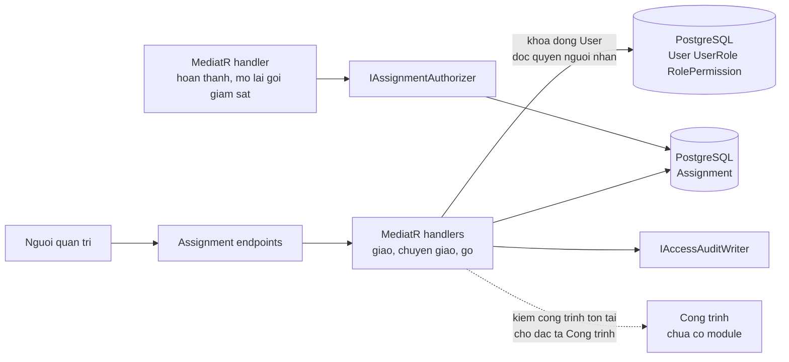
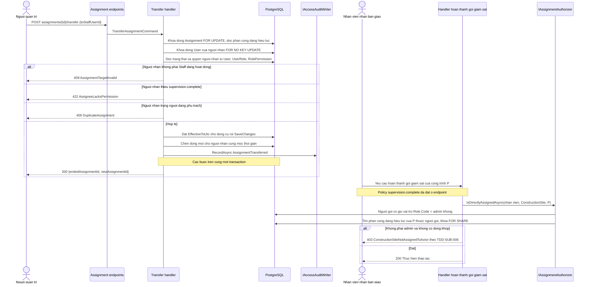
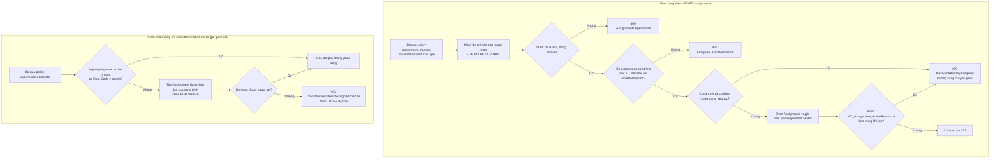
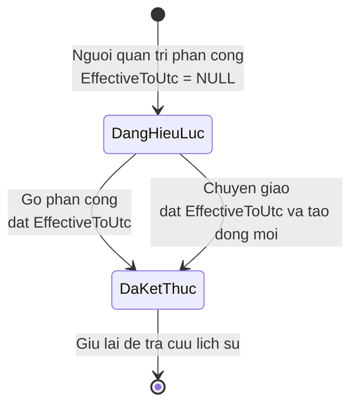
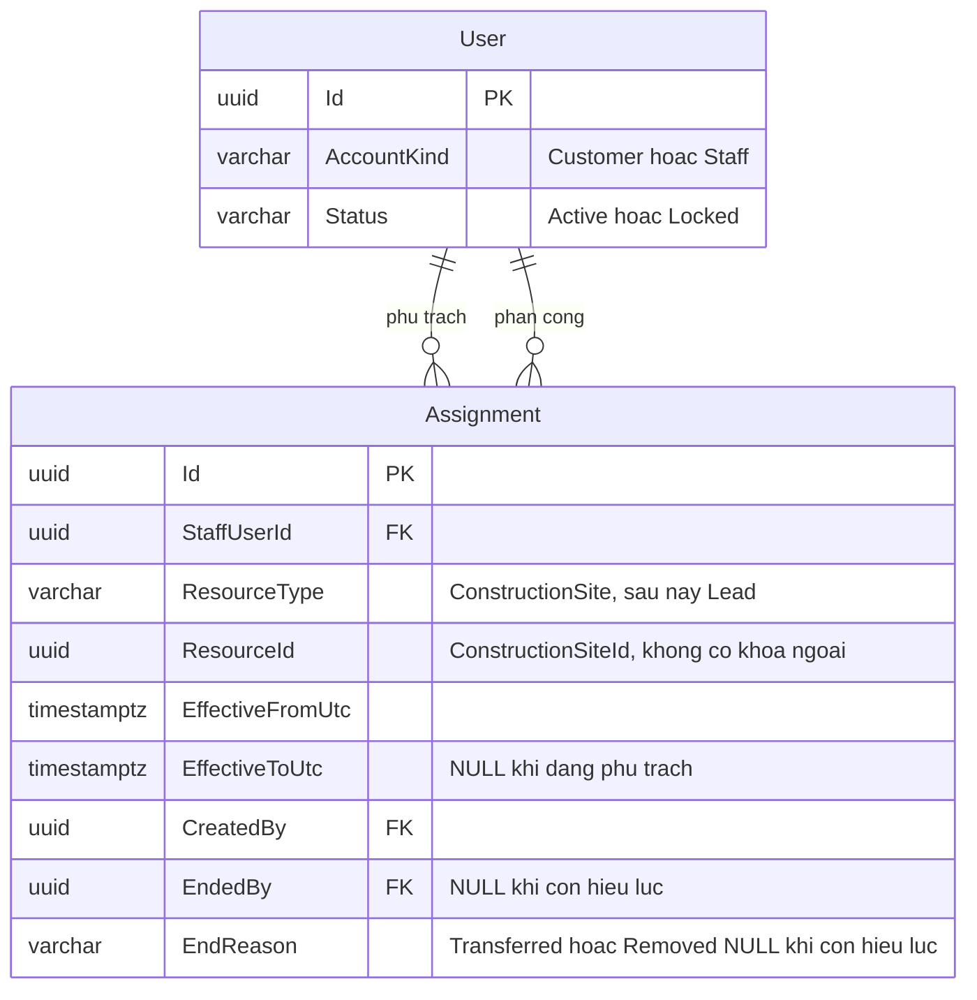

<!-- HƯỚNG DẪN CHO AI KHI ĐIỀN HOẶC CHỈNH SỬA MẪU
- Đọc toàn bộ mẫu, các comment hướng dẫn và tài liệu nguồn được cung cấp trước khi viết. Tuân thủ các quy tắc nghiệp vụ, điều kiện, ngoại lệ và giới hạn đã được xác nhận.
- Không bịa, tự chế hoặc suy đoán thành sự thật: yêu cầu, quy tắc, số liệu, API, schema, mã lỗi, nguồn tham khảo, người phụ trách và kết quả kiểm thử phải có căn cứ. Nội dung ví dụ trong mẫu không phải dữ kiện của dự án.
- Khi thiếu thông tin hoặc các nguồn mâu thuẫn, hỏi người dùng để làm rõ; giữ nguyên placeholder ở phần chưa xác định. Không tự chọn đáp án, lấp chỗ trống hay tuyên bố tài liệu đã hoàn tất.
- Chỉ thay nội dung cần điền hoặc được yêu cầu sửa. Không tự mở rộng phạm vi, sửa nghĩa quy tắc, bỏ điều kiện/ngoại lệ, xoá hay ghi đè nội dung hợp lệ đã có.
- Giữ nguyên tên, cấp và thứ tự heading, nhãn in đậm, tiền tố bullet, cấu trúc danh sách, tên/thứ tự/số cột bảng và cú pháp code fence. Không dịch, đổi tên, gộp hoặc thêm mục ngoài cấu trúc mẫu.
- Chỉ lặp khối luồng, AC hoặc API theo đúng khuôn khi có căn cứ; chỉ bỏ phần tuỳ chọn khi hướng dẫn riêng của mẫu cho phép và đã xác định không áp dụng.
- Mã tham chiếu và section phải trỏ tới tài liệu có thật đã được cung cấp hoặc kiểm chứng. Không giữ mã ví dụ như tham chiếu thật và không tự tạo tài liệu liên quan để hợp thức hoá liên kết.
- Giữ các comment hướng dẫn trong file. Xuất Markdown UTF-8, mỗi file một tài liệu; không bọc toàn bộ file trong code fence, không chèn lời dẫn hay giải thích ngoài mẫu.
- Trước khi bàn giao, đối chiếu nội dung với nguồn, kiểm tra cấu trúc, giá trị cho phép, giới hạn độ dài và tính nhất quán của mã/tham chiếu. Báo rõ phần chưa đủ thông tin; không tuyên bố đã chạy test hoặc import khi chưa thực hiện.
-->

<!-- Thay mã TDD-001 và nội dung ví dụ; giữ nguyên heading và nhãn in đậm.
Sơ đồ dùng mermaid, plantuml hoặc URL. Giữ heading Architecture, Sequence Diagram, Activity Diagram, State Diagram, Data Model.
Ví dụ API phải có heading trùng METHOD /path trong Endpoints. Xoá phần API/sơ đồ không dùng.
Version, Updated At và Change Log do lịch sử phiên bản quản lý, để trống khi nhập mới.
Author/Reviewer là tên hiển thị; gán tài khoản, phê duyệt, giả định và câu hỏi mở trên giao diện sau import.
Thiết kế phải truy vết về Story và Business Rule được cung cấp. Phân biệt thiết kế đề xuất với implementation đã kiểm chứng; không mô tả API/schema/sơ đồ ví dụ như hệ thống thật hoặc tự quyết định nghiệp vụ còn thiếu.
BẮT BUỘC KHI HOÀN THIỆN MẪU: phải có cả Reviewer và Approver, mỗi tên 1–200 ký tự sau khi bỏ khoảng trắng đầu/cuối. Không xoá hai dòng metadata, để trống, dùng tên bịa hoặc giữ placeholder rồi coi là hoàn tất.
Nếu chưa biết người review hoặc người phê duyệt, phải hỏi người dùng và báo tài liệu chưa đủ thông tin; không tự lấy Author/Owner làm người thay thế. Tên trong file không tự gán tài khoản hoặc xác nhận đã duyệt; gán thành viên trên giao diện sau import.
Đây là yêu cầu hoàn thiện mẫu; backend hiện vẫn nhận file cũ thiếu hai trường để tương thích.

VALIDATION CHO FILE NHẬP (đối chiếu ImportSnapshotValidator, MarkdownParser và ImportService):
- Mỗi file .md UTF-8 không rỗng chỉ có một heading cấp 1 chứa mã tài liệu dài 1–100 ký tự. Mã không được trùng trong cùng lần nhập hoặc thuộc loại tài liệu khác đã tồn tại.
- Không dùng tên README.md hoặc sitemap.md vì importer bỏ qua. Giao diện nhận .md/.zip, tối đa 2.000 file, tổng file tải lên 31 MiB; API giới hạn request 32 MiB và tổng nội dung đọc/giải nén 64 MiB.
- Chỉ nhập đè tài liệu cùng loại đang Draft, chưa có phiên bản và chưa lưu trữ. Import thay toàn bộ nội dung bản nháp, vì vậy phải giữ lại nội dung hợp lệ ngoài phần được yêu cầu sửa.
- Không dùng Status trong Markdown hoặc tên Approver để tự xác nhận phê duyệt; import không cấp quyền hay gán tài khoản từ tên. Chạy Kiểm tra file và xử lý lỗi/cảnh báo trước khi nhập.
- Giới hạn độ dài bên dưới tính theo string.Length của .NET (đơn vị UTF-16); không tự cắt ngắn dữ kiện quan trọng để vượt validation, hãy viết lại có căn cứ hoặc hỏi người dùng.
- Feature tối đa 300 ký tự và được dùng làm tiêu đề tài liệu. Status được parser nhận: Draft / In Review / Approved / Deprecated; tài liệu nhập mới vẫn có trạng thái phê duyệt Draft.
- Endpoint: đường dẫn tối đa 500 ký tự; tên/mô tả endpoint được lưu trong Name tối đa 300. HTTP method: GET / POST / PUT / PATCH / DELETE / HEAD / OPTIONS.
- Error Codes: mã tối đa 100 ký tự, không trùng trong tài liệu; giữ dạng - **CODE** (400): mô tả. HTTP status trong Error Codes và Response phải là số nguyên đọc được bằng Int32; không tự đặt status khác hợp đồng API.
- URL sơ đồ tối đa 1.000 ký tự. Mục sơ đồ được sử dụng phải có khối mermaid/plantuml hoặc URL theo mẫu; không để một mục sơ đồ rỗng. Nhãn mục được tách từ bullet như tên External API Fields tối đa 300 ký tự.
- Heading Examples phải khớp METHOD /path ở Endpoints. Giữ các nhãn Request:, Response 200: (thay mã theo contract) và Error Response: để parser tách đúng dữ liệu.
- Tham chiếu dạng DOC-KEY/section: ghi chú: mã đích tối đa 100 ký tự, section tối đa 100, ghi chú tối đa 1.000. Không trùng bộ mã đích + section + loại liên kết trong cùng tài liệu.
ĐỐI CHIẾU FORM TDD (src/features/tdds/validations.ts; form có thể chặt hơn import):
- Điền Feature, Author, Reviewer, Problem và ít nhất một Goal; các Goal/Non-goal/Notes đã thêm không được rỗng. API đã khai báo phải có endpoint và mô tả/mục đích; Fields phải có tên và ý nghĩa; Error Codes phải có mã, HTTP status và điều kiện.
- Form còn kiểm tra Version, Updated At và nội dung Change Log khi khai báo; với file nhập mới, giữ các trường lịch sử này trống theo hợp đồng import, không tự tạo dữ liệu lịch sử.
-->

# TDD-RBAC-003

## Document Info

- **Feature**: Phân công tài nguyên cho nhân viên, chuyển giao và điều kiện sửa hẹp
- **Author**: Claude
- **Reviewer**: Tân Trần
- **Approver**: Tân Trần
- **Status**: Draft
- **Version**:
- **Updated At**:

## Context & Goals

### Problem

`BR-SUB-011` và `BR-SUB-012` đã chốt chỉ Admin hoặc nhân viên **đang phụ trách công trình** mới được hoàn thành hoặc mở lại gói giám sát, nhưng `BR-SUB-011/Notes` để cách lưu dữ liệu và quản lý phân công cho bước thiết kế. Thiết kế gói giám sát đã cấp nằm ở [TDD-SUB-004](TDD-SUB-004.md) (gán, đổi công trình), [TDD-SUB-005](TDD-SUB-005.md) (hủy, khôi phục) và [TDD-SUB-006](TDD-SUB-006.md) (hoàn thành, mở lại và đọc phân công). TDD-SUB-003 đã bị thay thế, chỉ giữ để tra cứu.

`STORY-RBAC-003` chốt mô hình chung: phân công ghi theo loại tài nguyên, để sau này thêm lead mà không phải dựng cơ chế thứ hai. Theo quyết định người dùng xác nhận ngày 25/09/2026, đợt này chỉ có **một loại tài nguyên là công trình** và không có phân công mức khách hàng. Công trình là thực thể riêng, khác bản dự toán; khách tự tạo công trình, không cần gói thiết kế. Story, BR và TDD của Công trình **chưa được soạn**, nên tài liệu này chỉ tham chiếu công trình theo định danh và ghi rõ phần nào phụ thuộc đặc tả đó.

Các yêu cầu khó của thiết kế:

- Mỗi công trình tại một thời điểm chỉ có một phân công đang hiệu lực. Giao một công trình đang có người cho người khác phải bị từ chối và hướng sang chuyển giao (`BR-RBAC-013` khoản 4), kể cả khi hai yêu cầu giao chạy song song.
- Người nhận khi giao và khi chuyển giao phải là nhân viên đang hoạt động, không bị khóa và đang có `supervision.complete` (`BR-RBAC-013` khoản 2).
- Thu hồi vai trò hoặc bỏ quyền khỏi vai trò không được làm người đang phụ trách công trình mất `supervision.complete` (`BR-RBAC-007`). Khóa tài khoản thì không bị chặn, và công trình của người bị khóa vào danh sách cần chia lại (`BR-RBAC-008` khoản 4, `BR-RBAC-013` khoản 6).

Hiện trạng code đã kiểm ngày 25/09/2026: bảng `Assignment` đã được tạo ở migration `20260923152830_InitialRbac`, với CHECK `ResourceType IN ('Customer', 'Project')` và index duy nhất có lọc trên `(StaffUserId, ResourceType, ResourceId)`. Bốn endpoint phân công, `AssignmentAuthorizer` (gồm nhánh kế thừa từ khách hàng xuống dự án qua `IResourceHierarchyReader`) và bản tạm `UnavailableResourceHierarchyReader` đã có. Code chưa kiểm quyền của người nhận và chưa chặn hai người cùng phụ trách một tài nguyên. Các thay đổi ngày 25/09/2026 dưới đây là **thiết kế dự kiến**, chưa có trong code.

### Goals

- Một bảng phân công chung dùng được cho nhiều loại tài nguyên, để tính năng chia lead sau này không cần bảng mới. Đợt này bảng chỉ nhận loại `ConstructionSite`.
- Database bảo đảm mỗi công trình có tối đa một phân công đang hiệu lực, kể cả khi hai yêu cầu giao chạy cùng lúc.
- Trả lời được câu hỏi "người này có đang phụ trách công trình kia tại thời điểm thao tác không" bằng một truy vấn.
- Không để lọt trường hợp công trình có người phụ trách nhưng người đó không có `supervision.complete`, dù giao việc, chuyển giao, thu hồi vai trò và sửa quyền vai trò chạy song song.
- Chuyển giao và gỡ phân công giữ đủ dấu vết để tra được ai từng phụ trách công trình nào.

### Non-goals

- Tính năng chia lead, gồm cả chia thủ công và chia tự động. Tài liệu này chỉ bảo đảm cơ chế dùng lại được.
- Phân công theo khách hàng; đợt này chỉ giao công trình.
- Đặc tả, schema và vòng đời của Công trình. Phần này sẽ chuẩn bị riêng; phân công chỉ tham chiếu công trình theo định danh.
- Tự động chia lại công trình khi nhân viên bị khóa, và quy tắc cân bằng số lượng giữa các nhân viên.
- Mô hình vai trò – quyền và vòng đời tài khoản. Xem [TDD-RBAC-001](TDD-RBAC-001.md) và [TDD-RBAC-002](TDD-RBAC-002.md).

## Architecture

Phân công là chặng thứ ba trong ba chặng kiểm tra mô tả ở [TDD-RBAC-001](TDD-RBAC-001.md#architecture). Chặng này nằm trong handler chứ không ở endpoint, vì chỉ trong handler mới biết công trình đích là công trình nào.



### Một bảng cho nhiều loại tài nguyên

Bảng `Assignment` không có khóa ngoại tới công trình. Thay vào đó mỗi dòng mang một cặp `ResourceType` và `ResourceId`. Đợt này `ResourceType` chỉ có một giá trị là `ConstructionSite`. Thêm loại tài nguyên mới, ví dụ lead, chỉ cần một giá trị mới trong `ResourceType`, không cần bảng mới hay cột mới.

`ConstructionSite` là tên kỹ thuật chốt ngày 25/09/2026 cho công trình, dùng thống nhất với `SupervisionGrant.ConstructionSiteId` ở [TDD-SUB-004](TDD-SUB-004.md). Tên có thể chỉnh khi soạn đặc tả Công trình; khi đó đổi cùng lúc giá trị trong CHECK, hằng số `ResourceTypes` và dữ liệu.

Giá phải trả là database không tự bảo đảm `ResourceId` trỏ tới một công trình có thật, vì không có khóa ngoại nào để kiểm. Việc kiểm công trình tồn tại phải nằm ở handler, và nếu một công trình bị xóa thì dòng phân công trở thành mồ côi mà database không báo. Chấp nhận đánh đổi này vì hai lý do: Công trình chưa có đặc tả nên chưa có bảng nào để trỏ tới, và yêu cầu nghiệp vụ nói rõ cơ chế phải mở cho loại tài nguyên tương lai.

Việc kiểm công trình tồn tại vì vậy cũng chưa làm được: handler chỉ kiểm `ResourceType` thuộc tập giá trị đã biết và nhận mọi `ResourceId` hợp lệ. Xem [nợ kỹ thuật](../debt/assignment-resource-check.md) để biết hệ quả và cách trả; mốc trả nợ nay là lúc có module Công trình. Khi đó, bước kiểm tồn tại nên dùng cùng cổng đọc công trình `IConstructionSiteOwnershipReader` dự kiến ở [TDD-SUB-004](TDD-SUB-004.md), không tạo cổng thứ hai.

Nếu sau này chỉ có công trình và công trình đã có bảng, có thể thêm cột khóa ngoại riêng cho chặt hơn. Mốc để xem lại chưa được xác định.

### Hiệu lực theo thời gian thay vì xóa dòng

Gỡ phân công không xóa dòng mà đặt `EffectiveToUtc`. Chuyển giao là đặt `EffectiveToUtc` cho dòng cũ và chèn dòng mới cho người nhận, tại cùng một mốc thời gian, trong cùng một transaction.

Làm vậy vì `STORY-RBAC-003/Non-Functional` đòi tra được ai từng phụ trách công trình nào, và vì `BR-RBAC-008` đòi các phân công của người bị khóa vẫn còn để chia lại. Nếu gỡ bằng cách xóa dòng thì cả hai yêu cầu đều không đáp ứng được, và `AccessAuditLog` một mình không đủ vì nó ghi theo thao tác chứ không trả lời được câu hỏi "trong khoảng thời gian này ai phụ trách công trình P".

Một dòng còn hiệu lực khi `EffectiveToUtc IS NULL`. Không dùng `EffectiveToUtc > now()` làm điều kiện chính, vì thiết kế này không có phân công hẹn trước ngày kết thúc; mọi lần kết thúc đều xảy ra ngay tại thời điểm thao tác.

### Một công trình, một người phụ trách

`BR-RBAC-013` khoản 4 cho mỗi công trình tối đa một phân công đang hiệu lực tại một thời điểm. Thiết kế giữ ràng buộc này ở hai lớp.

1. **Handler giao việc** (`POST /assignments`) kiểm công trình đã có dòng đang hiệu lực chưa. Có thì trả 409 `ResourceAlreadyAssigned`, không tạo dòng thứ hai, và phản hồi kèm mã phân công hiện tại để giao diện đưa người quản trị sang chuyển giao (`STORY-RBAC-003/EXC-05`, `AC-004`). Kiểm này áp dụng cả khi người nhận chính là người đang phụ trách.
2. **Index duy nhất có lọc** `UX_Assignment_ActiveResource` trên `(ResourceType, ResourceId) WHERE "EffectiveToUtc" IS NULL` là lớp chặn cuối ở database. "Có lọc" nghĩa là index chỉ chứa các dòng đang hiệu lực, nên một công trình vẫn có nhiều dòng đã kết thúc làm lịch sử.

Cần cả hai lớp vì lớp 1 cho mã lỗi rõ nghĩa nhưng không chặn được hai yêu cầu song song. Ví dụ hai người quản trị cùng giao công trình P3 cho hai nhân viên khác nhau: cả hai handler đều thấy P3 chưa có ai và cùng cho qua. Khi đó index chặn câu `INSERT` đến sau bằng lỗi PostgreSQL `23505`. Lỗi này có thể ném ra lúc lưu hoặc lúc commit, nên phải bắt ở lớp bao ngoài `TransactionPipelineBehavior`, sau khi transaction đã rollback. Lớp đó nhận đúng tên index `UX_Assignment_ActiveResource` và trả 409 `ResourceAlreadyAssigned` như lớp 1, thay vì mã 409 chung của middleware. Không chạy thêm câu SQL nào trong transaction PostgreSQL đã lỗi.

Index này thay index duy nhất cũ `IX_Assignment_StaffUserId_ResourceType_ResourceId` trên `(StaffUserId, ResourceType, ResourceId)`. Index cũ chỉ chặn một người được giao hai lần cùng một tài nguyên, và cố ý cho nhiều người cùng phụ trách theo bản BR trước; bản BR hiện tại đã bỏ điều đó.

Chuyển giao phải **đóng dòng cũ trước khi chèn dòng mới**. PostgreSQL kiểm index duy nhất ngay ở từng câu lệnh chứ không đợi tới lúc commit. Nếu câu `INSERT` dòng mới chạy trước câu `UPDATE` dòng cũ, chính thao tác chuyển giao hợp lệ sẽ vi phạm index. Handler vì vậy đặt `EffectiveToUtc` cho dòng cũ rồi gọi `SaveChangesAsync`, sau đó mới thêm dòng mới, cả hai trong cùng transaction. Không dựa vào thứ tự câu lệnh do EF Core tự sắp: dòng cũ không đổi giá trị cột của index, nên EF Core không thấy hai câu lệnh phụ thuộc nhau.

Chuyển giao cho chính người đang phụ trách vẫn bị từ chối với `DuplicateAssignment`, đúng `STORY-RBAC-003/EXC-03`.

### Điều kiện của người nhận

`BR-RBAC-013` khoản 2 áp dụng cho cả giao và chuyển giao: người nhận phải là tài khoản nhân viên đang hoạt động, không bị khóa và đang có `supervision.complete`. Handler kiểm theo thứ tự:

1. Khóa dòng `User` của người nhận bằng `SELECT ... FOR NO KEY UPDATE`.
2. Người nhận tồn tại, chưa bị xóa, có `AccountKind = 'Staff'` và `Status = 'Active'`. Sai thì 409 `AssignmentTargetInvalid` (`EXC-01`, `EXC-02`, `AC-006`).
3. Người nhận có `supervision.complete` qua ít nhất một vai trò, đọc bằng truy vấn nối `UserRole` với `RolePermission` trong database. Không có thì 422 `AssigneeLacksPermission` (`EXC-06`, `AC-009`). Khi chuyển giao, phân công của người đang phụ trách giữ nguyên.

Bước 3 đọc từ database chứ không từ token. Người nhận không phải người gọi API nên trong yêu cầu không có token nào của họ; và token của chính họ cũng có thể mang bộ quyền cũ tới lúc hết hạn theo `BR-RBAC-009`. Dùng 422 vì người gọi có đủ quyền, chỉ người nhận được chọn không thỏa điều kiện; 403 dành cho người gọi thiếu quyền.

Bước 1 chặn trường hợp lọt khi thao tác khác chạy song song. Tình huống: chị Lan giao công trình P cho anh Hải, cùng lúc một người quản trị khác thu hồi vai trò duy nhất cho anh Hải quyền `supervision.complete`. Không khóa thì việc giao thấy anh Hải còn quyền, việc thu hồi thấy anh Hải chưa có công trình nào; cả hai cùng commit và anh Hải phụ trách P mà không còn quyền. Thu hồi vai trò ([TDD-RBAC-002](TDD-RBAC-002.md#architecture)) và sửa quyền vai trò ([TDD-RBAC-001](TDD-RBAC-001.md#architecture)) khóa cùng dòng `User` đó, nên bên đến sau phải chờ. Sau khi lấy được khóa, handler mới đọc quyền và phân công bằng câu lệnh riêng; ở mức cô lập `READ COMMITTED`, câu đọc này thấy thay đổi vừa commit của bên kia và từ chối đúng.

Dùng `FOR NO KEY UPDATE` thay vì `FOR UPDATE` để không chặn các lệnh chèn có khóa ngoại tới dòng `User` đó, vì các lệnh này chỉ cần khóa `FOR KEY SHARE`.

### Kiểm phân công khi thao tác trên công trình

Đợt này không có phân công mức khách hàng (`BR-RBAC-013` khoản 3), nên phép kiểm chỉ còn một bước: có dòng phân công đang hiệu lực khớp đúng `('ConstructionSite', constructionSiteId)` và thuộc người gọi hay không.

`IAssignmentAuthorizer.IsDirectlyAssignedAsync(staffUserId, resourceType, resourceId)` làm việc này và giữ khóa `FOR SHARE` trên dòng khớp tới hết transaction, để việc gỡ hoặc chuyển giao song song phải chờ, như [TDD-SUB-006](TDD-SUB-006.md) mô tả. Mỗi công trình có tối đa một dòng đang hiệu lực, nên truy vấn dùng index `UX_Assignment_ActiveResource` và đọc nhiều nhất một dòng. Người gọi giữ vai trò hệ thống có mã `admin` thì đạt ngay, xem Activity Diagram.

Thay đổi dự kiến so với code hiện tại:

- Bỏ `IsAssignedAsync` cùng nhánh kế thừa từ khách hàng xuống dự án. Hàm này hiện không có nơi gọi.
- Bỏ `IResourceHierarchyReader` và bản tạm `UnavailableResourceHierarchyReader`, vì không còn câu hỏi "dự án thuộc khách hàng nào".
- `SupervisionCompletionAccess` truyền `ResourceTypes.ConstructionSite` và `SupervisionGrant.ConstructionSiteId` thay cho `ResourceTypes.Project` và `ProjectId`. Việc đổi tên cột của `SupervisionGrant` thuộc [TDD-SUB-004](TDD-SUB-004.md).
- `ResourceTypes` chỉ còn `ConstructionSite`; bỏ `ResourceTypes.Customer` và `ResourceTypes.Project`.

### Thu hồi vai trò và sửa quyền vai trò

`BR-RBAC-007` chặn thu hồi vai trò hoặc bỏ quyền khỏi vai trò khi việc đó làm một người mất `supervision.complete` trong khi vẫn phụ trách ít nhất một công trình. Bản ghi phân công không lưu vai trò nào làm căn cứ, và không cần lưu: phép kiểm chỉ xét bộ quyền còn lại của người đó sau thay đổi. Người còn `supervision.complete` từ vai trò khác thì không bị chặn, đúng `STORY-RBAC-002/AC-011`.

Hai handler nằm ở hai tài liệu khác: thu hồi vai trò ở [TDD-RBAC-002](TDD-RBAC-002.md#architecture), sửa quyền vai trò ở [TDD-RBAC-001](TDD-RBAC-001.md#architecture). Tài liệu này cung cấp truy vấn đếm phân công đang hiệu lực theo người, dùng index `(StaffUserId, EffectiveToUtc) WHERE "EffectiveToUtc" IS NULL`. Mỗi dòng đang hiệu lực ứng với đúng một công trình, nên số dòng là số công trình người đó đang phụ trách.

Cả bốn thao tác giao, chuyển giao, thu hồi vai trò và sửa quyền vai trò đều khóa dòng `User` của nhân viên bị ảnh hưởng trước khi đọc quyền và phân công. Khi một thao tác khóa nhiều người, như sửa quyền vai trò, thứ tự khóa là `Id` tăng dần.

### Danh sách cần chia lại

`BR-RBAC-013` khoản 6 và `BR-RBAC-008` khoản 4 định nghĩa danh sách công trình cần chia lại gồm hai nhóm:

- Công trình chưa có người phụ trách, trạng thái `Unassigned` (`AC-005`).
- Công trình có người phụ trách đang bị khóa tài khoản, trạng thái `AssigneeLocked` (`AC-010`). Phân công của người bị khóa vẫn còn; hệ thống không tự gỡ hay tự chuyển.

Danh sách là **kết quả tính khi đọc**, không lưu thành bảng hay cột cờ. Nhóm thứ hai tính được từ `Assignment` đang hiệu lực nối `User` có `Status = 'Locked'`. Nhóm thứ nhất cần liệt kê mọi công trình rồi trừ những công trình đang có dòng hiệu lực, tức cần bảng công trình. Đặc tả Công trình chưa soạn nên **endpoint này chưa triển khai được**.

Đề xuất chưa mở endpoint cho tới khi có bảng công trình, thay vì trả trước riêng nhóm thứ hai: màn hình nhận một danh sách thiếu nhóm thứ nhất dễ hiểu nhầm là không còn công trình nào chưa có người. Trong lúc chờ, người quản trị tra các công trình của một người bị khóa qua `GET /assignments?staffUserId=...&activeOnly=true`, đúng `STORY-RBAC-003/ALT-05`. Mở khóa tài khoản thì công trình ở nhóm thứ hai tự rời danh sách, vì trạng thái được tính từ `User.Status` hiện tại.

### Nơi từng Business Rule được thực hiện

| Quy tắc | Nơi thực hiện |
|---|---|
| BR-RBAC-001 | Truy vấn nối `UserRole` với `RolePermission` để biết người nhận có `supervision.complete` hay không |
| BR-RBAC-005 | Kiểm `User.AccountKind = 'Staff'` trong handler giao và chuyển giao |
| BR-RBAC-007 | Truy vấn đếm phân công đang hiệu lực theo người, gọi từ handler thu hồi vai trò và handler sửa quyền vai trò; khóa dòng `User` dùng chung với giao và chuyển giao |
| BR-RBAC-008 | Không đụng tới `Assignment` khi khóa tài khoản; công trình của người bị khóa vào danh sách cần chia lại với trạng thái `AssigneeLocked` |
| BR-RBAC-010 | `IAssignmentAuthorizer.IsDirectlyAssignedAsync` gọi từ handler hoàn thành và mở lại gói giám sát |
| BR-RBAC-011 | Policy `assignment.manage` ở endpoint phân công |
| BR-RBAC-012 | `IAccessAuditWriter` với ba hành động `AssignmentCreated`, `AssignmentTransferred`, `AssignmentEnded` |
| BR-RBAC-013 | Bảng `Assignment` với một loại `ConstructionSite`, index `UX_Assignment_ActiveResource`, kiểm người nhận ở handler và danh sách cần chia lại tính khi đọc |

**Notes**:
- Chặng kiểm phân công đặt trong handler chứ không thành một pipeline behavior của MediatR, vì công trình đích thường phải đọc từ database mới biết. Ví dụ `supervision.complete` nhận vào mã gói giám sát, còn điều kiện phân công lại xét trên công trình gắn với gói đó; một behavior chạy trước handler không có sẵn thông tin này mà không tự đi truy vấn thêm.
- `IAssignmentAuthorizer` khai báo ở `src/bmt-be.application/abstractions/`; `AssignmentAuthorizer` nằm ở `src/bmt-be.application/services/`, đã triển khai ngày 23/09/2026. Việc bỏ `IsAssignedAsync`, `IResourceHierarchyReader` và `UnavailableResourceHierarchyReader` là thay đổi dự kiến.
- Phần hoàn thành/mở lại của `TDD-SUB-003` đã được `TDD-SUB-006` thay thế. `TDD-SUB-006` dùng `IAssignmentAuthorizer.IsDirectlyAssignedAsync` làm nguồn sự thật duy nhất về việc ai phụ trách công trình nào; đầu đọc phân công riêng trong `TDD-SUB-003` không còn dùng.
- Code hiện ghi nhật ký từ chối cho `AssignmentTargetInvalid` và `DuplicateAssignment`. Người dùng xác nhận ngày 25/09/2026: **không ghi nhật ký** khi yêu cầu bị từ chối vì `ResourceAlreadyAssigned` hoặc `AssigneeLacksPermission`. Hai lỗi này là lỗi nghiệp vụ, không phải từ chối vì rào chắn quyền theo `BR-RBAC-012` khoản 2, nên theo `BR-RBAC-011` khoản 4 yêu cầu bị từ chối không để lại dòng nào, kể cả trong `AccessAuditLog`. Khi triển khai phải bỏ việc ghi nhật ký từ chối đang có cho `AssignmentTargetInvalid` và `DuplicateAssignment` trong code. Trường hợp index chặn yêu cầu song song cũng không ghi gì, vì transaction đã rollback.

## Sequence Diagram

Chuyển giao một phân công, rồi nhân viên nhận bàn giao dùng quyền có gắn phân công.



## Activity Diagram

Hai luồng kiểm tra: giao công trình cho nhân viên, và kiểm phân công khi hoàn thành hoặc mở lại gói giám sát.



Nhánh Admin ở luồng thứ hai thực hiện phần Except của `BR-RBAC-013`: `BR-SUB-011` và `BR-SUB-012` đã chốt Admin thao tác được trên gói giám sát mà không cần phân công công trình. Đây là ngoại lệ **duy nhất** theo vai trò trong phần phân quyền. Handler nhận diện Admin bằng mã vai trò hệ thống `admin` (cột `Role.Code`, hằng số `RoleCodes.Admin`), không bằng tên hiển thị `Role.Name`: tên hiển thị là dữ liệu cho người đọc, còn mã là định danh ổn định mà code tham chiếu. Nhánh này chỉ bỏ qua chặng phân công. Người gọi vẫn phải qua policy `supervision.complete` ở endpoint trước khi tới đây; Admin qua được vì vai trò `admin` có mã này trong `RolePermission`. Hiện trạng code: `AssignmentAuthorizer` đã so `Role.Code == RoleCodes.Admin`, đọc từ database.

## State Diagram

Vòng đời một dòng phân công.



Dòng đã kết thúc không quay lại `DangHieuLuc`. Muốn giao lại công trình cho đúng người cũ thì tạo một dòng mới, để hai khoảng thời gian phụ trách tách bạch khi tra cứu. Khóa tài khoản không làm dòng đổi trạng thái: người bị khóa vẫn còn phân công `DangHieuLuc` nhưng không thao tác được vì phiên đã bị cắt, và công trình đó hiện trong danh sách cần chia lại với trạng thái `AssigneeLocked`.

## Data Model

Một bảng, đã tạo ở migration `20260923152830_InitialRbac`. Thiết kế ngày 25/09/2026 đổi giá trị cho phép của `ResourceType` và index duy nhất. Các bảng `User`, `Role`, `UserRole`, `RolePermission` và `AccessAuditLog` được định nghĩa ở [TDD-RBAC-001](TDD-RBAC-001.md#data-model).

### `Assignment` — ai phụ trách công trình nào

Một dòng là **một khoảng thời gian một nhân viên phụ trách một công trình cụ thể**. Dòng được tạo khi người quản trị giao hoặc chuyển giao; được cập nhật đúng một lần trong đời, khi đặt `EffectiveToUtc` lúc gỡ hoặc lúc chuyển giao. Trong vận hành, dòng không bao giờ bị xóa; migration ngày 25/09/2026 là ngoại lệ, chỉ xóa dữ liệu dev/test (xem Notes).

Bảng này không có khóa ngoại tới công trình, vì nó phải phục vụ nhiều loại tài nguyên và vì Công trình chưa có đặc tả và bảng. Việc kiểm công trình có thật nằm ở handler.

| Cột | Kiểu | Ràng buộc | Ý nghĩa |
|---|---|---|---|
| `Id` | uuid | PK | |
| `StaffUserId` | uuid | FK `User(Id)` ON DELETE RESTRICT, NOT NULL | Nhân viên phụ trách. `RESTRICT` để không mất lịch sử phụ trách khi xóa tài khoản |
| `ResourceType` | varchar(32) | NOT NULL, CHECK `CK_Assignment_ResourceType` | Đợt này chỉ nhận `ConstructionSite`. Giá trị mới thêm sau, ví dụ `Lead`, dùng chung bảng này |
| `ResourceId` | uuid | NOT NULL | Định danh công trình (`ConstructionSiteId`). Không có khóa ngoại |
| `EffectiveFromUtc` | timestamptz | NOT NULL | Thời điểm bắt đầu phụ trách |
| `EffectiveToUtc` | timestamptz | NULL | NULL nghĩa là **đang phụ trách**. Có giá trị nghĩa là đã gỡ hoặc đã chuyển giao |
| `CreatedBy` | uuid | FK `User(Id)`, NOT NULL | Người quản trị đã giao |
| `EndedBy` | uuid | FK `User(Id)`, NULL | Người quản trị đã gỡ hoặc chuyển giao. NULL khi dòng còn hiệu lực |
| `EndReason` | varchar(20) | NULL | `Transferred` hoặc `Removed`. NULL khi dòng còn hiệu lực |

Ba cột kết thúc `EffectiveToUtc`, `EndedBy`, `EndReason` cùng NULL hoặc cùng có giá trị; CHECK `CK_Assignment_EndColumnsConsistent` đã có bảo đảm điều này.

`EndReason` phân biệt hai lý do kết thúc dẫn tới hai hệ quả khác nhau: chuyển giao thì công trình vẫn có người phụ trách, còn gỡ thì công trình vào danh sách cần chia lại với trạng thái `Unassigned`. Không có cột nào trỏ từ dòng cũ sang dòng mới khi chuyển giao; quan hệ đó tra qua `AccessAuditLog` hoặc qua việc hai dòng có cùng `ResourceType`, `ResourceId` và liền nhau về thời gian.

Trạng thái trong danh sách cần chia lại (`Unassigned`, `AssigneeLocked`) **không phải cột**. Nó được tính khi đọc từ `Assignment` và `User.Status`, như mục Architecture mô tả.

### Sơ đồ quan hệ



### Dữ liệu mẫu

Toàn bộ mẫu dưới đây là **dữ liệu giả định để giải thích thiết kế**, không phải dữ liệu thật và không phải kết quả đã ghi database. ID viết dạng bí danh; bản ghi thật dùng uuid. Các cột không liên quan được lược bớt. Thời gian theo UTC.

Tình huống xuyên suốt: khách hàng đã tự tạo ba công trình P1, P2, P3 (`site-p1`, `site-p2`, `site-p3`). Chị Lan và anh Hùng là người quản trị có `assignment.manage`. Anh Tú, chị Mai và anh Nam là nhân viên đang hoạt động, có `supervision.complete`. Anh Đức là nhân viên đang hoạt động nhưng chỉ có `commerce.read`.

**Bước 1 — chị Lan giao việc lúc 02:00 ngày 22/09/2026.** P1 cho anh Tú, P2 cho chị Mai:

| Id | StaffUserId | ResourceType | ResourceId | EffectiveFromUtc | EffectiveToUtc | EndReason |
|---|---|---|---|---|---|---|
| `asg-1` | `user-tu` | ConstructionSite | `site-p1` | 2026-09-22T02:00:00Z | NULL | NULL |
| `asg-2` | `user-mai` | ConstructionSite | `site-p2` | 2026-09-22T02:05:00Z | NULL | NULL |

Kết quả kiểm khi hoàn thành gói giám sát. Đây là kết quả tính khi đọc, không lưu:

| Người | Công trình | Đạt | Vì sao |
|---|---|---|---|
| Anh Tú | P1 | Có | Có `asg-1` đang hiệu lực |
| Anh Tú | P2 | Không | Dòng đang hiệu lực duy nhất của P2 là `asg-2` của chị Mai |
| Chị Mai | P2 | Có | Có `asg-2` đang hiệu lực |

**Bước 2 — ba yêu cầu bị từ chối lúc 03:00 ngày 23/09/2026.** Bảng `Assignment` không đổi:

- Giao thẳng P1 cho anh Nam, không qua chuyển giao: 409 `ResourceAlreadyAssigned`, vì P1 đã có `asg-1` (`AC-004`).
- Giao P3 cho anh Đức: 422 `AssigneeLacksPermission`, vì anh Đức không có `supervision.complete` (`AC-009`). P3 vẫn chưa có người.
- Chuyển giao P1 từ anh Tú sang anh Đức: cũng 422 `AssigneeLacksPermission`; `asg-1` vẫn của anh Tú.

**Bước 3 — hai người quản trị cùng giao P3 lúc 04:00 ngày 23/09/2026.** Chị Lan giao P3 cho anh Nam, cùng lúc anh Hùng giao P3 cho chị Mai. Cả hai handler đều thấy P3 chưa có ai. Yêu cầu của chị Lan commit trước và tạo `asg-3`. Câu `INSERT` của anh Hùng vi phạm `UX_Assignment_ActiveResource`, transaction rollback, anh Hùng nhận 409 `ResourceAlreadyAssigned`:

| Id | StaffUserId | ResourceType | ResourceId | EffectiveFromUtc | EffectiveToUtc | EndReason |
|---|---|---|---|---|---|---|
| `asg-3` | `user-nam` | ConstructionSite | `site-p3` | 2026-09-23T04:00:00Z | NULL | NULL |

**Bước 4 — chuyển giao P1 từ anh Tú sang anh Nam lúc 05:00 ngày 25/09/2026.** Handler đóng `asg-1` và lưu trước, rồi mới chèn `asg-4`:

| Id | StaffUserId | ResourceType | ResourceId | EffectiveFromUtc | EffectiveToUtc | EndedBy | EndReason |
|---|---|---|---|---|---|---|---|
| `asg-1` | `user-tu` | ConstructionSite | `site-p1` | 2026-09-22T02:00:00Z | 2026-09-25T05:00:00Z | `user-lan` | Transferred |
| `asg-4` | `user-nam` | ConstructionSite | `site-p1` | 2026-09-25T05:00:00Z | NULL | NULL | NULL |

Từ 05:00, anh Tú không còn thao tác được trên P1 vì dòng của anh đã có `EffectiveToUtc`; anh Nam thao tác được. Tại mọi thời điểm P1 chỉ có một dòng đang hiệu lực. Thử chuyển P1 tiếp từ anh Nam sang chính anh Nam thì bị từ chối với `DuplicateAssignment`, bảng không đổi.

**Bước 5 — gỡ phân công của chị Mai trên P2 lúc 08:00 ngày 26/09/2026, không chuyển cho ai:**

| Id | StaffUserId | ResourceType | ResourceId | EffectiveToUtc | EndedBy | EndReason |
|---|---|---|---|---|---|---|
| `asg-2` | `user-mai` | ConstructionSite | `site-p2` | 2026-09-26T08:00:00Z | `user-lan` | Removed |

P2 không còn ai thao tác được. Bốn dòng `asg-1` tới `asg-4` đều còn trong bảng, nên tra lịch sử cho biết anh Tú phụ trách P1 từ 22/09 tới 25/09 và chị Mai phụ trách P2 từ 22/09 tới 26/09.

**Bước 6 — anh Nam bị khóa tài khoản lúc 10:00 ngày 30/09/2026.** `asg-3` và `asg-4` **không đổi**: `EffectiveToUtc` vẫn NULL. Anh Nam không thao tác được trên P1 và P3 vì phiên đã bị cắt theo [TDD-RBAC-002](TDD-RBAC-002.md), không phải vì phân công bị gỡ. Danh sách cần chia lại lúc này là kết quả tính khi đọc, giả định bảng công trình đã có P1–P3:

| Công trình | Phân công đang hiệu lực | Trạng thái trong danh sách |
|---|---|---|
| P2 | Không có | `Unassigned` |
| P1 | `asg-4` của `user-nam`, tài khoản `Locked` | `AssigneeLocked` |
| P3 | `asg-3` của `user-nam`, tài khoản `Locked` | `AssigneeLocked` |

Chị Lan chuyển P1 và P3 sang người khác khi thu xếp được, theo `ALT-05`. Mỗi lần chuyển giao đóng một dòng của anh Nam và mở một dòng mới; công trình đó rời danh sách.

**Notes**:

- **Index duy nhất có lọc** `UX_Assignment_ActiveResource` trên `(ResourceType, ResourceId) WHERE "EffectiveToUtc" IS NULL` giữ đúng `BR-RBAC-013` khoản 4 như Bước 3. Nó cũng là index chính của phép kiểm phân công và của câu hỏi "ai đang phụ trách công trình P", vì mỗi công trình có tối đa một dòng trong index. Index này thay `IX_Assignment_StaffUserId_ResourceType_ResourceId`.
- **Index** `(StaffUserId, EffectiveToUtc) WHERE "EffectiveToUtc" IS NULL` giữ nguyên, phục vụ đếm công trình đang phụ trách khi thu hồi vai trò hoặc sửa quyền vai trò, và liệt kê công trình một người đang phụ trách. `(ResourceType, ResourceId, EffectiveToUtc)` giữ nguyên, phục vụ tra lịch sử của một công trình gồm cả dòng đã kết thúc.
- **Khóa khi chuyển giao**: handler đọc dòng phân công dưới khóa `FOR UPDATE`, để hai yêu cầu chuyển giao cùng một phân công phải nối đuôi nhau. Index mới đã chặn được hai dòng mới cho hai người nhận khác nhau, nhưng khóa dòng vẫn giữ để yêu cầu đến sau nhận `AssignmentAlreadyEnded` rõ nghĩa thay vì lỗi vi phạm index.
- **Khóa dòng `User`**: giao và chuyển giao khóa dòng `User` của người nhận bằng `FOR NO KEY UPDATE` trước khi đọc quyền, như mục Architecture. Trong chuyển giao, dòng `Assignment` được khóa trước, dòng `User` sau. Thu hồi vai trò và sửa quyền vai trò không khóa dòng `Assignment`, nên không tạo vòng chờ.
- **Transaction**: đóng dòng cũ, lưu, rồi chèn dòng mới nằm trong cùng một transaction do `TransactionPipelineBehavior` mở, cùng với dòng nhật ký ghi bằng `RecordAsync`. Không có trạng thái trung gian nào được commit mà công trình vừa mất người cũ vừa chưa có người mới.
- **Migration — thay đổi dự kiến ngày 25/09/2026**: một migration mới, chỉ đổi schema. Database hiện chỉ có dữ liệu dev/test nên không ánh xạ dữ liệu cũ sang công trình thật. Thứ tự:
  1. Kiểm trước: đếm dòng theo `ResourceType`, và tìm công trình có hơn một dòng đang hiệu lực bằng `SELECT "ResourceType", "ResourceId", count(*) FROM "Assignment" WHERE "EffectiveToUtc" IS NULL GROUP BY 1, 2 HAVING count(*) > 1`. Nếu phát hiện database có dữ liệu thật thì dừng và lập kế hoạch khác.
  2. Bỏ CHECK `CK_Assignment_ResourceType` cũ.
  3. Xóa các dòng có `ResourceType = 'Customer'`.
  4. Đổi `ResourceType` của các dòng `Project` còn lại thành `ConstructionSite`. `ResourceId` giữ nguyên; đây là dữ liệu dev/test, không trỏ tới công trình thật.
  5. Với mỗi công trình còn hơn một dòng đang hiệu lực, giữ dòng có `EffectiveFromUtc` mới nhất (bằng nhau thì giữ dòng có `Id` lớn hơn), xóa các dòng còn lại.
  6. Thêm CHECK mới `"ResourceType" IN ('ConstructionSite')`.
  7. Bỏ index `IX_Assignment_StaffUserId_ResourceType_ResourceId`, tạo `UX_Assignment_ActiveResource`.
  8. Kiểm sau: không còn dòng `Customer` hay `Project`; truy vấn ở bước 1 trả rỗng; CHECK và index mới có trong `pg_constraint` và `pg_indexes`.

  Bảng nhỏ nên tạo index ngay trong transaction của migration, không cần `CREATE INDEX CONCURRENTLY`; bảng chỉ bị khóa ghi trong thời gian ngắn. Migration phải triển khai cùng phiên bản code có `ResourceTypes.ConstructionSite`, vì code cũ còn ghi `Project` sẽ vi phạm CHECK mới. Down migration dựng lại được CHECK và index cũ nhưng không lấy lại được các dòng đã xóa ở bước 3 và 5; muốn có lại dữ liệu đó thì khôi phục từ bản sao lưu của môi trường dev/test. Đổi tên cột `ProjectId` thành `ConstructionSiteId` ở `SupervisionGrant` và `SupervisionAssignmentEvent` thuộc [TDD-SUB-004](TDD-SUB-004.md); bảng `Assignment` giữ tên cột `ResourceId`. Không áp dụng migration ở bước thiết kế này.
- **Dòng mồ côi**: vì không có khóa ngoại tới công trình, xóa một công trình sẽ để lại dòng phân công trỏ tới định danh không còn tồn tại. Phép kiểm quyền vẫn an toàn, vì nó hỏi "người này có phụ trách công trình kia không" chứ không hỏi ngược lại. Việc dọn dòng mồ côi sẽ thiết kế cùng đặc tả Công trình; chưa có cơ chế cho việc đó.

## Internal API

Bốn endpoint `GET`, `POST`, chuyển giao và `DELETE` đã triển khai ngày 23/09/2026 theo mô hình cũ, với hai loại tài nguyên và nhiều người cùng phụ trách. Thay đổi dự kiến ngày 25/09/2026: `resourceType` chỉ nhận `ConstructionSite`; giao và chuyển giao kiểm `supervision.complete` của người nhận; giao từ chối công trình đã có người phụ trách. `GET /assignments/needs-reassignment` thay cho `GET /assignments/unassigned` của bản trước, và vẫn chưa triển khai.

### Endpoints

- **GET** `/api/v1/assignments` — Danh sách phân công, lọc theo `staffUserId`, `resourceType`, `resourceId`, `activeOnly`, có phân trang. Cần quyền `assignment.manage`.
- **POST** `/api/v1/assignments` — Giao một công trình chưa có người phụ trách cho một nhân viên đang hoạt động có `supervision.complete`. Công trình đã có người phụ trách thì từ chối và hướng sang chuyển giao. Cần quyền `assignment.manage`.
- **POST** `/api/v1/assignments/{assignmentId}/transfer` — Chuyển giao sang nhân viên khác đang hoạt động có `supervision.complete`. Cần quyền `assignment.manage`.
- **DELETE** `/api/v1/assignments/{assignmentId}` — Gỡ phân công, không chuyển cho ai; công trình vào danh sách cần chia lại. Cần quyền `assignment.manage`.
- **GET** `/api/v1/assignments/needs-reassignment` — Danh sách công trình cần chia lại: chưa có người phụ trách, hoặc người phụ trách đang bị khóa. Mỗi dòng có trạng thái `Unassigned` hoặc `AssigneeLocked`, có phân trang. Cần quyền `assignment.manage`. **Chưa triển khai được** vì cần bảng công trình của đặc tả Công trình chưa soạn.

### Examples

#### POST /api/v1/assignments

```
Request:
{"staffUserId": "user-tu", "resourceType": "ConstructionSite", "resourceId": "site-p1"}

Response 201:
{"id": "asg-1", "staffUserId": "user-tu", "resourceType": "ConstructionSite", "resourceId": "site-p1", "effectiveFromUtc": "2026-09-22T02:00:00Z", "effectiveToUtc": null}

Error Response:
{"code": "ResourceAlreadyAssigned", "detail": "Công trình này đang có người phụ trách. Dùng chuyển giao để đổi người.", "currentAssignmentId": "asg-1"}
```

`currentAssignmentId` là phân công đang hiệu lực của công trình, để giao diện mở thẳng thao tác chuyển giao. Khi index chặn yêu cầu song song, phản hồi vẫn mang mã `ResourceAlreadyAssigned` nhưng có thể không kèm `currentAssignmentId`, vì transaction đã lỗi và handler không đọc thêm được.

#### POST /api/v1/assignments/{assignmentId}/transfer

```
Request:
{"toStaffUserId": "user-nam"}

Response 200:
{"endedAssignmentId": "asg-1", "newAssignmentId": "asg-4", "effectiveAtUtc": "2026-09-25T05:00:00Z"}

Error Response:
{"code": "AssigneeLacksPermission", "detail": "Người nhận chưa có quyền supervision.complete"}
```

#### GET /api/v1/assignments?staffUserId=user-nam&activeOnly=true

```
Response 200:
{"items": [{"id": "asg-3", "staffUserId": "user-nam", "resourceType": "ConstructionSite", "resourceId": "site-p3", "effectiveFromUtc": "2026-09-23T04:00:00Z", "effectiveToUtc": null}, {"id": "asg-4", "staffUserId": "user-nam", "resourceType": "ConstructionSite", "resourceId": "site-p1", "effectiveFromUtc": "2026-09-25T05:00:00Z", "effectiveToUtc": null}], "pageIndex": 1, "pageSize": 20, "totalCount": 2}
```

Trong lúc chưa có danh sách cần chia lại, màn hình chia lại công trình của một nhân viên bị khóa dùng truy vấn này, theo `STORY-RBAC-003/ALT-05`. Tài khoản bị khóa vẫn xuất hiện trong kết quả vì phân công của họ không bị gỡ.

#### GET /api/v1/assignments/needs-reassignment

```
Response 200:
{"items": [{"constructionSiteId": "site-p2", "status": "Unassigned", "assignmentId": null, "staffUserId": null}, {"constructionSiteId": "site-p1", "status": "AssigneeLocked", "assignmentId": "asg-4", "staffUserId": "user-nam"}, {"constructionSiteId": "site-p3", "status": "AssigneeLocked", "assignmentId": "asg-3", "staffUserId": "user-nam"}], "pageIndex": 1, "pageSize": 20, "totalCount": 3}
```

Hợp đồng dự kiến, chưa triển khai. `status` là giá trị tính khi đọc; dữ liệu khớp Bước 6 ở Data Model. Tên và thông tin hiển thị của công trình sẽ bổ sung khi có đặc tả Công trình.

### Error Codes

- **AccessForbidden** (403): Thiếu quyền `assignment.manage`, hoặc thiếu điều kiện phân công khi dùng quyền có gắn phân công.
- **AssignmentTargetInvalid** (409): Người nhận không phải tài khoản nhân viên đang hoạt động, gồm cả tài khoản khách hàng và tài khoản đang bị khóa.
- **AssigneeLacksPermission** (422): Người nhận khi giao hoặc chuyển giao không có `supervision.complete`, đọc từ `UserRole` và `RolePermission` trong database.
- **ResourceAlreadyAssigned** (409): Công trình đã có phân công đang hiệu lực, gồm cả trường hợp hai yêu cầu giao song song và index `UX_Assignment_ActiveResource` chặn yêu cầu đến sau. Người quản trị dùng chuyển giao để đổi người.
- **DuplicateAssignment** (409): Chuyển giao cho chính người đang phụ trách công trình đó.
- **AssignmentNotFound** (404): Phân công không tồn tại.
- **AssignmentAlreadyEnded** (409): Phân công đã kết thúc hiệu lực, không chuyển giao hoặc gỡ lại được.
- **ResourceTypeUnknown** (422): `resourceType` khác `ConstructionSite`. Kiểm ở validator nên trả 422, cùng nhánh với các lỗi đầu vào khác.

`AssigneeLacksPermission` và `ResourceAlreadyAssigned` là mã mới dự kiến, chưa có trong `AccessErrorCodes.cs`. `AssigneeLacksPermission` ném bằng kiểu ngoại lệ đã ánh xạ 422 trong `ExceptionHandlingMiddleware`. `ResourceAlreadyAssigned` dùng `ConflictException` khi handler tự phát hiện, và được ánh xạ riêng theo tên index khi lỗi đến từ vi phạm `23505`.

## References

### User Stories

- STORY-RBAC-003
- STORY-RBAC-003/Exception Flow: EXC-05 công trình đã có người phụ trách; EXC-06 người nhận thiếu `supervision.complete`.
- STORY-RBAC-003/Acceptance Criteria: AC-004, AC-009 và AC-010.

### Business Rules

- BR-RBAC-001/Then
- BR-RBAC-005/Then
- BR-RBAC-007/Then
- BR-RBAC-008/Then
- BR-RBAC-010/Then
- BR-RBAC-011/Then
- BR-RBAC-012/Then
- BR-RBAC-013/Then
- BR-SUB-011/Then
- BR-SUB-012/Then

### Use Cases

### Others

- Tài liệu kỹ thuật: [TDD-RBAC-001](TDD-RBAC-001.md) mô hình vai trò – quyền, sửa quyền vai trò và nhật ký; [TDD-RBAC-002](TDD-RBAC-002.md) vòng đời tài khoản nhân viên và thu hồi vai trò.
- Tài liệu kỹ thuật: [TDD-SUB-006](TDD-SUB-006.md) dùng `IAssignmentAuthorizer.IsDirectlyAssignedAsync` cho hoàn thành/mở lại gói giám sát; [TDD-SUB-003](TDD-SUB-003.md) đã bị TDD-SUB-004/005/006 thay thế. [TDD-SUB-004](TDD-SUB-004.md), [TDD-SUB-005](TDD-SUB-005.md) và [TDD-SUB-006](TDD-SUB-006.md) dùng cùng tên `ConstructionSite`, `ConstructionSiteId`, `IConstructionSiteOwnershipReader` và mã lỗi `ConstructionSite*` theo quyết định ngày 25/09/2026.
- Phụ thuộc chưa đặc tả: Story, BR và TDD của Công trình chưa được soạn. Việc kiểm công trình tồn tại, danh sách cần chia lại và dọn dòng mồ côi chờ đặc tả này. Xem [nợ kỹ thuật](../debt/assignment-resource-check.md).

## Change Log

- 2026-09-25: Cập nhật theo US/BR đã chốt ngày 25/09/2026. Chỉ còn một loại tài nguyên `ConstructionSite`; bỏ phân công mức khách hàng, nhánh kế thừa, `IsAssignedAsync` và `IResourceHierarchyReader`. Mỗi công trình một người phụ trách: index duy nhất có lọc chuyển sang `(ResourceType, ResourceId) WHERE EffectiveToUtc IS NULL`; giao công trình đã có người trả 409 `ResourceAlreadyAssigned` (`EXC-05`, `AC-004`), kể cả khi hai yêu cầu chạy song song; chuyển giao đóng dòng cũ trước khi chèn dòng mới. Người nhận phải có `supervision.complete` đọc từ database, thiếu thì 422 `AssigneeLacksPermission` (`EXC-06`, `AC-009`); giao và chuyển giao khóa dòng `User` của người nhận. Thu hồi vai trò và sửa quyền vai trò theo `BR-RBAC-007` mới. Thay `GET /assignments/unassigned` bằng danh sách cần chia lại gồm công trình chưa có người và công trình có người phụ trách bị khóa (`AC-010`), vẫn chờ đặc tả Công trình. Nhánh Admin nhận diện theo mã vai trò hệ thống `admin`; lỗi thiếu phân công khi hoàn thành gói là `ConstructionSiteNotAssignedToActor` theo TDD-SUB-006; tham chiếu chuyển từ TDD-SUB-003 (đã bị thay thế) sang TDD-SUB-004/005/006. Viết lại dữ liệu mẫu và thêm kế hoạch migration schema cho dữ liệu dev/test; bổ sung tham chiếu `BR-RBAC-001`.
- 2026-09-23: Sửa Sequence Diagram cho khớp bảng BR-RBAC-012: chuyển giao ghi một dòng nhật ký `AssignmentTransferred` với người cũ ở `BeforeJson` và người mới ở `AfterJson`, thay vì hai dòng `AssignmentEnded` và `AssignmentCreated`. Hai dòng sẽ làm hành động `AssignmentTransferred` trong bảng không bao giờ được dùng.
- 2026-09-23: Đã triển khai bốn endpoint phân công, `IAssignmentAuthorizer` và khóa dòng khi chuyển giao. `IResourceHierarchyReader` mới có bản tạm ném lỗi, và việc kiểm tài nguyên tồn tại được ghi thành nợ kỹ thuật. `GET /assignments/unassigned` vẫn chưa triển khai được.
- 2026-09-20: Bỏ nhắc tới trạng thái `PendingActivation` theo quyết định bỏ luồng mời qua email ở [TDD-RBAC-002](TDD-RBAC-002.md). Cơ chế phân công và chuyển giao không đổi.
