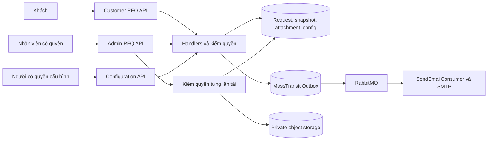
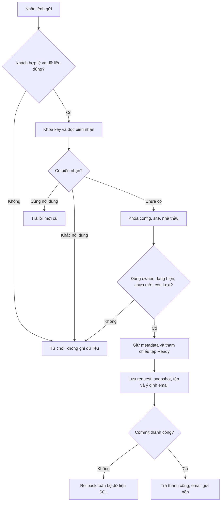
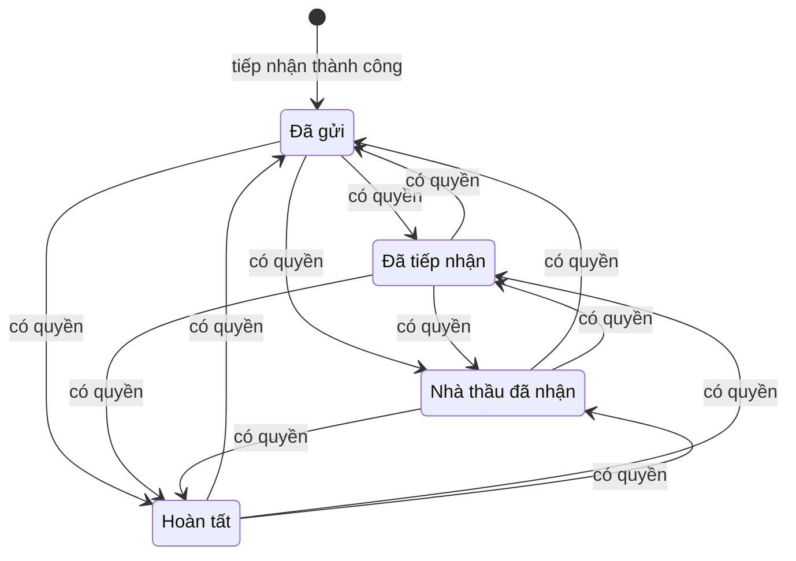
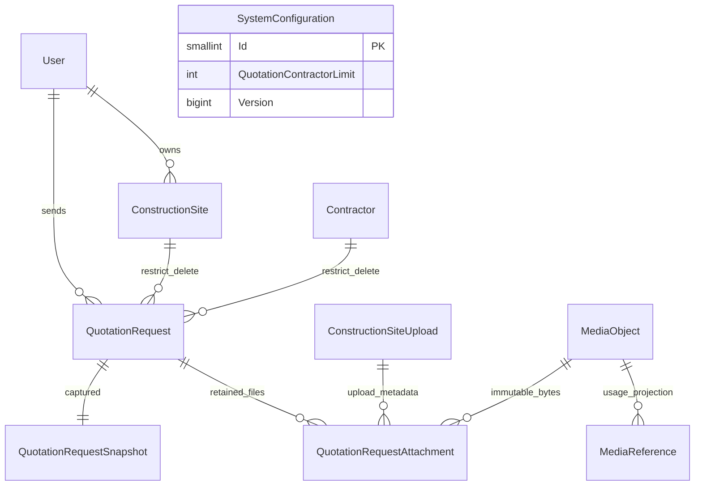

<!-- HƯỚNG DẪN CHO AI KHI ĐIỀN HOẶC CHỈNH SỬA MẪU
- Đọc toàn bộ mẫu, các comment hướng dẫn và tài liệu nguồn được cung cấp trước khi viết. Tuân thủ các quy tắc nghiệp vụ, điều kiện, ngoại lệ và giới hạn đã được xác nhận.
- Không bịa, tự chế hoặc suy đoán thành sự thật: yêu cầu, quy tắc, số liệu, API, schema, mã lỗi, nguồn tham khảo, người phụ trách và kết quả kiểm thử phải có căn cứ. Nội dung ví dụ trong mẫu không phải dữ kiện của dự án.
- Khi thiếu thông tin hoặc các nguồn mâu thuẫn, hỏi người dùng để làm rõ; giữ nguyên placeholder ở phần chưa xác định. Không tự chọn đáp án, lấp chỗ trống hay tuyên bố tài liệu đã hoàn tất.
- Chỉ thay nội dung cần điền hoặc được yêu cầu sửa. Không tự mở rộng phạm vi, sửa nghĩa quy tắc, bỏ điều kiện/ngoại lệ, xoá hay ghi đè nội dung hợp lệ đã có.
- Giữ nguyên tên, cấp và thứ tự heading, nhãn in đậm, tiền tố bullet, cấu trúc danh sách, tên/thứ tự/số cột bảng và cú pháp code fence. Không dịch, đổi tên, gộp hoặc thêm mục ngoài cấu trúc mẫu.
- Chỉ lặp khối luồng, AC hoặc API theo đúng khuôn khi có căn cứ; chỉ bỏ phần tuỳ chọn khi hướng dẫn riêng của mẫu cho phép và đã xác định không áp dụng.
- Mã tham chiếu và section phải trỏ tới tài liệu có thật đã được cung cấp hoặc kiểm chứng. Không giữ mã ví dụ như tham chiếu thật và không tự tạo tài liệu liên quan để hợp thức hoá liên kết.
- Giữ các comment hướng dẫn trong file. Xuất Markdown UTF-8, mỗi file một tài liệu; không bọc toàn bộ file trong code fence, không chèn lời dẫn hay giải thích ngoài mẫu.
- Trước khi bàn giao, đối chiếu nội dung với nguồn, kiểm tra cấu trúc, giá trị cho phép, giới hạn độ dài và tính nhất quán của mã/tham chiếu. Báo rõ phần chưa đủ thông tin; không tuyên bố đã chạy test hoặc import khi chưa thực hiện.
-->

<!-- Thay mã TDD-001 và nội dung ví dụ; giữ nguyên heading và nhãn in đậm.
Sơ đồ dùng mermaid, plantuml hoặc URL. Giữ heading Architecture, Sequence Diagram, Activity Diagram, State Diagram, Data Model.
Ví dụ API phải có heading trùng METHOD /path trong Endpoints. Xoá phần API/sơ đồ không dùng.
Version, Updated At và Change Log do lịch sử phiên bản quản lý, để trống khi nhập mới.
Author/Reviewer là tên hiển thị; gán tài khoản, phê duyệt, giả định và câu hỏi mở trên giao diện sau import.
Thiết kế phải truy vết về Story và Business Rule được cung cấp. Phân biệt thiết kế đề xuất với implementation đã kiểm chứng; không mô tả API/schema/sơ đồ ví dụ như hệ thống thật hoặc tự quyết định nghiệp vụ còn thiếu.
BẮT BUỘC KHI HOÀN THIỆN MẪU: phải có cả Reviewer và Approver, mỗi tên 1–200 ký tự sau khi bỏ khoảng trắng đầu/cuối. Không xoá hai dòng metadata, để trống, dùng tên bịa hoặc giữ placeholder rồi coi là hoàn tất.
Nếu chưa biết người review hoặc người phê duyệt, phải hỏi người dùng và báo tài liệu chưa đủ thông tin; không tự lấy Author/Owner làm người thay thế. Tên trong file không tự gán tài khoản hoặc xác nhận đã duyệt; gán thành viên trên giao diện sau import.
Đây là yêu cầu hoàn thiện mẫu; backend hiện vẫn nhận file cũ thiếu hai trường để tương thích.

VALIDATION CHO FILE NHẬP (đối chiếu ImportSnapshotValidator, MarkdownParser và ImportService):
- Mỗi file .md UTF-8 không rỗng chỉ có một heading cấp 1 chứa mã tài liệu dài 1–100 ký tự. Mã không được trùng trong cùng lần nhập hoặc thuộc loại tài liệu khác đã tồn tại.
- Không dùng tên README.md hoặc sitemap.md vì importer bỏ qua. Giao diện nhận .md/.zip, tối đa 2.000 file, tổng file tải lên 31 MiB; API giới hạn request 32 MiB và tổng nội dung đọc/giải nén 64 MiB.
- Chỉ nhập đè tài liệu cùng loại đang Draft, chưa có phiên bản và chưa lưu trữ. Import thay toàn bộ nội dung bản nháp, vì vậy phải giữ lại nội dung hợp lệ ngoài phần được yêu cầu sửa.
- Không dùng Status trong Markdown hoặc tên Approver để tự xác nhận phê duyệt; import không cấp quyền hay gán tài khoản từ tên. Chạy Kiểm tra file và xử lý lỗi/cảnh báo trước khi nhập.
- Giới hạn độ dài bên dưới tính theo string.Length của .NET (đơn vị UTF-16); không tự cắt ngắn dữ kiện quan trọng để vượt validation, hãy viết lại có căn cứ hoặc hỏi người dùng.
- Feature tối đa 300 ký tự và được dùng làm tiêu đề tài liệu. Status được parser nhận: Draft / In Review / Approved / Deprecated; tài liệu nhập mới vẫn có trạng thái phê duyệt Draft.
- Endpoint: đường dẫn tối đa 500 ký tự; tên/mô tả endpoint được lưu trong Name tối đa 300. HTTP method: GET / POST / PUT / PATCH / DELETE / HEAD / OPTIONS.
- Error Codes: mã tối đa 100 ký tự, không trùng trong tài liệu; giữ dạng - **CODE** (400): mô tả. HTTP status trong Error Codes và Response phải là số nguyên đọc được bằng Int32; không tự đặt status khác hợp đồng API.
- URL sơ đồ tối đa 1.000 ký tự. Mục sơ đồ được sử dụng phải có khối mermaid/plantuml hoặc URL theo mẫu; không để một mục sơ đồ rỗng. Nhãn mục được tách từ bullet như tên External API Fields tối đa 300 ký tự.
- Heading Examples phải khớp METHOD /path ở Endpoints. Giữ các nhãn Request:, Response 200: (thay mã theo contract) và Error Response: để parser tách đúng dữ liệu.
- Tham chiếu dạng DOC-KEY/section: ghi chú: mã đích tối đa 100 ký tự, section tối đa 100, ghi chú tối đa 1.000. Không trùng bộ mã đích + section + loại liên kết trong cùng tài liệu.
ĐỐI CHIẾU FORM TDD (src/features/tdds/validations.ts; form có thể chặt hơn import):
- Điền Feature, Author, Reviewer, Problem và ít nhất một Goal; các Goal/Non-goal/Notes đã thêm không được rỗng. API đã khai báo phải có endpoint và mô tả/mục đích; Fields phải có tên và ý nghĩa; Error Codes phải có mã, HTTP status và điều kiện.
- Form còn kiểm tra Version, Updated At và nội dung Change Log khi khai báo; với file nhập mới, giữ các trường lịch sử này trống theo hợp đồng import, không tự tạo dữ liệu lịch sử.
-->

# TDD-RFQ-001

## Document Info

- **Feature**: Mời báo giá từ hồ sơ công trình, quản trị lịch hẹn và cấu hình giới hạn
- **Author**: Codex
- **Reviewer**: Tân Trần
- **Approver**: Tân Trần
- **Status**: Draft
- **Version**:
- **Updated At**:

## Context & Goals

### Problem

Người dùng đã chốt STORY-RFQ-001 đến STORY-RFQ-003 và BR-RFQ-001 đến BR-RFQ-006, rồi giao triển khai. Người dùng đã chốt bản TDD này và yêu cầu bắt đầu triển khai code trong hội thoại. Đặc tả UT-RFQ được soạn theo thiết kế này; xác nhận hội thoại không thay thế phê duyệt trên hệ thống tài liệu. Các đặc tả ST-RFQ đã được soạn nhưng chưa chạy.

Hiện trạng trước triển khai RFQ đã kiểm bằng code: nền tảng .NET 8, EF Core/Npgsql, PostgreSQL 15 trong cấu hình Docker; Carter/MediatR và TransactionPipelineBehavior quản lý transaction. Tư vấn 1:1 đã có kiểm số điện thoại, thời điểm có múi giờ, chống gửi lặp và email qua MassTransit EF Bus Outbox. ConstructionSite đã có thông tin hồ sơ đầy đủ, version và tệp riêng tư. Contractor có Visible/Hidden và AcceptingProjects độc lập; thao tác xóa chưa có điều kiện liên quan lời mời. Chưa có entity, API hoặc cấu hình RFQ.

Thông tin lịch sử trong một số tài liệu SITE/CTR vẫn ghi chưa triển khai, trong khi code tương ứng đã có. TDD này dùng code hiện tại làm căn cứ về thành phần tái sử dụng; không coi ghi chú lịch sử là trạng thái triển khai hiện nay. Trang giao diện tham khảo chuyển sang đăng nhập nên chưa xác minh được danh sách giờ cụ thể trên trang đó. Workspace hiện khảo sát có backend và tài liệu; thiết kế API dưới đây là hợp đồng bàn giao cho frontend.

### Goals

- Một cặp hồ sơ–nhà thầu có tối đa một lời mời; các request đồng thời không vượt cấu hình hiện hành.
- Giữ thông tin và tệp của hồ sơ tại lúc gửi, dù khách sửa hồ sơ hoặc gỡ tệp gốc.
- Khách chỉ xem lời mời của mình; người có quyền xử lý trạng thái, lịch và ghi chú nội bộ, không mở quyền sửa hồ sơ khách.
- Ghi dữ liệu nghiệp vụ và ý định gửi email trong cùng transaction; SMTP lỗi không làm mất lời mời hoặc thay đổi đã lưu.
- Chặn xóa hồ sơ/nhà thầu đã có lời mời; giữ nguyên các điều kiện sửa, phân công và quản lý nhà thầu hiện có.

### Non-goals

- Tài khoản nhà thầu, gửi email trực tiếp cho nhà thầu, lịch rảnh, giữ chỗ, hợp đồng hoặc thanh toán.
- Tự khóa sửa hồ sơ chỉ vì đã mời báo giá; sao toàn bộ kết quả dự toán nguồn hoặc các gói giám sát vào bản đã gửi.
- Một bộ máy cấu hình tùy ý, phân vùng database, hệ thống outbox khác hoặc job xóa lịch sử RFQ.
- Thay đổi schema trên môi trường dùng chung hoặc phát hành website trong bước soạn tài liệu này.

## Architecture

Tên module mới dùng thống nhất `quotationRequest` ở contract, application, presentation và test. Cấu hình dùng module `systemConfiguration` với cột có kiểu rõ ràng; không dùng bảng key/value không kiểm được miền giá trị. Các tên và route mới bên dưới là đề xuất triển khai của TDD.

| Thành phần | Trách nhiệm và phần dùng lại |
| --- | --- |
| QuotationRequestApi (nhóm khách và quản trị) | Carter v1; nhận DTO có danh sách trường cho phép, xác thực, chuyển MediatR; DTO khách không có InternalNote. |
| SubmitQuotationRequestCommandHandler | Kiểm khách/owner, replay, giới hạn và nhà thầu; ghi request, snapshot, tệp và email nguyên tử. |
| UpdateQuotationRequestCommandHandler | Kiểm staff/quyền/version; chỉ sửa lịch, trạng thái, ghi chú; tạo tối đa một thông báo khi lịch/trạng thái đổi. |
| Các Get…QueryHandler của quotationRequest | Projection cho danh sách, chi tiết; tách dữ liệu khách và quản trị; không thay đổi dữ liệu khi đọc. |
| QuotationSnapshotBuilder | Tạo cấu trúc JSON phiên bản 1 từ SITE và nhãn catalog đã ghim; không gọi API ngoài hoặc đọc bytes tệp trong transaction. |
| QuotationFileReader | Kiểm quyền lời mời, tìm attachment thuộc request và stream object riêng tư qua IPrivateMediaObjectStore. Không dùng quyền trên attachment gốc để đọc bản lịch sử. |
| IQuotationRequestStore / QuotationRequestStore | Khóa hàng, projection, truy vấn số lượng và thêm dữ liệu, dùng cùng ApplicationDbContext/UoW với các module liên quan. |
| SystemConfiguration handler/store | Đọc/sửa dòng cấu hình dùng chung; version chống ghi đè; quyền riêng `system.configuration.manage`. |
| ConstructionSite và Contractor writer/read model | Thêm điều kiện chặn xóa cả hai thực thể và cập nhật cờ CanDelete của ConstructionSite; không nới quyền sửa hay ẩn/hiện nhà thầu. |
| MEDIA source reader/reference registry | Thêm nguồn QuotationRequestAttachment; giữ MediaReference và đối soát từ bảng attachment lịch sử. |
| MassTransit EF Outbox, SendEmailConsumer | Dùng nguyên SendEmailEvent và hàng chờ hiện có; HTML encode mọi nội dung khách nhập; không ghi phone/note/body ra log. |



**Notes**:

- **Phân quyền:** thêm hai permission `quotation-request.manage` và `system.configuration.manage`, RequiresAssignment=false; seed cho Admin, không cấp cho tất cả Staff. Endpoint quản trị dùng policy quyền hiện có và handler kiểm loại tài khoản Staff đang hoạt động. Không dùng quyền tư vấn KTS hoặc assignment.manage để suy ra quyền RFQ. JWT/phiên bị thu hồi tiếp tục theo cơ chế hiện có.
- **Khách:** thêm named policy `QuotationCustomer`: RequireAuthenticatedUser, chặn IsForgotPassword=true và MustChangePassword=true; không thêm IsVerified=true. Handler kiểm Customer đang hoạt động và OwnerUserId từ phiên. Đây là ngoại lệ có chủ đích theo BR-RFQ-001 đã chốt, vì DefaultPolicy và ConsultationCustomer hiện đòi email đã xác minh. Không dùng AuthenticatedOnly đơn thuần, vì có thể nhận cả phiên đặt lại mật khẩu. Các route SITE và CONSULT giữ policy hiện có; middleware kiểm Origin cho cookie vẫn áp dụng với route RFQ mới.
- **Thứ tự khóa khi gửi:** khóa advisory transaction theo customer/submissionKey → tra biên nhận → SystemConfiguration FOR SHARE → ConstructionSite của owner FOR UPDATE → Contractor FOR SHARE → MediaObject của các tệp theo UUID tăng dần. Đếm lời mời sau khi đã khóa site. Nhiều hồ sơ gửi song song cùng đọc shared config; cùng hồ sơ thì tuần tự. Sửa config lấy FOR UPDATE trên singleton nên không xen giữa đọc giới hạn và commit một lần gửi. Đây là điểm xác định thứ tự áp dụng cấu hình khi hai thao tác chồng nhau, không dựa vào thời điểm bấm trên trình duyệt.
- **Khóa nhà thầu:** FOR SHARE giữ trạng thái Visible ổn định đến commit và xung đột với ẩn/xóa; không dùng FOR KEY SHARE vì mức đó không chặn thay đổi cột Status thông thường. [Cơ chế khóa PostgreSQL 15](https://www.postgresql.org/docs/15/explicit-locking.html). Nhà thầu ngừng nhận dự án vẫn hợp lệ; không kiểm AcceptingProjects.
- **Biên nhận chống gửi lặp:** UNIQUE(CustomerId,SubmissionKey) giữ cùng vòng đời lời mời. SHA-256 của dữ liệu đã chuẩn hóa gồm siteId, contractorId, desiredAtUtc, contactPhone sau chuẩn hóa (giữ phân biệt null với số override), surveyNote; không băm hồ sơ hiện tại hoặc cấu hình, vì chúng có thể thay đổi giữa hai lần thử. Cùng key/cùng payload trả ID và bản đã lưu, không chụp lại hoặc gửi thêm mail. Cùng key/khác payload trả 409. Khác key/cùng site–contractor trả 409 đã mời, không tạo lời mời thứ hai. Kiểm replay trước trạng thái nhà thầu, thời gian và hạn mức, nhưng luôn sau xác thực và kiểm chủ thể có quyền đọc biên nhận.
- **Transaction:** pipeline hiện commit nếu handler trả Result.Failure mà không ném exception. Các nhánh thất bại sau khi bắt đầu ghi phải ném exception hoặc được sửa để rollback đúng, không trả Failure rồi để dữ liệu một phần commit. Không gọi SMTP/storage PUT trong transaction; snapshot chỉ đọc metadata và giữ tham chiếu tới object Ready bất biến.
- **Email:** Submit và update có thay đổi lịch/trạng thái gọi IPublishEndpoint trong transaction của cùng DbContext. Lần lưu đổi cả hai chỉ Publish một SendEmailEvent. Thư dựng từ dữ liệu của chính lần thay đổi, không đọc lại trạng thái tương lai khi consumer chạy. Dùng MassTransit Bus Outbox đã cài, không tạo bảng email mới. Cơ chế này giữ thông điệp đến lúc commit; SMTP là tác động bên ngoài nên không cam kết giao thư đúng một lần tuyệt đối nếu SMTP đã nhận nhưng consumer mất phản hồi. Không tự retry từ frontend bằng key mới. [Tài liệu outbox](https://masstransit.massient.com/concepts/outbox).
- **Bản đã gửi:** site FOR UPDATE cũng được các writer hồ sơ/tệp hiện tại sử dụng, nên snapshot không trộn ngân sách trước sửa với tệp sau sửa. Snapshot chứa nhãn tại thời điểm gửi, không join tên hiện tại khi đọc. Khi hai lời mời gửi ở hai thời điểm khác nhau, mỗi lời mời giữ bản riêng đúng yêu cầu; không thêm revision dùng chung hoặc hash dedup trước khi có nhu cầu.
- **Giữ tệp:** không cần sao bytes trong kho. Object SITE đã Ready có final key bất biến; thêm attachment RFQ trỏ object đó và MediaReference riêng trong cùng transaction. Gỡ attachment SITE chỉ gỡ reference SITE, reference RFQ còn. Registry phải hiểu nguồn mới khi đối soát, không chỉ chèn reference rồi để lần reconcile sau xóa nó. Không FK tới ConstructionSiteAttachment vì dòng gốc được phép bị xóa.
- **Đồng thời sửa admin:** yêu cầu gửi expectedVersion; khóa request, kiểm version rồi cập nhật và tăng Version trong cùng transaction. Hai người sửa cùng version chỉ một thành công; người còn lại nhận 409, không tạo mail. No-op giữ version và không Publish. Không có chuyển trạng thái tự động khi đến giờ hoặc khi gửi email thành công.
- **Phạm vi snapshot:** gồm các trường mô tả của SITE và tệp thực sự đính kèm. ID dự toán nguồn chỉ là dữ kiện nguồn; không cấp thêm quyền xem kết quả riêng tư của PROJ. Cách lọc quyền tải bản lưu độc lập với quyền SITE hiện tại, không sửa ConstructionSiteStaffScope để mở mọi hồ sơ cho nhân viên RFQ.

## Sequence Diagram

```mermaid
sequenceDiagram
    actor U as Khách
    participant API as RFQ API
    participant H as Submit handler
    participant DB as PostgreSQL
    participant MQ as Outbox dispatcher
    participant Mail as SendEmailConsumer
    U->>API: POST siteId, contractorId, lịch, số điện thoại, key
    API->>H: Command sau xác thực và validation
    H->>DB: BEGIN, khóa key và kiểm biên nhận
    alt Key cũ cùng payload
        DB-->>H: Biên nhận đã lưu
        H-->>API: 200, không thêm request/mail
    else Lần gửi mới
        H->>DB: Khóa config, site, contractor, objects
        H->>DB: Kiểm owner, visible, unique, hạn mức
        H->>DB: Request, snapshot, attachments, references, outbox
        H->>DB: COMMIT
        H-->>API: 201 và requestId
        MQ->>DB: Đọc thông điệp đã commit
        MQ->>Mail: SendEmailEvent
        Mail->>Mail: Gửi SMTP, retry nếu lỗi
    end
    API-->>U: Biên nhận hoặc lỗi; không gửi lịch sử nội bộ
```

## Activity Diagram



## State Diagram

Mỗi chuyển giữa bốn trạng thái chỉ cần người có quyền và version hợp lệ, không cần điều kiện khảo sát. Cả bốn trạng thái cho sửa lịch và ghi chú. Trạng thái Hoàn tất không có cạnh kết thúc bất biến.



## Data Model

Bốn bảng mới, schema public, tên PascalCase như repository; UUID do server sinh, timestamp UTC. Không thêm tenant vì module hiện tại sở hữu dữ liệu theo CustomerId, không có tổ chức/tenant. Quyền không được suy từ UUID khó đoán.

**SystemConfiguration — một dòng cấu hình dùng chung của ứng dụng.** Migration tạo dòng Id=1 với giới hạn 3. Chỉ người có quyền cấu hình cập nhật; các lần gửi đọc dưới khóa chia sẻ. Chọn cột có kiểu thay vì key/value để database chặn giá trị không hợp lệ và có thể bổ sung cột cho cấu hình thực sự phát sinh sau này.

| Cột | Kiểu, NULL, mặc định và ý nghĩa |
| --- | --- |
| Id | smallint PK NOT NULL CHECK Id=1; seed 1, không cấp API tạo/xóa cấu hình. |
| QuotationContractorLimit | integer NOT NULL DEFAULT 3 CHECK >=1; tối đa 2147483647 là giới hạn Int32, không phải hạn mức kinh doanh. |
| Version | bigint NOT NULL DEFAULT 1 CHECK >=1; EF concurrency token. |
| UpdatedAtUtc | timestamptz NOT NULL; mốc seed hoặc lần cập nhật thực sự gần nhất. |
| UpdatedBy | uuid NULL FK User.Id RESTRICT; NULL ở dòng seed, sau sửa là staff đang thao tác. |

**QuotationRequest — một dòng là lời mời được tiếp nhận.** Khách tạo; nhân viên chỉ sửa Status, AppointmentAtUtc, InternalNote và các trường theo dõi cập nhật. Không có soft delete, canceled hoặc cột hoàn lượt.

| Cột | Kiểu và ràng buộc |
| --- | --- |
| Id | uuid PK NOT NULL, server sinh. |
| ConstructionSiteId, CustomerId | uuid NOT NULL; FK ghép tới ConstructionSite(Id,OwnerUserId) RESTRICT dùng alternate key đã có. CustomerId cũng FK User.Id RESTRICT. |
| ContractorId | uuid NOT NULL FK Contractor.Id RESTRICT; không lọc Visible khi đọc lịch sử. |
| DesiredAtUtc | timestamptz NOT NULL; lịch khách đề nghị, bất biến. |
| AppointmentAtUtc | timestamptz NOT NULL; ban đầu bằng DesiredAtUtc, người quản lý được đổi. |
| ContactPhone | varchar(20) NOT NULL; trim, có chữ số và không rỗng, quy tắc ký tự dùng lại ConsultationSubmissionRules. |
| SurveyNote | varchar(5000) NULL; plain text, trim; rỗng thành NULL; giữ nguyên sau khi gửi. |
| Status | varchar(24) NOT NULL DEFAULT Sent; CHECK thuộc Sent/Received/ContractorReceived/Completed. |
| InternalNote | varchar(5000) NULL; plain text chỉ quản trị xem; rỗng thành NULL. |
| SubmissionKey | uuid NOT NULL, khác Guid.Empty; key của lần gửi, bất biến. |
| PayloadHash | char(64) NOT NULL CHECK SHA-256 hex thường; chỉ dùng chống gửi lặp, không trả cho khách. |
| Version | bigint NOT NULL DEFAULT 1 CHECK >=1; concurrency token. |
| CreatedAtUtc, UpdatedAtUtc | timestamptz NOT NULL; khi tạo bằng nhau; CHECK UpdatedAtUtc>=CreatedAtUtc. |
| UpdatedBy | uuid NULL FK User.Id RESTRICT; NULL khi tạo, staff ID sau sửa. |

UNIQUE(ConstructionSiteId,ContractorId) áp dụng mọi trạng thái, không filtered index. UNIQUE(CustomerId,SubmissionKey) là biên nhận kỹ thuật, khác nghĩa với unique nhà thầu. FK ghép không cho lời mời của khách A trỏ site khách B ngay cả khi writer bị lỗi. Trigger BEFORE UPDATE chặn đổi các cột đầu vào bất biến nêu trên; không chặn ba trường admin được sửa. Không có API xóa lời mời.

**QuotationRequestSnapshot — một dòng là nội dung hồ sơ đã gửi trong một lời mời.** Khóa chính cũng là RequestId nên tối đa một bản/request. Handler tạo trong cùng transaction với request và 0–9 attachment; cả hai bảng không có API sửa. Database FK đảm bảo bản lưu thuộc request; việc request phải có đúng một snapshot do đường ghi nguyên tử bảo đảm, cần kiểm truy vấn chống mồ côi khi migration/test.

| Cột | Kiểu và ý nghĩa |
| --- | --- |
| RequestId | uuid PK, FK QuotationRequest.Id RESTRICT; không nullable. |
| SiteVersion | bigint NOT NULL CHECK >=1; version SITE lúc chụp. |
| SchemaVersion | smallint NOT NULL CHECK =1; phiên bản cấu trúc Profile, không phải phiên bản hồ sơ gốc. |
| SiteName | varchar(200) NOT NULL, không trắng; tên lúc gửi, phục vụ list mà không cần đọc JSON. |
| Profile | jsonb NOT NULL CHECK jsonb_typeof(Profile)='object'; payload lịch sử có schema cố định dưới đây, không nhận trực tiếp từ client. |

Profile phiên bản 1 lưu: areaM2, address (provinceCode, provinceName, wardCode, wardName, locationDatasetVersion, addressDetail, formattedAddress, latitude, longitude), condition (id,name), budgetVnd, plannedStart, catalogRevisionId, buildingType (id,name), floorCount, hasTum, architectureStyle/interiorStyle (NULL hoặc id/name), sourceEstimateId/sourceGenerationOperationId (cùng NULL hoặc cả hai có giá trị; hai ID chỉ hai thực thể khác nhau), siteCreatedAtUtc/siteUpdatedAtUtc. Diện tích và tiền biểu diễn chuỗi thập phân không nhóm để frontend không làm mất độ chính xác; UUID dạng chuỗi chuẩn. Không lặp SiteName, files, customerId, trạng thái hoặc lịch hẹn vào Profile.

Profile là dữ kiện lịch sử chỉ đọc nguyên khối, không phải nguồn để lọc/đếm hoặc FK theo phần tử; vì vậy chọn JSON có phiên bản thay vì sao chép toàn bộ schema SITE thành hơn hai mươi cột cần giữ đồng bộ qua các lần thay đổi hồ sơ. Trường dùng cho quan hệ, phân quyền, unique và list vẫn là cột riêng có kiểu. Nhãn được chụp cùng ID để đọc không phụ thuộc đổi tên danh mục sau này. Các giá trị NULL giữ đúng nghĩa không áp dụng của SITE, không thay bằng chuỗi rỗng.

**QuotationRequestAttachment — một dòng giữ quyền tham chiếu tới một tệp của bản đã gửi.** Không chứa binary và không phải một lần upload mới. Một object bất biến có thể được nhiều lời mời giữ. Xóa attachment gốc không được xóa dòng này.

| Cột | Kiểu và ràng buộc |
| --- | --- |
| Id | uuid PK NOT NULL; server sinh, dùng trong route tải lịch sử. |
| RequestId | uuid NOT NULL FK QuotationRequest.Id RESTRICT. |
| Slot | smallint NOT NULL CHECK 1..9; UNIQUE(RequestId,Slot), lấy slot gốc tại lúc gửi. |
| SourceAttachmentId | uuid NOT NULL; ID lịch sử của attachment SITE, không FK vì dòng đó được gỡ hợp lệ. Không dùng ID này để cấp quyền đọc. |
| UploadId | uuid NOT NULL FK ConstructionSiteUpload.UploadId RESTRICT; binding giữ nhóm và MediaUpload giữ tên gốc bất biến. |
| MediaObjectId | uuid NOT NULL FK MediaObject.Id RESTRICT; UNIQUE(RequestId,MediaObjectId), không UNIQUE toàn cột vì nhiều lời mời được dùng chung object. |

FK ghép (UploadId,MediaObjectId) tới unique index MediaObject(SourceUploadId,Id) đã có, tương tự SITE. Migration tạo FK ghép bằng SQL, không dùng EF alternate key làm SourceUploadId của object cũ thành NOT NULL. MIME, size và SHA-256 lấy từ MediaObject Ready bất biến; OriginalName từ MediaUpload; AttachmentGroup từ ConstructionSiteUpload. Những bản ghi này đã tồn tại, có vòng đời bền vững và FK RESTRICT, nên không sao metadata lần nữa rồi phải giải quyết sự khác nhau giữa các bản.

Snapshot và attachment mới có trigger chặn UPDATE/DELETE bằng ứng dụng; không đặt CASCADE từ hồ sơ gốc. INSERT chỉ qua handler sau kiểm owner, Ready, private prefix và binding chính xác dưới khóa site/object. Quyền SQL của vận hành không phải đường nghiệp vụ để xóa lịch sử. Mọi thay đổi chính sách lưu/xóa dữ liệu sau này cần thiết kế riêng; không đặt thời hạn giả định.

**Bảng dùng lại:** User là người gửi/người sửa; ConstructionSite là chủ thể hiện tại và khóa điều phối quota; Contractor là danh tính nhà thầu; MediaUpload/ConstructionSiteUpload/MediaObject là metadata bất biến của file; MediaReference là projection nơi sử dụng; OutboxMessage/OutboxState/InboxState thuộc MassTransit. Không tạo lại các bảng đó.



| Quan hệ | FK ở bảng con | Xóa cha | Ý nghĩa |
| --- | --- | --- | --- |
| Site–Request | ConstructionSiteId,CustomerId, bắt buộc | RESTRICT | Hồ sơ có lời mời không xóa được; FK đồng thời bảo vệ owner. |
| Contractor–Request | ContractorId, bắt buộc | RESTRICT | Nhà thầu đã nhận lời mời chỉ được ẩn. |
| Request–Snapshot | RequestId vừa PK vừa FK | RESTRICT | Một bản lịch sử/request; đường ghi bảo đảm tồn tại cùng nhau. |
| Request–Attachment | RequestId, bắt buộc | RESTRICT | 0–9 tệp/request, không gỡ bởi thao tác sửa hồ sơ gốc. |
| Object/Upload–Attachment | MediaObjectId/UploadId, bắt buộc | RESTRICT | Bytes và metadata còn tồn tại để mở lại bản đã gửi. |

**Mẫu dữ liệu lưu trữ giả định:** U1, S1, C1, R1, K1, M1, UP1, A1, RA1 là bí danh UUID, không phải dữ liệu production hoặc SQL chạy được. T0=2026-10-03T03:00:00Z; lịch D1=2026-10-05T02:00:00Z tức 09:00 giờ Việt Nam. Các bảng dưới trích cột để dễ theo dõi.

| Bảng | Bản ghi và ý nghĩa |
| --- | --- |
| SystemConfiguration | Id=1, QuotationContractorLimit=3, Version=1, UpdatedAtUtc=T0, UpdatedBy=NULL; không tạo bản cấu hình mới cho mỗi site. |
| ConstructionSite dùng lại | Id=S1, OwnerUserId=U1, Name=Nhà A, Version=7, BudgetVnd=2000000000, SourceEstimateId=NULL; giữ schema SITE hiện có. |
| Contractor dùng lại | Id=C1, Name=Công ty A, Status=Visible, AcceptingProjects=false; vẫn nhận lời mời. |
| MediaUpload/ConstructionSiteUpload dùng lại | UP1: ActorId=U1, OriginalName=mat-bang.pdf, State=Completed, CompletedObjectId=M1; binding AttachmentGroup=Drawing, ConsumedSiteId=S1, ResultAttachmentId=A1. |
| MediaObject dùng lại | Id=M1, SourceUploadId=UP1, State=Ready, MediaType=application/pdf, SizeBytes=100000, Sha256=H1 (64 hex), ObjectKey=media/site-private/M1.pdf; key chứa bí danh để minh họa. |
| QuotationRequest | Id=R1, CustomerId=U1, ConstructionSiteId=S1, ContractorId=C1, DesiredAtUtc=AppointmentAtUtc=D1, ContactPhone=0900000002, SurveyNote=NULL, Status=Sent, InternalNote=NULL, SubmissionKey=K1, PayloadHash=H2 (64 hex), Version=1, CreatedAtUtc=UpdatedAtUtc=T0, UpdatedBy=NULL. |
| QuotationRequestSnapshot | RequestId=R1, SiteVersion=7, SchemaVersion=1, SiteName=Nhà A, Profile có budgetVnd="2000000000", sourceEstimateId/sourceGenerationOperationId=NULL, địa chỉ và các trường khác từ S1 tại T0. |
| QuotationRequestAttachment | Id=RA1, RequestId=R1, Slot=1, SourceAttachmentId=A1, UploadId=UP1, MediaObjectId=M1. |
| MediaReference dùng lại | ObjectId=M1, SourceKind=QuotationRequestAttachment, SourceId=RA1, Slot=File, LinkedAtUtc=T0. Reference ConstructionSiteAttachment/A1 vẫn tồn tại nếu khách chưa gỡ file gốc. |
| OutboxMessage dùng lại | Một SendEmailEvent To=u1@example.test, Purpose=QuotationRequestReceived; PublishContext.CorrelationId=R1; Body chứa thông tin lần gửi. ID/sequence/outbox state do MassTransit quản lý. |
| OutboxState/InboxState dùng lại | OutboxState theo dõi phát sau commit; InboxState theo dõi message consumer đã xử lý. Không tự insert seed hoặc tạo bộ bảng RFQ tương đương. |

Sau khi khách đổi ngân sách S1 thành 2500000000 và gỡ A1: bản R1 vẫn ghi 2000000000; RA1/M1 và reference RFQ còn; đường tệp SITE A1 không còn đọc được, đường tệp RFQ RA1 vẫn được người có quyền đọc. Gửi cho C2 tạo R2 với bản mới và không chứa tệp đã gỡ. Đây là hai thời điểm khác nhau, không phải dữ liệu cần đồng bộ lại.

Admin đổi R1 sang Completed, lịch D2=2026-10-06T03:00:00Z, note="Đã liên hệ": Version=2, UpdatedBy=M (staff), UpdatedAtUtc=T1; DesiredAtUtc vẫn D1, Snapshot không đổi. Chỉ một SendEmailEvent Purpose=QuotationRequestUpdated được ghi. SMTP lỗi giữ R1 Version=2. Gửi lại K1 cùng payload trả R1, không thêm snapshot/mail. Cấu hình đổi 3→5: vẫn Id=1, Version=2, UpdatedBy=M2; không sửa request cũ.

**Notes**:

- **Chuẩn hóa:** SystemConfiguration.Id xác định giá trị cấu hình. Request.Id và cặp site–contractor đều xác định cùng lời mời; CustomerId lặp owner để FK ghép và phạm vi biên nhận kiểm được ở DB, phải khớp key SITE, không là trường cập nhật độc lập. Phone/note/DesiredAt là dữ kiện lần gửi, khác với thông tin tài khoản hiện tại. Snapshot là lịch sử có chủ đích; không cập nhật nó khi SITE thay đổi. Media metadata không lặp vào từng attachment. Không lưu UsedCount/RemainingCount/CanDelete hoặc AttachmentCount thành cột dễ lệch; tính khi đọc.
- **Index:** unique site–contractor phục vụ kiểm trùng và count theo site; thêm (ConstructionSiteId,CreatedAtUtc DESC,Id DESC) cho danh sách khách. Unique customer–key phục vụ replay. (CreatedAtUtc DESC,Id DESC) và (Status,CreatedAtUtc DESC,Id DESC) phục vụ quản trị có/không lọc; index ContractorId cho FK xóa. Snapshot PK phục vụ join một lần. Attachment unique request–slot hỗ trợ đọc cả danh sách, index MediaObjectId và UploadId cho FK và registry; không thêm JSON GIN khi chưa có truy vấn nội dung snapshot.
- **Phân trang:** pageIndex mặc định 1, pageSize mặc định 10/tối đa 100 theo kiểu PagedResult hiện có; sắp CreatedAtUtc DESC,Id DESC. Count/page là hai truy vấn đọc, không cam kết snapshot qua nhiều trang. Summary quota của một lần GET dùng một SQL statement hoặc read snapshot ngắn để limit/used/remaining thống nhất; remaining=max(0,limit-used). Không cache cấu hình hoặc kết quả quyền để tránh gửi theo giá trị cũ sau commit cấu hình.
- **DB và application:** unique/FK/check là chặn cuối, còn quota là bất biến xuyên hàng do protocol khóa site+config bảo vệ. Không tuyên bố CHECK có thể tự đếm request. SQL ghi trực tiếp ngoài protocol không được coi là API nghiệp vụ. Index, trigger immutability và tên constraint phải có integration test PostgreSQL; EF InMemory không chứng minh các ràng buộc này.
- **Gỡ tệp:** MediaReference là projection, không phải quyền truy cập. Thêm branch QuotationRequestAttachment trong MediaSourceReader và hỗ trợ SitePrivateKey cho nguồn đó; tăng MediaConstants.SourceSetVersion từ 4 lên phiên bản kế tiếp khi triển khai. Reconciliation phải tái tạo được reference từ RA1 dù A1 đã mất. Cleanup hiện bỏ qua private final; tiếp tục giữ hành vi đó, không tự bật dọn tệp RFQ hoặc sao nó sang public prefix.
- **Xóa hồ sơ:** thêm AnyAsync RFQ dưới cùng khóa site trước khi gỡ gói đã hủy hoặc xóa tệp; trả 409 QuotationSiteInUse. ConstructionSiteReadModel phải tính CanDelete=false khi tồn tại request, kể cả không gói giữ chỗ; CanEdit vẫn theo SITE. FK ghép RESTRICT bảo vệ trường hợp cạnh tranh; ánh xạ tên FK cụ thể, không đổi mọi lỗi 23503 thành cùng một lỗi.
- **Đồng bộ tài liệu cũ:** đã bổ sung điều kiện lời mời vào BR-SITE-002, BR-CTR-001, STORY-SITE-001 và STORY-CTR-001. ST-SITE-014/015 và ST-CTR-010 dùng dữ liệu chưa có lời mời để giữ đúng mục tiêu kiểm thử xóa; trường hợp đã có lời mời theo ST-RFQ. Các ghi chú chưa triển khai trong tài liệu cũ mô tả thời điểm soạn, không thay thế kết quả kiểm chứng RFQ bên dưới.
- **Xóa nhà thầu:** kiểm request sau khóa Contractor trong ContractorWriteService.DeleteAsync và trả 409 QuotationContractorInUse; FK RESTRICT chặn cạnh tranh. Không dùng cascade xóa lời mời. Ẩn/hiện vẫn là quyền quản lý nhà thầu hiện có, không tự cấp cho quotation-request.manage.
- **Migration dự kiến:** thêm bốn bảng, constraint/index/trigger, singleton và hai permission/grant Admin; tận dụng alternate key SITE đã có, không backfill hoặc sao toàn bộ hồ sơ cũ. Chưa tạo hoặc áp dụng migration. Không chỉnh các migration đã chạy. Kiểm schema nguồn, catalog quyền và SourceSetVersion thực tế trước khi sinh.
- **Phát hành:** vì PermissionCatalogGuard đòi khớp catalog code/database, dừng writer/worker cũ và vô hiệu cleanup trước migration, rồi triển khai đồng bộ binary có permissions/registry mới; kiểm guard, reconcile registry, kiểm nguồn mới rồi mới mở traffic/cleanup hiện có. Không quảng bá rolling deployment không gián đoạn. Không chạy worker cũ đối soát sau khi request RFQ xuất hiện. Backup cần gồm DB và private objects; chưa có số liệu production hoặc RPO/RTO để cam kết thời gian.
- **Phục hồi:** trước khi có dữ liệu RFQ có thể gỡ cấu trúc/seed mới theo migration được rà soát; sau khi có request/outbox phải giữ dữ liệu và sửa tiến. Không Down xóa lịch sử, không đưa worker cũ về khi chưa hiểu registry mới. Bản cũ có thể bỏ kiểm CanDelete nhưng FK sẽ chặn; đây không phải chứng minh app cũ tương thích đầy đủ.

## Internal API

### Endpoints

Mọi JSON response theo Result/PagedResult hiện có; lỗi theo ProblemDetails/middleware hiện tại. DTO từ chối unknown members. Khách không truyền CustomerId, snapshot, object key, Status hoặc InternalNote khi gửi. Tất cả URL dưới đây là route đề xuất mới, không khẳng định đã chạy.

- **POST** `/api/v1/me/construction-sites/{siteId}/quotation-requests` — QuotationCustomer; header Idempotency-Key UUID; body `{contractorId,desiredAt,contactPhone,surveyNote}`; 201 lần mới, 200 replay. contactPhone=null dùng số tài khoản; rỗng không hợp lệ. Không nhận expectedSiteVersion: chụp bản đang lưu tại lúc gửi theo BR; không hứa chụp bản form chưa được lưu.
- **GET** `/api/v1/me/construction-sites/{siteId}/quotation-requests` — owner; trả `{limit,used,remaining,requests}`; requests là PagedResult chứa id, contractorId/name, status, desiredAtUtc, appointmentAtUtc, createdAtUtc. Không lọc bỏ nhà thầu Hidden.
- **GET** `/api/v1/me/quotation-requests/{requestId}` — owner; chi tiết thông tin đã gửi và lịch hiện tại. Không có internalNote, UpdatedBy, PayloadHash hoặc dữ liệu quản trị. Trả phần snapshot và attachment metadata của chính lời mời, không tự cấp quyền PROJ.
- **GET** `/api/v1/admin/quotation-requests` — quotation-request.manage; pageIndex/pageSize và filter status/contractorId/siteId tùy chọn; join snapshot.SiteName, khách và nhà thầu để hiển thị. List không trả toàn bộ Profile hoặc ghi chú; detail mới trả.
- **GET** `/api/v1/admin/quotation-requests/{requestId}` — quotation-request.manage; detail có snapshot, attachments, InternalNote, Version và dữ liệu liên hệ khách; không phụ thuộc nhà thầu Visible hoặc quyền assignment.manage.
- **PATCH** `/api/v1/admin/quotation-requests/{requestId}` — quotation-request.manage; body bắt buộc đủ `{status,appointmentAt,internalNote,expectedVersion}`. internalNote có thể null nhưng không được bỏ trường. Chỉ cập nhật ba thuộc tính nghiệp vụ này. 200 `{id,version,changed}`; no-op changed=false, không đổi Version hoặc email.
- **GET** `/api/v1/quotation-requests/{requestId}/attachments/{attachmentId}/content` — named policy RFQ content cho owner hoặc staff có quotation-request.manage; 200/206 stream, kiểm lại quyền và attachment thuộc request trên từng lần tải; không redirect ra kho.
- **HEAD** `/api/v1/quotation-requests/{requestId}/attachments/{attachmentId}/content` — cùng quyền như GET trước khi trả tên, độ dài hoặc Range metadata.
- **GET** `/api/v1/admin/system-configuration` — system.configuration.manage; trả quotationContractorLimit, version, updatedAtUtc.
- **PUT** `/api/v1/admin/system-configuration` — system.configuration.manage; `{quotationContractorLimit,expectedVersion}`; integer 1..Int32.MaxValue; 200 cấu hình mới. Không thêm key bất kỳ. No-op không tăng version.

Policy content cần phiên thường, không phiên reset/MustChangePassword; handler phân biệt active Customer owner với active Staff có permission. Nhân viên RFQ đã mất quyền bị chặn ở request tải tiếp theo; không cam kết ngắt stream đã bắt đầu hợp lệ. Response tệp có Cache-Control private,no-store, nosniff, Content-Disposition an toàn; hỗ trợ một byte range theo reader SITE. Không xuất origin key, presigned GET hoặc URL public trong JSON. Không log query/body có thông tin hồ sơ.

**Giới hạn đầu vào:** dùng định dạng phone của ConsultationSubmissionRules, tối đa 20 ký tự, ít nhất một chữ số; SurveyNote/InternalNote tối đa 5000 ký tự; plain text và HTML encode khi dựng mail. Lịch dùng ISO-8601 bắt buộc offset, chuẩn hóa UTC, hiển thị giờ Việt Nam UTC+7. Khách chọn thời điểm tương lai như luồng tư vấn 1:1; không kiểm trùng lịch với khách khác. Admin được nhập ngày giờ hợp lệ kể cả quá khứ để ghi nhận lịch thực tế; không thêm điều kiện khóa trạng thái. Contract đã triển khai giữ đúng bốn trạng thái và không thêm thời gian báo trước. Danh sách khung giờ do frontend dùng chung với form tư vấn, backend không xây danh mục lịch rảnh.

### Examples

#### POST /api/v1/me/construction-sites/{siteId}/quotation-requests

```text
Request:
Idempotency-Key: 11111111-1111-4111-8111-111111111111
{"contractorId":"22222222-2222-4222-8222-222222222222","desiredAt":"2026-10-05T09:00:00+07:00","contactPhone":"0900000002","surveyNote":null}

Response 201:
{"value":{"id":"33333333-3333-4333-8333-333333333333","status":"Sent","createdAtUtc":"2026-10-03T03:00:00Z","wasReplay":false},"isSuccess":true,"isFailure":false}

Error Response:
{"title":"Conflict","status":409,"code":"QuotationLimitReached","detail":"Hồ sơ đã đạt giới hạn nhà thầu được mời."}
```

#### PATCH /api/v1/admin/quotation-requests/{requestId}

```text
Request:
{"status":"Completed","appointmentAt":"2026-10-06T10:00:00+07:00","internalNote":"Đã liên hệ","expectedVersion":1}

Response 200:
{"value":{"id":"33333333-3333-4333-8333-333333333333","version":2,"changed":true},"isSuccess":true,"isFailure":false}

Error Response:
{"title":"Conflict","status":409,"code":"QuotationVersionConflict","detail":"Lời mời đã được cập nhật. Hãy tải lại."}
```

#### PUT /api/v1/admin/system-configuration

```text
Request:
{"quotationContractorLimit":5,"expectedVersion":1}

Response 200:
{"value":{"quotationContractorLimit":5,"version":2,"updatedAtUtc":"2026-10-03T04:00:00Z"},"isSuccess":true,"isFailure":false}

Error Response:
{"title":"Conflict","status":409,"code":"SystemConfigurationVersionConflict","detail":"Cấu hình đã được cập nhật. Hãy tải lại."}
```

Ví dụ là dữ liệu giả định. Replay POST trả 200 với ID cũ, wasReplay=true và biên nhận lúc tạo; chi tiết/trạng thái hiện tại đọc qua GET. Không gửi thêm email khi replay. Khi PATCH mất response, client đọc lại trước khi sửa; gửi lại version cũ nhận 409 và không phát thông báo mới.

### Error Codes

- **Unauthorized** (401): không có phiên hợp lệ hoặc phiên đã hết hiệu lực.
- **AccessForbidden** (403): sai loại tài khoản hoặc thiếu quyền; các lỗi phiên reset/MustChangePassword dùng cơ chế auth hiện có.
- **ValidationError** (422): UUID/key, phone, note, status, cấu hình hoặc thời gian không đạt quy tắc sau khi bind. JSON sai cú pháp, sai kiểu hoặc có trường không được khai báo trả 400 của framework; không che lỗi bằng 200.
- **QuotationTimeNotFuture** (400): ngày giờ khách đề nghị không còn ở tương lai sau khi chờ khóa; không áp điều kiện này cho admin điều chỉnh lịch.
- **ConstructionSiteNotFound** (404): site không tồn tại hoặc không thuộc khách đang gửi/đọc.
- **QuotationRequestNotFound** (404): lời mời không tồn tại hoặc không thuộc khách ở route khách.
- **QuotationAttachmentNotFound** (404): không có tệp thuộc đúng request trong phạm vi đọc; không tiết lộ metadata của tệp ngoài phạm vi.
- **ContractorNotFound** (404): nhà thầu không tồn tại.
- **QuotationContractorUnavailable** (409): nhà thầu Hidden tại thời điểm tiếp nhận mới.
- **QuotationAlreadyInvited** (409): đã có request cho site–contractor với key khác; không phụ thuộc trạng thái.
- **QuotationLimitReached** (409): số nhà thầu đã mời đạt/vượt giới hạn hiện hành.
- **QuotationIdempotencyConflict** (409): cùng customer/key nhưng payload khác.
- **QuotationVersionConflict** (409): expectedVersion request cũ; rollback trước khi trả lỗi.
- **SystemConfigurationVersionConflict** (409): expectedVersion cấu hình cũ.
- **QuotationSiteInUse** (409): xóa site đã có lời mời; bổ sung vào route DELETE SITE hiện có.
- **QuotationContractorInUse** (409): xóa contractor đã có lời mời; bổ sung vào route DELETE CTR hiện có.
- **RangeNotSatisfiable** (416): byte range không hợp lệ, chỉ kiểm và trả metadata sau xác thực/quyền.
- **DependencyUnavailable** (503): metadata/file Ready không khả dụng, cấu hình singleton bị thiếu hoặc storage không sẵn sàng; không thay bằng tệp rỗng hoặc default quota âm thầm.

Ánh xạ unique/FK theo tên constraint cụ thể ở biên lỗi bao ngoài transaction; không bắt lỗi SQL rồi đọc tiếp trong transaction đã hỏng. Yêu cầu bị từ chối không commit request/snapshot/reference/outbox. Nếu stream đã bắt đầu mới lỗi thì đóng stream và log mã lỗi, không chèn JSON thành công vào bytes.

## External API

### Endpoints

- **SMTP qua SendEmailConsumer hiện có** — không gọi SMTP trực tiếp từ handler RFQ. Dùng timeout cấu hình MailOption hiện có.
- **Private object storage qua IMediaObjectStore/IPrivateMediaObjectStore** — HEAD/GET/range của final SITE để đọc nội dung đã giữ; không thêm PUT/COPY hoặc upload RFQ riêng.

### Fields

- **SendEmailEvent** — To lấy email tài khoản khách; Purpose là QuotationRequestReceived hoặc QuotationRequestUpdated; Subject và Body chứa thông tin thông báo. Đặt PublishContext.CorrelationId=requestId ở metadata khi publish, không thêm thuộc tính vào SendEmailEvent hiện có. Body encode các giá trị đầu vào và không có InternalNote.
- **Snapshot file** — ObjectKey chỉ dùng ở backend từ MediaObject đã kiểm quyền; size/MIME/hash lấy từ metadata đã xác minh. Không nhận key từ URL query của client.

### Error Handling

MessageBusOption hiện mặc định RetryLimit=3, InitialInterval=5 giây, IntervalIncrement=10 giây; dùng giá trị môi trường đang cấu hình, không tạo vòng retry RFQ lồng. Hết lượt đưa về hàng lỗi theo cấu hình bảo vệ hàng chờ hiện có, có log/correlation để vận hành phát lại sau khi sửa lỗi. Không cập nhật trạng thái lời mời vì SMTP lỗi. Email thuộc hai lần sửa khác nhau có thể đến khác thứ tự; nội dung có mốc thay đổi, mã lời mời và hướng dẫn mở phần lời mời trong hồ sơ để xem trạng thái hiện tại, không tuyên bố email cũ là dữ liệu hiện hành.

Broker mất kết nối sau commit thì outbox giữ thông điệp cho dispatcher. Crash trước commit rollback dữ liệu; crash sau commit trước response thì POST cùng key đọc lại biên nhận. Outbox không bảo vệ thao tác external đã xảy ra nhưng mất acknowledgement; kiểm mô hình retry bằng broker/SMTP thử, không dùng tài khoản/email thật.

Storage lỗi chỉ ảnh hưởng lần tải, không xóa snapshot hoặc tự tạo lại tệp. Kiểm quyền trước HEAD/GET. Nếu metadata nói Ready mà key không còn tồn tại thì trả lỗi phụ thuộc để đối soát; không rơi về tệp mới trên hồ sơ gốc. Tệp đã tải hợp lệ trước lúc mất quyền không thể thu hồi khỏi máy người dùng.

### Quirks

- Tệp SITE hiện dùng prefix media/site-private; không dùng public URL hoặc link attachment gốc cho lời mời vì link gốc bị mất khi gỡ tệp.
- SMTP không cung cấp transaction chung với PostgreSQL; bảo đảm một ý định email cho một thay đổi, không cam kết exactly-once ở hộp thư người nhận.
- Không cần thêm dịch vụ bên ngoài hoặc thư viện parsing mới: RFQ chỉ giữ file đã được SITE kiểm định dạng, không xử lý upload mới.

## References

### User Stories

- STORY-RFQ-001
- STORY-RFQ-002
- STORY-RFQ-003

### Business Rules

- BR-RFQ-001
- BR-RFQ-002
- BR-RFQ-003
- BR-RFQ-004
- BR-RFQ-005
- BR-RFQ-006

### Use Cases

- STORY-RFQ-001/Main Flow: Gửi và theo dõi lời mời.
- STORY-RFQ-002/Main Flow: Quản trị xử lý yêu cầu.
- STORY-RFQ-003/Main Flow: Cập nhật giới hạn chung.

### Others

- Backend đã triển khai ngày 03/10/2026: API khách/quản trị, cấu hình hạn mức, snapshot hồ sơ và tệp, quyền riêng, chặn xóa, email qua bus outbox. Mã chính: [QuotationRequestApi.cs](../../bmt-be/src/bmt-be.presentation/apis/quotationRequest/QuotationRequestApi.cs), [SubmitQuotationRequestCommandHandler.cs](../../bmt-be/src/bmt-be.application/usecases/commands/quotationRequest/SubmitQuotationRequestCommandHandler.cs), [QuotationConfigurations.cs](../../bmt-be/src/bmt-be.persistence/configurations/QuotationConfigurations.cs).
- Migration [20261003092919_AddQuotationRequests](../../bmt-be/src/bmt-be.persistence/Migrations/20261003092919_AddQuotationRequests.cs) tạo schema, ràng buộc bất biến, hai quyền và cấu hình mặc định 3. Đã áp dụng trên PostgreSQL tạm trong kiểm thử; chưa áp dụng database dùng chung hoặc production. Down từ chối khi đã có lời mời.
- Đặc tả unit test: [UT-RFQ-001](../unittest/UT-RFQ-001.md) đến [UT-RFQ-014](../unittest/UT-RFQ-014.md). Kiểm thử code gồm [QuotationRulesTests.cs](../../bmt-be/test/bmt-be.application.tests/usecases/quotationRequest/QuotationRulesTests.cs), [QuotationApiPipelineTests.cs](../../bmt-be/test/bmt-be.api.tests/security/QuotationApiPipelineTests.cs) và [QuotationRequestFlowTests.cs](../../bmt-be/test/bmt-be.integration.tests/QuotationRequestFlowTests.cs).
- Kết quả ngày 03/10/2026: toàn bộ application tests đạt 1.767/1.767; RFQ cùng ConstructionSiteConstraintTests đạt 21/21 trên PostgreSQL thật, gồm 11 ca RFQ; nhóm HTTP RFQ và AuthorizationPolicyTests đạt 19/19. Toàn bộ API tests chạy tuần tự đạt 502 ca, bỏ qua 1 ca Google cần PostgreSQL/Redis riêng, không có ca thất bại. Lần chạy API đồng thời không hoàn tất; kết quả hồi quy đầy đủ lấy từ lần chạy tuần tự với `xUnit.MaxParallelThreads=1` và `xUnit.ParallelizeTestCollections=false`. Kiểm tra model EF không có thay đổi chưa được migration ghi nhận. Các ca RFQ kiểm đồng thời cùng khóa, trùng nhà thầu, tranh lượt cuối, đổi hạn mức, hoàn tác khi publish lỗi, email outbox, snapshot bất biến và quyền đọc tệp. PostgreSQL chạy tạm qua Testcontainers; storage dùng bản giả và email mới kiểm đến outbox, chưa gửi SMTP thật. Chưa chạy toàn bộ ST-RFQ trên frontend, broker và object storage thật.
- [ST-RFQ-001](../systemtest/ST-RFQ-001.md) đến [ST-RFQ-036](../systemtest/ST-RFQ-036.md): đặc tả hệ thống, chưa chạy; ánh xạ đầy đủ trong từng TEST_LINKS và phần Non-Functional của Story.
- Schema SITE và quyền xóa: [ConstructionSiteConfiguration.cs](../../bmt-be/src/bmt-be.persistence/configurations/ConstructionSiteConfiguration.cs), [DeleteConstructionSiteCommandHandler.cs](../../bmt-be/src/bmt-be.application/usecases/commands/constructionSite/DeleteConstructionSiteCommandHandler.cs), [ConstructionSiteReadModel.cs](../../bmt-be/src/bmt-be.application/usecases/queries/constructionSite/ConstructionSiteReadModel.cs).
- Tệp và nguồn tham chiếu: [ConstructionSiteAttachmentWriter.cs](../../bmt-be/src/bmt-be.application/services/ConstructionSiteAttachmentWriter.cs), [ConstructionSiteFileReader.cs](../../bmt-be/src/bmt-be.application/services/ConstructionSiteFileReader.cs), [ConstructionSiteFileConfigurations.cs](../../bmt-be/src/bmt-be.persistence/configurations/ConstructionSiteFileConfigurations.cs), [MediaSourceReader.cs](../../bmt-be/src/bmt-be.persistence/media/MediaSourceReader.cs).
- Nhà thầu: [ContractorWriteService.cs](../../bmt-be/src/bmt-be.application/services/ContractorWriteService.cs).
- Transaction/email: [TransactionPipelineBehavior.cs](../../bmt-be/src/bmt-be.application/behaviors/TransactionPipelineBehavior.cs), [SubmitConsultationRequestCommandHandler.cs](../../bmt-be/src/bmt-be.application/usecases/commands/consultationRequest/SubmitConsultationRequestCommandHandler.cs), [SendEmailConsumer.cs](../../bmt-be/src/bmt-be.infrastructure/messaging/consumers/SendEmailConsumer.cs).
- Quyền: [PermissionNames.cs](../../bmt-be/src/bmt-be.contract/constants/PermissionNames.cs), [JwtExtensions.cs](../../bmt-be/src/bmt-be.api/dependencyInjection/extensions/JwtExtensions.cs), [PermissionCatalogGuard.cs](../../bmt-be/src/bmt-be.api/startup/PermissionCatalogGuard.cs).
- Nguồn kỹ thuật đã đối chiếu: [PostgreSQL 15 locking](https://www.postgresql.org/docs/15/explicit-locking.html), [MassTransit transactional outbox](https://masstransit.massient.com/concepts/outbox). Dự án giữ phiên bản package hiện tại; không nâng MassTransit theo phiên bản website.

## Change Log
