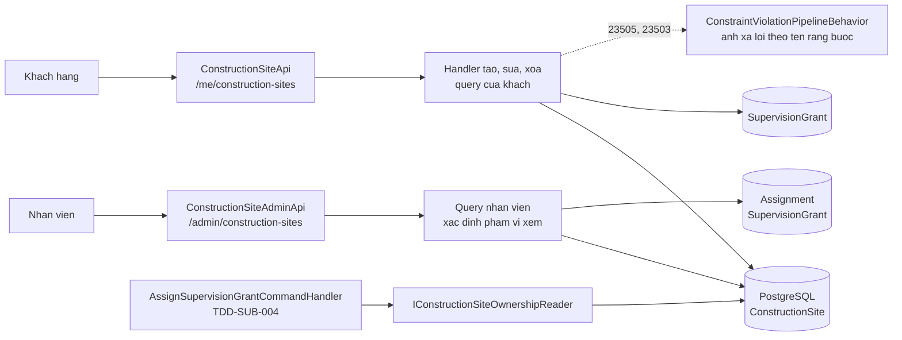
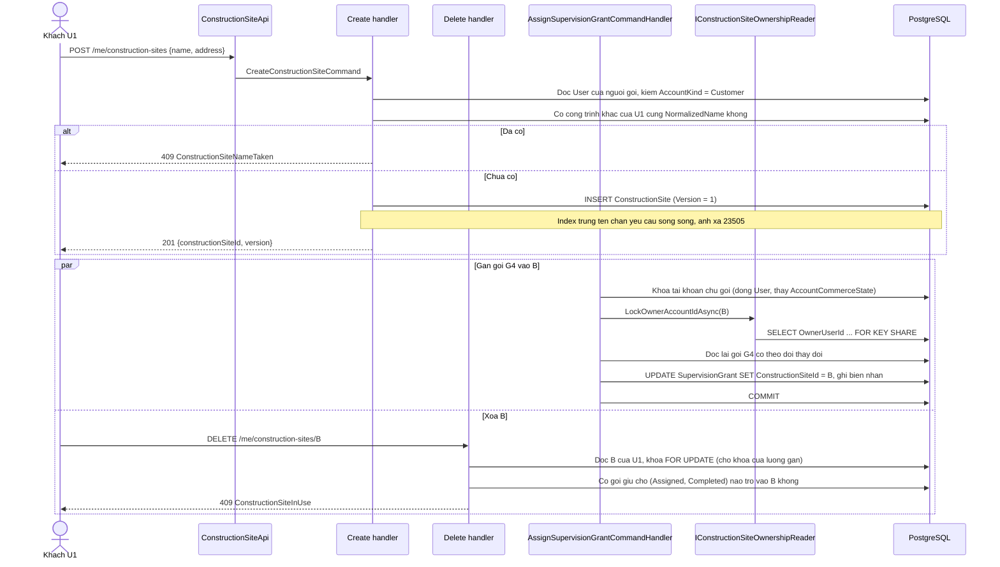
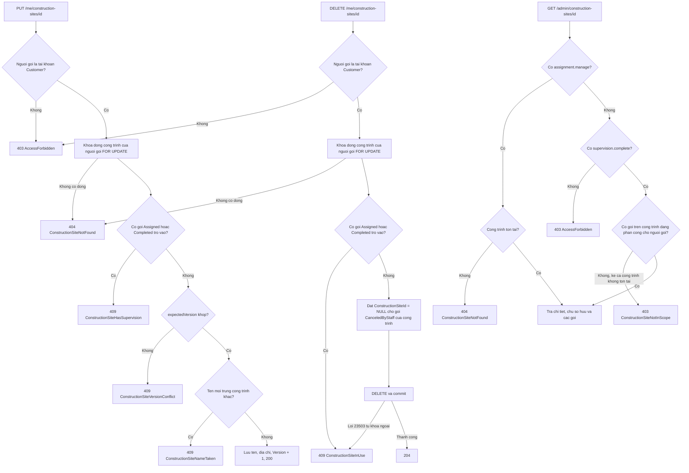
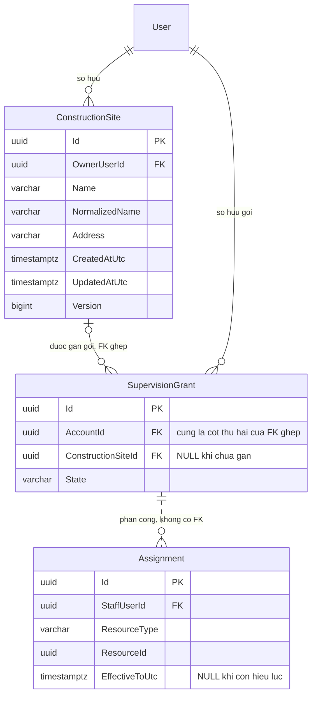

<!-- HƯỚNG DẪN CHO AI KHI ĐIỀN HOẶC CHỈNH SỬA MẪU
- Đọc toàn bộ mẫu, các comment hướng dẫn và tài liệu nguồn được cung cấp trước khi viết. Tuân thủ các quy tắc nghiệp vụ, điều kiện, ngoại lệ và giới hạn đã được xác nhận.
- Không bịa, tự chế hoặc suy đoán thành sự thật: yêu cầu, quy tắc, số liệu, API, schema, mã lỗi, nguồn tham khảo, người phụ trách và kết quả kiểm thử phải có căn cứ. Nội dung ví dụ trong mẫu không phải dữ kiện của dự án.
- Khi thiếu thông tin hoặc các nguồn mâu thuẫn, hỏi người dùng để làm rõ; giữ nguyên placeholder ở phần chưa xác định. Không tự chọn đáp án, lấp chỗ trống hay tuyên bố tài liệu đã hoàn tất.
- Chỉ thay nội dung cần điền hoặc được yêu cầu sửa. Không tự mở rộng phạm vi, sửa nghĩa quy tắc, bỏ điều kiện/ngoại lệ, xoá hay ghi đè nội dung hợp lệ đã có.
- Giữ nguyên tên, cấp và thứ tự heading, nhãn in đậm, tiền tố bullet, cấu trúc danh sách, tên/thứ tự/số cột bảng và cú pháp code fence. Không dịch, đổi tên, gộp hoặc thêm mục ngoài cấu trúc mẫu.
- Chỉ lặp khối luồng, AC hoặc API theo đúng khuôn khi có căn cứ; chỉ bỏ phần tuỳ chọn khi hướng dẫn riêng của mẫu cho phép và đã xác định không áp dụng.
- Mã tham chiếu và section phải trỏ tới tài liệu có thật đã được cung cấp hoặc kiểm chứng. Không giữ mã ví dụ như tham chiếu thật và không tự tạo tài liệu liên quan để hợp thức hoá liên kết.
- Giữ các comment hướng dẫn trong file. Xuất Markdown UTF-8, mỗi file một tài liệu; không bọc toàn bộ file trong code fence, không chèn lời dẫn hay giải thích ngoài mẫu.
- Trước khi bàn giao, đối chiếu nội dung với nguồn, kiểm tra cấu trúc, giá trị cho phép, giới hạn độ dài và tính nhất quán của mã/tham chiếu. Báo rõ phần chưa đủ thông tin; không tuyên bố đã chạy test hoặc import khi chưa thực hiện.
-->

<!-- Thay mã TDD-001 và nội dung ví dụ; giữ nguyên heading và nhãn in đậm.
Sơ đồ dùng mermaid, plantuml hoặc URL. Giữ heading Architecture, Sequence Diagram, Activity Diagram, State Diagram, Data Model.
Ví dụ API phải có heading trùng METHOD /path trong Endpoints. Xoá phần API/sơ đồ không dùng.
Version, Updated At và Change Log do lịch sử phiên bản quản lý, để trống khi nhập mới.
Author/Reviewer là tên hiển thị; gán tài khoản, phê duyệt, giả định và câu hỏi mở trên giao diện sau import.
Thiết kế phải truy vết về Story và Business Rule được cung cấp. Phân biệt thiết kế đề xuất với implementation đã kiểm chứng; không mô tả API/schema/sơ đồ ví dụ như hệ thống thật hoặc tự quyết định nghiệp vụ còn thiếu.
BẮT BUỘC KHI HOÀN THIỆN MẪU: phải có cả Reviewer và Approver, mỗi tên 1–200 ký tự sau khi bỏ khoảng trắng đầu/cuối. Không xoá hai dòng metadata, để trống, dùng tên bịa hoặc giữ placeholder rồi coi là hoàn tất.
Nếu chưa biết người review hoặc người phê duyệt, phải hỏi người dùng và báo tài liệu chưa đủ thông tin; không tự lấy Author/Owner làm người thay thế. Tên trong file không tự gán tài khoản hoặc xác nhận đã duyệt; gán thành viên trên giao diện sau import.
Đây là yêu cầu hoàn thiện mẫu; backend hiện vẫn nhận file cũ thiếu hai trường để tương thích.

VALIDATION CHO FILE NHẬP (đối chiếu ImportSnapshotValidator, MarkdownParser và ImportService):
- Mỗi file .md UTF-8 không rỗng chỉ có một heading cấp 1 chứa mã tài liệu dài 1–100 ký tự. Mã không được trùng trong cùng lần nhập hoặc thuộc loại tài liệu khác đã tồn tại.
- Không dùng tên README.md hoặc sitemap.md vì importer bỏ qua. Giao diện nhận .md/.zip, tối đa 2.000 file, tổng file tải lên 31 MiB; API giới hạn request 32 MiB và tổng nội dung đọc/giải nén 64 MiB.
- Chỉ nhập đè tài liệu cùng loại đang Draft, chưa có phiên bản và chưa lưu trữ. Import thay toàn bộ nội dung bản nháp, vì vậy phải giữ lại nội dung hợp lệ ngoài phần được yêu cầu sửa.
- Không dùng Status trong Markdown hoặc tên Approver để tự xác nhận phê duyệt; import không cấp quyền hay gán tài khoản từ tên. Chạy Kiểm tra file và xử lý lỗi/cảnh báo trước khi nhập.
- Giới hạn độ dài bên dưới tính theo string.Length của .NET (đơn vị UTF-16); không tự cắt ngắn dữ kiện quan trọng để vượt validation, hãy viết lại có căn cứ hoặc hỏi người dùng.
- Feature tối đa 300 ký tự và được dùng làm tiêu đề tài liệu. Status được parser nhận: Draft / In Review / Approved / Deprecated; tài liệu nhập mới vẫn có trạng thái phê duyệt Draft.
- Endpoint: đường dẫn tối đa 500 ký tự; tên/mô tả endpoint được lưu trong Name tối đa 300. HTTP method: GET / POST / PUT / PATCH / DELETE / HEAD / OPTIONS.
- Error Codes: mã tối đa 100 ký tự, không trùng trong tài liệu; giữ dạng - **CODE** (400): mô tả. HTTP status trong Error Codes và Response phải là số nguyên đọc được bằng Int32; không tự đặt status khác hợp đồng API.
- URL sơ đồ tối đa 1.000 ký tự. Mục sơ đồ được sử dụng phải có khối mermaid/plantuml hoặc URL theo mẫu; không để một mục sơ đồ rỗng. Nhãn mục được tách từ bullet như tên External API Fields tối đa 300 ký tự.
- Heading Examples phải khớp METHOD /path ở Endpoints. Giữ các nhãn Request:, Response 200: (thay mã theo contract) và Error Response: để parser tách đúng dữ liệu.
- Tham chiếu dạng DOC-KEY/section: ghi chú: mã đích tối đa 100 ký tự, section tối đa 100, ghi chú tối đa 1.000. Không trùng bộ mã đích + section + loại liên kết trong cùng tài liệu.
ĐỐI CHIẾU FORM TDD (src/features/tdds/validations.ts; form có thể chặt hơn import):
- Điền Feature, Author, Reviewer, Problem và ít nhất một Goal; các Goal/Non-goal/Notes đã thêm không được rỗng. API đã khai báo phải có endpoint và mô tả/mục đích; Fields phải có tên và ý nghĩa; Error Codes phải có mã, HTTP status và điều kiện.
- Form còn kiểm tra Version, Updated At và nội dung Change Log khi khai báo; với file nhập mới, giữ các trường lịch sử này trống theo hợp đồng import, không tự tạo dữ liệu lịch sử.
-->

# TDD-SITE-001

## Document Info

- **Feature**: Công trình — khách tạo, xem, sửa, xóa công trình; nhân viên xem công trình theo phạm vi quyền
- **Author**: Claude
- **Reviewer**: Tân Trần
- **Approver**: Tân Trần
- **Status**: Draft
- **Version**:
- **Updated At**:

## Context & Goals

### Problem

Người dùng đã chốt nghiệp vụ Công trình ngày 25/09/2026 trong STORY-SITE-001, STORY-SITE-002 và BR-SITE-001 đến BR-SITE-003. Công trình là nơi thi công thật mà khách muốn được giám sát, là thực thể riêng, khác bản dự toán. Khách tự tạo công trình miễn phí và chỉ nhập tên, địa chỉ. Khách chỉ sửa hoặc xóa được công trình khi công trình không có gói giám sát giữ chỗ, tức gói đã gán hoặc đã hoàn thành; gói đã gỡ hoặc đã hủy không khóa (BR-SITE-002, bản cập nhật ngày 25/09/2026). Nhân viên không tạo, sửa hay xóa hộ; họ chỉ xem theo phạm vi quyền.

Công trình là điểm neo của hai tính năng đã có code: gói giám sát gắn cố định vào một công trình (BR-SUB-009, BR-SUB-022) và nhân viên phụ trách theo từng gói (BR-RBAC-013). Trước đợt này chưa có bảng công trình nào, nên hai tính năng đó tham chiếu tới một định danh không kiểm được. Thiết kế dưới đây đã được triển khai ngày 25/09/2026 trên nhánh `feature/construction-site` của `bmt-be`.

**Cập nhật thiết kế ngày 25/09/2026 (lần 2) — đã có trong code ở nhánh `feature/supervision-unassign` của `bmt-be`, chưa merge vào `develop`.** Cùng ngày, người dùng chốt thêm ba thay đổi nghiệp vụ ảnh hưởng tới tài liệu này:

- Nhân viên được gỡ gói đang ở trạng thái đã gán khỏi công trình khi khách gán nhầm (BR-SUB-026, [TDD-SUB-007](TDD-SUB-007.md)). Gói về chưa gán, `ConstructionSiteId` thành NULL, nên công trình cũ không còn gói đó.
- Bỏ khôi phục gói đã hủy (BR-SUB-025 đã bỏ); hủy gói giám sát kết thúc phân công của gói (BR-SUB-024, BR-RBAC-013 khoản 9).
- Khách chỉ sửa hoặc xóa được công trình không có gói giữ chỗ (BR-SITE-002 khoản 3–4). Công trình chỉ còn gói đã hủy thì sửa, xóa được; khi xóa, gói đã hủy được gỡ liên kết (`ConstructionSiteId = NULL`) theo quyết định kỹ thuật người dùng chốt cùng ngày.

Các mục dưới đây ghi rõ phần nào thuộc lần cập nhật này. Code hiện tại ở `bmt-be` nhánh `develop`, commit `1ffdfbf`, vẫn chạy theo bản trước: sửa lúc nào cũng được, chỉ xóa công trình chưa từng có gói.

Hiện trạng code trước khi triển khai, đã kiểm ngày 25/09/2026:

| Thành phần | Hiện trạng và ảnh hưởng |
|---|---|
| `SupervisionGrant` (`src/bmt-be.domain/entities/SupervisionGrant.cs`, `SupervisionGrantConfiguration.cs`) | Cột `ProjectId uuid NULL`, không có khóa ngoại. Index duy nhất có lọc `UX_SupervisionGrant_ProjectHolder` trên `ProjectId` với `State IN ('Assigned','Completed')`. CHECK `CK_SupervisionGrant_AssignedColumns` cho phép gói `CanceledByStaff` giữ nguyên công trình cũ. |
| `SupervisionAssignmentEvent` | Cột `OldProjectId`, `NewProjectId`, không có khóa ngoại tới công trình. [TDD-SUB-004](TDD-SUB-004.md#data-model) bỏ bảng này vì gói không còn đổi công trình; tài liệu này không dùng bảng đó. |
| `IProjectOwnershipReader`, `UnavailableProjectOwnershipReader` (`src/bmt-be.application/abstractions/`, `services/`) | Cổng đọc chủ công trình, hiện đăng ký bản tạm luôn ném `DependencyUnavailableException` với mã `ProjectModuleUnavailable`. Vì vậy `POST /api/v1/me/supervision-grants/{grantId}/assign` luôn trả 503. |
| `SupervisionAssignmentFlow` | Khóa tài khoản chủ gói bằng `IDesignSubscriptionStore.LockAccountAsync`, tức `SELECT ... FROM "User" ... FOR UPDATE`, rồi mới đọc chủ công trình qua cổng trên. TDD-SUB-004 đổi khóa này sang `AccountCommerceState` theo TDD-PAY-001. |
| Route và policy (`src/bmt-be.presentation/apis/`, `JwtExtensions.cs`) | Tài nguyên của khách dùng tiền tố `/api/v1/me/...`; màn hình nhân viên dùng `/api/v1/admin/...`. Policy mặc định đòi phiên đã xác minh; mỗi mã quyền có một policy cùng tên. Chưa có policy "có một trong hai quyền". |
| Lỗi và ánh xạ (`ExceptionHandlingMiddleware.cs`, `ApiEndpoint.cs`) | Validator trả 422 dạng ProblemDetails. `NotFoundException` → 404, `NotPermissionException` → 403, `ConflictException` → 409. Vi phạm unique `23505` rơi vào một nhánh 409 chung với mã `ServerError`; chưa có ánh xạ theo tên ràng buộc và chưa bắt lỗi khóa ngoại `23503`. |
| Quy ước chuẩn hóa tên | `User.NormalizedFirstName`, `NormalizedLastName` do `IProcessText.NormalizeText` tính: chuyển chữ thường và bỏ dấu. Không dùng làm tiền lệ cho tên công trình, vì bỏ dấu sẽ làm "Nhà phố" trùng "Nha pho", trái BR-SITE-001. |
| `Assignment` (`AssignmentConfiguration.cs`) | CHECK `ResourceType IN ('Customer','Project')`. Việc đổi sang loại tài nguyên gói giám sát thuộc TDD-RBAC-003. |

Đã triển khai ngày 25/09/2026 ở commit `182e2a8` trên nhánh `feature/construction-site` (đường dẫn tính từ `bmt-be/src/`):

| Thành phần | Nơi đặt |
|---|---|
| Entity `ConstructionSite`, hàm `ConstructionSite.NormalizeName` | `bmt-be.domain/entities/ConstructionSite.cs` |
| Cổng `IConstructionSiteOwnershipReader`, `IConstructionSiteRowLocker`, `IDatabaseErrorReader` | `bmt-be.domain/abstractions/repositories/` |
| Cài đặt `ConstructionSiteLocks` (cả hai cổng khóa), `NpgsqlDatabaseErrorReader` | `bmt-be.persistence/repositories/` |
| Cấu hình EF `ConstructionSiteConfiguration`; tên ràng buộc `DatabaseConstraintNames` | `bmt-be.persistence/configurations/`; `bmt-be.contract/constants/DatabaseConstraintNames.cs` |
| Contract, validator, `ConstructionSiteText`, `ConstructionSiteErrorCodes` | `bmt-be.contract/services/constructionSite/`; `bmt-be.contract/constants/ConstructionSiteErrorCodes.cs` |
| Handler lệnh và truy vấn | `bmt-be.application/usecases/commands/constructionSite/`, `usecases/queries/constructionSite/` |
| Lớp ánh xạ lỗi `ConstraintViolationPipelineBehavior` | `bmt-be.application/behaviors/` |
| Module Carter `ConstructionSiteApi`, `ConstructionSiteAdminApi` | `bmt-be.presentation/apis/constructionSite/ConstructionSiteApi.cs` |
| Migration | `bmt-be.persistence/Migrations/20260925074152_ConstructionSiteAndPackageAssignment.cs`, gộp với thay đổi của TDD-SUB-004, TDD-RBAC-001 và TDD-RBAC-003 |

`IProjectOwnershipReader` và bản tạm `UnavailableProjectOwnershipReader` đã xóa.

Các yêu cầu khó của thiết kế:

- Hai yêu cầu tạo, hoặc sửa, cùng một tên của cùng khách gửi song song thì chỉ một yêu cầu được thành công (STORY-SITE-001/Non-Functional).
- Yêu cầu xóa công trình và yêu cầu gắn gói vào chính công trình đó gửi cùng lúc không được để lại gói trỏ vào công trình đã xóa.
- Yêu cầu sửa công trình và yêu cầu gắn gói vào chính công trình đó gửi cùng lúc không được để công trình bị sửa sau khi đã có gói giữ chỗ (STORY-SITE-001/Non-Functional, ST-SITE-032). Cập nhật lần 2.
- "Công trình có gói giữ chỗ" phải tính đúng tập trạng thái `Assigned`/`Completed` mà index giữ chỗ dùng; gói đã gỡ hoặc đã hủy không khóa việc sửa, xóa (BR-SITE-002 khoản 3–4). Cập nhật lần 2, thay yêu cầu cũ "công trình từng có gói".
- Xóa công trình chỉ còn gói đã hủy không được vướng khóa ngoại, và khách vẫn thấy tên công trình trên gói đã hủy sau khi xóa (BR-SUB-024 khoản 9). Cập nhật lần 2.
- Nhân viên chỉ có `supervision.complete` xem công trình theo phân công gói, không theo quyền xem thông thường (BR-SITE-003 khoản 3).
- Yêu cầu ngoài phạm vi không được lộ tên, địa chỉ hay gói của công trình (BR-SITE-003 khoản 7).

### Goals

- Có bảng `ConstructionSite` làm nguồn sự thật duy nhất về công trình; `SupervisionGrant` trỏ vào bảng này bằng khóa ngoại ghép theo chủ sở hữu.
- Database bảo đảm tên không trùng trong cùng khách và không xóa được công trình đang có gói trỏ vào, kể cả khi các yêu cầu chạy song song. Từ lần cập nhật 2, handler xóa gỡ liên kết của gói đã hủy trước khi xóa, nên khóa ngoại chỉ còn chặn gói giữ chỗ.
- Khách không sửa được công trình đang có gói giữ chỗ, kể cả khi sửa và gán gói chạy song song (cập nhật lần 2).
- Thay bản tạm `UnavailableProjectOwnershipReader` bằng cổng đọc thật `IConstructionSiteOwnershipReader`, để luồng gán gói lần đầu của TDD-SUB-004 chạy được.
- API khách đủ tạo, xem danh sách, xem chi tiết, sửa, xóa; API nhân viên chỉ đọc và lọc đúng phạm vi của BR-SITE-003.
- Mỗi lỗi nghiệp vụ có một mã riêng, đọc được ở phía client.

### Non-goals

- Trạng thái công trình, nhân viên tạo, sửa hoặc xóa hộ, hiện tên nhân viên phụ trách cho khách, địa chỉ tách cấp hành chính, liên kết với bản dự toán, giới hạn số công trình. Các mục này nằm trong Out of Scope của STORY-SITE-001 và STORY-SITE-002.
- Phân trang, thứ tự sắp xếp, bộ lọc và tìm kiếm theo nghiệp vụ: chưa được chốt. Phân trang dưới đây là quyết định kỹ thuật theo khuôn `PagedResult` hiện có.
- Gán gói vào công trình và đổi tên cột của `SupervisionGrant`: thuộc [TDD-SUB-004](TDD-SUB-004.md). Phân công theo gói và danh sách gói cần chia lại: thuộc [TDD-RBAC-003](TDD-RBAC-003.md). Tài liệu này chỉ mô tả phần các thiết kế đó cần từ bảng công trình.
- Người dùng chốt TDD bản đầu ngày 25/09/2026. Code, migration và mã test của bản đó đã có; kết quả chạy ngày 25/09/2026: unit test 338/338 và integration test 149/149 trên PostgreSQL 15 đạt. Chưa chạy System Test và chưa áp dụng migration lên môi trường dev hay production. Phần cập nhật lần 2 đã được người dùng chốt ngày 25/09/2026 và đã có trong code ở nhánh `feature/supervision-unassign` của `bmt-be`. Kết quả chạy ngày 25/09/2026 trên nhánh đó: unit test 465/465 (năm project test) và integration test 170/170 trên PostgreSQL 15 (Testcontainers) đạt; chưa chạy System Test và chưa áp dụng migration lên môi trường dev dùng chung hay production.
- Gỡ gói khỏi công trình, hủy gói và kết thúc phân công: thuộc [TDD-SUB-007](TDD-SUB-007.md), [TDD-SUB-005](TDD-SUB-005.md) và [TDD-RBAC-003](TDD-RBAC-003.md). Tài liệu này chỉ dùng kết quả của các luồng đó.

## Architecture



### Thành phần và trách nhiệm

| Thành phần | Trách nhiệm |
|---|---|
| `ConstructionSiteApi` (`presentation/apis/constructionSite/`) | Năm route của khách dưới `/api/v1/me/construction-sites`, policy mặc định. |
| `ConstructionSiteAdminApi` (cùng file) | Hai route chỉ đọc cho nhân viên dưới `/api/v1/admin/construction-sites`, policy mặc định; phạm vi xem được xác định trong handler. |
| `CreateConstructionSiteCommandHandler`, `UpdateConstructionSiteCommandHandler`, `DeleteConstructionSiteCommandHandler` | Kiểm người gọi là tài khoản khách hàng qua `ConstructionSiteAccess.RequireCustomerAsync`, kiểm chủ sở hữu, chuẩn hóa dữ liệu, kiểm trùng tên, kiểm version, kiểm điều kiện xóa. Cập nhật lần 2: handler sửa khóa dòng và kiểm gói giữ chỗ trước khi sửa; handler xóa kiểm gói giữ chỗ và gỡ liên kết gói đã hủy trước khi xóa. |
| `GetMyConstructionSitesQueryHandler`, `GetMyConstructionSiteQueryHandler` | Chỉ đọc công trình của chính khách, kèm các gói đã gắn và trạng thái gói; không đọc bảng phân công. |
| `GetConstructionSitesForStaffQueryHandler`, `GetConstructionSiteForStaffQueryHandler` | Xác định phạm vi từ claim quyền bằng `ConstructionSiteStaffScope`, rồi đọc danh sách hoặc chi tiết trong phạm vi đó. Phần đọc gói kèm tên gói dùng chung `ConstructionSiteReadModel`. |
| `ConstructionSiteText.Clean` (`contract/services/constructionSite/`) | Hàm làm sạch dùng chung cho validator và handler: chuẩn Unicode NFC rồi bỏ khoảng trắng đầu và cuối. |
| `ConstructionSite.NormalizeName` (entity ở domain) | Tính khóa so trùng `NormalizedName` bằng `ToUpperInvariant`. Handler tạo và sửa luôn gán `Name` và `NormalizedName` từ cùng một giá trị đã làm sạch. |
| `IConstructionSiteOwnershipReader`, `IConstructionSiteRowLocker` (`domain/abstractions/repositories/`), cài chung trong `persistence/repositories/ConstructionSiteLocks.cs` | Đọc chủ công trình và giữ khóa để gói không gắn vào công trình đang bị xóa; khóa dòng công trình trước khi xóa, và từ cập nhật lần 2 là cả trước khi sửa. Thay `IProjectOwnershipReader`. Cổng đặt ở domain vì persistence hiện thực nó mà không tham chiếu application, giống `IAssignmentRowLocker` và `IDesignSubscriptionStore`. |
| `ConstraintViolationPipelineBehavior` (`application/behaviors/`), `IDatabaseErrorReader` (domain) và `NpgsqlDatabaseErrorReader` (persistence) | Đổi lỗi `23505`, `23503` và lỗi concurrency token thành mã lỗi nghiệp vụ, theo tên ràng buộc và theo lệnh đang chạy. Xem mục "Ánh xạ lỗi database". |
| `ConstructionSiteErrorCodes` (`contract/constants/`) | Các mã lỗi ở mục Error Codes. |

Tên thư mục tính năng là `constructionSite` ở cả bốn tầng contract, application, presentation và test, theo quy ước một tính năng một tên thư mục. Không dùng `construction-site` vì namespace C# không có dấu gạch; repo đã đặt thư mục nhiều từ theo camelCase như `processText`, `backgroundJobs`.

### Chuẩn hóa tên và kiểm trùng

BR-SITE-001 đòi tên không trùng giữa các công trình của cùng khách, so sau khi bỏ khoảng trắng đầu và cuối, không phân biệt chữ hoa, chữ thường. Thiết kế lưu thêm cột `NormalizedName` và đặt index duy nhất `UX_ConstructionSite_OwnerNormalizedName` trên `(OwnerUserId, NormalizedName)`.

Tên và địa chỉ đi qua các bước dưới đây theo đúng thứ tự. Bước 1–2 do `ConstructionSiteText.Clean` làm, dùng chung cho validator và handler; bước 4 do `ConstructionSite.NormalizeName` làm:

1. Đưa chuỗi về dạng Unicode NFC. Bàn phím tiếng Việt có thể gửi "à" thành một ký tự hoặc thành "a" cộng dấu huyền rời; hai cách gõ trông giống nhau nhưng khác mã. NFC gộp về một dạng để hai tên nhìn giống nhau thì so bằng nhau, và độ dài đếm đúng số chữ người dùng thấy.
2. Bỏ khoảng trắng đầu và cuối bằng `string.Trim()`. Khoảng trắng ở giữa giữ nguyên, nên "Nhà  phố" (hai dấu cách) khác "Nhà phố", đúng BR-SITE-001/Notes.
3. Kiểm có nội dung và độ dài: tên 1–200, địa chỉ 1–500, tính theo `string.Length` sau hai bước trên. Không tự cắt ngắn.
4. `NormalizedName = Name.ToUpperInvariant()`. Chữ có dấu vẫn giữ dấu: "Nhà phố" thành "NHÀ PHỐ", còn "Nha pho" thành "NHA PHO", nên hai tên này khác nhau. Không dùng `IProcessText.NormalizeText` mà `User.NormalizedFirstName` đang dùng, vì hàm đó bỏ dấu. `ToUpperInvariant` không phụ thuộc culture của máy chủ và giữ nguyên độ dài chuỗi.

`ConstructionSiteText.Clean` trả `null` khi chuỗi có ký tự thay thế lẻ không chuẩn hóa được; validator coi đó là giá trị không hợp lệ.

Vì sao không dùng index trên biểu thức `upper("Name")` của PostgreSQL: hàm đó phụ thuộc collation của database, còn phép kiểm trước ở handler chạy bằng .NET. Hai bên có thể lệch nhau ở một vài ký tự, và khi đó handler báo "chưa trùng" nhưng index lại chặn, hoặc ngược lại. Lưu kết quả do ứng dụng tính thì hai lớp kiểm dùng đúng một hàm. Đánh đổi là cột `NormalizedName` là dữ liệu suy ra từ `Name`; nó chỉ được tính ở `ConstructionSite.NormalizeName`, và handler tạo, sửa tính lại mỗi lần gán `Name`.

Kiểm trùng có hai lớp, giống cách TDD-RBAC-003 làm với phân công:

1. Handler tạo và sửa truy vấn trước xem khách đã có công trình khác cùng `NormalizedName` chưa. Có thì trả 409 `ConstructionSiteNameTaken`. Khi sửa, điều kiện loại chính công trình đang sửa (`Id <> @siteId`), nên khách đổi "nhà phố" thành "Nhà Phố" của chính công trình đó vẫn được (STORY-SITE-001/AC-013).
2. Index duy nhất là lớp chặn cuối. Tình huống: khách bấm tạo "Nhà mẹ" hai lần liên tiếp trên hai thiết bị. Cả hai handler cùng thấy chưa có tên này và cùng chèn. PostgreSQL chặn câu `INSERT` đến sau bằng lỗi `23505`. `ConstraintViolationPipelineBehavior`, đăng ký bọc ngoài `TransactionPipelineBehavior`, nhận tên `UX_ConstructionSite_OwnerNormalizedName` và trả 409 `ConstructionSiteNameTaken`, thay vì nhánh 409 chung của middleware. Kết quả đúng ST-SITE-019: chỉ một công trình "Nhà mẹ".

Công trình bị xóa là xóa cứng, nên dòng biến mất khỏi index và khách tạo lại được tên cũ, đúng BR-SITE-001/Except. Khách khác nhau được trùng tên vì `OwnerUserId` là cột đầu của index.

### Điều kiện xóa và khóa ngoại ghép RESTRICT

**Cập nhật lần 2.** BR-SITE-002 khoản 4 bản mới chỉ cho xóa công trình **không có gói giữ chỗ**, tức không có gói `Assigned` hay `Completed` trỏ vào công trình. Công trình chưa từng có gói, hoặc chỉ còn gói đã hủy, đều xóa được. Gói đã gỡ theo [TDD-SUB-007](TDD-SUB-007.md) đã có `ConstructionSiteId = NULL`, nên không còn trỏ vào công trình cũ.

Thiết kế vẫn không lưu cờ "có gói giữ chỗ" trên công trình, vì cờ đó là một sự thật thứ hai phải đồng bộ với bảng gói. Điều kiện suy ra từ `SupervisionGrant`: công trình X có gói giữ chỗ khi và chỉ khi có dòng `SupervisionGrant` với `ConstructionSiteId = X` và `State` thuộc tập giữ chỗ `SupervisionStates.HoldingConstructionSite` (`Assigned`, `Completed`). Đây cũng là điều kiện lọc của index `UX_SupervisionGrant_ConstructionSiteHolder`, nên câu kiểm dùng được index đó và không lệch với ràng buộc của database.

Handler xóa làm theo thứ tự, trong cùng một transaction:

1. Khóa dòng công trình `FOR UPDATE` qua `IConstructionSiteRowLocker.LockOwnedForUpdateAsync`. Không có dòng khớp chủ thì trả 404 `ConstructionSiteNotFound`.
2. Kiểm có gói giữ chỗ trỏ vào công trình không. Có thì trả 409 `ConstructionSiteInUse`.
3. Gỡ liên kết các gói đã hủy còn trỏ vào công trình:

   ```sql
   UPDATE "SupervisionGrant"
   SET "ConstructionSiteId" = NULL
   WHERE "ConstructionSiteId" = @siteId AND "State" = 'CanceledByStaff';
   ```

   Câu này không tăng `Version` của gói. Gói đã hủy là trạng thái cuối, không còn thao tác nào đọc `Version` của nó (BR-SUB-025 đã bỏ). CHECK `CK_SupervisionGrant_AssignedColumns` cho phép gói `CanceledByStaff` có `ConstructionSiteId` NULL.
4. Xóa cứng dòng công trình.

Vì sao gỡ liên kết thay vì xóa mềm công trình: người dùng chọn cách này ngày 25/09/2026. Xóa mềm giữ được liên kết nhưng phải sửa index kiểm trùng tên (tên của công trình đã xóa không được tính theo BR-SITE-001/Except) và mọi truy vấn công trình đều phải lọc dòng đã xóa. Gỡ liên kết giữ nguyên cách xóa cứng hiện có.

Khách vẫn thấy tên công trình trên gói đã hủy sau khi xóa (BR-SUB-024 khoản 9), vì [TDD-SUB-005](TDD-SUB-005.md#data-model) lưu `ConstructionSiteId`, `ConstructionSiteName`, `ConstructionSiteAddress` vào dòng `PackageLifecycleEvent` của lần hủy. Query của khách đọc tên từ bản lưu đó khi gói đã hủy không còn công trình.

Ví dụ: gói G1 đã hủy trên CS1, CS1 không còn gói nào khác. Khách xóa CS1: bước 2 không thấy gói giữ chỗ, bước 3 đặt `G1.ConstructionSiteId = NULL`, bước 4 xóa CS1. Danh sách gói của khách vẫn hiện G1 "đã hủy – Nhà phố mới" nhờ bản lưu trong sự kiện hủy.

**Bản trước (đã triển khai ở commit `182e2a8`).** BR-SITE-002 khoản 4 cũ chỉ cho xóa công trình chưa từng có gói gắn vào, suy ra từ việc có dòng `SupervisionGrant` nào trỏ vào công trình hay không. Code hiện tại vẫn kiểm theo điều kiện này.

Bảng `SupervisionAssignmentEvent` không còn là căn cứ: [TDD-SUB-004](TDD-SUB-004.md#data-model) bỏ bảng này, và dữ kiện của lần gán đã nằm ở `SupervisionGrant` và `PackageMutationReceipt`.

**Khóa ngoại ghép theo chủ sở hữu.** TDD-SUB-004 đổi `ProjectId` thành `ConstructionSiteId` và thêm khóa ngoại `FK_SupervisionGrant_ConstructionSite` từ `SupervisionGrant(ConstructionSiteId, AccountId)` tới `ConstructionSite(Id, OwnerUserId)` với `ON DELETE RESTRICT`. Để khóa ngoại này trỏ được, tài liệu này thêm ràng buộc duy nhất `AK_ConstructionSite_Id_OwnerUserId` trên `(Id, OwnerUserId)` của `ConstructionSite`. Riêng `Id` đã là khóa chính nên cặp này luôn duy nhất; ràng buộc chỉ tồn tại để làm đích cho khóa ngoại ghép.

Vì sao ghép thêm chủ sở hữu thay vì chỉ trỏ tới `Id`: khóa ngoại một cột chỉ bảo đảm công trình tồn tại, còn khóa ngoại ghép bảo đảm công trình đó thuộc đúng chủ gói. Nếu handler gán gói có lỗi và ghi gói của U1 vào công trình CS9 của U2, cặp (CS9, U1) không khớp dòng nào của `ConstructionSite(Id, OwnerUserId)`, nên PostgreSQL từ chối bằng lỗi `23503`. Như vậy database tự chặn gói trỏ vào công trình của khách khác, không chỉ dựa vào phép so chủ sở hữu trong handler. Công trình không bao giờ đổi chủ, nên khóa này không bao giờ phải cập nhật theo. Đây là cùng kỹ thuật mà `SupervisionGrant(RevisionId, Kind)` đang dùng để trỏ tới `PlanRevision(Id, Kind)`.

`MATCH SIMPLE`, mặc định của PostgreSQL, bỏ qua dòng có `ConstructionSiteId` NULL, nên gói chưa gán không bị khóa ngoại xét.

Tài liệu này dựa vào khóa ngoại đó theo ba cách:

1. **Kiểm trước ở handler xóa** để trả mã lỗi rõ nghĩa 409 `ConstructionSiteInUse`.
2. **Khóa ngoại là lớp chặn cuối.** Nếu một đường ghi nào đó bỏ qua bước kiểm, PostgreSQL vẫn từ chối câu `DELETE` bằng lỗi `23503`. Sau cập nhật lần 2, dòng còn trỏ vào công trình lúc `DELETE` chỉ có thể là gói giữ chỗ, vì bước 3 đã gỡ liên kết gói đã hủy. Cùng một khóa ngoại cho ra lỗi `23503` ở hai tình huống khác nhau: khi xóa công trình còn gói (công trình đang được dùng) và khi ghi gói vào công trình không tồn tại hoặc khác chủ (không thấy công trình). Vì vậy `ConstraintViolationPipelineBehavior` xét cả tên ràng buộc lẫn lệnh đang chạy: `DeleteConstructionSiteCommand` đổi thành 409 `ConstructionSiteInUse`, còn lệnh gán gói đổi thành 404 `ConstructionSiteNotFound` theo TDD-SUB-004.
3. **Khóa ngoại tự tạo khóa dòng giữa xóa và gắn gói.** Khi một câu lệnh ghi `ConstructionSiteId = X` vào `SupervisionGrant`, PostgreSQL kiểm dòng cha còn tồn tại và giữ khóa `FOR KEY SHARE` trên dòng X tới hết transaction. Khóa này xung đột với khóa mà `DELETE` cần, nên hai thao tác không thể cùng thành công.

**Thứ tự khóa.** Luồng gán gói ở TDD-SUB-004 khóa theo thứ tự tài khoản chủ gói → dòng `ConstructionSite` đích (`FOR KEY SHARE`, qua `IConstructionSiteOwnershipReader`) → gói → biên nhận. Code hiện khóa dòng `User` của chủ gói qua `IDesignSubscriptionStore.LockAccountAsync`, vì bảng `AccountCommerceState` của TDD-PAY-001 chưa có; gói được đọc lại có theo dõi thay đổi sau khóa tài khoản (TDD-SUB-004/Architecture). Handler xóa công trình chỉ khóa đúng một dòng `ConstructionSite` (`FOR UPDATE`, qua `IConstructionSiteRowLocker`), không khóa tài khoản và không khóa trước dòng gói nào; việc kiểm gói tham chiếu do câu kiểm và khóa ngoại làm. Hai chuỗi khóa chỉ gặp nhau ở dòng công trình, nên không tạo vòng chờ.

Từ cập nhật lần 2, handler xóa còn ghi các dòng gói `CanceledByStaff` ở bước gỡ liên kết. Không luồng nào khác ghi dòng gói đã hủy (không còn khôi phục), nên câu `UPDATE` này không phải chờ ai và không tạo vòng chờ mới. Hủy hoặc gỡ một gói đang giữ chỗ trên công trình ([TDD-SUB-005](TDD-SUB-005.md), [TDD-SUB-007](TDD-SUB-007.md)) khóa dòng gói chứ không khóa dòng công trình. Nếu chạy song song với xóa, câu kiểm gói giữ chỗ của handler xóa đọc trạng thái đã commit: gói còn `Assigned` thì xóa nhận 409 `ConstructionSiteInUse`; khách xóa lại sau khi hủy hoặc gỡ commit thì thành công. Không kết cục nào xóa mất công trình của gói đang giữ chỗ, vì khóa ngoại vẫn chặn ở lớp cuối.

**Handler sửa (cập nhật lần 2).** Handler sửa khóa dòng công trình `FOR UPDATE` bằng cùng cổng trước khi kiểm gói giữ chỗ; chi tiết và tình huống ST-SITE-032 ở mục "Sửa có kiểm version".

Tình huống của ST-SITE-020: công trình B của U1 chưa từng có gói; U1 xóa B trong lúc gắn gói G4 vào B.

- Nếu gắn gói chạy trước: luồng gán khóa tài khoản của U1, rồi cổng `IConstructionSiteOwnershipReader` đọc B kèm `FOR KEY SHARE`. Handler xóa khóa B bằng `FOR UPDATE` thì phải chờ. Sau khi gắn gói commit, câu kiểm của handler xóa chạy sau khi lấy được khóa, thấy G4 đã trỏ vào B, và trả 409 `ConstructionSiteInUse`.
- Nếu xóa chạy trước: handler xóa giữ `FOR UPDATE` trên B. Cổng đọc chủ công trình phải chờ; khi xóa commit, dòng B không còn, cổng trả "không có công trình", và luồng gán trả 404 `ConstructionSiteNotFound`. G4 vẫn chưa gán.

Ở mức cô lập `READ COMMITTED` mặc định, mỗi câu lệnh thấy dữ liệu đã commit tại lúc câu lệnh bắt đầu. Vì vậy câu kiểm "có gói giữ chỗ nào trỏ vào B không" phải chạy **sau** khi handler xóa đã lấy khóa dòng B, không chạy trước. Handler sửa cũng theo cùng nguyên tắc.

Khóa ngoại `RESTRICT` cần index trên cột con để PostgreSQL tìm nhanh các dòng tham chiếu khi xóa. Index giữ chỗ `UX_SupervisionGrant_ConstructionSiteHolder` chỉ chứa gói `Assigned` và `Completed` nên không dùng được cho việc này. TDD-SUB-004 thêm index thường `IX_SupervisionGrant_ConstructionSiteId_AccountId` trên `(ConstructionSiteId, AccountId)`; câu gỡ liên kết gói đã hủy và danh sách công trình kèm gói dùng index này. Câu kiểm gói giữ chỗ của handler sửa và xóa dùng được index giữ chỗ vì cùng điều kiện lọc.

### Cổng đọc chủ công trình

`IConstructionSiteOwnershipReader` thay `IProjectOwnershipReader`. Cổng chỉ có một hàm:

```
Task<Guid?> LockOwnerAccountIdAsync(Guid constructionSiteId, CancellationToken cancellationToken = default);
```

- Trả `OwnerUserId` của công trình, hoặc `null` nếu không có công trình đó.
- Chạy `SELECT "OwnerUserId" FROM "ConstructionSite" WHERE "Id" = @id FOR KEY SHARE` trên cùng `DbContext` và cùng transaction của handler gọi. Khóa giữ tới hết transaction.
- Dùng `FOR KEY SHARE` chứ không dùng `FOR SHARE`. `FOR KEY SHARE` chỉ chặn xóa dòng hoặc sửa cột khóa; khách đổi địa chỉ công trình cùng lúc không phải chờ. Chủ sở hữu không bao giờ đổi, nên chặn xóa là đủ để kết quả đọc đúng tới lúc commit.
- Bản cài `ConstructionSiteLocks` đặt ở `persistence/repositories/` vì dùng SQL thô qua `Database.SqlQuery`, giống `DesignSubscriptionStore.LockAccountAsync`. Cùng lớp này cài `IConstructionSiteRowLocker.LockOwnedForUpdateAsync(siteId, ownerUserId)` cho handler xóa: `SELECT "Id" ... WHERE "Id" = @id AND "OwnerUserId" = @owner FOR UPDATE`, trả `false` khi không có dòng khớp. `UnavailableProjectOwnershipReader` đã xóa.
- Cổng đặt ở `bmt-be.domain/abstractions/repositories/`, không ở application, vì persistence không tham chiếu application.

`AssignSupervisionGrantCommandHandler` tự so `OwnerUserId` với chủ gói và trả cùng một mã 404 `ConstructionSiteNotFound` cho "không có công trình" và "công trình của người khác". Cổng không nhận hay tin `ownerId` do client gửi.

### Phạm vi xem của khách và nhân viên

Hai nhóm route tách riêng vì hai nhóm người dùng xem dữ liệu khác nhau.

**Route của khách `/api/v1/me/construction-sites`.** Mọi handler đọc dòng `User` của người gọi và kiểm `AccountKind = 'Customer'`. Tài khoản nhân viên, kể cả Admin, nhận 403 `AccessForbidden`, đúng BR-SITE-002 khoản 1–2 và STORY-SITE-002/EXC-03. Đọc từ database chứ không từ token vì token không mang loại tài khoản. Truy vấn luôn có điều kiện `OwnerUserId = người gọi`. Công trình không tồn tại và công trình của khách khác trả cùng 404 `ConstructionSiteNotFound`, cùng một thông báo. Nếu tách thành hai mã, người gọi dò được công trình nào có thật chỉ bằng cách so hai câu trả lời; luồng gán gói cũng theo đúng cách này.

**Route của nhân viên `/api/v1/admin/construction-sites`.** Policy mặc định cho phép mọi phiên đã xác minh đi tiếp; handler xác định phạm vi từ claim `perm`:

| Quyền của người gọi | Phạm vi | Công trình ngoài phạm vi |
|---|---|---|
| Có `assignment.manage` | Mọi công trình của mọi khách | Không có; công trình không tồn tại trả 404 `ConstructionSiteNotFound` |
| Không có `assignment.manage`, có `supervision.complete` | Công trình của những gói đang được phân công cho người gọi tại lúc đọc | 403 `ConstructionSiteNotInScope`, kể cả khi công trình không tồn tại |
| Không có cả hai | Không có | 403 `AccessForbidden` cho cả danh sách lẫn chi tiết |

Vai trò hệ thống Admin có đủ mọi quyền và không sửa được (BR-RBAC-002), nên Admin luôn rơi vào dòng đầu. Không cần kiểm thêm mã vai trò `admin` như ở luồng hoàn thành gói. Có nhiều quyền thì lấy phạm vi rộng nhất, đúng BR-SITE-003 khoản 4.

Dòng thứ hai trả 403 cho cả công trình không tồn tại, vì BR-RBAC-011 khoản 3 quy định thiếu phân công trả 403, và vì trả 404 riêng cho công trình không tồn tại sẽ để người không phụ trách dò ra công trình nào có thật. ST-SITE-024 kiểm đúng hành vi này.

Phạm vi của dòng thứ hai được tính bằng điều kiện:

```
EXISTS (
  SELECT 1 FROM "Assignment" a
  JOIN "SupervisionGrant" g ON g."Id" = a."ResourceId"
  WHERE a."StaffUserId" = @me
    AND a."ResourceType" = 'SupervisionGrant'
    AND a."EffectiveToUtc" IS NULL
    AND g."ConstructionSiteId" = s."Id")
```

Điều kiện không lọc theo trạng thái gói. Khi phân công kết thúc hoặc được chuyển giao, dòng phân công có `EffectiveToUtc`, nên yêu cầu xem tiếp theo không còn thấy công trình đó (ST-SITE-026). Từ cập nhật lần 2, hủy gói ([TDD-SUB-005](TDD-SUB-005.md)) và gỡ gói ([TDD-SUB-007](TDD-SUB-007.md)) đều kết thúc phân công của gói trong cùng transaction (BR-RBAC-013 khoản 9 bản mới), nên người phụ trách mất quyền xem công trình qua gói đó ngay sau khi hủy hoặc gỡ commit (STORY-SITE-002/AC-010, ALT-03, ST-SITE-031). Truy vấn phạm vi không phải đổi. Bản trước cho nhân viên vẫn xem công trình của gói đang bị hủy khi phân công còn (STORY-SITE-002/ALT-02, AC-005); hai mục này nay không còn nghiệm thu. Giá trị loại tài nguyên là `ResourceTypes.SupervisionGrant` theo TDD-RBAC-003. Code viết điều kiện này bằng LINQ trong `ConstructionSiteStaffScope.ApplyAssigned` (hai truy vấn con `IN` thay cho `EXISTS`), cho cùng kết quả.

Phạm vi xem theo phân công là trường hợp riêng mà BR-RBAC-010/Notes đã ghi: `supervision.complete` là quyền thao tác, không phải quyền xem, nên phạm vi đọc công trình của người chỉ có quyền này bị giới hạn theo gói được giao.

### Sửa có kiểm version

**Cập nhật lần 2: khóa sửa khi có gói giữ chỗ.** BR-SITE-002 khoản 3 bản mới chỉ cho sửa tên, địa chỉ khi công trình không có gói giữ chỗ. Mục đích là không để khách đổi địa chỉ công trình nhằm dùng gói cho một nơi khác; khách gõ sai thì liên hệ tổng đài để nhân viên gỡ gói theo [TDD-SUB-007](TDD-SUB-007.md), rồi sửa và gán lại. Handler sửa làm theo thứ tự, trong transaction của lệnh:

1. Kiểm người gọi là khách hàng như trước.
2. Khóa dòng công trình của khách bằng `FOR UPDATE` qua `IConstructionSiteRowLocker.LockOwnedForUpdateAsync`, cùng cổng handler xóa đang dùng. Không có dòng khớp chủ thì trả 404 `ConstructionSiteNotFound`.
3. Kiểm có gói `Assigned` hoặc `Completed` trỏ vào công trình không, dùng hằng `SupervisionStates.HoldingConstructionSite`. Có thì trả 409 `ConstructionSiteHasSupervision`, không đổi dữ liệu. Gói đã hủy còn trỏ vào công trình không khóa việc sửa.
4. Kiểm version, trùng tên và lưu như đoạn dưới.

**Vì sao khóa `FOR UPDATE` trước khi kiểm.** Luồng gán gói ([TDD-SUB-004](TDD-SUB-004.md#architecture)) giữ khóa `FOR KEY SHARE` trên dòng công trình tới hết transaction. Câu `UPDATE` sửa tên, địa chỉ chỉ cần khóa `FOR NO KEY UPDATE`, loại khóa không xung đột với `FOR KEY SHARE`, nên nếu handler sửa không khóa trước thì hai bên chạy song song được. Khi đó handler sửa kiểm lúc gói chưa gán xong, thấy không có gói giữ chỗ, rồi lưu địa chỉ mới sau khi gói đã gắn. `FOR UPDATE` thì xung đột với `FOR KEY SHARE`, nên hai thao tác phải xếp hàng.

Tình huống của ST-SITE-032: công trình B không có gói giữ chỗ; khách đổi địa chỉ B trong lúc gắn gói G5 vào B.

- Nếu gắn gói lấy khóa trước: handler sửa chờ ở bước 2. Sau khi gắn gói commit, câu kiểm ở bước 3 chạy sau khóa, thấy G5 `Assigned` và trả 409 `ConstructionSiteHasSupervision`. B giữ địa chỉ cũ.
- Nếu sửa lấy khóa trước: cổng đọc chủ công trình của luồng gán chờ. Sửa commit xong thì gán đọc lại dòng B và gắn G5 vào B với địa chỉ mới.

Không kết cục nào để B bị đổi địa chỉ sau khi G5 đã gắn. Đánh đổi: trong lúc một khách sửa công trình, luồng gán gói vào đúng công trình đó phải chờ một chút; hai luồng chỉ gặp nhau khi cùng công trình. Integration test cũ "`FOR KEY SHARE` không chặn sửa địa chỉ" kiểm hành vi của bản trước và không còn đúng với thiết kế này; cần thay bằng test sửa và gắn gói xếp hàng.

**Kiểm version (đã có từ bản trước).** Khách gửi tên, địa chỉ và `expectedVersion`. Handler đọc công trình của khách, so `Version` với `expectedVersion`; lệch thì trả 409 `ConstructionSiteVersionConflict`. Khớp thì gán giá trị mới, tính lại `NormalizedName`, tăng `Version` và đặt `UpdatedAtUtc`. `Version` được cấu hình là concurrency token của EF Core, nên câu `UPDATE` có thêm điều kiện `"Version" = @old`. Nếu một yêu cầu khác đã sửa giữa lúc đọc và lúc lưu, `UPDATE` không khớp dòng nào và EF ném `DbUpdateConcurrencyException` lúc commit, sau khi handler đã trả về. `ConstraintViolationPipelineBehavior` đổi lỗi này thành cùng mã 409 cho `UpdateConstructionSiteCommand`.

Kiểm version giúp tránh mất dữ liệu khi khách mở hai màn hình: màn hình A sửa địa chỉ, màn hình B vẫn giữ địa chỉ cũ rồi sửa tên. Không có version thì lần lưu của B ghi đè địa chỉ A vừa sửa. Sửa không đụng tới gói hay phân công. Gói đã hủy còn trỏ vào công trình hiển thị tên mới sau khi sửa; tên tại lúc hủy vẫn nằm trong bản lưu của sự kiện hủy để tra lịch sử.

### Ánh xạ lỗi database

Lỗi `23505`, `23503` và `DbUpdateConcurrencyException` ném ra lúc lưu hoặc commit, tức sau khi handler đã trả về, nên handler không tự bắt được. `ConstraintViolationPipelineBehavior` đăng ký giữa Caching và Transaction trong pipeline MediatR, tức bọc ngoài `TransactionPipelineBehavior`: khi lỗi tới lớp này, transaction đã rollback và lớp này không chạy thêm câu SQL nào. Application không tham chiếu Npgsql, nên việc đọc `SqlState` và tên ràng buộc đi qua cổng `IDatabaseErrorReader`; `NpgsqlDatabaseErrorReader` tìm `PostgresException` trong chuỗi `InnerException`. Tên ràng buộc lấy từ `DatabaseConstraintNames`, cùng hằng mà cấu hình EF dùng để đặt tên, nên tên trong migration và trong lớp ánh xạ không lệch nhau.

| Lệnh | Lỗi database | Mã trả về |
|---|---|---|
| `CreateConstructionSiteCommand`, `UpdateConstructionSiteCommand` | `23505` trên `UX_ConstructionSite_OwnerNormalizedName` | 409 `ConstructionSiteNameTaken` |
| `UpdateConstructionSiteCommand` | `DbUpdateConcurrencyException` | 409 `ConstructionSiteVersionConflict` |
| `DeleteConstructionSiteCommand` | `23503` trên `FK_SupervisionGrant_ConstructionSite` | 409 `ConstructionSiteInUse` |
| `AssignSupervisionGrantCommand` (TDD-SUB-004) | `23503` trên `FK_SupervisionGrant_ConstructionSite` | 404 `ConstructionSiteNotFound` |
| `AssignSupervisionGrantCommand` | `23505` trên `UX_SupervisionGrant_ConstructionSiteHolder` | 409 `ConstructionSiteAlreadyHasSupervision` |
| `ReopenSupervisionGrantCommand` | `23505` trên `UX_SupervisionGrant_ConstructionSiteHolder` | 409 `AnotherPackageActive` |
| `CreateAssignmentCommand`, `TransferAssignmentCommand` (TDD-RBAC-003) | `23505` trên `UX_Assignment_ActiveResource` | 409 `ResourceAlreadyAssigned` |

Lỗi không có trong bảng được ném nguyên, và `ExceptionHandlingMiddleware` xử lý như trước.

### Không dùng khóa chống gửi lặp cho các thao tác của khách

Các thao tác gói hiện đòi header `Idempotency-Key` và lưu biên nhận vì gửi lặp có thể gán hoặc hủy gói hai lần. Với công trình, gửi lặp không gây hại dữ liệu:

- Tạo lặp cùng tên: lần sau bị index trùng tên chặn, trả 409 `ConstructionSiteNameTaken`; client tải lại danh sách để thấy công trình đã tạo.
- Sửa lặp: lần sau có `expectedVersion` cũ nên trả 409 `ConstructionSiteVersionConflict`; dữ liệu đã đúng theo lần đầu.
- Xóa lặp: lần sau trả 404 `ConstructionSiteNotFound`.

Đánh đổi là client phải hiểu ba phản hồi này sau khi mất kết nối, thay vì nhận lại đúng phản hồi lần đầu. Nếu sau này cần phản hồi y hệt, có thể thêm `Idempotency-Key` mà không đổi schema công trình.

### Nơi từng Business Rule được thực hiện

| Quy tắc | Nơi thực hiện | Đặc tả Unit Test |
|---|---|---|
| BR-SITE-001 khoản 1–3 | `ConstructionSiteText.Clean` (NFC, trim) dùng trong validator 422 và trong handler; CHECK không rỗng trong database | UT-SITE-001 đến UT-SITE-008 |
| BR-SITE-001 khoản 4 | `ConstructionSite.NormalizeName`; kiểm trước ở handler tạo và sửa; index `UX_ConstructionSite_OwnerNormalizedName`; `ConstraintViolationPipelineBehavior` ánh xạ `23505` theo tên index | UT-SITE-002, UT-SITE-011, UT-SITE-013, UT-SITE-018 |
| BR-SITE-001 khoản 5–6, Except | Không có kiểm số lượng; xóa cứng nên tên cũ dùng lại được; lỗi ném exception để transaction rollback | UT-SITE-009; tạo lại tên đã xóa kiểm ở ST-SITE-017 |
| BR-SITE-002 khoản 1–2 | Handler khách kiểm `User.AccountKind = 'Customer'` từ database; `OwnerUserId` lấy từ phiên, không nhận từ body; route nhân viên không có thao tác ghi | UT-SITE-009, UT-SITE-010, UT-SITE-015 |
| BR-SITE-002 khoản 3 | Handler sửa chỉ đổi `Name`, `NormalizedName`, `Address`, `Version`, `UpdatedAtUtc`. Cập nhật lần 2: khóa dòng `FOR UPDATE` rồi kiểm gói giữ chỗ, có thì 409 `ConstructionSiteHasSupervision` | UT-SITE-012, UT-SITE-014 (đã sửa theo lần 2), UT-SITE-026 đến UT-SITE-029. Sửa và gắn gói song song trên PostgreSQL thật kiểm bằng integration test và ST-SITE-032 |
| BR-SITE-002 khoản 4–5 | Handler xóa khóa dòng rồi kiểm `SupervisionGrant` tham chiếu; khóa ngoại ghép `RESTRICT` từ `SupervisionGrant(ConstructionSiteId, AccountId)`; ánh xạ `23503` theo lệnh xóa. Cập nhật lần 2: điều kiện là không có gói giữ chỗ; gỡ liên kết gói đã hủy (`ConstructionSiteId = NULL`) rồi mới xóa | UT-SITE-016, UT-SITE-017 (đã viết lại theo lần 2), UT-SITE-019, UT-SITE-030 đến UT-SITE-032. Xóa thật trên PostgreSQL kiểm bằng integration test và ST-SITE-015 |
| BR-SITE-003 khoản 1 | Query của khách lọc `OwnerUserId`; DTO của khách không có trường nhân viên | UT-SITE-020 |
| BR-SITE-003 khoản 2–5 | Bảng phạm vi ở mục trên, xác định từ claim `perm` trong query của nhân viên | UT-SITE-021 đến UT-SITE-023, UT-SITE-033, UT-SITE-034 (UT-SITE-024 đã bỏ) |
| BR-SITE-003 khoản 6 | Route nhân viên chỉ có `GET` | UT-SITE-022 |
| BR-SITE-003 khoản 7, BR-RBAC-011 | 404 chung cho khách; 403 chung cho nhân viên ngoài phạm vi; thông báo lỗi không chứa dữ liệu công trình | UT-SITE-015, UT-SITE-023 |
| BR-SITE-003/Except, BR-PAY-005 | Không cài ở đây: màn hình tra cứu gói của TDD-PAY-002 đọc `ConstructionSite.Name` qua join; quyền `commerce.read` không mở route công trình | UT-SITE-021 (commerce.read không có phạm vi xem) |
| BR-SUB-022, BR-SUB-006 | Không cài ở đây: luồng gán ở TDD-SUB-004 dùng `IConstructionSiteOwnershipReader`; ràng buộc `AK_ConstructionSite_Id_OwnerUserId` làm đích cho khóa ngoại ghép chặn gói trỏ vào công trình khác chủ | UT-SITE-019, UT-SITE-025 |

**Notes**:
- Công trình nằm trong cùng database và cùng monolith với gói và phân công, nên đọc chéo bằng join và cùng transaction, không qua message bus. Bảng `ConstructionSite` chỉ được ghi bởi các handler của tính năng này; tính năng khác chỉ đọc hoặc khóa qua cổng. Ngược lại, từ cập nhật lần 2, handler xóa công trình ghi một cột của bảng gói: đặt `ConstructionSiteId = NULL` cho gói `CanceledByStaff` của công trình sắp xóa. Đây là chỗ duy nhất tính năng công trình ghi vào `SupervisionGrant`.
- Không thêm policy "có một trong hai quyền". Phạm vi xem phụ thuộc quyền nào người gọi có, nên phải quyết định trong handler; một policy chỉ cho biết đạt hay không.
- Tên lớp, route và mã lỗi ở tài liệu này đã có trong code ngày 25/09/2026. Phần cập nhật lần 2 (mã `ConstructionSiteHasSupervision`, bước khóa và kiểm gói giữ chỗ của handler sửa, điều kiện xóa mới và bước gỡ liên kết gói đã hủy, trường `assignedAtUtc`) có ở nhánh `feature/supervision-unassign` của `bmt-be`, chưa merge vào `develop`.

## Sequence Diagram

Khách tạo công trình, rồi yêu cầu xóa công trình chạy cùng lúc với yêu cầu gắn gói vào chính công trình đó (nhánh gắn gói chạy trước).



## Activity Diagram

Xử lý yêu cầu sửa, yêu cầu xóa của khách và yêu cầu xem chi tiết của nhân viên. Nhánh sửa và điều kiện xóa theo cập nhật lần 2.



## State Diagram

Công trình không có cột trạng thái (BR-SITE-001, STORY-SITE-001/Out of Scope). Sơ đồ dưới đây chỉ minh họa điều kiện sửa và xóa theo cập nhật lần 2, được suy ra khi đọc từ việc công trình có hay không có gói giữ chỗ (`Assigned`, `Completed`). Không lưu hai trạng thái này thành dữ liệu.

```mermaid
stateDiagram-v2
    [*] --> KhongCoGoiGiuCho: Khach tao cong trinh
    KhongCoGoiGiuCho --> KhongCoGoiGiuCho: Khach sua ten hoac dia chi
    KhongCoGoiGiuCho --> CoGoiGiuCho: Goi giam sat duoc gan vao
    CoGoiGiuCho --> CoGoiGiuCho: Goi doi giua Assigned va Completed; khach sua hoac xoa bi tu choi
    CoGoiGiuCho --> KhongCoGoiGiuCho: Nhan vien huy goi, hoac go goi dang Assigned
    KhongCoGoiGiuCho --> [*]: Khach xoa; goi da huy cua cong trinh duoc go lien ket truoc
```



Từ `CoGoiGiuCho` có hai đường ra. Nhân viên hủy gói theo [TDD-SUB-005](TDD-SUB-005.md): gói vẫn trỏ vào công trình nhưng không còn giữ chỗ. Nhân viên gỡ gói đang `Assigned` theo [TDD-SUB-007](TDD-SUB-007.md): gói không còn trỏ vào công trình. Gói `Completed` không gỡ được, nhưng mở lại về `Assigned` thì gỡ được. Sau khi ra khỏi `CoGoiGiuCho`, công trình lại sửa, xóa được, hoặc nhận gói khác.

Bản trước dùng hai trạng thái "chưa từng có gói" và "đã từng có gói", trong đó "đã từng có gói" không có đường ra nên công trình không bao giờ xóa được nữa. Code ở `develop` commit `1ffdfbf` vẫn chạy theo bản trước.

## Data Model

### ConstructionSite — bảng mới

Bảng lưu các công trình khách tự tạo. **Một dòng là một công trình của một khách**, ví dụ "Nhà phố Quận 7" của khách U1. Dòng được tạo khi khách gọi API tạo, được cập nhật khi khách sửa tên hoặc địa chỉ, và bị xóa hẳn khi khách xóa công trình. Theo cập nhật lần 2, khách chỉ sửa, xóa được khi công trình không có gói giữ chỗ; bản trước chỉ cho xóa công trình chưa từng có gói.

- `Id`, `OwnerUserId`, `Name`, `Address` là dữ kiện gốc do khách nhập hoặc do hệ thống cấp. `OwnerUserId` lấy từ phiên của người tạo và không bao giờ đổi.
- `NormalizedName` là giá trị suy ra từ `Name`, lưu lại chỉ để kiểm trùng bằng index. Không hiển thị cột này.
- `Version` tăng mỗi lần sửa, dùng để phát hiện hai lần sửa chồng nhau.
- Danh sách gói của công trình không lưu ở bảng này. Khi đọc, hệ thống lấy từ `SupervisionGrant` theo `ConstructionSiteId`.

| Cột | Kiểu | Ràng buộc | Ý nghĩa |
|---|---|---|---|
| Id | uuid | PK, ứng dụng sinh | Định danh công trình |
| OwnerUserId | uuid | NOT NULL, FK `User(Id)` ON DELETE RESTRICT | Khách sở hữu. Handler bảo đảm đây là tài khoản `Customer`; database không kiểm được điều kiện này vì nó nằm ở bảng khác |
| Name | varchar(200) | NOT NULL, CHECK có ký tự khác khoảng trắng | Tên đã chuẩn NFC và bỏ khoảng trắng đầu/cuối |
| NormalizedName | varchar(200) | NOT NULL, CHECK có ký tự khác khoảng trắng | `Name` viết hoa bằng `ToUpperInvariant()` |
| Address | varchar(500) | NOT NULL, CHECK có ký tự khác khoảng trắng | Địa chỉ ô chữ tự do đã chuẩn NFC và bỏ khoảng trắng đầu/cuối |
| CreatedAtUtc | timestamptz | NOT NULL | Lúc tạo, UTC |
| UpdatedAtUtc | timestamptz | NOT NULL, CHECK `UpdatedAtUtc >= CreatedAtUtc` | Lúc sửa gần nhất; bằng lúc tạo khi chưa sửa |
| Version | bigint | NOT NULL DEFAULT 1, CHECK `Version >= 1`, concurrency token | Tăng 1 mỗi lần sửa |

Index:

| Index | Cột | Phục vụ |
|---|---|---|
| `AK_ConstructionSite_Id_OwnerUserId` | `(Id, OwnerUserId)` UNIQUE, ràng buộc khóa thay thế | Đích của khóa ngoại ghép `FK_SupervisionGrant_ConstructionSite` từ `SupervisionGrant(ConstructionSiteId, AccountId)` |
| `UX_ConstructionSite_OwnerNormalizedName` | `(OwnerUserId, NormalizedName)` UNIQUE | BR-SITE-001 khoản 4; cũng là index cho khóa ngoại `OwnerUserId` nhờ cột đầu |
| `IX_ConstructionSite_Owner_CreatedAt` | `(OwnerUserId, CreatedAtUtc, Id)` | Danh sách của khách, sắp mới nhất trước |
| `IX_ConstructionSite_CreatedAt` | `(CreatedAtUtc, Id)` | Danh sách mọi công trình cho người có `assignment.manage` |

Không có cột xóa mềm. Entity kế thừa `Entity<Guid>` và cấu hình `Ignore(x => x.IsDeleted)` như các bảng mới khác.

### Bảng dùng lại và phần thay đổi thuộc tài liệu khác

- `SupervisionGrant` ([TDD-SUB-004](TDD-SUB-004.md#data-model)): một dòng là một quyền dùng gói giám sát. Cặp `(ConstructionSiteId, AccountId)` trỏ tới `ConstructionSite(Id, OwnerUserId)` bằng `FK_SupervisionGrant_ConstructionSite` với `ON DELETE RESTRICT`, có index `IX_SupervisionGrant_ConstructionSiteId_AccountId`. `ConstructionSiteId` NULL khi gói chưa gán. Hủy gói vẫn giữ giá trị này cho tới khi khách xóa công trình; khi đó handler xóa đặt NULL (cập nhật lần 2). Gỡ gói theo [TDD-SUB-007](TDD-SUB-007.md) cũng đặt NULL. Quan hệ: một công trình có nhiều gói theo thời gian, nhưng tối đa một gói giữ chỗ cùng lúc theo `UX_SupervisionGrant_ConstructionSiteHolder`.
- `PackageLifecycleEvent` ([TDD-SUB-005](TDD-SUB-005.md#data-model)): một dòng là một lần hủy, gỡ, hoàn thành hoặc mở lại gói. Từ cập nhật lần 2, dòng `Cancel` của gói giám sát có công trình và dòng `Unassign` lưu `ConstructionSiteId`, `ConstructionSiteName`, `ConstructionSiteAddress` tại lúc xảy ra, không có khóa ngoại tới công trình. Tài liệu này đọc bản lưu đó để hiện tên công trình trên gói đã hủy sau khi công trình bị xóa; không ghi vào bảng này.
- `SupervisionAssignmentEvent`: bị bỏ trong migration của [TDD-SUB-004](TDD-SUB-004.md#data-model); không được dùng làm căn cứ ở tài liệu này.
- `Assignment` ([TDD-RBAC-003](TDD-RBAC-003.md#data-model)): một dòng là một khoảng thời gian một nhân viên phụ trách một gói. Bảng này không trỏ trực tiếp tới công trình; phạm vi xem của nhân viên đi qua gói.
- `User`: chủ công trình. Không thêm cột.

### Dữ liệu mẫu

Dữ liệu giả định, không phải dữ liệu production và không phải bản ghi đầy đủ; chỉ trích các cột cần giải thích. U1, U2 là khách hàng; NV1 là nhân viên chỉ có `supervision.complete`; QL1 là nhân viên có `assignment.manage`; CS1, CS2, CS3, G1, A1 là bí danh UUID. Mọi giờ lưu là UTC.

| Bước | Bảng | Dữ liệu | Giải thích |
|---|---|---|---|
| 1 | ConstructionSite | Id=CS1; OwnerUserId=U1; Name=Nhà phố Quận 7; NormalizedName=NHÀ PHỐ QUẬN 7; Address=12 Nguyễn Thị Thập, Quận 7, TP.HCM; CreatedAtUtc=2026-10-01T02:00:00Z; UpdatedAtUtc=2026-10-01T02:00:00Z; Version=1 | U1 tạo công trình đầu tiên, không cần gói nào. |
| 2 | ConstructionSite | Id=CS2; OwnerUserId=U1; Name=Nhà vườn; NormalizedName=NHÀ VƯỜN; Address=Củ Chi, TP.HCM; CreatedAtUtc=2026-10-01T02:05:00Z; UpdatedAtUtc=2026-10-01T02:05:00Z; Version=1 | U1 gửi "  Nhà vườn  "; hệ thống lưu bản đã bỏ khoảng trắng đầu và cuối. |
| 3 | ConstructionSite | Id=CS3; OwnerUserId=U2; Name=Nhà phố Quận 7; NormalizedName=NHÀ PHỐ QUẬN 7; Version=1 | U2 được đặt trùng tên với CS1 vì khác chủ. |
| 4 | (không ghi) | U1 tạo " nhà phố quận 7 " | Sau chuẩn hóa ra NHÀ PHỐ QUẬN 7, trùng CS1 cùng chủ U1: trả 409 `ConstructionSiteNameTaken`, không có dòng mới. |
| 5 | ConstructionSite | Id=CS1; Name=Nhà phố mới; NormalizedName=NHÀ PHỐ MỚI; UpdatedAtUtc=2026-10-05T03:00:00Z; Version=2 | U1 đổi tên với expectedVersion=1 khi CS1 chưa có gói giữ chỗ. |
| 6 | SupervisionGrant | Id=G1; AccountId=U1; State=Assigned; ConstructionSiteId=CS1 | Luồng gán của TDD-SUB-004 gắn G1 vào CS1; từ đây CS1 có gói giữ chỗ. |
| 7 | Assignment | Id=A1; StaffUserId=NV1; ResourceType=SupervisionGrant; ResourceId=G1; EffectiveToUtc=NULL | Người quản trị giao G1 cho NV1 theo TDD-RBAC-003. |
| 8 | (không ghi) | U1 đổi địa chỉ CS1 với expectedVersion=2 | Cập nhật lần 2: CS1 có G1 `Assigned` nên trả 409 `ConstructionSiteHasSupervision`; CS1 vẫn Version=2. |
| 9 | (không ghi) | U1 xóa CS1 | G1 đang giữ chỗ trên CS1 nên trả 409 `ConstructionSiteInUse`. |
| 10 | ConstructionSite | Dòng CS2 bị xóa | CS2 chưa từng có gói nên xóa được; U1 tạo lại "Nhà vườn" sau đó cũng được. |
| 11 | SupervisionGrant, PackageLifecycleEvent, Assignment | G1: State=CanceledByStaff; ConstructionSiteId=CS1; CancelEventId=L1. L1: Action=Cancel; SupervisionGrantId=G1; ConstructionSiteId=CS1; ConstructionSiteName=Nhà phố mới; ConstructionSiteAddress=12 Nguyễn Thị Thập, Quận 7, TP.HCM. A1: EffectiveToUtc=2026-10-20T02:00:00Z; EndReason=PackageCanceled | Nhân viên hủy G1 theo TDD-SUB-005 (cập nhật lần 2). Dữ liệu ghi bởi luồng hủy, trích ở đây để nối ví dụ. CS1 không còn gói giữ chỗ; phân công A1 kết thúc. |
| 12 | ConstructionSite | Id=CS1; Address=14 Nguyễn Thị Thập, Quận 7, TP.HCM; UpdatedAtUtc=2026-10-21T03:00:00Z; Version=3 | U1 sửa địa chỉ với expectedVersion=2: thành công vì G1 đã hủy không khóa. Bản lưu trong L1 vẫn giữ địa chỉ cũ tại lúc hủy. |
| 13 | SupervisionGrant, ConstructionSite | G1: ConstructionSiteId=NULL; State=CanceledByStaff; Version không đổi. Dòng CS1 bị xóa | U1 xóa CS1 (cập nhật lần 2): không có gói giữ chỗ, handler gỡ liên kết G1 rồi xóa CS1 trong cùng transaction. |

Kết quả đọc, không phải dữ liệu lưu:

- Sau bước 7, U1 xem danh sách: thấy CS1 kèm G1 trạng thái `Assigned`, tên gói lấy từ `PlanRevision.Name` của G1, cùng `firstAssignedAtUtc` và `assignedAtUtc`; không thấy CS3 và không thấy NV1.
- Sau bước 7, NV1 xem danh sách qua route nhân viên: chỉ thấy CS1, vì A1 còn hiệu lực và G1 trỏ CS1. NV1 mở CS3 thì nhận 403 `ConstructionSiteNotInScope`.
- Sau bước 11, NV1 mở CS1 thì nhận 403 `ConstructionSiteNotInScope`, vì A1 đã kết thúc khi G1 bị hủy.
- QL1 xem danh sách: thấy CS1 và CS3, mỗi công trình kèm chủ sở hữu và các gói; sau bước 11, CS1 hiện G1 trạng thái `CanceledByStaff`.
- Sau bước 13, danh sách gói của U1 theo [TDD-SUB-004](TDD-SUB-004.md#internal-api) vẫn có G1 trạng thái `CanceledByStaff`, `constructionSiteId` NULL và tên công trình "Nhà phố mới" lấy từ bản lưu L1.

Nếu thay bước 11 bằng việc nhân viên gỡ G1 theo [TDD-SUB-007](TDD-SUB-007.md), G1 có ngay `ConstructionSiteId = NULL` và `State = Unassigned`, nên CS1 sửa, xóa được mà bước 13 không phải gỡ liên kết gói nào.

### Sơ đồ quan hệ



| Cha | Con | Bản số | Cột khóa ngoại | Con có thể không có cha | Khi xóa cha | Quy tắc |
|---|---|---|---|---|---|---|
| User | ConstructionSite | 1 – 0..n | ConstructionSite.OwnerUserId | Không | RESTRICT | BR-SITE-002 khoản 1 |
| ConstructionSite | SupervisionGrant | 0..1 – 0..n | `(ConstructionSiteId, AccountId)` → `(Id, OwnerUserId)` | Có, khi gói chưa gán, đã bị gỡ, hoặc đã hủy mà công trình đã bị xóa (`MATCH SIMPLE` bỏ qua dòng có cột NULL) | RESTRICT; handler xóa gỡ liên kết gói đã hủy trước nên RESTRICT chỉ còn chặn gói giữ chỗ (cập nhật lần 2) | BR-SITE-002 khoản 4, BR-SUB-009; công trình phải cùng chủ với gói |
| SupervisionGrant | Assignment | 1 – 0..n (logic) | Assignment.ResourceId khi ResourceType là gói | Không có FK | Không áp dụng; gói không bị xóa | BR-RBAC-013 |

Mermaid ER không biểu diễn được khóa ngoại ghép, hành vi khi xóa và index có lọc; bảng trên và mục Index là nguồn chính cho hai phần này.

**Notes**:

- **DDL tương ứng với migration đã tạo** (bản rút gọn để đọc; câu lệnh thật do EF sinh):

```sql
CREATE TABLE "ConstructionSite" (
    "Id" uuid PRIMARY KEY,
    "OwnerUserId" uuid NOT NULL REFERENCES "User"("Id") ON DELETE RESTRICT,
    "Name" varchar(200) NOT NULL,
    "NormalizedName" varchar(200) NOT NULL,
    "Address" varchar(500) NOT NULL,
    "CreatedAtUtc" timestamptz NOT NULL,
    "UpdatedAtUtc" timestamptz NOT NULL,
    "Version" bigint NOT NULL,
    CONSTRAINT "CK_ConstructionSite_Name" CHECK ("Name" ~ '[^[:space:]]'),
    CONSTRAINT "CK_ConstructionSite_NormalizedName" CHECK ("NormalizedName" ~ '[^[:space:]]'),
    CONSTRAINT "CK_ConstructionSite_Address" CHECK ("Address" ~ '[^[:space:]]'),
    CONSTRAINT "CK_ConstructionSite_Version" CHECK ("Version" >= 1),
    CONSTRAINT "CK_ConstructionSite_UpdatedAt" CHECK ("UpdatedAtUtc" >= "CreatedAtUtc"),
    CONSTRAINT "AK_ConstructionSite_Id_OwnerUserId" UNIQUE ("Id", "OwnerUserId")
);
CREATE UNIQUE INDEX "UX_ConstructionSite_OwnerNormalizedName"
    ON "ConstructionSite" ("OwnerUserId", "NormalizedName");
CREATE INDEX "IX_ConstructionSite_Owner_CreatedAt"
    ON "ConstructionSite" ("OwnerUserId", "CreatedAtUtc", "Id");
CREATE INDEX "IX_ConstructionSite_CreatedAt"
    ON "ConstructionSite" ("CreatedAtUtc", "Id");
```

- CHECK không rỗng dùng biểu thức so khớp `~ '[^[:space:]]'` như `CK_SupervisionAssignmentEvent_Reason` trước đây, vì `btrim` mặc định chỉ cắt dấu cách nên chuỗi toàn tab vẫn lọt. Database không kiểm được "đã bỏ khoảng trắng đầu/cuối" theo đúng định nghĩa của .NET; phần đó do `ConstructionSiteText` bảo đảm.
- Độ dài: `string.Length` của .NET đếm đơn vị UTF-16, còn `varchar(n)` của PostgreSQL đếm ký tự. Chữ tiếng Việt sau NFC là một đơn vị UTF-16 nên hai cách đếm trùng nhau; với emoji, .NET đếm 2 còn PostgreSQL đếm 1. Validator vì vậy chặt hơn database, không có trường hợp validator cho qua mà database từ chối.
- `AK_ConstructionSite_Id_OwnerUserId` khai báo bằng `HasAlternateKey(x => new { x.Id, x.OwnerUserId })`, tên theo quy ước `AK_<Bảng>_<Cột>` mà EF đang sinh cho `AK_PlanRevision_Id_Kind`. Ràng buộc này dư về mặt duy nhất (đã có khóa chính `Id`) nhưng bắt buộc để khóa ngoại ghép trỏ được, vì PostgreSQL chỉ cho khóa ngoại trỏ tới khóa chính hoặc ràng buộc duy nhất khớp đúng các cột.
- **Rà soát chuẩn hóa:** khóa ứng viên là `{Id}` và `{OwnerUserId, NormalizedName}`. `NormalizedName` phụ thuộc hàm vào `Name`, một cột không phải khóa, nên về hình thức là phụ thuộc bắc cầu vi phạm 3NF. Đây là dư thừa có chủ đích để index kiểm trùng dùng đúng hàm của ứng dụng, với một chỗ tính duy nhất là `ConstructionSite.NormalizeName`. `User.NormalizedFirstName` cũng là cột suy ra kiểu này, nhưng hàm tính khác vì bỏ dấu. Không có cờ "đã từng có gói" hay số gói trên công trình, nên không có sự thật nào bị lưu hai nơi.
- **Migration đã tạo:** `20260925074152_ConstructionSiteAndPackageAssignment`, một migration gộp thay đổi của tài liệu này với TDD-SUB-004, TDD-RBAC-001 và TDD-RBAC-003. Các bước trong `Up` theo đúng thứ tự:
  1. Kiểm dữ liệu: khối `DO` báo lỗi và dừng migration nếu còn `SupervisionGrant` có `ProjectId` hoặc còn dòng `SupervisionAssignmentEvent`. Migration không tự xóa dữ liệu gói; người chạy tự xóa dữ liệu thử hoặc dựng lại database dev.
  2. `PlanOffer`: đổi mã lựa chọn giá giám sát `Project` thành `ConstructionSite` (TDD-SUB-001).
  3. Tạo bảng `ConstructionSite` cùng CHECK, `AK_ConstructionSite_Id_OwnerUserId`, `UX_ConstructionSite_OwnerNormalizedName` và hai index danh sách.
  4. `SupervisionGrant`: bỏ bảng `SupervisionAssignmentEvent`, đổi `ProjectId` thành `ConstructionSiteId`, đổi tên index giữ chỗ, tạo `IX_SupervisionGrant_ConstructionSiteId_AccountId`, rồi thêm `FK_SupervisionGrant_ConstructionSite` với `ON DELETE RESTRICT`. Khóa ngoại cần bảng và ràng buộc của bước 3 nên chạy sau bước đó.
  5. `Assignment`: xóa phân công cũ theo `Customer`, `Project`, đổi CHECK loại tài nguyên thành chỉ `SupervisionGrant`, tạo `UX_Assignment_ActiveResource` (TDD-RBAC-003).
  6. `Permission`: gỡ `supervision.reassign` khỏi mọi vai trò rồi xóa mã này (TDD-RBAC-001).
- **Đã kiểm ngày 25/09/2026** trên PostgreSQL 15 tạm: áp dụng `Up` lên database có dữ liệu cũ (lựa chọn giá `Project`, phân công `Project`, vai trò tự tạo có `supervision.reassign`), sau đó `pg_constraint` có khóa ngoại ghép với `confdeltype = 'r'`; `Down` đưa schema về như cũ nhưng không khôi phục dữ liệu đã xóa (phân công cũ, mã `supervision.reassign` trong vai trò tự tạo, công trình); bước kiểm dừng migration khi có gói gắn `ProjectId`; script idempotent do CI sinh chạy được hai lần liên tiếp trên database mới. Integration test cũng xác nhận xóa công trình còn gói và ghi gói vào công trình khác chủ đều nhận lỗi `23503`.
- Đây là bảng mới trong database chỉ có dữ liệu dev/test (xác nhận ngày 25/09/2026), nên không cần chia lô hay tạo index `CONCURRENTLY`.
- **Cập nhật lần 2 — không có migration riêng cho bảng `ConstructionSite`.** Khóa sửa, điều kiện xóa mới và bước gỡ liên kết gói đã hủy chỉ đổi code handler, không đổi schema công trình. Các thay đổi schema liên quan (cột `AssignedAtUtc` của gói, ba cột bản lưu công trình của `PackageLifecycleEvent`, lý do kết thúc phân công) nằm trong migration gộp dự kiến `SupervisionUnassignWithoutRestore`, thứ tự các bước ở [TDD-SUB-007](TDD-SUB-007.md#data-model). CHECK `CK_SupervisionGrant_AssignedColumns` đã cho gói `CanceledByStaff` có `ConstructionSiteId` NULL, nên bước gỡ liên kết không cần đổi ràng buộc.

## Internal API

### Endpoints

Tất cả route dùng `NewVersionedApi` và `HasApiVersion(1)`, policy mặc định (phiên đã xác minh, không phải phiên quên mật khẩu, không bị bắt đổi mật khẩu). Phản hồi thành công bọc trong `Result` như các API hiện có. Phân trang theo `pageIndex` (từ 1) và `pageSize` (1–100, ngoài khoảng thì dùng 20) là quyết định kỹ thuật; nghiệp vụ chưa chốt phân trang, sắp xếp hay tìm kiếm. Thứ tự mặc định là mới tạo trước (`CreatedAtUtc DESC, Id DESC`).

- **POST** `/api/v1/me/construction-sites` — Khách tạo công trình. Body `{name, address}`. Trả 201 với `{constructionSiteId, name, address, version, createdAtUtc, updatedAtUtc}`. Tài khoản nhân viên nhận 403.
- **GET** `/api/v1/me/construction-sites` — Danh sách công trình của chính khách. Mỗi mục có `constructionSiteId`, `name`, `address`, `version`, `createdAtUtc`, `updatedAtUtc` và `supervisionGrants` gồm các gói đang trỏ vào công trình, mỗi gói có `grantId`, `planName`, `state` (`Assigned`, `Completed` hoặc `CanceledByStaff`), `firstAssignedAtUtc` và `assignedAtUtc`. Không có trường nào về nhân viên. Cập nhật lần 2: thêm `assignedAtUtc` (mốc gán hiện tại, theo [TDD-SUB-004](TDD-SUB-004.md#data-model)), giữ `firstAssignedAtUtc` để không phá client đang dùng; gói đã bị gỡ khỏi công trình không còn trong danh sách của công trình cũ. Giao diện hiển thị `CanceledByStaff` là "đã hủy".
- **GET** `/api/v1/me/construction-sites/{siteId}` — Chi tiết một công trình của khách, cùng dữ liệu như một mục của danh sách.
- **PUT** `/api/v1/me/construction-sites/{siteId}` — Sửa tên và địa chỉ. Body `{name, address, expectedVersion}`; gửi đủ cả hai trường, kể cả khi chỉ đổi một trường. Trả 200 với dữ liệu mới và `version` mới. Cập nhật lần 2: công trình có gói `Assigned` hoặc `Completed` thì trả 409 `ConstructionSiteHasSupervision`.
- **DELETE** `/api/v1/me/construction-sites/{siteId}` — Xóa công trình không có gói giữ chỗ (cập nhật lần 2; bản trước chỉ xóa công trình chưa từng có gói). Gói đã hủy của công trình được gỡ liên kết trong cùng transaction. Trả 204.
- **GET** `/api/v1/admin/construction-sites` — Danh sách cho nhân viên theo phạm vi quyền. Mỗi mục có thêm `owner` gồm `userId`, `fullName` và `email` (người dùng xác nhận hiện `email` ngày 25/09/2026 vì lịch và lượt giám sát đang làm offline, nhân viên cần cách liên hệ khách), cùng các gói như route của khách. Người có `supervision.complete` mà không có `assignment.manage` chỉ nhận công trình trong phạm vi; không có cả hai quyền thì nhận 403.
- **GET** `/api/v1/admin/construction-sites/{siteId}` — Chi tiết cho nhân viên, cùng dữ liệu như một mục của danh sách nhân viên.

### Examples

#### POST /api/v1/me/construction-sites

```
Request:
{"name":"  Nhà vườn  ","address":"  Củ Chi, TP.HCM  "}

Response 201:
{"value":{"constructionSiteId":"a1a1a1a1-0000-4000-8000-000000000002","name":"Nhà vườn","address":"Củ Chi, TP.HCM","version":1,"createdAtUtc":"2026-10-01T02:05:00+00:00","updatedAtUtc":"2026-10-01T02:05:00+00:00"},"isSuccess":true,"isFailure":false,"error":{"code":"","message":""}}

Error Response:
{"title":"Conflict","code":"Conflict","status":409,"detail":"Bạn đã có một công trình khác cùng tên.","messageCode":"ConstructionSiteNameTaken","errors":null}
```

#### GET /api/v1/me/construction-sites

```
Request:
GET /api/v1/me/construction-sites?pageIndex=1&pageSize=20

Response 200:
{"value":{"items":[{"constructionSiteId":"a1a1a1a1-0000-4000-8000-000000000001","name":"Nhà phố Quận 7","address":"12 Nguyễn Thị Thập, Quận 7, TP.HCM","version":1,"createdAtUtc":"2026-10-01T02:00:00+00:00","updatedAtUtc":"2026-10-01T02:00:00+00:00","supervisionGrants":[{"grantId":"b2b2b2b2-0000-4000-8000-000000000001","planName":"Giám sát cơ bản","state":"Assigned","firstAssignedAtUtc":"2026-10-02T01:00:00+00:00","assignedAtUtc":"2026-10-02T01:00:00+00:00"}]}],"pageIndex":1,"pageSize":20,"totalCount":1,"hasNextPage":false,"hasPreviousPage":false},"isSuccess":true,"isFailure":false,"error":{"code":"","message":""}}

Error Response:
{"title":"Forbidden","code":"Forbidden","status":403,"detail":"Chức năng này dành cho tài khoản khách hàng.","messageCode":"AccessForbidden","errors":null}
```

#### PUT /api/v1/me/construction-sites/{siteId}

```
Request:
{"name":"Nhà phố mới","address":"12 Nguyễn Thị Thập, Quận 7, TP.HCM","expectedVersion":1}

Response 200:
{"value":{"constructionSiteId":"a1a1a1a1-0000-4000-8000-000000000001","name":"Nhà phố mới","address":"12 Nguyễn Thị Thập, Quận 7, TP.HCM","version":2,"createdAtUtc":"2026-10-01T02:00:00+00:00","updatedAtUtc":"2026-10-05T03:00:00+00:00"},"isSuccess":true,"isFailure":false,"error":{"code":"","message":""}}

Error Response:
{"title":"Validation Error","type":"Validation Error","status":422,"detail":"A validation error occured","errors":[{"code":"Name","message":"Tên công trình tối đa 200 ký tự.","messageCode":"ConstructionSiteNameTooLong"}]}
```

Sửa công trình đang có gói `Assigned` hoặc `Completed` (cập nhật lần 2):

```
Error Response:
{"title":"Conflict","code":"Conflict","status":409,"detail":"Công trình đang có gói giám sát nên không sửa được.","messageCode":"ConstructionSiteHasSupervision","errors":null}
```

#### DELETE /api/v1/me/construction-sites/{siteId}

```
Request:
DELETE /api/v1/me/construction-sites/a1a1a1a1-0000-4000-8000-000000000001

Response 204:
(không có thân phản hồi)

Error Response:
{"title":"Conflict","code":"Conflict","status":409,"detail":"Công trình đang có gói giám sát nên không xóa được.","messageCode":"ConstructionSiteInUse","errors":null}
```

#### GET /api/v1/admin/construction-sites/{siteId}

```
Request:
GET /api/v1/admin/construction-sites/a1a1a1a1-0000-4000-8000-000000000001

Response 200:
{"value":{"constructionSiteId":"a1a1a1a1-0000-4000-8000-000000000001","name":"Nhà phố mới","address":"12 Nguyễn Thị Thập, Quận 7, TP.HCM","version":2,"createdAtUtc":"2026-10-01T02:00:00+00:00","updatedAtUtc":"2026-10-05T03:00:00+00:00","owner":{"userId":"c3c3c3c3-0000-4000-8000-000000000001","fullName":"Khách U1","email":"u1@example.test"},"supervisionGrants":[{"grantId":"b2b2b2b2-0000-4000-8000-000000000001","planName":"Giám sát cơ bản","state":"Assigned","firstAssignedAtUtc":"2026-10-02T01:00:00+00:00","assignedAtUtc":"2026-10-02T01:00:00+00:00"}]},"isSuccess":true,"isFailure":false,"error":{"code":"","message":""}}

Error Response:
{"title":"Forbidden","code":"Forbidden","status":403,"detail":"Bạn không phụ trách gói nào trên công trình này.","messageCode":"ConstructionSiteNotInScope","errors":null}
```

Ví dụ dùng UUID và dữ liệu giả định; tên gói "Giám sát cơ bản" chỉ minh họa, không phải danh mục gói thật. Trường `assignedAtUtc`, mã `ConstructionSiteHasSupervision` và thông báo mới của `ConstructionSiteInUse` thuộc cập nhật lần 2; code ở `develop` vẫn trả thông báo cũ "Công trình đã từng có gói giám sát gắn vào nên không xóa được." cho tới khi nhánh `feature/supervision-unassign` được merge. Trong thân lỗi, `code` là loại lỗi chung do `ExceptionHandlingMiddleware` lấy từ tiêu đề ngoại lệ (`Conflict`, `NotFound`, `Forbidden`); mã nghiệp vụ nằm ở `messageCode`, và client đọc trường này.

### Error Codes

- **Unauthorized** (401): Phiên thiếu hoặc không hợp lệ; dùng cơ chế xác thực hiện có.
- **AccessForbidden** (403): Tài khoản nhân viên gọi route của khách; hoặc người gọi route nhân viên không có `assignment.manage` lẫn `supervision.complete`.
- **ConstructionSiteNotInScope** (403): Người chỉ có `supervision.complete` xem công trình không có gói nào đang được phân công cho mình, kể cả khi công trình không tồn tại.
- **ConstructionSiteNotFound** (404): Route của khách: công trình không tồn tại hoặc thuộc khách khác, cùng một thông báo. Route nhân viên với `assignment.manage`: công trình không tồn tại. Mã này dùng chung với luồng gán gói của TDD-SUB-004, thay `ProjectNotFound`.
- **ConstructionSiteNameTaken** (409): Khách đã có công trình khác cùng tên sau chuẩn hóa, gồm cả trường hợp index `UX_ConstructionSite_OwnerNormalizedName` chặn yêu cầu song song.
- **ConstructionSiteVersionConflict** (409): `expectedVersion` khác `Version` hiện tại, hoặc công trình vừa được sửa bởi yêu cầu khác trước lúc lưu.
- **ConstructionSiteHasSupervision** (409): Sửa công trình đang có gói giám sát `Assigned` hoặc `Completed` (cập nhật lần 2, mã mới trong `ConstructionSiteErrorCodes`). Gói đã hủy hoặc đã gỡ không gây lỗi này.
- **ConstructionSiteInUse** (409): Xóa công trình đang có gói giám sát `Assigned` hoặc `Completed`, gồm cả trường hợp khóa ngoại `RESTRICT` chặn câu `DELETE`. Bản trước trả mã này cho mọi công trình từng có gói.
- **ConstructionSiteNameRequired** (422): Tên trống hoặc chỉ có khoảng trắng.
- **ConstructionSiteNameTooLong** (422): Tên dài hơn 200 ký tự sau chuẩn hóa.
- **ConstructionSiteAddressRequired** (422): Địa chỉ trống hoặc chỉ có khoảng trắng.
- **ConstructionSiteAddressTooLong** (422): Địa chỉ dài hơn 500 ký tự sau chuẩn hóa.
- **ConstructionSiteVersionRequired** (422): `expectedVersion` thiếu hoặc nhỏ hơn 1 khi sửa.

Các mã 422 là `messageCode` của từng lỗi trong mảng `errors`, do validator trả qua `ValidationPipelineBehavior`. Các mã 403, 404, 409 nằm trong `ConstructionSiteErrorCodes`, trừ `AccessForbidden` nằm trong `AccessErrorCodes`. `ConstructionSiteHasSupervision` do handler ném, không qua lớp ánh xạ lỗi database.

## References

### User Stories

- STORY-SITE-001
- STORY-SITE-001/AC-001
- STORY-SITE-001/AC-002
- STORY-SITE-001/AC-003
- STORY-SITE-001/AC-004
- STORY-SITE-001/AC-005
- STORY-SITE-001/AC-006
- STORY-SITE-001/AC-007
- STORY-SITE-001/AC-008
- STORY-SITE-001/AC-009
- STORY-SITE-001/AC-010
- STORY-SITE-001/AC-011
- STORY-SITE-001/AC-012
- STORY-SITE-001/AC-013
- STORY-SITE-001/AC-014
- STORY-SITE-001/AC-015
- STORY-SITE-001/AC-016
- STORY-SITE-001/AC-017
- STORY-SITE-002
- STORY-SITE-002/AC-001
- STORY-SITE-002/AC-002
- STORY-SITE-002/AC-003
- STORY-SITE-002/AC-004
- STORY-SITE-002/AC-006
- STORY-SITE-002/AC-007
- STORY-SITE-002/AC-008
- STORY-SITE-002/AC-009
- STORY-SITE-002/AC-010

### Business Rules

- BR-SITE-001/Then
- BR-SITE-001/Except
- BR-SITE-002/Then
- BR-SITE-002/Except
- BR-SITE-003/Then
- BR-SITE-003/Except
- BR-RBAC-005/Then
- BR-RBAC-010/Then
- BR-RBAC-011/Then
- BR-RBAC-013/Then
- BR-SUB-006/Then
- BR-SUB-009/Except
- BR-SUB-022/Then
- BR-SUB-024/Then
- BR-SUB-026/Then

### Use Cases

- STORY-SITE-001/Main Flow
- STORY-SITE-001/ALT-01
- STORY-SITE-001/ALT-02
- STORY-SITE-001/ALT-03
- STORY-SITE-001/EXC-01
- STORY-SITE-001/EXC-02
- STORY-SITE-001/EXC-03
- STORY-SITE-001/EXC-04
- STORY-SITE-002/Main Flow
- STORY-SITE-002/ALT-01
- STORY-SITE-002/ALT-03
- STORY-SITE-002/EXC-01
- STORY-SITE-002/EXC-02
- STORY-SITE-002/EXC-03

### Others

- Cập nhật lần 2 (có trong code ở nhánh `feature/supervision-unassign`): gỡ gói theo [TDD-SUB-007](TDD-SUB-007.md), hủy gói không khôi phục và lưu bản công trình theo [TDD-SUB-005](TDD-SUB-005.md), kết thúc phân công khi hủy hoặc gỡ theo [TDD-RBAC-003](TDD-RBAC-003.md), trường `assignedAtUtc` theo [TDD-SUB-004](TDD-SUB-004.md). STORY-SITE-002/AC-005 và ALT-02 (nhân viên vẫn xem công trình của gói đang bị hủy) được ghi "Không nghiệm thu" nên không còn trong tham chiếu.
- Unit test: đặc tả UT-SITE-001 đến UT-SITE-025, gồm `ConstructionSiteText` và validator (UT-SITE-001 đến UT-SITE-008); handler tạo, sửa, xóa chạy trên EF Core InMemory với `IUnitOfWork` thật và cổng khóa giả (UT-SITE-009 đến UT-SITE-017); ánh xạ `23505`, `23503` theo tên ràng buộc và lệnh đang chạy (UT-SITE-018, UT-SITE-019); query của khách (UT-SITE-020); phạm vi xem của nhân viên (UT-SITE-021 đến UT-SITE-024); cổng đọc chủ công trình (UT-SITE-025). Mã test ở `test/bmt-be.application.tests/usecases/constructionSite/ConstructionSiteTests.cs` và `test/bmt-be.application.tests/behaviors/ConstraintViolationPipelineBehaviorTests.cs`; UT-SITE-025 chạy SQL thật nên nằm ở integration test. Chạy đạt ngày 25/09/2026. Unit test không chứng minh hành vi của index, khóa ngoại và khóa dòng PostgreSQL; các phần đó thuộc integration test và System Test bên dưới. Cập nhật lần 2 (đặc tả viết sau khi người dùng chốt TDD ngày 25/09/2026, mã test viết khi triển khai): đã sửa UT-SITE-012, UT-SITE-014, UT-SITE-016, UT-SITE-020 và viết lại UT-SITE-017; thêm UT-SITE-026 đến UT-SITE-029 (khóa dòng rồi kiểm gói giữ chỗ khi sửa, 409 `ConstructionSiteHasSupervision`, sửa được khi chỉ còn gói đã gỡ hoặc đã hủy), UT-SITE-030 đến UT-SITE-032 (xóa công trình chỉ còn gói đã hủy thì gỡ liên kết rồi xóa, công trình có gói đã gỡ xóa được, kiểm gói giữ chỗ sau khóa) và UT-SITE-033, UT-SITE-034 (phân công kết thúc khi hủy hoặc gỡ, chuyển giao). UT-SITE-024 đã bỏ; chú thích trong mã test đã đổi sang UT-SITE-033, UT-SITE-034. Test cũ Delete_SiteThatEverHadAGrant_Throws409InUse đã thay bằng Delete_SiteWithHoldingGrant_Throws409InUse; Update_RenameRules nay dùng công trình không có gói giữ chỗ. Kết quả chạy ngày 25/09/2026 trên nhánh đó: unit test 465/465 (năm project test) và integration test 170/170 trên PostgreSQL 15 (Testcontainers) đạt; chưa chạy System Test và chưa áp dụng migration lên môi trường dev dùng chung hay production.
- Integration test với PostgreSQL thật, không dùng EF InMemory: index trùng tên chặn dòng thứ hai cùng tên của cùng khách và nhận tên đó ở khách khác (hai lần chèn nối tiếp, chưa chèn song song từ hai connection); khóa ngoại ghép `RESTRICT` chặn xóa công trình còn gói và chặn gói trỏ vào công trình khác chủ, cùng cách ánh xạ `23503` theo lệnh đang chạy; tranh chấp xóa và gắn gói theo cả hai thứ tự; concurrency token của `Version`. Mã test ở `test/bmt-be.integration.tests/ConstructionSiteConstraintTests.cs` và `SupervisionGrantConstraintTests.cs`, chạy đạt ngày 25/09/2026 trên PostgreSQL 15 (Testcontainers). Truy vấn phạm vi nhân viên hiện mới được kiểm ở unit test với EF InMemory. Cập nhật lần 2: ca "`FOR KEY SHARE` không chặn sửa địa chỉ" đã được thay bằng `UpdateWaitsForConcurrentAssignAndThenSeesTheGrant` (sửa chờ luồng gán rồi trả 409); thêm `DeleteHandler_SiteWithOnlyCanceledGrant_UnlinksThenDeletes` (gỡ liên kết gói đã hủy rồi xóa; EF ghi câu UPDATE gói trước câu DELETE công trình).
- System test: ST-SITE-001 đến ST-SITE-018 cho STORY-SITE-001; ST-SITE-019 (tạo trùng tên đồng thời) và ST-SITE-020 (xóa và gắn gói đồng thời); ST-SITE-021 đến ST-SITE-029 cho STORY-SITE-002. Cập nhật lần 2: ST-SITE-011 và ST-SITE-015 viết lại theo khóa sửa và điều kiện xóa mới; thêm ST-SITE-030 (sửa công trình chỉ còn gói đã hủy hoặc đã gỡ), ST-SITE-031 (hủy hoặc gỡ gói làm người phụ trách mất quyền xem) và ST-SITE-032 (sửa và gắn gói đồng thời); ST-SITE-025 đã bỏ.
- Tài liệu liên quan: [TDD-SUB-004](TDD-SUB-004.md) cho gán gói và đổi tên cột, [TDD-RBAC-003](TDD-RBAC-003.md) cho phân công theo gói và các mã lỗi phân công đi qua cùng lớp ánh xạ lỗi, [TDD-PAY-002](TDD-PAY-002.md) cho màn hình tra cứu gói hiện tên công trình.
- Không gọi dịch vụ bên ngoài nên không có External API trong TDD này.

## Change Log

- 2026-09-25 (lần 2): Thiết kế theo quyết định người dùng chốt cùng ngày, chưa có trong code. Khóa sửa và xóa công trình khi có gói giữ chỗ (`Assigned`/`Completed`); handler sửa khóa dòng `FOR UPDATE` rồi kiểm, trả 409 `ConstructionSiteHasSupervision` (mã mới), để sửa và gắn gói song song phải xếp hàng (ST-SITE-032). Điều kiện xóa đổi từ "chưa từng có gói" sang "không có gói giữ chỗ"; handler xóa đặt `ConstructionSiteId = NULL` cho gói đã hủy rồi xóa cứng, tên và địa chỉ lấy từ bản lưu trong sự kiện hủy (TDD-SUB-005). Hủy và gỡ gói kết thúc phân công nên bỏ quy tắc nhân viên vẫn xem công trình của gói đang bị hủy. Bỏ dòng `RestorePackageCommand` khỏi bảng ánh xạ lỗi. Danh sách gói của công trình thêm `assignedAtUtc`. Viết lại State Diagram, Activity Diagram, dữ liệu mẫu, ví dụ API; cập nhật tham chiếu STORY-SITE-001/AC-017, STORY-SITE-002/AC-010, ALT-03, BR-SUB-024, BR-SUB-026, TDD-SUB-007.
