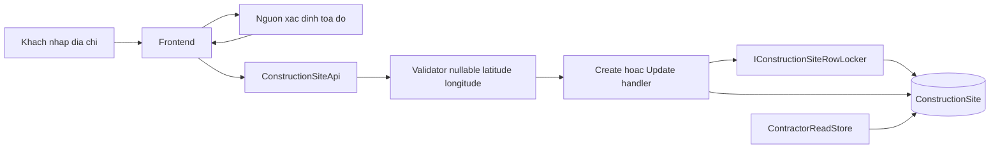
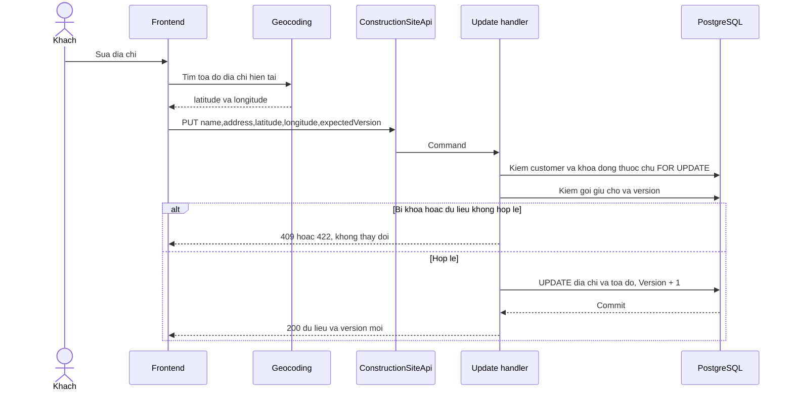
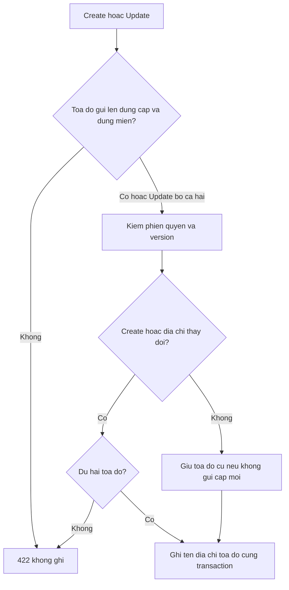
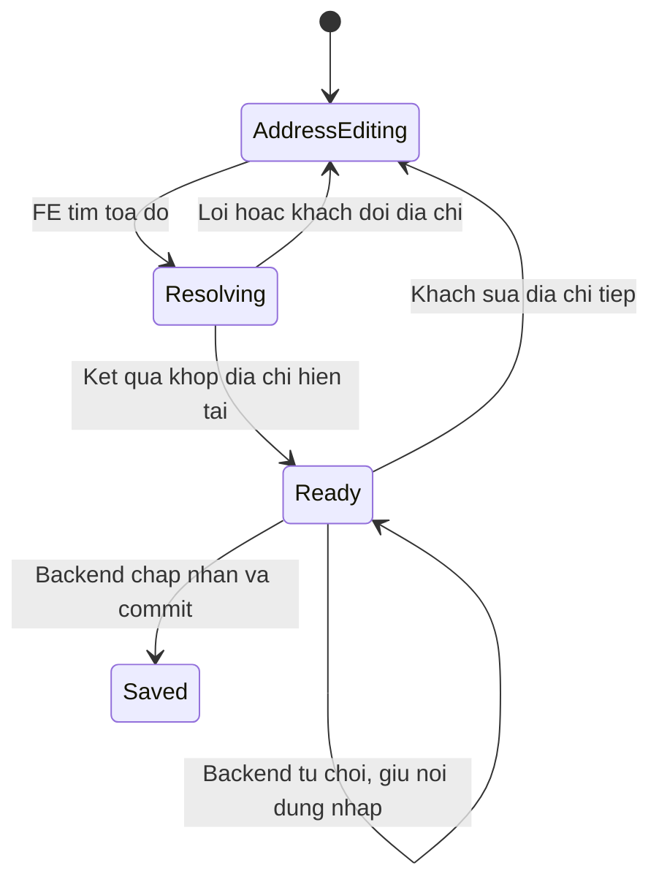
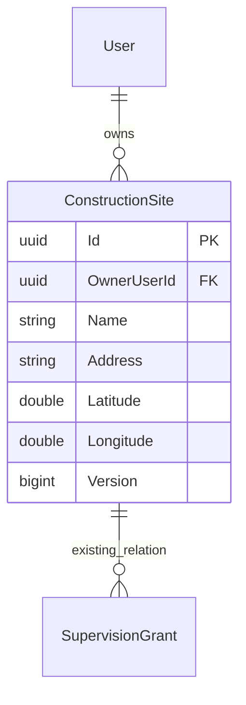

<!-- HƯỚNG DẪN CHO AI KHI ĐIỀN HOẶC CHỈNH SỬA MẪU
- Đọc toàn bộ mẫu, các comment hướng dẫn và tài liệu nguồn được cung cấp trước khi viết. Tuân thủ các quy tắc nghiệp vụ, điều kiện, ngoại lệ và giới hạn đã được xác nhận.
- Không bịa, tự chế hoặc suy đoán thành sự thật: yêu cầu, quy tắc, số liệu, API, schema, mã lỗi, nguồn tham khảo, người phụ trách và kết quả kiểm thử phải có căn cứ. Nội dung ví dụ trong mẫu không phải dữ kiện của dự án.
- Khi thiếu thông tin hoặc các nguồn mâu thuẫn, hỏi người dùng để làm rõ; giữ nguyên placeholder ở phần chưa xác định. Không tự chọn đáp án, lấp chỗ trống hay tuyên bố tài liệu đã hoàn tất.
- Chỉ thay nội dung cần điền hoặc được yêu cầu sửa. Không tự mở rộng phạm vi, sửa nghĩa quy tắc, bỏ điều kiện/ngoại lệ, xoá hay ghi đè nội dung hợp lệ đã có.
- Giữ nguyên tên, cấp và thứ tự heading, nhãn in đậm, tiền tố bullet, cấu trúc danh sách, tên/thứ tự/số cột bảng và cú pháp code fence. Không dịch, đổi tên, gộp hoặc thêm mục ngoài cấu trúc mẫu.
- Chỉ lặp khối luồng, AC hoặc API theo đúng khuôn khi có căn cứ; chỉ bỏ phần tuỳ chọn khi hướng dẫn riêng của mẫu cho phép và đã xác định không áp dụng.
- Mã tham chiếu và section phải trỏ tới tài liệu có thật đã được cung cấp hoặc kiểm chứng. Không giữ mã ví dụ như tham chiếu thật và không tự tạo tài liệu liên quan để hợp thức hoá liên kết.
- Giữ các comment hướng dẫn trong file. Xuất Markdown UTF-8, mỗi file một tài liệu; không bọc toàn bộ file trong code fence, không chèn lời dẫn hay giải thích ngoài mẫu.
- Trước khi bàn giao, đối chiếu nội dung với nguồn, kiểm tra cấu trúc, giá trị cho phép, giới hạn độ dài và tính nhất quán của mã/tham chiếu. Báo rõ phần chưa đủ thông tin; không tuyên bố đã chạy test hoặc import khi chưa thực hiện.
-->

<!-- Thay mã TDD-001 và nội dung ví dụ; giữ nguyên heading và nhãn in đậm.
Sơ đồ dùng mermaid, plantuml hoặc URL. Giữ heading Architecture, Sequence Diagram, Activity Diagram, State Diagram, Data Model.
Ví dụ API phải có heading trùng METHOD /path trong Endpoints. Xoá phần API/sơ đồ không dùng.
Version, Updated At và Change Log do lịch sử phiên bản quản lý, để trống khi nhập mới.
Author/Reviewer là tên hiển thị; gán tài khoản, phê duyệt, giả định và câu hỏi mở trên giao diện sau import.
Thiết kế phải truy vết về Story và Business Rule được cung cấp. Phân biệt thiết kế đề xuất với implementation đã kiểm chứng; không mô tả API/schema/sơ đồ ví dụ như hệ thống thật hoặc tự quyết định nghiệp vụ còn thiếu.
BẮT BUỘC KHI HOÀN THIỆN MẪU: phải có cả Reviewer và Approver, mỗi tên 1–200 ký tự sau khi bỏ khoảng trắng đầu/cuối. Không xoá hai dòng metadata, để trống, dùng tên bịa hoặc giữ placeholder rồi coi là hoàn tất.
Nếu chưa biết người review hoặc người phê duyệt, phải hỏi người dùng và báo tài liệu chưa đủ thông tin; không tự lấy Author/Owner làm người thay thế. Tên trong file không tự gán tài khoản hoặc xác nhận đã duyệt; gán thành viên trên giao diện sau import.
Đây là yêu cầu hoàn thiện mẫu; backend hiện vẫn nhận file cũ thiếu hai trường để tương thích.

VALIDATION CHO FILE NHẬP (đối chiếu ImportSnapshotValidator, MarkdownParser và ImportService):
- Mỗi file .md UTF-8 không rỗng chỉ có một heading cấp 1 chứa mã tài liệu dài 1–100 ký tự. Mã không được trùng trong cùng lần nhập hoặc thuộc loại tài liệu khác đã tồn tại.
- Không dùng tên README.md hoặc sitemap.md vì importer bỏ qua. Giao diện nhận .md/.zip, tối đa 2.000 file, tổng file tải lên 31 MiB; API giới hạn request 32 MiB và tổng nội dung đọc/giải nén 64 MiB.
- Chỉ nhập đè tài liệu cùng loại đang Draft, chưa có phiên bản và chưa lưu trữ. Import thay toàn bộ nội dung bản nháp, vì vậy phải giữ lại nội dung hợp lệ ngoài phần được yêu cầu sửa.
- Không dùng Status trong Markdown hoặc tên Approver để tự xác nhận phê duyệt; import không cấp quyền hay gán tài khoản từ tên. Chạy Kiểm tra file và xử lý lỗi/cảnh báo trước khi nhập.
- Giới hạn độ dài bên dưới tính theo string.Length của .NET (đơn vị UTF-16); không tự cắt ngắn dữ kiện quan trọng để vượt validation, hãy viết lại có căn cứ hoặc hỏi người dùng.
- Feature tối đa 300 ký tự và được dùng làm tiêu đề tài liệu. Status được parser nhận: Draft / In Review / Approved / Deprecated; tài liệu nhập mới vẫn có trạng thái phê duyệt Draft.
- Endpoint: đường dẫn tối đa 500 ký tự; tên/mô tả endpoint được lưu trong Name tối đa 300. HTTP method: GET / POST / PUT / PATCH / DELETE / HEAD / OPTIONS.
- Error Codes: mã tối đa 100 ký tự, không trùng trong tài liệu; giữ dạng - **CODE** (400): mô tả. HTTP status trong Error Codes và Response phải là số nguyên đọc được bằng Int32; không tự đặt status khác hợp đồng API.
- URL sơ đồ tối đa 1.000 ký tự. Mục sơ đồ được sử dụng phải có khối mermaid/plantuml hoặc URL theo mẫu; không để một mục sơ đồ rỗng. Nhãn mục được tách từ bullet như tên External API Fields tối đa 300 ký tự.
- Heading Examples phải khớp METHOD /path ở Endpoints. Giữ các nhãn Request:, Response 200: (thay mã theo contract) và Error Response: để parser tách đúng dữ liệu.
- Tham chiếu dạng DOC-KEY/section: ghi chú: mã đích tối đa 100 ký tự, section tối đa 100, ghi chú tối đa 1.000. Không trùng bộ mã đích + section + loại liên kết trong cùng tài liệu.
ĐỐI CHIẾU FORM TDD (src/features/tdds/validations.ts; form có thể chặt hơn import):
- Điền Feature, Author, Reviewer, Problem và ít nhất một Goal; các Goal/Non-goal/Notes đã thêm không được rỗng. API đã khai báo phải có endpoint và mô tả/mục đích; Fields phải có tên và ý nghĩa; Error Codes phải có mã, HTTP status và điều kiện.
- Form còn kiểm tra Version, Updated At và nội dung Change Log khi khai báo; với file nhập mới, giữ các trường lịch sử này trống theo hợp đồng import, không tự tạo dữ liệu lịch sử.
-->

# TDD-SITE-002

## Document Info

- **Feature**: Bổ sung tọa độ khi tạo công trình và đồng bộ tọa độ khi đổi địa chỉ
- **Author**: Codex
- **Reviewer**: Tân Trần
- **Approver**: Tân Trần
- **Status**: Draft
- **Version**:
- **Updated At**:

## Context & Goals

### Problem

Người dùng đã chốt bản TDD sau lượt rà soát bằng phản hồi “Ok chốt”. Đây là xác nhận thiết kế trong hội thoại; Status vẫn Draft vì chưa phê duyệt trên hệ thống quản lý tài liệu. Hợp đồng cụ thể với kho tệp và kiểm chứng trên môi trường thật vẫn là việc cần làm khi tích hợp.

BR-SITE-001 khoản 7–8 và BR-CTR-006 đã chốt: frontend xác định tọa độ từ địa chỉ, gửi kinh độ/vĩ độ khi tạo và khi đổi địa chỉ. Backend thiếu một trong hai thì không tạo hoặc không lưu lần sửa. Tìm nhà thầu gần lấy tọa độ công trình khách sở hữu.

Thiết kế này bổ sung và thay phần contract tên/địa chỉ tại TDD-SITE-001; không thay quyền sở hữu, khóa gói giữ chỗ hay gỡ/xóa gói. Code đang đọc trong workspace đã có IConstructionSiteRowLocker, kiểm Assigned/Completed và ExpectedVersion trong UpdateConstructionSiteCommandHandler. Một số mô tả lịch sử trong TDD-SITE-001 và OpenAPI comment còn nói sửa bất cứ lúc nào; đó không phải hành vi của handler hiện tại.

Người dùng xác nhận chưa có công trình thật cần giữ, hoặc chỉ có dữ liệu thử. Chưa truy cập database môi trường chung; khi triển khai vẫn phải kiểm preflight để không áp dụng kế hoạch dữ liệu thử lên một database có dữ liệu thật.

### Goals

- Create bắt buộc latitude và longitude; thiếu một trường không bị binder đổi thành 0.
- Update địa chỉ lưu nguyên tử cùng tọa độ, dưới khóa/version/quyền sẵn có.
- Read DTO cung cấp tọa độ cho frontend và query bán kính; không mở quyền đọc công trình người khác.
- Có kế hoạch thêm cột an toàn, không tự gán tọa độ giả cho dữ liệu cũ.

### Non-goals

- Backend gọi geocoding để sửa ngầm tọa độ hoặc tự đổi quyền sửa khi công trình có gói giữ chỗ.
- Thay đổi luồng gán/hủy/gỡ gói, trạng thái công trình, quyền nhân viên hoặc tên chuẩn hóa.
- Chạy migration hoặc xóa dữ liệu thật.

## Architecture

**Mở rộng địa chỉ ngày 01/10/2026 — thiết kế chưa triển khai:** contract hồ sơ đầy đủ nằm ở [TDD-SITE-003](TDD-SITE-003.md). Tỉnh/thành phố, phường/xã và số nhà–đường là đầu vào; Address do server ghép. Khi tạo phải có tọa độ, khi địa chỉ độc lập đổi phải xác định lại cặp tọa độ. Frontend gắn mỗi lần geocoding với phiên bản ba phần địa chỉ: hủy/bỏ phản hồi của địa chỉ cũ, khóa lưu khi đang chờ hoặc lỗi. Với hồ sơ có nguồn, lấy địa chỉ từ snapshot hoàn tất và khóa địa chỉ/tọa độ sau tạo. Các ví dụ body name/address bên dưới là contract cũ, được thay bằng TDD-SITE-003; thuật toán tọa độ và chức năng bán kính hiện có vẫn giữ. Không thêm chức năng tìm kiếm liên quan mới trong đợt này.



**Notes**:

- Giữ feature folder `constructionSite` ở contract/application/presentation/test. Sửa Command.cs, Response.cs, validators/ConstructionSiteValidators.cs, ConstructionSiteMapping, ConstructionSiteReadModel và query projections. Entity/configuration thêm hai cột; không tạo bảng Location mới chỉ cho một cặp số.
- DTO dùng `double? Latitude, double? Longitude`; nullable để phân biệt thiếu trường và giá trị 0. Validator create đòi cả hai, finite, Latitude trong [-90,90], Longitude trong [-180,180]. Không dùng NotEmpty trên số vì 0 là tọa độ hợp lệ. Không silently round, clamp hay geocode thay client.
- Update giữ Name, Address, ExpectedVersion như cũ. Khi Address đã chuẩn NFC/trim khác bản đang lưu, yêu cầu cả hai tọa độ mới. Nếu địa chỉ không đổi, đề xuất cho phép bỏ cả hai để giữ nguyên; nếu gửi tọa độ thì phải đủ cặp, hợp lệ và vẫn qua cùng quyền/khóa/version. Client thông thường gửi đầy đủ cặp đang có. Tọa độ mới không thể được chứng minh khớp địa chỉ chỉ bằng kiểm miền số; frontend chịu trách nhiệm chọn đúng kết quả geocoding.
- Frontend khi người dùng sửa chữ địa chỉ phải đánh dấu kết quả tọa độ cũ không còn áp dụng; hủy request geocode cũ hoặc dùng sequence để bỏ phản hồi đến muộn. Chỉ cho submit khi kết quả thuộc đúng địa chỉ hiện tại. Nếu không xác định được tọa độ, giữ nội dung khách đã nhập và cho thử lại; không dùng tọa độ cũ cho địa chỉ mới. Không gọi backend tạo trước rồi PATCH tọa độ sau.
- Update bắt đầu bằng RequireCustomerAsync, LockOwnedForUpdateAsync rồi kiểm gói giữ chỗ, ExpectedVersion. Chỉ sau các kiểm đó mới gán Name,NormalizedName,Address,Latitude,Longitude,UpdatedAtUtc và tăng Version một lần. Cả bộ commit cùng nhau. Nếu bị từ chối, tất cả trường giữ nguyên, kể cả khi body đồng thời đổi tên.
- Khóa FOR UPDATE trước khi kiểm gói đã có trong code, giữ nguyên để không sửa địa chỉ/tọa độ sau khi luồng gán gói đã lấy quyền giữ chỗ. Không thêm khóa bên ngoài AccountCommerceState hoặc sửa thứ tự khóa của module gói.
- Query bán kính chỉ đọc cặp tọa độ của công trình OwnerUserId hiện tại, lấy snapshot tại thời điểm request. Tọa độ trong response không biến công trình thành tài nguyên công khai.

## Sequence Diagram



## Activity Diagram



## State Diagram



Các trạng thái này chỉ thuộc form frontend, không thêm Status vào ConstructionSite. Quyền được sửa khi có/không gói giữ chỗ vẫn theo TDD-SITE-001 và BR-SITE-002.

## Data Model

Một dòng ConstructionSite vẫn là một công trình thuộc một khách. Thêm đúng hai cột lưu vị trí, do khách cung cấp qua frontend lúc tạo/sửa. OwnerUserId và khóa ngoại gói không đổi.

| Cột thay đổi | Kiểu | Ràng buộc đích |
|---|---|---|
| Latitude | double precision | NOT NULL ở schema đích; CHECK -90..90 và hữu hạn |
| Longitude | double precision | NOT NULL ở schema đích; CHECK -180..180 và hữu hạn |

Các cột giữ nguyên: Id,OwnerUserId,Name,NormalizedName,Address,CreatedAtUtc,UpdatedAtUtc,Version theo [TDD-SITE-001/Data Model](TDD-SITE-001.md#data-model). Không lưu một cột Position khác lặp lại cặp số; không cần spatial index trên công trình vì query theo Id và OwnerUserId trước khi tính khoảng cách công ty.



Mẫu giả định, U/C là bí danh UUID; thời điểm UTC, lược CreatedAtUtc/UpdatedAtUtc:

| Thời điểm | Dòng ConstructionSite |
|---|---|
| Tạo hợp lệ | (C,U,Name=Nhà thử,Address=Địa chỉ A,Latitude=10,Longitude=106,Version=1) |
| Sửa hợp lệ | (C,U,Name=Nhà thử,Address=Địa chỉ B,Latitude=11,Longitude=106,Version=2) |
| Sửa tiếp nhưng thiếu Longitude | Giữ nguyên dòng Version=2; không lưu Address mới và không tăng Version |
| Fixture thử trước khi bổ sung tọa độ | (C0,U,Address=Địa chỉ cũ,Latitude=NULL,Longitude=NULL); chưa dùng làm tâm tìm kiếm |

**Notes**:

Kế hoạch migration chưa chạy, được đơn giản hóa theo xác nhận chưa có dữ liệu thật cần giữ:

1. **Preflight chỉ đọc:** kiểm database đích, số dòng ConstructionSite và các gói đang tham chiếu. Nếu phát hiện dữ liệu thật trái giả định đã chốt, dừng để chọn phương án bảo toàn; không tự xóa hoặc geocode hàng loạt.
2. **Chuẩn bị fixture:** nếu còn công trình thử, bổ sung tọa độ thử rõ ràng theo từng fixture hoặc tạo lại bộ dữ liệu thử bằng quy trình đã được cho phép tại môi trường đó. Xác nhận dữ liệu thử không phải chỉ thị xóa mọi bản ghi hoặc gói đang liên kết. Không dùng (0,0) làm mặc định cho giá trị chưa biết.
3. **Chuẩn bị chuyển phiên bản:** chuẩn bị FE gửi đủ tọa độ và BE mới kiểm bắt buộc; dừng nhận request ghi công trình, chờ writer cũ hoàn tất rồi mới chạy bước 4. Giữ cửa sổ dừng ghi đến khi schema, backend mới và frontend tương thích đã sẵn sàng. Không để backend cũ ghi sau lúc cột trở thành bắt buộc hoặc để backend mới đọc cột chưa tồn tại.
4. **Thay schema và phát hành:** nếu bảng rỗng, thêm ngay Latitude và Longitude NOT NULL cùng CHECK miền. Nếu cần giữ fixture thử, thêm nullable trước, nạp tọa độ của fixture, kiểm đủ cặp rồi SET NOT NULL trong cùng đợt triển khai. Sau đó khởi động BE mới và phát hành FE tương thích trước khi mở ghi. Trạng thái nullable chỉ là bước migration, không phải schema đích; client cũ thiếu tọa độ nhận lỗi validation rõ ràng và cần tải lại phiên bản FE.
5. **Verify:** không còn NULL, không thiếu một nửa cặp, không ngoài miền; không đổi OwnerUserId, tên hoặc liên kết gói. Thử create thiếu tọa độ, update đổi địa chỉ thiếu tọa độ, xung đột Version và khóa gói trên PostgreSQL thật. Chỉ bật radius sau khi kiểm đủ dữ liệu và contract.
6. **Phục hồi:** trước triển khai lưu schema và fixture cần giữ. Nếu quay lại backend cũ, giữ hai cột và dữ liệu, có thể bỏ NOT NULL tạm theo kế hoạch rollback; tắt radius và dừng phát hành FE mới. Backend cũ có thể đổi địa chỉ mà không đổi tọa độ, nên không được bật lại radius chỉ dựa vào kiểm NOT NULL: phải đối chiếu các công trình bị ghi trong thời gian rollback và cập nhật đúng cặp địa chỉ–tọa độ trước. Không drop cột hoặc reset gói để khắc phục lỗi ứng dụng. Chưa chạy migration hay rollback trên môi trường chung; đã kiểm Up/Down trong database test riêng. Không dùng Down xóa cột để rollback ứng dụng đang có dữ liệu cần giữ.

DDL dưới đây minh họa nhánh giữ fixture thử. Migration thực tế là `20260930093638_AddContractorProfilesAndSiteCoordinates`: thêm cột nullable nếu chưa có, rồi SET NOT NULL; nếu còn dòng thiếu tọa độ thì dừng và rollback transaction, không gán mặc định. Sau khi fixture đủ tọa độ, thêm NOT NULL như bên dưới. Bảng rỗng có thể thêm hai cột NOT NULL ngay từ đầu:

```sql
ALTER TABLE "ConstructionSite"
  ADD COLUMN "Latitude" double precision NULL,
  ADD COLUMN "Longitude" double precision NULL;
ALTER TABLE "ConstructionSite"
  ADD CONSTRAINT "CK_ConstructionSite_CoordinatePair"
  CHECK (("Latitude" IS NULL AND "Longitude" IS NULL)
      OR ("Latitude" IS NOT NULL AND "Longitude" IS NOT NULL));
ALTER TABLE "ConstructionSite"
  ADD CONSTRAINT "CK_ConstructionSite_Latitude" CHECK ("Latitude" BETWEEN -90 AND 90),
  ADD CONSTRAINT "CK_ConstructionSite_Longitude" CHECK ("Longitude" BETWEEN -180 AND 180);
-- Sau khi bo sung toa do fixture va kiem tra khong con NULL:
ALTER TABLE "ConstructionSite"
  ALTER COLUMN "Latitude" SET NOT NULL,
  ALTER COLUMN "Longitude" SET NOT NULL;
```

Không có giá trị tọa độ mặc định. DB NULL chỉ tồn tại ở bước migration có fixture thử; contract create mới vẫn bắt buộc. Cần integration test PostgreSQL cho NaN/Infinity, NULL một phía và giữ nguyên toàn bộ bản ghi khi update bị từ chối; không dùng EF InMemory để kết luận CHECK hoặc lock đã đúng.

## Internal API

### Endpoints

- **POST** `/api/v1/me/construction-sites` — Body `{name,address,latitude,longitude}`; tọa độ bắt buộc, numeric finite. Trả 201 Result<ConstructionSiteSaved>, bổ sung latitude/longitude.
- **PUT** `/api/v1/me/construction-sites/{siteId}` — `{name,address,latitude?,longitude?,expectedVersion}`; đổi địa chỉ thì bắt buộc cặp mới. Quyền/gói/version/trùng tên giữ nguyên; trả 200 cùng tọa độ và version mới.
- **GET** `/api/v1/me/construction-sites` — Giữ pagination hiện tại, bổ sung latitude/longitude vào từng ConstructionSiteItem; ở schema đích luôn có đủ cặp; chỉ giai đoạn chuyển fixture có thể NULL.
- **GET** `/api/v1/me/construction-sites/{siteId}` — Bổ sung cặp tọa độ, ownership giữ nguyên.
- **GET** `/api/v1/admin/construction-sites` — Projection nhân viên bổ sung cùng cặp tọa độ; phạm vi quyền hiện tại không đổi.
- **GET** `/api/v1/admin/construction-sites/{siteId}` — Như trên cho detail.

Không thêm route sửa tọa độ bỏ qua quyền sửa công trình. DELETE và quyền gán/gỡ gói không thay contract. API version 1 hiện tại thay đổi requirement create; cần phát hành FE/BE phối hợp, cập nhật OpenAPI và clients. Không âm thầm nhận body cũ rồi tạo công trình thiếu tọa độ.

Giữ chống CSRF và default authorization policy trên các route hiện có. Validation đầu vào qua FluentValidation trả ProblemDetails, mã mới đặt bằng WithErrorCode ở errors[].messageCode. Kiểm địa chỉ đã đổi sau khi khóa bản ghi thì dùng application ValidationException, có messageCode cấp ngoài. Hai định dạng hiện có được giải thích tại [TDD-CTR-001/Internal API](TDD-CTR-001.md#internal-api); không yêu cầu frontend đọc mọi lỗi tại cùng một vị trí.

### Examples

#### POST /api/v1/me/construction-sites

```
Request:
{"name":"Nhà thử","address":"Địa chỉ A","latitude":10,"longitude":106}

Response 201:
{"value":{"constructionSiteId":"55555555-5555-4555-8555-555555555555","name":"Nhà thử","address":"Địa chỉ A","latitude":10,"longitude":106,"version":1,"createdAtUtc":"2026-09-30T03:00:00Z","updatedAtUtc":"2026-09-30T03:00:00Z"},"isSuccess":true,"isFailure":false,"error":{"code":"","message":"","messageCode":""}}

Error Response:
{"type":"Validation Error","title":"Validation Error","status":422,"detail":"A validation error occured","errors":[{"code":"Longitude","message":"Cần gửi kinh độ.","messageCode":"ConstructionSiteCoordinatesRequired"}]}
```

#### PUT /api/v1/me/construction-sites/{siteId}

```
Request:
{"name":"Nhà thử","address":"Địa chỉ B","latitude":11,"longitude":106,"expectedVersion":1}

Response 200:
{"value":{"constructionSiteId":"55555555-5555-4555-8555-555555555555","name":"Nhà thử","address":"Địa chỉ B","latitude":11,"longitude":106,"version":2,"createdAtUtc":"2026-09-30T03:00:00Z","updatedAtUtc":"2026-09-30T04:00:00Z"},"isSuccess":true,"isFailure":false,"error":{"code":"","message":"","messageCode":""}}

Error Response:
{"title":"Conflict","code":"Conflict","status":409,"detail":"Công trình đang có gói giám sát nên không sửa được.","messageCode":"ConstructionSiteHasSupervision","errors":null}
```

### Error Codes

- **Unauthorized** (401): Phiên không hợp lệ.
- **AccessForbidden** (403): Tài khoản không phải khách dùng thao tác dành cho khách hoặc không thỏa điều kiện phiên đã xác thực.
- **MustChangePassword** (403): Phiên đang bị yêu cầu đổi mật khẩu; giữ mã hiện có.
- **CsrfInvalid** (403): Request ghi dùng cookie không đến từ origin được phép.
- **ConstructionSiteNotFound** (404): Không có công trình thuộc người gọi.
- **ConstructionSiteHasSupervision** (409): Sửa công trình có gói giữ chỗ; mã đã có.
- **ConstructionSiteVersionConflict** (409): Version đã cũ; mã đã có.
- **ConstructionSiteNameTaken** (409): Tên trùng công trình khác của cùng khách; mã đã có.
- **ConstructionSiteCoordinatesRequired** (422): Thiếu một hoặc cả hai tọa độ lúc tạo/đổi địa chỉ.
- **ConstructionSiteCoordinatesInvalid** (422): Sai miền, NaN/Infinity hoặc cặp không hợp lệ.

Mã lỗi tên/địa chỉ/version input hiện có theo TDD-SITE-001 giữ nguyên. Query bán kính dùng mã riêng ConstructionSiteCoordinatesUnavailable (409) khi dữ liệu đã lưu chưa sẵn sàng; mutation dùng ConstructionSiteCoordinatesRequired (422) khi input thiếu.

## External API

### Endpoints

- **Dịch vụ xác định tọa độ của frontend** — chưa chọn provider trong phạm vi backend. Contract tối thiểu: nhận địa chỉ đang nhập và trả WGS84 latitude/longitude; FE không gửi credential của dịch vụ xuống backend BMT.

### Fields

- **address** — Địa chỉ người dùng hiện đang sửa; response phải được đối chiếu đúng lần nhập.
- **latitude,longitude** — Số hữu hạn theo độ, không array có thứ tự mơ hồ.

### Error Handling

Khi FE chưa lấy được đủ tọa độ, không cho tạo/lưu địa chỉ mới. Cho khách sửa địa chỉ và thử lại; BE vẫn chặn request trực tiếp thiếu trường. Không hạ yêu cầu bắt buộc khi provider lỗi, không tự dùng vị trí thiết bị thay địa chỉ.

### Quirks

- Chưa biết provider hoặc frontend đang dùng thư viện nào; không gán nhà cung cấp hay chi phí mới vào TDD.
- Tọa độ chỉ được kiểm đúng dạng/miền tại backend. Sai vị trí do chọn nhầm kết quả cần sửa qua luồng địa chỉ được phép, không có quy trình xác minh vị trí mới.

## References

### User Stories

- STORY-SITE-001/AC-018
- STORY-SITE-001/AC-019
- STORY-SITE-001/AC-020
- STORY-SITE-001/AC-021
- STORY-CTR-004/AC-006

### Business Rules

- BR-SITE-001/Then
- BR-SITE-002/Then
- BR-CTR-006/Then

### Use Cases

- STORY-SITE-001/Main Flow
- STORY-SITE-001/ALT-02
- STORY-SITE-001/EXC-05

### Others

- Mã đã bổ sung tọa độ ở entity/configuration, command, FluentValidation, handler tạo/sửa, DTO và projection cho khách/nhân viên. Test `ConstructionSiteCommandHandlerTests` kiểm địa chỉ không đổi, đổi địa chỉ thiếu/đủ tọa độ, cập nhật riêng cặp tọa độ và version cũ. `ContractorMigrationTests` kiểm giữ dữ liệu cũ, từ chối migration thiếu tọa độ và tiếp tục sau backfill fixture có tọa độ xác định.
- Trước phát hành: dừng writer cũ, kiểm dữ liệu `ConstructionSite`; nếu bảng có dòng, thêm hai cột nullable và nhập cặp tọa độ đã xác định cho từng dòng trước khi chạy migration. Không dùng một cặp cố định cho toàn bộ dữ liệu thật. Chỉ mở lại ghi sau khi FE gửi đủ hai trường và BE mới đã sẵn sàng. FE geocoding nằm ngoài mã backend của đợt này.

- Đặc tả Unit Test sau khi chốt TDD: [UT-SITE-035](../unittest/UT-SITE-035.md), [UT-SITE-036](../unittest/UT-SITE-036.md), [UT-SITE-037](../unittest/UT-SITE-037.md), [UT-SITE-038](../unittest/UT-SITE-038.md), [UT-SITE-039](../unittest/UT-SITE-039.md), [UT-SITE-040](../unittest/UT-SITE-040.md), [UT-SITE-041](../unittest/UT-SITE-041.md), [UT-SITE-042](../unittest/UT-SITE-042.md), [UT-SITE-043](../unittest/UT-SITE-043.md), [UT-SITE-044](../unittest/UT-SITE-044.md). Các ca vẫn là đặc tả Draft; code test và phạm vi đã kiểm chứng được nêu tại Others. Các ST thao tác giao diện chưa được chạy.
- [TDD-SITE-001](TDD-SITE-001.md): giữ quy tắc quyền, version, trùng tên, khóa gói và toàn bộ phần ngoài tọa độ.
- [TDD-CTR-002](TDD-CTR-002.md): đọc tọa độ làm tâm tìm kiếm.
- [ST-SITE-033](../systemtest/ST-SITE-033.md), [ST-SITE-034](../systemtest/ST-SITE-034.md), [ST-SITE-035](../systemtest/ST-SITE-035.md), [ST-SITE-036](../systemtest/ST-SITE-036.md), [ST-SITE-037](../systemtest/ST-SITE-037.md): đặc tả đã có, chưa chạy.
- Mã đã đọc: `bmt-be/src/bmt-be.domain/entities/ConstructionSite.cs`, `persistence/configurations/ConstructionSiteConfiguration.cs`, `contract/services/constructionSite/Command.cs`, `Response.cs`, `presentation/apis/constructionSite/ConstructionSiteApi.cs`, `application/usecases/commands/constructionSite/UpdateConstructionSiteCommandHandler.cs`.
- Các ST-SITE/UT-SITE cũ và test code tạo công trình cần bổ sung tọa độ vào fixture để tiếp tục kiểm đúng mục tiêu gốc. Sau khi người dùng chốt TDD, đã bổ sung tọa độ vào đặc tả UT tạo/sửa liên quan và thêm UT-SITE-035 đến UT-SITE-044; fixture mã test đã bổ sung tọa độ. Unit test và kiểm thử PostgreSQL đã chạy; các ST thao tác giao diện chưa chạy. Chưa áp migration môi trường chung.
- Thứ tự triển khai đề xuất: kiểm preflight và chuẩn bị fixture thử → contract/validator/projection SITE cùng frontend tọa độ → phối hợp schema NOT NULL và rollout writer mới → kiểm hồi quy → bật query radius CTR. Kiểm hồi quy khóa sửa/gán gói và expectedVersion trên PostgreSQL thật.

## Change Log
