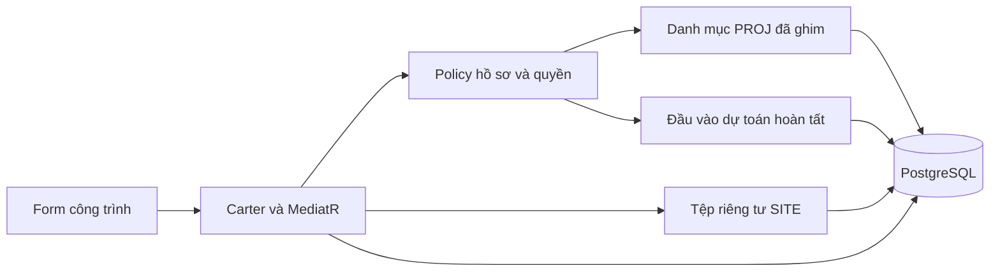
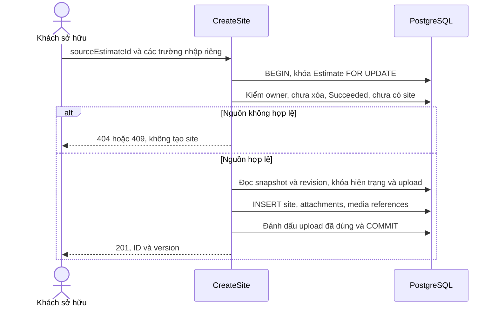
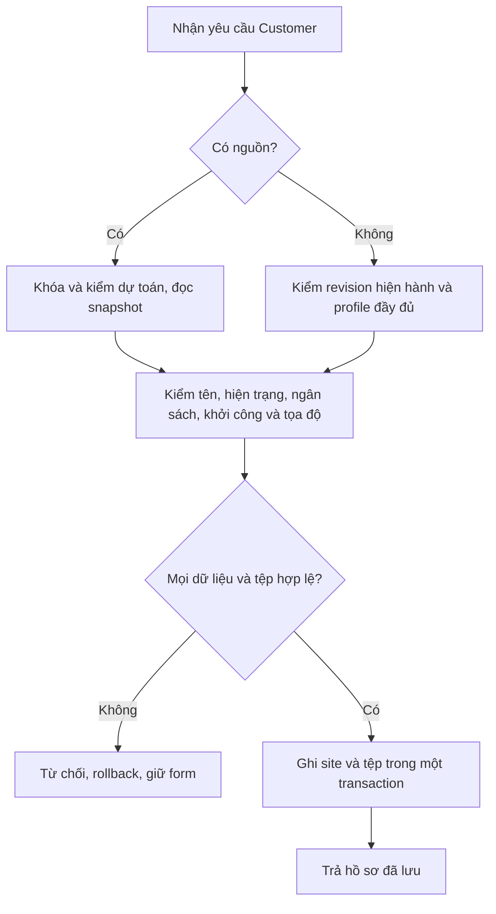
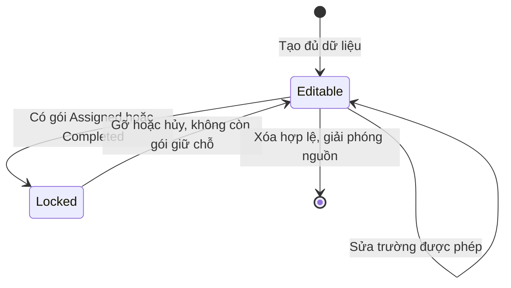
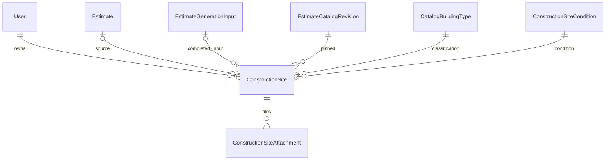

<!-- HƯỚNG DẪN CHO AI KHI ĐIỀN HOẶC CHỈNH SỬA MẪU
- Đọc toàn bộ mẫu, các comment hướng dẫn và tài liệu nguồn được cung cấp trước khi viết. Tuân thủ các quy tắc nghiệp vụ, điều kiện, ngoại lệ và giới hạn đã được xác nhận.
- Không bịa, tự chế hoặc suy đoán thành sự thật: yêu cầu, quy tắc, số liệu, API, schema, mã lỗi, nguồn tham khảo, người phụ trách và kết quả kiểm thử phải có căn cứ. Nội dung ví dụ trong mẫu không phải dữ kiện của dự án.
- Khi thiếu thông tin hoặc các nguồn mâu thuẫn, hỏi người dùng để làm rõ; giữ nguyên placeholder ở phần chưa xác định. Không tự chọn đáp án, lấp chỗ trống hay tuyên bố tài liệu đã hoàn tất.
- Chỉ thay nội dung cần điền hoặc được yêu cầu sửa. Không tự mở rộng phạm vi, sửa nghĩa quy tắc, bỏ điều kiện/ngoại lệ, xoá hay ghi đè nội dung hợp lệ đã có.
- Giữ nguyên tên, cấp và thứ tự heading, nhãn in đậm, tiền tố bullet, cấu trúc danh sách, tên/thứ tự/số cột bảng và cú pháp code fence. Không dịch, đổi tên, gộp hoặc thêm mục ngoài cấu trúc mẫu.
- Chỉ lặp khối luồng, AC hoặc API theo đúng khuôn khi có căn cứ; chỉ bỏ phần tuỳ chọn khi hướng dẫn riêng của mẫu cho phép và đã xác định không áp dụng.
- Mã tham chiếu và section phải trỏ tới tài liệu có thật đã được cung cấp hoặc kiểm chứng. Không giữ mã ví dụ như tham chiếu thật và không tự tạo tài liệu liên quan để hợp thức hoá liên kết.
- Giữ các comment hướng dẫn trong file. Xuất Markdown UTF-8, mỗi file một tài liệu; không bọc toàn bộ file trong code fence, không chèn lời dẫn hay giải thích ngoài mẫu.
- Trước khi bàn giao, đối chiếu nội dung với nguồn, kiểm tra cấu trúc, giá trị cho phép, giới hạn độ dài và tính nhất quán của mã/tham chiếu. Báo rõ phần chưa đủ thông tin; không tuyên bố đã chạy test hoặc import khi chưa thực hiện.
-->

<!-- Thay mã TDD-001 và nội dung ví dụ; giữ nguyên heading và nhãn in đậm.
Sơ đồ dùng mermaid, plantuml hoặc URL. Giữ heading Architecture, Sequence Diagram, Activity Diagram, State Diagram, Data Model.
Ví dụ API phải có heading trùng METHOD /path trong Endpoints. Xoá phần API/sơ đồ không dùng.
Version, Updated At và Change Log do lịch sử phiên bản quản lý, để trống khi nhập mới.
Author/Reviewer là tên hiển thị; gán tài khoản, phê duyệt, giả định và câu hỏi mở trên giao diện sau import.
Thiết kế phải truy vết về Story và Business Rule được cung cấp. Phân biệt thiết kế đề xuất với implementation đã kiểm chứng; không mô tả API/schema/sơ đồ ví dụ như hệ thống thật hoặc tự quyết định nghiệp vụ còn thiếu.
BẮT BUỘC KHI HOÀN THIỆN MẪU: phải có cả Reviewer và Approver, mỗi tên 1–200 ký tự sau khi bỏ khoảng trắng đầu/cuối. Không xoá hai dòng metadata, để trống, dùng tên bịa hoặc giữ placeholder rồi coi là hoàn tất.
Nếu chưa biết người review hoặc người phê duyệt, phải hỏi người dùng và báo tài liệu chưa đủ thông tin; không tự lấy Author/Owner làm người thay thế. Tên trong file không tự gán tài khoản hoặc xác nhận đã duyệt; gán thành viên trên giao diện sau import.
Đây là yêu cầu hoàn thiện mẫu; backend hiện vẫn nhận file cũ thiếu hai trường để tương thích.

VALIDATION CHO FILE NHẬP (đối chiếu ImportSnapshotValidator, MarkdownParser và ImportService):
- Mỗi file .md UTF-8 không rỗng chỉ có một heading cấp 1 chứa mã tài liệu dài 1–100 ký tự. Mã không được trùng trong cùng lần nhập hoặc thuộc loại tài liệu khác đã tồn tại.
- Không dùng tên README.md hoặc sitemap.md vì importer bỏ qua. Giao diện nhận .md/.zip, tối đa 2.000 file, tổng file tải lên 31 MiB; API giới hạn request 32 MiB và tổng nội dung đọc/giải nén 64 MiB.
- Chỉ nhập đè tài liệu cùng loại đang Draft, chưa có phiên bản và chưa lưu trữ. Import thay toàn bộ nội dung bản nháp, vì vậy phải giữ lại nội dung hợp lệ ngoài phần được yêu cầu sửa.
- Không dùng Status trong Markdown hoặc tên Approver để tự xác nhận phê duyệt; import không cấp quyền hay gán tài khoản từ tên. Chạy Kiểm tra file và xử lý lỗi/cảnh báo trước khi nhập.
- Giới hạn độ dài bên dưới tính theo string.Length của .NET (đơn vị UTF-16); không tự cắt ngắn dữ kiện quan trọng để vượt validation, hãy viết lại có căn cứ hoặc hỏi người dùng.
- Feature tối đa 300 ký tự và được dùng làm tiêu đề tài liệu. Status được parser nhận: Draft / In Review / Approved / Deprecated; tài liệu nhập mới vẫn có trạng thái phê duyệt Draft.
- Endpoint: đường dẫn tối đa 500 ký tự; tên/mô tả endpoint được lưu trong Name tối đa 300. HTTP method: GET / POST / PUT / PATCH / DELETE / HEAD / OPTIONS.
- Error Codes: mã tối đa 100 ký tự, không trùng trong tài liệu; giữ dạng - **CODE** (400): mô tả. HTTP status trong Error Codes và Response phải là số nguyên đọc được bằng Int32; không tự đặt status khác hợp đồng API.
- URL sơ đồ tối đa 1.000 ký tự. Mục sơ đồ được sử dụng phải có khối mermaid/plantuml hoặc URL theo mẫu; không để một mục sơ đồ rỗng. Nhãn mục được tách từ bullet như tên External API Fields tối đa 300 ký tự.
- Heading Examples phải khớp METHOD /path ở Endpoints. Giữ các nhãn Request:, Response 200: (thay mã theo contract) và Error Response: để parser tách đúng dữ liệu.
- Tham chiếu dạng DOC-KEY/section: ghi chú: mã đích tối đa 100 ký tự, section tối đa 100, ghi chú tối đa 1.000. Không trùng bộ mã đích + section + loại liên kết trong cùng tài liệu.
ĐỐI CHIẾU FORM TDD (src/features/tdds/validations.ts; form có thể chặt hơn import):
- Điền Feature, Author, Reviewer, Problem và ít nhất một Goal; các Goal/Non-goal/Notes đã thêm không được rỗng. API đã khai báo phải có endpoint và mô tả/mục đích; Fields phải có tên và ý nghĩa; Error Codes phải có mã, HTTP status và điều kiện.
- Form còn kiểm tra Version, Updated At và nội dung Change Log khi khai báo; với file nhập mới, giữ các trường lịch sử này trống theo hợp đồng import, không tự tạo dữ liệu lịch sử.
-->

# TDD-SITE-003

## Document Info

- **Feature**: Hồ sơ công trình đầy đủ, dùng chung danh mục và giữ nguồn dự toán
- **Author**: Codex
- **Reviewer**: Tân Trần
- **Approver**: Tân Trần
- **Status**: Draft
- **Version**:
- **Updated At**:

## Context & Goals

### Problem

**Chốt trong hội thoại:** người dùng đã xác nhận bản TDD này bằng phản hồi “chốt” sau bàn giao. Dùng thiết kế này làm căn cứ cho [đặc tả Unit Test](../discovery/construction-site-unit-test-coverage.md); Status Draft là trạng thái tài liệu nhập, không phủ nhận xác nhận hội thoại. Phần mở rộng chưa triển khai hoặc chạy test.

Hồ sơ hiện tại chỉ lưu tên, địa chỉ gộp và tọa độ. Nghiệp vụ và System Test đã được người dùng chốt ngày 01/10/2026 yêu cầu lưu thêm diện tích đất, hiện trạng, địa chỉ hành chính, ngân sách, thời điểm khởi công và phân loại theo danh mục PROJ. Khách có thể lấy dữ liệu từ một dự toán đã hoàn tất; việc này phải giữ nguồn, khóa các trường đã lấy và chặn xóa dự toán khi công trình còn tồn tại.

Đây là thiết kế mở rộng chưa triển khai. Tài liệu này thay phần dữ liệu hồ sơ và contract tạo/sửa/đọc tương ứng của TDD-SITE-001/002. Cơ chế tên duy nhất, quyền, gói giữ chỗ, tọa độ và lịch sử gói của hai TDD đó tiếp tục áp dụng. Danh mục hiện trạng và tệp được đặc tả riêng ở TDD-SITE-004/005.

### Goals

- Lưu đủ trường đã chốt, kiểm bắt buộc và Không áp dụng ở backend.
- Dùng khóa ngoại giữ cùng chủ sở hữu, cùng phiên bản danh mục và tối đa một công trình còn tồn tại cho mỗi dự toán nguồn.
- Giữ thông tin cũ khi Admin đổi danh mục; không sao chép một bộ danh mục SITE.
- Lưu công trình và toàn bộ liên kết tệp trong cùng transaction; giải quyết tranh chấp với xóa dự toán và gán gói.

### Non-goals

- Tìm kiếm, gợi ý hoặc truy vấn nội dung liên quan theo phân loại mới; chỉ lưu dữ liệu phục vụ các chức năng sau này.
- Gọi AI, dùng lượt thiết kế, tự lấy ngân sách từ kết quả AI hoặc tự sao tệp nguồn.
- Triển khai code, sinh/chạy migration, viết đặc tả Unit Test hay chạy test trong lần cập nhật tài liệu này.

## Architecture

Dùng Carter → MediatR → policy/store → PostgreSQL trong kiến trúc hiện có. Các tên thành phần mới dưới đây là đề xuất, chưa phải code đã có.

| Thành phần | Trách nhiệm và thay đổi |
|---|---|
| ConstructionSiteApi, contract/services/constructionSite | Thay DTO tạo/sửa; bổ sung danh mục áp dụng và nguồn dự toán đủ điều kiện. DTO riêng, không bind entity. |
| Create/Update/DeleteConstructionSiteCommandHandler | Giữ kiểm Customer, owner và khóa gói; bổ sung policy hồ sơ, lấy snapshot nguồn, gắn tệp cùng transaction. |
| ConstructionSiteProfilePolicy (mới) | Kiểm diện tích/ngân sách/khởi công, tính áp dụng và tính hợp lệ theo revision; không dùng nguyên policy bản nháp Estimate vì SITE không cho thiếu dữ liệu áp dụng. |
| ConstructionSiteEstimateSourceReader (mới) | Đọc Estimate, UsageOperation Succeeded và EstimateGenerationInput; không đọc tổng chi phí AI làm ngân sách. |
| ConstructionSiteReadModel, ConstructionSiteStaffScope | Dùng quyền hiện có; mở rộng projection theo lô, tránh query riêng cho từng dòng. Trả khả năng sửa và lý do khóa, nhưng writer luôn kiểm lại. |
| EstimateCatalogSnapshot, store danh mục và adapter địa chỉ | Dùng lại identity, revision bất biến và dữ liệu tỉnh/xã của PROJ. Không thêm nguồn địa chỉ thứ hai. |
| DeleteMyEstimatesCommandHandler, EstimateStore.MyEstimates | Kiểm liên kết SITE dưới khóa Estimate; kết quả từng phần tử ConstructionSiteInUse theo TDD-PROJ-005. |



**Notes**:

- **Ghim danh mục** nghĩa là lưu CatalogRevisionId và các ID lựa chọn. Khi tạo độc lập, khóa singleton EstimateCatalog FOR SHARE rồi so `expectedCatalogRevisionId` với current. Có thay đổi thì trả 409 để form tải lại, không tự đổi lựa chọn. Công trình lấy nguồn dùng revision của snapshot nguồn; không phụ thuộc cờ cho phép tạo dự toán hoặc gói/lượt AI.
- Khi sửa công trình độc lập, luôn dùng revision đã lưu. Trường tầng/phong cách chỉ áp dụng nếu cờ bật và danh sách có phần tử; tum chỉ theo cờ. Không áp dụng phải NULL; áp dụng phải có đúng một giá trị hợp lệ. `hasTum=false` là Không tum. Không nhận 0 tầng làm Không áp dụng. Admin PROJ vẫn không được lưu nhóm bật nhưng danh sách rỗng theo BR-PROJ-004.
- **Bản chụp nguồn** lấy từ EstimateGenerationInput của operation DesignGeneration Succeeded. Reader phân biệt SchemaVersion=1 hiện có và SchemaVersion=2 đang được thiết kế tại TDD-PROJ-002; cả hai ánh xạ các trường diện tích, địa chỉ, loại, tầng, tum và hai phong cách sang cùng profile SITE. Không deserialize v2 như v1 bằng cách bỏ qua kiểm phiên bản. Phần tọa độ mới của PROJ không tự mở rộng danh sách trường lấy nguồn đã chốt ở BR-SITE-004; SITE vẫn yêu cầu frontend xác định tọa độ theo địa chỉ nguồn khi tạo như contract bên dưới. Nguồn này giữ tên địa chỉ đã xác minh lúc nhận tạo thiết kế, kể cả Estimate còn tên địa chỉ cũ. Thiếu snapshot, schema không hỗ trợ hoặc snapshot mâu thuẫn FK thì báo lỗi dữ liệu nguồn, không vá bằng catalog hiện hành. Không lấy Description, FinishPackage, InputImageUrl hoặc kết quả AI vào trường khác.
- **Khóa nguồn vĩnh viễn trong vòng đời công trình:** DTO tạo có nguồn chỉ nhận sourceEstimateId và các trường nhập riêng, tọa độ, uploadIds. Gửi cả `profile` bị từ chối. DTO sửa không nhận sourceEstimateId ở bất kỳ công trình nào. Công trình có nguồn chỉ cho sửa name, conditionId, budgetVnd, plannedStart; không cho sửa profile hoặc tọa độ. Đây là chặn ở backend, không chỉ disable form.
- **Transaction và thứ tự khóa:** tạo có nguồn khóa hàng Estimate FOR UPDATE, rồi kiểm owner/Succeeded/DeletedAtUtc/liên kết hiện có, đọc snapshot, khóa hiện trạng FOR SHARE, khóa upload/object theo thứ tự UUID, ghi site và tệp. Không lấy khóa AccountCommerceState sau khóa Estimate. Xóa dự toán giữ thứ tự account → Estimate như hiện có; hai luồng gặp nhau tại cùng khóa Estimate, nên không thể vừa xóa nguồn vừa tạo công trình thành công. Tạo độc lập dùng catalog → hiện trạng → upload/object. Không gọi storage, nguồn địa chỉ hoặc dịch vụ mạng khi giữ khóa database.
- Sửa/xóa/tệp của công trình hiện có phải lấy ConstructionSite FOR UPDATE trước kiểm gói. Việc gán gói hiện lấy site FOR KEY SHARE, nên phải dùng FOR UPDATE để hai thao tác chờ nhau; cập nhật Version thông thường không thay thế khóa này. Giữ thứ tự account → site → grant ở luồng gán; writer SITE không lấy account sau site. Khi xóa SITE chỉ gỡ liên kết nguồn qua xóa hàng site, không khóa rồi sửa Estimate.
- Địa chỉ độc lập mới/đổi phải qua adapter PROJ kiểm tỉnh–xã và datasetVersion; tên tỉnh/xã do server lấy. Địa chỉ không đổi giữ bản lưu cũ, không ép chọn lại xã bị gộp. Với nguồn giữ snapshot địa chỉ của dự toán; tọa độ do frontend xác định theo chính địa chỉ này lúc tạo. Backend kiểm hữu hạn và miền tọa độ, không chứng minh vị trí thực tế.
- Sửa hiện trạng chỉ kiểm active khi ID thay đổi; cùng ID giữ nguyên tên snapshot, kể cả đã bị ngừng/đổi tên. Cập nhật hồ sơ thành công tăng Version một lần, CreatedAtUtc giữ nguyên. Lỗi ở bất kỳ bước nào rollback cả hồ sơ và liên kết tệp.
- Tạo SITE hiện không có receipt. Giữ cách này: mất phản hồi thì đọc danh sách/detail trước khi tạo lại; tên duy nhất, nguồn duy nhất và upload đã tiêu thụ ngăn bản sao giống hệt. PUT và mutation tệp dùng expectedVersion; không tự gửi lại bằng version mới khi chưa đọc lại. Không tuyên bố exactly-once cho thao tác tạo độc lập đổi cả tên và không có nguồn/tệp.

## Sequence Diagram



## Activity Diagram



## State Diagram

Không thêm cột trạng thái hồ sơ. Hai trạng thái sau là kết quả đọc từ gói; khóa nguồn là thuộc tính độc lập, không biến mất khi nhả gói.



## Data Model

**ConstructionSite**: một dòng là một công trình đang tồn tại, thuộc duy nhất một Customer. Chủ tạo/sửa, nhân viên chỉ đọc. Tiếp tục xóa cứng theo TDD-SITE-001. Không thêm bảng sao chép catalog. Các tên cột là thiết kế đích; cột không nêu thay đổi giữ schema hiện có.

| Cột | Kiểu, NULL và ý nghĩa |
|---|---|
| Id, OwnerUserId, Name, NormalizedName | Giữ UUID/FK User, tên varchar(200), unique (OwnerUserId,NormalizedName), chuẩn hóa NFC/trim/hoa thường hiện có. |
| Code | varchar(25) NOT NULL, UNIQUE `UX_ConstructionSite_Code`; mã hồ sơ `BUILDX-HS-YYYYMMDD-XXXXXX` cấp lúc tạo, không đổi (bổ sung 07/10/2026, BR-SITE-001 khoản 16). Không phụ thuộc mã của dự toán nguồn. |
| AreaM2 | numeric(28,2) NOT NULL CHECK >0; diện tích đất. Validator từ chối quá 2 chữ số thập phân trước khi DB có thể làm tròn. |
| ProvinceCode, ProvinceName, WardCode, WardName, LocationDatasetVersion | text NOT NULL, không rỗng; snapshot địa chỉ đã xác minh. Không có District. |
| AddressDetail | varchar(500) NOT NULL; số nhà–đường sau trim, không cắt ngắn. |
| Address | Đổi thành text NOT NULL do server ghép `AddressDetail, WardName, ProvinceName`; giữ cột để tương thích query và snapshot lịch sử gói. Không nhận từ client, ghi cùng các phần địa chỉ. |
| Latitude, Longitude | double precision NOT NULL; hữu hạn, lần lượt [-90,90], [-180,180], theo TDD-SITE-002. |
| ConditionId, ConditionName | uuid NOT NULL FK ConstructionSiteCondition RESTRICT; varchar(200) NOT NULL là tên lúc khách chọn. |
| BudgetVnd | numeric(28,0) NOT NULL CHECK >0; một số nguyên VND. Không có khoảng từ–đến hay cột currency tùy chọn. |
| PlannedStart | varchar(32) NOT NULL CHECK IN ('ASAP','Within1To3Months','Within3To6Months','Undecided'); không lưu ngày giả định. |
| CatalogRevisionId, BuildingTypeId | uuid NOT NULL; FK revision và FK ghép (CatalogRevisionId,BuildingTypeId) tới CatalogBuildingType. |
| FloorCount, HasTum | integer NULL / boolean NULL; NULL chỉ khi không áp dụng. FK (CatalogRevisionId,BuildingTypeId,FloorCount) tới CatalogFloor. |
| ArchitectureStyleId, InteriorStyleId | uuid NULL, NULL khi không áp dụng. FK ghép theo revision/type/group/style tới CatalogTypeStyle. |
| ArchitectureGroup, InteriorGroup | varchar(16) NOT NULL DEFAULT/CHECK lần lượt Architecture/Interior; bảo vệ không chọn chéo nhóm bằng FK ghép. |
| SourceEstimateId, SourceGenerationOperationId | uuid NULL đồng thời hoặc có giá trị đồng thời; NULL là tạo độc lập. Bất biến sau tạo. |
| Version, CreatedAtUtc, UpdatedAtUtc | Giữ bigint >0 và timestamptz UTC hiện có; Version bắt đầu 1, dùng chung cho hồ sơ và liên kết tệp. |

Các ràng buộc nguồn:

1. FK `(OwnerUserId,SourceEstimateId)` → Estimate `(OwnerId,Id)` ON DELETE RESTRICT. UNIQUE INDEX `UX_ConstructionSite_SourceEstimate` trên SourceEstimateId WHERE SourceEstimateId IS NOT NULL.
2. Thêm alternate key `(OperationId,EstimateId,AccountId,CatalogRevisionId)` vào **EstimateGenerationInput**, không thêm cột dữ liệu. FK từ `(SourceGenerationOperationId,SourceEstimateId,OwnerUserId,CatalogRevisionId)` tới key này ON DELETE RESTRICT. Một dòng input vẫn là bản chụp bất biến của đúng operation, không trở thành dữ liệu SITE quản lý.
3. CHECK cặp SourceEstimateId/SourceGenerationOperationId cùng NULL hoặc cùng khác NULL. FK không kiểm Succeeded/DeletedAtUtc vì đó là trạng thái bảng khác; handler kiểm dưới khóa Estimate, và writer xóa nguồn cũng khóa hàng này. UNIQUE chống cả hai lần tạo đồng thời.
4. Dùng trigger BEFORE UPDATE trên ConstructionSite để chặn đổi OwnerUserId, CatalogRevisionId và source pair; nếu OLD.SourceEstimateId khác NULL thì chặn đổi toàn bộ trường nguồn, CatalogRevisionId, địa chỉ gộp, latitude/longitude. Trigger không chạy trên DELETE, vì xóa hợp lệ phải giải phóng nguồn. Không viết trigger truy vấn ngược cả cây catalog; tính áp dụng vẫn do policy kiểm.

**PackageLifecycleEvent — thay kiểu một cột:** một dòng vẫn là sự kiện lịch sử gói do SUB ghi khi hủy/gỡ, không phải trạng thái công trình hiện tại. Đổi ConstructionSiteAddress từ varchar(500) sang text NULL để giữ địa chỉ đầy đủ có ba phần; giữ nguyên CHECK/NULL theo loại sự kiện, không sửa các dòng lịch sử đã ghi. Mẫu nối tiếp C1: khi hủy/gỡ grant G1, event E1 lưu ConstructionSiteId=C1, ConstructionSiteName=Nhà A, ConstructionSiteAddress="12 Đường A, Phường Ba Đình, Thành phố Hà Nội" cùng các trường sự kiện theo [TDD-SUB-005/Data Model](TDD-SUB-005.md#data-model) và [TDD-SUB-007/Data Model](TDD-SUB-007.md#data-model). Cột này phải nới trong cùng migration trước khi nhận địa chỉ mới; rà validator/mapping để không cắt 500 ký tự của địa chỉ gộp. Giới hạn 500 vẫn áp riêng AddressDetail.

**Bảng dùng lại:** schema/mẫu catalog và Estimate ở [TDD-PROJ-001/Data Model](TDD-PROJ-001.md#data-model), snapshot và UsageOperation ở [TDD-PROJ-002/Data Model](TDD-PROJ-002.md#data-model); quyền/gói và lịch sử tại [TDD-SITE-001/Data Model](TDD-SITE-001.md#data-model). Condition và tệp lần lượt ở TDD-SITE-004/005. Không thêm FK hành chính tới một bảng địa chỉ nội bộ chưa tồn tại.



**Mẫu lưu trữ giả định:** U1, D1, J1, V1, B1, K1, N1, H1, C1 là bí danh UUID. T=2026-10-01T03:00:00Z; trích cột, không phải SQL seed. V1/B1 có tầng 3, tum bật, Architecture/K1 và Interior/N1. Mã tỉnh/xã trong fixture phải thuộc cùng bộ dữ liệu; ví dụ địa chỉ dưới đây chỉ để minh họa.

| Bảng | Dữ liệu lưu |
|---|---|
| Estimate (dùng lại) | D1; OwnerId=U1; CatalogRevisionId=V1; DeletedAtUtc=NULL. |
| UsageOperation (dùng lại) | J1; AccountId=U1; EstimateId=D1; UsageKind=DesignGeneration; State=Succeeded. |
| EstimateGenerationInput (thêm key, không thêm dữ liệu) | OperationId=J1; EstimateId=D1; AccountId=U1; CatalogRevisionId=V1; SchemaVersion=1; Payload có areaM2="100.25", buildingType.id=B1, floorCount=3, hasTum=false, architectureStyle.id=K1, interiorStyle.id=N1, address={provinceCode:"1",provinceName:"Thành phố Hà Nội",wardCode:"4",wardName:"Phường Ba Đình",detail:"12 Đường A",datasetVersion:"pov2-fixture"}; các trường payload khác theo schema v1, đã lược. |
| ConstructionSiteCondition (dùng lại TDD-SITE-004) | H1; Name=Đất trống; IsSelectable=true; DisplayOrder=1. |
| ConstructionSite có nguồn | C1; OwnerUserId=U1; Code=BUILDX-HS-20261001-T4W8NC (T là 10:00 ngày 01/10/2026 giờ Việt Nam; khác mã dự toán của D1); Name=Nhà A; NormalizedName=NHÀ A; AreaM2=100.25; ConditionId=H1; ConditionName=Đất trống; BudgetVnd=2000000000; PlannedStart=Within1To3Months; CatalogRevisionId=V1; BuildingTypeId=B1; FloorCount=3; HasTum=false; ArchitectureStyleId=K1; InteriorStyleId=N1; SourceEstimateId=D1; SourceGenerationOperationId=J1; địa chỉ lấy đúng snapshot trên; Address="12 Đường A, Phường Ba Đình, Thành phố Hà Nội"; Latitude=21.04; Longitude=105.83; Version=1; CreatedAtUtc=UpdatedAtUtc=T. |
| ConstructionSite độc lập | C2 khác tên, cùng U1; SourceEstimateId=SourceGenerationOperationId=NULL. Dùng revision V2 lúc tạo; nếu V2/B1 tắt nội thất thì InteriorStyleId=NULL. Các trường còn lại đủ như C1, không sao một giá trị phong cách không áp dụng. |

Admin đổi tên H1 thành “Đất chưa xây” thì C1.ConditionName vẫn “Đất trống”. Admin đổi V1 sang V2 không đổi C1. Xóa hợp lệ C1 chỉ xóa dòng site và liên kết tệp; D1/J1/input còn nguyên. Lúc đó D1 có thể được công trình mới dùng hoặc được xóa; không làm sống lại một D1 đã xóa.

**Notes**:

- Chuẩn hóa: loại/phong cách phụ thuộc revision và ID, đọc nhãn từ catalog bất biến. ConditionName và tên địa chỉ là sự kiện lịch sử lúc chọn, khác nghĩa với tên hiện hành. Address là bản ghép phục vụ tương thích, chỉ có một writer cùng transaction; phải kiểm đồng nhất với ba trường nguồn. Không lưu AttachmentCount/IsLocked/CanEdit thành cột vì suy ra được.
- Giữ index owner/name và owner/CreatedAtUtc hiện có. UNIQUE nguồn phục vụ cả truy vấn loại nguồn đã dùng và chặn xóa. FK compound của catalog có index theo quy ước EF; không thêm index phục vụ gợi ý chưa có query. Thêm index FK ConditionId nếu chưa được index khác phủ.
- Người dùng xác nhận chưa có dữ liệu công trình. Kế hoạch migration: kiểm thực tế bảng ConstructionSite rỗng; nếu có dòng thì dừng, không xóa/backfill giả. Tạo condition và seed, thêm key snapshot, thêm cột NOT NULL không default giả, đổi Address sang text, tạo FK/index/trigger rồi thêm bảng tệp; nới PackageLifecycleEvent.ConstructionSiteAddress sang text và CHECK ResponseVersion của receipt xóa PROJ như TDD-PROJ-005. Cập nhật cả FE/BE trong đợt phát hành có dừng writer cũ. Đây là thay đổi contract v1; không nhận body cũ rồi tạo hồ sơ thiếu dữ liệu.
- Sau khi có hồ sơ mới, không dùng Down xóa cột hoặc code cũ để quay lui. Dừng nhận ghi mới và sửa tiến; bản sao lưu phục hồi database không tự phục hồi object storage. Ở giai đoạn soạn TDD chưa sinh hoặc chạy migration. Sau khi người dùng giao triển khai, migration và kết quả kiểm tra được ghi tại [báo cáo triển khai](../discovery/construction-site-implementation.md); chưa áp dụng lên database dùng chung.
- **Mã hồ sơ — bổ sung 07/10/2026:** `CreateConstructionSiteCommandHandler` cấp `Code` trong cùng transaction tạo, cả khi tạo độc lập lẫn tạo từ dự toán. Bộ sinh mã dùng chung `BuildXCodes` (domain) cho mã dự toán, mã hồ sơ công trình và mã chuyển khoản: ngày lấy từ thời điểm tạo do server ghi, đổi sang giờ Việt Nam bằng độ lệch cố định +07:00 (Việt Nam không có giờ mùa hè); 6 ký tự ngẫu nhiên lấy bằng bộ sinh số ngẫu nhiên mật mã từ bảng 31 ký tự `ABCDEFGHJKMNPQRSTUVWXYZ23456789` (bỏ 0, O, 1, I, L). 31^6 ≈ 887 triệu giá trị mỗi ngày nên va chạm rất hiếm; handler vẫn kiểm trùng rồi sinh lại tối đa 5 lần (`BuildXCodeAllocator`), và unique index là lớp chặn cuối khi hai yêu cầu song song cùng nhận một mã. Hết 5 lần vẫn trùng thì trả 503 `DependencyUnavailable`, không tạo công trình. PUT, gắn tệp và gán gói không sửa `Code`. Phần ngày là bản chụp một lần của ngày lập hồ sơ, không phải dữ liệu suy ra cần đồng bộ, vì `CreatedAtUtc` cũng không đổi. Migration thêm cột NULL, cấp mã cho mọi công trình đã có theo `CreatedAtUtc` đổi sang giờ Việt Nam, sinh lại phần ngẫu nhiên khi trùng, rồi đặt NOT NULL và tạo unique index; Down bỏ index và cột. Chưa áp dụng lên database dùng chung.
- **Lọc theo mã:** danh sách của khách và của nhân viên nhận tham số `code` tùy chọn. Chuẩn hóa bằng `BuildXCodes.NormalizeSearch` (bỏ khoảng trắng, dấu gạch ngang, đổi chữ hoa) rồi so một phần với `Code` đã bỏ dấu gạch. Phần thương hiệu `BUILDX` không dùng để so: nếu từ khóa đã chuẩn hóa bắt đầu bằng `BUILDX` thì bỏ phần đó (`BuildXCodes.SearchKey`), còn phía mã lưu chỉ so phần sau thương hiệu đã bỏ dấu gạch, ví dụ `BUILDX-HS-20261005-T4W8NC` so như `HS20261005T4W8NC`. Lý do: mã nào cũng có `BUILDX`, nên một từ ngắn như “i” sẽ khớp mọi bản ghi. Gõ đúng “BUILDX” thì khớp mọi mã; chuỗi vắt qua thương hiệu như “DX2026” không khớp. Điều kiện này cộng thêm vào phạm vi xem hiện có, không thay phạm vi. Từ khóa rỗng sau chuẩn hóa thì bỏ điều kiện. Chưa thêm index tìm kiếm: danh sách của khách lọc theo chủ sở hữu trước; danh sách nhân viên quét theo phạm vi và phân trang hiện có, đo lại khi có số liệu tải.
- Kiểm chứng bằng system/integration PostgreSQL: tranh chấp source-vs-delete, source-vs-source, site-vs-assign, FK cùng owner/revision, trigger khóa nguồn, lỗi giữa tạo site và gắn tệp, đồng thời với đổi/ngừng hiện trạng. Validator/policy có thể kiểm riêng; đặc tả Unit Test chờ chốt TDD. Không dùng mock để kết luận về khóa PostgreSQL.

## Internal API

### Endpoints

Response theo Result<T> hiện có; ví dụ dưới lược các trường envelope rỗng. Route có mutation kiểm Origin theo AUTH khi dùng cookie. Mọi route xác thực, owner lấy từ phiên. Unknown members bị từ chối, không bind owner/name địa chỉ từ client.

- **GET** `/api/v1/me/construction-sites/create-options` — Customer nhận currentCatalogRevisionId, types với cờ/danh sách áp dụng, hiện trạng còn cho chọn và bốn lựa chọn khởi công. Không phụ thuộc gói AI.
- **GET** `/api/v1/me/construction-sites/estimate-sources` — Customer; pageIndex/pageSize theo SITE hiện có. Chỉ own, Succeeded, chưa xóa, chưa có site; sắp ModifiedAtUtc DESC, Id; trả estimateId/code/name/operationId, trong đó `code` là mã dự toán để khách nhận ra nguồn. Không đưa input/result/file URL vào danh sách.
- **GET** `/api/v1/me/construction-sites/estimate-sources/{estimateId}` — Kiểm cùng điều kiện, trả `estimateCode` và profile bất biến từ snapshot và catalog áp dụng để đổ form. Nguồn không thuộc khách hoặc đã xóa trả 404; nguồn own không còn đủ điều kiện trả 409.
- **POST** `/api/v1/me/construction-sites` — name, conditionId, budgetVnd, plannedStart, latitude, longitude bắt buộc; sourceEstimateId nullable và uploadIds tùy chọn 0–9. Không có nguồn: profile bắt buộc gồm areaM2, tỉnh/xã/dataset/addressDetail, buildingTypeId và bốn lựa chọn phụ thuộc; expectedCatalogRevisionId bắt buộc. Có nguồn: cấm profile/expectedCatalogRevisionId, backend tự lấy dữ liệu nguồn. Trả 201 {constructionSiteId,code,version}; `code` là mã hồ sơ vừa cấp.
- **PUT** `/api/v1/me/construction-sites/{siteId}` — expectedVersion và bốn trường nhập riêng bắt buộc. Độc lập: profile đầy đủ theo revision của site; gửi tọa độ mới khi địa chỉ đổi, giữ cặp cũ khi không đổi nếu bỏ cả hai. Có nguồn: cấm profile và tọa độ. Mọi trường hợp cấm sourceEstimateId/uploadIds; dùng route tệp riêng. Trả 200 {constructionSiteId,version}.
- **GET** `/api/v1/me/construction-sites` — Giữ phân trang/gói hiện có; query `code` tùy chọn lọc theo một phần mã hồ sơ (Data Model/Notes), tối đa 32 ký tự sau trim, dài hơn trả 422 `ConstructionSiteCodeFilterInvalid`. Mỗi item có `code`; thêm tóm tắt hồ sơ, condition, budgetVnd, sourceEstimateId, attachmentCount; không tải binary. Không thêm thông tin nhân viên phụ trách vào DTO khách.
- **GET** `/api/v1/me/construction-sites/{siteId}` — Trả `code`, profile và nhãn theo revision, địa chỉ, tọa độ, source, files, version, canEdit/canDelete và lockedFields; source.resultPath chỉ gợi ý mở kết quả cho owner, quyền nguồn vẫn do PROJ kiểm.
- **GET** `/api/v1/me/construction-sites/{siteId}/catalog` — Catalog đã ghim, kể cả revision cũ, cho form sửa độc lập.
- **DELETE** `/api/v1/me/construction-sites/{siteId}` — Giữ quyền/khóa gói; cùng transaction bỏ references/attachments, gỡ FK gói đã hủy như hiện có và xóa site; 204. Không xóa Estimate hoặc object vật lý đồng bộ.
- **GET** `/api/v1/admin/construction-sites` — Giữ phạm vi assignment.manage hoặc supervision.complete hiện tại; query `code` như route của khách, chỉ lọc trong phạm vi xem; cùng phần hồ sơ mở rộng và `code` nhưng không URL kết quả nguồn riêng của khách.
- **GET** `/api/v1/admin/construction-sites/{siteId}` — Kiểm phạm vi hiện tại, trả hồ sơ/tệp được phép; không mở quyền xem Estimate.

`areaM2` và `budgetVnd` dùng chuỗi thập phân không dấu phân nhóm/đơn vị/exponent; backend parse invariant, kiểm miền decimal trước lưu. Diện tích >0, tối đa 26 chữ số nguyên và 2 chữ số lẻ; ngân sách >0, tối đa 28 chữ số nguyên. Đây là giới hạn kiểu lưu, không mức ngân sách gợi ý. Giao diện định dạng tiền `2.000.000.000 ₫`; API gửi `"2000000000"`. `profile` không nhận tên tỉnh/xã hoặc revision tùy ý. Trường áp dụng phải hiện diện và có giá trị; không áp dụng có giá trị NULL tường minh. Sau đổi loại form bỏ lựa chọn không hợp lệ; server từ chối bộ dữ liệu sai, không tự chọn thay khách.

### Examples

#### POST /api/v1/me/construction-sites

```text
Request:
{"name":"Nhà A","conditionId":"aaaaaaaa-aaaa-4aaa-8aaa-aaaaaaaaaaaa","budgetVnd":"2000000000","plannedStart":"Within1To3Months","latitude":21.04,"longitude":105.83,"sourceEstimateId":"11111111-1111-4111-8111-111111111111","uploadIds":[]}

Response 201:
{"value":{"constructionSiteId":"cccccccc-cccc-4ccc-8ccc-cccccccccccc","code":"BUILDX-HS-20261005-T4W8NC","version":1},"isSuccess":true,"isFailure":false}

Error Response:
{"title":"Conflict","status":409,"code":"ConstructionSiteSourceUnavailable","detail":"Dự toán đã được dùng hoặc không còn đủ điều kiện tạo công trình."}
```

### Error Codes

- **ValidationError** (422): thiếu/sai trường, số tiền/diện tích không hợp lệ, lựa chọn sai hoặc giả mạo trường ngoài contract.
- **AccessForbidden** (403): tài khoản không được thực hiện thao tác, kể cả staff ghi hộ.
- **ConstructionSiteNotFound** (404): không tồn tại hoặc khác owner ở route khách.
- **ConstructionSiteNotInScope** (403): staff chỉ có quyền theo phân công nhưng công trình ngoài phạm vi.
- **ConstructionSiteNameTaken** (409): trùng tên đã chuẩn hóa trong cùng owner.
- **ConstructionSiteVersionConflict** (409): expectedVersion khác hiện tại.
- **ConstructionSiteHasSupervision** (409): gói Assigned/Completed giữ chỗ, từ chối sửa hồ sơ theo mã hiện có.
- **ConstructionSiteInUse** (409): gói Assigned/Completed giữ chỗ, từ chối xóa công trình.
- **ConstructionSiteSourceNotFound** (404): nguồn không tồn tại, đã xóa hoặc khác owner.
- **ConstructionSiteSourceUnavailable** (409): nguồn own không Succeeded hoặc đã có công trình; unique nguồn cũng ánh xạ về mã này.
- **ConstructionSiteSourceDataInvalid** (409): thiếu snapshot hoàn tất hoặc snapshot không phù hợp schema/catalog; không tạo hồ sơ thiếu dữ liệu.
- **ConstructionSiteSourceLocked** (409): cố sửa trường nguồn/nguồn liên kết sau tạo bằng API đã nhận diện site; trường lạ trong DTO vẫn là 422.
- **ConstructionSiteCatalogChanged** (409): revision độc lập trên form không còn current khi tạo.
- **ConstructionSiteConditionUnavailable** (409): hiện trạng chọn mới không còn cho chọn.
- **LocationDatasetChanged** (409): chọn địa chỉ mới từ phiên bản dữ liệu đã thay đổi.
- **ConstructionSiteCodeFilterInvalid** (422): query `code` của danh sách dài hơn 32 ký tự sau trim.
- **DependencyUnavailable** (503): không có danh mục/nguồn địa chỉ dùng được, hạ tầng phụ thuộc lỗi, hoặc sinh mã hồ sơ trùng liên tiếp 5 lần.

Mã mới ở trên là contract đề xuất; giữ mã xác thực/CSRF và tọa độ hiện có theo TDD-SITE-001/002. Các lỗi tệp theo TDD-SITE-005. Không map mọi lỗi FK thành lỗi nguồn; xét đúng tên constraint và thao tác.

## External API

### Endpoints

- **Nguồn địa chỉ PROJ** — Dùng adapter và `/api/v1/estimate-locations/provinces`, `/wards` hiện có theo TDD-PROJ-001; không gọi mạng khi giữ transaction.
- **Geocoding ở frontend** — Theo TDD-SITE-002; frontend xác định lại tọa độ từ địa chỉ đầy đủ khi tạo/đổi địa chỉ độc lập. Không thêm nhà cung cấp backend.

### Fields

- **provinceCode / wardCode / datasetVersion** — Kiểm quan hệ tỉnh–xã bằng adapter, lưu mã và tên đã xác minh hoặc snapshot nguồn.
- **latitude / longitude** — Số hữu hạn, bắt buộc khi tạo và đi cùng nhau khi sửa; không tự thay bằng 0 khi geocoding lỗi.

### Error Handling

Giữ bản cache địa chỉ và xử lý lỗi của PROJ. Khi chưa có dữ liệu dùng được trả 503, form giữ dữ liệu đã nhập. Không retry POST tự động với dữ liệu mới. Tọa độ chưa xác định thì frontend chưa gửi tạo; backend vẫn kiểm nếu bị gọi trực tiếp.

### Quirks

- Xã cũ có thể đã đổi mã/tên; trường nguồn giữ dữ liệu hoàn tất, không dùng danh mục hiện hành để viết lại lịch sử.
- Tọa độ do client cung cấp chỉ được kiểm cấu trúc/miền giá trị; không cam kết đã kiểm ngoài thực địa.

## References

### User Stories

- STORY-SITE-001
- STORY-SITE-002
- STORY-PROJ-007

### Business Rules

- BR-SITE-001
- BR-SITE-002
- BR-SITE-003
- BR-SITE-004
- BR-SITE-005
- BR-PROJ-004
- BR-PROJ-009

### Use Cases

- STORY-SITE-001/ALT-04
- STORY-SITE-001/ALT-05
- STORY-PROJ-007/ALT-04

### Others

- [TDD-SITE-001](TDD-SITE-001.md), [TDD-SITE-002](TDD-SITE-002.md), [TDD-SITE-004](TDD-SITE-004.md), [TDD-SITE-005](TDD-SITE-005.md).
- [TDD-PROJ-001](TDD-PROJ-001.md), [TDD-PROJ-002](TDD-PROJ-002.md), [TDD-PROJ-005](TDD-PROJ-005.md), [TDD-AUTH-001](TDD-AUTH-001.md).
- [Bộ System Test đã chốt](../discovery/construction-site-system-test-coverage.md); [bàn giao và đối chiếu kỹ thuật](../discovery/construction-site-technical-design.md).
- UT-SITE-118/Unit Test, UT-SITE-119/Unit Test, ST-SITE-084/System Test, ST-SITE-085/System Test (mã hồ sơ, bổ sung 07/10/2026).
- [Khóa hàng PostgreSQL](https://www.postgresql.org/docs/15/explicit-locking.html); [numeric và làm tròn theo scale](https://www.postgresql.org/docs/15/datatype-numeric.html).

## Change Log

- 2026-10-07 (mã hồ sơ): Theo quyết định người dùng cùng ngày, thêm cột `ConstructionSite.Code` varchar(25) NOT NULL, unique `UX_ConstructionSite_Code`; mã `BUILDX-HS-YYYYMMDD-XXXXXX` cấp lúc tạo, kể cả công trình tạo từ dự toán, không đổi khi sửa; công trình đã có được cấp mã theo ngày tạo gốc trong migration. API tạo, danh sách, chi tiết (khách và nhân viên) trả `code`; nguồn dự toán trả mã dự toán; hai route danh sách nhận query `code` lọc một phần mã, thêm mã lỗi `ConstructionSiteCodeFilterInvalid`. Căn cứ BR-SITE-001 khoản 16, BR-SITE-003 khoản 14, STORY-SITE-001/AC-042, AC-043, STORY-SITE-002/AC-014; thêm UT-SITE-118, UT-SITE-119, ST-SITE-084, ST-SITE-085.
