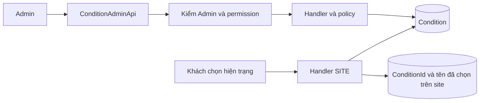
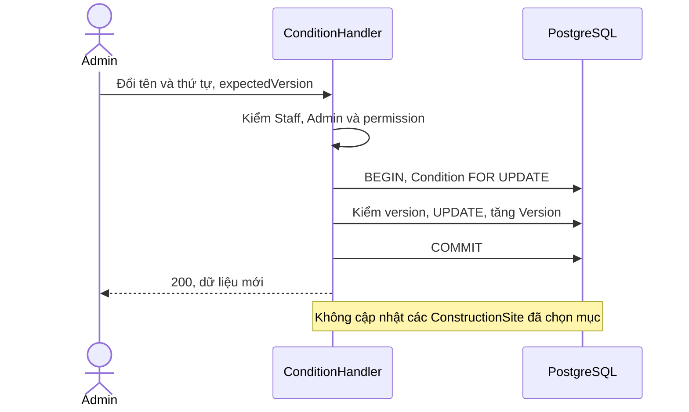
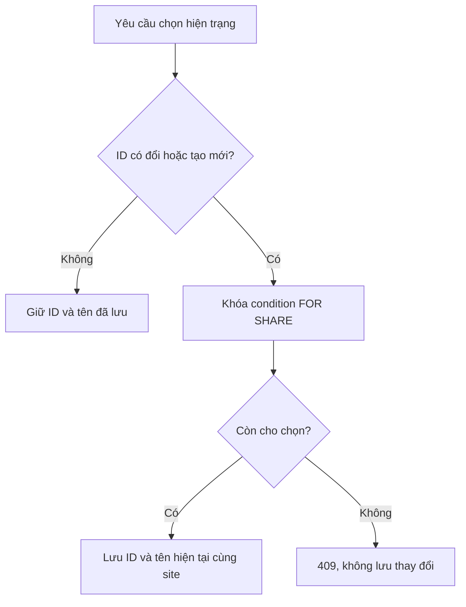
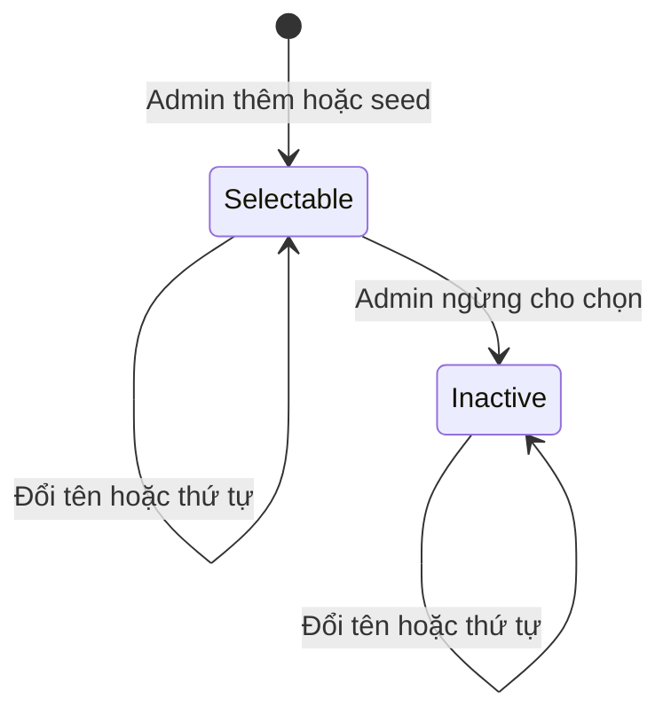
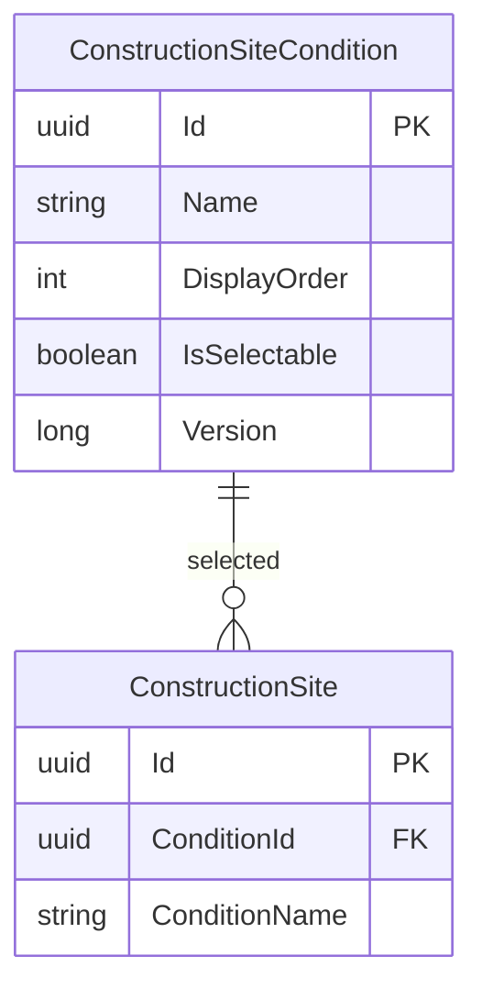

<!-- HƯỚNG DẪN CHO AI KHI ĐIỀN HOẶC CHỈNH SỬA MẪU
- Đọc toàn bộ mẫu, các comment hướng dẫn và tài liệu nguồn được cung cấp trước khi viết. Tuân thủ các quy tắc nghiệp vụ, điều kiện, ngoại lệ và giới hạn đã được xác nhận.
- Không bịa, tự chế hoặc suy đoán thành sự thật: yêu cầu, quy tắc, số liệu, API, schema, mã lỗi, nguồn tham khảo, người phụ trách và kết quả kiểm thử phải có căn cứ. Nội dung ví dụ trong mẫu không phải dữ kiện của dự án.
- Khi thiếu thông tin hoặc các nguồn mâu thuẫn, hỏi người dùng để làm rõ; giữ nguyên placeholder ở phần chưa xác định. Không tự chọn đáp án, lấp chỗ trống hay tuyên bố tài liệu đã hoàn tất.
- Chỉ thay nội dung cần điền hoặc được yêu cầu sửa. Không tự mở rộng phạm vi, sửa nghĩa quy tắc, bỏ điều kiện/ngoại lệ, xoá hay ghi đè nội dung hợp lệ đã có.
- Giữ nguyên tên, cấp và thứ tự heading, nhãn in đậm, tiền tố bullet, cấu trúc danh sách, tên/thứ tự/số cột bảng và cú pháp code fence. Không dịch, đổi tên, gộp hoặc thêm mục ngoài cấu trúc mẫu.
- Chỉ lặp khối luồng, AC hoặc API theo đúng khuôn khi có căn cứ; chỉ bỏ phần tuỳ chọn khi hướng dẫn riêng của mẫu cho phép và đã xác định không áp dụng.
- Mã tham chiếu và section phải trỏ tới tài liệu có thật đã được cung cấp hoặc kiểm chứng. Không giữ mã ví dụ như tham chiếu thật và không tự tạo tài liệu liên quan để hợp thức hoá liên kết.
- Giữ các comment hướng dẫn trong file. Xuất Markdown UTF-8, mỗi file một tài liệu; không bọc toàn bộ file trong code fence, không chèn lời dẫn hay giải thích ngoài mẫu.
- Trước khi bàn giao, đối chiếu nội dung với nguồn, kiểm tra cấu trúc, giá trị cho phép, giới hạn độ dài và tính nhất quán của mã/tham chiếu. Báo rõ phần chưa đủ thông tin; không tuyên bố đã chạy test hoặc import khi chưa thực hiện.
-->

<!-- Thay mã TDD-001 và nội dung ví dụ; giữ nguyên heading và nhãn in đậm.
Sơ đồ dùng mermaid, plantuml hoặc URL. Giữ heading Architecture, Sequence Diagram, Activity Diagram, State Diagram, Data Model.
Ví dụ API phải có heading trùng METHOD /path trong Endpoints. Xoá phần API/sơ đồ không dùng.
Version, Updated At và Change Log do lịch sử phiên bản quản lý, để trống khi nhập mới.
Author/Reviewer là tên hiển thị; gán tài khoản, phê duyệt, giả định và câu hỏi mở trên giao diện sau import.
Thiết kế phải truy vết về Story và Business Rule được cung cấp. Phân biệt thiết kế đề xuất với implementation đã kiểm chứng; không mô tả API/schema/sơ đồ ví dụ như hệ thống thật hoặc tự quyết định nghiệp vụ còn thiếu.
BẮT BUỘC KHI HOÀN THIỆN MẪU: phải có cả Reviewer và Approver, mỗi tên 1–200 ký tự sau khi bỏ khoảng trắng đầu/cuối. Không xoá hai dòng metadata, để trống, dùng tên bịa hoặc giữ placeholder rồi coi là hoàn tất.
Nếu chưa biết người review hoặc người phê duyệt, phải hỏi người dùng và báo tài liệu chưa đủ thông tin; không tự lấy Author/Owner làm người thay thế. Tên trong file không tự gán tài khoản hoặc xác nhận đã duyệt; gán thành viên trên giao diện sau import.
Đây là yêu cầu hoàn thiện mẫu; backend hiện vẫn nhận file cũ thiếu hai trường để tương thích.

VALIDATION CHO FILE NHẬP (đối chiếu ImportSnapshotValidator, MarkdownParser và ImportService):
- Mỗi file .md UTF-8 không rỗng chỉ có một heading cấp 1 chứa mã tài liệu dài 1–100 ký tự. Mã không được trùng trong cùng lần nhập hoặc thuộc loại tài liệu khác đã tồn tại.
- Không dùng tên README.md hoặc sitemap.md vì importer bỏ qua. Giao diện nhận .md/.zip, tối đa 2.000 file, tổng file tải lên 31 MiB; API giới hạn request 32 MiB và tổng nội dung đọc/giải nén 64 MiB.
- Chỉ nhập đè tài liệu cùng loại đang Draft, chưa có phiên bản và chưa lưu trữ. Import thay toàn bộ nội dung bản nháp, vì vậy phải giữ lại nội dung hợp lệ ngoài phần được yêu cầu sửa.
- Không dùng Status trong Markdown hoặc tên Approver để tự xác nhận phê duyệt; import không cấp quyền hay gán tài khoản từ tên. Chạy Kiểm tra file và xử lý lỗi/cảnh báo trước khi nhập.
- Giới hạn độ dài bên dưới tính theo string.Length của .NET (đơn vị UTF-16); không tự cắt ngắn dữ kiện quan trọng để vượt validation, hãy viết lại có căn cứ hoặc hỏi người dùng.
- Feature tối đa 300 ký tự và được dùng làm tiêu đề tài liệu. Status được parser nhận: Draft / In Review / Approved / Deprecated; tài liệu nhập mới vẫn có trạng thái phê duyệt Draft.
- Endpoint: đường dẫn tối đa 500 ký tự; tên/mô tả endpoint được lưu trong Name tối đa 300. HTTP method: GET / POST / PUT / PATCH / DELETE / HEAD / OPTIONS.
- Error Codes: mã tối đa 100 ký tự, không trùng trong tài liệu; giữ dạng - **CODE** (400): mô tả. HTTP status trong Error Codes và Response phải là số nguyên đọc được bằng Int32; không tự đặt status khác hợp đồng API.
- URL sơ đồ tối đa 1.000 ký tự. Mục sơ đồ được sử dụng phải có khối mermaid/plantuml hoặc URL theo mẫu; không để một mục sơ đồ rỗng. Nhãn mục được tách từ bullet như tên External API Fields tối đa 300 ký tự.
- Heading Examples phải khớp METHOD /path ở Endpoints. Giữ các nhãn Request:, Response 200: (thay mã theo contract) và Error Response: để parser tách đúng dữ liệu.
- Tham chiếu dạng DOC-KEY/section: ghi chú: mã đích tối đa 100 ký tự, section tối đa 100, ghi chú tối đa 1.000. Không trùng bộ mã đích + section + loại liên kết trong cùng tài liệu.
ĐỐI CHIẾU FORM TDD (src/features/tdds/validations.ts; form có thể chặt hơn import):
- Điền Feature, Author, Reviewer, Problem và ít nhất một Goal; các Goal/Non-goal/Notes đã thêm không được rỗng. API đã khai báo phải có endpoint và mô tả/mục đích; Fields phải có tên và ý nghĩa; Error Codes phải có mã, HTTP status và điều kiện.
- Form còn kiểm tra Version, Updated At và nội dung Change Log khi khai báo; với file nhập mới, giữ các trường lịch sử này trống theo hợp đồng import, không tự tạo dữ liệu lịch sử.
-->

# TDD-SITE-004

## Document Info

- **Feature**: Admin quản lý danh mục hiện trạng, giữ lựa chọn cũ trên công trình
- **Author**: Codex
- **Reviewer**: Tân Trần
- **Approver**: Tân Trần
- **Status**: Draft
- **Version**:
- **Updated At**:

## Context & Goals

### Problem

**Chốt trong hội thoại:** người dùng đã xác nhận bản TDD này bằng phản hồi “chốt” sau bàn giao. Dùng thiết kế này làm căn cứ cho [đặc tả Unit Test](../discovery/construction-site-unit-test-coverage.md); Status Draft là trạng thái tài liệu nhập, không phủ nhận xác nhận hội thoại. Phần mở rộng chưa triển khai hoặc chạy test.

Hiện trạng là danh mục mới, khác trạng thái tiến độ và trạng thái gói giám sát. Admin cần thêm, đổi tên, sắp xếp và ngừng cho chọn; các công trình đã dùng phải giữ ID và tên lúc chọn. Thiết kế này chưa triển khai, dựa trên STORY-SITE-003 và BR-SITE-006 đã chốt.

### Goals

- Chỉ Admin quản lý danh mục; khách chỉ đọc mục còn cho chọn.
- Giữ liên kết và tên lịch sử của hồ sơ, kể cả khi mục bị đổi tên hoặc ngừng.
- Chặn ghi đè do hai Admin cùng sửa và kiểm điều kiện chọn ngay trong transaction lưu SITE.

### Non-goals

- Xóa mục, khôi phục mục đã ngừng, quản lý tiến độ hoặc thêm quyền ghi hộ công trình.
- Tạo danh mục loại/phong cách riêng; các danh mục đó tiếp tục do PROJ quản lý.

## Architecture

Thêm Carter `ConstructionSiteConditionAdminApi`, contract/validator và các command/query ở module SITE. `ConstructionSiteConditionPolicy` kiểm tên, thứ tự và chuyển trạng thái. Tên lớp/endpoint/schema dưới đây là thiết kế mới. Policy quản trị dùng quyền đề xuất `construction-site.condition.manage` (RequiresAssignment=false), seed cho vai trò `admin`; đồng thời kiểm người gọi là Staff thuộc vai trò hệ thống Admin. Như vậy cấp nhầm permission cho nhân viên thường cũng không mở chức năng Admin-only. Cập nhật PermissionCatalog/guard và migration cùng đợt, theo cơ chế RBAC hiện có; không tạo quyền ghi công trình cho Admin.



**Notes**:

- Dùng một bảng danh mục hiện hành, còn tên lịch sử đặt trên công trình. Không cần sao toàn bộ danh mục mỗi lần đổi tên: chỉ một giá trị được chọn cần giữ lịch sử. ConditionId là danh tính ổn định phục vụ truy vấn liên quan sau này.
- Tên sau NFC/trim dài 1–200 ký tự UTF-16; đây là giới hạn kỹ thuật được BR cho phép xác định ở TDD. Không đặt unique tên vì chưa có quy tắc cấm trùng. DisplayOrder là số nguyên không âm; khi bằng nhau sắp tiếp Id để luôn ổn định. Sắp xếp bằng thay DisplayOrder từng mục; không suy ra thứ tự phải duy nhất.
- Khi chọn mới, handler SITE khóa condition FOR SHARE, kiểm IsSelectable rồi chép Name. Handler Admin khóa cùng dòng FOR UPDATE; vì vậy ngừng trước thì không chọn được, SITE lưu trước thì lựa chọn hợp lệ và được giữ. Sửa trường khác với cùng ConditionId không làm mới ConditionName và không kiểm active.
- expectedVersion chống ghi đè: Admin A và B cùng đọc version 1; A ghi trước thành 2, B nhận 409 và phải đọc lại. Không tự merge tên/thứ tự. PUT cho phép đổi tên/thứ tự ở cả mục active và inactive; không nhận IsSelectable. Route deactivate riêng chỉ chuyển true→false, không có route kích hoạt lại.

## Sequence Diagram



## Activity Diagram



## State Diagram



Không có DELETE hoặc Inactive→Selectable trong phạm vi. Hồ sơ đã dùng Inactive tiếp tục giữ lựa chọn đó.

## Data Model

**ConstructionSiteCondition**: một dòng là một danh tính hiện trạng và cấu hình hiện hành của nó. Admin tạo/sửa; seed tạo ba mục ban đầu. Không có soft-delete. Bảng này không chứa lịch sử tên; ConditionName trên SITE giữ tên lúc lựa chọn.

| Cột | Kiểu, ràng buộc và ý nghĩa |
|---|---|
| Id | uuid PK, ID ổn định; không đổi khi đổi tên. |
| Name | varchar(200) NOT NULL, CHECK có nội dung sau trim; NFC/trim ở policy. |
| DisplayOrder | integer NOT NULL CHECK >=0; chỉ thứ tự hiển thị. |
| IsSelectable | boolean NOT NULL; mục mới true, ngừng false. |
| Version | bigint NOT NULL DEFAULT 1 CHECK >0. |
| CreatedAtUtc, UpdatedAtUtc | timestamptz NOT NULL, đồng hồ server UTC. |

FK ConstructionSite.ConditionId → ConstructionSiteCondition.Id RESTRICT, schema SITE ở [TDD-SITE-003](TDD-SITE-003.md#data-model). Không cần bảng nối vì mỗi site có đúng một hiện trạng. Khách không gửi ConditionName; handler chép từ hàng được khóa khi tạo/đổi lựa chọn.



**Mẫu giả định**, H1/H2/H3 và C1 là bí danh UUID; T=2026-10-01T03:00:00Z, T2>T. Bảng lược cột không thay thế dữ liệu seed đầy đủ.

| Bảng | Dòng trước/sau |
|---|---|
| ConstructionSiteCondition ban đầu | H1/Đất trống/DisplayOrder=1; H2/Có nhà cũ cần phá dỡ/2; H3/Cải tạo/3. Cả ba IsSelectable=true, Version=1, CreatedAtUtc=UpdatedAtUtc=T. |
| ConstructionSite đã chọn | C1; ConditionId=H1; ConditionName=Đất trống; phần hồ sơ đầy đủ như TDD-SITE-003. |
| Condition sau Admin đổi tên | H1; Name=Đất chưa xây; DisplayOrder=1; IsSelectable=true; Version=2; UpdatedAtUtc=T2. C1.ConditionName vẫn Đất trống. |
| Condition sau ngừng | H1; IsSelectable=false; Version=3; giữ Name/CreatedAtUtc; UpdatedAtUtc=T3. C1 giữ H1. Công trình mới chọn H1 bị từ chối; C1 sửa ngân sách vẫn giữ H1. |

**Notes**:

- Seed ba mục bằng UUID cố định trong migration, chỉ chạy một lần; không upsert theo tên mỗi lần khởi động vì sẽ ghi đè tên/thứ tự Admin sửa. Thêm `Permission` code và liên kết `RolePermission` cho admin theo schema/mẫu [TDD-RBAC-001/Data Model](TDD-RBAC-001.md#data-model). Ví dụ dòng mới: Permission.Code=construction-site.condition.manage, RequiresAssignment=false; RolePermission nối permission đó với role hệ thống admin hiện có, không tạo vai trò mới.
- Index `(IsSelectable,DisplayOrder,Id)` phục vụ form; PK cho sửa. Không thêm lịch sử hoặc index tìm kiếm chưa có nhu cầu.
- Cho dù sau này có tác vụ xóa SQL, FK RESTRICT bảo vệ mục đã được dùng. API đợt này không công bố DELETE cả với mục chưa dùng.
- Kiểm bằng system/integration: permission đúng/sai, snapshot tên sau rename, inactive giữ trên site cũ, chọn-vs-deactivate và xung đột version. Kế hoạch này không tuyên bố test đã chạy.

## Internal API

### Endpoints

Mọi mutation kiểm Origin với cookie. `Id` từ route và `expectedVersion` từ body; không nhận CreatedAtUtc/owner. DTO trả Id/name/displayOrder/isSelectable/version. Không phân trang danh mục nhỏ; không áp trần số mục nghiệp vụ mới.

- **GET** `/api/v1/admin/construction-site-conditions` — Admin đọc tất cả, gồm inactive; sort DisplayOrder,Id.
- **POST** `/api/v1/admin/construction-site-conditions` — `{name,displayOrder}`; tạo active version 1, trả 201 DTO.
- **PUT** `/api/v1/admin/construction-site-conditions/{conditionId}` — `{name,displayOrder,expectedVersion}`; 200 DTO sau sửa.
- **POST** `/api/v1/admin/construction-site-conditions/{conditionId}/deactivate` — `{expectedVersion}`; 200 DTO. Nếu đã inactive và version vẫn khớp thì no-op, không tăng version; version cũ trả 409. Không nhận `isSelectable=true`.
- **GET** `/api/v1/me/construction-site-conditions` — Customer đọc mục active; dùng cả form tạo và sửa. Mục cũ inactive hiển thị bằng snapshot trong detail SITE, không đưa vào danh sách chọn mới.

### Examples

#### POST /api/v1/admin/construction-site-conditions

```text
Request:
{"name":"Đất trống","displayOrder":1}

Response 201:
{"value":{"id":"aaaaaaaa-aaaa-4aaa-8aaa-aaaaaaaaaaaa","name":"Đất trống","displayOrder":1,"isSelectable":true,"version":1},"isSuccess":true,"isFailure":false}

Error Response:
{"title":"Forbidden","status":403,"code":"AccessForbidden","detail":"Chỉ Admin được quản lý danh mục hiện trạng."}
```

### Error Codes

- **ValidationError** (422): tên rỗng/quá 200, thứ tự âm, version sai kiểu/miền hoặc trường ngoài DTO.
- **AccessForbidden** (403): không phải Admin có permission quản lý ở route Admin; không phải Customer ở route khách.
- **ConstructionSiteConditionNotFound** (404): ID không tồn tại ở thao tác Admin.
- **ConstructionSiteConditionVersionConflict** (409): version không còn khớp.
- **ConstructionSiteConditionUnavailable** (409): chọn mới mục không tồn tại hoặc đã ngừng khi lưu SITE.

## References

### User Stories

- STORY-SITE-003
- STORY-SITE-001

### Business Rules

- BR-SITE-006
- BR-SITE-001
- BR-SITE-002

### Use Cases

- STORY-SITE-003/Main Flow

### Others

- [TDD-SITE-003](TDD-SITE-003.md), [TDD-RBAC-001](TDD-RBAC-001.md).
- [Bộ System Test đã chốt](../discovery/construction-site-system-test-coverage.md).
- [Bàn giao kỹ thuật](../discovery/construction-site-technical-design.md).

## Change Log
