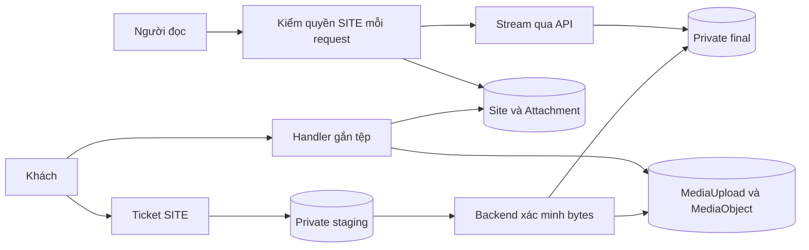
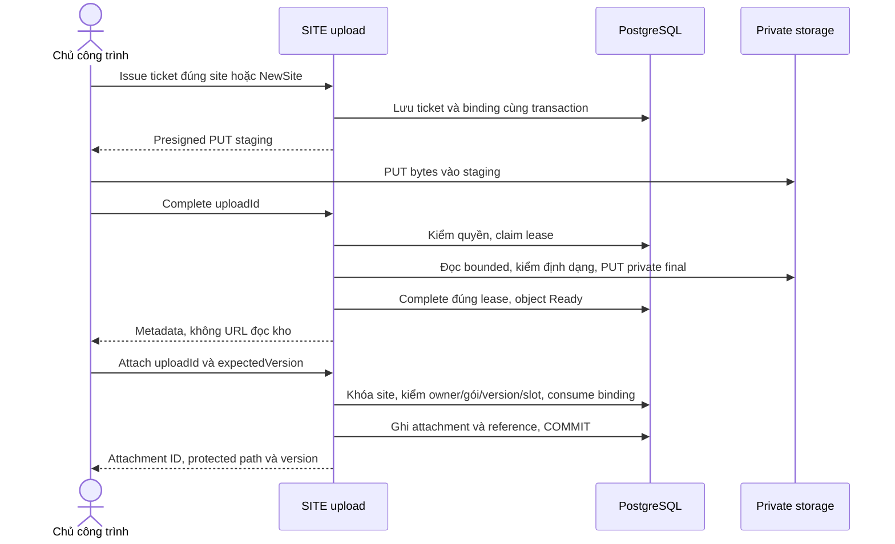
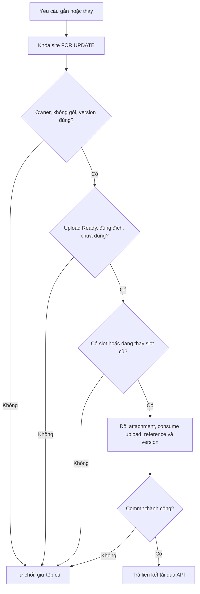
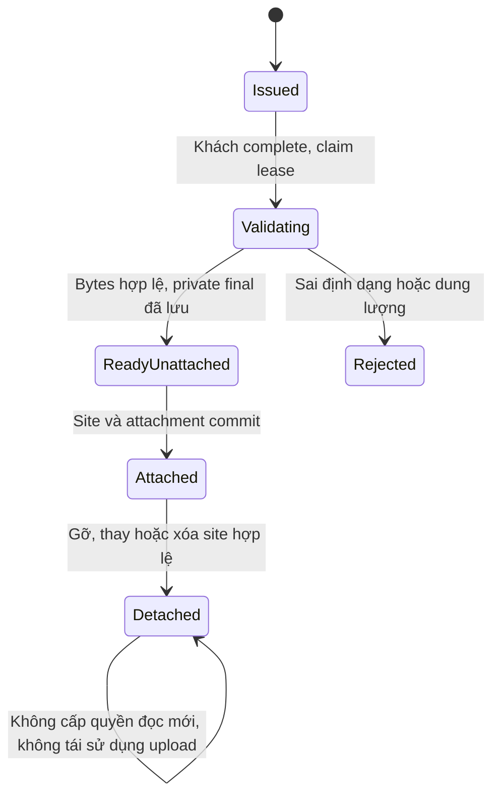
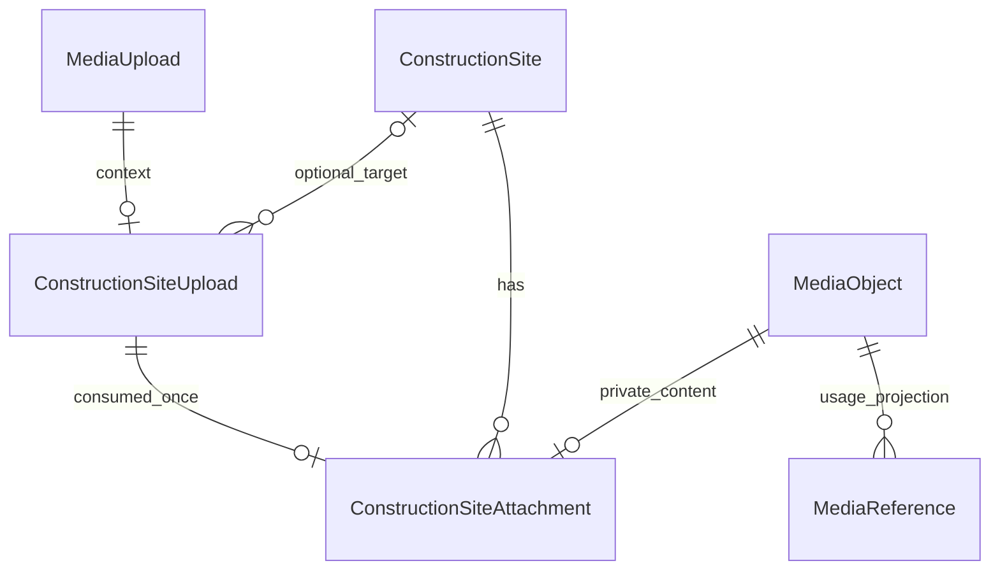

<!-- HƯỚNG DẪN CHO AI KHI ĐIỀN HOẶC CHỈNH SỬA MẪU
- Đọc toàn bộ mẫu, các comment hướng dẫn và tài liệu nguồn được cung cấp trước khi viết. Tuân thủ các quy tắc nghiệp vụ, điều kiện, ngoại lệ và giới hạn đã được xác nhận.
- Không bịa, tự chế hoặc suy đoán thành sự thật: yêu cầu, quy tắc, số liệu, API, schema, mã lỗi, nguồn tham khảo, người phụ trách và kết quả kiểm thử phải có căn cứ. Nội dung ví dụ trong mẫu không phải dữ kiện của dự án.
- Khi thiếu thông tin hoặc các nguồn mâu thuẫn, hỏi người dùng để làm rõ; giữ nguyên placeholder ở phần chưa xác định. Không tự chọn đáp án, lấp chỗ trống hay tuyên bố tài liệu đã hoàn tất.
- Chỉ thay nội dung cần điền hoặc được yêu cầu sửa. Không tự mở rộng phạm vi, sửa nghĩa quy tắc, bỏ điều kiện/ngoại lệ, xoá hay ghi đè nội dung hợp lệ đã có.
- Giữ nguyên tên, cấp và thứ tự heading, nhãn in đậm, tiền tố bullet, cấu trúc danh sách, tên/thứ tự/số cột bảng và cú pháp code fence. Không dịch, đổi tên, gộp hoặc thêm mục ngoài cấu trúc mẫu.
- Chỉ lặp khối luồng, AC hoặc API theo đúng khuôn khi có căn cứ; chỉ bỏ phần tuỳ chọn khi hướng dẫn riêng của mẫu cho phép và đã xác định không áp dụng.
- Mã tham chiếu và section phải trỏ tới tài liệu có thật đã được cung cấp hoặc kiểm chứng. Không giữ mã ví dụ như tham chiếu thật và không tự tạo tài liệu liên quan để hợp thức hoá liên kết.
- Giữ các comment hướng dẫn trong file. Xuất Markdown UTF-8, mỗi file một tài liệu; không bọc toàn bộ file trong code fence, không chèn lời dẫn hay giải thích ngoài mẫu.
- Trước khi bàn giao, đối chiếu nội dung với nguồn, kiểm tra cấu trúc, giá trị cho phép, giới hạn độ dài và tính nhất quán của mã/tham chiếu. Báo rõ phần chưa đủ thông tin; không tuyên bố đã chạy test hoặc import khi chưa thực hiện.
-->

<!-- Thay mã TDD-001 và nội dung ví dụ; giữ nguyên heading và nhãn in đậm.
Sơ đồ dùng mermaid, plantuml hoặc URL. Giữ heading Architecture, Sequence Diagram, Activity Diagram, State Diagram, Data Model.
Ví dụ API phải có heading trùng METHOD /path trong Endpoints. Xoá phần API/sơ đồ không dùng.
Version, Updated At và Change Log do lịch sử phiên bản quản lý, để trống khi nhập mới.
Author/Reviewer là tên hiển thị; gán tài khoản, phê duyệt, giả định và câu hỏi mở trên giao diện sau import.
Thiết kế phải truy vết về Story và Business Rule được cung cấp. Phân biệt thiết kế đề xuất với implementation đã kiểm chứng; không mô tả API/schema/sơ đồ ví dụ như hệ thống thật hoặc tự quyết định nghiệp vụ còn thiếu.
BẮT BUỘC KHI HOÀN THIỆN MẪU: phải có cả Reviewer và Approver, mỗi tên 1–200 ký tự sau khi bỏ khoảng trắng đầu/cuối. Không xoá hai dòng metadata, để trống, dùng tên bịa hoặc giữ placeholder rồi coi là hoàn tất.
Nếu chưa biết người review hoặc người phê duyệt, phải hỏi người dùng và báo tài liệu chưa đủ thông tin; không tự lấy Author/Owner làm người thay thế. Tên trong file không tự gán tài khoản hoặc xác nhận đã duyệt; gán thành viên trên giao diện sau import.
Đây là yêu cầu hoàn thiện mẫu; backend hiện vẫn nhận file cũ thiếu hai trường để tương thích.

VALIDATION CHO FILE NHẬP (đối chiếu ImportSnapshotValidator, MarkdownParser và ImportService):
- Mỗi file .md UTF-8 không rỗng chỉ có một heading cấp 1 chứa mã tài liệu dài 1–100 ký tự. Mã không được trùng trong cùng lần nhập hoặc thuộc loại tài liệu khác đã tồn tại.
- Không dùng tên README.md hoặc sitemap.md vì importer bỏ qua. Giao diện nhận .md/.zip, tối đa 2.000 file, tổng file tải lên 31 MiB; API giới hạn request 32 MiB và tổng nội dung đọc/giải nén 64 MiB.
- Chỉ nhập đè tài liệu cùng loại đang Draft, chưa có phiên bản và chưa lưu trữ. Import thay toàn bộ nội dung bản nháp, vì vậy phải giữ lại nội dung hợp lệ ngoài phần được yêu cầu sửa.
- Không dùng Status trong Markdown hoặc tên Approver để tự xác nhận phê duyệt; import không cấp quyền hay gán tài khoản từ tên. Chạy Kiểm tra file và xử lý lỗi/cảnh báo trước khi nhập.
- Giới hạn độ dài bên dưới tính theo string.Length của .NET (đơn vị UTF-16); không tự cắt ngắn dữ kiện quan trọng để vượt validation, hãy viết lại có căn cứ hoặc hỏi người dùng.
- Feature tối đa 300 ký tự và được dùng làm tiêu đề tài liệu. Status được parser nhận: Draft / In Review / Approved / Deprecated; tài liệu nhập mới vẫn có trạng thái phê duyệt Draft.
- Endpoint: đường dẫn tối đa 500 ký tự; tên/mô tả endpoint được lưu trong Name tối đa 300. HTTP method: GET / POST / PUT / PATCH / DELETE / HEAD / OPTIONS.
- Error Codes: mã tối đa 100 ký tự, không trùng trong tài liệu; giữ dạng - **CODE** (400): mô tả. HTTP status trong Error Codes và Response phải là số nguyên đọc được bằng Int32; không tự đặt status khác hợp đồng API.
- URL sơ đồ tối đa 1.000 ký tự. Mục sơ đồ được sử dụng phải có khối mermaid/plantuml hoặc URL theo mẫu; không để một mục sơ đồ rỗng. Nhãn mục được tách từ bullet như tên External API Fields tối đa 300 ký tự.
- Heading Examples phải khớp METHOD /path ở Endpoints. Giữ các nhãn Request:, Response 200: (thay mã theo contract) và Error Response: để parser tách đúng dữ liệu.
- Tham chiếu dạng DOC-KEY/section: ghi chú: mã đích tối đa 100 ký tự, section tối đa 100, ghi chú tối đa 1.000. Không trùng bộ mã đích + section + loại liên kết trong cùng tài liệu.
ĐỐI CHIẾU FORM TDD (src/features/tdds/validations.ts; form có thể chặt hơn import):
- Điền Feature, Author, Reviewer, Problem và ít nhất một Goal; các Goal/Non-goal/Notes đã thêm không được rỗng. API đã khai báo phải có endpoint và mô tả/mục đích; Fields phải có tên và ý nghĩa; Error Codes phải có mã, HTTP status và điều kiện.
- Form còn kiểm tra Version, Updated At và nội dung Change Log khi khai báo; với file nhập mới, giữ các trường lịch sử này trống theo hợp đồng import, không tự tạo dữ liệu lịch sử.
-->

# TDD-SITE-005

## Document Info

- **Feature**: Tệp công trình riêng tư: tối đa 9 tệp, 10 MB và kiểm quyền khi tải
- **Author**: Codex
- **Reviewer**: Tân Trần
- **Approver**: Tân Trần
- **Status**: Draft
- **Version**:
- **Updated At**:

## Context & Goals

### Problem

**Chốt trong hội thoại:** người dùng đã xác nhận bản TDD này bằng phản hồi “chốt” sau bàn giao. Dùng thiết kế này làm căn cứ cho [đặc tả Unit Test](../discovery/construction-site-unit-test-coverage.md); Status Draft là trạng thái tài liệu nhập, không phủ nhận xác nhận hội thoại. Phần mở rộng chưa triển khai hoặc chạy test.

MEDIA hiện xác minh upload rồi tạo URL công khai cho ảnh. Tệp công trình có thể là ảnh hiện trạng hoặc bản vẽ, chỉ người đang có quyền công trình được xem/tải. Không thể dùng URL công khai hoặc URL GET có chữ ký còn hiệu lực sau khi quyền phân công đã mất.

Thiết kế này chưa triển khai. Nó mở rộng MEDIA bằng purpose riêng và luồng SITE, giữ cơ chế ticket/lease/object dùng chung. Tạo công trình và liên kết tệp phải cùng commit; upload thành công chưa có nghĩa đã gắn vào hồ sơ.

### Goals

- Kiểm bytes thực, định dạng và giới hạn 10.000.000 byte cho cả hai nhóm; tối đa 9 tệp đang gắn trên một công trình.
- Chỉ owner được ghi và chỉ khi không có gói giữ chỗ; kiểm lại lúc gắn/thay/xóa.
- Kiểm quyền hiện tại trên mỗi request đọc, kể cả HEAD, Range và xem trước; không trả URL origin.
- Giữ tệp cũ khi upload hoặc ghi thay thế thất bại; không giả định transaction SQL hoàn tác được storage.

### Non-goals

- Tự sao ảnh/bản vẽ từ dự toán; tạo/chuyển đổi/render bản vẽ, OCR hoặc hỗ trợ định dạng khác.
- Thêm SLA lưu trữ, xóa vật lý tự động mọi bản vẽ, hay cam kết thu hồi byte đã được người dùng tải về.

## Architecture

Dùng `MediaUploadService`/`MediaUploadPayload` và transition MEDIA sau khi tách quyết định public/private khỏi `PutAsync` hiện đang ghi PublicRead. Tham khảo cách LibrarySectionUploadService bổ sung ngữ cảnh nghiệp vụ; không gọi thẳng complete generic rồi bỏ kiểm quyền SITE. Các thành phần SITE dưới đây là đề xuất.

| Thành phần | Trách nhiệm |
|---|---|
| ConstructionSiteUploadService | Tạo/đọc/complete ticket gắn ngữ cảnh NewSite hoặc ExistingSite, chỉ Customer sở hữu; gọi I/O ngoài transaction, finalize bằng lease đúng. |
| ConstructionSiteFileValidator | Kiểm tổng bytes, định dạng thật tương ứng nhóm, hash và metadata đã xác minh; dùng lại bộ giải mã ảnh MEDIA. |
| SiteAttachment command handlers | Khóa site, kiểm gói/version, kiểm binding/upload/object, cấp slot, đổi liên kết và MediaReference trong cùng transaction. |
| ConstructionSiteFileReadService | Dùng quyền SITE hiện tại và attachment thuộc site trước mở storage; stream private object qua API, không redirect. |
| IMediaObjectStore / BizflyMediaObjectStore | Thêm thao tác ghi private final và đọc stream/range từ key server quản lý. Không dùng PutAsync public cho SITE. |
| MediaSourceRegistry, URL resolver và cleanup | Đăng ký nguồn theo ID SITE; loại prefix riêng tư khỏi public resolver và cleanup ảnh tự động hiện tại. |



**Notes**:

- Hai purpose mới: `SiteConditionPhoto` và `SiteDrawing`; cùng tối đa 10.000.000 byte. Không đổi Image/ContractorImage/LibraryAttachment. Nhóm ảnh nhận JPEG/PNG/WebP; bản vẽ thêm PDF/DWG/DXF. Tên tệp chỉ để hiển thị; sanitize khi làm Content-Disposition, không dùng tên làm storage key.
- Stage tiếp tục `media/staging/{uploadId}` private. Final dùng `media/site-private/{objectId}.{ext}` private trong bucket đang cấu hình, không nằm trong `media/images/`. Server chỉ cấp presigned PUT cho stage, không cấp presigned GET hoặc PUT final. Public URL resolver của mọi module phải từ chối prefix này, kể cả client tự dựng URL cùng host và gửi sang PROJ/NEWS/LIB. Không dùng allowlist host đơn thuần để chấp nhận một file SITE.
- Ticket purpose SITE phải đi qua route SITE. Generic MEDIA issue/get/complete không được đọc hay hoàn tất ticket SITE để lấy publicUrl. Với SITE, mọi response complete/status chỉ có uploadId/state/object metadata; không có storage key, publicUrl hoặc origin. Reference producer đọc ID từ attachment, không suy từ URL.
- **Kiểm định dạng:** tải stage có giới hạn max+1 byte, so số thực với declaredSizeBytes, từ chối 0 hoặc >10.000.000. Decode ảnh bằng validator MEDIA; JPEG/PNG/WebP phải giải mã được. PDF phải có cấu trúc đầu/cuối và đọc được cấu trúc tài liệu; DWG/DXF phải được bộ đọc định dạng nhận diện và đọc cấu trúc, không chỉ kiểm đuôi/MIME hoặc vài byte đầu. Thêm adapter `ISiteDrawingInspector`; phương án triển khai là ACadSharp cho DWG/DXF và PdfPig cho PDF, tách khỏi domain. Hai thư viện công bố khả năng đọc tương ứng tại [ACadSharp](https://github.com/DomCR/ACadSharp) và [PdfPig](https://github.com/UglyToad/PdfPig). Chưa thêm package hoặc chọn phiên bản trong code: khi triển khai phải ghim phiên bản sau thử fixture hợp lệ, hỏng và giả đuôi. Khả năng đọc đủ mọi phiên bản CAD không được suy từ tên định dạng; bản vẽ hợp lệ nhưng parser không hỗ trợ phải được ghi nhận riêng như khoảng trống tích hợp, không gọi là tệp giả. Khi parser chưa sẵn sàng cho định dạng đã chốt thì tính năng chưa đủ điều kiện phát hành, không âm thầm bỏ DWG/DXF khỏi contract. Không chạy script/macro, không render CAD tại backend. MIME output lấy từ định dạng xác minh, không lấy nguyên khai báo.
- **Lease** là quyền hoàn tất tạm thời của một lần xử lý MEDIA: claim trong transaction ngắn, download/inspect/private PUT bên ngoài, rồi complete kiểm đúng token. Mất lease không được cập nhật Ready. Giữ timeout/lease và giới hạn staging theo MEDIA; lỗi I/O trả retryable, lỗi dữ liệu đánh Rejected. Final key bất biến sau Ready; stage có thể bị ghi lại bằng PUT cũ nhưng không ghi đè final đã xác minh.
- **Gắn tệp** nhận uploadId, không nhận objectId/URL tùy ý. Kiểm actor trùng owner, purpose SITE, binding đúng nhóm/đích, upload Completed, object Ready và chưa tiêu thụ. Binding NewSite chỉ được dùng trong POST tạo công trình; ExistingSite chỉ dùng đúng site trong route thêm/thay. Không di chuyển hoặc dùng lại tệp đã gắn, kể cả đã gỡ.
- **Khóa và 9 slot:** site FOR UPDATE → binding theo UploadId → upload → object theo UUID. Kiểm version và gói sau khóa site. Mỗi attachment chiếm slot 1–9, UNIQUE(site,slot) là chặn cuối ở DB. Gắn thứ 9 và thứ 10 đồng thời phải tuần tự kiểm; một yêu cầu bị từ chối. Thay tệp tạo attachment ID mới trong slot cũ, xóa liên kết cũ và ghi mới cùng transaction; không cần chỗ thứ 10, URL attachment cũ không đọc được nữa.
- Cấp ticket/complete cho ExistingSite cũng kiểm site còn tồn tại/owner/không gói; không giữ khóa qua I/O. Gói có thể được gán giữa lúc upload: finalize có thể bị từ chối hoặc file đã Ready nhưng bước attach luôn bị chặn. Không tăng Version chỉ vì đã upload, chưa gắn. Tạo/sửa liên kết tăng Version của site; tạo cùng site vẫn Version=1.
- Đọc tệp dùng cùng `ConstructionSiteStaffScope`: Customer own; Staff có assignment.manage xem tất cả; Staff chỉ có supervision.complete phải có Assignment hiện tại của grant trỏ site, EffectiveToUtc=NULL. Kiểm trên DB mỗi request; không cache kết quả theo token hoặc giữ danh sách site được phép từ lần đọc trước. Nhiều quyền lấy phạm vi rộng nhất. Áp dụng xác thực/thu hồi phiên và permission hiện hành của RBAC.
- File GET/HEAD dùng kết quả JOIN attachment→site→scope cùng một phép kiểm trước đọc kho. Gỡ attachment, xóa site hoặc chấm dứt assignment đã commit thì request mới bị từ chối. Không cam kết ngắt stream đã mở hợp lệ trước thời điểm đó. Headers `Cache-Control: private, no-store`, `X-Content-Type-Options: nosniff`; không bật CDN/shared-cache, Service Worker không lưu route tệp.
- Ảnh có thể inline qua route được bảo vệ; PDF/DWG/DXF tải dạng attachment. Không tạo preview riêng trong đợt này. Nếu giao diện dùng ảnh làm thumbnail thì vẫn GET cùng route quyền, không lấy origin. HEAD/Range/If-None-Match đều kiểm quyền trước trả metadata/206/304; Range sai trả 416 sau kiểm quyền.
- **Vòng đời vật lý:** gỡ tệp chỉ bỏ attachment/reference và chặn đọc mới; binding lưu dấu đã dùng. Final SITE chưa nằm trong cleanup ảnh tự động 24 giờ. Cleanup/inventory phải nhận diện purpose/prefix trước bước phân loại đuôi ảnh, giữ cả SITE image lẫn bản vẽ và ghi metric để biết dung lượng chưa thu hồi. Stage tiếp tục cơ chế tạm 24 giờ của MEDIA. Không tạo reference giả cho file không còn dùng. Retention final và thao tác xóa vật lý cần thiết kế riêng trước khi bật; điều này không cản việc gỡ tệp khỏi hồ sơ.

## Sequence Diagram



## Activity Diagram



## State Diagram

Trạng thái upload/object dùng nguyên MEDIA; không thêm cột state trùng vào binding. Sơ đồ sau mô tả quá trình sử dụng, suy ra từ trạng thái MEDIA, ConsumedAtUtc và attachment còn tồn tại.



## Data Model

**ConstructionSiteUpload**: một dòng là ngữ cảnh nghiệp vụ của một ticket MEDIA, tạo cùng ticket. Nó phân biệt file đang upload cho form mới với file dành cho site đã tồn tại. Bảng còn tồn tại sau gỡ/xóa site để ticket cũ không trở thành ticket chưa dùng.

| Cột | Kiểu, ràng buộc và ý nghĩa |
|---|---|
| UploadId | uuid PK, FK MediaUpload.Id RESTRICT; actor, hash/key request, tên tệp, dung lượng và trạng thái lấy từ MediaUpload. |
| TargetKind | varchar(16) NOT NULL CHECK NewSite/ExistingSite; bất biến. |
| TargetSiteId | uuid NULL FK ConstructionSite.Id ON DELETE SET NULL. NewSite luôn NULL; ExistingSite có ID khi cấp, có thể NULL sau site bị xóa và khi đó ticket không dùng được. Không suy luận TargetKind từ NULL. |
| AttachmentGroup | varchar(24) NOT NULL CHECK ConditionPhoto/Drawing; bất biến, khớp purpose trong MEDIA. |
| ConsumedAtUtc | timestamptz NULL; NULL là chưa từng gắn, khác NULL là đã tiêu thụ, không đưa về NULL. |
| ConsumedSiteId, ResultAttachmentId | uuid NULL; cùng NULL với ConsumedAtUtc. Khi tiêu thụ ghi ID kết quả lịch sử, không FK vì site/attachment có thể bị xóa. Không dùng hai ID này cấp quyền hoặc làm nguồn hiện hành. |

CHECK: NewSite thì TargetSiteId=NULL; ba trường consumed đồng thời NULL hoặc cùng có giá trị. ExistingSite với TargetSiteId=NULL là tombstone không thể gắn, không phải lỗi cần tự chuyển thành NewSite. ConsumedSiteId của ExistingSite bằng TargetSiteId tại lúc consume, được handler kiểm dưới khóa. Nội dung issue hash của MEDIA bao gồm TargetKind/TargetSiteId/AttachmentGroup và metadata file, để cùng key khác đích/nhóm nhận 409.

**ConstructionSiteAttachment**: một dòng là một tệp đang gắn, do owner thêm/thay/xóa. Không chứa binary. Một upload chỉ tạo tối đa một attachment; nhóm/tên/bytes/MIME/hash lấy qua binding/upload/object, không sao bản metadata rồi phải đồng bộ.

| Cột | Kiểu, ràng buộc và ý nghĩa |
|---|---|
| Id | uuid PK; thay tệp tạo ID mới để link cũ không trỏ nội dung khác. |
| ConstructionSiteId | uuid NOT NULL FK ConstructionSite.Id CASCADE. |
| Slot | smallint NOT NULL CHECK BETWEEN 1 AND 9; UNIQUE(ConstructionSiteId,Slot). Không phải thứ tự nghiệp vụ người dùng chỉnh. |
| UploadId | uuid NOT NULL UNIQUE, FK ConstructionSiteUpload.UploadId RESTRICT. |
| MediaObjectId | uuid NOT NULL UNIQUE FK MediaObject.Id RESTRICT; phải là object completed của UploadId. |
| CreatedAtUtc | timestamptz NOT NULL UTC. |

Dùng UNIQUE MediaObject `(SourceUploadId,Id)` đã có để tạo FK attachment `(UploadId,MediaObjectId)` tới key này, để không gắn object của ticket khác. Các object cũ SourceUploadId=NULL vẫn hợp lệ nhưng không dùng cho SITE. Dùng FK restrict, không cascade xóa object/upload khi xóa site. Trong EF Core, không khai báo alternate key trên cột nullable SourceUploadId vì EF sẽ biến cột này thành bắt buộc. Migration tạo FK ghép trực tiếp bằng SQL tới unique index hiện có; model giữ FK đơn tới MediaObject và giữ SourceUploadId nullable cho object cũ.

**MediaUpload/MediaObject/MediaReference dùng lại** theo [TDD-MEDIA-001/Data Model](TDD-MEDIA-001.md#data-model); chỉ mở enum/policy purpose và thêm FK nêu trên, không tạo bảng upload song song. Registry tăng source version khi bổ sung `SourceKind=ConstructionSiteAttachment`, SourceId=attachment.Id, Slot=`File`, ObjectId đúng object. Đây là projection được ghi cùng transaction attachment; không là nguồn cấp quyền. Reconciliation đọc các attachment còn tồn tại; đối tượng SITE không reference vẫn được phân loại giữ ngoài cleanup hiện tại, không làm giả liên kết.



**Mẫu lưu trữ giả định:** U1/C1 cùng ví dụ TDD-SITE-003; UP1/M1/A1 là UUID giả định, T=2026-10-01T03:00:00Z. Các cột MEDIA khác theo mẫu nguồn, được lược để dễ đọc.

| Bảng | Dòng minh họa |
|---|---|
| MediaUpload | Id=UP1; ActorId=U1; Purpose=SiteDrawing; RequestKey=site-drawing-1; RequestHash=H (SHA-256 64 ký tự); OriginalName=mat-bang.pdf; DeclaredContentType=application/pdf; DeclaredSizeBytes=10000000; State=Completed; CompletedObjectId=M1. |
| MediaObject | Id=M1; SourceUploadId=UP1; StoreId=bmt-main; ObjectKey=media/site-private/M1.pdf (M1 là bí danh); State=Ready; MediaType=application/pdf; SizeBytes=10000000; hash xác minh; không có publicUrl. |
| ConstructionSiteUpload trước gắn | UploadId=UP1; TargetKind=NewSite; TargetSiteId=NULL; AttachmentGroup=Drawing; ConsumedAtUtc=ConsumedSiteId=ResultAttachmentId=NULL. |
| ConstructionSiteUpload sau tạo C1 | UP1; ConsumedAtUtc=T; ConsumedSiteId=C1; ResultAttachmentId=A1; target vẫn NewSite/NULL. |
| ConstructionSiteAttachment | Id=A1; ConstructionSiteId=C1; Slot=1; UploadId=UP1; MediaObjectId=M1; CreatedAtUtc=T. |
| MediaReference | ObjectId=M1; SourceKind=ConstructionSiteAttachment; SourceId=A1; Slot=File; các timestamp theo MEDIA. |

Thay A1 bằng A2 dùng UP2/M2 hợp lệ: trong một transaction xóa A1/reference cũ, thêm A2 tại slot 1/reference mới, đánh UP2 consumed và tăng C1.Version. UP1 vẫn consumed; M1 không còn reference nhưng private và ngoài cleanup final đợt này. Nếu commit lỗi, A1 và reference M1 vẫn còn; UP2 chưa consumed, có thể thử attach lại sau khi đọc version. Xóa C1 bỏ A2/reference và làm TargetSiteId của các ticket ExistingSite trỏ C1 thành NULL; binding lịch sử vẫn còn. Không cấp quyền tải bằng ConsumedSiteId.

**Notes**:

- DB chứng minh số slot, không dùng bộ đếm dễ lệch. Quyền, định dạng và binding đích vẫn cần policy; FK không thay kiểm đó. Khóa unique object/upload chặn dùng lại trong khi attachment tồn tại; ConsumedAtUtc chặn dùng lại sau khi attachment đã xóa.
- Thêm index ConstructionSiteUpload(TargetSiteId) cho FK SET NULL; UNIQUE(site,slot) phục vụ đọc/count theo site. Hai UNIQUE upload/object phục vụ lookup và chống gắn lặp; không thêm index đơn trùng.
- SQL transaction không hoàn tác object storage. Lỗi sau private PUT có thể để Reserved/Ready chưa gắn; không trả attachment thành công, không xóa bù khi chưa rõ commit. MEDIA đối soát lease/object; file final chưa gắn vẫn private và không có route tải. Không mất tệp đang dùng khi complete retry.
- Retry complete cùng uploadId dùng lease/state MEDIA; đã Completed trả metadata cũ sau kiểm quyền ngữ cảnh, không chạy PUT final lần nữa. Retry attach bằng expectedVersion cũ trả conflict, client đọc lại site; không tái gắn binding consumed. Retry issue cùng key trả ticket cũ sau kiểm actor/ngữ cảnh, khác hash trả IdempotencyConflict. Xóa attachment đã không còn trả 404.
- Tạo site và danh sách 0–9 NewSite uploads phải cùng transaction theo TDD-SITE-003. Không tạo site trước rồi gọi chín request gắn và coi là một lần tạo nguyên tử. Nếu bất kỳ upload không hợp lệ, không có site, nguồn chưa bị chiếm, không binding nào consumed.
- Migration sau SITE/condition: tạo binding và attachment/FK/index; mở CHECK `CK_MediaUpload_Size` với trần 10000000 và `CK_MediaUpload_Type` với MIME tương ứng cho hai purpose SITE; registry/config cleanup phải hiểu prefix mới trước khi cấp ticket. Giữ MEDIA registry gate và chạy đối soát theo source version mới trước bật cleanup ảnh lại. Không tự xóa file chưa gắn trong migration.
- Cần kiểm thật ở PostgreSQL và bucket BizFly: 9-slot concurrency, attach-vs-assign, rollback replacement, file 10.000.000/10.000.001 byte, giả đuôi, lỗi stream/private PUT, quyền sau chuyển giao, generic MEDIA bypass, private origin và preview. Đây là yêu cầu kiểm chứng, chưa có kết quả Pass.

## Internal API

### Endpoints

Các route upload/gắn chỉ Customer; route đọc file áp quyền SITE. Mutation kiểm Origin khi cookie. UploadId/attachmentId là UUID; request không nhận StorageKey/MediaObjectId/publicUrl/ownerId. Response JSON theo Result<T>, response file là stream.

- **POST** `/api/v1/me/construction-site-uploads` — Idempotency-Key; `{targetKind,targetSiteId,attachmentGroup,fileName,contentType,sizeBytes}`. NewSite targetSiteId=NULL; ExistingSite phải là own editable site. 201 ticket với uploadId, URL PUT staging, headers bắt buộc và expiresAtUtc; không có URL đọc.
- **POST** `/api/v1/me/construction-site-uploads/{uploadId}/complete` — Body rỗng; 200 trạng thái/metadata khi xác minh xong, retry theo MEDIA nếu đang xử lý. Không tự attach, không tăng site.Version.
- **GET** `/api/v1/me/construction-site-uploads/{uploadId}` — Owner ticket đọc state/metadata; ExistingSite phải còn hợp lệ và trong quyền owner, site đã mất trả 404. Sau consume, kiểm site hiện tại bằng attachment, không chỉ dấu lịch sử. Không trả content URL.
- **POST** `/api/v1/me/construction-sites/{siteId}/attachments` — `{uploadId,expectedVersion}`; 201 attachment metadata và siteVersion mới; chỉ ticket ExistingSite đúng site.
- **PUT** `/api/v1/me/construction-sites/{siteId}/attachments/{attachmentId}` — `{uploadId,expectedVersion}`; 200 attachment mới/siteVersion, cùng slot, gỡ ID cũ sau commit.
- **DELETE** `/api/v1/me/construction-sites/{siteId}/attachments/{attachmentId}` — Query expectedVersion; 204 sau xóa liên kết, client đọc lại version; không DELETE storage đồng bộ.
- **GET** `/api/v1/construction-sites/{siteId}/attachments/{attachmentId}/content` — Customer own hoặc Staff đúng phạm vi; 200 hoặc 206 cho single byte range, không redirect. PDF/CAD tải về, ảnh có thể inline.
- **HEAD** `/api/v1/construction-sites/{siteId}/attachments/{attachmentId}/content` — Cùng quyền/kiểm liên kết như GET, trả metadata, không body. Không dùng HEAD làm đường lộ dung lượng/tên cho người không quyền.

Metadata attachment gồm id, attachmentGroup, originalName, mediaType, sizeBytes, createdAtUtc, contentPath. Detail SITE trả danh sách này từ các JOIN dưới phạm vi quyền. API status upload không làm API download cho tệp chưa gắn. Route tạo công trình nhận NewSite uploadIds như TDD-SITE-003.

### Examples

#### POST /api/v1/me/construction-sites/{siteId}/attachments

```text
Request:
{"uploadId":"aaaaaaaa-aaaa-4aaa-8aaa-aaaaaaaaaaaa","expectedVersion":2}

Response 201:
{"value":{"attachment":{"id":"bbbbbbbb-bbbb-4bbb-8bbb-bbbbbbbbbbbb","attachmentGroup":"Drawing","originalName":"mat-bang.pdf","mediaType":"application/pdf","sizeBytes":10000000,"createdAtUtc":"2026-10-01T03:00:00Z","contentPath":"/api/v1/construction-sites/cccccccc-cccc-4ccc-8ccc-cccccccccccc/attachments/bbbbbbbb-bbbb-4bbb-8bbb-bbbbbbbbbbbb/content"},"siteVersion":3},"isSuccess":true,"isFailure":false}

Error Response:
{"title":"Conflict","status":409,"code":"ConstructionSiteAttachmentLimitExceeded","detail":"Một công trình được gắn tối đa 9 tệp."}
```

### Error Codes

- **ValidationError** (422): nhóm/file metadata sai, MIME/đuôi không thuộc contract, bytes không khớp khai báo hoặc nội dung không đọc được theo định dạng.
- **ConstructionSiteFileTooLarge** (413): bytes khai báo hoặc thực >10.000.000.
- **AccessForbidden** (403): không có loại tài khoản/quyền thực hiện thao tác; staff không được ghi.
- **ConstructionSiteNotFound** (404): own site không tồn tại hoặc thuộc khách khác.
- **ConstructionSiteNotInScope** (403): staff ngoài phạm vi hiện tại.
- **ConstructionSiteAttachmentNotFound** (404): attachment không thuộc site đã kiểm quyền hoặc đã gỡ; không dùng lookup ID đơn lẻ để trả metadata.
- **ConstructionSiteUploadNotFound** (404): ticket không có/khác actor/không còn ngữ cảnh được phép đọc.
- **ConstructionSiteUploadUnavailable** (409): chưa Ready, sai đích, đã consumed hoặc object không dùng được; không thay tệp cũ.
- **ConstructionSiteAttachmentLimitExceeded** (409): không còn slot để thêm.
- **ConstructionSiteHasSupervision** (409): site có gói giữ chỗ khi thêm/thay/gỡ tệp, cấp ticket hoặc complete.
- **ConstructionSiteVersionConflict** (409): expectedVersion không khớp khi attach/replace/delete.
- **IdempotencyConflict** (409): cùng key issue nhưng khác file/đích/nhóm.
- **RangeNotSatisfiable** (416): range ngoài tệp hoặc dạng không được hỗ trợ, sau kiểm quyền.
- **ConstructionSiteFileInspectionUnavailable** (503): parser không hỗ trợ hoặc không đủ khả năng kết luận định dạng của bản vẽ; chưa cho attach, giữ tệp cũ và ghi rõ khoảng trống tích hợp, không báo file giả.
- **DependencyUnavailable** (503): kho/validator phụ thuộc không sẵn sàng; không biến lỗi hạ tầng thành tệp sai định dạng.

Lỗi xác thực trả 401 theo AUTH. Nếu stream đã gửi header rồi mới lỗi kho, ngắt stream và log lỗi; không cố gửi JSON 200 thành công. Giao diện phải nhận biết tải chưa đủ Content-Length.

## External API

### Endpoints

- **BizFly S3-compatible** — Presigned PUT private staging, backend GET/HEAD staging, private PUT final và authenticated GET/HEAD/Range final; dùng endpoint/bucket/credentials cấu hình MEDIA hiện có.

### Fields

- **Key** — Do server sinh trong prefix riêng tư; không tin client, không ghi query có chữ ký vào log.
- **Content-Length / Content-Type / SHA-256** — Lấy từ bytes kiểm chứng; SHA-256 dùng để nhận diện nội dung, không dùng ETag provider làm checksum chắc chắn.
- **ACL / bucket policy / CDN** — Final SITE không có public-read; chính sách bucket/CDN phải chặn đọc ẩn danh tại prefix mới, kể cả object URL tự đoán.

### Error Handling

Giữ timeout/cancellation/lease của MEDIA. Retry I/O chỉ trong lease và cùng key; khi timeout không biết PUT đã thành công thì đối soát HEAD/hash trước complete, không xóa ngay. Storage 403 là lỗi quyền kho, không trả như người dùng không có quyền SITE; origin 404 khi metadata Ready là lỗi thiếu object cần đối soát. Không gọi origin trước khi kiểm quyền tài nguyên. Không cấp URL GET tạm để né lỗi stream.

### Quirks

- BizFly tương thích S3 không chứng minh bucket thực tế riêng tư. Trước phát hành phải thử anonymous GET/HEAD/range trên stage/final, đường virtual-host/path-style và CDN nếu có. ACL private không đủ nếu bucket policy cấp public toàn prefix. Nếu bucket hiện tại không cô lập được prefix, dừng phát hành nhánh tệp và lập cấu hình kho riêng; chưa khẳng định đã kiểm bucket trong tác vụ tài liệu.
- Presigned PUT vẫn có thể được gửi lại trước expiry; backend chỉ công bố object final đã xác minh, không đọc trực tiếp staging để hiển thị.
- Phương án parser CAD/PDF đã nêu ở Architecture nhưng chưa được ghim phiên bản và xác minh trong code; đây là hạng mục kỹ thuật cần hoàn tất trước phát hành đủ các định dạng, không phải quyết định nghiệp vụ còn mở.

## References

### User Stories

- STORY-SITE-004
- STORY-SITE-001
- STORY-SITE-002
- STORY-MEDIA-001

### Business Rules

- BR-SITE-007
- BR-SITE-002
- BR-SITE-003
- BR-SITE-004
- BR-MEDIA-001
- BR-MEDIA-002

### Use Cases

- STORY-SITE-004/Main Flow

### Others

- [TDD-SITE-001](TDD-SITE-001.md), [TDD-SITE-003](TDD-SITE-003.md), [TDD-MEDIA-001](TDD-MEDIA-001.md), [TDD-RBAC-001](TDD-RBAC-001.md).
- [Bộ System Test đã chốt](../discovery/construction-site-system-test-coverage.md); [bàn giao kỹ thuật](../discovery/construction-site-technical-design.md).
- [S3 presigned URL](https://docs.aws.amazon.com/AmazonS3/latest/userguide/using-presigned-url.html); [BizFly Simple Storage API](https://support.bizflycloud.vn/api/simple-storage/).

## Change Log
