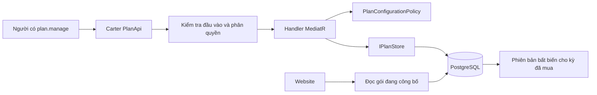
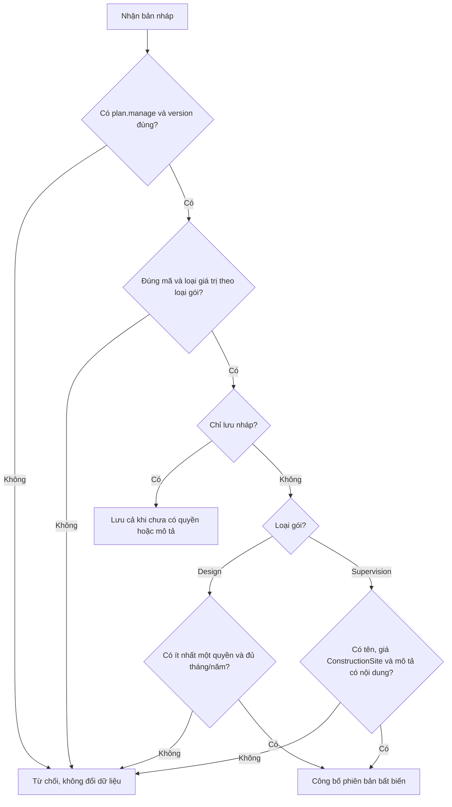
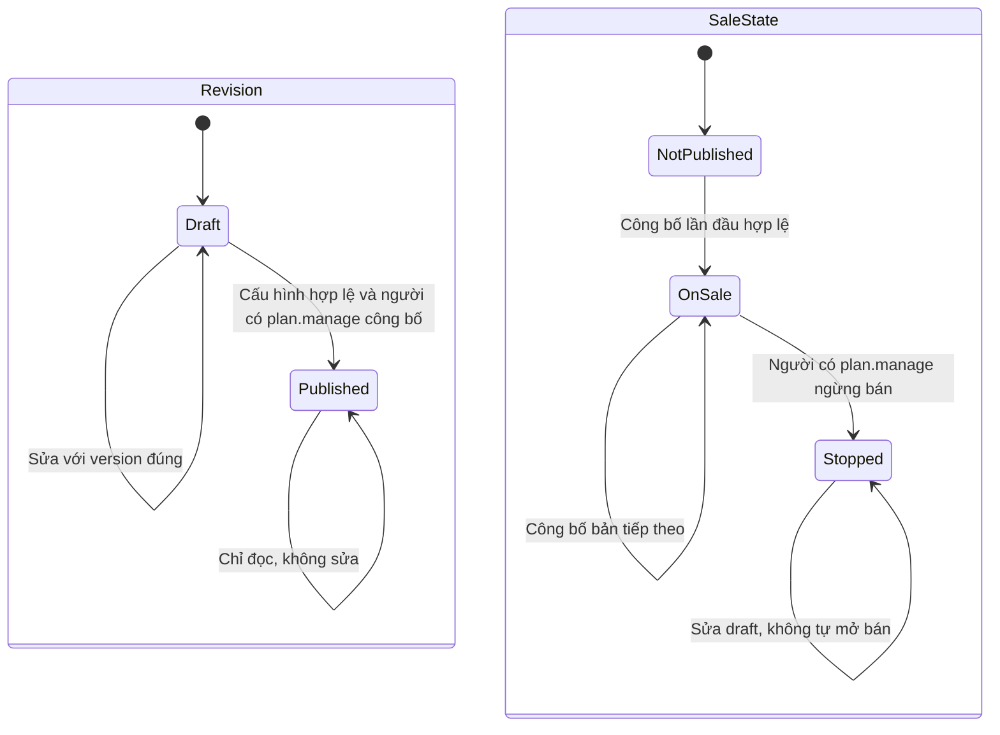
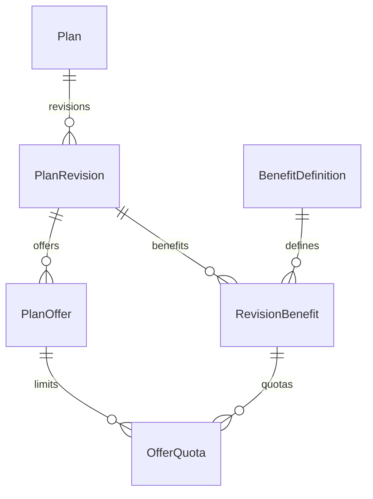

<!-- HƯỚNG DẪN CHO AI KHI ĐIỀN HOẶC CHỈNH SỬA MẪU
- Đọc toàn bộ mẫu, các comment hướng dẫn và tài liệu nguồn được cung cấp trước khi viết. Tuân thủ các quy tắc nghiệp vụ, điều kiện, ngoại lệ và giới hạn đã được xác nhận.
- Không bịa, tự chế hoặc suy đoán thành sự thật: yêu cầu, quy tắc, số liệu, API, schema, mã lỗi, nguồn tham khảo, người phụ trách và kết quả kiểm thử phải có căn cứ. Nội dung ví dụ trong mẫu không phải dữ kiện của dự án.
- Khi thiếu thông tin hoặc các nguồn mâu thuẫn, hỏi người dùng để làm rõ; giữ nguyên placeholder ở phần chưa xác định. Không tự chọn đáp án, lấp chỗ trống hay tuyên bố tài liệu đã hoàn tất.
- Chỉ thay nội dung cần điền hoặc được yêu cầu sửa. Không tự mở rộng phạm vi, sửa nghĩa quy tắc, bỏ điều kiện/ngoại lệ, xoá hay ghi đè nội dung hợp lệ đã có.
- Giữ nguyên tên, cấp và thứ tự heading, nhãn in đậm, tiền tố bullet, cấu trúc danh sách, tên/thứ tự/số cột bảng và cú pháp code fence. Không dịch, đổi tên, gộp hoặc thêm mục ngoài cấu trúc mẫu.
- Chỉ lặp khối luồng, AC hoặc API theo đúng khuôn khi có căn cứ; chỉ bỏ phần tuỳ chọn khi hướng dẫn riêng của mẫu cho phép và đã xác định không áp dụng.
- Mã tham chiếu và section phải trỏ tới tài liệu có thật đã được cung cấp hoặc kiểm chứng. Không giữ mã ví dụ như tham chiếu thật và không tự tạo tài liệu liên quan để hợp thức hoá liên kết.
- Giữ các comment hướng dẫn trong file. Xuất Markdown UTF-8, mỗi file một tài liệu; không bọc toàn bộ file trong code fence, không chèn lời dẫn hay giải thích ngoài mẫu.
- Trước khi bàn giao, đối chiếu nội dung với nguồn, kiểm tra cấu trúc, giá trị cho phép, giới hạn độ dài và tính nhất quán của mã/tham chiếu. Báo rõ phần chưa đủ thông tin; không tuyên bố đã chạy test hoặc import khi chưa thực hiện.
-->

<!-- Thay mã TDD-001 và nội dung ví dụ; giữ nguyên heading và nhãn in đậm.
Sơ đồ dùng mermaid, plantuml hoặc URL. Giữ heading Architecture, Sequence Diagram, Activity Diagram, State Diagram, Data Model.
Ví dụ API phải có heading trùng METHOD /path trong Endpoints. Xoá phần API/sơ đồ không dùng.
Version, Updated At và Change Log do lịch sử phiên bản quản lý, để trống khi nhập mới.
Author/Reviewer là tên hiển thị; gán tài khoản, phê duyệt, giả định và câu hỏi mở trên giao diện sau import.
Thiết kế phải truy vết về Story và Business Rule được cung cấp. Phân biệt thiết kế đề xuất với implementation đã kiểm chứng; không mô tả API/schema/sơ đồ ví dụ như hệ thống thật hoặc tự quyết định nghiệp vụ còn thiếu.
BẮT BUỘC KHI HOÀN THIỆN MẪU: phải có cả Reviewer và Approver, mỗi tên 1–200 ký tự sau khi bỏ khoảng trắng đầu/cuối. Không xoá hai dòng metadata, để trống, dùng tên bịa hoặc giữ placeholder rồi coi là hoàn tất.
Nếu chưa biết người review hoặc người phê duyệt, phải hỏi người dùng và báo tài liệu chưa đủ thông tin; không tự lấy Author/Owner làm người thay thế. Tên trong file không tự gán tài khoản hoặc xác nhận đã duyệt; gán thành viên trên giao diện sau import.
Đây là yêu cầu hoàn thiện mẫu; backend hiện vẫn nhận file cũ thiếu hai trường để tương thích.

VALIDATION CHO FILE NHẬP (đối chiếu ImportSnapshotValidator, MarkdownParser và ImportService):
- Mỗi file .md UTF-8 không rỗng chỉ có một heading cấp 1 chứa mã tài liệu dài 1–100 ký tự. Mã không được trùng trong cùng lần nhập hoặc thuộc loại tài liệu khác đã tồn tại.
- Không dùng tên README.md hoặc sitemap.md vì importer bỏ qua. Giao diện nhận .md/.zip, tối đa 2.000 file, tổng file tải lên 31 MiB; API giới hạn request 32 MiB và tổng nội dung đọc/giải nén 64 MiB.
- Chỉ nhập đè tài liệu cùng loại đang Draft, chưa có phiên bản và chưa lưu trữ. Import thay toàn bộ nội dung bản nháp, vì vậy phải giữ lại nội dung hợp lệ ngoài phần được yêu cầu sửa.
- Không dùng Status trong Markdown hoặc tên Approver để tự xác nhận phê duyệt; import không cấp quyền hay gán tài khoản từ tên. Chạy Kiểm tra file và xử lý lỗi/cảnh báo trước khi nhập.
- Giới hạn độ dài bên dưới tính theo string.Length của .NET (đơn vị UTF-16); không tự cắt ngắn dữ kiện quan trọng để vượt validation, hãy viết lại có căn cứ hoặc hỏi người dùng.
- Feature tối đa 300 ký tự và được dùng làm tiêu đề tài liệu. Status được parser nhận: Draft / In Review / Approved / Deprecated; tài liệu nhập mới vẫn có trạng thái phê duyệt Draft.
- Endpoint: đường dẫn tối đa 500 ký tự; tên/mô tả endpoint được lưu trong Name tối đa 300. HTTP method: GET / POST / PUT / PATCH / DELETE / HEAD / OPTIONS.
- Error Codes: mã tối đa 100 ký tự, không trùng trong tài liệu; giữ dạng - **CODE** (400): mô tả. HTTP status trong Error Codes và Response phải là số nguyên đọc được bằng Int32; không tự đặt status khác hợp đồng API.
- URL sơ đồ tối đa 1.000 ký tự. Mục sơ đồ được sử dụng phải có khối mermaid/plantuml hoặc URL theo mẫu; không để một mục sơ đồ rỗng. Nhãn mục được tách từ bullet như tên External API Fields tối đa 300 ký tự.
- Heading Examples phải khớp METHOD /path ở Endpoints. Giữ các nhãn Request:, Response 200: (thay mã theo contract) và Error Response: để parser tách đúng dữ liệu.
- Tham chiếu dạng DOC-KEY/section: ghi chú: mã đích tối đa 100 ký tự, section tối đa 100, ghi chú tối đa 1.000. Không trùng bộ mã đích + section + loại liên kết trong cùng tài liệu.
ĐỐI CHIẾU FORM TDD (src/features/tdds/validations.ts; form có thể chặt hơn import):
- Điền Feature, Author, Reviewer, Problem và ít nhất một Goal; các Goal/Non-goal/Notes đã thêm không được rỗng. API đã khai báo phải có endpoint và mô tả/mục đích; Fields phải có tên và ý nghĩa; Error Codes phải có mã, HTTP status và điều kiện.
- Form còn kiểm tra Version, Updated At và nội dung Change Log khi khai báo; với file nhập mới, giữ các trường lịch sử này trống theo hợp đồng import, không tự tạo dữ liệu lịch sử.
-->

# TDD-SUB-001

## Document Info

- **Feature**: Danh mục gói, cấu hình quyền lợi và phiên bản công bố
- **Author**: Codex
- **Reviewer**: Tân Trần
- **Approver**: Tân Trần
- **Status**: Draft
- **Version**:
- **Updated At**:

## Context & Goals

### Problem

**Cập nhật hợp đồng khi bổ sung thanh toán:** TDD-PAY-001/Data Model mở rộng PlanOffer thành OfferKey Month/Year cho gói thiết kế và một lựa chọn giá cho gói giám sát, giá giám sát theo revision và giá thanh toán nguyên VNĐ. Từ 25/09/2026, mã lựa chọn giá của gói giám sát đổi từ `Project` thành `ConstructionSite` vì gói giám sát gắn với công trình, không gắn với bản dự toán. API danh mục phải hỗ trợ cấu hình/công bố offer `ConstructionSite` để checkout giám sát có nguồn giá thật. Snapshot của đơn được chốt lúc tạo, không lúc cấp (BR-PAY-001). Xem [bàn giao thiết kế mới](../discovery/payment-technical-design.md). Các phần còn lại giữ làm nguồn thiết kế; nội dung bị thay phải đọc theo TDD mới trước khi triển khai.

**Cập nhật 25/09/2026 theo nghiệp vụ đã chốt:**
- Gói giám sát không dùng danh mục quyền lợi. Gói được Công bố khi có tên, giá VNĐ lớn hơn 0 ở lựa chọn `ConstructionSite` và mô tả dịch vụ tự do có nội dung (BR-SUB-008 khoản 7, BR-SUB-004 khoản 5, STORY-SUB-002/AC-027). Mô tả được chốt theo đơn như nội dung tư vấn. Điều kiện "ít nhất một quyền lợi" chỉ áp dụng cho gói thiết kế.
- Quyền cấu hình gói là mã `plan.manage`. Policy kiểm theo mã quyền, không theo tên hay mã vai trò; mã này không gắn phân công.
- STORY-SUB-002/AC-001, AC-015, AC-016 không nghiệm thu đợt này theo BR-SUB-008 khoản 12. TDD này không thiết kế cấu hình quyền dạng mức hoặc kiểm tra sử dụng quyền bật/tắt; danh mục thiết kế không giới hạn đúng ba quyền.

Tài liệu này đề xuất các bảng và API để lưu giá tháng/năm, hai hạn mức sử dụng và các quyền bật/tắt hiển thị của gói thiết kế, cùng giá và mô tả của gói giám sát. Khi người có quyền sửa gói, khách đã mua phải giữ nguyên quyền lợi hoặc mô tả đã chốt.

Hiện trạng code đã kiểm tra ngày 25/09/2026: đã có migration `PlanCatalog`, `PlanApi` với các route quản trị gắn policy `plan.manage`, và `PlanConfigurationPolicy`. Phần gói giám sát theo quyết định 25/09 đã có trong code ở commit `182e2a8` trên nhánh `feature/construction-site` của `bmt-be`: hằng `OfferKeys.ConstructionSite`, cột `OfferKey` dài 24 ký tự, và `PlanConfigurationPolicy` có nhánh riêng cho gói giám sát — từ chối quyền lợi và nội dung tư vấn, công bố cần mô tả dịch vụ (`PlanDescriptionRequired`), không xét điều kiện "ít nhất một quyền lợi".

Nguồn hiện hành là STORY-SUB-002/AC-025, AC-026, AC-027 và quyết định cuối hội thoại: chỉ `design.generate` và `catalog.detail` có logic sử dụng. Mọi quyền khác là Boolean để cấu hình/hiển thị. Không lấy các AC/ST lịch sử về bậc, ba quyền cố định, kiểm tra AI theo 3D hoặc mức tính năng làm yêu cầu hiện hành. Tư vấn có mô tả tự do, giữ cam kết theo kỳ đã mua.

### Goals

- Tách định nghĩa quyền hệ thống, bản nháp và bản công bố bất biến; kỳ sử dụng tham chiếu đúng phiên bản.
- Hai lựa chọn tháng/năm có giá và hạn mức riêng; Boolean chung trong cùng phiên bản gói.
- Kiểm tra giá VND dương, hạn mức ít nhất 1 hoặc không giới hạn; không công bố gói thiết kế có danh sách quyền rỗng.
- Gói giám sát chỉ có một lựa chọn giá `ConstructionSite`, không có quyền lợi hay hạn mức; chỉ công bố khi có tên, giá và mô tả dịch vụ có nội dung.
- Lưu/công bố/ngừng bán có kiểm soát đồng thời và phân quyền theo mã `plan.manage`; không có bậc gói hoặc tự cấp gói.

### Non-goals

- Thanh toán, hoàn tiền, khuyến mãi, gia hạn tự động, giao dịch cấp gói thủ công. Luồng mua và cấp gói theo TDD-PAY-001.
- Logic sử dụng của 3D/tư vấn/các quyền hiển thị; cấu hình quyền dạng mức và kiểm tra sử dụng quyền bật/tắt (STORY-SUB-002/AC-001, AC-015, AC-016 không nghiệm thu đợt này); chức năng chỉnh sửa và tính năng đã hoãn.
- Danh mục quyền lợi, lượt hoặc bộ đếm cho gói giám sát.
- Tự quyết định danh sách các quyền quảng cáo bổ sung hoặc số tiền/hạn mức bán ban đầu.

## Architecture

Giữ cách chia tầng hiện có của backend: API nhận yêu cầu, handler điều phối, lớp nghiệp vụ kiểm tra quy tắc và lớp lưu trữ làm việc với database. Đây là cách tổ chức theo Clean Architecture. Lệnh thay đổi dữ liệu và truy vấn chỉ đọc được tách riêng theo CQRS. Các lớp dưới đây đều là thiết kế dự kiến.

Trong tài liệu, “phiên bản bất biến” nghĩa là bản đã công bố không được sửa hoặc xóa. “Giao dịch database” (transaction) là nhóm thay đổi phải cùng được lưu thành công (commit), hoặc cùng bị hoàn tác khi lỗi (rollback).

**Các kỹ thuật được sử dụng trong thiết kế**:

Các kỹ thuật dưới đây phục vụ quản lý danh mục gói, giữ cấu hình đã bán và tránh hai người ghi đè thay đổi của nhau. Đây là thiết kế đề xuất, chưa có kết quả triển khai hoặc chạy kiểm thử.

| Kỹ thuật | Mục đích trong TDD này |
|---|---|
| 1. Chia tầng và CQRS | Tách API, điều phối, quy tắc nghiệp vụ, lưu trữ; tách lệnh ghi khỏi truy vấn đọc. |
| 2. Phiên bản bất biến — immutable revision | Giữ nguyên cấu hình khách đã mua dù Admin sửa gói về sau. |
| 3. Bản nháp và con trỏ công bố | Sửa nháp mà không đổi website; mỗi gói chỉ chọn một phiên bản để hiển thị. |
| 4. Database transaction | Công bố cấu hình và đổi phiên bản hiện hành cùng thành công hoặc cùng hoàn tác. |
| 5. Optimistic concurrency | Dùng expectedVersion để phát hiện yêu cầu dựa trên bản dữ liệu cũ. |
| 6. Pessimistic locking | Khóa Plan trong giao dịch để các thao tác ghi cùng gói được xử lý lần lượt. |
| 7. Kiểm tra cấu hình và ràng buộc database | Ngăn giá/hạn mức sai, mã trùng hoặc cấu hình tham chiếu sai. |
| 8. Kiểm soát chuyển trạng thái — state machine | Chỉ cho lưu nháp, công bố và ngừng bán theo các bước đã chốt. |
| 9. Xác thực và phân quyền theo mã `plan.manage` | Chỉ người có phiên hợp lệ và mã quyền `plan.manage` được sửa danh mục. |
| 10. Truy vấn chỉ đọc và chỉ mục | Đọc đúng dữ liệu cần hiển thị, hỗ trợ truy vấn và tránh đưa bản nháp ra website. |

**1. Chia tầng và CQRS — tách nơi xử lý từng việc**:

API nhận dữ liệu và kiểm tra quyền; validator kiểm đầu vào; handler điều phối; PlanConfigurationPolicy kiểm quy tắc; IPlanStore đọc/ghi database. CQRS ở đây nghĩa là tách lệnh thay đổi dữ liệu khỏi truy vấn chỉ đọc, không phải tách thành hai database hoặc thêm hệ thống sự kiện.

Ví dụ PublishPlanHandler kiểm và công bố gói, còn GetPublishedPlansHandler chỉ đọc danh sách đang bán. Việc đọc website không được làm phát sinh bản nháp hoặc cấp quyền cho khách. Cách chia này giúp unit test quy tắc mà không cần gọi HTTP; kiểm chứng transaction vẫn phải dùng PostgreSQL thật.

**2. Phiên bản bất biến — immutable revision, snapshot bằng tham chiếu**:

PlanRevision cùng RevisionBenefit, PlanOffer và OfferQuota lưu một bản cấu hình đầy đủ. Sau công bố, không sửa hoặc xóa bản đó. Kỳ mua tham chiếu phiên bản đã chốt, thay vì luôn đọc cấu hình đang bán mới nhất.

Ví dụ R1 có 5 lượt và khách A đã mua. Admin tạo R2 có 10 lượt thì A vẫn dùng R1; khách mua R2 nhận cấu hình mới. `DesignPeriod` thuộc [TDD-SUB-002](TDD-SUB-002.md#data-model), còn `SupervisionGrant` thuộc [TDD-SUB-004](TDD-SUB-004.md#data-model); cả hai tham chiếu PlanRevision được định nghĩa trong TDD này.

Kiểm tra trước SaveChanges phải chặn sửa/xóa bản Published và thêm/sửa/xóa dữ liệu cấu hình con (`PlanOffer`, `RevisionBenefit`, `OfferQuota`). `ApplicationDbContext` kiểm tra trạng thái đã lưu trong database cho cả `SaveChanges` và `SaveChangesAsync`; không tin giá trị State do bên gọi vừa gán. `PlanConfigurationStore.ReplaceConfigurationAsync` cũng phải đi qua kiểm tra này khi thay cấu hình bản nháp. Không dùng SQL trực tiếp để bỏ qua kiểm tra. Đây là bảo vệ trong đường ghi ứng dụng, không tự ngăn tài khoản quản trị database sửa dữ liệu trực tiếp.

**3. Bản nháp và con trỏ công bố — draft/publish**:

Admin sửa phiên bản Draft. Website đọc `Plan.PublishedRevisionId` để chọn đúng một phiên bản đang công bố của gói OnSale. Bản nháp mới sao chép từ bản công bố hiện tại, nên việc sửa nháp không làm đổi quyền đã cấp hoặc nội dung website.

Ví dụ PublishedRevisionId=R1, Admin đang sửa R2 Draft thì website vẫn đọc R1. Khi công bố R2 thành công, con trỏ chuyển sang R2. R1 vẫn là bản đã công bố và được giữ lại; không trả tất cả revision Published như nhiều lựa chọn gói. Mỗi Plan có tối đa một bản Draft theo ràng buộc database.

**4. Database transaction — công bố trọn vẹn**:

Khi công bố, việc kiểm cấu hình, chốt Draft thành Published, đổi PublishedRevisionId và cập nhật Version của Plan phải diễn ra trong cùng giao dịch. Lỗi giữa chừng thì hoàn tác toàn bộ, website tiếp tục đọc cấu hình trước đó.

Ví dụ ghi được trạng thái Published nhưng đổi con trỏ lỗi: không để database ở trạng thái công bố dở dang. Các lệnh dùng ITransactionalRequest và cùng DbContext/UoW theo [TDD-SUB-002, Architecture](TDD-SUB-002.md#architecture). Transaction công bố không cập nhật kỳ mua hoặc bộ đếm sử dụng của khách.

**5. Optimistic concurrency — kiểm tra phiên bản dữ liệu**:

Client gửi expectedVersion là Plan.Version tại lúc Admin đọc dữ liệu. Trong giao dịch, handler kiểm tra giá trị đó với Version hiện tại; khớp thì mới sửa và tăng Version. Không khớp thì trả 409 PlanVersionConflict, không tự ghi đè thay đổi của người khác.

Ví dụ hai Admin cùng đọc Version=4. Người A lưu trước làm Version=5; người B còn gửi expectedVersion=4 bị từ chối và phải tải lại trước khi quyết định sửa tiếp. Version là số kiểm soát cập nhật của Plan; PlanRevision.Number là số phiên bản cấu hình, không dùng thay nhau.

**6. Pessimistic locking — khóa Plan trong lúc ghi**:

Store lấy khóa bản ghi Plan bằng SELECT ... FOR UPDATE trong transaction, sau đó kiểm expectedVersion và thực hiện lưu nháp/công bố/ngừng bán. Khóa được nhả khi giao dịch kết thúc. Thứ tự xử lý là lấy khóa, đọc dữ liệu hiện tại, kiểm version và điều kiện, ghi rồi commit.

Hai yêu cầu công bố cùng bản nháp không được cùng đi qua bước kiểm tra rồi tạo hai kết quả khác nhau. Khóa buộc chúng xử lý lần lượt; kiểm version làm yêu cầu thứ hai nhận ra dữ liệu đã đổi. Khóa không thay thế version: nó chỉ bảo vệ lúc đang ghi, không phát hiện một màn hình Admin đã mở từ lâu. Không giữ khóa trong suốt thời gian người dùng đang sửa biểu mẫu.

**7. Kiểm tra cấu hình và ràng buộc database — bảo vệ ở hai lớp**:

Validator và policy kiểm tra toàn cấu hình: mã quyền được phép, không trùng, đúng kiểu, có giá/hạn mức theo từng chu kỳ. Ví dụ quota hữu hạn bằng 0 bị từ chối; Boolean không được có hạn mức lượt. Draft có thể chưa có quyền, nhưng công bố gói thiết kế thì phải có ít nhất một quyền hợp lệ.

Gói giám sát đi nhánh kiểm tra riêng vì không dùng danh mục quyền lợi. Policy từ chối mọi quyền lợi, hạn mức hoặc nội dung tư vấn gửi kèm gói giám sát, kể cả khi lưu nháp. Bản nháp giám sát được để trống mô tả; khi công bố, policy bắt `Description` có ít nhất một ký tự không phải khoảng trắng và giá `ConstructionSite` lớn hơn 0. Ví dụ bản nháp chỉ có tên và giá thì lưu được, nhưng công bố nhận 422 `PlanDescriptionRequired`; nhập mô tả "6 buổi kỹ sư kiểm tra tại công trình" rồi công bố lại thì thành công dù gói không có quyền lợi nào (STORY-SUB-002/AC-027).

Database bổ sung PK/FK/UNIQUE/CHECK và chỉ mục duy nhất có điều kiện. Ví dụ UNIQUE(PlanId,Number) chặn trùng số phiên bản; khóa ngoại ghép chặn Plan trỏ phiên bản của gói khác; chỉ mục có điều kiện chặn nhiều Draft cùng Plan. CHECK kiểm giá dương và hạn mức hợp lệ, nhưng không thay thế việc kiểm cấu hình gồm nhiều bảng.

Mô tả được lưu dạng văn bản thuần; frontend mã hóa ký tự khi hiển thị. Giới hạn độ dài ở phần Notes là đề xuất kỹ thuật, không tự cắt dữ liệu hoặc coi đó là nghiệp vụ đã duyệt.

**8. State machine — giới hạn các bước chuyển trạng thái**:

Phiên bản đi từ Draft sang Published; Published chỉ đọc. Trạng thái bán của Plan đi từ NotPublished sang OnSale rồi có thể sang Stopped. Công bố phiên bản tiếp theo của gói đang bán vẫn giữ OnSale.

Ví dụ gói đã Stopped thì sửa nháp không làm gói tự xuất hiện lại. API chưa cho công bố từ Stopped vì nghiệp vụ mở bán lại chưa chốt. Hai loại trạng thái có mục đích khác nhau: State của revision nói cấu hình đã công bố chưa; SaleState nói gói còn bán không. Ngừng bán không thu hồi quyền của kỳ đã cấp.

**9. Xác thực và phân quyền theo mã `plan.manage`**:

Mọi API quản trị gói yêu cầu phiên xác thực hợp lệ theo chính sách mặc định và claim `perm` có mã `plan.manage`. Policy kiểm theo mã quyền, không theo tên hay mã vai trò. Vai trò hệ thống `admin` có mã này qua dữ liệu khởi tạo `RolePermission`; nếu sau này mã được gắn cho vai trò khác thì người giữ vai trò đó cũng thao tác được. Mã này không gắn phân công theo BR-RBAC-010 khoản 4. Handler kiểm tra thêm tài khoản chưa bị xóa. Không lấy cờ Admin hoặc accountId do client tự gửi làm căn cứ.

Ví dụ khách hàng, hoặc nhân viên không có `plan.manage`, gọi trực tiếp API publish vẫn nhận 403 dù giao diện đã ẩn nút công bố. API đọc gói đang bán cho khách không yêu cầu đăng nhập; API quản trị vẫn phải có quyền. Đây là phân quyền quản trị danh mục, không phải cấp quota cho tài khoản quản trị.

**10. Truy vấn chỉ đọc và chỉ mục**:

Truy vấn website chỉ chọn các cột cần thiết từ gói OnSale và phiên bản được PublishedRevisionId chỉ tới. EF không cần theo dõi thay đổi của các bản ghi chỉ dùng để trả dữ liệu. Chỉ mục theo trạng thái/loại gói/Id và theo PlanId/State hỗ trợ các truy vấn đã nêu ở Data Model.

Ví dụ Admin ngừng bán thì lần đọc database tiếp theo không trả gói đó trong danh sách mua mới. Thiết kế chưa cache danh sách công khai; nếu thêm cache phải có cách loại bỏ dữ liệu cũ. Chỉ mục là đề xuất dựa trên đường đọc, chưa có số liệu đo hiệu năng để khẳng định mức cải thiện.

| Tầng | Thành phần | Trách nhiệm |
|---|---|---|
| contract | `services/plan/{Command,Query,Response}.cs`, validators | Định nghĩa dữ liệu gửi/nhận (DTO) và kiểm tra đầu vào; lệnh ghi dữ liệu có `ITransactionalRequest` |
| presentation | `apis/plan/PlanApi.cs` | API v1 dùng Carter; mọi route quản trị phải có phiên xác thực hợp lệ và mã quyền `plan.manage` |
| application | `SavePlanDraftHandler`, `PublishPlanHandler`, `StopSellingPlanHandler`, `GetPublishedPlansHandler` | Điều phối xử lý, tạo dữ liệu trả về và kiểm tra phiên bản dữ liệu; quyền đã được policy ở endpoint kiểm |
| domain | `Plan`, `PlanRevision`, `BenefitDefinition`, `PlanConfigurationPolicy` | Kiểm tra các điều kiện cấu hình luôn phải đúng và các bước chuyển trạng thái; tách nhánh kiểm tra gói thiết kế và gói giám sát |
| persistence | `IPlanStore` adapter dùng `ApplicationDbContext` trong cùng phạm vi xử lý | Khóa bản ghi gói khi ghi, kiểm tra ràng buộc/khóa ngoại và chọn các cột cần đọc |



**Notes**:
- Không thêm microservice, broker, Redis quota hoặc kiến trúc đa tổ chức. `AccountId` ánh xạ `User.Id` đã có, không tự tạo Organization.
- Định nghĩa quyền do code/seed quản lý, không có API Admin tạo định nghĩa. `UsageKind` chỉ là `DesignGeneration`, `TemplateDetail` hoặc `None`; Boolean luôn None. Client không được gửi/chỉnh trường này.
- Hiện biết ba mã: `design.generate`, `catalog.detail`, `design.render3d`; danh mục có thể bổ sung Boolean sau khi tên được chốt. Không coi seed ba mã là ràng buộc chỉ có ba quyền. Tư vấn giữ `ConsultationText`; nếu danh mục có mục tư vấn thì Boolean chỉ là hiển thị, không thay text bằng enum mức.
- Danh mục quyền lợi chỉ phục vụ gói thiết kế. Gói giám sát dùng `Description` làm mô tả dịch vụ tự do; `ConsultationText` của gói giám sát phải là chuỗi rỗng để không có hai chỗ mô tả dịch vụ. Giá trị `Scope=Supervision` của `BenefitDefinition` vẫn nằm trong CHECK hiện có nhưng không có định nghĩa nào dùng; không đổi schema chỉ để bỏ giá trị này.
- Trả Boolean cả true/false, không tự chọn UI ẩn hàng false hay hiển thị dấu gạch: quyết định trình bày còn mở, DTO bảo toàn giá trị.
- Mô tả lưu dưới dạng văn bản thuần; frontend phải mã hóa ký tự khi hiển thị để không thực thi mã HTML/script. Giới hạn kỹ thuật đề xuất: tên 200, mã 100, mô tả 4.000 ký tự. Đầu vào quá dài bị từ chối, không âm thầm cắt ngắn. Đây là giới hạn API đề xuất, chưa phải cam kết sản phẩm đã duyệt.
- API quản trị dùng `.RequireAuthorization()` cho chính sách xác thực mặc định, cộng policy theo mã quyền `plan.manage` thay vì `RequireRole(Admin)` của bản trước. Lý do đổi: cột `User.Role` kiểu chuỗi đã bị bỏ theo [TDD-RBAC-001](TDD-RBAC-001.md#data-model), và một người nay giữ được nhiều vai trò nên kiểm theo vai trò không còn là cách đúng. Mã `plan.manage` đã có trong code (`PermissionNames.PlanManage`), được thêm vào danh mục `Permission` và gắn cho vai trò hệ thống `admin` ở migration `PlanCatalog`. Mã này nằm ngoài chín mã khởi tạo và không gắn phân công (BR-RBAC-010 khoản 4). Handler kiểm tra thêm User chưa bị xóa. Không lấy tài khoản/vai trò do client tự khai trong nội dung yêu cầu làm căn cứ.
- Không dùng lớp Entity có cơ chế xóa mềm cho bản công bố và dữ liệu theo dõi lượt. Trước `SaveChanges`, phải kiểm tra và từ chối sửa/xóa phiên bản Published hoặc cấu hình con của nó. Thay đổi gói bằng bản nháp mới; không dùng `ExecuteUpdate` hoặc SQL trực tiếp để bỏ qua kiểm tra. Kiểm thử tích hợp trên PostgreSQL phải kiểm chứng đường ghi này. Kiểm tra trong ứng dụng không ngăn được quản trị viên sửa SQL trực tiếp, nên quyền ghi database phải quản lý riêng. Cơ chế bảo vệ nằm tại `ApplicationDbContext.SaveChanges`/`SaveChangesAsync`; các đường ghi cấu hình vẫn phải lấy khóa Plan trong transaction theo quy trình ở trên.

## Sequence Diagram

```mermaid
sequenceDiagram
    actor A as Người có plan.manage
    participant API as PlanApi
    participant H as PublishPlanHandler
    participant DB as PostgreSQL
    A->>API: POST publish với expectedVersion
    API->>H: Kiểm phiên và mã plan.manage, gửi lệnh ghi trong giao dịch
    H->>DB: Khóa Plan FOR UPDATE
    H->>H: Kiểm version, draft, giá; thiết kế kiểm quyền và chu kỳ, giám sát kiểm mô tả
    alt Không hợp lệ
        H-->>API: Báo lỗi trước khi ghi hoặc hoàn tác thay đổi
    else Hợp lệ
        H->>DB: Chuyển bản nháp sang Published và cập nhật PublishedRevisionId
        H->>DB: Lưu toàn bộ thay đổi trong một giao dịch
        H-->>API: RevisionId + version mới
    end
```

## Activity Diagram



## State Diagram



Chưa cung cấp thao tác mở bán lại vì nghiệp vụ này chưa chốt. Khi gói đang Stopped, người có `plan.manage` có thể sửa bản nháp nhưng chưa được gọi API công bố; sửa nháp không thay đổi dữ liệu khách đang dùng hoặc tự đưa gói lên website. Hai máy trạng thái này dùng chung cho gói thiết kế và gói giám sát.

## Data Model

Các model dưới đây mô tả danh mục gói và cấu hình được bán. Migration `PlanCatalog` đã tạo các bảng này trong code; phần thay đổi cho gói giám sát theo quyết định ngày 25/09/2026 (mã `ConstructionSite`, độ dài `OfferKey`, quy tắc công bố) đã có trong code và migration `20260925074152_ConstructionSiteAndPackageAssignment`.

| Model | Ý nghĩa và mục đích | Quan hệ với model khác |
|---|---|---|
| `BenefitDefinition` | Định nghĩa một loại quyền mà hệ thống hỗ trợ, gồm mã, tên và dạng giá trị. Ví dụ: tạo thiết kế, tra cứu mẫu hoặc bật/tắt hiển thị 3D. Model này không chứa số lượt riêng của từng gói. | Được `RevisionBenefit` tham chiếu khi đưa quyền vào một phiên bản gói. |
| `Plan` | Đại diện cho một gói xuyên suốt các lần thay đổi cấu hình, đồng thời quản lý trạng thái bán. | Có nhiều `PlanRevision`; `PublishedRevisionId` chọn duy nhất phiên bản công bố dùng để hiển thị khi gói đang bán. |
| `PlanRevision` | Lưu một phiên bản cấu hình của gói, gồm tên, mô tả và nội dung tư vấn. Với gói giám sát, `Description` là mô tả dịch vụ tự do được chốt theo đơn. Sau khi công bố, phiên bản không được sửa để giữ nguyên cam kết với khách đã mua. | Thuộc một `Plan`; có các `PlanOffer` và `RevisionBenefit`. Kỳ thiết kế hoặc gói giám sát đã cấp tham chiếu đúng phiên bản đã chốt. |
| `PlanOffer` | Lưu một lựa chọn mua và giá tương ứng của một phiên bản gói. Gói thiết kế bán theo tháng hoặc năm; gói giám sát bán theo công trình với mã lựa chọn `ConstructionSite`. | Thuộc `PlanRevision`; mỗi lựa chọn mua của gói thiết kế có các dòng `OfferQuota` riêng. Gói giám sát chỉ có một lựa chọn mua và không có `OfferQuota`. |
| `RevisionBenefit` | Ghi nhận một quyền có trong phiên bản gói thiết kế, nội dung hiển thị và cấu hình bật/tắt nếu là quyền Boolean. | Nối `PlanRevision` với `BenefitDefinition`. Quyền tính lượt lấy hạn mức theo chu kỳ từ `OfferQuota`. Phiên bản gói giám sát không có dòng nào ở bảng này. |
| `OfferQuota` | Lưu hạn mức cấu hình của một quyền tính lượt cho một lựa chọn tháng hoặc năm; có thể hữu hạn hoặc không giới hạn. Đây là hạn mức của gói, chưa phải số lượt khách đã dùng. | Thuộc `PlanOffer` và quyền tương ứng trong `RevisionBenefit`; làm căn cứ cấp `PeriodQuota` khi tạo kỳ mua. |

**Định nghĩa và mục đích của `PlanRevision`**:

`PlanRevision` là một phiên bản cấu hình của gói, dùng để xác định chính xác khách đã mua cấu hình nào và giữ nguyên cam kết đó khi Admin thay đổi gói sau này. `Plan` xác định gói là gì; `PlanRevision` xác định nội dung và quyền lợi của gói ở một phiên bản cụ thể.

Một bản cấu hình đầy đủ gồm `PlanRevision` lưu tên, mô tả, nội dung tư vấn; `RevisionBenefit` lưu các quyền; `PlanOffer` lưu giá của từng lựa chọn mua; `OfferQuota` lưu hạn mức theo chu kỳ của gói thiết kế. Các bản ghi này hợp thành bản chụp cấu hình (snapshot). Hệ thống lưu bản chụp một lần để nhiều kỳ mua cùng tham chiếu, thay vì sao chép toàn bộ cấu hình vào một trường JSON của từng kỳ.

- Khi còn `Draft`, Admin được sửa cấu hình. Sau khi `Published`, phiên bản và cấu hình con không được sửa; thay đổi tiếp theo phải tạo phiên bản mới.
- `DesignPeriod.RevisionId` ghi nhận phiên bản đã chốt cho kỳ mua. `SupervisionGrant.RevisionId` ghi nhận phiên bản của gói giám sát đã cấp. Công bố phiên bản mới không đổi các tham chiếu này.
- `Plan.PublishedRevisionId` chọn phiên bản đang hiển thị trên website của gói đang bán. Các phiên bản cũ chỉ được giữ làm căn cứ cho quyền lợi đã cấp, không xuất hiện thành nhiều lựa chọn mua.
- `PlanRevision` không lưu số lượt khách đã dùng hoặc thời hạn riêng của từng khách. Dữ liệu đó thuộc `PeriodQuota` và `DesignPeriod`.

Ví dụ: khách A mua khi phiên bản 1 có 5 lượt tạo thiết kế. Admin công bố phiên bản 2 có 10 lượt; khách B mua sau đó nhận phiên bản 2. Kỳ của A vẫn tham chiếu phiên bản 1 và giữ hạn mức 5 lượt. Các số này chỉ minh họa, không phải cấu hình kinh doanh đã chốt.

**Các bảng từ tài liệu khác**: `DesignPeriod`, `PeriodQuota` thuộc [TDD-SUB-002, Data Model](TDD-SUB-002.md#data-model); `SupervisionGrant` thuộc [TDD-SUB-004, Data Model](TDD-SUB-004.md#data-model), được bổ sung hủy/khôi phục ở [TDD-SUB-005](TDD-SUB-005.md#data-model) và trạng thái `Completed` ở [TDD-SUB-006](TDD-SUB-006.md#data-model). `User` là bảng tài khoản đã có, cấu hình tại [UserConfiguration](../../bmt-be/src/bmt-be.persistence/configurations/UserConfiguration.cs).

Các kiểu dưới đây dành cho PostgreSQL; C# dùng Guid, DateTimeOffset UTC, decimal và long tương ứng. PK là khóa chính; FK là khóa ngoại; NN là bắt buộc có giá trị; UNIQUE ngăn giá trị trùng; CHECK kiểm tra điều kiện khi ghi. Khóa ngoại ghép gồm nhiều cột. Tên bảng dùng PascalCase như cấu hình EF hiện có. `Limit` là từ khóa dành riêng của PostgreSQL nên khi viết SQL tay phải đặt tên cột này trong nháy kép; EF đã tự trích dẫn các định danh PascalCase. Các khóa ngoại lịch sử dùng `ON DELETE RESTRICT`, nghĩa là không cho xóa bản ghi đang được dữ liệu lịch sử tham chiếu.

| Bảng | Trường và ràng buộc |
|---|---|
| BenefitDefinition | `Id uuid PK`, `Code varchar(100) NN UNIQUE`, `Label varchar(200) NN`, `Kind varchar(16) NN` = Quota/Boolean, `UsageKind varchar(24) NN`, `Scope varchar(16) NN` = Design/Supervision; UNIQUE(Id,Kind) làm đích cho khóa ngoại ghép của RevisionBenefit, UNIQUE(Id,UsageKind) làm đích cho khóa ngoại ghép của UsageOperation trong [TDD-SUB-002](TDD-SUB-002.md#data-model); CHECK Quota chỉ có hai mã thiết kế và UsageKind tương ứng; Boolean UsageKind=None. Code, Kind và UsageKind không đổi sau khi khởi tạo. Không lưu số lượt giám sát. |
| Plan | `Id uuid PK`, `Code varchar(100) NN UNIQUE`, `Kind varchar(16) NN`, `SaleState varchar(16) NN`, `PublishedRevisionId uuid NULL`, `Version bigint NN` bắt đầu 1, `CreatedBy uuid FK User`, `CreatedAtUtc timestamptz NN`; UNIQUE(Id,Kind) làm đích cho khóa ngoại ghép của PlanRevision; không có Rank. |
| PlanRevision | `Id uuid PK`, `PlanId uuid NN FK Plan`, `Kind varchar(16) NN`, `Number int NN`, `State varchar(16) NN` Draft/Published, `Name varchar(200) NN`, `Description text NN`, `ConsultationText text NN`, `CreatedAtUtc timestamptz NN`, `PublishedAtUtc timestamptz NULL`; UNIQUE(PlanId,Number), UNIQUE(PlanId,Id), UNIQUE(Id,Kind) làm đích cho khóa ngoại ghép của PlanOffer; FK(PlanId,Kind) -> UNIQUE(Id,Kind) của Plan để loại gói không lệch giữa hai bảng; tối đa một Draft/Plan bằng partial unique index. Với Kind=Supervision, `Description` là mô tả dịch vụ, được để chuỗi rỗng ở bản nháp nhưng phải có nội dung khi công bố; `ConsultationText` là chuỗi rỗng. Hai điều kiện này do policy kiểm, không đặt CHECK vì bản nháp vẫn được lưu khi chưa có mô tả. |
| PlanOffer | `RevisionId uuid NN FK`, `OfferKey varchar(24) NN` Month/Year/ConstructionSite, `Kind varchar(16) NN`, `Price numeric(20,0) NN CHECK >0`, `Currency char(3) NN CHECK='VND'`; PK(RevisionId,OfferKey), FK(RevisionId,Kind) -> UNIQUE(Id,Kind) của PlanRevision; CHECK Kind=Design chỉ nhận OfferKey Month/Year, Kind=Supervision chỉ nhận OfferKey=ConstructionSite. Gói thiết kế có hai dòng Month và Year; gói giám sát có đúng một dòng ConstructionSite. Giá lưu nguyên đồng VNĐ, từ chối giá lẻ thay vì tự làm tròn. |
| RevisionBenefit | `RevisionId uuid NN FK`, `BenefitId uuid NN FK`, `Kind varchar(16) NN`, `Enabled boolean NULL`, `DisplayText text NN`, `SortOrder int NN`; PK(RevisionId,BenefitId), UNIQUE(RevisionId,BenefitId,Kind) làm đích cho khóa ngoại ghép của OfferQuota. Composite FK(BenefitId,Kind) -> UNIQUE(Id,Kind) của BenefitDefinition; CHECK Boolean có Enabled NOT NULL, Quota có Enabled NULL. Chỉ dùng cho phiên bản gói thiết kế; policy từ chối quyền lợi gửi kèm gói giám sát. Bảng không có cột loại gói nên database không tự chặn nhánh này. |
| OfferQuota | `RevisionId uuid NN`, `Cycle varchar(8) NN`, `BenefitId uuid NN`, `Kind varchar(16) NN CHECK='Quota'`, `IsUnlimited boolean NN`, `Limit bigint NULL`; PK(RevisionId,Cycle,BenefitId), FK(RevisionId,Cycle) -> PlanOffer(RevisionId,OfferKey), FK(RevisionId,BenefitId,Kind) -> UNIQUE(RevisionId,BenefitId,Kind) của RevisionBenefit; CHECK Cycle chỉ nhận Month/Year vì chỉ gói thiết kế có hạn mức; CHECK unlimited => Limit NULL, finite => Limit>=1. |

Khóa ngoại ghép từ `Plan(Id,PublishedRevisionId)` tới `PlanRevision(PlanId,Id)` bảo đảm phiên bản được chọn thuộc chính gói đó. Khi công bố, handler phải kiểm tra phiên bản có trạng thái Published trong cùng giao dịch.

**Tên cột `OfferKey` và `Cycle`**: `PlanOffer.OfferKey` là mã lựa chọn mua, nhận `Month` và `Year` cho gói thiết kế, `ConstructionSite` cho gói giám sát. `ConstructionSite` ở đây là mã lựa chọn giá, không phải ID công trình. Mã này thay `Project` của bản trước và trùng tên bảng công trình ở [TDD-SITE-001](TDD-SITE-001.md), nên không còn phải đổi tên. Cột được nới từ `varchar(8)` lên `varchar(24)` vì `ConstructionSite` dài 16 ký tự. Các bảng phụ thuộc giữ tên `Cycle` và `varchar(8)` vì chúng chỉ áp dụng cho gói thiết kế, nơi lựa chọn mua đúng là một chu kỳ: `OfferQuota.Cycle` trong tài liệu này và `DesignPeriod.Cycle` trong [TDD-SUB-002](TDD-SUB-002.md#data-model). Khóa ngoại ghép nối được hai cột khác tên và khác độ dài, ví dụ `OfferQuota(RevisionId,Cycle)` trỏ tới `PlanOffer(RevisionId,OfferKey)`; PostgreSQL chấp nhận vì cả hai cùng kiểu `varchar`.

**Vì sao lặp cột `Kind` xuống `PlanRevision` và `PlanOffer`**: database cần tự chặn việc cấu hình sai loại, chẳng hạn gắn giá `ConstructionSite` cho gói thiết kế hoặc bán gói giám sát theo tháng. `PlanOffer` không giữ `PlanId` nên không đọc được `Plan.Kind` trực tiếp. Cách xử lý là chép `Kind` xuống từng bảng con, rồi dùng khóa ngoại ghép buộc giá trị chép xuống luôn bằng giá trị gốc: `PlanRevision(PlanId,Kind)` phải khớp `Plan(Id,Kind)`, và `PlanOffer(RevisionId,Kind)` phải khớp `PlanRevision(Id,Kind)`. Nhờ vậy, một CHECK trên chính dòng `PlanOffer` đã đủ để chặn sai loại, không cần truy vấn thêm bảng khác. Ví dụ: nếu ai đó sửa `Plan.Kind` của gói đã có offer, khóa ngoại từ chối ngay vì giá trị chép xuống không còn khớp. Đánh đổi là `Kind` xuất hiện ở ba bảng; bù lại ba nơi không thể lệch nhau, và thiết kế này không có thao tác đổi loại gói sau khi tạo.

Các điều kiện liên quan nhiều bảng — loại gói, phạm vi quyền, đủ lựa chọn tháng/năm và hạn mức tương ứng, gói giám sát không có quyền lợi và có mô tả — phải được kiểm tra trên toàn bộ cấu hình trước khi lưu/công bố. Ràng buộc CHECK của một dòng không thay thế được việc này. Định nghĩa quyền đã cố định thì không được đổi ý nghĩa của phiên bản đã cấp.



**Dữ liệu mẫu để đọc ERD**:

Các bảng sau minh họa dữ liệu của thiết kế, chưa được ghi vào database. Giá, hạn mức, ngày và nội dung đều là ví dụ, không phải cấu hình kinh doanh đã chốt. Mã như `U1`, `P1`, `R1` là tên viết tắt của UUID để dễ theo dõi; cùng mã trong ba TDD chỉ cùng một bản ghi. `NULL` là giá trị rỗng trong database. Chỉ liệt kê các cột cần giải thích; cột bắt buộc không xuất hiện trong bảng mẫu vẫn phải được ghi đầy đủ khi triển khai. Các thời điểm có hậu tố `Z` là UTC, giờ Việt Nam bằng UTC cộng 7 giờ.

Tình huống: gói thiết kế Cơ bản đã công bố hai phiên bản. `R2` là phiên bản đang hiển thị; `R1` còn được kỳ mua cũ tham chiếu. Song song, gói giám sát `P2` đã công bố phiên bản `SR1`; gói giám sát `G1` trong [TDD-SUB-004](TDD-SUB-004.md#data-model) tham chiếu `SR1`.

`BenefitDefinition` — danh mục quyền dùng chung:

| Id | Code | Label | Kind | UsageKind | Scope |
|---|---|---|---|---|---|
| B1 | design.generate | Số phương án thiết kế mới | Quota | DesignGeneration | Design |
| B2 | catalog.detail | Tra cứu thư viện mẫu | Quota | TemplateDetail | Design |
| B3 | design.render3d | Phối cảnh 3D | Boolean | None | Design |

`design.render3d` là mã minh họa cho quyền hiển thị 3D; không bổ sung logic tạo hoặc tính lượt 3D.

`Plan` — danh tính gói và phiên bản hiện hành:

| Id | Code | Kind | SaleState | PublishedRevisionId | Version |
|---|---|---|---|---|---|
| P1 | basic-demo | Design | OnSale | R2 | 4 |
| P2 | supervision-demo | Supervision | OnSale | SR1 | 3 |

`Version` là số kiểm soát cập nhật đồng thời của bản ghi Plan, không phải số phiên bản quyền lợi `PlanRevision.Number`. `P2` có `Version=3` vì đã qua ba lần ghi: tạo gói (1), lưu nháp bổ sung mô tả (2), công bố (3).

`PlanRevision` — các bản cấu hình được giữ lại:

`PlanRevision` lưu nội dung giới thiệu và cấu hình của gói tại một phiên bản cụ thể. `Description` là mô tả chung của gói; `ConsultationText` chỉ mô tả dịch vụ tư vấn offline. Các quyền chi tiết và hạn mức được lưu ở bảng con, không suy ra từ nội dung hai trường văn bản này.

| Id | PlanId | Number | State | Name | Description | ConsultationText | PublishedAtUtc |
|---|---|---|---|---|---|---|---|
| R1 | P1 | 1 | Published | Cơ bản | Gói hỗ trợ tạo phương án thiết kế và tra cứu thư viện mẫu. | Tư vấn online theo lịch hẹn | 2026-09-01T02:00:00Z |
| R2 | P1 | 2 | Published | Cơ bản | Gói hỗ trợ tạo phương án thiết kế và tra cứu thư viện mẫu với hạn mức mới. | Tư vấn theo lịch hẹn, ưu tiên sắp xếp | 2026-09-15T02:00:00Z |
| SR1 | P2 | 1 | Published | Giám sát công trình | 6 buổi kỹ sư kiểm tra tại công trình | (chuỗi rỗng) | 2026-09-05T02:00:00Z |

Cả hai bản của `P1` vẫn có trạng thái `Published` vì đều đã được công bố và không sửa nữa. Website chọn `P1.PublishedRevisionId=R2`, không lấy tất cả dòng Published để hiển thị thành nhiều gói. Nội dung tư vấn là văn bản mô tả dịch vụ offline, không phải cấp quyền theo mức.

`SR1` là phiên bản gói giám sát. `Description` là mô tả dịch vụ tự do, chỉ để hiển thị và được chốt theo đơn; nó không tạo lượt hay bộ đếm. `ConsultationText` là chuỗi rỗng vì gói giám sát không dùng trường này. Trước khi công bố, `SR1` từng là bản nháp có `Description` rỗng: lưu nháp thành công, còn yêu cầu công bố lúc đó bị từ chối với `PlanDescriptionRequired` và không đổi dữ liệu.

`PlanOffer` — giá riêng theo từng lựa chọn mua:

| RevisionId | OfferKey | Kind | Price | Currency |
|---|---|---|---|---|
| R1 | Month | Design | 200000 | VND |
| R1 | Year | Design | 2000000 | VND |
| R2 | Month | Design | 250000 | VND |
| R2 | Year | Design | 2500000 | VND |
| SR1 | ConstructionSite | Supervision | 3000000 | VND |

`P1` là gói thiết kế nên mỗi phiên bản có đúng hai dòng Month và Year. `P2` là gói giám sát nên `SR1` có đúng một dòng `OfferKey=ConstructionSite` với `Kind=Supervision`. Giá 3000000 chỉ để minh họa; giá bán thật do người có `plan.manage` nhập sau.

`RevisionBenefit` — quyền thuộc từng phiên bản:

| RevisionId | BenefitId | Kind | Enabled | DisplayText | SortOrder |
|---|---|---|---|---|---|
| R1 | B1 | Quota | NULL | Tạo phương án thiết kế | 1 |
| R1 | B2 | Quota | NULL | Tra cứu mẫu | 2 |
| R1 | B3 | Boolean | false | Phối cảnh 3D | 3 |
| R2 | B1 | Quota | NULL | Tạo phương án thiết kế | 1 |
| R2 | B2 | Quota | NULL | Tra cứu mẫu | 2 |
| R2 | B3 | Boolean | true | Phối cảnh 3D | 3 |

`OfferQuota` — hạn mức cấu hình theo quyền và chu kỳ:

| RevisionId | Cycle | BenefitId | Kind | IsUnlimited | Limit |
|---|---|---|---|---|---|
| R1 | Month | B1 | Quota | false | 5 |
| R1 | Month | B2 | Quota | false | 20 |
| R1 | Year | B1 | Quota | false | 50 |
| R1 | Year | B2 | Quota | false | 200 |
| R2 | Month | B1 | Quota | false | 10 |
| R2 | Month | B2 | Quota | false | 30 |
| R2 | Year | B1 | Quota | false | 100 |
| R2 | Year | B2 | Quota | true | NULL |

Không có `OfferQuota` cho B3. Hạn mức năm được cấu hình riêng và cấp cho cả kỳ năm, không tự nhân hạn mức tháng với 12. `IsUnlimited=true, Limit=NULL` nghĩa là có quyền không giới hạn; không có dòng quota mới là không được cấp quyền đó. `SR1` không có dòng nào ở cả `RevisionBenefit` lẫn `OfferQuota`.

Đọc một cấu hình theo đường liên kết: `P1 → R2 → (R2, Month) → (R2, Month, B1)` cho biết gói đang bán có giá tháng 250000 VND và 10 lượt tạo. Kỳ đã mua `R1` vẫn đọc quyền của `R1`; dữ liệu sử dụng của khách xem trong [TDD-SUB-002](TDD-SUB-002.md#data-model). Với giám sát, `P2 → SR1 → (SR1, ConstructionSite)` cho biết giá và mô tả dịch vụ đang bán; đơn mua giám sát lưu `RevisionId=SR1` nên mô tả đã chốt không đổi khi có bản công bố sau.

**Notes**:
- Bản nháp có thể chưa có quyền; quyền đã thêm phải hợp lệ. Giá 0/âm bị từ chối cả khi lưu nháp. Từ chối mã quyền lạ hoặc trùng, sai kiểu giá trị, đặt hạn mức cho Boolean hoặc đặt Boolean khác nhau giữa tháng/năm. Không thêm điều kiện “bật 3D phải có quyền tạo thiết kế” vì chưa được chốt và 3D hiện chỉ hiển thị.
- Gói giám sát: lưu nháp và công bố đều từ chối quyền lợi, hạn mức, `ConsultationText` có nội dung hoặc lựa chọn giá khác `ConstructionSite` (422 `PlanConfigurationInvalid`). Công bố cần đúng một dòng `ConstructionSite` có giá > 0 và `Description` có nội dung (422 `PlanDescriptionRequired` khi thiếu mô tả). Không áp điều kiện "ít nhất một quyền lợi" cho gói giám sát. `PlanConfigurationPolicy` kiểm các điều này: lỗi cấu hình gộp vào `PlanConfigurationInvalid` trước, rồi mới xét thiếu mô tả.
- Đợt này không cấu hình mức tính năng và không kiểm tra sử dụng quyền bật/tắt (BR-SUB-008 khoản 12). Cột `BenefitDefinition.Kind` chỉ nhận `Quota`/`Boolean`; khả năng dạng mức chỉ là hướng mở rộng của mô hình chung, không triển khai trong TDD này.
- Không suy “ít nhất một quyền” thành “ít nhất một Boolean=true”. Gói chỉ Boolean hiển thị không cho tạo/tra cứu. Nếu muốn cấm bán gói như vậy thì phải chốt thêm nghiệp vụ, không tự thêm validator.
- Nếu gói không có quyền tạo/tra cứu thì không có dòng OfferQuota tương ứng, không dùng Limit=0. Với Boolean, DTO phân biệt được quyền có giá trị false với quyền không nằm trong gói; cả hai đều không được coi là bật. Cách trình bày trên website vẫn chưa chốt.
- Chỉ mục `IX_Plan_SaleState_Kind_Id` hỗ trợ danh sách website; mã duy nhất hỗ trợ tra cứu; `IX_PlanRevision_PlanId_State` hỗ trợ đọc bản nháp. Truy vấn chỉ lấy cột cần thiết và không theo dõi thay đổi bằng EF. Chưa lưu danh sách công khai trong bộ nhớ đệm để tránh tiếp tục hiển thị gói vừa ngừng bán. Nếu thêm cache sau này phải có cách cập nhật/xóa dữ liệu cũ.
- Khi sửa nháp, công bố hoặc ngừng bán, handler khóa bản ghi Plan rồi so sánh `expectedVersion` do client gửi với `Plan.Version`. Đây là kiểm soát cập nhật đồng thời bằng phiên bản (optimistic concurrency): version cũ bị từ chối với HTTP 409, còn lần cập nhật thành công tăng Version. Hai yêu cầu công bố cùng version chỉ có một yêu cầu thành công. Bản nháp mới sao chép cấu hình đang công bố, không sửa bản cũ; công bố không cập nhật kỳ mua hoặc bộ đếm lượt.
- Giá gói giám sát nằm ở dòng `PlanOffer` có `OfferKey=ConstructionSite` của phiên bản tương ứng, theo phụ lục [TDD-PAY-001, Data Model](TDD-PAY-001.md#data-model). Số tiền cụ thể chưa chốt; không áp giá tháng/năm của thiết kế sang giám sát và không tạo `OfferQuota` cho gói giám sát. Gói giám sát đã cấp theo [TDD-SUB-004](TDD-SUB-004.md#data-model) (gán công trình), [TDD-SUB-005](TDD-SUB-005.md#data-model) (hủy/khôi phục) và [TDD-SUB-006](TDD-SUB-006.md#data-model) (hoàn thành/mở lại); TDD-SUB-003 chỉ còn giá trị tra cứu. Thành phần xác minh giao dịch được thiết kế trong [TDD-PAY-001](TDD-PAY-001.md#data-model).
- Hiện trạng: migration `PlanCatalog` đã tạo các bảng, ràng buộc, chỉ mục và dữ liệu khởi tạo hai mã quyền tính lượt, quyền 3D Boolean và mã `plan.manage`; không khởi tạo giá hoặc gói bán. Không tự chạy migration khi ứng dụng khởi động.
- Migration cho quyết định 25/09/2026 là bước 2 của migration gộp `20260925074152_ConstructionSiteAndPackageAssignment` (database hiện chỉ có dữ liệu dev/test): bỏ `CK_PlanOffer_KindOfferKey`, nới `PlanOffer.OfferKey` từ `varchar(8)` lên `varchar(24)`, đổi các dòng `OfferKey='Project'` sang `'ConstructionSite'`, rồi tạo lại CHECK với giá trị mới. Vì chỉ có dữ liệu thử, không cần chia lô hay kế hoạch chuyển dữ liệu nhiều bước; Down làm ngược lại. `PaymentOrder.OfferKey` trong TDD-PAY-001 cũng cần cùng độ dài và giá trị khi bảng đó được tạo. Kiểm tra sau migration, chạy tay: `SELECT count(*) FROM "PlanOffer" WHERE "OfferKey" = 'Project'` phải bằng 0. Ngày 25/09/2026 đã chạy thử `Up` và `Down` trên PostgreSQL có lựa chọn giá `Project` cũ: `Up` đổi sang `ConstructionSite`, `Down` đổi ngược lại.

## Internal API

### Endpoints

Tất cả là API v1, prefix thực tế `/api/v{version:apiVersion}`. Bảng endpoint ghi `/api/v1` để rõ hợp đồng. Các route quản trị đã có trong code và gắn policy `plan.manage`; phần quy tắc riêng của gói giám sát bên dưới cũng đã có trong code từ ngày 25/09/2026. Hai loại gói dùng chung một bộ route; `kind` được chọn lúc tạo gói và không đổi sau đó. Không thêm endpoint tạo definition, xóa lịch sử, mở bán lại hoặc cấp subscription.

- **GET** `/api/v1/plans` — Không cần đăng nhập; trả gói OnSale với phiên bản công bố. Query `kind` nhận `Design` (mặc định) hoặc `Supervision`. Phân trang theo Id, `limit` 1–100, mặc định 20. Gói thiết kế trả tên, phiên bản, giá/hạn mức tháng và năm, Boolean và tư vấn. Gói giám sát trả tên, phiên bản, mô tả dịch vụ và giá `ConstructionSite`; không có hạn mức hay quyền lợi. Không trả nháp.
- **GET** `/api/v1/admin/benefit-definitions` — Người có `plan.manage` đọc danh mục quyền do hệ thống định nghĩa; chỉ dùng khi cấu hình gói thiết kế, không sửa UsageKind.
- **POST** `/api/v1/admin/plans` — Người có `plan.manage` tạo gói `Design` hoặc `Supervision` cùng bản nháp hợp lệ; Code không trùng. Gói chưa xuất hiện trên website.
- **GET** `/api/v1/admin/plans/{planId}` — Người có `plan.manage` đọc phiên bản đang công bố, bản nháp và Version.
- **PUT** `/api/v1/admin/plans/{planId}/draft` — Người có `plan.manage` gửi toàn bộ bản nháp và expectedVersion. Nếu chưa có nháp, sao chép bản công bố rồi áp dụng dữ liệu mới trong cùng giao dịch. Không đổi nội dung đang hiển thị công khai. Với gói giám sát: `offers` chỉ có dòng `ConstructionSite` không kèm `quotas`, `displayBenefits` rỗng, `consultationText` rỗng; `description` được để trống khi lưu nháp.
- **POST** `/api/v1/admin/plans/{planId}/publish` — Người có `plan.manage` gửi `{expectedVersion}` để công bố; chưa cho phép khi Stopped. Gói thiết kế cần đủ Month/Year và ít nhất một quyền lợi. Gói giám sát cần tên, giá `ConstructionSite` > 0 VND và mô tả dịch vụ có nội dung; không xét quyền lợi. Trả mã phiên bản quyền lợi và version dữ liệu mới.
- **POST** `/api/v1/admin/plans/{planId}/stop-selling` — Người có `plan.manage` gửi `{expectedVersion}`; chuyển OnSale sang Stopped, không thay kỳ hoặc gói giám sát đã cấp. Ngừng bán chỉ chặn tạo đơn mới. Đơn đã tạo trước lúc ngừng bán vẫn được hoàn tất theo giá, quyền lợi hoặc mô tả đã lưu trong đơn nếu thanh toán hợp lệ, theo BR-SUB-013 khoản 2 và [TDD-PAY-001](TDD-PAY-001.md#internal-api).

### Examples

#### PUT /api/v1/admin/plans/{planId}/draft

```
Request:
{"expectedVersion":4,"name":"Gói thử","description":"Dữ liệu minh họa","consultationText":"Tư vấn online","offers":[{"offerKey":"Month","price":100000,"currency":"VND","quotas":[{"code":"design.generate","isUnlimited":false,"limit":5}]},{"offerKey":"Year","price":1000000,"currency":"VND","quotas":[{"code":"design.generate","isUnlimited":false,"limit":40}]}],"displayBenefits":[{"code":"design.render3d","enabled":true,"displayText":"Phối cảnh 3D","sortOrder":1}]}

Response 200:
{"value":{"planId":"11111111-1111-1111-1111-111111111111","version":5,"draftState":"Draft"},"isSuccess":true,"isFailure":false,"error":{"code":"","message":""}}

Error Response:
{"title":"Conflict","code":"PlanVersionConflict","status":409,"detail":"Bản nháp đã được thay đổi.","messageCode":"PlanVersionConflict","errors":null}
```

Ví dụ không đưa quyền tra cứu vào gói; hệ thống không tự cấp quyền còn thiếu. Phản hồi thành công dùng `Result<T>` hiện có, trường `message` có thể null. DTO quy định rõ cách biểu diễn enum bằng chuỗi, không dựa vào thiết lập JSON toàn cục chưa có. Các mã lỗi dưới đây đã có trong code và nằm ở trường `messageCode` của thân lỗi; `ExceptionHandlingMiddleware` chuyển `ConflictException` thành HTTP 409.

#### POST /api/v1/admin/plans/{planId}/publish

```
Request:
{"expectedVersion":2}

Response 200:
{"value":{"planId":"22222222-2222-2222-2222-222222222222","revisionId":"33333333-3333-3333-3333-333333333333","revisionNumber":1,"version":3,"saleState":"OnSale"},"isSuccess":true,"isFailure":false,"error":{"code":"","message":""}}

Error Response:
{"title":"Validation Failure","code":"ValidationFailure","status":422,"detail":"One or more validation errors occurred","messageCode":"PlanDescriptionRequired","errors":[{"PropertyName":"Description","ErrorMessage":"Gói giám sát phải có mô tả dịch vụ trước khi công bố."}]}
```

Ví dụ là gói giám sát `P2`: bản nháp đã có tên và giá `ConstructionSite`, không có quyền lợi nào. Nếu `description` của bản nháp còn rỗng, yêu cầu nhận lỗi 422 ở trên và dữ liệu giữ nguyên. Sau khi lưu nháp có mô tả, cùng yêu cầu công bố thành công (STORY-SUB-002/AC-027).

### Error Codes

- **Unauthorized** (401): thiếu/không hợp lệ phiên xác thực.
- **AccessForbidden** (403): thiếu mã quyền `plan.manage` hoặc phiên không đáp ứng policy; handler trả NotPermissionException có messageCode này.
- **PlanNotFound** (404): không thấy gói.
- **PlanConfigurationInvalid** (422): giá, currency, quota, loại quyền, duplicate/unknown key hoặc payload sai; gói giám sát gửi kèm quyền lợi, hạn mức, nội dung tư vấn hoặc lựa chọn giá khác `ConstructionSite`; công bố gói giám sát thiếu giá `ConstructionSite` (lỗi trường `Offers[ConstructionSite]`, cùng cách gói thiết kế thiếu giá Month/Year; người dùng xác nhận ngày 25/09/2026).
- **PlanHasNoBenefits** (422): công bố gói thiết kế rỗng quyền.
- **PlanDescriptionRequired** (422): công bố gói giám sát khi mô tả dịch vụ rỗng hoặc chỉ có khoảng trắng. Mã mới ngày 25/09/2026, đã có trong `SubscriptionErrorCodes`.
- **PlanVersionConflict** (409): expectedVersion không khớp.
- **PlanCodeConflict** (409): Code đã tồn tại.
- **PlanStateConflict** (409): không có draft hoặc chuyển trạng thái chưa được hỗ trợ.

## References

### User Stories

- STORY-SUB-002/AC-002
- STORY-SUB-002/AC-003
- STORY-SUB-002/AC-004
- STORY-SUB-002/AC-005
- STORY-SUB-002/AC-006
- STORY-SUB-002/AC-007
- STORY-SUB-002/AC-008
- STORY-SUB-002/AC-009
- STORY-SUB-002/AC-010
- STORY-SUB-002/AC-011
- STORY-SUB-002/AC-012
- STORY-SUB-002/AC-013
- STORY-SUB-002/AC-014
- STORY-SUB-002/AC-023
- STORY-SUB-002/AC-024
- STORY-SUB-002/AC-025
- STORY-SUB-002/AC-026
- STORY-SUB-002/AC-027

### Business Rules

- BR-SUB-004/Then
- BR-SUB-005/Statement
- BR-SUB-008/Statement
- BR-SUB-008/Then
- BR-SUB-013/Then
- BR-SUB-015/Then
- BR-SUB-017/Then
- BR-RBAC-010/Then
- BR-PAY-001/Then

### Use Cases

- STORY-SUB-002/Main Flow
- STORY-SUB-002/ALT-02
- STORY-SUB-002/EXC-03
- STORY-SUB-002/EXC-06

### Others

- Không bao phủ AC-001, AC-015 và AC-016 của STORY-SUB-002: ba tiêu chí này không nghiệm thu đợt này theo BR-SUB-008 khoản 12, nên TDD không thiết kế cấu hình quyền dạng mức hoặc kiểm tra sử dụng quyền bật/tắt.

Đặc tả kiểm thử mới (Draft). Các ca UT dưới đây đã có mã test ở `test/bmt-be.application.tests/usecases/plan/`, chạy đạt ngày 25/09/2026; hai ca ST chưa chạy:

- [UT-SUB-001](../unittest/UT-SUB-001.md)
- [UT-SUB-002](../unittest/UT-SUB-002.md)
- [UT-SUB-003](../unittest/UT-SUB-003.md)
- [UT-SUB-004](../unittest/UT-SUB-004.md)
- [UT-SUB-005](../unittest/UT-SUB-005.md)
- [UT-SUB-006](../unittest/UT-SUB-006.md)
- [UT-SUB-007](../unittest/UT-SUB-007.md)
- [UT-SUB-008](../unittest/UT-SUB-008.md)
- [UT-SUB-009](../unittest/UT-SUB-009.md)
- [UT-SUB-010](../unittest/UT-SUB-010.md)
- [UT-SUB-011](../unittest/UT-SUB-011.md)
- [UT-SUB-012](../unittest/UT-SUB-012.md)
- [UT-SUB-013](../unittest/UT-SUB-013.md)
- [UT-SUB-075](../unittest/UT-SUB-075.md)
- [UT-SUB-076](../unittest/UT-SUB-076.md)
- [UT-SUB-077](../unittest/UT-SUB-077.md)
- [UT-SUB-078](../unittest/UT-SUB-078.md)
- [ST-SUB-113](../systemtest/ST-SUB-113.md)
- [ST-SUB-124](../systemtest/ST-SUB-124.md)

- TDD-SUB-002/Data Model: bản công bố được tham chiếu bởi kỳ đã cấp.
- TDD-SUB-004/Data Model: gói giám sát đã cấp tham chiếu phiên bản gói giám sát; không có quota sử dụng.
- ST-SUB-063/System Test
- ST-SUB-064/System Test
- ST-SUB-065/System Test
- ST-SUB-066/System Test
- ST-SUB-105/System Test
- ST-SUB-106/System Test
- ST-SUB-107/System Test
- ST-SUB-108/System Test
- Hiện trạng: [ApplicationDbContext](../../bmt-be/src/bmt-be.persistence/ApplicationDbContext.cs), [UserConfiguration](../../bmt-be/src/bmt-be.persistence/configurations/UserConfiguration.cs), [UserApi](../../bmt-be/src/bmt-be.presentation/apis/user/UserApi.cs), [JwtExtensions](../../bmt-be/src/bmt-be.api/dependencyInjection/extensions/JwtExtensions.cs).
- Chưa có external API cho danh mục; không tạo mục External API giả định.

## Change Log

- 2026-09-25 (đồng bộ code): Đồng bộ với code đã triển khai ở commit `182e2a8`: mã `ConstructionSite`, cột `OfferKey` 24 ký tự và quy tắc công bố gói giám sát (`PlanDescriptionRequired`) đã có. Sửa ví dụ lỗi 422 theo thân lỗi thật.
- 2026-09-25: Cập nhật theo nghiệp vụ đã chốt ngày 25/09/2026. Gói giám sát không dùng danh mục quyền lợi, công bố khi có tên, giá `ConstructionSite` và mô tả dịch vụ có nội dung; thêm mã lỗi `PlanDescriptionRequired` và ví dụ công bố. Đổi mã lựa chọn giá giám sát `Project` thành `ConstructionSite`, nới `PlanOffer.OfferKey` lên `varchar(24)` và thêm dữ liệu mẫu gói giám sát `P2`/`SR1`. Quyền cấu hình gói ghi rõ là mã `plan.manage`, không theo vai trò Admin. Ghi AC-001/015/016 của STORY-SUB-002 không nghiệm thu đợt này; bổ sung tham chiếu AC-004, AC-005, AC-006, AC-027, ALT-02, EXC-03, EXC-06. Trỏ `SupervisionGrant` sang TDD-SUB-004/005/006 thay cho TDD-SUB-003. Ghi rõ hiện trạng code so với thay đổi dự kiến.
- 2026-09-20: Thay `RequireAuthorization(RoleNames.Admin)` bằng policy theo mã quyền, vì cột `User.Role` đã bị bỏ theo [TDD-RBAC-001](TDD-RBAC-001.md). Mã quyền cho việc cấu hình gói chưa được đặt tên và được ghi là điểm còn mở. Nghiệp vụ quản lý danh mục gói không đổi.
