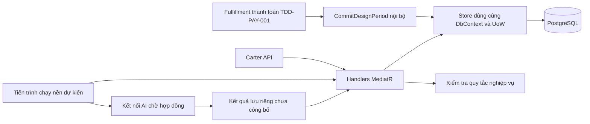
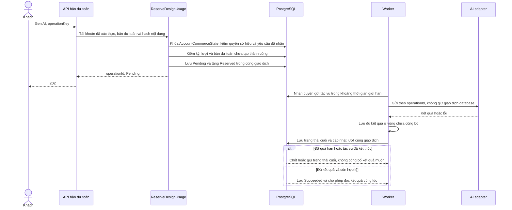
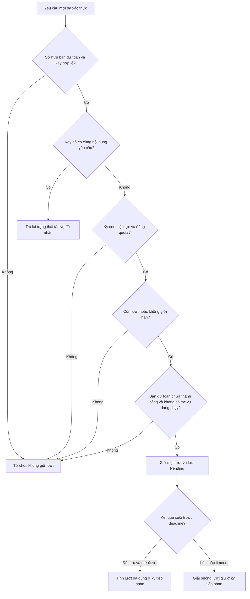
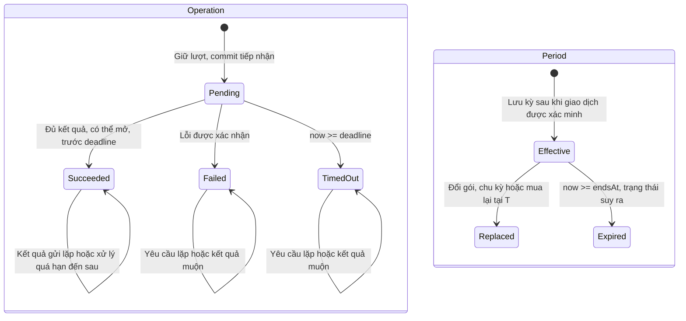
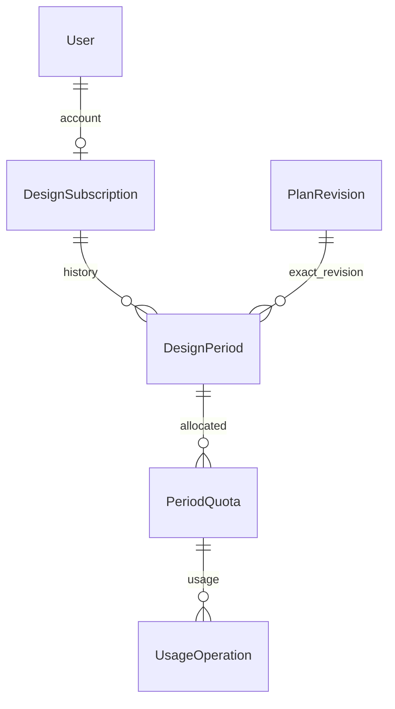

<!-- HƯỚNG DẪN CHO AI KHI ĐIỀN HOẶC CHỈNH SỬA MẪU
- Đọc toàn bộ mẫu, các comment hướng dẫn và tài liệu nguồn được cung cấp trước khi viết. Tuân thủ các quy tắc nghiệp vụ, điều kiện, ngoại lệ và giới hạn đã được xác nhận.
- Không bịa, tự chế hoặc suy đoán thành sự thật: yêu cầu, quy tắc, số liệu, API, schema, mã lỗi, nguồn tham khảo, người phụ trách và kết quả kiểm thử phải có căn cứ. Nội dung ví dụ trong mẫu không phải dữ kiện của dự án.
- Khi thiếu thông tin hoặc các nguồn mâu thuẫn, hỏi người dùng để làm rõ; giữ nguyên placeholder ở phần chưa xác định. Không tự chọn đáp án, lấp chỗ trống hay tuyên bố tài liệu đã hoàn tất.
- Chỉ thay nội dung cần điền hoặc được yêu cầu sửa. Không tự mở rộng phạm vi, sửa nghĩa quy tắc, bỏ điều kiện/ngoại lệ, xoá hay ghi đè nội dung hợp lệ đã có.
- Giữ nguyên tên, cấp và thứ tự heading, nhãn in đậm, tiền tố bullet, cấu trúc danh sách, tên/thứ tự/số cột bảng và cú pháp code fence. Không dịch, đổi tên, gộp hoặc thêm mục ngoài cấu trúc mẫu.
- Chỉ lặp khối luồng, AC hoặc API theo đúng khuôn khi có căn cứ; chỉ bỏ phần tuỳ chọn khi hướng dẫn riêng của mẫu cho phép và đã xác định không áp dụng.
- Mã tham chiếu và section phải trỏ tới tài liệu có thật đã được cung cấp hoặc kiểm chứng. Không giữ mã ví dụ như tham chiếu thật và không tự tạo tài liệu liên quan để hợp thức hoá liên kết.
- Giữ các comment hướng dẫn trong file. Xuất Markdown UTF-8, mỗi file một tài liệu; không bọc toàn bộ file trong code fence, không chèn lời dẫn hay giải thích ngoài mẫu.
- Trước khi bàn giao, đối chiếu nội dung với nguồn, kiểm tra cấu trúc, giá trị cho phép, giới hạn độ dài và tính nhất quán của mã/tham chiếu. Báo rõ phần chưa đủ thông tin; không tuyên bố đã chạy test hoặc import khi chưa thực hiện.
-->

<!-- Thay mã TDD-001 và nội dung ví dụ; giữ nguyên heading và nhãn in đậm.
Sơ đồ dùng mermaid, plantuml hoặc URL. Giữ heading Architecture, Sequence Diagram, Activity Diagram, State Diagram, Data Model.
Ví dụ API phải có heading trùng METHOD /path trong Endpoints. Xoá phần API/sơ đồ không dùng.
Version, Updated At và Change Log do lịch sử phiên bản quản lý, để trống khi nhập mới.
Author/Reviewer là tên hiển thị; gán tài khoản, phê duyệt, giả định và câu hỏi mở trên giao diện sau import.
Thiết kế phải truy vết về Story và Business Rule được cung cấp. Phân biệt thiết kế đề xuất với implementation đã kiểm chứng; không mô tả API/schema/sơ đồ ví dụ như hệ thống thật hoặc tự quyết định nghiệp vụ còn thiếu.
BẮT BUỘC KHI HOÀN THIỆN MẪU: phải có cả Reviewer và Approver, mỗi tên 1–200 ký tự sau khi bỏ khoảng trắng đầu/cuối. Không xoá hai dòng metadata, để trống, dùng tên bịa hoặc giữ placeholder rồi coi là hoàn tất.
Nếu chưa biết người review hoặc người phê duyệt, phải hỏi người dùng và báo tài liệu chưa đủ thông tin; không tự lấy Author/Owner làm người thay thế. Tên trong file không tự gán tài khoản hoặc xác nhận đã duyệt; gán thành viên trên giao diện sau import.
Đây là yêu cầu hoàn thiện mẫu; backend hiện vẫn nhận file cũ thiếu hai trường để tương thích.

VALIDATION CHO FILE NHẬP (đối chiếu ImportSnapshotValidator, MarkdownParser và ImportService):
- Mỗi file .md UTF-8 không rỗng chỉ có một heading cấp 1 chứa mã tài liệu dài 1–100 ký tự. Mã không được trùng trong cùng lần nhập hoặc thuộc loại tài liệu khác đã tồn tại.
- Không dùng tên README.md hoặc sitemap.md vì importer bỏ qua. Giao diện nhận .md/.zip, tối đa 2.000 file, tổng file tải lên 31 MiB; API giới hạn request 32 MiB và tổng nội dung đọc/giải nén 64 MiB.
- Chỉ nhập đè tài liệu cùng loại đang Draft, chưa có phiên bản và chưa lưu trữ. Import thay toàn bộ nội dung bản nháp, vì vậy phải giữ lại nội dung hợp lệ ngoài phần được yêu cầu sửa.
- Không dùng Status trong Markdown hoặc tên Approver để tự xác nhận phê duyệt; import không cấp quyền hay gán tài khoản từ tên. Chạy Kiểm tra file và xử lý lỗi/cảnh báo trước khi nhập.
- Giới hạn độ dài bên dưới tính theo string.Length của .NET (đơn vị UTF-16); không tự cắt ngắn dữ kiện quan trọng để vượt validation, hãy viết lại có căn cứ hoặc hỏi người dùng.
- Feature tối đa 300 ký tự và được dùng làm tiêu đề tài liệu. Status được parser nhận: Draft / In Review / Approved / Deprecated; tài liệu nhập mới vẫn có trạng thái phê duyệt Draft.
- Endpoint: đường dẫn tối đa 500 ký tự; tên/mô tả endpoint được lưu trong Name tối đa 300. HTTP method: GET / POST / PUT / PATCH / DELETE / HEAD / OPTIONS.
- Error Codes: mã tối đa 100 ký tự, không trùng trong tài liệu; giữ dạng - **CODE** (400): mô tả. HTTP status trong Error Codes và Response phải là số nguyên đọc được bằng Int32; không tự đặt status khác hợp đồng API.
- URL sơ đồ tối đa 1.000 ký tự. Mục sơ đồ được sử dụng phải có khối mermaid/plantuml hoặc URL theo mẫu; không để một mục sơ đồ rỗng. Nhãn mục được tách từ bullet như tên External API Fields tối đa 300 ký tự.
- Heading Examples phải khớp METHOD /path ở Endpoints. Giữ các nhãn Request:, Response 200: (thay mã theo contract) và Error Response: để parser tách đúng dữ liệu.
- Tham chiếu dạng DOC-KEY/section: ghi chú: mã đích tối đa 100 ký tự, section tối đa 100, ghi chú tối đa 1.000. Không trùng bộ mã đích + section + loại liên kết trong cùng tài liệu.
ĐỐI CHIẾU FORM TDD (src/features/tdds/validations.ts; form có thể chặt hơn import):
- Điền Feature, Author, Reviewer, Problem và ít nhất một Goal; các Goal/Non-goal/Notes đã thêm không được rỗng. API đã khai báo phải có endpoint và mô tả/mục đích; Fields phải có tên và ý nghĩa; Error Codes phải có mã, HTTP status và điều kiện.
- Form còn kiểm tra Version, Updated At và nội dung Change Log khi khai báo; với file nhập mới, giữ các trường lịch sử này trống theo hợp đồng import, không tự tạo dữ liệu lịch sử.
-->

# TDD-SUB-002

## Document Info

- **Feature**: Kỳ subscription, quản lý hai loại lượt và kết nối với chức năng tạo thiết kế/tra cứu
- **Author**: Codex
- **Reviewer**: Tân Trần
- **Approver**: Tân Trần
- **Status**: Draft
- **Version**:
- **Updated At**:

## Context & Goals

### Problem

**Cập nhật hợp đồng khi bổ sung thanh toán:** TDD-PAY-001 bổ sung nguồn cấp kỳ từ đơn và chống cấp trùng; TDD-SUB-005 bổ sung LifecycleState, hủy/restore và kiểm quyền mới trước nhận tác vụ. Tác vụ AI đã Accepted trước hủy vẫn quyết toán vào kỳ gốc. CurrentPeriodId một mình không đủ chứng minh hiệu lực. OfferKey thay Cycle ở FK tới PlanOffer theo phụ lục thanh toán; chu kỳ của DesignPeriod vẫn chỉ Month/Year. Xem [bàn giao thiết kế mới](../discovery/payment-technical-design.md). Các phần còn lại giữ làm nguồn thiết kế; nội dung bị thay phải đọc theo TDD mới trước khi triển khai.

Tài liệu này thiết kế cách lưu kỳ sử dụng và tính lượt theo STORY-SUB-001. Các dự án của một tài khoản dùng chung lượt. Mỗi thao tác chỉ được giữ, tính đã dùng hoặc giải phóng lượt một lần. Khi giao dịch đổi gói, đổi chu kỳ hoặc mua lại được xác nhận hợp lệ, kỳ mới bắt đầu ngay.

**Thuật ngữ:** trong STORY-SUB-001, BR-SUB-007 và BR-SUB-017, "dự án" là bản dự toán (`Estimate`, cột `EstimateId`) theo TDD-PROJ-001/002. Đây không phải công trình (`ConstructionSite`) mà gói giám sát gắn vào; hai thực thể này không liên kết trong đợt này.

Hiện trạng code đã kiểm tra ngày 25/09/2026: đã có migration `DesignSubscription` cùng các handler `CommitDesignPeriod`, `ReserveDesignUsage` và `SettleDesignUsage`. `DesignSubscriptionStore.LockAccountAsync` vẫn khóa dòng `User`. Chưa có bảng `AccountCommerceState`, module Estimate hay kết nối AI thật. Thanh toán theo TDD-PAY-001 (SePay); cách gọi nhà cung cấp AI vẫn chờ hợp đồng theo TDD-PROJ-002.

**Cập nhật 25/09/2026 theo nghiệp vụ đã chốt:**
- Chủ sở hữu được đổi tên bản dự toán bất cứ lúc nào (BR-SUB-007 khoản 11), kể cả khi gói hết hạn, hết lượt, toàn bộ lượt đang được giữ hoặc AI đang xử lý. Vì vậy policy kiểm gói/quyền/lượt của TDD này chỉ áp cho việc lưu thông tin đầu vào, không áp cho đổi tên. Thiết kế đổi tên nằm ở TDD-PROJ-001 với thao tác riêng `PATCH /api/v1/estimates/{estimateId}/name`.
- Tra cứu mẫu theo BR-LIB-003: lần mở thành công đầu tiên của mỗi phiên bản tính 1 lượt; xem lại cùng phiên bản miễn lượt, kể cả khi gói đã hết hạn.
- Không còn lịch chuyển gói/bậc; đổi hoặc mua lại gói thiết kế bắt đầu kỳ mới ngay (BR-SUB-021), không có kỳ tương lai trả trước. Giá và quyền lợi chốt lúc tạo đơn (BR-PAY-001).
- Mọi đường ghi quota khóa `AccountCommerceState` trước, cùng quy ước với TDD-PAY-001, TDD-PROJ-002 và TDD-SUB-004/005/006; không khóa dòng `User` cho quota.
- STORY-SUB-001/AC-009 và AC-010 không nghiệm thu đợt này (BR-SUB-008 khoản 12). Đợt này không kiểm quyền 3D khi Gen AI.

### Goals

- Một tài khoản có tối đa một kỳ thiết kế hiệu lực. Khi đổi gói/chu kỳ/mua lại, việc đóng kỳ cũ, tạo kỳ mới và cấp hạn mức phải cùng thành công hoặc cùng hoàn tác.
- Chỉ hai quota `design.generate` và `catalog.detail`; mọi Boolean chỉ hiển thị, không điều khiển AI.
- Bảo vệ lượt cuối khi nhiều bản dự toán cùng gửi; retry mạng không trừ lặp. Với tra cứu, mở lại cùng phiên bản mẫu miễn lượt; chỉ phiên bản chưa từng mở thành công mới tính 1 lượt.
- Kết quả hoàn tất, lỗi hoặc timeout chỉ quyết toán một lần vào kỳ lúc tiếp nhận.
- Ràng buộc DB/transaction được kiểm tra bằng PostgreSQL thật; unit test không thay thế bằng chứng đó.

### Non-goals

- Payment checkout/webhook (thuộc TDD-PAY-001), activation công khai, Admin cấp thủ công, hoàn tiền, trial/top-up/tặng lượt, lịch hạ gói và xếp bậc.
- Xây chức năng bản dự toán/Gen AI/mẫu/PDF hoàn chỉnh, lựa chọn nhà cung cấp AI, hạ tầng broker. Đổi tên bản dự toán thuộc TDD-PROJ-001.
- Logic AI theo 3D hay Boolean, kiểm tra sử dụng quyền bật/tắt hoặc quyền dạng mức (STORY-SUB-001/AC-009, AC-010 không nghiệm thu đợt này), metadata output chuyên môn chưa chốt, thời hạn lưu dữ liệu và SLA tự đặt.

## Architecture

**Thay đổi tra cứu theo LIB:** phần TemplateDetail áp dụng [TDD-LIB-002](TDD-LIB-002.md): một lượt cho mỗi tài khoản/phiên bản, quyền xem lại độc lập kỳ; sửa tại chỗ đọc nội dung mới. Các thiết kế tạo AI/cấp kỳ không đổi. Đặc tả Unit Test cho phần tra cứu nằm ở UT-LIB-033 đến UT-LIB-050 theo TDD-LIB-002; chưa có mã test hoặc kết quả chạy.

Luồng chính gồm ba việc: cấp kỳ sau khi giao dịch được xác minh; giữ một lượt khi nhận yêu cầu tạo thiết kế; chốt lượt khi tác vụ thành công, thất bại hoặc hết thời gian chờ. Tra cứu mẫu chỉ tính lượt sau khi đã chuẩn bị được nội dung và lưu kết quả thành công.

Các thuật ngữ được dùng trong phần kỹ thuật:

- **Transaction** là giao dịch database: các thay đổi trong nhóm phải cùng được lưu (`commit`) hoặc cùng bị hoàn tác (`rollback`).
- **Idempotency** là chống xử lý trùng khi cùng yêu cầu được gửi lại. Key nhận diện lần thao tác; hash là giá trị băm để kiểm tra nội dung có bị đổi không.
- **Handler** điều phối một yêu cầu; **policy** chứa điều kiện nghiệp vụ. **Port/interface** mô tả cách gọi một chức năng; **adapter** là lớp thực hiện kết nối với module hoặc dịch vụ đó.
- **Worker** là tiến trình chạy nền, dùng để gửi tác vụ AI và xử lý tác vụ quá hạn. **Trạng thái cuối** là Succeeded, Failed hoặc TimedOut; sau khi đã chốt thì không chuyển sang trạng thái cuối khác.

**Các kỹ thuật được sử dụng trong thiết kế**:

Các kỹ thuật sau phối hợp để giữ đúng kỳ, đúng quyền và đúng số lượt. Một phần đã có trong code (xem hiện trạng ở Problem); phần còn lại là thiết kế đề xuất. Các phần giải thích chi tiết nằm ngay dưới bảng; phần khóa bản ghi đã có riêng ở cuối mục Architecture.

| Kỹ thuật | Mục đích trong TDD này |
|---|---|
| 1. Database transaction | Lưu trọn vẹn một nhóm thay đổi hoặc hoàn tác cả nhóm khi lỗi. |
| 2. Pessimistic locking | Khóa bản ghi trước khi kiểm tra/cập nhật để hai yêu cầu không cùng dùng lượt cuối. |
| 3. Kiểm tra kỳ dự kiến trước khi ghi | Phát hiện yêu cầu cấp kỳ đang dựa trên thông tin kỳ cũ. |
| 4. Idempotency key + hash | Phân biệt gửi lại cùng thao tác với một thao tác mới hoặc yêu cầu đã đổi nội dung. |
| 5. Giữ lượt trước, chốt lượt sau | Dành lượt cho AI đang chạy; chỉ tính đã dùng khi có kết quả thành công. |
| 6. State machine | Chỉ cho chuyển trạng thái theo các nhánh hợp lệ, không chốt một tác vụ hai lần. |
| 7. Tác vụ nền có lưu database | Ghi công việc trước khi gọi AI để còn dấu vết sau khi ứng dụng khởi động lại. |
| 8. Gọi dịch vụ ngoài transaction | Không giữ khóa database trong lúc chờ AI, tải mẫu hoặc lưu tệp. |
| 9. Response replay | Trả lại phản hồi đã lưu khi gửi lại cùng lần mở chi tiết mẫu, không tính thêm lượt. |
| 10. Ràng buộc database | Ngăn ghi dữ liệu vi phạm quan hệ, trùng khóa hoặc sai bộ đếm. |
| 11. Đồng hồ có thể thay thế khi kiểm thử | Kiểm thử chính xác các mốc thời gian mà không phải chờ thời gian thật. |

**1. Database transaction — cùng lưu hoặc cùng hoàn tác**:

Một thao tác nghiệp vụ có thể sửa nhiều bảng. Transaction gom các thay đổi đó thành một lần ghi thống nhất. Trong TDD này, đóng kỳ cũ, tạo DesignPeriod mới, cấp PeriodQuota và đổi CurrentPeriodId phải cùng thành công. Nếu cấp quota lỗi thì cả kỳ mới lẫn việc đóng kỳ cũ đều bị hoàn tác, khách không bị mất kỳ đang dùng.

Cơ chế tương tự áp dụng khi giữ lượt: tăng Reserved và tạo UsageOperation Pending phải nằm trong cùng transaction. Khi chốt thành công, giảm Reserved, tăng Used và chuyển tác vụ sang Succeeded cũng phải cùng lưu. Transaction chỉ bảo vệ thay đổi trong database; nó không hoàn tác được một lần đã gọi AI hoặc đã lưu tệp ở dịch vụ ngoài.

**2. Pessimistic locking — khóa trước khi cập nhật**:

Store dùng `SELECT ... FOR UPDATE` trong transaction để khóa bản ghi `AccountCommerceState` của tài khoản và các bản ghi liên quan. Yêu cầu khác cần cùng khóa phải chờ. Sau khi lấy khóa, yêu cầu phải đọc lại số dư và trạng thái rồi mới quyết định. Ví dụ tài khoản còn một lượt, A giữ được lượt đó thì B phải đọc số dư sau A và bị từ chối nếu hết lượt. Cách dùng SQL, thứ tự khóa, thời điểm nhả khóa và kiểm thử đã được mô tả đầy đủ tại phần **Khóa bản ghi — pessimistic locking** bên dưới.

**3. Kiểm tra dữ liệu dự kiến trước khi ghi — expectedCurrentPeriodId**:

Phần xử lý cấp kỳ gửi `expectedCurrentPeriodId` để nói rằng yêu cầu này được chuẩn bị dựa trên kỳ nào. Sau khi khóa tài khoản, handler so giá trị đó với kỳ hiện tại thực tế. Nếu khác nhau thì trả `SubscriptionVersionConflict` (409), không tự ghi đè kỳ mới.

Ví dụ yêu cầu X được chuẩn bị khi tài khoản đang ở DP1. Trong lúc đó, yêu cầu Y đã chuyển tài khoản sang DP2. Khi X đến với expectedCurrentPeriodId=DP1, hệ thống từ chối vì kỳ hiện tại đã là DP2. Yêu cầu cấp đã xử lý với cùng ActivationKey/hash được nhận diện trước và trả lại kỳ đã tạo, không bị coi là một yêu cầu cấp mới dựa trên kỳ cũ.

Đây là kiểm tra điều kiện dự kiến của yêu cầu. Khóa database bảo vệ khoảng thời gian đang ghi; kiểm tra kỳ dự kiến phát hiện dữ liệu đã cũ từ trước khi lấy khóa. TDD này không chỉ dựa vào trường Version để bảo vệ lượt.

**4. Idempotency key + hash — chống xử lý trùng**:

Key xác định một lần thao tác, còn hash là giá trị băm của nội dung yêu cầu đã chuẩn hóa. Key phải giữ nguyên khi gửi lại đúng thao tác; một lần mua hoặc lần sử dụng mới phải có key mới.

| Nơi lưu | Key | Hash | Phạm vi nhận diện |
|---|---|---|---|
| DesignPeriod | ActivationKey | ActivationHash | Một lần cấp kỳ; ActivationKey duy nhất trong phạm vi một tài khoản. |
| UsageOperation | OperationKey | RequestHash | Một lần sử dụng trong cùng AccountId và UsageKind. |

- Cùng key và cùng hash: trả bản ghi/kết quả đã có, không cấp kỳ hoặc tính lượt thêm.
- Cùng key nhưng khác hash: trả lỗi xung đột vì nội dung đã bị thay đổi, không coi là gửi lại hợp lệ.
- Key mới của AI/cấp kỳ: kiểm tra đầy đủ điều kiện hiện tại. Tra cứu LIB dùng khóa tài khoản/phiên bản; key mới không làm mất quyền xem đã có.

Ví dụ `purchase-123` đã cấp DP2. Mạng lỗi khiến nguồn gọi gửi lại cùng yêu cầu thì trả DP2, không tạo DP3. Nếu vẫn dùng purchase-123 nhưng đổi từ tháng sang năm, hash khác và yêu cầu bị từ chối. Hash không phải chữ ký xác thực hoặc bằng chứng thanh toán; quyền gọi và tính hợp lệ của giao dịch vẫn phải kiểm tra riêng. Việc kiểm key và ghi dữ liệu phải nằm trong quy trình khóa/giao dịch đã quy định, không chỉ kiểm một lần bên ngoài rồi ghi.

**5. Giữ lượt trước, chốt lượt sau — reservation và settlement**:

Giữ lượt là tạm dành một lượt cho tác vụ AI đã được hệ thống tiếp nhận, kể cả khi worker chưa gửi sang AI. `Reserved` đếm số đang giữ; `Used` đếm số đã dùng thành công. “Quyết toán” hay “settlement” trong TDD chỉ có nghĩa chốt cách tính lượt khi tác vụ kết thúc, không phải thu tiền.

Với hạn mức hữu hạn: **số lượt sẵn dùng = Limit − Used − Reserved**. Ví dụ Limit=5, Used=2 trước khi gửi:

| Thời điểm hoặc nhánh kết thúc | Used | Reserved | Sẵn dùng |
|---|---:|---:|---:|
| Trước khi nhận yêu cầu | 2 | 0 | 3 |
| Nhận yêu cầu hợp lệ, lưu Pending | 2 | 1 | 2 |
| Nếu AI thành công, đủ kết quả đã lưu và mở được | 3 | 0 | 2 |
| Hoặc nếu AI thất bại/quá hạn | 2 | 0 | 3 |

Hai dòng cuối là hai nhánh thay thế, không phải hai bước chạy nối tiếp. Thành công giảm Reserved 1 và tăng Used 1; thất bại/quá hạn chỉ giảm Reserved 1. Nếu không giữ trước, khi còn một lượt khách có thể gửi nhiều tác vụ cùng lúc và tất cả cùng được chạy trước khi tác vụ đầu tiên trừ lượt.

Tác vụ luôn chốt vào PeriodId lúc được nhận, dù khách đã đổi kỳ hoặc kỳ đó vừa hết hạn. Không chuyển lượt giữ sang kỳ mới. Hạn mức không giới hạn vẫn ghi Used/Reserved để đối soát nhưng không dùng công thức hữu hạn để chặn theo số dư; vẫn phải có quyền và kỳ hợp lệ khi nhận yêu cầu mới.

Cơ chế giữ lượt này áp dụng cho AI. Tra cứu chuẩn bị nội dung trước, rồi lưu kết quả thành công cùng việc tăng Used trong một transaction, không tăng Reserved. Tạo bản dự toán và lưu thông tin đầu vào kiểm tra điều kiện nhưng không giữ hoặc tính lượt. Đổi tên bản dự toán không qua kiểm tra này.

**6. Máy trạng thái — state machine**:

`UsageTransitionPolicy` chỉ cho tác vụ AI đi từ Pending sang một trong ba trạng thái cuối: Succeeded, Failed hoặc TimedOut. Pending nghĩa là đã tiếp nhận và đang giữ lượt; không có nghĩa AI đã bắt đầu chạy. Trạng thái cuối không được đổi lại thành một trạng thái cuối khác.

Ví dụ OP1 đã TimedOut và được giải phóng lượt. Kết quả AI gửi về sau đó không được chuyển OP1 sang Succeeded, không trừ lượt lại và không công bố kết quả muộn. Nếu OP1 đã Succeeded trước hạn, tiến trình kiểm tra timeout chạy sau không hoàn lượt. Mọi callback hoặc lần quét lặp chỉ đọc trạng thái cuối đã có, không quyết toán thêm.

Muốn thử lại sau thất bại, khách chủ động tạo thao tác mới với key mới và hệ thống kiểm quyền/lượt lại. Không chuyển bản ghi Failed cũ về Pending. Riêng tra cứu không trải qua Pending: chỉ lưu UsageOperation Succeeded sau khi chuẩn bị được nội dung.

**7. Tác vụ nền có lưu database — công việc bền vững**:

Trước khi trả trạng thái đã tiếp nhận, hệ thống lưu UsageOperation Pending cùng lượt giữ. Worker đọc công việc đã lưu và nhận quyền xử lý trong một khoảng thời gian giới hạn (lease), rồi gửi AI. Các trường DispatchState, DispatchLeaseUntilUtc và ProviderAttemptId giúp theo dõi việc gửi và lần gọi nhà cung cấp; chi tiết kết nối còn phụ thuộc API nhà cung cấp.

Nếu ứng dụng khởi động lại, bản ghi Pending vẫn còn để xử lý hoặc đối soát. Tuy nhiên, điều đó không có nghĩa cứ khởi động lại là được gọi AI lần nữa. Nếu ứng dụng dừng sau khi gửi nhưng trước khi ghi nhận lần gọi, trạng thái gửi có thể chưa rõ. Khi đó dùng khả năng chống trùng/tra cứu của nhà cung cấp nếu có; nếu không, xử lý theo chính sách chờ quá hạn, không tự tạo chi phí bằng việc gửi mới. Lease hết hạn không tự chứng minh nhà cung cấp chưa nhận tác vụ.

**8. Gọi dịch vụ ngoài transaction — chỉ khóa trong lúc ghi ngắn**:

Luồng AI được chia thành ba giai đoạn:

1. Transaction thứ nhất: kiểm quyền, giữ lượt và lưu Pending, rồi commit để nhả khóa.
2. Không giữ transaction database: worker gọi AI, nhận đầu ra, lưu đủ kết quả ở vùng chưa công bố và xác nhận đọc lại được.
3. Transaction thứ hai: kiểm trạng thái/thời hạn, chốt bộ đếm và trạng thái cuối, rồi mới cho khách truy cập kết quả nếu thành công.

Ví dụ AI mất vài phút, tài khoản không bị khóa database suốt vài phút đó. Các thao tác khác vẫn có thể thực hiện sau khi kiểm tra số lượt sẵn dùng đã trừ Reserved. Nếu database lỗi sau khi lưu tệp, rollback SQL không xóa được tệp đó; chưa có Succeeded thì không công bố tệp. Quy trình dọn tệp và thời hạn lưu vẫn cần thiết kế riêng.

**9. Quyền xem lại theo phiên bản**:

Tra cứu dùng LibraryAccess theo AccountId/VersionId, tạo cùng UsageOperation Succeeded và tăng Used trong một transaction. Có Access thì không kiểm lại kỳ/quota, kể cả gửi yêu cầu mới. Đọc nội dung phiên bản hiện tại, không trả bytes cũ sau một lần sửa tại chỗ. Khi phiên bản bị thay thế, nội dung phiên bản cũ giữ nguyên. Chi tiết schema, khóa và API theo [TDD-LIB-002](TDD-LIB-002.md).

**10. Ràng buộc database — lớp kiểm tra ngay khi ghi**:

| Ràng buộc | Áp dụng trong thiết kế | Dữ liệu sai bị chặn |
|---|---|---|
| FK, gồm khóa ngoại ghép | AccountId/CurrentPeriodId trỏ đúng kỳ của tài khoản; operation trỏ đúng kỳ/quota. | Dùng kỳ của tài khoản khác hoặc trỏ tới bản ghi không tồn tại. |
| UNIQUE | Bộ AccountId/ActivationKey và bộ AccountId/UsageKind/OperationKey. | Tạo hai bản ghi cho cùng một lần cấp/sử dụng. |
| CHECK | Used và Reserved không âm; hạn mức hữu hạn có Used+Reserved không vượt Limit. | Bộ đếm âm hoặc giữ/dùng quá hạn mức. |
| Chỉ mục duy nhất có điều kiện | EstimateId của DesignGeneration khi State là Pending hoặc Succeeded (`UX_Usage_Estimate_Live` theo TDD-PROJ-002). | Hai tác vụ đang chạy/đã thành công cho cùng bản dự toán, kể cả gói không giới hạn. |

Những ràng buộc này bổ sung cho kiểm tra nghiệp vụ, không thay thế quyền sở hữu, kiểm thời hạn hoặc khóa tài khoản. Ví dụ database không tự hiểu mọi quy tắc cấp kỳ chỉ từ một CurrentPeriodId. Quan hệ tới bản dự toán theo TDD-PROJ-002 (cột `EstimateId` có FK thật); quan hệ tới mẫu theo TDD-LIB-002. Phải kiểm thử trên PostgreSQL thật; mock hoặc EF InMemory không chứng minh được hành vi ràng buộc này.

**11. Đồng hồ có thể thay thế khi kiểm thử — TimeProvider**:

Hàm nghiệp vụ nhận thời điểm từ TimeProvider hoặc giá trị EffectiveNow được store lấy sau khi đã khóa dữ liệu, thay vì tự đọc giờ rải rác ở nhiều nơi. Khi vận hành dùng giờ server/database, lưu UTC; cách tính kỳ tháng/năm áp dụng múi giờ Việt Nam. Không lấy giờ do client tự gửi.

Trong unit test, cố định hoặc dịch chuyển đồng hồ để kiểm tra ngay trước, đúng và sau mốc kết thúc. Ví dụ kỳ kết thúc lúc 10:00:00 giờ Việt Nam: yêu cầu mới ở 09:59:59 vẫn nằm trong kỳ, đúng 10:00:00 thì không còn hiệu lực. Tác vụ AI Pending được kiểm tra đúng DeadlineUtc sẽ chuyển TimedOut; nếu đã lưu Succeeded trước đó thì giữ nguyên Succeeded.

Cũng dùng đồng hồ cố định để kiểm tra kỳ bắt đầu ngày 31/01 kết thúc vào ngày cuối tháng 2 hoặc kỳ năm bắt đầu ngày 29/02. Unit test không phải chờ một tháng thật. Thời gian chờ AI tối đa và chu kỳ quét vẫn chưa chốt; TimeProvider giúp kiểm thử, không tự đặt các giá trị vận hành này.

| Thành phần dự kiến | Vai trò và phạm vi trách nhiệm |
|---|---|
| `SubscriptionPeriodPolicy` (domain) | Tính thời hạn: có hiệu lực từ start, hết hiệu lực tại end; kỳ mới không cộng lượt dư kỳ cũ |
| `QuotaPolicy` (domain) | Kiểm tra quyền tính lượt, số còn sẵn dùng và hạn mức hữu hạn/không giới hạn; không dùng quyền Boolean |
| `UsageTransitionPolicy` (domain) | Chuyển Pending sang Succeeded/Failed/TimedOut; không đổi lại trạng thái đã kết thúc |
| `CommitDesignPeriodHandler` (application, nội bộ) | Nhận kết quả xác minh giao dịch từ fulfillment của TDD-PAY-001; khóa `AccountCommerceState`, đóng kỳ cũ và tạo kỳ mới |
| `ReserveDesignUsageHandler`, `CompleteDesignUsageHandler`, `FailDesignUsageHandler`, `ExpireDesignUsageHandler` | Mỗi bước ghi dùng giao dịch ngắn riêng; không giữ giao dịch database trong lúc gọi AI hoặc lưu tệp |
| `EstimateInputWriteAccessPolicy` | Kiểm tra gói, quyền và số lượt trong cùng giao dịch tạo bản dự toán hoặc lưu thông tin đầu vào; không tính hoặc giữ lượt. Là nguồn quyết định cho adapter `IEstimateWriteAccess` của TDD-PROJ-001. Không áp cho đổi tên bản dự toán (BR-SUB-007 khoản 11) |
| `OpenLibraryVersionRequest` / `CommitLibraryOpenCommand` | Chuẩn bị ngoài transaction; cấp LibraryAccess cùng Used/UsageOperation ở lần mở phiên bản đầu, mở lại miễn lượt theo TDD-LIB-002 |
| `ISubscriptionStore`, `ITemplateContentReader`, `IDesignResultStore` | Các interface cần triển khai để đọc/ghi dữ liệu. Quyền sở hữu bản dự toán do module Estimate kiểm theo TDD-PROJ-001/002; kết nối AI chưa có hợp đồng |
| `TimeProvider` | Cung cấp đồng hồ cho nghiệp vụ và kiểm thử; vận hành dùng giờ UTC của server, không lấy giờ từ client |
| `UsageMaintenanceWorker` | Dịch vụ chạy nền mới; mỗi đợt xử lý tác vụ quá hạn/gửi AI dùng phạm vi truy cập dữ liệu và giao dịch riêng. Không khôi phục Quartz/RabbitMQ cũ |



**Notes**:

- Các lệnh ghi mới phải có `ITransactionalRequest` để `TransactionPipelineBehavior` mở giao dịch. `ICommand<T>` hiện không kế thừa `ICommand` không có tham số kiểu; không dựa vào tên lớp để tình cờ được mở giao dịch. Yêu cầu chuẩn bị nội dung tra cứu không ghi dữ liệu là ngoại lệ được mô tả riêng ở phần Data Model.
- Một thao tác ghi dùng cùng `DbContext` và `UnitOfWork` (UoW: đối tượng quản lý việc lưu và giao dịch) trong suốt lần xử lý. Cần đăng ký UoW theo phạm vi xử lý (`scoped`), thay vì tạo đối tượng mới mỗi lần yêu cầu (`transient`) như hiện tại; nếu đổi đăng ký dùng chung thì phải kiểm thử lại xác thực. Handler và store không tự mở hoặc commit thêm một giao dịch lồng bên trong.
- Pipeline hiện vẫn commit khi handler trả `Result.Failure`. Vì vậy, nếu có lỗi nghiệp vụ sau khi sửa dữ liệu, handler phải ném exception để hoàn tác. Riêng khi đã chủ động ghi trạng thái Failed/TimedOut và trả lượt, cần trả DTO chứa trạng thái đó bình thường để thay đổi được lưu, không ném lỗi khiến việc trả lượt bị hoàn tác.
- Middleware chưa chuyển `ConflictException` và `DbUpdateConcurrencyException` thành HTTP 409; cần bổ sung mã lỗi tương ứng. Giữ các nhóm lỗi đầu vào 422, không đủ quyền 403 và không tìm thấy 404. Không trả chi tiết lỗi nhà cung cấp hoặc dữ liệu nhạy cảm cho khách.
- Database là nguồn quyết định quyền và số lượt. Không lấy quota trong JWT hoặc Redis làm căn cứ vì dữ liệu đó có thể cũ sau khi khách đổi kỳ. Truy vấn chỉ đọc có thể chọn các cột cần thiết để tạo DTO.
- Luôn xác thực tài khoản và quyền sở hữu trước khi tìm yêu cầu đã xử lý, kể cả khi gửi lại cùng key. `AccountId` lấy từ người dùng đã xác thực. Khi nhận kết quả từ dịch vụ ngoài, đối chiếu tác vụ, tài khoản, bản dự toán và lần gọi đã lưu; không tin accountId do bên ngoài gửi mà chưa kiểm tra.
- Lấy `EffectiveNow` một lần sau khi đã lấy đủ khóa cần thiết, rồi truyền cùng giá trị vào các điều kiện nghiệp vụ. Database có thể dùng `clock_timestamp()` để lấy thời gian thực sau lúc chờ khóa. Unit test dùng `TimeProvider` với thời điểm cố định. Múi giờ cá nhân `User.TimeZone` không thay thế múi giờ nghiệp vụ Việt Nam.
- Thứ tự khóa thống nhất: `AccountCommerceState` → `Estimate` (chỉ luồng có bản dự toán, theo TDD-PROJ-002) → DesignSubscription → DesignPeriod/PeriodQuota theo mã quyền → UsageOperation. Module Estimate phối hợp cùng thứ tự, không khóa ngược. `AccountCommerceState` được tạo bằng `INSERT ... ON CONFLICT DO NOTHING` rồi khóa (TDD-PAY-001), nên luôn có dòng để khóa trước kỳ đầu tiên và ngăn hai yêu cầu cùng tạo subscription cho một tài khoản. Không khóa dòng `User` cho quota; quyền của người gọi đọc từ claim nên cũng không khóa bản ghi quyền. Các thao tác ghi cùng tài khoản được xử lý lần lượt; chỉ tối ưu thêm sau khi đo thời gian chờ khóa.
- Cơ chế thử lại của EF hiện chỉ bao quanh bước bắt đầu giao dịch. Không tự bật thử lại từng câu SQL hoặc handler có tác động bên ngoài. Nếu hai giao dịch chờ khóa lẫn nhau (deadlock) hoặc xung đột mức cô lập dữ liệu, phải thử lại toàn bộ giao dịch ngắn bằng DbContext mới và cùng key. Nếu chưa biết lần trước đã commit chưa, tra key trước khi làm lại. Không gọi lại dịch vụ ngoài trong vòng thử lại SQL.


**Khóa bản ghi — pessimistic locking**:

Thiết kế dùng khóa bản ghi PostgreSQL bằng `SELECT ... FOR UPDATE`: lấy khóa trước khi đọc dữ liệu dùng để quyết định và cập nhật lượt. Yêu cầu khác cần khóa xung đột trên cùng bản ghi phải chờ giao dịch đang giữ khóa kết thúc. Khóa được giữ trong giao dịch và nhả khi commit hoặc rollback; truy vấn SELECT thông thường không bị khóa bản ghi này chặn. Xem [PostgreSQL: Row-Level Locks](https://www.postgresql.org/docs/current/explicit-locking.html#LOCKING-ROWS).

Mục đích là ngăn hai yêu cầu cùng thấy một lượt còn lại rồi cùng sử dụng lượt đó. Đây là khóa ở database, dùng được khi ứng dụng chạy nhiều instance; không thay bằng `lock` hoặc semaphore chỉ có hiệu lực trong một tiến trình.

**Phạm vi áp dụng và thứ tự xử lý**:

1. Xác thực người gọi và xác định tài khoản từ nguồn đáng tin cậy phía server. Bắt đầu giao dịch trên cùng DbContext/UoW của thao tác.
2. Khóa bản ghi `AccountCommerceState` của tài khoản đó; nếu chưa có thì tạo bằng `INSERT ... ON CONFLICT DO NOTHING` rồi khóa. Đây là điểm khóa chung với thanh toán, gán/hủy/khôi phục gói và luồng bản dự toán (TDD-PAY-001, TDD-PROJ-002, TDD-SUB-004/005/006). Nó có dòng cả khi tài khoản chưa có DesignSubscription hoặc kỳ mua đầu tiên. Khóa này không tự khóa tất cả bảng con; mọi đường ghi subscription phải chủ động tuân thủ quy ước.
3. Đọc và khóa những bản ghi cần sửa theo thứ tự: `AccountCommerceState → Estimate (nếu có) → DesignSubscription → DesignPeriod → PeriodQuota → UsageOperation`. Nếu cần nhiều quota, lấy theo thứ tự mã quyền thống nhất. Chỉ khóa các bản ghi liên quan và đã tồn tại; việc tạo bản ghi mới được bảo vệ bởi khóa tài khoản cùng ràng buộc database.
4. Sau khi lấy đủ khóa, đọc lại dữ liệu dùng để quyết định, lấy thời gian hiện tại rồi kiểm tra key, kỳ, quyền, lượt và trạng thái tác vụ. Không dùng số dư hoặc entity EF đã đọc trước khi chờ khóa; phải tải lại để tránh quyết định từ dữ liệu cũ.
5. Nếu hợp lệ, cập nhật bộ đếm và bản ghi liên quan trong cùng giao dịch. Commit mới trả kết quả tiếp nhận thành công. Nếu phải từ chối sau khi đã sửa dữ liệu, rollback toàn bộ theo quy ước xử lý lỗi ở trên.

Các thao tác phải tuân thủ khóa tài khoản gồm cấp/đổi kỳ (`CommitDesignPeriod`), giữ lượt (`ReserveDesignUsage`), chốt thành công (`CompleteDesignUsage`), giải phóng lượt khi lỗi/quá hạn (`FailDesignUsage`, `ExpireDesignUsage`) và tính lượt tra cứu (`CommitTemplateOpen`). Kiểm tra quyền tạo bản dự toán hoặc lưu thông tin đầu vào cũng phải phối hợp với giao dịch lưu của module Estimate theo cùng quy ước. Thứ tự khóa của module Estimate đã thống nhất ở TDD-PROJ-001/002; không tự lấy khóa theo thứ tự ngược.

Hiện trạng code: `DesignSubscriptionStore.LockAccountAsync` đang khóa dòng `User`, và các luồng gói giám sát cũng gọi hàm này. Khi bảng `AccountCommerceState` của TDD-PAY-001 được tạo, hàm phải đổi sang khóa dòng đó để mọi luồng cùng tài khoản dùng chung một điểm khóa.

Ví dụ cú pháp lấy khóa; đây chỉ là bước đầu của giao dịch, không phải SQL đầy đủ để tiếp nhận tác vụ:

```sql
-- Đã bắt đầu transaction trên cùng connection của DbContext.
-- Tên bảng/cột phải dùng đúng ánh xạ EF của AccountCommerceState theo TDD-PAY-001.
-- Nếu tài khoản chưa có dòng này, tạo trước bằng INSERT ... ON CONFLICT DO NOTHING
-- với giá trị khởi tạo do TDD-PAY-001 quy định.
SELECT "AccountId"
FROM "AccountCommerceState"
WHERE "AccountId" = @accountId
FOR UPDATE;
-- Tiếp tục đọc/khóa kỳ và quota, kiểm tra rồi ghi dữ liệu.
-- Chỉ commit khi toàn bộ thay đổi của thao tác đã hoàn tất.
```

`@accountId` phải được truyền bằng tham số SQL, không ghép chuỗi từ đầu vào. Store thực hiện câu khóa qua cùng connection và transaction do UoW đang quản lý. Một truy vấn LINQ đọc thông thường hoặc việc EF theo dõi entity không tự thay thế lệnh khóa này.

**Ví dụ hai yêu cầu tranh lượt cuối**:

| Bước | Yêu cầu A từ bản dự toán thứ nhất | Yêu cầu B từ bản dự toán thứ hai |
|---|---|---|
| 1 | Khóa AccountCommerceState của tài khoản U1. | Cũng xin khóa AccountCommerceState của U1 và phải chờ. |
| 2 | Đọc quota: Limit=1, Used=0, Reserved=0; còn một lượt. | Chưa được kiểm tra số dư để tiếp nhận tác vụ. |
| 3 | Tăng Reserved lên 1, tạo UsageOperation Pending rồi commit. | Được lấy khóa sau khi A nhả khóa. |
| 4 | Hoàn tất bước tiếp nhận. | Đọc lại thấy Used+Reserved=1, không còn lượt; từ chối với QuotaUnavailable, không tạo tác vụ. |

Nếu A rollback thì lượt giữ và tác vụ Pending của A đều không được lưu. Sau khi lấy khóa, B kiểm tra dữ liệu thực tế và có thể tiếp nhận nếu vẫn đủ điều kiện. Các tài khoản khác không phải chờ cùng bản ghi AccountCommerceState, dù vẫn có thể chịu các tranh chấp dữ liệu khác nếu cùng truy cập tài nguyên chung.

**Thời gian giữ khóa, lỗi và giới hạn**:

- Chỉ giữ khóa trong giao dịch database ngắn. Không giữ khóa suốt thời gian AI chạy, tải nội dung mẫu hoặc lưu tệp. `Reserved` giữ chỗ cho lượt trong lúc AI chạy; nó không phải khóa database kéo dài.
- Nếu gặp deadlock hoặc lỗi cô lập dữ liệu, hoàn tác rồi áp dụng quy tắc thử lại toàn giao dịch với cùng key đã nêu ở trên. Không thử lại riêng câu tăng bộ đếm. Thời gian chờ khóa và số lần thử lại chưa được ấn định trong TDD; không coi chờ khóa là lỗi hết lượt hoặc timeout AI.
- Khóa không thay thế idempotency: yêu cầu gửi lại sau khi khóa đã nhả vẫn phải được nhận diện bằng key/hash. Khóa cũng không thay thế `expectedCurrentPeriodId`: sau khi lấy khóa vẫn cần phát hiện yêu cầu cấp kỳ dựa trên kỳ đã cũ.
- Các ràng buộc CHECK, UNIQUE và khóa ngoại tiếp tục bảo vệ dữ liệu. Nguồn ghi SQL bỏ qua quy ước khóa có thể phá vỡ giả định xử lý tuần tự nên phải được kiểm soát riêng.
- Kiểm chứng bằng hai connection PostgreSQL thật: [ST-SUB-110](../systemtest/ST-SUB-110.md) tranh lượt cuối, [ST-SUB-111](../systemtest/ST-SUB-111.md) cấp kỳ đồng thời, [ST-SUB-112](../systemtest/ST-SUB-112.md) tranh chốt thành công/quá hạn và [ST-SUB-114](../systemtest/ST-SUB-114.md) rollback khi cấp kỳ lỗi. Mock và EF InMemory không chứng minh được hành vi chờ/nhả khóa. Đây vẫn là thiết kế, chưa có kết quả thực thi.

## Sequence Diagram



## Activity Diagram



## State Diagram



Mỗi yêu cầu mới đều kiểm tra thời gian hết hạn của kỳ, nên không cần chờ tiến trình chạy nền đổi trạng thái kỳ mới chặn quyền đúng giờ.

Với tác vụ AI, thời gian chờ tối đa tính từ `AcceptedAtUtc` khi tiếp nhận Pending, bao gồm cả thời gian chờ gửi AI. Nếu lúc chốt có `now >= DeadlineUtc`, tác vụ bị tính là quá hạn dù kết quả vừa tới. Nếu đã lưu thành công trước hạn thì bước kiểm tra quá hạn chạy sau không làm gì thêm. Giá trị thời gian chờ và tần suất quét chưa chốt; phải cấu hình trước khi bật luồng AI, không tự đặt mặc định 15 phút.

## Data Model

Các model dưới đây mô tả gói thiết kế đã cấp cho tài khoản và việc sử dụng lượt. Migration `DesignSubscription` đã tạo bốn bảng này trong code; cột `EstimateId`, khóa `AccountCommerceState` và các delta của TDD-LIB-002, TDD-PROJ-002 là thay đổi dự kiến.

| Model | Ý nghĩa và mục đích | Quan hệ với model khác |
|---|---|---|
| `DesignSubscription` | Là đầu mối quản lý subscription thiết kế của một tài khoản, giữ con trỏ tới kỳ hiện tại. Bản ghi này không đại diện cho từng lần mua. | Thuộc một `User`; có lịch sử nhiều `DesignPeriod`, nhưng chỉ trỏ một kỳ hiện tại. Vẫn phải kiểm tra thời hạn của kỳ trước khi cho dùng. |
| `DesignPeriod` | Đại diện cho một kỳ đã mua, lưu chu kỳ tháng/năm, giá đã chốt, thời điểm bắt đầu, ngày kết thúc dự kiến và thời điểm đóng sớm nếu có. | Thuộc `DesignSubscription`; tham chiếu đúng `PlanRevision` và `PlanOffer` đã chốt; có các dòng `PeriodQuota`. Mua lại hoặc đổi gói hợp lệ tạo kỳ mới. |
| `PeriodQuota` | Lưu hạn mức đã cấp và số lượt đang sử dụng của một quyền trong một kỳ. `Used` là số đã dùng, `Reserved` là số đang giữ cho tác vụ chưa kết thúc. | Thuộc `DesignPeriod` và một `BenefitDefinition`. Các bản dự toán của cùng tài khoản dùng chung hạn mức này; từng lần dùng được ghi bằng `UsageOperation`. |
| `UsageOperation` | Ghi nhận một lần tạo thiết kế hoặc mở lần đầu một phiên bản mẫu, gồm trạng thái, thời điểm và kết quả. Khóa của lần thao tác giúp nhận diện yêu cầu gửi lại để không tính lượt trùng. | Gắn cố định với tài khoản, kỳ và quyền đã tiếp nhận thao tác. Tác vụ của kỳ cũ vẫn quyết toán vào kỳ cũ khi tài khoản đã chuyển sang kỳ mới. |

Cần phân biệt `OfferQuota` và `PeriodQuota`: bảng thứ nhất là cấu hình hạn mức để bán; bảng thứ hai là hạn mức được cấp cho một kỳ cụ thể, kèm các bộ đếm thay đổi khi khách sử dụng. Quyền bật/tắt và mô tả tư vấn của kỳ được đọc qua phiên bản bất biến, còn giá đã chốt và thời hạn được lưu riêng trên `DesignPeriod`.

Ví dụ minh họa: khách mua gói Cơ bản phiên bản 2 theo tháng. Hệ thống tạo `DesignPeriod` tham chiếu phiên bản 2 và cấp các `PeriodQuota` tương ứng. Một yêu cầu tạo thiết kế hợp lệ tạo `UsageOperation` và giữ 1 lượt; khi thành công, chuyển lượt đang giữ sang đã dùng. Với tra cứu, ghi chứng từ lượt cùng LibraryAccess khi mở phiên bản lần đầu; xem lại đọc nội dung phiên bản, không tăng Used.

**Nguồn của các bảng được tham chiếu**:

- `PlanRevision`, `PlanOffer`, `RevisionBenefit`, `OfferQuota` và `BenefitDefinition` được định nghĩa tại [TDD-SUB-001, Data Model](TDD-SUB-001.md#data-model). TDD này chỉ tạo các bảng kỳ mua và sử dụng lượt, không tạo lại bảng cấu hình gói.
- `User` là bảng tài khoản đã có trong backend, xem [UserConfiguration](../../bmt-be/src/bmt-be.persistence/configurations/UserConfiguration.cs); khóa ngoại dùng đúng tên bảng được ánh xạ qua EF TableNames.
- Bảng mẫu/phiên bản theo TDD-LIB-001; LibraryAccess và phần tra cứu theo TDD-LIB-002; FK bổ sung của TemplateDetail theo tài liệu đó. Chưa có các bảng nghiệp vụ này trong DbContext đã khảo sát.

Trong bảng schema: PK là khóa chính, FK là khóa ngoại, NN là bắt buộc, UNIQUE ngăn trùng và CHECK kiểm tra điều kiện khi ghi. `Limit` là từ khóa dành riêng của PostgreSQL nên khi viết SQL tay phải đặt tên cột này trong nháy kép; EF đã tự trích dẫn các định danh PascalCase. Không áp dụng cơ chế xóa mềm của Entity cơ sở cho kỳ và thao tác sử dụng; đổi gói hay ngừng bán không xóa lịch sử.

**Các trường dễ nhầm**:

- `PreviousPeriodId` nối kỳ mới với kỳ trước đó; kỳ đầu tiên để NULL. Khóa ngoại của nó là khóa ghép `(AccountId,PreviousPeriodId)` để kỳ trước phải thuộc cùng tài khoản, giống cách làm của `CurrentPeriodId`.
- `ActivationKey` là idempotency key của một lần cấp kỳ. `ActivationHash` là chuỗi băm 64 ký tự của nội dung yêu cầu đã chuẩn hóa. Cùng key/hash trả kỳ đã có; cùng key nhưng khác hash báo xung đột. Cả hai lưu trên `DesignPeriod`. Khóa chống trùng có phạm vi một tài khoản qua `UNIQUE(AccountId,ActivationKey)`; không đặt duy nhất toàn bảng, vì như vậy hai khách trùng chuỗi key sẽ chặn nhầm nhau và thông báo xung đột để lộ rằng key đó đã tồn tại ở tài khoản khác.
- `OperationKey` và `RequestHash` thực hiện kiểm tra tương tự cho từng lần sử dụng, lưu trên `UsageOperation`. Chúng không thay thế khóa chống cấp kỳ trùng.
- `UsageOperation.UsageKind` là loại thao tác sử dụng (`DesignGeneration` hoặc `TemplateDetail`), tương ứng `BenefitDefinition.UsageKind`. Nó khác `Kind` của `RevisionBenefit`, `OfferQuota` và `PeriodQuota` — cột đó phân biệt quyền tính lượt với quyền bật/tắt. Vì hai khái niệm này từng cùng mang tên `Kind`, thiết kế đổi tên cột trên `UsageOperation` để đọc schema không bị nhầm.
- `UsageOperation` theo dõi một thao tác từ lúc nhận đến khi kết thúc bằng cách cập nhật chính bản ghi đó; không thêm một dòng mới cho mỗi lần đổi trạng thái.
- `Version` theo dõi lần cập nhật bản ghi để phát hiện dữ liệu cũ. Nó không phải số phiên bản quyền lợi `PlanRevision.Number`.

| Bảng | Cột, kiểu, null và ràng buộc |
|---|---|
| DesignSubscription | `AccountId uuid PK FK User`, `CurrentPeriodId uuid NULL`, `Version bigint NN`; một bản ghi quản lý chung cho mỗi tài khoản. Composite FK(AccountId,CurrentPeriodId) -> DesignPeriod(AccountId,Id), DEFERRABLE hoặc insert period trước set pointer. |
| DesignPeriod | `Id uuid PK`, `AccountId uuid NN FK DesignSubscription`, `RevisionId uuid NN`, `Cycle varchar(8) NN` Month/Year, `Price numeric(20,0) NN CHECK>0`, `Currency char(3) NN CHECK='VND'`, `StartsAtUtc timestamptz NN`, `ScheduledEndsAtUtc timestamptz NN`, `ClosedAtUtc timestamptz NULL`, `ActivationKey varchar(100) NN`, `ActivationHash char(64) NN`, `PreviousPeriodId uuid NULL`, `CreatedAtUtc timestamptz NN`; UNIQUE(AccountId,Id), UNIQUE(AccountId,ActivationKey), UNIQUE(Id,RevisionId) làm đích cho khóa ngoại ghép của PeriodQuota, FK(RevisionId,Cycle) -> PlanOffer(RevisionId,OfferKey), FK(AccountId,PreviousPeriodId) -> DesignPeriod(AccountId,Id). CHECK scheduledEnd > start và closedAt NULL hoặc start <= closedAt <= scheduledEnd. |
| PeriodQuota | `PeriodId uuid NN`, `RevisionId uuid NN`, `BenefitId uuid NN`, `Kind varchar(16) NN CHECK='Quota'`, `IsUnlimited boolean NN`, `Limit bigint NULL`, `Used bigint NN DEFAULT 0`, `Reserved bigint NN DEFAULT 0`; PK(PeriodId,BenefitId), FK(PeriodId,RevisionId) -> DesignPeriod(Id,RevisionId), FK(RevisionId,BenefitId,Kind) -> UNIQUE(RevisionId,BenefitId,Kind) của RevisionBenefit; used/reserved>=0; finite limit>=1 và used+reserved<=limit; unlimited limit NULL. |
| UsageOperation | `Id uuid PK`, `AccountId uuid NN`, `PeriodId uuid NN`, `BenefitId uuid NN`, `OperationKey varchar(100) NN`, `RequestHash char(64) NN`, `UsageKind varchar(24) NN`, `ResourceId uuid NN`, `EstimateId uuid NULL` (FK/CHECK theo TDD-PROJ-002: bằng ResourceId khi UsageKind=DesignGeneration, NULL khi TemplateDetail), `TemplateVersionId uuid NULL` (FK/UNIQUE theo TDD-LIB-002), `State varchar(16) NN`, `AcceptedAtUtc timestamptz NN`, `DeadlineUtc timestamptz NULL`, `SettledAtUtc timestamptz NULL`, `FailureCode varchar(100) NULL`, `ResultRef text NULL`, `InputRef text NULL`, `ContentVersion varchar(100) NULL`, `ResponseBody bytea NULL`, `ResponseContentType varchar(100) NULL`, `DispatchState varchar(16) NULL`, `DispatchLeaseUntilUtc timestamptz NULL`, `ProviderAttemptId varchar(200) NULL`; UNIQUE(AccountId,UsageKind,OperationKey), FK(AccountId,PeriodId) -> DesignPeriod(AccountId,Id), FK(PeriodId,BenefitId) -> PeriodQuota, FK(BenefitId,UsageKind) -> UNIQUE(Id,UsageKind) của BenefitDefinition. |

`ScheduledEndsAtUtc` giữ ngày kết thúc dự kiến lúc mua. Nếu có `ClosedAtUtc`, thời điểm kết thúc thực tế là mốc sớm hơn giữa hai giá trị. Kỳ cũ có thể bị đóng ngay đúng giờ bắt đầu; trường hợp đó cho phép `ClosedAtUtc=StartsAtUtc`, không rút ngắn kỳ mới.

`ClosedAtUtc` chỉ dùng cho một tình huống: kỳ bị một lần mua mới thay thế. Khi đóng kỳ cũ, giao dịch phải đặt đồng thời `ClosedAtUtc` và `LifecycleState=Superseded` theo [TDD-SUB-005, Data Model](TDD-SUB-005.md#data-model), nơi cột `LifecycleState` được bổ sung vào bảng này. Nhân viên hủy gói thì đổi `LifecycleState` sang `CanceledByStaff` và giữ `ClosedAtUtc` NULL, vì hủy có thể khôi phục còn đóng do thay thế thì không. Hai cách kết thúc kỳ vì vậy không dùng chung một cột.

Kỳ được dùng phải vừa là kỳ hiện tại của tài khoản, vừa thỏa `StartsAtUtc <= now < thời điểm kết thúc thực tế`. Chỉ có `CurrentPeriodId` chưa đủ: nó vẫn có thể trỏ tới một kỳ đã hết hạn.



**Dữ liệu mẫu để đọc ERD**:

Các bảng sau minh họa dữ liệu của thiết kế, chưa được ghi vào database. Giá, hạn mức, ngày và nội dung đều là ví dụ, không phải cấu hình kinh doanh đã chốt. Mã như `U1`, `P1`, `R1` là tên viết tắt của UUID để dễ theo dõi; cùng mã trong ba TDD chỉ cùng một bản ghi. `NULL` là giá trị rỗng trong database. Chỉ liệt kê các cột cần giải thích; cột bắt buộc không xuất hiện trong bảng mẫu vẫn phải được ghi đầy đủ khi triển khai. Các thời điểm có hậu tố `Z` là UTC, giờ Việt Nam bằng UTC cộng 7 giờ.

Dùng lại `P1`, `R1`, `R2`, `B1`, `B2` trong [TDD-SUB-001](TDD-SUB-001.md#data-model). Tài khoản `U1` mua R1 theo tháng ngày 10/09, sau đó mua lại theo cấu hình R2 ngày 18/09. Thời điểm chụp dữ liệu dưới đây là ngày 18/09, sau khi kỳ mới được cấp và một tác vụ của kỳ cũ đã hoàn tất.

`DesignSubscription` — con trỏ tới kỳ mới:

| AccountId | CurrentPeriodId | Version |
|---|---|---|
| U1 | DP2 | 2 |

`DesignPeriod` — lịch sử hai kỳ:

| Id | AccountId | RevisionId | Cycle | Price | Currency | StartsAtUtc | ScheduledEndsAtUtc | ClosedAtUtc | PreviousPeriodId | ActivationKey |
|---|---|---|---|---|---|---|---|---|---|---|
| DP1 | U1 | R1 | Month | 200000 | VND | 2026-09-10T03:00:00Z | 2026-10-10T03:00:00Z | 2026-09-18T03:00:00Z | NULL | purchase-demo-1 |
| DP2 | U1 | R2 | Month | 250000 | VND | 2026-09-18T03:00:00Z | 2026-10-18T03:00:00Z | NULL | DP1 | purchase-demo-2 |

`ActivationHash` được lưu trên từng dòng DesignPeriod nhưng lược khỏi bảng mẫu để dễ đọc. Giá trị thực là chuỗi băm 64 ký tự của nội dung yêu cầu cấp kỳ đã chuẩn hóa. Nguồn gửi phải là phần xử lý phía server đã xác minh giao dịch; ví dụ không có nghĩa API thanh toán đã tồn tại.

DP1 đóng ngay lúc DP2 bắt đầu. Ngày kết thúc dự kiến ban đầu của DP1 vẫn được giữ để đối soát. DP2 nhận đủ hạn mức mới; không mang lượt dư của DP1 sang hoặc giảm giá theo thời gian còn lại.

`PeriodQuota` — hạn mức và số đã sử dụng tại thời điểm chụp:

| PeriodId | RevisionId | BenefitId | IsUnlimited | Limit | Used | Reserved |
|---|---|---|---|---|---|---|
| DP1 | R1 | B1 | false | 5 | 1 | 0 |
| DP1 | R1 | B2 | false | 20 | 1 | 0 |
| DP2 | R2 | B1 | false | 10 | 0 | 1 |
| DP2 | R2 | B2 | false | 30 | 0 | 0 |

`RevisionId` lặp lại phiên bản của kỳ để khóa ngoại ghép `(RevisionId,BenefitId,Kind)` bắt quyền được cấp hạn mức phải có thật trong phiên bản gói mà kỳ đã mua, và `(PeriodId,RevisionId)` bắt giá trị lặp này luôn bằng `DesignPeriod.RevisionId`. Nếu không có hai khóa đó, database vẫn cho cấp hạn mức của một quyền không nằm trong gói. Quy tắc "chỉ hai quyền tính lượt của thiết kế mới có hạn mức" vẫn được giữ và nay do database bảo đảm: `Kind='Quota'` buộc dòng phải trỏ tới một quyền tính lượt, còn CHECK của `BenefitDefinition` trong [TDD-SUB-001](TDD-SUB-001.md#data-model) giới hạn quyền tính lượt đúng hai mã đó.

`UsageOperation` — các thao tác tạo ra những bộ đếm trên:

| Id | AccountId | PeriodId | BenefitId | UsageKind | ResourceId | OperationKey | State |
|---|---|---|---|---|---|---|---|
| OP1 | U1 | DP1 | B1 | DesignGeneration | EST1 | generate-demo-1 | Succeeded |
| OP2 | U1 | DP1 | B2 | TemplateDetail | TPL1 | lib-open:V1 | Succeeded |
| OP3 | U1 | DP2 | B1 | DesignGeneration | EST2 | generate-demo-2 | Pending |

`EST1`, `EST2` là bí danh UUID của hai bản dự toán thuộc U1. Với OP1 và OP3, cột `EstimateId` lưu cùng giá trị với `ResourceId`; với OP2, `EstimateId` là NULL vì đây là tra cứu mẫu.

Cùng ba bản ghi trên, các cột thời gian và kết quả được tách thành bảng sau cho dễ đọc:

| Id | AcceptedAtUtc | DeadlineUtc | SettledAtUtc | ResultRef | ContentVersion | ResponseContentType | ResponseBody |
|---|---|---|---|---|---|---|---|
| OP1 | 2026-09-18T02:59:00Z | 2026-09-18T03:09:00Z | 2026-09-18T03:01:00Z | results/demo/op1 | NULL | NULL | NULL |
| OP2 | 2026-09-17T04:00:00Z | NULL | 2026-09-17T04:00:01Z | NULL | 1 | NULL | NULL |
| OP3 | 2026-09-18T03:02:00Z | 2026-09-18T03:12:00Z | NULL | NULL | NULL | NULL | NULL |

Khoảng timeout 10 phút chỉ dùng để minh họa thời gian, chưa phải giá trị vận hành đã chốt. OP2 có TemplateVersionId=V1 (bí danh UUID của phiên bản thuộc TPL1) và LibraryAccess(U1,V1,OP2); ContentVersion=1 là EditVersion lúc cấp. ResponseBody/ResponseContentType NULL theo TDD-LIB-002. Đường dẫn kết quả AI chỉ minh họa dữ liệu. `RequestHash`, `InputRef` và các trường điều phối nhà cung cấp được lược khỏi bảng này; không có nghĩa chúng được bỏ qua khi ghi tác vụ thật.

Các thay đổi dữ liệu đáng chú ý:

- OP1 được nhận ở DP1 trước khi đổi kỳ: lúc đó B1 của DP1 có `Used=0, Reserved=1`. OP1 hoàn tất sau khi DP2 bắt đầu nên chỉ đổi DP1 thành `Used=1, Reserved=0`, không lấy lượt DP2.
- OP3 mới nhận ở DP2 nên giữ 1 lượt: số sẵn dùng là `10 − 0 − 1 = 9`. Nếu OP3 thất bại, dòng quota trở về `Used=0, Reserved=0`; nếu thành công thì thành `Used=1, Reserved=0`.
- OP2 đã lưu thành công và tính 1 lượt. Khi phản hồi bị mất mạng, mở lại đúng phiên bản kiểm LibraryAccess và trả nội dung phiên bản; không tạo operation mới, `Used` của DP1/B2 vẫn bằng 1. Mở lại đúng phiên bản bằng yêu cầu mới vẫn miễn lượt nhờ LibraryAccess theo TDD-LIB-002.
- Dù DP1 còn số lượt chưa dùng, nó đã đóng nên không tiếp nhận thao tác mới. Không dùng riêng công thức số dư để kết luận khách còn quyền sử dụng kỳ đó.

**Notes**:
- Kỳ mua tham chiếu phiên bản quyền lợi không được sửa, không sao chép riêng Boolean/ConsultationText rồi để dữ liệu lệch nhau. Khi trả thông tin kỳ, đọc đúng phiên bản đã mua. Price, RevisionId và chu kỳ lấy từ snapshot của đơn đã thanh toán: giá và quyền lợi chốt lúc tạo đơn theo BR-PAY-001, được fulfillment của TDD-PAY-001 chuyển sang khi cấp kỳ. Không lấy từ giá website hiện tại hoặc giá do client tự gửi. Giá lưu nguyên đồng VNĐ như `PlanOffer`, không có phần thập phân. Không thêm khóa ngoại ép Price bằng giá trong PlanOffer; nguồn đúng là snapshot của đơn.
- Không tạo bảng/lĩnh vực ScheduledDowngrade, PlanRank, EditingQuota hoặc bộ đếm giám sát. Chưa thiết kế cộng dồn nhiều nguồn cấp quyền vì mua thêm lượt và dùng thử chưa được chốt.
- Ràng buộc UsageOperation yêu cầu trạng thái đã kết thúc có SettledAtUtc; Pending chưa có SettledAtUtc. Tạo thiết kế Succeeded phải có ResultRef, trạng thái lỗi không có kết quả công bố. Không có PeriodQuota tương ứng thì từ chối quyền. Hạn mức không giới hạn vẫn ghi Used/Reserved để đối soát nhưng không chặn theo số Used. Phép tính phải kiểm tra tràn số nguyên để lỗi không làm hỏng số dư.
- Index `IX_Usage_PendingDeadline(State,DeadlineUtc,Id)` WHERE State=Pending; `IX_Usage_Account_UsageKind_OperationKey` unique; `IX_Usage_Period_Benefit` cho đối soát; `IX_Period_Account_Start` cho lịch sử. Partial unique `UX_Usage_Estimate_Live(EstimateId)` WHERE UsageKind='DesignGeneration' AND State IN ('Pending','Succeeded') theo TDD-PROJ-002 ngăn hai tác vụ chạy/đã thành công trên cùng bản dự toán, kể cả subscription unlimited. Tên `UX_DesignProject_LiveOperation(ResourceId)` của bản trước được thay bằng index này. EstimateId phải là bản dự toán có thật thuộc người gọi, không tin client tự chọn UUID để vượt giới hạn.
- Khóa ngoại tới mẫu/phiên bản theo TDD-LIB-002; khóa ngoại tới bản dự toán theo TDD-PROJ-002 (`FK(AccountId,EstimateId) → Estimate(OwnerId,Id)`). Không cấp quyền chỉ vì client gửi một resourceId. TDD này không định nghĩa cấu trúc Estimate.
- Khóa bản ghi `AccountCommerceState` là cơ chế chính ngăn hai yêu cầu cùng cấp kỳ cho một tài khoản. Khóa ngoại ghép của CurrentPeriodId ngăn trỏ sang kỳ của tài khoản khác. Không dùng chỉ mục duy nhất có điều kiện chứa `now()` để xác định kỳ đang hiệu lực. Nếu có nguồn ghi ngoài ứng dụng, có thể cần ràng buộc cấm khoảng thời gian chồng nhau khi làm migration; hiện chưa thêm extension database mới.
- Quy tắc khóa chỉ có tác dụng khi mọi đường ghi tuân thủ. Quyền ghi trực tiếp vào database cần giới hạn cho ứng dụng và migration. Nếu cho phép nguồn khác ghi SQL, phải đánh giá và kiểm thử riêng; một CurrentPeriodId duy nhất không tự ngăn mọi trường hợp dữ liệu lịch sử chồng thời gian.

**Giao dịch và idempotency dự kiến**:

| Thao tác | Transaction và quy tắc |
|---|---|
| CommitDesignPeriod | Khóa `AccountCommerceState` và tìm ActivationKey. Nếu cùng key và nội dung, trả kỳ đã cấp; khác nội dung thì báo xung đột. Fulfillment của TDD-PAY-001 là phần phía server gọi thao tác này, sau khi đã xác minh giao dịch; nó truyền phiên bản, chu kỳ và giá lấy từ snapshot đơn cùng kỳ hiện tại dự kiến (`expectedCurrentPeriodId`). Nếu kỳ hiện tại đã đổi, trả 409. Trong một giao dịch: đóng kỳ cũ còn hiệu lực tại T bằng cách đặt ClosedAtUtc=T và LifecycleState=Superseded, tạo kỳ/hạn mức mới và đổi CurrentPeriodId. Chỉ chọn gói trên giao diện chưa đủ để được cấp kỳ. |
| ReserveDesignUsage | Kiểm quyền sở hữu và key/hash. Yêu cầu đã nhận thì trả lại tác vụ cũ, không kiểm số dư để từ chối lại tác vụ đó. Yêu cầu mới phải kiểm kỳ, quyền, lượt và bản dự toán; tăng Reserved và tạo Pending trong cùng giao dịch. Bị từ chối thì không tạo tác vụ. Không kiểm quyền 3D trong đợt này. |
| CompleteDesignUsage | Lưu đủ đầu ra ở vùng chưa cho khách truy cập trước khi mở giao dịch database. Khóa dữ liệu theo thứ tự đã quy định. Nếu tác vụ đã kết thúc thì không sửa. Nếu quá hạn thì chốt TimedOut và trả lượt giữ. Nếu còn Pending, chưa quá hạn và thành phần lưu kết quả đã xác nhận ResultReady, tăng Used, giảm Reserved, lưu ResultRef và Succeeded trong cùng giao dịch. Chưa commit thì chưa cấp đường dẫn tải kết quả. |
| Fail/Expire | Chỉ đổi tác vụ Pending. Giảm Reserved ở kỳ đã tiếp nhận, không cộng sang kỳ hiện tại hoặc tự gửi yêu cầu mới. Nếu tác vụ đã kết thúc thì giữ nguyên. Trả DTO trạng thái cuối bình thường để lưu việc giải phóng lượt; không ném exception sau khi đã sửa. |
| Estimate input save | Áp cho tạo bản dự toán và lưu thông tin đầu vào, gồm lưu nháp. Khóa `AccountCommerceState` như bước giữ lượt/cấp kỳ; `EstimateInputWriteAccessPolicy` kiểm gói, quyền tạo thiết kế và lượt sẵn dùng ngay trong giao dịch lưu. Không tăng Reserved. Không kiểm quyền ở một giao dịch rồi mặc định cho ghi ở giao dịch khác; module Estimate tham gia cùng giao dịch theo TDD-PROJ-001. Đổi tên bản dự toán không đi qua kiểm tra này: nó chỉ cần quyền sở hữu và tên hợp lệ (BR-SUB-007 khoản 11, BR-PROJ-003), thiết kế ở TDD-PROJ-001 với `PATCH /api/v1/estimates/{estimateId}/name`. |
| Replay key | Tra key trong phạm vi tài khoản và loại thao tác; so hash của bản dự toán/mẫu, phiên bản đầu vào và tham số thực hiện. Cùng key khác nội dung thì báo xung đột. Không trả dữ liệu tài khoản khác. Chưa chốt thời hạn lưu khóa chống trùng nên không tự xóa. |

Một lệnh gọi nhà cung cấp không thể bị hoàn tác bằng SQL. Vì vậy, hệ thống lưu Pending trước để không mất dấu công việc khi ứng dụng khởi động lại. Worker nhận quyền gửi tác vụ trong một khoảng thời gian giới hạn (lease) bằng giao dịch ngắn, sau đó gọi AI bên ngoài giao dịch database.

Nếu nhà cung cấp hỗ trợ chống xử lý trùng, dùng OperationId làm key. Nếu không hỗ trợ và ứng dụng dừng sau khi gửi nhưng trước khi lưu ProviderAttemptId, hệ thống chưa biết nhà cung cấp đã nhận hay chưa. Không tự gửi lại để tránh tạo tác vụ/chi phí mới; phải đối chiếu trạng thái nếu nhà cung cấp có hỗ trợ, hoặc chờ xử lý quá hạn theo quy tắc đã chốt. Cách gửi và đối chiếu cụ thể cần hợp đồng tích hợp với nhà cung cấp; chưa bổ sung RabbitMQ hoặc outbox chỉ vì hướng dẫn cũ có nhắc đến.

**Tra cứu mẫu — hợp đồng thay thế theo LIB**:

1. Danh sách công khai không tính lượt; không trả manifest ảnh/tệp bảo vệ. Xem chi tiết phải có phiên khách hợp lệ.
2. Kiểm LibraryAccess theo tài khoản/phiên bản trước khi kiểm kỳ. Đã có thì mở miễn lượt và đọc nội dung hiện tại của đúng phiên bản, kể cả mẫu ẩn hoặc gói hết hạn. Không trả ResponseBody cũ làm mất thay đổi tại chỗ.
3. Chưa có Access thì khách phải xác nhận một lượt cho VersionId/EditVersion cụ thể. Chuẩn bị tài nguyên ngoài SQL transaction. Lỗi chuẩn bị không ghi operation/quota/access.
4. Trong transaction: khóa AccountCommerceState → kỳ/quota → Template/Version theo TDD-LIB-002; đọc lại Access sau khóa tài khoản. Nếu đã có thì không trừ thêm. Nếu chưa có thì kiểm current/hidden/edit, kỳ, quyền catalog.detail và số dư; ghi Used + 1, UsageOperation Succeeded và Access cùng nhau. Reserved không đổi. Unlimited vẫn ghi một lần dùng và cấp Access.
5. OperationKey do server dựng lib-open:{VersionId}; hash dựa TemplateDetail/TemplateId/VersionId, không dựa EditVersion. Khác request key không tạo lượt mới cho cùng phiên bản. UNIQUE tài khoản/phiên bản và FK Access–operation là lớp bảo vệ database.
6. Sau commit mới trả dữ liệu. Mất phản hồi không hoàn lượt, mở lại không trừ thêm. Storage lỗi khi tải file sau đó cho phép tải lại miễn lượt. Nội dung/currents đổi trước commit và chưa có Access thì trả 409, không tự mua phiên bản khác.

Request điều phối OpenLibraryVersionRequest chạy ngoài transaction ghi; chỉ CommitLibraryOpenCommand tham gia pipeline transaction. ILibraryQuotaService dùng chung scoped UoW, không tự commit hoặc mở giao dịch khác. Header Idempotency-Key của đường mở cũ không quyết định lượt mới. Hợp đồng endpoint chuẩn ở TDD-LIB-002/Internal API thay phần POST mở cũ.

**Schema delta của UsageOperation**: thêm TemplateVersionId uuid NULL FK LibraryVersion; bắt buộc và có FK ghép (ResourceId,TemplateVersionId) tới LibraryVersion(TemplateId,Id) cho TemplateDetail. Thêm UNIQUE(AccountId,TemplateVersionId) WHERE UsageKind='TemplateDetail' và UNIQUE(AccountId,TemplateVersionId,Id) cho FK LibraryAccess. Tra cứu State=Succeeded, SettledAtUtc NN; DeadlineUtc, ResponseBody, ResponseContentType NULL. ContentVersion lưu EditVersion lúc cấp chỉ để đối soát. DesignGeneration giữ TemplateVersionId NULL và các quy tắc AI cũ. Các cột bytes vẫn giữ để không xóa cấu trúc dùng chung tùy tiện; không còn lưu nội dung LIB trong đó. TDD-LIB-002/Data Model là định nghĩa chính xác cho phần bổ sung này.

**Kế hoạch triển khai và kiểm thử**:

1. Triển khai danh mục theo TDD-SUB-001, các hàm kiểm tra thời gian/hạn mức, ràng buộc lưu trữ và unit test trước.
2. Triển khai kỳ mua và hàm nội bộ nhận yêu cầu cấp đã xác minh. Dùng dữ liệu cấp kỳ riêng trong kiểm thử, không mở API cấp gói thủ công để trình diễn.
3. Triển khai giao dịch quản lý lượt và phối hợp lưu thông tin đầu vào bản dự toán. Unit test kiểm tra điều kiện; kiểm thử tích hợp dùng hai kết nối PostgreSQL thật cho tranh lượt cuối, quá hạn, công bố và đổi kỳ.
4. Triển khai kết nối AI/bản dự toán/mẫu sau khi có hợp đồng dữ liệu. Tra cứu commit quyền xem cùng một lượt đã dùng, không giữ Reserved; mở lại theo Access. Chỉ bật worker khi cấu hình thời gian chờ và nhà cung cấp hợp lệ, không tự đặt số mặc định.
5. Kiểm thử lại tài khoản/xác thực nếu đổi đăng ký UoW hoặc middleware. Lượt biên soạn tài liệu này không chạy restore, build hoặc test ứng dụng.

## Internal API

### Endpoints

API đọc kỳ có thể triển khai độc lập. API tạo thiết kế và thư viện mẫu vẫn cần module cung cấp dữ liệu. Các thao tác có tính lượt yêu cầu phiên xác thực hợp lệ theo chính sách hiện có, người gọi là chủ sở hữu tài nguyên (bản dự toán hoặc tài khoản mở mẫu) và kỳ hiện hành còn hiệu lực có quyền tính lượt tương ứng. Chỉ đăng nhập thành công thì chưa đủ. Tìm kiếm/xem danh sách vẫn không yêu cầu đăng nhập.

- **GET** `/api/v1/me/design-subscription` — Người đã xác thực đọc kỳ hiện tại, phiên bản, thời hạn, quota `{code,isUnlimited,limit,used,reserved,available}`, `displayBenefits`, `consultationText`. Chưa có kỳ trả value=null; hết hạn vẫn trả số dư lịch sử nhưng canStart=false.
- **POST** `/api/v1/estimates/{estimateId}/generations` — Chủ bản dự toán đã xác thực gửi Idempotency-Key và inputVersion. Trả 202 sau khi lưu Pending; gửi lại cùng key/hash trả tác vụ cũ. Không nhận limit, accountId, price hoặc periodId tùy ý từ client. Hợp đồng đầy đủ (CSRF, phản hồi, mã lỗi) theo TDD-PROJ-002/Internal API; route `/projects/{projectId}/design-generations` của bản trước không còn dùng.
- **GET** `/api/v1/estimates/{estimateId}/generations/{operationId}` — Chủ bản dự toán đã xác thực đọc trạng thái, theo TDD-PROJ-002. Chỉ Succeeded trả đường dẫn kết quả có kiểm soát truy cập; không trả đầu ra đang lưu tạm hoặc tới muộn. Hết hạn gói vẫn được đọc kết quả cũ thuộc quyền.
- **GET** `/api/v1/design-templates` — Không cần đăng nhập; tìm kiếm/xem danh sách không tính lượt và không lộ chi tiết bị tính lượt. Dữ liệu trả về cần thiết kế với module mẫu.
- **POST** `/api/v1/design-templates/{templateId}/open` — Theo TDD-LIB-002/Internal API: versionId, expectedEditVersion, confirmUse. Đã có Access mở miễn lượt; lần đầu ghi Access/UsageOperation/Used trong một giao dịch. Không dùng key mới để tính thêm lượt cho cùng phiên bản.

**Ports nội bộ (không phải HTTP công khai)**:
- `CommitDesignPeriod(accountId, activationKey, commitmentId, revisionId, cycle, agreedPrice, expectedCurrentPeriodId)` -> periodId; chỉ fulfillment của TDD-PAY-001, sau khi đã xác minh giao dịch, tài khoản và hash, được gọi. `revisionId`, `cycle` và `agreedPrice` lấy từ snapshot đơn. Không có API Admin cấp kỳ.
- `ReserveDesignUsage(accountId, estimateId, operationKey, inputVersion)` -> operation; module Estimate kiểm tra quyền sở hữu và đầu vào hiện tại theo TDD-PROJ-002, không tin tham số client khi chưa xác minh.
- `CompleteDesignUsage(operationId, attemptId, resultReadyRef)` / `FailDesignUsage(operationId, attemptId, failureCode)` -> trạng thái cuối; chỉ thành phần server đã được xác thực gọi, không cho client tự báo thành công.
- `ExpireDesignUsage(operationId)` -> state; lấy giờ hiện tại sau khi đã khóa dữ liệu.
- `CheckEstimateInputWriteAccess(accountId, now)` -> allowed/denied; kiểm gói, quyền tạo thiết kế và lượt sẵn dùng nhưng không tính lượt. Phải gọi trong cùng giao dịch tạo bản dự toán hoặc lưu thông tin đầu vào. Không gọi khi chỉ đổi tên bản dự toán.

### Examples

#### POST /api/v1/estimates/{estimateId}/generations

```
Request:
Idempotency-Key: 8f3126df-25f0-45c8-9d2f-c357c631c08b
{"inputVersion":3}

Response 202:
{"value":{"operationId":"22222222-2222-2222-2222-222222222222","state":"Pending","acceptedAtUtc":"2026-09-18T03:02:00Z","deadlineUtc":"2026-09-18T03:12:00Z"},"isSuccess":true,"isFailure":false,"error":{"code":"","message":""}}

Error Response:
{"title":"Conflict","code":"QuotaUnavailable","status":409,"detail":"Không còn lượt tạo thiết kế sẵn dùng.","messageCode":"QuotaUnavailable","errors":null}
```

Kỳ định nghĩa lại từ T theo giờ Việt Nam: đổi tháng lúc 18/09/2026 10:00 +07:00 => hết 18/10/2026 10:00 +07:00; DB lưu UTC 03:00Z. 31/01/2027 +1 tháng => 28/02/2027 cùng giờ; 29/02/2028 +1 năm => 28/02/2029. Không dùng 30 hoặc 365 ngày cố định. Không có chuỗi gia hạn hay kỳ tương lai trả trước (BR-SUB-021): mỗi lần mua hoàn tất bắt đầu kỳ mới ngay tại T, nên hàm chỉ tính một kỳ từ start được cung cấp.

### Error Codes

- **Unauthorized** (401): chưa xác thực.
- **AccessForbidden** (403): phiên không đáp ứng chính sách xác thực hoặc người gọi không có quyền sở hữu cần thiết.
- **ResourceNotFound** (404): không có bản dự toán/tác vụ trong phạm vi tài khoản được truy cập; không lộ dữ liệu tài khoản khác. Route bản dự toán dùng mã chi tiết hơn `EstimateNotFound`/`GenerationNotFound` theo TDD-PROJ-002.
- **SubscriptionInactive** (403): không có kỳ hoặc hết hạn tại mốc kiểm tra.
- **EntitlementMissing** (403): không có quyền quota tương ứng.
- **QuotaUnavailable** (409): hết lượt sẵn dùng, gồm lượt đang giữ.
- **IdempotencyConflict** (409): cùng key nhưng nội dung yêu cầu hoặc thông tin tài khoản của lần cấp không khớp.
- **SubscriptionVersionConflict** (409): kỳ hiện tại đã khác kỳ dự kiến trong yêu cầu; không áp yêu cầu cũ lên kỳ mới.
- **EstimateAlreadyGenerated** (409): bản dự toán đã có kết quả thành công, cần bản dự toán mới. Thay `ProjectAlreadyGenerated` của bản trước, theo TDD-PROJ-002; code hiện vẫn dùng tên cũ trong `SubscriptionErrorCodes`.
- **GenerationInProgress** (409): bản dự toán đã có tác vụ khác đang chạy. Gửi lại đúng key của tác vụ đã nhận thì trả tác vụ đó, không báo lỗi này.
- **InvalidRequest** (422): sai cycle, thiếu key, dữ liệu command không hợp lệ.
- **DependencyUnavailable** (503): adapter phụ thuộc không sẵn sàng trước tiếp nhận; không cấp/trừ lượt cho lỗi chưa nhận. Mapping 503 là bổ sung middleware dự kiến, chưa tồn tại.

## External API

### Endpoints

- **Thanh toán SePay (theo TDD-PAY-001)** — TDD này không gọi SePay trực tiếp. Webhook, xác thực và đối chiếu giao dịch thuộc TDD-PAY-001; tài liệu này chỉ thiết kế hàm nội bộ nhận yêu cầu cấp kỳ từ fulfillment đã xác minh giao dịch.
- **Gen AI (chưa thiết kế endpoint)** — gửi đầu vào đã kiểm quyền qua lớp kết nối; chưa chọn hoặc gọi nhà cung cấp cụ thể.
- **Lưu kết quả (chưa có adapter)** — lưu đầu ra bền vững và kiểm tra đọc lại được trước khi đánh dấu đủ kết quả.

### Fields

- **operationId** — mã do server cấp và lưu lâu dài để nối yêu cầu với kết quả của đúng tác vụ.
- **attemptId** — gắn đúng lần gọi, không nhận kết quả cho request khác.
- **resultReadyRef** — tham chiếu kết quả đã lưu/có thể mở, do thành phần phía server đã được xác thực tạo; không nhận cờ thành công do khách tự gửi.
- **commitmentId** — mã của yêu cầu cấp kỳ đã được xác minh; với luồng thanh toán là đơn đã được fulfillment xử lý, `ActivationKey` có dạng `payment:{orderId}` theo TDD-PAY-001. Giá và quyền lợi chốt lúc tạo đơn (BR-PAY-001); cách đối chiếu trạng thái thanh toán theo TDD-PAY-001.

### Error Handling

Không giữ giao dịch SQL trong lúc gọi dịch vụ ngoài. Lỗi trước khi tiếp nhận thì không giữ lượt. Lỗi sau khi đã ghi Pending phải chốt trạng thái và giải phóng lượt đúng một lần. Không tự tạo tác vụ mới để thử lại lỗi nhà cung cấp; quá hạn trả lượt theo BR-SUB-016. Kết quả tới muộn không được công bố cho khách. Thời gian lưu và cách dọn dữ liệu cần quyết định vận hành riêng, chưa tự đặt lịch xóa.

### Quirks

- Hợp đồng tích hợp AI của bản dự toán, danh sách đầu ra bắt buộc và nhà cung cấp chưa có đầy đủ. Adapter giả chỉ phục vụ unit test; không có nghĩa hệ thống đã tích hợp thực tế.
- Lỗi đồng hồ hoặc nhà cung cấp không được làm tăng lượt được cấp. Thử lại giao dịch database không được gọi AI hoặc thu tiền thêm.
- Tra cứu giữ một lượt đã dùng sau commit dù mất phản hồi; mở lại cùng phiên bản đọc nội dung qua LibraryAccess, không phụ thuộc key hoặc hiệu lực kỳ. Không tạo API xác nhận đã nhận nội dung từ trình duyệt.

## References

### User Stories

- STORY-SUB-001/AC-001
- STORY-SUB-001/AC-002
- STORY-SUB-001/AC-003
- STORY-SUB-001/AC-004
- STORY-SUB-001/AC-014
- STORY-SUB-001/AC-015
- STORY-SUB-001/AC-018
- STORY-SUB-001/AC-019
- STORY-SUB-001/AC-020
- STORY-SUB-001/AC-022
- STORY-SUB-001/AC-023
- STORY-SUB-001/AC-024
- STORY-SUB-001/AC-025
- STORY-SUB-001/AC-030
- STORY-SUB-001/AC-031
- STORY-SUB-001/AC-032
- STORY-SUB-001/AC-033
- STORY-SUB-001/AC-034
- STORY-SUB-001/AC-035
- STORY-SUB-001/AC-036
- STORY-SUB-001/AC-037
- STORY-SUB-001/AC-038
- STORY-SUB-001/AC-039
- STORY-SUB-001/AC-043
- STORY-SUB-001/AC-044
- STORY-SUB-001/AC-045
- STORY-SUB-001/AC-046
- STORY-SUB-001/AC-047
- STORY-SUB-001/AC-048
- STORY-SUB-001/AC-067
- STORY-SUB-001/AC-068
- STORY-SUB-001/AC-071
- STORY-SUB-001/AC-070
- STORY-SUB-002/AC-026

### Business Rules

- BR-SUB-001/Then
- BR-SUB-002/Then
- BR-SUB-003/Then
- BR-SUB-004/Then
- BR-SUB-005/Statement
- BR-SUB-006/Then
- BR-SUB-007/Then
- BR-SUB-008/Then
- BR-SUB-014/Then
- BR-SUB-015/Then
- BR-SUB-016/Then
- BR-SUB-017/Then
- BR-SUB-021/Then
- BR-SUB-021/Except
- BR-LIB-003/Then
- BR-PAY-001/Then

### Use Cases

- STORY-SUB-001/ALT-19

### Others

- [TDD-LIB-002](TDD-LIB-002.md): thay hợp đồng tra cứu, schema delta UsageOperation và quyền xem lại theo phiên bản.
- [TDD-PROJ-001](TDD-PROJ-001.md): bản dự toán, `IEstimateWriteAccess` và thao tác đổi tên riêng `PATCH /api/v1/estimates/{estimateId}/name`. [TDD-PROJ-002](TDD-PROJ-002.md): route Gen AI theo `estimateId`, cột `EstimateId` và thứ tự khóa chung. [TDD-PAY-001](TDD-PAY-001.md): `AccountCommerceState`, snapshot đơn và fulfillment cấp kỳ.
- AC-036 của STORY-SUB-001 được bao phủ theo nghĩa đã sửa ngày 25/09/2026: khi gói hết hạn, yêu cầu sửa ghi chú hoặc thông tin đầu vào bị `EstimateInputWriteAccessPolicy` từ chối; yêu cầu chỉ đổi tên được chấp nhận qua thao tác đổi tên của TDD-PROJ-001.
- Không bao phủ AC-009 và AC-010 của STORY-SUB-001: hai tiêu chí về quyền dạng mức không nghiệm thu đợt này theo BR-SUB-008 khoản 12.
- UT-SUB-038 đến UT-SUB-044 đã được cập nhật ngày 25/09/2026 theo BR-LIB-003 và TDD-LIB-002: mở lại cùng phiên bản không tính lượt, chỉ phiên bản chưa từng mở mới tính một lượt. UT-SUB-079 kiểm Gen AI không kiểm quyền 3D; ST-SUB-125 kiểm đổi tên bản dự toán khi hết lượt, khi lượt cuối đang giữ hoặc khi AI đang xử lý.

Đặc tả kiểm thử mới (Draft, chưa thực thi):

- [UT-SUB-014](../unittest/UT-SUB-014.md)
- [UT-SUB-015](../unittest/UT-SUB-015.md)
- [UT-SUB-016](../unittest/UT-SUB-016.md)
- [UT-SUB-017](../unittest/UT-SUB-017.md)
- [UT-SUB-018](../unittest/UT-SUB-018.md)
- [UT-SUB-019](../unittest/UT-SUB-019.md)
- [UT-SUB-020](../unittest/UT-SUB-020.md)
- [UT-SUB-021](../unittest/UT-SUB-021.md)
- [UT-SUB-022](../unittest/UT-SUB-022.md)
- [UT-SUB-023](../unittest/UT-SUB-023.md)
- [UT-SUB-024](../unittest/UT-SUB-024.md)
- [UT-SUB-025](../unittest/UT-SUB-025.md)
- [UT-SUB-026](../unittest/UT-SUB-026.md)
- [UT-SUB-027](../unittest/UT-SUB-027.md)
- [UT-SUB-028](../unittest/UT-SUB-028.md)
- [UT-SUB-029](../unittest/UT-SUB-029.md)
- [UT-SUB-030](../unittest/UT-SUB-030.md)
- [UT-SUB-031](../unittest/UT-SUB-031.md)
- [UT-SUB-032](../unittest/UT-SUB-032.md)
- [UT-SUB-033](../unittest/UT-SUB-033.md)
- [UT-SUB-034](../unittest/UT-SUB-034.md)
- [UT-SUB-035](../unittest/UT-SUB-035.md)
- [UT-SUB-036](../unittest/UT-SUB-036.md)
- [UT-SUB-037](../unittest/UT-SUB-037.md)
- [UT-SUB-038](../unittest/UT-SUB-038.md)
- [UT-SUB-039](../unittest/UT-SUB-039.md)
- [UT-SUB-040](../unittest/UT-SUB-040.md)
- [UT-SUB-041](../unittest/UT-SUB-041.md)
- [UT-SUB-042](../unittest/UT-SUB-042.md)
- [UT-SUB-043](../unittest/UT-SUB-043.md)
- [UT-SUB-044](../unittest/UT-SUB-044.md)
- [UT-SUB-045](../unittest/UT-SUB-045.md)
- [UT-SUB-046](../unittest/UT-SUB-046.md)
- [UT-SUB-047](../unittest/UT-SUB-047.md)
- [UT-SUB-048](../unittest/UT-SUB-048.md)
- [UT-SUB-049](../unittest/UT-SUB-049.md)
- [UT-SUB-079](../unittest/UT-SUB-079.md)
- [ST-SUB-109](../systemtest/ST-SUB-109.md)
- [ST-SUB-110](../systemtest/ST-SUB-110.md)
- [ST-SUB-111](../systemtest/ST-SUB-111.md)
- [ST-SUB-112](../systemtest/ST-SUB-112.md)
- [ST-SUB-114](../systemtest/ST-SUB-114.md)
- [ST-SUB-125](../systemtest/ST-SUB-125.md)

- TDD-SUB-001/Data Model
- ST-SUB-001/System Test
- ST-SUB-002/System Test
- ST-SUB-003/System Test
- ST-SUB-004/System Test
- ST-SUB-005/System Test
- ST-SUB-006/System Test
- ST-SUB-042/System Test
- ST-SUB-043/System Test
- ST-SUB-044/System Test
- ST-SUB-050/System Test
- ST-SUB-051/System Test
- ST-SUB-052/System Test
- ST-SUB-059/System Test
- ST-SUB-060/System Test
- ST-SUB-061/System Test
- ST-SUB-073/System Test
- ST-SUB-074/System Test
- ST-SUB-075/System Test
- ST-SUB-076/System Test
- ST-SUB-077/System Test
- ST-SUB-078/System Test
- ST-SUB-100/System Test
- ST-SUB-101/System Test
- ST-SUB-103/System Test
- Hiện trạng: [TransactionPipelineBehavior](../../bmt-be/src/bmt-be.application/behaviors/TransactionPipelineBehavior.cs), [EfUnitOfWork](../../bmt-be/src/bmt-be.persistence/repositories/EFUnitOfWork.cs), [ICommand](../../bmt-be/src/bmt-be.contract/abstractions/messages/ICommand.cs), [Exception middleware](../../bmt-be/src/bmt-be.api/middlewares/ExceptionHandlingMiddleware.cs), [DI persistence](../../bmt-be/src/bmt-be.persistence/dependencyInjection/extensions/ServiceCollectionExtensions.cs).
- [EF Core transactions](https://learn.microsoft.com/en-us/ef/core/saving/transactions): SaveChanges và transaction ngoài; không dùng nhiều UoW độc lập cho một thao tác ghi.
- [PostgreSQL row locks](https://www.postgresql.org/docs/current/explicit-locking.html): khóa row giữ tới cuối transaction; kiểm thử deadlock và contention trên DB thật.

## Change Log

- 2026-09-25: Cập nhật theo nghiệp vụ đã chốt ngày 25/09/2026. Tách policy lưu thông tin đầu vào (`EstimateInputWriteAccessPolicy`, `CheckEstimateInputWriteAccess`) khỏi đổi tên bản dự toán; đổi tên theo BR-SUB-007 khoản 11 và TDD-PROJ-001. Sửa mục tiêu tra cứu theo BR-LIB-003: mở lại cùng phiên bản miễn lượt. Đổi "dự án"/`Project` trong luồng thiết kế thành bản dự toán (`Estimate`); route Gen AI, index giữ chỗ và mã lỗi theo TDD-PROJ-002. Thay khóa dòng `User` bằng `AccountCommerceState` cho mọi đường quota, bỏ "phân công" khỏi thứ tự khóa. Giá và phiên bản của kỳ lấy từ snapshot đơn theo TDD-PAY-001, bỏ các ghi chú "thanh toán thiết kế sau"; ghi không có kỳ tương lai trả trước theo BR-SUB-021. Ghi AC-009/010 của STORY-SUB-001 không nghiệm thu đợt này, AC-036 theo nghĩa mới và UT-SUB-042/044 cần cập nhật. Tách hiện trạng code khỏi thay đổi dự kiến.
