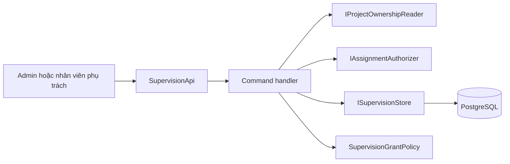
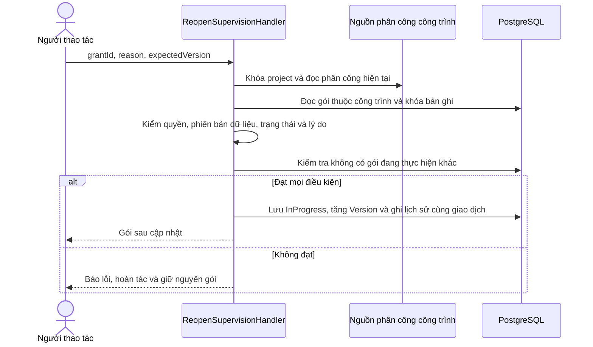
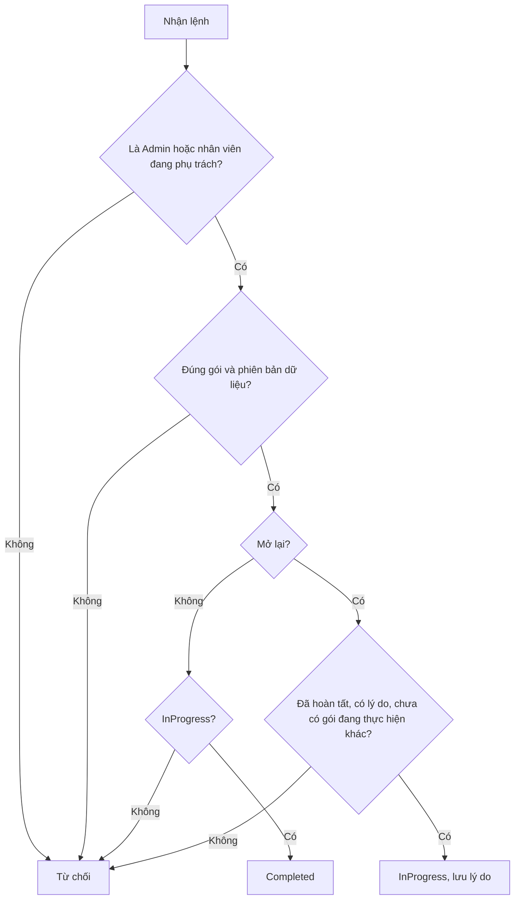
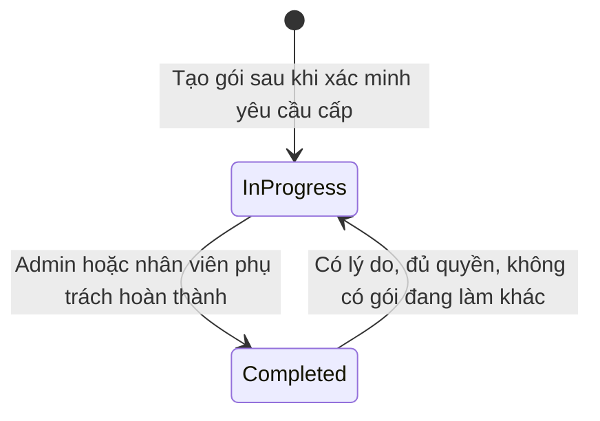
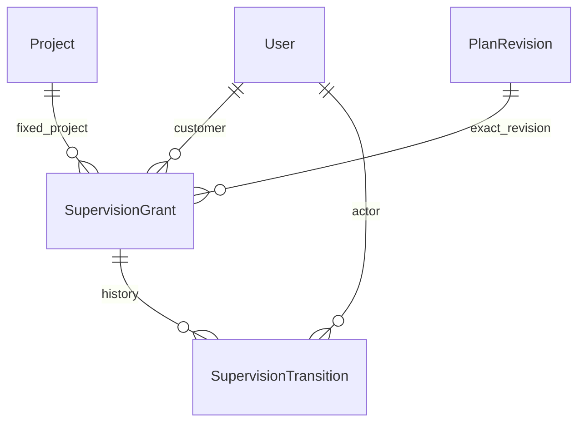

<!-- HƯỚNG DẪN CHO AI KHI ĐIỀN HOẶC CHỈNH SỬA MẪU
- Đọc toàn bộ mẫu, các comment hướng dẫn và tài liệu nguồn được cung cấp trước khi viết. Tuân thủ các quy tắc nghiệp vụ, điều kiện, ngoại lệ và giới hạn đã được xác nhận.
- Không bịa, tự chế hoặc suy đoán thành sự thật: yêu cầu, quy tắc, số liệu, API, schema, mã lỗi, nguồn tham khảo, người phụ trách và kết quả kiểm thử phải có căn cứ. Nội dung ví dụ trong mẫu không phải dữ kiện của dự án.
- Khi thiếu thông tin hoặc các nguồn mâu thuẫn, hỏi người dùng để làm rõ; giữ nguyên placeholder ở phần chưa xác định. Không tự chọn đáp án, lấp chỗ trống hay tuyên bố tài liệu đã hoàn tất.
- Chỉ thay nội dung cần điền hoặc được yêu cầu sửa. Không tự mở rộng phạm vi, sửa nghĩa quy tắc, bỏ điều kiện/ngoại lệ, xoá hay ghi đè nội dung hợp lệ đã có.
- Giữ nguyên tên, cấp và thứ tự heading, nhãn in đậm, tiền tố bullet, cấu trúc danh sách, tên/thứ tự/số cột bảng và cú pháp code fence. Không dịch, đổi tên, gộp hoặc thêm mục ngoài cấu trúc mẫu.
- Chỉ lặp khối luồng, AC hoặc API theo đúng khuôn khi có căn cứ; chỉ bỏ phần tuỳ chọn khi hướng dẫn riêng của mẫu cho phép và đã xác định không áp dụng.
- Mã tham chiếu và section phải trỏ tới tài liệu có thật đã được cung cấp hoặc kiểm chứng. Không giữ mã ví dụ như tham chiếu thật và không tự tạo tài liệu liên quan để hợp thức hoá liên kết.
- Giữ các comment hướng dẫn trong file. Xuất Markdown UTF-8, mỗi file một tài liệu; không bọc toàn bộ file trong code fence, không chèn lời dẫn hay giải thích ngoài mẫu.
- Trước khi bàn giao, đối chiếu nội dung với nguồn, kiểm tra cấu trúc, giá trị cho phép, giới hạn độ dài và tính nhất quán của mã/tham chiếu. Báo rõ phần chưa đủ thông tin; không tuyên bố đã chạy test hoặc import khi chưa thực hiện.
-->

<!-- Thay mã TDD-001 và nội dung ví dụ; giữ nguyên heading và nhãn in đậm.
Sơ đồ dùng mermaid, plantuml hoặc URL. Giữ heading Architecture, Sequence Diagram, Activity Diagram, State Diagram, Data Model.
Ví dụ API phải có heading trùng METHOD /path trong Endpoints. Xoá phần API/sơ đồ không dùng.
Version, Updated At và Change Log do lịch sử phiên bản quản lý, để trống khi nhập mới.
Author/Reviewer là tên hiển thị; gán tài khoản, phê duyệt, giả định và câu hỏi mở trên giao diện sau import.
Thiết kế phải truy vết về Story và Business Rule được cung cấp. Phân biệt thiết kế đề xuất với implementation đã kiểm chứng; không mô tả API/schema/sơ đồ ví dụ như hệ thống thật hoặc tự quyết định nghiệp vụ còn thiếu.
BẮT BUỘC KHI HOÀN THIỆN MẪU: phải có cả Reviewer và Approver, mỗi tên 1–200 ký tự sau khi bỏ khoảng trắng đầu/cuối. Không xoá hai dòng metadata, để trống, dùng tên bịa hoặc giữ placeholder rồi coi là hoàn tất.
Nếu chưa biết người review hoặc người phê duyệt, phải hỏi người dùng và báo tài liệu chưa đủ thông tin; không tự lấy Author/Owner làm người thay thế. Tên trong file không tự gán tài khoản hoặc xác nhận đã duyệt; gán thành viên trên giao diện sau import.
Đây là yêu cầu hoàn thiện mẫu; backend hiện vẫn nhận file cũ thiếu hai trường để tương thích.

VALIDATION CHO FILE NHẬP (đối chiếu ImportSnapshotValidator, MarkdownParser và ImportService):
- Mỗi file .md UTF-8 không rỗng chỉ có một heading cấp 1 chứa mã tài liệu dài 1–100 ký tự. Mã không được trùng trong cùng lần nhập hoặc thuộc loại tài liệu khác đã tồn tại.
- Không dùng tên README.md hoặc sitemap.md vì importer bỏ qua. Giao diện nhận .md/.zip, tối đa 2.000 file, tổng file tải lên 31 MiB; API giới hạn request 32 MiB và tổng nội dung đọc/giải nén 64 MiB.
- Chỉ nhập đè tài liệu cùng loại đang Draft, chưa có phiên bản và chưa lưu trữ. Import thay toàn bộ nội dung bản nháp, vì vậy phải giữ lại nội dung hợp lệ ngoài phần được yêu cầu sửa.
- Không dùng Status trong Markdown hoặc tên Approver để tự xác nhận phê duyệt; import không cấp quyền hay gán tài khoản từ tên. Chạy Kiểm tra file và xử lý lỗi/cảnh báo trước khi nhập.
- Giới hạn độ dài bên dưới tính theo string.Length của .NET (đơn vị UTF-16); không tự cắt ngắn dữ kiện quan trọng để vượt validation, hãy viết lại có căn cứ hoặc hỏi người dùng.
- Feature tối đa 300 ký tự và được dùng làm tiêu đề tài liệu. Status được parser nhận: Draft / In Review / Approved / Deprecated; tài liệu nhập mới vẫn có trạng thái phê duyệt Draft.
- Endpoint: đường dẫn tối đa 500 ký tự; tên/mô tả endpoint được lưu trong Name tối đa 300. HTTP method: GET / POST / PUT / PATCH / DELETE / HEAD / OPTIONS.
- Error Codes: mã tối đa 100 ký tự, không trùng trong tài liệu; giữ dạng - **CODE** (400): mô tả. HTTP status trong Error Codes và Response phải là số nguyên đọc được bằng Int32; không tự đặt status khác hợp đồng API.
- URL sơ đồ tối đa 1.000 ký tự. Mục sơ đồ được sử dụng phải có khối mermaid/plantuml hoặc URL theo mẫu; không để một mục sơ đồ rỗng. Nhãn mục được tách từ bullet như tên External API Fields tối đa 300 ký tự.
- Heading Examples phải khớp METHOD /path ở Endpoints. Giữ các nhãn Request:, Response 200: (thay mã theo contract) và Error Response: để parser tách đúng dữ liệu.
- Tham chiếu dạng DOC-KEY/section: ghi chú: mã đích tối đa 100 ký tự, section tối đa 100, ghi chú tối đa 1.000. Không trùng bộ mã đích + section + loại liên kết trong cùng tài liệu.
ĐỐI CHIẾU FORM TDD (src/features/tdds/validations.ts; form có thể chặt hơn import):
- Điền Feature, Author, Reviewer, Problem và ít nhất một Goal; các Goal/Non-goal/Notes đã thêm không được rỗng. API đã khai báo phải có endpoint và mô tả/mục đích; Fields phải có tên và ý nghĩa; Error Codes phải có mã, HTTP status và điều kiện.
- Form còn kiểm tra Version, Updated At và nội dung Change Log khi khai báo; với file nhập mới, giữ các trường lịch sử này trống theo hợp đồng import, không tự tạo dữ liệu lịch sử.
-->

# TDD-SUB-003

## Document Info

- **Feature**: Gói giám sát theo công trình và kiểm tra nhân viên phụ trách
- **Author**: Codex
- **Reviewer**: Tân Trần
- **Approver**: Tân Trần
- **Status**: Draft
- **Version**:
- **Updated At**:

## Context & Goals

### Problem

**Tài liệu đã bị thay thế (ghi chú 25/09/2026).** Toàn bộ thiết kế gói giám sát đã cấp trong tài liệu này, gồm gán, đổi công trình, hủy, khôi phục, hoàn thành và mở lại, đã được thay bằng ba TDD dưới đây. Nội dung bên dưới được giữ nguyên chỉ để tra cứu lịch sử; không dùng Architecture, sơ đồ, Data Model hay Internal API của tài liệu này để triển khai hoặc viết migration.

| Phần | Thiết kế hiện hành |
| --- | --- |
| Cấp gói chưa gán sau thanh toán, hạn gán lần đầu một năm, khách gán công trình (gói đã gắn không đổi công trình, quyết định 25/09/2026), schema `SupervisionGrant` | [TDD-SUB-004](TDD-SUB-004.md) |
| Nhân viên hủy và khôi phục gói, `PackageLifecycleEvent`, `PackageMutationReceipt` | [TDD-SUB-005](TDD-SUB-005.md) |
| Hoàn thành và mở lại, trạng thái `Completed`, gói `Completed` vẫn giữ chỗ trên công trình, quyền `supervision.complete` cùng phân công theo gói | [TDD-SUB-006](TDD-SUB-006.md) |
| Mua gói và nguồn cấp gói từ đơn đã thanh toán | [TDD-PAY-001](TDD-PAY-001.md) |

Hai quyết định ngày 25/09/2026 cũng làm phần còn lại của tài liệu này lỗi thời: gói giám sát gắn với công trình (`ConstructionSite`), một thực thể riêng khác bản dự toán; đợt này nhân viên được phân công theo từng gói giám sát, mỗi gói một người phụ trách (BR-RBAC-013); gói đã gắn công trình thì không đổi công trình (BR-SUB-009). Các chỗ ghi `Project`/`ProjectId`, sửa liên kết hay phân công công trình bên dưới là nội dung của bản cũ.

**Cập nhật 24/09/2026:** Hoàn thành và mở lại vẫn thuộc phạm vi. Thiết kế hiện hành của hai thao tác này là [TDD-SUB-006](TDD-SUB-006.md): trạng thái `Completed` nằm trên vòng đời `Unassigned`/`Assigned`/`CanceledByStaff`, và nhân viên phải được phân công công trình đó. Không dùng Architecture, sơ đồ, Internal API hay Data Model của tài liệu này để triển khai.

**Cập nhật hợp đồng khi bổ sung thanh toán:** TDD-SUB-004 thay mô hình luôn bắt buộc ProjectId bằng gói chưa gán, hạn gán một năm và sửa liên kết có quyền riêng. TDD-SUB-005 bổ sung hủy/restore, khác hoàn thành/mở lại. Không áp dụng cấm sửa ProjectId hoặc thiếu hạn gán của schema cũ cho luồng mới. Các API hoàn thành/mở lại lịch sử không tự trở thành chức năng quản lý khảo sát của đợt này. Xem [bàn giao thiết kế mới](../discovery/payment-technical-design.md). Các phần còn lại giữ làm nguồn thiết kế; nội dung bị thay phải đọc theo TDD mới trước khi triển khai.

Tài liệu này thiết kế cách lưu và quản lý trạng thái của gói giám sát đã cấp cho một công trình theo STORY-SUB-003. Gói không tự hết hạn. Admin hoặc nhân viên đang được phân công phụ trách công trình được hoàn tất hoặc mở lại gói; mở lại phải có lý do.

Chức năng giám sát thực tế, lịch hẹn và bộ đếm lượt vẫn vận hành ngoài website, chưa triển khai trong phạm vi này. Backend hiện chưa có module công trình (`Project`) hoặc phân công nhân viên. `RoleNames` hiện chỉ có User/Admin; thiết kế không coi vai trò Staff là đã tồn tại.

### Goals

- Mỗi gói đã cấp gắn cố định với một tài khoản và một công trình. Mỗi công trình có tối đa một gói đang thực hiện (`InProgress`).
- Khi hoàn tất hoặc mở lại, kiểm tra quyền của người thao tác theo phân công hiện tại. Mở lại bắt buộc có lý do.
- Giữ nguyên phiên bản quyền lợi đã cấp, kể cả khi mở lại hoặc khi Admin sửa danh mục gói. Không tạo kỳ tháng/năm hoặc hạn mức lượt cho giám sát.

### Non-goals

- Lịch, số lượt kiểm tra, báo cáo/tiến độ/vật liệu và logic quyền lợi giám sát đang offline.
- Tự thêm giá/thời hạn 6 tháng, gói free, chuyển project hoặc thiết kế module Project đầy đủ.
- Tự gán role Staff cho User, cấp gói qua Admin hoặc API thanh toán.

## Architecture

`SupervisionGrantPolicy` chứa các điều kiện nghiệp vụ để hoàn tất hoặc mở lại gói. Hai lớp `CompleteSupervisionHandler` và `ReopenSupervisionHandler` điều phối việc kiểm tra quyền, đọc dữ liệu và lưu thay đổi.

Hai interface dự kiến tách trách nhiệm đọc và ghi dữ liệu:

- `IProjectOwnershipReader`: đọc người sở hữu công trình (`ProjectAccountId`). Dữ liệu phải lấy từ module công trình, không lấy từ các cờ do trình duyệt gửi lên.
- `IAssignmentAuthorizer`: trả lời người thao tác có đang phụ trách công trình đó tại thời điểm thao tác hay không. Interface này do [TDD-RBAC-003](TDD-RBAC-003.md#architecture) định nghĩa và đã có nguồn dữ liệu thật là bảng `Assignment`; nó thay cho `IProjectAssignmentReader` của bản trước. Tư cách nhân viên không còn là một cờ riêng: nó được xác định bằng `User.AccountKind` cùng quyền `supervision.complete` trong claim `perm`, theo [TDD-RBAC-001](TDD-RBAC-001.md#architecture).
- `ISupervisionStore`: đọc và cập nhật gói giám sát cùng lịch sử chuyển trạng thái trong database.

Lớp thực hiện một interface để kết nối với module hoặc database được gọi là adapter. Adapter của `IAssignmentAuthorizer` đã có thiết kế và nguồn dữ liệu thật ở [TDD-RBAC-003](TDD-RBAC-003.md); adapter của `IProjectOwnershipReader` vẫn chưa có vì module công trình chưa được triển khai. Chỉ bật API sau khi có nguồn dữ liệu xác minh quyền sở hữu và quy ước khóa dữ liệu dùng chung. Unit test có thể dùng dữ liệu giả lập cho các interface này; điều đó không chứng minh hệ thống thật đã tích hợp.

**Các kỹ thuật được sử dụng trong thiết kế**:

Các kỹ thuật dưới đây quản lý gói giám sát đã cấp, quyền hoàn tất/mở lại và lịch sử thao tác. Đây là thiết kế đề xuất; module công trình/phân công chưa đủ để bật API thực tế.

| Kỹ thuật                                            | Mục đích trong TDD này                                                      |
| --------------------------------------------------- | --------------------------------------------------------------------------- |
| 1. Tách điều kiện nghiệp vụ qua policy và interface | Kiểm tra quy tắc độc lập với nơi lưu công trình, phân công và gói.          |
| 2. Phân quyền theo vai trò và phân công hiện tại    | Cho Admin hoặc nhân viên đang phụ trách thao tác đúng công trình.           |
| 3. State machine                                    | Chỉ cho chuyển InProgress/Completed theo điều kiện hoàn tất hoặc mở lại.    |
| 4. Database transaction                             | Cập nhật trạng thái, Version và lịch sử cùng thành công hoặc cùng hoàn tác. |
| 5. Optimistic concurrency                           | Phát hiện người thao tác đang dùng phiên bản dữ liệu cũ.                    |
| 6. Pessimistic locking                              | Khóa công trình trước gói để kiểm quyền và trạng thái nhất quán khi ghi.    |
| 7. Chỉ mục duy nhất có điều kiện                    | Bảo đảm mỗi công trình tối đa một gói InProgress.                           |
| 8. Lịch sử chuyển trạng thái — audit trail          | Lưu ai đã hoàn tất/mở lại, thời điểm và lý do.                              |
| 9. Tham chiếu phiên bản quyền lợi bất biến          | Mở lại vẫn giữ cấu hình gói đã cấp ban đầu.                                 |
| 10. Khóa ngoại và ràng buộc dữ liệu                 | Bảo vệ quan hệ gói/lịch sử và điều kiện trạng thái ngay khi lưu.            |

**1. Policy và interface — tách quy tắc khỏi nơi lấy dữ liệu**:

SupervisionGrantPolicy kiểm tra điều kiện nghiệp vụ. Handler dùng IProjectOwnershipReader để lấy chủ công trình, dùng IAssignmentAuthorizer để hỏi người thao tác có đang phụ trách công trình đó không, và dùng ISupervisionStore để đọc/ghi gói. Adapter là lớp thực hiện kết nối với nguồn dữ liệu tương ứng.

Ví dụ unit test cung cấp trường hợp người gọi từng là nhân viên phụ trách nhưng đã bị rút phân công để kiểm quy tắc từ chối. Không cần dựng API công trình để kiểm nhánh đó; tuy nhiên, mock không chứng minh nguồn phân công thật đã tích hợp hoặc khóa database hoạt động đúng. Chưa có nguồn xác minh thì API chưa được bật.

**2. Phân quyền theo vai trò và phân công hiện tại**:

Người gọi phải có phiên hợp lệ. Admin được thao tác theo quyền quản trị. Người không phải Admin phải được nguồn phân công xác nhận đồng thời là nhân viên và đang phụ trách đúng công trình. Không nhận cờ IsEmployee hoặc IsCurrentlyAssigned do trình duyệt tự khai làm bằng chứng.

Ví dụ nhân viên A đã bị rút phân công thì không được hoàn tất gói, dù màn hình còn mở từ trước. Chủ công trình chỉ là khách hàng cũng không tự có quyền nhân viên. Dữ liệu phân công phải được kiểm tại lúc quyết định dưới cơ chế khóa dùng chung; không chỉ kiểm khi mở màn hình. Backend chưa có vai trò Staff hoặc module phân công đầy đủ, nên phần ánh xạ quyền vẫn là phụ thuộc cần triển khai.

**3. State machine — vòng đời gói giám sát**:

Gói bắt đầu ở InProgress sau khi yêu cầu cấp đã được server xác minh. Người đủ quyền có thể chuyển sang Completed. Mở lại từ Completed sang InProgress yêu cầu lý do không rỗng và công trình chưa có gói InProgress khác.

Ví dụ SG1 đã Completed, Admin nhập lý do kiểm tra bổ sung thì được mở lại nếu không có gói đang thực hiện khác. Nếu đã có SG2 InProgress trên công trình đó, SG1 không được mở lại. Không có tự hết hạn, tự gia hạn hoặc thay trạng thái vì Plan vừa ngừng bán. Sơ đồ không đồng nghĩa quy trình mua/thanh toán đã được thiết kế.

**4. Database transaction — trạng thái và lịch sử phải khớp**:

Handler dùng ITransactionalRequest và cùng DbContext/UoW để cập nhật SupervisionGrant.State, Version, CompletedAtUtc và tạo SupervisionTransition. Các thay đổi cùng thành công hoặc cùng rollback.

Ví dụ mở lại gói đã đổi State nhưng ghi lý do vào lịch sử lỗi thì phải hoàn tác cả thay đổi State, không để có gói mở lại mà không biết lý do. Quy ước transaction và xử lý exception được định nghĩa tại [TDD-SUB-002, Architecture](TDD-SUB-002.md#architecture); đây không phải transaction riêng lồng bên trong transaction của handler.

**5. Optimistic concurrency — kiểm tra expectedVersion**:

Client gửi expectedVersion đã đọc từ SupervisionGrant. Sau khi lấy khóa, handler so với Version thực tế. Khớp thì kiểm các điều kiện còn lại, cập nhật và tăng Version; không khớp thì trả 409 SupervisionStateConflict, không ghi lịch sử.

Ví dụ hai người đọc Version=2. Người A hoàn tất làm Version=3; người B gửi thao tác dựa trên Version=2 thì bị từ chối. Người B cần tải lại và quyết định dựa trên trạng thái mới; không tự thay expectedVersion rồi gửi lại một quyết định cũ.

TDD này không thiết kế idempotency key và response replay cho hoàn tất/mở lại. Nếu thao tác đã thành công nhưng phản hồi mất mạng, gửi lại cùng expectedVersion cũ nhận 409; client đọc lại trạng thái và lịch sử. Không tạo thêm dòng lịch sử. Đây khác với tra cứu ở TDD-SUB-002, nơi cùng key trả lại nội dung đã lưu.

**6. Pessimistic locking — khóa công trình rồi khóa gói**:

Trong transaction, handler khóa bản ghi công trình trước rồi khóa SupervisionGrant, kiểm phân công/quyền, Version và trạng thái trước khi sửa. Thao tác sửa phân công phải tuân theo cùng khóa công trình để không rút quyền giữa lúc kiểm và ghi mà không được phát hiện. Khóa được nhả khi transaction kết thúc; không giữ khóa suốt thời gian người dùng đang mở biểu mẫu.

Ví dụ việc rút phân công của A đã commit trước khi handler hoàn tất lấy khóa, handler phải đọc được phân công mới và từ chối A. Nếu handler đang giữ khóa trước, thao tác đổi phân công phải chờ. Optimistic concurrency kiểm dữ liệu client đã đọc, còn khóa database bảo vệ lúc kiểm/ghi: hai cơ chế bổ sung nhau.

Module Project chưa có nên chưa thể triển khai lệnh khóa trên bảng thực tế. Nếu phân công nằm ở dịch vụ khác thì khóa database cục bộ không tự bảo vệ được dữ liệu đó; phải thiết kế cơ chế xác minh khác trước khi dùng. Kiểm chứng tranh chấp phân công bằng [ST-SUB-116](../systemtest/ST-SUB-116.md).

**7. Chỉ mục duy nhất có điều kiện — tối đa một gói đang thực hiện**:

Chỉ mục `UX_Supervision_Project_InProgress(ProjectId) WHERE State='InProgress'` chỉ áp tính duy nhất cho các dòng đang thực hiện. Một công trình có thể có lịch sử nhiều gói Completed, nhưng không thể có hai dòng InProgress cùng lúc.

Ví dụ hai yêu cầu cố mở lại hai gói khác nhau trên cùng công trình: khóa công trình điều phối chúng; chỉ mục là lớp bảo vệ cuối tại database. Nếu vẫn có ghi vi phạm chỉ mục, trả 409 SupervisionAlreadyActive và hoàn tác giao dịch, không để lại lịch sử mở lại giả. Dùng hai connection PostgreSQL thật để kiểm chứng theo [ST-SUB-115](../systemtest/ST-SUB-115.md), không thay bằng EF InMemory.

**8. Lịch sử chuyển trạng thái — audit trail**:

Mỗi lần hoàn tất hoặc mở lại thành công tạo một SupervisionTransition với trạng thái trước/sau, ActorId, thời điểm, lý do và GrantVersion sau cập nhật. Khi mở lại, CompletedAtUtc trên gói được đặt về NULL nhưng thời điểm hoàn tất cũ vẫn còn trong lịch sử.

Ví dụ SG1 hoàn tất ở Version=2 rồi mở lại ở Version=3 có hai dòng lịch sử riêng. UNIQUE(GrantId,GrantVersion) ngăn hai dòng lịch sử cho cùng một phiên bản cập nhật. Yêu cầu bị từ chối hoặc rollback không có dòng lịch sử thành công.

Đây là lịch sử bổ sung cho trạng thái hiện tại, không phải Event Sourcing: ứng dụng đọc State hiện tại trên SupervisionGrant, không phải dựng lại gói bằng cách chạy toàn bộ chuỗi sự kiện.

**9. Tham chiếu phiên bản quyền lợi bất biến — giữ cam kết đã cấp**:

SupervisionGrant.RevisionId tham chiếu `PlanRevision` được định nghĩa tại [TDD-SUB-001, Data Model](TDD-SUB-001.md#data-model). PlanRevision và cấu hình con đã Published không được sửa. TDD này không tạo một bảng phiên bản quyền lợi khác.

Ví dụ SG1 được cấp theo SR1. Sau đó website bán SR2; hoàn tất rồi mở lại SG1 vẫn giữ RevisionId=SR1. Không tự đổi sang phiên bản mới hoặc chuyển gói sang công trình/tài khoản khác. Version của SG1 có thể tăng mỗi lần thao tác, nhưng RevisionId của quyền lợi giữ nguyên.

**10. Khóa ngoại và ràng buộc dữ liệu**:

Khóa ngoại nối grant với tài khoản/phiên bản và nối lịch sử với grant/người thao tác. Chính sách RESTRICT ngăn xóa bản ghi đang được dữ liệu lịch sử tham chiếu. CHECK yêu cầu trạng thái hợp lệ, gói Completed có CompletedAtUtc; dòng mở lại phải có lý do sau khi bỏ khoảng trắng đầu/cuối.

Ví dụ lý do chỉ có khoảng trắng không hợp lệ, còn trạng thái Completed thiếu thời điểm hoàn tất cũng không được lưu. Validator báo lỗi dễ hiểu trước khi ghi, ràng buộc database bảo vệ thêm ở lúc lưu. ProjectId, AccountId và RevisionId không được sửa sau khi cấp theo quy tắc ứng dụng; không coi khóa ngoại tự cấm mọi phép đổi sang một giá trị hợp lệ khác. Khóa ngoại Project chỉ bổ sung khi module công trình đã có bảng thực tế.



**Notes**:

- Giữ module giám sát trong cùng ứng dụng hiện tại, không tách thành dịch vụ riêng. Quyền Boolean chỉ phục vụ cấu hình/hiển thị; việc hoàn tất hoặc mở lại phụ thuộc công trình, gói đã cấp và người thao tác.
- Admin phải có phiên xác thực hợp lệ. Với nhân viên, hệ thống phải xác nhận cả tư cách nhân viên và việc đang phụ trách công trình. Khách sở hữu công trình không tự có quyền của nhân viên.
- Cách ánh xạ vai trò và quyền nay đã được chốt ở [TDD-RBAC-001](TDD-RBAC-001.md): người thao tác phải có quyền `supervision.complete` trong claim `perm`, và vì mã quyền này có `RequiresAssignment = true` nên còn phải qua thêm bước kiểm phân công. Cột `User.Role` kiểu chuỗi đã bị bỏ, nên điều kiện `User.Role != User` của bản trước không còn dùng được và cũng không được thay bằng cờ Staff tự thêm vào phiên đăng nhập. Nếu chưa xác minh được quyền thì từ chối thao tác.
- Các lệnh ghi dữ liệu phải triển khai `ITransactionalRequest`. Việc sửa gói và ghi lịch sử dùng chung một giao dịch database: cùng lưu thành công hoặc cùng hoàn tác khi lỗi. Cách quản lý giao dịch được định nghĩa tại [TDD-SUB-002, Architecture](TDD-SUB-002.md#architecture).

## Sequence Diagram



## Activity Diagram



## State Diagram



Bước “Tạo gói sau khi xác minh yêu cầu cấp” nghĩa là: phần xử lý cấp gói phía server xác nhận yêu cầu được phép thực hiện, rồi tạo `SupervisionGrant` cho đúng tài khoản, công trình và phiên bản gói. Phải kiểm tra công trình thuộc tài khoản đó, phiên bản thuộc gói giám sát và công trình chưa có gói khác đang thực hiện. Yêu cầu từ trình duyệt không tự được coi là bằng chứng đủ điều kiện cấp gói.

Luồng mua/thanh toán và thành phần cụ thể gửi yêu cầu cấp gói chưa được thiết kế. Sơ đồ chỉ mô tả trạng thái sau khi yêu cầu đã được xác minh; không có nghĩa đã có API cấp gói hoặc Admin được cấp gói thủ công.

Gói không có bộ đếm thời gian tự hết hạn hoặc trạng thái gia hạn. Ngừng bán hay công bố phiên bản quyền lợi mới không làm đổi trạng thái gói đã cấp.

**Kiểm soát cập nhật đồng thời bằng `Version` (optimistic concurrency)**:

1. Client gửi `expectedVersion` là Version của gói mà người dùng đã xem.
2. Handler khóa công trình trước, rồi khóa bản ghi gói trong giao dịch database. Sau đó kiểm tra quyền, trạng thái và so sánh `expectedVersion` với `SupervisionGrant.Version` hiện tại.
3. Nếu khớp và đủ điều kiện, cập nhật trạng thái, tăng Version và ghi `SupervisionTransition` trong cùng giao dịch.
4. Nếu không khớp, trả HTTP 409 `SupervisionStateConflict`; không sửa gói hoặc thêm lịch sử. Người dùng phải tải lại dữ liệu trước khi quyết định thao tác tiếp.

Ví dụ: hai người cùng xem Version=2. Người thứ nhất cập nhật thành công làm Version tăng lên 3; yêu cầu của người thứ hai còn gửi expectedVersion=2 sẽ bị từ chối. Gửi lại yêu cầu đã thành công với version cũ cũng nhận 409, không thêm lịch sử lần hai. `Version` kiểm soát thay đổi dữ liệu, còn `RevisionId` chỉ phiên bản quyền lợi đã mua. Khóa database bảo vệ lúc thực hiện giao dịch; kiểm tra Version phát hiện yêu cầu dựa trên dữ liệu đã cũ.

## Data Model

**Phần này đã bị thay thế, chỉ giữ để tra cứu.** Thiết kế hiện hành của `SupervisionGrant` là [TDD-SUB-004, Data Model](TDD-SUB-004.md#data-model), bổ sung hủy và khôi phục tại [TDD-SUB-005, Data Model](TDD-SUB-005.md#data-model). Luồng hiện hành là mua trước rồi gán công trình sau: cột công trình được phép NULL và trạng thái là `Unassigned`/`Assigned`/`CanceledByStaff`, cộng `Completed` do [TDD-SUB-006](TDD-SUB-006.md#data-model) bổ sung lại trên vòng đời mới; không còn `InProgress` và không còn `CompletedAtUtc`. Lịch sử thay đổi được ghi ở `SupervisionAssignmentEvent` (TDD-SUB-004) và `PackageLifecycleEvent` (TDD-SUB-005, TDD-SUB-006), nên `SupervisionTransition` dưới đây không được tạo mới. Không dùng phần này để viết migration.

Các model dưới đây mô tả gói giám sát đã cấp cho một công trình và lịch sử thay đổi trạng thái. Đây là thiết kế dự kiến, chưa phải các bảng hoặc class đã triển khai.

| Model                   | Ý nghĩa và mục đích                                                                                                                                                                                    | Quan hệ với model khác                                                                                                                                      |
| ----------------------- | ------------------------------------------------------------------------------------------------------------------------------------------------------------------------------------------------------ | ----------------------------------------------------------------------------------------------------------------------------------------------------------- |
| `SupervisionGrant`      | Đại diện cho một gói giám sát đã cấp, gắn cố định với một công trình. Lưu phiên bản quyền lợi đã chốt và trạng thái đang thực hiện hoặc đã hoàn tất; không có chu kỳ hết hạn hay bộ đếm lượt thiết kế. | Thuộc tài khoản `User`, gắn với `Project` và tham chiếu một `PlanRevision`. Mỗi công trình chỉ có tối đa một grant ở trạng thái `InProgress`.               |
| `SupervisionTransition` | Ghi lịch sử mỗi lần chuyển trạng thái của gói giám sát: trạng thái trước/sau, người thao tác, thời điểm và lý do. Dùng để biết ai đã hoàn tất hoặc mở lại gói.                                         | Thuộc một `SupervisionGrant`; `ActorId` tham chiếu người thao tác. Mở lại phải lưu lý do, đồng thời giữ nguyên phiên bản quyền lợi và công trình của grant. |

Ví dụ: khi người có quyền hoàn tất giám sát, `SupervisionGrant` chuyển sang `Completed` và có một dòng `SupervisionTransition` ghi lại thao tác. Nếu sau đó được mở lại hợp lệ, chính grant đó trở về `InProgress`; lịch sử hoàn tất vẫn còn và quyền lợi vẫn lấy từ phiên bản đã cấp ban đầu.

**Nguồn của các bảng được tham chiếu**:

- `Plan`, `PlanRevision`, `BenefitDefinition`, `RevisionBenefit`, `PlanOffer` và `OfferQuota` được định nghĩa tại [TDD-SUB-001, Data Model](TDD-SUB-001.md#data-model). TDD này dùng lại các bảng đó, không tạo một bộ bảng danh mục riêng.
- `User` là bảng tài khoản đã có trong backend, xem [UserConfiguration](../../bmt-be/src/bmt-be.persistence/configurations/UserConfiguration.cs).
- `Project` thuộc module công trình chưa được thiết kế đầy đủ. Chưa có TDD nguồn hoặc bảng thực tế để tham chiếu; sơ đồ bên dưới chỉ biểu diễn quan hệ cần có.

| Bảng dự kiến          | Trường và ràng buộc                                                                                                                                                                                                                                                                                                                                     |
| --------------------- | ------------------------------------------------------------------------------------------------------------------------------------------------------------------------------------------------------------------------------------------------------------------------------------------------------------------------------------------------------- |
| SupervisionGrant      | `Id uuid PK`, `AccountId uuid NN FK User`, `ProjectId uuid NN` FK Project khi module đó tồn tại, `RevisionId uuid NN FK PlanRevision`, `State varchar(16) NN` InProgress/Completed, `Version bigint NN`, `GrantedAtUtc timestamptz NN`, `CompletedAtUtc timestamptz NULL`; CHECK state hợp lệ, Completed yêu cầu completedAt; không có cycle/end/quota. |
| SupervisionTransition | `Id uuid PK`, `GrantId uuid NN FK`, `FromState varchar(16) NN`, `ToState varchar(16) NN`, `ActorId uuid NN FK User`, `OccurredAtUtc timestamptz NN`, `Reason text NULL`, `GrantVersion bigint NN`; UNIQUE(GrantId,GrantVersion), reason trim không rỗng khi ToState=InProgress.                                                                         |



**Dữ liệu mẫu để đọc ERD**:

Các bảng sau minh họa dữ liệu của thiết kế, chưa được ghi vào database. Giá, hạn mức, ngày và nội dung đều là ví dụ, không phải cấu hình kinh doanh đã chốt. Mã như `U1`, `P1`, `R1` là tên viết tắt của UUID để dễ theo dõi; cùng mã trong ba TDD chỉ cùng một bản ghi. `NULL` là giá trị rỗng trong database. Chỉ liệt kê các cột cần giải thích; cột bắt buộc không xuất hiện trong bảng mẫu vẫn phải được ghi đầy đủ khi triển khai. Các thời điểm có hậu tố `Z` là UTC, giờ Việt Nam bằng UTC cộng 7 giờ.

Tài khoản `U1` và công trình `PRJ1` dùng cùng mã minh họa như [TDD-SUB-002](TDD-SUB-002.md#data-model). Gói giám sát độc lập với subscription thiết kế của U1.

Các bản ghi danh mục được tham chiếu — đây là phần trích các cột liên quan, không phải schema riêng cho giám sát:

| Model        | Id  | Quan hệ                 | Dữ liệu liên quan                                                                                          |
| ------------ | --- | ----------------------- | ---------------------------------------------------------------------------------------------------------- |
| Plan         | P2  | PublishedRevisionId=SR1 | Kind=Supervision; SaleState=OnSale; Code=supervision-demo                                                  |
| PlanRevision | SR1 | PlanId=P2               | Number=1; State=Published; Name=Giám sát minh họa; Description=Gói giám sát gắn với một công trình cụ thể. |

Quyền hiển thị bổ sung của giám sát chưa chốt danh sách nên ví dụ không tự tạo `BenefitDefinition` hoặc `RevisionBenefit` mới. Gói giám sát không có `PlanOffer` tháng/năm và không có `OfferQuota`; giá của nó nằm ở dòng `PlanOffer` có `OfferKey=Project` theo [TDD-PAY-001](TDD-PAY-001.md#data-model). Số tiền cụ thể chưa chốt nên ví dụ không đặt giá và không mô tả luồng mua giám sát.

`SupervisionGrant` — trạng thái hiện tại sau khi đã hoàn tất rồi mở lại:

| Id  | AccountId | ProjectId | RevisionId | State      | Version | GrantedAtUtc         | CompletedAtUtc |
| --- | --------- | --------- | ---------- | ---------- | ------- | -------------------- | -------------- |
| SG1 | U1        | PRJ1      | SR1        | InProgress | 3       | 2026-09-10T03:00:00Z | NULL           |

`SupervisionTransition` — lịch sử còn nguyên sau khi mở lại:

| Id  | GrantId | FromState  | ToState    | ActorId | OccurredAtUtc        | Reason                                | GrantVersion |
| --- | ------- | ---------- | ---------- | ------- | -------------------- | ------------------------------------- | ------------ |
| TR1 | SG1     | InProgress | Completed  | ADMIN1  | 2026-09-17T03:00:00Z | NULL                                  | 2            |
| TR2 | SG1     | Completed  | InProgress | ADMIN1  | 2026-09-18T03:00:00Z | Cần kiểm tra lại hạng mục đã hoàn tất | 3            |

`ADMIN1` viết tắt UUID của một tài khoản Admin hợp lệ; không phải chuỗi role được lưu vào ActorId. Việc cấp ban đầu tạo SG1 với `Version=1`, `State=InProgress`. Sau TR1, SG1 có `Version=2`, `CompletedAtUtc=2026-09-17T03:00:00Z`. Sau TR2, SG1 trở về InProgress, tăng Version lên 3 và đặt CompletedAtUtc về NULL; thời điểm hoàn tất cũ vẫn đọc được từ TR1.

Trong cả hai lần chuyển trạng thái, `AccountId=U1`, `ProjectId=PRJ1` và `RevisionId=SR1` không đổi. Không tạo grant thứ hai hoặc cấp thêm quota khi mở lại. Nếu PRJ1 đã có grant khác InProgress thì không được ghi TR2; SG1 phải giữ Completed. Module Project và phân công nhân viên vẫn là phụ thuộc chưa triển khai; ví dụ dùng Admin để không giả định đã có dữ liệu phân công.

**Notes**:

- Chưa tạo khóa ngoại tới Project vì bảng này chưa tồn tại. Khi cấp gói, phần xử lý phía server phải xác minh `ProjectAccountId==AccountId` và `Plan.Kind==Supervision`.
- Chỉ mục duy nhất có điều kiện `UX_Supervision_Project_InProgress(ProjectId) WHERE State='InProgress'` ngăn hai gói cùng đang thực hiện trên một công trình. Handler khóa công trình trước rồi khóa gói. Chức năng sửa phân công cũng phải dùng cùng khóa công trình để việc kiểm tra nhân viên phụ trách không bị lỗi thời giữa chừng.
- Nếu dữ liệu phân công nằm ở dịch vụ khác, cần thiết kế thêm cách kiểm tra phiên bản hoặc bằng chứng phân quyền được xác thực. Hiện chưa chọn kiến trúc phân tán đó.
- Khóa ngoại dùng RESTRICT để ngăn xóa dữ liệu đang được lịch sử tham chiếu. Không sửa `ProjectId`, `AccountId` hoặc `RevisionId` sau khi cấp. Mở lại vẫn dùng phiên bản quyền lợi ban đầu, không lấy phiên bản đang bán.
- Mở lại đặt `CompletedAtUtc` về NULL; thời điểm hoàn tất cũ còn trong `SupervisionTransition`. Không tự đổi trạng thái công trình, gửi thông báo hoặc tạo hạn mức lượt giám sát.
- Chỉ mục `(AccountId,ProjectId,GrantedAtUtc)` hỗ trợ đọc gói; `(GrantId,OccurredAtUtc)` hỗ trợ xem lịch sử. Nếu hai yêu cầu cùng cố tạo gói đang thực hiện, chỉ mục duy nhất chặn lần ghi vi phạm; chuyển lỗi đó thành HTTP 409 `SupervisionAlreadyActive`.
- Có thể triển khai điều kiện nghiệp vụ và unit test trước. API chỉ sẵn sàng tích hợp khi có lớp truy cập database cùng nguồn xác minh vai trò, công trình và phân công.

## Internal API

### Endpoints

Các đường dẫn dưới đây là dự kiến. Chỉ bật sau khi thống nhất và triển khai cách lấy dữ liệu công trình/phân công. Phạm vi này không cung cấp API công khai để cấp gói giám sát.

- **POST** `/api/v1/projects/{projectId}/supervision-grants/{grantId}/complete` — Người đã xác thực là Admin hoặc nhân viên đang phụ trách; gửi `expectedVersion`. Chỉ chuyển InProgress sang Completed.
- **POST** `/api/v1/projects/{projectId}/supervision-grants/{grantId}/reopen` — Cùng điều kiện phân quyền; gửi `expectedVersion` và `reason` không rỗng. Chỉ mở lại gói Completed khi công trình chưa có gói InProgress khác.

### Examples

#### POST /api/v1/projects/{projectId}/supervision-grants/{grantId}/reopen

```
Request:
{"expectedVersion":2,"reason":"Đã bấm hoàn thành nhầm"}

Response 200:
{"value":{"grantId":"33333333-3333-3333-3333-333333333333","state":"InProgress","version":3},"isSuccess":true,"isFailure":false,"error":{"code":"","message":""}}

Error Response:
{"title":"Conflict","code":"SupervisionAlreadyActive","status":409,"detail":"Dự án đã có gói giám sát đang thực hiện.","messageCode":"SupervisionAlreadyActive","errors":null}
```

### Error Codes

- **Unauthorized** (401): phiên không hợp lệ.
- **AccessForbidden** (403): không là Admin/nhân viên hiện phụ trách.
- **SupervisionNotFound** (404): không tìm thấy gói hoặc gói không thuộc công trình/tài khoản được phép truy cập.
- **SupervisionStateConflict** (409): trạng thái hoặc expectedVersion không khớp.
- **SupervisionAlreadyActive** (409): công trình đã có gói khác đang thực hiện (InProgress).
- **ReopenReasonRequired** (422): lý do bị thiếu, rỗng hoặc chỉ có khoảng trắng.

## References

### User Stories

- STORY-SUB-003/AC-001
- STORY-SUB-003/AC-002
- STORY-SUB-003/AC-003
- STORY-SUB-003/AC-006
- STORY-SUB-003/AC-007
- STORY-SUB-003/AC-008
- STORY-SUB-003/AC-009
- STORY-SUB-003/AC-010

### Business Rules

- BR-SUB-004/Then
- BR-SUB-006/Then
- BR-SUB-009/Then
- BR-SUB-011/Then
- BR-SUB-012/Then
- BR-SUB-013/Then

### Use Cases

- STORY-SUB-003/Main Flow

### Others

- Tài liệu này đã bị thay thế, chỉ giữ để tra cứu: gán và đổi công trình theo [TDD-SUB-004](TDD-SUB-004.md); hủy và khôi phục theo [TDD-SUB-005](TDD-SUB-005.md); hoàn thành và mở lại theo [TDD-SUB-006](TDD-SUB-006.md); cấp gói từ thanh toán theo [TDD-PAY-001](TDD-PAY-001.md). Các tham chiếu User Story, Business Rule và kiểm thử bên dưới là của bản cũ; truy vết hiện hành xem ở ba TDD trên.

Đặc tả kiểm thử mới (Draft, chưa thực thi):

- [UT-SUB-050](../unittest/UT-SUB-050.md) (đã rút khỏi nghiệm thu ngày 25/09/2026)
- [UT-SUB-051](../unittest/UT-SUB-051.md)
- [UT-SUB-052](../unittest/UT-SUB-052.md)
- [UT-SUB-053](../unittest/UT-SUB-053.md)
- [UT-SUB-054](../unittest/UT-SUB-054.md)
- [UT-SUB-055](../unittest/UT-SUB-055.md)
- [UT-SUB-056](../unittest/UT-SUB-056.md)
- [UT-SUB-057](../unittest/UT-SUB-057.md)
- [UT-SUB-058](../unittest/UT-SUB-058.md)
- [ST-SUB-115](../systemtest/ST-SUB-115.md)
- [ST-SUB-116](../systemtest/ST-SUB-116.md)

- TDD-SUB-001/Data Model
- TDD-SUB-002/Architecture
- ST-SUB-021/System Test
- ST-SUB-022/System Test
- ST-SUB-023/System Test
- ST-SUB-026/System Test
- ST-SUB-027/System Test
- ST-SUB-028/System Test
- ST-SUB-029/System Test
- ST-SUB-030/System Test
- ST-SUB-031/System Test
- ST-SUB-032/System Test
- ST-SUB-033/System Test
- [Phần lịch/lượt giám sát đã hoãn](../debt/supervision-offline.md).
- Mô hình vai trò và quyền: [TDD-RBAC-001](TDD-RBAC-001.md); cơ chế phân công và `IAssignmentAuthorizer`: [TDD-RBAC-003](TDD-RBAC-003.md).
- Hiện trạng mã nguồn: [RoleNames](../../bmt-be/src/bmt-be.contract/constants/RoleNames.cs), [ICurrentUserService](../../bmt-be/src/bmt-be.application/abstractions/ICurrentUserService.cs), [DbContext](../../bmt-be/src/bmt-be.persistence/ApplicationDbContext.cs).

## Change Log

- 2026-09-25 (lần 2): Sửa ghi chú thay thế ở đầu tài liệu theo quyết định mới: phân công theo gói, gói đã gắn không đổi công trình, TDD-SUB-004 không còn bảng `SupervisionAssignmentEvent`. Nội dung lịch sử bên dưới giữ nguyên.
- 2026-09-25: Thêm ghi chú ở đầu Context & Goals và References rằng toàn bộ thiết kế gói giám sát đã cấp của tài liệu này đã được thay: gán/đổi công trình theo TDD-SUB-004, hủy/khôi phục theo TDD-SUB-005, hoàn thành/mở lại theo TDD-SUB-006, cấp gói theo TDD-PAY-001. Ghi rõ gói giám sát gắn với công trình (`ConstructionSite`) và phân công chỉ theo công trình. Sửa ghi chú Data Model: `Completed` đã được TDD-SUB-006 bổ sung lại. Không xóa nội dung cũ.
- 2026-09-20: Tách `IProjectAssignmentReader` thành `IProjectOwnershipReader` cho quyền sở hữu công trình và `IAssignmentAuthorizer` cho phân công, theo [TDD-RBAC-003](TDD-RBAC-003.md). Bỏ cờ `IsEmployee` vì tư cách nhân viên nay đọc từ `User.AccountKind` và quyền `supervision.complete`. Nghiệp vụ hoàn thành và mở lại gói giám sát không đổi.
