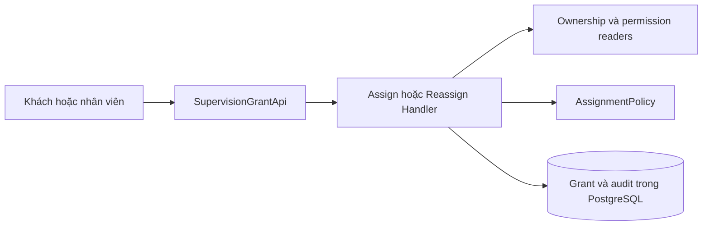
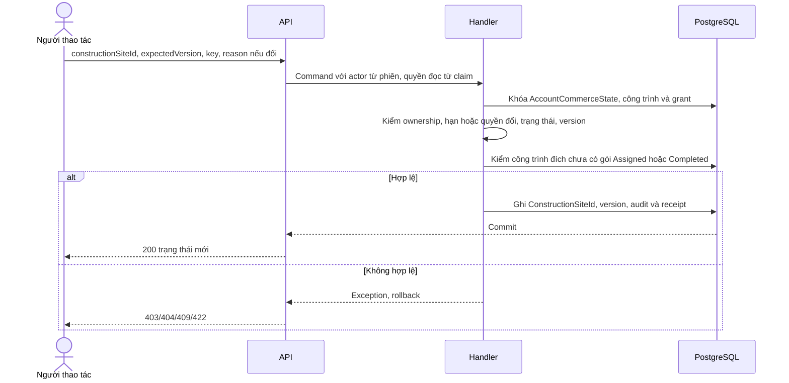
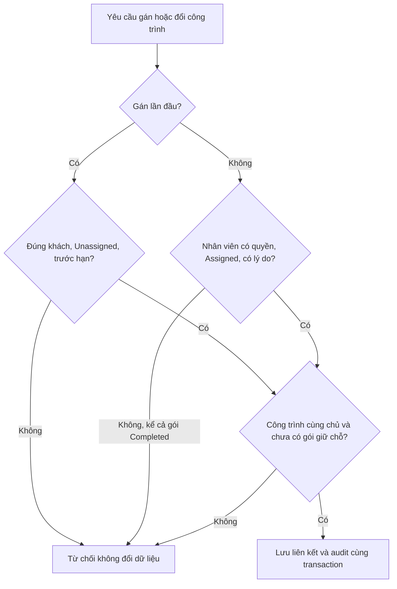
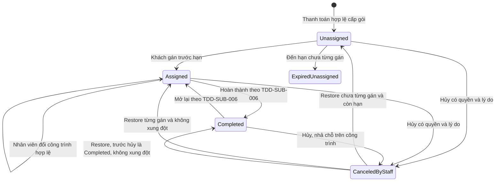
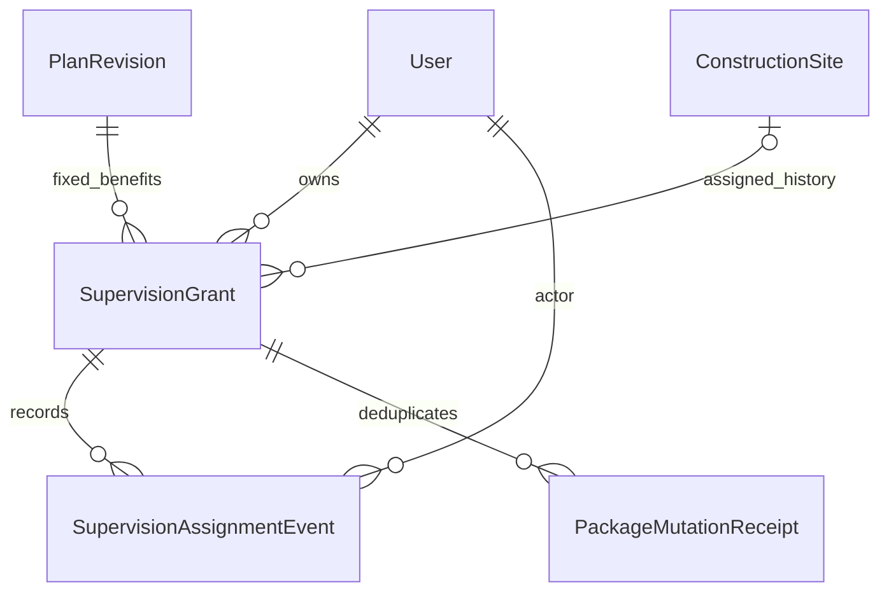

<!-- HƯỚNG DẪN CHO AI KHI ĐIỀN HOẶC CHỈNH SỬA MẪU
- Đọc toàn bộ mẫu, các comment hướng dẫn và tài liệu nguồn được cung cấp trước khi viết. Tuân thủ các quy tắc nghiệp vụ, điều kiện, ngoại lệ và giới hạn đã được xác nhận.
- Không bịa, tự chế hoặc suy đoán thành sự thật: yêu cầu, quy tắc, số liệu, API, schema, mã lỗi, nguồn tham khảo, người phụ trách và kết quả kiểm thử phải có căn cứ. Nội dung ví dụ trong mẫu không phải dữ kiện của dự án.
- Khi thiếu thông tin hoặc các nguồn mâu thuẫn, hỏi người dùng để làm rõ; giữ nguyên placeholder ở phần chưa xác định. Không tự chọn đáp án, lấp chỗ trống hay tuyên bố tài liệu đã hoàn tất.
- Chỉ thay nội dung cần điền hoặc được yêu cầu sửa. Không tự mở rộng phạm vi, sửa nghĩa quy tắc, bỏ điều kiện/ngoại lệ, xoá hay ghi đè nội dung hợp lệ đã có.
- Giữ nguyên tên, cấp và thứ tự heading, nhãn in đậm, tiền tố bullet, cấu trúc danh sách, tên/thứ tự/số cột bảng và cú pháp code fence. Không dịch, đổi tên, gộp hoặc thêm mục ngoài cấu trúc mẫu.
- Chỉ lặp khối luồng, AC hoặc API theo đúng khuôn khi có căn cứ; chỉ bỏ phần tuỳ chọn khi hướng dẫn riêng của mẫu cho phép và đã xác định không áp dụng.
- Mã tham chiếu và section phải trỏ tới tài liệu có thật đã được cung cấp hoặc kiểm chứng. Không giữ mã ví dụ như tham chiếu thật và không tự tạo tài liệu liên quan để hợp thức hoá liên kết.
- Giữ các comment hướng dẫn trong file. Xuất Markdown UTF-8, mỗi file một tài liệu; không bọc toàn bộ file trong code fence, không chèn lời dẫn hay giải thích ngoài mẫu.
- Trước khi bàn giao, đối chiếu nội dung với nguồn, kiểm tra cấu trúc, giá trị cho phép, giới hạn độ dài và tính nhất quán của mã/tham chiếu. Báo rõ phần chưa đủ thông tin; không tuyên bố đã chạy test hoặc import khi chưa thực hiện.
-->

<!-- Thay mã TDD-001 và nội dung ví dụ; giữ nguyên heading và nhãn in đậm.
Sơ đồ dùng mermaid, plantuml hoặc URL. Giữ heading Architecture, Sequence Diagram, Activity Diagram, State Diagram, Data Model.
Ví dụ API phải có heading trùng METHOD /path trong Endpoints. Xoá phần API/sơ đồ không dùng.
Version, Updated At và Change Log do lịch sử phiên bản quản lý, để trống khi nhập mới.
Author/Reviewer là tên hiển thị; gán tài khoản, phê duyệt, giả định và câu hỏi mở trên giao diện sau import.
Thiết kế phải truy vết về Story và Business Rule được cung cấp. Phân biệt thiết kế đề xuất với implementation đã kiểm chứng; không mô tả API/schema/sơ đồ ví dụ như hệ thống thật hoặc tự quyết định nghiệp vụ còn thiếu.
BẮT BUỘC KHI HOÀN THIỆN MẪU: phải có cả Reviewer và Approver, mỗi tên 1–200 ký tự sau khi bỏ khoảng trắng đầu/cuối. Không xoá hai dòng metadata, để trống, dùng tên bịa hoặc giữ placeholder rồi coi là hoàn tất.
Nếu chưa biết người review hoặc người phê duyệt, phải hỏi người dùng và báo tài liệu chưa đủ thông tin; không tự lấy Author/Owner làm người thay thế. Tên trong file không tự gán tài khoản hoặc xác nhận đã duyệt; gán thành viên trên giao diện sau import.
Đây là yêu cầu hoàn thiện mẫu; backend hiện vẫn nhận file cũ thiếu hai trường để tương thích.

VALIDATION CHO FILE NHẬP (đối chiếu ImportSnapshotValidator, MarkdownParser và ImportService):
- Mỗi file .md UTF-8 không rỗng chỉ có một heading cấp 1 chứa mã tài liệu dài 1–100 ký tự. Mã không được trùng trong cùng lần nhập hoặc thuộc loại tài liệu khác đã tồn tại.
- Không dùng tên README.md hoặc sitemap.md vì importer bỏ qua. Giao diện nhận .md/.zip, tối đa 2.000 file, tổng file tải lên 31 MiB; API giới hạn request 32 MiB và tổng nội dung đọc/giải nén 64 MiB.
- Chỉ nhập đè tài liệu cùng loại đang Draft, chưa có phiên bản và chưa lưu trữ. Import thay toàn bộ nội dung bản nháp, vì vậy phải giữ lại nội dung hợp lệ ngoài phần được yêu cầu sửa.
- Không dùng Status trong Markdown hoặc tên Approver để tự xác nhận phê duyệt; import không cấp quyền hay gán tài khoản từ tên. Chạy Kiểm tra file và xử lý lỗi/cảnh báo trước khi nhập.
- Giới hạn độ dài bên dưới tính theo string.Length của .NET (đơn vị UTF-16); không tự cắt ngắn dữ kiện quan trọng để vượt validation, hãy viết lại có căn cứ hoặc hỏi người dùng.
- Feature tối đa 300 ký tự và được dùng làm tiêu đề tài liệu. Status được parser nhận: Draft / In Review / Approved / Deprecated; tài liệu nhập mới vẫn có trạng thái phê duyệt Draft.
- Endpoint: đường dẫn tối đa 500 ký tự; tên/mô tả endpoint được lưu trong Name tối đa 300. HTTP method: GET / POST / PUT / PATCH / DELETE / HEAD / OPTIONS.
- Error Codes: mã tối đa 100 ký tự, không trùng trong tài liệu; giữ dạng - **CODE** (400): mô tả. HTTP status trong Error Codes và Response phải là số nguyên đọc được bằng Int32; không tự đặt status khác hợp đồng API.
- URL sơ đồ tối đa 1.000 ký tự. Mục sơ đồ được sử dụng phải có khối mermaid/plantuml hoặc URL theo mẫu; không để một mục sơ đồ rỗng. Nhãn mục được tách từ bullet như tên External API Fields tối đa 300 ký tự.
- Heading Examples phải khớp METHOD /path ở Endpoints. Giữ các nhãn Request:, Response 200: (thay mã theo contract) và Error Response: để parser tách đúng dữ liệu.
- Tham chiếu dạng DOC-KEY/section: ghi chú: mã đích tối đa 100 ký tự, section tối đa 100, ghi chú tối đa 1.000. Không trùng bộ mã đích + section + loại liên kết trong cùng tài liệu.
ĐỐI CHIẾU FORM TDD (src/features/tdds/validations.ts; form có thể chặt hơn import):
- Điền Feature, Author, Reviewer, Problem và ít nhất một Goal; các Goal/Non-goal/Notes đã thêm không được rỗng. API đã khai báo phải có endpoint và mô tả/mục đích; Fields phải có tên và ý nghĩa; Error Codes phải có mã, HTTP status và điều kiện.
- Form còn kiểm tra Version, Updated At và nội dung Change Log khi khai báo; với file nhập mới, giữ các trường lịch sử này trống theo hợp đồng import, không tự tạo dữ liệu lịch sử.
-->

# TDD-SUB-004

## Document Info

- **Feature**: Gán gói giám sát đã mua và đổi công trình
- **Author**: Codex
- **Reviewer**: Tân Trần
- **Approver**: Tân Trần
- **Status**: Draft
- **Version**:
- **Updated At**:

## Context & Goals

### Problem

STORY-SUB-004 cho phép mua giám sát trước khi có công trình. Thiết kế cũ TDD-SUB-003 bắt buộc gắn công trình lúc cấp và cấm thay đổi nên không thể dùng nguyên bản; tài liệu này thay phần gán và đổi công trình của TDD-SUB-003. Cần quản lý hạn gán một năm, quyền sở hữu, giới hạn một gói giữ chỗ mỗi công trình và quyền riêng của nhân viên đổi công trình.

**Công trình** là thực thể riêng, khác bản dự toán; khách tự tạo miễn phí, không cần gói thiết kế và không liên kết với bản dự toán (người dùng xác nhận ngày 25/09/2026). Tên kỹ thuật dự kiến là `ConstructionSite`, khóa `ConstructionSiteId`; tên này có thể chỉnh khi soạn đặc tả Công trình. Đặc tả tạo và quản lý công trình **chưa được soạn**, nên nguồn dữ liệu công trình là phụ thuộc chưa đặc tả.

Hiện trạng code đã kiểm tra ngày 25/09/2026: đã có entity `SupervisionGrant` (cột `ProjectId`), `SupervisionAssignmentEvent` (`OldProjectId`/`NewProjectId`), các migration `SupervisionGrant`, `SupervisionGrantFirstAssignedWindow`, `SupervisionGrantCompleted`, `SupervisionAssignmentEventReasonNotNull`, handler gán/đổi và `SupervisionAssignmentFlow`. Kiểm chỗ trống đã dùng tập giữ chỗ `SupervisionStates.HoldingProject` (`Assigned`, `Completed`). Nguồn sở hữu là `UnavailableProjectOwnershipReader`, chưa đọc dữ liệu công trình thật. Đổi tên sang `ConstructionSite` và mã lỗi mới là thay đổi dự kiến. Không coi mock hay interface là tích hợp đã hoạt động. Không quản lý trạng thái khảo sát/giám sát.

### Goals

- Khách tự gán một gói chưa gán cho đúng công trình của mình trước hạn; không phát sinh đơn hoặc thanh toán mới.
- Nhân viên có quyền riêng đổi liên kết sang công trình khác cùng khách, có lý do, kể cả sau một năm nếu đã gán đúng hạn. Không đổi công trình của gói đã hoàn thành.
- Chống hai gói cùng giữ chỗ (`Assigned` hoặc `Completed`) trên một công trình, gán một gói sang hai công trình và xung đột với hủy/khôi phục.

### Non-goals

- Khách tự gỡ/đổi công trình; chuyển chủ gói; nhân viên gỡ về chưa gán hoặc sửa gói đang bị hủy chưa được giao.
- Lịch khảo sát, phân công kỹ sư, số lượt kiểm tra hoặc xác nhận công trình đủ điều kiện trước khi mua.
- Tạo và quản lý công trình (chưa có đặc tả). Hoàn thành và mở lại gói thuộc [TDD-SUB-006](TDD-SUB-006.md).

## Architecture

**Giải thích kỹ thuật trong luồng gán**

| Kỹ thuật | Áp dụng ở đây | Ví dụ và giới hạn |
| --- | --- | --- |
| Adapter kiểm tra sở hữu | `IConstructionSiteOwnershipReader` (dự kiến, thay `IProjectOwnershipReader`) nối luồng gói với dữ liệu công trình thật. | Client gửi CS1; server đọc chủ CS1 và so với AccountId của gói. Interface không chứng minh module Công trình đã được xây; đặc tả Công trình chưa soạn. |
| Khóa và UNIQUE theo trạng thái | Khóa tài khoản/công trình/gói; UNIQUE tính các gói giữ chỗ `Assigned` hoặc `Completed` trên một `ConstructionSiteId`. | Hai gói cùng tranh CS1 thì chỉ một gói được gán. Gói `Completed` trên CS1 vẫn chặn gán gói khác. Hủy gói giải phóng chỗ sau commit, không xóa lịch sử liên kết. |
| Optimistic concurrency — kiểm phiên bản khách đang sửa | ExpectedVersion phải bằng Version hiện tại; sau thay đổi tăng Version. | Khách đang xem v1 nhưng nhân viên đã sửa lên v2 thì yêu cầu cũ bị từ chối; client đọc lại. Khóa server và kiểm version giải quyết hai nguy cơ khác nhau. |
| Transaction với audit và receipt | Liên kết hiện tại, sự kiện giải thích và kết quả chống lặp được ghi cùng nhau. | Ghi sự kiện lỗi thì gán cũng rollback; gửi lại sau mất phản hồi không tạo hai sự kiện. |
| Thời hạn theo lịch địa phương | Đổi mốc cấp sang giờ Việt Nam, cộng một năm theo lịch rồi đổi về UTC. | Ngày 29/02 sang 28/02 năm không nhuận; không thay bằng cộng cố định 365 ngày. Không suy gói đã gán thành hết phục vụ từ deadline này. |
| Trạng thái hiệu lực tính khi đọc | Dựa trên State, FirstAssignedAtUtc và deadline để trả EffectiveState. | Gói chưa gán đúng mốc hạn bị chặn dù tác vụ nền chưa chạy; gói đã gán đúng hạn tiếp tục Assigned. |


| Thành phần dự kiến | Trách nhiệm |
| --- | --- |
| SupervisionGrantApi ở presentation/apis/subscription/ | Đọc gói của khách, gán lần đầu; endpoint quản trị riêng cho đổi công trình. |
| AssignSupervisionGrantHandler / ReassignSupervisionGrantHandler | Kiểm quyền, khóa, version, lý do; cập nhật liên kết và audit trong cùng transaction. |
| SupervisionAssignmentPolicy | Hàm thuần kiểm lần gán đầu, thời hạn, cùng chủ sở hữu và gói khác đang giữ chỗ. |
| AssignmentDeadlineCalculator | Convert UTC→Asia/Ho_Chi_Minh, AddYears(1), giữ giờ/phút/giây, 29/02→28/02 nếu cần, convert về UTC. |
| IConstructionSiteOwnershipReader (dự kiến) | Đọc/khóa công trình thật và AccountId; không tin ownerId do client gửi. Adapter phải dùng cùng DB/transaction khi triển khai monolith. Code hiện có `IProjectOwnershipReader` với bản tạm `UnavailableProjectOwnershipReader`; đổi tên khi có đặc tả Công trình. |
| Policy `supervision.reassign` | Gắn ở endpoint quản trị đổi công trình; kiểm claim `perm` trong access token theo [TDD-RBAC-001](TDD-RBAC-001.md#architecture). Mã này không gắn phân công (BR-RBAC-010 khoản 4). Thay cho `IStaffPermissionReader` của bản trước, vì quyền nay gắn vào vai trò chứ không gắn thẳng vào người. |
| SupervisionStore | Truy vấn/ghi gói, unique index giữ chỗ trên công trình và lịch sử liên kết. |



**Notes**:

- Dùng transaction pipeline hiện có; validation lỗi sau mutation phải ném exception để rollback. Quy ước chung từ TDD-PAY-001. Không gọi dịch vụ công trình bên ngoài trong transaction rồi coi dữ liệu đó được khóa an toàn.
- Thứ tự khóa: AccountCommerceState của chủ gói → các công trình cũ/mới theo UUID tăng dần → SupervisionGrant → mutation receipt/audit. Không khóa bản ghi quyền của người thao tác, vì quyền đọc từ claim `perm` trong access token (TDD-RBAC-001). Cấp, hủy, restore, hoàn thành và mở lại cũng khóa AccountCommerceState nên không chạy xen làm sai liên kết. Chức năng đổi chủ/xóa công trình phải dùng quy ước khóa tương thích; nếu module tương lai không bảo đảm được thì chưa bật gán/đổi. Hiện trạng code: `LockAccountAsync` đang khóa dòng `User` và chưa khóa công trình vì chưa có bảng công trình.
- Reread gói sau khóa; đối chiếu expectedVersion. Sai version trả 409, không tự thay version rồi lặp lại quyết định người dùng. Idempotency-Key có scope actor+operation+grant; cùng request replay không sửa lần hai, quyền được kiểm lại trước replay.
- Khách: lấy AccountId từ session; kiểm gói thuộc khách trước khi lộ dữ liệu; request chỉ constructionSiteId/expectedVersion. Nhân viên: kiểm `supervision.reassign` và tư cách nhân viên; Admin không tự có quyền đổi chỉ vì được xem quản trị. Thao tác này không kiểm phân công công trình.
- Gán lần đầu: State=Unassigned, FirstAssignedAtUtc=NULL, now<AssignmentDeadlineUtc; công trình cùng chủ và chưa có gói giữ chỗ khác (`Assigned` hoặc `Completed`). Ghi FirstAssignedAtUtc=now, ConstructionSiteId và State=Assigned. Đây là mốc đã sử dụng, không gọi thanh toán.
- Đổi công trình: chỉ nhận State=Assigned, FirstAssignedAtUtc đã hợp lệ; gói `Completed` bị từ chối với 409 `GrantStateConflict`, phải mở lại trước theo TDD-SUB-006 (BR-SUB-023/Except). Không xét hạn lần đầu một lần nữa; lý do sau khi bỏ khoảng trắng đầu/cuối dài 1–2000 ký tự; công trình đích khác công trình cũ, cùng khách và chưa có gói giữ chỗ khác. Cùng công trình trả 409 `NoConstructionSiteChange` (không tạo lịch sử giả); đây là quy tắc kỹ thuật của thao tác đổi, không tự thu phí.
- Không cung cấp route gỡ về chưa gán, không dùng trường nullable để cho client gửi null rồi xóa liên kết. Không có điều kiện đã/chưa khảo sát.
- Chạy đến hạn chỉ làm gói chưa từng gán mất quyền gán. GET tính EffectiveState=ExpiredUnassigned khi now>=deadline; không cần job đúng giây. Gói từng gán đúng hạn tiếp tục Assigned sau deadline. Hủy/restore theo TDD-SUB-005 giữ FirstAssignedAtUtc và deadline.

## Sequence Diagram



## Activity Diagram



## State Diagram



ExpiredUnassigned là trạng thái hiệu lực suy ra từ thời gian, không đòi job cập nhật mới chặn được. Không có chuyển Assigned→Unassigned qua API này. Hạn một năm không tạo transition Assigned→ExpiredUnassigned. Gói `Completed` không có mũi tên đổi công trình; điều kiện hoàn thành, mở lại và khôi phục về `Completed` được thiết kế ở [TDD-SUB-006](TDD-SUB-006.md#state-diagram), hủy/khôi phục ở [TDD-SUB-005](TDD-SUB-005.md).

## Data Model

**Ý nghĩa các bảng**

| Bảng | Một dòng đại diện cho gì? | Khi ghi và liên kết |
| --- | --- | --- |
| SupervisionGrant | Một quyền sử dụng gói giám sát khách đã mua; không phải công trình hoặc lịch khảo sát. | Cấp khi thanh toán hợp lệ, ban đầu ConstructionSiteId=NULL. Gán/đổi/hủy/hoàn thành cập nhật cùng gói, giữ RevisionId và hạn đã cấp. |
| SupervisionAssignmentEvent | Một lần gán đầu hoặc đổi công trình của gói. | Ghi cùng transaction đổi liên kết. OldConstructionSiteId=NULL nghĩa lần gán đầu; các lần đổi giữ cả công trình cũ/mới và lý do. |
| PackageMutationReceipt | Một kết quả thao tác để xử lý việc client gửi lại yêu cầu. | Ghi cùng transaction với liên kết và sự kiện; khóa RequestKey theo actor/operation/target. Schema chung ở TDD-SUB-005. |
| ConstructionSite / User | Công trình thật và chủ tài khoản được dùng để kiểm tra sở hữu. | Đọc từ module Công trình (chưa có đặc tả) và tài khoản; không tạo bảng công trình giả trong payment. Công trình và grant phải cùng khách. Công trình không liên kết với bản dự toán. |
| PlanRevision / PaymentFulfillment | Bản gói giám sát đã mua (tên, giá, mô tả dịch vụ đã chốt theo đơn) và dấu vết lần thanh toán đã cấp gói này. | Đọc từ danh mục/thanh toán; gán công trình không tạo đơn hay fulfillment mới. |

**Dữ liệu lưu trữ minh họa — mua trước, gán sau**

Dữ liệu giả định, trích các cột cần giải thích; G1, U1, NV1, SR1, CS1, CS2, E1, E2, M1, M2 là bí danh UUID, không phải giá trị seed. SR1 là phiên bản gói giám sát trong [TDD-SUB-001](TDD-SUB-001.md#data-model). Mọi giờ lưu dưới đây là UTC. Công trình CS1 và CS2 đã tồn tại, cùng thuộc U1 và chưa có gói giữ chỗ khác tại thời điểm gán/đổi. NV1 là nhân viên được cấp quyền supervision.reassign. Tên cột công trình dùng tên dự kiến `ConstructionSiteId`; code hiện vẫn là `ProjectId`.

Trong ví dụ, Operation=Assign/Reassign là tên minh họa cho thao tác gán/đổi, chưa quy định giá trị enum khi triển khai. H1/H2 là ký hiệu thay cho RequestHash dài 64 ký tự; ResultBody bên dưới chỉ trích các trường kết quả cần giải thích, không phải toàn bộ phản hồi API. RequestKey lấy từ header Idempotency-Key của yêu cầu.

| Bảng / thời điểm | Các giá trị lưu | Ý nghĩa |
| --- | --- | --- |
| SupervisionGrant, vừa cấp | Id=G1; AccountId=U1; RevisionId=SR1; State=Unassigned; ConstructionSiteId=NULL; GrantedAtUtc=2026-09-19T03:00:00Z; AssignmentDeadlineUtc=2027-09-19T03:00:00Z; FirstAssignedAtUtc=NULL; Version=1 | Có gói nhưng chưa dùng cho công trình nào. Hạn là 10:00 ngày 19/09/2027 theo giờ Việt Nam. |
| SupervisionGrant, gán đầu | Id=G1; State=Assigned; ConstructionSiteId=CS1; FirstAssignedAtUtc=2026-10-01T02:00:00Z; Version=2 | Cập nhật cùng dòng; GrantedAtUtc và AssignmentDeadlineUtc không đổi. |
| SupervisionAssignmentEvent | Id=E1; GrantId=G1; ActorId=U1; OldConstructionSiteId=NULL; NewConstructionSiteId=CS1; AtUtc=2026-10-01T02:00:00Z; Reason=NULL; GrantVersion=2; ReceiptId=M1 | Khách gán lần đầu, chưa có công trình cũ; không bắt khách nhập lý do như thao tác đổi của nhân viên. |
| PackageMutationReceipt, gán đầu | Id=M1; ActorId=U1; Operation=Assign; TargetId=G1; RequestKey=assign-g1-1; RequestHash=H1; ResultVersion=2; ResultBody={"grantId":"G1","constructionSiteId":"CS1","state":"Assigned","version":2}; AtUtc=2026-10-01T02:00:00Z | Lưu kết quả yêu cầu gán đầu. E1.ReceiptId=M1 nối lịch sử gán với kết quả yêu cầu đã xử lý. |
| Cả ba bảng, khách gửi lại sau mất phản hồi | G1 vẫn ConstructionSiteId=CS1, Version=2; vẫn chỉ có E1 và M1 cho lần gán này | Khách gửi lại key assign-g1-1 với đúng nội dung cũ, gồm expectedVersion=1. Sau kiểm quyền/sở hữu, server đọc M1 và trả kết quả đã lưu; không tăng version hoặc tạo thêm event/receipt. |
| SupervisionGrant, đổi sau một năm | Id=G1; State=Assigned; ConstructionSiteId=CS2; FirstAssignedAtUtc=2026-10-01T02:00:00Z; Version=3 | Nhân viên đổi ngày 01/10/2027 vẫn hợp lệ nếu CS2 trống, vì gói đã gán đúng hạn. Deadline không được làm mới. |
| SupervisionAssignmentEvent, lần đổi | Id=E2; GrantId=G1; ActorId=NV1; OldConstructionSiteId=CS1; NewConstructionSiteId=CS2; AtUtc=2027-10-01T02:00:00Z; Reason=Điều chỉnh công trình theo yêu cầu khách; GrantVersion=3; ReceiptId=M2 | E1 được giữ nguyên; ghi thêm E2 và receipt M2 của nhân viên có quyền. |
| PackageMutationReceipt, lần đổi | Id=M2; ActorId=NV1; Operation=Reassign; TargetId=G1; RequestKey=reassign-g1-1; RequestHash=H2; ResultVersion=3; ResultBody={"grantId":"G1","constructionSiteId":"CS2","state":"Assigned","version":3}; AtUtc=2027-10-01T02:00:00Z | Lưu kết quả yêu cầu đổi có expectedVersion=2 và lý do như E2. E2.ReceiptId=M2; M1 vẫn được giữ nguyên. |

Sau hai thao tác thành công, SupervisionGrant có một dòng G1 đang trỏ tới CS2; SupervisionAssignmentEvent có hai dòng E1/E2; PackageMutationReceipt có hai dòng M1/M2. Nhìn G1 biết công trình hiện tại. Đọc E1/E2 biết khách đã gán vào CS1, rồi NV1 chuyển từ CS1 sang CS2 vào lúc nào và vì sao. Đọc M1/M2 biết kết quả của từng yêu cầu để trả lại khi ứng dụng gửi lại yêu cầu đó.

Nếu U1 gửi lại yêu cầu gán đầu với key assign-g1-1 và đúng nội dung cũ sau khi nhân viên đã đổi sang CS2, server kiểm lại quyền/sở hữu rồi trả kết quả M1: CS1, version=2. Đây là kết quả lần gán trước; dữ liệu hiện tại vẫn là CS2, version=3. Ứng dụng gọi GET để lấy trạng thái hiện tại. Nếu U1 giữ nguyên key đó nhưng đổi constructionSiteId trong yêu cầu, server trả 409 IdempotencyConflict vì nội dung không còn khớp H1; không thay đổi ba bảng.

Nhánh gói đã hoàn thành, nối từ G1 ngay sau lần gán đầu (CS1, Version=2) như dữ liệu mẫu của [TDD-SUB-006](TDD-SUB-006.md#data-model): khi G1 được hoàn thành, G1 có State=Completed, Version=3 và vẫn giữ chỗ trên CS1. Lúc đó yêu cầu gán một gói G3 khác vào CS1 bị từ chối với 409 `ConstructionSiteAlreadyHasSupervision`, còn yêu cầu đổi công trình của G1 sang CS2 bị từ chối với 409 `GrantStateConflict`. Hai yêu cầu bị từ chối không ghi thêm dòng nào vào ba bảng.

Mỗi thao tác mới ghi thay đổi G1, event và receipt trong cùng một transaction: hoặc lưu thành công cả ba, hoặc hoàn tác cả ba. Vì vậy, E1/E2 phục vụ tra cứu lịch sử, còn M1/M2 phục vụ xử lý yêu cầu gửi lại; hai bảng không thay thế nhau trong thiết kế này.

Nhánh hết hạn: G2 có cùng deadline nhưng chưa từng gán. Tại `2027-09-19T03:00:00Z`, DB có thể vẫn lưu State=Unassigned và FirstAssignedAtUtc=NULL; kết quả đọc là EffectiveState=ExpiredUnassigned, yêu cầu gán bị từ chối. EffectiveState là giá trị tính khi đọc, không phải một dòng hay cột trạng thái mới phải được job cập nhật đúng giây.


Tài liệu này là định nghĩa gốc của `SupervisionGrant`, thay schema cũ của TDD-SUB-003; không tạo bảng giám sát khác cạnh bảng này. Bảng đã có trong code qua migration `SupervisionGrant` và các migration sau; bảng dưới ghi schema đích sau khi đổi tên sang công trình. Mọi thời điểm lưu UTC; FK lịch sử RESTRICT.

| Bảng | Trường và ràng buộc dự kiến |
| --- | --- |
| SupervisionGrant | Id uuid PK; AccountId uuid NN FK User; RevisionId uuid NN FK PlanRevision; Kind varchar(16) NN CHECK='Supervision'; ConstructionSiteId uuid NULL (code hiện: `ProjectId`); State varchar(24) NN =Unassigned/Assigned/CanceledByStaff/Completed; GrantedAtUtc timestamptz NN; AssignmentDeadlineUtc timestamptz NN; FirstAssignedAtUtc timestamptz NULL; Version bigint NN; CancelEventId uuid NULL; UNIQUE(AccountId,Id), FK(RevisionId,Kind) -> UNIQUE(Id,Kind) của PlanRevision. Giá trị `Completed` và quy tắc hoàn thành/mở lại thuộc [TDD-SUB-006](TDD-SUB-006.md#data-model); code đã có giá trị này. |
| SupervisionAssignmentEvent | Id uuid PK; GrantId uuid NN FK; ActorId uuid NN FK User; OldConstructionSiteId uuid NULL; NewConstructionSiteId uuid NN (code hiện: `OldProjectId`/`NewProjectId`); AtUtc timestamptz NN; Reason text NULL chỉ khi first assignment; GrantVersion bigint NN; ReceiptId uuid NN UNIQUE FK PackageMutationReceipt. CHECK reason có nội dung nếu OldConstructionSiteId không NULL; UNIQUE(GrantId,GrantVersion). |
| PackageMutationReceipt | Schema dùng chung ở TDD-SUB-005; kết quả thao tác gán/đổi không phải giao dịch tiền. |

Cột `Kind` lặp lại loại gói và luôn bằng `Supervision`. Một mình nó chưa đủ: khóa ngoại ghép `(RevisionId,Kind)` trỏ tới `UNIQUE(Id,Kind)` của `PlanRevision` mới là phần bắt phiên bản được tham chiếu phải thuộc một gói giám sát thật. Nếu chỉ kiểm ở tầng ứng dụng, một lỗi lập trình hoặc một đường ghi khác vẫn có thể gắn gói thiết kế vào grant. Đây là cùng kỹ thuật [TDD-SUB-001](TDD-SUB-001.md#data-model) dùng cho `PlanOffer`.

CHECK: AssignmentDeadlineUtc>GrantedAtUtc; FirstAssignedAtUtc nếu có phải GrantedAtUtc<=first<deadline. Unassigned đòi ConstructionSiteId và FirstAssignedAtUtc NULL; Assigned hoặc Completed đòi cả hai NOT NULL. CanceledByStaff giữ nguyên liên kết trước hủy, có thể NULL hoặc có công trình; không dùng hủy để xóa FirstAssignedAtUtc.

Partial unique index `UX_SupervisionGrant_ConstructionSiteHolder(ConstructionSiteId) WHERE State IN ('Assigned','Completed')` (code hiện: `UX_SupervisionGrant_ProjectHolder` trên `ProjectId`, cùng điều kiện). Index này bảo đảm mỗi công trình có tối đa một gói giữ chỗ: gói đang gán hoặc đã hoàn thành. Gói `Unassigned` có cột công trình NULL nên không bị index xét; gói `CanceledByStaff` nằm ngoài điều kiện nên nhả chỗ ngay sau commit. Ví dụ G1 `Completed` trên CS1 thì yêu cầu gán G3 vào CS1 lọt qua kiểm tra trong handler vẫn bị index chặn. Mọi chỗ kiểm trong code dùng chung hằng tập giữ chỗ (`SupervisionStates.HoldingProject`, dự kiến đổi tên theo công trình) để không lệch với index. FK(ConstructionSiteId,AccountId) tới UNIQUE(ConstructionSite.Id,ConstructionSite.AccountId) khi module Công trình có bảng thật; không tạo FK giả hoặc tự thêm stub table để migration chạy.



**Notes**:

- `GrantVersion` ghi `SupervisionGrant.Version` tại thời điểm xảy ra sự kiện. `PackageLifecycleEvent` của [TDD-SUB-005](TDD-SUB-005.md#data-model) gọi cột tương đương là `PackageVersion` vì bảng đó dùng chung cho cả kỳ thiết kế lẫn gói giám sát, còn bảng này chỉ ghi sự kiện của gói giám sát. Hai tên khác nhau là có chủ ý, không phải trùng lặp.
- Index `(AccountId,GrantedAtUtc DESC,Id)` cho danh sách khách; `(GrantId,AtUtc,Id)` cho audit. Hạn được lưu một lần khi cấp và không tính lại khi sửa, hủy hoặc restore.
- Mapping C# DateTimeOffset UTC; calculator dùng TimeZoneInfo Asia/Ho_Chi_Minh và lịch, không AddDays(365). Clock được inject để test trước/đúng/sau hạn và leap day.
- Không xóa audit khi sửa lại; mỗi lần tăng Version. Hai yêu cầu gán cùng version chỉ một lần thành công; khách retry cùng key nhận kết quả thao tác đã lưu, không đổi firstAssignedAt.
- Database hiện chỉ có dữ liệu dev/test (xác nhận ngày 25/09/2026), và không migration nào trong code từng tạo schema theo TDD-SUB-003 (không có giá trị `InProgress`), nên không cần chuyển `InProgress` hay ánh xạ `Completed` cũ. Migration dự kiến chỉ đổi tên: `SupervisionGrant.ProjectId` → `ConstructionSiteId`; `SupervisionAssignmentEvent.OldProjectId`/`NewProjectId` → `OldConstructionSiteId`/`NewConstructionSiteId`; index `UX_SupervisionGrant_ProjectHolder` → `UX_SupervisionGrant_ConstructionSiteHolder`. PostgreSQL tự cập nhật CHECK và index theo tên cột mới khi `RENAME COLUMN`, nhưng EF sẽ sinh lệnh bỏ và tạo lại `CK_SupervisionGrant_AssignedColumns`, `CK_SupervisionAssignmentEvent_Reason` vì chuỗi SQL trong model đổi. Không cần backfill hay chia lô; Down đổi tên ngược lại. Kiểm tra sau migration: hai bảng không còn cột `ProjectId`/`OldProjectId`/`NewProjectId`, và index giữ chỗ vẫn có điều kiện `State IN ('Assigned','Completed')`. Chưa chạy migration.
- Module Công trình chưa có đặc tả nên adapter ownership và quy ước khóa công trình là điều kiện tích hợp bắt buộc; mock chỉ kiểm policy. Không thể chứng minh FK tới công trình bằng EF InMemory.

## Internal API

### Endpoints

Các route đã có trong code với tên trường `projectId`. Hợp đồng dưới đây dùng tên dự kiến `constructionSiteId`; đổi tên trường là thay đổi hợp đồng API, client đang dùng phải cập nhật cùng lúc. Các mã lỗi `ConstructionSite*` ở Error Codes thay các mã `Project*` của bản trước; code hiện vẫn dùng tên cũ trong `SubscriptionErrorCodes` (`ProjectNotFound`, `ProjectAlreadyHasSupervision`, `NoProjectChange`, `ProjectModuleUnavailable`).

- **GET** `/api/v1/me/supervision-grants` — Verified session; chỉ gói của chính khách, gồm chưa gán/quá hạn/bị hủy/đã hoàn thành. PageIndex/PageSize theo PagedResult, sort GrantedAtUtc DESC,Id DESC.
- **GET** `/api/v1/me/supervision-grants/{grantId}` — Đọc gói thuộc khách, revision, constructionSiteId, firstAssignedAtUtc, assignmentDeadlineUtc, effectiveState và version. `state`/`effectiveState` có thể là `Completed` theo TDD-SUB-006.
- **POST** `/api/v1/me/supervision-grants/{grantId}/assign` — `{constructionSiteId,expectedVersion}`, header Idempotency-Key; chỉ gán lần đầu. Phản hồi gồm `grantId`, `constructionSiteId`, `state`, `version`, `eventId` (dòng lịch sử vừa ghi) và `wasAlreadyApplied` (true khi trả lại kết quả của lần gửi trước). Muốn biết `firstAssignedAtUtc` và `assignmentDeadlineUtc`, client gọi GET chi tiết gói.
- **POST** `/api/v1/admin/supervision-grants/{grantId}/reassign` — `{constructionSiteId,expectedVersion,reason}`, header Idempotency-Key; verified session + staff permission supervision.reassign, không kiểm phân công. Chỉ đổi được gói `Assigned`; gói `Completed` trả 409 `GrantStateConflict`. Prefix admin không đồng nghĩa chỉ role Admin, nhân viên được phân quyền dùng được.

### Examples

#### POST /api/v1/me/supervision-grants/{grantId}/assign

```
Request:
Idempotency-Key: 793753ea-0520-4a60-ab2f-dfdbec33c2ba
{"constructionSiteId":"33333333-3333-3333-3333-333333333333","expectedVersion":1}

Response 200:
{"value":{"grantId":"44444444-4444-4444-4444-444444444444","constructionSiteId":"33333333-3333-3333-3333-333333333333","state":"Assigned","version":2,"eventId":"66666666-6666-6666-6666-666666666666","wasAlreadyApplied":false},"isSuccess":true,"isFailure":false,"error":{"code":"","message":""}}

Error Response:
{"title":"Conflict","code":"ConstructionSiteAlreadyHasSupervision","status":409,"detail":"Công trình đã có gói giám sát đang giữ chỗ.","messageCode":"ConstructionSiteAlreadyHasSupervision","errors":null}
```

#### POST /api/v1/admin/supervision-grants/{grantId}/reassign

```
Request:
Idempotency-Key: 721c5b01-74eb-4ad4-be04-1168e3bb4044
{"constructionSiteId":"55555555-5555-5555-5555-555555555555","expectedVersion":2,"reason":"Đổi công trình đã gán nhầm"}

Response 200:
{"value":{"grantId":"44444444-4444-4444-4444-444444444444","constructionSiteId":"55555555-5555-5555-5555-555555555555","state":"Assigned","version":3,"eventId":"77777777-7777-7777-7777-777777777777","wasAlreadyApplied":false},"isSuccess":true,"isFailure":false,"error":{"code":"","message":""}}

Error Response:
{"title":"Forbidden","code":"AccessForbidden","status":403,"detail":"Không có quyền đổi công trình của gói.","messageCode":"AccessForbidden","errors":null}
```

### Error Codes

- **Unauthorized** (401): phiên không hợp lệ.
- **AccessForbidden** (403): không có quyền nhân viên tương ứng.
- **SupervisionGrantNotFound** (404): không có gói trong phạm vi được phép.
- **ConstructionSiteNotFound** (404): không thấy công trình hoặc công trình không thuộc khách của gói.
- **GrantVersionConflict** (409): expectedVersion không khớp.
- **GrantStateConflict** (409): gói không ở trạng thái được phép thao tác, gồm yêu cầu đổi công trình của gói `Completed`.
- **AssignmentDeadlinePassed** (409): now>=deadline với gán lần đầu.
- **ConstructionSiteAlreadyHasSupervision** (409): công trình đã có gói giữ chỗ (`Assigned` hoặc `Completed`).
- **NoConstructionSiteChange** (409): công trình đích trùng công trình cũ khi đổi.
- **IdempotencyConflict** (409): cùng key khác nội dung.
- **AssignmentInputInvalid** (422): thiếu constructionSiteId, expectedVersion hoặc lý do đổi có nội dung.
- **ConstructionSiteModuleUnavailable** (503): chưa có nguồn ownership/locking công trình thật; không gán dựa trên dữ liệu tự khai.

## References

### User Stories

- STORY-SUB-004
- STORY-SUB-004/AC-001
- STORY-SUB-004/AC-002
- STORY-SUB-004/AC-003
- STORY-SUB-004/AC-004
- STORY-SUB-004/AC-005
- STORY-SUB-004/AC-006
- STORY-SUB-004/AC-007
- STORY-SUB-004/AC-008
- STORY-SUB-004/AC-009
- STORY-SUB-004/AC-010
- STORY-SUB-004/AC-011
- STORY-SUB-004/AC-012
- STORY-SUB-003/AC-012
- STORY-SUB-003/AC-013

### Business Rules

- BR-SUB-022/Then
- BR-SUB-023/Then
- BR-SUB-023/Except
- BR-SUB-006/Then
- BR-SUB-009/Statement
- BR-RBAC-010/Then

### Use Cases

- STORY-SUB-004/Main Flow
- STORY-SUB-004/ALT-02
- STORY-SUB-003/EXC-06
- STORY-SUB-003/EXC-07

### Others

- [Cấp gói từ thanh toán](TDD-PAY-001.md), [quyền riêng và hủy/restore](TDD-SUB-005.md), [hoàn thành và mở lại, trạng thái `Completed`](TDD-SUB-006.md).
- [TDD-SUB-003](TDD-SUB-003.md) là bản cũ đã bị thay; tài liệu này thay phần gán và đổi công trình của nó. Không gọi service bên ngoài nên không có External API trong TDD này.
- Công trình: đặc tả tạo và quản lý công trình chưa được soạn (phụ thuộc chưa đặc tả, theo STORY-SUB-004/Preconditions).
- [Bảng truy vết kiểm thử](../discovery/payment-technical-design.md); ST-PAY-024–033 và ca tích hợp đồng thời được liệt kê tại đó.

## Change Log

- 2026-09-25: Cập nhật theo nghiệp vụ đã chốt ngày 25/09/2026. Gói giám sát gắn với công trình (`ConstructionSite`), thực thể riêng khác bản dự toán và chưa có đặc tả; đổi "dự án"/`ProjectId`/`IProjectOwnershipReader`/mã lỗi `Project*` sang tên công trình dự kiến, ghi rõ tên hiện có trong code. Kiểm chỗ trống và partial unique index tính cả gói `Completed` (tập giữ chỗ `Assigned`/`Completed`); bổ sung `Completed` vào State, CHECK và State Diagram, đổi công trình của gói `Completed` bị từ chối. Bỏ Non-goal "luồng hoàn thành lịch sử" và ghi chú ánh xạ `Completed` cũ vì database chỉ có dữ liệu dev/test; migration chỉ đổi tên. Bỏ khóa bản ghi quyền của người thao tác khỏi thứ tự khóa. Dữ liệu mẫu dùng `SR1`, `CS1`, `CS2`. Bổ sung tham chiếu AC của STORY-SUB-004 và STORY-SUB-003/AC-012, AC-013.
- 2026-09-24: Cập nhật Internal API cho khớp code: mã lỗi 503 đổi thành `ProjectModuleUnavailable`; ví dụ phản hồi gán và sửa dự án thêm `eventId`, `wasAlreadyApplied` và bỏ hai mốc thời gian (đọc qua GET chi tiết gói). Nghiệp vụ không đổi.
- 2026-09-20: Đổi nguồn quyền từ `IStaffPermissionReader` sang policy theo mã quyền của [TDD-RBAC-001](TDD-RBAC-001.md). Mã `supervision.reassign` giữ nguyên tên và nghiệp vụ sửa liên kết gói – dự án không đổi.
