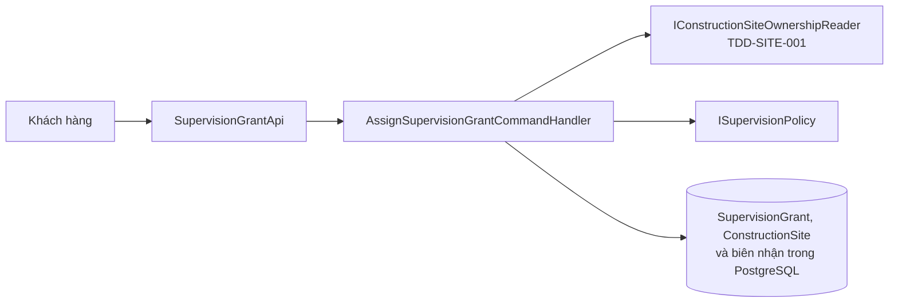
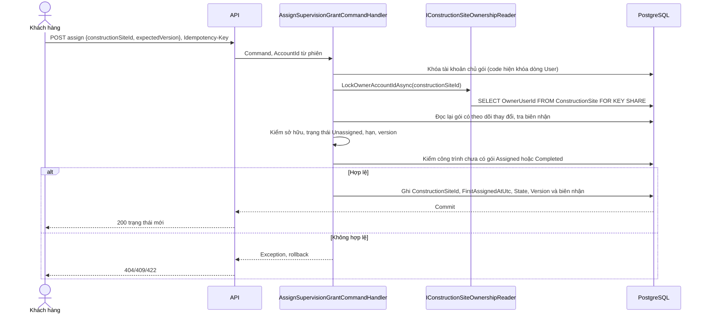
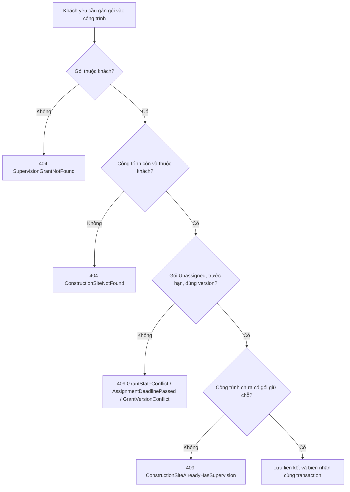
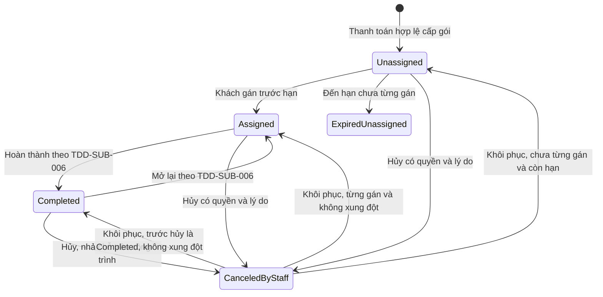
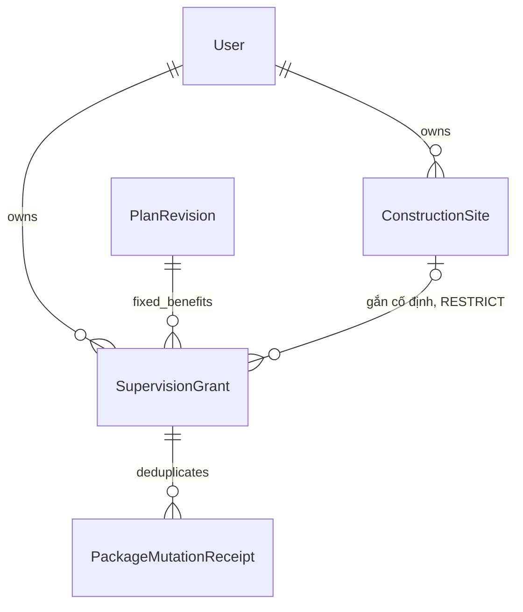

<!-- HƯỚNG DẪN CHO AI KHI ĐIỀN HOẶC CHỈNH SỬA MẪU
- Đọc toàn bộ mẫu, các comment hướng dẫn và tài liệu nguồn được cung cấp trước khi viết. Tuân thủ các quy tắc nghiệp vụ, điều kiện, ngoại lệ và giới hạn đã được xác nhận.
- Không bịa, tự chế hoặc suy đoán thành sự thật: yêu cầu, quy tắc, số liệu, API, schema, mã lỗi, nguồn tham khảo, người phụ trách và kết quả kiểm thử phải có căn cứ. Nội dung ví dụ trong mẫu không phải dữ kiện của dự án.
- Khi thiếu thông tin hoặc các nguồn mâu thuẫn, hỏi người dùng để làm rõ; giữ nguyên placeholder ở phần chưa xác định. Không tự chọn đáp án, lấp chỗ trống hay tuyên bố tài liệu đã hoàn tất.
- Chỉ thay nội dung cần điền hoặc được yêu cầu sửa. Không tự mở rộng phạm vi, sửa nghĩa quy tắc, bỏ điều kiện/ngoại lệ, xoá hay ghi đè nội dung hợp lệ đã có.
- Giữ nguyên tên, cấp và thứ tự heading, nhãn in đậm, tiền tố bullet, cấu trúc danh sách, tên/thứ tự/số cột bảng và cú pháp code fence. Không dịch, đổi tên, gộp hoặc thêm mục ngoài cấu trúc mẫu.
- Chỉ lặp khối luồng, AC hoặc API theo đúng khuôn khi có căn cứ; chỉ bỏ phần tuỳ chọn khi hướng dẫn riêng của mẫu cho phép và đã xác định không áp dụng.
- Mã tham chiếu và section phải trỏ tới tài liệu có thật đã được cung cấp hoặc kiểm chứng. Không giữ mã ví dụ như tham chiếu thật và không tự tạo tài liệu liên quan để hợp thức hoá liên kết.
- Giữ các comment hướng dẫn trong file. Xuất Markdown UTF-8, mỗi file một tài liệu; không bọc toàn bộ file trong code fence, không chèn lời dẫn hay giải thích ngoài mẫu.
- Trước khi bàn giao, đối chiếu nội dung với nguồn, kiểm tra cấu trúc, giá trị cho phép, giới hạn độ dài và tính nhất quán của mã/tham chiếu. Báo rõ phần chưa đủ thông tin; không tuyên bố đã chạy test hoặc import khi chưa thực hiện.
-->

<!-- Thay mã TDD-001 và nội dung ví dụ; giữ nguyên heading và nhãn in đậm.
Sơ đồ dùng mermaid, plantuml hoặc URL. Giữ heading Architecture, Sequence Diagram, Activity Diagram, State Diagram, Data Model.
Ví dụ API phải có heading trùng METHOD /path trong Endpoints. Xoá phần API/sơ đồ không dùng.
Version, Updated At và Change Log do lịch sử phiên bản quản lý, để trống khi nhập mới.
Author/Reviewer là tên hiển thị; gán tài khoản, phê duyệt, giả định và câu hỏi mở trên giao diện sau import.
Thiết kế phải truy vết về Story và Business Rule được cung cấp. Phân biệt thiết kế đề xuất với implementation đã kiểm chứng; không mô tả API/schema/sơ đồ ví dụ như hệ thống thật hoặc tự quyết định nghiệp vụ còn thiếu.
BẮT BUỘC KHI HOÀN THIỆN MẪU: phải có cả Reviewer và Approver, mỗi tên 1–200 ký tự sau khi bỏ khoảng trắng đầu/cuối. Không xoá hai dòng metadata, để trống, dùng tên bịa hoặc giữ placeholder rồi coi là hoàn tất.
Nếu chưa biết người review hoặc người phê duyệt, phải hỏi người dùng và báo tài liệu chưa đủ thông tin; không tự lấy Author/Owner làm người thay thế. Tên trong file không tự gán tài khoản hoặc xác nhận đã duyệt; gán thành viên trên giao diện sau import.
Đây là yêu cầu hoàn thiện mẫu; backend hiện vẫn nhận file cũ thiếu hai trường để tương thích.

VALIDATION CHO FILE NHẬP (đối chiếu ImportSnapshotValidator, MarkdownParser và ImportService):
- Mỗi file .md UTF-8 không rỗng chỉ có một heading cấp 1 chứa mã tài liệu dài 1–100 ký tự. Mã không được trùng trong cùng lần nhập hoặc thuộc loại tài liệu khác đã tồn tại.
- Không dùng tên README.md hoặc sitemap.md vì importer bỏ qua. Giao diện nhận .md/.zip, tối đa 2.000 file, tổng file tải lên 31 MiB; API giới hạn request 32 MiB và tổng nội dung đọc/giải nén 64 MiB.
- Chỉ nhập đè tài liệu cùng loại đang Draft, chưa có phiên bản và chưa lưu trữ. Import thay toàn bộ nội dung bản nháp, vì vậy phải giữ lại nội dung hợp lệ ngoài phần được yêu cầu sửa.
- Không dùng Status trong Markdown hoặc tên Approver để tự xác nhận phê duyệt; import không cấp quyền hay gán tài khoản từ tên. Chạy Kiểm tra file và xử lý lỗi/cảnh báo trước khi nhập.
- Giới hạn độ dài bên dưới tính theo string.Length của .NET (đơn vị UTF-16); không tự cắt ngắn dữ kiện quan trọng để vượt validation, hãy viết lại có căn cứ hoặc hỏi người dùng.
- Feature tối đa 300 ký tự và được dùng làm tiêu đề tài liệu. Status được parser nhận: Draft / In Review / Approved / Deprecated; tài liệu nhập mới vẫn có trạng thái phê duyệt Draft.
- Endpoint: đường dẫn tối đa 500 ký tự; tên/mô tả endpoint được lưu trong Name tối đa 300. HTTP method: GET / POST / PUT / PATCH / DELETE / HEAD / OPTIONS.
- Error Codes: mã tối đa 100 ký tự, không trùng trong tài liệu; giữ dạng - **CODE** (400): mô tả. HTTP status trong Error Codes và Response phải là số nguyên đọc được bằng Int32; không tự đặt status khác hợp đồng API.
- URL sơ đồ tối đa 1.000 ký tự. Mục sơ đồ được sử dụng phải có khối mermaid/plantuml hoặc URL theo mẫu; không để một mục sơ đồ rỗng. Nhãn mục được tách từ bullet như tên External API Fields tối đa 300 ký tự.
- Heading Examples phải khớp METHOD /path ở Endpoints. Giữ các nhãn Request:, Response 200: (thay mã theo contract) và Error Response: để parser tách đúng dữ liệu.
- Tham chiếu dạng DOC-KEY/section: ghi chú: mã đích tối đa 100 ký tự, section tối đa 100, ghi chú tối đa 1.000. Không trùng bộ mã đích + section + loại liên kết trong cùng tài liệu.
ĐỐI CHIẾU FORM TDD (src/features/tdds/validations.ts; form có thể chặt hơn import):
- Điền Feature, Author, Reviewer, Problem và ít nhất một Goal; các Goal/Non-goal/Notes đã thêm không được rỗng. API đã khai báo phải có endpoint và mô tả/mục đích; Fields phải có tên và ý nghĩa; Error Codes phải có mã, HTTP status và điều kiện.
- Form còn kiểm tra Version, Updated At và nội dung Change Log khi khai báo; với file nhập mới, giữ các trường lịch sử này trống theo hợp đồng import, không tự tạo dữ liệu lịch sử.
-->

# TDD-SUB-004

## Document Info

- **Feature**: Gán gói giám sát đã mua vào công trình
- **Author**: Codex
- **Reviewer**: Tân Trần
- **Approver**: Tân Trần
- **Status**: Draft
- **Version**:
- **Updated At**:

## Context & Goals

### Problem

STORY-SUB-004 cho phép mua gói giám sát trước khi có công trình, rồi khách tự gán gói vào một công trình của mình trong một năm. Thiết kế cũ TDD-SUB-003 bắt buộc gắn công trình lúc cấp nên không dùng nguyên bản; tài liệu này thay phần gán của TDD-SUB-003. Cần quản lý hạn gán một năm, quyền sở hữu công trình và giới hạn một gói giữ chỗ mỗi công trình.

Ngày 25/09/2026 người dùng xác nhận **gói đã gắn công trình thì không đổi sang công trình khác, kể cả nhân viên và Admin** (BR-SUB-009, STORY-SUB-004/EXC-07). BR-SUB-023 và mã quyền `supervision.reassign` đã bỏ. Vì vậy thiết kế đổi công trình của bản trước (endpoint `reassign`, lý do đổi, bảng lịch sử đổi) được gỡ khỏi tài liệu này.

**Công trình** là thực thể riêng, khác bản dự toán; khách tự tạo miễn phí theo STORY-SITE-001. Bảng `ConstructionSite`, cổng đọc `IConstructionSiteOwnershipReader` và quy tắc xóa công trình được thiết kế ở [TDD-SITE-001](TDD-SITE-001.md). Tài liệu này chỉ mô tả cách luồng gán gói đọc và khóa công trình.

Hiện trạng code trước và sau đợt thay đổi ngày 25/09/2026:

| Thành phần | Trước ngày 25/09/2026 | Đã đổi ngày 25/09/2026 |
| --- | --- | --- |
| `SupervisionGrant` (`domain/entities`), `SupervisionGrantConfiguration` | Cột `ProjectId` không có khóa ngoại; index `UX_SupervisionGrant_ProjectHolder` lọc `State IN ('Assigned','Completed')`. | Đổi cột thành `ConstructionSiteId`, thêm khóa ngoại ghép tới `ConstructionSite`, đổi tên index. |
| `SupervisionAssignmentEvent` + `SupervisionAssignmentEventConfiguration` | Ghi mỗi lần gán hoặc đổi, có `OldProjectId`, `NewProjectId`, `Reason`, CHECK `CK_SupervisionAssignmentEvent_Reason`. | Bỏ bảng, xem Data Model. |
| `AssignSupervisionGrantCommandHandler`, `SupervisionAssignmentFlow` | Luồng chung cho gán và đổi, nhận `restrictToOwnAccount`, `reason`. | Chỉ còn luồng gán của khách; bỏ tham số dành cho đổi. |
| `ReassignSupervisionGrantCommandHandler`, `SupervisionReassignApi` (`POST /admin/supervision-grants/{id}/reassign`), `ISupervisionPolicy.EnsureCanReassign`, `PackageOperations.Reassign` | Có trong code, policy `supervision.reassign`. | Bỏ hẳn. |
| `IProjectOwnershipReader` + `UnavailableProjectOwnershipReader` | Bản tạm luôn ném 503 `ProjectModuleUnavailable`, nên endpoint gán chưa từng thành công. | Thay bằng `IConstructionSiteOwnershipReader` đọc bảng thật theo TDD-SITE-001; bỏ mã 503. |
| `SupervisionStates.HoldingProject`, `SubscriptionErrorCodes.Project*` | Tên theo "dự án". | Đổi sang tên công trình; bỏ `NoProjectChange`, `ProjectModuleUnavailable`. |

Các migration đã có: `SupervisionGrant`, `SupervisionGrantFirstAssignedWindow`, `SupervisionGrantCompleted`, `SupervisionAssignmentEventReasonNotNull`. Mọi thay đổi ở cột cuối đã có trong code ở commit `182e2a8` trên nhánh `feature/construction-site` của `bmt-be`, cùng migration `20260925074152_ConstructionSiteAndPackageAssignment`. Không quản lý trạng thái khảo sát/giám sát.

### Goals

- Khách tự gán một gói chưa gán cho đúng công trình của mình trước hạn; không phát sinh đơn hoặc thanh toán mới.
- Gói đã gắn công trình giữ nguyên công trình đó suốt vòng đời, kể cả khi hoàn thành, mở lại, bị hủy hoặc được khôi phục.
- Chống hai gói cùng giữ chỗ (`Assigned` hoặc `Completed`) trên một công trình, gán một gói vào công trình của người khác, và gán vào công trình đang bị xóa.

### Non-goals

- Đổi công trình của gói đã gắn, kể cả nhân viên và Admin; gỡ gói về chưa gán; chuyển chủ gói.
- Lịch khảo sát, phân công nhân viên (theo gói, xem [TDD-RBAC-003](TDD-RBAC-003.md)), số lượt kiểm tra hoặc xác nhận công trình đủ điều kiện trước khi mua.
- Tạo, sửa, xóa công trình ([TDD-SITE-001](TDD-SITE-001.md)). Hoàn thành và mở lại gói thuộc [TDD-SUB-006](TDD-SUB-006.md); hủy và khôi phục thuộc [TDD-SUB-005](TDD-SUB-005.md).

## Architecture

**Giải thích kỹ thuật trong luồng gán**

| Kỹ thuật | Áp dụng ở đây | Ví dụ và giới hạn |
| --- | --- | --- |
| Cổng đọc sở hữu công trình | `IConstructionSiteOwnershipReader.LockOwnerAccountIdAsync` (TDD-SITE-001) trả chủ của công trình và khóa dòng công trình trong transaction đang mở. | Client gửi CS1; server đọc chủ CS1 và so với `AccountId` của gói. Không tin `ownerId` do client gửi. |
| Khóa `FOR KEY SHARE` trên công trình | Cổng đọc dòng `ConstructionSite` bằng `SELECT … FOR KEY SHARE`. Khóa này chặn việc xóa dòng đó tới khi transaction gán kết thúc, nhưng không chặn khách sửa tên hay địa chỉ. | Khách đang gán G1 vào CS1 thì yêu cầu xóa CS1 phải chờ; khi gán commit, xóa bị khóa ngoại chặn. Đây cũng là khóa PostgreSQL tự lấy khi kiểm khóa ngoại, nên lấy sớm chỉ đưa thời điểm chờ lên trước. |
| Khóa ngoại ghép theo chủ sở hữu | `(ConstructionSiteId, AccountId)` của gói trỏ tới `(Id, OwnerUserId)` của `ConstructionSite`, `ON DELETE RESTRICT`. | Dù handler có lỗi, database không cho gói của U1 trỏ vào công trình của U2, và không cho xóa công trình còn gói trỏ tới. Công trình không đổi chủ nên khóa này không bao giờ phải cập nhật. |
| Khóa và UNIQUE theo trạng thái | Partial unique index tính các gói giữ chỗ `Assigned` hoặc `Completed` trên một `ConstructionSiteId`. | Hai gói cùng tranh CS1 thì chỉ một gói được gán. Gói `Completed` trên CS1 vẫn chặn gán gói khác. Hủy gói giải phóng chỗ sau commit mà không xóa liên kết. |
| Optimistic concurrency — kiểm phiên bản khách đang xem | `expectedVersion` phải bằng `Version` hiện tại; sau thay đổi tăng `Version`. | Khách xem v1, nhân viên hủy gói lên v2 thì yêu cầu gán theo v1 bị từ chối; client đọc lại. |
| Biên nhận chống gửi lặp | Liên kết gói và `PackageMutationReceipt` ghi cùng transaction. | Gửi lại sau mất phản hồi nhận kết quả đã lưu, không gán lần hai. |
| Thời hạn theo lịch địa phương | Đổi mốc cấp sang giờ Việt Nam, cộng một năm theo lịch rồi đổi về UTC. | Ngày 29/02 sang 28/02 năm không nhuận; không cộng cố định 365 ngày. |
| Trạng thái hiệu lực tính khi đọc | Dựa trên `State`, `FirstAssignedAtUtc` và hạn gán để trả `EffectiveState`. | Gói chưa gán đến hạn bị chặn dù chưa có tác vụ nền cập nhật. |

| Thành phần | Trách nhiệm |
| --- | --- |
| `SupervisionGrantApi` ở `presentation/apis/subscription/` | Đọc gói của khách và gán lần đầu. Không còn module `SupervisionReassignApi`. |
| `AssignSupervisionGrantCommandHandler` | Kiểm sở hữu, khóa, version, hạn; ghi liên kết và biên nhận trong cùng transaction. |
| `ISupervisionPolicy.EnsureCanAssign` (`SupervisionPolicy`) | Hàm thuần kiểm gói `Unassigned`, trước hạn gán và version khớp. |
| `ISupervisionPolicy.ComputeAssignmentDeadline` | Convert UTC→Asia/Ho_Chi_Minh, `AddYears(1)`, giữ giờ/phút/giây, 29/02→28/02 nếu cần, convert về UTC. |
| `IConstructionSiteOwnershipReader` | Định nghĩa và hiện thực theo TDD-SITE-001 (`ConstructionSiteLocks`); dùng cùng `DbContext` và transaction của handler. |
| `IDesignSubscriptionStore.LockAccountAsync` và repository của `IUnitOfWork` | Khóa dòng tài khoản chủ gói; truy vấn, ghi gói và biên nhận. |



**Notes**:

- Dùng transaction pipeline hiện có; lỗi kiểm tra sau khi đã đổi dữ liệu phải ném exception để rollback. Quy ước chung từ TDD-PAY-001.
- Thứ tự khóa: AccountCommerceState của chủ gói → dòng `ConstructionSite` đích (`FOR KEY SHARE`) → `SupervisionGrant` (`FOR UPDATE`) → biên nhận. Cấp, hủy, khôi phục, hoàn thành và mở lại cũng khóa AccountCommerceState nên không chạy xen làm sai liên kết. Xóa công trình theo TDD-SITE-001 chỉ khóa dòng công trình rồi để khóa ngoại kiểm gói tham chiếu, không khóa gói, nên hai chuỗi khóa không tạo vòng chờ.
- Code hiện làm khác thứ tự khóa trên ở hai điểm, nhưng cho cùng kết quả:
  - Khóa tài khoản là khóa dòng `User` của chủ gói (`IDesignSubscriptionStore.LockAccountAsync`, `SELECT ... FOR UPDATE`), vì bảng `AccountCommerceState` của TDD-PAY-001 chưa có. Khi có bảng đó thì đổi sang khóa dòng của bảng đó.
  - Không có câu khóa riêng `FOR UPDATE` trên dòng gói. Sau khi giữ khóa tài khoản, handler đọc lại gói có theo dõi thay đổi (`FindByIdAsync`). Cách này tương đương vì mọi luồng đổi `State` hoặc cột công trình của gói — gán, hủy, khôi phục, hoàn thành, mở lại — đều khóa tài khoản chủ gói trước khi đọc gói. Khi luồng gán đang giữ khóa tài khoản, không luồng nào khác đổi được gói, nên bản vừa đọc là bản mới nhất và không bị ghi đè lúc commit. Câu `UPDATE` lúc commit tự lấy khóa dòng gói; nếu luồng phân công theo [TDD-RBAC-003](TDD-RBAC-003.md#architecture) đang giữ `FOR SHARE` trên gói thì câu này chờ luồng đó xong. Ví dụ: khách gán G1 đúng lúc nhân viên hủy G1. Bên nào lấy khóa tài khoản trước thì chạy xong trước; bên sau đọc lại G1, thấy version đã tăng và nhận 409.
- Đọc lại gói sau khóa; đối chiếu `expectedVersion`. Sai version trả 409, không tự thay version rồi lặp lại quyết định của người dùng. Idempotency-Key có phạm vi người thao tác + thao tác + gói; cùng yêu cầu gửi lại không sửa lần hai, quyền và sở hữu được kiểm lại trước khi trả kết quả cũ.
- Khách: lấy `AccountId` từ phiên; kiểm gói thuộc khách trước khi lộ dữ liệu; request chỉ có `constructionSiteId` và `expectedVersion`. Tài khoản nhân viên không sở hữu gói theo BR-RBAC-005, nên gọi route `me` chỉ nhận 404 như gói không tồn tại.
- Gán lần đầu: `State = Unassigned`, `FirstAssignedAtUtc = NULL`, `now < AssignmentDeadlineUtc`; công trình thuộc chủ gói và chưa có gói giữ chỗ khác. Ghi `FirstAssignedAtUtc = now`, `ConstructionSiteId` và `State = Assigned`. Đây là mốc đã sử dụng, không gọi thanh toán.
- Gói không ở trạng thái `Unassigned` (đã gán, đã hoàn thành, đang bị hủy) trả 409 `GrantStateConflict`. Đây cũng là kết quả khi khách gọi lại route gán để "đổi" sang công trình khác (STORY-SUB-004/AC-005). Không có route gỡ về chưa gán hay đổi công trình; route cũ `/admin/supervision-grants/{grantId}/reassign` bị bỏ, yêu cầu tới đó nhận 404 của routing (STORY-SUB-004/AC-013).
- Công trình bị xóa giữa lúc handler đọc sở hữu và lúc commit không xảy ra, vì dòng đã bị khóa `FOR KEY SHARE`. Nếu công trình đã bị xóa trước khi handler khóa, cổng đọc trả NULL và handler trả 404 `ConstructionSiteNotFound`. Lỗi khóa ngoại `23503` chỉ còn là lớp chặn cuối; `ConstraintViolationPipelineBehavior`, lớp bao ngoài `TransactionPipelineBehavior`, ánh xạ lỗi này về cùng mã 404. Vi phạm `UX_SupervisionGrant_ConstructionSiteHolder` (`23505`) được ánh xạ về 409 `ConstructionSiteAlreadyHasSupervision` theo cùng cách.
- Chạy đến hạn chỉ làm gói chưa từng gán mất quyền gán. GET tính `EffectiveState = ExpiredUnassigned` khi `now >= deadline`; không cần job đúng giây. Gói đã gán đúng hạn tiếp tục `Assigned` sau hạn. Hủy/khôi phục theo TDD-SUB-005 giữ `FirstAssignedAtUtc`, hạn gán và `ConstructionSiteId`.

## Sequence Diagram



## Activity Diagram



## State Diagram



`ExpiredUnassigned` là trạng thái hiệu lực suy ra từ thời gian, không đòi job cập nhật mới chặn được. Không có chuyển `Assigned → Unassigned`, và không có chuyển nào đổi `ConstructionSiteId` sau lần gán đầu: mọi mũi tên sau `Unassigned → Assigned` giữ nguyên công trình. Hạn một năm không tạo chuyển `Assigned → ExpiredUnassigned`. Điều kiện hoàn thành, mở lại và khôi phục về `Completed` ở [TDD-SUB-006](TDD-SUB-006.md#state-diagram); hủy/khôi phục ở [TDD-SUB-005](TDD-SUB-005.md).

## Data Model

**Ý nghĩa các bảng**

| Bảng | Một dòng đại diện cho gì? | Khi ghi và liên kết |
| --- | --- | --- |
| SupervisionGrant | Một quyền sử dụng gói giám sát khách đã mua; không phải công trình hay lịch khảo sát. | Cấp khi thanh toán hợp lệ, ban đầu `ConstructionSiteId = NULL`. Lần gán đầu ghi công trình và mốc gán; từ đó cột công trình không đổi nữa. Hủy, khôi phục, hoàn thành, mở lại chỉ đổi `State`, `Version` và các cột của tài liệu tương ứng. |
| PackageMutationReceipt | Một kết quả thao tác, dùng để trả lại khi client gửi lại cùng yêu cầu. | Ghi cùng transaction với liên kết; khóa `RequestKey` theo người thao tác/thao tác/gói. Schema chung ở TDD-SUB-005. |
| ConstructionSite | Một công trình của khách, định nghĩa ở [TDD-SITE-001](TDD-SITE-001.md#data-model). | Luồng gán chỉ đọc và khóa `FOR KEY SHARE`; không ghi. Khóa ngoại từ gói bảo đảm cùng chủ và chặn xóa công trình từng có gói. |
| PlanRevision / PaymentFulfillment | Bản gói giám sát đã mua (tên, giá, mô tả dịch vụ đã chốt theo đơn) và dấu vết lần thanh toán đã cấp gói. | Đọc từ danh mục/thanh toán; gán công trình không tạo đơn hay fulfillment mới. |

**Bỏ bảng `SupervisionAssignmentEvent`.** Bảng này sinh ra để giữ lịch sử khi một gói có thể đổi công trình nhiều lần: công trình cũ, công trình mới, ai đổi và lý do. Sau quyết định ngày 25/09/2026, mỗi gói chỉ có đúng một lần gán, do chính chủ gói thực hiện. Mọi thông tin của dòng sự kiện khi đó đều đã có ở chỗ khác:

| Thông tin của dòng sự kiện | Nơi đã có |
| --- | --- |
| Công trình được gán | `SupervisionGrant.ConstructionSiteId`, không bao giờ đổi |
| Thời điểm gán | `SupervisionGrant.FirstAssignedAtUtc` |
| Người gán | Luôn là `SupervisionGrant.AccountId`; biên nhận cũng lưu `ActorId` |
| Version sau khi gán, kết quả trả về | `PackageMutationReceipt.ResultVersion`, `ResultBody` |
| `OldProjectId`, `Reason` | Luôn NULL vì không còn thao tác đổi |

Giữ bảng thì mỗi lần gán ghi cùng một sự thật hai nơi, và code phải giữ hai nơi khớp nhau mà không có lợi ích tra cứu nào thêm. Vì endpoint gán cũ luôn trả 503 do `UnavailableProjectOwnershipReader`, bảng chưa từng có dòng nào ngoài dữ liệu test, nên bỏ bảng không mất lịch sử thật. Trường `eventId` trong phản hồi gán bỏ theo; chưa client nào từng nhận phản hồi gán thành công.

**Dữ liệu lưu trữ minh họa — mua trước, gán sau**

Dữ liệu giả định, trích các cột cần giải thích; G1, G2, G3, U1, U2, SR1, CS1, CS2, CS9, M1 là bí danh UUID, không phải giá trị seed. SR1 là phiên bản gói giám sát trong [TDD-SUB-001](TDD-SUB-001.md#data-model). Mọi giờ lưu là UTC. `Operation = Assign` là giá trị `PackageOperations.Assign` đang có trong code. H1 thay cho `RequestHash` dài 64 ký tự; `ResultBody` chỉ trích các trường cần giải thích.

| Bảng / thời điểm | Các giá trị lưu | Ý nghĩa |
| --- | --- | --- |
| ConstructionSite, trước khi gán | Id=CS1; OwnerUserId=U1; Name=Nhà phố Quận 7. Id=CS2; OwnerUserId=U1; Name=Nhà vườn. Id=CS9; OwnerUserId=U2 | Dữ liệu của TDD-SITE-001, chỉ trích cột cần cho khóa ngoại. |
| SupervisionGrant, vừa cấp | Id=G1; AccountId=U1; RevisionId=SR1; State=Unassigned; ConstructionSiteId=NULL; GrantedAtUtc=2026-09-19T03:00:00Z; AssignmentDeadlineUtc=2027-09-19T03:00:00Z; FirstAssignedAtUtc=NULL; Version=1 | Có gói nhưng chưa dùng cho công trình nào. Hạn là 10:00 ngày 19/09/2027 giờ Việt Nam. Khóa ngoại ghép không xét dòng này vì cột công trình NULL. |
| SupervisionGrant, gán đầu | Id=G1; State=Assigned; ConstructionSiteId=CS1; FirstAssignedAtUtc=2026-10-01T02:00:00Z; Version=2 | Cập nhật cùng dòng; `GrantedAtUtc` và hạn gán không đổi. Cặp (CS1, U1) khớp (Id, OwnerUserId) của CS1. |
| PackageMutationReceipt, gán đầu | Id=M1; ActorId=U1; Operation=Assign; TargetId=G1; RequestKey=assign-g1-1; RequestHash=H1; ResultVersion=2; ResultBody={"grantId":"G1","constructionSiteId":"CS1","state":"Assigned","version":2}; AtUtc=2026-10-01T02:00:00Z | Kết quả yêu cầu gán đầu, dùng để trả lại khi gửi lặp. |
| Hai bảng, khách gửi lại sau mất phản hồi | G1 vẫn ConstructionSiteId=CS1, Version=2; vẫn chỉ có M1 | Khách gửi lại key assign-g1-1 với đúng nội dung cũ (expectedVersion=1). Sau kiểm sở hữu, server đọc M1 và trả kết quả đã lưu; không tăng version, không thêm biên nhận. Cùng key nhưng đổi `constructionSiteId` thì 409 `IdempotencyConflict`. |

Nhánh khách muốn "đổi" công trình: U1 gọi gán G1 vào CS2 với key mới. G1 đang `Assigned` nên handler trả 409 `GrantStateConflict`; G1 vẫn trỏ CS1, không có biên nhận mới. Admin hay nhân viên gửi tới route cũ `/admin/supervision-grants/G1/reassign` nhận 404 vì route không còn (STORY-SUB-004/AC-013).

Nhánh gói đã hoàn thành, nối từ G1 ngay sau lần gán đầu như dữ liệu mẫu của [TDD-SUB-006](TDD-SUB-006.md#data-model): G1 có State=Completed, Version=3 và vẫn giữ chỗ trên CS1. Yêu cầu gán gói G3 khác của U1 vào CS1 bị từ chối với 409 `ConstructionSiteAlreadyHasSupervision`. Không ghi dòng nào.

Nhánh khóa ngoại: nếu một lỗi lập trình cố ghi G1 với ConstructionSiteId=CS9 (công trình của U2), cặp (CS9, U1) không khớp dòng nào của `ConstructionSite(Id, OwnerUserId)`, nên PostgreSQL từ chối bằng lỗi 23503. Nếu U1 xóa CS1 sau khi G1 đã gán (kể cả khi G1 sau đó bị hủy), khóa ngoại `RESTRICT` chặn xóa; TDD-SITE-001 trả 409 `ConstructionSiteInUse`.

Nhánh hết hạn: G2 có cùng hạn nhưng chưa từng gán. Tại `2027-09-19T03:00:00Z`, DB vẫn lưu State=Unassigned và FirstAssignedAtUtc=NULL; kết quả đọc là `EffectiveState = ExpiredUnassigned`, yêu cầu gán bị từ chối với 409 `AssignmentDeadlinePassed`.

Tài liệu này là định nghĩa gốc của `SupervisionGrant`, thay schema cũ của TDD-SUB-003; không tạo bảng giám sát khác cạnh bảng này. Bảng dưới ghi schema đích; mọi thời điểm lưu UTC; khóa ngoại lịch sử `RESTRICT`.

| Bảng | Trường và ràng buộc |
| --- | --- |
| SupervisionGrant | Id uuid PK; AccountId uuid NN FK User; RevisionId uuid NN FK PlanRevision; Kind varchar(16) NN CHECK='Supervision'; ConstructionSiteId uuid NULL; State varchar(24) NN =Unassigned/Assigned/CanceledByStaff/Completed; GrantedAtUtc timestamptz NN; AssignmentDeadlineUtc timestamptz NN; FirstAssignedAtUtc timestamptz NULL; Version bigint NN; CancelEventId uuid NULL; UNIQUE(AccountId,Id); FK(RevisionId,Kind) → UNIQUE(Id,Kind) của PlanRevision; FK `FK_SupervisionGrant_ConstructionSite` (ConstructionSiteId,AccountId) → UNIQUE(Id,OwnerUserId) của ConstructionSite, ON DELETE RESTRICT, MATCH SIMPLE. Giá trị `Completed` và quy tắc hoàn thành/mở lại thuộc [TDD-SUB-006](TDD-SUB-006.md#data-model). |
| PackageMutationReceipt | Schema dùng chung ở TDD-SUB-005; kết quả thao tác gán không phải giao dịch tiền. |

Cột `Kind` lặp lại loại gói và luôn bằng `Supervision`. Khóa ngoại ghép `(RevisionId,Kind)` trỏ tới `UNIQUE(Id,Kind)` của `PlanRevision` mới là phần bắt phiên bản được tham chiếu phải thuộc gói giám sát thật; cùng kỹ thuật [TDD-SUB-001](TDD-SUB-001.md#data-model) dùng cho `PlanOffer`.

Khóa ngoại ghép tới công trình dùng cùng ý tưởng. Nó cần `ConstructionSite` có ràng buộc `UNIQUE(Id, OwnerUserId)` theo TDD-SITE-001. `MATCH SIMPLE` là mặc định của PostgreSQL: khi `ConstructionSiteId` NULL (gói chưa gán), khóa ngoại không kiểm dòng đó. Gói bị hủy vẫn giữ `ConstructionSiteId`, nên công trình từng có gói không xóa được, đúng BR-SITE-002 khoản 4.

CHECK: AssignmentDeadlineUtc > GrantedAtUtc; FirstAssignedAtUtc nếu có phải GrantedAtUtc <= first < deadline. Unassigned đòi ConstructionSiteId và FirstAssignedAtUtc NULL; Assigned hoặc Completed đòi cả hai NOT NULL. CanceledByStaff giữ nguyên liên kết trước hủy, có thể NULL hoặc có công trình; không dùng hủy để xóa FirstAssignedAtUtc.

Partial unique index `UX_SupervisionGrant_ConstructionSiteHolder(ConstructionSiteId) WHERE State IN ('Assigned','Completed')`. Index này bảo đảm mỗi công trình có tối đa một gói giữ chỗ. Gói `Unassigned` có cột công trình NULL nên không bị index xét; gói `CanceledByStaff` nằm ngoài điều kiện nên nhả chỗ ngay sau commit. Mọi chỗ kiểm trong code dùng chung hằng tập giữ chỗ (`SupervisionStates.HoldingConstructionSite`) để không lệch với index.

Index thường `IX_SupervisionGrant_ConstructionSiteId_AccountId(ConstructionSiteId, AccountId)` phục vụ ba việc: PostgreSQL tìm gói tham chiếu khi xóa công trình (không có index thì mỗi lần xóa quét cả bảng), TDD-SITE-001 kiểm "công trình từng có gói", và danh sách công trình kèm gói.



**Notes**:

- Index `(AccountId,GrantedAtUtc DESC,Id)` cho danh sách của khách. Hạn được lưu một lần khi cấp và không tính lại khi hủy hoặc khôi phục.
- Mapping C# `DateTimeOffset` UTC; `ComputeAssignmentDeadline` dùng `TimeZoneInfo` Asia/Ho_Chi_Minh và lịch, không `AddDays(365)`. Policy nhận thời điểm hiện tại làm tham số để test trước/đúng/sau hạn và ngày 29/02; handler lấy `DateTimeOffset.UtcNow`.
- Hai yêu cầu gán cùng version chỉ một lần thành công; khách gửi lại cùng key nhận kết quả đã lưu, không đổi `FirstAssignedAtUtc`.
- Khóa ngoại tới công trình, khóa `FOR KEY SHARE` và index giữ chỗ phải được kiểm bằng PostgreSQL thật; EF InMemory không chứng minh được. Integration test ở `test/bmt-be.integration.tests/SupervisionGrantConstraintTests.cs` và `ConstructionSiteConstraintTests.cs` kiểm các điểm này.

**Migration đã tạo**: `20260925074152_ConstructionSiteAndPackageAssignment`, gộp chung với phần của TDD-SITE-001, TDD-SUB-001, TDD-RBAC-001 và TDD-RBAC-003; thứ tự đầy đủ ở [TDD-SITE-001](TDD-SITE-001.md#data-model).

Database hiện chỉ có dữ liệu dev/test (người dùng xác nhận ngày 25/09/2026). Trong migration gộp, bước kiểm chạy đầu tiên; các bước 2–4 dưới đây chạy sau bước tạo bảng `ConstructionSite`.

| Bước | Việc làm | Kiểm tra / điều kiện dừng |
| --- | --- | --- |
| 1. Kiểm trước | Khối `DO` trong migration kiểm có gói nào có `ProjectId` khác NULL hoặc có dòng `SupervisionAssignmentEvent` không; có thì `RAISE EXCEPTION`. | Bình thường không có dòng nào, vì endpoint gán và đổi cũ luôn trả 503. Nếu có, các dòng đó là dữ liệu test ghi tay, trỏ tới công trình không có thật. Dừng migration; người chạy chọn xóa các gói test đó (kèm biên nhận và sự kiện vòng đời của chúng) hoặc dựng lại database dev. Migration không tự xóa dữ liệu. |
| 2. Bỏ bảng lịch sử đổi | `DROP TABLE "SupervisionAssignmentEvent"` (bỏ luôn CHECK, index và các khóa ngoại của bảng). | Bảng không còn trong `information_schema.tables`. |
| 3. Đổi tên | `ALTER TABLE "SupervisionGrant" RENAME COLUMN "ProjectId" TO "ConstructionSiteId"`; đổi tên index giữ chỗ thành `UX_SupervisionGrant_ConstructionSiteHolder`. EF bỏ và tạo lại `CK_SupervisionGrant_AssignedColumns` vì chuỗi SQL trong model đổi. | Index giữ chỗ vẫn có điều kiện `State IN ('Assigned','Completed')`. |
| 4. Thêm index và khóa ngoại | Tạo `IX_SupervisionGrant_ConstructionSiteId_AccountId`; thêm `FK_SupervisionGrant_ConstructionSite` tới `ConstructionSite(Id, OwnerUserId)` với `ON DELETE RESTRICT`. | Bảng nhỏ và cột toàn NULL sau bước 1, nên thêm khóa ngoại trực tiếp; không cần `NOT VALID` rồi `VALIDATE`. Kiểm `pg_constraint` có khóa ngoại với `confdeltype = 'r'`. |

Triển khai cùng lúc code và migration: code cũ đọc `ProjectId` và bảng sự kiện nên không chạy được sau bước 2–3; với môi trường dev/test chấp nhận dừng ngắn. Down migration tạo lại bảng `SupervisionAssignmentEvent` rỗng, đổi tên ngược, bỏ index và khóa ngoại mới; dữ liệu của bảng sự kiện nếu có sẽ không lấy lại được, nên bước 1 phải xác nhận bảng rỗng trước. Việc bỏ mã quyền `supervision.reassign` khỏi bảng `Permission`/`RolePermission` thuộc TDD-RBAC-001.

Đã chạy thử ngày 25/09/2026 trên PostgreSQL: bước kiểm dừng migration khi có gói gắn `ProjectId`; sau `Up`, `pg_constraint` có `FK_SupervisionGrant_ConstructionSite` với `confdeltype = 'r'`; `Down` chạy được. Chưa áp dụng lên môi trường dev dùng chung hay production.

## Internal API

### Endpoints

Từ ngày 25/09/2026 các route dùng tên trường `constructionSiteId`, thay `projectId` trước đó; đây là thay đổi hợp đồng API, client đang dùng phải cập nhật cùng lúc. Mã `ConstructionSiteNotFound` nằm trong `ConstructionSiteErrorCodes`, `ConstructionSiteAlreadyHasSupervision` nằm trong `SubscriptionErrorCodes`; các mã `Project*` của luồng gán và đổi đã bỏ.

- **GET** `/api/v1/me/supervision-grants` — Phiên đã xác minh; chỉ gói của chính khách, gồm chưa gán, quá hạn, bị hủy, đã hoàn thành. PageIndex/PageSize theo PagedResult, sắp `GrantedAtUtc DESC, Id DESC`. Mỗi gói đã gán kèm `constructionSiteId` và tên công trình.
- **GET** `/api/v1/me/supervision-grants/{grantId}` — Đọc gói thuộc khách: revision, `constructionSiteId`, tên công trình, `firstAssignedAtUtc`, `assignmentDeadlineUtc`, `effectiveState` và `version`. `state`/`effectiveState` có thể là `Completed` theo TDD-SUB-006.
- **POST** `/api/v1/me/supervision-grants/{grantId}/assign` — `{constructionSiteId,expectedVersion}`, header Idempotency-Key; chỉ gán lần đầu. Phản hồi gồm `grantId`, `constructionSiteId`, `state`, `version` và `wasAlreadyApplied` (true khi trả lại kết quả của lần gửi trước). Muốn biết `firstAssignedAtUtc` và `assignmentDeadlineUtc`, client gọi GET chi tiết gói.

Không có endpoint đổi công trình. Route `POST /api/v1/admin/supervision-grants/{grantId}/reassign` và policy `supervision.reassign` đã bỏ khỏi code.

### Examples

#### POST /api/v1/me/supervision-grants/{grantId}/assign

```
Request:
Idempotency-Key: 793753ea-0520-4a60-ab2f-dfdbec33c2ba
{"constructionSiteId":"33333333-3333-3333-3333-333333333333","expectedVersion":1}

Response 200:
{"value":{"grantId":"44444444-4444-4444-4444-444444444444","constructionSiteId":"33333333-3333-3333-3333-333333333333","state":"Assigned","version":2,"wasAlreadyApplied":false},"isSuccess":true,"isFailure":false,"error":{"code":"","message":""}}

Error Response:
{"title":"Conflict","code":"Conflict","status":409,"detail":"Công trình này đã có một gói giám sát đang gắn.","messageCode":"ConstructionSiteAlreadyHasSupervision","errors":null}
```

Gọi lại route này cho gói đã gán, với một công trình khác:

```
Error Response:
{"title":"Conflict","code":"Conflict","status":409,"detail":"Gói này không ở trạng thái gán lần đầu.","messageCode":"GrantStateConflict","errors":null}
```

### Error Codes

Mỗi mã dưới đây là giá trị `messageCode` trong thân lỗi; trường `code` chỉ là loại lỗi chung như `Conflict`, `NotFound`.

- **Unauthorized** (401): phiên không hợp lệ.
- **SupervisionGrantNotFound** (404): không có gói trong phạm vi của khách; gói của người khác trả cùng mã.
- **ConstructionSiteNotFound** (404): không thấy công trình, công trình không thuộc chủ gói, hoặc công trình đã bị xóa (kể cả khi lớp cuối là lỗi khóa ngoại 23503).
- **GrantVersionConflict** (409): expectedVersion không khớp.
- **GrantStateConflict** (409): gói không ở trạng thái `Unassigned`, gồm yêu cầu gán lại gói đã gán để đổi công trình.
- **AssignmentDeadlinePassed** (409): now >= hạn gán lần đầu.
- **ConstructionSiteAlreadyHasSupervision** (409): công trình đã có gói giữ chỗ (`Assigned` hoặc `Completed`), kể cả khi lớp chặn là index `UX_SupervisionGrant_ConstructionSiteHolder` (lỗi 23505).
- **IdempotencyConflict** (409): cùng key khác nội dung.
- **AssignmentInputInvalid** (422): thiếu `constructionSiteId` hoặc `expectedVersion`.

Bỏ các mã `NoConstructionSiteChange` (thay `NoProjectChange`) và `ConstructionSiteModuleUnavailable` (thay `ProjectModuleUnavailable`, 503): không còn thao tác đổi và đã có bảng công trình thật.

## References

### User Stories

- STORY-SUB-004
- STORY-SUB-004/AC-001
- STORY-SUB-004/AC-002
- STORY-SUB-004/AC-003
- STORY-SUB-004/AC-004
- STORY-SUB-004/AC-005
- STORY-SUB-004/AC-010
- STORY-SUB-004/AC-011
- STORY-SUB-004/AC-012
- STORY-SUB-004/AC-013
- STORY-SUB-003/AC-012
- STORY-SUB-003/AC-013
- STORY-SITE-001/AC-014
- STORY-SITE-001/AC-015

### Business Rules

- BR-SUB-022/Then
- BR-SUB-006/Then
- BR-SUB-009/Statement
- BR-SUB-009/Except
- BR-SITE-002/Then
- BR-RBAC-005/Then

### Use Cases

- STORY-SUB-004/Main Flow
- STORY-SUB-004/EXC-03
- STORY-SUB-004/EXC-07
- STORY-SUB-003/EXC-06
- STORY-SUB-003/EXC-07

### Others

- [Cấp gói từ thanh toán](TDD-PAY-001.md), [hủy và khôi phục](TDD-SUB-005.md), [hoàn thành và mở lại, trạng thái `Completed`](TDD-SUB-006.md), [công trình và cổng đọc sở hữu](TDD-SITE-001.md), [phân công theo gói](TDD-RBAC-003.md).
- [TDD-SUB-003](TDD-SUB-003.md) là bản cũ đã bị thay; tài liệu này thay phần gán của nó. Không gọi service bên ngoài nên không có External API trong TDD này.
- System Test hiện hành: ST-PAY-024–028, ST-PAY-033, ST-PAY-071 (không ai đổi được công trình), ST-SUB-118, ST-SUB-119 và ST-SITE-020 (xóa công trình đua với gán gói). ST-PAY-029–032 kiểm việc đổi công trình và đã rút khỏi nghiệm thu ngày 25/09/2026. Bảng truy vết đầy đủ ở [discovery](../discovery/payment-technical-design.md).
- STORY-SUB-004 AC-006 đến AC-009 và ALT-02, EXC-04, EXC-05 được ghi "Không nghiệm thu" nên không còn trong tham chiếu.
- Đặc tả Unit Test: UT-PAY-037 đến UT-PAY-042, UT-PAY-044, UT-PAY-046 đến UT-PAY-048, UT-PAY-075 đến UT-PAY-077, UT-SUB-069. UT-PAY-043 và UT-PAY-045 kiểm việc đổi công trình và đã rút khỏi nghiệm thu ngày 25/09/2026. Mã test ở `test/bmt-be.application.tests/usecases/subscription/` (`SupervisionCommandHandlerTests.cs`, `SupervisionPolicyTests.cs`), chạy đạt ngày 25/09/2026 cùng bộ unit 338/338; trong danh sách trên, mới UT-PAY-040, UT-PAY-044, UT-PAY-075, UT-PAY-076 và UT-SUB-069 được ghi mã truy vết trong test.

## Change Log

- 2026-09-25 (đồng bộ code): Đồng bộ với code đã triển khai ở commit `182e2a8`: cột `ConstructionSiteId`, khóa ngoại ghép, bỏ `reassign` và bảng sự kiện, cổng đọc chủ công trình thật đã có. Giải thích hai điểm code làm khác thứ tự khóa (khóa dòng `User` thay `AccountCommerceState`; đọc lại gói sau khóa tài khoản thay `FOR UPDATE`) và vì sao cho cùng kết quả. Thay kế hoạch migration bằng migration gộp đã chạy thử.
- 2026-09-25 (lần 2): Theo quyết định người dùng ngày 25/09/2026, bỏ đổi công trình của gói đã gắn (BR-SUB-023 và `supervision.reassign` bỏ; BR-SUB-009 gắn cố định). Gỡ endpoint `reassign`, handler, policy, lý do đổi, mã `NoConstructionSiteChange`; bỏ bảng `SupervisionAssignmentEvent` và trường `eventId` vì mọi thông tin đã có ở gói và biên nhận. Cổng `IConstructionSiteOwnershipReader` đọc bảng `ConstructionSite` thật theo TDD-SITE-001 với khóa `FOR KEY SHARE`; thêm khóa ngoại ghép `(ConstructionSiteId, AccountId)` `ON DELETE RESTRICT` và index hỗ trợ; bỏ mã 503. Thêm kế hoạch migration có bước kiểm dữ liệu dev/test. Cập nhật truy vết ST-PAY-071, bỏ ST-PAY-029–032.
- 2026-09-25: Cập nhật theo nghiệp vụ đã chốt ngày 25/09/2026. Gói giám sát gắn với công trình (`ConstructionSite`), thực thể riêng khác bản dự toán và chưa có đặc tả; đổi "dự án"/`ProjectId`/`IProjectOwnershipReader`/mã lỗi `Project*` sang tên công trình dự kiến, ghi rõ tên hiện có trong code. Kiểm chỗ trống và partial unique index tính cả gói `Completed` (tập giữ chỗ `Assigned`/`Completed`); bổ sung `Completed` vào State, CHECK và State Diagram, đổi công trình của gói `Completed` bị từ chối. Bỏ Non-goal "luồng hoàn thành lịch sử" và ghi chú ánh xạ `Completed` cũ vì database chỉ có dữ liệu dev/test; migration chỉ đổi tên. Bỏ khóa bản ghi quyền của người thao tác khỏi thứ tự khóa. Dữ liệu mẫu dùng `SR1`, `CS1`, `CS2`. Bổ sung tham chiếu AC của STORY-SUB-004 và STORY-SUB-003/AC-012, AC-013.
- 2026-09-24: Cập nhật Internal API cho khớp code: mã lỗi 503 đổi thành `ProjectModuleUnavailable`; ví dụ phản hồi gán và sửa dự án thêm `eventId`, `wasAlreadyApplied` và bỏ hai mốc thời gian (đọc qua GET chi tiết gói). Nghiệp vụ không đổi.
- 2026-09-20: Đổi nguồn quyền từ `IStaffPermissionReader` sang policy theo mã quyền của [TDD-RBAC-001](TDD-RBAC-001.md). Mã `supervision.reassign` giữ nguyên tên và nghiệp vụ sửa liên kết gói – dự án không đổi.
