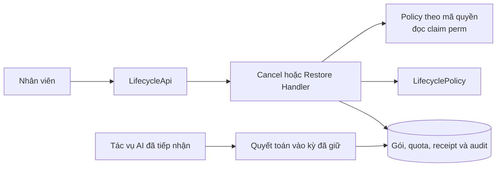
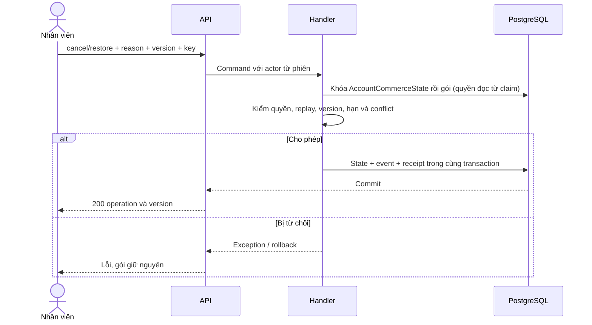
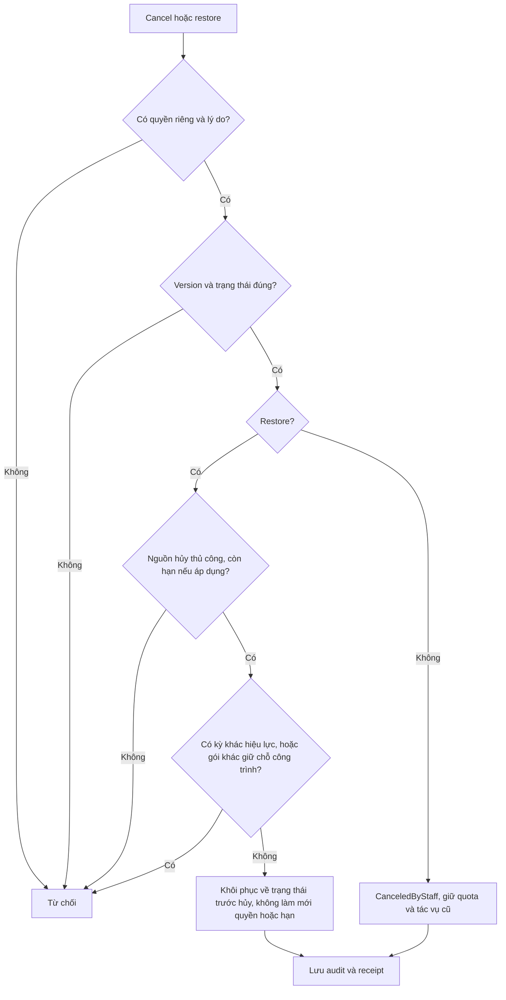
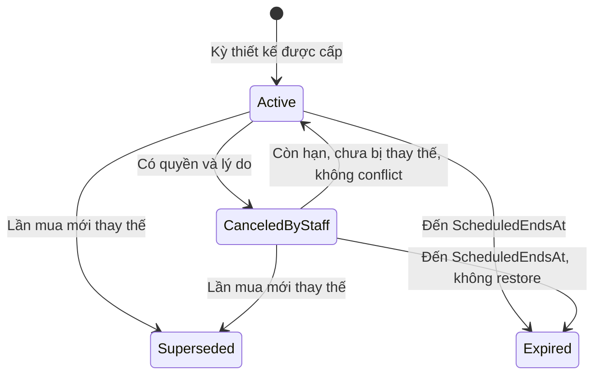
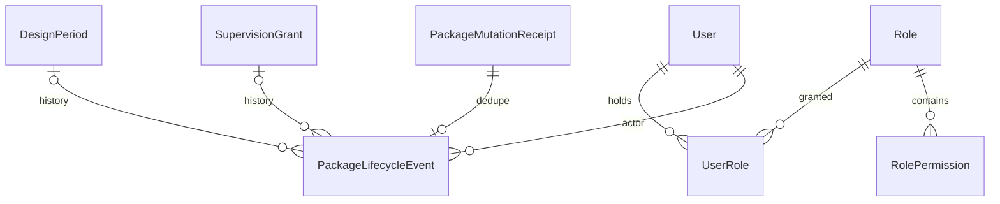

<!-- HƯỚNG DẪN CHO AI KHI ĐIỀN HOẶC CHỈNH SỬA MẪU
- Đọc toàn bộ mẫu, các comment hướng dẫn và tài liệu nguồn được cung cấp trước khi viết. Tuân thủ các quy tắc nghiệp vụ, điều kiện, ngoại lệ và giới hạn đã được xác nhận.
- Không bịa, tự chế hoặc suy đoán thành sự thật: yêu cầu, quy tắc, số liệu, API, schema, mã lỗi, nguồn tham khảo, người phụ trách và kết quả kiểm thử phải có căn cứ. Nội dung ví dụ trong mẫu không phải dữ kiện của dự án.
- Khi thiếu thông tin hoặc các nguồn mâu thuẫn, hỏi người dùng để làm rõ; giữ nguyên placeholder ở phần chưa xác định. Không tự chọn đáp án, lấp chỗ trống hay tuyên bố tài liệu đã hoàn tất.
- Chỉ thay nội dung cần điền hoặc được yêu cầu sửa. Không tự mở rộng phạm vi, sửa nghĩa quy tắc, bỏ điều kiện/ngoại lệ, xoá hay ghi đè nội dung hợp lệ đã có.
- Giữ nguyên tên, cấp và thứ tự heading, nhãn in đậm, tiền tố bullet, cấu trúc danh sách, tên/thứ tự/số cột bảng và cú pháp code fence. Không dịch, đổi tên, gộp hoặc thêm mục ngoài cấu trúc mẫu.
- Chỉ lặp khối luồng, AC hoặc API theo đúng khuôn khi có căn cứ; chỉ bỏ phần tuỳ chọn khi hướng dẫn riêng của mẫu cho phép và đã xác định không áp dụng.
- Mã tham chiếu và section phải trỏ tới tài liệu có thật đã được cung cấp hoặc kiểm chứng. Không giữ mã ví dụ như tham chiếu thật và không tự tạo tài liệu liên quan để hợp thức hoá liên kết.
- Giữ các comment hướng dẫn trong file. Xuất Markdown UTF-8, mỗi file một tài liệu; không bọc toàn bộ file trong code fence, không chèn lời dẫn hay giải thích ngoài mẫu.
- Trước khi bàn giao, đối chiếu nội dung với nguồn, kiểm tra cấu trúc, giá trị cho phép, giới hạn độ dài và tính nhất quán của mã/tham chiếu. Báo rõ phần chưa đủ thông tin; không tuyên bố đã chạy test hoặc import khi chưa thực hiện.
-->

<!-- Thay mã TDD-001 và nội dung ví dụ; giữ nguyên heading và nhãn in đậm.
Sơ đồ dùng mermaid, plantuml hoặc URL. Giữ heading Architecture, Sequence Diagram, Activity Diagram, State Diagram, Data Model.
Ví dụ API phải có heading trùng METHOD /path trong Endpoints. Xoá phần API/sơ đồ không dùng.
Version, Updated At và Change Log do lịch sử phiên bản quản lý, để trống khi nhập mới.
Author/Reviewer là tên hiển thị; gán tài khoản, phê duyệt, giả định và câu hỏi mở trên giao diện sau import.
Thiết kế phải truy vết về Story và Business Rule được cung cấp. Phân biệt thiết kế đề xuất với implementation đã kiểm chứng; không mô tả API/schema/sơ đồ ví dụ như hệ thống thật hoặc tự quyết định nghiệp vụ còn thiếu.
BẮT BUỘC KHI HOÀN THIỆN MẪU: phải có cả Reviewer và Approver, mỗi tên 1–200 ký tự sau khi bỏ khoảng trắng đầu/cuối. Không xoá hai dòng metadata, để trống, dùng tên bịa hoặc giữ placeholder rồi coi là hoàn tất.
Nếu chưa biết người review hoặc người phê duyệt, phải hỏi người dùng và báo tài liệu chưa đủ thông tin; không tự lấy Author/Owner làm người thay thế. Tên trong file không tự gán tài khoản hoặc xác nhận đã duyệt; gán thành viên trên giao diện sau import.
Đây là yêu cầu hoàn thiện mẫu; backend hiện vẫn nhận file cũ thiếu hai trường để tương thích.

VALIDATION CHO FILE NHẬP (đối chiếu ImportSnapshotValidator, MarkdownParser và ImportService):
- Mỗi file .md UTF-8 không rỗng chỉ có một heading cấp 1 chứa mã tài liệu dài 1–100 ký tự. Mã không được trùng trong cùng lần nhập hoặc thuộc loại tài liệu khác đã tồn tại.
- Không dùng tên README.md hoặc sitemap.md vì importer bỏ qua. Giao diện nhận .md/.zip, tối đa 2.000 file, tổng file tải lên 31 MiB; API giới hạn request 32 MiB và tổng nội dung đọc/giải nén 64 MiB.
- Chỉ nhập đè tài liệu cùng loại đang Draft, chưa có phiên bản và chưa lưu trữ. Import thay toàn bộ nội dung bản nháp, vì vậy phải giữ lại nội dung hợp lệ ngoài phần được yêu cầu sửa.
- Không dùng Status trong Markdown hoặc tên Approver để tự xác nhận phê duyệt; import không cấp quyền hay gán tài khoản từ tên. Chạy Kiểm tra file và xử lý lỗi/cảnh báo trước khi nhập.
- Giới hạn độ dài bên dưới tính theo string.Length của .NET (đơn vị UTF-16); không tự cắt ngắn dữ kiện quan trọng để vượt validation, hãy viết lại có căn cứ hoặc hỏi người dùng.
- Feature tối đa 300 ký tự và được dùng làm tiêu đề tài liệu. Status được parser nhận: Draft / In Review / Approved / Deprecated; tài liệu nhập mới vẫn có trạng thái phê duyệt Draft.
- Endpoint: đường dẫn tối đa 500 ký tự; tên/mô tả endpoint được lưu trong Name tối đa 300. HTTP method: GET / POST / PUT / PATCH / DELETE / HEAD / OPTIONS.
- Error Codes: mã tối đa 100 ký tự, không trùng trong tài liệu; giữ dạng - **CODE** (400): mô tả. HTTP status trong Error Codes và Response phải là số nguyên đọc được bằng Int32; không tự đặt status khác hợp đồng API.
- URL sơ đồ tối đa 1.000 ký tự. Mục sơ đồ được sử dụng phải có khối mermaid/plantuml hoặc URL theo mẫu; không để một mục sơ đồ rỗng. Nhãn mục được tách từ bullet như tên External API Fields tối đa 300 ký tự.
- Heading Examples phải khớp METHOD /path ở Endpoints. Giữ các nhãn Request:, Response 200: (thay mã theo contract) và Error Response: để parser tách đúng dữ liệu.
- Tham chiếu dạng DOC-KEY/section: ghi chú: mã đích tối đa 100 ký tự, section tối đa 100, ghi chú tối đa 1.000. Không trùng bộ mã đích + section + loại liên kết trong cùng tài liệu.
ĐỐI CHIẾU FORM TDD (src/features/tdds/validations.ts; form có thể chặt hơn import):
- Điền Feature, Author, Reviewer, Problem và ít nhất một Goal; các Goal/Non-goal/Notes đã thêm không được rỗng. API đã khai báo phải có endpoint và mô tả/mục đích; Fields phải có tên và ý nghĩa; Error Codes phải có mã, HTTP status và điều kiện.
- Form còn kiểm tra Version, Updated At và nội dung Change Log khi khai báo; với file nhập mới, giữ các trường lịch sử này trống theo hợp đồng import, không tự tạo dữ liệu lịch sử.
-->

# TDD-SUB-005

## Document Info

- **Feature**: Hủy và khôi phục gói với quyền riêng, lịch sử và kiểm soát đồng thời
- **Author**: Codex
- **Reviewer**: Tân Trần
- **Approver**: Tân Trần
- **Status**: Draft
- **Version**:
- **Updated At**:

## Context & Goals

### Problem

STORY-SUB-005 cho nhân viên có quyền riêng hủy/khôi phục gói thiết kế hoặc giám sát, giữ nguyên thời hạn/quyền lợi/lượt và không thực hiện hoàn tiền. Thiết kế cũ chỉ có đóng kỳ khi đổi gói hoặc hoàn thành giám sát, không thể dùng các trạng thái đó thay cho hủy thủ công.

Nguồn quyền nhân viên nay do [TDD-RBAC-001](TDD-RBAC-001.md) cung cấp theo mô hình RBAC chuẩn `User` → `UserRole` → `Role` → `RolePermission` → `Permission`. Bản trước của tài liệu này tự định nghĩa `StaffAccessProfile` và `StaffPermission` gán quyền thẳng cho từng người; mô hình đó đã bị thay. Các mã quyền giữ nguyên tên, chỉ đổi chỗ gắn quyền từ người sang vai trò; riêng `supervision.reassign` đã bỏ ngày 25/09/2026 cùng thao tác đổi công trình (BR-SUB-009). Vẫn giữ nguyên tắc không suy ra nhân viên từ việc tài khoản có vai trò khác Khách hàng; tư cách nhân viên nay xác định bằng `User.AccountKind = 'Staff'`. Khi soạn bản đầu, tất cả entity/handler được nêu dưới đây là phần dự kiến.

Hiện trạng code đã kiểm tra ngày 25/09/2026: đã có migration `PackageLifecycle`, `CancelPackageCommandHandler`, `RestorePackageCommandHandler` và `PackageLifecyclePolicy`. Hủy gói giám sát nhận mọi trạng thái trừ `CanceledByStaff`; khôi phục đọc `FromState` của sự kiện hủy và kiểm chỗ theo tập giữ chỗ `Assigned`/`Completed`. Các thao tác vẫn khóa dòng `User` qua `LockAccountAsync`, vì bảng `AccountCommerceState` chưa có. Gói giám sát gắn với công trình (`ConstructionSite`), thực thể riêng khác bản dự toán. Từ commit `182e2a8` ngày 25/09/2026 trên nhánh `feature/construction-site` của `bmt-be`, code dùng cột `ConstructionSiteId` và index `UX_SupervisionGrant_ConstructionSiteHolder` theo [TDD-SUB-004](TDD-SUB-004.md); khi hai lần khôi phục song song cùng vượt bước kiểm chỗ, `ConstraintViolationPipelineBehavior` đổi vi phạm index thành 409 `AnotherPackageActive`.

### Goals

- Quyền hủy và restore độc lập với quyền xem; bắt buộc lý do và lưu audit cùng thay đổi. Hai quyền này không gắn phân công (BR-RBAC-010 khoản 4).
- Hủy và khôi phục gói giám sát không đụng tới phân công của gói: người đang phụ trách vẫn phụ trách (BR-SUB-024 và BR-SUB-025 khoản 7).
- Không có hai gói thiết kế hiệu lực trên account hoặc hai gói giám sát giữ chỗ (`Assigned` hoặc `Completed`) trên một công trình sau restore.
- Giữ ScheduledEndsAt, AssignmentDeadline, revision và quota khi restore; tác vụ AI đã tiếp nhận trước hủy tiếp tục theo kỳ cũ.

### Non-goals

- Chuyển tiền, xác nhận đã hoàn tiền, cấp gói thủ công hoặc khôi phục kỳ đã bị lần mua khác thay thế.
- Giao diện quản trị cấp quyền nhân viên đầy đủ; không tự gán quyền cho toàn bộ Admin/nhân viên khi thêm schema.
- Hoàn thành và mở lại gói giám sát (thuộc [TDD-SUB-006](TDD-SUB-006.md)), thay đổi chủ sở hữu công trình hoặc hủy tác vụ AI đã bắt đầu hợp lệ.

## Architecture

**Các kỹ thuật bảo vệ thao tác nhân viên**

| Kỹ thuật | Cách dùng và mục đích | Ví dụ / giới hạn |
| --- | --- | --- |
| Phân quyền theo thao tác | Endpoint gắn policy theo đúng mã quyền; bộ quyền đọc từ claim `perm` trong access token theo [TDD-RBAC-001](TDD-RBAC-001.md#architecture). | Có commerce.read chưa đủ để hủy: hai thao tác gắn hai policy khác nhau. Không có claim tương ứng thì 403, không suy quyền từ tên người dùng hay từ vai trò Admin. |
| Thu hồi quyền có độ trễ, cắt phiên thì tức thì | Thu hồi vai trò chỉ tác động tới phiên đang mở khi access token hết hạn, chậm nhất theo `AccessTokenExpireMin`. Muốn cắt ngay thì buộc đăng xuất hoặc khóa tài khoản, hai thao tác này đổi dấu phiên nên token cũ hỏng lập tức. | Thu hồi quyền hủy gói lúc 10:00 mà token của nhân viên còn hạn tới 10:07 thì trong 7 phút đó họ vẫn hủy được gói. Đây là hành vi đã chốt ở [BR-RBAC-009](../businessrule/BR-RBAC-009.md), không phải lỗi. Cần chặn ngay thì dùng buộc đăng xuất theo [TDD-RBAC-002](TDD-RBAC-002.md). Không hứa thu hồi sẽ hoàn tác một thao tác đã commit. |
| Version và khóa chống xử lý lặp | Version phát hiện màn hình đã cũ; RequestKey/hash nhận diện việc gửi lại cùng thao tác. | Hai lần hủy chủ động là hai yêu cầu khác nhau; gửi lại do mất phản hồi giữ key cũ. Kiểm quyền trước cả khi trả kết quả đã lưu. |
| Audit cùng transaction | Lưu trạng thái, lý do, actor và receipt trong cùng lần commit. | Ghi lý do/lịch sử lỗi thì hủy cũng không thành công. Audit không thực hiện chuyển tiền và không chứng minh đã hoàn tiền ngoài hệ thống. |
| Giữ liên kết lượt đã tiếp nhận | UsageOperation giữ kỳ/quyền/lượt của tác vụ lúc chấp nhận. | J1 hoàn tất vào bộ đếm kỳ P1 dù P1 bị hủy; tác vụ mới phải kiểm lại hiệu lực. Restore không lấy snapshot bộ đếm cũ ghi đè kết quả J1. |
| Lưu trạng thái hiện tại và lịch sử riêng | Kỳ/gói giữ trạng thái hiện tại, PackageLifecycleEvent giữ từng thay đổi. | Restore cập nhật lại Active nhưng vẫn xem được lần hủy trước; không cần suy lịch sử từ trạng thái cuối cùng. |


| Thành phần mới | Trách nhiệm |
| --- | --- |
| PackageLifecycleApi | Endpoint cancel/restore cho type Design/Supervision; actor luôn lấy từ session. |
| CancelPackageHandler / RestorePackageHandler | Khóa AccountCommerceState rồi gói, kiểm version và idempotency, gọi policy, cập nhật audit. Quyền đọc từ claim, không khóa dòng quyền. |
| PackageLifecyclePolicy | Kiểm loại trạng thái, nguồn hủy, thời hạn và xung đột; không gọi chuyển tiền. |
| Policy `package.cancel` và `package.restore` | Hai policy riêng gắn ở endpoint, kiểm claim `perm` do server phát hành khi đăng nhập hoặc làm mới token. Client không tự khai được claim vì token có chữ ký. Định nghĩa policy thuộc [TDD-RBAC-001](TDD-RBAC-001.md#internal-api). |
| PackageMutationReceiptStore | Ghi kết quả thao tác theo key/body để request lặp không đổi gói lần nữa. |
| PackageLifecycleEvent | Audit actor, thời điểm, lý do, trước/sau và version. |



**Notes**:

- Default session policy phải bao gồm verified và không phải reset-password token như JwtExtensions hiện tại. Permission policy mới thêm yêu cầu nghiệp vụ, không thay default bằng policy role yếu hơn. Admin có quyền xem quản trị theo BR-PAY-005; với mutation vẫn yêu cầu quyền riêng được cấp, không auto-bypass chỉ dựa role.
- Tư cách nhân viên xác định bằng `User.AccountKind = 'Staff'` và `User.Status = 'Active'`; quyền xác định bằng các vai trò trong `UserRole`, theo [TDD-RBAC-001](TDD-RBAC-001.md#data-model). Ba mã quyền liên quan: commerce.read, package.cancel, package.restore; mã supervision.reassign đã bỏ ngày 25/09/2026. Quyền được nhúng vào access token lúc phát hành nên handler không truy vấn lại khi xử lý; đổi lại phải chấp nhận độ trễ của [BR-RBAC-009](../businessrule/BR-RBAC-009.md). Cấp và thu hồi vai trò là chức năng của [TDD-RBAC-002](TDD-RBAC-002.md), không thêm API tự cấp quyền trong tính năng thanh toán. Tài khoản chưa được gán vai trò nào thì không có claim `perm` nào và bị từ chối.
- Việc kiểm quyền không còn khóa dòng nào, vì quyền đọc từ token chứ không đọc database. Thứ tự khóa của mutation vì vậy bắt đầu thẳng từ dữ liệu nghiệp vụ: lock AccountCommerceState chủ gói, rồi subscription/grant và audit receipt. Hủy và khôi phục không khóa dòng `ConstructionSite`: gói luôn giữ `ConstructionSiteId`, nên khóa ngoại của [TDD-SUB-004](TDD-SUB-004.md#data-model) đã chặn xóa công trình; xung đột giữ chỗ khi khôi phục do index giữ chỗ chặn, và mọi gói trên một công trình cùng thuộc một khách nên đã xếp hàng qua khóa AccountCommerceState. Hiện trạng code còn khóa dòng `User`; đổi sang AccountCommerceState cùng lúc với các luồng quota theo TDD-SUB-002. Nếu nhân viên khác khách, không khóa toàn bộ User hai bên theo thứ tự tùy ý. Bỏ khóa trên bản ghi quyền cũng bỏ luôn cam kết cũ rằng một lần thu hồi đã commit chắc chắn chặn được yêu cầu kế tiếp; cam kết đó nay thuộc về cơ chế dấu phiên ở [TDD-RBAC-001](TDD-RBAC-001.md#architecture).
- Kiểm quyền/ownership trước replay. Cùng Idempotency-Key + fingerprint trả kết quả thao tác cũ, không thực hiện lại dù trạng thái hiện tại đã đổi; trả operationId/resultVersion và client đọc trạng thái mới bằng GET. Khác hash 409. ExpectedVersion là optimistic concurrency; timeout mất response không tạo audit thứ hai khi retry cùng key.

**Hủy thiết kế**:

1. Chỉ kỳ hiện đang hiệu lực, không phải kỳ Superseded/Expired. Kiểm version và lý do trim không rỗng.
2. Ghi LifecycleState=CanceledByStaff và CancelEventId, giữ StartsAt/ScheduledEndsAt, không dùng ClosedAtUtc (đóng do mua mới) để biểu diễn hủy có thể restore. CurrentPeriodId có thể giữ làm con trỏ lịch sử nhưng mọi yêu cầu mới phải kiểm LifecycleState=Active và thời hạn; không chỉ kiểm pointer.
3. Không sửa Used, Reserved, UsageOperation hoặc revision. Tác vụ Accepted trước hủy tiếp tục theo snapshot/quota đã giữ. Hoàn tất/lỗi/timeout quyết toán vào chính kỳ đó, không làm sống lại kỳ hoặc chuyển quota sang kỳ khác. Quy tắc timeout/kết quả muộn ở TDD-SUB-002 vẫn giữ.
4. Lưu audit và receipt cùng transaction. Nếu ghi audit lỗi, rollback state; không có gói hủy mà không có lý do.

**Hủy giám sát**: Cho Unassigned, Assigned hoặc Completed (BR-SUB-024 khoản 2); ghi CanceledByStaff, giữ ConstructionSiteId và FirstAssignedAt nếu có. Partial unique index chỉ xét tập giữ chỗ `Assigned`/`Completed` ([TDD-SUB-004](TDD-SUB-004.md#data-model)), nên gói vừa hủy nằm ngoài điều kiện và công trình được nhận gói khác sau commit. Ví dụ G1 `Completed` trên CS1 bị hủy thì khách gán được G2 vào CS1 ngay sau đó. Không gỡ liên kết lịch sử hoặc khôi phục tiền. Handler hủy không đọc hay ghi bảng `Assignment`: nếu NV2 đang phụ trách G1 thì phân công đó giữ nguyên (BR-SUB-024 khoản 7, BR-RBAC-013 khoản 9). G2 là gói khác nên cần phân công riêng theo [TDD-RBAC-003](TDD-RBAC-003.md). Gói chưa gán đã quá hạn không trở thành có thể sử dụng chỉ vì có record hủy.

**Khôi phục**:

- Chỉ nguồn CanceledByStaff. Thiết kế đã ClosedAt/Superseded do mua mới không được restore, kể cả gói mua sau bị hủy.
- Thiết kế: now<ScheduledEndsAtUtc, chưa bị một lần mua mới thay thế, không có kỳ hiệu lực khác. Khóa account/subscription và đặt về Active cùng CurrentPeriodId; giữ hạn cũ, quota và counters hiện tại. Không nạp lại counters từ snapshot lúc hủy vì tác vụ cũ có thể đã hoàn tất trong thời gian bị hủy.
- Giám sát: trạng thái đích lấy từ `FromState` của sự kiện hủy mà `CancelEventId` trỏ tới. Gói `Completed` bị hủy thì khôi phục về `Completed` (BR-SUB-025 khoản 5), cùng điều kiện công trình chưa có gói khác giữ chỗ ([TDD-SUB-006](TDD-SUB-006.md#data-model)).
- Giám sát chưa từng gán: now<AssignmentDeadlineUtc, restore Unassigned. Đã gán (`FromState` là `Assigned` hoặc `Completed`): FirstAssignedAt đúng hạn và công trình chưa có gói giữ chỗ khác (`Assigned` hoặc `Completed`); restore về đúng `FromState` dù đã qua một năm. Không tự đổi công trình để né xung đột.
- Giám sát, phân công: handler khôi phục không tạo, sửa hay kết thúc dòng `Assignment` nào. Người phụ trách gói trước khi hủy tiếp tục phụ trách mà không cần giao lại (BR-SUB-025 khoản 7); không có bản ghi nhật ký phân công mới.
- Đổi gói khi kỳ hiện tại bị nhân viên hủy vẫn là lần mua mới: fulfillment đánh dấu kỳ cũ Superseded nếu bị thay thế, không giữ đường restore vào nó. `CanceledByStaff` cần có lịch sử, không ghi đè mất việc từng bị hủy.
- Hệ thống không tự quay về gói trước khi hủy gói mới. Sửa thứ tự do thông tin giao dịch đến muộn không dùng endpoint restore.

**Ánh xạ và ranh giới test**: BR-SUB-024 ở CancelPackageHandler/policy/audit; BR-SUB-025 ở RestorePackageHandler/period-state/deadline/index giữ chỗ trên công trình. UT kiểm điều kiện và side effects dự kiến, ST-PAY-034–046 kiểm luồng, ST-PAY-073 kiểm phân công giữ nguyên qua hủy và khôi phục; các test PostgreSQL phải chứng minh hủy–gán–restore đồng thời, rollback audit và quota settlement chạy qua mốc hủy.

## Sequence Diagram



## Activity Diagram



## State Diagram



Đây là hiệu lực thiết kế. Giám sát dùng sơ đồ TDD-SUB-004; vòng đời đầy đủ gồm `Completed`, hủy gói `Completed` và khôi phục về `Completed` ở [TDD-SUB-006, State Diagram](TDD-SUB-006.md#state-diagram). Expired là trạng thái hiệu lực tính từ thời gian, giữ source hủy/đổi trong audit. Không có mũi tên Superseded→Active qua chức năng khôi phục nhân viên.

## Data Model

**Ý nghĩa các bảng**

| Bảng | Một dòng đại diện cho gì? | Khi ghi và liên kết |
| --- | --- | --- |
| UserRole | Một lần một người đang giữ một vai trò. | Bảng dùng lại, định nghĩa ở [TDD-RBAC-001](TDD-RBAC-001.md#data-model). Thay cho StaffAccessProfile của bản trước: tư cách nhân viên nay đọc ở `User.AccountKind` và `User.Status`, còn quyền đọc qua các vai trò trong bảng này. |
| RolePermission | Một mã quyền được gắn vào một vai trò. | Bảng dùng lại, định nghĩa ở [TDD-RBAC-001](TDD-RBAC-001.md#data-model). Thay cho StaffPermission của bản trước: quyền gắn vào vai trò chứ không gắn thẳng vào người. Quyền xem vẫn không kéo theo quyền hủy hoặc khôi phục, vì đó là ba mã quyền khác nhau. |
| DesignPeriod | Một kỳ thiết kế đã cấp, gồm hạn và trạng thái hiệu lực. | Hủy/khôi phục đổi LifecycleState và Version của kỳ cũ; không tạo kỳ mới. |
| SupervisionGrant | Một gói giám sát đã cấp, cùng công trình và dấu vết gán đầu nếu có. | Hủy/khôi phục thay State của cùng gói, giữ các mốc và liên kết lịch sử. Khôi phục đưa gói về đúng trạng thái trước hủy, kể cả `Completed`. |
| PackageLifecycleEvent | Một lần nhân viên hủy hoặc khôi phục gói có lý do. | Ghi thêm sự kiện theo target và PackageVersion, gồm actor và trạng thái trước/sau; sự kiện cũ không bị ghi đè khi restore. |
| PackageMutationReceipt | Kết quả của một thao tác đã hoàn tất, dùng khi client gửi lại. | Giữ RequestKey, hash và ResultVersion/ResultBody. Không phải giao dịch ngân hàng hoặc bằng chứng đã hoàn tiền. |
| PeriodQuota / UsageOperation | Bộ đếm của một quyền trong kỳ và một lần sử dụng đã được tiếp nhận. | Tái sử dụng TDD-SUB-002. Tác vụ tiếp tục quyết toán vào kỳ đã giữ lượt, dù LifecycleState đã bị hủy. |

**Dữ liệu lưu trữ minh họa — hủy khi AI đang chạy rồi khôi phục**

Đây là dữ liệu giả định, trích cột để giải thích quan hệ; các ký hiệu NV1, U1, P1, L1, M1 là bí danh UUID. Các hash/result body được lược bớt, không phải giá trị hợp lệ để nhập DB. NV1 được cấp riêng cả quyền hủy và khôi phục; P1 thuộc U1, đang trong hạn và không có gói khác thay thế.

| Bảng / thời điểm | Giá trị lưu minh họa | Cách đọc |
| --- | --- | --- |
| User | Id=NV1; AccountKind=Staff; Status=Active; SecurityStamp=S1 | Tài khoản nhân viên đang hoạt động. Chưa kích hoạt hoặc đang bị khóa thì mọi yêu cầu bị từ chối trước khi tới bước kiểm quyền. |
| UserRole | (NV1, R1) với GrantedAtUtc và GrantedBy | NV1 giữ vai trò R1. Quyền của NV1 là hợp quyền các vai trò đang giữ. |
| RolePermission, hai dòng | (R1, package.cancel), (R1, package.restore) | Hai quyền độc lập; vai trò chỉ có dòng cancel thì người giữ nó không được restore. |
| Access token của NV1 | Các claim `perm` gồm package.cancel và package.restore; claim `stamp`=S1 | Ảnh chụp quyền lúc phát hành. Handler đọc claim này, không truy vấn lại `UserRole`. |
| DesignPeriod, trước hủy | Id=P1; LifecycleState=Active; Version=1; CancelEventId=NULL; ClosedAtUtc=NULL | Kỳ còn hiệu lực. Hạn kỳ giữ nguyên trong toàn bộ ví dụ. |
| PeriodQuota, trước hủy | Bộ đếm tạo thiết kế của P1: Used=2; Reserved=1 | Đã dùng 2 lượt; tác vụ J1 đang giữ 1 lượt ở P1. |
| DesignPeriod, sau hủy | Id=P1; LifecycleState=CanceledByStaff; Version=2; CancelEventId=L1; ClosedAtUtc=NULL | Chặn tác vụ mới. Hủy không đóng kỳ vĩnh viễn và không trả lại lượt J1 đang giữ. |
| PackageLifecycleEvent | Id=L1; AccountId=U1; PackageKind=Design; DesignPeriodId=P1; SupervisionGrantId=NULL; Action=Cancel; FromState=Active; ToState=CanceledByStaff; ActorId=NV1; Reason=Hủy theo yêu cầu khách; PackageVersion=2; ReceiptId=M1 | Audit L1 cùng receipt M1 được ghi chung transaction với trạng thái hủy. |
| PackageMutationReceipt | Id=M1; ActorId=NV1; TargetId=P1; RequestKey=cancel-p1-1; ResultVersion=2 | Gửi lại key này trả kết quả thao tác cũ, không hủy thêm lần nữa. |
| PeriodQuota, J1 hoàn tất hợp lệ | Bộ đếm của P1: Used=3; Reserved=0 | Chuyển 1 lượt đang giữ sang đã dùng. P1 vẫn bị hủy, không tự Active vì J1 thành công. |
| DesignPeriod, sau restore | Id=P1; LifecycleState=Active; Version=3; ClosedAtUtc=NULL | Cùng kỳ, cùng hạn, bộ đếm vẫn Used=3 và Reserved=0. Không khôi phục bộ đếm Used=2, Reserved=1 của lúc hủy. |
| PackageLifecycleEvent, dòng mới | Id=L2; DesignPeriodId=P1; Action=Restore; FromState=CanceledByStaff; ToState=Active; ActorId=NV1; Reason=Khôi phục theo yêu cầu khách; PackageVersion=3; ReceiptId=M2 | Tạo L2/M2; giữ L1/M1 để truy lịch sử. Ví dụ không quy định thêm cách dùng con trỏ CancelEventId sau restore. |

Nhánh giám sát dùng cùng cơ chế audit: G1 đang Assigned vào CS1 → hủy thành CanceledByStaff nhưng vẫn giữ ConstructionSiteId=CS1 và FirstAssignedAtUtc. Nếu gói khác đã giữ chỗ trên CS1 (`Assigned` hoặc `Completed`), restore G1 bị từ chối với `AnotherPackageActive`, không xóa gói khác hoặc chuyển G1 sang công trình khác để né xung đột. Dữ liệu mẫu hủy gói `Completed` rồi khôi phục về `Completed` (các dòng L2, L3) nằm ở [TDD-SUB-006](TDD-SUB-006.md#data-model).


| Bảng/thay đổi | Trường và ràng buộc |
| --- | --- |
| UserRole, RolePermission, Permission | Dùng lại nguyên schema ở [TDD-RBAC-001](TDD-RBAC-001.md#data-model). Tài liệu này không định nghĩa lại để tránh hai bản dễ lệch nhau. Các mã quyền của tính năng hủy và khôi phục nằm trong danh mục `Permission`, trong đó không mã nào có `RequiresAssignment = true`. |
| User, các cột liên quan | `AccountKind` và `Status` quyết định tài khoản có phải nhân viên đang hoạt động không; `SecurityStamp` phục vụ cắt phiên. Cả ba định nghĩa ở [TDD-RBAC-001](TDD-RBAC-001.md#data-model). Cột `Role` kiểu chuỗi của bản trước đã bị bỏ, không còn dùng để suy ra quyền. |
| DesignPeriod bổ sung | LifecycleState varchar(24) NN=Active/CanceledByStaff/Superseded; Version bigint NN; CancelEventId uuid NULL. Giữ ClosedAtUtc chỉ cho đóng vì thay thế, không dùng đóng tạm; giữ ScheduledEndsAt và quota cũ. |
| SupervisionGrant bổ sung | CancelEventId uuid NULL, State/Version như TDD-SUB-004 (gồm `Completed` theo TDD-SUB-006). Không xóa ConstructionSiteId/FirstAssignedAt khi hủy. |
| PackageLifecycleEvent | Id uuid PK; AccountId uuid NN; PackageKind varchar(16) NN CHECK=Design/Supervision; DesignPeriodId uuid NULL; SupervisionGrantId uuid NULL; Action varchar(16) NN CHECK=Cancel/Restore; FromState varchar(24) NN; ToState varchar(24) NN; ActorId uuid NN FK User; AtUtc timestamptz NN; Reason text NN CHECK trim length>0; PackageVersion bigint NN; ReceiptId uuid NN UNIQUE FK PackageMutationReceipt. CHECK đúng một target đúng kind, FK ghép target+AccountId; UNIQUE target+PackageVersion qua hai partial index. |
| PackageMutationReceipt | Id uuid PK; ActorId uuid NN FK User; Operation varchar(32) NN; TargetId uuid NN; RequestKey varchar(100) NN; RequestHash char(64) NN; ResultVersion bigint NN; ResultBody jsonb NN; AtUtc timestamptz NN. UNIQUE(ActorId,Operation,TargetId,RequestKey). Danh sách giá trị của Operation chưa được chốt, xem [TDD-SUB-004](TDD-SUB-004.md#data-model); khi chốt phải thêm CHECK giới hạn đúng tập đó như các cột enum khác. Target được kiểm theo operation trong transaction; `TargetId` không phải khóa ngoại, lý do xem đoạn dưới bảng. Bảng audit trỏ ngược bằng `ReceiptId uuid NN UNIQUE FK`. |

**Vì sao `PackageLifecycleEvent` và `PackageMutationReceipt` xử lý target khác nhau**: cả hai đều trỏ tới một kỳ thiết kế hoặc một gói giám sát, nhưng ràng buộc của chúng khác nhau vì mục đích khác nhau.

`PackageLifecycleEvent` là lịch sử, chỉ cần trỏ đúng. Nó dùng hai cột nullable `DesignPeriodId` và `SupervisionGrantId`, kèm CHECK đúng một cột có giá trị và khóa ngoại thật cho từng cột. Database vì vậy tự chặn được sự kiện trỏ tới bản ghi không tồn tại.

`PackageMutationReceipt` thì cần một khóa chống trùng duy nhất `UNIQUE(ActorId,Operation,TargetId,RequestKey)` dùng chung cho mọi loại thao tác. Nếu tách target thành hai cột, khóa duy nhất phải tách theo và không còn một khóa chung để tra khi client gửi lại. Vì vậy `TargetId` giữ nguyên một cột và không có khóa ngoại. Đánh đổi là database không kiểm tra được target có thật; handler phải kiểm trong cùng transaction ghi kết quả, dựa vào `Operation` để biết cần tra bảng nào. Một receipt trỏ tới ID không tồn tại sẽ không bị database từ chối, nên đường ghi duy nhất phải là handler đã kiểm.



**Notes**:

- [TDD-SUB-006](TDD-SUB-006.md#data-model) dùng lại `PackageLifecycleEvent` cho hoàn thành và mở lại gói giám sát: thêm `Action` `Complete`/`Reopen`, chỉ cho `PackageKind = Supervision`, và cho `Reason` NULL riêng với `Complete`.
- Tất cả FK lịch sử RESTRICT; ba khóa ngoại của kỳ thiết kế (`DesignSubscription → User`, `DesignPeriod → DesignSubscription`, `PeriodQuota → DesignPeriod`) từng là CASCADE và đã đổi sang RESTRICT ở migration `PackageHistoryRestrict`; index `(AccountId,AtUtc DESC,Id)` và theo từng target phục vụ tra cứu. `Reason` là cột bắt buộc ở cả hủy và khôi phục. CancelEventId tham chiếu event Cancel đúng target bằng kiểm tra transaction; để DEFERRABLE hoặc lưu event trước set pointer, không mở transaction lồng.
- `LifecycleState=Superseded` cần ClosedAtUtc NOT NULL. Active/CanceledByStaff không có ClosedAtUtc do thay thế. Đã có trong code: migration `PackageHistoryRestrict` (commit `72e7327`) thêm CHECK `CK_DesignPeriod_SupersededClosedAt` bắt hai chiều này khớp nhau; migration dừng với thông báo nêu số dòng nếu dữ liệu cũ vi phạm, không tự sửa dữ liệu. Period đã hết hạn có thể còn trạng thái lưu Active nhưng effective state là Expired; restore luôn kiểm clock trực tiếp.
- Kỳ chỉ dùng khi đúng CurrentPeriodId, LifecycleState Active và trong [StartsAt,ScheduledEndsAt). Partial unique nếu bổ sung cờ current phải được update nguyên tử; con trỏ chung dưới khóa là nguồn xác định hiện hành, không dùng unique với NOW().
- Khi migrate kỳ cũ, phân loại ClosedAt từ nguồn mua thay thế, không coi mọi closed period là nhân viên hủy. Nếu không có bằng chứng lý do thì không tạo CancelEvent giả để cho restore.
- Bộ đếm có thể thay đổi hợp lệ do tác vụ đang chạy. Restore giữ giá trị hiện tại, không hoàn tác các lần sử dụng thành công trong thời gian bị hủy.

## Internal API

### Endpoints

- **POST** `/api/v1/admin/packages/{kind}/{packageId}/cancel` — kind Design/Supervision; verified employee + package.cancel; `{expectedVersion,reason}` và Idempotency-Key.
- **POST** `/api/v1/admin/packages/{kind}/{packageId}/restore` — verified employee + package.restore; cùng dạng input; kiểm nguồn hủy/hạn/conflict.

Quyền commerce.read không bắt buộc để handler mutation xác minh quyền riêng; UI có thể cần quyền đọc để chọn gói. Không cho client truyền actorId hoặc thời điểm hủy. Payload lý do trim không rỗng; đề xuất giới hạn kỹ thuật 2.000 ký tự và key tối đa 100, không tự cắt dữ liệu. API mới phải hỗ trợ chống CSRF/origin cho cookie-auth cùng chính sách triển khai đã xác minh; webhook HMAC không dùng policy cookie này.

### Examples

#### POST /api/v1/admin/packages/{kind}/{packageId}/cancel

```
Request:
Idempotency-Key: 6fe67749-4144-4b89-93d3-00be1fd49505
{"expectedVersion":2,"reason":"Công trình không phù hợp, xử lý theo trao đổi với khách"}

Response 200:
{"value":{"operationId":"77777777-7777-7777-7777-777777777777","state":"CanceledByStaff","resultVersion":3},"isSuccess":true,"isFailure":false,"error":{"code":"","message":""}}

Error Response:
{"title":"Forbidden","code":"Forbidden","status":403,"detail":"Không có quyền hủy gói.","messageCode":"AccessForbidden","errors":null}
```

#### POST /api/v1/admin/packages/{kind}/{packageId}/restore

```
Request:
Idempotency-Key: 7a7acfb6-0668-43b4-9503-5f0e0fba335d
{"expectedVersion":3,"reason":"Hủy nhầm gói, khôi phục theo thông tin khách"}

Response 200:
{"value":{"operationId":"88888888-8888-8888-8888-888888888888","state":"Active","resultVersion":4},"isSuccess":true,"isFailure":false,"error":{"code":"","message":""}}

Error Response:
{"title":"Conflict","code":"Conflict","status":409,"detail":"Đã có gói khác đang hiệu lực.","messageCode":"AnotherPackageActive","errors":null}
```

Active trong ví dụ restore là thiết kế. Giám sát trả trạng thái trước khi hủy: Unassigned, Assigned hoặc Completed. Không trả “đã hoàn tiền” từ cancel.

### Error Codes

- **Unauthorized** (401): phiên không hợp lệ.
- **AccessForbidden** (403): thiếu tư cách nhân viên hoặc quyền riêng.
- **PackageNotFound** (404): gói không tồn tại trong phạm vi được phép.
- **PackageVersionConflict** (409): version cũ.
- **PackageStateConflict** (409): không được cancel/restore trạng thái này.
- **PackageExpired** (409): đã hết kỳ thiết kế hoặc hạn gán lần đầu.
- **PackageSuperseded** (409): gói đã bị lần mua mới thay thế.
- **AnotherPackageActive** (409): tài khoản có kỳ thiết kế khác hiệu lực, hoặc công trình đã có gói giám sát khác giữ chỗ (`Assigned` hoặc `Completed`).
- **IdempotencyConflict** (409): cùng key khác nội dung.
- **PackageMutationInvalid** (422): kind/version/key/lý do không hợp lệ.

## References

### User Stories

- STORY-SUB-005
- STORY-SUB-003/AC-014
- STORY-SUB-003/AC-015

### Business Rules

- BR-SUB-024/Then
- BR-SUB-024/Except
- BR-SUB-025/Then
- BR-SUB-006/Then
- BR-SUB-003/Then
- BR-SUB-016/Then
- BR-RBAC-010/Then
- BR-RBAC-013/Then

### Use Cases

- STORY-SUB-005/Main Flow
- STORY-SUB-003/ALT-04
- STORY-SUB-003/EXC-09
- STORY-RBAC-003/ALT-06

### Others

- [Kỳ và thao tác sử dụng](TDD-SUB-002.md), [giám sát](TDD-SUB-004.md), [hoàn thành và mở lại](TDD-SUB-006.md), [thanh toán](TDD-PAY-001.md), [quản trị](TDD-PAY-002.md).
- Mô hình vai trò và quyền: [TDD-RBAC-001](TDD-RBAC-001.md); cấp và thu hồi vai trò, khóa tài khoản: [TDD-RBAC-002](TDD-RBAC-002.md).
- Hiện trạng mã nguồn: [PermissionNames](../../bmt-be/src/bmt-be.contract/constants/PermissionNames.cs), [RoleCodes](../../bmt-be/src/bmt-be.contract/constants/RoleCodes.cs), [JwtExtensions](../../bmt-be/src/bmt-be.api/dependencyInjection/extensions/JwtExtensions.cs), [DbContext](../../bmt-be/src/bmt-be.persistence/ApplicationDbContext.cs).
- [Bảng truy vết kiểm thử](../discovery/payment-technical-design.md). Không có External API: các thao tác này không gọi ngân hàng hoặc SePay.
- Đặc tả Unit Test: UT-PAY-049 đến UT-PAY-062; UT-PAY-078 và UT-PAY-079 kiểm hủy và khôi phục gói giám sát không đọc hay ghi `Assignment`. Mã test hủy và khôi phục ở `test/bmt-be.application.tests/usecases/subscription/PackageLifecycleTests.cs`, chạy đạt ngày 25/09/2026 cùng bộ unit 338/338, nhưng chưa ghi mã truy vết UT-PAY; chưa đối chiếu từng ca với đặc tả.

## Change Log

- 2026-09-25 (đồng bộ code lần 2): Ghi rõ migration `PackageHistoryRestrict` ở commit `72e7327` đã thêm CHECK `CK_DesignPeriod_SupersededClosedAt` và đổi ba khóa ngoại kỳ thiết kế sang RESTRICT.
- 2026-09-25 (đồng bộ code): Đồng bộ với code đã triển khai ở commit `182e2a8`: cột `ConstructionSiteId` và ánh xạ vi phạm index giữ chỗ khi khôi phục thành `AnotherPackageActive`. Ví dụ lỗi ghi mã nghiệp vụ ở `messageCode`.
- 2026-09-25 (lần 2): Bỏ `supervision.reassign` và thao tác đổi công trình khỏi mô tả quyền (BR-SUB-009). Ghi rõ hủy và khôi phục gói giám sát không đụng tới `Assignment` (BR-SUB-024/025 khoản 7), gói mới trên cùng công trình cần phân công riêng; bỏ bước khóa công trình khỏi thứ tự khóa vì khóa ngoại và index đã bảo vệ. Thêm ST-PAY-073; sửa liên kết mã nguồn `RoleNames` đã bị xóa.
- 2026-09-25: Cập nhật theo nghiệp vụ đã chốt ngày 25/09/2026. Cho hủy gói giám sát `Completed`; partial unique index và kiểm xung đột khi khôi phục tính tập giữ chỗ `Assigned`/`Completed`; phản hồi khôi phục giám sát có thể trả `Completed`. Đổi "dự án"/`ProjectId` sang công trình (`ConstructionSite`). Hoàn thành/mở lại không còn là "luồng lịch sử" mà thuộc TDD-SUB-006. Bỏ bước khóa "profile quyền" khỏi Sequence Diagram cho khớp thứ tự khóa AccountCommerceState. Ghi hiện trạng code. Bổ sung tham chiếu STORY-SUB-003/AC-014, AC-015, ALT-04, EXC-09 và BR-RBAC-010.
- 2026-09-20: Thay mô hình quyền `StaffAccessProfile` và `StaffPermission` bằng mô hình RBAC chuẩn ở [TDD-RBAC-001](TDD-RBAC-001.md). Giữ nguyên bốn mã quyền và toàn bộ nghiệp vụ hủy, khôi phục, audit và chống xử lý lặp. Bỏ khóa `FOR SHARE`/`FOR UPDATE` trên bản ghi quyền; việc chặn tức thì nay do dấu phiên và buộc đăng xuất đảm nhiệm, còn thu hồi vai trò có độ trễ theo [BR-RBAC-009](../businessrule/BR-RBAC-009.md).
